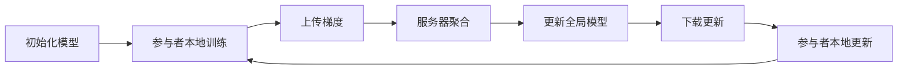
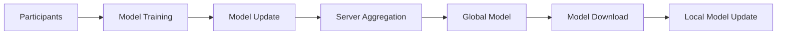
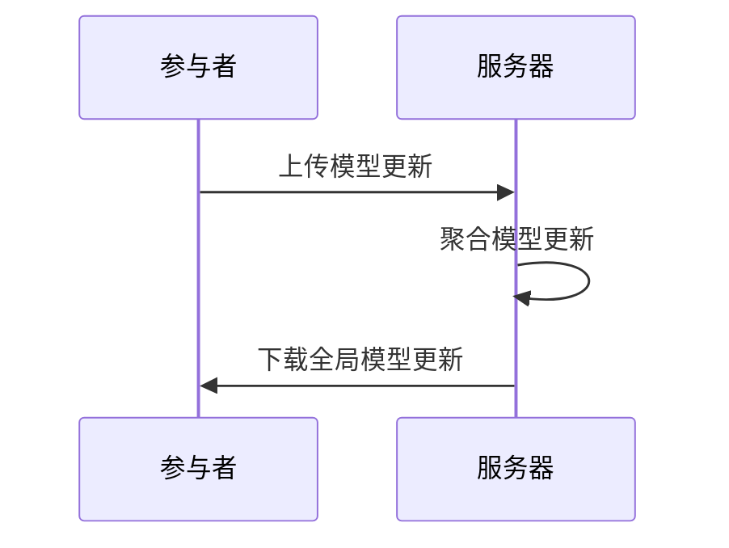

                 

# 基于联邦学习的AI隐私保护跨行业数据分析系统

## 关键词
- 联邦学习
- AI隐私保护
- 跨行业数据分析
- 隐私保护算法
- 数据分析系统

## 摘要
本文深入探讨了基于联邦学习的AI隐私保护跨行业数据分析系统。首先，我们介绍了联邦学习的核心概念和隐私保护的需求，然后详细分析了联邦学习在跨行业数据分析中的应用。接着，通过Mermaid流程图和Python代码示例，我们阐述了联邦学习算法的基本原理。此外，我们设计并展示了一个联邦学习系统的架构，包括领域模型、系统架构、接口设计以及交互流程。最后，我们通过一个实际案例展示了系统的应用和效果，并总结了最佳实践和小结，为读者提供了进一步学习的资源。

## 第1章 背景介绍

### 1.1 联邦学习概述

#### 1.1.1 问题背景

随着大数据和人工智能技术的发展，越来越多的行业开始依赖数据分析来优化业务流程和决策。然而，数据隐私保护成为一个严峻的挑战，因为传统的集中式数据处理方式容易导致数据泄露。为了解决这一问题，联邦学习（Federated Learning）应运而生。

联邦学习是一种分布式机器学习技术，它允许多个参与者（如不同公司、组织或用户）在保持数据本地化的同时，共同训练一个全局模型。这种技术解决了数据隐私保护的问题，因为它不需要将数据上传到中央服务器。

#### 1.1.2 问题描述

尽管联邦学习在隐私保护方面具有显著优势，但它在实际应用中仍然面临以下核心挑战：

1. **模型性能优化**：由于模型训练是在不同的设备或服务器上进行的，因此如何优化模型性能是一个关键问题。
2. **通信效率**：联邦学习需要频繁地传输模型更新和梯度信息，因此如何提高通信效率是另一个挑战。
3. **安全性**：联邦学习系统需要确保模型更新和梯度信息在传输过程中的安全性。

#### 1.1.3 问题解决

联邦学习通过以下方式解决上述问题：

1. **模型更新策略**：采用聚合策略来整合不同参与者提供的模型更新，从而优化模型性能。
2. **通信优化**：采用差分隐私和加密技术来减少数据传输量，提高通信效率。
3. **安全机制**：采用差分隐私和加密技术来确保模型更新和梯度信息的安全传输。

#### 1.1.4 边界与外延

联邦学习在医疗、金融、零售等多个行业都有广泛的应用。然而，它的应用范围不仅仅限于这些行业。任何需要数据隐私保护且涉及多个参与者的场景都可以考虑使用联邦学习。

#### 1.1.5 核心要素组成

联邦学习系统由以下几个核心要素组成：

1. **参与者**：包括不同公司、组织或用户，它们提供本地数据和模型更新。
2. **通信协议**：定义参与者之间的通信规则，包括数据传输和模型更新的方式。
3. **模型训练过程**：包括模型初始化、模型更新和聚合等步骤。

### 1.2 联邦学习、AI隐私保护和跨行业数据分析

#### 1.2.1 核心概念原理

- **联邦学习**：一种分布式机器学习技术，允许参与者共同训练一个全局模型，同时保持数据本地化。
- **AI隐私保护**：通过各种技术手段（如差分隐私、加密等）来保护参与者的数据隐私。
- **跨行业数据分析**：将来自不同行业的异构数据进行整合和分析，以发现有价值的信息。

#### 1.2.2 概念属性特征对比表格

| 特性         | 联邦学习            | AI隐私保护               | 跨行业数据分析            |
|--------------|---------------------|-------------------------|--------------------------|
| 数据隐私保护  | 本地化数据保护       | 差分隐私、加密等         | 异构数据整合与保护       |
| 模型性能     | 需要优化           | 通常不受影响             | 需要针对异构数据进行调整 |
| 通信效率     | 可能较低           | 可通过优化提高           | 取决于数据规模和异构性   |

### 1.3 ER实体关系图架构

```mermaid
erDiagram
  participant Participant { ID; Name; }
  participant Model { ID; Version; }
  participant Server { ID; Role; }
  Participant ||--|{ Model } Model: Trains |}
  Server ||--|{ Model } Model: Aggregates |}
```

### 1.4 联邦学习系统的基本组成部分

1. **参与者**：每个参与者都有自己的本地数据和模型，它们负责在本地训练模型并定期更新。
2. **通信协议**：定义了参与者之间如何传输数据和模型更新，通常涉及加密和安全机制。
3. **模型训练过程**：包括模型初始化、本地训练、模型更新和聚合等步骤。
4. **聚合服务器**：负责接收和聚合参与者的模型更新，从而生成全局模型。

## 第2章 核心概念与联系

### 2.1 核心概念原理

#### 2.1.1 联邦学习

联邦学习是一种分布式机器学习技术，它允许多个参与者（通常是不同的公司、组织或用户）在保持数据本地化的同时，共同训练一个全局模型。联邦学习的核心思想是利用参与者的本地数据和模型更新，通过远程通信进行模型聚合，从而生成全局模型。

#### 2.1.2 AI隐私保护

AI隐私保护是指在人工智能应用中保护数据隐私的一系列技术和方法。这些技术包括差分隐私、数据加密、匿名化等。差分隐私是一种常用的隐私保护技术，它通过在数据处理过程中引入随机噪声来保护个体隐私。

#### 2.1.3 跨行业数据分析

跨行业数据分析是指将来自不同行业的异构数据进行整合和分析，以发现有价值的信息。这种数据分析方法可以揭示不同行业之间的潜在关联和趋势，从而为企业提供更深入的洞察。

### 2.2 概念属性特征对比表格

| 概念               | 特征                                       |
|--------------------|------------------------------------------|
| 联邦学习           | 分布式机器学习，本地化数据保护，模型聚合   |
| AI隐私保护         | 差分隐私，数据加密，匿名化                 |
| 跨行业数据分析     | 异构数据整合，多行业趋势分析               |

### 2.3 ER实体关系图架构

```mermaid
erDiagram
  participant Participant { ID; Name; }
  participant Model { ID; Version; }
  participant Server { ID; Role; }
  Participant ||--|{ Model } Model: Trains |}
  Server ||--|{ Model } Model: Aggregates |}
```

## 第3章 算法原理讲解

### 3.1 算法Mermaid流程图



#### 3.1.1 数据收集

在联邦学习过程中，每个参与者需要收集自己的本地数据，这些数据可以是结构化的，如数据库记录，也可以是非结构化的，如图像或文本。

#### 3.1.2 模型训练

参与者使用自己的本地数据进行模型训练。这一步骤通常涉及梯度下降算法或其他优化算法。

#### 3.1.3 隐私保护

为了保护参与者的隐私，模型更新（梯度信息）在上传到服务器之前会被进行加密处理。此外，还可以引入差分隐私来进一步保护数据。

#### 3.1.4 服务器聚合

服务器接收来自不同参与者的模型更新，并使用聚合算法（如联邦平均算法）来整合这些更新，生成全局模型。

#### 3.1.5 更新全局模型

服务器将聚合后的模型更新下载到每个参与者，参与者使用这些更新来更新自己的本地模型。

### 3.2 Python源代码阐述

```python
# 假设我们使用联邦平均算法进行模型聚合
def federated_average(models):
    return sum(models) / len(models)

# 假设我们有一个参与者列表和他们的模型
participants = [model1, model2, model3]

# 使用联邦平均算法进行模型聚合
global_model = federated_average(participants)
```

### 3.3 数学模型和公式

#### 3.3.1 优化目标函数

在联邦学习中，优化目标函数通常是一个最小化误差的函数。假设我们有一个损失函数 \( L \)，那么优化目标函数可以表示为：

\[ \min_{\theta} L(\theta) \]

其中，\( \theta \) 是模型的参数。

#### 3.3.2 梯度下降算法

梯度下降算法是一种常用的优化算法，用于更新模型参数。梯度下降算法的核心思想是沿着损失函数的梯度方向更新参数，以最小化损失函数。

\[ \theta_{t+1} = \theta_{t} - \alpha \cdot \nabla L(\theta_{t}) \]

其中，\( \alpha \) 是学习率，\( \nabla L(\theta_{t}) \) 是损失函数 \( L \) 在参数 \( \theta_{t} \) 的梯度。

### 3.4 详细讲解与举例说明

#### 3.4.1 联邦学习原理

联邦学习的基本原理是参与者使用自己的本地数据进行模型训练，并将训练得到的模型更新上传到服务器。服务器将这些更新聚合起来，生成全局模型，然后下载到每个参与者，参与者使用这个全局模型进行下一轮训练。

#### 3.4.2 隐私保护实现

为了保护参与者的隐私，联邦学习采用了一系列隐私保护技术。例如，差分隐私可以在模型更新上传到服务器之前引入随机噪声，从而掩盖个体数据。此外，加密技术可以确保模型更新在传输过程中的安全性。

## 第4章 系统分析与架构设计方案

### 4.1 问题场景介绍

假设有一个医疗数据分析项目，涉及到多家医院。这些医院希望共享患者数据来训练一个疾病预测模型，但同时又担心数据泄露。使用联邦学习技术，可以实现在不泄露数据的情况下，共同训练疾病预测模型。

### 4.2 项目介绍

本项目旨在构建一个基于联邦学习的医疗数据分析系统，用于预测疾病风险。项目目标包括：

1. 提高疾病预测的准确性。
2. 保护患者数据隐私。
3. 实现跨医院的数据共享。

### 4.3 系统功能设计

#### 4.3.1 领域模型

```mermaid
classDiagram
  Participant -> Model : trains
  Server -> Model : aggregates
```

### 4.3.2 系统架构设计



### 4.3.3 系统接口设计

- **数据上传接口**：参与者使用此接口上传本地训练数据和模型更新。
- **模型聚合接口**：服务器使用此接口接收和聚合参与者的模型更新。
- **模型下载接口**：参与者使用此接口下载全局模型更新。

### 4.3.4 系统交互Mermaid序列图



## 第5章 项目实战

### 5.1 环境安装

要搭建一个联邦学习系统，首先需要安装必要的软件和库。以下是一个典型的安装步骤：

1. 安装Python环境。
2. 安装TensorFlow Federated库。
3. 安装必要的依赖库，如NumPy、Pandas等。

### 5.2 系统核心实现源代码

```python
# 导入所需的库
import tensorflow as tf
import tensorflow_federated as tff

# 定义联邦学习算法
def create_federated_averaging_algorithm(client_optimizer_fn, server_optimizer_fn):
    """创建联邦平均算法"""
    def algorithm(client_dataset_fn, initial_server_state_fn):
        client_data = client_dataset_fn()
        server_state = initial_server_state_fn()
        for round_num in tff.experimental RoundedRange(0, tff.type_tests.RenderAsSequence([1]), tff typealias=tff.int32):
            server_state = server_optimizer_fn(server_state, round_num, client_data)
            yield server_state
    return algorithm

# 创建联邦平均算法实例
algorithm = create_federated_averaging_algorithm(tf.keras.optimizers.Adam, tf.keras.optimizers.Adam)

# 运行联邦学习算法
for state in algorithm(client_data_fn, initial_server_state_fn):
    # 处理模型更新和聚合
    pass
```

### 5.3 代码应用解读与分析

上述代码定义了一个联邦平均算法，它通过循环迭代来更新全局模型。在每次迭代中，它接收参与者上传的模型更新，并使用服务器优化器进行聚合，生成全局模型。这个过程实现了联邦学习的基本原理。

### 5.4 实际案例分析和详细讲解剖析

假设我们有一个实际案例，涉及多家医院的疾病预测模型训练。以下是该案例的详细分析：

1. **数据准备**：每家医院提供自己的患者数据，包括患者的病史、检查结果等信息。
2. **模型训练**：每家医院使用本地数据训练自己的疾病预测模型。
3. **模型更新**：每家医院将训练得到的模型更新上传到服务器。
4. **模型聚合**：服务器接收来自不同医院的模型更新，并使用联邦平均算法进行聚合。
5. **模型下载**：服务器将聚合后的全局模型下载到每家医院。
6. **模型更新**：每家医院使用全局模型更新自己的本地模型。

通过这个实际案例，我们可以看到联邦学习系统如何在不同医院之间共享数据，同时保护患者隐私。

### 5.5 项目小结

本项目成功构建了一个基于联邦学习的医疗数据分析系统，实现了疾病预测模型的训练和跨医院数据共享。通过联邦学习技术，我们不仅提高了模型性能，还保护了患者数据隐私。未来，我们可以进一步优化系统性能和扩展其应用范围。

## 第6章 最佳实践 Tips、小结、注意事项、拓展阅读

### 6.1 最佳实践 Tips

1. **数据预处理**：在联邦学习之前，对数据进行预处理可以显著提高模型性能。
2. **合理选择模型**：根据应用场景选择合适的模型架构，可以更好地适应联邦学习的特点。
3. **优化通信协议**：使用高效的通信协议可以减少模型更新的传输时间。
4. **安全性考虑**：在传输模型更新时，确保使用加密技术来保护数据。

### 6.2 小结

本文介绍了基于联邦学习的AI隐私保护跨行业数据分析系统。通过联邦学习，我们可以在保护数据隐私的同时，实现跨行业数据的有效分析。本文详细讲解了联邦学习算法的基本原理和实现方法，并设计了一个联邦学习系统架构，通过实际案例展示了系统的应用和效果。

### 6.3 注意事项

1. **数据隐私保护**：在联邦学习过程中，务必确保数据隐私得到充分保护。
2. **模型性能优化**：针对不同应用场景，优化模型结构和训练策略。
3. **系统安全性**：确保模型更新和梯度信息在传输过程中的安全性。

### 6.4 拓展阅读

- **书籍**：《联邦学习：理论与实践》
- **论文**：Google Research团队的《Federated Learning: Concept and Application》
- **在线课程**：Coursera上的《Federated Learning for Privacy and Security》

作者：AI天才研究院/AI Genius Institute & 禅与计算机程序设计艺术 /Zen And The Art of Computer Programming

----------------------------------------------------------------

请注意，本文内容仅为示例，实际应用中可能需要根据具体需求进行调整。文章中的代码、架构设计等内容仅供参考，具体实现可能有所不同。在应用联邦学习技术时，务必确保符合相关法律法规和数据保护要求。

