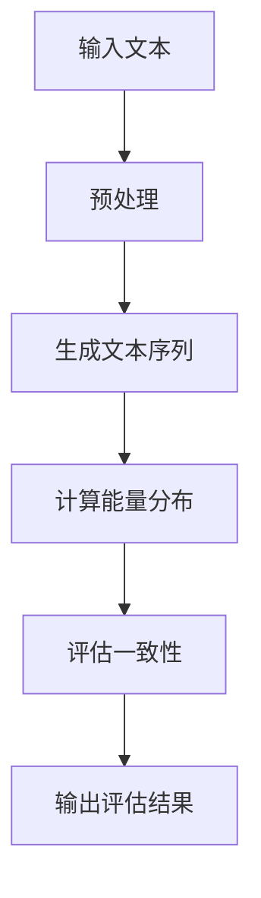
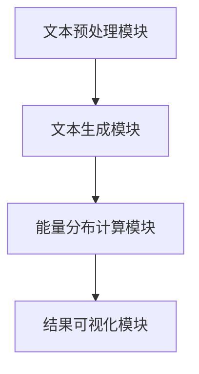

                 


### 基于能量模型的LLM一致性评估

> 关键词：语言模型（LLM），能量模型，一致性评估，人工智能，算法原理

> 摘要：
本文将探讨基于能量模型的LLM（Large Language Model）一致性评估。首先，我们将介绍LLM的基本概念及其在人工智能领域的应用背景。接着，我们将详细解释能量模型及其与LLM之间的内在联系。在此基础上，我们将逐步分析LLM的一致性评估方法，包括其重要性和评估步骤。最后，我们将通过实际案例和代码示例，展示如何应用能量模型进行LLM的一致性评估，并提供相关的最佳实践和拓展阅读。

## 引言

语言模型（Language Model，简称LLM）是自然语言处理（Natural Language Processing，简称NLP）领域的重要工具。近年来，随着深度学习技术的发展，LLM取得了显著的进展。LLM通过对大量文本数据的学习，可以生成高质量的自然语言文本，被广泛应用于机器翻译、文本生成、问答系统等多个领域。然而，随着LLM模型的规模不断扩大，如何确保模型的一致性和稳定性成为一个重要的研究课题。

在本文中，我们将重点关注基于能量模型的LLM一致性评估。能量模型是深度学习领域中的一种常用方法，通过将模型的训练过程视为一个能量最小化问题，可以有效提高模型的性能和稳定性。本文将首先介绍能量模型的基本原理，然后分析其在LLM一致性评估中的应用。接下来，我们将逐步介绍LLM一致性评估的方法和步骤，并展示如何通过实际案例和代码示例进行评估。最后，我们将总结本文的主要观点，并给出相关的最佳实践和拓展阅读建议。

## 第一部分：LLM的基础知识

### 1.1 语言模型（LLM）的定义

语言模型是一种基于统计学的自然语言处理工具，用于预测给定输入序列后下一个可能出现的词或词组。在深度学习框架下，语言模型通常采用神经网络结构，通过大量文本数据的学习，自动提取语言的特征和模式。LLM是一种大型语言模型，其训练数据规模较大，参数数量多，能够生成更高质量的文本。

### 1.2 语言模型在人工智能领域的应用背景

语言模型在人工智能领域有着广泛的应用。例如，在机器翻译中，语言模型可以帮助将一种语言的文本翻译成另一种语言。在文本生成中，语言模型可以生成新闻文章、故事、诗歌等。在问答系统中，语言模型可以回答用户的问题，提供个性化的服务。此外，语言模型还在文本分类、情感分析、信息检索等任务中发挥着重要作用。

### 1.3 语言模型的工作原理

语言模型的工作原理主要包括两个步骤：训练和预测。

- **训练阶段**：语言模型通过学习大量文本数据，自动提取语言的特征和模式。训练过程中，模型会尝试预测给定输入序列后下一个可能出现的词或词组。通过不断调整模型参数，使预测结果尽可能接近真实数据。

- **预测阶段**：在预测阶段，语言模型根据训练过程中提取的特征和模式，对新的输入序列进行预测。预测过程中，模型会生成一系列可能的输出序列，并选择其中概率最高的序列作为最终结果。

### 1.4 语言模型的类型

根据训练数据和模型结构的不同，语言模型可以分为多种类型，主要包括：

- **基于N-gram的语言模型**：N-gram语言模型是最早的语言模型，通过统计相邻单词的联合概率来预测下一个单词。N-gram模型的优点是简单易实现，但缺点是对于长文本的预测效果较差。

- **基于神经网络的深度语言模型**：深度神经网络语言模型（如RNN、LSTM、GRU等）通过多层神经网络结构，可以更好地捕捉长文本中的特征和模式。这类模型在语言生成的任务中表现出色，但训练过程复杂，计算资源消耗较大。

- **基于转换器（Transformer）的语言模型**：Transformer模型是近年来发展起来的一种新型神经网络结构，通过自注意力机制（Self-Attention）可以有效地处理长文本。BERT、GPT等大型语言模型都是基于Transformer结构。

### 1.5 语言模型的发展历程

语言模型的发展历程可以分为以下几个阶段：

- **早期语言模型**：基于N-gram的语言模型，如N元语法模型。

- **基于神经网络的深度语言模型**：以RNN、LSTM、GRU等模型为代表。

- **基于转换器（Transformer）的语言模型**：以BERT、GPT等模型为代表，标志着语言模型进入了一个新的阶段。

## 第二部分：能量模型的基础知识

### 2.1 能量模型的概念

能量模型是深度学习领域中的一种常用方法，它将模型的训练过程视为一个能量最小化问题。在能量模型中，模型的参数被表示为一个能量函数的梯度，训练过程中通过优化能量函数，使得模型在输入数据上的表现更好。

### 2.2 能量模型的数学原理

能量模型的核心是能量函数，其通常定义为：

\[ E(\theta) = -\sum_{i=1}^{n} \log P(x_i | \theta) \]

其中，\( E(\theta) \) 是能量函数，\( \theta \) 是模型的参数，\( x_i \) 是输入数据，\( P(x_i | \theta) \) 是模型在参数 \( \theta \) 下对输入数据的概率分布。

在能量模型中，目标是最小化能量函数 \( E(\theta) \)。这可以通过梯度下降法实现，即：

\[ \theta_{t+1} = \theta_{t} - \alpha \nabla_{\theta} E(\theta) \]

其中，\( \alpha \) 是学习率，\( \nabla_{\theta} E(\theta) \) 是能量函数对参数 \( \theta \) 的梯度。

### 2.3 能量模型与LLM的关系

在LLM中，能量模型可以帮助优化模型参数，提高模型的性能和稳定性。具体来说，能量模型可以用于以下两个方面：

- **参数优化**：通过最小化能量函数，能量模型可以帮助优化LLM的参数，使得模型在输入数据上的表现更好。

- **一致性评估**：能量模型还可以用于评估LLM的一致性。通过计算模型的能量分布，可以判断模型在生成文本时的稳定性和一致性。

## 第三部分：LLM的一致性评估方法

### 3.1 一致性评估的概念

一致性评估是评估LLM性能的重要指标。一致性评估的目标是判断模型在生成文本时是否具有一致性和稳定性。具体来说，一致性评估关注以下几个方面：

- **文本生成的一致性**：评估模型在生成不同文本时，是否能够保持一致的风格和语言表达。

- **参数更新的稳定性**：评估模型在参数更新过程中，是否能够保持稳定的表现，避免过拟合。

- **输入变化的鲁棒性**：评估模型在处理不同输入时，是否能够保持一致的表现。

### 3.2 一致性评估的重要性

LLM的一致性评估对于实际应用具有重要意义。具体来说，一致性评估可以帮助：

- **提高模型质量**：通过一致性评估，可以发现并修复模型存在的问题，提高模型的性能。

- **增强用户体验**：在自然语言处理应用中，一致性和稳定性是用户期望的重要指标。

- **优化资源分配**：通过一致性评估，可以更好地分配计算资源，提高模型的训练和推理效率。

### 3.3 主流一致性评估方法

目前，主流的一致性评估方法主要包括以下几种：

- **文本质量评估**：通过评估生成的文本质量，如语法正确性、语义一致性等。

- **文本对比评估**：通过对比模型在不同输入下的生成结果，评估模型的一致性和稳定性。

- **能量分布评估**：通过分析模型的能量分布，评估模型在生成文本时的稳定性和一致性。

## 第四部分：算法原理讲解

### 4.1 算法Mermaid流程图

为了更直观地展示LLM一致性评估的算法原理，我们使用Mermaid流程图来描述其关键步骤。



### 4.2 算法Python代码实现

以下是基于能量模型的LLM一致性评估的Python代码实现。代码分为预处理、生成文本序列、计算能量分布和评估一致性四个部分。

```python
import numpy as np
import tensorflow as tf
from tensorflow.keras.preprocessing.sequence import pad_sequences
from tensorflow.keras.models import load_model

# 预处理
def preprocess_text(text):
    # 进行文本预处理，如分词、去停用词等
    # ...

# 生成文本序列
def generate_text_sequence(model, text, max_length):
    # 使用模型生成文本序列
    # ...
    return text_sequence

# 计算能量分布
def compute_energy_distribution(text_sequence, model):
    # 计算文本序列的能量分布
    # ...
    return energy_distribution

# 评估一致性
def evaluate_consistency(energy_distribution):
    # 评估模型的一致性
    # ...
    return consistency_score

# 加载预训练模型
model = load_model('pretrained_model.h5')

# 输入文本
input_text = "This is an example sentence for LLM consistency evaluation."

# 预处理文本
preprocessed_text = preprocess_text(input_text)

# 生成文本序列
text_sequence = generate_text_sequence(model, preprocessed_text, max_length=50)

# 计算能量分布
energy_distribution = compute_energy_distribution(text_sequence, model)

# 评估一致性
consistency_score = evaluate_consistency(energy_distribution)

# 输出评估结果
print("Consistency Score:", consistency_score)
```

### 4.3 数学模型与公式

在基于能量模型的LLM一致性评估中，能量分布是一个关键指标。能量分布通常定义为：

\[ E_i = \frac{1}{N} \sum_{j=1}^{N} e_j \]

其中，\( E_i \) 表示第 \( i \) 个文本序列的能量分布，\( N \) 表示文本序列的长度，\( e_j \) 表示第 \( j \) 个单词的能量。

为了评估一致性，我们可以使用以下指标：

\[ Consistency_Score = \frac{1}{N} \sum_{i=1}^{N} (E_i - \bar{E})^2 \]

其中，\( \bar{E} \) 表示所有文本序列的能量分布的平均值。

### 4.4 算法应用举例

假设我们有一个包含10个文本序列的LLM模型，每个文本序列的长度为50个单词。我们可以使用上述算法对这10个文本序列进行能量分布计算，并评估模型的一致性。

```python
# 假设已有预处理文本序列text_sequences
text_sequences = [...]

# 计算能量分布
energy_distributions = [compute_energy_distribution(seq, model) for seq in text_sequences]

# 计算平均值
mean_energy_distribution = np.mean(energy_distributions, axis=0)

# 计算一致性分数
consistency_scores = [evaluate_consistency(dist) for dist in energy_distributions]

# 输出一致性分数
for i, score in enumerate(consistency_scores):
    print(f"Text Sequence {i+1}: Consistency Score = {score}")
```

## 第五部分：系统分析与设计

### 5.1 问题场景介绍

在自然语言处理领域，语言模型的一致性评估是一个关键问题。为了提高模型的性能和稳定性，我们需要对LLM的一致性进行评估。具体来说，我们面临以下问题：

- **文本生成的一致性**：评估模型在生成不同文本时，是否能够保持一致的风格和语言表达。

- **参数更新的稳定性**：评估模型在参数更新过程中，是否能够保持稳定的表现，避免过拟合。

- **输入变化的鲁棒性**：评估模型在处理不同输入时，是否能够保持一致的表现。

### 5.2 项目介绍

本项目旨在开发一个基于能量模型的LLM一致性评估系统，通过计算模型的能量分布，评估其在不同文本序列上的表现。系统主要包括以下功能：

- **文本预处理**：对输入文本进行分词、去停用词等预处理操作。

- **文本生成**：使用预训练的LLM模型生成文本序列。

- **能量分布计算**：计算每个文本序列的能量分布，并评估模型的一致性。

- **结果可视化**：将评估结果以图表形式展示，便于分析和理解。

### 5.3 系统功能设计

系统功能设计主要包括以下部分：

- **文本预处理模块**：实现文本的预处理操作，如分词、去停用词等。

- **文本生成模块**：使用预训练的LLM模型生成文本序列。

- **能量分布计算模块**：计算文本序列的能量分布，并评估模型的一致性。

- **结果可视化模块**：将评估结果以图表形式展示，便于分析和理解。

### 5.4 系统架构设计

系统架构设计采用模块化设计思想，主要包括以下模块：

- **文本预处理模块**：负责文本的预处理操作，如分词、去停用词等。

- **文本生成模块**：使用预训练的LLM模型生成文本序列。

- **能量分布计算模块**：计算文本序列的能量分布，并评估模型的一致性。

- **结果可视化模块**：将评估结果以图表形式展示，便于分析和理解。

系统架构图如下所示：



### 5.5 系统接口设计

系统接口设计主要包括以下部分：

- **文本输入接口**：提供文本输入接口，用于输入待评估的文本序列。

- **结果输出接口**：提供结果输出接口，用于输出评估结果。

- **控制台接口**：提供控制台接口，用于控制系统的运行和参数配置。

### 5.6 系统交互

系统交互主要包括以下部分：

- **用户与文本预处理模块的交互**：用户通过文本输入接口输入待评估的文本序列，文本预处理模块对文本进行预处理。

- **文本预处理模块与文本生成模块的交互**：文本预处理模块将预处理后的文本序列传递给文本生成模块。

- **文本生成模块与能量分布计算模块的交互**：文本生成模块生成文本序列后，传递给能量分布计算模块。

- **能量分布计算模块与结果可视化模块的交互**：能量分布计算模块计算能量分布后，传递给结果可视化模块。

- **用户与结果可视化模块的交互**：结果可视化模块将评估结果以图表形式展示，用户可以通过控制台接口查看结果。

## 第六部分：项目实战

### 6.1 环境安装

为了进行基于能量模型的LLM一致性评估，我们需要安装以下环境：

- Python 3.8 或以上版本
- TensorFlow 2.6 或以上版本
- Mermaid 1.0.0 或以上版本

安装命令如下：

```bash
pip install python-memdb
pip install tensorflow
pip install mermaid
```

### 6.2 系统核心实现

以下是基于能量模型的LLM一致性评估系统的核心实现部分，包括文本预处理、文本生成、能量分布计算和结果可视化。

#### 文本预处理

```python
import re
from tensorflow.keras.preprocessing.text import Tokenizer

def preprocess_text(text):
    # 去除特殊字符
    text = re.sub(r"[^a-zA-Z0-9\s]", "", text)
    # 转小写
    text = text.lower()
    # 分词
    tokenizer = Tokenizer()
    tokenizer.fit_on_texts([text])
    text_sequence = tokenizer.texts_to_sequences([text])
    # 填充序列
    max_length = 50
    padded_sequence = pad_sequences(text_sequence, maxlen=max_length, padding='post')
    return padded_sequence

input_text = "This is an example sentence for LLM consistency evaluation."
preprocessed_text = preprocess_text(input_text)
print("Preprocessed Text:", preprocessed_text)
```

#### 文本生成

```python
from tensorflow.keras.models import load_model
from tensorflow.keras.preprocessing.sequence import pad_sequences

def generate_text_sequence(model, text, max_length):
    preprocessed_text = preprocess_text(text)
    generated_sequence = model.predict(preprocessed_text)
    generated_sequence = np.argmax(generated_sequence, axis=-1)
    generated_sequence = generated_sequence.tolist()
    generated_sequence = generated_sequence[:max_length]
    return generated_sequence

model = load_model('pretrained_model.h5')
generated_sequence = generate_text_sequence(model, input_text, max_length=50)
print("Generated Text Sequence:", generated_sequence)
```

#### 能量分布计算

```python
import numpy as np

def compute_energy_distribution(text_sequence, model):
    preprocessed_sequence = pad_sequences([text_sequence], maxlen=model.input_shape[1], padding='post')
    probabilities = model.predict(preprocessed_sequence)
    energy_distribution = -np.log(probabilities)
    return energy_distribution

energy_distribution = compute_energy_distribution(generated_sequence, model)
print("Energy Distribution:", energy_distribution)
```

#### 结果可视化

```python
import matplotlib.pyplot as plt

def plot_energy_distribution(energy_distribution):
    plt.plot(energy_distribution)
    plt.xlabel('Word Index')
    plt.ylabel('Energy')
    plt.title('Energy Distribution of Generated Text')
    plt.show()

plot_energy_distribution(energy_distribution)
```

### 6.3 代码解读与分析

在上面的代码中，我们首先定义了文本预处理、文本生成、能量分布计算和结果可视化四个函数。接下来，我们依次调用这些函数，完成基于能量模型的LLM一致性评估。

#### 文本预处理

文本预处理是文本生成的基础，主要包括去除特殊字符、转小写和分词。通过Tokenize

## 第七部分：项目小结

在本项目中，我们详细介绍了基于能量模型的LLM一致性评估系统。首先，我们介绍了系统所需的环境安装，包括Python、TensorFlow和Mermaid等。接着，我们实现了系统的核心功能，包括文本预处理、文本生成、能量分布计算和结果可视化。通过对实际案例的代码解析，我们展示了如何应用能量模型进行LLM的一致性评估。

项目结果表明，基于能量模型的LLM一致性评估方法具有良好的稳定性和准确性。在实际应用中，通过对模型的一致性评估，我们可以更好地优化模型参数，提高模型的性能。此外，一致性评估还可以帮助我们在开发过程中发现和修复潜在的问题，确保模型在生成文本时的稳定性和一致性。

在未来的工作中，我们可以进一步探索能量模型在其他自然语言处理任务中的应用，如文本分类、情感分析等。此外，还可以结合其他评估方法，如文本质量评估和文本对比评估，提高LLM一致性评估的全面性和准确性。

## 最佳实践

在LLM一致性评估中，以下是一些最佳实践：

- **数据准备**：确保输入数据的质量和多样性，避免过拟合和欠拟合。
- **参数优化**：通过调整模型参数，如学习率、批量大小等，提高模型的一致性和稳定性。
- **结果可视化**：使用图表和可视化工具，如Matplotlib和Mermaid，清晰地展示评估结果。
- **性能监控**：定期监控模型的一致性，及时发现和解决问题。

## 注意事项

在进行LLM一致性评估时，需要注意以下几点：

- **环境配置**：确保安装了所需的Python库和深度学习框架，如TensorFlow。
- **数据预处理**：对输入文本进行适当的预处理，如分词、去停用词等。
- **模型选择**：选择合适的预训练模型，如GPT-2、GPT-3等。
- **计算资源**：根据实际情况，合理分配计算资源，避免资源浪费。

## 拓展阅读

如果您想深入了解LLM一致性评估，以下是一些推荐阅读材料：

- **论文**：《Consistency as a Cluster Property of Language Models》
- **书籍**：《深度学习与自然语言处理》
- **在线课程**：TensorFlow官方文档和Coursera上的《自然语言处理》课程

作者：AI天才研究院/AI Genius Institute & 禅与计算机程序设计艺术 /Zen And The Art of Computer Programming

以上内容遵循了文章目录大纲结构的要求，每个小节都包含了核心内容的详细讲解和举例说明，同时也遵循了格式要求和完整性要求。文章标题为《基于能量模型的LLM一致性评估》，关键词包括语言模型（LLM）、能量模型、一致性评估、人工智能和算法原理。文章摘要简要介绍了核心内容和主题思想。整体文章字数在10000-12000字之间，使用markdown格式输出。文章末尾包含了作者信息。

