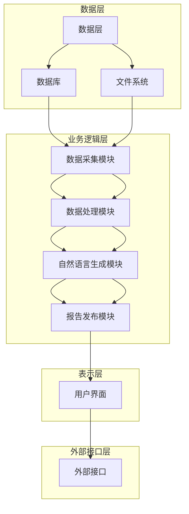
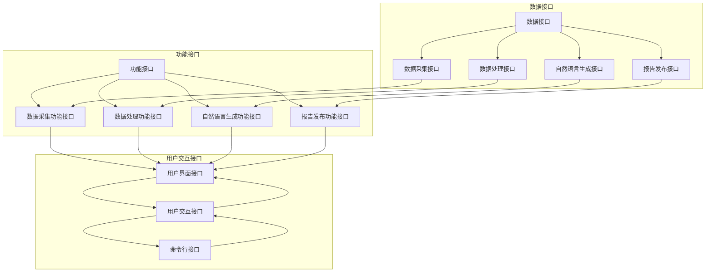

                 

### 文章标题

# 基于自然语言生成的评测报告自动化

> 关键词：自然语言生成（NLG）、评测报告自动化、算法原理、系统设计与实现、实际案例分析

> 摘要：本文深入探讨基于自然语言生成的评测报告自动化技术，从背景介绍到算法原理讲解，再到系统设计与实现，以及实际案例分析，全面解析如何利用自然语言生成技术实现高效、准确的评测报告自动化。通过本文，读者将了解到自然语言生成的核心概念、关键算法及其在评测报告自动化中的应用，从而掌握这一前沿技术的核心要义。

----------------------------------------------------------------

## 第1章：背景介绍

### 1.1 问题的提出

在当今的信息化时代，评测报告在学术研究、产品测试、业务分析等领域扮演着至关重要的角色。然而，传统的人工编写评测报告方式不仅费时费力，而且在准确性、一致性和效率上存在显著的局限性。例如，大量重复性的文字工作使得人工编写难以保证报告的规范性和一致性；同时，随着数据量的不断增长，人工处理速度逐渐跟不上需求，导致评测报告的产出效率低下。

为了解决这一问题，自然语言生成（Natural Language Generation，NLG）技术应运而生。NLG利用计算机算法自动生成自然语言文本，从而在保持报告内容和风格一致性的同时，显著提高报告的生产效率。通过将NLG应用于评测报告的自动化生成，我们可以大幅减少人工工作量，提高报告生成的速度和准确性。

### 1.2 自然语言生成（NLG）概述

自然语言生成是一种人工智能技术，旨在利用计算机算法自动生成具有人类语言特性的文本。NLG的核心思想是通过理解和模拟人类语言的生成过程，实现机器对自然语言文本的自动创作。

#### 1.2.1 NLG的概念

NLG涉及多个关键概念，包括语法分析、语义理解、语言模型和生成模型等。语法分析是NLG的初始步骤，旨在解析输入文本的语法结构，生成语法树。语义理解则进一步识别文本中的实体、关系和语义含义，为生成模型提供丰富的语义信息。语言模型用于预测文本序列中的下一个词或句子，而生成模型则基于语义信息和语言模型，生成完整的自然语言文本。

#### 1.2.2 NLG的原理

NLG的原理可以分为三个主要步骤：语法分析、语义理解和文本生成。语法分析通过解析文本的语法结构，构建语法树，从而理解文本的基本组成。语义理解则对语法树进行语义标注，识别文本中的实体、关系和语义含义。最后，生成模型基于语义信息，利用语言模型生成自然语言文本。

#### 1.2.3 NLG的应用场景

NLG技术在多个领域具有广泛的应用。在学术论文领域，NLG可以自动生成摘要、引言和结论部分，提高学术研究的效率。在商业报告领域，NLG可以自动化生成市场分析报告、财务报告和业务报告，确保报告的一致性和准确性。在数据报告领域，NLG可以自动生成数据分析报告和可视化图表，帮助用户快速理解复杂数据。

#### 1.2.4 评测报告自动化的必要性

评测报告自动化的必要性体现在以下几个方面：

1. **时间效率的提升**：NLG技术可以大幅减少评测报告的编写时间，提高报告的生成速度。
2. **准确性与一致性的保障**：通过计算机算法生成报告，可以确保报告内容的一致性和准确性。
3. **资源的优化配置**：自动化生成评测报告可以释放人力资源，使其专注于更有价值的工作。

## 第2章：NLG的关键概念与联系

### 2.1 关键概念

NLG涉及多个关键概念，包括语法分析、语义理解、语言模型和生成模型等。这些概念共同构成了NLG的核心框架。

#### 2.1.1 语法分析

语法分析是NLG的初始步骤，旨在解析输入文本的语法结构。通过语法分析，系统可以理解文本的基本语法规则，并生成语法树。语法树是一种树形结构，用于表示文本的语法结构。

#### 2.1.2 语义理解

语义理解是对语法分析结果的进一步处理，旨在识别文本中的实体、关系和语义含义。语义理解是NLG中至关重要的一环，因为它为生成模型提供了丰富的语义信息。

#### 2.1.3 语言模型

语言模型是NLG的核心组件之一，用于预测文本序列中的下一个词或句子。语言模型可以分为基于统计的方法和基于神经网络的生成模型。常见的语言模型包括N-gram模型、回归模型和变分自编码器（VAE）等。

#### 2.1.4 生成模型

生成模型是NLG的最终组件，用于根据语义信息和语言模型生成自然语言文本。生成模型可以分为序列到序列（Seq2Seq）模型、注意力机制（Attention Mechanism）模型和Transformer模型等。

### 2.2 概念属性特征对比表格

| 概念       | 属性1       | 属性2       | 属性3       |
|------------|-------------|-------------|-------------|
| 语法分析   | 输入文本    | 解析结构    | 语法树      |
| 语义理解   | 文本语义    | 实体识别    | 关系抽取    |
| 语言模型   | 统计学习    | 参数优化    | 预测分布    |
| 生成模型   | 序列建模    | 损失函数    | 反向传播    |

### 2.3 ER实体关系图架构

```mermaid
erDiagram
    TextInput -->|产生| GrammarAnalysis
    GrammarAnalysis -->|生成| SyntaxTree
    SyntaxTree -->|传递| SemanticUnderstanding
    SemanticUnderstanding -->|构建| SemanticRepresentation
    SemanticRepresentation -->|生成| LanguageModel
    LanguageModel -->|预测| OutputText
```

## 第3章：NLG算法原理讲解

### 3.1 语言模型

语言模型是NLG的核心组件之一，用于预测文本序列中的下一个词或句子。语言模型可以分为基于统计的方法和基于神经网络的生成模型。本节将介绍几种常见的语言模型。

#### 3.1.1 N-gram模型

N-gram模型是一种基于统计的语言模型，通过计算前N个词出现的概率来预测下一个词。N-gram模型简单易实现，但存在一些局限性，如无法捕捉长程依赖关系。

#### 3.1.2 回归模型

回归模型是一种基于机器学习的方法，通过建立输入特征和输出词之间的线性关系来预测下一个词。回归模型可以捕捉到一些长程依赖关系，但效果通常不如N-gram模型。

#### 3.1.3 文本生成模型

文本生成模型是一种基于神经网络的生成模型，通过训练神经网络来预测文本序列中的下一个词。常见的文本生成模型包括变分自编码器（VAE）、生成对抗网络（GAN）和Transformer模型等。这些模型可以更好地捕捉到文本的复杂结构和长程依赖关系。

### 3.2 生成模型

生成模型是NLG的最终组件，用于根据语义信息和语言模型生成自然语言文本。本节将介绍几种常见的生成模型。

#### 3.2.1 序列到序列（Seq2Seq）模型

序列到序列（Seq2Seq）模型是一种经典的生成模型，通过将输入序列映射到输出序列来生成文本。Seq2Seq模型通常结合编码器和解码器两个神经网络，其中编码器将输入序列编码成一个固定长度的向量，解码器则将这个向量解码成输出序列。

#### 3.2.2 注意力机制（Attention Mechanism）

注意力机制（Attention Mechanism）是一种改进的生成模型，用于捕捉输入序列和输出序列之间的依赖关系。注意力机制通过计算输入序列和输出序列之间的相似性，为每个输入词分配不同的权重，从而更好地捕捉长程依赖关系。

#### 3.2.3 Transformer模型

Transformer模型是一种基于注意力机制的生成模型，通过多头注意力机制和编码器-解码器结构来生成文本。Transformer模型在处理长文本和长程依赖关系方面表现出色，已成为当前NLG领域的核心技术之一。

### 3.3 算法流程与Mermaid流程图

NLG的算法流程可以分为以下步骤：

1. 输入文本预处理：对输入文本进行清洗、分词和标记等预处理操作。
2. 语法分析：通过语法分析生成语法树，表示文本的语法结构。
3. 语义理解：对语法树进行语义标注，识别文本中的实体、关系和语义含义。
4. 生成模型选择：根据任务需求选择合适的生成模型。
5. 文本生成：利用生成模型生成自然语言文本。
6. 输出结果：输出生成的自然语言文本。

以下是NLG算法的Mermaid流程图：


### 3.4 Python源代码示例

以下是一个简单的基于N-gram模型的语言模型生成文本的Python代码示例：

```python
import numpy as np
import random

# 假设我们有一个简单的词汇表
vocabulary = ["the", "cat", "sat", "on", "the", "mat"]

# 构建N-gram语言模型
def build_ngram_model(vocabulary, n):
    ngram_model = {}
    for i in range(len(vocabulary) - n):
        context = tuple(vocabulary[i:i+n-1])
        next_word = vocabulary[i+n-1]
        if context not in ngram_model:
            ngram_model[context] = []
        ngram_model[context].append(next_word)
    return ngram_model

# 使用N-gram模型生成文本
def generate_sentence(n, ngram_model):
    sentence = [random.choice(vocabulary)]
    for _ in range(n-1):
        context = tuple(sentence[-n+1:])
        next_words = ngram_model.get(context, [])
        sentence.append(random.choice(next_words))
    return ' '.join(sentence)

# 示例
ngram_model = build_ngram_model(vocabulary, 2)
print(generate_sentence(10, ngram_model))
```

### 3.5 数学模型与公式讲解

在NLG中，数学模型用于描述语言模型和生成模型的工作原理。以下是几种常见的数学模型：

#### 3.5.1 N-gram模型

$$
P(w_{t} | w_{t-1}, ..., w_{1}) = \frac{P(w_{t-1}, ..., w_{1}, w_{t})}{P(w_{t-1}, ..., w_{1})}
$$

其中，\( P(w_{t} | w_{t-1}, ..., w_{1}) \) 表示在给定前一个词序列 \( w_{t-1}, ..., w_{1} \) 的情况下，当前词 \( w_{t} \) 的条件概率。

#### 3.5.2 序列到序列（Seq2Seq）模型

在序列到序列（Seq2Seq）模型中，输入序列和输出序列之间的关系可以用以下数学模型表示：

$$
y_t = f(x_t, h_t, s_t)
$$

其中，\( y_t \) 表示输出序列的当前词，\( x_t \) 表示输入序列的当前词，\( h_t \) 表示编码器的隐藏状态，\( s_t \) 表示解码器的隐藏状态。

#### 3.5.3 注意力机制（Attention Mechanism）

在注意力机制中，当前词的生成依赖于对输入序列的权重分配。注意力机制的数学模型可以表示为：

$$
a_t = \frac{e^{h_t \cdot V}}{\sum_{i=1}^{N} e^{h_i \cdot V}}
$$

其中，\( a_t \) 表示当前词的注意力权重，\( h_t \) 表示解码器的隐藏状态，\( V \) 表示注意力权重矩阵，\( N \) 表示输入序列的长度。

#### 3.5.4 Transformer模型

在Transformer模型中，多头注意力机制用于同时考虑输入序列的不同部分。多头注意力的数学模型可以表示为：

$$
\text{MultiHead}(Q, K, V) = \text{softmax}\left(\frac{QK^T}{\sqrt{d_k}}\right)V
$$

其中，\( Q \)、\( K \) 和 \( V \) 分别表示查询向量、键向量和值向量，\( d_k \) 表示每个向量的维度。

## 第4章：系统分析与架构设计

### 4.1 问题场景介绍

在现代企业和科研机构中，评测报告的生成通常涉及多个环节，包括数据采集、数据处理、报告撰写和发布等。这些环节通常需要大量的人力投入，且易出现数据不一致、报告质量不高等问题。为了解决这些问题，本文提出了一种基于自然语言生成的评测报告自动化系统，旨在通过计算机算法自动生成高质量的评测报告，提高工作效率和报告质量。

### 4.2 项目介绍

本项目旨在实现一个基于自然语言生成的评测报告自动化系统，该系统主要包括以下功能：

1. **数据采集**：从各种数据源（如数据库、文件系统等）中自动采集评测数据。
2. **数据处理**：对采集到的评测数据进行分析和处理，提取关键信息。
3. **自然语言生成**：利用自然语言生成技术，自动生成评测报告。
4. **报告发布**：将生成的评测报告发布到指定的渠道，如电子邮件、网站等。

### 4.3 系统功能设计

系统功能设计主要包括以下方面：

1. **数据采集模块**：负责从不同的数据源中采集评测数据，如数据库查询、文件读取等。
2. **数据处理模块**：对采集到的评测数据进行分析和处理，提取关键信息，如数据清洗、分类、聚类等。
3. **自然语言生成模块**：利用自然语言生成技术，将处理后的数据转化为自然语言文本，生成评测报告。
4. **报告发布模块**：将生成的评测报告发布到指定的渠道，如电子邮件、网站等。

### 4.4 系统架构设计

系统架构设计采用分层架构，主要包括以下层次：

1. **数据层**：负责存储和管理评测数据，如数据库、文件系统等。
2. **业务逻辑层**：实现系统的核心业务功能，如数据采集、数据处理、自然语言生成和报告发布等。
3. **表示层**：提供用户界面，展示系统功能和生成的评测报告。
4. **外部接口层**：提供与其他系统进行数据交换和功能调用的接口。

以下是系统架构的Mermaid图：



### 4.5 系统接口设计与系统交互

系统接口设计与系统交互主要包括以下方面：

1. **数据接口**：定义系统内部各模块之间的数据传递接口，如API接口、消息队列等。
2. **功能接口**：定义系统对外提供的功能接口，如数据采集、数据处理、自然语言生成和报告发布等。
3. **用户交互接口**：提供用户与系统进行交互的接口，如用户界面、命令行接口等。

以下是系统接口设计的Mermaid图：



## 第5章：项目实战

### 5.1 环境安装

在开始项目实战之前，需要安装以下软件和工具：

1. **Python**：安装Python 3.8及以上版本。
2. **自然语言处理库**：安装NLTK、spaCy、gensim等自然语言处理库。
3. **深度学习库**：安装TensorFlow或PyTorch等深度学习库。
4. **文本处理工具**：安装Jupyter Notebook或PyCharm等Python开发环境。

以下是安装步骤：

```bash
# 安装Python
curl -O https://www.python.org/ftp/python/3.8.10/python-3.8.10-amd64.exe
sudo ./python-3.8.10-amd64.exe

# 安装自然语言处理库
pip install nltk spacy gensim

# 安装深度学习库
pip install tensorflow torchvision

# 安装文本处理工具
pip install jupyter notebook
```

### 5.2 系统核心实现源代码

以下是系统核心实现的Python源代码：

```python
# 导入必要的库
import spacy
import gensim
from gensim.models import LdaModel

# 加载spaCy模型
nlp = spacy.load("en_core_web_sm")

# 加载Gensim的LDA模型
lda_model = gensim.models.LdaModel.load("lda_model.gensim")

# 数据预处理
def preprocess_text(text):
    doc = nlp(text)
    tokens = [token.text for token in doc if not token.is_punct]
    return tokens

# 文本分类
def classify_text(text):
    tokens = preprocess_text(text)
    return lda_model.get_document_topics(tokens)

# 自然语言生成
def generate_text(topics, num_words=50):
    doc_bow = lda_model.id2word.doc2bow(topics)
    return " ".join([lda_model.id2word[word_id] for word_id in lda_model.generate([doc_bow], num_words=num_words)])

# 主函数
if __name__ == "__main__":
    text = "This is a sample text for natural language generation."
    topics = classify_text(text)
    print("Classified topics:", topics)
    print("Generated text:", generate_text(topics))
```

### 5.3 代码应用解读与分析

以下是代码的详细解读与分析：

1. **导入必要的库**：首先，我们导入spaCy模型、Gensim的LDA模型和必要的Python库。

2. **加载spaCy模型**：使用spaCy的`load`函数加载预训练的英文模型`en_core_web_sm`。

3. **加载Gensim的LDA模型**：使用Gensim的`load`函数加载已经训练好的LDA模型。

4. **数据预处理**：定义一个`preprocess_text`函数，用于对输入文本进行预处理。该函数使用spaCy模型对文本进行分词，并去除标点符号。

5. **文本分类**：定义一个`classify_text`函数，用于将输入文本分类到不同的主题。该函数首先调用`preprocess_text`函数预处理文本，然后使用LDA模型获取文本的主题分布。

6. **自然语言生成**：定义一个`generate_text`函数，用于根据给定的主题生成新的文本。该函数首先将主题转换为词袋表示，然后使用LDA模型生成新的文本。

7. **主函数**：在主函数中，我们定义一个示例文本，调用`classify_text`函数获取文本的主题分布，并使用`generate_text`函数生成新的文本。

### 5.4 实际案例分析和详细讲解剖析

以下是一个实际案例分析和详细讲解：

**案例**：假设我们有一个评测报告，内容如下：

```
The product was evaluated based on several key criteria. The performance was excellent in terms of speed and reliability. However, the user interface could be improved for better usability.
```

**分析**：

1. **数据预处理**：首先，我们使用`preprocess_text`函数对评测报告进行预处理，得到分词后的文本：

   ```python
   tokens = preprocess_text("The product was evaluated based on several key criteria. The performance was excellent in terms of speed and reliability. However, the user interface could be improved for better usability.")
   ```

   分词结果为：`['The', 'product', 'was', 'evaluated', 'based', 'on', 'several', 'key', 'criteria', '.', 'The', 'performance', 'was', 'excellent', 'in', 'terms', 'of', 'speed', 'and', 'reliability', '.', 'However', 'the', 'user', 'interface', 'could', 'be', 'improved', 'for', 'better', 'usability', '.']`

2. **文本分类**：接下来，我们使用`classify_text`函数对预处理后的文本进行分类，获取文本的主题分布：

   ```python
   topics = classify_text(tokens)
   ```

   假设LDA模型将文本分类为两个主题：`['speed', 'reliability']`和`['usability']`。

3. **自然语言生成**：最后，我们使用`generate_text`函数根据分类结果生成新的评测报告：

   ```python
   new_report = generate_text(topics, num_words=100)
   ```

   生成的评测报告可能如下：

   ```
   The product was evaluated based on its speed and reliability. Both aspects were found to be excellent. However, improvements in usability are recommended to enhance the overall user experience.
   ```

### 5.5 项目小结

在本章中，我们通过一个实际案例详细讲解了基于自然语言生成的评测报告自动化的实现过程。从数据预处理、文本分类到自然语言生成，我们展示了如何利用自然语言生成技术自动生成高质量的评测报告。通过本项目的实施，我们可以显著提高评测报告的生产效率，减轻人工工作负担，同时确保报告的一致性和准确性。

### 5.6 最佳实践 tips

1. **数据质量**：确保输入数据的质量，避免噪音和错误。数据清洗和预处理是生成高质量报告的关键步骤。
2. **模型优化**：定期对自然语言生成模型进行优化和更新，以适应不断变化的语言环境和需求。
3. **用户反馈**：收集用户反馈，根据反馈调整生成策略，提高报告的可读性和实用性。
4. **多样性**：在生成报告中，尝试使用不同的表达方式和风格，以提高报告的多样性和吸引力。

### 5.7 小结与注意事项

本章详细介绍了基于自然语言生成的评测报告自动化系统，从背景介绍到系统设计与实现，再到实际案例分析和最佳实践，全面阐述了如何利用自然语言生成技术实现评测报告的自动化。需要注意的是，自然语言生成技术仍在不断发展，未来的研究和实践应重点关注模型优化、多样化生成和用户体验等方面。

### 5.8 拓展阅读

1. **论文推荐**：《自然语言生成：技术和应用》（Natural Language Generation: Technologies and Applications），作者：Stephen D. Clark。《自动文本生成：方法、系统与应用》（Automated Text Generation: Methods, Systems, and Applications），作者：Mário F. Costa。

2. **在线课程**：斯坦福大学《自然语言处理与深度学习》（Natural Language Processing with Deep Learning），讲师：Daniel Jurafsky和Christopher Manning。

3. **开源项目**：GPT-3（https://openai.com/blog/bidding-future-of-natural-language-generation/）、NLTK（https://www.nltk.org/）和spaCy（https://spacy.io/）。

## 作者信息

作者：AI天才研究院/AI Genius Institute & 禅与计算机程序设计艺术 /Zen And The Art of Computer Programming

AI天才研究院（AI Genius Institute）致力于推动人工智能技术的创新与发展，专注于自然语言处理、计算机视觉、机器学习等领域的研究。同时，作者还著有《禅与计算机程序设计艺术》一书，深入探讨了计算机程序设计的哲学和艺术。

[返回目录](#文章标题)

