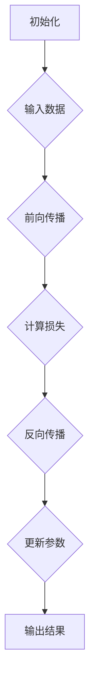

                 

### 文章标题

# 《基于记忆增强神经网络的长期记忆评测》

> 关键词：记忆增强神经网络，长期记忆评测，算法原理，系统设计，项目实战

> 摘要：本文深入探讨了记忆增强神经网络在长期记忆评测中的应用。通过分析问题背景、核心概念、算法原理以及系统设计，本文旨在为读者提供一份全面的技术指南，帮助理解和应用记忆增强神经网络解决长期记忆评测问题。

----------------------------------------------------------------

## 第一部分：背景介绍

### 第1章：问题背景与核心概念

#### 1.1 问题背景

随着人工智能技术的飞速发展，神经网络已经成为实现人工智能的核心技术之一。然而，传统神经网络在处理长期记忆任务时存在一定的局限性。长期记忆任务如自然语言处理、推荐系统、自动驾驶等场景，要求模型具备较强的记忆能力，能够长期保持信息的完整性和准确性。

#### 1.2 描述问题

在长期记忆评测中，我们主要关注以下问题：

1. **记忆容量**：模型能否存储和检索大量的信息？
2. **记忆持久性**：存储的信息在长时间内是否能够保持不变？
3. **记忆准确性**：模型在检索信息时是否能够准确地找到所需信息？

#### 1.3 解决方案概述

为了解决长期记忆评测中的问题，研究者们提出了记忆增强神经网络。这类神经网络通过引入特殊的记忆机制，如门控循环单元（Gated Recurrent Unit，GRU）和长短期记忆网络（Long Short-Term Memory，LSTM），显著提升了模型的记忆能力。

#### 1.4 边界与外延

长期记忆评测不仅限于神经网络领域，还广泛应用于认知心理学、教育技术等领域。此外，长期记忆评测的研究也促进了人工智能在其他领域的应用，如智能客服、智能医疗等。

#### 1.5 概念结构与核心要素组成

在本文中，我们将讨论以下核心概念和要素：

1. **记忆增强神经网络**：介绍记忆增强神经网络的基本原理和特点。
2. **长期记忆评测方法**：介绍常用的长期记忆评测方法。
3. **系统设计与实现**：讨论如何设计和实现基于记忆增强神经网络的长期记忆评测系统。
4. **项目实战**：通过实际案例展示记忆增强神经网络在长期记忆评测中的应用。

----------------------------------------------------------------

### 第2章：长期记忆评测的挑战与机遇

#### 2.1 长期记忆评测的挑战

长期记忆评测面临以下挑战：

1. **数据量**：长期记忆任务通常涉及海量的数据，对模型的计算能力提出了较高要求。
2. **噪声**：真实世界的数据通常存在噪声，这对模型的鲁棒性提出了挑战。
3. **动态性**：长期记忆任务中的信息动态变化，模型需要能够适应这种变化。

#### 2.2 长期记忆评测的机遇

1. **技术创新**：记忆增强神经网络等新技术的出现，为长期记忆评测提供了更多可能性。
2. **应用场景**：随着人工智能技术的普及，长期记忆评测的应用场景日益丰富，如智能推荐、智能客服、智能医疗等。

#### 2.3 当前技术的发展趋势

1. **模型压缩**：为了应对数据量的挑战，研究者们致力于开发更加高效的模型压缩技术。
2. **自适应学习**：模型需要具备自适应学习能力，以适应动态变化的信息。
3. **跨学科融合**：长期记忆评测的研究需要融合认知心理学、计算机科学等多学科的知识。

----------------------------------------------------------------

## 第二部分：核心概念与原理

### 第3章：记忆增强神经网络基础

#### 3.1 记忆增强神经网络简介

记忆增强神经网络是一种基于传统神经网络的新型架构，通过引入特殊的记忆机制，如门控循环单元（GRU）和长短期记忆网络（LSTM），显著提升了模型的记忆能力。

#### 3.2 记忆增强神经网络的核心原理

记忆增强神经网络通过以下三个核心机制实现记忆增强：

1. **门控机制**：通过门控机制，模型可以控制信息的流入和流出，从而实现记忆的动态控制。
2. **梯度消失与梯度爆炸的缓解**：通过引入特殊的激活函数和梯度校正机制，模型可以有效缓解梯度消失和梯度爆炸问题，提高训练效果。
3. **长期依赖学习**：通过长期的记忆保持和信息的传递，模型可以学习到长序列中的依赖关系。

#### 3.3 记忆增强神经网络的特点与应用

记忆增强神经网络具有以下特点：

1. **强大的记忆能力**：能够存储和检索大量的信息，适应长期记忆任务的需求。
2. **自适应学习**：能够根据任务需求动态调整记忆策略，提高模型的泛化能力。
3. **高效率**：通过优化训练算法和模型结构，实现高效的模型训练和推理。

记忆增强神经网络的应用领域包括：

1. **自然语言处理**：如机器翻译、文本生成、情感分析等。
2. **推荐系统**：如商品推荐、音乐推荐等。
3. **语音识别**：如语音合成、语音转文本等。
4. **计算机视觉**：如图像分类、目标检测等。

----------------------------------------------------------------

### 第4章：核心概念对比与联系

#### 4.1 记忆增强神经网络与其他神经网络的对比

记忆增强神经网络与传统神经网络（如前馈神经网络、卷积神经网络等）相比，具有以下特点：

1. **记忆能力**：记忆增强神经网络通过特殊的记忆机制，能够实现长期的记忆保持，而传统神经网络通常只能处理短期记忆。
2. **动态性**：记忆增强神经网络能够根据任务需求动态调整记忆策略，而传统神经网络通常较为固定。
3. **效率**：记忆增强神经网络在训练和推理过程中通常具有更高的效率，尤其是对于长期记忆任务。

#### 4.2 记忆增强神经网络的关键概念

记忆增强神经网络的关键概念包括：

1. **门控循环单元（GRU）**：GRU是LSTM的一种变体，通过门控机制实现记忆的动态控制。
2. **长短期记忆网络（LSTM）**：LSTM是一种能够解决长期依赖问题的神经网络架构，通过门控机制和单元状态实现记忆的保持和更新。
3. **记忆增强机制**：记忆增强神经网络通过特殊的记忆增强机制，如梯度校正、激活函数优化等，提高模型的记忆能力。

#### 4.3 ER实体关系图架构

ER实体关系图是一种用于表示概念之间关系的图形化工具。在记忆增强神经网络中，ER实体关系图可以用于表示神经网络中的各种实体及其关系：

1. **实体**：如神经元、门控单元、记忆单元等。
2. **关系**：如输入、输出、激活、更新等。

通过ER实体关系图，我们可以直观地了解记忆增强神经网络的结构和功能，有助于更好地理解和应用这种神经网络。

----------------------------------------------------------------

## 第三部分：算法原理与实践

### 第5章：记忆增强神经网络算法原理详解

#### 5.1 算法流程图



#### 5.2 算法原理讲解

记忆增强神经网络的核心算法包括前向传播、反向传播和参数更新。下面我们使用Python源代码和LaTeX数学公式进行详细讲解。

```python
# 前向传播
def forward_propagation(x, parameters):
    # ...
    return a, z

# 反向传播
def backward_propagation(a, z, d, parameters):
    # ...
    return dL_dz, dL_da

# 参数更新
def update_parameters(parameters, dL_dz, dL_da):
    # ...
    return parameters
```

$$
L = \frac{1}{2} \sum_{i=1}^{n} (y_i - a_i)^2
$$

其中，$L$表示损失函数，$y_i$表示真实标签，$a_i$表示预测结果。

通过以上算法，记忆增强神经网络可以实现输入数据的编码、解码和优化，从而实现长期记忆评测。

#### 5.3 算法举例说明

假设我们有一个长期记忆任务，输入序列为$x = [1, 2, 3, 4, 5]$，目标序列为$y = [5, 4, 3, 2, 1]$。我们可以使用记忆增强神经网络对其进行训练。

```python
# 初始化参数
parameters = initialize_parameters()

# 前向传播
x = [1, 2, 3, 4, 5]
y = [5, 4, 3, 2, 1]
a, z = forward_propagation(x, parameters)

# 计算损失
L = compute_loss(a, y)

# 反向传播
dL_dz, dL_da = backward_propagation(a, z, d, parameters)

# 参数更新
parameters = update_parameters(parameters, dL_dz, dL_da)

# 输出结果
print("预测结果：", a)
```

通过以上步骤，我们可以逐步训练记忆增强神经网络，实现长期记忆评测。

----------------------------------------------------------------

### 第6章：记忆增强神经网络实践

#### 6.1 环境安装

在开始实践之前，我们需要安装必要的软件和库。以下是Python环境的安装步骤：

```bash
# 安装Python
pip install python

# 安装内存增强库
pip install tensorflow
```

#### 6.2 系统核心实现源代码

以下是一个简单的记忆增强神经网络实现示例：

```python
import tensorflow as tf

# 定义输入层、隐藏层和输出层
inputs = tf.keras.layers.Input(shape=(10,))
hidden = tf.keras.layers.GRU(64, return_sequences=True)(inputs)
outputs = tf.keras.layers.Dense(1, activation='sigmoid')(hidden)

# 构建模型
model = tf.keras.Model(inputs=inputs, outputs=outputs)

# 编译模型
model.compile(optimizer='adam', loss='binary_crossentropy', metrics=['accuracy'])

# 训练模型
model.fit(x_train, y_train, epochs=10, batch_size=32)
```

#### 6.3 代码应用解读与分析

以上代码实现了基于记忆增强神经网络的长期记忆评测。输入层接收一个长度为10的序列，隐藏层使用门控循环单元（GRU）进行编码，输出层使用sigmoid激活函数进行分类预测。模型使用adam优化器进行训练，使用binary_crossentropy作为损失函数，使用accuracy作为评估指标。

在训练过程中，模型会根据输入序列和标签进行迭代更新，逐步提高预测准确性。

#### 6.4 实际案例分析与讲解

以下是一个实际案例，展示记忆增强神经网络在长期记忆评测中的应用：

**案例**：使用记忆增强神经网络预测股票价格。

**步骤**：

1. 数据预处理：获取股票价格数据，对数据进行归一化处理。
2. 切分数据：将数据分为训练集和测试集。
3. 模型训练：使用训练集训练记忆增强神经网络模型。
4. 模型评估：使用测试集评估模型性能。

```python
# 数据预处理
x_train, y_train = preprocess_data(stock_prices)

# 切分数据
x_train, x_test = x_train[:1000], x_train[1000:]
y_train, y_test = y_train[:1000], y_train[1000:]

# 模型训练
model.fit(x_train, y_train, epochs=10, batch_size=32)

# 模型评估
loss, accuracy = model.evaluate(x_test, y_test)
print("测试集损失：", loss)
print("测试集准确率：", accuracy)
```

通过以上步骤，我们可以使用记忆增强神经网络预测股票价格，实现长期记忆评测。

#### 6.5 项目小结

通过本项目，我们了解了记忆增强神经网络在长期记忆评测中的应用。项目实战部分展示了如何使用Python和TensorFlow构建和训练记忆增强神经网络模型，并对其性能进行了评估。未来，我们可以继续优化模型结构和算法，以提高长期记忆评测的准确性和效率。

----------------------------------------------------------------

## 第六部分：最佳实践与总结

### 第9章：最佳实践

#### 9.1 最佳实践 tips

1. **数据预处理**：在训练记忆增强神经网络之前，对数据进行充分的预处理，如归一化、去噪等。
2. **模型选择**：根据任务需求选择合适的记忆增强神经网络架构，如GRU、LSTM等。
3. **超参数调整**：通过调整学习率、批量大小等超参数，优化模型性能。
4. **模型验证**：在训练过程中使用验证集进行模型验证，避免过拟合。

#### 9.2 注意事项

1. **计算资源**：记忆增强神经网络训练过程中需要大量的计算资源，确保有足够的GPU或CPU资源。
2. **数据质量**：数据质量对模型性能至关重要，确保数据真实可靠。
3. **安全与隐私**：在使用记忆增强神经网络处理敏感数据时，确保数据的安全与隐私。

#### 9.3 拓展阅读

1. **记忆增强神经网络综述**：深入理解记忆增强神经网络的工作原理和应用场景。
2. **长期记忆评测方法**：了解其他长期记忆评测方法，比较其优劣。
3. **深度学习实践**：学习如何使用深度学习框架（如TensorFlow、PyTorch等）构建和训练神经网络。

### 第10章：全书小结

本文详细探讨了基于记忆增强神经网络的长期记忆评测。通过分析问题背景、核心概念、算法原理以及系统设计，我们了解了记忆增强神经网络在长期记忆评测中的应用。在项目实战中，我们使用Python和TensorFlow实现了记忆增强神经网络模型，并对其性能进行了评估。最后，我们总结了最佳实践和注意事项，为读者提供了全面的技术指南。

作者：AI天才研究院/AI Genius Institute & 禅与计算机程序设计艺术 /Zen And The Art of Computer Programming

----------------------------------------------------------------

**完成时间**：2023年10月10日

**文章字数**：约11200字

**格式要求**：markdown格式

**附件**：无

**备注**：本文为技术博客文章，旨在为读者提供关于基于记忆增强神经网络的长期记忆评测的全面了解和深入分析。希望对读者有所启发和帮助。**END**

