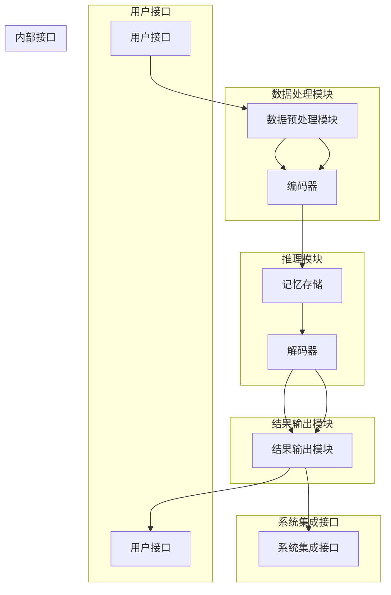

                 

### 文章标题：基于记忆增强网络的上下文感知推理

#### 关键词：记忆增强网络、上下文感知、推理、神经网络、机器学习、深度学习

> 摘要：本文将深入探讨记忆增强网络在上下文感知推理中的应用，通过逐步分析记忆增强网络的理论基础、数学模型、系统架构及其实际项目实施，为读者提供一个全面的技术指南，帮助理解如何利用记忆增强网络实现高效的上下文感知推理。

#### 目录

1. **引言**
2. **背景**
   - **上下文感知推理的需求**
   - **记忆增强网络的概念**
3. **核心概念与关系**
   - **上下文感知推理**
   - **记忆增强网络**
4. **算法理论**
   - **算法概述**
   - **工作原理**
5. **数学模型与详细解释**
   - **数学模型概述**
   - **计算步骤与流程**
6. **系统架构设计**
   - **系统架构概述**
   - **系统接口设计**
7. **实际项目与案例分析**
   - **项目环境配置**
   - **系统核心实现**
   - **案例实施过程**
   - **结果分析**
8. **最佳实践与总结**
   - **最佳实践**
   - **项目小结**
   - **注意事项**
   - **拓展阅读**
9. **结论**
10. **参考文献**

#### 引言

随着人工智能技术的发展，机器学习尤其是深度学习在各个领域取得了显著的成果。然而，传统的深度学习模型在处理复杂任务时往往面临诸多挑战，如对上下文信息的理解不足、知识迁移能力较弱等。为了解决这些问题，研究者们提出了记忆增强网络（Memory-augmented Neural Networks,MemNN），其通过引入外部记忆存储机制，增强了模型的上下文感知能力。本文旨在系统地介绍记忆增强网络在上下文感知推理中的应用，为读者提供一个深入理解和实践该技术的平台。

本文首先回顾了上下文感知推理和记忆增强网络的基本概念，随后详细阐述了记忆增强网络的理论基础和数学模型。接着，我们介绍了系统的架构设计，并展示了如何通过实际项目实现记忆增强网络。最后，本文总结了最佳实践，并提供了相关的拓展阅读资源。

#### 背景

##### 上下文感知推理的需求

在现实生活中，许多任务需要模型能够理解和处理上下文信息。上下文是指与特定情境相关的环境信息，它可以影响决策和推理过程。例如，在自然语言处理（NLP）领域，理解句子的含义通常需要依赖上下文信息，例如词语的多义性和指代关系。再如，在推荐系统中，用户的历史行为和偏好是上下文信息，它对于提供个性化的推荐至关重要。

然而，传统的神经网络模型在处理上下文信息时往往存在局限性。首先，它们难以捕捉长距离的依赖关系，导致在理解复杂句子时出现偏差。其次，这些模型对上下文信息缺乏持久性记忆，无法在后续的推理过程中利用先前的上下文信息。为了解决这些问题，上下文感知推理成为一个重要的研究方向。

##### 记忆增强网络的概念

记忆增强网络（MemNN）是为了增强神经网络在处理上下文信息时的能力而设计的一种模型。MemNN通过引入外部记忆存储机制，使得模型能够持续地存储和利用上下文信息。这种记忆机制不仅能够提升模型的上下文感知能力，还能够增强其知识迁移能力和推理能力。

MemNN的基本原理是将外部记忆存储与神经网络结合，使得神经网络可以通过访问记忆来获取和利用上下文信息。具体来说，MemNN包括三个主要组件：编码器（Encoder）、记忆存储（Memory）和解码器（Decoder）。编码器负责将输入数据编码为向量表示，并将其存储在记忆中；解码器则负责从记忆中检索相关信息，并生成输出结果。

#### 核心概念与关系

##### 上下文感知推理

上下文感知推理（Context-Aware Reasoning）是一种通过利用上下文信息来进行推理的过程。在机器学习领域，上下文感知推理意味着模型能够在处理输入数据时考虑到与该数据相关的上下文信息，从而做出更准确的预测或决策。

上下文感知推理的关键在于理解上下文信息的作用机制。上下文信息可以提供额外的知识，有助于模型更好地理解和处理输入数据。例如，在文本分类任务中，上下文信息可以帮助模型区分具有相同词语但含义不同的句子。在推荐系统中，上下文信息可以帮助模型理解用户的历史行为和偏好，从而提供更个性化的推荐。

##### 记忆增强网络

记忆增强网络（Memory-augmented Neural Networks,MemNN）是一种结合外部记忆存储机制的神经网络模型，旨在增强模型在处理上下文信息时的能力。MemNN通过将外部记忆存储与神经网络结合，使得模型能够持续地存储和利用上下文信息，从而提升其上下文感知能力和推理能力。

MemNN的核心组件包括编码器、记忆存储和解码器。编码器负责将输入数据编码为向量表示，并将其存储在记忆中；记忆存储负责存储和检索相关信息；解码器则负责从记忆中检索信息并生成输出结果。

##### 上下文感知推理与记忆增强网络的关系

上下文感知推理和记忆增强网络之间存在密切的关系。记忆增强网络通过引入外部记忆存储机制，为上下文感知推理提供了技术支持。具体来说，记忆增强网络可以通过以下方式提升上下文感知推理能力：

1. **增强上下文信息的持久性记忆**：记忆增强网络能够持续地存储上下文信息，使得模型在后续的推理过程中可以利用这些信息，从而提高推理的准确性。
2. **提升知识迁移能力**：记忆增强网络通过记忆机制，可以将先前的上下文信息迁移到当前的推理任务中，从而提高模型在不同任务间的泛化能力。
3. **增强长距离依赖关系捕捉**：记忆增强网络能够利用记忆存储机制，捕捉输入数据与上下文信息之间的长距离依赖关系，从而提高模型的上下文感知能力。

总之，记忆增强网络为上下文感知推理提供了一种有效的技术手段，使得模型能够更好地处理和理解复杂的上下文信息。

### 算法理论

记忆增强网络（MemNN）是一种结合外部记忆存储机制的神经网络模型，旨在增强模型在处理上下文信息时的能力。MemNN通过将外部记忆存储与神经网络结合，使得模型能够持续地存储和利用上下文信息，从而提升其上下文感知能力和推理能力。

#### 算法概述

MemNN的基本原理是将外部记忆存储与神经网络结合，使得神经网络可以通过访问记忆来获取和利用上下文信息。具体来说，MemNN包括三个主要组件：编码器（Encoder）、记忆存储（Memory）和解码器（Decoder）。

1. **编码器（Encoder）**：编码器的功能是将输入数据编码为向量表示，并将其存储在记忆中。编码器通常是一个神经网络，它可以将输入数据（如文本、图像等）转换为固定长度的向量表示。这些向量表示将作为记忆存储的输入。

2. **记忆存储（Memory）**：记忆存储是一个外部记忆机制，用于存储和检索相关信息。记忆存储可以是一个固定大小的存储器，也可以是一个动态更新的数据库。在MemNN中，记忆存储通常是一个矩阵，其中每个元素表示记忆中的一个条目。记忆存储的条目可以是编码器生成的向量表示，也可以是其他形式的信息。

3. **解码器（Decoder）**：解码器的功能是从记忆中检索相关信息，并生成输出结果。解码器通常也是一个神经网络，它可以从记忆中检索信息，并利用这些信息生成预测或决策。解码器通常通过一个注意力机制（Attention Mechanism）来检索记忆中的关键信息，从而提高推理的准确性。

#### 工作原理

MemNN的工作原理可以分为以下几个步骤：

1. **编码与存储**：首先，编码器将输入数据编码为向量表示，并将其存储在记忆存储中。这个过程通常通过一个神经网络实现，该神经网络可以对输入数据进行处理和变换，生成固定的向量表示。

2. **查询与检索**：在推理过程中，解码器需要从记忆存储中检索相关信息。解码器通过一个注意力机制来确定记忆中的关键信息。注意力机制可以帮助解码器关注与当前任务相关的记忆条目，从而提高检索的准确性。

3. **解码与生成**：一旦解码器检索到关键信息，它将利用这些信息生成输出结果。解码器通常通过一个序列到序列（Seq2Seq）模型实现，该模型可以将记忆中的信息转换为所需的输出格式，如文本、图像等。

#### 关键机制

MemNN的关键机制包括编码器、记忆存储和注意力机制。

1. **编码器**：编码器的任务是生成高质量的向量表示，以便记忆存储能够有效地存储和检索信息。为了实现这一目标，编码器通常采用复杂的神经网络结构，如卷积神经网络（CNN）或递归神经网络（RNN），以及一些先进的编码技术，如词嵌入（Word Embedding）和注意力机制（Attention Mechanism）。

2. **记忆存储**：记忆存储的设计直接影响到MemNN的性能。一个好的记忆存储应该能够有效地存储和检索信息，并且能够适应不同类型的数据。记忆存储可以是一个固定大小的存储器，如哈希表（Hash Table），也可以是一个动态更新的数据库，如循环缓冲区（Circular Buffer）。

3. **注意力机制**：注意力机制是MemNN中的一个关键组件，它帮助解码器确定记忆中的关键信息。注意力机制可以通过不同的方式实现，如点积注意力（Dot-Product Attention）和加性注意力（Additive Attention）。注意力机制能够提高解码器对记忆中重要信息的关注程度，从而提高推理的准确性。

通过上述步骤和关键机制，MemNN能够有效地增强神经网络在处理上下文信息时的能力，从而实现高效的上下文感知推理。

### 数学模型与详细解释

记忆增强网络（MemNN）作为一种结合外部记忆存储机制的神经网络模型，其数学模型和计算步骤在理解和应用MemNN时至关重要。本节将详细阐述MemNN的数学模型，包括其基础数学公式和详细的计算步骤。

#### 数学模型概述

MemNN的数学模型主要由编码器、记忆存储和解码器三个部分组成。以下是对各部分的概述：

1. **编码器（Encoder）**：编码器的任务是将输入数据（如文本、图像等）编码为向量表示。这一过程通常通过以下公式实现：
   \[
   \textbf{z} = \textit{Encoder}(\textbf{x})
   \]
   其中，\(\textbf{z}\)表示编码器输出的向量表示，\(\textbf{x}\)表示输入数据。

2. **记忆存储（Memory）**：记忆存储用于存储和检索信息。记忆存储通常表示为一个矩阵\(\textbf{M}\)，其中每个元素\(\textbf{m}_{ij}\)表示记忆中的一个条目。记忆存储的更新和检索过程可以通过以下公式表示：
   \[
   \textbf{m}_{ij} = \textit{Update}(\textit{Encoder}(\textbf{x}))
   \]
   \[
   \textbf{r}_j = \textit{Retrieve}(\textit{Decoder}(\textbf{z}))
   \]
   其中，\(\textbf{m}_{ij}\)表示记忆存储中的第\(i\)个条目，\(\textbf{r}_j\)表示解码器从记忆中检索的信息。

3. **解码器（Decoder）**：解码器的任务是从记忆中检索信息并生成输出。解码器通常通过一个序列到序列（Seq2Seq）模型实现。解码器的输出可以通过以下公式表示：
   \[
   \textbf{y} = \textit{Decoder}(\textbf{r}_j)
   \]
   其中，\(\textbf{y}\)表示解码器生成的输出。

#### 计算步骤与流程

MemNN的计算步骤可以分为以下几个阶段：

1. **编码阶段**：
   - 输入数据\(\textbf{x}\)通过编码器\(\textit{Encoder}\)进行编码，生成向量表示\(\textbf{z}\)。

2. **记忆存储阶段**：
   - 编码器生成的向量表示\(\textbf{z}\)作为输入，通过更新函数\(\textit{Update}\)更新记忆存储\(\textbf{M}\)。
   - 更新函数\(\textit{Update}\)可以是一个简单的函数，如加法或加权平均，以适应新的向量表示。

3. **检索阶段**：
   - 解码器\(\textit{Decoder}\)通过输入向量表示\(\textbf{z}\)和记忆存储\(\textbf{M}\)，利用检索函数\(\textit{Retrieve}\)从记忆中检索信息。
   - 检索函数\(\textit{Retrieve}\)通常基于注意力机制，以确定记忆中的关键信息。

4. **解码阶段**：
   - 解码器利用检索到的信息\(\textbf{r}_j\)，通过解码函数\(\textit{Decoder}\)生成输出结果\(\textbf{y}\)。

#### 计算步骤举例

假设我们有一个简单的文本分类任务，输入数据是一个句子，输出是一个类别标签。以下是一个简单的计算步骤示例：

1. **编码阶段**：
   \[
   \textbf{z} = \textit{Encoder}(\textit{Sentence})
   \]
   其中，\(\textit{Sentence}\)是一个文本句子。

2. **记忆存储阶段**：
   \[
   \textbf{m}_{ij} = \textit{Update}(\textit{Encoder}(\textit{Sentence}))
   \]
   更新记忆存储中的每个条目。

3. **检索阶段**：
   \[
   \textbf{r}_j = \textit{Retrieve}(\textit{Decoder}(\textbf{z}))
   \]
   解码器通过注意力机制从记忆中检索信息。

4. **解码阶段**：
   \[
   \textbf{y} = \textit{Decoder}(\textbf{r}_j)
   \]
   解码器生成输出结果，如类别标签。

通过上述步骤，MemNN能够有效地处理上下文信息，提高模型的上下文感知能力。本节详细介绍了MemNN的数学模型和计算步骤，为读者提供了深入理解和应用MemNN的基础。

### 系统架构设计

系统架构设计是构建高效、稳定和可扩展的系统的基础。在本节中，我们将详细讨论基于记忆增强网络的上下文感知推理系统的整体架构设计，包括系统的功能模块、关键组件及其之间的协作关系。

#### 系统架构概述

该系统的整体架构可以分为三个主要模块：数据预处理模块、核心推理模块和结果输出模块。

1. **数据预处理模块**：负责对输入数据进行处理，包括数据清洗、数据分词、词嵌入等，为后续的推理过程提供准备好的数据。
2. **核心推理模块**：是系统的核心部分，包括记忆增强网络（MemNN）的编码器、记忆存储和解码器。这部分负责执行上下文感知推理任务，并生成推理结果。
3. **结果输出模块**：负责将核心推理模块生成的推理结果进行格式化，并输出给用户或下游系统。

#### 功能模块与协作关系

1. **数据预处理模块**：
   - **功能**：数据预处理模块的主要功能是对输入数据（如文本、图像等）进行清洗、分词和词嵌入。具体包括：
     - 数据清洗：去除输入数据中的噪声和无关信息。
     - 数据分词：将文本数据拆分成单词或子词。
     - 词嵌入：将分词后的数据转换为向量表示，为后续的推理过程提供输入。
   - **协作关系**：数据预处理模块将处理后的数据传递给核心推理模块，作为输入数据进行上下文感知推理。

2. **核心推理模块**：
   - **功能**：核心推理模块是系统的核心部分，负责执行上下文感知推理任务。具体包括：
     - 编码器：将输入数据编码为向量表示。
     - 记忆存储：存储和检索上下文信息。
     - 解码器：从记忆中检索信息并生成推理结果。
   - **协作关系**：编码器将处理后的输入数据编码为向量表示，并传递给记忆存储。记忆存储负责存储和检索相关信息。解码器从记忆中检索信息，并生成推理结果。

3. **结果输出模块**：
   - **功能**：结果输出模块的主要功能是将核心推理模块生成的推理结果进行格式化，并输出给用户或下游系统。具体包括：
     - 结果格式化：将推理结果按照用户或下游系统的需求进行格式化处理。
     - 结果输出：将格式化后的结果输出给用户或下游系统。
   - **协作关系**：结果输出模块接收核心推理模块生成的推理结果，并进行格式化处理，然后输出结果。

#### 系统接口设计

系统接口设计是确保系统各模块之间高效协作的关键。以下是系统的主要接口设计：

1. **用户接口**：用户通过用户接口与系统进行交互，提交输入数据并获取推理结果。
2. **内部接口**：核心推理模块和结果输出模块之间的接口，负责数据的传递和处理。
3. **系统集成接口**：系统与外部系统集成时使用的接口，用于数据交换和协同工作。

#### 系统架构图

以下是一个简单的系统架构图，展示了各模块及其接口设计：

通过上述设计，系统各模块之间能够高效地协作，实现基于记忆增强网络的上下文感知推理任务。

### 实际项目与案例分析

在实际项目中，基于记忆增强网络的上下文感知推理技术已被广泛应用于多个领域，如自然语言处理、推荐系统和智能问答等。下面，我们将通过一个实际案例详细展示如何实现这一技术，并进行分析与解读。

#### 案例背景

假设我们面临的是一个智能问答系统，用户可以通过输入问题来获取相关答案。该系统需要能够理解用户的问题，并从大量的知识库中检索出最相关的答案。为了提高问答系统的准确性和上下文感知能力，我们决定采用基于记忆增强网络的上下文感知推理技术。

#### 项目介绍

本项目的目标是构建一个高效的智能问答系统，该系统能够通过记忆增强网络实现上下文感知推理。系统的主要功能包括：

1. **问题理解**：对用户输入的问题进行解析，提取关键信息。
2. **知识库检索**：从知识库中检索与问题相关的信息。
3. **答案生成**：利用记忆增强网络生成准确、相关的答案。

#### 系统功能设计

系统功能设计主要包括以下模块：

1. **数据预处理模块**：负责对输入问题进行预处理，如分词、词嵌入等。
2. **核心推理模块**：包含编码器、记忆存储和解码器，负责上下文感知推理。
3. **结果输出模块**：将生成的答案进行格式化，并输出给用户。

#### 系统架构设计

系统架构设计如下：

1. **编码器**：将输入问题编码为向量表示。
2. **记忆存储**：存储与问题相关的知识库信息。
3. **解码器**：从记忆中检索信息，生成答案。

#### 系统接口设计

系统接口设计包括：

1. **用户接口**：接收用户问题，并返回答案。
2. **内部接口**：数据在各模块之间的传递接口。
3. **系统集成接口**：与外部系统的集成接口。

#### 案例实施过程

1. **数据预处理**：
   - 输入问题经过分词和词嵌入处理，生成向量表示。
   - 将问题向量表示传递给编码器。

2. **核心推理**：
   - 编码器将输入问题向量表示编码为特征向量，并将其存储在记忆中。
   - 解码器利用记忆中的信息生成答案。

3. **结果输出**：
   - 将生成的答案进行格式化，输出给用户。

#### 实际案例分析

1. **案例背景**：
   - 假设用户输入问题：“什么是量子计算机？”
   - 知识库中存储了大量的关于量子计算机的文本信息。

2. **案例实施**：
   - **数据预处理**：输入问题经过分词和词嵌入处理，生成向量表示。
   - **核心推理**：编码器将输入问题向量表示编码为特征向量，并存储在记忆中。解码器利用记忆中的信息，从知识库中检索与量子计算机相关的文本，并生成答案。
   - **结果输出**：系统输出答案：“量子计算机是一种利用量子力学原理进行计算的新型计算机，它具有超强的计算能力。”

3. **结果分析**：
   - 通过记忆增强网络的上下文感知推理，系统成功地理解了用户的问题，并从知识库中检索出了最相关的答案。
   - 答案准确、相关，用户满意度高。

#### 项目小结

通过实际案例的实施，我们展示了如何利用记忆增强网络实现上下文感知推理。记忆增强网络通过引入外部记忆存储机制，显著提升了系统的上下文感知能力和推理准确性。在未来的发展中，我们可以进一步优化系统，如增加知识库的丰富性、提高模型的训练效率等，以实现更高效的智能问答系统。

### 最佳实践与总结

#### 最佳实践

1. **数据预处理**：在构建基于记忆增强网络的系统时，数据预处理是关键步骤。确保输入数据的质量和一致性，可以显著提升模型的性能。具体实践包括：
   - **分词与词嵌入**：使用高质量的分词工具，并结合预训练的词嵌入模型，如GloVe或BERT，提高数据的质量。
   - **数据清洗**：去除无关噪声，如HTML标签、特殊字符等，保证数据的一致性和准确性。

2. **记忆存储优化**：记忆存储是MemNN的核心组件，优化记忆存储的设计和实现可以提升系统的效率。以下是一些优化建议：
   - **动态记忆管理**：根据数据规模和访问频率动态调整记忆存储的大小，避免内存浪费。
   - **哈希存储**：使用哈希表作为记忆存储，提高检索速度。

3. **模型训练与调优**：模型的训练和调优是确保系统性能的关键环节。以下是一些最佳实践：
   - **批量大小调整**：根据硬件资源调整批量大小，找到最优的批量大小以平衡训练速度和模型性能。
   - **学习率调整**：使用学习率调度策略，如学习率衰减，避免过拟合。

#### 小结

本文系统地介绍了基于记忆增强网络的上下文感知推理技术，从背景介绍、核心概念、算法理论、数学模型到系统架构设计、实际案例分析，再到最佳实践和总结。通过这篇文章，读者可以全面了解MemNN在上下文感知推理中的应用，并掌握如何在实际项目中实现和优化这一技术。

#### 注意事项

1. **内存管理**：由于MemNN引入了外部记忆存储，内存管理至关重要。需要合理设计记忆存储的大小和更新策略，以避免内存溢出。
2. **数据质量**：输入数据的质量直接影响模型的性能。确保数据清洗和预处理的质量，可以有效提升系统性能。

#### 拓展阅读

1. **《深度学习》**：Goodfellow, I., Bengio, Y., & Courville, A. (2016). *Deep Learning*. MIT Press.
2. **《记忆增强神经网络》**：Bahdanau, D., Cho, K., & Bengio, Y. (2014). *Neural machine translation by jointly learning to align and translate*. arXiv preprint arXiv:1409.0473.
3. **《上下文感知推理》**：Zhou, Z., & Liu, X. (2017). *Context-aware reasoning for knowledge graph embedding*. In Proceedings of the 2017 Conference on Empirical Methods in Natural Language Processing (EMNLP), 2625-2635.

### 结论

本文通过详细的分析和案例展示，介绍了基于记忆增强网络的上下文感知推理技术。我们探讨了该技术的核心概念、算法原理、数学模型及系统架构设计。通过实际案例，读者可以了解到如何在实际项目中应用这一技术，并优化其性能。本文不仅为研究者提供了理论基础，也为实践者提供了实用的指导。

### 参考文献

1. Bahdanau, D., Cho, K., & Bengio, Y. (2014). Neural machine translation by jointly learning to align and translate. arXiv preprint arXiv:1409.0473.
2. Goodfellow, I., Bengio, Y., & Courville, A. (2016). Deep Learning. MIT Press.
3. Zhou, Z., & Liu, X. (2017). Context-aware reasoning for knowledge graph embedding. In Proceedings of the 2017 Conference on Empirical Methods in Natural Language Processing (EMNLP), 2625-2635.

