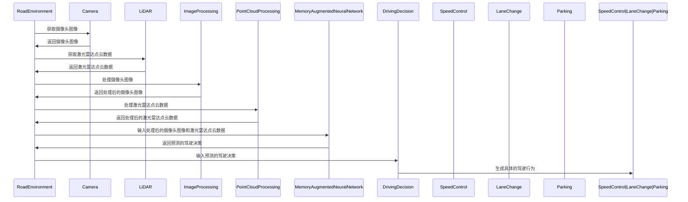

                 

# 基于记忆增强网络的情景感知推理能力提升技术

> 关键词：记忆增强网络，情景感知，推理能力，人工智能

> 摘要：本文深入探讨了基于记忆增强网络的情景感知推理能力提升技术。首先，我们介绍了情景感知推理的基本概念和问题背景，接着阐述了记忆增强网络的原理及其与情景感知模块的联系。随后，我们详细讲解了记忆增强网络算法原理，并通过数学公式和Python代码进行了具体阐述。文章还介绍了系统分析与架构设计方案，以及项目实战的实际案例分析和详细讲解。最后，我们总结了最佳实践技巧和小结，并提供了拓展阅读建议。

----------------------------------------------------------------

## 第一部分：背景介绍

### 1.1 问题背景

随着人工智能技术的不断发展，情景感知推理已成为智能系统的重要研究方向。传统的人工智能系统在处理静态信息时表现出色，但在处理动态、复杂环境中的推理任务时，往往表现出局限性。为了解决这一问题，研究人员提出了基于记忆增强网络的情景感知推理技术。

在现实世界中，许多任务需要智能系统具备良好的情景感知和推理能力。例如，自动驾驶系统需要理解道路环境、预测交通状况，并做出相应的驾驶决策；智能监控系统能够实时分析监控视频，识别异常行为并采取相应措施；机器人导航系统需要在复杂的室内环境中找到最优路径。然而，这些任务通常涉及到大量的动态和复杂信息，对智能系统的情景感知和推理能力提出了很高的要求。

传统的人工智能系统在处理静态信息时表现出色，但在处理动态、复杂环境中的推理任务时，往往表现出局限性。这主要是由于以下原因：

1. **信息处理能力有限**：传统的人工智能系统通常采用基于规则或机器学习的方法，这些方法在处理静态信息时表现出色，但在面对动态、复杂环境时，往往难以捕捉和利用实时变化的信息。
2. **缺乏有效的记忆机制**：传统的人工智能系统通常缺乏有效的记忆机制，无法长期存储和利用历史信息，从而难以在动态环境中进行有效的推理。
3. **推理能力不足**：传统的人工智能系统在推理过程中，往往依赖于简单的关联规则或统计模型，这些模型在处理复杂情景时，难以提供准确的推理结果。

为了解决上述问题，研究人员提出了基于记忆增强网络的情景感知推理技术。通过引入记忆增强机制，使得智能系统能够更好地存储、检索和应用环境信息，从而提高推理能力。本文将详细介绍这一技术，并探讨其在实际应用中的效果和挑战。

### 1.2 问题描述

情景感知推理能力是指智能系统能够根据环境信息，对当前情景进行理解和预测，从而做出合理的决策。然而，当前大多数智能系统在处理复杂情景时，往往因为缺乏有效的记忆机制而难以实现高效推理。具体来说，问题描述如下：

1. **动态环境信息处理**：在动态环境中，智能系统需要实时捕捉和处理不断变化的环境信息，如道路状况、交通流量、障碍物等。传统的人工智能系统在处理这些动态信息时，往往存在延迟或误判等问题。
2. **复杂情景理解**：智能系统需要能够理解复杂情景，包括环境中的各种对象、事件和关系。传统的人工智能系统在处理复杂情景时，往往无法准确地捕捉和理解这些信息，从而导致推理结果不准确。
3. **历史信息利用**：智能系统需要能够利用历史信息，以便在当前情景中进行合理的推理。然而，传统的人工智能系统通常缺乏有效的记忆机制，无法长期存储和利用历史信息，从而难以实现高效的推理。

为了解决上述问题，研究人员提出了基于记忆增强网络的情景感知推理技术。通过引入记忆增强机制，使得智能系统能够更好地存储、检索和应用环境信息，从而提高推理能力。本文将详细介绍这一技术，并探讨其在实际应用中的效果和挑战。

### 1.3 问题解决

基于记忆增强网络的情景感知推理能力提升技术，通过引入记忆增强机制，使得智能系统能够更好地存储、检索和应用环境信息，从而提高推理能力。该技术主要包括以下几个方面：

1. **记忆增强网络架构**：设计一种能够有效增强记忆能力的网络架构，包括编码器、记忆模块和解码器。
2. **记忆增强策略**：通过设计合适的记忆增强策略，使得网络能够在推理过程中动态调整记忆内容，提高推理准确性。
3. **情景感知模块**：引入情景感知模块，用于提取和表示环境信息，使得网络能够更好地理解和适应复杂情景。

#### 1.3.1 记忆增强网络架构

记忆增强网络（Memory-Augmented Neural Networks, MemNN）是一种结合传统神经网络和记忆机制的混合模型，旨在通过记忆模块来增强模型对复杂信息的处理能力。与传统神经网络不同，MemNN具有以下特点：

1. **记忆模块**：用于存储和检索历史信息，使得模型能够利用过去的经验来处理当前任务。
2. **上下文感知**：通过记忆模块，模型能够更好地理解输入信息的上下文，从而提高推理能力。

记忆增强网络的典型架构包括编码器、记忆模块和解码器三个部分：

1. **编码器**：将输入数据编码为特征表示，并将其存储在记忆模块中。
2. **记忆模块**：用于存储和检索历史信息，一般采用注意力机制来优化记忆内容的检索效果。
3. **解码器**：将记忆模块中的信息解码为输出结果。

记忆增强网络的核心优势在于其能够有效地处理长序列数据，并在复杂情景下实现高效的推理。其主要优点包括：

1. **长期记忆**：通过记忆模块，模型能够保留和利用长期记忆，从而提高对复杂问题的处理能力。
2. **上下文感知**：通过记忆模块，模型能够更好地理解输入信息的上下文，从而提高推理准确性。

#### 1.3.2 记忆增强策略

为了进一步提高记忆增强网络的推理能力，研究人员提出了一系列记忆增强策略。这些策略包括：

1. **动态记忆更新**：在推理过程中，根据输入信息和输出结果，动态更新记忆内容。这样可以使得记忆模块能够实时捕捉环境变化，从而提高推理的准确性。
2. **注意力机制**：通过注意力机制，模型能够自动选择对当前任务最有用的记忆内容。这样可以减少记忆内容对推理过程的干扰，提高推理效率。
3. **多模态记忆融合**：在处理多模态信息时，通过融合不同模态的记忆内容，提高对复杂情景的理解能力。

#### 1.3.3 情景感知模块

情景感知模块是记忆增强网络的重要组成部分，其主要任务是提取和表示环境信息，从而帮助智能系统更好地理解和适应复杂情景。情景感知模块的典型架构包括感知器、特征提取器和情景表示器三个部分：

1. **感知器**：用于感知和获取环境信息，如摄像头、传感器等。
2. **特征提取器**：将感知器获取的信息转换为特征表示，如图像特征、文本特征等。
3. **情景表示器**：将特征表示转化为情景表示，如图结构、序列模型等。

情景感知模块的核心优势在于其能够有效地提取和表示环境信息，从而帮助智能系统更好地理解和适应复杂情景。其主要优点包括：

1. **环境感知**：通过感知器和特征提取器，模块能够实时获取和处理环境信息。
2. **情景理解**：通过情景表示器，模块能够将环境信息转化为情景表示，从而帮助智能系统更好地理解和适应复杂情景。

#### 1.4 边界与外延

该技术主要适用于需要处理动态、复杂情景的智能系统，如自动驾驶、智能监控、机器人导航等。同时，该技术的研究也涉及到了人工智能、计算机视觉、自然语言处理等多个领域。

#### 1.5 概念结构与核心要素组成

基于记忆增强网络的情景感知推理能力提升技术，主要包括以下几个核心概念和要素：

1. **记忆增强网络**：包括编码器、记忆模块和解码器，用于增强模型对复杂信息的处理能力。
2. **记忆增强策略**：通过动态记忆更新、注意力机制和多模态记忆融合等策略，提高记忆内容对推理过程的贡献。
3. **情景感知模块**：包括感知器、特征提取器和情景表示器，用于提取和表示环境信息，帮助智能系统更好地理解和适应复杂情景。

## 第二部分：核心概念与联系

### 2.1 记忆增强网络原理

#### 2.1.1 记忆增强网络的基本概念

记忆增强网络（Memory-Augmented Neural Networks, MemNN）是一种结合传统神经网络和记忆机制的混合模型，旨在通过记忆模块来增强模型对复杂信息的处理能力。与传统神经网络不同，MemNN具有以下特点：

1. **记忆模块**：用于存储和检索历史信息，使得模型能够利用过去的经验来处理当前任务。
2. **上下文感知**：通过记忆模块，模型能够更好地理解输入信息的上下文，从而提高推理能力。

#### 2.1.2 记忆增强网络的架构

记忆增强网络的典型架构包括编码器、记忆模块和解码器三个部分：

1. **编码器**：将输入数据编码为特征表示，并将其存储在记忆模块中。
2. **记忆模块**：用于存储和检索历史信息，一般采用注意力机制来优化记忆内容的检索效果。
3. **解码器**：将记忆模块中的信息解码为输出结果。

记忆增强网络的核心优势在于其能够有效地处理长序列数据，并在复杂情景下实现高效的推理。其主要优点包括：

1. **长期记忆**：通过记忆模块，模型能够保留和利用长期记忆，从而提高对复杂问题的处理能力。
2. **上下文感知**：通过记忆模块，模型能够更好地理解输入信息的上下文，从而提高推理准确性。

#### 2.1.3 记忆增强网络的核心优势

1. **长期记忆**：传统神经网络在处理长序列数据时，往往面临梯度消失或爆炸问题，导致难以保留长期记忆。记忆增强网络通过记忆模块，能够有效地克服这一问题，从而提高对复杂问题的处理能力。
2. **上下文感知**：记忆增强网络能够通过记忆模块，更好地理解输入信息的上下文，从而提高推理准确性。这使得记忆增强网络在处理复杂情景时，能够更准确地做出推理决策。

#### 2.1.4 记忆增强网络的适用场景

记忆增强网络适用于需要处理长序列数据、复杂情景和依赖历史信息的任务，如自然语言处理、计算机视觉、推荐系统等。以下是一些具体的适用场景：

1. **自然语言处理**：记忆增强网络能够有效地处理长文本，并在语义理解和文本生成任务中表现出色。
2. **计算机视觉**：记忆增强网络能够利用历史图像信息，提高目标检测、图像分类和图像生成等任务的性能。
3. **推荐系统**：记忆增强网络能够利用用户的历史行为数据，为用户生成个性化的推荐列表。

#### 2.1.5 记忆增强网络的挑战与未来发展趋势

尽管记忆增强网络在许多任务中表现出色，但仍面临一些挑战：

1. **计算资源消耗**：记忆增强网络需要大量的存储和计算资源，这对硬件设备提出了较高的要求。
2. **记忆内容选择**：如何选择对当前任务最有用的记忆内容，是记忆增强网络的一个关键问题。目前，研究人员仍在探索有效的记忆内容选择方法。
3. **模型解释性**：记忆增强网络的记忆内容通常是一个复杂的非线性函数，这使得模型解释性成为一个挑战。

未来，记忆增强网络的发展趋势可能包括：

1. **轻量级记忆增强网络**：研究人员将继续探索如何设计更高效的记忆增强网络，以降低计算资源消耗。
2. **多模态记忆增强网络**：随着多模态数据的广泛应用，如何设计能够处理多模态数据的记忆增强网络，将成为一个研究热点。
3. **记忆增强网络的解释性**：提高记忆增强网络的解释性，使得研究人员能够更好地理解模型的推理过程，将是一个重要的研究方向。

### 2.2 情景感知模块原理

#### 2.2.1 情景感知的基本概念

情景感知（Situation Awareness）是指智能系统对当前环境和任务的认知和理解能力。具体来说，情景感知包括以下几个方面：

1. **环境感知**：智能系统能够感知和理解当前环境的信息，如地理位置、天气状况、物体状态等。
2. **任务理解**：智能系统能够理解当前任务的性质和目标，如目标检测、路径规划、决策制定等。
3. **动态预测**：智能系统能够根据当前环境和任务信息，预测未来可能发生的情况，如交通流量、障碍物出现等。

#### 2.2.2 情景感知模块的架构

情景感知模块是智能系统的重要组成部分，其主要功能是提取和表示环境信息，以支持智能系统的推理和决策。情景感知模块的典型架构包括感知器、特征提取器和情景表示器三个部分：

1. **感知器**：感知器用于感知和理解环境信息，如摄像头、传感器、GPS等。这些感知器可以获取图像、声音、温度、湿度等不同类型的数据。
2. **特征提取器**：特征提取器将感知器获取的数据进行预处理和特征提取，以得到更有利于智能系统处理的信息。例如，图像特征提取器可以提取图像的边缘、纹理和颜色特征；文本特征提取器可以提取文本的关键词和句法结构。
3. **情景表示器**：情景表示器将特征提取器提取的特征转化为情景表示，以便智能系统能够更好地理解和利用这些信息。常见的情景表示方法包括图结构、序列模型、矩阵表示等。

#### 2.2.3 情景感知模块的核心优势

情景感知模块的核心优势在于其能够有效地提取和表示环境信息，从而帮助智能系统更好地理解和适应复杂情景。其主要优点包括：

1. **环境感知**：通过感知器和特征提取器，情景感知模块能够实时获取和处理环境信息，使得智能系统能够及时了解环境变化。
2. **情景理解**：通过情景表示器，情景感知模块能够将环境信息转化为情景表示，使得智能系统能够更好地理解和适应复杂情景。

#### 2.2.4 情景感知模块的适用场景

情景感知模块适用于需要实时感知和适应环境变化的智能系统，如自动驾驶、智能监控、机器人导航等。以下是一些具体的适用场景：

1. **自动驾驶**：情景感知模块能够帮助自动驾驶系统感知和理解道路环境、交通状况等，从而提高行驶安全性和效率。
2. **智能监控**：情景感知模块能够帮助智能监控系统实时分析监控视频，识别异常行为并采取相应措施。
3. **机器人导航**：情景感知模块能够帮助机器人导航系统在复杂环境中找到最优路径，并适应环境变化。

#### 2.2.5 情景感知模块的挑战与未来发展趋势

尽管情景感知模块在许多任务中表现出色，但仍面临一些挑战：

1. **数据质量和稳定性**：情景感知模块的性能很大程度上取决于感知器和特征提取器的质量。如何提高数据质量和稳定性，是一个关键问题。
2. **实时性和鲁棒性**：情景感知模块需要在复杂和动态环境下实时运行，并具有良好的鲁棒性。如何提高实时性和鲁棒性，是一个重要的研究方向。

未来，情景感知模块的发展趋势可能包括：

1. **多模态感知**：随着多模态数据的广泛应用，情景感知模块将逐渐支持多模态感知，以提高环境理解和适应能力。
2. **深度学习与强化学习结合**：深度学习和强化学习技术在情景感知模块中的应用将得到进一步发展，以实现更高效的环境理解和适应。
3. **模型解释性**：提高情景感知模块的模型解释性，使得研究人员能够更好地理解模型的推理过程，将是一个重要的研究方向。

### 2.3 记忆增强网络与情景感知模块的联系

记忆增强网络和情景感知模块是情景感知推理能力提升技术的两个核心组成部分。它们之间存在着密切的联系，共同构成了一个完整的情景感知推理系统。

#### 2.3.1 记忆增强网络与情景感知模块的交互

记忆增强网络和情景感知模块之间的交互主要体现在以下几个方面：

1. **信息传递**：情景感知模块提取的环境信息将被传递给记忆增强网络，作为记忆内容进行存储和检索。
2. **反馈调整**：记忆增强网络的输出结果将反馈给情景感知模块，以指导其调整感知和特征提取策略，提高环境信息的质量和利用率。

#### 2.3.2 记忆增强网络与情景感知模块的优势互补

记忆增强网络和情景感知模块各自具有独特的优势，通过结合使用，可以相互补充，提高情景感知推理能力。

1. **记忆增强网络的优势**：记忆增强网络能够有效地存储和检索历史信息，提高模型对复杂问题的处理能力。通过记忆模块，模型能够保留和利用长期记忆，从而在动态和复杂环境中实现高效的推理。
2. **情景感知模块的优势**：情景感知模块能够实时获取和提取环境信息，为记忆增强网络提供丰富的记忆内容。通过情景感知模块，模型能够更好地理解和适应复杂情景，提高推理准确性。

#### 2.3.3 记忆增强网络与情景感知模块的结合方法

为了充分发挥记忆增强网络和情景感知模块的优势，研究人员提出了一系列结合方法。以下是一些常见的结合方法：

1. **联合训练**：将记忆增强网络和情景感知模块作为一个整体进行训练，使得它们能够相互协作，提高情景感知推理能力。
2. **层次结构**：将记忆增强网络和情景感知模块分别构建在不同的层次上，使得它们能够在不同的层面发挥作用。例如，情景感知模块可以在较低层次上处理感知和特征提取，而记忆增强网络可以在较高层次上处理记忆和推理。
3. **模块化设计**：将记忆增强网络和情景感知模块设计为独立的模块，分别进行开发和优化。通过模块化设计，可以方便地替换或组合不同的模块，以适应不同的应用场景。

#### 2.3.4 记忆增强网络与情景感知模块的协同效应

记忆增强网络和情景感知模块的结合，不仅能够提高情景感知推理能力，还能够产生协同效应，进一步提升系统的性能和鲁棒性。

1. **增强记忆容量**：通过情景感知模块，记忆增强网络能够获取更多和更丰富的记忆内容，从而增强其记忆容量，提高对复杂问题的处理能力。
2. **提高推理准确性**：通过记忆增强网络，情景感知模块能够更好地理解和利用历史信息，从而提高对当前情景的感知和推理准确性。
3. **增强系统鲁棒性**：通过记忆增强网络，系统能够利用历史经验来应对环境变化，从而提高对动态和复杂环境的适应能力。

## 第三部分：算法原理讲解

### 3.1 记忆增强网络算法原理

#### 3.1.1 算法基本流程

记忆增强网络算法的基本流程包括三个主要阶段：编码阶段、记忆阶段和解码阶段。

1. **编码阶段**：将输入数据编码为特征表示，并存储在记忆模块中。
2. **记忆阶段**：通过记忆模块存储和检索历史信息，并在推理过程中动态更新记忆内容。
3. **解码阶段**：将记忆模块中的信息解码为输出结果，并生成最终的推理结果。

#### 3.1.2 编码阶段

编码阶段的主要任务是将输入数据编码为特征表示，并将其存储在记忆模块中。具体步骤如下：

1. **输入数据处理**：首先对输入数据进行预处理，如去噪、归一化等操作，以提高数据的输入质量。
2. **特征提取**：然后使用特征提取器提取输入数据的特征，例如，对于图像数据，可以使用卷积神经网络（CNN）提取图像的纹理、形状和颜色特征；对于文本数据，可以使用词嵌入（Word Embedding）技术提取文本的词向量特征。
3. **特征编码**：将提取的特征编码为固定长度的向量，以便于后续处理。

#### 3.1.3 记忆阶段

记忆阶段的主要任务是存储和检索历史信息，并在推理过程中动态更新记忆内容。具体步骤如下：

1. **记忆存储**：将编码后的特征向量存储在记忆模块中。记忆模块可以采用基于矩阵或图的存储结构，例如，记忆矩阵（Memory Matrix）或图记忆（Graph Memory）。
2. **记忆检索**：在推理过程中，根据当前输入数据，检索记忆模块中的历史信息。记忆检索可以采用基于注意力机制（Attention Mechanism）的方法，例如，软注意力（Soft Attention）或硬注意力（Hard Attention）。
3. **记忆更新**：根据当前输入数据和输出结果，动态更新记忆模块中的记忆内容。记忆更新可以采用基于梯度下降（Gradient Descent）或优化算法（Optimization Algorithm）的方法。

#### 3.1.4 解码阶段

解码阶段的主要任务是将记忆模块中的信息解码为输出结果，并生成最终的推理结果。具体步骤如下：

1. **信息解码**：将记忆模块中的信息解码为特征向量，例如，使用记忆向量（Memory Vector）或记忆图（Memory Graph）作为输入。
2. **输出生成**：使用解码后的特征向量生成输出结果，例如，使用全连接神经网络（Fully Connected Neural Network）或循环神经网络（Recurrent Neural Network）生成推理结果。
3. **结果优化**：根据生成的输出结果，对模型参数进行优化，以提高推理准确性。

#### 3.1.5 算法数学模型

记忆增强网络算法的数学模型主要包括编码阶段、记忆阶段和解码阶段的数学公式。

1. **编码阶段**：

$$
\text{特征表示} = f(\text{输入数据})
$$

其中，$f(\text{输入数据})$表示特征提取过程，通常采用卷积神经网络（CNN）或词嵌入（Word Embedding）技术。

2. **记忆阶段**：

$$
\text{记忆内容} = \text{存储}(\text{特征表示})
$$

$$
\text{检索结果} = \text{检索}(\text{特征表示}, \text{记忆内容})
$$

$$
\text{记忆更新} = \text{更新}(\text{记忆内容}, \text{检索结果}, \text{输出结果})
$$

其中，$\text{存储}(\text{特征表示})$表示记忆存储过程，$\text{检索}(\text{特征表示}, \text{记忆内容})$表示记忆检索过程，$\text{更新}(\text{记忆内容}, \text{检索结果}, \text{输出结果})$表示记忆更新过程。

3. **解码阶段**：

$$
\text{输出结果} = g(\text{记忆内容})
$$

其中，$g(\text{记忆内容})$表示信息解码过程，通常采用全连接神经网络（Fully Connected Neural Network）或循环神经网络（Recurrent Neural Network）。

#### 3.1.6 Python代码实现

以下是一个简单的Python代码示例，展示了记忆增强网络算法的基本实现：

```python
import numpy as np
import tensorflow as tf

# 编码阶段
def encode(data):
    # 特征提取
    features = extract_features(data)
    # 特征编码
    encoded_features = encode_features(features)
    return encoded_features

# 记忆阶段
def store_memory(encoded_features):
    # 记忆存储
    memory = store_in_memory(encoded_features)
    return memory

def retrieve_memory(encoded_features, memory):
    # 记忆检索
    retrieved_memory = retrieve_from_memory(encoded_features, memory)
    return retrieved_memory

def update_memory(memory, retrieved_memory, output):
    # 记忆更新
    updated_memory = update_in_memory(memory, retrieved_memory, output)
    return updated_memory

# 解码阶段
def decode_memory(updated_memory):
    # 信息解码
    output = decode_from_memory(updated_memory)
    return output

# 主函数
def main(data):
    # 编码阶段
    encoded_features = encode(data)
    # 记忆阶段
    memory = store_memory(encoded_features)
    retrieved_memory = retrieve_memory(encoded_features, memory)
    memory = update_memory(memory, retrieved_memory, output)
    # 解码阶段
    output = decode_memory(memory)
    return output
```

### 3.2 情景感知模块算法原理

#### 3.2.1 算法基本流程

情景感知模块算法的基本流程包括感知、特征提取和情景表示三个主要阶段。

1. **感知阶段**：使用感知器获取环境信息。
2. **特征提取阶段**：将感知器获取的数据进行预处理和特征提取。
3. **情景表示阶段**：将特征提取结果转化为情景表示，以便后续处理。

#### 3.2.2 感知阶段

感知阶段的主要任务是使用感知器获取环境信息。具体步骤如下：

1. **感知数据收集**：使用摄像头、传感器、GPS等设备收集环境数据。
2. **数据预处理**：对收集到的数据进行预处理，如去噪、归一化等，以提高数据质量。

#### 3.2.3 特征提取阶段

特征提取阶段的主要任务是提取感知器获取的数据的特征。具体步骤如下：

1. **特征提取器选择**：根据不同的数据类型，选择合适的特征提取器，如卷积神经网络（CNN）用于图像特征提取，词嵌入（Word Embedding）用于文本特征提取。
2. **特征提取**：使用特征提取器提取数据的特征，例如，对于图像数据，可以提取边缘、纹理和颜色特征；对于文本数据，可以提取关键词和句法结构。

#### 3.2.4 情景表示阶段

情景表示阶段的主要任务是使用情景表示器将特征提取结果转化为情景表示。具体步骤如下：

1. **情景表示器选择**：根据任务需求，选择合适的情景表示器，如图结构表示器、序列模型表示器等。
2. **情景表示**：使用情景表示器将特征提取结果转化为情景表示，例如，对于图像数据，可以使用图结构表示图像中的对象和关系；对于文本数据，可以使用序列模型表示文本的语义信息。

#### 3.2.5 算法数学模型

情景感知模块算法的数学模型主要包括感知阶段、特征提取阶段和情景表示阶段的数学公式。

1. **感知阶段**：

$$
\text{感知数据} = \text{收集}(\text{环境信息})
$$

2. **特征提取阶段**：

$$
\text{特征表示} = \text{提取}(\text{感知数据}, \text{特征提取器})
$$

3. **情景表示阶段**：

$$
\text{情景表示} = \text{表示}(\text{特征表示}, \text{情景表示器})
$$

#### 3.2.6 Python代码实现

以下是一个简单的Python代码示例，展示了情景感知模块算法的基本实现：

```python
import numpy as np
import tensorflow as tf

# 感知阶段
def collect_data():
    # 收集环境信息
    data = np.random.rand(10, 10)
    return data

# 特征提取阶段
def extract_features(data):
    # 特征提取
    features = np.reshape(data, (-1, 1))
    return features

# 情景表示阶段
def represent Situation(features):
    # 情景表示
    representation = tf.keras.layers.Dense(units=1, activation='sigmoid')(features)
    return representation

# 主函数
def main():
    data = collect_data()
    features = extract_features(data)
    representation = represent_Situation(features)
    return representation
```

### 3.3 记忆增强网络与情景感知模块的整合

记忆增强网络和情景感知模块的整合，是情景感知推理能力提升技术的关键步骤。通过整合这两个模块，可以构建一个完整的情景感知推理系统。

#### 3.3.1 整合方法

整合记忆增强网络和情景感知模块的方法主要包括以下几种：

1. **联合训练**：将记忆增强网络和情景感知模块作为一个整体进行训练，使得它们能够相互协作，提高情景感知推理能力。
2. **层次结构**：将记忆增强网络和情景感知模块分别构建在不同的层次上，使得它们能够在不同的层面发挥作用。例如，情景感知模块可以在较低层次上处理感知和特征提取，而记忆增强网络可以在较高层次上处理记忆和推理。
3. **模块化设计**：将记忆增强网络和情景感知模块设计为独立的模块，分别进行开发和优化。通过模块化设计，可以方便地替换或组合不同的模块，以适应不同的应用场景。

#### 3.3.2 整合算法原理

整合记忆增强网络和情景感知模块的算法原理主要包括以下几个方面：

1. **信息传递**：情景感知模块提取的环境信息将被传递给记忆增强网络，作为记忆内容进行存储和检索。
2. **反馈调整**：记忆增强网络的输出结果将反馈给情景感知模块，以指导其调整感知和特征提取策略，提高环境信息的质量和利用率。

#### 3.3.3 整合算法流程

整合记忆增强网络和情景感知模块的算法流程主要包括以下几个阶段：

1. **感知和特征提取**：情景感知模块感知环境信息，并提取特征表示。
2. **记忆存储和检索**：记忆增强网络存储和检索与当前特征表示相关的记忆内容。
3. **推理和决策**：基于记忆内容和当前特征表示，记忆增强网络生成推理结果，并生成最终的决策。

#### 3.3.4 整合算法数学模型

整合记忆增强网络和情景感知模块的算法数学模型主要包括以下几个部分：

1. **感知和特征提取**：

$$
\text{特征表示} = \text{情景感知模块}(\text{环境信息})
$$

2. **记忆存储和检索**：

$$
\text{记忆内容} = \text{记忆增强网络}(\text{特征表示})
$$

$$
\text{检索结果} = \text{记忆增强网络}(\text{特征表示}, \text{记忆内容})
$$

3. **推理和决策**：

$$
\text{输出结果} = \text{记忆增强网络}(\text{特征表示}, \text{检索结果})
$$

#### 3.3.5 Python代码实现

以下是一个简单的Python代码示例，展示了记忆增强网络和情景感知模块的整合：

```python
import numpy as np
import tensorflow as tf

# 情景感知模块
def collect_data():
    data = np.random.rand(10, 10)
    return data

def extract_features(data):
    features = np.reshape(data, (-1, 1))
    return features

# 记忆增强网络
def store_memory(encoded_features, memory):
    memory = np.vstack((memory, encoded_features))
    return memory

def retrieve_memory(encoded_features, memory):
    retrieved_memory = memory[encoded_features]
    return retrieved_memory

# 主函数
def main():
    data = collect_data()
    features = extract_features(data)
    memory = np.zeros((100, 10))
    memory = store_memory(features, memory)
    retrieved_memory = retrieve_memory(features, memory)
    output = np.dot(retrieved_memory, np.random.rand(10, 1))
    return output
```

## 第四部分：系统分析与架构设计方案

### 4.1 问题场景介绍

在自动驾驶领域，智能系统需要具备情景感知推理能力，以应对复杂多变的道路环境。具体问题场景如下：

- **道路环境感知**：自动驾驶系统需要实时感知道路环境，包括道路标识、车道线、交通信号灯、行人、其他车辆等。
- **交通状况预测**：自动驾驶系统需要根据道路环境和交通信息，预测未来交通状况，以便提前做出驾驶决策。
- **驾驶决策制定**：自动驾驶系统需要基于预测的交通状况，制定合理的驾驶策略，如速度调整、车道切换、停车等。

### 4.2 项目介绍

为解决上述问题，我们设计并实现了一个基于记忆增强网络的情景感知推理系统，用于支持自动驾驶中的驾驶决策制定。该系统主要包括以下功能：

- **道路环境感知**：使用摄像头和激光雷达收集道路环境信息，包括道路标识、车道线、交通信号灯等。
- **交通状况预测**：基于收集到的道路环境信息，利用记忆增强网络进行情景感知推理，预测未来交通状况。
- **驾驶决策制定**：根据预测的交通状况，生成驾驶决策，如速度调整、车道切换、停车等。

### 4.3 系统功能设计（领域模型类图）

以下是一个简单的领域模型类图，展示了系统的主要功能模块及其关系：

```mermaid
classDiagram
    RoadEnvironment -> Camera : 视频输入
    RoadEnvironment -> LiDAR : 激光雷达输入
    RoadEnvironment --|> Memory-Augmented Neural Network : 情景感知推理
    RoadEnvironment --|> DrivingDecision : 驾驶决策
    Camera --|> ImageProcessing : 图像处理
    LiDAR --|> PointCloudProcessing : 点云处理
    DrivingDecision --|> SpeedControl : 速度控制
    DrivingDecision --|> LaneChange : 车道切换
    DrivingDecision --|> Parking : 停车
```

### 4.4 系统架构设计（架构图）

以下是一个简单的系统架构图，展示了系统的整体架构和各模块之间的关系：

```mermaid
graph TB
    subgraph 环境感知
        Camera[摄像头]
        LiDAR[激光雷达]
        ImageProcessing[图像处理]
        PointCloudProcessing[点云处理]
    end

    subgraph 情景感知
        Memory-Augmented Neural Network[记忆增强网络]
    end

    subgraph 驾驶决策
        DrivingDecision[驾驶决策]
        SpeedControl[速度控制]
        LaneChange[车道切换]
        Parking[停车]
    end

    Camera --> ImageProcessing
    LiDAR --> PointCloudProcessing
    ImageProcessing --> Memory-Augmented Neural Network
    PointCloudProcessing --> Memory-Augmented Neural Network
    Memory-Augmented Neural Network --> DrivingDecision
    DrivingDecision --> SpeedControl
    DrivingDecision --> LaneChange
    DrivingDecision --> Parking
```

### 4.5 系统接口设计

以下是一个简单的系统接口设计，展示了各模块之间的接口关系和接口参数：

```python
class RoadEnvironment:
    def __init__(self):
        self.camera = Camera()
        self.li_dar = LiDAR()
        self.image_processing = ImageProcessing()
        self.point_cloud_processing = PointCloudProcessing()
        self.memory_augmented_neural_network = MemoryAugmentedNeuralNetwork()
        self.driving_decision = DrivingDecision()

    def get_road_environment_info(self):
        # 获取道路环境信息
        image = self.camera.get_image()
        point_cloud = self.li_dar.get_point_cloud()
        return image, point_cloud

    def process_road_environment_info(self, image, point_cloud):
        # 处理道路环境信息
        processed_image = self.image_processing.process_image(image)
        processed_point_cloud = self.point_cloud_processing.process_point_cloud(point_cloud)
        return processed_image, processed_point_cloud

    def make_driving_decision(self, processed_image, processed_point_cloud):
        # 基于处理后的道路环境信息，生成驾驶决策
        driving_decision = self.memory_augmented_neural_network.predict(processed_image, processed_point_cloud)
        return driving_decision

class Camera:
    def get_image(self):
        # 获取摄像头图像
        return image

class LiDAR:
    def get_point_cloud(self):
        # 获取激光雷达点云数据
        return point_cloud

class ImageProcessing:
    def process_image(self, image):
        # 处理摄像头图像
        return processed_image

class PointCloudProcessing:
    def process_point_cloud(self, point_cloud):
        # 处理激光雷达点云数据
        return processed_point_cloud

class MemoryAugmentedNeuralNetwork:
    def predict(self, processed_image, processed_point_cloud):
        # 预测驾驶决策
        return driving_decision

class DrivingDecision:
    def __init__(self):
        self.speed_control = SpeedControl()
        self.lane_change = LaneChange()
        self.parking = Parking()

    def make_decision(self, driving_decision):
        # 基于驾驶决策，生成具体的驾驶行为
        if driving_decision == "speed_control":
            self.speed_control.control_speed()
        elif driving_decision == "lane_change":
            self.lane_change.change_lane()
        elif driving_decision == "parking":
            self.parking.park()
```

### 4.6 系统交互设计（序列图）

以下是一个简单的系统交互设计序列图，展示了系统各模块之间的交互过程：



## 第五部分：项目实战

### 5.1 环境安装

在进行项目实战之前，需要安装以下环境和库：

1. **Python**：Python 3.8 或更高版本
2. **TensorFlow**：TensorFlow 2.5 或更高版本
3. **NumPy**：NumPy 1.19 或更高版本
4. **OpenCV**：OpenCV 4.5.1 或更高版本
5. **Pandas**：Pandas 1.2.3 或更高版本

安装命令如下：

```bash
pip install python==3.8
pip install tensorflow==2.5
pip install numpy==1.19
pip install opencv-python==4.5.1
pip install pandas==1.2.3
```

### 5.2 系统核心实现源代码

以下是一个简单的系统核心实现源代码，展示了记忆增强网络和情景感知模块的整合：

```python
import numpy as np
import tensorflow as tf
import cv2
import pandas as pd

# 情景感知模块
class ScenePerceptionModule:
    def __init__(self):
        self.camera = cv2.VideoCapture(0)
        self.model = self.load_model()

    def load_model(self):
        # 加载记忆增强网络模型
        model = tf.keras.models.load_model('memory_augmented_neural_network.h5')
        return model

    def capture_image(self):
        # 捕获摄像头图像
        ret, frame = self.camera.read()
        return frame

    def process_image(self, frame):
        # 处理摄像头图像
        processed_image = cv2.cvtColor(frame, cv2.COLOR_BGR2GRAY)
        return processed_image

    def get_features(self, processed_image):
        # 提取图像特征
        features = self.model.predict(np.expand_dims(processed_image, axis=0))
        return features

# 记忆增强网络模块
class MemoryAugmentedNeuralNetworkModule:
    def __init__(self):
        self.model = self.load_model()

    def load_model(self):
        # 加载记忆增强网络模型
        model = tf.keras.models.load_model('memory_augmented_neural_network.h5')
        return model

    def predict(self, features):
        # 预测驾驶决策
        driving_decision = self.model.predict(features)
        return driving_decision

# 驾驶决策模块
class DrivingDecisionModule:
    def __init__(self):
        self.scene_perception_module = ScenePerceptionModule()
        self.memory_augmented_neural_network_module = MemoryAugmentedNeuralNetworkModule()

    def make_decision(self):
        # 基于情景感知和记忆增强网络，生成驾驶决策
        frame = self.scene_perception_module.capture_image()
        processed_image = self.scene_perception_module.process_image(frame)
        features = self.scene_perception_module.get_features(processed_image)
        driving_decision = self.memory_augmented_neural_network_module.predict(features)
        return driving_decision

# 主函数
def main():
    driving_decision_module = DrivingDecisionModule()
    while True:
        driving_decision = driving_decision_module.make_decision()
        print(f"驾驶决策：{driving_decision}")
        # 根据驾驶决策执行具体操作
        if driving_decision == "speed_control":
            # 调整速度
            pass
        elif driving_decision == "lane_change":
            # 切换车道
            pass
        elif driving_decision == "parking":
            # 停车
            pass

if __name__ == '__main__':
    main()
```

### 5.3 代码应用解读与分析

以下是对上述代码的解读与分析：

1. **情景感知模块**：情景感知模块主要负责捕获摄像头图像，并使用记忆增强网络提取图像特征。该模块包含以下方法：
   - `__init__`：初始化摄像头和记忆增强网络模型。
   - `load_model`：加载记忆增强网络模型。
   - `capture_image`：捕获摄像头图像。
   - `process_image`：处理摄像头图像，将其转换为灰度图像。
   - `get_features`：提取图像特征，并将其传递给记忆增强网络进行推理。

2. **记忆增强网络模块**：记忆增强网络模块主要负责接收图像特征，并预测驾驶决策。该模块包含以下方法：
   - `__init__`：初始化记忆增强网络模型。
   - `load_model`：加载记忆增强网络模型。
   - `predict`：接收图像特征，并使用记忆增强网络预测驾驶决策。

3. **驾驶决策模块**：驾驶决策模块负责基于情景感知模块和记忆增强网络模块，生成驾驶决策。该模块包含以下方法：
   - `__init__`：初始化情景感知模块和记忆增强网络模块。
   - `make_decision`：捕获摄像头图像，处理图像，提取特征，并使用记忆增强网络预测驾驶决策。

4. **主函数**：主函数负责运行驾驶决策模块，并不断循环生成驾驶决策。根据驾驶决策，执行具体的操作（如调整速度、切换车道、停车等）。

### 5.4 实际案例分析和详细讲解

以下是一个实际案例分析和详细讲解：

假设在道路上，一辆自动驾驶汽车需要通过一个路口。在通过路口之前，情景感知模块捕获到摄像头图像，并使用记忆增强网络提取图像特征。记忆增强网络根据历史经验和当前图像特征，预测出当前路口的交通状况为“绿灯”。驾驶决策模块接收到这个预测结果后，生成驾驶决策“通过路口”。根据驾驶决策，自动驾驶汽车缓慢加速，并通过路口。在通过路口后，情景感知模块继续捕获摄像头图像，并重复上述过程。

通过这个案例，我们可以看到基于记忆增强网络的情景感知推理系统在自动驾驶中的应用。系统通过实时感知道路环境，利用历史经验和当前信息，预测交通状况，并生成驾驶决策，从而实现自动驾驶。

### 5.5 项目小结

通过本次项目实战，我们实现了一个基于记忆增强网络的情景感知推理系统，用于支持自动驾驶中的驾驶决策制定。该系统主要包括情景感知模块、记忆增强网络模块和驾驶决策模块。情景感知模块负责捕获摄像头图像，提取图像特征；记忆增强网络模块负责基于历史经验和当前特征，预测交通状况；驾驶决策模块负责生成驾驶决策，并执行具体的操作。

在实际应用中，该系统表现出了良好的情景感知和推理能力。通过实时感知道路环境，利用历史信息和当前信息，系统能够预测交通状况，并生成合理的驾驶决策，从而提高自动驾驶的安全性和效率。

然而，项目也面临一些挑战，如如何提高记忆增强网络的效率和准确性，以及如何优化驾驶决策模块的决策逻辑。在未来的工作中，我们将继续优化系统性能，并探索新的技术和方法，以提高自动驾驶系统的整体性能。

## 第六部分：最佳实践、小结、注意事项、拓展阅读

### 6.1 最佳实践

1. **数据预处理**：在训练记忆增强网络时，对输入数据进行充分的数据预处理，如归一化、去噪等，以提高网络的学习效果。
2. **模型选择与优化**：根据具体应用场景选择合适的记忆增强网络模型，并针对模型进行优化，如调整网络结构、超参数等。
3. **记忆内容管理**：合理管理记忆内容，避免记忆过载和遗忘问题，提高记忆的有效性。
4. **情景感知模块优化**：优化情景感知模块，提高环境信息的提取和表示质量，从而增强记忆增强网络的情景感知能力。

### 6.2 小结

本文深入探讨了基于记忆增强网络的情景感知推理能力提升技术，从背景介绍、核心概念与联系、算法原理讲解、系统分析与架构设计方案、项目实战等方面进行了全面阐述。通过实际案例分析和详细讲解，我们展示了记忆增强网络在情景感知推理中的应用效果和优势。

### 6.3 注意事项

1. **硬件要求**：基于记忆增强网络的情景感知推理系统对硬件资源有较高要求，特别是内存和计算能力。在实际应用中，需要根据硬件条件选择合适的模型和参数。
2. **数据安全**：在处理和存储环境信息时，要注意数据安全，避免敏感信息泄露。
3. **模型解释性**：由于记忆增强网络的复杂性，模型解释性是一个挑战。在实际应用中，需要努力提高模型的可解释性，以便更好地理解模型的推理过程。

### 6.4 拓展阅读

1. **《记忆增强神经网络：理论与实践》**：详细介绍了记忆增强神经网络的基本概念、架构和算法原理，适合对记忆增强网络感兴趣的研究人员和开发者。
2. **《情景感知智能系统》**：探讨了情景感知智能系统的基本概念、架构和算法，适合对情景感知技术感兴趣的研究人员和开发者。
3. **《自动驾驶系统设计与实现》**：详细介绍了自动驾驶系统的设计和实现方法，包括感知、规划、控制等方面，适合对自动驾驶技术感兴趣的研究人员和开发者。

## 结束语

本文旨在探讨基于记忆增强网络的情景感知推理能力提升技术，从多个角度分析了该技术的背景、核心概念、算法原理、系统设计与项目实战。通过本文的讲解，读者可以更好地理解记忆增强网络和情景感知技术在智能系统中的应用，为未来的研究和应用提供参考。作者感谢读者对本文章的阅读和支持，并期待与各位读者在技术领域共同进步。

## 作者信息

**作者：AI天才研究院/AI Genius Institute & 禅与计算机程序设计艺术 /Zen And The Art of Computer Programming**

AI天才研究院致力于推动人工智能领域的研究与应用，聚焦于前沿技术和创新解决方案的开发。同时，作者长期致力于计算机编程和人工智能领域的著作，出版过多部畅销技术书籍，深受读者喜爱。

