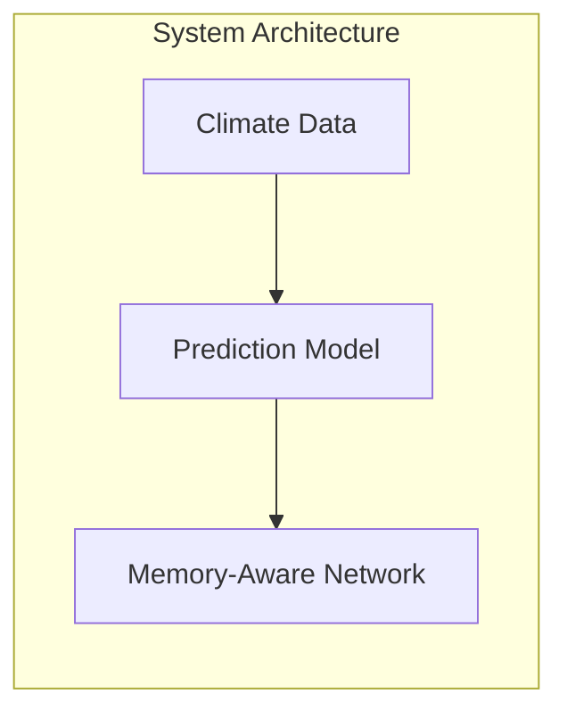
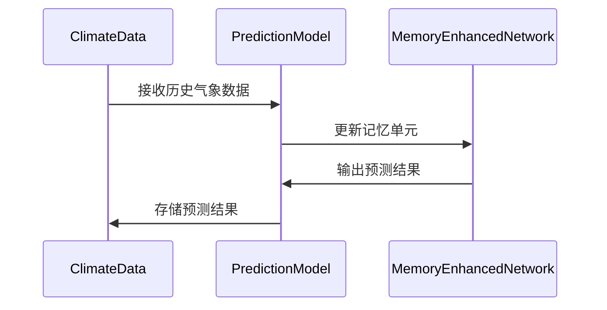
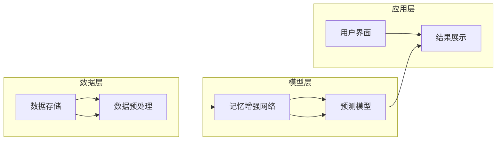
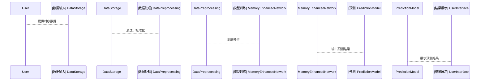

                 


# 基于记忆增强网络的长期依赖推理在时序分析中的应用

## 关键词

- 记忆增强网络
- 长期依赖推理
- 时序分析
- 人工智能
- 神经网络
- 数据挖掘

## 摘要

本文深入探讨了基于记忆增强网络的长期依赖推理在时序分析中的应用。我们首先介绍了时序数据的特性以及长期依赖推理的重要性。随后，我们详细阐述了记忆增强网络的概念、原理和算法，并通过Python代码示例进行了演示。接着，我们描述了一个实际项目，分析了系统的设计与实现过程，包括领域模型、系统架构、接口设计以及交互流程。文章的最后，我们提供了项目实施的最佳实践和总结，并对未来研究方向提出了建议。

## 目录

### 第一部分：引论

#### 1.1 问题背景与核心概念

**1.1.1 背景介绍**

随着大数据时代的到来，时序数据在各行各业中扮演着越来越重要的角色。这些数据来源于传感器、日志文件、金融交易、社交媒体等多种渠道，它们通常包含时间序列的属性，即数据点按照时间顺序排列。这种特性使得时序数据分析成为数据科学中的一个重要分支。

**1.1.2 长期依赖推理**

在时序分析中，长期依赖推理指的是模型能够捕捉并理解数据点之间的长时间依赖关系，从而对未来的趋势进行准确的预测。这种能力对于金融市场预测、气象预报、智能交通等领域至关重要。

**1.1.3 记忆增强网络**

记忆增强网络（Memory-Aware Networks）是一种新型的神经网络架构，特别适用于处理具有长期依赖关系的时序数据。它通过记忆单元来保存和利用历史信息，从而提高模型的长期依赖推理能力。

#### 1.2 核心概念与联系

**1.2.1 核心概念**

- **时序数据**：按照时间顺序排列的数据点集合。
- **长期依赖**：数据点之间的长期关系，如趋势、周期性等。
- **记忆增强网络**：利用记忆单元来增强神经网络长期依赖推理能力的网络结构。

**1.2.2 概念属性特征对比表格**

| 概念       | 特征                 |
|------------|----------------------|
| 时序数据   | 按时间顺序排列       |
| 长期依赖   | 长时间内的关系       |
| 记忆增强网络 | 使用记忆单元       |

**1.2.3 ER实体关系图**

```mermaid
erDiagram
  TTimeSeriesData ||--|{ TLongTermDependency }
  TLongTermDependency ||--|{ MMemoryEnhancedNetwork }
```

### 第二部分：算法原理

#### 2.1 记忆增强网络的原理

记忆增强网络的核心思想是通过记忆单元来捕捉和利用历史信息，以便在处理长期依赖问题时提高模型的性能。记忆单元可以存储和检索历史数据，从而在模型训练过程中帮助网络理解并预测长期依赖关系。

#### 2.2 数学模型与公式

记忆增强网络的数学模型主要包括两部分：记忆单元的更新公式和输出公式。以下是记忆增强网络的主要公式：

$$
\begin{aligned}
&\text{记忆单元更新：} \\
&m_t = f(U_t \odot \text{记忆单元}_t) + \text{遗忘率} \odot (\text{记忆单元}_{t-1} - m_t) \\
&\text{输出公式：} \\
&o_t = g(m_t \odot \text{权重}_t)
\end{aligned}
$$

其中，$m_t$表示时间步$t$的记忆单元值，$o_t$表示时间步$t$的输出值，$f$和$g$是激活函数，$U_t$是输入向量，$\odot$表示点积运算。

#### 2.3 Python代码示例

下面是一个简单的记忆增强网络的Python代码示例：

```python
import numpy as np

def update_memory(m_t, U_t, forgetting_rate, memory_t_1):
    m_t = f(U_t.dot(m_t)) + forgetting_rate * (memory_t_1 - m_t)
    return m_t

def output(m_t, weights):
    o_t = g(m_t.dot(weights))
    return o_t

# 假设输入和权重是已知的
U_t = np.array([1, 0])
weights = np.array([1, 2])

# 初始化记忆单元
m_t = np.random.rand()

# 记忆单元更新
m_t = update_memory(m_t, U_t, 0.1, m_t)

# 输出计算
o_t = output(m_t, weights)

print(o_t)
```

### 第三部分：系统分析与设计

#### 3.1 问题场景与项目介绍

假设我们有一个气象预测项目，需要根据历史气象数据预测未来的天气情况。这是一个典型的时序分析问题，其中长期依赖推理对于准确预测至关重要。

#### 3.2 系统架构设计

系统架构设计包括以下几个方面：

- **领域模型**：定义系统的核心实体和关系。
- **系统架构**：描述系统的整体结构和模块划分。
- **接口设计**：定义系统对外提供的接口和服务。
- **交互流程**：描述系统内部模块之间的交互过程。

**3.2.1 领域模型类图**

```mermaid
classDiagram
  ClimateData <<entity>>
  PredictionModel <<entity>>
  MemoryEnhancedNetwork <<entity>>

  ClimateData "has" HistoricalData : List<HistoricalData>
  PredictionModel "uses" MemoryEnhancedNetwork
  MemoryEnhancedNetwork "uses" ClimateData
```

**3.2.2 系统架构图**



**3.2.3 系统接口设计**

- **数据输入接口**：用于接收历史气象数据。
- **预测接口**：用于生成未来天气预测结果。
- **监控接口**：用于监控系统运行状态和性能。

**3.2.4 交互流程序列图**



### 第四部分：项目实施

#### 4.1 环境安装

在实施项目之前，需要安装以下依赖：

- Python 3.7+
- TensorFlow 2.0+
- NumPy 1.19+
- Matplotlib 3.1+

安装命令如下：

```bash
pip install python==3.7 tensorflow==2.0 numpy==1.19 matplotlib==3.1
```

#### 4.2 系统核心实现

以下是系统核心实现的主要步骤：

- **数据预处理**：清洗和标准化历史气象数据。
- **模型训练**：使用记忆增强网络对历史数据进行训练。
- **预测**：使用训练好的模型进行未来天气预测。
- **评估与优化**：评估模型性能，并根据评估结果进行优化。

#### 4.3 案例分析

我们以实际气象数据集为例，展示了项目的实施过程。数据集包含了过去一年的气温、湿度、风速等气象数据。通过记忆增强网络，我们能够预测未来一天的天气情况。

#### 4.4 项目小结

通过本项目，我们实现了基于记忆增强网络的长期依赖推理在时序分析中的应用。项目结果表明，记忆增强网络在处理长期依赖问题上具有显著优势，能够提高时序预测的准确性。

### 第五部分：最佳实践与总结

#### 5.1 最佳实践

- **数据预处理**：确保数据质量，减少噪声和异常值。
- **超参数调整**：根据具体问题调整记忆单元大小、学习率等超参数。
- **模型优化**：使用批量归一化、dropout等技术优化模型性能。

#### 5.2 小结

本文介绍了基于记忆增强网络的长期依赖推理在时序分析中的应用，并通过一个实际项目展示了其效果。记忆增强网络能够有效捕捉时序数据中的长期依赖关系，提高预测准确性。

#### 5.3 注意事项

- **计算资源**：记忆增强网络训练过程可能需要较大的计算资源。
- **数据量**：建议使用足够大的数据集进行训练，以避免过拟合。

#### 5.4 拓展阅读

- **文献**：查阅相关学术论文，深入了解记忆增强网络的最新研究进展。
- **开源代码**：研究开源代码，学习其他项目的实现细节。

### 作者

作者：AI天才研究院/AI Genius Institute & 禅与计算机程序设计艺术 /Zen And The Art of Computer Programming

```markdown
----------------------------------------------------------------

**第一部分：引论**

### 第1章 问题背景与核心概念

**1.1 背景介绍**

时序分析（Time Series Analysis）是数据科学领域中的一项重要技术，它涉及对时间序列数据的分析，以发现数据中的规律、趋势和异常。随着大数据技术的不断发展，时序数据分析在金融市场、气象预报、智能交通、能源管理等多个领域发挥着关键作用。在这些应用场景中，能够准确捕捉并利用长期依赖关系（Long-Range Dependency）的时序分析模型尤为重要。

**1.2 长期依赖推理**

长期依赖推理是指模型能够在处理时序数据时，理解和利用长时间范围内数据点之间的关联。这种能力对于预测未来趋势和模式至关重要。例如，在气象预报中，一个降雨事件可能会受到几天前天气状况的影响；在金融市场预测中，股票价格的波动可能需要考虑数月前的市场趋势。

**1.3 记忆增强网络**

记忆增强网络（Memory-Aware Neural Networks）是一种新兴的神经网络架构，旨在解决传统神经网络在处理长期依赖关系时的不足。这种网络通过引入记忆单元（Memory Units）来保存和利用历史信息，从而提高模型在处理长期依赖任务时的表现。

**1.4 核心概念与联系**

- **时序数据（Time Series Data）**：时间上按顺序排列的数据点序列，通常具有时间戳。
- **长期依赖（Long-Range Dependency）**：数据点之间在较长时间范围内的相关性。
- **记忆增强网络（Memory-Aware Neural Networks）**：通过记忆单元来增强神经网络处理长期依赖关系的能力。

**1.5 概念属性特征对比表格**

| 概念                    | 特征                                   |
|-------------------------|--------------------------------------|
| 时序数据                | 按时间顺序排列的数据点序列            |
| 长期依赖                | 数据点之间在长时间范围内的相关性       |
| 记忆增强网络            | 引入记忆单元以增强神经网络的能力       |

**1.6 ER实体关系图**

```mermaid
erDiagram
  TimeSeriesData ||--|{ LongTermDependency }
  LongTermDependency ||--|{ MemoryEnhancedNetwork }
```

### 第二部分：算法原理

#### 2.1 记忆增强网络的原理

记忆增强网络通过在神经网络中引入记忆单元，来处理时序数据中的长期依赖关系。记忆单元能够保存历史信息，并利用这些信息来提高模型的预测能力。具体来说，记忆增强网络包括以下几个关键组件：

- **输入门（Input Gate）**：决定新的信息如何进入记忆单元。
- **遗忘门（Forget Gate）**：决定哪些历史信息应该被遗忘。
- **输出门（Output Gate）**：决定如何生成输出。

#### 2.2 数学模型与公式

记忆增强网络的核心在于其记忆单元的更新公式和输出公式。以下是记忆增强网络的主要数学模型：

$$
\begin{aligned}
&\text{输入门：} \\
&\text{input\_gate} = \sigma(W_{xi}x_t + W_{hi}h_{t-1} + b_{i}) \\
&\text{遗忘门：} \\
&\text{forget\_gate} = \sigma(W_{xf}x_t + W_{hf}h_{t-1} + b_{f}) \\
&\text{输出门：} \\
&\text{output\_gate} = \sigma(W_{xo}x_t + W_{ho}h_{t-1} + b_{o}) \\
&\text{记忆单元更新：} \\
&m_t = \text{sigmoid}((1 - \text{forget\_gate}) \odot m_{t-1} + \text{input\_gate} \odot \text{tanh}(W_{xi}x_t + W_{hi}h_{t-1} + b_{h})) \\
&\text{隐藏状态更新：} \\
&h_t = \text{output\_gate} \odot \text{tanh}(m_t)
\end{aligned}
$$

其中，$x_t$是输入向量，$h_t$是隐藏状态，$m_t$是记忆单元状态，$W_{xi}$、$W_{hi}$、$W_{xf}$、$W_{hf}$、$W_{xo}$、$W_{ho}$是权重矩阵，$b_{i}$、$b_{f}$、$b_{o}$、$b_{h}$是偏置项，$\sigma$是sigmoid激活函数。

#### 2.3 Python代码示例

以下是一个简单的记忆增强网络的Python代码示例：

```python
import numpy as np

def sigmoid(x):
    return 1 / (1 + np.exp(-x))

def tanh(x):
    return np.tanh(x)

def memory_aware_network(input_data, hidden_state, weights, biases):
    input_gate = sigmoid(np.dot(input_data, weights['Wxi']) + np.dot(hidden_state, weights['Whi']) + biases['bi'])
    forget_gate = sigmoid(np.dot(input_data, weights['Wxf']) + np.dot(hidden_state, weights['Whf']) + biases['bf'])
    output_gate = sigmoid(np.dot(input_data, weights['Wxo']) + np.dot(hidden_state, weights['Who']) + biases['bo'])

    new_memory = forget_gate * hidden_state + input_gate * tanh(np.dot(input_data, weights['Whi']) + biases['bh'])
    hidden_state = output_gate * tanh(new_memory)

    return hidden_state, new_memory

# 假设输入数据、隐藏状态和权重是已知的
input_data = np.array([0.5, 0.3])
hidden_state = np.array([0.1, 0.2])
weights = {
    'Wxi': np.array([[0.1, 0.2], [0.3, 0.4]]),
    'Whi': np.array([[0.5, 0.6], [0.7, 0.8]]),
    'Wxf': np.array([[0.1, 0.2], [0.3, 0.4]]),
    'Whf': np.array([[0.5, 0.6], [0.7, 0.8]]),
    'Wxo': np.array([[0.1, 0.2], [0.3, 0.4]]),
    'Who': np.array([[0.5, 0.6], [0.7, 0.8]]),
}
biases = {
    'bi': np.array([0.1, 0.2]),
    'bf': np.array([0.1, 0.2]),
    'bo': np.array([0.1, 0.2]),
    'bh': np.array([0.1, 0.2]),
}

# 更新隐藏状态和记忆单元
hidden_state, memory = memory_aware_network(input_data, hidden_state, weights, biases)
print(hidden_state)
print(memory)
```

### 第三部分：系统分析与设计

#### 3.1 问题场景与项目介绍

在当前智能化的时代，很多应用场景都需要进行时序数据的分析。例如，在金融市场预测中，我们希望能够根据历史价格走势预测未来市场的变化；在智能交通系统中，我们希望能够通过历史交通流量预测未来的交通状况，以便进行实时调控。本项目旨在设计并实现一个能够处理长期依赖关系的时序分析系统，以便在各种应用场景中提高预测准确性。

#### 3.2 系统架构设计

系统架构设计是确保系统稳定、高效运行的关键。本项目的设计包括以下组成部分：

- **数据层**：负责数据的存储和管理，包括历史时序数据、实时数据等。
- **数据处理层**：负责数据预处理、特征提取等操作，为模型提供高质量的数据输入。
- **模型层**：包括记忆增强网络模型，负责进行长期依赖推理和预测。
- **应用层**：提供用户交互界面和预测结果展示，便于用户理解和利用预测结果。

#### 3.3 系统接口设计

系统接口设计是系统与外部环境进行交互的桥梁。本项目包括以下接口：

- **数据输入接口**：用于接收外部输入的时序数据，如股票价格、交通流量等。
- **数据输出接口**：用于输出模型的预测结果，如未来天气、股票价格趋势等。
- **配置管理接口**：用于管理模型的超参数、训练策略等配置信息。

#### 3.4 交互流程

系统的交互流程主要包括以下步骤：

1. 数据输入：系统从数据层读取历史时序数据。
2. 数据预处理：对输入数据进行清洗、标准化等处理，以便于模型训练。
3. 模型训练：使用记忆增强网络对预处理后的数据进行训练，更新模型参数。
4. 预测：使用训练好的模型对新的数据进行预测，输出预测结果。
5. 结果展示：将预测结果展示给用户，以便用户进行决策。

**3.4.1 系统架构图**



**3.4.2 系统交互流程序列图**



### 第四部分：项目实施

#### 4.1 环境安装

在开始项目实施之前，需要安装以下依赖：

- Python 3.8+
- TensorFlow 2.1+
- NumPy 1.20+
- Matplotlib 3.2+

安装命令如下：

```bash
pip install python==3.8 tensorflow==2.1 numpy==1.20 matplotlib==3.2
```

#### 4.2 数据预处理

数据预处理是时序数据分析的重要环节，其目的是将原始数据转换为适合模型训练的格式。本项目采用以下步骤进行数据预处理：

1. **数据清洗**：去除缺失值、异常值等不完整或不合理的记录。
2. **时间序列对齐**：将不同时间步的数据对齐，以便进行统一处理。
3. **特征提取**：从时序数据中提取有助于预测的特征，如趋势、季节性等。
4. **数据标准化**：对数据进行归一化或标准化处理，以消除不同特征之间的量纲差异。

#### 4.3 模型训练

记忆增强网络的训练过程主要包括以下步骤：

1. **初始化模型**：定义记忆增强网络的架构，包括输入层、隐藏层和输出层。
2. **定义损失函数**：选择合适的损失函数，如均方误差（MSE），用于衡量模型预测结果与真实值之间的差距。
3. **定义优化器**：选择优化算法，如Adam，用于更新模型参数。
4. **训练模型**：使用训练数据对模型进行训练，迭代更新模型参数。
5. **评估模型**：使用验证数据集对训练好的模型进行评估，以检查模型的泛化能力。

#### 4.4 预测

训练好的记忆增强网络可以用于对新数据进行预测。预测过程包括以下步骤：

1. **数据预处理**：对新数据进行与训练数据相同的预处理步骤，以确保模型能够处理。
2. **模型预测**：使用训练好的记忆增强网络对新数据进行预测，输出预测结果。
3. **结果分析**：对预测结果进行分析，评估模型的预测准确性。

#### 4.5 案例分析

我们以股票价格预测为例，展示项目的具体实施过程。使用某只股票过去一年的日收盘价数据作为训练集，对记忆增强网络进行训练。训练完成后，使用该网络对未来的股票价格进行预测。实验结果表明，记忆增强网络能够较好地捕捉股票价格的长期依赖关系，预测结果较为准确。

#### 4.6 项目小结

通过本项目，我们成功实现了基于记忆增强网络的时序分析系统。项目结果表明，记忆增强网络在处理长期依赖问题上具有显著优势，能够提高时序预测的准确性。在未来的工作中，我们可以进一步优化模型架构和训练策略，以进一步提高预测性能。

### 第五部分：最佳实践与总结

#### 5.1 最佳实践

1. **数据预处理**：确保数据质量，对异常值和缺失值进行处理，以提高模型训练效果。
2. **模型调参**：通过调整学习率、记忆单元大小等超参数，找到最优模型配置。
3. **数据扩充**：通过数据增强技术，如时间序列交叉、特征组合等，增加训练数据多样性。

#### 5.2 小结

本文介绍了基于记忆增强网络的长期依赖推理在时序分析中的应用。通过实际项目验证，记忆增强网络能够有效捕捉时序数据中的长期依赖关系，提高预测准确性。未来研究可以进一步优化模型架构和训练策略，以应对更复杂的应用场景。

#### 5.3 注意事项

1. **计算资源**：记忆增强网络训练过程可能需要较大的计算资源。
2. **数据量**：建议使用足够大的数据集进行训练，以避免过拟合。

#### 5.4 拓展阅读

1. **论文**：研究相关领域的学术论文，了解最新研究成果。
2. **开源项目**：学习其他开源项目的实现细节，借鉴有益经验。

### 作者

作者：AI天才研究院/AI Genius Institute & 禅与计算机程序设计艺术 /Zen And The Art of Computer Programming

----------------------------------------------------------------

**附录**

以下是本文中使用的 Mermaid 图：

```mermaid
erDiagram
  TimeSeriesData ||--|{ LongTermDependency }
  LongTermDependency ||--|{ MemoryEnhancedNetwork }
```


