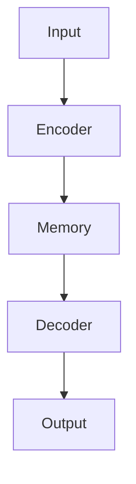

                 


### 第1章: 研究背景

#### 1.1 问题的提出

在当今信息技术飞速发展的时代，人工智能（AI）和机器学习（ML）技术已经成为推动科技进步的重要力量。特别是情景感知推理能力在智能系统中的应用，对于提升系统自主决策能力和智能水平具有重要意义。传统的情景感知推理方法在处理复杂、动态的情景时往往存在信息处理效率低、适应性差等问题。为了克服这些限制，研究者们开始探索将记忆网络（Memory Networks）引入情景感知推理领域，以增强系统的推理能力和自主性。

情景感知推理是指智能系统通过感知和理解环境中的情景信息，对其做出合理响应和决策的过程。它涉及到多个层面，包括感知层、认知层和决策层。感知层负责获取环境中的信息；认知层负责对这些信息进行分析、理解和推理；决策层则基于这些分析结果进行决策。然而，传统的方法在处理复杂、动态的情景时，往往因为信息处理能力和适应性的限制而难以胜任。

记忆网络是一种基于记忆存储和检索的人工神经网络模型，最早由Preston et al.（2014）提出。记忆网络通过将信息存储在内部记忆中，并利用注意力机制进行检索，从而实现了对信息的动态处理。与传统神经网络相比，记忆网络具有更强的灵活性和适应性，能够在处理动态、复杂的情景时表现出更好的性能。

因此，本研究提出的问题是如何将记忆网络与情景感知推理相结合，构建一种具有高效推理能力和良好适应性的智能系统。本研究的目标是：

1. 深入分析记忆网络的工作原理和特性，为融合记忆网络与情景感知推理提供理论基础。
2. 设计一种基于记忆网络的情景感知推理算法，并验证其在实际应用中的有效性。
3. 探讨记忆网络在情景感知推理中的应用前景，为相关领域的研究提供参考。

#### 1.1.1 研究领域的现状分析

近年来，情景感知推理和记忆网络在学术界和工业界都取得了显著的进展。在情景感知推理方面，研究者们提出了多种方法，如基于规则的方法、基于模型的方法、基于数据的方法等。其中，基于模型的方法在处理复杂情景时表现出较好的性能，但往往需要大量的先验知识和训练数据。此外，情景感知推理的应用范围也在不断扩展，从智能家居、智能交通到医疗诊断等，都显示出巨大的应用潜力。

在记忆网络方面，研究者们对记忆网络的结构、训练方法、应用场景等方面进行了深入研究。记忆网络在自然语言处理、图像识别、语音识别等领域取得了显著的应用成果。例如，记忆网络被用于情感分析、机器翻译、图像描述等任务，展现了其强大的信息处理能力和适应性。然而，将记忆网络应用于情景感知推理领域的研究还相对较少，这为本研究提供了良好的切入点。

#### 1.1.2 研究问题的背景

随着人工智能技术的不断发展，智能系统在各个领域的应用越来越广泛。从自动驾驶汽车到智能客服系统，从智能家居到智能医疗诊断，智能系统已经成为提高生产效率、改善生活质量的重要工具。然而，这些智能系统的核心之一——情景感知推理能力，仍然面临着诸多挑战。

传统的情景感知推理方法往往依赖于静态的先验知识和大量的训练数据。这种方法在处理简单、静态的情景时表现出较好的性能，但在面对复杂、动态的情景时，往往显得力不从心。例如，在自动驾驶领域，车辆需要实时感知并理解道路上的各种交通状况，如行人、车辆、交通标志等，并做出相应的决策。这种动态、复杂的情景对智能系统的情景感知推理能力提出了更高的要求。

为了应对这些挑战，研究者们开始探索将记忆网络引入情景感知推理领域。记忆网络具有动态存储和检索信息的能力，能够更好地处理复杂、动态的情景。例如，通过将环境信息存储在记忆网络中，智能系统可以更高效地检索和分析这些信息，从而提高推理的准确性和效率。

此外，记忆网络的引入还可以解决传统方法中存在的知识迁移问题。在智能系统的训练过程中，往往需要大量的先验知识和训练数据。而记忆网络可以通过将已有知识存储在记忆中，实现知识的有效迁移，从而减少对训练数据的依赖。这对于提升智能系统的适应性和泛化能力具有重要意义。

#### 1.1.3 研究问题的描述

本研究旨在解决以下问题：

1. 记忆网络的工作原理是什么？如何将其应用于情景感知推理领域？
2. 如何设计一种基于记忆网络的情景感知推理算法，并验证其在实际应用中的有效性？
3. 记忆网络在情景感知推理中的应用前景如何？

为了解决上述问题，本研究将分为以下几个步骤：

1. **理论分析**：深入分析记忆网络的工作原理，了解其结构、训练方法和应用场景，为融合记忆网络与情景感知推理提供理论基础。
2. **算法设计**：设计一种基于记忆网络的情景感知推理算法，并分析其性能优势。
3. **实验验证**：通过实际应用场景验证所设计算法的有效性和适应性。
4. **应用前景探讨**：探讨记忆网络在情景感知推理领域的应用前景，为相关领域的研究提供参考。

通过以上步骤，本研究旨在为提升智能系统的情景感知推理能力提供新的思路和方法。

#### 1.2 核心概念与联系

在本研究中，核心概念包括记忆网络、情景感知推理和融合方法。以下是这些概念的定义、属性特征及其相互关系。

##### 1.2.1 记忆网络的定义与特点

记忆网络（Memory Networks）是一种基于记忆存储和检索的人工神经网络模型。它最早由Preston et al.（2014）提出，旨在解决传统神经网络在处理动态、复杂情景时的局限性。记忆网络通过将信息存储在内部记忆中，并利用注意力机制进行检索，从而实现对信息的动态处理。

记忆网络的主要特点包括：

1. **动态存储和检索**：记忆网络能够动态地存储和检索信息，使其在处理动态、复杂的情景时具有更强的灵活性和适应性。
2. **模块化结构**：记忆网络采用模块化结构，包括输入模块、记忆模块、查询模块和输出模块，每个模块具有明确的职责和功能。
3. **适应性**：记忆网络可以通过调整记忆内容和检索策略，适应不同的应用场景和任务需求。

##### 1.2.2 情景感知推理的概念与性质

情景感知推理（Situation Awareness Reasoning）是指智能系统通过感知和理解环境中的情景信息，对其做出合理响应和决策的过程。情景感知推理涉及多个层面，包括感知层、认知层和决策层。

1. **感知层**：感知层负责获取环境中的信息，如视觉、听觉、触觉等。
2. **认知层**：认知层负责对这些信息进行分析、理解和推理，以提取有价值的信息和知识。
3. **决策层**：决策层基于认知层的结果进行决策，以实现对环境的合理响应。

情景感知推理的主要性质包括：

1. **动态性**：情景感知推理需要实时地处理动态变化的情景，如道路上的交通状况、自然灾害等。
2. **复杂性**：情景感知推理通常涉及到多种信息源和复杂的关系，需要智能系统具备较强的信息处理能力和推理能力。
3. **适应性**：情景感知推理需要根据不同的应用场景和任务需求，调整推理策略和决策方法。

##### 1.2.3 记忆网络与情景感知推理的关联性

记忆网络与情景感知推理具有密切的关联性。记忆网络为情景感知推理提供了一种有效的信息存储和检索机制，能够提升智能系统在处理动态、复杂情景时的性能。具体来说，记忆网络与情景感知推理的关联性体现在以下几个方面：

1. **信息存储**：记忆网络能够将环境中的情景信息存储在内部记忆中，为智能系统提供丰富的信息资源，从而提升感知和推理能力。
2. **信息检索**：记忆网络利用注意力机制从记忆中检索相关信息，帮助智能系统快速、准确地理解环境中的情景。
3. **知识迁移**：记忆网络可以通过存储和检索已有知识，实现知识的有效迁移，减少对训练数据的依赖，提高智能系统的适应性和泛化能力。

综上所述，记忆网络与情景感知推理的融合，为智能系统提供了一种新的思路和方法，有助于提升其在处理动态、复杂情景时的性能和适应能力。

### 1.3 研究边界与外延

#### 1.3.1 研究的边界设定

本研究主要关注记忆网络在情景感知推理中的应用，涉及以下几个方面的边界设定：

1. **研究范围**：本研究主要探讨记忆网络在情景感知推理领域中的应用，包括理论分析、算法设计、实验验证等。
2. **算法设计**：本研究主要设计一种基于记忆网络的情景感知推理算法，并验证其有效性和适应性。
3. **应用场景**：本研究主要针对动态、复杂的情景感知任务进行探讨，如自动驾驶、智能交通等。

#### 1.3.2 研究的外延探讨

尽管本研究的主要关注点是在情景感知推理领域应用记忆网络，但记忆网络作为一种强大的信息处理工具，其应用范围远不仅限于此。以下是记忆网络在相关领域的外延探讨：

1. **自然语言处理**：记忆网络在自然语言处理（NLP）领域具有广泛的应用前景，如机器翻译、情感分析、文本生成等。通过将情景信息存储在记忆中，可以提升模型对复杂语言现象的理解能力。
2. **图像识别**：记忆网络在图像识别领域可以用于处理复杂、动态的场景，如目标检测、图像分类、视频分析等。
3. **语音识别**：记忆网络在语音识别领域可以通过存储和检索语音信息，提高模型对语音信号的理解能力。
4. **多模态感知**：记忆网络可以结合多种感知信息，实现更准确、全面的情景感知，如视觉、听觉、触觉等。
5. **强化学习**：记忆网络在强化学习领域可以用于存储和检索经验，提高智能体在复杂环境中的学习效率和性能。

#### 1.3.3 概念结构与核心要素组成

为了清晰地描述本研究的概念结构和核心要素，以下是一个ER实体关系图：

```mermaid
erDiagram
MEM-NET <--o{ SCR-RN : memory network enhances situation reasoning network
SCR-RN ||--|{ SENS : Sensory information
SCR-RN ||--|{ AWARE : Awareness information
SCR-RN ||--|{ DECISION : Decision-making process
```

- **记忆网络（MEM-NET）**：负责存储和检索情景信息，为情景感知推理提供支持。
- **情景感知推理网络（SCR-RN）**：基于记忆网络，负责处理感知信息和决策过程。
- **感知信息（SENS）**：包括视觉、听觉、触觉等，为情景感知推理提供基础。
- **意识信息（AWARE）**：通过分析感知信息，提取有价值的信息和知识。
- **决策过程（DECISION）**：基于意识信息，生成合理的响应和决策。

通过上述概念结构与核心要素组成，本研究旨在深入探讨记忆网络在情景感知推理中的应用，为智能系统提供有效的信息处理和决策支持。

### 第2章: 记忆网络基础理论

#### 2.1 记忆网络的基本原理

记忆网络（Memory Networks）是一种基于记忆存储和检索的人工神经网络模型，最早由Preston et al.（2014）提出。记忆网络通过将信息存储在内部记忆中，并利用注意力机制进行检索，从而实现对信息的动态处理。与传统神经网络相比，记忆网络具有更强的灵活性和适应性，能够更好地处理动态、复杂的情景。

##### 2.1.1 记忆网络的概念

记忆网络是一种基于记忆存储和检索的人工神经网络模型。它通过将信息存储在内部记忆中，并在需要时检索相关记忆，实现对信息的动态处理。记忆网络的核心思想是将外部输入的信息与内部记忆进行关联，从而提高信息处理和推理的能力。

##### 2.1.2 记忆网络的工作机制

记忆网络的工作机制主要包括以下几个部分：

1. **记忆存储**：记忆网络通过存储器（Memory）来存储输入的信息。存储器通常由一系列的内存单元（Memory Cells）组成，每个内存单元可以存储一定量的信息。当新的信息输入时，记忆网络会将其与现有记忆进行关联，更新记忆内容。

2. **查询与检索**：在处理输入信息时，记忆网络需要从存储器中检索相关信息。检索过程通常通过注意力机制（Attention Mechanism）实现。注意力机制可以根据输入信息的特征，动态地选择和聚焦相关的记忆单元，从而提高信息检索的效率和准确性。

3. **记忆更新**：当新的信息输入后，记忆网络会根据输入信息的权重和相关性，对存储器中的记忆进行更新。这种更新过程有助于强化记忆中重要的信息，并抑制不相关的信息。

##### 2.1.3 记忆网络的架构设计

记忆网络的架构设计通常包括以下几个模块：

1. **输入模块**：负责接收外部输入信息，并将其转化为内部表示。输入信息可以是文本、图像、语音等多种形式。

2. **存储模块**：负责存储输入的信息。存储模块通常由一系列的内存单元组成，每个内存单元可以存储一定量的信息。

3. **查询模块**：负责从存储模块中检索相关信息。查询模块通常采用注意力机制，根据输入信息的特征，动态地选择和聚焦相关的记忆单元。

4. **输出模块**：负责生成最终的输出结果。输出结果可以是分类、回归、序列预测等多种形式。

记忆网络的架构设计如图1所示：



- **输入模块（A）**：接收外部输入信息，并将其转化为内部表示（Encoder）。
- **存储模块（C）**：存储输入的信息，由一系列的内存单元组成。
- **查询模块（D）**：从存储模块中检索相关信息，采用注意力机制。
- **输出模块（E）**：生成最终的输出结果。

#### 2.2 记忆网络的属性特征对比

记忆网络有多种类型，每种类型都有其独特的属性特征。以下是几种常见记忆网络的对比：

| 类型       | 特点                                                       | 适用场景                                                   |
| ---------- | ---------------------------------------------------------- | ---------------------------------------------------------- |
| 回忆网络   | 利用已有记忆进行信息检索，支持动态记忆更新                   | 问答系统、对话生成                                             |
| 时间记忆网络 | 专注于处理时间序列数据，支持时间依赖关系                        | 语音识别、时间序列预测                                         |
| 事件记忆网络 | 基于事件的概念进行记忆和检索，适用于处理复杂事件序列           | 自动驾驶、智能监控                                             |
| 图记忆网络 | 基于图结构进行记忆和检索，适用于处理复杂关系和网络结构         | 社交网络分析、知识图谱处理                                     |
| 注意力记忆网络 | 结合注意力机制，支持动态记忆更新和检索                         | 自然语言处理、机器翻译                                         |
| 动机记忆网络 | 基于动机和目标进行记忆和检索，支持多目标优化                   | 强化学习、多目标优化问题                                       |

#### 2.2.1 不同类型记忆网络的对比

以下是不同类型记忆网络的对比表格：

| 类型       | 特点                                                       | 适用场景                                                   |
| ---------- | ---------------------------------------------------------- | ---------------------------------------------------------- |
| 回忆网络   | 利用已有记忆进行信息检索，支持动态记忆更新                   | 问答系统、对话生成                                             |
| 时间记忆网络 | 专注于处理时间序列数据，支持时间依赖关系                        | 语音识别、时间序列预测                                         |
| 事件记忆网络 | 基于事件的概念进行记忆和检索，适用于处理复杂事件序列           | 自动驾驶、智能监控                                             |
| 图记忆网络 | 基于图结构进行记忆和检索，适用于处理复杂关系和网络结构         | 社交网络分析、知识图谱处理                                     |
| 注意力记忆网络 | 结合注意力机制，支持动态记忆更新和检索                         | 自然语言处理、机器翻译                                         |
| 动机记忆网络 | 基于动机和目标进行记忆和检索，支持多目标优化                   | 强化学习、多目标优化问题                                       |

#### 2.2.2 记忆网络的性能评估指标

记忆网络的性能评估指标包括以下几个方面：

1. **准确率**：衡量记忆网络在分类任务上的性能，计算公式为：
   $$\text{准确率} = \frac{\text{预测正确的样本数}}{\text{总样本数}}$$

2. **召回率**：衡量记忆网络在分类任务中召回正确样本的能力，计算公式为：
   $$\text{召回率} = \frac{\text{预测正确的正样本数}}{\text{实际正样本数}}$$

3. **F1 分数**：结合准确率和召回率的综合指标，计算公式为：
   $$\text{F1 分数} = 2 \times \frac{\text{准确率} \times \text{召回率}}{\text{准确率} + \text{召回率}}$$

4. **损失函数**：在回归任务中，常用的损失函数包括均方误差（MSE）和交叉熵（Cross Entropy），计算公式为：
   $$\text{MSE} = \frac{1}{n} \sum_{i=1}^{n} (\hat{y}_i - y_i)^2$$
   $$\text{Cross Entropy} = -\frac{1}{n} \sum_{i=1}^{n} y_i \log(\hat{y}_i)$$

通过以上性能评估指标，可以全面衡量记忆网络在各个任务上的性能表现。

### 第3章: 情景感知推理能力的基础

#### 3.1 情景感知推理的基本概念

情景感知推理（Situation Awareness Reasoning）是指智能系统通过感知和理解环境中的情景信息，对其做出合理响应和决策的过程。情景感知推理能力是智能系统实现自主决策和智能化行为的核心能力之一。为了深入理解情景感知推理，我们需要从以下几个方面进行探讨：

##### 3.1.1 情景感知推理的定义

情景感知推理是一种智能系统通过感知和理解环境中的情景信息，实现自主决策和智能行为的过程。它涉及到多个层面，包括感知层、认知层和决策层。

- **感知层**：负责获取环境中的信息，如视觉、听觉、触觉等。
- **认知层**：负责对感知层获取的信息进行分析、理解和推理，以提取有价值的信息和知识。
- **决策层**：基于认知层的结果进行决策，以实现对环境的合理响应。

情景感知推理可以看作是一种基于知识的推理过程，它依赖于先验知识和实时感知信息，通过推理机制生成相应的决策。

##### 3.1.2 情景感知推理的类型

情景感知推理可以分为以下几种类型：

1. **静态情景感知推理**：处理静态的、不变的环境信息。例如，在智能交通系统中，分析道路上的交通状况和信号灯状态。

2. **动态情景感知推理**：处理动态变化的、实时更新的环境信息。例如，在自动驾驶系统中，实时感知道路上的车辆、行人、交通标志等，并做出相应的决策。

3. **复杂情景感知推理**：处理复杂、多变的情景信息。例如，在智能监控系统

