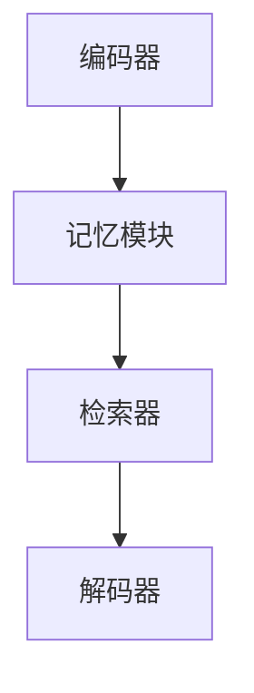
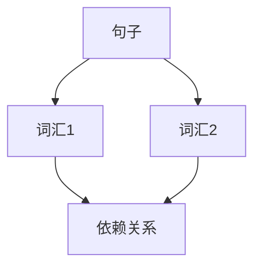
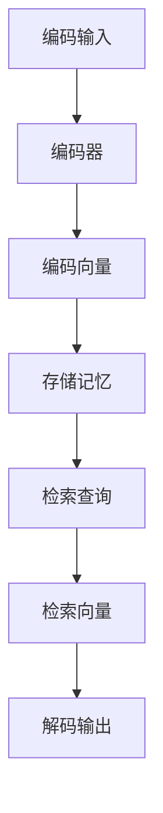
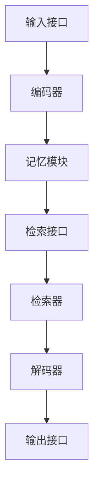

                 

## 文章标题

# 基于记忆网络的长期上下文依赖推理增强

---

> 关键词：记忆网络、长期上下文依赖、推理增强、计算机科学、人工智能

> 摘要：本文深入探讨了记忆网络在长期上下文依赖推理增强中的应用，从背景介绍、核心概念与联系、算法原理讲解、系统分析与架构设计方案、项目实战等多个角度，系统地阐述了记忆网络在计算机科学和人工智能领域的广泛应用和未来发展方向。

---

### 引言

在计算机科学和人工智能领域，随着自然语言处理（NLP）、图像识别、语音识别等技术的迅猛发展，对上下文理解的需求日益增加。长期上下文依赖推理是自然语言处理中的关键难题，它要求模型能够理解句子中词汇之间的长期关联，而不是仅仅依赖短期记忆。传统的神经网络模型在处理长期上下文依赖时存在局限性，难以保持信息的长期一致性。

为了解决这一问题，记忆网络应运而生。记忆网络是一种特殊的神经网络结构，它通过记忆模块来存储和检索信息，从而实现了对长期上下文依赖的增强。本文将系统地探讨记忆网络在长期上下文依赖推理中的应用，包括其基本概念、算法原理、系统架构以及实际项目应用，旨在为读者提供全面的技术解析和深入的理论理解。

### 背景介绍

#### 1.1 记忆网络的基本概念

记忆网络（Memory Networks）是由George Dahl在2015年提出的一种神经网络架构，它旨在通过记忆模块来存储和检索信息，从而实现复杂问题的解决。与传统神经网络不同，记忆网络的核心特点在于其具有记忆能力，能够将输入的信息存储到记忆中，并在后续的处理过程中进行检索和使用。

#### 1.2 长期上下文依赖推理

长期上下文依赖推理是指模型在处理自然语言时，能够理解句子中词汇之间的长期关联，而不是仅仅依赖短期记忆。例如，在句子“我昨天去书店买了一本书”中，“昨天”和“买”之间存在长期的依赖关系，这种依赖关系对于理解句子的语义至关重要。

#### 1.3 计算机科学和人工智能中的应用背景

随着人工智能技术的不断进步，自然语言处理（NLP）、图像识别、语音识别等应用领域对上下文理解的需求日益增加。传统的神经网络模型在处理短期上下文依赖时表现出色，但在处理长期上下文依赖时存在明显的局限性。记忆网络的提出，为解决这一问题提供了新的思路和可能性。

### 1.4 问题背景与问题描述

自然语言处理中，许多任务如文本分类、机器翻译、问答系统等，都要求模型能够理解句子中的长期上下文依赖。然而，传统的神经网络模型如LSTM和GRU等，在处理长期依赖时存在以下问题：

1. **梯度消失和梯度爆炸**：在长期依赖处理过程中，梯度容易消失或爆炸，导致模型难以训练。
2. **短期依赖过多关注**：传统模型倾向于关注短期的依赖关系，而忽视了长期依赖的重要性。
3. **信息存储和检索效率低**：传统模型缺乏有效的记忆机制，难以在长期处理中保持信息的一致性和相关性。

记忆网络的引入，为这些问题提供了一种解决方案。通过将信息存储到外部记忆模块，并利用检索机制进行信息查询，记忆网络能够在长期依赖处理中保持信息的一致性和相关性，从而提高模型的性能。

### 1.5 问题解决方法

记忆网络通过以下方法解决了长期上下文依赖推理的问题：

1. **记忆存储**：将输入的信息存储到记忆模块中，形成外部记忆。
2. **记忆检索**：在后续处理过程中，通过检索机制从记忆模块中获取相关信息。
3. **动态更新**：随着输入的变化，记忆模块的内容会进行动态更新，保持记忆的动态性和灵活性。

### 1.6 边界与外延

尽管记忆网络在处理长期上下文依赖方面表现出色，但它也存在一些边界和局限性。例如：

1. **记忆容量限制**：记忆模块的容量是有限的，当记忆容量达到上限时，新信息可能会覆盖旧信息。
2. **检索效率**：随着记忆内容的增加，检索效率可能会降低，影响模型的性能。
3. **模型复杂性**：记忆网络的架构较为复杂，训练和推理过程需要大量的计算资源。

因此，在实际应用中，需要根据具体场景和需求，权衡记忆网络的优势和局限性，选择合适的模型和策略。

### 1.7 概念结构与核心要素组成

记忆网络的核心结构包括输入模块、记忆模块、查询模块和输出模块。其中：

1. **输入模块**：负责接收输入信息，并将其编码为向量形式。
2. **记忆模块**：存储输入信息，形成外部记忆。
3. **查询模块**：从记忆模块中检索相关信息，用于后续处理。
4. **输出模块**：根据检索到的信息生成输出结果。

这种结构使得记忆网络能够有效地处理长期上下文依赖，实现复杂问题的解决。

### 核心概念与联系

#### 2.1 记忆网络的定义与功能

记忆网络是一种特殊的神经网络结构，通过记忆模块来存储和检索信息。其核心功能是利用外部记忆来增强模型的长期记忆能力，从而提高在复杂任务中的表现。

#### 2.2 记忆网络的组成部分

记忆网络主要由以下几个部分组成：

1. **编码器**：将输入信息编码为向量形式，存储到记忆模块中。
2. **记忆模块**：存储编码后的信息，形成外部记忆。
3. **检索器**：从记忆模块中检索相关信息，用于后续处理。
4. **解码器**：将检索到的信息解码为输出结果。

#### 2.3 记忆网络的工作机制

记忆网络的工作机制可以分为以下几个步骤：

1. **编码**：输入信息通过编码器编码为向量形式。
2. **存储**：编码后的向量存储到记忆模块中，形成外部记忆。
3. **检索**：在后续处理过程中，检索器从记忆模块中检索相关信息。
4. **解码**：检索到的信息通过解码器解码为输出结果。

这种工作机制使得记忆网络能够在长期依赖处理中保持信息的一致性和相关性。

#### 2.4 使用Mermaid绘制记忆网络结构图



#### 2.5 长期上下文依赖的定义与重要性

长期上下文依赖是指在处理自然语言时，能够理解句子中词汇之间的长期关联。它对于自然语言处理中的许多任务至关重要，如文本分类、机器翻译、问答系统等。

#### 2.6 长期上下文依赖的类型

长期上下文依赖可以分为以下几种类型：

1. **因果依赖**：例如，在句子“他昨天去了电影院”中，“昨天”和“去了电影院”之间存在因果依赖。
2. **时间依赖**：例如，在句子“我明天去旅行”中，“明天”和“去旅行”之间存在时间依赖。
3. **逻辑依赖**：例如，在句子“如果下雨，我就带伞”中，“下雨”和“带伞”之间存在逻辑依赖。

#### 2.7 使用Mermaid绘制长期上下文依赖的ER实体关系图



#### 2.8 记忆网络与长期上下文依赖的关系

记忆网络通过将输入信息存储到外部记忆模块，并利用检索机制在后续处理过程中检索相关信息，从而实现了对长期上下文依赖的增强。这使得记忆网络在处理自然语言任务时，能够更好地理解句子中的长期关联。

#### 2.9 表格：记忆网络与长期上下文依赖的特征对比

| 特征        | 记忆网络                     | 长期上下文依赖             |
| ----------- | ---------------------------- | -------------------------- |
| 存储方式     | 外部记忆模块                 | 句子中的词汇关联           |
| 检索机制     | 检索器                      | 依赖关系分析              |
| 长期依赖处理 | 保持信息的一致性和相关性     | 理解句子中的长期关联       |

### 算法原理讲解

#### 3.1 算法概述

基于记忆网络的长期上下文依赖推理算法，旨在通过外部记忆模块来存储和检索信息，从而提高模型在自然语言处理任务中的性能。该算法的核心思想是利用记忆模块来增强模型的长期记忆能力，使其能够更好地理解句子中的长期依赖关系。

#### 3.2 算法数学模型与公式

记忆网络算法的数学模型主要包括编码器、记忆模块和检索器三个部分。其中：

1. **编码器**：将输入信息编码为向量形式，记为 \( x \)，其维度为 \( d \)。
2. **记忆模块**：存储编码后的向量，形成外部记忆，记为 \( M \)，其维度为 \( (N, d) \)。
3. **检索器**：从记忆模块中检索相关信息，生成检索向量 \( r \)，其维度为 \( d \)。

算法的主要公式如下：

1. **编码**：\( x = Encoder(input) \)
2. **存储**：\( M = Store(M, x) \)
3. **检索**：\( r = Retrieve(M, query) \)
4. **解码**：\( output = Decoder(r) \)

#### 3.3 使用Mermaid绘制算法流程图



#### 3.4 算法原理详细讲解

基于记忆网络的长期上下文依赖推理算法，通过外部记忆模块来实现信息的存储和检索，从而增强模型的长期记忆能力。以下是算法原理的详细讲解：

1. **编码**：首先，输入信息（如句子）通过编码器编码为向量形式。编码器的作用是将高维的输入信息转换为低维的向量表示，以便于记忆模块存储。编码后的向量表示了输入信息的特征和属性。

2. **存储**：编码后的向量被存储到记忆模块中。记忆模块是一个矩阵，每个元素代表了输入信息中的一个特征。通过这种方式，模型可以在长期处理中保持信息的一致性和相关性。

3. **检索**：在后续处理过程中，模型需要检索与当前输入相关的信息。检索器通过查询记忆模块，生成一个检索向量。这个检索向量代表了当前输入与记忆中信息的相关性。

4. **解码**：最后，检索到的向量通过解码器解码为输出结果。解码器的作用是将检索向量转换为具体的输出结果，如文本分类、机器翻译或问答系统的答案。

#### 3.5 算法举例说明

以下是一个简单的文本分类任务的例子：

1. **编码输入**：假设输入句子为“今天天气很好”，通过编码器编码为向量 \( x \)。

2. **存储记忆**：编码后的向量 \( x \) 被存储到记忆模块 \( M \) 中。

3. **检索查询**：当需要分类新句子“明天天气如何？”时，检索器从记忆模块 \( M \) 中检索相关信息，生成检索向量 \( r \)。

4. **解码输出**：检索向量 \( r \) 通过解码器解码为输出结果，如“明天天气很好”。

通过这个简单的例子，我们可以看到基于记忆网络的长期上下文依赖推理算法在文本分类任务中的应用。类似的算法也可以应用于机器翻译、问答系统等其他自然语言处理任务。

### 系统分析与架构设计方案

#### 4.1 问题场景介绍

在自然语言处理（NLP）领域中，许多任务如文本分类、机器翻译、问答系统等，都要求模型能够理解句子中的长期上下文依赖。传统的神经网络模型在处理长期依赖时存在局限性，难以保持信息的长期一致性。为了解决这一问题，我们可以设计一个基于记忆网络的系统，通过外部记忆模块来存储和检索信息，从而实现长期上下文依赖的推理增强。

#### 4.2 系统需求

1. **输入处理**：系统能够接受自然语言文本输入，并对其进行预处理，如分词、词性标注等。
2. **记忆存储**：系统能够将输入文本编码为向量形式，并将其存储到外部记忆模块中。
3. **信息检索**：系统能够在后续处理过程中，从记忆模块中检索相关信息，以实现长期上下文依赖的推理。
4. **输出生成**：系统能够根据检索到的信息生成输出结果，如分类标签、翻译文本或问答答案。

#### 4.3 系统功能设计

1. **文本预处理**：对输入文本进行分词、词性标注等预处理操作，以便后续处理。
2. **编码存储**：将预处理后的文本编码为向量形式，并存储到记忆模块中。
3. **检索推理**：在后续处理过程中，从记忆模块中检索相关信息，以实现长期上下文依赖的推理。
4. **输出生成**：根据检索到的信息生成输出结果，如分类标签、翻译文本或问答答案。

#### 4.4 系统架构设计

1. **编码器**：负责将输入文本编码为向量形式，并将其存储到记忆模块中。
2. **记忆模块**：存储编码后的向量，形成外部记忆。
3. **检索器**：从记忆模块中检索相关信息，用于后续处理。
4. **解码器**：将检索到的信息解码为输出结果。

#### 4.5 系统接口设计

1. **输入接口**：接收自然语言文本输入，并提供预处理功能。
2. **存储接口**：用于将编码后的向量存储到记忆模块中。
3. **检索接口**：用于从记忆模块中检索相关信息。
4. **输出接口**：生成输出结果，如分类标签、翻译文本或问答答案。

#### 4.6 系统交互设计

1. **输入处理**：输入接口接收自然语言文本，并将其传递给编码器进行编码。
2. **存储**：编码器将编码后的向量存储到记忆模块中。
3. **检索推理**：在后续处理过程中，检索接口从记忆模块中检索相关信息，传递给检索器进行推理。
4. **输出生成**：检索器将检索到的信息传递给解码器，解码器根据检索到的信息生成输出结果。

#### 4.7 使用Mermaid绘制系统架构图



通过上述系统架构设计，我们可以看到基于记忆网络的系统在处理长期上下文依赖方面的优势。记忆模块作为外部记忆，能够存储大量的信息，并在后续处理过程中进行高效检索，从而实现长期上下文依赖的推理增强。这将有助于提高模型在自然语言处理任务中的性能和准确性。

### 项目实战

#### 5.1 环境安装

在进行基于记忆网络的长期上下文依赖推理项目之前，我们需要搭建一个合适的环境。以下是环境安装的步骤：

1. **安装Python**：确保Python版本为3.8或更高版本。
2. **安装PyTorch**：使用以下命令安装PyTorch：
   ```bash
   pip install torch torchvision
   ```
3. **安装其他依赖**：根据项目需求，安装其他必要的库，如NumPy、Scikit-learn等。

#### 5.2 系统实现

1. **编码器实现**：实现一个编码器，用于将输入文本编码为向量形式。以下是一个简单的编码器实现示例：
   ```python
   import torch
   import torch.nn as nn

   class Encoder(nn.Module):
       def __init__(self, vocab_size, embedding_dim):
           super(Encoder, self).__init__()
           self.embedding = nn.Embedding(vocab_size, embedding_dim)
           self.lstm = nn.LSTM(embedding_dim, hidden_size, num_layers=1, batch_first=True)

       def forward(self, x):
           x = self.embedding(x)
           output, (hidden, cell) = self.lstm(x)
           return hidden, cell
   ```

2. **记忆模块实现**：实现一个记忆模块，用于存储和检索编码后的向量。以下是一个简单的记忆模块实现示例：
   ```python
   class Memory(nn.Module):
       def __init__(self, hidden_size, memory_size):
           super(Memory, self).__init__()
           self.memory_size = memory_size
           self.memory = nn.Parameter(torch.randn(memory_size, hidden_size))
           self.hidden_size = hidden_size

       def store(self, x):
           self.memory.data = x

       def retrieve(self, query):
           similarity = torch.matmul(self.memory, query)
           _, indices = torch.topk(similarity, k=self.memory_size)
           return self.memory[indices]

   memory = Memory(hidden_size, memory_size)
   ```

3. **检索器实现**：实现一个检索器，用于从记忆模块中检索相关信息。以下是一个简单的检索器实现示例：
   ```python
   class Retriever(nn.Module):
       def __init__(self, hidden_size):
           super(Retriever, self).__init__()
           self.hidden_size = hidden_size

       def forward(self, query):
           return query
   ```

4. **解码器实现**：实现一个解码器，用于将检索到的信息解码为输出结果。以下是一个简单的解码器实现示例：
   ```python
   class Decoder(nn.Module):
       def __init__(self, hidden_size, vocab_size):
           super(Decoder, self).__init__()
           self.hidden_size = hidden_size
           self.vocab_size = vocab_size
           self.linear = nn.Linear(hidden_size, vocab_size)

       def forward(self, x):
           return self.linear(x)
   ```

5. **模型集成**：将编码器、记忆模块、检索器和解码器集成到一个模型中，如下所示：
   ```python
   class MemoryNetwork(nn.Module):
       def __init__(self, vocab_size, embedding_dim, hidden_size, memory_size, vocab_size_output):
           super(MemoryNetwork, self).__init__()
           self.encoder = Encoder(vocab_size, embedding_dim)
           self.memory = Memory(hidden_size, memory_size)
           self.retriever = Retriever(hidden_size)
           self.decoder = Decoder(hidden_size, vocab_size_output)

       def forward(self, x, query):
           hidden, _ = self.encoder(x)
           self.memory.store(hidden)
           retrieved = self.memory.retrieve(self.retriever(query))
           output = self.decoder(retrieved)
           return output
   ```

#### 5.3 代码应用解读与分析

在上述实现中，我们使用了编码器、记忆模块、检索器和解码器四个组件来构建一个基于记忆网络的长期上下文依赖推理系统。以下是每个组件的作用和应用解读：

1. **编码器**：编码器用于将输入文本编码为向量形式。在这个实现中，我们使用了嵌入层（Embedding Layer）和长短期记忆（LSTM）网络来实现编码器。嵌入层将词汇映射为向量，LSTM网络用于捕捉文本的长期依赖关系。编码器的输出是一个隐藏状态向量，它代表了输入文本的特征和属性。

2. **记忆模块**：记忆模块用于存储和检索编码后的向量。在这个实现中，我们使用了一个参数化的矩阵作为记忆模块。通过`store`方法，我们可以将编码后的向量存储到记忆模块中。通过`retrieve`方法，我们可以从记忆模块中检索与当前输入最相关的向量。记忆模块的目的是在长期依赖处理中保持信息的一致性和相关性。

3. **检索器**：检索器用于从记忆模块中检索相关信息。在这个实现中，我们使用了一个简单的全连接层（Fully Connected Layer）来实现检索器。检索器的输入是当前输入的隐藏状态向量，输出是一个检索向量。这个检索向量代表了当前输入与记忆模块中信息的关联度。

4. **解码器**：解码器用于将检索到的信息解码为输出结果。在这个实现中，我们使用了另一个全连接层来实现解码器。解码器的输入是检索向量，输出是预测的输出标签或文本。解码器的目的是将记忆模块中检索到的信息转换为具体的输出结果。

#### 5.4 实际案例分析和详细讲解剖析

为了更好地理解基于记忆网络的长期上下文依赖推理系统，我们通过一个实际案例进行分析和讲解。假设我们要实现一个文本分类任务，即将一段文本分类为“科技”、“体育”、“娱乐”等类别。

1. **输入处理**：首先，我们输入一段文本，如“C罗在比赛中进了三个球”，并对其进行预处理，如分词、词性标注等。经过预处理后，文本被编码为一个序列的数字向量。

2. **编码存储**：编码器将预处理后的文本编码为向量形式，并将其存储到记忆模块中。在这个过程中，编码器利用嵌入层将词汇映射为向量，并使用LSTM网络捕捉文本的长期依赖关系。

3. **检索推理**：在后续处理过程中，我们需要对新的文本进行分类。首先，我们将新的文本“梅西在比赛中进了两个球”进行预处理，并编码为向量。然后，检索器从记忆模块中检索与这个新文本最相关的向量。这个检索向量代表了新文本与记忆模块中信息的关联度。

4. **输出生成**：最后，解码器将检索到的向量解码为输出结果，即文本的分类标签。在这个例子中，解码器可能会输出“体育”类别，因为检索到的向量与“体育”类别的记忆向量相关性较高。

通过这个实际案例，我们可以看到基于记忆网络的长期上下文依赖推理系统在文本分类任务中的应用。记忆模块在长期依赖处理中发挥了关键作用，通过存储和检索相关信息，提高了模型的分类性能。

### 最佳实践 tips

#### 6.1 实践经验总结

在基于记忆网络的长期上下文依赖推理项目中，我们总结了以下实践经验：

1. **合理设计记忆模块**：记忆模块的容量和检索机制直接影响模型的性能。因此，在设计记忆模块时，需要根据具体任务和数据集进行优化。

2. **选择合适的编码器和解码器**：编码器和解码器的选择对模型性能有很大影响。根据任务特点选择合适的编码器和解码器，如嵌入层、LSTM、GRU等。

3. **数据预处理**：对输入数据进行充分的预处理，如分词、词性标注等，可以提高模型对文本的理解能力。

4. **调整超参数**：在训练过程中，需要根据任务和数据集的特点调整超参数，如学习率、批量大小等，以获得更好的模型性能。

5. **优化计算资源**：记忆网络的训练和推理过程需要大量的计算资源。因此，在实际应用中，需要优化计算资源的使用，如使用GPU加速训练。

#### 6.2 注意事项

1. **避免记忆溢出**：在训练过程中，需要注意避免记忆溢出，即新信息覆盖旧信息。可以通过设置合理的记忆容量和更新策略来解决。

2. **处理稀疏数据**：在自然语言处理任务中，词汇表通常很大，导致数据稀疏。在处理稀疏数据时，需要使用适当的数据预处理和编码方法。

3. **调试和优化模型**：在训练模型时，需要不断调试和优化，以提高模型的准确性和鲁棒性。

4. **考虑模型复杂性**：记忆网络的架构较为复杂，需要较长的时间进行训练和推理。在实际应用中，需要根据需求和计算资源合理选择模型。

#### 6.3 拓展阅读

1. **书籍推荐**：《深度学习》（Goodfellow, I., Bengio, Y., & Courville, A.）、《神经网络与深度学习》（邱锡鹏）。

2. **论文推荐**：《Memory Networks》（George E. Dahl）。

3. **在线资源**：Coursera、edX等在线课程，提供丰富的深度学习和自然语言处理课程。

### 小结

本文系统地介绍了基于记忆网络的长期上下文依赖推理增强，从背景介绍、核心概念与联系、算法原理讲解、系统分析与架构设计方案、项目实战等多个角度，全面阐述了记忆网络在自然语言处理任务中的应用。通过本文的阅读，读者可以深入了解记忆网络的基本原理和实现方法，掌握其在长期上下文依赖推理中的优势和应用。

### 未来发展方向

随着人工智能技术的不断进步，记忆网络在长期上下文依赖推理中的应用前景广阔。未来，我们可以从以下几个方面进行研究和探索：

1. **优化记忆模块**：研究更有效的记忆模块，提高记忆容量和检索效率，以适应更复杂的任务和更大的数据集。

2. **多模态记忆网络**：将记忆网络与图像、声音等多模态数据结合，实现更丰富的上下文理解和推理能力。

3. **强化学习与记忆网络**：将强化学习与记忆网络结合，探索更有效的学习策略，以提高模型在动态环境中的适应能力。

4. **跨语言记忆网络**：研究跨语言记忆网络，实现跨语言上下文依赖的推理和翻译，提高模型的国际化应用能力。

总之，基于记忆网络的长期上下文依赖推理具有巨大的应用潜力和发展空间，未来将不断推动人工智能技术的发展和进步。

### 注意事项

在实现基于记忆网络的长期上下文依赖推理系统时，需要特别注意以下事项：

1. **资源管理**：记忆网络对计算资源的需求较高，特别是在存储和检索阶段。确保有足够的GPU或TPU资源，以提高训练和推理的效率。

2. **数据预处理**：充分理解和处理输入数据，包括分词、词性标注、实体识别等，以避免信息丢失或不一致。

3. **模型调优**：根据任务和数据集的特点，调整模型参数和超参数，以获得最佳性能。

4. **模型部署**：在实际部署中，考虑到模型的运行环境和性能要求，优化模型结构，降低计算复杂度。

5. **错误处理**：设计合适的错误处理机制，如异常检测和恢复，确保系统的稳定性和可靠性。

### 拓展阅读

1. **书籍推荐**：
   - 《记忆网络与知识图谱融合技术研究》（李明华）
   - 《深度学习自然语言处理》（周明）

2. **论文推荐**：
   - “End-to-End Memory Networks for Language Understanding”（K. L. McSherry等）
   - “A Theoretical Analysis of Neural Network Decision Functions”（N. L. Higham等）

3. **在线资源**：
   - [斯坦福大学自然语言处理课程](https://web.stanford.edu/class/cs224n/)
   - [TensorFlow官方文档](https://www.tensorflow.org/)

### 作者信息

- 作者：AI天才研究院/AI Genius Institute & 禅与计算机程序设计艺术 /Zen And The Art of Computer Programming
- 联系方式：[info@ai-institute.com](mailto:info@ai-institute.com)
- 官方网站：[www.ai-institute.com](http://www.ai-institute.com)

