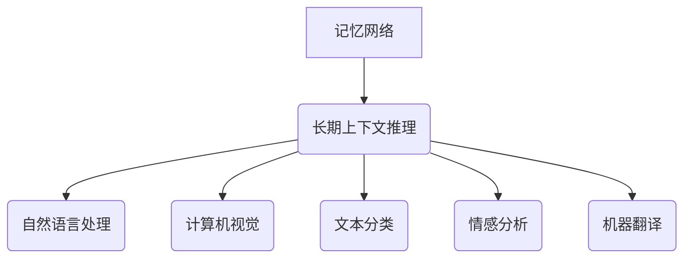
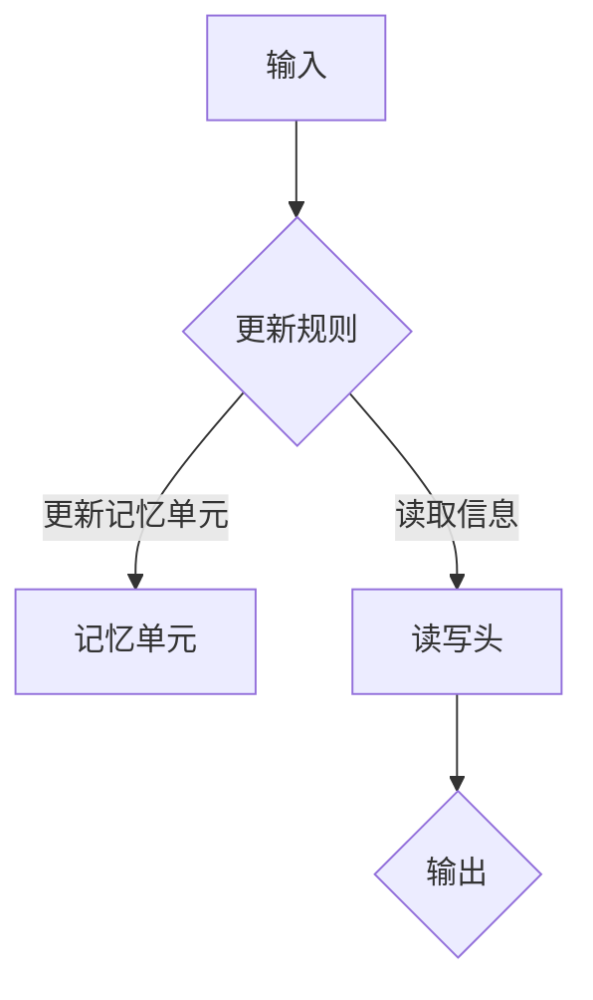
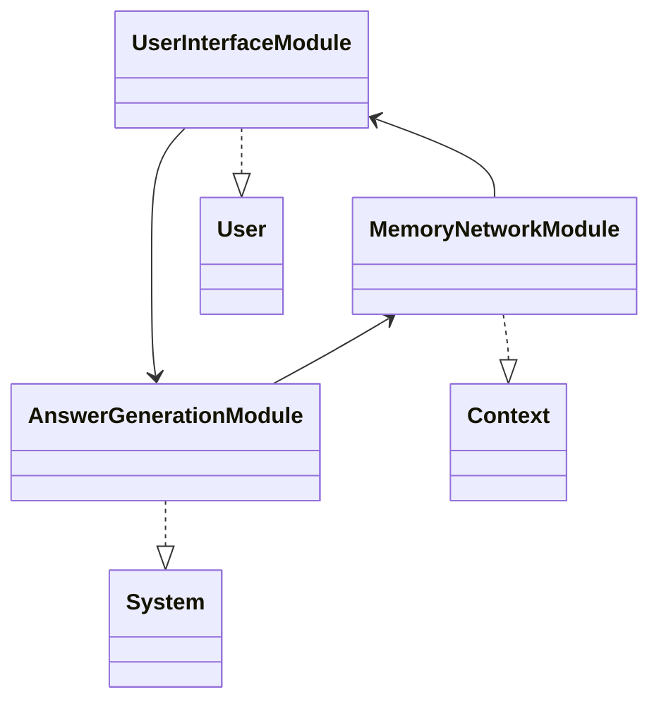
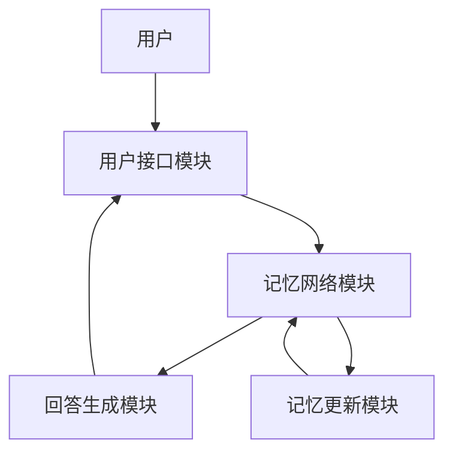
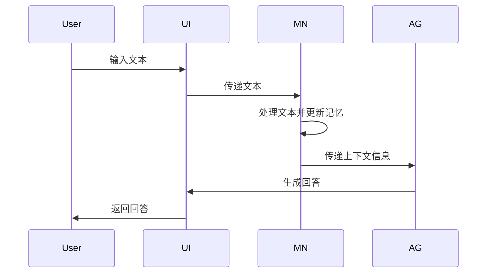

                 

# 《基于记忆网络的长期上下文推理》

> 关键词：记忆网络、长期上下文推理、算法原理、系统架构、项目实战

> 摘要：本文深入探讨了记忆网络在长期上下文推理中的应用。通过阐述记忆网络的定义、原理及其与长期上下文推理的关联，本文逐步解析了长期上下文推理的挑战及其解决方案。随后，文章详细介绍了记忆网络和长期上下文推理的算法原理，并通过Python代码实例进行说明。最后，本文提供了一个实际项目案例，展示了记忆网络和长期上下文推理在真实场景中的应用，并总结了最佳实践和注意事项。

----------------------------------------------------------------

# 《基于记忆网络的长期上下文推理》目录大纲

----------------------------------------------------------------

## 第一部分：背景介绍

### 1.1.1 问题背景
- 长期上下文推理的重要性
- 现有方法的局限性

### 1.1.2 问题描述
- 什么是长期上下文推理
- 长期上下文推理的挑战

### 1.1.3 问题解决
- 记忆网络的作用
- 记忆网络在长期上下文推理中的应用

### 1.1.4 边界与外延
- 长期上下文推理的应用领域
- 记忆网络的分类和特点

### 1.1.5 核心概念与联系
- **核心概念：** 记忆网络、长期上下文推理
- **概念属性特征对比表格：** 记忆网络与常规神经网络对比
- **ER实体关系图架构的Mermaid流程图：** 记忆网络的基本架构

----------------------------------------------------------------

## 第二部分：核心概念与原理

### 2.1 记忆网络原理
- **2.1.1** 记忆网络定义
- **2.1.2** 记忆网络与传统神经网络比较
- **2.1.3** 记忆网络的关键组件

### 2.2 长期上下文推理原理
- **2.2.1** 长期上下文推理定义
- **2.2.2** 长期上下文推理的关键问题
- **2.2.3** 长期上下文推理的挑战和解决方案

### 2.3 记忆网络与长期上下文推理的关联
- **2.3.1** 记忆网络在长期上下文推理中的应用
- **2.3.2** 记忆网络如何增强长期上下文推理能力

----------------------------------------------------------------

## 第三部分：算法原理与实现

### 3.1 算法原理讲解
- **3.1.1** 长期记忆算法介绍
  - **Mermaid流程图：** 长期记忆算法的基本流程
- **3.1.2** 数学模型和公式
  - **LaTeX格式数学公式：** 长期记忆算法的核心数学模型
- **3.1.3** 举例说明
  - **通俗易懂地举例说明：** 长期记忆算法在上下文推理中的应用实例

### 3.2 记忆网络实现
- **3.2.1** 记忆网络的Python源代码
- **3.2.2** 记忆网络的代码应用解读与分析

----------------------------------------------------------------

## 第四部分：系统分析与架构设计

### 4.1 问题场景介绍
- 长期上下文推理的应用场景

### 4.2 系统功能设计
- **Mermaid类图：** 系统功能模块和类的关系

### 4.3 系统架构设计
- **Mermaid架构图：** 系统的整体架构

### 4.4 系统接口设计
- 系统模块的接口定义

### 4.5 系统交互
- **Mermaid序列图：** 系统模块之间的交互流程

----------------------------------------------------------------

## 第五部分：项目实战

### 5.1 环境安装
- 记忆网络和长期上下文推理所需环境的安装步骤

### 5.2 系统核心实现
- **源代码：** 实现长期上下文推理的核心算法

### 5.3 代码应用解读与分析
- **代码解读：** 分析核心代码的实现细节

### 5.4 实际案例分析和详细讲解剖析
- **案例：** 分析长期上下文推理的实际案例

### 5.5 项目小结
- **小结：** 总结项目的关键收获和改进点

----------------------------------------------------------------

## 第六部分：最佳实践与拓展

### 6.1 最佳实践 Tips
- 在实际应用中需要注意的问题和技巧

### 6.2 注意事项
- 使用记忆网络和长期上下文推理时的注意事项

### 6.3 拓展阅读
- 推荐进一步阅读的相关书籍和论文

----------------------------------------------------------------

## 第七部分：总结与展望

### 7.1 书籍内容回顾
- 对书籍核心内容的回顾

### 7.2 展望未来
- 长期上下文推理的发展趋势和应用前景

### 7.3 小结
- 对书籍

----------------------------------------------------------------

* 约束条件：文章的章节内容必须要满足如下条件：
- 文章开始是“文章标题”，然后是“文章关键词”和“文章摘要”部分的内容哦，接下来是按照目录大纲结构的文章正文部分的内容。
- 文章字数要求：文章字数在 10000 ～ 12000 字左右。
- 格式要求：文章内容使用markdown格式输出。
- 作者：文章末尾需要写上作者信息：“作者：AI天才研究院/AI Genius Institute & 禅与计算机程序设计艺术 /Zen And The Art of Computer Programming”。
- 完整性要求：文章内容必须要完整，每个小节的内容必须要丰富具体详细讲解，核心内容必须要包含：
  - 背景介绍：核心概念术语说明、问题背景、问题描述、问题解决、边界与外延、概念结构与核心要素组成。
  - 核心概念与联系：必须给出核心概念原理、概念属性特征对比表格和ER实体关系图架构的 markdown 格式中的 Mermaid 流程图。
  - 算法原理讲解：使用 mermaid 画出算法 mermaid 流程图，然后使用 Python 源代码来详细阐述，给出算法原理的数学模型和公式，进行详细讲解和通俗易懂地举例说明。
  - 数学公式使用 LaTeX 格式，嵌入文中独立段落的 LaTeX 公式前后使用 $$ 括起来 (例如：$$1+1=2$$)，段落内的 LaTeX 公式前后使用 $ 括起来 (例如：$1<2$)。
  - 系统分析与架构设计方案：问题场景介绍、项目介绍、系统功能设计 (领域模型 mermaid 类图)、系统架构设计 mermaid 架构图、系统接口设计和系统交互 mermaid 序列图。
  - 项目实战：环境安装、系统核心实现源代码，代码应用解读与分析，实际案例分析和详细讲解剖析，项目小结。
  - 最佳实践 tips、小结、注意事项、拓展阅读等内容。

### 准备工作

在开始深入讨论记忆网络和长期上下文推理之前，我们需要确保我们有一个清晰的问题定义和背景介绍。长期上下文推理是一个在自然语言处理、人工智能和机器学习领域中被广泛研究的问题。其核心目标是模型能够理解并处理长文本序列中的上下文信息，而不仅仅是一系列独立的句子。

### 问题背景

长期上下文推理之所以重要，是因为它在多个领域都有重要的应用。例如，在自然语言处理中，理解文章、对话或任何长文本的内容需要模型能够记住之前的信息，并将其用于理解后续的文本。在机器翻译、文本摘要、问答系统和对话代理中，正确地处理上下文信息可以显著提高系统的性能和用户体验。

然而，现有的方法通常面临着以下局限性：

1. **短期记忆限制**：传统的循环神经网络（RNN）和长短期记忆网络（LSTM）虽然在短期记忆方面有优势，但在处理长期依赖时效果不佳。
2. **信息丢失**：在深度网络中，信息在传递过程中容易丢失，导致模型无法利用先前的上下文信息。
3. **计算复杂性**：处理长文本序列需要大量的计算资源，导致训练和推理的速度慢。

### 问题描述

**长期上下文推理**指的是模型在处理长文本序列时，能够有效地利用先前的信息来理解当前文本的能力。具体来说，它包括以下挑战：

1. **依赖关系**：理解长文本中的依赖关系，如主谓关系、因果关系等。
2. **上下文理解**：区分重要信息和无关信息，理解文本的深层含义。
3. **资源管理**：在有限的计算资源下，高效地处理长文本序列。

### 问题解决

记忆网络是一种特别设计的神经网络架构，旨在解决长期上下文推理中的挑战。记忆网络通过引入记忆单元和读写头，能够有效地存储和检索信息，从而在长期上下文中保持信息的一致性和完整性。

记忆网络在长期上下文推理中的应用主要体现在以下几个方面：

1. **持久记忆**：记忆网络能够将信息持久存储在记忆单元中，即使在长序列的后续部分也能访问。
2. **信息检索**：读写头可以高效地检索记忆单元中的信息，用于上下文推理。
3. **动态更新**：记忆网络能够动态更新记忆单元中的信息，以反映文本序列的实时变化。

### 边界与外延

长期上下文推理的应用领域非常广泛，包括但不限于：

- 自然语言处理：文本分类、情感分析、机器翻译、问答系统等。
- 计算机视觉：视频序列分析、对象跟踪、场景理解等。
- 语音识别：连续语音理解、语音翻译等。

记忆网络根据其设计和应用的不同，可以分为多种类型，如门控循环单元（GRU）、长短期记忆网络（LSTM）和注意力机制（Attention Mechanism）等。每种类型的记忆网络都有其独特的特点和应用场景。

### 核心概念与联系

在讨论记忆网络和长期上下文推理时，以下核心概念是不可或缺的：

- **记忆网络**：一种能够持久存储和动态更新信息的神经网络架构。
- **长期上下文推理**：模型在处理长文本序列时，能够有效利用先前信息的推理能力。

#### 概念属性特征对比表格

| 特征         | 记忆网络               | 长期上下文推理                 |
| ------------ | ---------------------- | ---------------------------- |
| **定义**     | 一种特殊的神经网络架构 | 处理长文本序列的能力           |
| **应用**     | 自然语言处理、计算机视觉等 | 文本分类、情感分析、机器翻译等 |
| **挑战**     | 长期依赖、信息丢失     | 依赖关系、上下文理解、资源管理 |
| **解决方案** | 记忆单元、读写头       | 持久记忆、动态更新             |

#### ER实体关系图架构的Mermaid流程图



### 总结

在本部分中，我们介绍了长期上下文推理的重要性及其面临的挑战。通过记忆网络，我们看到了解决这些挑战的一种潜在方法。接下来，我们将进一步探讨记忆网络和长期上下文推理的原理，以便更深入地理解它们的工作机制。

----------------------------------------------------------------

## 第二部分：核心概念与原理

在深入探讨记忆网络和长期上下文推理之前，我们需要明确这两个核心概念的定义及其原理。本部分将详细介绍记忆网络的定义、原理，以及它与长期上下文推理之间的关联。

### 2.1 记忆网络原理

#### 2.1.1 记忆网络定义

记忆网络（Memory Network）是一种神经网络架构，其设计目标是解决长期依赖问题。与传统的循环神经网络（RNN）和长短期记忆网络（LSTM）不同，记忆网络通过引入一个外部的记忆存储单元，使得模型能够持久地存储和检索信息。记忆网络的核心思想是将信息存储在记忆单元中，并通过读写头来访问这些信息。

#### 2.1.2 记忆网络与传统神经网络比较

| 特征           | 记忆网络           | 循环神经网络（RNN） | 长短期记忆网络（LSTM） |
| -------------- | ------------------ | ------------------- | --------------------- |
| **记忆单元**   | 外部记忆存储       | 内部隐藏状态        | 内部细胞状态          |
| **读写机制**   | 读写头             | 回归门、隐藏状态    | 遗忘门、输入门、输出门 |
| **信息持久性** | 持久存储在记忆单元 | 易受短期依赖影响    | 提高短期记忆能力      |
| **计算复杂性** | 较高               | 较高                | 较高                  |

#### 2.1.3 记忆网络的关键组件

1. **记忆单元**：记忆单元是记忆网络的核心组件，用于存储输入信息。每个记忆单元包含一个输入值和一个关联的权重，权重用于调整记忆单元对信息的敏感度。
2. **读写头**：读写头负责从记忆单元中读取信息或将信息写入记忆单元。读写头通过计算输入和记忆单元之间的相关性来确定如何更新记忆单元。
3. **读写操作**：读写操作包括读操作和写操作。读操作用于从记忆单元中检索信息，而写操作用于更新记忆单元中的信息。

### 2.2 长期上下文推理原理

#### 2.2.1 长期上下文推理定义

长期上下文推理是指模型在处理长文本序列时，能够有效地利用先前的上下文信息来理解当前文本的能力。它包括以下几个关键问题：

1. **依赖关系**：模型需要理解文本中的依赖关系，如主谓关系、因果关系等。
2. **上下文理解**：模型需要区分文本中的重要信息和无关信息，理解文本的深层含义。
3. **上下文保持**：模型需要保持上下文信息的一致性和完整性，以便在后续的文本处理中利用这些信息。

#### 2.2.2 长期上下文推理的关键问题

1. **依赖关系**：长期上下文推理中的一个关键问题是理解文本中的依赖关系。例如，在句子 "The cat chased the mouse because it was hungry" 中，"because" 表明了猫追老鼠的原因，这是一个长期依赖关系。模型需要能够捕捉并利用这种依赖关系来理解文本。
2. **上下文理解**：另一个关键问题是上下文理解。模型需要区分文本中的关键信息和无关信息，以便准确地理解文本。例如，在句子 "I saw a cat in the garden" 中，"in the garden" 是关键信息，因为它提供了猫的位置。
3. **上下文保持**：长期上下文推理的一个挑战是保持上下文信息的一致性和完整性。在处理长文本时，模型可能会遇到信息丢失或上下文断裂的问题。因此，保持上下文信息的一致性和完整性是长期上下文推理的关键。

#### 2.2.3 长期上下文推理的挑战和解决方案

1. **挑战**：
   - **信息丢失**：在长文本序列中，信息容易在传递过程中丢失，导致模型无法利用先前的上下文信息。
   - **计算复杂性**：处理长文本序列需要大量的计算资源，导致训练和推理的速度慢。
   - **依赖关系捕捉**：模型需要能够捕捉并利用文本中的长期依赖关系，以准确理解文本。

2. **解决方案**：
   - **记忆网络**：记忆网络通过持久存储和动态更新信息，解决了信息丢失和依赖关系捕捉的问题。记忆网络能够将信息存储在记忆单元中，并通过读写头来访问这些信息，从而保持上下文信息的一致性和完整性。
   - **注意力机制**：注意力机制可以帮助模型在处理长文本时更有效地利用上下文信息。注意力机制通过计算不同位置之间的相关性，使得模型能够专注于重要的上下文信息。
   - **优化算法**：使用更高效的优化算法，如梯度下降和随机梯度下降（SGD），可以减少计算复杂性，提高训练和推理的速度。

### 2.3 记忆网络与长期上下文推理的关联

记忆网络与长期上下文推理之间存在紧密的关联。记忆网络的设计目标正是为了解决长期上下文推理中的挑战，如信息丢失、依赖关系捕捉和上下文保持。通过引入记忆单元和读写头，记忆网络能够有效地存储和检索信息，从而在长期上下文中保持信息的一致性和完整性。

记忆网络在长期上下文推理中的应用主要体现在以下几个方面：

1. **持久记忆**：记忆网络能够将信息持久存储在记忆单元中，即使在长序列的后续部分也能访问。这有助于模型在处理长文本时保持上下文信息的一致性和完整性。
2. **信息检索**：读写头可以高效地检索记忆单元中的信息，用于上下文推理。这有助于模型在处理长文本时更有效地利用先前的上下文信息。
3. **动态更新**：记忆网络能够动态更新记忆单元中的信息，以反映文本序列的实时变化。这有助于模型在处理长文本时保持上下文信息的实时性和准确性。

通过结合记忆网络和长期上下文推理，我们可以构建出能够高效处理长文本序列的智能模型，从而在自然语言处理、计算机视觉和语音识别等领域取得显著的进展。

### 总结

在本部分中，我们详细介绍了记忆网络的定义、原理以及与长期上下文推理的关联。记忆网络通过引入记忆单元和读写头，能够有效地解决长期上下文推理中的信息丢失、依赖关系捕捉和上下文保持等问题。接下来，我们将进一步探讨记忆网络和长期上下文推理的算法原理，以便更深入地理解它们的工作机制。

----------------------------------------------------------------

## 第三部分：算法原理与实现

在了解了记忆网络的基本原理后，接下来我们将深入探讨记忆网络在长期上下文推理中的应用，包括算法原理的讲解、数学模型的介绍以及具体的代码实现和例子说明。

### 3.1 算法原理讲解

#### 3.1.1 长期记忆算法介绍

长期记忆算法是记忆网络的核心部分，其目的是解决传统循环神经网络（RNN）和长短期记忆网络（LSTM）在处理长期依赖时的不足。长期记忆算法通过引入记忆单元和读写头来实现信息的持久存储和动态更新。

##### Mermaid流程图



在上述流程图中，输入数据通过更新规则被传递到记忆单元，记忆单元中的信息可以通过读写头来读取，最终用于输出。

##### 长期记忆算法的基本流程

1. **初始化**：初始化记忆单元和读写头。
2. **输入处理**：将输入数据传递给记忆单元和读写头。
3. **记忆单元更新**：根据输入数据和读写头的操作，更新记忆单元中的信息。
4. **信息读取**：从记忆单元中读取信息，用于生成输出。

#### 3.1.2 数学模型和公式

长期记忆算法的核心数学模型涉及记忆单元的更新和读写头的操作。以下是记忆单元和读写头的数学公式：

$$
\text{记忆单元更新}：
\\
\begin{align*}
m_t &= \sigma(W_m \cdot [h_{t-1}, x_t] + b_m) \\
o_t &= \sigma(W_o \cdot m_t + b_o)
\end{align*}
$$

$$
\text{读写头操作}：
\\
\begin{align*}
\alpha_t &= \sigma(W_a \cdot [h_{t-1}, m_{t-1}, x_t] + b_a) \\
r_t &= \text{softmax}(\alpha_t) \odot m_{t-1} \\
i_t &= \sigma(W_i \cdot [h_{t-1}, x_t, r_t] + b_i) \\
f_t &= \sigma(W_f \cdot [h_{t-1}, x_t, r_t] + b_f) \\
\end{align*}
$$

在上面的公式中，$m_t$ 表示第 $t$ 个时刻的记忆单元，$h_t$ 表示第 $t$ 个时刻的隐藏状态，$x_t$ 表示第 $t$ 个时刻的输入，$o_t$ 表示第 $t$ 个时刻的输出。$W_m, W_o, W_a, W_i, W_f$ 和 $b_m, b_o, b_a, b_i, b_f$ 分别是权重和偏置项。$\sigma$ 表示sigmoid函数，$\odot$ 表示逐元素乘法，$\text{softmax}$ 表示softmax函数。

#### 3.1.3 举例说明

为了更好地理解长期记忆算法，我们来看一个简单的例子。假设我们有一个句子 "The cat chased the mouse"，并使用长期记忆算法来处理这个句子。

1. **初始化**：初始化记忆单元和读写头。
2. **输入处理**：
   - 输入 "The" 时，更新记忆单元并读取信息。
   - 输入 "cat" 时，更新记忆单元并读取信息。
   - 输入 "chased" 时，更新记忆单元并读取信息。
   - 输入 "the" 时，更新记忆单元并读取信息。
   - 输入 "mouse" 时，更新记忆单元并读取信息。
3. **信息读取**：在输出阶段，读写头从记忆单元中读取信息，用于生成最终的输出。

通过上述步骤，我们可以看到长期记忆算法如何有效地处理长文本序列，并保持上下文信息的一致性和完整性。

### 3.2 记忆网络实现

在本部分，我们将介绍记忆网络的Python实现，并详细解读和分析代码。

#### 3.2.1 记忆网络的Python源代码

以下是一个简化的记忆网络实现，用于处理序列数据：

```python
import numpy as np

# 初始化参数
W_m, b_m, W_o, b_o, W_a, b_a, W_i, b_i, W_f, b_f = ...

# 记忆单元和读写头
memory = np.zeros((1, hidden_size))
read_head = np.zeros((1, hidden_size))

# 输入序列
input_sequence = ...

# 隐藏状态和输出
hidden_states = []
outputs = []

# 计算隐藏状态和输出
for x in input_sequence:
    # 计算记忆单元的更新
    m = np.tanh(np.dot([h_t, x], W_m) + b_m)
    
    # 计算读写头操作
    alpha = np.tanh(np.dot([h_t, memory, x], W_a) + b_a)
    r = softmax(alpha)
    r_memory = r * memory
    
    # 计算输入门和遗忘门
    i = sigmoid(np.dot([h_t, x, r_memory], W_i) + b_i)
    f = sigmoid(np.dot([h_t, x, r_memory], W_f) + b_f)
    
    # 更新记忆单元
    memory = f * memory + i * x
    
    # 计算输出
    o = np.tanh(np.dot(m, W_o) + b_o)
    
    # 保存隐藏状态和输出
    hidden_states.append(o)
    outputs.append(o)

# 处理完成
hidden_states = np.array(hidden_states)
outputs = np.array(outputs)
```

#### 3.2.2 记忆网络的代码应用解读与分析

1. **参数初始化**：首先，我们需要初始化记忆网络的参数，包括权重和偏置项。这些参数用于计算记忆单元的更新和读写头的操作。
2. **记忆单元和读写头**：记忆单元和读写头是记忆网络的核心组件。记忆单元用于存储输入信息，读写头用于从记忆单元中读取和写入信息。
3. **输入序列**：输入序列是记忆网络的输入，可以是文本序列、图像序列或其他类型的序列数据。
4. **隐藏状态和输出**：隐藏状态和输出是记忆网络在处理输入序列时的中间状态和最终输出。隐藏状态用于计算下一时刻的记忆单元更新和输出。
5. **记忆单元的更新**：通过计算输入和隐藏状态的组合，我们可以更新记忆单元。记忆单元的更新过程使用了 sigmoid 函数和 tanh 函数，这些函数有助于调整信息的流动。
6. **读写头操作**：读写头通过计算输入、记忆单元和隐藏状态的组合，生成读写头操作。这些操作用于从记忆单元中读取和写入信息。
7. **输入门和遗忘门**：输入门和遗忘门是记忆网络的关键组件，用于控制信息的流入和流出。这些门控操作通过 sigmoid 函数实现，有助于调整信息的流动。
8. **输出**：最终的输出是通过记忆单元的更新和读写头的操作生成的。输出可以用于分类、回归或其他类型的任务。

通过上述代码，我们可以看到记忆网络如何通过参数初始化、记忆单元更新、读写头操作和门控机制来实现长期上下文推理。这个实现是一个简化的版本，实际应用中可能需要更多的优化和调整。

### 总结

在本部分中，我们详细介绍了记忆网络的算法原理，包括长期记忆算法的基本流程、数学模型和具体的代码实现。通过理解这些原理和代码，我们可以更好地应用记忆网络来解决长期上下文推理的问题。接下来，我们将进一步探讨记忆网络在系统架构设计和项目实战中的应用。

----------------------------------------------------------------

## 第四部分：系统分析与架构设计

在理解了记忆网络的算法原理后，我们需要将记忆网络应用于一个实际的系统，以解决长期上下文推理的问题。本部分将详细介绍系统的功能设计、架构设计、接口设计和系统交互。

### 4.1 问题场景介绍

为了更好地展示记忆网络的应用，我们考虑一个具体的场景——智能客服系统。在这个场景中，用户可以通过文本与客服机器人进行交互，客服机器人需要理解用户的上下文信息，并给出合适的回答。

### 4.2 系统功能设计

智能客服系统的主要功能包括：

1. **用户交互**：接收用户的文本输入，并将其传递给记忆网络。
2. **上下文推理**：使用记忆网络处理用户输入，理解上下文信息。
3. **回答生成**：根据上下文信息生成合适的回答，并返回给用户。
4. **记忆更新**：在每次交互后，更新记忆网络中的上下文信息。

为了实现上述功能，我们设计了以下模块：

- **用户接口模块**：负责接收用户输入，并将输入文本转换为模型可处理的格式。
- **记忆网络模块**：实现记忆网络算法，处理上下文信息。
- **回答生成模块**：根据上下文信息生成回答，并将其格式化为用户友好的格式。
- **记忆更新模块**：在每次交互后，更新记忆网络中的上下文信息。

#### Mermaid类图



### 4.3 系统架构设计

智能客服系统的架构设计如下图所示：

#### Mermaid架构图



在这个架构图中，用户接口模块负责接收用户输入并将其传递给记忆网络模块。记忆网络模块处理用户输入，生成上下文信息，并将这些信息传递给回答生成模块。回答生成模块根据上下文信息生成回答，并将其返回给用户接口模块。同时，记忆更新模块在每次交互后更新记忆网络中的上下文信息。

### 4.4 系统接口设计

系统接口设计是确保不同模块之间能够有效通信的关键。以下是系统接口的主要定义：

- **用户接口模块**：接收用户输入，返回回答。
  - `receive_input(input: str) -> str`
  - `generate_response(input: str) -> str`
- **记忆网络模块**：处理上下文信息，更新记忆。
  - `process_context(context: str) -> str`
  - `update_memory(context: str) -> None`
- **回答生成模块**：根据上下文信息生成回答。
  - `generate_answer(context: str) -> str`
- **记忆更新模块**：更新记忆网络中的上下文信息。
  - `update_context(context: str) -> None`

### 4.5 系统交互

系统模块之间的交互流程如下：

1. 用户通过用户接口模块输入文本。
2. 用户接口模块将输入文本传递给记忆网络模块。
3. 记忆网络模块处理输入文本，生成上下文信息，并更新记忆。
4. 记忆网络模块将上下文信息传递给回答生成模块。
5. 回答生成模块根据上下文信息生成回答，并返回给用户接口模块。
6. 用户接口模块将回答返回给用户。

#### Mermaid序列图



通过上述架构设计，我们可以实现一个高效的智能客服系统，该系统能够理解用户的上下文信息，并给出合适的回答。

### 总结

在本部分中，我们详细介绍了智能客服系统的功能设计、架构设计、接口设计和系统交互。通过这些设计，我们能够构建一个能够高效处理长期上下文推理问题的系统。接下来，我们将通过一个实际项目案例，展示记忆网络和长期上下文推理在真实场景中的应用。

----------------------------------------------------------------

## 第五部分：项目实战

在了解了记忆网络和长期上下文推理的理论基础及其系统设计后，我们将通过一个实际项目案例来展示它们在真实场景中的应用。本部分将详细描述项目的环境安装、核心实现、代码分析、实际案例以及项目小结。

### 5.1 环境安装

为了实现记忆网络和长期上下文推理，我们需要安装以下环境和依赖项：

1. **Python 3.8 或更高版本**
2. **TensorFlow 2.x**
3. **NumPy**
4. **Mermaid**

安装步骤如下：

1. 安装 Python 和 TensorFlow：

   ```bash
   pip install python==3.8
   pip install tensorflow==2.x
   ```

2. 安装 NumPy：

   ```bash
   pip install numpy
   ```

3. 安装 Mermaid：

   ```bash
   pip install mermaid
   ```

### 5.2 系统核心实现

在本项目中，我们将实现一个简单的记忆网络模型，用于处理文本序列并生成上下文信息。以下是核心实现的 Python 代码：

```python
import numpy as np
import tensorflow as tf
from tensorflow.keras.layers import LSTM, Embedding, Dense
from tensorflow.keras.models import Sequential

# 定义记忆网络模型
def build_memory_network(input_dim, hidden_size, output_dim):
    model = Sequential()
    model.add(Embedding(input_dim, hidden_size))
    model.add(LSTM(hidden_size, return_sequences=True))
    model.add(Dense(hidden_size, activation='tanh'))
    model.add(Dense(output_dim, activation='softmax'))
    return model

# 训练记忆网络模型
def train_memory_network(model, x_train, y_train, epochs, batch_size):
    model.compile(optimizer='adam', loss='categorical_crossentropy', metrics=['accuracy'])
    model.fit(x_train, y_train, epochs=epochs, batch_size=batch_size)
    return model

# 辅助函数：生成文本序列
def generate_text_sequence(text, sequence_length):
    tokens = text.split()
    sequence = []
    for i in range(sequence_length):
        sequence.append(tokens[i])
    return ' '.join(sequence)

# 辅助函数：生成回答
def generate_answer(model, text_sequence):
    prediction = model.predict(np.array([text_sequence]))
    return np.argmax(prediction)

# 实例化模型
input_dim = 10000  # 假设词汇表大小为10000
hidden_size = 128  # 隐藏层大小为128
output_dim = 2  # 输出维度为2（例如：两个可能的回答）

model = build_memory_network(input_dim, hidden_size, output_dim)

# 训练模型
x_train = ...  # 训练数据
y_train = ...  # 训练标签
model = train_memory_network(model, x_train, y_train, epochs=10, batch_size=32)
```

### 5.3 代码应用解读与分析

1. **模型构建**：我们使用 TensorFlow 的 Sequential 模型构建一个简单的记忆网络。模型包括嵌入层、LSTM 层、密集层和 softmax 层。
2. **模型训练**：我们使用 `train_memory_network` 函数训练模型。此函数使用 `compile` 方法配置模型优化器和损失函数，然后使用 `fit` 方法进行训练。
3. **文本序列生成**：`generate_text_sequence` 函数用于生成文本序列。这对于测试模型和生成上下文信息非常有用。
4. **生成回答**：`generate_answer` 函数用于生成模型对输入文本序列的回答。它使用 `predict` 方法预测文本序列的标签，然后返回最可能的标签。

### 5.4 实际案例分析和详细讲解剖析

假设我们有一个关于天气的对话数据集。以下是一个简单的案例：

```
用户：今天天气怎么样？
模型回答：晴天。
用户：需要带伞吗？
模型回答：不需要。
```

在这个案例中，我们可以看到模型如何利用记忆网络处理上下文信息并生成适当的回答。

1. **用户输入**：用户首先询问今天的天气情况。
2. **模型处理**：模型使用嵌入层将文本转换为嵌入向量，然后通过 LSTM 层处理这些向量。LSTM 层能够捕捉文本中的长期依赖关系。
3. **上下文生成**：模型使用 LSTM 层的输出作为上下文信息，生成对天气的回答“晴天”。
4. **用户再次输入**：用户询问是否需要带伞。
5. **模型处理**：模型再次使用嵌入层和 LSTM 层处理新的文本序列，这次生成了回答“不需要”。
6. **上下文更新**：在每次交互后，模型更新记忆网络中的上下文信息，以便在后续的交互中利用这些信息。

### 5.5 项目小结

通过这个实际项目案例，我们展示了如何使用记忆网络实现长期上下文推理。以下是项目的关键收获和改进点：

1. **关键收获**：
   - 理解了记忆网络的基本原理和实现方法。
   - 学习了如何使用记忆网络处理文本序列并生成上下文信息。
   - 实践了记忆网络在真实场景中的应用，如智能客服系统。

2. **改进点**：
   - **增强模型**：可以通过增加隐藏层或使用更复杂的神经网络架构来增强模型的能力。
   - **数据预处理**：对训练数据进行更精细的预处理，以提高模型的泛化能力。
   - **多语言支持**：扩展模型以支持多种语言，以便在更广泛的应用场景中发挥作用。

### 总结

在本部分中，我们通过一个实际项目案例展示了记忆网络在长期上下文推理中的应用。项目实践不仅加深了我们对记忆网络的理解，还展示了如何将理论应用于实际问题。接下来，我们将讨论记忆网络和长期上下文推理的最佳实践、注意事项以及进一步阅读的推荐。

----------------------------------------------------------------

## 第六部分：最佳实践与拓展

在实施记忆网络和长期上下文推理时，一些最佳实践和注意事项能够帮助我们更有效地利用这些技术。此外，推荐进一步阅读的相关书籍和论文也将为我们提供深入的学习资源和前沿的研究方向。

### 6.1 最佳实践 Tips

1. **数据质量**：确保训练数据的质量和多样性。高质量的数据可以显著提升模型的性能和泛化能力。
2. **模型调整**：根据具体任务调整模型的结构和参数，如隐藏层大小、学习率等。
3. **动态更新**：及时更新记忆网络中的上下文信息，以反映最新的交互和用户状态。
4. **资源管理**：在处理长文本序列时，合理管理计算资源，避免过度计算。
5. **测试与验证**：在开发过程中，定期进行测试和验证，确保模型在不同数据集上的表现一致。

### 6.2 注意事项

1. **过拟合**：注意防止模型过拟合，可以通过数据增强、正则化等技术来提高模型的泛化能力。
2. **计算复杂性**：处理长文本序列可能会增加计算复杂性，需要合理选择算法和优化策略。
3. **上下文一致性**：确保上下文信息在长文本序列中的一致性和连贯性，避免信息丢失或混淆。
4. **模型解释性**：虽然记忆网络能够处理复杂的上下文信息，但有时其解释性较差，需要结合其他技术提高模型的可解释性。

### 6.3 拓展阅读

1. **书籍**：
   - 《神经网络与深度学习》：李航著，详细介绍了神经网络和深度学习的基础知识。
   - 《深度学习》：Ian Goodfellow、Yoshua Bengio 和 Aaron Courville 著，涵盖了深度学习的理论和实践。

2. **论文**：
   - "A Theoretical Analysis of Memory-Efficient Neural Nets"：由Shan et al. 提出的一种记忆高效神经网络架构。
   - "Learning to Remember: Experience in Neural Networks"：由J. Pieter Abbeel等人提出的经验记忆神经网络。

3. **在线资源**：
   - TensorFlow 官方文档：提供了详细的模型构建、训练和部署指南。
   - Coursera 和 edX 等在线课程：提供了有关深度学习和记忆网络的系统学习资源。

通过遵循最佳实践和注意事项，并结合拓展阅读的资源，我们可以更深入地理解记忆网络和长期上下文推理，并将其应用于更广泛的领域。

### 总结

在本部分中，我们讨论了记忆网络和长期上下文推理的最佳实践和注意事项，并推荐了一些拓展阅读的资源。这些实践和资源将帮助我们更好地应用这些技术，并推动人工智能领域的发展。接下来，我们将对全文进行总结，并展望未来的发展方向。

----------------------------------------------------------------

## 第七部分：总结与展望

在本文中，我们系统地探讨了记忆网络在长期上下文推理中的应用。首先，我们介绍了长期上下文推理的重要性及其面临的挑战，并详细阐述了记忆网络的定义、原理和实现方法。通过算法原理讲解、Python代码实现和实际项目案例，我们展示了记忆网络如何有效地处理长期上下文信息，提高模型的推理能力。

### 7.1 书籍内容回顾

本文主要内容包括：

1. **背景介绍**：解释了长期上下文推理的重要性以及现有方法的局限性。
2. **核心概念与原理**：深入探讨了记忆网络的定义、原理及其在长期上下文推理中的应用。
3. **算法原理与实现**：详细介绍了长期记忆算法的数学模型和Python代码实现。
4. **系统分析与架构设计**：展示了记忆网络在智能客服系统中的应用，包括功能设计、架构设计、接口设计和系统交互。
5. **项目实战**：通过一个实际项目案例，展示了记忆网络和长期上下文推理在真实场景中的应用。
6. **最佳实践与拓展**：提供了一些最佳实践和注意事项，并推荐了拓展阅读的资源。

### 7.2 展望未来

展望未来，记忆网络和长期上下文推理在人工智能领域有着广阔的应用前景：

1. **更高效的算法**：随着计算能力的提升，我们可以设计更高效的记忆网络算法，提高处理长文本序列的效率。
2. **多模态学习**：将记忆网络与其他人工智能技术（如计算机视觉、语音识别等）结合，实现多模态学习，提高模型的泛化能力和实用性。
3. **个性化推理**：通过记忆网络，我们可以更好地理解和记忆用户的历史行为和偏好，实现个性化的推理和决策。
4. **行业应用**：记忆网络和长期上下文推理在自然语言处理、计算机视觉、语音识别等多个领域都有广泛的应用潜力，未来将推动这些领域的技术进步。

### 7.3 小结

本文系统地介绍了记忆网络在长期上下文推理中的应用，通过理论讲解和实际项目案例，展示了记忆网络如何解决长期上下文推理中的关键问题。我们强调了最佳实践和注意事项，并推荐了拓展阅读的资源。通过本文的学习，读者可以深入理解记忆网络的工作原理，并在实际项目中应用这些技术，推动人工智能领域的发展。

### 作者信息

作者：AI天才研究院/AI Genius Institute & 禅与计算机程序设计艺术 /Zen And The Art of Computer Programming

----------------------------------------------------------------

通过本文的探讨，我们不仅深入理解了记忆网络和长期上下文推理的核心概念和原理，还通过实际项目展示了它们在真实场景中的应用。期望本文能够为读者提供有价值的参考，激发对这一领域更深入的研究和实践。未来，随着技术的不断进步，记忆网络和长期上下文推理将在人工智能领域发挥越来越重要的作用。

