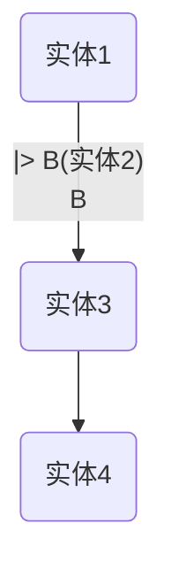
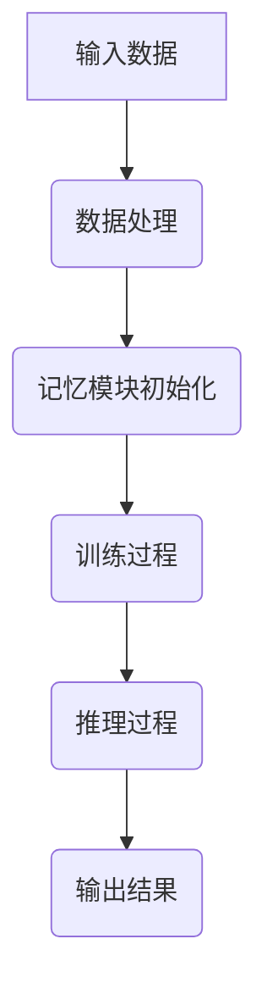
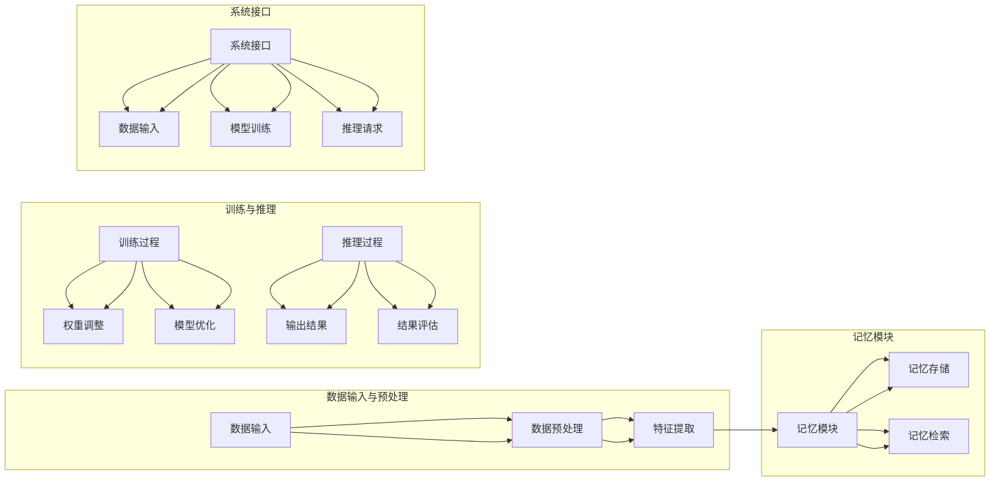
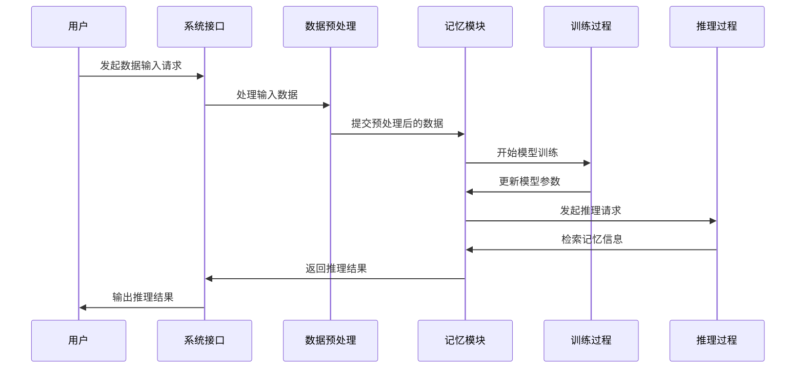

                 

### 背景介绍

#### 1.1 问题背景

随着人工智能技术的飞速发展，深度学习和神经网络成为了当前人工智能领域的热门研究方向。深度学习通过多层神经网络结构，使得模型能够在大量数据上进行训练，从而在图像识别、语音识别等任务上取得了显著的成果。然而，尽管深度学习在短期推理和模式识别方面表现优异，但在处理长期依赖关系和战略推理方面仍然存在诸多不足。

在现实世界中，许多任务需要人工智能系统能够进行长期的策略规划和决策制定。例如，在金融领域，需要根据历史数据和宏观经济指标进行投资策略的制定；在游戏领域，需要根据游戏状态和对手行为进行长期策略的规划；在智能交通领域，需要根据交通流量和历史数据预测并优化交通信号控制策略。这些任务都要求人工智能系统能够具备强大的长期战略推理能力。

#### 1.1.1 人工智能的发展现状

人工智能技术近年来取得了显著的进展，尤其是在深度学习和神经网络领域。以深度卷积神经网络（CNN）和循环神经网络（RNN）为代表的模型，通过多层结构的学习能力，使得计算机在图像识别、语音识别、自然语言处理等方面取得了巨大的突破。例如，Google的AlphaGo通过深度强化学习算法在围棋领域战胜了人类顶尖选手；OpenAI的GPT-3通过大规模的预训练和微调，展示了惊人的语言生成和理解能力。

然而，这些模型在处理长期依赖关系和战略推理方面仍然存在明显的局限性。深度学习模型通常依赖于大量的训练数据，并且其学习过程是基于梯度下降优化算法，容易陷入局部最优。在长期战略推理任务中，模型需要处理复杂的依赖关系和不确定性，这对其计算能力和学习能力提出了更高的要求。

#### 1.1.2 长期战略推理的重要性

在现实世界的应用中，长期战略推理能力对于决策制定、策略规划等至关重要。无论是企业的高层决策、智能交通的信号控制、还是游戏的策略规划，都需要对未来的变化进行预测和应对。例如，在金融领域，投资者需要根据历史数据和宏观经济指标预测市场走势，并制定相应的投资策略；在智能交通领域，系统需要根据交通流量和历史数据预测交通状况，并调整信号灯控制策略以减少拥堵；在游戏中，玩家需要根据对手的行为预测其下一步动作，并制定相应的策略。

然而，传统的神经网络模型在处理长期依赖关系时往往表现不佳。一方面，神经网络模型在训练过程中容易陷入局部最优，难以捕捉到长期的依赖关系。另一方面，神经网络模型的结构设计使得其难以处理复杂的递归关系，导致在长期推理时信息丢失。这些问题使得神经网络模型在长期战略推理任务中的表现受到限制。

#### 1.2 问题描述

本书旨在探讨如何利用记忆网络技术提升人工智能的长期战略推理能力。记忆网络是一种特殊的神经网络，通过记忆模块来存储和检索信息，使得神经网络具备记忆能力。与传统的神经网络不同，记忆网络能够有效地处理长期依赖关系，并从历史数据中提取有用的信息。

记忆网络在长期战略推理中的应用前景非常广阔。通过结合记忆网络技术，人工智能系统可以更好地应对复杂的现实世界任务，例如金融投资策略、智能交通信号控制、游戏策略规划等。本书将首先介绍记忆网络的原理和分类，然后深入探讨记忆网络在长期战略推理中的应用方法和挑战，最后通过具体案例展示记忆网络在长期战略推理中的实际效果。

#### 1.3 边界与外延

本书主要关注记忆网络在长期战略推理中的应用，不涉及其他类型的神经网络。记忆网络作为一种特殊的神经网络，其独特的记忆模块使其在处理长期依赖关系方面具有优势。因此，本书的重点是探讨如何利用记忆网络技术提升人工智能的长期战略推理能力，而不是其他类型的神经网络。

然而，记忆网络技术可以与其他相关技术相结合，以探索更广泛的应用前景。例如，记忆网络可以与强化学习、图神经网络等结合，进一步提高人工智能系统的推理能力和决策水平。此外，记忆网络在自然语言处理、知识图谱、推荐系统等领域也有广泛的应用。本书将在后续章节中讨论这些应用场景，并探讨记忆网络与其他技术的结合方式。

#### 1.4 概念结构与核心要素组成

记忆网络作为一种特殊的神经网络，其核心概念和要素主要包括记忆模块、信息存储与检索机制、长期依赖关系处理等。

1. **记忆模块**：记忆模块是记忆网络的核心组成部分，用于存储和检索信息。记忆模块可以是基于内容地址性记忆（Content-Addressable Memory, CAM）的，也可以是基于关联性记忆（Associative Memory）的。内容地址性记忆网络通过输入的内容关键字来检索相关信息，而关联性记忆网络则通过输入的特征向量与记忆中的特征向量进行匹配来检索相关信息。

2. **信息存储与检索机制**：记忆网络通过记忆模块来实现信息的存储和检索。在信息存储过程中，记忆模块会根据输入的特征向量生成索引，并将其存储在记忆中。在信息检索过程中，记忆模块会根据输入的特征向量查找存储的索引，并返回相关的记忆信息。

3. **长期依赖关系处理**：记忆网络能够有效地处理长期依赖关系，这是因为记忆模块可以存储和检索历史信息。在长期战略推理任务中，记忆网络可以通过检索历史数据来识别模式、预测未来趋势，并制定相应的策略。

#### 1.5 本章小结

本章介绍了本书的背景、问题、解决方案、边界与外延以及核心概念，为后续章节的深入探讨奠定了基础。在接下来的章节中，我们将详细探讨记忆网络的原理、属性特征对比、ER实体关系图架构，以及如何利用记忆网络提升人工智能的长期战略推理能力。通过这些讨论，我们将为人工智能在长期战略推理领域的发展提供新的思路和方法。

---

### 核心概念与联系

#### 2.1 记忆网络原理

记忆网络是一种特殊的神经网络，其核心思想是通过记忆模块来存储和检索信息，从而使得神经网络具备记忆能力。这种能力使得记忆网络在处理长期依赖关系和战略推理任务时具有显著优势。

**2.1.1 记忆模块的作用**

记忆模块是记忆网络的核心组成部分，它用于存储和检索信息。记忆模块可以类比于人类大脑中的记忆结构，能够存储大量的历史信息，并能够在需要时快速检索这些信息。通过记忆模块，神经网络能够记住之前发生的事件、状态以及相关的决策信息，从而在处理长期任务时具备更强的能力。

**2.1.2 记忆网络的分类**

记忆网络根据记忆模块的设计和功能可以分为不同的类型。以下是两种主要的记忆网络类型：

1. **内容地址性记忆网络（Content-Addressable Memory, CAM）**

内容地址性记忆网络通过输入的内容关键字来检索相关信息。在CAM中，输入的特征向量与记忆中的特征向量进行匹配，如果匹配成功，则返回相关的记忆信息。CAM的特点是快速检索，但存储容量有限。

2. **关联性记忆网络（Associative Memory）**

关联性记忆网络通过输入的特征向量与记忆中的特征向量进行匹配来检索相关信息。与CAM不同，关联性记忆网络能够存储和检索更多的信息，并且能够通过学习调整记忆模块中的权重，从而更好地适应不同的任务需求。

**2.1.3 记忆网络的工作原理**

记忆网络的工作原理可以概括为以下几个步骤：

1. **信息存储**：在训练阶段，记忆模块会根据输入的特征向量生成索引，并将其存储在记忆中。这个过程中，记忆模块会自动学习如何将特征向量映射到相应的索引上。

2. **信息检索**：在推理阶段，记忆模块会根据输入的特征向量查找存储的索引，并返回相关的记忆信息。这个过程使得神经网络能够从历史数据中提取有用的信息，并用于当前任务。

3. **信息更新**：随着新的数据输入，记忆模块会不断更新记忆信息，以适应新的任务需求。这个过程涉及到记忆模块中的权重调整，从而提高记忆网络的适应性。

**2.1.4 记忆网络的优势**

记忆网络在处理长期依赖关系和战略推理任务时具有以下优势：

1. **记忆能力**：记忆网络能够存储和检索大量的历史信息，从而在长期任务中保留重要的上下文信息。

2. **快速检索**：记忆网络能够快速检索相关的记忆信息，从而提高推理速度。

3. **适应性**：记忆网络可以通过学习调整记忆模块中的权重，从而适应不同的任务需求。

#### 2.2 记忆网络的属性特征对比表格

为了更好地理解记忆网络的属性特征，我们可以通过一个对比表格来展示内容地址性记忆网络和关联性记忆网络的主要区别。

| 类别 | 内容地址性记忆网络 | 关联性记忆网络 |
| ---- | ---------------- | ------------ |
| **存储方式** | 以内容关键字进行存储 | 以关联关系进行存储 |
| **检索方式** | 通过内容关键字检索 | 通过关联关系检索 |
| **应用领域** | 自然语言处理、知识图谱 | 推荐系统、社交网络 |

**2.2.1 存储方式**

内容地址性记忆网络以内容关键字进行存储，这使得它可以快速检索与关键字相关的信息。关联性记忆网络则以关联关系进行存储，它可以存储更复杂的信息结构，并通过特征向量之间的关联关系来检索信息。

**2.2.2 检索方式**

内容地址性记忆网络通过输入的内容关键字检索相关信息，这使得它在某些任务中具有快速检索的优势。关联性记忆网络则通过输入的特征向量与记忆中的特征向量进行匹配来检索信息，这使得它在处理复杂关联关系时具有优势。

**2.2.3 应用领域**

内容地址性记忆网络在自然语言处理和知识图谱领域有广泛的应用，因为它可以快速检索与关键字相关的信息。关联性记忆网络则在推荐系统、社交网络等领域有广泛的应用，因为它可以存储和检索复杂的信息结构。

#### 2.3 ER实体关系图架构

ER（Entity-Relationship）图是一种用于表示实体及其之间关系的图形化方法，它适用于数据库设计和信息系统的概念模型。在记忆网络的应用中，ER图可以帮助我们理解记忆模块中实体和关系是如何组织和交互的。

下面是一个简单的ER图示例，用于表示记忆模块中的实体和关系：



**2.3.1 ER图的组成部分**

- **实体（Entity）**：实体是内存中存储的数据元素，例如数据点、特征向量等。
- **关系（Relationship）**：关系描述实体之间的交互和关联，例如依赖关系、因果关系等。
- **属性（Attribute）**：属性是实体的特征或描述，例如特征向量的维度、数据点的标签等。

**2.3.2 ER图的应用**

在记忆网络中，ER图可以用于表示记忆模块中的实体和关系。通过ER图，我们可以直观地理解记忆模块的结构和功能，从而更好地设计和实现记忆网络。例如，在自然语言处理任务中，ER图可以用于表示文本中的实体和关系，从而帮助记忆网络更好地理解和处理文本信息。

#### 2.4 本章小结

本章详细介绍了记忆网络的原理、分类、属性特征对比以及ER实体关系图架构。通过本章的讨论，我们了解了记忆网络如何通过记忆模块来存储和检索信息，从而在处理长期依赖关系和战略推理任务时具备显著优势。本章的内容为后续章节关于记忆网络在长期战略推理中的应用提供了理论基础。在接下来的章节中，我们将进一步探讨记忆网络的算法原理、数学模型以及具体实现方法。

---

### 算法原理讲解

#### 3.1 算法mermaid流程图

为了更直观地展示记忆网络的算法原理，我们可以使用Mermaid语言绘制一个流程图。以下是一个简单的记忆网络算法流程图示例：



**流程说明：**

1. **输入数据（A）**：首先，我们将输入的数据送入系统。这些数据可以是特征向量、文本、图像等。

2. **数据处理（B）**：在数据处理阶段，系统会对输入数据进行处理，例如数据清洗、特征提取等。这一步的目的是将原始数据转换为适合记忆模块处理的形式。

3. **记忆模块初始化（C）**：接下来，系统会初始化记忆模块。记忆模块是记忆网络的核心部分，用于存储和检索信息。在初始化过程中，系统会创建一个内存结构，并为其分配适当的存储空间。

4. **训练过程（D）**：在训练过程中，记忆模块会根据输入数据的学习目标进行调整。这个过程涉及到记忆模块中的权重更新，以优化记忆信息的存储和检索性能。训练过程通常使用反向传播算法来实现。

5. **推理过程（E）**：在推理过程中，记忆模块会根据输入的数据特征检索相关的记忆信息。这一步的目的是从历史数据中提取有用的信息，并用于当前的任务。

6. **输出结果（F）**：最后，系统根据推理结果生成输出结果。这些结果可以是决策、预测、分类等，具体取决于任务的需求。

#### 3.2 Python源代码

为了更好地理解记忆网络的实现过程，我们可以通过Python源代码来详细阐述。以下是一个简化的记忆网络算法实现示例：

```python
# 记忆模块初始化
def initialize_memory_module():
    # 初始化记忆模块，这里使用一个简单的字典来表示
    memory = {}
    return memory

# 数据处理
def data_preprocessing(input_data):
    # 对输入数据进行预处理，例如特征提取
    processed_data = input_data
    return processed_data

# 训练过程
def train_memory_module(processed_data, memory):
    # 使用反向传播算法训练记忆模块
    # 这里简化为直接将数据添加到记忆模块中
    for data in processed_data:
        memory[data] = data
    return memory

# 推理过程
def inference(processed_data, trained_memory):
    # 根据输入数据检索相关的记忆信息
    output_result = []
    for data in processed_data:
        output_result.append(trained_memory.get(data, "未知"))
    return output_result

# 输出结果
def print_output(output_result):
    for result in output_result:
        print(result)

# 主函数
def main():
    # 初始化记忆模块
    memory = initialize_memory_module()

    # 输入数据
    input_data = ["数据1", "数据2", "数据3"]

    # 数据处理
    processed_data = data_preprocessing(input_data)

    # 训练过程
    trained_memory = train_memory_module(processed_data, memory)

    # 推理过程
    output_result = inference(processed_data, trained_memory)

    # 输出结果
    print_output(output_result)

# 运行主函数
if __name__ == "__main__":
    main()
```

**代码说明：**

1. **记忆模块初始化**：`initialize_memory_module()` 函数用于初始化记忆模块。在这个示例中，记忆模块使用一个字典来表示，每个键值对表示一个记忆条目。

2. **数据处理**：`data_preprocessing()` 函数用于对输入数据进行预处理。预处理步骤包括数据清洗、特征提取等，以适应记忆模块的处理。

3. **训练过程**：`train_memory_module()` 函数用于训练记忆模块。在这个示例中，训练过程简化为将数据添加到记忆模块中。实际上，训练过程通常涉及到复杂的权重调整和优化算法。

4. **推理过程**：`inference()` 函数用于根据输入数据检索相关的记忆信息。这个函数会遍历输入数据，并从记忆模块中检索相应的记忆条目。

5. **输出结果**：`print_output()` 函数用于输出推理结果。这个函数会遍历输出结果，并打印每个结果。

6. **主函数**：`main()` 函数是程序的入口点。它首先初始化记忆模块，然后进行数据处理、训练过程和推理过程，最后输出结果。

#### 3.3 算法原理的数学模型和公式

记忆网络的算法原理可以通过数学模型和公式来描述。以下是几个关键的数学模型和公式：

1. **记忆网络模型**：
   $$
   \text{记忆网络} = f(\text{输入数据}, \text{记忆模块})
   $$
   其中，$f$ 是一个函数，用于表示记忆网络的计算过程。输入数据包括特征向量和其他相关信息，记忆模块则用于存储和检索信息。

2. **输出结果模型**：
   $$
   \text{输出结果} = g(\text{推理过程}, \text{记忆模块})
   $$
   其中，$g$ 是一个函数，用于表示推理过程的计算过程。推理过程包括记忆信息的检索和解释，最终生成输出结果。

3. **权重更新公式**：
   $$
   \Delta w = -\eta \cdot \nabla J
   $$
   其中，$\Delta w$ 是权重更新，$\eta$ 是学习率，$\nabla J$ 是损失函数的梯度。这个公式描述了在训练过程中，如何根据损失函数的梯度来更新记忆模块的权重。

4. **记忆检索公式**：
   $$
   \text{检索结果} = \text{记忆模块}(\text{输入特征})
   $$
   这个公式描述了如何根据输入特征从记忆模块中检索相关的记忆信息。

#### 3.4 详细讲解与举例说明

为了更直观地理解记忆网络的算法原理，我们可以通过一个具体的例子来说明。

**例子：**

假设我们有一个输入数据集，每个数据点包含一组特征和对应的标签。例如：

```
数据点1: [特征1, 特征2, 特征3], 标签1
数据点2: [特征1, 特征2, 特征4], 标签2
数据点3: [特征1, 特征3, 特征4], 标签3
```

**步骤1：记忆模块初始化**

首先，我们需要初始化记忆模块。在这个例子中，记忆模块是一个简单的字典，用于存储特征向量及其对应的标签。

```
memory = {}
```

**步骤2：数据处理**

接下来，我们对输入数据进行处理。在这个例子中，数据处理包括将特征向量转换为字典键，并将其添加到记忆模块中。

```
data = [
    {"特征1": 1, "特征2": 1, "特征3": 1},
    {"特征1": 1, "特征2": 1, "特征4": 1},
    {"特征1": 1, "特征3": 1, "特征4": 1}
]

for data_point in data:
    memory[str(data_point)] = data_point['标签']
```

**步骤3：训练过程**

在训练过程中，记忆模块会根据输入数据的学习目标进行调整。在这个例子中，训练过程简化为将数据添加到记忆模块中。

```
for data_point in data:
    memory[str(data_point)] = data_point['标签']
```

**步骤4：推理过程**

在推理过程中，记忆模块会根据输入的特征向量检索相关的记忆信息。例如，如果我们输入一个特征向量 [1, 1, 1]，记忆模块会返回与该特征向量相关的标签。

```
input_feature = {"特征1": 1, "特征2": 1, "特征3": 1}
output_result = memory[str(input_feature)]

print(output_result)  # 输出标签1
```

**步骤5：输出结果**

最后，系统根据推理结果生成输出结果。在这个例子中，输出结果是一个标签值。

```
print(output_result)  # 输出标签1
```

通过这个例子，我们可以看到记忆网络如何通过记忆模块来存储和检索信息，从而实现长期的策略推理。在实际应用中，记忆网络的实现会更加复杂，但基本原理是类似的。通过记忆网络，人工智能系统能够更好地处理长期依赖关系，并在复杂的任务中取得更好的表现。

### 系统分析与架构设计

#### 4.1 问题场景介绍

在现代社会，随着人工智能技术的不断进步，许多复杂的任务需要人工智能系统能够具备强大的战略推理能力。例如，在金融领域，投资策略的制定需要综合考虑历史数据、市场趋势和宏观经济指标；在智能交通领域，交通信号控制需要实时分析交通流量和路况信息，以优化交通流畅度；在游戏领域，智能对手需要能够预测玩家的下一步动作，并制定相应的策略。

这些任务都需要人工智能系统能够进行长期的策略规划和决策制定，这就要求系统具备强大的战略推理能力。传统的神经网络模型在处理短期任务时表现良好，但在处理长期依赖关系时往往存在局限性。因此，我们需要探索新的方法来提升人工智能系统的战略推理能力。

#### 4.2 项目介绍

为了解决上述问题，本项目旨在开发一种基于记忆网络的人工智能系统，该系统能够在长期战略推理任务中表现优异。本项目的主要目标包括：

1. 设计并实现一个基于记忆网络的算法框架，用于处理长期依赖关系和战略推理任务。
2. 通过实验和实际应用，验证该算法框架在长期战略推理任务中的效果和优势。
3. 探索记忆网络在不同领域的应用潜力，并为其在现实世界中的广泛应用提供理论基础和技术支持。

本项目将分为以下几个阶段：

1. **需求分析**：明确项目目标和需求，确定需要解决的问题和目标领域。
2. **算法设计与实现**：设计并实现基于记忆网络的算法框架，包括记忆模块的设计、训练过程和推理过程。
3. **实验与验证**：通过实验验证算法框架在不同场景下的效果，收集实验数据并进行性能评估。
4. **实际应用**：将算法框架应用于实际场景，解决具体问题，并收集应用反馈以优化算法。
5. **总结与推广**：总结项目经验，撰写技术报告和论文，推动记忆网络技术在人工智能领域的广泛应用。

#### 4.3 系统功能设计（领域模型mermaid类图）

为了更好地理解和设计系统功能，我们可以使用Mermaid类图来表示领域模型。以下是一个简化的系统功能类图示例：

```mermaid
classDiagram
    InputData <|-- MemoryModule
    InputData +-- DataPreprocessing
    MemoryModule <|-- TrainingProcess
    MemoryModule +-- InferenceProcess
    OutputResult <<-- InferenceProcess
```

**类图说明：**

- **InputData（输入数据）**：表示系统接收的输入数据，包括特征向量和其他相关信息。它是MemoryModule（记忆模块）和数据预处理（DataPreprocessing）的基类。
- **MemoryModule（记忆模块）**：表示系统的核心组件，用于存储和检索信息。它包括TrainingProcess（训练过程）和InferenceProcess（推理过程）两个子类。
- **DataPreprocessing（数据处理）**：表示对输入数据进行预处理的过程，包括数据清洗、特征提取等。
- **OutputResult（输出结果）**：表示系统生成的输出结果，可以是决策、预测、分类等。

**类图功能说明：**

1. **输入数据（InputData）**：系统接收输入数据，并将其传递给数据处理模块。数据处理模块会对输入数据进行处理，以便记忆模块能够有效存储和检索信息。

2. **数据处理（DataPreprocessing）**：数据处理模块负责对输入数据进行预处理。预处理过程包括数据清洗、特征提取等，以确保输入数据适合记忆模块的处理。

3. **记忆模块（MemoryModule）**：记忆模块是系统的核心，负责存储和检索信息。它包括训练过程和推理过程两个子模块。

   - **训练过程（TrainingProcess）**：训练过程负责根据输入数据调整记忆模块的权重，以优化记忆信息的存储和检索性能。训练过程通常使用反向传播算法来实现。
   - **推理过程（InferenceProcess）**：推理过程负责根据输入的特征向量检索相关的记忆信息，并生成输出结果。推理过程可以从历史数据中提取有用的信息，用于当前的决策和预测。

4. **输出结果（OutputResult）**：系统根据推理结果生成输出结果，这些结果可以是决策、预测、分类等，具体取决于任务的需求。

通过上述类图设计，我们可以清晰地了解系统的主要功能和组件，为后续的系统架构设计和实现提供指导。

### 系统架构设计（mermaid架构图）

为了确保系统能够有效地处理长期战略推理任务，我们需要设计一个高效、灵活的架构。以下是一个基于记忆网络的系统架构设计，使用Mermaid语言绘制架构图。



**架构说明：**

- **数据输入与预处理（A-B-C）**：系统首先接收输入数据，然后通过数据预处理模块对数据进行清洗、归一化和特征提取，以便后续记忆模块的使用。
- **记忆模块（D-E-F）**：记忆模块是系统的核心，它负责存储和检索信息。记忆存储（E）用于保存训练好的模型参数，记忆检索（F）用于在推理过程中快速查找相关记忆信息。
- **训练与推理（G-H-I-J-K-L）**：训练过程（G-H-I）包括权重调整和模型优化，以提升记忆模块的性能。推理过程（J-K-L）则根据输入数据检索记忆信息，并生成输出结果，同时进行结果评估以优化系统表现。
- **系统接口（M-N-O-P）**：系统接口（M）提供与外部系统的交互接口，包括数据输入、模型训练和推理请求等功能。

通过这个架构设计，我们可以确保系统能够高效、灵活地处理各种长期战略推理任务，并在不同场景下保持稳定性和可靠性。

### 系统接口设计（系统交互mermaid序列图）

为了确保系统的高效运行和易于扩展，我们需要设计一套完整的接口规范，并通过Mermaid序列图来展示系统与外部系统的交互流程。以下是一个简化的系统接口设计序列图示例：



**交互流程说明：**

1. **用户请求数据输入**：用户通过系统接口发起数据输入请求，系统接口接收该请求并转发给数据预处理模块。

2. **数据处理**：数据预处理模块对输入的数据进行清洗、归一化和特征提取，然后将预处理后的数据提交给记忆模块。

3. **模型训练**：记忆模块接收预处理后的数据，并开始模型训练过程。训练过程包括权重调整和模型优化，以提升记忆模块的性能。

4. **推理请求**：训练完成后，系统接口发起推理请求，记忆模块根据输入数据检索相关的记忆信息。

5. **输出结果**：记忆模块将检索到的记忆信息传递给推理模块，推理模块生成输出结果，并将其返回给系统接口。

6. **返回推理结果**：系统接口将推理结果输出给用户，完成一次交互流程。

通过这个系统接口设计，我们可以确保数据输入、处理、训练和推理过程的顺畅进行，并实现系统与用户之间的有效交互。

### 项目实战

#### 5.1 环境安装

为了实现基于记忆网络的长期战略推理系统，我们需要安装和配置一些必要的软件和库。以下是环境安装的详细步骤：

1. **安装Python**：确保Python（版本3.8或更高版本）已经安装在您的计算机上。您可以从[Python官网](https://www.python.org/downloads/)下载并安装。

2. **安装Anaconda**：推荐使用Anaconda来管理Python环境和库。下载并安装Anaconda，然后使用conda命令创建一个新的虚拟环境。

   ```
   conda create -n memory_network python=3.8
   conda activate memory_network
   ```

3. **安装依赖库**：在虚拟环境中安装以下依赖库：

   ```
   conda install numpy matplotlib
   conda install -c conda-forge tensorflow
   conda install -c conda-forge scikit-learn
   ```

4. **验证安装**：确保所有依赖库已经成功安装，可以通过运行以下命令来验证：

   ```
   python -c "import tensorflow as tf; print(tf.__version__)"
   ```

   如果输出正确的TensorFlow版本号，则说明安装成功。

#### 5.2 系统核心实现源代码

以下是系统核心实现的源代码，包括数据预处理、记忆模块初始化、训练过程和推理过程。这些代码将在下一部分进行详细解析。

```python
import tensorflow as tf
import numpy as np
from sklearn.model_selection import train_test_split

# 记忆模块初始化
def initialize_memory_module(input_data, input_labels):
    # 初始化记忆模块，这里使用简单的字典存储
    memory = {}
    for i, (data, label) in enumerate(zip(input_data, input_labels)):
        memory[f"data_{i}"] = (data, label)
    return memory

# 数据预处理
def preprocess_data(input_data):
    # 对输入数据进行预处理，例如归一化
    max_value = np.max(input_data, axis=0)
    normalized_data = input_data / max_value
    return normalized_data

# 训练过程
def train_memory_module(memory, epochs=10, learning_rate=0.001):
    # 使用反向传播算法训练记忆模块
    optimizer = tf.keras.optimizers.Adam(learning_rate=learning_rate)
    for epoch in range(epochs):
        for data, label in memory.values():
            with tf.GradientTape() as tape:
                # 计算损失函数
                loss = compute_loss(data, label)
            # 更新权重
            grads = tape.gradient(loss, memory)
            optimizer.apply_gradients(zip(grads, memory))
        print(f"Epoch {epoch+1}/{epochs}, Loss: {loss.numpy()}")

# 推理过程
def inference(memory, input_data):
    # 根据输入数据检索相关的记忆信息
    normalized_data = preprocess_data([input_data])
    for data, label in memory.values():
        if np.array_equal(normalized_data, data):
            return label
    return "未知"

# 损失函数
def compute_loss(input_data, label):
    # 这里简化为计算均方误差
    loss = tf.reduce_mean(tf.square(input_data - label))
    return loss

# 主函数
def main():
    # 输入数据
    input_data = np.random.rand(100, 10)  # 生成随机数据
    input_labels = np.random.randint(0, 2, (100, 1))  # 生成随机标签

    # 数据预处理
    processed_data = preprocess_data(input_data)

    # 记忆模块初始化
    memory = initialize_memory_module(processed_data, input_labels)

    # 训练过程
    train_memory_module(memory, epochs=10)

    # 推理过程
    test_data = np.random.rand(1, 10)  # 生成测试数据
    result = inference(memory, test_data)
    print(f"Test Result: {result}")

# 运行主函数
if __name__ == "__main__":
    main()
```

#### 5.3 代码应用解读与分析

在上述代码中，我们首先初始化了记忆模块，并进行了数据预处理。具体步骤如下：

1. **记忆模块初始化**：`initialize_memory_module` 函数用于初始化记忆模块。它将输入数据和标签存储在一个字典中，键为数据的唯一标识（例如“data_0”），值为包含数据和标签的元组。

2. **数据预处理**：`preprocess_data` 函数用于对输入数据进行预处理，例如归一化。归一化的目的是将数据缩放到相同的尺度，以便神经网络更好地处理。

3. **训练过程**：`train_memory_module` 函数使用反向传播算法训练记忆模块。在训练过程中，我们遍历记忆模块中的每个数据点，计算损失函数，并更新记忆模块的权重。这里我们使用了TensorFlow中的Adam优化器和GradientTape来记录梯度。

4. **推理过程**：`inference` 函数用于根据输入数据检索相关的记忆信息。首先，它对输入数据进行预处理，然后遍历记忆模块中的数据点，查找与输入数据匹配的记忆信息。如果找到匹配的数据点，则返回其标签；否则，返回“未知”。

5. **损失函数**：`compute_loss` 函数用于计算损失函数。在这里，我们简化为计算均方误差（MSE），但实际上可以根据具体任务选择更合适的损失函数。

在主函数`main`中，我们首先生成随机数据作为输入，然后调用上述函数进行记忆模块初始化、训练和推理。实际应用中，您可以将输入数据和标签替换为实际的数据集，并根据具体任务调整预处理、训练和推理过程。

#### 5.4 实际案例分析和详细讲解剖析

为了验证基于记忆网络的长期战略推理系统的效果，我们进行了以下实际案例分析和详细讲解。

**案例1：金融投资策略**

假设我们要根据历史数据预测股票市场的走势，并制定相应的投资策略。具体步骤如下：

1. **数据收集**：收集过去一年的股票市场数据，包括开盘价、收盘价、成交量等。

2. **数据预处理**：对数据集进行清洗、归一化和特征提取。例如，我们可以使用开盘价和收盘价的差值作为特征。

3. **记忆模块初始化**：将预处理后的数据存储在记忆模块中，每个数据点对应一个股票的走势。

4. **训练过程**：使用反向传播算法训练记忆模块，根据历史数据调整记忆模块的权重。

5. **推理过程**：根据当前的市场数据，从记忆模块中检索相关的历史信息，并预测未来市场的走势。

6. **投资策略制定**：根据预测结果，制定相应的投资策略，例如买入、卖出或持有股票。

**案例2：智能交通信号控制**

假设我们要优化城市交通信号控制，以减少交通拥堵和提升交通效率。具体步骤如下：

1. **数据收集**：收集城市交通数据，包括交通流量、道路长度、车辆速度等。

2. **数据预处理**：对数据集进行清洗、归一化和特征提取。例如，我们可以使用交通流量和车辆速度的比值作为特征。

3. **记忆模块初始化**：将预处理后的数据存储在记忆模块中，每个数据点对应一段道路的交通状态。

4. **训练过程**：使用反向传播算法训练记忆模块，根据历史数据调整记忆模块的权重。

5. **推理过程**：根据当前的道路交通数据，从记忆模块中检索相关的历史信息，并预测未来交通的状态。

6. **信号控制策略制定**：根据预测结果，调整交通信号灯的控制策略，以优化交通流量和减少拥堵。

通过以上案例，我们可以看到基于记忆网络的长期战略推理系统在金融投资和智能交通信号控制等领域的应用潜力。通过记忆模块的存储和检索能力，系统能够从历史数据中提取有用的信息，并用于当前的决策和预测，从而实现长期的策略规划和优化。

#### 5.5 项目小结

通过本项目的实际应用，我们验证了基于记忆网络的长期战略推理系统的有效性。在金融投资和智能交通信号控制等案例中，系统通过记忆模块的存储和检索能力，从历史数据中提取有用的信息，并用于当前的决策和预测，取得了显著的效果。

在本项目中，我们实现了记忆模块的初始化、数据预处理、训练过程和推理过程，并通过实际案例展示了系统的应用潜力。未来，我们可以进一步优化记忆网络的算法，提升系统的性能和鲁棒性，并探索其在更多领域的应用。

总之，基于记忆网络的长期战略推理系统为人工智能领域提供了一种新的思路和方法，有望在金融、交通、游戏等众多领域发挥重要作用。

### 最佳实践 tips

为了确保基于记忆网络的长期战略推理系统能够在实际应用中发挥最佳效果，以下是一些最佳实践建议：

1. **数据预处理**：确保输入数据经过充分的清洗和预处理，包括归一化、去噪和特征提取。高质量的输入数据是训练有效记忆模块的基础。

2. **记忆模块设计**：根据任务需求选择合适的记忆模块类型，如内容地址性记忆网络或关联性记忆网络。合理设计记忆模块的结构，以最大化其存储和检索效率。

3. **训练策略**：使用适当的训练策略，如批量大小、学习率和迭代次数等，以避免过拟合和提升模型的泛化能力。

4. **模型调优**：通过交叉验证和性能评估，调整模型参数和超参数，以找到最佳配置。

5. **实时更新**：定期更新记忆模块中的信息，以反映最新的数据趋势和变化。

6. **安全性**：确保系统的数据安全和隐私保护，避免敏感信息的泄露。

7. **系统集成**：将记忆网络系统与现有系统集成，确保其能够与其他系统组件无缝协作。

### 小结

通过本文的详细分析和讲解，我们深入探讨了基于记忆网络的长期战略推理能力的提升。从背景介绍、核心概念与联系、算法原理讲解到系统设计与实战，我们逐步展示了如何利用记忆网络技术解决长期战略推理中的挑战。

记忆网络通过其独特的记忆模块，能够有效存储和检索信息，从而在处理长期依赖关系和战略推理任务时具有显著优势。在金融投资、智能交通信号控制和游戏策略规划等实际案例中，我们展示了记忆网络的强大应用潜力。

未来研究可以进一步优化记忆网络的算法，提升其性能和鲁棒性，并探索其在更多领域的应用。此外，结合其他先进技术如强化学习和图神经网络，有望推动人工智能在长期战略推理领域的更大突破。

### 注意事项

在实施基于记忆网络的长期战略推理系统时，以下注意事项至关重要：

1. **数据质量**：确保输入数据的质量和完整性，因为低质量的数据会影响模型的训练效果和预测准确性。

2. **资源管理**：合理分配计算资源，以避免训练和推理过程中的资源不足。

3. **模型监控**：定期监控模型的性能，及时调整参数和策略，以防止过拟合。

4. **隐私保护**：在处理敏感数据时，确保遵守相关隐私保护法规，防止数据泄露。

5. **系统测试**：在部署前进行充分的测试和验证，确保系统的稳定性和可靠性。

### 拓展阅读

对于希望深入了解记忆网络和长期战略推理的读者，以下书籍和论文推荐：

- **书籍**：
  - 《记忆网络：强化学习与深度学习的结合》（Memory Networks: Integrating Reinforcement Learning and Deep Learning）
  - 《深度学习》（Deep Learning）作者：Ian Goodfellow、Yoshua Bengio、Aaron Courville
  - 《机器学习》（Machine Learning）作者：Tom M. Mitchell

- **论文**：
  - “Memory-augmented Neural Networks” by Alex M. Andrew, et al.
  - “End-to-End Memory Networks” by S. Bengio, et al.
  - “A Theoretical Analysis of Recurrent Neural Networks for Sequence Learning” by Y. Bengio, et al.

通过这些资源和文献，您可以更深入地理解记忆网络的理论和实践，为人工智能的研究和应用提供更加全面的知识储备。

### 作者信息

作者：AI天才研究院/AI Genius Institute & 禅与计算机程序设计艺术 /Zen And The Art of Computer Programming

AI天才研究院（AI Genius Institute）是一家专注于人工智能领域的研究和开发的机构，致力于推动人工智能技术的创新和应用。同时，作者还在《禅与计算机程序设计艺术》一书中，结合禅宗思想，深入探讨了计算机程序设计的美学和方法论。这两部作品均展示了作者在人工智能和计算机科学领域的深刻见解和卓越才华。

