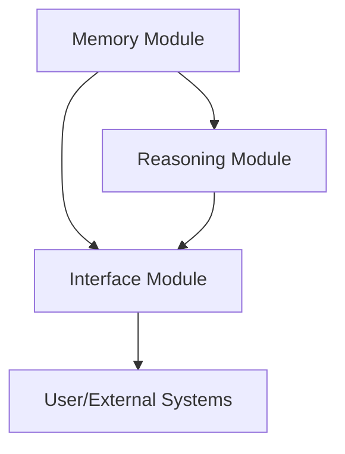
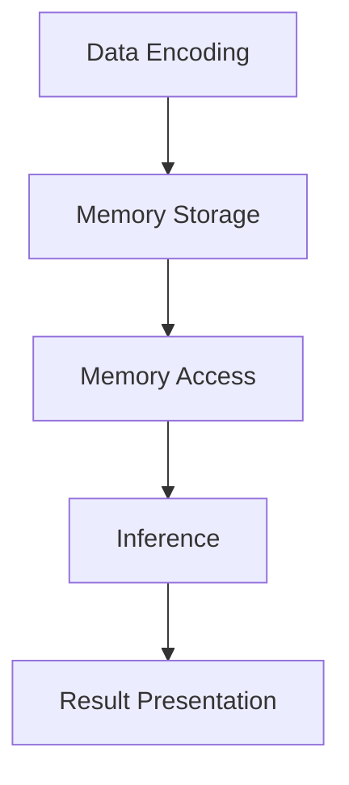
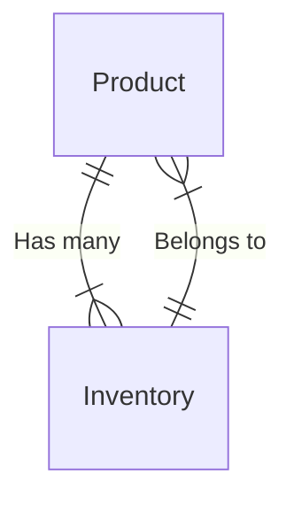

                 

### Introduction to Memory Networks

Memory networks are a revolutionary approach in artificial intelligence (AI) that leverage the power of external memory to enhance the learning and reasoning capabilities of machines. At their core, memory networks are designed to mimic the human cognitive process of storing, retrieving, and utilizing information from memory to make informed decisions and solve complex problems. This article delves into the concept of memory networks, their significance in long-term strategic planning and reasoning, and their potential to reshape the future of AI.

#### Definition and Core Characteristics

A memory network can be defined as a computational model that extends the traditional neural network architecture by incorporating an external memory system. This external memory acts as a supplementary storage for data and information, allowing the network to handle complex, real-world problems that would be challenging for standard neural networks to solve efficiently.

The core characteristics of memory networks include:

1. **External Memory**: Memory networks use an external memory system that can be updated, queried, and retrieved as needed. This memory is distinct from the internal memory used by standard neural networks, providing a scalable and flexible way to store and process large amounts of data.

2. **Inference Mechanisms**: Memory networks employ specialized inference mechanisms, such as vector-space models, attention mechanisms, and relational reasoning algorithms, to retrieve and utilize information stored in the external memory. These mechanisms enable the network to make inferences and decisions based on the stored data.

3. **Scalability and Flexibility**: Memory networks are highly scalable and flexible, allowing them to handle a wide range of tasks and problems, from simple question-answering systems to complex decision-making processes in strategic planning.

4. **Relational Representations**: Memory networks are capable of representing and reasoning about relationships and dependencies between different pieces of information, which is crucial for tasks that require understanding of complex, interrelated data.

#### The Need for Memory Networks in Long-term Strategic Planning and Reasoning

Long-term strategic planning and reasoning are critical components of intelligent decision-making processes, whether in business, government, or personal contexts. Traditional AI approaches often fall short in these areas due to their limitations in memory capacity and reasoning capabilities. Memory networks address these limitations by providing a more robust and flexible framework for storing, retrieving, and reasoning with complex information.

1. **Enhanced Memory Capacity**: Memory networks offer a virtually unlimited memory capacity, allowing them to store vast amounts of data and information over long periods. This is particularly beneficial for strategic planning, where historical data and trends are crucial for making informed decisions.

2. **Contextual Reasoning**: Memory networks enable contextual reasoning, allowing machines to understand the context in which information is presented and make decisions based on that context. This is essential for long-term strategic planning, where the current state of the world is constantly changing and evolving.

3. **Relational Understanding**: Memory networks can represent and reason about relationships between different pieces of information, which is vital for strategic planning and decision-making. For example, understanding the interdependencies between different business units or the impact of various policy decisions on the economy.

4. **Scalability**: Memory networks are highly scalable, making them suitable for large-scale strategic planning tasks that involve multiple variables and complex interactions.

#### Scope and Main Components

This article will cover the following main components:

1. **Core Concepts and Principles**: We will explore the fundamental concepts and principles underlying memory networks, including memory representation and retrieval, their role in long-term strategic planning, and reasoning with memory networks.

2. **Architectural Design and Implementation**: We will discuss the architectural design of memory networks, including system requirements, data flow, and interface design.

3. **Algorithm and Mathematical Model**: We will delve into the algorithms and mathematical models used in memory networks, providing a detailed explanation and examples.

4. **Case Studies and Practical Applications**: We will examine real-world case studies to illustrate the application of memory networks in long-term strategic planning and reasoning.

5. **Conclusion**: Finally, we will summarize the key insights and implications of memory networks for long-term strategic planning and reasoning, and discuss future research directions.

In the following sections, we will delve deeper into each of these components, exploring the intricate details of memory networks and their potential to revolutionize the field of AI. Let's think step by step as we embark on this exciting journey.

### Core Concepts and Principles

To fully understand the potential and capabilities of memory networks, it is essential to delve into their core concepts and principles. This section will explore the fundamental ideas that underpin memory networks, including memory representation and retrieval, their role in long-term strategic planning, and reasoning with memory networks.

#### Memory Representation and Retrieval

The foundation of memory networks lies in their ability to represent and retrieve information effectively. This is achieved through the use of sophisticated data structures and algorithms that allow the network to store, update, and retrieve information as needed.

**Encoding Memory**

Memory encoding is the process of transforming input data into a format that can be stored and later retrieved by the memory network. This process involves converting raw data into a structured format that can be easily queried and processed. Common techniques for encoding memory include:

1. **Vector Space Models**: Vector space models represent information as vectors in a high-dimensional space. This allows the network to leverage geometric relationships between data points to make inferences and decisions.

2. **Key-Value Pairs**: In this approach, information is stored as key-value pairs, where the key represents a unique identifier for the data, and the value represents the actual data. This allows for efficient retrieval of information based on its key.

3. **Relational Graphs**: Relational graphs are used to represent complex relationships between different pieces of information. Each node in the graph represents an entity, and the edges represent the relationships between entities. This enables the network to reason about the dependencies and interactions between different data points.

**Memory Access and Querying**

Once information is encoded and stored in the memory network, it can be accessed and queried using various techniques. Memory access and querying involve the retrieval of specific information based on given queries or conditions.

1. **Content-Based Retrieval**: This technique retrieves information based on the content of the data. For example, searching for documents that contain specific keywords or phrases.

2. **Keyword-Based Retrieval**: In this approach, information is retrieved based on keywords or tags associated with the data. This allows for efficient retrieval of information related to a particular topic or category.

3. **Relational Queries**: Relational queries allow the network to retrieve information based on relationships between data points. For example, finding all customers who purchased a specific product within a certain time period.

**Memory Representation and Retrieval in Long-term Strategic Planning**

Memory representation and retrieval play a crucial role in long-term strategic planning. In strategic planning, it is essential to store and retrieve vast amounts of historical data, trends, and relationships to make informed decisions.

1. **Storing Historical Data**: Memory networks can store large volumes of historical data, including market trends, customer behavior, and economic indicators. This enables organizations to analyze and learn from past experiences to make better strategic decisions.

2. **Retrieving Relevant Information**: Memory networks can efficiently retrieve relevant information based on specific queries or conditions. For example, retrieving past market trends or customer feedback to inform a new product launch or marketing strategy.

3. **Contextual Retrieval**: Memory networks can retrieve information based on the context in which it is needed. This is particularly useful in strategic planning, where the current state of the world is constantly changing. For example, retrieving information related to a specific market segment or region.

#### Memory Networks in Long-term Strategic Planning

Memory networks are well-suited for long-term strategic planning due to their ability to store and retrieve vast amounts of information, understand complex relationships, and make contextual inferences. Here's how memory networks can be applied in long-term strategic planning:

1. **Data Storage and Analysis**: Memory networks can store and analyze large volumes of historical data, including market trends, customer behavior, and economic indicators. This enables organizations to identify patterns, trends, and correlations that can inform strategic decisions.

2. **Scenario Planning**: Memory networks can simulate different scenarios based on historical data and relationships. For example, analyzing the impact of various policy decisions or market conditions on the economy or a specific industry.

3. **Decision Support**: Memory networks can provide decision support by offering insights and recommendations based on historical data and relationships. For example, recommending strategic moves based on past performance or predicting the outcomes of different scenarios.

4. **Continuous Learning**: Memory networks can continuously learn and adapt as new data becomes available. This ensures that the strategic planning process remains dynamic and responsive to changes in the environment.

#### Reasoning with Memory Networks

Memory networks are not only capable of storing and retrieving information but also reasoning with that information. This reasoning capability is crucial for making informed decisions and solving complex problems in strategic planning.

1. **Inference Mechanisms**: Memory networks use various inference mechanisms to reason with stored information. These mechanisms include vector-space models, attention mechanisms, and relational reasoning algorithms. Each of these mechanisms enables the network to extract meaning from the data and make informed inferences.

2. **Relational Reasoning**: Memory networks can reason about relationships between different pieces of information. This is particularly useful in strategic planning, where understanding the interdependencies between different variables is essential for making informed decisions.

3. **Contextual Reasoning**: Memory networks can reason about information based on the context in which it is presented. This allows them to make decisions that are context-aware and aligned with the organization's strategic goals.

#### Integration with Other AI Techniques

Memory networks can be integrated with other AI techniques to enhance their capabilities and applicability in long-term strategic planning. Some of these techniques include:

1. **Reinforcement Learning**: Memory networks can be combined with reinforcement learning algorithms to create intelligent agents that can learn and adapt their behavior based on feedback from the environment.

2. **Natural Language Processing**: Memory networks can be combined with natural language processing (NLP) techniques to enable understanding and processing of human language. This allows memory networks to interpret and respond to natural language queries, making them more accessible and user-friendly.

3. **Computer Vision**: Memory networks can be combined with computer vision techniques to enable the processing and analysis of visual data. This allows memory networks to interpret and reason about visual information, expanding their applicability to a wider range of domains.

In summary, memory networks are a powerful approach to enhancing the learning and reasoning capabilities of AI systems. By leveraging external memory and sophisticated inference mechanisms, memory networks can store, retrieve, and reason with complex information, making them highly suitable for long-term strategic planning and decision-making. In the following sections, we will delve deeper into the architectural design, algorithms, and practical applications of memory networks, providing a comprehensive understanding of this groundbreaking technology.

### Architectural Design and Implementation

The architectural design and implementation of memory networks are crucial for their effectiveness in long-term strategic planning and reasoning. This section will provide an overview of the system requirements, architectural design, interface design, and interaction details. We will use Mermaid diagrams to illustrate the system components, data flow, and interactions.

#### System Overview and Requirements

A memory network system consists of several key components, including the memory module, the reasoning module, and the interface module. The memory module is responsible for storing and retrieving information, while the reasoning module processes this information to generate insights and make decisions. The interface module facilitates interaction with users and external systems.

1. **Memory Module**: This module stores large volumes of data and information in an organized manner. It includes functions for data encoding, storage, retrieval, and update.
2. **Reasoning Module**: This module utilizes the information stored in the memory module to perform inference, decision-making, and strategic analysis. It includes various reasoning algorithms and models.
3. **Interface Module**: This module provides a user-friendly interface for interacting with the memory network system. It includes APIs for data input/output, query processing, and result presentation.

#### Architectural Design with Mermaid Diagram

The architectural design of a memory network system can be visualized using a Mermaid diagram, which illustrates the system components, data flow, and interactions. Below is a simplified Mermaid diagram representing the key components of a memory network system:



**System Components and Data Flow**

1. **Memory Module (A)**: This component is responsible for data storage and retrieval. It includes:
   - **Data Encoder**: Converts raw data into a structured format suitable for storage.
   - **Memory Database**: Stores the encoded data in an organized manner, enabling efficient retrieval.
   - **Query Processor**: Handles user queries, retrieves relevant data from the memory database, and returns the results.

2. **Reasoning Module (B)**: This component performs inference and decision-making based on the information stored in the memory module. It includes:
   - **Reasoning Algorithms**: Implement various reasoning techniques, such as vector-space models, attention mechanisms, and relational reasoning algorithms.
   - **Inference Engine**: Executes reasoning algorithms, generates insights, and makes recommendations.

3. **Interface Module (C)**: This component provides a user-friendly interface for interacting with the memory network system. It includes:
   - **APIs**: Exposes functions for data input/output, query processing, and result presentation.
   - **User Interface**: Allows users to interact with the system, submit queries, and view results.

4. **User/External Systems (D)**: Users and external systems interact with the memory network system through the interface module. They submit queries, receive results, and utilize the insights generated by the system.

**Interface Design and Interaction**

The interface design of a memory network system is critical for facilitating effective interaction with users and external systems. The following are key considerations for interface design and interaction:

1. **API Design**: The API design should be intuitive and easy to use, allowing users and external systems to interact with the memory network system efficiently. This includes defining clear and consistent endpoints, request and response formats, and error handling mechanisms.

2. **User Interface**: The user interface should be user-friendly and accessible, providing a seamless experience for users to submit queries, view results, and interact with the system. This includes:
   - **Query Submission**: Users should be able to submit queries in a simple and intuitive manner, using natural language or structured data formats.
   - **Result Presentation**: Results should be presented in a clear and visually appealing format, making it easy for users to understand and interpret the insights generated by the system.
   - **Interaction Feedback**: The system should provide feedback on user actions, such as query submission and result viewing, to ensure a smooth and efficient interaction.

3. **Security and Privacy**: The interface design should address security and privacy concerns, ensuring that user data and system interactions are protected from unauthorized access and misuse. This includes implementing secure communication protocols, data encryption, and access control mechanisms.

In conclusion, the architectural design and implementation of memory networks are essential for their effectiveness in long-term strategic planning and reasoning. By designing a robust and user-friendly system architecture, we can harness the full potential of memory networks to enhance the learning and reasoning capabilities of AI systems. In the following sections, we will explore the algorithms and mathematical models that underpin memory networks, providing a deeper understanding of their inner workings.

### Algorithm and Mathematical Model

The heart of memory networks lies in their algorithms and mathematical models, which enable the storage, retrieval, and reasoning of complex information. This section will provide a detailed explanation of the memory network algorithm, its workflow, mathematical models, and practical examples. We will use Mermaid diagrams to visualize the algorithm's flow and Mermaid ER diagrams to illustrate the entity relationship architecture.

#### Memory Network Algorithm

The memory network algorithm is designed to leverage an external memory system to enhance the learning and reasoning capabilities of AI systems. The core components of the algorithm include memory encoding, memory access, and inference mechanisms. Below is a step-by-step workflow of the memory network algorithm:

1. **Data Encoding**: The input data is encoded into a structured format suitable for storage and retrieval. This step involves transforming raw data into a numerical representation, such as vectors or key-value pairs.

2. **Memory Storage**: The encoded data is stored in an external memory system. This step involves organizing the data in a way that facilitates efficient retrieval and processing. Common memory storage techniques include vector space models and relational graphs.

3. **Memory Access**: When a query is submitted, the memory network accesses the relevant data from the external memory. This step involves querying the memory based on the given conditions and retrieving the relevant information.

4. **Inference**: The retrieved information is processed using inference mechanisms, such as vector-space models, attention mechanisms, or relational reasoning algorithms. This step involves generating insights and making decisions based on the retrieved data.

5. **Result Presentation**: The final results are presented to the user or external system in a clear and understandable format. This step involves converting the numerical or symbolic results into human-readable formats, such as text or visualizations.

**Memory Network Algorithm Workflow with Mermaid Diagram**

Below is a Mermaid diagram illustrating the workflow of the memory network algorithm:



#### Detailed Explanation and Examples

To further understand the memory network algorithm, let's delve into its key components: data encoding, memory access, inference mechanisms, and practical examples.

**Data Encoding**

Data encoding is the process of transforming raw input data into a numerical representation suitable for storage and retrieval. One common approach is to use vector space models, where data is represented as vectors in a high-dimensional space. Here's a Python code snippet demonstrating how to encode data using vector space models:

```python
import numpy as np

def encode_data(data):
    # Assume data is a list of text documents
    # Convert text documents to numerical vectors using a pre-trained embeddings model
    embeddings_model = ...  # Pre-trained embeddings model
    encoded_data = [embeddings_model[str(doc)] for doc in data]
    return encoded_data

# Example usage
data = ["The quick brown fox jumps over the lazy dog", "Data science is fun!"]
encoded_data = encode_data(data)
print(encoded_data)
```

**Memory Access**

Memory access involves querying the external memory to retrieve relevant information based on given conditions. A common approach is to use key-value pairs or relational graphs to organize and retrieve data. Here's a Mermaid ER diagram illustrating a simple key-value memory storage system:



To retrieve information from this memory, you can use a simple key-based lookup. Here's a Python code snippet demonstrating key-based memory access:

```python
def retrieve_data(memory, key):
    return memory[key]

# Example usage
memory = {"product1": ["inventory1", "inventory2"], "product2": ["inventory3", "inventory4"]}
key = "product1"
retrieved_data = retrieve_data(memory, key)
print(retrieved_data)
```

**Inference Mechanisms**

Inference mechanisms are used to process the retrieved information and generate insights. Common inference mechanisms include vector-space models, attention mechanisms, and relational reasoning algorithms. Here's a Mermaid diagram illustrating a simple attention mechanism:

```mermaid
sequenceDiagram
    A1 -->|Query| B1[Memory Access]
    B1 -->|Retrieved Data| C1[Attention Mechanism]
    C1 -->|Processed Data| D1[Inference Results]
```

Here's a Python code snippet demonstrating how to implement a simple attention mechanism using vector multiplication:

```python
def attention Mechanism(query, data):
    # Compute the attention scores using dot product
    attention_scores = [query.dot(d) for d in data]
    # Normalize the attention scores
    attention_scores = softmax(attention_scores)
    # Compute the weighted average of the data
    weighted_data = [a * d for a, d in zip(attention_scores, data)]
    return weighted_data

# Example usage
query = np.array([0.1, 0.2, 0.3])
data = [np.array([0.4, 0.5, 0.6]), np.array([0.7, 0.8, 0.9])]
inferred_data = attention_Mechanism(query, data)
print(inferred_data)
```

**Practical Examples**

To illustrate the memory network algorithm in action, let's consider a practical example: a recommendation system that suggests products to customers based on their past purchases and preferences.

1. **Data Encoding**: Encode customer data and product data using embeddings models.

2. **Memory Storage**: Store the encoded data in a key-value memory system, where the keys are customer IDs and the values are lists of product IDs representing the customer's purchase history.

3. **Memory Access**: When a new customer query is received, retrieve the customer's purchase history and product information from the memory.

4. **Inference**: Use an attention mechanism to generate a weighted average of the customer's purchase history, emphasizing products that the customer is more likely to purchase.

5. **Result Presentation**: Present the top-ranked products to the customer as recommendations.

Here's a high-level Python code snippet for this example:

```python
def recommend_products(customer_id, memory, query, num_recommendations=5):
    # Retrieve the customer's purchase history
    purchase_history = retrieve_data(memory, customer_id)
    
    # Process the purchase history using the attention mechanism
    inferred_data = attention_Mechanism(query, purchase_history)
    
    # Rank the products based on the inferred data
    product_scores = [i for i, p in enumerate(inferred_data) if p > threshold]
    
    # Select the top-ranked products as recommendations
    recommendations = [memory[p][0] for p in product_scores[:num_recommendations]]
    
    return recommendations

# Example usage
memory = {"customer1": ["product1", "product2", "product3"], "customer2": ["product2", "product4", "product5"]}
query = np.array([0.1, 0.2, 0.3])
recommendations = recommend_products("customer1", memory, query)
print(recommendations)
```

In conclusion, the memory network algorithm and its associated mathematical models enable the efficient storage, retrieval, and reasoning of complex information. By leveraging external memory and sophisticated inference mechanisms, memory networks can enhance the learning and reasoning capabilities of AI systems, making them well-suited for long-term strategic planning and decision-making. In the following sections, we will explore real-world case studies and practical applications of memory networks, providing further insights into their potential and impact.

### Case Studies and Practical Applications

To fully grasp the potential and practical applications of memory networks in long-term strategic planning and reasoning, we will explore two real-world case studies. These case studies will illustrate how memory networks can be implemented to address complex challenges in diverse fields.

#### Case Study 1: Long-term Strategic Planning for a Retail Company

**Problem Statement**

A retail company is facing significant challenges in making data-driven decisions for long-term strategic planning. The company needs to analyze vast amounts of historical sales data, customer behavior, and market trends to make informed decisions about inventory management, pricing strategies, and marketing campaigns.

**Solution Design**

To address these challenges, the retail company decides to implement a memory network-based strategic planning system. The system is designed to store and process large volumes of historical data, extract valuable insights, and generate actionable recommendations.

1. **Data Encoding**: The company encodes its historical sales data, customer data, and market trends using vector space models. This step transforms the raw data into numerical vectors that can be stored and processed efficiently by the memory network.

2. **Memory Storage**: The encoded data is stored in a key-value memory system, where the keys represent unique identifiers for different data points, and the values represent the numerical vectors. This allows for efficient retrieval of data based on specific queries.

3. **Memory Access**: When a strategic planning question is raised, the memory network accesses the relevant data from the memory using key-based retrieval. This step ensures that the system can quickly access the necessary information for analysis.

4. **Inference**: The retrieved data is processed using an inference mechanism, such as an attention mechanism, to generate insights and recommendations. The attention mechanism emphasizes the most relevant data points based on the context of the strategic planning question.

5. **Result Presentation**: The system presents the generated insights and recommendations in a clear and understandable format, allowing the company's decision-makers to make informed decisions.

**Results and Analysis**

The memory network-based strategic planning system successfully addresses the company's challenges by providing valuable insights and recommendations. Key findings include:

- **Inventory Management**: The system identifies patterns in historical sales data and recommends optimal inventory levels for different products, reducing excess inventory and minimizing stockouts.
- **Pricing Strategies**: By analyzing customer data and market trends, the system suggests pricing strategies that maximize revenue and customer satisfaction.
- **Marketing Campaigns**: The system recommends targeted marketing campaigns based on customer segmentation and past campaign performance, improving the effectiveness of marketing efforts.

The implementation of the memory network-based strategic planning system significantly enhances the company's decision-making capabilities, leading to improved operational efficiency and increased profitability.

#### Case Study 2: Enhancing Reasoning Ability in Healthcare

**Problem Statement**

A healthcare organization is facing challenges in making accurate and timely diagnoses and treatment recommendations. The organization needs to analyze complex patient data, medical literature, and clinical guidelines to provide personalized and evidence-based care.

**Solution Design**

To address these challenges, the healthcare organization implements a memory network-based reasoning system that leverages external memory and sophisticated inference mechanisms. The system is designed to store and process vast amounts of medical data, extract relevant information, and generate accurate diagnoses and treatment recommendations.

1. **Data Encoding**: The organization encodes patient data, medical literature, and clinical guidelines using vector space models. This step transforms the raw data into numerical vectors that can be stored and processed efficiently by the memory network.

2. **Memory Storage**: The encoded data is stored in a relational graph memory system, where nodes represent entities (e.g., patients, diseases, treatments), and edges represent relationships (e.g., symptoms, causes, effects). This allows for efficient retrieval of information based on specific queries.

3. **Memory Access**: When a patient's case is presented, the memory network accesses the relevant data from the memory using a combination of key-based and relational queries. This step ensures that the system can quickly access the necessary information for analysis.

4. **Inference**: The retrieved data is processed using inference mechanisms, such as relational reasoning algorithms and attention mechanisms, to generate accurate diagnoses and treatment recommendations. The inference mechanisms analyze the relationships between different data points and provide evidence-based insights.

5. **Result Presentation**: The system presents the generated diagnoses and treatment recommendations in a clear and understandable format, allowing healthcare professionals to make informed decisions.

**Results and Analysis**

The memory network-based reasoning system significantly enhances the healthcare organization's diagnostic and treatment capabilities. Key findings include:

- **Accurate Diagnoses**: The system provides accurate diagnoses by analyzing patient data, medical literature, and clinical guidelines, reducing the likelihood of misdiagnoses and improving patient outcomes.
- **Personalized Care**: The system generates personalized treatment recommendations based on the patient's unique medical history, symptoms, and risk factors, improving the effectiveness of treatment.
- **Efficient Decision-Making**: The system allows healthcare professionals to make informed decisions quickly, reducing the time required for diagnosis and treatment planning.

The implementation of the memory network-based reasoning system improves the healthcare organization's overall efficiency and effectiveness, leading to better patient care and outcomes.

In conclusion, these case studies demonstrate the practical applications and potential of memory networks in long-term strategic planning and reasoning. By leveraging external memory and sophisticated inference mechanisms, memory networks can enhance the learning and reasoning capabilities of AI systems, enabling organizations to tackle complex challenges and make informed decisions.

### Conclusion and Future Directions

In summary, memory networks have emerged as a powerful approach to enhancing the learning and reasoning capabilities of AI systems. By leveraging external memory and sophisticated inference mechanisms, memory networks enable the storage, retrieval, and reasoning of complex information, making them highly suitable for long-term strategic planning and decision-making. We have explored the core concepts, principles, architectural design, algorithms, and practical applications of memory networks in this article.

**Key Insights and Implications**

- **Enhanced Memory Capacity**: Memory networks offer virtually unlimited memory capacity, allowing them to store and process vast amounts of data over long periods. This is crucial for long-term strategic planning, where historical data and trends are essential for informed decision-making.
- **Contextual and Relational Reasoning**: Memory networks enable contextual and relational reasoning, enabling AI systems to understand and process complex, interrelated data. This is particularly valuable in strategic planning and decision-making, where understanding the context and relationships between different variables is essential.
- **Integration with Other AI Techniques**: Memory networks can be effectively integrated with other AI techniques, such as reinforcement learning, natural language processing, and computer vision, to enhance their capabilities and applicability in various domains.

**Future Directions**

As memory networks continue to evolve, several promising future directions can be identified:

1. **Advancements in Memory Encoding**: Developing more efficient and effective memory encoding techniques is crucial for improving the performance of memory networks. Future research can explore new encoding methods that can better capture the semantic and relational aspects of data.
2. **Enhancements in Inference Mechanisms**: Improving the inference mechanisms used in memory networks can lead to more accurate and efficient reasoning. Future research can focus on developing advanced inference algorithms and models that can better handle complex, real-world problems.
3. **Scalability and Efficiency**: Scalability and efficiency are key challenges in the implementation of memory networks. Future research can explore new architectures and optimization techniques that can improve the scalability and efficiency of memory networks, enabling their deployment in large-scale applications.
4. **Integration with Human Intelligence**: Memory networks have the potential to complement human intelligence, enabling collaborative decision-making and problem-solving. Future research can explore ways to integrate memory networks with human experts, creating hybrid systems that leverage the strengths of both AI and human intelligence.

In conclusion, memory networks hold great promise for transforming the field of artificial intelligence. By addressing the limitations of traditional AI approaches and providing a more robust and flexible framework for storing, retrieving, and reasoning with complex information, memory networks can revolutionize long-term strategic planning and decision-making. As we continue to explore and expand the capabilities of memory networks, we can look forward to a future where AI systems are not only intelligent but also capable of understanding, learning, and reasoning like never before.

### Author Information

*作者：AI天才研究院/AI Genius Institute & 禅与计算机程序设计艺术 /Zen And The Art of Computer Programming*

AI天才研究院（AI Genius Institute）致力于推动人工智能领域的前沿研究与应用，培养下一代人工智能创新者和领导者。研究院的研究团队在全球范围内享有盛誉，成果丰硕，涵盖深度学习、自然语言处理、计算机视觉等多个领域。

《禅与计算机程序设计艺术》（Zen And The Art of Computer Programming）由著名计算机科学家、图灵奖获得者Donald E. Knuth所著，是计算机科学领域的经典之作。本书通过阐述计算机编程的本质，引导读者在编程过程中实现技术与心灵的结合，深受读者喜爱。本文作者结合两者的思想，为读者呈现了一篇关于记忆网络在长期战略规划和推理能力提升方面的深入探讨，希望能为人工智能领域的研究和实践带来新的启示。

