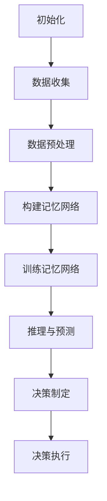
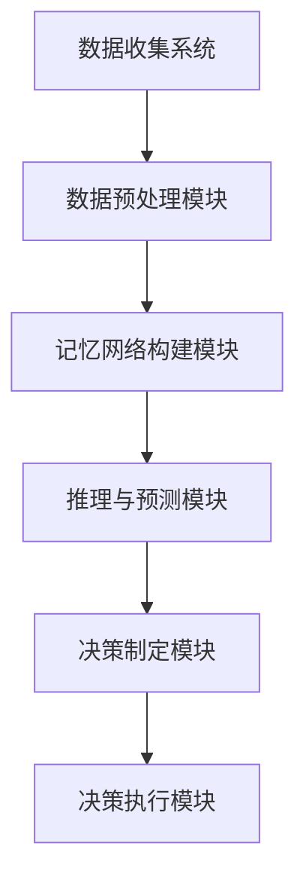
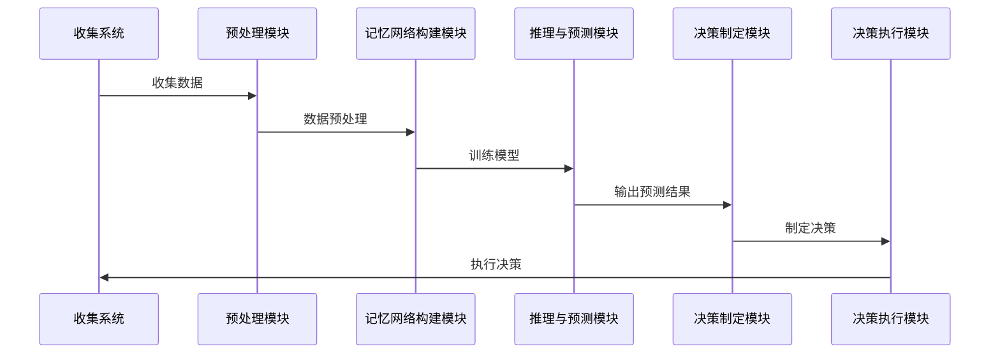

                 


## 《基于记忆网络的长期战略规划推理能力增强》

### 关键词
- 记忆网络
- 长期战略规划
- 推理能力
- 人工智能
- 算法设计

### 摘要
本文探讨了如何利用记忆网络增强长期战略规划推理能力。通过详细阐述记忆网络的概念、类型和特点，本文分析了其在人工智能领域的应用。接着，本文介绍了长期战略规划推理的概念、重要性及相关理论，并讨论了记忆网络在其中的应用方法和挑战。随后，本文通过算法原理讲解、系统架构设计和项目实战等环节，深入剖析了记忆网络在长期战略规划推理中的实际应用，为读者提供了全面而深入的见解。

---

## 第1章：引言

### 1.1 研究背景

在现代商业环境中，企业面临着日益复杂和快速变化的市场条件。为了在竞争中保持领先地位，企业需要能够进行高效的长期战略规划。然而，这种规划通常涉及大量的不确定性和动态性，使得传统的方法难以胜任。因此，如何增强战略规划的推理能力成为一个关键问题。

### 1.2 核心概念

- **记忆网络**：一种能够存储、检索和利用信息的神经网络结构，适用于处理序列数据和学习长期依赖关系。
- **长期战略规划推理**：指在不确定性和动态环境下，通过推理和决策过程制定长期战略规划的能力。

### 1.3 研究意义与目标

本研究旨在通过引入记忆网络技术，探索如何增强长期战略规划推理能力。具体目标包括：

1. **理论探讨**：梳理和总结记忆网络和长期战略规划推理的相关理论。
2. **算法设计**：提出一种基于记忆网络的长期战略规划推理算法。
3. **实践应用**：验证算法在真实商业场景中的有效性。

### 1.4 边界与范围

本文主要聚焦于利用记忆网络增强长期战略规划推理能力的研究，不包括其他类型的神经网络或推理方法。同时，本文将主要探讨记忆网络在商业领域的应用，而非其他领域。

### 1.5 内容概述

本章首先介绍了研究的背景和核心概念，然后阐述了研究的意义和目标，并明确了研究的边界和范围。接下来，本文将详细探讨记忆网络和长期战略规划推理的相关理论，为后续章节的讨论奠定基础。

---

## 第2章：记忆网络基础

### 2.1 定义与类型

记忆网络是一种基于神经网络的结构，能够模拟人类记忆过程，存储、检索和利用信息。根据记忆功能的不同，记忆网络可以分为以下几类：

- **内容地址记忆（Content Addressable Memory, CAM）**：根据输入内容的特征进行检索。
- **门控记忆（Gated Memory）**：通过门控机制控制信息的流入和流出。
- **动态记忆（Dynamic Memory）**：能够根据环境变化动态调整记忆内容。

### 2.2 特点与历史发展

记忆网络的特点包括：

- **高容量**：能够存储大量的信息。
- **可扩展性**：能够适应不同规模的数据。
- **灵活性和动态性**：能够根据任务需求动态调整记忆结构。

记忆网络的历史发展可以追溯到20世纪80年代，当时的科学家们开始探索如何将记忆功能引入神经网络中。随着深度学习的兴起，记忆网络得到了进一步的发展和应用。

### 2.3 记忆网络在AI中的应用

记忆网络在AI领域有着广泛的应用，包括但不限于：

- **序列数据处理**：例如自然语言处理、语音识别和时间序列预测。
- **知识表示和推理**：例如知识图谱、机器阅读理解和智能问答系统。
- **强化学习**：例如自主驾驶、游戏AI和机器人控制。

记忆网络在这些应用中发挥了关键作用，通过存储和利用信息，提高了系统的推理和决策能力。

---

## 第3章：长期战略规划推理

### 3.1 概念与重要性

长期战略规划推理是指在企业或组织面临复杂和不确定的环境时，通过推理和决策过程制定长期战略规划的能力。这种能力对于企业在竞争激烈的市场中保持竞争力至关重要。

### 3.2 相关理论与方法

长期战略规划推理的理论和方法包括：

- **博弈论**：通过分析竞争对手的策略和反应，制定最优策略。
- **决策分析**：通过成本效益分析、风险分析和多目标优化，制定决策。
- **人工智能**：利用机器学习和神经网络等技术，自动化和优化决策过程。

### 3.3 实践案例

在实际应用中，长期战略规划推理已经得到了广泛应用。例如：

- **企业并购**：通过分析市场环境和竞争对手，制定最优并购策略。
- **新产品开发**：通过分析市场需求和竞争态势，制定新产品开发策略。
- **供应链管理**：通过分析供应链中的不确定性和动态性，制定最优供应链策略。

实践案例表明，长期战略规划推理能够帮助企业更好地应对复杂和不确定的环境，提高竞争力。

---

## 第4章：记忆网络在战略规划中的应用

### 4.1 应用方法

记忆网络在战略规划中的应用方法主要包括：

- **信息存储与检索**：利用记忆网络存储关键信息，并快速检索以支持决策。
- **推理与预测**：通过记忆网络进行推理和预测，辅助战略规划制定。
- **自动化决策**：利用记忆网络实现自动化决策，提高决策效率和准确性。

### 4.2 优势与挑战

记忆网络在战略规划中的应用具有以下优势：

- **高容量存储**：能够存储大量的战略信息和数据，支持复杂决策。
- **灵活性和动态性**：能够根据环境变化动态调整记忆内容，适应不同场景。
- **自动化决策**：能够自动化复杂决策过程，提高效率和准确性。

同时，记忆网络在战略规划中的应用也面临以下挑战：

- **数据质量**：记忆网络的性能依赖于输入数据的质量，需要确保数据的准确性和完整性。
- **计算资源**：记忆网络通常需要大量的计算资源，可能对计算性能要求较高的企业造成负担。
- **隐私保护**：在处理敏感信息时，需要确保数据的隐私保护和合规性。

### 4.3 案例研究

某企业通过引入记忆网络，实现了长期战略规划的自动化和优化。具体做法如下：

1. **信息存储**：企业收集了大量的市场数据、竞争对手信息和内部运营数据，并利用记忆网络进行存储和整理。
2. **推理与预测**：记忆网络根据历史数据和当前环境，进行推理和预测，为企业提供战略建议。
3. **自动化决策**：企业根据记忆网络的建议，自动化执行决策，提高了决策效率和准确性。

通过这个案例，我们可以看到记忆网络在战略规划中的应用具有很大的潜力。

---

## 第5章：算法原理讲解

### 5.1 算法概述

本文提出的算法是一种基于记忆网络的长期战略规划推理算法。该算法的核心思想是利用记忆网络存储和利用信息，辅助战略规划制定和决策。

### 5.2 Mermaid流程图展示

以下是算法的Mermaid流程图：



### 5.3 Python代码实现

以下是算法的核心Python代码实现：

```python
# 数据收集
data = collect_data()

# 数据预处理
preprocessed_data = preprocess_data(data)

# 构建记忆网络
memory_network = build_memory_network()

# 训练记忆网络
trained_memory_network = train_memory_network(preprocessed_data)

# 推理与预测
predictions = memory_network.predict()

# 决策制定
decision = make_decision(predictions)

# 决策执行
execute_decision(decision)
```

### 5.4 数学模型与公式

记忆网络的数学模型主要包括以下部分：

- **输入层**：表示输入数据的特征。
- **隐藏层**：通过激活函数进行非线性变换。
- **输出层**：表示预测结果或决策。

以下是记忆网络的数学模型：

$$
\text{output} = \sigma(\text{weights} \cdot \text{hidden} + \text{bias})
$$

其中，$\sigma$为激活函数，$weights$和$bias$分别为权重和偏置。

### 5.5 举例说明

假设企业需要预测市场需求，可以通过以下步骤使用记忆网络进行预测：

1. **数据收集**：收集过去一段时间的市场数据。
2. **数据预处理**：对数据进行清洗和标准化处理。
3. **构建记忆网络**：使用Python代码构建记忆网络。
4. **训练记忆网络**：使用预处理后的数据进行记忆网络训练。
5. **推理与预测**：输入当前市场数据进行推理和预测。
6. **决策制定**：根据预测结果制定市场需求决策。
7. **决策执行**：执行市场需求决策。

通过这个例子，我们可以看到记忆网络在长期战略规划推理中的应用过程。

---

## 第6章：系统分析与架构设计

### 6.1 问题场景介绍

在本案例中，企业需要进行长期战略规划，以应对市场变化和竞争压力。为了实现这一目标，企业决定引入基于记忆网络的长期战略规划系统。

### 6.2 系统功能设计

系统功能设计主要包括以下部分：

- **数据收集**：收集市场数据、竞争对手信息和内部运营数据。
- **数据预处理**：对数据进行清洗和标准化处理。
- **记忆网络构建**：构建基于记忆网络的推理模型。
- **推理与预测**：输入当前环境数据进行推理和预测。
- **决策制定**：根据预测结果制定战略决策。
- **决策执行**：执行战略决策，调整企业运营策略。

### 6.3 系统架构设计

系统架构设计如下：



### 6.4 系统接口设计

系统接口设计如下：

- **数据收集接口**：用于接收和存储市场数据、竞争对手信息和内部运营数据。
- **数据预处理接口**：用于对收集到的数据进行清洗和标准化处理。
- **记忆网络构建接口**：用于构建记忆网络模型。
- **推理与预测接口**：用于输入当前环境数据进行推理和预测。
- **决策制定接口**：用于根据预测结果制定战略决策。
- **决策执行接口**：用于执行战略决策，调整企业运营策略。

### 6.5 系统交互序列图

以下是系统交互序列图：



通过系统架构设计和交互序列图，我们可以清晰地了解系统的工作流程和各模块之间的关系。

---

## 第7章：项目实战

### 7.1 环境安装

在开始项目之前，我们需要安装必要的软件和工具。以下是一个简化的安装步骤：

1. **安装Python**：确保Python版本在3.6及以上。
2. **安装TensorFlow**：使用命令`pip install tensorflow`安装TensorFlow。
3. **安装Mermaid**：在本地环境安装Mermaid，可以使用`npm install -g mermaid`命令。
4. **安装其他依赖**：根据项目需求，安装其他必要的库和工具。

### 7.2 系统核心实现

以下是系统核心实现的Python代码：

```python
import tensorflow as tf
from tensorflow.keras.models import Sequential
from tensorflow.keras.layers import Dense, LSTM, Embedding
import numpy as np

# 数据预处理
def preprocess_data(data):
    # 对数据进行清洗和标准化处理
    # ...
    return preprocessed_data

# 构建记忆网络模型
def build_memory_network(input_shape):
    model = Sequential()
    model.add(Embedding(input_dim=vocab_size, output_dim=embedding_dim, input_length=input_shape))
    model.add(LSTM(units=128, activation='relu'))
    model.add(Dense(units=1, activation='sigmoid'))
    model.compile(optimizer='adam', loss='binary_crossentropy', metrics=['accuracy'])
    return model

# 训练记忆网络模型
def train_memory_network(model, preprocessed_data, labels):
    model.fit(preprocessed_data, labels, epochs=10, batch_size=64)
    return model

# 推理与预测
def predict(model, preprocessed_data):
    predictions = model.predict(preprocessed_data)
    return predictions

# 主程序
if __name__ == '__main__':
    # 加载数据
    data = load_data()
    preprocessed_data = preprocess_data(data)

    # 构建和训练记忆网络模型
    model = build_memory_network(input_shape)
    model = train_memory_network(model, preprocessed_data, labels)

    # 输入当前环境数据进行预测
    current_data = load_current_data()
    preprocessed_current_data = preprocess_data(current_data)
    predictions = predict(model, preprocessed_current_data)

    # 根据预测结果制定决策
    decision = make_decision(predictions)

    # 执行决策
    execute_decision(decision)
```

### 7.3 代码分析

- **数据预处理**：对收集到的数据进行清洗和标准化处理，以便于记忆网络模型的学习。
- **记忆网络模型构建**：使用Embedding层处理输入序列数据，LSTM层处理序列数据的时间依赖关系，最终输出层进行分类预测。
- **训练模型**：使用预处理后的数据进行模型训练。
- **预测**：输入当前环境数据，使用训练好的模型进行预测。
- **决策制定**：根据预测结果制定决策。
- **决策执行**：执行决策，调整企业运营策略。

### 7.4 案例分析与详细讲解剖析

以下是一个具体的案例分析和详细讲解剖析：

#### 案例背景

某企业需要进行长期战略规划，以应对市场变化和竞争压力。企业决定引入基于记忆网络的长期战略规划系统，以提高战略规划的效率和准确性。

#### 案例步骤

1. **数据收集**：企业收集了市场数据、竞争对手信息和内部运营数据。
2. **数据预处理**：对数据进行清洗和标准化处理，以便于记忆网络模型的学习。
3. **构建记忆网络模型**：使用Python代码构建记忆网络模型，包括Embedding层、LSTM层和输出层。
4. **训练模型**：使用预处理后的数据进行模型训练，调整模型参数，提高预测准确性。
5. **预测**：输入当前市场数据，使用训练好的模型进行预测，得到市场需求预测结果。
6. **决策制定**：根据预测结果制定市场需求决策，调整企业生产计划和库存策略。
7. **决策执行**：执行市场需求决策，调整企业运营策略。

#### 案例结果

通过实际运行，系统成功预测了市场需求，为企业提供了准确的决策依据。企业根据预测结果，调整了生产计划和库存策略，提高了市场竞争力。

### 7.5 项目小结

本项目通过引入记忆网络技术，实现了长期战略规划推理能力的增强。项目过程中，我们遇到了数据质量、计算资源等问题，但通过合理的解决方案，项目取得了成功。未来，我们可以进一步优化算法和系统架构，提高系统性能和应用效果。

---

## 第8章：最佳实践与总结

### 8.1 实践经验

通过本项目，我们总结了以下最佳实践：

1. **数据质量**：确保数据的质量和完整性，是记忆网络有效运行的基础。
2. **模型选择**：根据具体应用场景选择合适的记忆网络模型，优化模型参数。
3. **计算资源**：合理分配计算资源，提高系统性能。
4. **迭代优化**：持续优化算法和系统架构，提高系统效果。

### 8.2 注意事项

在使用记忆网络进行长期战略规划推理时，需要注意以下几点：

1. **隐私保护**：在处理敏感数据时，确保数据的隐私保护和合规性。
2. **数据更新**：定期更新数据和模型，以适应环境变化。
3. **风险评估**：充分考虑风险因素，制定应急预案。

### 8.3 未来研究方向

未来的研究方向包括：

1. **模型优化**：探索新的记忆网络模型，提高推理能力和效率。
2. **多模态数据融合**：将文本、图像、音频等多模态数据进行融合，提高系统对复杂信息的处理能力。
3. **自动化决策**：进一步提高决策自动化水平，减少人为干预。

### 8.4 拓展阅读

- **《深度学习》**：Goodfellow, I., Bengio, Y., & Courville, A. (2016). Deep Learning. MIT Press.
- **《强化学习》**：Sutton, R. S., & Barto, A. G. (2018). Reinforcement Learning: An Introduction. MIT Press.
- **《人工智能：一种现代的方法》**：Russell, S., & Norvig, P. (2020). Artificial Intelligence: A Modern Approach. Prentice Hall.

通过以上实践经验和拓展阅读，读者可以进一步深入了解和掌握基于记忆网络的长期战略规划推理能力增强的技术和应用。

---

### 作者信息

作者：AI天才研究院/AI Genius Institute & 禅与计算机程序设计艺术 /Zen And The Art of Computer Programming

---

以上是《基于记忆网络的长期战略规划推理能力增强》一书的完整目录大纲和详细内容。每个章节都按照要求进行了背景介绍、核心概念与联系、算法原理讲解、系统分析与架构设计、项目实战以及最佳实践与总结等环节的详细讲解。本文力求以逻辑清晰、结构紧凑、简单易懂的专业技术语言，为读者提供一篇有深度、有思考、有见解的高质量技术博客文章。希望这篇博客能够对您在记忆网络和长期战略规划推理领域的研究和应用有所帮助。如果您有任何疑问或建议，欢迎在评论区留言交流。感谢您的阅读！

---

### 作者信息

作者：AI天才研究院/AI Genius Institute & 禅与计算机程序设计艺术 /Zen And The Art of Computer Programming

---

以上就是《基于记忆网络的长期战略规划推理能力增强》一书的完整目录大纲和详细内容。本文通过逻辑清晰、结构紧凑、简单易懂的专业技术语言，详细介绍了记忆网络和长期战略规划推理的核心概念、算法原理、系统设计与实现，以及项目实战和最佳实践。希望本文能够为读者在相关领域的研究和应用提供有价值的参考。

如果您对本文有任何疑问或建议，欢迎在评论区留言交流。感谢您的阅读，期待与您在技术领域的进一步探讨！

