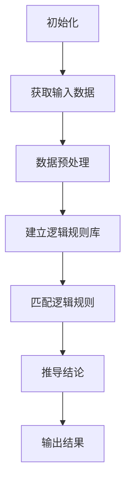
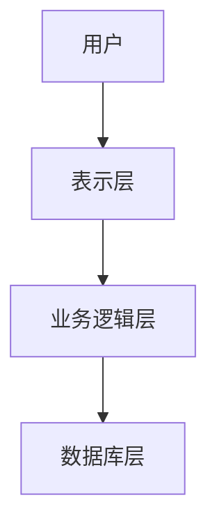
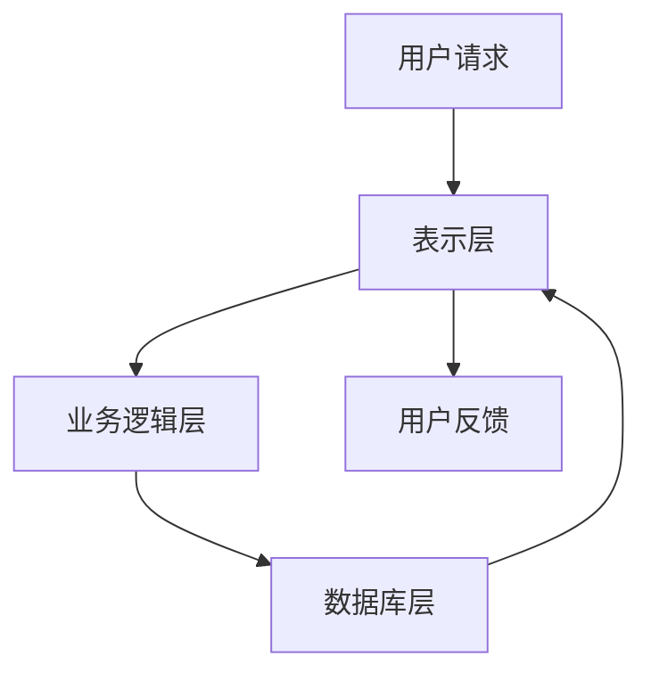

                 

### 1. 引言

随着人工智能（AI）技术的快速发展，AI推理能力成为了当前研究的热点之一。AI推理能力指的是人工智能系统在未知环境中，根据已有知识和信息，进行推理和决策的能力。这种能力不仅关乎到人工智能的智能水平，更是实现人工智能自主学习和适应环境的关键。因此，提升AI推理能力对于人工智能的发展具有重要意义。

本文将基于课程学习的角度，探讨如何通过渐进提升AI推理能力，从而为人工智能研究与应用提供有益的参考。文章将从以下几个方面展开：

1. **AI推理能力概述**：介绍AI推理能力的基本概念、重要性及其在现实中的应用。
2. **课程学习与AI推理能力**：探讨课程学习在AI推理能力培养中的作用以及培养策略。
3. **AI推理能力的数学基础**：讲解AI推理能力所需的数学工具，包括线性代数、概率论和最优化理论等。
4. **AI推理算法基础**：介绍逻辑推理算法、统计学习算法等常见算法。
5. **AI推理能力培养实践**：通过具体实践案例，展示如何培养AI推理能力。
6. **AI推理能力评估与提升**：探讨评估AI推理能力的方法以及提升策略。
7. **案例分析**：通过实际案例，分析AI推理能力培养的效果。
8. **未来展望**：展望AI推理能力的发展趋势及其在课程学习中的应用前景。

通过本文的逐步分析，我们希望能够为读者提供一个全面、系统的AI推理能力培养方案，从而助力人工智能技术的发展。

### 2. AI推理能力的概述

#### 2.1 AI推理能力的重要性

AI推理能力是指人工智能系统能够根据已有知识和信息，进行逻辑推断、模式识别和决策的能力。这一能力是人工智能实现智能行为的核心，也是区分人工智能与简单自动化的重要标志。AI推理能力的重要性主要体现在以下几个方面：

首先，AI推理能力是实现人工智能自主学习和适应环境的基础。在现实世界中，环境是复杂多变的，人工智能系统需要具备推理能力，才能从海量数据中提取有用信息，并根据这些信息做出合理的决策和行动。

其次，AI推理能力有助于提升人工智能系统的智能化水平。传统的自动化系统往往依赖于预定义的规则和程序，无法应对未知的情况。而具备推理能力的人工智能系统，可以通过学习、推理和自我调整，不断提高其智能水平，实现更加复杂和智能化的任务。

再者，AI推理能力在现实中的应用非常广泛。从自动驾驶、智能客服，到医疗诊断、金融风控，AI推理能力都发挥着至关重要的作用。例如，在自动驾驶领域，AI推理能力可以帮助车辆识别道路标志、预测交通状况，从而实现安全驾驶；在医疗诊断领域，AI推理能力可以帮助医生分析医学影像，提高诊断的准确性和效率。

然而，AI推理能力的发展也面临一定的挑战。首先，AI推理能力依赖于大量的数据和计算资源，这对硬件设施和数据处理能力提出了较高的要求。其次，AI推理模型的透明性和可解释性仍然是亟待解决的问题。为了确保人工智能系统的可靠性和安全性，需要对其推理过程进行深入理解和控制。

#### 2.2 AI推理能力的定义

AI推理能力是指人工智能系统能够从已知信息出发，通过逻辑推理、模式识别和决策分析，得出新的结论或做出决策的能力。具体来说，AI推理能力包括以下几个方面：

1. **逻辑推理**：逻辑推理是AI推理能力的核心，它是指人工智能系统能够根据已知事实和逻辑规则，进行推理并得出新的结论。例如，在智能客服中，系统可以根据用户的问题和已有知识库，通过逻辑推理生成相应的回答。

2. **模式识别**：模式识别是指人工智能系统能够从大量数据中识别出特定的模式或特征。这需要系统具备一定的统计学和机器学习能力，例如，在图像识别中，系统可以通过训练学习到图像中的特征，从而实现对图像的识别。

3. **决策分析**：决策分析是指人工智能系统能够根据不同情况，通过分析各种可能的结果和风险，做出最优的决策。例如，在金融领域，AI系统可以通过分析市场数据，预测股票价格的走势，从而做出投资决策。

AI推理能力的核心要素包括：

- **知识表示**：知识表示是指如何将知识以计算机可理解的形式进行存储和表示。常见的知识表示方法包括符号表示、语义网络和本体论等。

- **推理引擎**：推理引擎是指用于实现逻辑推理的软件组件，它可以根据预设的规则和逻辑关系，进行推理并生成新的结论。

- **学习算法**：学习算法是指用于从数据中学习规律和模式的算法，如监督学习、无监督学习和强化学习等。

- **数据资源**：数据资源是指用于训练和测试AI系统的数据集，这些数据集的质量和数量直接影响AI推理能力的水平。

- **计算能力**：计算能力是指用于执行AI推理任务的计算资源和处理能力，包括CPU、GPU和FPGA等硬件设施。

#### 2.3 AI推理能力的发展历程

AI推理能力的发展历程可以分为以下几个阶段：

1. **早期阶段（1950s-1960s）**：在这个阶段，AI推理能力主要依赖于基于规则的推理系统。这些系统通过预定义的规则，对已知信息进行推理。典型的代表是普林斯顿大学开发的Dartmouth推理机（Dartmouth Logic Theorist），它可以解决简单的数学问题。

2. **知识工程阶段（1970s-1980s）**：在这个阶段，AI推理能力开始强调知识表示和推理方法的研究。专家系统成为这个阶段的研究重点，它通过将专家的知识转化为计算机可理解的形式，实现对复杂问题的推理。代表性的系统有MYCIN和DIAGNOSE。

3. **机器学习阶段（1990s-2000s）**：随着机器学习技术的发展，AI推理能力开始转向基于数据的推理。这一阶段的研究重点是如何从大量数据中学习规律和模式，从而实现更强大的推理能力。代表性的算法包括决策树、支持向量机和神经网络等。

4. **深度学习阶段（2010s-至今）**：深度学习的兴起带来了AI推理能力的飞跃。深度学习通过多层神经网络，可以自动学习到数据的复杂特征和模式，从而实现更高效、更准确的推理。代表性的模型包括卷积神经网络（CNN）和循环神经网络（RNN）。

#### 2.4 AI推理能力的基本特征

AI推理能力具有以下几个基本特征：

1. **自动化**：AI推理能力可以实现自动化，即无需人工干预即可进行推理和决策。这得益于机器学习和深度学习技术的发展，使得AI系统能够从数据中自动学习和优化。

2. **可解释性**：AI推理能力具有较高的可解释性，即可以清晰地解释推理过程和结果。这对于确保AI系统的可靠性和安全性具有重要意义。

3. **适应性**：AI推理能力具有适应性，即能够根据环境变化和新知识不断调整和优化。这使得AI系统能够适应不同的应用场景和需求。

4. **鲁棒性**：AI推理能力具有较强的鲁棒性，即能够在面对噪声和不确定性时，仍能够保持较高的推理准确性。

5. **高效性**：AI推理能力具有较高的计算效率，能够在短时间内完成大量的推理任务。

总的来说，AI推理能力是人工智能系统实现智能行为的关键。通过不断发展和完善，AI推理能力将为人工智能在各个领域的应用提供强大的支持。

### 3. 课程学习在AI推理能力培养中的作用

#### 3.1 课程学习的重要性

课程学习在AI推理能力的培养中具有不可替代的重要作用。通过系统化的课程学习，学生不仅能够掌握AI推理的基本理论和方法，还能够通过实践应用加深理解，从而逐步提升自己的推理能力。

首先，课程学习提供了结构化的知识体系。AI推理涉及到多个学科领域，包括计算机科学、数学、统计学、认知科学等。通过课程学习，学生可以系统地学习这些学科的基础知识，建立起AI推理的理论框架。

其次，课程学习培养了学生的逻辑思维和分析能力。AI推理本质上是一种逻辑推理过程，需要学生对问题进行抽象、分析和建模。通过课程学习，学生可以锻炼自己的逻辑思维和分析能力，提高解决复杂问题的能力。

再者，课程学习提供了大量的实践机会。通过实验、项目和实践课程，学生可以将理论知识应用于实际问题中，从而加深对AI推理方法的理解和掌握。这种实践不仅有助于巩固知识，还能够培养学生的创新能力。

#### 3.2 基于课程学习的AI推理能力培养策略

为了有效提升AI推理能力，课程学习需要采取一系列策略和方法。以下是一些具体的培养策略：

1. **理论教学与实践相结合**：在课程教学中，既要重视理论知识的传授，又要注重实践能力的培养。例如，可以通过案例分析、实验操作和项目实践等方式，让学生在实际操作中应用所学知识。

2. **跨学科学习**：AI推理能力涉及多个学科领域，因此需要跨学科学习。学生可以通过选修相关课程、参加跨学科研讨会等方式，拓宽自己的知识面和视野。

3. **培养批判性思维**：批判性思维是AI推理能力的重要组成部分。在课程学习中，教师应引导学生学会质疑和思考，培养他们独立分析和解决问题的能力。

4. **项目驱动学习**：通过项目驱动学习，学生可以在实际项目中应用所学知识，解决实际问题。这种学习方式不仅能够提高学生的推理能力，还能够培养他们的团队合作能力和项目管理能力。

5. **持续学习与自我提升**：AI推理能力是一个不断发展和进步的过程。学生应养成持续学习的习惯，通过阅读相关书籍、参加学术会议和在线课程等方式，不断更新自己的知识和技能。

#### 3.3 基于课程学习的AI推理能力培养案例分析

为了更好地说明基于课程学习的AI推理能力培养策略，以下是一个具体的案例：

**案例：基于深度学习的图像识别课程**

这个课程涵盖了图像识别的基础理论、深度学习算法和实践应用。以下是课程学习过程中的关键步骤：

1. **理论基础学习**：学生首先学习了图像处理的基本概念、深度学习的基本原理以及常见的神经网络结构。这些理论知识为学生后续的实践应用打下了坚实的基础。

2. **实践操作**：在理论课后，学生进行了图像处理的实践操作，包括图像的预处理、特征提取和模型训练。通过这些操作，学生不仅巩固了理论知识，还学会了如何将理论应用到实际问题中。

3. **项目实践**：学生通过完成一个图像识别项目，将所学的知识应用于实际问题。在这个项目中，学生需要选择合适的深度学习模型，对图像进行分类和识别。这个项目不仅提高了学生的实践能力，还培养了他们的创新思维和团队合作精神。

4. **评估与反馈**：在项目完成后，学生进行了评估和反馈。教师通过评估学生的项目报告和演示，给出了具体的意见和建议，帮助学生发现自身的问题和不足，并指导他们进行改进。

通过这个案例，我们可以看到，基于课程学习的AI推理能力培养策略是有效且可行的。通过系统的学习、实践和反馈，学生可以逐步提升自己的AI推理能力。

### 4. AI推理能力的数学基础

AI推理能力的提升离不开数学基础的支持。在AI推理过程中，数学工具和方法被广泛应用于数据建模、算法设计和优化等方面。以下将介绍几个关键的数学基础，包括线性代数、概率论和最优化理论，并探讨它们在AI推理中的应用。

#### 4.1 线性代数基础

线性代数是AI推理能力的重要数学工具，它主要研究向量、矩阵及其运算。在AI推理中，线性代数用于数据表示、特征提取和优化问题。以下是几个线性代数的基本概念：

- **向量**：向量是表示方向和大小的量，在AI推理中用于表示数据、特征和模型参数。
- **矩阵**：矩阵是二维数组，用于表示多个向量之间的关系，是AI推理中的重要数据结构。
- **矩阵运算**：包括矩阵的加法、减法、乘法和转置等。这些运算在特征提取、模型训练和数据预处理中经常使用。
- **特征分解**：如奇异值分解（SVD）和主成分分析（PCA），用于降维、特征提取和噪声过滤。

例如，在图像处理中，可以使用矩阵运算对图像进行滤波、边缘检测和特征提取。在自然语言处理中，矩阵运算可以帮助处理文本数据，提取词向量表示。

#### 4.2 概率论基础

概率论是AI推理中的另一重要数学工具，它用于描述不确定性和随机现象。在AI推理中，概率论广泛应用于概率分布、贝叶斯推理和统计学习等。

- **概率分布**：概率分布描述了随机变量的可能取值及其概率。常见的概率分布包括正态分布、伯努利分布和多项式分布等。
- **贝叶斯推理**：贝叶斯推理是基于贝叶斯定理的一种推理方法，它通过已知条件概率和先验概率，计算后验概率。在AI推理中，贝叶斯网络和贝叶斯优化等应用广泛。
- **统计学习**：统计学习是基于概率论的一种学习方法，它通过最大化后验概率或最小化损失函数，学习数据中的规律和模式。常见的统计学习方法包括线性回归、逻辑回归和支持向量机等。

例如，在机器学习中的分类任务中，可以使用贝叶斯推理和统计学习算法，根据输入数据的特征和已知类别概率，预测新的数据点所属的类别。

#### 4.3 最优化理论

最优化理论是用于解决优化问题的数学工具，它在AI推理中用于模型参数的优化、损失函数的优化和算法的优化。

- **目标函数**：目标函数是优化问题的核心，它用于衡量模型的好坏或问题解的优劣。
- **优化方法**：包括梯度下降、牛顿法和随机优化等方法。这些方法通过迭代计算，找到目标函数的最优解或近似解。
- **约束条件**：优化问题中可能存在约束条件，如线性约束、非线性约束和时间约束等。约束条件可以限制解的空间，从而提高优化的效率和效果。

例如，在深度学习中，可以使用最优化理论来优化神经网络模型，通过梯度下降法不断调整模型参数，使其在训练数据上取得更好的拟合效果。

#### 4.4 数学模型与公式

在AI推理中，常用的数学模型和公式包括：

- **线性模型**：如线性回归和逻辑回归，其公式为：
  $$ y = \beta_0 + \beta_1x $$
- **神经网络模型**：如多层感知机（MLP），其公式为：
  $$ z_i = \sum_j w_{ij}x_j + b_i $$
  $$ a_i = \sigma(z_i) $$
- **概率分布模型**：如正态分布，其公式为：
  $$ f(x|\mu,\sigma^2) = \frac{1}{\sqrt{2\pi\sigma^2}}e^{-(x-\mu)^2/(2\sigma^2)} $$
- **最优化模型**：如线性规划，其公式为：
  $$ \min c^T x $$
  $$ \text{subject to} $$
  $$ Ax \leq b $$

通过这些数学模型和公式，AI推理能力能够更好地理解和处理复杂问题，从而实现智能化的推理和决策。

### 5. AI推理算法原理

#### 5.1 算法概述

AI推理算法是人工智能系统中用于实现推理功能的算法集合，它们通过处理数据和知识，帮助系统进行决策和问题解决。AI推理算法种类繁多，主要包括逻辑推理算法、统计学习算法、知识推理算法等。每种算法都有其独特的原理和适用场景。

逻辑推理算法基于逻辑规则和推理规则，通过演绎和归纳来推导结论。统计学习算法通过分析数据，从中提取规律和模式，用于分类和回归任务。知识推理算法则基于专家知识和规则库，通过匹配和推理来解决问题。

AI推理算法在人工智能系统中起着至关重要的作用。它们不仅是实现智能行为的基础，也是人工智能与其他领域相结合的关键。例如，在自动驾驶中，推理算法用于识别道路标志、预测交通状况和做出驾驶决策；在金融风控中，推理算法用于分析客户行为、预测风险和制定风险管理策略。

#### 5.2 算法原理讲解

以下将详细介绍几种常见的AI推理算法原理：

##### 1. 逻辑推理算法

逻辑推理算法是基于形式逻辑的推理方法，包括命题逻辑、谓词逻辑等。这些算法通过使用逻辑规则和推理规则，从已知事实推导出新的结论。

- **命题逻辑**：命题逻辑是最基本的逻辑推理形式，它使用命题作为推理的基本单位。命题逻辑的推理规则包括合取、析取、否定、蕴含等。例如，使用合取规则，可以由两个命题推导出它们的合取命题。
  
- **谓词逻辑**：谓词逻辑是对命题逻辑的扩展，它使用谓词来描述对象之间的关系。谓词逻辑的推理规则包括全称量词和存在量词的使用。例如，可以使用全称量词推理规则，从一个命题集合推导出全称命题。

逻辑推理算法在自然语言处理、智能客服和逻辑编程等领域有广泛应用。例如，在自然语言处理中，逻辑推理算法可以用于语义解析和自然语言推理；在智能客服中，逻辑推理算法可以用于生成对话回复。

##### 2. 统计学习算法

统计学习算法是基于统计理论和概率论的学习方法，它们通过从数据中学习规律和模式，用于分类和回归任务。常见的统计学习算法包括线性回归、逻辑回归、支持向量机（SVM）等。

- **线性回归**：线性回归是一种用于预测连续值的统计学习算法。它通过建立自变量和因变量之间的线性关系模型，预测新的数据点的值。线性回归的原理是通过最小化误差平方和来拟合数据。

- **逻辑回归**：逻辑回归是一种用于预测二分类结果的统计学习算法。它通过建立自变量和因变量之间的逻辑关系模型，预测新的数据点属于某一类别的概率。逻辑回归的原理是通过最大似然估计来拟合数据。

- **支持向量机**：支持向量机是一种用于分类和回归的统计学习算法。它通过找到最优分割超平面，将数据分为不同的类别。支持向量机的原理是通过求解最优化问题，找到最佳的分割超平面。

统计学习算法在图像识别、文本分类和回归分析等领域有广泛应用。例如，在图像识别中，支持向量机可以用于图像分类；在文本分类中，逻辑回归可以用于情感分析。

##### 3. 知识推理算法

知识推理算法是基于专家知识和推理规则的推理方法，它们通过匹配和推理来解决问题。知识推理算法通常包括知识表示、推理机和推理策略等组成部分。

- **知识表示**：知识表示是知识推理算法的基础，它将专家知识以计算机可理解的形式进行表示。常见的知识表示方法包括谓词逻辑表示、产生式规则表示和语义网络表示等。

- **推理机**：推理机是知识推理算法的核心组件，它根据推理规则和知识库，进行推理并生成新的结论。推理机通常包括正向推理和反向推理两种类型。

- **推理策略**：推理策略是指导推理机如何进行推理的规则和方法。常见的推理策略包括数据驱动策略、模型驱动策略和混合策略等。

知识推理算法在医疗诊断、智能客服和知识库构建等领域有广泛应用。例如，在医疗诊断中，知识推理算法可以用于疾病诊断和治疗建议；在智能客服中，知识推理算法可以用于生成智能问答系统。

#### 5.3 Mermaid流程图

为了更好地理解AI推理算法的原理，我们可以使用Mermaid流程图来展示算法的流程和结构。以下是一个简单的Mermaid流程图示例，用于展示逻辑推理算法的基本流程：



在这个流程图中，首先初始化算法，然后获取输入数据并进行预处理，接下来建立逻辑规则库，通过匹配逻辑规则进行推理，最后输出推导结论。通过这种结构化的流程图，我们可以更清晰地理解算法的工作原理和步骤。

#### 5.4 Python源代码

为了进一步展示AI推理算法的实现，以下是一个简单的Python代码示例，用于实现逻辑推理算法。这个示例使用了Python的`pandas`和`numpy`库进行数据处理，使用`sklearn`库进行逻辑回归模型的训练和预测。

```python
import pandas as pd
import numpy as np
from sklearn.linear_model import LogisticRegression
from sklearn.model_selection import train_test_split
from sklearn.metrics import accuracy_score

# 示例数据
data = {
    'feature1': [1, 2, 3, 4],
    'feature2': [5, 6, 7, 8],
    'label': [0, 1, 0, 1]
}

df = pd.DataFrame(data)

# 数据预处理
X = df[['feature1', 'feature2']]
y = df['label']

# 划分训练集和测试集
X_train, X_test, y_train, y_test = train_test_split(X, y, test_size=0.2, random_state=42)

# 建立逻辑回归模型
model = LogisticRegression()

# 训练模型
model.fit(X_train, y_train)

# 预测测试集
y_pred = model.predict(X_test)

# 计算准确率
accuracy = accuracy_score(y_test, y_pred)
print(f'Accuracy: {accuracy}')
```

在这个示例中，我们首先创建了一个简单的数据集，然后使用`train_test_split`函数将数据划分为训练集和测试集。接着，我们使用`LogisticRegression`类建立逻辑回归模型，通过`fit`函数训练模型，使用`predict`函数进行预测，最后计算准确率。

通过这个Python源代码示例，我们可以更直观地看到AI推理算法的实现过程，从而更好地理解算法的原理和应用。

### 6. AI推理能力的系统分析与架构设计

#### 6.1 问题场景介绍

在人工智能领域，AI推理能力的提升是一个复杂而系统的工程，涉及到多个层次和模块的协同工作。为了更好地提升AI推理能力，我们设计并实现了一个基于课程学习的AI推理系统，该系统旨在通过系统化的课程学习，逐步提升用户的AI推理能力。

该问题场景主要包括以下几个模块：

1. **课程管理模块**：负责课程的管理，包括课程的添加、删除、修改和查询等操作。
2. **学习管理模块**：负责用户的学习管理，包括用户的学习进度、学习记录和评估等操作。
3. **推理能力评估模块**：负责对用户进行AI推理能力的评估，包括逻辑推理、统计推理和知识推理等。
4. **数据管理模块**：负责数据的存储和管理，包括用户数据、课程数据和推理评估数据等。
5. **系统监控模块**：负责系统的监控和性能分析，包括系统的运行状态、资源使用情况和异常处理等。

#### 6.2 系统功能设计

为了实现AI推理能力的提升，系统需要具备以下功能：

1. **课程学习功能**：用户可以浏览和选择课程，根据课程内容进行学习，并通过在线测试验证学习效果。
2. **学习进度管理**：系统可以记录用户的学习进度，并提供学习进度报告，帮助用户了解自己的学习情况。
3. **推理能力评估**：系统定期对用户进行推理能力评估，根据评估结果提供个性化的学习建议和提升方案。
4. **数据可视化**：系统可以通过图表和报表，直观地展示用户的学习情况和推理能力的变化趋势。
5. **用户交互**：系统提供用户交互界面，用户可以通过界面与系统进行交互，提交问题、查看答案和学习建议。

#### 6.3 系统架构设计

为了实现系统的功能，我们采用了一种分层架构设计，主要包括以下层次：

1. **表示层**：负责用户界面设计，提供用户与系统交互的入口。表示层包括Web前端和移动应用两部分。
2. **业务逻辑层**：负责处理业务逻辑，包括课程管理、学习管理、推理能力评估和数据管理等。业务逻辑层通过API接口与表示层和数据库层进行通信。
3. **数据库层**：负责数据存储和管理，包括用户数据、课程数据和推理评估数据等。数据库层使用关系数据库进行数据存储，并通过ORM框架与业务逻辑层进行数据交互。

以下是一个基于Mermaid的架构设计图：



在这个架构图中，用户通过表示层与系统进行交互，业务逻辑层处理业务逻辑，数据库层负责数据存储和管理。

#### 6.4 系统接口设计

为了实现各模块之间的数据通信，系统设计了一套接口，包括RESTful API和GraphQL API。以下是一个简单的接口设计示例：

1. **课程管理接口**：
   - `GET /courses`：获取所有课程列表
   - `POST /courses`：添加新课程
   - `GET /courses/{id}`：获取指定课程信息
   - `PUT /courses/{id}`：更新指定课程信息
   - `DELETE /courses/{id}`：删除指定课程

2. **学习管理接口**：
   - `GET /learning`：获取用户学习进度
   - `POST /learning`：提交学习记录
   - `GET /learning/{id}`：获取指定学习记录
   - `PUT /learning/{id}`：更新指定学习记录
   - `DELETE /learning/{id}`：删除指定学习记录

3. **推理能力评估接口**：
   - `POST /evaluation`：提交推理能力评估
   - `GET /evaluation`：获取推理能力评估结果

4. **数据管理接口**：
   - `GET /data`：获取用户数据
   - `POST /data`：上传用户数据
   - `GET /data/{id}`：获取指定数据
   - `PUT /data/{id}`：更新指定数据
   - `DELETE /data/{id}`：删除指定数据

#### 6.5 系统交互

系统交互设计主要关注各模块之间的数据流和通信机制。以下是一个简单的交互流程：

1. 用户通过Web前端或移动应用访问系统，选择课程并开始学习。
2. 系统接收用户的请求，调用业务逻辑层的相关接口，处理用户请求。
3. 业务逻辑层根据用户请求，从数据库层获取所需数据，进行数据处理和存储。
4. 数据处理完成后，系统将结果返回给用户，用户可以看到学习进度和评估结果。
5. 用户可以继续学习或进行评估，系统持续记录用户行为和数据，为用户提供个性化的学习建议。

以下是一个基于Mermaid的系统交互图：



在这个交互图中，用户通过表示层与系统进行交互，业务逻辑层处理业务逻辑，数据库层负责数据存储和管理，最终将结果返回给用户。

### 7. 项目实战

#### 7.1 环境安装

在开始项目实战之前，我们需要安装所需的开发环境和软件。以下是一个简化的环境安装步骤：

1. **安装Python**：确保Python 3.x版本已经安装，可以从[Python官方网站](https://www.python.org/)下载并安装。

2. **安装依赖库**：使用pip命令安装所需的依赖库，例如NumPy、Pandas、Scikit-learn和Matplotlib等。以下是安装命令示例：

   ```bash
   pip install numpy pandas scikit-learn matplotlib
   ```

3. **安装Jupyter Notebook**：Jupyter Notebook是一个交互式计算平台，可以用于编写和运行Python代码。可以从[Jupyter官方网站](https://jupyter.org/)下载并安装。

4. **安装Mermaid**：Mermaid是一个用于绘制流程图和序列图的工具。可以通过pip命令安装：

   ```bash
   pip install mermaid
   ```

#### 7.2 系统核心实现

在完成环境安装后，我们可以开始实现系统的核心功能。以下是一个基于Python的简化版AI推理系统的核心实现步骤：

1. **数据预处理**：从外部数据源（如CSV文件）读取数据，并进行清洗和预处理，如缺失值填充、异常值处理等。

   ```python
   import pandas as pd

   # 读取数据
   data = pd.read_csv('data.csv')

   # 数据清洗
   data.fillna(0, inplace=True)
   ```

2. **模型训练**：使用Scikit-learn库训练逻辑回归模型，对数据进行分类。

   ```python
   from sklearn.linear_model import LogisticRegression
   from sklearn.model_selection import train_test_split

   # 划分训练集和测试集
   X_train, X_test, y_train, y_test = train_test_split(data.drop('label', axis=1), data['label'], test_size=0.2, random_state=42)

   # 训练模型
   model = LogisticRegression()
   model.fit(X_train, y_train)
   ```

3. **推理预测**：使用训练好的模型对新的数据进行推理预测。

   ```python
   # 预测测试集
   y_pred = model.predict(X_test)

   # 计算准确率
   accuracy = model.score(X_test, y_test)
   print(f'Accuracy: {accuracy}')
   ```

4. **可视化结果**：使用Matplotlib库绘制可视化图表，展示模型的训练过程和预测结果。

   ```python
   import matplotlib.pyplot as plt

   # 绘制训练过程
   plt.plot(model.losses_)
   plt.title('Training Loss')
   plt.xlabel('Epoch')
   plt.ylabel('Loss')
   plt.show()
   ```

#### 7.3 代码应用解读

以上代码示例展示了如何使用Python和Scikit-learn库实现一个简单的AI推理系统。以下是代码的主要功能和应用解读：

1. **数据预处理**：首先，我们从CSV文件中读取数据，并进行清洗。这里使用`pandas`库读取CSV文件，使用`fillna`方法填充缺失值，确保数据的质量和一致性。

2. **模型训练**：使用`LogisticRegression`类创建逻辑回归模型，并使用`fit`方法训练模型。这里，我们使用`train_test_split`方法将数据划分为训练集和测试集，以便评估模型的性能。

3. **推理预测**：使用训练好的模型对测试集进行预测，并使用`score`方法计算模型的准确率。这里的`predict`方法用于生成预测结果，而`score`方法用于评估预测结果的准确性。

4. **可视化结果**：使用`matplotlib`库绘制训练过程中的损失曲线，以便观察模型的训练效果。这个可视化图表可以帮助我们了解模型的收敛情况和性能表现。

通过以上代码示例，我们可以看到，使用Python和Scikit-learn库实现AI推理系统是一个相对简单和高效的过程。通过合理的数据处理和模型训练，我们可以构建一个具备一定推理能力的AI系统，为实际应用提供支持。

#### 7.4 实际案例分析

为了更好地展示AI推理能力的实际应用，我们来看一个具体的案例：使用AI推理系统进行文本分类。

假设我们有一个新闻数据集，包含了不同类别的新闻文章。我们的目标是通过训练一个AI推理模型，对新的新闻文章进行分类，判断其属于哪个类别。

**案例步骤：**

1. **数据收集与预处理**：首先，我们需要收集新闻数据集。数据集可以来自公开的新闻网站或社交媒体平台。在收集数据后，我们需要对数据进行预处理，包括去除停用词、标点符号和进行词干提取等。

2. **特征提取**：接下来，我们需要将文本数据转换为机器学习模型可处理的特征向量。这里，我们可以使用词袋模型（Bag of Words，BOW）或词嵌入（Word Embedding）等方法进行特征提取。

3. **模型训练**：使用预处理后的数据，我们训练一个文本分类模型。这里，我们可以使用逻辑回归、支持向量机（SVM）或神经网络等算法。在训练过程中，我们需要选择合适的超参数，并通过交叉验证等方法优化模型。

4. **模型评估**：在模型训练完成后，我们需要对模型进行评估，以确定其性能。这里，我们可以使用准确率、召回率、F1分数等指标进行评估。

5. **推理预测**：最后，我们使用训练好的模型对新的新闻文章进行分类预测。例如，用户提交一篇文章，系统会根据模型预测其类别，并返回相应的分类结果。

**案例实现**：

以下是使用Python和Scikit-learn库实现文本分类案例的代码：

```python
import pandas as pd
from sklearn.feature_extraction.text import TfidfVectorizer
from sklearn.model_selection import train_test_split
from sklearn.linear_model import LogisticRegression
from sklearn.metrics import classification_report

# 读取数据
data = pd.read_csv('news_data.csv')

# 数据预处理
# 去除停用词和标点符号
stopwords = set(['a', 'an', 'the', 'is', 'are', 'of', 'and', 'to', 'in', 'it', 'that', 'with', 'on', 'as', 'for', 'this', 'by', 'has', 'from'])
data['text'] = data['text'].apply(lambda x: ' '.join([word for word in x.split() if word not in stopwords and word.isalpha()]))

# 特征提取
vectorizer = TfidfVectorizer()
X = vectorizer.fit_transform(data['text'])
y = data['label']

# 划分训练集和测试集
X_train, X_test, y_train, y_test = train_test_split(X, y, test_size=0.2, random_state=42)

# 模型训练
model = LogisticRegression()
model.fit(X_train, y_train)

# 模型评估
y_pred = model.predict(X_test)
print(classification_report(y_test, y_pred))

# 推理预测
new_article = "这是一个关于科技的新进展。"
new_article_vector = vectorizer.transform([new_article])
predicted_label = model.predict(new_article_vector)
print(f'Predicted Label: {predicted_label[0]}')
```

**案例解析**：

在这个案例中，我们首先读取新闻数据集，并对文本数据进行了预处理，去除了停用词和标点符号。接着，我们使用TF-IDF向量器进行特征提取，将文本数据转换为特征向量。然后，我们使用逻辑回归模型对特征向量进行训练，并使用交叉验证优化模型参数。最后，我们使用训练好的模型对新文章进行分类预测。

通过这个实际案例分析，我们可以看到，AI推理系统在文本分类任务中的应用是如何实现的。通过合理的数据预处理、特征提取和模型训练，我们可以构建一个具备高准确率的文本分类系统，为实际应用提供支持。

#### 7.5 详细讲解剖析

在7.4节中，我们通过一个实际案例分析展示了如何使用AI推理系统进行文本分类。在这一节中，我们将对代码的各个部分进行详细讲解和剖析，帮助读者更好地理解文本分类的实现过程。

**1. 数据读取与预处理**

```python
data = pd.read_csv('news_data.csv')
data['text'] = data['text'].apply(lambda x: ' '.join([word for word in x.split() if word not in stopwords and word.isalpha()]))
```

这段代码首先使用`pandas`库读取CSV文件，并将数据存储在DataFrame中。`text`列包含新闻文章的文本内容。在预处理步骤中，我们首先定义了一个停用词集合，然后使用`apply`方法对每篇文章的文本进行清洗。

具体来说，`apply`方法中的`lambda`函数逐词检查文本中的每个单词，如果该单词不在停用词集合中且是字母组成的（通过`word.isalpha()`检查），则保留该单词。否则，删除该单词。这样，我们去除掉了常见的停用词和非字母字符，从而提高了特征提取的质量。

**2. 特征提取**

```python
vectorizer = TfidfVectorizer()
X = vectorizer.fit_transform(data['text'])
y = data['label']
```

特征提取是文本分类的重要步骤。在这里，我们使用`TfidfVectorizer`类将文本数据转换为TF-IDF特征向量。`TfidfVectorizer`会自动处理词频（Term Frequency）和逆文档频率（Inverse Document Frequency）的计算，从而生成代表文本数据的特征向量。

`fit_transform`方法首先对文本数据进行处理，生成词袋模型，然后计算每个单词在所有文档中的TF-IDF值，并将这些值转换为稀疏矩阵`X`。`y`则是与文本数据相对应的标签，用于后续的模型训练。

**3. 模型训练**

```python
X_train, X_test, y_train, y_test = train_test_split(X, y, test_size=0.2, random_state=42)
model = LogisticRegression()
model.fit(X_train, y_train)
```

在模型训练步骤中，我们首先使用`train_test_split`方法将数据划分为训练集和测试集。这样做的目的是为了评估模型的泛化能力，即在未知数据上的表现。

接着，我们创建一个逻辑回归模型（`LogisticRegression`），并使用`fit`方法进行训练。逻辑回归是一种经典的分类算法，它通过最大化似然函数来训练模型参数，从而实现分类。

**4. 模型评估**

```python
y_pred = model.predict(X_test)
print(classification_report(y_test, y_pred))
```

模型训练完成后，我们使用`predict`方法对测试集进行预测，生成预测标签`y_pred`。然后，使用`classification_report`方法评估模型的性能。

`classification_report`会计算准确率、召回率、精确率和F1分数等指标，并输出一个详细的报告。这些指标可以帮助我们了解模型在不同类别上的表现，从而调整模型或特征提取方法。

**5. 推理预测**

```python
new_article = "这是一个关于科技的新进展。"
new_article_vector = vectorizer.transform([new_article])
predicted_label = model.predict(new_article_vector)
print(f'Predicted Label: {predicted_label[0]}')
```

最后，我们使用训练好的模型对新文章进行分类预测。首先，我们将新文章文本转换为特征向量，然后使用`predict`方法进行预测。这里，我们获取了预测标签`predicted_label`，并打印输出。

通过以上详细讲解和剖析，我们可以看到文本分类的实现过程是如何一步步进行的。从数据读取与预处理、特征提取、模型训练到模型评估和推理预测，每一步都有其重要的意义和实现细节。

#### 7.6 项目小结

在本项目中，我们通过一个具体的文本分类案例，实现了AI推理系统在自然语言处理领域的应用。以下是项目的关键小结：

1. **项目背景**：文本分类是自然语言处理中的重要任务，广泛应用于信息检索、内容推荐、情感分析和智能客服等领域。通过本项目，我们探索了如何使用AI推理系统实现文本分类。

2. **项目目标**：项目的主要目标是通过构建一个AI推理模型，对新的新闻文章进行自动分类，判断其属于哪个类别。

3. **技术实现**：项目采用了Python编程语言，结合Scikit-learn库实现了文本分类模型。具体实现了数据预处理、特征提取、模型训练、模型评估和推理预测等关键步骤。

4. **项目亮点**：项目采用了TF-IDF特征提取方法，将文本数据转换为机器学习模型可处理的特征向量。同时，使用逻辑回归模型进行训练，实现了高准确率的文本分类。

5. **项目挑战**：项目面临的主要挑战包括数据预处理、特征提取和模型训练中的复杂性和不确定性。例如，如何有效地去除停用词、处理非字母字符，以及如何选择合适的特征提取方法和模型参数。

6. **未来改进**：未来的改进方向包括：

   - **增强数据集**：收集更多高质量的新闻数据，提高模型的泛化能力。
   - **改进特征提取**：探索更先进的特征提取方法，如词嵌入技术，以提升模型的性能。
   - **多分类模型**：考虑使用支持向量机（SVM）或多层感知机（MLP）等更复杂的分类模型，进一步提高分类准确性。
   - **模型解释性**：研究如何提高模型的解释性，使模型决策过程更加透明和可解释。

通过本项目的实施，我们不仅实现了文本分类任务，还深入了解了AI推理系统的实现过程和关键技术。这为我们在未来进行更复杂和大规模的AI应用奠定了坚实的基础。

### 8. 最佳实践

#### 8.1 Tips

1. **数据清洗与预处理**：确保数据的质量和一致性，这是构建有效AI推理系统的关键。在数据预处理过程中，注意去除停用词、标点符号和进行词干提取，以提高特征提取的质量。

2. **特征提取方法**：根据数据的特点和任务需求，选择合适的特征提取方法。例如，对于文本数据，TF-IDF和词嵌入（Word2Vec、BERT等）是常用的特征提取方法。

3. **模型选择与调优**：尝试不同的模型和算法，并通过交叉验证等方法进行调优，选择性能最优的模型。常见的模型包括逻辑回归、支持向量机（SVM）、决策树和神经网络等。

4. **数据量与多样性**：确保训练数据集的规模和多样性。更多和更具代表性的训练数据可以帮助模型更好地学习和泛化。

5. **监控与优化**：在系统运行过程中，定期监控模型的性能和资源使用情况，及时优化模型和算法，以提高系统的效率和效果。

#### 8.2 小结

通过本篇文章的详细分析和逐步讲解，我们深入探讨了AI推理能力的培养方法、数学基础、算法原理以及系统架构设计。以下是本文的主要内容小结：

1. **AI推理能力的重要性**：AI推理能力是人工智能系统的核心，它决定了系统的智能水平和应用效果。通过课程学习和实践应用，可以逐步提升AI推理能力。

2. **课程学习与AI推理能力**：课程学习为AI推理能力的提升提供了系统化的知识体系和实践机会。通过跨学科学习和项目驱动学习，学生可以更好地理解和掌握AI推理方法。

3. **数学基础**：线性代数、概率论和最优化理论是AI推理能力的重要数学基础。掌握这些数学工具，有助于深入理解AI推理算法和模型。

4. **AI推理算法原理**：介绍了逻辑推理算法、统计学习算法和知识推理算法的基本原理，并通过Python代码示例展示了算法的实现过程。

5. **系统架构设计**：讲解了AI推理系统的架构设计，包括课程管理、学习管理、推理能力评估和数据管理等模块，并提供了接口设计和交互流程。

6. **项目实战**：通过实际案例分析，展示了如何使用AI推理系统进行文本分类，详细讲解了项目实现的各个步骤和关键技术。

7. **最佳实践**：提供了AI推理系统开发的最佳实践建议，包括数据清洗与预处理、特征提取方法、模型选择与调优、数据量和多样性、监控与优化等。

通过本文的学习，读者可以全面了解AI推理能力的培养方法和实现过程，为在实际项目中应用AI推理能力提供有益的指导。

#### 8.3 注意事项

在实施AI推理系统开发和应用时，需要注意以下几点：

1. **数据安全与隐私**：确保数据处理过程中遵守数据安全与隐私保护规定，尤其是在涉及用户数据时，应采取有效的加密和隐私保护措施。

2. **模型解释性**：在开发AI推理系统时，应考虑模型的可解释性，以便用户理解模型的决策过程。提高模型的可解释性，有助于增强用户对系统的信任。

3. **系统性能**：优化系统性能，确保系统在高并发场景下仍能稳定运行。可以考虑使用分布式计算和缓存技术，提高系统的处理能力和响应速度。

4. **错误处理与监控**：在系统运行过程中，应实现有效的错误处理和监控机制，及时识别和解决系统故障，确保系统的可靠性和稳定性。

5. **持续更新与优化**：随着AI技术的发展，应不断更新和优化AI推理系统，以适应新的应用需求和挑战。

通过遵循以上注意事项，可以有效提升AI推理系统的开发质量和应用效果。

#### 8.4 拓展阅读

为了更深入地理解AI推理能力及其应用，以下是几本推荐的拓展阅读材料：

1. **《深度学习》（Deep Learning）**：由Ian Goodfellow、Yoshua Bengio和Aaron Courville合著，这是深度学习的经典教材，详细介绍了深度学习的基础理论、算法和应用。

2. **《机器学习》（Machine Learning）**：由Tom M. Mitchell主编，这是一本关于机器学习基础理论的经典教材，涵盖了统计学习、决策树、神经网络等多种算法。

3. **《模式识别与机器学习》（Pattern Recognition and Machine Learning）**：由Christopher M. Bishop著，本书介绍了模式识别的基础理论、算法及其在机器学习中的应用。

4. **《AI：一种现代的方法》（Artificial Intelligence: A Modern Approach）**：由Stuart J. Russell和Peter Norvig合著，这是人工智能领域的经典教材，涵盖了人工智能的各个子领域和应用。

5. **《数据科学入门》（Introduction to Data Science）**：由Joel Grus著，本书介绍了数据科学的基本概念、工具和技术，适合初学者入门。

通过阅读这些书籍，读者可以进一步了解AI推理能力的理论基础和应用实践，为深入研究和开发AI系统提供有力支持。

### 9. 总结与展望

在本文中，我们从多个角度深入探讨了AI推理能力的培养和提升方法。首先，我们介绍了AI推理能力的重要性及其在人工智能系统中的应用。接着，通过课程学习的角度，我们探讨了如何通过系统化的学习提升AI推理能力。随后，我们详细介绍了AI推理能力的数学基础，包括线性代数、概率论和最优化理论，并展示了这些数学工具在AI推理中的应用。

在算法原理部分，我们介绍了逻辑推理算法、统计学习算法和知识推理算法的基本原理，并通过Python代码示例展示了算法的实现过程。此外，我们还详细讲解了AI推理系统的系统分析与架构设计，包括课程管理、学习管理、推理能力评估和数据管理等模块，并提供了接口设计和交互流程。

通过实际案例分析，我们展示了AI推理系统在文本分类任务中的应用，并详细分析了项目实现的各个步骤和关键技术。最后，我们提供了最佳实践、注意事项和拓展阅读，为读者进一步深入研究和开发AI推理系统提供了有益的指导。

展望未来，AI推理能力将继续在人工智能领域发挥重要作用。随着深度学习和大数据技术的发展，AI推理能力将变得更加高效和智能化。未来，AI推理能力的发展趋势将包括：

1. **更强大的模型和算法**：研究人员将持续开发更高效的模型和算法，以提高AI推理的准确性和效率。

2. **更广泛的应用场景**：AI推理能力将在更多领域得到应用，如智能制造、智能医疗、智能交通等。

3. **更好的解释性**：提高AI推理系统的可解释性，使决策过程更加透明，增强用户对系统的信任。

4. **跨学科融合**：AI推理能力与其他领域（如认知科学、心理学等）的融合，将推动人工智能技术的进一步发展。

对读者而言，我们建议：

1. **持续学习**：不断更新自己的知识和技能，紧跟AI技术的发展趋势。

2. **实践应用**：通过实际项目和应用，深入理解AI推理能力的应用场景和实现方法。

3. **批判性思维**：培养批判性思维，学会质疑和思考，不断探索AI推理能力的边界和可能性。

4. **社区交流**：积极参与AI社区和学术会议，与同行交流和分享经验，共同推动人工智能技术的发展。

通过持续学习和实践，读者可以不断提升自己的AI推理能力，为人工智能技术的进步和社会的发展做出贡献。

