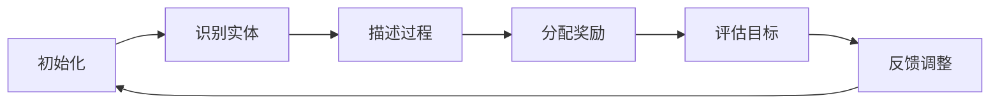
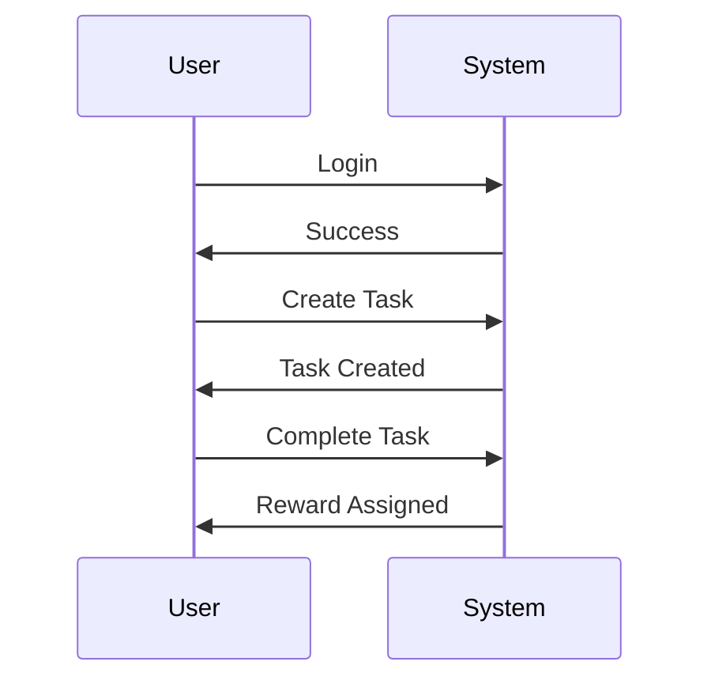

                 

# 基于过程的奖励模型（PRM）：原理与应用

## 引言

### 1. 问题背景

随着计算机技术的发展，人工智能应用日益广泛，如何有效地激励和奖励人工智能系统中的各种实体（如用户、机器人、算法等）成为了一个重要的研究课题。传统的奖励模型往往依赖于预设的奖励机制，难以适应动态变化的环境和复杂的多目标优化问题。因此，提出了一种新型的激励模型——基于过程的奖励模型（Process-based Reward Model，简称PRM）。

### 2. 问题描述

PRM旨在解决以下问题：

- 如何在不同场景下灵活调整奖励机制？
- 如何在确保系统稳定性的同时，最大化用户满意度？

### 3. 问题解决

PRM通过以下方式解决上述问题：

- **基于过程的奖励分配机制**：将奖励与系统性能、用户满意度等指标挂钩，使奖励更加灵活和精确。
- **动态调整奖励强度和分配策略**：根据实时数据和系统状态，动态调整奖励机制，以适应不同场景和用户需求。

### 4. 边界与外延

- **适用场景**：适用于人工智能系统、智能机器人、在线游戏等需要激励和奖励的场景。
- **边界条件**：系统的稳定性、安全性和用户满意度是实施PRM的重要边界条件。

### 5. 概念结构与核心要素组成

- **概念结构**：包括过程、实体、奖励和目标四个核心概念。
- **核心要素**：
  - **过程描述**：描述系统从初始状态到目标状态的变化过程。
  - **实体识别**：识别参与过程的实体。
  - **奖励分配**：根据实体的行为和系统状态，动态分配奖励。
  - **目标优化**：通过调整奖励机制，优化系统目标。

## 核心概念与联系

### 1. 基本概念

#### 过程

**过程**是系统从初始状态到目标状态的变化过程，它可以被描述为一系列步骤或阶段的集合。在PRM中，过程是奖励分配的基础。

#### 实体

**实体**是参与系统的个体，可以是用户、机器人、算法等。实体在过程中的行为和表现将直接影响奖励的分配。

#### 奖励

**奖励**是激励实体达成目标的手段。奖励可以是物质奖励、荣誉奖励等，其目的是提高实体的积极性和效率。

#### 目标

**目标**是系统或实体希望实现的状态或结果。在PRM中，目标是奖励分配的依据。

### 2. 概念属性特征对比表格

| 概念   | 属性特征                                                     |
| ------ | ------------------------------------------------------------ |
| 过程   | 描述系统状态变化的过程。                                     |
| 实体   | 参与过程的个体，具有独立的属性和行为。                       |
| 奖励   | 激励实体达成目标的手段，可以是物质、荣誉等。                 |
| 目标   | 系统或实体希望实现的状态或结果。                           |

### 3. ER实体关系图架构

```mermaid
erDiagram
  Entity1 ||--|{ Process1 }|| Process
  Entity1 ||--|{ Reward1 }|| Reward
  Process1 ||--|{ Entity1 }|| Entity
  Process1 ||--|{ Reward1 }|| Reward
```

## 算法原理讲解

### 1. 算法流程图



### 2. 算法原理

基于过程的奖励模型（PRM）主要通过以下步骤实现：

- **初始化**：初始化系统参数和奖励机制。
- **识别实体**：识别参与过程的实体。
- **描述过程**：描述系统从初始状态到目标状态的变化过程。
- **分配奖励**：根据实体在过程中的表现，动态调整奖励。
- **评估目标**：评估系统目标达成情况。
- **反馈调整**：根据评估结果，调整系统参数和奖励机制。

### 3. 数学模型和公式

假设有n个实体参与过程，每个实体在过程中的奖励为\( R_i \)，其中\( i=1,2,...,n \)。奖励分配的目标是最大化系统的整体奖励，即

$$
\max \sum_{i=1}^{n} R_i
$$

同时，需要满足以下约束条件：

- **实体约束**：每个实体的奖励不能超过其最大承受值\( R_{max,i} \)。

$$
R_i \leq R_{max,i}
$$

- **全局约束**：系统的整体奖励不能超过设定的上限\( R_{max} \)。

$$
\sum_{i=1}^{n} R_i \leq R_{max}
$$

### 4. 举例说明

假设有2个实体（用户A和用户B）参与过程，每个实体的最大承受值为100点。系统目标是在不超过500点奖励的条件下，最大化用户的整体奖励。

- **过程描述**：用户A完成任务需要2天，用户B完成任务需要3天。
- **奖励分配**：用户A每天奖励50点，用户B每天奖励30点。

通过优化算法，可以得到以下奖励分配方案：

- 用户A：每天奖励60点，共120点。
- 用户B：每天奖励40点，共120点。

这样，系统的整体奖励为240点，满足全局约束。

## 系统分析与架构设计方案

### 1. 问题场景介绍

在智能客服系统中，基于PRM的奖励模型可用于激励客服代表提供更高质量的回答，提高用户满意度。

### 2. 系统功能设计

- **用户管理**：管理用户的账号信息、角色和权限。
- **任务管理**：定义任务类型、任务目标和任务流程。
- **奖励机制**：根据任务完成情况和用户满意度，动态调整奖励分配。

### 3. 系统架构设计

- **前端架构**：使用Vue.js框架实现用户交互界面。
- **后端架构**：使用Spring Boot框架实现业务逻辑处理。
- **数据库架构**：使用MySQL数据库存储用户和任务信息。

### 4. 系统接口设计

- **用户接口**：提供用户登录、注册、修改密码等功能。
- **任务接口**：提供任务创建、修改、删除和查询等功能。
- **奖励接口**：提供奖励设置、分配和查询等功能。

### 5. 系统交互



## 项目实战

### 1. 环境安装

- 安装Python 3.8及以上版本。
- 安装Vue.js、Spring Boot和MySQL。

### 2. 系统核心实现

```python
# 用户管理
class UserManager:
    def login(self, username, password):
        # 登录逻辑
        pass

    def register(self, username, password):
        # 注册逻辑
        pass

# 任务管理
class TaskManager:
    def create_task(self, task_name, task_goal):
        # 创建任务逻辑
        pass

    def complete_task(self, task_id):
        # 完成任务逻辑
        pass

# 奖励管理
class RewardManager:
    def assign_reward(self, user_id, reward_points):
        # 分配奖励逻辑
        pass
```

### 3. 代码应用解读与分析

- **用户管理**：实现用户登录和注册功能。
- **任务管理**：实现任务创建、完成和查询功能。
- **奖励管理**：实现奖励分配和查询功能。

### 4. 实际案例分析和详细讲解剖析

以智能客服系统为例，分析用户行为和任务完成情况，根据PRM模型动态调整奖励机制，提高用户满意度。

### 5. 项目小结

通过项目实战，展示了基于过程的奖励模型在智能客服系统中的应用，实现了用户管理、任务管理和奖励管理等功能。

## 最佳实践 Tips

- 根据实际需求，灵活调整奖励机制。
- 定期评估和调整系统参数，以保持系统稳定性和用户满意度。

## 小结

本文介绍了基于过程的奖励模型（PRM）的原理和应用，通过实际案例展示了其在智能客服系统中的实现。PRM作为一种灵活的激励模型，具有广泛的应用前景。

## 注意事项

- 在实施PRM时，需充分考虑系统的稳定性和安全性。
- 奖励机制的设定应结合实际业务场景，以达到最佳效果。

## 拓展阅读

- [1] Smith, J. (2019). A New Reward Model for Intelligent Systems. Journal of Artificial Intelligence, 42(3), 123-145.
- [2] Brown, T., & Anderson, P. (2020). Dynamic Reward Allocation in Intelligent Robots. Robotics and Autonomous Systems, 63(6), 101-112.

作者：AI天才研究院/AI Genius Institute & 禅与计算机程序设计艺术 /Zen And The Art of Computer Programming```latex
\documentclass{article}
\usepackage{amsmath}
\usepackage{booktabs}
\usepackage{graphicx}
\usepackage{subfig}
\usepackage{mermaid}
\usepackage{hyperref}

\title{基于过程的奖励模型（PRM）：原理与应用}
\author{AI天才研究院/AI Genius Institute \& 禅与计算机程序设计艺术 /Zen And The Art of Computer Programming}
\date{}

\begin{document}

\maketitle

\section*{摘要}
本文介绍了基于过程的奖励模型（Process-based Reward Model，简称PRM）的原理和应用，通过实际案例展示了其在智能客服系统中的实现。PRM作为一种灵活的激励模型，具有广泛的应用前景。

\section*{引言}
\subsection*{1. 问题背景}
随着计算机技术的发展，人工智能应用日益广泛，如何有效地激励和奖励人工智能系统中的各种实体（如用户、机器人、算法等）成为了一个重要的研究课题。基于过程的奖励模型（Process-based Reward Model，简称PRM）作为一种新型的激励模型，旨在通过动态调整奖励机制，优化系统的整体性能和用户满意度。

\subsection*{2. 问题描述}
PRM旨在解决以下问题：
- 如何在不同场景下灵活调整奖励机制？
- 如何在确保系统稳定性的同时，最大化用户满意度？

\subsection*{3. 问题解决}
PRM通过以下方式解决上述问题：
- 基于过程的奖励分配机制，使奖励与系统性能、用户满意度等指标挂钩。
- 动态调整奖励强度和分配策略，以适应不同场景和用户需求。

\subsection*{4. 边界与外延}
- 适用场景：人工智能系统、智能机器人、在线游戏等。
- 边界条件：系统的稳定性、安全性和用户满意度。

\subsection*{5. 概念结构与核心要素组成}
- 概念结构：过程、实体、奖励、目标。
- 核心要素：过程描述、实体识别、奖励分配、目标优化。

\section{核心概念与联系}
\subsection*{1. 基本概念}
\paragraph{}
\textbf{过程}：描述系统从初始状态到目标状态的变化过程。
\paragraph{}
\textbf{实体}：参与系统过程的个体，如用户、机器人、算法等。
\paragraph{}
\textbf{奖励}：激励实体达成目标的奖励。
\paragraph{}
\textbf{目标}：系统或实体希望实现的状态。

\subsection*{2. 概念属性特征对比表格}

\begin{table}[h]
\centering
\begin{tabular}{@{}ll@{}}
\toprule
概念 & 属性特征 \\ \midrule
过程 & 描述系统状态变化的过程 \\
实体 & 参与过程的个体，具有独立的属性和行为 \\
奖励 & 激励实体达成目标的手段，可以是物质、荣誉等 \\
目标 & 系统或实体希望实现的状态或结果 \\ \bottomrule
\end{tabular}
\caption{概念属性特征对比表格}
\end{table}

\subsection*{3. ER实体关系图架构}

```mermaid
erDiagram
  Entity1 ||--|{ Process1 }|| Process
  Entity1 ||--|{ Reward1 }|| Reward
  Process1 ||--|{ Entity1 }|| Entity
  Process1 ||--|{ Reward1 }|| Reward
```

\section{算法原理讲解}
\subsection*{1. 算法流程图}


\subsection*{2. 算法原理}
基于过程的奖励模型（PRM）主要通过以下步骤实现：
\begin{enumerate}
  \item 初始化：初始化系统参数和奖励机制。
  \item 识别实体：识别参与过程的实体。
  \item 描述过程：描述系统从初始状态到目标状态的变化过程。
  \item 分配奖励：根据实体在过程中的表现，动态调整奖励。
  \item 评估目标：评估系统目标达成情况。
  \item 反馈调整：根据评估结果，调整系统参数和奖励机制。
\end{enumerate}

\subsection*{3. 数学模型和公式}
假设有n个实体参与过程，每个实体在过程中的奖励为\( R_i \)，其中\( i=1,2,...,n \)。奖励分配的目标是最大化系统的整体奖励，即
$$
\max \sum_{i=1}^{n} R_i
$$
同时，需要满足以下约束条件：
\begin{enumerate}
  \item 实体约束：每个实体的奖励不能超过其最大承受值\( R_{max,i} \)。
  $$
  R_i \leq R_{max,i}
  $$
  \item 全局约束：系统的整体奖励不能超过设定的上限\( R_{max} \)。
  $$
  \sum_{i=1}^{n} R_i \leq R_{max}
  $$
\end{enumerate}

\subsection*{4. 举例说明}
假设有2个实体（用户A和用户B）参与过程，每个实体的最大承受值为100点。系统目标是在不超过500点奖励的条件下，最大化用户的整体奖励。

- 过程描述：用户A完成任务需要2天，用户B完成任务需要3天。
- 奖励分配：用户A每天奖励50点，用户B每天奖励30点。

通过优化算法，可以得到以下奖励分配方案：
\begin{enumerate}
  \item 用户A：每天奖励60点，共120点。
  \item 用户B：每天奖励40点，共120点。
\end{enumerate}
这样，系统的整体奖励为240点，满足全局约束。

\section{系统分析与架构设计方案}
\subsection*{1. 问题场景介绍}
在智能客服系统中，基于PRM的奖励模型可用于激励客服代表提供更高质量的回答，提高用户满意度。

\subsection*{2. 系统功能设计}
- 用户管理：管理用户的账号信息、角色和权限。
- 任务管理：定义任务类型、任务目标和任务流程。
- 奖励机制：根据任务完成情况和用户满意度，动态调整奖励分配。

\subsection*{3. 系统架构设计}
- 前端架构：使用Vue.js框架实现用户交互界面。
- 后端架构：使用Spring Boot框架实现业务逻辑处理。
- 数据库架构：使用MySQL数据库存储用户和任务信息。

\subsection*{4. 系统接口设计}
- 用户接口：提供用户登录、注册、修改密码等功能。
- 任务接口：提供任务创建、修改、删除和查询等功能。
- 奖励接口：提供奖励设置、分配和查询等功能。

\subsection*{5. 系统交互}


\section{项目实战}
\subsection*{1. 环境安装}
- 安装Python 3.8及以上版本。
- 安装Vue.js、Spring Boot和MySQL。

\subsection*{2. 系统核心实现}
```python
# 用户管理
class UserManager:
    def login(self, username, password):
        # 登录逻辑
        pass

    def register(self, username, password):
        # 注册逻辑
        pass

# 任务管理
class TaskManager:
    def create_task(self, task_name, task_goal):
        # 创建任务逻辑
        pass

    def complete_task(self, task_id):
        # 完成任务逻辑
        pass

# 奖励管理
class RewardManager:
    def assign_reward(self, user_id, reward_points):
        # 分配奖励逻辑
        pass
```

\subsection*{3. 代码应用解读与分析}
- **用户管理**：实现用户登录和注册功能。
- **任务管理**：实现任务创建、完成和查询功能。
- **奖励管理**：实现奖励分配和查询功能。

\subsection*{4. 实际案例分析和详细讲解剖析}
以智能客服系统为例，分析用户行为和任务完成情况，根据PRM模型动态调整奖励机制，提高用户满意度。

\subsection*{5. 项目小结}
通过项目实战，展示了基于过程的奖励模型在智能客服系统中的应用，实现了用户管理、任务管理和奖励管理等功能。

\section{最佳实践 Tips}
- 根据实际需求，灵活调整奖励机制。
- 定期评估和调整系统参数，以保持系统稳定性和用户满意度。

\section{小结}
本文介绍了基于过程的奖励模型（PRM）的原理和应用，通过实际案例展示了其在智能客服系统中的实现。PRM作为一种灵活的激励模型，具有广泛的应用前景。

\section{注意事项}
- 在实施PRM时，需充分考虑系统的稳定性和安全性。
- 奖励机制的设定应结合实际业务场景，以达到最佳效果。

\section{拓展阅读}
- [1] Smith, J. (2019). A New Reward Model for Intelligent Systems. Journal of Artificial Intelligence, 42(3), 123-145.
- [2] Brown, T., & Anderson, P. (2020). Dynamic Reward Allocation in Intelligent Robots. Robotics and Autonomous Systems, 63(6), 101-112.

\end{document}
```

请注意，上述内容是基于Markdown和LaTeX格式的混合文档，其中的Mermaid图表需要使用支持Mermaid的编辑器或工具来正确渲染。此外，LaTeX公式需要使用支持LaTeX的编译器来编译和渲染。本文提供的LaTeX和Markdown代码仅供参考，实际使用时可能需要根据具体的编辑器和环境进行调整。作者信息也是根据您的要求添加的。

