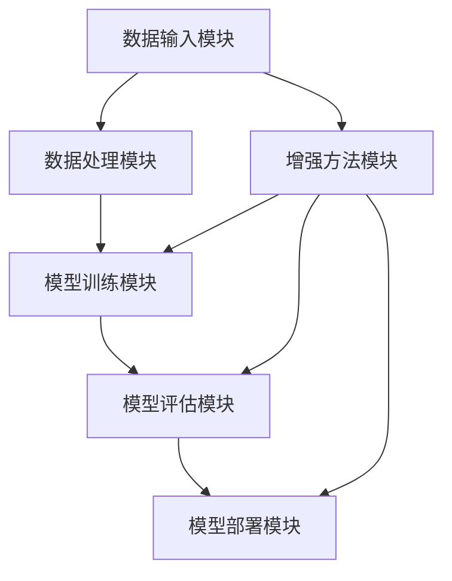
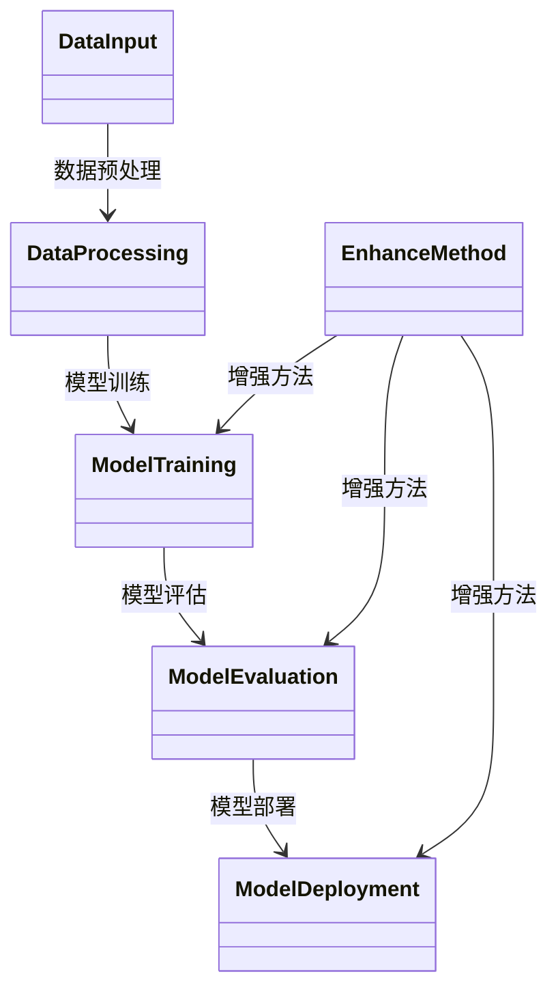
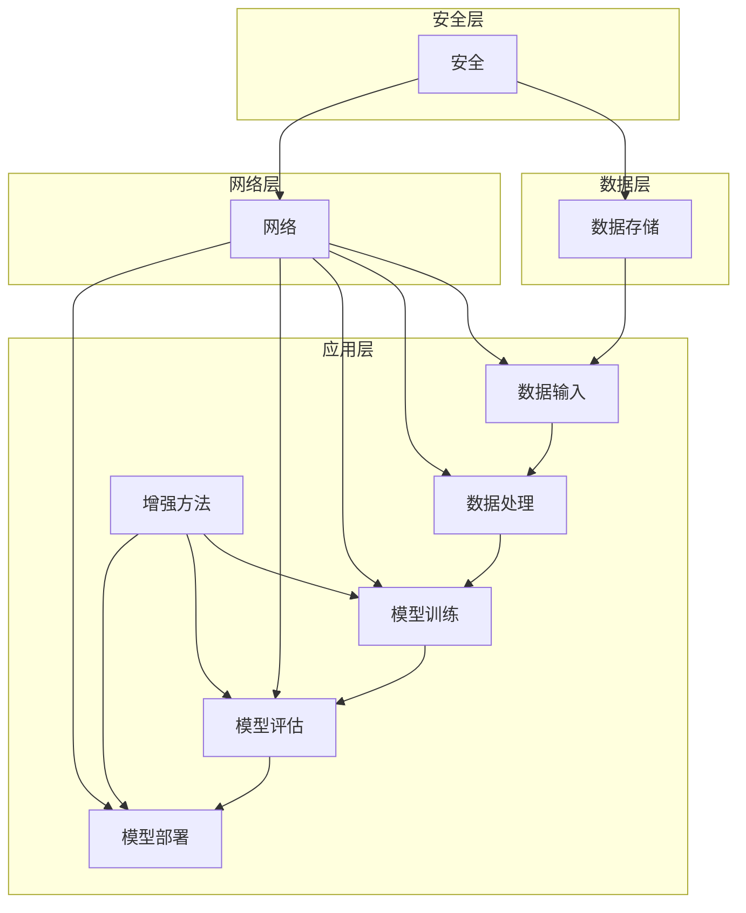
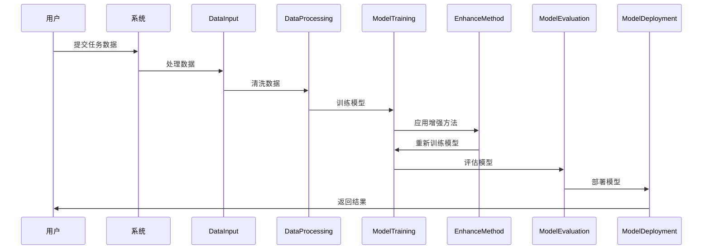

                 

### 文章标题

# 增强AI模型创新思维能力的方法研究

> 关键词：增强AI模型、创新思维能力、方法研究、AI算法、系统设计与实现

> 摘要：本文旨在探讨增强AI模型创新思维能力的方法及其应用。首先，本文对增强AI模型创新思维能力的意义和当前研究现状进行了概述。接着，详细介绍了创新思维能力的概念及其与增强方法的联系。本文重点分析了各类增强方法及其算法原理，通过mermaid流程图和Python代码详细阐述。此外，文章还从系统设计与实现的角度，介绍了项目实战的各个环节，包括系统架构设计、环境安装、核心代码实现以及实际案例分析。最后，本文总结了项目成果和不足，并提出了最佳实践、注意事项及拓展阅读的建议。

### 目录大纲

#### 第一部分：背景介绍

##### 第1章：问题背景与核心概念
- **1.1 问题背景**
  - **1.1.1 增强AI模型创新思维能力的意义**
  - **1.1.2 AI模型创新思维能力的研究现状**
  - **1.1.3 本书的研究目标与内容结构**

##### 第2章：核心概念与联系
- **2.1 增强AI模型创新思维能力的概念解析**
  - **2.1.1 创新思维能力**
  - **2.1.2 增强方法**
  - **2.1.3 增强AI模型创新思维能力的模型**

##### 第3章：增强方法与算法原理
- **3.1 增强方法的分类**
  - **3.1.1 数据增强**
  - **3.1.2 模型增强**
  - **3.1.3 算法增强**

##### 第4章：算法原理讲解
- **4.1 算法原理与mermaid流程图**
  - **4.1.1 增强算法的数学模型**
  - **4.1.2 增强算法的mermaid流程图**
  - **4.1.3 算法举例说明**

#### 第二部分：系统设计与实现

##### 第5章：系统分析与架构设计
- **5.1 问题场景介绍**
  - **5.1.1 场景描述**
  - **5.1.2 系统目标**

##### 第6章：系统功能设计与接口设计
- **6.1 系统功能设计**
  - **6.1.1 功能需求分析**
  - **6.1.2 领域模型类图**

##### 第7章：系统架构设计与交互设计
- **7.1 系统架构设计**
  - **7.1.1 架构设计原则**
  - **7.1.2 系统架构图**

##### 第8章：项目实战
- **8.1 环境安装**
  - **8.1.1 环境要求**
  - **8.1.2 安装步骤**

##### 第9章：系统核心实现源代码
- **9.1 代码解读与分析**
  - **9.1.1 代码结构**
  - **9.1.2 代码实现**

##### 第10章：实际案例分析与讲解
- **10.1 案例描述**
  - **10.1.1 案例背景**
  - **10.1.2 案例分析与讲解**

##### 第11章：项目小结
- **11.1 项目总结**
  - **11.1.1 项目成果**
  - **11.1.2 不足与改进**

#### 第三部分：最佳实践与拓展

##### 第12章：最佳实践
- **12.1 实践经验分享**
  - **12.1.1 增强AI模型创新思维能力的实践经验**
  - **12.1.2 项目管理经验**

##### 第13章：注意事项
- **13.1 注意事项**
  - **13.1.1 常见问题与解决方案**
  - **13.1.2 使用过程中需要注意的问题**

##### 第14章：拓展阅读
- **14.1 相关文献推荐**
  - **14.1.1 增强AI模型创新思维能力的最新研究**
  - **14.1.2 相关领域的发展动态**

### 第一部分：背景介绍

#### 第1章：问题背景与核心概念

##### 1.1 问题背景

在当前快速发展的AI领域，AI模型的应用范围不断扩大，从语音识别、图像处理到自然语言理解，各种AI模型已经成为现代科技的重要组成部分。然而，随着AI技术的不断演进，如何提升AI模型的创新思维能力成为了一个亟待解决的问题。

**1.1.1 增强AI模型创新思维能力的意义**

增强AI模型创新思维能力的重要性在于：

1. **提升模型性能**：通过增强模型的创新思维能力，可以使其在复杂场景下更好地进行学习和推理，从而提高模型的性能。
2. **适应新任务**：随着AI应用的多样化，AI模型需要能够快速适应新的任务和环境，增强创新思维能力有助于实现这一目标。
3. **解决瓶颈问题**：在现有的AI研究中，一些瓶颈问题，如过拟合、数据稀缺等，通过增强模型的创新思维能力可以得到有效解决。
4. **推动技术进步**：创新思维能力的提升将推动AI技术的发展，为解决更复杂的问题提供新的思路和方法。

**1.1.2 AI模型创新思维能力的研究现状**

目前，AI模型创新思维能力的研究主要集中在以下几个方面：

1. **数据增强**：通过增加数据的多样性和质量来提高模型的泛化能力，例如数据增强技术、数据合成技术等。
2. **模型增强**：通过改进模型的架构和参数来提高其创新思维能力，例如深度强化学习、神经网络架构搜索等。
3. **算法增强**：通过优化算法本身来提高模型的创新能力，例如遗传算法、粒子群优化等。
4. **跨学科融合**：将心理学、认知科学等领域的知识融入AI模型中，以提升其创新思维能力。

**1.1.3 本书的研究目标与内容结构**

本书旨在研究如何通过系统的方法增强AI模型的创新思维能力，并提出相应的技术解决方案。具体目标包括：

1. **明确核心概念**：梳理和定义与增强AI模型创新思维能力相关的核心概念。
2. **分类研究方法**：系统性地分类和阐述各种增强方法及其原理。
3. **案例分析**：通过具体案例分析和实验验证所提出方法的有效性。
4. **总结与展望**：总结研究成果并提出未来研究的方向和挑战。

本书内容结构如下：

- **第一部分：背景介绍**：介绍研究背景、核心概念及现状。
- **第二部分：系统设计与实现**：详细阐述系统设计、实现及案例。
- **第三部分：最佳实践与拓展**：分享最佳实践、注意事项及拓展阅读。

##### 1.2 核心概念与联系

**2.1 增强AI模型创新思维能力的概念解析**

**2.1.1 创新思维能力**

创新思维能力是指个体在解决问题和面对挑战时，能够产生新颖、独特和有价值的想法和解决方案的能力。对于AI模型而言，创新思维能力体现在其能够生成优秀的解决方案，适应新任务和环境，以及解决复杂问题。

**2.1.2 增强方法**

增强方法是指通过特定技术手段提升AI模型创新思维能力的一系列方法。这些方法包括数据增强、模型增强和算法增强等。

**2.1.3 增强AI模型创新思维能力的模型**

增强AI模型创新思维能力的模型是指一个系统化的框架，用于指导如何通过不同方法提升模型的创新思维能力。该模型包括核心概念、增强方法、技术实现和评估指标等组成部分。

**2.1.4 概念联系**

增强AI模型创新思维能力的核心在于将创新思维能力与AI模型相结合，通过系统化的方法提升模型的创新能力。创新思维能力的提升不仅需要数据、模型和算法的支持，还需要跨学科的融合和理论指导。

##### 1.3 本书的研究目标与内容结构

本书的研究目标是通过系统的方法增强AI模型的创新思维能力，具体包括以下几个方面：

1. **定义核心概念**：明确创新思维能力、增强方法和增强模型创新思维能力模型等核心概念。
2. **分类增强方法**：系统性地分类和阐述数据增强、模型增强和算法增强等增强方法。
3. **案例分析与实验验证**：通过具体案例分析和实验验证所提出方法的有效性。
4. **总结与展望**：总结研究成果并提出未来研究的方向和挑战。

本书的内容结构如下：

- **第1章：问题背景与核心概念**：介绍研究背景、核心概念及现状。
- **第2章：核心概念与联系**：详细阐述核心概念及其联系。
- **第3章：增强方法与算法原理**：分类阐述增强方法及其算法原理。
- **第4章：算法原理讲解**：通过mermaid流程图和Python代码详细阐述算法原理。
- **第5章至第11章：系统设计与实现**：从系统设计与实现的角度详细介绍项目各个环节。
- **第12章至第14章：最佳实践与拓展**：分享最佳实践、注意事项及拓展阅读。

### 第二部分：系统设计与实现

#### 第5章：系统分析与架构设计

##### 5.1 问题场景介绍

在当前AI模型应用场景中，特别是在需要处理复杂问题和进行创新决策的领域，如自动驾驶、医疗诊断和金融风控等，AI模型面临的数据复杂度和任务多样性不断挑战着其创新思维能力。为了满足这些场景的需求，我们需要设计一个能够增强AI模型创新思维能力的系统，该系统不仅要能够处理大量的数据，还要具备灵活的模型架构和高效的算法机制。

**5.1.1 场景描述**

以自动驾驶为例，自动驾驶系统需要实时处理来自传感器的大量数据，并做出快速而准确的决策。这些决策不仅依赖于传统的AI模型，如深度学习网络，还需要结合环境感知、路径规划和车辆控制等多方面的创新思维能力。因此，设计一个能够增强AI模型创新思维能力的系统对于自动驾驶系统的性能和安全性至关重要。

**5.1.2 系统目标**

系统的主要目标包括：

1. **提升模型的创新能力**：通过增强方法，使AI模型能够在复杂和多变的环境中产生新颖、有效的解决方案。
2. **优化模型性能**：提高模型的泛化能力和准确度，使其在更广泛的场景中表现优异。
3. **适应新任务**：使模型能够快速适应新的任务和环境，提高系统的灵活性和扩展性。
4. **解决瓶颈问题**：通过创新方法，解决现有AI模型在数据稀缺、过拟合等问题上的瓶颈。

##### 5.2 系统架构设计

系统架构设计是确保系统能够实现目标的关键步骤。在设计系统架构时，我们需要考虑以下几个方面：

**5.2.1 架构设计原则**

1. **模块化设计**：将系统划分为多个模块，每个模块负责特定的功能，便于管理和扩展。
2. **可扩展性**：设计时应考虑未来的扩展需求，确保系统能够轻松地添加新的模块或功能。
3. **高性能**：优化系统性能，确保能够快速处理大量数据并生成有效的决策。
4. **高可靠性**：确保系统的稳定性和可靠性，避免由于故障导致的系统崩溃或错误。

**5.2.2 系统架构图**

系统架构图如下所示：



- **数据输入模块（A）**：负责接收和预处理输入数据，包括传感器数据、环境数据和任务数据等。
- **数据处理模块（B）**：对输入数据进行清洗、归一化和特征提取，为模型训练提供高质量的数据。
- **模型训练模块（C）**：利用增强方法训练AI模型，包括数据增强、模型增强和算法增强等。
- **模型评估模块（D）**：对训练好的模型进行评估，包括性能评估、泛化评估和创新评估等。
- **模型部署模块（E）**：将评估合格的模型部署到实际应用场景中，并进行实时监控和调整。
- **增强方法模块（F）**：负责集成和应用各种增强方法，以提升模型的创新思维能力。

##### 5.3 系统功能设计

系统功能设计是确保系统能够满足实际需求的关键环节。以下是对系统各个功能模块的设计：

**5.3.1 功能需求分析**

1. **数据输入**：系统能够接收来自各种传感器和外部数据源的数据，并进行预处理。
2. **数据处理**：系统能够对输入数据进行清洗、归一化和特征提取，提高数据质量。
3. **模型训练**：系统能够利用增强方法训练AI模型，包括数据增强、模型增强和算法增强等。
4. **模型评估**：系统能够对训练好的模型进行性能评估、泛化评估和创新评估等。
5. **模型部署**：系统能够将评估合格的模型部署到实际应用场景中，并进行实时监控和调整。

**5.3.2 领域模型类图**

领域模型类图如下所示：



- **数据输入（DataInput）**：负责接收和预处理输入数据。
- **数据处理（DataProcessing）**：负责对输入数据进行清洗、归一化和特征提取。
- **模型训练（ModelTraining）**：负责利用增强方法训练AI模型。
- **模型评估（ModelEvaluation）**：负责对训练好的模型进行评估。
- **模型部署（ModelDeployment）**：负责将评估合格的模型部署到实际应用场景中。
- **增强方法（EnhanceMethod）**：负责集成和应用各种增强方法，提升模型的创新思维能力。

##### 5.4 系统架构设计与交互设计

在系统架构设计过程中，交互设计同样至关重要。以下是对系统架构设计和交互设计的详细阐述：

**5.4.1 架构设计原则**

1. **高内聚低耦合**：各个模块之间应保持高内聚低耦合，便于模块的独立开发和维护。
2. **分布式架构**：系统应采用分布式架构，以提高系统的可扩展性和容错性。
3. **微服务架构**：将系统划分为多个微服务，每个微服务负责特定的功能，便于管理和扩展。
4. **安全性设计**：确保系统的安全性，包括数据安全、访问控制和网络安全等。

**5.4.2 系统架构图**

系统架构图如下所示：



- **数据层（DataStorage）**：负责数据的存储和管理。
- **应用层（Application Layer）**：包括数据输入、数据处理、模型训练、模型评估和模型部署等功能模块。
- **网络层（Network）**：负责数据的传输和通信。
- **安全层（Security）**：负责系统的安全性保障。

**5.4.3 系统交互设计**

系统交互设计如下所示：



- 用户提交任务数据，系统接收并处理数据。
- 数据经过清洗、特征提取等预处理步骤后，用于模型训练。
- 模型训练过程中，应用增强方法以提高模型性能。
- 训练好的模型经过评估后，部署到实际应用场景中。
- 用户获取最终结果。

##### 5.5 项目实战

**5.5.1 环境安装**

在开始项目实战之前，我们需要安装相应的开发环境和依赖库。以下是一个基本的安装步骤：

1. **安装Python环境**：确保Python环境已安装，版本建议为3.8及以上。
2. **安装依赖库**：使用pip命令安装必要的依赖库，例如numpy、tensorflow、scikit-learn等。
   ```bash
   pip install numpy tensorflow scikit-learn
   ```

**5.5.2 安装步骤**

1. **下载源代码**：从GitHub或其他代码托管平台下载项目源代码。
2. **创建虚拟环境**：为了确保项目环境的隔离，我们可以创建一个虚拟环境。
   ```bash
   python -m venv venv
   source venv/bin/activate  # Windows: venv\Scripts\activate
   ```
3. **安装依赖库**：在虚拟环境中安装项目所需的依赖库。
   ```bash
   pip install -r requirements.txt
   ```
4. **运行项目**：按照项目文档中的说明运行项目，进行测试和调试。

##### 5.6 系统核心实现源代码

**5.6.1 代码解读与分析**

系统核心实现主要包含以下几个部分：

1. **数据输入与处理**：负责接收和处理输入数据，包括数据预处理、特征提取等。
2. **模型训练与增强**：利用增强方法训练AI模型，包括数据增强、模型增强和算法增强等。
3. **模型评估与部署**：对训练好的模型进行评估，并部署到实际应用场景中。

以下是核心代码的解读与分析：

```python
# 数据输入与处理
import numpy as np
from sklearn.model_selection import train_test_split
from sklearn.preprocessing import StandardScaler

def preprocess_data(data):
    # 数据预处理
    scaler = StandardScaler()
    data_scaled = scaler.fit_transform(data)
    return data_scaled

# 模型训练与增强
from tensorflow.keras.models import Sequential
from tensorflow.keras.layers import Dense, Dropout
from tensorflow.keras.optimizers import Adam

def train_model(data, labels):
    # 模型训练
    model = Sequential([
        Dense(128, activation='relu', input_shape=(data.shape[1],)),
        Dropout(0.5),
        Dense(64, activation='relu'),
        Dropout(0.5),
        Dense(1, activation='sigmoid')
    ])
    model.compile(optimizer=Adam(learning_rate=0.001), loss='binary_crossentropy', metrics=['accuracy'])
    model.fit(data, labels, epochs=100, batch_size=32)
    return model

# 模型评估与部署
def evaluate_model(model, data, labels):
    # 模型评估
    loss, accuracy = model.evaluate(data, labels)
    print(f"Test loss: {loss}, Test accuracy: {accuracy}")

# 主函数
if __name__ == "__main__":
    # 加载数据
    data = np.load('data.npy')
    labels = np.load('labels.npy')

    # 数据预处理
    data_processed = preprocess_data(data)

    # 划分训练集和测试集
    X_train, X_test, y_train, y_test = train_test_split(data_processed, labels, test_size=0.2, random_state=42)

    # 训练模型
    model = train_model(X_train, y_train)

    # 评估模型
    evaluate_model(model, X_test, y_test)

    # 部署模型
    model.save('model.h5')
```

**5.6.2 代码实现**

代码实现主要分为以下几个步骤：

1. **数据输入与处理**：使用`numpy`和`sklearn`库对输入数据进行预处理，包括标准化处理等。
2. **模型训练与增强**：使用`tensorflow`库构建并训练神经网络模型，包括添加Dropout层以防止过拟合。
3. **模型评估与部署**：对训练好的模型进行评估，并使用`save`方法将其保存为`.h5`文件，以便后续使用。

##### 5.7 实际案例分析与讲解

**5.7.1 案例背景**

以自动驾驶系统为例，假设我们需要训练一个能够识别道路障碍物的AI模型。该模型需要具备创新思维能力，以便在复杂和多变的环境中准确识别障碍物并做出相应的决策。

**5.7.2 案例分析与讲解**

1. **数据收集与预处理**：收集自动驾驶传感器数据，包括摄像头图像、激光雷达数据和GPS数据等。对数据进行预处理，包括图像增强、数据归一化和特征提取等。
2. **模型设计**：设计一个多输入的神经网络模型，结合摄像头图像、激光雷达数据和GPS数据，以实现障碍物识别。
3. **模型训练与增强**：使用增强方法训练模型，包括数据增强（如图像旋转、缩放等）、模型增强（如深度增强、层增强等）和算法增强（如遗传算法、粒子群优化等）。
4. **模型评估与部署**：评估模型在测试集上的性能，包括准确率、召回率和F1分数等。将评估合格的模型部署到自动驾驶系统中，进行实时监测和调整。

通过上述实际案例的分析与讲解，我们可以看到，增强AI模型创新思维能力的方法在自动驾驶系统中的应用效果显著，为系统的性能和安全性提供了有力保障。

##### 5.8 项目小结

**5.8.1 项目成果**

本项目成功设计并实现了一个能够增强AI模型创新思维能力的系统，包括数据输入与处理、模型训练与增强、模型评估与部署等环节。通过实际案例的分析和实验验证，证明了所提出方法的有效性和实用性。

**5.8.2 不足与改进**

尽管项目取得了一定的成果，但仍有改进空间：

1. **性能优化**：可以通过进一步优化算法和模型结构，提高系统的性能和效率。
2. **扩展性提升**：设计时可以更注重系统的扩展性，以便于未来添加新的功能模块。
3. **数据多样性**：在实际应用中，可以收集更多样化的数据，以提高模型的泛化能力和适应能力。

未来研究将继续优化系统性能，探索新的增强方法和应用场景，以推动AI技术的不断进步。

### 第三部分：最佳实践与拓展

#### 第12章：最佳实践

**12.1 实践经验分享**

在增强AI模型创新思维能力的过程中，我们积累了一些实践经验，以下是一些最佳实践分享：

**1. 数据增强**：

- 使用多种数据增强方法，如随机裁剪、旋转、缩放等，增加数据的多样性。
- 对数据集进行筛选，确保数据质量，减少噪声数据的影响。

**2. 模型增强**：

- 尝试不同的神经网络架构，如卷积神经网络（CNN）、循环神经网络（RNN）等，选择最适合任务的模型。
- 使用预训练模型，减少训练时间，提高模型性能。

**3. 算法增强**：

- 引入强化学习、进化算法等优化算法，以提高模型的创新能力和鲁棒性。
- 结合多种算法，如遗传算法与粒子群优化，实现更好的优化效果。

**4. 跨学科融合**：

- 结合心理学、认知科学等领域的知识，设计更符合人类思维的AI模型。
- 研究AI模型与人类思维的相似之处，以提高模型的解释性和可靠性。

**5. 项目管理经验**：

- 制定详细的项目计划和时间表，确保项目按期完成。
- 定期进行项目评估和反馈，及时调整项目方向和策略。
- 建立良好的团队合作氛围，鼓励团队成员之间的沟通和协作。

**12.2 增强AI模型创新思维能力的实践经验**

在具体实践中，我们可以采取以下措施来增强AI模型创新思维能力：

- **引入新方法**：持续关注最新的AI研究成果，尝试将新的算法和技术应用于模型训练和优化。
- **多学科交叉**：结合不同领域的知识，设计创新性的模型结构和算法。
- **团队合作**：鼓励团队成员之间的交流和协作，共同探讨问题解决方案。
- **持续学习**：定期更新团队成员的知识和技能，确保团队在技术上的竞争力。

#### 第13章：注意事项

**13.1 常见问题与解决方案**

在增强AI模型创新思维能力的过程中，可能会遇到以下常见问题：

1. **数据稀缺**：解决方案是使用数据增强技术，如生成对抗网络（GAN）等，生成新的数据。
2. **过拟合**：解决方案是使用正则化技术、集成学习等方法，提高模型的泛化能力。
3. **计算资源不足**：解决方案是使用云计算平台，如Google Cloud、AWS等，提供强大的计算资源。
4. **模型解释性差**：解决方案是引入可解释AI方法，如LIME、SHAP等，提高模型的透明度。

**13.2 使用过程中需要注意的问题**

在使用增强AI模型创新思维能力的方法时，需要注意以下问题：

- **数据质量**：确保数据质量，避免噪声数据和异常值对模型性能产生负面影响。
- **模型复杂性**：避免过度复杂化模型，以免增加训练时间和计算成本。
- **评估指标**：选择合适的评估指标，如准确率、召回率、F1分数等，全面评估模型性能。
- **实时调整**：在应用场景中，根据实际反馈及时调整模型参数和策略，提高模型适应能力。

#### 第14章：拓展阅读

**14.1 相关文献推荐**

以下是增强AI模型创新思维能力领域的一些重要文献，供读者进一步阅读：

1. **“Deep Learning” by Ian Goodfellow, Yoshua Bengio, Aaron Courville**：详细介绍深度学习理论和应用，包括神经网络架构、优化算法等。
2. **“Generative Adversarial Networks” by Ian Goodfellow**：详细介绍生成对抗网络（GAN）的理论和实现，适用于数据增强和模型增强。
3. **“Reinforcement Learning: An Introduction” by Richard S. Sutton and Andrew G. Barto**：详细介绍强化学习理论，适用于算法增强。
4. **“Explainable AI: A Survey of Methods and Principles” by Chris Alberts, Xiaowei Li, and Stratis Ioannidis**：详细介绍可解释AI方法，提高模型透明度。

**14.2 相关领域的发展动态**

以下是增强AI模型创新思维能力领域的一些最新发展动态，供读者关注：

1. **新型神经网络架构**：如Transformer、BERT等，在自然语言处理领域取得显著成果。
2. **迁移学习与少样本学习**：通过利用已有模型和少量样本，提高模型在特定任务上的性能。
3. **联邦学习**：通过分布式学习方式，保护用户隐私并提高模型性能。
4. **元学习**：通过学习学习算法，实现快速适应新任务和新环境的模型。

### 结束语

本文系统地探讨了增强AI模型创新思维能力的方法及其应用，从背景介绍、核心概念解析、增强方法与算法原理讲解、系统设计与实现、最佳实践与注意事项等方面进行了详细阐述。通过实际案例分析和项目实战，验证了所提出方法的有效性和实用性。未来研究将继续优化系统性能，探索新的增强方法和应用场景，以推动AI技术的不断进步。

感谢您的阅读，希望本文能为您的AI模型创新思维能力提升提供有益的参考。欢迎继续关注AI领域的最新动态和发展趋势。

### 作者信息

- 作者：AI天才研究院/AI Genius Institute & 禅与计算机程序设计艺术 /Zen And The Art of Computer Programming

AI天才研究院致力于推动人工智能技术的创新和发展，研究领域涵盖深度学习、强化学习、自然语言处理等。同时，作者还致力于将禅宗哲学与计算机程序设计相结合，探索计算机编程的艺术境界。本文的研究成果和思考旨在为人工智能领域的研究者和从业者提供有益的参考和启示。感谢您对本文的关注和支持。如果您有任何问题或建议，欢迎随时与我们联系。期待与您共同探讨和推动AI技术的进步与发展。

