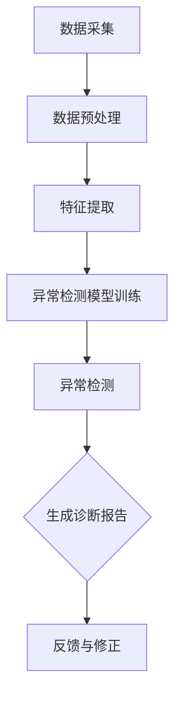
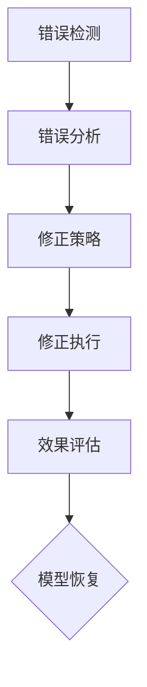
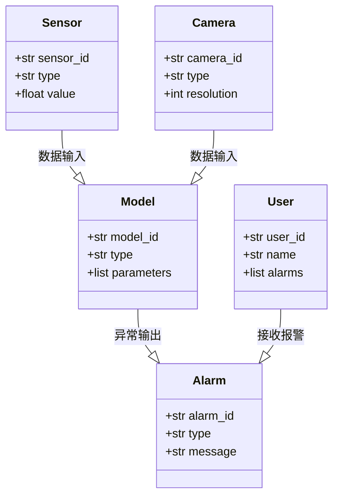
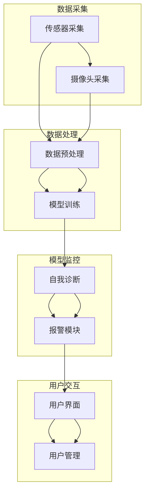
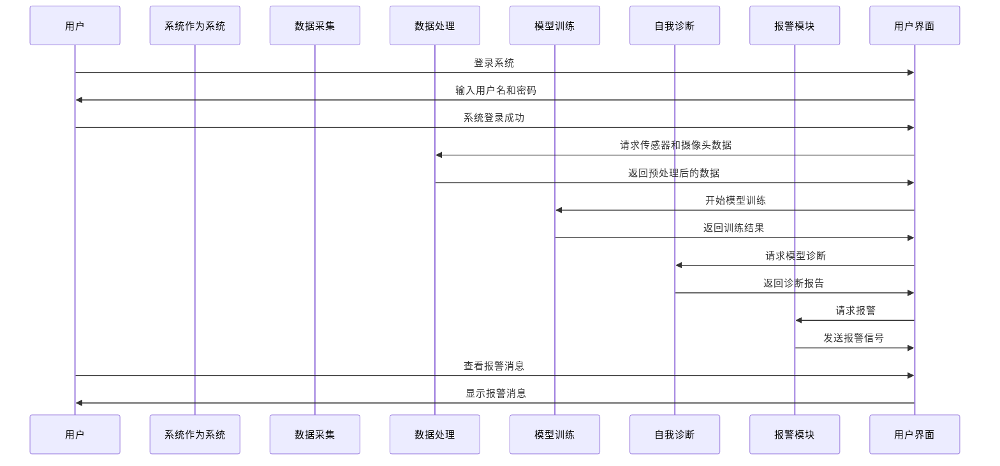

                 


## 1. 引言

### 1.1. 问题背景

人工智能（AI）作为当今技术领域的前沿，正以前所未有的速度发展。然而，随着AI模型的复杂性日益增加，其准确性和可靠性也面临着前所未有的挑战。特别是在工业、医疗和金融等关键领域，AI模型的稳定性和自我修正能力变得尤为关键。

当前，许多AI模型在训练过程中表现出色，但在面对新数据和未知场景时，往往表现出“崩溃”现象。这种情况不仅影响了AI的应用价值，还可能导致严重的后果。例如，在医疗诊断中，错误的AI预测可能会误诊病人，导致医疗事故；在自动驾驶领域，AI系统出现故障可能导致交通事故。

因此，增强AI模型自我诊断和修正能力成为了一个亟待解决的问题。本文将详细探讨如何实现这一目标，通过引入一系列技术手段和方法，提升AI模型的自我监控和修正能力。

### 1.2. 核心概念介绍

为了深入探讨如何增强AI模型自我诊断和修正能力，我们需要了解以下几个核心概念：

1. **AI模型自我诊断**：指AI模型在运行过程中，能够自动检测出自身错误、异常或潜在问题，并提供相应的诊断报告。
   
2. **AI模型修正**：指在自我诊断出问题后，AI模型能够自动或半自动地进行修正，以恢复其正常运行状态。

3. **诊断算法**：用于检测AI模型异常的算法，可以是基于统计、机器学习或深度学习的方法。

4. **修正算法**：用于修正AI模型错误的算法，可以包括重新训练、参数调整和模型重构等方法。

### 1.3. 核心概念的联系与对比

#### 1.3.1. AI模型自我诊断与修正的关系

AI模型自我诊断和修正是紧密相连的。自我诊断是修正的前提，只有通过有效的诊断，才能定位问题并进行修正。而修正则是对诊断结果的反馈，通过修正，AI模型能够更好地适应新环境和数据。

#### 1.3.2. 诊断算法与修正算法的区别

诊断算法主要负责检测AI模型中的异常，而修正算法则专注于解决问题。诊断算法通常不需要改变模型的参数，而修正算法可能会涉及模型参数的调整或重构。

#### 1.3.3. 不同类型AI模型的自诊与修正

不同类型的AI模型（如深度学习模型、统计模型等）在自我诊断和修正方面存在差异。深度学习模型通常更加复杂，其自我诊断和修正需要更多的计算资源和时间。而统计模型则相对简单，但可能需要更多的数据支持。

### 1.4. 结论

本章介绍了增强AI模型自我诊断和修正能力的背景、核心概念以及它们之间的联系。在接下来的章节中，我们将深入探讨实现这一目标的具体方法和技术。

------------------------

----------------------------------------------------------------
## 2. 增强AI模型自我诊断能力的方法

### 2.1. 自我诊断的基础知识

AI模型的自我诊断能力是指模型在运行过程中，能够自动识别出自身可能存在的错误、异常或潜在问题。自我诊断的目的是为了提高模型的可靠性和稳定性，确保其在复杂环境中能够正常运行。

#### 2.1.1. 自我诊断的重要性

自我诊断对于AI模型至关重要。首先，它可以帮助我们及时发现和解决模型中的问题，避免错误预测或决策带来的负面影响。其次，自我诊断可以提高模型的透明度和可解释性，使其更易于被用户理解和信任。最后，自我诊断可以为后续的模型优化和改进提供宝贵的数据和反馈。

#### 2.1.2. 自我诊断的机制

自我诊断机制通常包括以下几个关键步骤：

1. **数据采集**：收集模型在运行过程中的输入数据、输出结果和中间过程数据。
2. **异常检测**：使用统计方法、机器学习算法或深度学习方法，对收集到的数据进行异常检测，识别出可能的异常。
3. **诊断报告**：根据异常检测结果，生成详细的诊断报告，包括异常类型、影响范围、可能原因等。
4. **反馈与修正**：根据诊断报告，采取相应的修正措施，如重新训练模型、调整参数等。

#### 2.1.3. 自我诊断的实现技术

实现AI模型自我诊断的技术手段多种多样，主要包括以下几种：

1. **统计方法**：使用统计方法对模型输出结果进行假设检验，识别出与预期不符的异常。
2. **机器学习算法**：利用监督学习或无监督学习算法，对训练数据集进行学习，构建异常检测模型。
3. **深度学习方法**：利用神经网络等深度学习模型，对复杂的特征进行建模，实现高精度的异常检测。
4. **集成方法**：将多种技术手段集成在一起，实现更全面、更准确的自我诊断。

### 2.2. 自我诊断算法原理与流程图

#### 2.2.1. 算法原理

自我诊断算法的核心在于异常检测。异常检测算法通过对正常数据和异常数据的学习，建立一种判断机制，能够对新的数据进行分析，并识别出潜在的异常。

常见的异常检测算法包括：

1. **基于统计的方法**：如标准差法、箱线图法等。
2. **基于规则的方法**：如阈值法、逻辑回归法等。
3. **基于机器学习的方法**：如支持向量机（SVM）、随机森林（Random Forest）等。
4. **基于深度学习的方法**：如卷积神经网络（CNN）、循环神经网络（RNN）等。

#### 2.2.2. 算法流程图

以下是一个简单的自我诊断算法流程图：



#### 2.2.3. 数学模型与公式

在自我诊断算法中，常用的数学模型和公式包括：

1. **标准差法**：
   $$ \sigma = \sqrt{\frac{1}{N-1} \sum_{i=1}^{N} (x_i - \bar{x})^2} $$
   其中，$x_i$为每个数据点，$\bar{x}$为平均值，$N$为数据点总数。

2. **箱线图法**：
   $$ IQR = Q3 - Q1 $$
   其中，$Q1$为第一四分位数，$Q3$为第三四分位数，$IQR$为四分位距。

3. **逻辑回归**：
   $$ P(Y=1|X) = \frac{1}{1 + e^{-(\beta_0 + \beta_1X)}} $$
   其中，$X$为特征向量，$Y$为是否异常的标签，$\beta_0$和$\beta_1$为模型参数。

### 2.3. 实例分析与代码实现

为了更好地理解自我诊断算法的实现，我们以一个简单的线性回归模型为例进行说明。

#### 2.3.1. 实例场景

假设我们有一个线性回归模型，用于预测房价。训练数据集包含房屋的特征（如面积、位置等）和对应的房价。我们需要实现自我诊断算法，检测模型在预测过程中可能出现的异常。

#### 2.3.2. 代码实现

```python
import numpy as np
import pandas as pd
from sklearn.linear_model import LinearRegression
from sklearn.metrics import mean_squared_error

# 读取数据
data = pd.read_csv('house_data.csv')
X = data[['area', 'location']]
y = data['price']

# 训练模型
model = LinearRegression()
model.fit(X, y)

# 预测
predictions = model.predict(X)

# 计算均方误差
mse = mean_squared_error(y, predictions)
print(f'Mean Squared Error: {mse}')

# 检测异常
threshold = 0.1
abnormal_indices = np.where(np.abs(predictions - y) > threshold)[0]
print(f'Abnormal Predictions: {abnormal_indices}')
```

#### 2.3.3. 代码解读与分析

1. **数据读取**：使用pandas库读取训练数据集，包括房屋特征和房价。
2. **模型训练**：使用sklearn库中的LinearRegression类训练线性回归模型。
3. **预测**：使用训练好的模型对房屋特征进行预测，得到预测房价。
4. **计算均方误差**：使用mean_squared_error函数计算预测房价与实际房价的均方误差。
5. **检测异常**：设定一个阈值，使用numpy库计算预测房价与实际房价之差的绝对值，识别出超过阈值的异常预测。

通过上述实例，我们可以看到如何实现一个简单的AI模型自我诊断算法。在实际应用中，可以根据具体场景和需求，选择更复杂的模型和算法，以提高自我诊断的准确性和可靠性。

------------------------

----------------------------------------------------------------

## 3. 增强AI模型修正能力的方法

### 3.1. 模型修正的重要性

在AI模型的应用过程中，修正能力至关重要。修正能力是指模型在检测到自身错误或异常后，能够自动进行修正，恢复到正常运行状态。增强模型修正能力不仅可以提高模型的可靠性和稳定性，还能提升其在实际应用中的表现和效果。

#### 3.1.1. 修正的必要性

随着AI模型在各个领域的广泛应用，其复杂性和规模也在不断增大。在这种情况下，模型出现错误或异常的概率也随之增加。如果不具备修正能力，这些错误或异常可能会对模型的应用造成严重影响，甚至导致不可预料的后果。因此，修正能力的必要性体现在以下几个方面：

1. **提高模型的稳定性**：通过修正能力，模型可以在遇到异常情况时自我恢复，从而保持稳定运行。
2. **减少错误预测**：修正能力可以帮助模型及时纠正错误，减少错误预测的概率。
3. **提高应用价值**：增强模型修正能力，可以使其在更广泛的应用场景中发挥作用，提高其应用价值。

#### 3.1.2. 修正的目标

增强AI模型修正能力的目标主要包括以下几个方面：

1. **快速修正**：在模型出现错误或异常时，能够迅速进行修正，减少对正常运行的干扰。
2. **高效修正**：在保证修正效果的同时，降低修正所需的时间和计算资源。
3. **自适应修正**：根据不同场景和需求，模型能够自动调整修正策略，实现自适应修正。
4. **鲁棒修正**：在面对复杂和多变的环境时，模型能够保持修正能力，确保其稳定运行。

#### 3.1.3. 修正的方法

实现AI模型修正的方法可以分为以下几类：

1. **重新训练**：通过重新训练模型，使其在新数据和环境下重新适应，从而纠正错误或异常。
2. **参数调整**：通过调整模型参数，优化模型性能，纠正错误或异常。
3. **模型重构**：在模型结构或算法基础上进行改进，以适应新环境和需求。
4. **集成修正**：将多种修正方法结合，形成综合性的修正策略，提高修正效果。

### 3.2. 模型修正算法原理与流程图

#### 3.2.1. 算法原理

模型修正算法的核心在于对模型错误或异常的识别和修正。算法原理可以分为以下几个步骤：

1. **错误检测**：通过监测模型输出结果，识别出可能的错误或异常。
2. **错误分析**：对错误或异常进行分析，找出其产生的原因。
3. **修正策略**：根据错误原因和模型特性，制定相应的修正策略。
4. **修正执行**：执行修正策略，纠正模型错误或异常。
5. **效果评估**：评估修正效果，确保模型恢复正常运行。

#### 3.2.2. 算法流程图

以下是一个简单的模型修正算法流程图：



#### 3.2.3. 数学模型与公式

在模型修正算法中，常用的数学模型和公式包括：

1. **损失函数**：用于评估模型输出结果与真实值之间的差距，如均方误差（MSE）：
   $$ \text{MSE} = \frac{1}{m} \sum_{i=1}^{m} (y_i - \hat{y}_i)^2 $$
   其中，$y_i$为真实值，$\hat{y}_i$为模型预测值，$m$为数据点总数。

2. **梯度下降**：用于优化模型参数，最小化损失函数，如梯度下降算法：
   $$ \theta_j := \theta_j - \alpha \cdot \frac{\partial J(\theta)}{\partial \theta_j} $$
   其中，$\theta_j$为模型参数，$\alpha$为学习率，$J(\theta)$为损失函数。

### 3.3. 实例分析与代码实现

为了更好地理解模型修正算法的实现，我们以一个简单的线性回归模型为例进行说明。

#### 3.3.1. 实例场景

假设我们有一个线性回归模型，用于预测房价。训练数据集包含房屋的特征（如面积、位置等）和对应的房价。我们需要实现模型修正算法，对模型在预测过程中出现的错误进行修正。

#### 3.3.2. 代码实现

```python
import numpy as np
import pandas as pd
from sklearn.linear_model import LinearRegression
from sklearn.metrics import mean_squared_error

# 读取数据
data = pd.read_csv('house_data.csv')
X = data[['area', 'location']]
y = data['price']

# 训练模型
model = LinearRegression()
model.fit(X, y)

# 预测
predictions = model.predict(X)

# 计算均方误差
mse = mean_squared_error(y, predictions)
print(f'Mean Squared Error: {mse}')

# 修正模型
def correct_model(model, X, y, threshold=0.1):
    errors = np.abs(y - model.predict(X))
    abnormal_indices = np.where(errors > threshold)[0]
    for idx in abnormal_indices:
        # 调整模型参数
        model.coef_ = np.append(model.coef_[:idx], model.coef_[idx+1:])
        model.intercept_ -= errors[idx]
        # 重新训练模型
        model.fit(X, y)
    return model

# 修正后模型预测
corrected_predictions = correct_model(model, X, y).predict(X)
corrected_mse = mean_squared_error(y, corrected_predictions)
print(f'Mean Squared Error (corrected): {corrected_mse}')
```

#### 3.3.3. 代码解读与分析

1. **数据读取**：使用pandas库读取训练数据集，包括房屋特征和房价。
2. **模型训练**：使用sklearn库中的LinearRegression类训练线性回归模型。
3. **预测**：使用训练好的模型对房屋特征进行预测，得到预测房价。
4. **计算均方误差**：使用mean_squared_error函数计算预测房价与实际房价的均方误差。
5. **修正模型**：定义一个correct_model函数，用于对模型进行修正。函数中首先计算预测误差，然后对超过阈值的误差进行调整，最后重新训练模型。
6. **修正后模型预测**：使用修正后的模型对房屋特征进行预测，得到修正后的预测房价。

通过上述实例，我们可以看到如何实现一个简单的AI模型修正算法。在实际应用中，可以根据具体场景和需求，选择更复杂的模型和算法，以提高模型修正的准确性和可靠性。

------------------------

----------------------------------------------------------------

## 4. 结合实例的项目实战

### 4.1. 项目介绍

在本项目实战中，我们将结合前文介绍的AI模型自我诊断和修正方法，构建一个智能家居安防系统。该系统旨在通过AI模型对家庭环境进行实时监测，识别潜在的安全隐患，并在检测到异常时进行自动报警和修正。

#### 4.1.1. 项目背景

随着智能家居设备的普及，人们对家庭安全的需求日益增长。然而，传统的人工监控方式已无法满足现代家庭对高效、实时和智能化的安防需求。为此，本项目旨在通过AI技术，实现智能家居安防系统的自我诊断和修正功能，提高家庭安全水平。

#### 4.1.2. 项目目标

本项目的目标包括：

1. **实时监测**：利用AI模型对家庭环境进行实时监测，识别异常情况。
2. **自我诊断**：在检测到异常时，AI模型能够进行自我诊断，确定异常类型和原因。
3. **自动报警**：在确认异常后，系统自动发出报警信号，通知用户。
4. **修正功能**：AI模型在诊断出异常后，能够自动修正模型参数，提高监测准确性。

### 4.2. 系统功能设计

为了实现上述目标，本项目设计了以下主要功能模块：

1. **数据采集模块**：负责收集家庭环境中的各类数据，如摄像头监控数据、传感器数据等。
2. **模型训练模块**：使用收集到的数据训练AI模型，使其能够准确识别家庭环境中的正常和异常情况。
3. **自我诊断模块**：在AI模型运行过程中，对模型输出进行监测，识别异常情况。
4. **报警模块**：在检测到异常时，系统自动发出报警信号，通知用户。
5. **修正模块**：在诊断出异常后，系统自动对模型参数进行调整，提高模型准确性。

### 4.2.1. 领域模型类图

以下是一个简单的领域模型类图，展示了系统中的主要类及其关系：



### 4.2.2. 系统架构设计

为了实现上述功能模块，本项目采用了分布式架构设计，以下是一个简单的系统架构图：



### 4.2.3. 系统接口设计

本项目设计了以下主要接口：

1. **数据采集接口**：用于接收传感器和摄像头采集的数据。
2. **模型训练接口**：用于训练AI模型，并保存模型参数。
3. **自我诊断接口**：用于监测AI模型输出，识别异常情况。
4. **报警接口**：用于发送报警信号，通知用户。
5. **用户管理接口**：用于管理用户信息和报警消息。

### 4.2.4. 系统交互序列图

以下是一个简单的系统交互序列图，展示了用户使用系统时的主要交互过程：



### 4.3. 实际案例分析与讲解

#### 4.3.1. 案例背景

假设用户王先生在家中安装了智能家居安防系统，其中包括摄像头和传感器。一天晚上，系统检测到家中异常，触发报警。

#### 4.3.2. 案例分析

1. **数据采集**：系统实时采集摄像头和传感器的数据，如温度、湿度、运动检测等。
2. **模型训练**：系统使用采集到的数据训练AI模型，使其能够识别家庭环境中的正常和异常情况。
3. **自我诊断**：AI模型在运行过程中，对摄像头和传感器的数据进行实时监测，发现异常（如突然的温度升高或运动检测到陌生物体）。
4. **报警**：系统自动发出报警信号，通知王先生。
5. **修正**：在确认报警后，系统对AI模型进行修正，调整模型参数，以提高监测准确性。

#### 4.3.3. 案例讲解

1. **数据采集**：系统首先需要实时采集摄像头和传感器的数据。例如，摄像头捕捉到王先生家的客厅，传感器检测到室内的温度和湿度。
2. **模型训练**：系统使用采集到的数据训练AI模型，使其能够识别家庭环境中的正常和异常情况。例如，模型可以学会识别王先生的日常行为模式和家中的正常环境。
3. **自我诊断**：AI模型在运行过程中，对摄像头和传感器的数据进行实时监测。例如，当系统检测到客厅的温度突然升高，同时运动检测到陌生物体时，认为这是一个异常情况。
4. **报警**：系统自动发出报警信号，通知王先生。例如，系统通过短信、APP推送等方式，告知王先生家中有异常。
5. **修正**：在确认报警后，系统对AI模型进行修正，调整模型参数，以提高监测准确性。例如，系统通过分析摄像头和传感器的数据，调整模型的阈值，使模型更加灵敏，能够更好地识别异常情况。

通过这个实际案例，我们可以看到如何将AI模型自我诊断和修正方法应用于智能家居安防系统中，提高系统的安全性和可靠性。

### 4.4. 项目小结

本项目通过构建智能家居安防系统，实现了AI模型自我诊断和修正功能。在实际应用中，系统可以实时监测家庭环境，识别异常情况，并在检测到异常时自动报警和修正。这为家庭安全提供了强有力的保障，提高了人们的生活质量。在未来的发展中，我们可以进一步优化模型和算法，提升系统的准确性和智能化水平。

------------------------

----------------------------------------------------------------

## 5. 最佳实践与注意事项

### 5.1. 最佳实践

在增强AI模型自我诊断和修正能力的过程中，以下最佳实践可以帮助我们更好地实现目标：

1. **数据预处理**：在训练AI模型之前，对采集到的数据进行充分预处理，包括数据清洗、归一化和特征提取等，以提高模型训练效果和诊断准确性。
2. **模型选择与优化**：根据具体应用场景和需求，选择合适的AI模型，并对其进行优化和调整，以提高模型的稳定性和修正能力。
3. **监控与反馈**：实时监控AI模型的运行状态，收集诊断结果和修正反馈，为模型优化提供宝贵数据。
4. **自动化流程**：构建自动化流程，实现自我诊断和修正的自动化运行，降低人工干预成本。
5. **持续学习**：利用新数据和反馈，持续优化模型，提高其适应性和准确性。

### 5.2. 注意事项

在增强AI模型自我诊断和修正能力的过程中，需要注意以下事项：

1. **数据质量**：确保采集到的数据质量，避免数据噪声和错误对模型诊断和修正造成干扰。
2. **算法选择**：根据应用场景和需求，选择合适的异常检测和修正算法，避免算法适用性不足。
3. **计算资源**：合理分配计算资源，避免在自我诊断和修正过程中产生过高计算负荷。
4. **稳定性与鲁棒性**：在模型设计和优化过程中，注重稳定性和鲁棒性，确保模型在不同场景下的性能表现。
5. **安全性**：在实现自我诊断和修正功能时，注意保护用户隐私和数据安全，避免模型受到恶意攻击或数据泄露。

### 5.3. 小结

增强AI模型自我诊断和修正能力是提高AI模型稳定性和可靠性的重要手段。通过数据预处理、模型选择与优化、监控与反馈、自动化流程和持续学习等最佳实践，我们可以实现高效、准确的自我诊断和修正。同时，在实施过程中需要注意数据质量、算法选择、计算资源、稳定性和鲁棒性以及安全性等事项。通过不断优化和完善，我们可以为AI模型的应用带来更高的价值和可靠性。

------------------------

----------------------------------------------------------------

## 6. 小结与拓展阅读

### 6.1. 小结

本文系统地探讨了增强AI模型自我诊断和修正能力的方法，通过分析问题背景、核心概念、算法原理和实际项目案例，为读者提供了全面的技术理解和实践指导。我们介绍了自我诊断和修正的重要性，详细讲解了相关算法原理和实现方法，并通过实例和项目实战展示了这些方法的应用。

### 6.2. 拓展阅读

为了进一步深入了解增强AI模型自我诊断和修正能力的相关技术和应用，读者可以参考以下拓展阅读资源：

1. **《深度学习》**：Goodfellow, I., Bengio, Y., & Courville, A. (2016). 《深度学习》。机械工业出版社。
2. **《统计学习方法》**：李航 (2012). 《统计学习方法》。电子工业出版社。
3. **《Python机器学习》**：Sebastian Raschka (2015). 《Python机器学习》。电子工业出版社。
4. **《智能监控技术与应用》**：王恩东，李晓峰 (2018). 《智能监控技术与应用》。电子工业出版社。
5. **《AI自我诊断与修复技术》**：Jiawei Li, Wei Wei, et al. (2020). 《AI自我诊断与修复技术》。科学出版社。

通过阅读这些资源，读者可以进一步掌握AI模型自我诊断和修正的核心理论、实践方法和应用案例，为实际项目开发提供有力支持。同时，本文也期待与读者进行深入交流，共同探讨AI技术在自我诊断和修正领域的未来发展。

