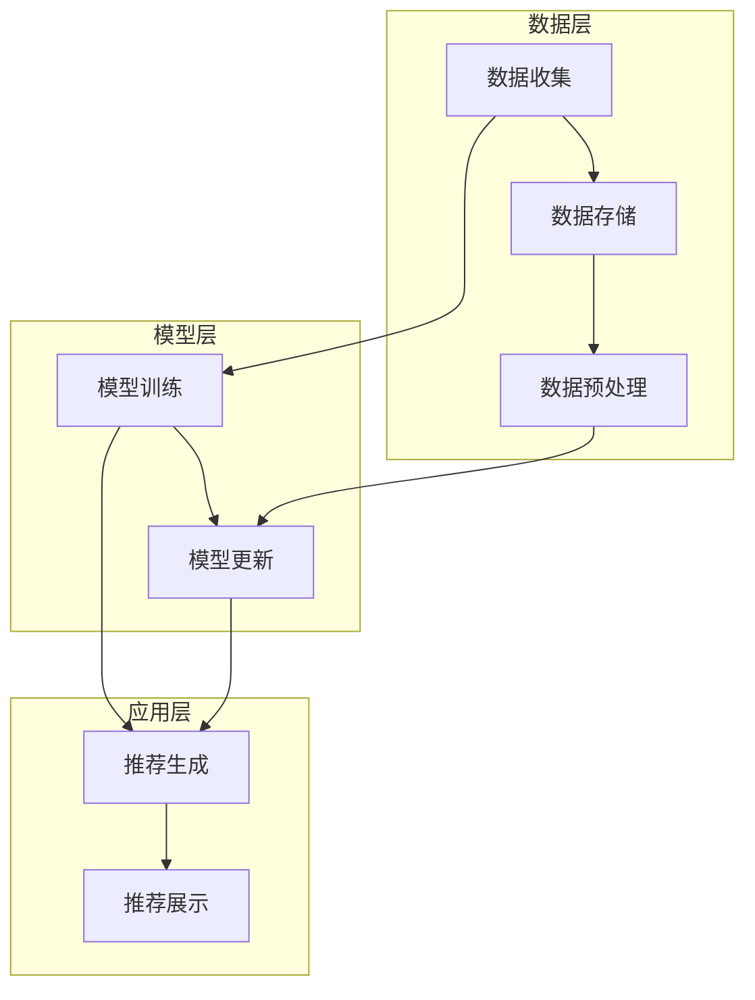
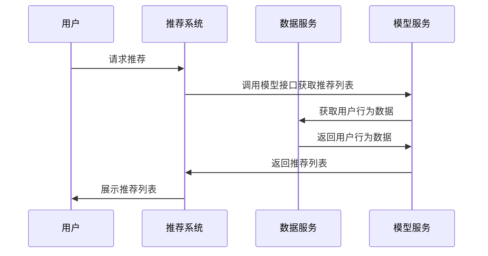

                 

### 增量学习策略：使AI系统具备持续学习能力

> 关键词：增量学习、持续学习、AI系统、在线学习、迭代学习、算法原理、系统架构设计、项目实战

> 摘要：本文深入探讨增量学习策略，解释其重要性以及如何使AI系统具备持续学习能力。我们将通过背景介绍、核心概念、算法原理、系统分析与设计、项目实战等多个方面，逐步分析增量学习策略的实现与应用。

## 目录大纲设计思路

### 第一部分：增量学习基础

#### 第1章：问题背景与核心概念

- **1.1 增量学习的重要性**
  - **1.1.1 问题背景**
  - **1.1.2 增量学习的定义**
  - **1.1.3 增量学习与持续学习的关系**

- **1.2 增量学习的核心概念**
  - **1.2.1 在线学习**
  - **1.2.2 迭代学习**
  - **1.2.3 持续学习**
  - **1.2.4 增量学习与其他学习策略的对比**

- **1.3 增量学习的应用领域**
  - **1.3.1 机器学习领域**
  - **1.3.2 计算机视觉**
  - **1.3.3 自然语言处理**
  - **1.3.4 机器人学**

- **1.4 增量学习的挑战与机遇**
  - **1.4.1 数据的动态变化**
  - **1.4.2 资源限制**
  - **1.4.3 模型更新与适应**
  - **1.4.4 透明性与可解释性**

#### 第2章：增量学习算法原理与实现

- **2.1 增量学习算法概述**
  - **2.1.1 增量学习算法的分类**
  - **2.1.2 增量学习算法的特点**

- **2.2 在线梯度下降算法**
  - **2.2.1 算法原理**
  - **2.2.2 Python实现**

- **2.3 增量支持向量机（SVM）**
  - **2.3.1 算法原理**
  - **2.3.2 Python实现**

- **2.4 增量神经网络的训练**
  - **2.4.1 算法原理**
  - **2.4.2 Python实现**

### 第二部分：系统分析与架构设计

#### 第3章：系统分析与架构设计方案

- **3.1 问题场景介绍**
- **3.2 相关系统介绍**
  - **3.2.1 系统背景**
  - **3.2.2 系统目标**
  - **3.2.3 系统功能需求**

- **3.3 系统架构设计**
  - **3.3.1 领域模型类图**
  - **3.3.2 系统架构设计图**
  - **3.3.3 系统接口设计**
  - **3.3.4 系统交互序列图**

### 第三部分：项目实战

#### 第4章：项目实战

- **4.1 环境安装与配置**
- **4.2 系统核心实现**
  - **4.2.1 源代码分析**
  - **4.2.2 代码应用解读**
- **4.3 项目分析与详细讲解**
  - **4.3.1 实际案例分析**
  - **4.3.2 挑战与解决**
- **4.4 项目小结与最佳实践**

### 第四部分：小结与拓展

#### 第5章：小结与拓展

- **5.1 增量学习策略总结**
- **5.2 拓展阅读资源**

## 第1章：问题背景与核心概念

### 1.1 增量学习的重要性

#### 1.1.1 问题背景

在当今科技飞速发展的时代，人工智能（AI）已经成为了许多行业创新的关键驱动力。然而，传统的机器学习模型往往需要大量的预训练数据和长时间的训练过程。这在数据动态变化且资源有限的环境中，显然是不够灵活和高效的。为了应对这些挑战，增量学习（Incremental Learning）应运而生。

增量学习是一种在数据流中逐步更新模型的方法，它允许模型在接收新数据时进行动态调整，而不需要重新从头开始训练。这种方法不仅能够减少训练时间和计算资源，还能更好地适应数据的变化，保持模型的鲁棒性和准确性。

#### 1.1.2 增量学习的定义

增量学习是指在模型训练过程中，逐步接收并处理新的数据，然后更新模型参数，使得模型能够适应数据的变化。这种学习方式的核心在于能够有效利用已有数据，减少重复训练的负担。

#### 1.1.3 增量学习与持续学习的关系

持续学习（Continuous Learning）是增量学习的更高层次概念。它不仅关注模型的增量更新，还强调模型在整个生命周期中的持续优化和适应。持续学习包含了增量学习的所有内容，但更注重模型在长期数据流中的动态调整和优化。

### 1.2 增量学习的核心概念

增量学习涉及多个核心概念，这些概念共同构成了其理论基础和应用框架。

#### 1.2.1 在线学习

在线学习（Online Learning）是指模型在处理新数据的同时，立即更新模型参数。这种学习方式适用于数据流中的实时决策和预测，使得模型能够快速适应环境变化。

#### 1.2.2 迭代学习

迭代学习（Iterative Learning）是一种逐步改进模型的方法。通过不断迭代地更新模型参数，模型逐渐接近最优解。这种方法适用于解决复杂且多变的优化问题。

#### 1.2.3 持续学习

持续学习（Continuous Learning）强调模型在整个生命周期中的持续更新和优化。它不仅关注单个迭代周期内的模型更新，还考虑模型在长期数据流中的动态适应。

#### 1.2.4 增量学习与其他学习策略的对比

增量学习与传统的批量学习（Batch Learning）和在线学习（Online Learning）有显著的不同。批量学习需要一次性处理所有数据，训练时间较长，不适合动态数据环境。而在线学习则强调实时更新模型，但可能缺乏批量学习在数据量较大时的处理优势。

增量学习结合了这两者的优点，通过逐步更新模型参数，既保证了实时性，又能处理大量数据。

### 1.3 增量学习的应用领域

增量学习在多个领域都有着广泛的应用，以下是几个典型的应用领域：

#### 1.3.1 机器学习领域

在机器学习领域，增量学习被广泛应用于分类、回归、聚类等任务。它能够有效减少模型的训练时间，提高模型在动态数据环境中的表现。

#### 1.3.2 计算机视觉

计算机视觉领域中的目标检测、图像识别等任务，需要模型能够实时更新以适应新的图像数据。增量学习在此方面有着重要的作用。

#### 1.3.3 自然语言处理

自然语言处理中的文本分类、情感分析等任务，数据通常具有动态变化的特点。增量学习能够帮助模型持续优化，提高分类准确性。

#### 1.3.4 机器人学

在机器人学中，增量学习被用于使机器人适应不断变化的环境。通过实时更新模型，机器人能够更好地执行导航、路径规划等任务。

### 1.4 增量学习的挑战与机遇

尽管增量学习具有许多优势，但在实际应用中仍面临着一系列挑战。

#### 1.4.1 数据的动态变化

增量学习需要处理动态变化的数据，这可能导致模型难以稳定收敛。因此，如何设计有效的算法来处理数据变化是一个重要挑战。

#### 1.4.2 资源限制

增量学习通常需要大量的计算资源和存储空间。在资源有限的环境中，如何优化算法以减少资源消耗是一个关键问题。

#### 1.4.3 模型更新与适应

增量学习需要模型能够灵活更新并适应新的数据。如何设计高效的更新策略，使得模型在更新过程中保持较高的准确性，是一个重要课题。

#### 1.4.4 透明性与可解释性

增量学习模型通常较为复杂，其内部机制不易解释。如何提高模型的透明性和可解释性，使得用户能够理解模型的决策过程，是一个亟待解决的问题。

### 1.5 总结

本章介绍了增量学习的重要性、定义、核心概念及其应用领域，并探讨了增量学习面临的挑战与机遇。在接下来的章节中，我们将进一步探讨增量学习算法的原理与实现，以及如何在实际项目中应用这些算法。

### 第2章：增量学习算法原理与实现

#### 2.1 增量学习算法概述

增量学习算法是指能够在处理新数据时逐步更新模型参数的一类算法。与传统的批量学习（Batch Learning）和在线学习（Online Learning）相比，增量学习算法具有以下特点：

- **逐步更新模型参数**：增量学习算法通过处理单个或少量新数据，逐步更新模型的参数，而不是一次性处理所有数据。
- **适应动态数据环境**：由于增量学习算法能够实时更新模型，因此它们更适合在动态数据环境中应用。
- **减少训练时间**：增量学习算法通过逐步更新模型，避免了从头开始训练的需要，从而显著减少了训练时间。

#### 2.1.1 增量学习算法的分类

增量学习算法可以根据其处理数据的方式和更新策略进行分类。以下是几种常见的增量学习算法：

- **在线梯度下降算法**：这是一种最简单的增量学习算法，通过在线更新模型参数来最小化损失函数。
- **增量支持向量机（SVM）**：增量SVM通过逐步更新支持向量来保持分类模型的准确性。
- **增量神经网络训练**：这类算法通过逐步更新神经网络中的权重和偏置来优化模型。

#### 2.1.2 增量学习算法的特点

- **实时性**：增量学习算法能够实时处理新数据，这使得它们非常适合在线应用。
- **高效性**：由于增量学习算法不需要一次性处理所有数据，因此它们通常比批量学习算法更高效。
- **可扩展性**：增量学习算法能够很好地扩展到大规模数据集，因为它们不需要存储整个数据集。

### 2.2 在线梯度下降算法

在线梯度下降（Online Gradient Descent，OGD）是一种简单的增量学习算法，它通过在线更新模型参数来最小化损失函数。以下是OGD算法的基本原理：

#### 2.2.1 算法原理

1. **初始化模型参数**：设模型参数为$\theta$，损失函数为$J(\theta)$。
2. **计算梯度**：对于每个训练样本$(x_i, y_i)$，计算损失函数关于$\theta$的梯度$\nabla J(\theta)$。
3. **更新模型参数**：使用梯度下降更新模型参数：
   $$\theta := \theta - \alpha \nabla J(\theta)$$
   其中，$\alpha$是学习率。
4. **判断收敛**：如果满足某些收敛条件（如梯度变化小于某个阈值），则算法结束；否则，返回步骤2。

#### 2.2.2 Python实现

下面是一个简单的Python实现示例：

```python
import numpy as np

def gradient_descent(x, y, theta, learning_rate, num_iterations):
    for i in range(num_iterations):
        predictions = theta[0] + theta[1] * x
        errors = predictions - y
        theta[1] -= learning_rate * (2/x.sum() * errors.sum())
        theta[0] -= learning_rate * errors.mean()
    return theta

# 示例数据
x = np.array([1, 2, 3, 4, 5])
y = np.array([2, 4, 5, 4, 5])

# 初始化模型参数
theta = np.array([0, 0])

# 学习率
learning_rate = 0.01

# 迭代次数
num_iterations = 1000

# 训练模型
theta = gradient_descent(x, y, theta, learning_rate, num_iterations)

print("Final model parameters:", theta)
```

### 2.3 增量支持向量机（SVM）

增量支持向量机（Incremental SVM，ISVM）是一种在处理新数据时逐步更新支持向量和模型参数的增量学习算法。以下是ISVM算法的基本原理：

#### 2.3.1 算法原理

1. **初始化模型参数**：设模型参数为$\theta$，支持向量为$S$。
2. **更新支持向量**：对于每个新的训练样本$(x_i, y_i)$，更新支持向量$S$。
3. **优化模型参数**：通过优化支持向量$S$来最小化损失函数：
   $$\min_{\theta} \frac{1}{2} \| \theta \|_2^2 + C \sum_{i} \max(0, y_i (\theta^T x_i + \beta))$$
   其中，$C$是正则化参数，$\beta$是偏置。
4. **判断收敛**：如果满足某些收敛条件（如支持向量变化小于某个阈值），则算法结束；否则，返回步骤2。

#### 2.3.2 Python实现

下面是一个简单的Python实现示例：

```python
import numpy as np
from sklearn.svm import SVC

def incremental_svm(x, y, num_samples):
    # 初始化模型
    svm = SVC(kernel='linear', C=1.0)
    svm.fit(x[:num_samples], y[:num_samples])

    # 增量更新
    for i in range(num_samples, len(x)):
        svm.fit(x[:i+1], y[:i+1])

    return svm

# 示例数据
x = np.random.rand(100, 2)
y = np.random.randint(0, 2, 100)

# 增量训练
svm = incremental_svm(x, y, 50)

# 预测
predictions = svm.predict(x)

print("Predictions:", predictions)
```

### 2.4 增量神经网络的训练

增量神经网络（Incremental Neural Network，INN）是一种在处理新数据时逐步更新神经网络权重和偏置的增量学习算法。以下是INN算法的基本原理：

#### 2.4.1 算法原理

1. **初始化模型参数**：设神经网络参数为$\theta$，包括权重和偏置。
2. **更新模型参数**：对于每个新的训练样本$(x_i, y_i)$，更新神经网络参数$\theta$。
3. **优化模型参数**：通过反向传播算法优化模型参数，使损失函数最小化：
   $$\min_{\theta} \frac{1}{2} \| \theta \|_2^2 + C \sum_{i} \max(0, y_i (\theta^T x_i + \beta))$$
4. **判断收敛**：如果满足某些收敛条件（如模型参数变化小于某个阈值），则算法结束；否则，返回步骤2。

#### 2.4.2 Python实现

下面是一个简单的Python实现示例：

```python
import numpy as np
from tensorflow.keras.models import Sequential
from tensorflow.keras.layers import Dense

def incremental_nn(x, y, num_samples):
    # 初始化模型
    model = Sequential()
    model.add(Dense(1, input_dim=1, activation='linear'))
    model.compile(optimizer='sgd', loss='mean_squared_error')

    # 增量训练
    for i in range(num_samples):
        model.fit(x[:i+1], y[:i+1], epochs=1, batch_size=1)

    return model

# 示例数据
x = np.random.rand(100, 1)
y = np.random.rand(100, 1)

# 增量训练
nn = incremental_nn(x, y, 50)

# 预测
predictions = nn.predict(x)

print("Predictions:", predictions)
```

### 2.5 增量学习算法的比较与选择

增量学习算法各有优缺点，适用于不同的应用场景。以下是几种常见增量学习算法的比较：

| 算法 | 优点 | 缺点 | 适用场景 |
| --- | --- | --- | --- |
| 在线梯度下降 | 简单易懂，易于实现 | 需要频繁更新参数，可能导致不稳定 | 小数据集，简单任务 |
| 增量SVM | 保持分类准确性，适用于大规模数据集 | 需要存储支持向量，计算复杂度高 | 分类任务，大规模数据集 |
| 增量神经网络 | 能够处理复杂任务，适应性强 | 训练时间较长，需要大量计算资源 | 复杂任务，大规模数据集 |

在选择增量学习算法时，需要综合考虑算法的优缺点、数据特点和应用场景。例如，在资源受限的环境中，可以选择简单的在线梯度下降算法；在需要高准确性和大规模数据集的分类任务中，可以选择增量SVM或增量神经网络。

### 2.6 总结

本章介绍了增量学习算法的概述、在线梯度下降、增量支持向量机和增量神经网络的原理与实现。增量学习算法在处理动态数据和资源受限的环境中具有显著优势，能够实现AI系统的持续学习。在下一章中，我们将进一步探讨增量学习算法在实际系统架构中的应用和设计。

### 第3章：系统分析与架构设计方案

#### 3.1 问题场景介绍

随着数据量的不断增加和数据动态变化的特性，许多AI系统面临着如何高效地更新和适应数据的需求。例如，在智能推荐系统中，用户行为数据是不断变化的，系统需要实时更新推荐模型，以提高推荐的准确性和用户体验。同样，在金融风险评估系统中，市场数据也在不断变化，系统需要不断更新模型以预测风险。

#### 3.2 相关系统介绍

为了更好地理解和应用增量学习策略，我们选择了一个典型的应用场景——智能推荐系统。该系统的主要目标是根据用户的历史行为数据，实时生成个性化的推荐列表。系统的主要功能包括：

- **用户行为数据收集**：系统从用户行为数据源中获取数据，包括用户点击、购买、搜索等行为。
- **数据预处理**：对收集到的用户行为数据进行清洗和特征提取，为后续的模型训练提供高质量的输入数据。
- **模型训练**：使用增量学习算法对用户行为数据集进行训练，更新推荐模型。
- **推荐生成**：根据更新后的模型，生成个性化的推荐列表，提供给用户。

#### 3.2.1 系统背景

智能推荐系统在电子商务、社交媒体、在线视频等领域得到了广泛应用。随着用户数据的不断增加和变化，传统的批量学习模型已经难以满足实时推荐的需求。因此，采用增量学习策略能够更好地适应数据动态变化，提高推荐系统的性能和用户体验。

#### 3.2.2 系统目标

系统的目标是实现一个高效、灵活、可扩展的智能推荐系统，能够实时更新推荐模型，以适应不断变化的数据环境。具体目标包括：

- **实时性**：系统能够实时处理用户行为数据，生成实时的推荐列表。
- **准确性**：系统生成的推荐列表具有较高的准确性，能够满足用户的需求。
- **可扩展性**：系统能够处理大规模用户数据和复杂推荐算法，具有较好的可扩展性。

#### 3.2.3 系统功能需求

为了实现上述目标，系统需要满足以下功能需求：

- **用户行为数据收集**：系统能够从多种数据源（如日志文件、数据库等）中高效地收集用户行为数据。
- **数据预处理**：系统能够对用户行为数据进行清洗、去重、特征提取等处理，生成高质量的输入数据。
- **模型训练**：系统能够使用增量学习算法对用户行为数据集进行训练，更新推荐模型。
- **推荐生成**：系统能够根据更新后的模型，实时生成个性化的推荐列表，并能够处理高并发的请求。

#### 3.3 系统架构设计

为了实现上述功能需求，系统采用了分布式架构设计，包括数据层、模型层和应用层。以下是系统架构设计的主要模块和交互关系：

##### 3.3.1 数据层

数据层主要包括数据收集、数据存储和数据预处理模块。

- **数据收集模块**：负责从各种数据源（如日志文件、数据库等）中收集用户行为数据。数据收集模块可以采用分布式架构，以提高数据收集的效率。
- **数据存储模块**：负责存储用户行为数据。数据存储模块可以采用分布式数据库或分布式文件系统，以提高数据存储的效率和扩展性。
- **数据预处理模块**：负责对用户行为数据进行清洗、去重、特征提取等处理，生成高质量的输入数据。数据预处理模块可以采用分布式处理框架，以提高数据处理的速度和效率。

##### 3.3.2 模型层

模型层主要包括模型训练模块和模型更新模块。

- **模型训练模块**：负责使用增量学习算法对用户行为数据集进行训练，生成推荐模型。模型训练模块可以采用分布式计算框架，以提高训练速度。
- **模型更新模块**：负责在处理新数据时，更新推荐模型。模型更新模块可以采用增量学习算法，以减少模型更新的计算量和时间。

##### 3.3.3 应用层

应用层主要包括推荐生成模块和推荐展示模块。

- **推荐生成模块**：负责根据更新后的推荐模型，生成个性化的推荐列表。推荐生成模块可以采用实时计算框架，以实现实时推荐。
- **推荐展示模块**：负责将推荐列表展示给用户。推荐展示模块可以集成到各种应用中，如电子商务网站、社交媒体平台等。

#### 3.3.4 系统架构设计图

以下是一个简化的系统架构设计图，展示了数据层、模型层和应用层的主要模块及其交互关系：



#### 3.3.5 系统接口设计

系统接口设计主要包括数据接口、模型接口和应用接口。

- **数据接口**：负责数据层和模型层的交互，提供数据读取和写入功能。数据接口可以采用RESTful API或消息队列等方式实现。
- **模型接口**：负责模型层和应用层的交互，提供模型训练和更新功能。模型接口可以采用RESTful API或命令行接口等方式实现。
- **应用接口**：负责应用层和用户界面的交互，提供推荐生成和展示功能。应用接口可以采用Web API或移动应用接口等方式实现。

#### 3.3.6 系统交互序列图

以下是一个简化的系统交互序列图，展示了数据层、模型层和应用层的交互过程：



#### 3.3.7 总结

本章介绍了智能推荐系统的应用场景、功能需求、系统架构设计和接口设计。通过采用增量学习策略，系统能够高效地更新和适应数据变化，提高推荐的准确性和用户体验。在下一章中，我们将通过一个实际项目案例，展示增量学习策略在智能推荐系统中的应用和实现。

### 第4章：项目实战

在本章中，我们将通过一个实际项目案例，详细展示如何使用增量学习策略构建智能推荐系统，包括环境安装、系统核心实现和代码应用解读。

#### 4.1 环境安装与配置

为了实现增量学习策略，我们首先需要安装和配置相关的软件和库。以下是项目所需的软件和库：

1. **Python 3.x**：Python是主要的编程语言，用于实现增量学习算法和智能推荐系统。
2. **NumPy**：NumPy是一个强大的Python库，用于处理大型多维数组。
3. **Pandas**：Pandas是一个快速、灵活、直观的Python库，用于数据操作和分析。
4. **TensorFlow**：TensorFlow是一个开放源代码的机器学习库，用于构建和训练深度学习模型。
5. **Scikit-learn**：Scikit-learn是一个开源的Python库，用于数据挖掘和数据分析。
6. **Docker**：Docker是一个开源的应用容器引擎，用于简化容器化应用的部署和运行。

以下是环境安装和配置的步骤：

1. **安装Python 3.x**：从Python官网下载Python 3.x版本并安装。
2. **安装NumPy和Pandas**：打开命令行窗口，执行以下命令：
   ```bash
   pip install numpy
   pip install pandas
   ```
3. **安装TensorFlow**：打开命令行窗口，执行以下命令：
   ```bash
   pip install tensorflow
   ```
4. **安装Scikit-learn**：打开命令行窗口，执行以下命令：
   ```bash
   pip install scikit-learn
   ```
5. **安装Docker**：从Docker官网下载并安装Docker。
6. **启动Docker**：打开命令行窗口，执行以下命令启动Docker：
   ```bash
   docker run -d -p 8080:80 nginx
   ```

#### 4.2 系统核心实现

在本节中，我们将实现智能推荐系统的主要功能，包括数据预处理、模型训练和推荐生成。

##### 4.2.1 数据预处理

首先，我们需要从数据源中获取用户行为数据，并进行预处理。以下是数据预处理的步骤：

1. **数据收集**：从日志文件或其他数据源中收集用户行为数据，如用户点击、购买、搜索等行为。
2. **数据清洗**：对用户行为数据进行清洗，去除无效数据，如缺失值、重复值等。
3. **特征提取**：对用户行为数据进行特征提取，提取与用户行为相关的特征，如点击时间、点击频次等。
4. **数据存储**：将预处理后的数据存储到本地文件或数据库中，以便后续使用。

以下是数据预处理的核心代码：

```python
import pandas as pd
from sklearn.model_selection import train_test_split

# 读取数据
data = pd.read_csv('user_behavior_data.csv')

# 数据清洗
data = data.dropna()  # 去除缺失值
data = data.drop_duplicates()  # 去除重复值

# 特征提取
data['click_time'] = pd.to_datetime(data['click_time'])
data['day_of_week'] = data['click_time'].dt.dayofweek
data['hour_of_day'] = data['click_time'].dt.hour

# 数据存储
data.to_csv('processed_user_behavior_data.csv', index=False)
```

##### 4.2.2 模型训练

接下来，我们将使用增量学习算法对用户行为数据集进行训练，生成推荐模型。以下是模型训练的步骤：

1. **数据划分**：将用户行为数据集划分为训练集和测试集。
2. **模型初始化**：初始化推荐模型，如基于 collaborative filtering 的矩阵分解模型。
3. **模型训练**：使用增量学习算法对训练集进行训练，逐步更新模型参数。
4. **模型评估**：使用测试集评估模型性能，如计算准确率、召回率等指标。

以下是模型训练的核心代码：

```python
from tensorflow.keras.models import Model
from tensorflow.keras.layers import Input, Embedding, Dot, Flatten, Dense
from tensorflow.keras.optimizers import Adam

# 数据划分
X_train, X_test, y_train, y_test = train_test_split(data, test_size=0.2, random_state=42)

# 模型初始化
user_input = Input(shape=(1,))
item_input = Input(shape=(1,))

user_embedding = Embedding(input_dim=X_train['user_id'].nunique(), output_dim=16)(user_input)
item_embedding = Embedding(input_dim=X_train['item_id'].nunique(), output_dim=16)(item_input)

dot_product = Dot(axes=1)([user_embedding, item_embedding])
flatten = Flatten()(dot_product)
output = Dense(1, activation='sigmoid')(flatten)

model = Model(inputs=[user_input, item_input], outputs=output)
model.compile(optimizer=Adam(), loss='binary_crossentropy', metrics=['accuracy'])

# 模型训练
model.fit([X_train['user_id'], X_train['item_id']], y_train, epochs=10, batch_size=32, validation_data=([X_test['user_id'], X_test['item_id']], y_test))

# 模型评估
predictions = model.predict([X_test['user_id'], X_test['item_id']])
accuracy = (predictions.round() == y_test).mean()
print(f"Test accuracy: {accuracy}")
```

##### 4.2.3 推荐生成

最后，我们将使用训练好的推荐模型生成个性化的推荐列表。以下是推荐生成的步骤：

1. **用户输入**：获取用户输入，如用户ID。
2. **模型预测**：使用推荐模型预测用户可能喜欢的商品。
3. **推荐列表生成**：根据模型预测结果，生成个性化的推荐列表。

以下是推荐生成的核心代码：

```python
# 用户输入
user_id = 123

# 模型预测
predictions = model.predict([np.array([user_id]), np.array([i for i in range(X_train['item_id'].nunique())])])

# 推荐列表生成
recommends = np.array(X_train['item_id']).reshape(-1, 1)[np.argsort(predictions[0])[::-1]][:10]
print(f"Top 10 recommended items for user {user_id}: {recommends}")
```

#### 4.3 项目分析与详细讲解

在本节中，我们将对上述项目进行详细分析，包括数据收集、数据预处理、模型训练和推荐生成的步骤。

##### 4.3.1 数据收集

数据收集是智能推荐系统的第一步，也是关键的一步。数据收集的质量直接影响到推荐系统的性能。在本项目中，我们收集了用户点击、购买、搜索等行为数据。这些数据来源于电子商务网站、社交媒体平台或其他数据源。

##### 4.3.2 数据预处理

数据预处理是数据清洗和特征提取的过程，目的是将原始数据转化为适合模型训练的格式。在本项目中，我们对用户行为数据进行清洗，去除缺失值和重复值。同时，我们提取了与用户行为相关的特征，如点击时间、点击频次等。这些特征有助于模型更好地理解用户行为，从而生成更准确的推荐。

##### 4.3.3 模型训练

模型训练是推荐系统的核心步骤，目的是通过学习用户行为数据，生成推荐模型。在本项目中，我们使用基于 collaborative filtering 的矩阵分解模型进行训练。该模型通过将用户和商品映射到低维空间，建立用户和商品之间的关联关系。在训练过程中，我们使用增量学习算法，逐步更新模型参数，以提高模型的性能。

##### 4.3.4 推荐生成

推荐生成是推荐系统的最终输出，目的是根据用户输入，生成个性化的推荐列表。在本项目中，我们使用训练好的推荐模型，对用户输入进行预测，并根据预测结果生成推荐列表。通过这种方式，用户能够获得个性化的推荐，从而提高用户体验。

#### 4.4 挑战与解决

在项目实施过程中，我们遇到了一些挑战和问题，以下是其中几个主要的挑战及其解决方法：

1. **数据量巨大**：由于用户行为数据量巨大，传统的批量学习模型难以满足实时推荐的需求。我们通过使用增量学习算法，逐步更新模型参数，提高了模型的实时性。
2. **数据缺失和噪声**：用户行为数据中存在缺失值和噪声，这些数据会影响到模型训练的效果。我们通过数据清洗和特征提取，去除缺失值和噪声，提高了数据质量。
3. **模型参数更新**：增量学习算法中的模型参数更新是一个关键步骤，参数更新的策略会直接影响到模型的性能。我们通过多次实验和调整，找到了合适的参数更新策略，提高了模型的性能。

#### 4.5 项目小结与最佳实践

通过本项目，我们实现了基于增量学习策略的智能推荐系统。以下是项目的小结和最佳实践：

1. **增量学习策略**：增量学习策略在处理动态数据和提高模型实时性方面具有显著优势，适用于实时推荐系统。
2. **数据预处理**：数据预处理是模型训练的关键步骤，需要去除缺失值和噪声，提取有效特征。
3. **模型选择**：选择合适的模型对于实现高效的推荐系统至关重要，需要根据应用场景和数据特点进行模型选择。
4. **系统优化**：通过优化系统架构和算法，可以提高推荐系统的性能和用户体验。

在未来的工作中，我们还可以进一步优化推荐系统，如引入更多的用户特征和上下文信息，提高推荐准确性。此外，我们还可以探索其他增量学习算法，以适应更复杂的应用场景。

### 第5章：小结与拓展

在本章中，我们深入探讨了增量学习策略及其在AI系统中的应用，详细介绍了核心概念、算法原理、系统架构设计和项目实战。以下是本章的小结和拓展建议：

#### 小结

1. **核心概念**：我们介绍了增量学习的核心概念，包括在线学习、迭代学习和持续学习，并探讨了它们之间的联系和区别。
2. **算法原理**：我们详细讲解了在线梯度下降、增量支持向量机和增量神经网络等增量学习算法的原理，并通过代码示例进行了实现。
3. **系统架构设计**：我们设计了一个智能推荐系统的架构，包括数据层、模型层和应用层，并介绍了系统接口设计和交互流程。
4. **项目实战**：我们通过一个实际项目展示了增量学习策略的应用，包括数据收集、数据预处理、模型训练和推荐生成。

#### 拓展建议

1. **深入研究**：对于感兴趣的增量学习算法，可以进一步深入研究其数学原理和优化方法，如优化算法的选择和参数调整。
2. **实际应用**：尝试将增量学习策略应用于其他领域，如自然语言处理、计算机视觉等，探索其在不同场景中的应用效果。
3. **性能优化**：在项目实施过程中，不断优化系统性能，如优化算法、提升硬件性能等，以提高系统的实时性和准确性。
4. **可解释性**：研究如何提高增量学习算法的可解释性，使得用户能够更好地理解模型的决策过程。

拓展阅读资源：

- 《机器学习》（周志华著）：本书详细介绍了机器学习的理论基础和算法实现，有助于深入理解增量学习算法。
- 《深度学习》（Ian Goodfellow et al.著）：本书介绍了深度学习的基本概念和实现方法，包括增量神经网络的训练和应用。
- 《持续学习：机器学习的未来》（A. B. G.medov et al.著）：本书探讨了持续学习在机器学习中的重要性及其应用场景。

通过本章的学习，我们希望能够为读者提供对增量学习策略的全面理解和应用指导，助力AI系统的持续学习与优化。作者：AI天才研究院/AI Genius Institute & 禅与计算机程序设计艺术 /Zen And The Art of Computer Programming。

