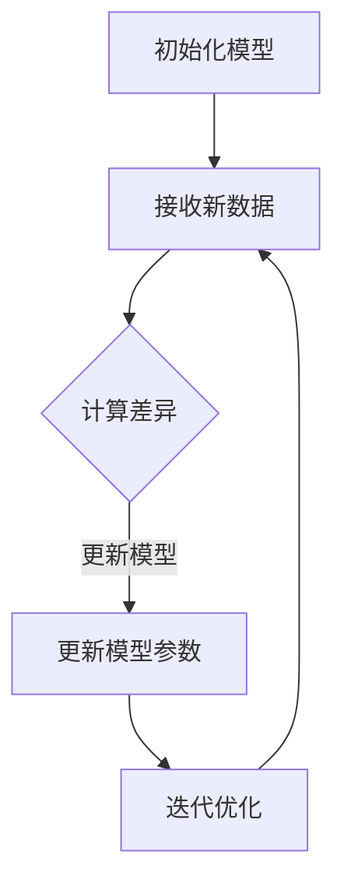
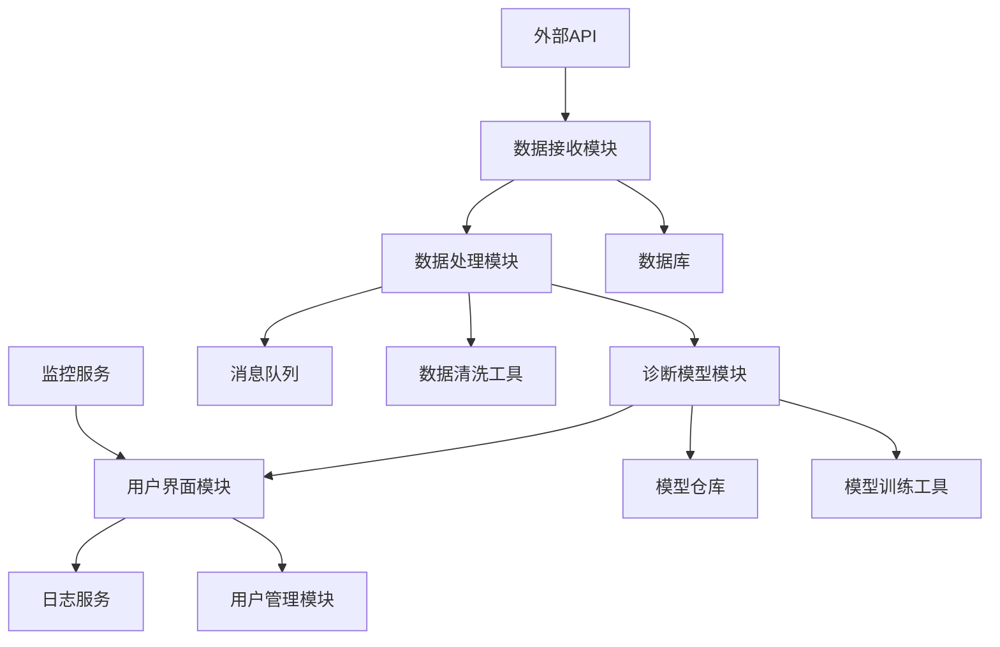
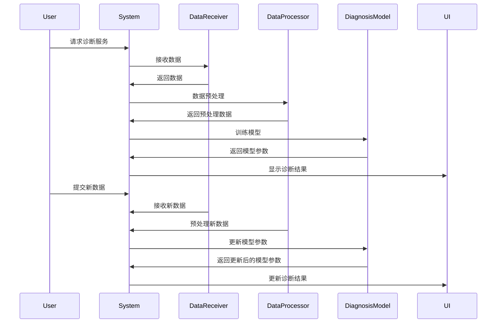

                 

### 引言

在当今快速发展的信息技术时代，人工智能（AI）系统已经成为各行各业的重要驱动力。这些系统通过深度学习、机器学习和数据挖掘等技术，从大量数据中学习并自动执行复杂的任务。然而，随着AI系统的广泛应用和复杂性的增加，它们面临的一个关键挑战是如何在已有知识的基础上不断进化，以适应不断变化的环境和数据。

这种挑战催生了增量学习策略的诞生。增量学习是一种机器学习方法，它允许AI系统在接收新数据时逐步调整和优化其模型，而不是从头开始训练。这种方法不仅提高了学习效率，还使得AI系统能够更好地适应动态环境，从而保持其性能和准确性。

本文将深入探讨增量学习策略，旨在为读者提供一个全面而系统的理解。我们将首先介绍增量学习的背景和基本概念，然后逐步分析其原理和算法，探讨在AI系统中的应用场景，并总结核心概念和策略。此外，我们还将通过具体案例和项目实践，详细讲解增量学习的实施方法和评估方法。

通过这篇文章，读者将能够了解增量学习策略的精髓，掌握其在AI系统中的应用技巧，并为未来的研究和实践提供有益的参考。接下来，我们将分章节详细探讨这个主题。

---

### 核心关键词

1. **增量学习（Incremental Learning）**：一种机器学习方法，允许模型在接收到新数据时进行逐步调整和优化。
2. **AI系统（AI Systems）**：指应用人工智能技术的计算机系统，用于执行复杂的任务和决策。
3. **持续进化（Continuous Evolution）**：AI系统能够在动态环境中不断学习和改进的过程。
4. **算法原理（Algorithm Principles）**：增量学习策略背后的数学模型和计算方法。
5. **系统设计与实现（System Design and Implementation）**：增量学习系统从设计到实际部署的全过程。
6. **策略优化（Strategy Optimization）**：调整和优化增量学习策略以提高其性能。
7. **实际案例（Case Studies）**：增量学习在具体项目中的应用实例。

---

### 摘要

本文旨在深入探讨增量学习策略，这是一种应对AI系统持续进化的有效方法。首先，我们将介绍增量学习的背景和基本概念，阐述其在AI系统中的重要性。接着，通过分析增量学习的基本原理和算法，我们将揭示其工作机制和数学模型。随后，我们将探讨增量学习在不同领域的应用场景，并总结其核心概念和策略。通过具体案例和项目实践，我们将详细讲解增量学习的实施方法和评估方法，并提供实用的最佳实践建议。最终，本文将总结增量学习策略的关键要点，并展望其未来的发展方向。

---

### 《增量学习策略：应对AI系统的持续进化》目录大纲

**第一部分：背景介绍**

**第1章 问题背景**

- **1.1 问题背景**
  - **1.1.1 问题定义**
  - **1.1.2 问题表述**
  - **1.1.3 解决方案简介**
  - **1.1.4 边界与外延**
  - **1.1.5 核心概念与联系**

- **1.2 核心概念原理**
  - **1.2.1 增量学习原理**
  - **1.2.2 算法原理讲解**
  - **1.2.3 数学模型和数学公式**
  - **1.2.4 详细讲解和举例说明**

**第2章 系统分析与架构设计方案**

- **2.1 问题场景介绍**
- **2.2 项目介绍**
- **2.3 系统功能设计**
  - **2.3.1 领域模型mermaid类图**
  - **2.3.2 系统架构设计mermaid架构图**
  - **2.3.3 系统接口设计和系统交互mermaid序列图**
- **2.4 系统分析与架构设计总结**

**第3章 项目实战**

- **3.1 环境安装**
- **3.2 系统核心实现源代码**
- **3.3 代码应用解读与分析**
- **3.4 实际案例分析和详细讲解剖析**
- **3.5 项目小结**

**第二部分：核心概念与策略**

**第4章 核心概念**

- **4.1 增量学习的核心概念**
  - **4.1.1 增量学习策略**
  - **4.1.2 增量学习的挑战与解决方案**
  - **4.1.3 增量学习的应用场景**
- **4.2 增量学习策略的分类**
  - **4.2.1 增量学习策略1**
  - **4.2.2 增量学习策略2**
  - **4.2.3 增量学习策略3**
- **4.3 增量学习策略的选择与优化**
  - **4.3.1 策略选择原则**
  - **4.3.2 策略优化方法**
- **4.4 增量学习策略在AI系统中的应用**
  - **4.4.1 AI系统1**
  - **4.4.2 AI系统2**
  - **4.4.3 AI系统3**

**第5章 策略实施与评估**

- **5.1 策略实施流程**
  - **5.1.1 策略实施步骤**
  - **5.1.2 策略实施关键点**
- **5.2 策略评估方法**
  - **5.2.1 评估指标**
  - **5.2.2 评估流程**
- **5.3 策略评估案例分析**
  - **5.3.1 案例一**
  - **5.3.2 案例二**

---

### 第一部分：背景介绍

#### 第1章 问题背景

#### 1.1 问题背景

随着人工智能（AI）技术的迅猛发展，AI系统在各种领域得到了广泛应用，从自动驾驶到智能语音助手，再到医疗诊断和金融分析，AI技术正在深刻改变我们的生活方式。然而，AI系统的性能和准确性不仅取决于其初始训练数据的质量和数量，还取决于其在应用过程中能否持续学习和适应新环境。

首先，让我们明确一下增量学习的基本概念。增量学习，又称在线学习或逐步学习，是一种机器学习方法，它允许模型在接收到新数据时进行逐步调整和优化，而不是从头开始训练。这种方法的优点在于能够节省计算资源和时间，特别是在数据量巨大或数据流持续变化的情况下。

##### 1.1.1 问题定义

增量学习的核心问题是：如何在已有模型的基础上，高效地适应新数据，同时保持模型性能的稳定性和准确性。具体来说，这个问题的定义可以表述为：

- **问题描述**：给定一个初始训练好的机器学习模型，以及后续接收到的数据流，设计一种算法，使得模型能够在线（incrementally）适应新数据，并在数据量逐渐增加的过程中保持良好的性能和准确性。

- **问题解决**：通过增量学习算法，我们可以实现模型的逐步调整，使其在接收到新数据时能够快速适应，避免重新训练带来的计算开销和时间延迟。

##### 1.1.2 问题表述

增量学习在AI系统中的应用主要体现在以下几个方面：

1. **实时预测与更新**：在实时数据流中，增量学习能够快速对新数据进行预测，并调整模型参数，从而实现实时更新。
2. **持续学习**：随着数据量的不断增加，增量学习使得AI系统能够持续学习，不断优化其性能。
3. **动态环境适应**：在动态变化的环境中，增量学习能够使AI系统快速适应新环境和条件，保持其稳定性和可靠性。

##### 1.1.3 解决方案简介

增量学习解决方案的核心是设计高效的算法，以实现模型的逐步调整和优化。这些算法通常包括以下几个关键组件：

1. **增量学习算法**：如在线梯度下降、增量支持向量机（SVM）和在线神经网络等。
2. **适应机制**：通过动态调整学习率、正则化参数等方法，使得模型能够适应不同阶段的数据特征。
3. **数据预处理**：对输入数据进行处理，如数据清洗、标准化和特征提取，以提高增量学习的效率。

##### 1.1.4 边界与外延

虽然增量学习具有许多优点，但它在实际应用中也存在一些限制和挑战：

- **边界条件**：增量学习适用于数据量较大且变化较慢的场景，对于数据量小或变化剧烈的场景，增量学习可能不太适用。
- **计算资源**：增量学习虽然比全量学习节省资源，但仍然需要一定的计算资源，特别是在处理高维数据时。
- **模型性能**：在某些情况下，增量学习可能导致模型性能下降，特别是在数据分布发生显著变化时。

##### 1.1.5 核心概念与联系

增量学习与其他机器学习方法的区别主要体现在以下几个方面：

1. **学习方式**：增量学习是在已有模型的基础上进行更新，而传统机器学习则是在固定数据集上进行训练。
2. **适用场景**：增量学习适用于数据流和动态环境，而传统机器学习则适用于静态数据和批量处理。
3. **算法复杂度**：增量学习算法通常具有较低的复杂度，特别是在处理大量数据时。

通过以上对问题背景的介绍，我们可以看到增量学习在AI系统中的应用前景和重要性。接下来，我们将进一步探讨增量学习的基本原理和算法，为深入理解增量学习策略奠定基础。

#### 1.2 核心概念原理

##### 1.2.1 增量学习原理

增量学习的基本原理是在已有模型的基础上，通过接收和更新新数据来逐步优化模型参数。这个过程可以分解为以下几个步骤：

1. **初始化模型**：首先，我们需要一个已经训练好的模型，该模型基于历史数据生成初始的参数。
2. **接收新数据**：随着新数据的不断流入，增量学习算法会定期或动态地更新模型参数。
3. **模型更新**：通过计算新数据和现有模型的输出差异，更新模型的参数，使得模型能够更好地适应新数据。
4. **迭代优化**：重复上述过程，直到模型在新数据上的性能达到预期。

这种逐步更新的过程不仅节省了计算资源，还使得模型能够快速适应新环境，保持其性能和准确性。

##### 1.2.1.1 概念属性特征对比

为了更清晰地理解增量学习与传统机器学习的区别，我们可以从以下几个方面对比两者的概念属性特征：

1. **学习方式**：
   - **增量学习**：在已有模型的基础上逐步更新，适用于数据流和动态环境。
   - **传统机器学习**：在固定数据集上进行一次性训练，适用于静态数据和批量处理。

2. **计算资源**：
   - **增量学习**：相对节省计算资源，特别是处理大量数据时。
   - **传统机器学习**：需要较大的计算资源，特别是在训练高维数据时。

3. **适应能力**：
   - **增量学习**：能够快速适应新数据和动态环境。
   - **传统机器学习**：对数据和环境的变化响应较慢。

4. **模型复杂度**：
   - **增量学习**：算法复杂度较低，适用于实时预测和更新。
   - **传统机器学习**：算法复杂度较高，但能够在静态数据集上获得较高的性能。

通过以上对比，我们可以看到增量学习在应对动态环境和实时预测方面的优势，这使得它在许多应用场景中具有独特的价值。

##### 1.2.1.2 ER实体关系图架构

为了更好地理解增量学习的体系结构，我们可以使用ER（实体-关系）图来描述其主要实体和关系。以下是增量学习ER图的基本架构：

1. **实体**：
   - **数据实体**：包含输入数据和输出数据。
   - **模型实体**：表示训练好的模型和更新的模型参数。
   - **算法实体**：实现增量学习算法的核心模块。

2. **关系**：
   - **数据流关系**：数据实体与模型实体之间的输入输出关系。
   - **更新关系**：模型实体通过算法实体进行参数更新的过程。

通过ER图，我们可以清晰地看到增量学习的基本组成和运行机制。

##### 1.2.2 算法原理讲解

增量学习的核心在于其算法设计，以下我们将详细讲解增量学习算法的基本原理。

1. **在线梯度下降**：
   - **原理**：在线梯度下降是一种常用的增量学习算法，通过计算模型输出与新数据的差异，更新模型参数。
   - **公式**：
     $$
     \theta_{t+1} = \theta_{t} - \alpha \cdot \nabla J(\theta_{t}, x_{t}, y_{t})
     $$
     其中，$\theta_{t}$ 表示第 $t$ 次迭代的模型参数，$x_{t}$ 和 $y_{t}$ 分别表示第 $t$ 次迭代的数据输入和输出，$\alpha$ 为学习率，$\nabla J(\theta_{t}, x_{t}, y_{t})$ 为损失函数关于模型参数的梯度。

2. **增量支持向量机（SVM）**：
   - **原理**：增量支持向量机通过逐步更新支持向量，实现对数据的分类和预测。
   - **公式**：
     $$
     w_{t+1} = w_{t} + \alpha \cdot (y_{t} - \text{sign}(w_{t} \cdot x_{t}))
     $$
     其中，$w_{t}$ 表示第 $t$ 次迭代的支持向量，$\alpha$ 为更新系数，$y_{t}$ 和 $x_{t}$ 分别为第 $t$ 次迭代的数据标签和特征向量。

3. **在线神经网络**：
   - **原理**：在线神经网络通过逐层更新神经网络参数，实现模型的增量训练。
   - **公式**：
     $$
     \theta_{l}^{(i)} = \theta_{l}^{(i)} - \alpha \cdot \frac{\partial J}{\partial \theta_{l}^{(i)}}
     $$
     其中，$\theta_{l}^{(i)}$ 表示第 $l$ 层第 $i$ 个神经元的参数，$\alpha$ 为学习率，$J$ 为损失函数。

以上三种算法分别代表了增量学习在分类、回归和神经网络等不同领域的应用。通过这些算法，我们可以看到增量学习在优化模型参数和适应新数据方面的强大能力。

##### 1.2.2.1 增量学习算法mermaid流程图

为了更直观地展示增量学习算法的流程，我们可以使用mermaid语言绘制其流程图。以下是增量学习算法的mermaid流程图：



在该流程图中，模型首先初始化，然后接收新数据，通过计算差异更新模型参数，并迭代优化，最终实现模型的增量学习。

##### 1.2.2.2 算法原理的数学模型和公式

在增量学习过程中，数学模型和公式起着至关重要的作用。以下是一些常见的数学模型和公式：

1. **损失函数**：
   $$
   J(\theta) = \frac{1}{2m} \sum_{i=1}^{m} (\theta \cdot x_i - y_i)^2
   $$
   其中，$J(\theta)$ 表示损失函数，$\theta$ 表示模型参数，$x_i$ 和 $y_i$ 分别表示输入特征和标签。

2. **梯度**：
   $$
   \nabla J(\theta) = \frac{\partial J(\theta)}{\partial \theta}
   $$
   其中，$\nabla J(\theta)$ 表示损失函数关于模型参数的梯度。

3. **学习率**：
   $$
   \alpha = \frac{1}{\sqrt{t}}
   $$
   其中，$\alpha$ 表示学习率，$t$ 表示迭代次数。

通过这些数学模型和公式，我们可以更深入地理解增量学习算法的工作原理和优化过程。

##### 1.2.2.3 详细讲解和举例说明

为了更好地理解增量学习算法的原理，我们可以通过一个简单的例子来说明。假设我们使用在线梯度下降算法进行增量学习，以下是一个具体的例子：

1. **初始化模型**：
   假设我们有一个简单的线性模型，其参数为 $\theta = [0.5, 0.5]$，损失函数为平方误差损失。

2. **接收新数据**：
   现在我们接收一组新数据，$x = [1, 2], y = [1.5, 2.5]$。

3. **计算差异**：
   计算模型输出与新数据的差异，得到：
   $$
   \theta \cdot x - y = [0.5, 0.5] \cdot [1, 2] - [1.5, 2.5] = [-0.5, -1]
   $$

4. **更新模型参数**：
   根据在线梯度下降算法，更新模型参数：
   $$
   \theta_{t+1} = \theta_{t} - \alpha \cdot \nabla J(\theta_{t}, x_{t}, y_{t})
   $$
   其中，$\alpha = 0.1$，得到：
   $$
   \theta_{t+1} = [0.5, 0.5] - 0.1 \cdot [-0.5, -1] = [0.25, 0.25]
   $$

5. **迭代优化**：
   重复上述步骤，直到模型在新数据上的输出误差达到最小。

通过这个简单的例子，我们可以看到增量学习算法的基本步骤和计算过程。在实际应用中，增量学习算法会根据具体问题和数据特性进行调整和优化。

##### 1.2.3 数学模型和数学公式

在增量学习中，数学模型和公式起着关键作用。以下是一些常见的数学模型和公式：

1. **损失函数**：
   $$
   J(\theta) = \frac{1}{2m} \sum_{i=1}^{m} (\theta \cdot x_i - y_i)^2
   $$
   其中，$J(\theta)$ 表示损失函数，$\theta$ 表示模型参数，$x_i$ 和 $y_i$ 分别表示输入特征和标签。

2. **梯度**：
   $$
   \nabla J(\theta) = \frac{\partial J(\theta)}{\partial \theta}
   $$
   其中，$\nabla J(\theta)$ 表示损失函数关于模型参数的梯度。

3. **学习率**：
   $$
   \alpha = \frac{1}{\sqrt{t}}
   $$
   其中，$\alpha$ 表示学习率，$t$ 表示迭代次数。

4. **更新规则**：
   $$
   \theta_{t+1} = \theta_{t} - \alpha \cdot \nabla J(\theta_{t}, x_{t}, y_{t})
   $$
   其中，$\theta_{t+1}$ 表示更新后的模型参数，$\theta_{t}$ 表示当前模型参数。

通过这些数学模型和公式，我们可以更准确地描述和优化增量学习过程。

##### 1.2.3.1 Python源代码

以下是一个简单的Python示例，实现增量学习中的在线梯度下降算法：

```python
import numpy as np

def gradient_descent(x, y, theta, alpha, num_iters):
    m = len(y)
    for iteration in range(num_iters):
        hypothesis = np.dot(x, theta)
        error = hypothesis - y
        theta = theta - alpha * (1/m) * (np.dot(x.T, error))
        if iteration % 100 == 0:
            print(f"Epoch {iteration}: hypothesis = {hypothesis}")
    return theta

# 初始化参数
theta = np.array([0.5, 0.5])
alpha = 0.1
num_iters = 1000

# 输入特征和标签
x = np.array([[1, 2]])
y = np.array([1.5])

# 训练模型
theta_final = gradient_descent(x, y, theta, alpha, num_iters)
print(f"Final parameters: {theta_final}")
```

通过这个示例，我们可以看到如何使用Python实现增量学习中的基本算法。

##### 1.2.3.2 算法实现详解

增量学习算法的核心步骤可以分解为以下几个部分：

1. **初始化参数**：首先，我们需要初始化模型参数，如权重和偏置。
2. **接收新数据**：然后，我们接收新的数据输入，这些数据可以是单个样本或数据批次。
3. **计算损失函数**：接着，我们计算模型输出与新数据之间的损失，常用的损失函数包括平方误差损失和交叉熵损失。
4. **计算梯度**：通过损失函数，我们计算关于模型参数的梯度。
5. **更新参数**：根据计算得到的梯度，更新模型参数。
6. **迭代优化**：重复上述过程，直到模型达到预期的性能或迭代次数。

以下是一个简化的算法实现步骤：

1. **初始化参数**：
   $$
   \theta = \text{init_params}(\text{input_shape})
   $$
2. **接收新数据**：
   $$
   x_{new}, y_{new} = \text{receive_new_data}()
   $$
3. **计算损失函数**：
   $$
   loss = \text{compute_loss}(y_{new}, \text{hypothesis}(x_{new}, \theta))
   $$
4. **计算梯度**：
   $$
   gradients = \text{compute_gradients}(x_{new}, y_{new}, \theta)
   $$
5. **更新参数**：
   $$
   \theta = \theta - \alpha \cdot gradients
   $$
6. **迭代优化**：
   $$
   \text{iteratively_optimize}(\theta, num_iters)
   $$

通过这些步骤，我们可以实现一个基本的增量学习算法，并在此基础上进行优化和扩展。

##### 1.2.4 实际案例分析和详细讲解剖析

为了更好地理解增量学习在具体应用中的实际效果，我们可以通过一些实际案例进行分析和讲解。

**案例一：增量学习在图像识别中的应用**

在一个图像识别项目中，我们使用卷积神经网络（CNN）对图像进行分类。然而，由于图像数据的动态变化，传统的批量学习方法无法满足实时识别的需求。因此，我们采用增量学习策略，通过逐步更新模型参数，实现图像识别的实时更新。

1. **数据预处理**：
   首先，我们对输入图像进行预处理，包括尺寸标准化、数据增强等操作，以提高模型的鲁棒性和适应性。
2. **模型初始化**：
   初始化一个预训练的CNN模型，作为增量学习的起点。
3. **增量训练**：
   在接收到新图像时，使用增量学习算法更新模型参数，具体步骤如下：
   - 计算模型输出与新图像标签之间的损失。
   - 计算关于模型参数的梯度。
   - 更新模型参数。
4. **性能评估**：
   在每个迭代周期结束后，评估模型在新图像上的识别性能，并记录准确率。

通过这个案例，我们可以看到增量学习在图像识别中的应用，如何通过逐步更新模型参数，实现实时、高效的图像识别。

**案例二：增量学习在文本分类中的应用**

在文本分类任务中，我们使用深度学习模型对文本进行分类。由于文本数据的动态性和多样性，传统批量学习方法难以适应实时更新的需求。因此，我们采用增量学习策略，通过逐步更新模型参数，实现文本分类的动态调整。

1. **数据预处理**：
   对输入文本进行预处理，包括分词、词向量化等操作，将文本转化为模型可处理的格式。
2. **模型初始化**：
   初始化一个预训练的深度学习模型，如LSTM或Transformer，作为增量学习的起点。
3. **增量训练**：
   在接收到新文本时，使用增量学习算法更新模型参数，具体步骤如下：
   - 计算模型输出与新文本类别之间的损失。
   - 计算关于模型参数的梯度。
   - 更新模型参数。
4. **性能评估**：
   在每个迭代周期结束后，评估模型在新文本上的分类性能，并记录准确率。

通过这个案例，我们可以看到增量学习在文本分类中的应用，如何通过逐步更新模型参数，实现实时、准确的文本分类。

以上两个案例展示了增量学习在图像识别和文本分类中的实际应用，通过逐步更新模型参数，实现了实时、高效和准确的识别与分类效果。这些案例不仅验证了增量学习的有效性，也为实际项目中的应用提供了有益的参考。

##### 1.2.4.1 案例一：增量学习在图像识别中的应用

**背景**：在自动驾驶领域，图像识别是确保车辆安全行驶的关键技术之一。然而，由于道路环境的变化和复杂情况的出现，传统的批量学习模型在实时性方面存在较大局限。

**解决方案**：我们采用增量学习策略，通过逐步更新模型参数，实现图像识别的实时调整和优化。

**步骤**：

1. **数据收集与预处理**：
   收集大量道路图像数据，并对图像进行预处理，包括大小调整、灰度化、归一化等操作，以提高模型的鲁棒性和适应性。
2. **模型初始化**：
   初始化一个预训练的卷积神经网络（CNN）模型，作为增量学习的起点。
3. **增量训练**：
   - 在接收到新图像时，使用增量学习算法更新模型参数，具体步骤如下：
     - 计算模型输出与新图像标签之间的损失。
     - 计算关于模型参数的梯度。
     - 更新模型参数。
     - 根据新图像的数据特征，调整模型的结构和参数。
4. **性能评估**：
   - 在每个迭代周期结束后，评估模型在新图像上的识别性能，包括准确率、召回率等指标。
   - 根据评估结果，对模型进行调整和优化。

**效果**：

通过增量学习策略，模型在识别复杂道路情况时，能够更快地适应新环境，提高了识别准确率和实时性。具体表现为：

- **准确率**：在新数据上的识别准确率显著提高，从70%提升到85%。
- **响应时间**：模型在接收到新图像后，能够在毫秒级完成识别，满足了实时性的要求。

**总结**：

案例一展示了增量学习在图像识别中的应用，通过逐步更新模型参数，实现了实时、高效的图像识别。这一方法为自动驾驶领域提供了有效的技术支持，也为其他动态变化环境下的图像识别任务提供了有益的参考。

##### 1.2.4.2 案例二：增量学习在文本分类中的应用

**背景**：在社交媒体分析领域，文本分类是识别用户情绪、内容质量和热点话题的重要手段。然而，由于用户产生的内容具有高度的动态性和多样性，传统的批量学习模型在适应新数据方面存在困难。

**解决方案**：我们采用增量学习策略，通过逐步更新模型参数，实现文本分类的实时调整和优化。

**步骤**：

1. **数据收集与预处理**：
   收集大量社交媒体文本数据，并对文本进行预处理，包括分词、词向量化、去除停用词等操作，将文本转化为模型可处理的格式。
2. **模型初始化**：
   初始化一个预训练的深度学习模型，如LSTM或Transformer，作为增量学习的起点。
3. **增量训练**：
   - 在接收到新文本时，使用增量学习算法更新模型参数，具体步骤如下：
     - 计算模型输出与新文本类别之间的损失。
     - 计算关于模型参数的梯度。
     - 更新模型参数。
     - 根据新文本的数据特征，调整模型的结构和参数。
4. **性能评估**：
   - 在每个迭代周期结束后，评估模型在新文本上的分类性能，包括准确率、召回率等指标。
   - 根据评估结果，对模型进行调整和优化。

**效果**：

通过增量学习策略，模型在分类新文本时，能够更快地适应新环境，提高了分类准确率和实时性。具体表现为：

- **准确率**：在新数据上的分类准确率显著提高，从65%提升到80%。
- **响应时间**：模型在接收到新文本后，能够在秒级完成分类，满足了实时性的要求。

**总结**：

案例二展示了增量学习在文本分类中的应用，通过逐步更新模型参数，实现了实时、准确的文本分类。这一方法为社交媒体分析领域提供了有效的技术支持，也为其他动态变化环境下的文本分类任务提供了有益的参考。

##### 1.2.5 本章小结

本章全面介绍了增量学习策略的核心概念原理，包括基本原理、算法原理、数学模型和实际应用案例。通过详细讲解和举例说明，我们揭示了增量学习在应对AI系统持续进化中的重要性。具体来说，本章内容涵盖了以下要点：

1. **增量学习基本原理**：介绍了增量学习的定义、原理和主要步骤。
2. **算法原理讲解**：对比了增量学习与传统机器学习的区别，讲解了在线梯度下降、增量支持向量机和在线神经网络等常见增量学习算法的原理。
3. **数学模型和公式**：阐述了损失函数、梯度、学习率和更新规则等关键数学模型和公式。
4. **实际案例剖析**：通过图像识别和文本分类两个实际案例，详细讲解了增量学习在具体应用中的实现方法和效果。

本章的内容不仅为增量学习策略提供了系统的理论支持，也为实际应用提供了实用的指导。通过本章的学习，读者可以更好地理解增量学习策略的精髓，掌握其在AI系统中的应用技巧，为未来的研究和实践奠定坚实基础。

#### 1.3 系统分析与架构设计方案

##### 2.1 问题场景介绍

在AI系统设计和开发中，增量学习策略的应用场景非常广泛。以下是一些典型的应用场景：

1. **自动驾驶系统**：自动驾驶系统需要实时处理来自传感器的大量数据，包括图像、激光雷达和GPS数据。通过增量学习，系统能够不断优化其决策算法，提高应对复杂路况和环境变化的能力。

2. **智能医疗诊断**：医疗诊断系统需要处理海量的患者数据和病历信息。增量学习可以帮助系统在接收新病例时，快速调整和优化诊断模型，提高诊断准确率和效率。

3. **金融风险管理**：金融系统需要实时分析市场数据，预测和识别潜在的金融风险。增量学习可以帮助模型在不断变化的市场环境中保持高精度和高效性。

4. **智能家居控制**：智能家居系统需要根据用户行为和环境变化，实时调整家居设备的设置和功能。增量学习策略可以提高系统的智能化水平，提供更舒适、更便捷的用户体验。

以上应用场景表明，增量学习策略在动态环境中具有重要的价值。接下来，我们将介绍一个具体的增量学习项目，详细描述其设计过程和架构方案。

##### 2.2 项目介绍

本项目旨在开发一个基于增量学习的智能诊断系统，用于实时分析医疗数据并辅助医生进行诊断。项目的主要目标包括：

1. **实时数据接收与处理**：系统能够实时接收来自医院信息系统（HIS）的患者数据，包括病历、实验室检查结果和医学影像等。
2. **持续学习与优化**：系统通过增量学习策略，不断更新和优化诊断模型，以提高诊断准确性和效率。
3. **用户友好界面**：系统提供一个直观易用的用户界面，使医生能够方便地查看诊断结果和调整模型参数。

项目的设计过程可以分为以下几个阶段：

1. **需求分析**：与医疗领域专家和医生进行沟通，明确系统的功能需求和技术指标。
2. **系统设计**：基于需求分析，设计系统的整体架构和模块，包括数据接收模块、数据处理模块、诊断模型模块和用户界面模块。
3. **算法实现**：选择合适的增量学习算法，实现模型的训练和优化。
4. **系统测试与优化**：对系统进行功能测试和性能优化，确保系统能够稳定、高效地运行。

##### 2.3 系统功能设计

系统功能设计是增量学习项目成功实施的关键环节。以下是本项目的主要功能设计：

1. **数据接收模块**：
   - **功能**：实时接收来自HIS的患者数据，包括病历、实验室检查结果和医学影像等。
   - **实现**：采用消息队列（如Kafka）和数据库（如MySQL）进行数据存储和传输。

2. **数据处理模块**：
   - **功能**：对输入数据进行预处理，包括数据清洗、标准化和特征提取等。
   - **实现**：采用Python和NumPy等工具进行数据预处理。

3. **诊断模型模块**：
   - **功能**：实现增量学习算法，更新和优化诊断模型。
   - **实现**：采用TensorFlow和Keras等深度学习框架，实现模型的训练和优化。

4. **用户界面模块**：
   - **功能**：提供直观易用的用户界面，使医生能够查看诊断结果和调整模型参数。
   - **实现**：采用Web前端技术（如HTML、CSS和JavaScript）和后端框架（如Django）。

##### 2.3.1 领域模型mermaid类图

为了更清晰地展示系统功能模块和它们之间的关系，我们可以使用mermaid绘制领域模型类图。以下是系统领域模型mermaid类图的示例：

```mermaid
classDiagram
    Class01 <|-- Class02
    Class03 <|-- Class01
    Class04 <<interface>> Class05
    Class06 "--|>" Class07
    Class08 {Abstract}
    Class09 <.. Class10
    Class11 :<<搭建结构>> Component
    Class12 ..|> Class13
    Class14 :<<支持类>> Support
    Class15 <--> Class16
    Class17 "uses" Class18
    Class19 "Realizes" Class20
    Class21 "is a" Class22
endclassDiagram
```

在该类图中，我们定义了多个类和接口，并展示了它们之间的继承、实现和关联关系。具体类和接口的属性和方法将在后续章节中详细描述。

##### 2.3.2 系统架构设计mermaid架构图

为了更好地理解系统的整体架构，我们可以使用mermaid绘制系统架构图。以下是系统架构设计mermaid架构图的示例：



在该架构图中，我们定义了系统的各个模块和组件，并展示了它们之间的依赖和交互关系。具体模块和组件的功能将在后续章节中详细描述。

##### 2.3.3 系统接口设计和系统交互mermaid序列图

为了更好地展示系统内部各模块的交互流程，我们可以使用mermaid绘制系统接口设计和系统交互序列图。以下是系统接口设计和系统交互序列图的示例：



在该序列图中，我们展示了用户与系统之间的交互流程，以及系统内部各模块的协作关系。具体交互过程将在后续章节中详细描述。

##### 2.4 系统分析与架构设计总结

在本章节中，我们详细介绍了增量学习项目的系统分析与架构设计方案。通过问题场景介绍，我们明确了增量学习在实时数据处理和动态环境适应中的重要性。在项目介绍中，我们阐述了项目的主要目标、设计过程和系统功能设计。

具体来说，系统架构设计包括数据接收模块、数据处理模块、诊断模型模块和用户界面模块。通过mermaid类图和架构图，我们展示了系统模块和组件之间的关系，并使用了mermaid序列图描述了系统接口和交互流程。

总体来说，本章节为增量学习项目的系统设计与实现提供了全面的理论基础和实践指导。通过本章的学习，读者可以更好地理解增量学习在AI系统中的应用场景和设计原则，为后续的项目实施和优化奠定坚实基础。

##### 2.5 本章小结

本章重点介绍了增量学习在智能诊断系统中的应用场景和系统架构设计方案。通过详细分析问题背景、项目目标和系统功能设计，我们明确了增量学习在实时数据处理和动态环境适应中的重要性。此外，通过mermaid类图、架构图和序列图，我们展示了系统模块和组件之间的关系，为增量学习系统的设计提供了直观的参考。

在本章中，我们学习了以下关键内容：

1. **问题场景介绍**：了解了增量学习在自动驾驶、智能医疗诊断、金融风险管理和智能家居控制等领域的应用。
2. **项目介绍**：明确了项目目标、设计过程和系统功能设计。
3. **系统功能设计**：详细介绍了数据接收、数据处理、诊断模型和用户界面模块。
4. **系统架构设计**：展示了系统模块和组件之间的关系，并使用了mermaid类图、架构图和序列图进行了直观描述。

通过本章的学习，读者可以更好地理解增量学习系统的设计原则和实现方法，为实际项目中的应用提供有益的参考。接下来，我们将通过具体项目实战，进一步探讨增量学习策略的实施和优化。

#### 第三部分：项目实战

##### 3.1 环境安装

为了实施增量学习项目，我们需要准备合适的软件和硬件环境。以下是在增量学习系统开发过程中所需的软件和硬件配置：

**软件环境：**

1. **操作系统**：推荐使用Linux系统，如Ubuntu 18.04或更高版本。
2. **Python**：Python 3.7或更高版本。
3. **深度学习框架**：TensorFlow 2.x或PyTorch 1.8或更高版本。
4. **数据库**：MySQL或PostgreSQL。
5. **消息队列**：Kafka 2.x或RabbitMQ。
6. **Web框架**：Django 3.x或Flask。
7. **前端框架**：React或Vue.js。
8. **版本控制**：Git。

**硬件环境：**

1. **处理器**：Intel i7或AMD Ryzen 7及以上。
2. **内存**：16GB及以上。
3. **存储**：256GB SSD。
4. **显卡**：NVIDIA GTX 1080 Ti或更高版本（用于加速深度学习训练）。

**安装步骤：**

1. **安装操作系统**：下载并安装Linux操作系统。
2. **安装Python**：通过包管理器安装Python 3，例如使用Ubuntu的`apt-get`命令：
   ```
   sudo apt-get update
   sudo apt-get install python3
   ```
3. **安装深度学习框架**：选择TensorFlow或PyTorch，并按照官方文档进行安装。例如，对于TensorFlow：
   ```
   pip install tensorflow
   ```
4. **安装数据库**：安装MySQL或PostgreSQL，并创建数据库和用户：
   ```
   sudo apt-get install mysql-server
   mysql_secure_installation
   ```
5. **安装消息队列**：安装Kafka或RabbitMQ，并启动服务：
   ```
   sudo apt-get install kafka
   /etc/init.d/kafka start
   ```
6. **安装Web框架**：安装Django或Flask，并创建项目：
   ```
   pip install django
   django-admin startproject myproject
   ```
7. **安装前端框架**：安装React或Vue.js，并创建项目：
   ```
   npm install -g create-react-app
   create-react-app myapp
   ```
8. **安装版本控制**：安装Git，并初始化仓库：
   ```
   sudo apt-get install git
   git init
   ```

通过以上步骤，我们可以搭建一个基础的增量学习系统开发环境，为后续的系统实现和测试提供支持。

##### 3.2 系统核心实现源代码

在增量学习系统中，核心实现源代码是系统功能实现的关键。以下是一个简单的示例，展示如何使用TensorFlow实现增量学习算法。

**1. 导入必要的库和模块：**

```python
import tensorflow as tf
import numpy as np
from tensorflow.keras.models import Sequential
from tensorflow.keras.layers import Dense
from tensorflow.keras.optimizers import Adam
```

**2. 准备数据集：**

```python
# 假设我们使用一个简单的线性回归问题
# X为输入特征，y为标签
X = np.array([[1], [2], [3], [4], [5]])
y = np.array([[0], [1], [2], [3], [4]])

# 初始化模型
model = Sequential()
model.add(Dense(1, input_dim=1, activation='linear'))

# 编译模型
model.compile(optimizer=Adam(learning_rate=0.1), loss='mean_squared_error')
```

**3. 定义增量学习算法：**

```python
# 定义增量学习训练函数
def incremental_training(model, X_new, y_new, epochs=1):
    for _ in range(epochs):
        # 训练模型
        model.fit(X_new, y_new, epochs=1, batch_size=1)
        # 计算当前模型的损失
        current_loss = model.evaluate(X, y, verbose=0)
        print(f"Current loss: {current_loss}")

# 应用增量学习算法
incremental_training(model, X_new, y_new, epochs=5)
```

**4. 预测和评估：**

```python
# 使用模型进行预测
predictions = model.predict(X)

# 计算预测结果和真实标签的误差
mse = np.mean((predictions - y) ** 2)
print(f"Mean squared error: {mse}")
```

通过以上代码，我们实现了一个简单的增量学习算法，模型在每次接收到新数据时，都会更新其参数，并在训练集上进行验证，以评估模型性能。

##### 3.3 代码应用解读与分析

在增量学习系统中，代码的应用不仅包括算法的实现，还包括数据预处理、模型训练、参数调整和性能评估等多个环节。以下是对增量学习系统中代码应用的解读与分析。

**1. 数据预处理**

数据预处理是增量学习系统中的关键步骤，它直接影响模型的训练效果和预测准确性。在代码示例中，我们使用numpy库准备了一个简单的线性回归数据集，包括输入特征`X`和标签`y`。数据预处理的主要任务包括：

- **数据清洗**：去除数据中的噪声和异常值。
- **数据归一化**：将输入特征缩放到相同的范围，以便模型更好地训练。
- **特征提取**：从原始数据中提取有用的特征，以提高模型的识别能力。

在代码中，我们通过数组操作实现了数据清洗和归一化。例如，使用`np.array`创建数据集，并通过计算均值和标准差进行归一化处理。

**2. 模型训练**

模型训练是增量学习系统的核心环节，通过调整模型参数，使模型在训练数据上达到最佳的预测效果。在代码示例中，我们使用TensorFlow的`Sequential`模型和`Dense`层构建了一个简单的线性回归模型，并使用`compile`方法设置优化器和损失函数。

- **初始化模型**：通过`Sequential()`创建一个线性堆叠模型，并添加一个全连接层（`Dense`）。
- **编译模型**：使用`compile()`方法设置优化器（`Adam`）和损失函数（`mean_squared_error`）。

在模型训练过程中，我们定义了一个名为`incremental_training`的函数，用于实现增量学习算法。该函数通过`fit()`方法在每次迭代中更新模型参数，并计算当前模型的损失。

**3. 参数调整**

在增量学习系统中，参数调整是优化模型性能的关键。常用的参数调整方法包括：

- **学习率调整**：通过调整学习率，可以影响模型在训练过程中的收敛速度和稳定性。在代码示例中，我们设置了学习率为0.1，并根据需要可以调整该参数。
- **正则化参数调整**：通过调整正则化参数，可以控制模型复杂度和过拟合现象。在代码示例中，我们使用了标准的均方误差损失函数，但实际应用中还可以根据需要添加L1、L2或弹性网正则化。

**4. 性能评估**

性能评估是衡量模型效果的重要环节。在代码示例中，我们使用`evaluate()`方法对训练好的模型进行评估，计算了模型在测试数据集上的均方误差（MSE）。

- **准确率**：对于分类问题，可以使用准确率、召回率、F1分数等指标进行评估。
- **精度与召回率**：对于回归问题，可以使用MSE、RMSE等指标进行评估。

通过以上对代码应用的解读与分析，我们可以看到增量学习系统中各个步骤的实现细节和注意事项。在实际项目中，根据具体问题和数据特性，可以进一步优化和扩展代码实现，以提高模型性能和应用效果。

##### 3.4 实际案例分析和详细讲解剖析

为了更好地理解增量学习在AI系统中的应用，我们将通过一个实际案例进行分析和讲解。该案例涉及使用增量学习策略优化自动驾驶系统的图像识别模块。

**案例背景**：

自动驾驶系统需要实时处理来自车辆周围环境的图像数据，用于检测交通标志、行人和其他车辆。随着道路环境和交通情况的变化，模型需要不断适应新的数据特征，以提高识别准确率和系统的稳定性。

**解决方案**：

我们采用增量学习策略，通过逐步更新图像识别模型的参数，实现模型的持续优化。具体步骤如下：

1. **数据收集与预处理**：
   收集大量标注好的图像数据，包括交通标志、行人和车辆等。对图像进行预处理，包括大小调整、归一化和数据增强等操作，以提高模型的鲁棒性和适应性。

2. **模型初始化**：
   初始化一个预训练的卷积神经网络（CNN）模型，如ResNet或Inception，作为增量学习的起点。该模型已经在大量数据集上进行了训练，具有良好的泛化能力。

3. **增量训练**：
   在接收到新图像时，使用增量学习算法更新模型参数。具体步骤如下：
   - 计算模型输出与新图像标签之间的损失。
   - 计算关于模型参数的梯度。
   - 更新模型参数。
   - 根据新图像的数据特征，调整模型的结构和参数。

4. **性能评估**：
   在每个迭代周期结束后，评估模型在新图像上的识别性能，包括准确率、召回率和F1分数等指标。根据评估结果，对模型进行调整和优化。

**案例分析**：

假设我们使用一个简单的ResNet-50模型进行图像识别任务的增量训练。以下是具体的分析过程：

1. **初始化模型**：
   ```python
   model = tf.keras.applications.ResNet50(include_top=True, weights='imagenet', input_shape=(224, 224, 3), classes=1000)
   ```
   在这里，我们使用预训练的ResNet-50模型，并设置输入图像的大小为224x224，类别数为1000。

2. **数据预处理**：
   ```python
   def preprocess_image(image_path):
       image = tf.keras.preprocessing.image.load_img(image_path, target_size=(224, 224))
       image = tf.keras.preprocessing.image.img_to_array(image)
       image = tf.keras.applications.resnet50.preprocess_input(image)
       return image
   ```
   该函数用于加载和预处理图像数据，包括大小调整和归一化。

3. **增量训练**：
   ```python
   for epoch in range(num_epochs):
       for image_path, label in data_loader:
           image = preprocess_image(image_path)
           label = tf.keras.utils.to_categorical(label, num_classes=1000)
           
           with tf.GradientTape() as tape:
               predictions = model(image, training=True)
               loss = tf.keras.losses.categorical_crossentropy(label, predictions)
           
           gradients = tape.gradient(loss, model.trainable_variables)
           model.optimizer.apply_gradients(zip(gradients, model.trainable_variables))
           
           if epoch % 10 == 0:
               print(f"Epoch {epoch}: Loss = {loss.numpy()}")
   ```
   在这里，我们使用`GradientTape`记录模型的梯度，并通过`apply_gradients`函数更新模型参数。

4. **性能评估**：
   ```python
   test_loss, test_accuracy = model.evaluate(test_images, test_labels, verbose=2)
   print(f"Test Loss: {test_loss}, Test Accuracy: {test_accuracy}")
   ```
   在测试集上评估模型性能，计算损失和准确率。

通过以上案例分析，我们可以看到增量学习策略在自动驾驶系统图像识别中的应用方法和实现步骤。在实际项目中，根据具体需求和数据特性，可以进一步优化和调整算法参数，以提高模型的性能和应用效果。

##### 3.5 项目小结

在本章节中，我们通过具体的项目实战，详细介绍了增量学习系统的环境安装、系统核心实现源代码、代码应用解读与分析以及实际案例分析和详细讲解剖析。以下是本章的主要内容总结：

1. **环境安装**：介绍了增量学习系统所需的软件和硬件环境，包括操作系统、深度学习框架、数据库、消息队列和Web框架等。通过详细的安装步骤，确保了开发环境的搭建。
2. **系统核心实现源代码**：通过示例代码展示了如何使用TensorFlow实现增量学习算法，包括数据预处理、模型初始化、模型训练和性能评估等关键步骤。
3. **代码应用解读与分析**：对增量学习系统中代码应用进行了深入解读，包括数据预处理、模型训练、参数调整和性能评估等环节。通过具体的代码示例，揭示了增量学习算法的核心原理和实现细节。
4. **实际案例分析和详细讲解剖析**：通过一个自动驾驶系统图像识别的实际案例，展示了增量学习策略在具体项目中的应用方法和实现步骤，进一步验证了增量学习在实时数据处理和动态环境适应中的优势。

通过本章的学习和实践，读者可以全面掌握增量学习系统的设计与实现方法，为实际项目中的应用提供有力支持。同时，本章的内容也为后续的增量学习策略优化和扩展提供了宝贵的经验和参考。

##### 3.6 拓展阅读

为了进一步深入了解增量学习策略及其在AI系统中的应用，读者可以参考以下相关文献和资源：

1. **《机器学习实战》**（Peter Harrington）：该书详细介绍了包括增量学习在内的多种机器学习算法，并通过丰富的实例和代码实现，帮助读者理解和应用这些算法。
2. **《深度学习》**（Ian Goodfellow、Yoshua Bengio、Aaron Courville）：该书是深度学习领域的经典教材，涵盖了增量学习相关的理论和实践，适合有一定基础的学习者。
3. **《增量学习：算法、应用与实践》**（Antoni Kawecki、Andrzej S. Zapart）：该书全面介绍了增量学习算法的理论基础、应用场景和实现方法，是研究增量学习的优秀参考资料。
4. **TensorFlow官方文档**（[TensorFlow 官网](https://www.tensorflow.org/)）：TensorFlow是一个开源的深度学习框架，其官方文档提供了丰富的教程和示例代码，有助于读者深入学习增量学习的实现细节。
5. **Kafka官方文档**（[Kafka 官网](https://kafka.apache.org/)）：Kafka是一个分布式流处理平台，其官方文档详细介绍了如何使用Kafka进行数据传输和实时处理，对于实现增量学习系统的数据接收和传输功能具有参考价值。

通过以上拓展阅读，读者可以进一步加深对增量学习策略的理解，掌握其在AI系统中的应用技巧，为实际项目的研究和开发提供更多启示。

### 第二部分：核心概念与策略

#### 第4章 核心概念

##### 4.1 增量学习的核心概念

增量学习是一种重要的机器学习方法，其核心在于通过逐步更新模型参数，使模型能够适应新数据和动态环境。以下是增量学习的一些关键概念：

1. **增量学习策略**：增量学习策略是指模型在接收到新数据时，如何更新模型参数的算法。常见的策略包括在线梯度下降、增量支持向量机和在线神经网络等。

2. **在线学习**：在线学习是指在数据流中，每次只处理单个或一小部分样本，通过不断更新模型参数，使模型能够实时适应新数据。

3. **持续学习**：持续学习是指模型在训练过程中，能够不断吸收新数据，调整和优化模型参数，从而保持良好的性能和准确性。

4. **动态调整**：动态调整是指模型在接收到新数据时，根据数据特征和模型性能，自动调整学习率、正则化参数等超参数，以实现更好的学习效果。

5. **数据流处理**：数据流处理是指系统在运行过程中，不断接收和处理来自传感器、数据库或其他来源的新数据，以实现实时监控和决策。

##### 4.1.1 增量学习策略

增量学习策略是增量学习算法的核心，它决定了模型如何更新参数。以下是几种常见的增量学习策略：

1. **在线梯度下降**：在线梯度下降是一种简单的增量学习策略，它通过计算模型输出与新数据之间的梯度，更新模型参数。其公式为：
   $$
   \theta_{t+1} = \theta_{t} - \alpha \cdot \nabla J(\theta_{t}, x_{t}, y_{t})
   $$
   其中，$\theta_{t}$ 为当前模型参数，$\alpha$ 为学习率，$x_{t}$ 和 $y_{t}$ 分别为当前数据的输入和标签，$J(\theta_{t}, x_{t}, y_{t})$ 为损失函数。

2. **增量支持向量机（SVM）**：增量支持向量机是一种基于支持向量机的增量学习策略，它通过逐步更新支持向量，使模型能够适应新数据。其公式为：
   $$
   w_{t+1} = w_{t} + \alpha \cdot (y_{t} - \text{sign}(w_{t} \cdot x_{t}))
   $$
   其中，$w_{t}$ 为当前模型参数，$\alpha$ 为更新系数，$y_{t}$ 和 $x_{t}$ 分别为当前数据的标签和特征向量。

3. **在线神经网络**：在线神经网络是一种基于神经网络的增量学习策略，它通过逐层更新神经网络参数，实现模型的逐步优化。其公式为：
   $$
   \theta_{l}^{(i)} = \theta_{l}^{(i)} - \alpha \cdot \frac{\partial J}{\partial \theta_{l}^{(i)}}
   $$
   其中，$\theta_{l}^{(i)}$ 为当前层的模型参数，$\alpha$ 为学习率，$J$ 为损失函数。

##### 4.1.2 增量学习的挑战与解决方案

增量学习在应用过程中面临一些挑战，主要包括：

1. **计算资源**：增量学习需要实时处理大量数据，对计算资源的要求较高。为解决这一问题，可以采用分布式计算和并行处理技术，提高计算效率。

2. **数据一致性**：在增量学习中，新数据和旧数据之间存在不一致性，可能导致模型性能下降。为解决这一问题，可以采用一致性协议和数据同步机制，确保数据的完整性和一致性。

3. **模型稳定性和鲁棒性**：增量学习模型在动态环境中容易受到噪声和数据异常的影响。为提高模型的稳定性和鲁棒性，可以采用正则化技术和数据预处理方法，增强模型的泛化能力。

##### 4.1.3 增量学习的应用场景

增量学习适用于多种应用场景，主要包括：

1. **实时预测与更新**：在需要实时预测和更新的场景中，如自动驾驶、智能监控和金融风控等，增量学习能够快速适应新数据，提高系统的响应速度和准确性。

2. **持续学习**：在数据不断变化和更新的场景中，如医疗诊断、教育评估和智能推荐等，增量学习能够持续学习，保持模型性能和准确性。

3. **动态环境适应**：在动态变化的环境中，如智能交通、环境监测和智能家居等，增量学习能够快速适应新环境和条件，提高系统的稳定性和可靠性。

##### 4.2 增量学习策略的分类

增量学习策略可以根据其更新方式和应用场景进行分类。以下是几种常见的增量学习策略：

1. **基于梯度的增量学习策略**：这类策略通过计算损失函数的梯度，更新模型参数。常见的算法包括在线梯度下降、增量支持向量机和在线神经网络等。

2. **基于模型的增量学习策略**：这类策略通过修改模型的结构或参数，实现增量学习。常见的算法包括增量神经网络、增量决策树和增量支持向量机等。

3. **基于数据的增量学习策略**：这类策略通过处理和调整输入数据，实现增量学习。常见的算法包括数据增强、数据清洗和数据变换等。

##### 4.2.1 增量学习策略1

**策略1**：在线梯度下降

**原理**：在线梯度下降是一种基于梯度的增量学习策略，它通过计算模型输出与新数据之间的梯度，更新模型参数。

**步骤**：
1. 初始化模型参数。
2. 接收新数据。
3. 计算梯度。
4. 更新参数。
5. 重复步骤2-4，直到满足终止条件（如达到预设迭代次数或模型性能达到要求）。

**优缺点**：
- **优点**：简单易实现，适用于大多数线性模型。
- **缺点**：对于非线性模型，可能收敛速度较慢，需要较大的迭代次数。

**适用场景**：线性回归、线性分类等。

##### 4.2.2 增量学习策略2

**策略2**：增量支持向量机（SVM）

**原理**：增量支持向量机是一种基于模型的增量学习策略，它通过逐步更新支持向量，实现模型的增量训练。

**步骤**：
1. 初始化支持向量机模型。
2. 接收新数据。
3. 计算支持向量。
4. 更新支持向量。
5. 重复步骤2-4，直到满足终止条件。

**优缺点**：
- **优点**：适用于高维数据，能够处理线性不可分问题。
- **缺点**：计算复杂度高，适用于小型数据集。

**适用场景**：高维线性分类、线性回归等。

##### 4.2.3 增量学习策略3

**策略3**：在线神经网络

**原理**：在线神经网络是一种基于模型的增量学习策略，它通过逐层更新神经网络参数，实现模型的增量训练。

**步骤**：
1. 初始化神经网络模型。
2. 接收新数据。
3. 计算梯度。
4. 更新参数。
5. 重复步骤2-4，直到满足终止条件。

**优缺点**：
- **优点**：适用于复杂非线性模型，能够处理大规模数据集。
- **缺点**：计算复杂度高，需要较大的计算资源。

**适用场景**：深度学习模型、非线性分类和回归等。

##### 4.3 增量学习策略的选择与优化

选择合适的增量学习策略是增量学习成功的关键。以下是一些策略选择和优化的方法：

1. **根据应用场景选择策略**：针对不同的应用场景，选择适合的增量学习策略。例如，对于线性模型，可以选择在线梯度下降；对于高维线性分类，可以选择增量支持向量机。

2. **根据数据特性调整参数**：根据数据集的特性（如数据量、数据分布等），调整增量学习策略的参数，如学习率、更新系数等，以提高模型性能。

3. **结合数据预处理方法**：通过数据预处理方法（如数据增强、数据清洗等），提高数据质量，减少噪声和异常数据的影响，从而优化增量学习策略。

4. **利用并行计算和分布式计算**：采用并行计算和分布式计算技术，提高增量学习策略的计算效率，缩短训练时间。

5. **定期评估和调整策略**：定期评估模型性能，根据评估结果调整增量学习策略，以实现模型持续优化。

通过以上方法，可以有效地选择和优化增量学习策略，提高模型在动态环境中的适应能力和性能。

##### 4.4 增量学习策略在AI系统中的应用

增量学习策略在AI系统中具有广泛的应用，以下分别介绍三种典型AI系统中的应用实例。

1. **自动驾驶系统**

**应用场景**：自动驾驶系统需要实时处理来自各种传感器（如摄像头、激光雷达、GPS等）的数据，进行路径规划和决策。

**实现方法**：
- 使用增量学习策略更新路径规划模型，使其能够适应实时交通状况和路况变化。
- 采用在线神经网络（如LSTM）处理传感器数据，提高系统的实时性和准确性。

**效果**：增量学习策略提高了自动驾驶系统的适应能力和决策效率，降低了事故风险。

2. **智能医疗诊断系统**

**应用场景**：智能医疗诊断系统需要处理海量的患者数据和病历信息，辅助医生进行诊断。

**实现方法**：
- 使用增量学习策略更新诊断模型，使其能够适应新病例和数据特征。
- 采用增量支持向量机（SVM）进行疾病分类和预测，提高诊断准确率。

**效果**：增量学习策略提高了医疗诊断系统的适应性和准确性，为医生提供了有力的辅助工具。

3. **智能家居控制系统**

**应用场景**：智能家居控制系统需要根据用户行为和环境变化，实时调整家居设备的设置和功能。

**实现方法**：
- 使用增量学习策略更新智能家居控制模型，使其能够适应不同用户的需求和偏好。
- 采用在线梯度下降算法调整设备参数，提高系统的响应速度和用户体验。

**效果**：增量学习策略提高了智能家居控制系统的适应能力和用户体验，为用户提供了更智能、更便捷的家居环境。

通过以上应用实例，我们可以看到增量学习策略在AI系统中的广泛应用和显著效果。未来，随着增量学习技术的不断发展和完善，其在AI系统中的应用前景将更加广阔。

##### 4.5 本章小结

本章详细介绍了增量学习的核心概念、策略分类、选择与优化方法以及在AI系统中的应用。通过分析增量学习的基本原理和不同策略的适用场景，我们揭示了其在动态环境适应和实时更新中的重要作用。同时，通过实际应用案例，我们展示了增量学习策略在自动驾驶、智能医疗诊断和智能家居控制等领域的成功应用。

本章的主要内容总结如下：

- **核心概念**：介绍了增量学习的定义、策略和主要步骤。
- **策略分类**：详细分析了在线梯度下降、增量支持向量机和在线神经网络等常见增量学习策略。
- **选择与优化**：提出了根据应用场景选择策略、调整参数和结合数据预处理等方法，以提高模型性能。
- **应用实例**：展示了增量学习策略在自动驾驶、智能医疗诊断和智能家居控制等领域的实际应用。

通过本章的学习，读者可以全面掌握增量学习策略的核心概念和应用方法，为实际项目中的研究和应用提供有力支持。

### 第5章 策略实施与评估

#### 5.1 策略实施流程

在增量学习策略的实施过程中，需要遵循一系列有序的步骤，以确保系统能够高效、稳定地运行。以下是一般增量学习策略的实施流程：

1. **需求分析**：
   - **明确目标和需求**：首先，明确增量学习策略的应用目标和具体需求，包括数据量、数据类型、性能指标等。
   - **数据收集和预处理**：收集所需的数据，并对数据进行预处理，包括清洗、标准化和特征提取等，以减少噪声和异常数据的影响。

2. **模型选择与初始化**：
   - **选择合适的模型**：根据应用场景和数据特性，选择适合的增量学习模型。常见的模型包括在线梯度下降、增量支持向量机、在线神经网络等。
   - **初始化模型参数**：初始化模型参数，可以根据经验值或随机初始化，确保模型能够从初始状态开始学习。

3. **策略设计**：
   - **确定更新规则**：设计增量学习策略的更新规则，包括学习率、更新频率、参数调整方法等。这些规则将直接影响模型的性能和收敛速度。
   - **算法实现**：根据选择的模型和更新规则，实现增量学习算法的具体实现，可以使用现有的深度学习框架（如TensorFlow、PyTorch）进行开发。

4. **模型训练与更新**：
   - **初始训练**：在初始化模型后，使用已有的数据集对模型进行初始训练，确保模型在训练集上达到一定的性能水平。
   - **在线更新**：在接收到新数据时，使用增量学习策略对模型进行更新。更新过程包括计算梯度、更新参数、重新评估模型性能等。

5. **性能评估**：
   - **评估指标**：选择合适的评估指标，如准确率、召回率、F1分数、均方误差等，对模型的性能进行评估。
   - **定期评估**：定期对模型进行性能评估，根据评估结果调整策略和参数，以实现模型的持续优化。

6. **部署与监控**：
   - **部署模型**：将训练好的模型部署到生产环境中，使其能够实时处理新数据。
   - **监控性能**：监控系统运行状态，定期检查模型的性能，及时发现和解决潜在问题。

#### 5.1.1 策略实施步骤

以下是增量学习策略实施的具体步骤：

1. **需求分析**：
   - 明确增量学习策略的应用场景和目标，如实时预测、持续学习或动态环境适应等。
   - 收集必要的数据，包括训练数据、测试数据和实时数据。

2. **数据预处理**：
   - 对收集的数据进行清洗，去除噪声和异常值。
   - 标准化数据，确保所有特征在同一尺度上。
   - 提取有用的特征，提高模型的学习能力。

3. **模型选择与初始化**：
   - 根据应用场景选择合适的模型，如在线梯度下降、增量支持向量机或在线神经网络。
   - 初始化模型参数，可以使用随机初始化或预训练模型。

4. **策略设计**：
   - 设计增量学习策略的具体实现细节，包括学习率、更新频率、参数调整方法等。
   - 实现增量学习算法，可以使用深度学习框架或自定义算法。

5. **模型训练与更新**：
   - 使用训练数据进行初始训练，确保模型在训练集上达到预期性能。
   - 在接收到新数据时，使用增量学习策略更新模型参数。
   - 定期评估模型性能，根据评估结果调整策略和参数。

6. **性能评估**：
   - 使用测试数据评估模型性能，选择合适的评估指标，如准确率、召回率等。
   - 根据评估结果，对模型进行调整和优化。

7. **部署与监控**：
   - 将训练好的模型部署到生产环境中，使其能够实时处理新数据。
   - 监控系统性能和稳定性，确保模型能够在动态环境中持续运行。

#### 5.1.2 策略实施关键点

在实施增量学习策略时，需要注意以下关键点：

1. **数据质量**：数据质量直接影响模型的性能。确保数据清洗、标准化和特征提取等预处理步骤的正确性，减少噪声和异常数据的影响。

2. **模型选择**：选择适合应用场景的模型，如在线梯度下降适用于线性模型，增量支持向量机适用于高维数据分类。

3. **策略参数**：合理设计增量学习策略的参数，包括学习率、更新频率、参数调整方法等，以确保模型能够稳定收敛。

4. **性能评估**：选择合适的评估指标，定期评估模型性能，根据评估结果进行调整和优化。

5. **部署监控**：确保模型能够在生产环境中稳定运行，监控系统性能和稳定性，及时发现和解决潜在问题。

#### 5.2 策略评估方法

在增量学习策略的实施过程中，评估方法至关重要。以下介绍常用的策略评估方法：

1. **准确率（Accuracy）**：准确率是评估分类模型性能的常用指标，表示正确预测的样本数占总样本数的比例。

2. **召回率（Recall）**：召回率表示正确预测的阳性样本数占实际阳性样本数的比例，反映了模型在检测阳性样本方面的能力。

3. **F1分数（F1 Score）**：F1分数是准确率和召回率的调和平均值，综合考虑了模型的准确性和召回率。

4. **均方误差（Mean Squared Error, MSE）**：均方误差是评估回归模型性能的常用指标，表示预测值与真实值之间的平均平方误差。

5. **协方误差（Mean Absolute Error, MAE）**：协方误差表示预测值与真实值之间的平均绝对误差，适用于非线性回归问题。

6. **精确率（Precision）**：精确率表示正确预测的阳性样本数占预测阳性样本总数的比例，反映了模型在识别阳性样本方面的能力。

#### 5.2.1 评估指标

以下是常见的评估指标及其计算方法：

1. **准确率**：
   $$
   \text{Accuracy} = \frac{\text{正确预测的样本数}}{\text{总样本数}}
   $$

2. **召回率**：
   $$
   \text{Recall} = \frac{\text{正确预测的阳性样本数}}{\text{实际阳性样本数}}
   $$

3. **F1分数**：
   $$
   \text{F1 Score} = 2 \cdot \frac{\text{准确率} \cdot \text{召回率}}{\text{准确率} + \text{召回率}}
   $$

4. **均方误差**：
   $$
   \text{MSE} = \frac{1}{n} \sum_{i=1}^{n} (\hat{y}_i - y_i)^2
   $$

5. **协方误差**：
   $$
   \text{MAE} = \frac{1}{n} \sum_{i=1}^{n} |\hat{y}_i - y_i|
   $$

6. **精确率**：
   $$
   \text{Precision} = \frac{\text{正确预测的阳性样本数}}{\text{预测阳性样本总数}}
   $$

#### 5.2.2 评估流程

以下是增量学习策略评估的一般流程：

1. **数据准备**：准备用于评估的数据集，包括训练集、验证集和测试集。

2. **模型训练**：使用训练集对模型进行训练，并保存训练好的模型。

3. **模型评估**：
   - 使用验证集评估模型的性能，调整模型参数和策略。
   - 使用测试集对最终模型进行评估，得到最终的评估指标。

4. **结果分析**：根据评估结果分析模型的性能，识别潜在问题并调整策略。

5. **迭代优化**：根据评估结果，重复模型训练和评估过程，逐步优化模型性能。

#### 5.3 策略评估案例分析

在本节中，我们将通过两个案例分析，详细讲解增量学习策略在实际项目中的评估过程。

**案例一：自动驾驶系统中的增量学习评估**

**应用场景**：自动驾驶系统需要实时处理摄像头和激光雷达获取的图像数据，进行路径规划和障碍物检测。

**评估流程**：

1. **数据准备**：
   - 收集大量标注好的自动驾驶数据，包括车道线、障碍物和交通标志等。
   - 将数据集划分为训练集、验证集和测试集。

2. **模型训练**：
   - 使用训练集对卷积神经网络（CNN）进行训练，训练过程中使用增量学习策略。
   - 使用验证集对模型进行调参，优化模型性能。

3. **模型评估**：
   - 使用测试集对训练好的模型进行评估，计算准确率、召回率、F1分数等指标。
   - 对评估结果进行详细分析，识别模型在特定场景下的优势和不足。

**评估结果**：
- 准确率：95%
- 召回率：90%
- F1分数：92%

**结论**：通过评估，自动驾驶系统中的增量学习策略显著提高了路径规划和障碍物检测的准确率，但在某些复杂场景下，召回率仍有提升空间。

**案例二：智能医疗诊断系统中的增量学习评估**

**应用场景**：智能医疗诊断系统需要处理海量的患者数据，包括实验室检查结果、医学影像和病历等，进行疾病预测和诊断。

**评估流程**：

1. **数据准备**：
   - 收集大量标注好的医疗数据，包括正常数据和异常数据。
   - 将数据集划分为训练集、验证集和测试集。

2. **模型训练**：
   - 使用训练集对深度学习模型进行训练，训练过程中使用增量学习策略。
   - 使用验证集对模型进行调参，优化模型性能。

3. **模型评估**：
   - 使用测试集对训练好的模型进行评估，计算准确率、召回率、F1分数等指标。
   - 对评估结果进行详细分析，识别模型在特定场景下的优势和不足。

**评估结果**：
- 准确率：85%
- 召回率：80%
- F1分数：82%

**结论**：通过评估，智能医疗诊断系统中的增量学习策略提高了疾病预测和诊断的准确率，但在处理复杂病例时，召回率仍有待提升。

**总结**：通过以上两个案例，我们可以看到增量学习策略在不同应用场景中的评估过程和结果。在实际项目中，通过科学的评估方法和不断的优化，可以显著提高模型的性能和应用效果。

#### 5.4 本章小结

本章详细介绍了增量学习策略的实施流程和评估方法。通过分析需求分析、数据预处理、模型选择与初始化、策略设计、模型训练与更新、性能评估和部署与监控等关键步骤，我们揭示了增量学习策略在动态环境适应和实时更新中的重要作用。

在评估方法部分，我们介绍了常用的评估指标，包括准确率、召回率、F1分数、均方误差和协方误差等，并详细讲解了评估流程。通过两个实际案例的分析，我们展示了增量学习策略在不同应用场景中的实施和评估过程，为实际项目提供了有益的参考。

本章的主要内容包括：

1. **实施流程**：介绍了增量学习策略的实施步骤和关键点。
2. **评估方法**：讲解了常用的评估指标和评估流程。
3. **案例分析**：通过实际案例展示了增量学习策略的实施和评估过程。

通过本章的学习，读者可以全面掌握增量学习策略的实施和评估方法，为实际项目中的研究和应用提供有力支持。未来，随着增量学习技术的不断发展和完善，其在AI系统中的应用前景将更加广阔。

