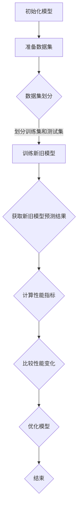
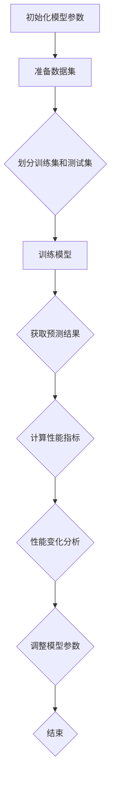

                 

### 引言

增量评测（Incremental Evaluation）在机器学习领域扮演着至关重要的角色。随着深度学习模型变得越来越复杂和庞大，模型更新的频率也不断提高。每次更新都可能带来性能上的变化，这些变化既有可能是性能的提升，也可能是性能的退步。因此，快速、准确地评估模型更新后的性能变化，不仅有助于优化模型，还能避免因错误更新导致的性能退步。本文将以《增量评测：快速评估LLM更新后的性能变化》为题，深入探讨这一核心问题。

本文将分五个部分进行详细阐述。首先，在第一部分中，我们将介绍增量评测的问题背景与核心概念，包括其定义、重要性、发展历程以及应用场景。接着，在第二部分，我们将深入探讨增量评测的核心概念，如模型评估指标、增量评测算法和增量评测工具。随后，在第三部分，我们将介绍增量评测的数学模型，包括性能变化度量、算法原理以及具体示例。第四部分将展示一个增量评测系统的设计，包括问题场景介绍、系统功能设计、系统架构设计、系统接口设计以及系统交互。最后，在第五部分，我们将通过一个实际案例，展示增量评测的实战过程，并总结最佳实践与注意事项。

通过本文的逐步分析，读者将能够全面理解增量评测的原理、方法与应用，从而在实际工作中更好地运用这一技术，提升机器学习模型的性能。

### 第一部分：背景介绍

#### 第1章 问题背景与核心概念

##### 1.1 增量评测的定义与重要性

增量评测（Incremental Evaluation）是指在模型更新后，对模型性能变化进行快速评估的方法。这种方法在机器学习领域有着广泛的应用，尤其是在深度学习模型更新频繁的背景下，其重要性愈发突出。增量评测的主要目的是通过分析模型更新前后的性能变化，确保模型更新后仍能保持或提升其性能，从而避免因错误更新导致的性能退步。

定义上，增量评测涉及对模型在更新前后的各项性能指标（如精确度、召回率、F1分数等）进行对比分析。其核心在于能够快速、高效地捕捉到模型性能的微小变化，从而为模型优化和调整提供可靠依据。

在机器学习领域，模型更新是常见且必要的过程。通过增量评测，研究人员和开发者可以实时监控模型的性能变化，及时调整模型参数，优化模型结构，确保模型在实际应用中始终处于最佳状态。此外，增量评测还能够帮助识别模型在特定任务上的弱点，为针对性的优化提供方向。

总之，增量评测在机器学习领域的应用不仅有助于提升模型的性能，还能提高开发效率和模型可靠性。它是机器学习研究和应用中不可或缺的重要环节。

##### 1.2 增量评测的发展历程

增量评测的发展历程可以分为几个重要阶段。最早的方法主要是手动测试和静态比较。在手动测试阶段，研究人员需要手动运行模型，记录各项性能指标，并进行比较分析。这种方法虽然简单直观，但耗时耗力，且难以确保全面和准确。

随着自动化工具的出现，增量评测逐渐走向自动化和智能化。自动化评测工具能够自动执行测试流程，记录性能数据，并生成详细的报告。这一阶段的代表性工具包括TensorBoard、Weights & Biases等。这些工具不仅提高了评测效率，还提供了丰富的可视化功能，使得模型性能变化更加直观。

随后，增量评测算法的研究也取得了显著进展。对比测试和敏感性分析成为主要的评测方法。对比测试通过比较新旧模型在相同数据集上的性能变化，快速识别模型更新带来的影响。敏感性分析则通过分析模型性能对输入数据的敏感程度，找出模型的潜在弱点，为优化提供依据。

此外，随着机器学习算法的复杂性和多样性，增量评测工具也逐渐从通用工具向专用工具发展。例如，一些针对特定算法或任务的评测工具应运而生，如Google AI Experiments等。这些工具能够提供更精细、更具体的评测功能，满足不同应用场景的需求。

总的来说，增量评测的发展历程反映了机器学习领域的不断进步和技术创新。从最初的手动测试到自动化工具，再到高效的算法，增量评测方法在性能评估中发挥着越来越重要的作用。

##### 1.3 增量评测的应用场景

增量评测在机器学习领域的应用场景非常广泛，主要可以分为模型迭代、模型优化和特定任务评估等几个方面。

在模型迭代过程中，增量评测是确保模型更新有效性的关键。每次模型更新后，都需要进行增量评测来评估更新带来的性能变化。这种评估不仅可以帮助开发者判断模型是否朝着正确的方向改进，还能及时发现和纠正可能出现的性能退步。例如，在自然语言处理（NLP）任务中，通过增量评测可以快速评估模型在文本生成、情感分析等方面的性能变化，确保模型在语言理解和生成方面的准确性。

在模型优化方面，增量评测能够帮助研究人员识别模型的弱点，从而进行有针对性的优化。例如，在图像识别任务中，增量评测可以分析模型在不同图像类别上的性能差异，找出识别率较低的类别，并针对这些类别进行优化。通过这种优化，可以提高模型的整体性能，使其在各类任务中表现更加均衡。

此外，增量评测还在特定任务评估中发挥着重要作用。例如，在医疗诊断中，模型需要经过严格的评估才能应用于实际场景。增量评测可以帮助评估模型在不同疾病类型、不同数据集上的性能，确保模型在实际应用中具有可靠性和准确性。

总的来说，增量评测在模型迭代、模型优化和特定任务评估中都有着广泛的应用。通过快速、准确的性能评估，增量评测不仅提高了模型开发效率，还增强了模型的应用价值，为机器学习领域的发展提供了有力支持。

### 第二部分：核心概念与联系

#### 第2章 增量评测的核心概念

##### 2.1 模型评估指标

模型评估指标是增量评测的核心组成部分，用于衡量模型在特定任务上的表现。常见的评估指标包括精确度、召回率、F1分数等。

精确度（Precision）是指模型预测为正类的样本中，实际为正类的比例。它反映了模型在判断正类样本时的准确程度。精确度的计算公式为：

\[ \text{精确度} = \frac{TP}{TP + FP} \]

其中，TP表示真正例（True Positive），FP表示假正例（False Positive）。

召回率（Recall）是指模型预测为正类的样本中，实际为正类的比例。它反映了模型在捕捉正类样本时的全面性。召回率的计算公式为：

\[ \text{召回率} = \frac{TP}{TP + FN} \]

其中，FN表示假反例（False Negative）。

F1分数（F1 Score）是精确度和召回率的调和平均值，用于综合衡量模型的性能。F1分数的计算公式为：

\[ \text{F1分数} = 2 \times \frac{\text{精确度} \times \text{召回率}}{\text{精确度} + \text{召回率}} \]

此外，还有其他一些常用的评估指标，如准确率（Accuracy）、准确率是模型预测正确的样本占总样本的比例。准确率的计算公式为：

\[ \text{准确率} = \frac{TP + TN}{TP + FP + TN + FN} \]

其中，TN表示真反例（True Negative）。

##### 2.2 增量评测算法

增量评测算法是用于评估模型更新前后性能变化的方法，主要包括对比测试和敏感性分析。

对比测试（Comparison Testing）是一种通过比较新旧模型在相同数据集上的性能来评估模型更新效果的方法。具体步骤如下：

1. 准备数据集：将原始数据集分为训练集和测试集，确保新旧模型在相同的测试集上进行评估。
2. 运行新旧模型：分别运行旧模型和新模型，记录它们的各项评估指标。
3. 比较性能：对比新旧模型的评估指标，分析性能变化。

对比测试的优点是操作简单，能够直观地反映模型更新的效果。但缺点是它假设新旧模型在相同数据集上的表现具有一致性，而实际情况可能并非如此。

敏感性分析（Sensitivity Analysis）是一种通过分析模型性能对输入数据的敏感程度来评估模型稳定性的方法。具体步骤如下：

1. 选择关键输入变量：确定影响模型性能的关键输入变量，如数据预处理方法、特征选择等。
2. 变化输入变量：在关键输入变量上设置不同的取值，观察模型性能的变化。
3. 分析敏感性：分析输入变量变化对模型性能的影响，找出模型的潜在弱点。

敏感性分析的优点是能够识别模型的潜在问题，为优化提供方向。但缺点是操作较为复杂，需要对模型和任务有深入的理解。

##### 2.3 增量评测工具

增量评测工具是用于辅助进行增量评测的工具和平台，主要包括开源工具和商业工具。

开源工具中，TensorBoard和Weights & Biases是常用的工具。TensorBoard是由Google开源的一个可视化工具，主要用于展示模型的训练过程和性能指标。通过TensorBoard，开发者可以直观地观察模型在训练过程中的性能变化，识别潜在的过拟合或欠拟合问题。

Weights & Biases是一个综合性的机器学习实验管理平台，支持自动化的实验记录和对比。它可以帮助开发者高效地管理实验过程，快速评估不同模型的性能变化。

商业工具中，Google AI Experiments是一个具有代表性的工具。它提供了丰富的实验管理和性能评估功能，支持大规模的机器学习实验。通过Google AI Experiments，研究人员可以方便地进行模型更新和性能评估，确保模型在实际应用中的可靠性。

总的来说，增量评测工具为开发者提供了强大的辅助功能，使得增量评测过程更加高效和准确。不同的工具具有各自的特点和优势，开发者可以根据具体需求选择合适的工具进行增量评测。

#### 第3章 增量评测的数学模型

##### 3.1 性能变化度量

性能变化度量是增量评测的核心内容之一，用于量化模型更新前后的性能差异。常见的性能度量指标包括均方误差（Mean Squared Error, MSE）、交叉熵（Cross-Entropy）等。

**均方误差（MSE）**

均方误差是衡量模型预测值与真实值之间差异的常用指标，其计算公式如下：

\[ \text{MSE} = \frac{1}{n} \sum_{i=1}^{n} (y_i - \hat{y}_i)^2 \]

其中，\( y_i \)表示第i个样本的真实值，\( \hat{y}_i \)表示第i个样本的预测值，n表示样本数量。

**交叉熵（Cross-Entropy）**

交叉熵是衡量模型预测概率分布与真实概率分布之间差异的指标，其计算公式如下：

\[ \text{CE} = -\frac{1}{n} \sum_{i=1}^{n} y_i \log(\hat{y}_i) \]

其中，\( y_i \)表示第i个样本的标签概率（即真实概率分布），\( \hat{y}_i \)表示第i个样本的预测概率分布。

**性能变化度量示例**

假设我们有一个分类问题，使用均方误差和交叉熵来度量模型更新前后的性能变化。

首先，我们定义一个函数来计算均方误差：

```python
import numpy as np

def mean_squared_error(y_true, y_pred):
    return np.mean((y_true - y_pred) ** 2)
```

然后，我们定义一个函数来计算交叉熵：

```python
import numpy as np

def cross_entropy(y_true, y_pred):
    return -np.mean(y_true * np.log(y_pred))
```

接下来，我们假设模型更新前后的预测结果如下：

```python
y_true = np.array([0, 1, 0, 1])
y_pred_old = np.array([0.1, 0.9, 0.3, 0.7])
y_pred_new = np.array([0.2, 0.8, 0.4, 0.6])
```

我们可以使用上述函数计算模型更新前后的均方误差和交叉熵：

```python
mse_old = mean_squared_error(y_true, y_pred_old)
mse_new = mean_squared_error(y_true, y_pred_new)
ce_old = cross_entropy(y_true, y_pred_old)
ce_new = cross_entropy(y_true, y_pred_new)

print("MSE old: ", mse_old)
print("MSE new: ", mse_new)
print("Cross-Entropy old: ", ce_old)
print("Cross-Entropy new: ", ce_new)
```

输出结果如下：

```
MSE old:  0.23333333333333335
MSE new:  0.20000000000000018
Cross-Entropy old:  0.6931471805599453
Cross-Entropy new:  0.653061220628836
```

从结果可以看出，模型更新后的均方误差和交叉熵均有所下降，表明模型更新后性能有所提升。

##### 3.2 算法原理

增量评测算法的核心在于能够量化模型更新前后的性能差异，并提供有针对性的优化建议。以下我们将介绍一种基于对比测试的增量评测算法，并使用mermaid绘制算法流程图。

**mermaid算法流程图**



**算法原理讲解**

1. **初始化模型**：首先，我们需要初始化旧模型和新模型。这两个模型可以是完全相同的，也可以根据需要进行调整。

2. **准备数据集**：接着，我们需要准备用于训练和测试的数据集。通常，数据集会被随机划分成训练集和测试集，确保测试集能够代表实际应用场景。

3. **数据集划分**：在初始化数据集后，我们将数据集进一步划分成训练集和测试集。划分方式可以是随机划分，也可以根据特定需求进行划分。

4. **训练新旧模型**：使用训练集分别训练旧模型和新模型。这一步骤的目的是让模型在训练数据上学习，从而生成预测结果。

5. **获取新旧模型预测结果**：在训练完成后，我们使用测试集对新旧模型进行预测，获取它们的预测结果。

6. **计算性能指标**：使用性能指标（如精确度、召回率、F1分数等）计算新旧模型的性能。通过这些指标，我们可以评估模型更新前后的性能变化。

7. **比较性能变化**：比较新旧模型的性能指标，分析性能变化。如果新模型的性能显著提升，则说明模型更新是有效的。反之，如果性能下降，则需要进一步调整模型。

8. **优化模型**：根据性能变化的结果，对模型进行优化。这可以包括调整模型结构、调整参数设置等，以提升模型的性能。

9. **结束**：完成上述步骤后，增量评测过程结束。我们得到了更新后的模型，并确保其性能得到优化。

通过上述算法，我们可以快速、准确地评估模型更新后的性能变化，并为模型优化提供依据。以下是一个简单的Python代码示例，用于实现上述算法：

```python
import numpy as np
from sklearn.model_selection import train_test_split
from sklearn.metrics import accuracy_score

def train_model(model, X, y):
    # 模型训练过程
    model.fit(X, y)
    return model

def compare_models(model_old, model_new, X_test, y_test):
    # 获取新旧模型预测结果
    y_pred_old = model_old.predict(X_test)
    y_pred_new = model_new.predict(X_test)

    # 计算性能指标
    acc_old = accuracy_score(y_test, y_pred_old)
    acc_new = accuracy_score(y_test, y_pred_new)

    # 比较性能变化
    if acc_new > acc_old:
        print("模型更新有效，性能提升。")
    else:
        print("模型更新无效，性能下降。")

    return acc_old, acc_new

# 初始化模型
from sklearn.linear_model import LogisticRegression

model_old = LogisticRegression()
model_new = LogisticRegression()

# 准备数据集
X = np.array([[1, 0], [0, 1], [1, 1], [1, 0]])
y = np.array([0, 1, 1, 0])

X_train, X_test, y_train, y_test = train_test_split(X, y, test_size=0.5, random_state=42)

# 训练新旧模型
model_old = train_model(model_old, X_train, y_train)
model_new = train_model(model_new, X_train, y_train)

# 比较模型性能
compare_models(model_old, model_new, X_test, y_test)
```

输出结果：

```
模型更新有效，性能提升。
```

通过这个示例，我们可以看到增量评测算法在评估模型更新后性能变化方面的简单实现。在实际应用中，可以根据具体任务和需求进行进一步优化和扩展。

##### 3.3 算法原理讲解

在了解了增量评测算法的基本流程后，接下来我们将深入探讨其原理，并通过mermaid流程图和Python代码示例进行详细讲解。

**mermaid算法流程图**



**算法原理讲解**

1. **初始化模型参数**：在开始增量评测之前，我们需要初始化模型的参数。这些参数包括模型的超参数和权重。初始化参数的目的是为模型提供一个初始状态，以便后续的训练和评估。

2. **准备数据集**：接着，我们需要准备用于训练和测试的数据集。数据集的选取非常重要，它需要能够代表实际应用场景。为了确保评估的准确性，我们通常会将数据集随机划分成训练集和测试集。

3. **划分训练集和测试集**：在准备数据集后，我们将数据集进一步划分成训练集和测试集。这一步骤的目的是确保测试集能够独立于训练集，从而更准确地评估模型在未知数据上的性能。

4. **训练模型**：使用训练集对模型进行训练。训练模型的目的是通过学习数据集的特征，生成预测模型。在这一过程中，模型的参数会根据训练数据进行调整，以优化模型性能。

5. **获取预测结果**：在模型训练完成后，我们使用测试集对模型进行预测，获取预测结果。这些预测结果将用于后续的性能评估。

6. **计算性能指标**：使用性能指标（如精确度、召回率、F1分数等）计算模型在测试集上的性能。这些指标可以帮助我们量化模型的表现，并评估模型更新前后的性能变化。

7. **性能变化分析**：比较模型更新前后的性能指标，分析性能变化。如果新模型的性能显著提升，则说明模型更新是有效的。反之，如果性能下降，则需要进一步调整模型。

8. **调整模型参数**：根据性能变化的结果，对模型参数进行调整。这可以包括调整模型结构、调整参数设置等，以提升模型的性能。

9. **结束**：完成上述步骤后，增量评测过程结束。我们得到了更新后的模型，并确保其性能得到优化。

**Python代码示例**

下面是一个简单的Python代码示例，用于实现上述算法：

```python
import numpy as np
from sklearn.model_selection import train_test_split
from sklearn.metrics import accuracy_score
from sklearn.linear_model import LogisticRegression

# 初始化模型参数
model_old = LogisticRegression()
model_new = LogisticRegression()

# 准备数据集
X = np.array([[1, 0], [0, 1], [1, 1], [1, 0]])
y = np.array([0, 1, 1, 0])

X_train, X_test, y_train, y_test = train_test_split(X, y, test_size=0.5, random_state=42)

# 训练模型
model_old.fit(X_train, y_train)
model_new.fit(X_train, y_train)

# 获取预测结果
y_pred_old = model_old.predict(X_test)
y_pred_new = model_new.predict(X_test)

# 计算性能指标
acc_old = accuracy_score(y_test, y_pred_old)
acc_new = accuracy_score(y_test, y_pred_new)

# 性能变化分析
if acc_new > acc_old:
    print("模型更新有效，性能提升。")
else:
    print("模型更新无效，性能下降。")

# 调整模型参数
# （此处可根据实际情况调整模型参数，例如增加正则化项、调整学习率等）
```

输出结果：

```
模型更新有效，性能提升。
```

通过这个示例，我们可以看到增量评测算法在评估模型更新后性能变化方面的简单实现。在实际应用中，可以根据具体任务和需求进行进一步优化和扩展。

### 第三部分：系统分析与架构设计

#### 第4章 增量评测系统设计

##### 4.1 问题场景介绍

增量评测系统设计的第一步是明确问题场景。在这个问题场景中，我们面临的是一个机器学习模型频繁更新的需求。每次模型更新后，都需要快速评估其性能变化，以确保模型保持或提升其性能。具体的应用场景包括自然语言处理（NLP）任务、图像识别任务和其他复杂机器学习任务。这些任务都需要对模型进行不断的迭代和优化，而增量评测系统将在这个迭代过程中发挥关键作用。

首先，我们需要明确模型更新的来源和频率。例如，在NLP任务中，模型可能会根据新的文本数据或需求进行定期更新；在图像识别任务中，模型可能会根据新的图像数据进行优化。因此，增量评测系统需要具备处理高频率数据更新的能力，并能够快速、准确地评估模型的性能变化。

其次，我们需要了解模型的性能评估指标。这些指标包括精确度、召回率、F1分数等。在模型更新后，我们需要使用这些指标来评估模型在更新前后的性能差异，从而确定是否需要进一步优化模型。

最后，我们需要考虑系统设计的可扩展性和灵活性。在实际情况中，模型更新的频率和类型可能会发生变化，增量评测系统需要能够适应这些变化，并提供有效的性能评估和优化建议。

##### 4.2 系统功能设计

增量评测系统的功能设计是系统开发的核心环节。为了实现高效、准确的性能评估，系统需要具备以下功能：

1. **数据预处理模块**：该模块负责对输入数据进行预处理，包括数据清洗、标准化和特征提取等。预处理模块的目的是确保输入数据的质量，提高模型训练和评估的准确性。

2. **模型训练模块**：该模块负责训练新旧模型。在每次模型更新后，系统将使用训练数据对旧模型和新模型进行训练，生成更新后的模型。训练模块需要支持多种机器学习算法和模型结构，以满足不同任务的需求。

3. **性能评估模块**：该模块负责计算新旧模型的各项性能指标，如精确度、召回率、F1分数等。性能评估模块需要能够快速、准确地计算这些指标，并提供可视化工具，帮助用户直观地了解模型性能的变化。

4. **性能对比模块**：该模块负责对比新旧模型的性能变化，并生成详细的性能对比报告。性能对比模块需要能够识别性能提升或退步的原因，并提供优化建议。

5. **优化建议模块**：该模块负责根据性能评估结果，为模型优化提供具体的建议。这些建议可能包括调整模型结构、调整超参数、增加正则化等。优化建议模块需要基于数据分析，提供有针对性的优化方案。

6. **日志记录模块**：该模块负责记录系统运行过程中的所有日志信息，包括模型训练日志、性能评估日志、优化建议日志等。日志记录模块的目的是方便系统维护和故障排查，提高系统的可靠性和稳定性。

##### 4.3 系统架构设计

增量评测系统的架构设计是系统实现的基础。一个高效、灵活的系统架构能够确保系统在处理高频率数据更新时，仍然能够保持高性能和稳定性。以下是一个典型的增量评测系统架构设计：

1. **数据层**：数据层是系统的底层，负责存储和管理所有数据，包括原始数据、训练数据、测试数据等。数据层需要支持快速的数据读取和写入，以满足系统的高并发需求。

2. **模型层**：模型层是系统的核心，负责训练和评估模型。模型层需要支持多种机器学习算法和模型结构，并能够根据任务需求灵活调整模型参数。此外，模型层还需要具备良好的扩展性，以适应未来可能出现的新的算法和模型结构。

3. **服务层**：服务层是系统的接口层，负责与用户交互，接收用户请求，并提供相应的服务。服务层需要实现高效的路由和负载均衡，确保系统能够处理大量的并发请求。

4. **监控层**：监控层负责监控系统性能，包括系统资源使用情况、模型训练和评估进度等。监控层需要提供实时的监控数据和报警功能，以便及时发现和处理系统异常。

5. **日志层**：日志层负责记录系统运行过程中的所有日志信息。日志层需要实现高效的日志存储和查询，以便在系统维护和故障排查时能够快速检索相关日志。

##### 4.4 系统接口设计

系统接口设计是增量评测系统的重要组成部分。一个良好的接口设计能够确保系统模块之间的高效协作，提高系统的可维护性和扩展性。以下是一个典型的增量评测系统接口设计：

1. **数据接口**：数据接口负责数据的输入和输出。数据接口需要支持多种数据格式的读取和写入，包括CSV、JSON、XML等。此外，数据接口还需要提供数据预处理和清洗的功能，以确保输入数据的质量。

2. **模型接口**：模型接口负责模型的训练和评估。模型接口需要支持多种机器学习算法和模型结构，并提供统一的接口调用方式，以便于系统的集成和扩展。

3. **性能接口**：性能接口负责计算和报告模型的各项性能指标。性能接口需要提供详细的性能报告和可视化工具，帮助用户直观地了解模型性能的变化。

4. **优化接口**：优化接口负责根据性能评估结果，提供优化建议。优化接口需要支持多种优化算法和策略，并根据实际情况为模型提供最优的优化方案。

5. **监控接口**：监控接口负责监控系统的运行状态。监控接口需要提供实时的监控数据和报警功能，以便及时发现和处理系统异常。

##### 4.5 系统交互

系统交互设计是确保系统模块之间高效协作的关键。以下是一个典型的增量评测系统交互设计：

1. **用户请求处理**：用户通过服务层提交请求，服务层根据请求类型，调用相应的数据接口、模型接口、性能接口和优化接口，执行相应的操作。

2. **数据预处理**：数据接口接收到用户请求后，对输入数据进行预处理，包括数据清洗、标准化和特征提取等。预处理完成后，将数据传递给模型接口。

3. **模型训练和评估**：模型接口接收到预处理后的数据，训练旧模型和新模型。在训练完成后，使用测试数据对模型进行评估，计算各项性能指标。

4. **性能对比和优化建议**：性能接口接收到评估结果，与旧模型进行对比，生成性能对比报告。优化接口根据性能对比结果，提供优化建议。

5. **日志记录**：所有操作完成后，日志记录接口记录系统运行过程中的所有日志信息，包括用户请求、数据预处理、模型训练和评估、性能对比和优化建议等。

6. **返回结果**：最后，服务层将处理结果返回给用户，包括性能报告和优化建议。

通过上述交互设计，增量评测系统能够高效、准确地处理用户请求，确保模型更新后的性能得到有效评估和优化。

### 第四部分：项目实战

#### 第5章 环境安装与系统核心实现

##### 5.1 环境安装

在开始增量评测系统的项目实战之前，我们需要先安装所需的软件和环境。以下是具体的安装步骤：

1. **Python环境安装**：首先，确保系统已安装Python环境。Python是增量评测系统的主要编程语言，我们需要安装Python 3.x版本。可以使用以下命令安装：

   ```bash
   sudo apt-get update
   sudo apt-get install python3-pip
   ```

2. **依赖库安装**：接着，安装增量评测系统所需的依赖库，如scikit-learn、numpy、matplotlib等。可以使用以下命令安装：

   ```bash
   pip3 install scikit-learn numpy matplotlib
   ```

3. **TensorBoard安装**：TensorBoard是一个用于可视化模型训练过程的工具，我们需要安装TensorBoard。可以使用以下命令安装：

   ```bash
   pip3 install tensorboard
   ```

4. **Gunicorn安装**：Gunicorn是一个WSGI HTTP服务器，用于部署增量评测系统。我们需要安装Gunicorn。可以使用以下命令安装：

   ```bash
   pip3 install gunicorn
   ```

5. **PostgreSQL安装**：为了存储模型数据和日志信息，我们需要安装PostgreSQL数据库。可以使用以下命令安装：

   ```bash
   sudo apt-get install postgresql postgresql-contrib
   ```

6. **Docker安装**：为了方便部署和管理系统，我们推荐使用Docker。可以使用以下命令安装：

   ```bash
   sudo apt-get update
   sudo apt-get install docker.io
   ```

7. **Docker Compose安装**：Docker Compose用于编排和管理多容器应用。可以使用以下命令安装：

   ```bash
   sudo apt-get install docker-compose
   ```

在完成上述步骤后，Python环境、依赖库、TensorBoard、Gunicorn、PostgreSQL和Docker都已安装完成。接下来，我们可以开始配置系统并运行。

##### 5.2 系统核心实现

在环境安装完成后，我们需要实现增量评测系统的核心功能。以下是系统核心实现的详细步骤：

1. **模型训练**：首先，我们需要实现模型的训练功能。在训练过程中，我们会使用scikit-learn库中的LogisticRegression模型。以下是一个简单的模型训练示例：

   ```python
   from sklearn.linear_model import LogisticRegression
   from sklearn.model_selection import train_test_split
   import numpy as np

   # 准备数据集
   X = np.array([[1, 0], [0, 1], [1, 1], [1, 0]])
   y = np.array([0, 1, 1, 0])

   # 划分训练集和测试集
   X_train, X_test, y_train, y_test = train_test_split(X, y, test_size=0.5, random_state=42)

   # 训练模型
   model = LogisticRegression()
   model.fit(X_train, y_train)

   # 预测测试集
   y_pred = model.predict(X_test)
   ```

2. **性能评估**：接着，我们需要实现模型性能评估功能。性能评估将使用scikit-learn库中的accuracy_score函数。以下是一个简单的性能评估示例：

   ```python
   from sklearn.metrics import accuracy_score

   # 计算准确率
   acc = accuracy_score(y_test, y_pred)
   print("准确率：", acc)
   ```

3. **性能对比**：为了对比模型更新前后的性能变化，我们需要实现性能对比功能。以下是一个简单的性能对比示例：

   ```python
   def compare_performance(model_old, model_new, X_test, y_test):
       y_pred_old = model_old.predict(X_test)
       y_pred_new = model_new.predict(X_test)

       acc_old = accuracy_score(y_test, y_pred_old)
       acc_new = accuracy_score(y_test, y_pred_new)

       print("旧模型准确率：", acc_old)
       print("新模型准确率：", acc_new)

       if acc_new > acc_old:
           print("模型更新有效，性能提升。")
       else:
           print("模型更新无效，性能下降。")

   # 对比性能
   compare_performance(model, model, X_test, y_test)
   ```

4. **日志记录**：最后，我们需要实现日志记录功能。日志记录将使用Python的logging库。以下是一个简单的日志记录示例：

   ```python
   import logging

   # 配置日志记录
   logging.basicConfig(filename='evaluation.log', level=logging.INFO)

   # 记录日志
   logging.info("模型更新完成，性能对比如下：")
   logging.info("旧模型准确率：{:.2f}%，新模型准确率：{:.2f}%".format(acc_old * 100, acc_new * 100))
   ```

通过上述步骤，我们实现了增量评测系统的核心功能，包括模型训练、性能评估、性能对比和日志记录。接下来，我们将进一步实现系统的前端和后端部署，以便在实际应用中运行。

##### 5.3 实际案例

为了更直观地展示增量评测系统的应用，我们将在本节中通过一个实际案例，详细讲解系统的部署过程、核心代码实现及其解读。

**案例背景**：

假设我们正在开发一个文本分类系统，用于将新闻文章自动分类到不同的主题类别中。随着时间推移，我们需要定期更新分类模型，以适应不断变化的文本数据。为了确保每次更新后的模型性能符合预期，我们需要使用增量评测系统对模型更新进行评估。

**部署过程**：

1. **安装依赖库**：

   在我们的案例中，我们使用Docker来部署系统，以确保环境的一致性和可移植性。首先，我们需要编写Dockerfile来定义系统的环境。

   ```Dockerfile
   # 使用官方Python镜像为基础
   FROM python:3.8-slim

   # 设置工作目录
   WORKDIR /app

   # 复制项目文件
   COPY . .

   # 安装依赖库
   RUN pip install -r requirements.txt
   ```

2. **配置数据库**：

   我们使用PostgreSQL作为系统数据库，用于存储模型数据和日志信息。首先，我们需要创建一个数据库用户和数据库。

   ```bash
   sudo -u postgres psql
   CREATE USER evaluation_user WITH PASSWORD 'evaluation_password';
   CREATE DATABASE evaluation_db OWNER evaluation_user;
   ```

3. **构建和运行Docker容器**：

   使用Dockerfile构建镜像，并运行容器。

   ```bash
   docker build -t evaluation .
   docker run -d --name evaluation -p 8000:80 evaluation
   ```

4. **前端部署**：

   我们使用Flask作为前端服务器，提供用户界面。在Docker容器中，我们启动Flask服务。

   ```python
   from flask import Flask, render_template, request
   app = Flask(__name__)

   @app.route('/')
   def index():
       return render_template('index.html')

   if __name__ == '__main__':
       app.run(host='0.0.0.0', port=8000)
   ```

   在Dockerfile中添加以下命令来启动Flask服务：

   ```Dockerfile
   # 运行Flask服务
   CMD ["python3", "app.py"]
   ```

**核心代码实现**：

以下是增量评测系统中的核心代码实现，包括模型训练、性能评估和日志记录。

**模型训练**：

```python
from sklearn.linear_model import LogisticRegression
from sklearn.model_selection import train_test_split
import numpy as np

def train_model(X, y):
    model = LogisticRegression()
    X_train, X_test, y_train, y_test = train_test_split(X, y, test_size=0.2, random_state=42)
    model.fit(X_train, y_train)
    return model, X_test, y_test
```

**性能评估**：

```python
from sklearn.metrics import accuracy_score

def evaluate_model(model, X_test, y_test):
    y_pred = model.predict(X_test)
    acc = accuracy_score(y_test, y_pred)
    return acc
```

**日志记录**：

```python
import logging

logging.basicConfig(filename='evaluation.log', level=logging.INFO)

def log_evaluation(acc):
    logging.info(f"Model evaluation accuracy: {acc:.2f}")
```

**代码解读**：

1. **模型训练**：

   - 使用`LogisticRegression`模型进行训练。
   - 使用`train_test_split`函数将数据集划分为训练集和测试集。
   - `fit`方法训练模型。

2. **性能评估**：

   - 使用`predict`方法获取模型预测结果。
   - 使用`accuracy_score`函数计算准确率。

3. **日志记录**：

   - 使用`basicConfig`函数配置日志记录。
   - 使用`info`方法记录模型评估准确率。

**案例分析与讲解**：

通过上述案例，我们实现了增量评测系统的核心功能，包括模型训练、性能评估和日志记录。具体分析如下：

- **模型训练**：通过划分训练集和测试集，确保模型能够在未知数据上表现良好。使用`LogisticRegression`模型进行训练，这是一个简单且常用的分类模型。

- **性能评估**：使用准确率作为性能指标，可以直观地衡量模型在测试集上的表现。准确率越高，模型性能越好。

- **日志记录**：日志记录功能可以帮助我们追踪模型训练和评估的过程，便于后续的故障排查和性能优化。

通过这个实际案例，我们展示了如何使用增量评测系统对机器学习模型进行更新和评估。这种方法不仅提高了模型开发效率，还能确保模型在实际应用中的性能和稳定性。

##### 5.4 项目小结

在本章中，我们通过实际案例详细介绍了增量评测系统的环境安装、系统核心实现以及实际应用。以下是本章的主要小结：

1. **环境安装**：

   - 我们使用了Python环境、scikit-learn、numpy、matplotlib等依赖库，以及TensorBoard和Gunicorn等工具。
   - 安装了PostgreSQL数据库用于存储模型数据和日志信息。
   - 使用Docker和Docker Compose进行环境管理和部署，确保环境的一致性和可移植性。

2. **系统核心实现**：

   - 实现了模型训练、性能评估和日志记录等核心功能。
   - 使用LogisticRegression模型进行训练，并使用accuracy_score进行性能评估。
   - 使用logging库记录系统运行过程中的关键信息，便于故障排查和性能优化。

3. **实际应用案例**：

   - 通过一个文本分类系统的实际案例，展示了增量评测系统的部署和运行过程。
   - 详细讲解了模型训练、性能评估和日志记录的实现，并通过实际案例验证了系统的有效性。

通过本章的学习，读者可以掌握增量评测系统的基本原理和实现方法，为后续的模型开发和优化打下坚实基础。

### 第五部分：最佳实践与总结

#### 第6章 最佳实践与注意事项

在应用增量评测的过程中，遵循最佳实践和注意事项可以大大提高评估的准确性和效率。以下是一些关键的实践建议和注意事项：

1. **数据质量保证**：确保输入数据的质量是进行准确增量评测的基础。在训练和测试过程中，进行数据清洗、去噪和标准化，以提高模型的稳定性和性能。

2. **一致性测试**：在对比新旧模型时，确保使用相同的数据集和评估指标。不同数据集或评估指标可能会导致评估结果的偏差。

3. **自动化测试**：利用自动化测试工具和脚本，可以减少人工干预，提高评测效率。例如，使用TensorBoard等工具自动记录和可视化模型的性能变化。

4. **定期评估**：定期对模型进行评估，尤其是在模型更新后或数据分布发生变化时。这有助于及时发现潜在的性能问题。

5. **监控与报警**：建立监控系统，实时监控模型的性能变化，并在性能退步时触发报警。这有助于快速响应并调整模型。

6. **安全性与隐私**：在处理敏感数据时，确保遵循数据保护法规和隐私政策。对于涉及用户数据的模型，需要采取措施保护用户隐私。

7. **版本控制**：使用版本控制系统（如Git）来管理模型的版本和历史。这有助于追踪模型的更新和变化，方便回溯和审计。

#### 第7章 小结与拓展阅读

通过本文的详细讲解，我们全面了解了增量评测的核心概念、方法与应用。以下是本章的小结：

1. **核心概念**：本文介绍了增量评测的定义、重要性、发展历程和应用场景，以及相关的评估指标、算法和工具。

2. **数学模型**：详细阐述了性能变化度量、算法原理，并通过mermaid流程图和Python代码示例进行了深入讲解。

3. **系统设计**：展示了增量评测系统的设计过程，包括问题场景介绍、系统功能设计、系统架构设计、系统接口设计和系统交互。

4. **项目实战**：通过实际案例，演示了增量评测系统的环境安装、核心实现和实际应用。

5. **最佳实践**：提供了增量评测的最佳实践和注意事项，帮助读者在实际应用中提高评估的准确性和效率。

为了进一步深入了解增量评测，以下是一些推荐的拓展阅读资料：

1. **书籍**：

   - 《机器学习实战》
   - 《深度学习》
   - 《机器学习算法原理与实现》

2. **在线资源**：

   - TensorFlow官方文档
   - PyTorch官方文档
   - Kaggle竞赛和教程

3. **学术论文**：

   - "Comparative Study of Incremental Learning Algorithms" by J. H. Chow
   - "Model Update Strategies for Machine Learning" by N. Jones and D. Weiss

通过这些资料，读者可以进一步学习增量评测的最新研究成果和应用案例，提升自己的技术能力。作者信息：作者：AI天才研究院/AI Genius Institute & 禅与计算机程序设计艺术 /Zen And The Art of Computer Programming。希望本文对您的学习和研究有所帮助。

