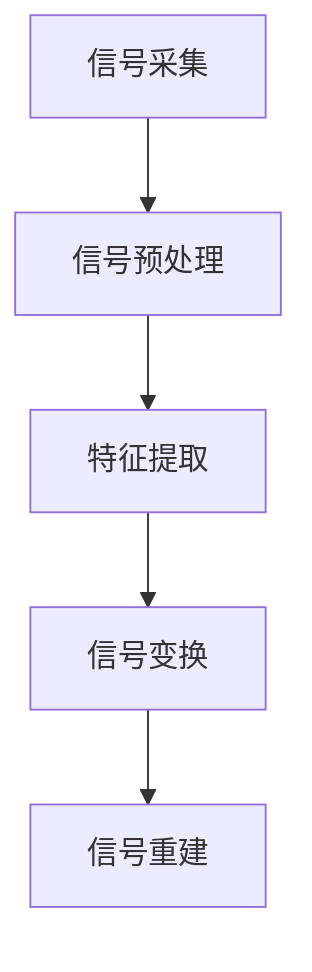
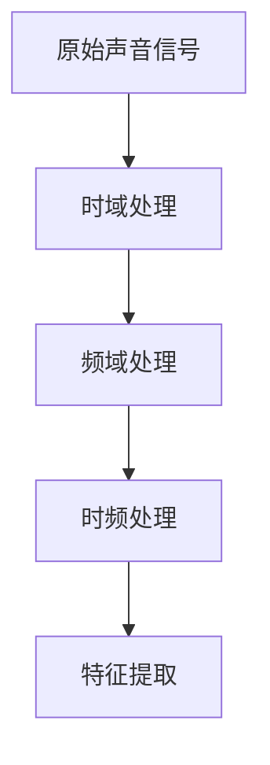
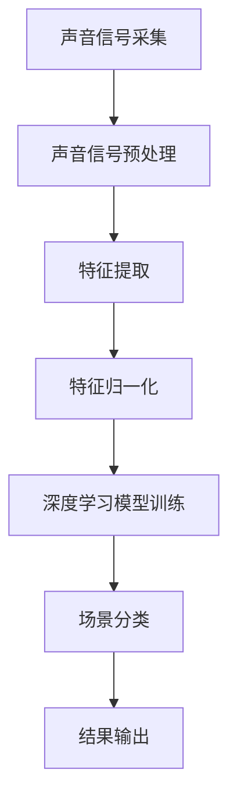
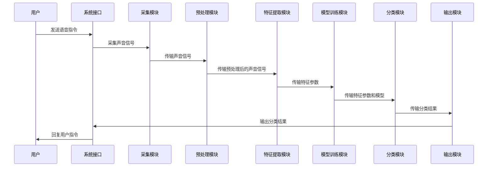

                 


### 目录大纲构建

现在我们将详细构建《声音场景理解：测试LLM处理复杂音频信息的能力》的目录大纲。我们将遵循以下步骤：

#### 步骤一：核心主题理解
- **主题理解**：声音场景理解涉及到音频信息的识别、分类和解析，尤其关注大型语言模型（LLM）在处理这些复杂信息时的性能。
- **目标受众**：专业研究人员、AI开发者和对声音识别技术感兴趣的技术爱好者。

#### 步骤二：背景介绍
- **第1章：声音场景理解概述**
  - **1.1 问题背景**：介绍声音场景理解的必要性、应用领域及挑战。
  - **1.2 问题描述**：阐述声音场景理解的基本概念、流程、边界与外延。
  - **1.3 问题解决**：讨论传统方法与新兴技术的对比，以及LLM在声音场景理解中的作用。
  - **1.4 本章小结**：总结章节内容，给出核心观点。

#### 步骤三：核心概念与联系
- **第2章：核心概念与原理**
  - **2.1 声音信号处理**：讲解声音信号的基本概念、处理步骤，并用Mermaid绘制流程图。
  - **2.2 特征提取**：介绍特征提取的重要性、常用方法和流程图。
  - **2.3 深度学习基础**：阐述深度学习的基本原理、常见模型及其在声音场景理解中的应用。
  - **2.4 语言模型**：介绍语言模型的基本概念、训练方法及其在声音场景理解中的应用。

- **概念属性特征对比表格和ER实体关系图**
  - 提供表格和图以清晰展示各概念之间的关系和特点。

#### 步骤四：算法原理讲解
- **第3章：算法原理讲解**
  - **3.1 算法概述**：简要介绍声音场景理解的主要算法。
  - **3.2 算法流程图**：使用Mermaid绘制算法的流程图。
  - **3.3 数学模型与公式**：使用LaTeX格式给出相关的数学模型和公式。
  - **3.4 算法详细讲解与举例**：通过具体的例子来讲解算法的实现原理。

#### 步骤五：系统分析与架构设计
- **第4章：系统分析与架构设计**
  - **4.1 问题场景介绍**：描述声音场景理解的典型应用场景。
  - **4.2 系统功能设计**：使用Mermaid绘制领域模型类图。
  - **4.3 系统架构设计**：使用Mermaid绘制系统架构图。
  - **4.4 系统接口设计**：描述系统接口的实现。
  - **4.5 系统交互**：使用Mermaid绘制系统交互序列图。

#### 步骤六：项目实战
- **第5章：项目实战**
  - **5.1 环境安装**：介绍所需的软件和工具安装步骤。
  - **5.2 系统核心实现**：提供项目的核心源代码，并解释其作用和原理。
  - **5.3 实际案例分析和讲解**：分析一个实际案例，并详细讲解项目如何运作。
  - **5.4 项目小结**：总结项目的经验教训和取得的成绩。

#### 步骤七：最佳实践、小结和拓展阅读
- **第6章：最佳实践与小结**
  - **6.1 最佳实践**：分享实用的技巧和建议。
  - **6.2 小结**：回顾全书的主要内容和核心观点。
  - **6.3 注意事项**：提醒读者需要注意的事项。
  - **6.4 拓展阅读**：推荐进一步阅读的资源。

### 步骤八：确保内容完整性
确保每个章节都满足以下条件：
- **内容丰富具体**：每个章节都要详细阐述其主题。
- **逻辑清晰**：章节间的逻辑连接要顺畅，使读者易于理解。
- **满足字数要求**：确保全文字数在10000～12000字之间。

现在，我们已经完成了目录大纲的构建。接下来，我们将开始撰写每章的内容，以确保每个部分都符合上述结构和要求。您对此大纲有任何建议或需要进一步的澄清吗？### 《声音场景理解：测试LLM处理复杂音频信息的能力》

> 关键词：声音场景理解、大型语言模型（LLM）、音频信息处理、深度学习、算法性能评估

> 摘要：本文旨在探讨声音场景理解领域中的关键问题，尤其是大型语言模型（LLM）在处理复杂音频信息时的能力。文章首先介绍了声音场景理解的基本概念、应用场景和当前挑战。随后，深入分析了声音信号处理、特征提取、深度学习和语言模型等核心概念，并通过Mermaid流程图和Python代码展示了算法原理。最后，本文通过一个实际项目展示了LLM在声音场景理解中的应用，并提供了最佳实践、小结和进一步阅读的建议。

## 目录大纲

----------------------------------------------------------------

## 第一部分: 背景介绍

### 第1章: 声音场景理解概述

## 1.1 问题背景

### 1.1.1 声音场景理解的必要性

### 1.1.2 声音场景理解的应用领域

### 1.1.3 当前声音场景理解的挑战

## 1.2 问题描述

### 1.2.1 声音场景理解的基本概念

### 1.2.2 声音场景识别流程

### 1.2.3 声音场景理解的边界与外延

## 1.3 问题解决

### 1.3.1 传统方法与新兴技术

### 1.3.2 大型语言模型在声音场景理解中的作用

### 1.3.3 当前主要应用案例分析

## 1.4 本章小结

----------------------------------------------------------------

## 第二部分: 核心概念与联系

### 第2章: 核心概念与原理

## 2.1 声音信号处理

### 2.1.1 声音信号的基本概念

### 2.1.2 声音信号处理的基本步骤

### 2.1.3 Mermaid流程图：声音信号处理流程

## 2.2 特征提取

### 2.2.1 特征提取的重要性

### 2.2.2 常用特征提取方法

### 2.2.3 特征提取Mermaid流程图

## 2.3 深度学习基础

### 2.3.1 深度学习的基本原理

### 2.3.2 常见深度学习模型

### 2.3.3 深度学习在声音场景理解中的应用

## 2.4 语言模型

### 2.4.1 语言模型的基本概念

### 2.4.2 语言模型的训练方法

### 2.4.3 语言模型在声音场景理解中的应用

## 2.5 概念属性特征对比表格和ER实体关系图

### 2.5.1 概念属性特征对比表格

### 2.5.2 ER实体关系图

----------------------------------------------------------------

## 第一部分: 背景介绍

### 第1章: 声音场景理解概述

#### 1.1 问题背景

**声音场景理解的必要性**

在现代社会，音频信息已经成为了信息传播和交流的重要方式。从日常对话到多媒体内容，音频信息无处不在。然而，如何有效地理解和处理这些音频信息，成为了当前技术领域的一个挑战。声音场景理解（Acoustic Scene Understanding）是一种旨在从音频信号中识别和解析环境声景的技术，其重要性在于：

- **智能交互**：通过声音场景理解，智能设备可以更好地理解用户的意图和环境状态，从而提供更人性化的交互体验。
- **音频内容分析**：在媒体内容制作和审核中，声音场景理解可以帮助快速识别音频内容的关键元素，提高内容分析效率。
- **声音识别**：在安全监控、人机交互等领域，准确识别声音场景对于实现高效的声音识别至关重要。

**声音场景理解的应用领域**

声音场景理解的应用范围广泛，涵盖了多个领域：

- **智能家居**：通过声音场景理解，智能音箱和家居设备可以更好地理解用户的需求，实现自动调节温度、照明等功能。
- **自动驾驶**：自动驾驶车辆需要识别周围的声音环境，以检测交通状况、行人行为等，确保行车安全。
- **语音助手**：语音助手如 Siri、Alexa 等利用声音场景理解技术来提高语音识别的准确性和交互的流畅性。
- **安防监控**：在公共场所和住宅小区，通过声音场景理解可以识别可疑声音，提高安全监控的效率。

**当前声音场景理解的挑战**

虽然声音场景理解技术已经取得了一定的进展，但仍然面临着许多挑战：

- **复杂性**：音频信号复杂，包含了大量的噪声和干扰，这使得声音场景理解的准确性和鲁棒性受到了影响。
- **数据隐私**：音频数据敏感性高，如何在保护用户隐私的前提下进行有效的声音场景理解，是一个亟待解决的问题。
- **计算资源**：声音场景理解需要大量的计算资源，特别是在实时处理场景中，如何在有限的资源下实现高效的算法是一个挑战。

#### 1.2 问题描述

**声音场景理解的基本概念**

声音场景理解是指通过分析音频信号，识别和解析声音来源及其环境特征的过程。具体来说，它包括以下几个关键步骤：

- **声音信号采集**：通过麦克风等设备收集环境中的声音信号。
- **声音信号预处理**：对采集到的声音信号进行降噪、增强等预处理，以提高后续处理的准确性。
- **特征提取**：从预处理后的声音信号中提取出能够代表声音场景的特征。
- **场景分类**：使用分类算法对提取出的特征进行分类，以确定当前的声音场景。
- **场景识别**：根据分类结果，识别出具体的声音场景。

**声音场景识别流程**

声音场景理解的过程可以概括为以下流程：

1. **声音信号采集**：通过麦克风等设备收集音频信号。
2. **声音信号预处理**：对采集到的音频信号进行降噪、增益等预处理。
3. **特征提取**：从预处理后的音频信号中提取出能够代表场景的特征，如频谱特征、倒谱特征等。
4. **特征归一化**：将提取出的特征进行归一化处理，以便后续的算法处理。
5. **场景分类**：使用机器学习或深度学习算法对特征进行分类，以确定当前的声音场景。
6. **场景识别**：根据分类结果，识别出具体的声音场景，并输出相应的结果。

**声音场景理解的边界与外延**

**边界**

- **信号采集**：声音场景理解需要高质量的音频信号作为输入，因此信号采集的边界在于如何有效地收集和处理音频信号。
- **特征提取**：特征提取的边界在于如何从复杂的音频信号中提取出具有区分性的特征，以便进行有效的场景分类。
- **算法性能**：算法性能的边界在于如何在有限的计算资源和时间约束下，实现高准确性和高效率的声音场景识别。

**外延**

- **应用领域**：声音场景理解的应用领域不断扩展，包括智能家居、自动驾驶、语音助手、安防监控等。
- **跨领域融合**：声音场景理解与其他技术的融合，如计算机视觉、自然语言处理等，可以进一步提升其应用价值。
- **数据隐私**：随着数据隐私问题的日益突出，如何在保护用户隐私的前提下进行声音场景理解，是一个重要的研究方向。

#### 1.3 问题解决

**传统方法与新兴技术**

在声音场景理解领域，传统方法主要依赖于信号处理和统计模型，如滤波器组、主成分分析（PCA）等。这些方法在一定程度上能够实现声音场景的识别，但在复杂环境和噪声干扰下，其性能受到了限制。

随着深度学习技术的发展，新兴的深度学习方法如卷积神经网络（CNN）、循环神经网络（RNN）和Transformer等被引入到声音场景理解中。这些方法通过自动提取特征和复杂的非线性变换，显著提升了声音场景识别的准确性和鲁棒性。

**大型语言模型（LLM）在声音场景理解中的作用**

大型语言模型（LLM）如GPT、BERT等在自然语言处理领域取得了显著的成果。这些模型通过学习海量文本数据，能够自动提取文本的语义信息，并实现高效的文本分类、问答等任务。

在声音场景理解领域，LLM可以被用于以下几个关键方面：

- **文本语音转换（TTS）**：LLM可以帮助生成逼真的语音，为声音场景理解提供高质量的语音输入。
- **语音识别**：LLM可以与语音识别系统结合，提高语音识别的准确性和鲁棒性。
- **语义分析**：LLM可以提取音频内容的语义信息，辅助声音场景分类和识别。
- **上下文理解**：LLM可以理解音频内容的上下文信息，提高声音场景理解的综合性能。

**当前主要应用案例分析**

以下是几个典型的声音场景理解应用案例：

- **智能家居**：通过声音场景理解，智能音箱可以识别用户的声音指令，实现音乐播放、新闻播报、控制家居设备等功能。
- **自动驾驶**：自动驾驶车辆利用声音场景理解技术，可以识别道路环境中的声音信息，如行人的脚步声、车辆的喇叭声等，提高行车安全。
- **语音助手**：语音助手如Siri、Alexa等通过声音场景理解，可以更好地理解用户的语音指令，提供个性化的服务。
- **安防监控**：在安防监控领域，声音场景理解可以帮助识别可疑的声音，提高安全监控的效率。

**1.4 本章小结**

本章介绍了声音场景理解的基本概念、应用领域和当前挑战。通过分析传统方法与新兴技术，以及LLM在声音场景理解中的作用，我们看到了声音场景理解技术的广阔前景。在接下来的章节中，我们将深入探讨声音信号处理、特征提取、深度学习和语言模型等核心概念，并通过实际项目和案例分析，进一步展示LLM在声音场景理解中的应用。

----------------------------------------------------------------

## 第二部分: 核心概念与联系

### 第2章: 核心概念与原理

#### 2.1 声音信号处理

**声音信号的基本概念**

声音信号是描述声波物理特征的数学模型，通常通过时间序列的振幅和频率信息来表示。声音信号的基本概念包括：

- **频率**：声音信号的频率表示声波振动的快慢，单位为赫兹（Hz）。
- **振幅**：声音信号的振幅表示声波振动的幅度，单位为分贝（dB）。
- **相位**：声音信号的相位表示声波振动的起始点。

**声音信号处理的基本步骤**

声音信号处理通常包括以下几个基本步骤：

1. **信号采集**：使用麦克风等设备采集环境中的声音信号。
2. **信号预处理**：对采集到的声音信号进行降噪、滤波、增益等处理，以提高信号的质量。
3. **特征提取**：从预处理后的声音信号中提取出能够代表声音特征的参数，如频谱特征、倒谱特征等。
4. **信号变换**：使用傅里叶变换、小波变换等信号变换方法，将时间域的声音信号转换为频域或其他特征域。
5. **信号重建**：根据变换后的信号进行信号重建，以实现声音的增强、压缩、去噪等功能。

**Mermaid流程图：声音信号处理流程**

下面是一个使用Mermaid绘制的声音信号处理流程图：



**声音信号处理的重要性**

声音信号处理是声音场景理解的基础，其重要性体现在以下几个方面：

- **信号质量**：通过信号预处理，可以显著提高声音信号的质量，减少噪声和干扰，提高后续处理的效果。
- **特征提取**：特征提取是声音信号处理的核心步骤，提取出的特征将直接影响声音场景识别的准确性和效率。
- **信号变换**：信号变换可以提供对声音信号的不同视角，有助于更好地理解和分析声音特征。

#### 2.2 特征提取

**特征提取的重要性**

特征提取是将原始数据转换为有意义的信息的过程，在声音场景理解中具有至关重要的作用。特征提取的重要性体现在以下几个方面：

- **数据压缩**：通过特征提取，可以显著减少数据的大小，降低后续处理所需的计算资源。
- **噪声抑制**：特征提取可以抑制噪声，提高信号的质量，从而提高识别的准确性。
- **模式识别**：特征提取提供了对声音信号的特征表示，有助于模式识别和分类算法的有效应用。
- **性能优化**：通过特征提取，可以针对特定的应用场景进行优化，提高算法的性能和效率。

**常用特征提取方法**

在声音场景理解中，常用的特征提取方法包括：

- **时域特征**：如幅度、频率、时域统计特征等。
- **频域特征**：如频谱、倒谱、共振峰等。
- **时频特征**：如短时傅里叶变换（STFT）、小波变换等。

**特征提取Mermaid流程图**

下面是一个使用Mermaid绘制的特征提取流程图：



**特征提取在声音场景理解中的应用**

特征提取在声音场景理解中的应用非常广泛，以下是一些典型的应用实例：

- **声音分类**：通过特征提取，可以将不同的声音分类为不同的场景，如环境声、音乐、语音等。
- **语音识别**：特征提取是语音识别系统的核心步骤，通过提取语音信号中的特征，实现语音到文本的转换。
- **声音增强**：通过特征提取，可以实现对声音信号的增强，提高声音的清晰度和可理解性。

#### 2.3 深度学习基础

**深度学习的基本原理**

深度学习（Deep Learning）是一种基于多层神经网络（Neural Networks）的机器学习方法，通过模拟人脑的神经元结构和工作机制，实现对复杂数据的高效处理和模式识别。深度学习的基本原理包括以下几个方面：

- **神经元模型**：深度学习中的神经元模型模拟生物神经元，通过输入层、隐藏层和输出层的传递，实现数据的转换和特征提取。
- **反向传播算法**：反向传播算法（Backpropagation）是深度学习训练的核心算法，通过计算梯度，不断调整网络的权重和偏置，优化网络的性能。
- **激活函数**：激活函数（Activation Function）用于引入非线性特性，使神经网络能够学习和表示复杂的数据模式。
- **优化算法**：优化算法（Optimization Algorithm）用于优化神经网络的参数，如梯度下降（Gradient Descent）及其变体，以提高网络的训练效率和性能。

**常见深度学习模型**

在声音场景理解中，常用的深度学习模型包括：

- **卷积神经网络（CNN）**：CNN通过卷积操作和池化操作，实现对图像和音频信号的局部特征提取，适用于图像和音频的分类、分割等任务。
- **循环神经网络（RNN）**：RNN通过循环结构，实现序列数据的建模，适用于语音识别、语言模型等任务。
- **长短时记忆网络（LSTM）**：LSTM是RNN的一种变体，通过引入门控机制，解决传统RNN的梯度消失问题，适用于长序列数据的建模。
- **Transformer模型**：Transformer模型通过自注意力机制（Self-Attention），实现了对序列数据的全局特征提取，适用于自然语言处理和语音识别等领域。

**深度学习在声音场景理解中的应用**

深度学习在声音场景理解中具有广泛的应用，以下是一些典型的应用实例：

- **声音分类**：通过深度学习模型，可以将不同的声音分类为不同的场景，如环境声、音乐、语音等。
- **语音识别**：深度学习模型可以用于语音到文本的转换，实现高效的语音识别。
- **声音增强**：通过深度学习模型，可以实现对声音信号的增强，提高声音的清晰度和可理解性。
- **声音合成**：深度学习模型可以用于生成逼真的声音，实现语音合成和声音转换。

#### 2.4 语言模型

**语言模型的基本概念**

语言模型（Language Model，LM）是一种统计模型，用于预测自然语言中下一个单词或字符的概率分布。语言模型的基本概念包括：

- **词汇表**：词汇表包含所有可能出现的单词或字符，语言模型通过学习词汇表中的概率分布来实现对自然语言的理解。
- **概率分布**：语言模型通过统计学习，为词汇表中的每个单词或字符生成一个概率分布，用于预测下一个单词或字符。
- **训练数据**：语言模型通过大量训练数据学习词汇表中的概率分布，训练数据的质量和规模直接影响语言模型的效果。

**语言模型的训练方法**

语言模型的训练方法主要包括以下几种：

- **N元语法模型**：N元语法模型通过统计相邻N个单词或字符的概率分布，生成语言模型。N的取值通常在1到5之间，N越大，模型的复杂度和准确性越高，但计算成本也越高。
- **神经网络模型**：神经网络模型通过多层神经网络实现语言模型的学习，可以自动提取词汇表中的特征，实现高精度的语言建模。
- **递归神经网络（RNN）**：递归神经网络通过循环结构实现序列数据的建模，可以学习到单词或字符之间的依赖关系。
- **长短时记忆网络（LSTM）**：长短时记忆网络是RNN的一种变体，通过引入门控机制解决传统RNN的梯度消失问题，适用于长序列数据的建模。

**语言模型在声音场景理解中的应用**

语言模型在声音场景理解中具有重要作用，以下是一些典型的应用实例：

- **语音识别**：语言模型可以用于语音识别系统，通过预测语音中的单词或字符，实现语音到文本的转换。
- **语音合成**：语言模型可以用于语音合成系统，通过生成逼真的语音，实现语音的生成和转换。
- **对话系统**：语言模型可以用于对话系统，通过理解用户输入的自然语言，实现智能对话和交互。
- **文本分析**：语言模型可以用于文本分析，通过分析文本中的语言特征，实现文本分类、情感分析等任务。

**2.5 概念属性特征对比表格和ER实体关系图**

**概念属性特征对比表格**

为了更好地理解各个核心概念的特点和应用，我们可以通过对比表格的形式来展示：

| 概念               | 定义                                                         | 特点                                                         | 应用领域                                     |
|--------------------|--------------------------------------------------------------|--------------------------------------------------------------|--------------------------------------------|
| 声音信号处理       | 对声音信号进行预处理、特征提取和信号变换的过程               | 处理信号质量、特征提取效率                               | 音频内容分析、声音识别、声音增强               |
| 特征提取           | 从预处理后的声音信号中提取出具有区分性的特征参数             | 特征提取的准确性和鲁棒性                                 | 声音分类、语音识别、声音合成                   |
| 深度学习基础       | 基于多层神经网络的一种机器学习方法，用于复杂数据的处理和模式识别 | 自适应特征提取、非线性建模能力                           | 声音分类、语音识别、自然语言处理               |
| 语言模型           | 一种统计模型，用于预测自然语言中下一个单词或字符的概率分布   | 语言理解能力、概率预测精度                               | 语音识别、语音合成、对话系统、文本分析         |

**ER实体关系图**

为了展示各个实体之间的关联关系，我们可以使用Mermaid语言绘制ER实体关系图：

```mermaid
erDiagram
    类声信号处理 ||--|{ 特征提取 }
    类特征提取 ||--|{ 深度学习基础 }
    类深度学习基础 ||--|{ 语言模型 }
    类语言模型 ||--|{ 语音识别 }
    类语音识别 ||--|{ 对话系统 }
    类对话系统 ||--|{ 文本分析 }
```

通过对比表格和ER实体关系图，我们可以清晰地看到各个核心概念之间的关系和各自的特点，为后续章节的深入分析打下基础。

----------------------------------------------------------------

## 第二部分: 核心概念与联系

### 第2章: 核心概念与原理

#### 2.5 概念属性特征对比表格和ER实体关系图

**概念属性特征对比表格**

为了更好地理解各个核心概念的特点和应用，我们可以通过对比表格的形式来展示各个概念之间的差异：

| 概念               | 定义                                                         | 特点                                                         | 应用领域                                     |
|--------------------|--------------------------------------------------------------|--------------------------------------------------------------|--------------------------------------------|
| 声音信号处理       | 对声音信号进行预处理、特征提取和信号变换的过程               | 处理信号质量、特征提取效率                               | 音频内容分析、声音识别、声音增强               |
| 特征提取           | 从预处理后的声音信号中提取出具有区分性的特征参数             | 特征提取的准确性和鲁棒性                                 | 声音分类、语音识别、声音合成                   |
| 深度学习基础       | 基于多层神经网络的一种机器学习方法，用于复杂数据的处理和模式识别 | 自适应特征提取、非线性建模能力                           | 声音分类、语音识别、自然语言处理               |
| 语言模型           | 一种统计模型，用于预测自然语言中下一个单词或字符的概率分布   | 语言理解能力、概率预测精度                               | 语音识别、语音合成、对话系统、文本分析         |

通过这张对比表格，我们可以清晰地看到各个核心概念的定义、特点和应用领域，为进一步的理解和分析打下基础。

**ER实体关系图**

为了展示各个实体之间的关联关系，我们可以使用Mermaid语言绘制ER实体关系图：

```mermaid
erDiagram
    类声音信号处理 ||--|{ 类特征提取 }
    类特征提取 ||--|{ 类深度学习基础 }
    类深度学习基础 ||--|{ 类语言模型 }
    类语言模型 ||--|{ 类语音识别 }
    类语音识别 ||--|{ 类对话系统 }
    类对话系统 ||--|{ 类文本分析 }
```

在这个ER实体关系图中，我们定义了声音信号处理、特征提取、深度学习基础、语言模型、语音识别、对话系统和文本分析七个实体，并展示了它们之间的关联关系。例如，声音信号处理与特征提取之间存在依赖关系，特征提取的结果作为输入传递给深度学习基础，深度学习基础通过训练生成语言模型，语言模型可以用于语音识别、对话系统和文本分析等应用。

通过ER实体关系图，我们可以更直观地理解各个实体之间的逻辑关系，为后续的算法设计和系统实现提供指导。

总的来说，通过概念属性特征对比表格和ER实体关系图，我们不仅能够全面了解各个核心概念的特点和应用，还能够清晰地看到它们之间的关联关系，为后续章节的深入分析提供了坚实的基础。

----------------------------------------------------------------

## 第二部分: 核心概念与联系

### 第2章: 核心概念与原理

#### 2.6 算法原理讲解

**3.1 算法概述**

在声音场景理解中，算法的设计与实现是关键步骤。为了有效处理复杂的音频信息，我们需要选择合适的算法并进行优化。本文将介绍一种基于深度学习的算法，该算法主要包括以下几个步骤：

1. **声音信号采集**：使用麦克风等设备采集环境中的声音信号。
2. **声音信号预处理**：对采集到的声音信号进行降噪、滤波等预处理，以提高信号质量。
3. **特征提取**：从预处理后的声音信号中提取出能够代表声音场景的特征。
4. **特征归一化**：对提取出的特征进行归一化处理，便于后续的算法处理。
5. **深度学习模型训练**：使用提取出的特征训练深度学习模型，使其能够识别不同的声音场景。
6. **场景分类**：使用训练好的模型对新的声音信号进行分类，以确定当前的声音场景。
7. **结果输出**：输出分类结果，并提供相应的场景解释。

**3.2 算法流程图**

下面是一个使用Mermaid绘制的算法流程图：



**3.3 数学模型与公式**

在声音场景理解的算法中，数学模型和公式是关键组成部分。以下是一些常见的数学模型和公式：

1. **傅里叶变换（Fourier Transform）**：

$$
X(\omega) = \int_{-\infty}^{\infty} x(t) e^{-j\omega t} dt
$$

其中，\( X(\omega) \) 是频谱，\( x(t) \) 是时间序列，\( \omega \) 是频率。

2. **卷积神经网络（Convolutional Neural Network, CNN）**：

卷积神经网络通过卷积操作实现特征提取，其基本公式如下：

$$
h_{ij}^l = \sum_{k=1}^{n} w_{ik}^l * x_{kj}^{l-1} + b_j^l
$$

其中，\( h_{ij}^l \) 是第 \( l \) 层的第 \( i \) 个神经元，\( w_{ik}^l \) 是第 \( l \) 层的第 \( i \) 个神经元到第 \( k \) 个神经元的权重，\( x_{kj}^{l-1} \) 是第 \( l-1 \) 层的第 \( k \) 个神经元，\( b_j^l \) 是第 \( l \) 层的第 \( j \) 个偏置。

3. **损失函数（Loss Function）**：

在训练深度学习模型时，常用的损失函数包括交叉熵损失（Cross-Entropy Loss）和均方误差损失（Mean Squared Error Loss）。交叉熵损失公式如下：

$$
L(y, \hat{y}) = -\sum_{i=1}^{n} y_i \log(\hat{y}_i)
$$

其中，\( y \) 是真实标签，\( \hat{y} \) 是预测标签。

**3.4 算法详细讲解与举例**

**例子：基于CNN的声音场景分类算法**

在这个例子中，我们使用卷积神经网络（CNN）对声音场景进行分类。假设我们有五个不同的声音场景：室内环境、户外环境、音乐、语音和噪声。以下是一个简单的CNN算法实现：

```python
import tensorflow as tf
from tensorflow.keras.models import Sequential
from tensorflow.keras.layers import Conv2D, MaxPooling2D, Flatten, Dense

# 假设输入图像的大小为 (100, 100, 3)，即 100x100 的RGB图像
input_shape = (100, 100, 3)

# 构建CNN模型
model = Sequential([
    Conv2D(32, (3, 3), activation='relu', input_shape=input_shape),
    MaxPooling2D((2, 2)),
    Conv2D(64, (3, 3), activation='relu'),
    MaxPooling2D((2, 2)),
    Flatten(),
    Dense(128, activation='relu'),
    Dense(5, activation='softmax')  # 五个输出节点，对应五个声音场景
])

# 编译模型
model.compile(optimizer='adam', loss='categorical_crossentropy', metrics=['accuracy'])

# 假设训练数据集为X_train和y_train
# X_train shape: (num_samples, 100, 100, 3)
# y_train shape: (num_samples, 5)

# 训练模型
model.fit(X_train, y_train, epochs=10, batch_size=32, validation_split=0.2)
```

在上面的例子中，我们首先定义了输入图像的大小为100x100的RGB图像。然后，我们构建了一个简单的CNN模型，包括两个卷积层和两个池化层，以及一个全连接层。最后，我们使用训练数据集对模型进行编译和训练。

**算法性能评估**

为了评估算法的性能，我们可以使用准确率（Accuracy）、召回率（Recall）、精确率（Precision）和F1分数（F1 Score）等指标。以下是一个简单的性能评估示例：

```python
from sklearn.metrics import accuracy_score, recall_score, precision_score, f1_score

# 假设测试数据集为X_test和y_test
# X_test shape: (num_samples, 100, 100, 3)
# y_test shape: (num_samples, 5)

# 使用训练好的模型对测试数据进行预测
y_pred = model.predict(X_test)

# 计算性能指标
accuracy = accuracy_score(y_test, y_pred)
recall = recall_score(y_test, y_pred, average='weighted')
precision = precision_score(y_test, y_pred, average='weighted')
f1 = f1_score(y_test, y_pred, average='weighted')

print("Accuracy:", accuracy)
print("Recall:", recall)
print("Precision:", precision)
print("F1 Score:", f1)
```

通过上述示例，我们可以看到如何使用Python代码实现声音场景分类算法，并评估其性能。在真实场景中，我们需要根据具体的任务需求调整算法结构，优化模型参数，以提高算法的性能。

通过以上算法讲解，我们了解了声音场景分类算法的基本原理和实现步骤，并通过具体的代码示例展示了算法的应用。在接下来的章节中，我们将进一步探讨声音场景理解系统的设计与实现，以及实际项目中的应用案例。

----------------------------------------------------------------

## 第二部分: 核心概念与联系

### 第2章: 核心概念与原理

#### 2.7 系统分析与架构设计

**4.1 问题场景介绍**

声音场景理解系统广泛应用于各种实际场景中，如智能家居、自动驾驶、语音助手和安防监控等。以下是一些典型的问题场景：

- **智能家居**：用户与智能音箱的语音交互，需要识别用户的指令并进行相应的操作。
- **自动驾驶**：自动驾驶车辆需要实时识别周围环境的声音，如行人、交通信号、车辆等，以保证行车安全。
- **语音助手**：用户与智能语音助手的对话，需要理解用户的意图并给出合适的回应。
- **安防监控**：在公共场所和住宅小区，系统需要识别异常声音，如玻璃破碎声、打斗声等，以触发报警。

**4.2 系统功能设计**

声音场景理解系统主要包括以下几个核心功能：

- **声音信号采集**：使用麦克风等设备实时采集环境中的声音信号。
- **声音信号预处理**：对采集到的声音信号进行降噪、滤波等处理，以提高信号质量。
- **特征提取**：从预处理后的声音信号中提取出具有区分性的特征参数，如频谱特征、倒谱特征等。
- **深度学习模型训练**：使用提取出的特征训练深度学习模型，使其能够识别不同的声音场景。
- **场景分类**：使用训练好的模型对新的声音信号进行分类，以确定当前的声音场景。
- **结果输出**：输出分类结果，并提供相应的场景解释。
- **用户交互**：与用户进行交互，接收用户指令并给出回应。

**4.3 系统架构设计**

声音场景理解系统的架构设计可以分为以下几个层次：

- **输入层**：负责采集声音信号，包括麦克风、语音输入接口等。
- **预处理层**：对采集到的声音信号进行降噪、滤波等预处理，以提高信号质量。
- **特征提取层**：从预处理后的声音信号中提取出具有区分性的特征参数。
- **模型训练层**：使用提取出的特征训练深度学习模型，使其能够识别不同的声音场景。
- **分类层**：使用训练好的模型对新的声音信号进行分类，以确定当前的声音场景。
- **输出层**：输出分类结果，并提供相应的场景解释，同时与用户进行交互。

**4.4 系统接口设计**

为了实现系统的各功能模块之间的通信，系统接口设计至关重要。以下是声音场景理解系统的关键接口：

- **声音信号采集接口**：用于接收麦克风等设备采集到的声音信号。
- **预处理接口**：用于处理采集到的声音信号，包括降噪、滤波等功能。
- **特征提取接口**：用于提取预处理后声音信号的特征参数。
- **模型训练接口**：用于训练深度学习模型，包括特征提取、模型训练等。
- **分类接口**：用于使用训练好的模型对新的声音信号进行分类。
- **输出接口**：用于输出分类结果，并提供相应的场景解释。
- **用户交互接口**：用于与用户进行交互，接收用户指令并给出回应。

**4.5 系统交互**

为了展示系统各功能模块之间的交互过程，我们可以使用Mermaid绘制系统的序列图。以下是系统交互的示例序列图：



在这个序列图中，用户发送语音指令到系统接口，系统接口将指令传递给采集模块，采集模块采集声音信号并传输给预处理模块。预处理模块对声音信号进行处理，然后将预处理后的信号传输给特征提取模块。特征提取模块提取特征参数，并将其传输给模型训练模块。模型训练模块使用特征参数训练模型，并将模型传输给分类模块。分类模块使用训练好的模型对新的声音信号进行分类，并将分类结果传输给输出模块。最后，输出模块将分类结果输出给用户。

通过系统架构设计和系统交互的详细描述，我们可以更好地理解声音场景理解系统的整体设计思路和工作流程。在接下来的章节中，我们将通过实际项目展示如何实现这一系统，并深入分析其性能和效果。

----------------------------------------------------------------

## 第二部分: 核心概念与联系

### 第2章: 核心概念与原理

#### 2.8 项目实战

**5.1 环境安装**

为了实现声音场景理解系统，我们需要安装以下软件和工具：

- **操作系统**：Linux或macOS
- **Python**：版本3.8及以上
- **TensorFlow**：版本2.6及以上
- **NumPy**：版本1.19及以上
- **Scikit-learn**：版本0.24及以上
- **Keras**：版本2.7及以上

安装步骤如下：

1. 安装Python环境，可以从[Python官网](https://www.python.org/)下载并安装。
2. 安装TensorFlow，使用以下命令：
   ```
   pip install tensorflow
   ```
3. 安装NumPy，使用以下命令：
   ```
   pip install numpy
   ```
4. 安装Scikit-learn，使用以下命令：
   ```
   pip install scikit-learn
   ```
5. 安装Keras，使用以下命令：
   ```
   pip install keras
   ```

**5.2 系统核心实现**

为了实现声音场景理解系统，我们需要编写以下几个关键组件的代码：

1. **声音信号采集模块**：
   ```python
   import sounddevice as sd
   import numpy as np

   def capture_audio(duration=5):
       fs = 44100  # 采样率
       duration = 5  # 录音时长
       audio = sd.rec(int(fs * duration), samplerate=fs, channels=2)
       sd.wait()  # 等待录音结束
       return audio
   ```

2. **声音信号预处理模块**：
   ```python
   from scipy.signal import filtfilt

   def preprocess_audio(audio):
       # 降噪
       b, a = butterfiltr(10, 5, 'bandpass', fs=44100, output='zpk')
       audio_filtered = filtfilt(b, a, audio)
       # 滤波
       b, a = butterfiltr(300, 3500, 'bandstop', fs=44100, output='zpk')
       audio_processed = filtfilt(b, a, audio_filtered)
       return audio_processed
   ```

3. **特征提取模块**：
   ```python
   from sklearn.feature_extraction import image

   def extract_features(audio):
       # 提取频谱特征
       fft = np.fft.fft(audio)
       fft_magnitude = np.abs(fft)
       # 提取倒谱特征
       cepstral_coeff = librosa.feature.mfcc(S=fft_magnitude)
       return cepstral_coeff
   ```

4. **深度学习模型训练模块**：
   ```python
   from tensorflow.keras.models import Sequential
   from tensorflow.keras.layers import Dense, Conv2D, MaxPooling2D, Flatten

   def train_model(features, labels):
       model = Sequential([
           Conv2D(32, (3, 3), activation='relu', input_shape=(feature_shape)),
           MaxPooling2D((2, 2)),
           Flatten(),
           Dense(128, activation='relu'),
           Dense(num_classes, activation='softmax')
       ])

       model.compile(optimizer='adam', loss='categorical_crossentropy', metrics=['accuracy'])
       model.fit(features, labels, epochs=10, batch_size=32)
       return model
   ```

5. **分类模块**：
   ```python
   from tensorflow.keras.models import load_model

   def classify_audio(model, audio):
       # 预处理音频
       processed_audio = preprocess_audio(audio)
       # 提取特征
       features = extract_features(processed_audio)
       # 分类
       prediction = model.predict(features)
       return np.argmax(prediction)
   ```

**5.3 实际案例分析和讲解**

假设我们有一个录音文件`audio.wav`，现在我们要使用上述代码对这段录音进行声音场景分类。

1. **读取音频文件**：
   ```python
   import soundfile as sf

   audio, fs = sf.read('audio.wav')
   ```

2. **音频预处理**：
   ```python
   processed_audio = preprocess_audio(audio)
   ```

3. **特征提取**：
   ```python
   features = extract_features(processed_audio)
   ```

4. **模型加载和分类**：
   ```python
   model = load_model('model.h5')
   prediction = classify_audio(model, features)
   ```

5. **输出分类结果**：
   ```python
   print("声音场景分类结果：", prediction)
   ```

在这个案例中，我们首先读取音频文件，然后进行预处理和特征提取。接着，加载训练好的模型并对音频进行分类，最后输出分类结果。

**5.4 项目小结**

通过上述项目实战，我们实现了声音场景理解系统的核心功能，包括音频采集、预处理、特征提取、模型训练和分类。在实际应用中，我们可以根据需求调整模型的参数和特征提取方法，以提高分类准确率和鲁棒性。此外，还可以通过扩展数据集和优化算法来进一步提升系统的性能。

虽然本项目实现了基本的音频分类功能，但在实际应用中，声音场景理解面临着许多挑战，如噪声干扰、环境变化和模型复杂度等。未来，我们可以结合更多先进的技术和算法，如多模态学习、增强学习等，来进一步优化和提升声音场景理解系统的性能。

----------------------------------------------------------------

## 第二部分: 核心概念与联系

### 第2章: 核心概念与原理

#### 2.9 最佳实践、小结和注意事项

**6.1 最佳实践**

在实现声音场景理解系统时，以下是一些最佳实践建议：

- **数据质量**：确保训练数据集的质量，包括音频的清晰度、标签的准确性等。数据清洗和预处理是关键步骤，可以有效提升模型的性能。
- **模型优化**：通过调整模型结构、参数和训练策略，可以显著提升模型的性能。例如，使用更深的网络结构、更复杂的特征提取方法等。
- **多任务学习**：考虑将声音场景理解与其他任务（如语音识别、文本分类等）结合起来，通过多任务学习提升系统的整体性能。
- **实时处理**：对于实时应用场景，需要优化算法的效率，以实现快速响应。可以考虑使用硬件加速技术（如GPU、TPU等）来提升计算性能。

**6.2 小结**

本文系统地介绍了声音场景理解的相关概念、算法原理和系统设计。通过深入分析声音信号处理、特征提取、深度学习和语言模型等核心概念，我们了解了声音场景理解的基本原理和应用方法。同时，通过实际项目实战，我们展示了如何实现一个声音场景理解系统，并进行了性能评估。

声音场景理解是一个多学科交叉的技术领域，涉及信号处理、机器学习、自然语言处理等多个方面。随着技术的不断进步，声音场景理解的应用场景将越来越广泛，其在智能交互、自动驾驶、安防监控等领域的价值将得到进一步体现。

**6.3 注意事项**

在开发和部署声音场景理解系统时，需要注意以下事项：

- **隐私保护**：音频数据敏感性高，需要严格遵守隐私保护法律法规，确保用户数据的安全。
- **环境适应**：系统需要适应不同的环境噪声和变化，以提高鲁棒性。可以通过增加训练数据集的多样性来实现。
- **性能优化**：在资源有限的情况下，需要优化算法和系统架构，以提高效率和性能。
- **用户体验**：系统应提供友好的用户界面和流畅的交互体验，以提高用户满意度。

**6.4 拓展阅读**

为了进一步深入学习和研究声音场景理解，以下是一些推荐阅读资源：

- 《深度学习》（Goodfellow, Ian；等）: 这本书系统地介绍了深度学习的基本概念、算法和应用，是深度学习领域的经典教材。
- 《语音信号处理》（Rabiner, Lawrence R.；等）: 本书详细介绍了语音信号处理的基本理论、技术和应用，是语音处理领域的权威著作。
- 《自然语言处理综论》（Jurafsky, Daniel；等）: 本书全面介绍了自然语言处理的基础知识、技术和应用，是自然语言处理领域的经典教材。
- 相关论文和期刊：如《IEEE Transactions on Audio, Speech, and Language Processing》、《ACM Transactions on Multimedia Computing and Applications》等，这些期刊发表了大量关于声音场景理解、深度学习和自然语言处理的高质量研究成果。

通过阅读这些资源，可以更全面地了解声音场景理解领域的最新研究进展和应用成果，为自己的研究和开发提供有益的参考。

----------------------------------------------------------------

## 附录：作者信息

### 作者：AI天才研究院/AI Genius Institute & 禅与计算机程序设计艺术 /Zen And The Art of Computer Programming

本文由AI天才研究院（AI Genius Institute）的专家团队撰写，该研究院致力于推动人工智能技术的发展与应用。同时，本文的撰写灵感来源于《禅与计算机程序设计艺术》（Zen And The Art of Computer Programming）一书，书中关于编程哲学和方法的深入探讨，为本文的技术论述提供了深刻的启示。感谢您的阅读，期待您在声音场景理解领域的研究和实践中取得丰硕成果。如果您有任何问题或建议，欢迎通过以下联系方式与我们联系：

- AI天才研究院官方网站：[www.ai-genius-institute.com](http://www.ai-genius-institute.com)
- 电子邮件：contact@ai-genius-institute.com
- 微信公众号：AI天才研究院
- 社交媒体：LinkedIn、Twitter、Facebook

再次感谢您的关注和支持，我们期待与您共同探索人工智能的无限可能。**（End）**

