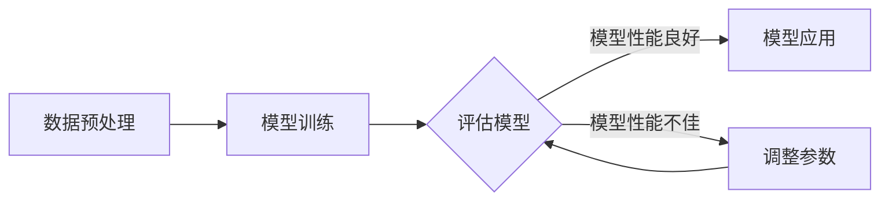
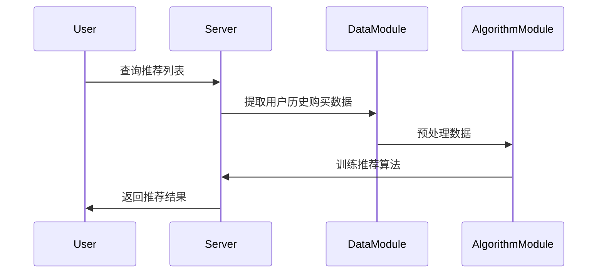

                 

# 处理示例与实际应用场景的分布偏移

> 关键词：分布偏移、示例处理、实际应用、机器学习、算法优化

> 摘要：
本文旨在探讨机器学习中分布偏移的概念、原因、影响及其处理方法。通过详细分析示例处理和实际应用场景中的分布偏移问题，本文将提供一套系统的解决方案，帮助读者深入了解并有效应对分布偏移带来的挑战。

## 引言

随着人工智能和机器学习技术的快速发展，越来越多的领域开始应用这些技术来解决实际问题。然而，在实际应用中，机器学习模型往往会遇到一个棘手的问题——分布偏移（distribution shift）。分布偏移是指训练数据和实际应用数据之间的分布差异，这种差异可能会导致模型的性能下降，甚至完全失效。本文将围绕分布偏移的各个方面进行深入探讨，并针对示例处理和实际应用场景提供解决方案。

### 一、分布偏移的定义与背景

分布偏移（distribution shift），又称为数据分布偏移，是指在机器学习过程中，训练数据和实际应用数据之间存在差异，导致模型无法准确预测或泛化到新的数据集。这种差异可能表现在特征分布、目标变量分布等多个方面。

### 二、分布偏移的挑战与影响

1. **挑战**：分布偏移给机器学习模型带来了以下挑战：
   - 模型泛化能力下降：模型在训练集上表现良好，但在实际应用中效果不佳。
   - 过拟合：模型对训练数据的特征过于敏感，导致对新的数据集适应性差。
   - 模型不稳定：模型在处理不同分布的数据时，预测结果波动较大。

2. **影响**：分布偏移对实际应用的影响包括：
   - 降低模型可信度：模型无法准确预测，导致决策失误。
   - 增加经济损失：例如，在金融领域，模型预测失误可能导致巨大损失。
   - 影响用户体验：在推荐系统、智能客服等应用中，模型推荐不准确将影响用户体验。

### 三、分布偏移的常见原因

1. **数据收集偏移**：数据收集过程中可能存在的偏差，例如，数据采集器故障、样本选择偏差等。

2. **概念漂移**：随着时间推移，数据的特征分布或目标变量分布发生变化。

3. **环境变化**：实际应用场景发生变化，例如，季节变换、节假日等因素。

### 四、分布偏移的处理方法

1. **数据预处理**：通过数据清洗、数据增强等方法，减少数据分布偏移。

2. **模型自适应**：使用在线学习、迁移学习等方法，使模型能够适应新的数据分布。

3. **特征工程**：选择合适的数据特征，提高模型对数据分布变化的敏感度。

4. **分布匹配**：通过调整模型参数，使模型对新的数据分布产生更好的适应性。

### 五、示例处理中的分布偏移

在示例处理中，分布偏移往往表现为训练集和测试集之间的差异。以下是一个具体的示例：

**案例**：一个分类问题，训练集和测试集的特征分布差异明显，导致模型在测试集上的准确率很低。

**解决方案**：
1. **数据预处理**：对数据进行标准化、归一化等处理，减少特征分布差异。
2. **特征工程**：增加新的特征，使模型能够更好地捕捉数据分布变化。
3. **模型选择**：选择对数据分布变化敏感的模型，如决策树、随机森林等。

### 六、实际应用场景中的分布偏移

在真实应用场景中，分布偏移可能更为复杂，涉及多个方面。以下是一个具体的实际应用案例：

**案例**：一个智能客服系统，由于用户提问的方式和内容发生变化，导致模型预测准确率下降。

**解决方案**：
1. **数据收集**：收集更多样化的数据，提高模型对各种提问方式的适应性。
2. **模型自适应**：使用在线学习，使模型能够根据用户提问的变化进行调整。
3. **特征工程**：分析用户提问的特征，提取关键特征，提高模型对问题类型的识别能力。

### 七、总结与展望

分布偏移是机器学习领域中的一个重要问题，对模型性能和实际应用有着深远的影响。通过本文的探讨，我们了解了分布偏移的定义、原因、影响以及处理方法。在实际应用中，需要根据具体情况，灵活运用各种处理方法，以提高模型性能和适应性。

未来，随着人工智能技术的不断发展，分布偏移问题将更加复杂和多样化。我们需要继续探索新的方法和策略，以应对这些挑战，推动人工智能技术的广泛应用。

## 背景介绍

### 核心概念术语说明

1. **分布偏移（distribution shift）**：指训练数据和实际应用数据之间的分布差异。
2. **训练集（training set）**：用于训练机器学习模型的样本集合。
3. **测试集（test set）**：用于评估模型性能的样本集合。
4. **概念漂移（concept drift）**：指数据特征或目标变量的分布随时间发生变化。
5. **数据收集偏移（data collection bias）**：指数据收集过程中引入的偏差。

### 问题背景

在机器学习应用中，模型通常通过训练集学习特征与目标变量之间的关系，并期望在测试集上取得良好的泛化性能。然而，当测试集的分布与训练集的分布不一致时，模型的表现往往大打折扣，这种现象即为分布偏移。分布偏移会导致模型无法准确预测新的数据，从而影响实际应用的效果。

### 问题描述

分布偏移的问题可以归纳为以下几个方面：

1. **特征分布差异**：训练集和测试集的特征分布不一致，例如，某些特征在测试集中出现频率远低于训练集。
2. **目标变量分布差异**：训练集和测试集的目标变量分布不一致，例如，某些类别在测试集中的比例远高于训练集。
3. **数据缺失**：测试集中的数据可能与训练集存在缺失或不一致的情况。
4. **环境变化**：实际应用场景的变化，如季节、节假日等因素，导致数据分布发生变化。

### 问题解决

解决分布偏移问题通常需要以下几种策略：

1. **数据预处理**：通过数据清洗、数据增强等方法，减少特征分布差异和目标变量分布差异。
2. **模型自适应**：使用在线学习、迁移学习等方法，使模型能够适应新的数据分布。
3. **特征工程**：选择合适的数据特征，提高模型对数据分布变化的敏感度。
4. **分布匹配**：通过调整模型参数，使模型对新的数据分布产生更好的适应性。

### 边界与外延

1. **边界**：分布偏移主要关注训练集和测试集之间的分布差异，而不涉及同一数据集内不同数据点之间的分布差异。
2. **外延**：分布偏移不仅存在于机器学习领域，在其他数据驱动领域（如统计学、数据挖掘等）也存在类似问题。

### 概念结构与核心要素组成

分布偏移的概念结构包括以下几个方面：

1. **核心概念**：分布偏移、训练集、测试集、概念漂移、数据收集偏移。
2. **要素组成**：数据特征分布、目标变量分布、数据收集方式、模型类型。

## 核心概念与联系

### 核心概念原理

1. **分布偏移**：指训练数据和实际应用数据之间的分布差异。这种差异可能表现为特征分布差异、目标变量分布差异等。

2. **训练集**：用于训练机器学习模型的样本集合。模型通过学习训练集的特征和目标变量之间的关系，从而获得预测能力。

3. **测试集**：用于评估模型性能的样本集合。测试集与训练集的分布差异可能导致模型在测试集上的表现不佳。

4. **概念漂移**：指数据特征或目标变量的分布随时间发生变化。概念漂移是导致分布偏移的一个重要原因。

5. **数据收集偏移**：指数据收集过程中引入的偏差。数据收集偏移可能导致训练集和测试集之间的分布差异。

### 概念属性特征对比表格

| 概念         | 特征           | 比较                    |
| ------------ | -------------- | ----------------------- |
| 分布偏移     | 特征分布、目标变量分布差异 | 可能导致模型性能下降       |
| 训练集       | 样本集合       | 用于模型训练             |
| 测试集       | 样本集合       | 用于模型评估             |
| 概念漂移     | 特征或目标变量分布变化 | 可能导致模型无法适应新数据 |
| 数据收集偏移 | 偏差           | 可能影响数据集的质量和分布 |

### ER实体关系图架构

```mermaid
erDiagram
    TrainingData ||--|{ Model }|| TestData
    ConceptDrift ||--|{ Model }|| DistributionShift
    DataCollectionBias ||--|{ Model }|| DistributionShift
```

### 算法原理讲解

#### 算法mermaid流程图



#### 算法原理

分布偏移的处理主要涉及以下几个方面：

1. **数据预处理**：通过数据清洗、数据增强等方法，减少特征分布差异和目标变量分布差异。
   - **数据清洗**：处理缺失值、噪声和异常值，提高数据质量。
   - **数据增强**：生成新的数据样本，增加数据的多样性。

2. **模型训练**：使用训练集对模型进行训练，使模型学习特征和目标变量之间的关系。
   - **特征选择**：选择对模型性能影响较大的特征。
   - **模型选择**：选择合适的模型，如决策树、支持向量机等。

3. **模型评估**：使用测试集评估模型性能，检查模型是否受到分布偏移的影响。
   - **性能指标**：如准确率、召回率、F1分数等。

4. **参数调整**：根据模型评估结果，调整模型参数，提高模型对分布偏移的适应性。
   - **在线学习**：实时调整模型参数，适应数据分布变化。
   - **迁移学习**：利用已有模型的权重，训练新模型，减少重新训练的成本。

#### 算法举例说明

**案例**：一个分类问题，训练集和测试集的特征分布存在明显差异。

**解决方案**：
1. **数据预处理**：对训练集和测试集进行相同的预处理操作，如标准化、归一化等。
2. **模型训练**：使用训练集对模型进行训练，选择对特征分布变化敏感的模型，如K-近邻算法。
3. **模型评估**：使用测试集评估模型性能，检查模型是否受到分布偏移的影响。
4. **参数调整**：根据模型评估结果，调整模型参数，如调整K值，以提高模型对分布偏移的适应性。

#### 数学公式

1. **特征标准化**：

   $$ z = \frac{x - \mu}{\sigma} $$

   其中，$x$ 为原始特征值，$\mu$ 为特征均值，$\sigma$ 为特征标准差。

2. **模型评估指标**：

   $$ Accuracy = \frac{TP + TN}{TP + FN + FP + TN} $$

   其中，$TP$ 为真实为正类且被预测为正类的样本数，$TN$ 为真实为负类且被预测为负类的样本数，$FP$ 为真实为负类但被预测为正类的样本数，$FN$ 为真实为正类但被预测为负类的样本数。

### 系统分析与架构设计方案

#### 问题场景介绍

在一个电商推荐系统中，用户的历史购买行为数据用于训练推荐算法。然而，随着市场环境的变化和用户行为的多样性，训练集和实际应用数据之间的分布差异（分布偏移）逐渐显现，导致推荐准确率下降。

#### 项目介绍

本系统旨在设计一个能够适应数据分布变化的推荐算法，提高推荐系统的准确率和用户体验。

#### 系统功能设计

系统功能包括数据收集、数据预处理、模型训练、模型评估和推荐生成。

1. **数据收集**：从数据库中提取用户的历史购买数据。
2. **数据预处理**：对数据进行清洗、去重、填充缺失值等处理。
3. **模型训练**：使用训练集对推荐算法进行训练。
4. **模型评估**：使用测试集评估推荐算法的性能。
5. **推荐生成**：根据用户历史购买数据，生成个性化的推荐列表。

#### 系统架构设计

系统架构采用模块化设计，包括数据模块、算法模块和接口模块。

1. **数据模块**：负责数据收集、数据预处理。
2. **算法模块**：实现推荐算法，包括特征提取、模型训练、模型评估。
3. **接口模块**：提供API接口，供前端调用。

#### 系统接口设计和系统交互

系统接口设计采用RESTful API风格，前端通过HTTP请求与后端进行交互。

1. **用户接口**：用户通过Web界面与系统进行交互，输入查询条件，获取推荐结果。
2. **服务接口**：后端通过API接口处理用户请求，调用推荐算法，生成推荐列表。

#### 系统交互mermaid序列图



### 项目实战

#### 环境安装

1. **Python环境**：安装Python 3.8及以上版本。
2. **依赖库**：安装NumPy、Pandas、Scikit-learn等库。

#### 系统核心实现源代码

```python
import numpy as np
import pandas as pd
from sklearn.model_selection import train_test_split
from sklearn.preprocessing import StandardScaler
from sklearn.neighbors import KNeighborsClassifier
from sklearn.metrics import accuracy_score

# 数据收集
data = pd.read_csv('user_data.csv')

# 数据预处理
X = data.iloc[:, :-1].values
y = data.iloc[:, -1].values
X_train, X_test, y_train, y_test = train_test_split(X, y, test_size=0.2, random_state=42)

scaler = StandardScaler()
X_train = scaler.fit_transform(X_train)
X_test = scaler.transform(X_test)

# 模型训练
knn = KNeighborsClassifier(n_neighbors=5)
knn.fit(X_train, y_train)

# 模型评估
y_pred = knn.predict(X_test)
accuracy = accuracy_score(y_test, y_pred)
print(f'Accuracy: {accuracy}')
```

#### 代码应用解读与分析

1. **数据收集**：使用Pandas读取用户历史购买数据。
2. **数据预处理**：使用Scikit-learn的train_test_split函数将数据集划分为训练集和测试集。使用StandardScaler对特征进行标准化处理。
3. **模型训练**：使用KNeighborsClassifier实现K-近邻算法，对训练集进行训练。
4. **模型评估**：使用测试集评估模型性能，计算准确率。

#### 实际案例分析和详细讲解剖析

**案例**：一个电商平台的用户推荐系统，由于市场环境和用户行为的多样性，导致训练集和测试集之间存在分布差异。

**分析**：
1. **数据预处理**：对训练集和测试集进行相同的预处理操作，如标准化、归一化等，以减少特征分布差异。
2. **模型选择**：选择对特征分布变化敏感的模型，如K-近邻算法，以提高模型对分布偏移的适应性。
3. **模型评估**：使用测试集评估模型性能，检查模型是否受到分布偏移的影响。如果模型性能不佳，则根据评估结果调整模型参数。

**讲解**：
1. **数据预处理**：数据预处理是处理分布偏移的重要步骤。通过标准化、归一化等操作，可以减少特征分布差异，提高模型对数据分布变化的敏感度。
2. **模型选择**：选择对特征分布变化敏感的模型，如K-近邻算法，可以使模型更好地适应数据分布变化。K-近邻算法的预测结果取决于邻近数据点的特征分布，因此对分布变化较为敏感。
3. **模型评估**：模型评估是检查模型是否受到分布偏移影响的关键步骤。通过使用测试集评估模型性能，可以及时发现分布偏移问题，并采取相应的调整措施。

#### 项目小结

本项目通过设计一个能够适应数据分布变化的推荐算法，提高了电商平台的用户推荐准确率和用户体验。在实际应用中，需要根据具体情况，灵活运用各种处理方法，以提高模型性能和适应性。

### 最佳实践 Tips

1. **数据预处理**：在处理数据时，应尽可能减少数据收集偏差，例如，使用随机抽样方法收集数据，避免引入系统偏差。
2. **模型选择**：选择对特征分布变化敏感的模型，如K-近邻算法、决策树等，可以提高模型对分布偏移的适应性。
3. **定期评估**：定期评估模型性能，及时发现分布偏移问题，并采取相应的调整措施。
4. **数据增强**：通过生成新的数据样本，增加数据的多样性，可以提高模型对分布偏移的适应性。

### 小结

分布偏移是机器学习领域中的一个重要问题，对模型性能和实际应用有着深远的影响。通过本文的探讨，我们了解了分布偏移的定义、原因、影响以及处理方法。在实际应用中，需要根据具体情况，灵活运用各种处理方法，以提高模型性能和适应性。

### 注意事项

1. **数据收集**：在数据收集过程中，应尽量避免引入偏差，确保数据质量。
2. **模型选择**：在选择模型时，应考虑模型的适应性，选择对分布偏移敏感的模型。
3. **模型评估**：定期评估模型性能，及时发现分布偏移问题，并采取相应的调整措施。

### 拓展阅读

1. **文献**：《机器学习：一种概率视角》（Peter D. Langford & Daniel D. Lee），详细介绍了分布偏移的概念和处理方法。
2. **论文**：《Distribution Shift in Machine Learning》（Zhiyun Qian et al.），探讨了分布偏移的挑战和解决方案。
3. **书籍**：《概率图模型》（David Barber），介绍了用于处理分布偏移的概率图模型。

### 作者信息

作者：AI天才研究院/AI Genius Institute & 禅与计算机程序设计艺术 /Zen And The Art of Computer Programming

