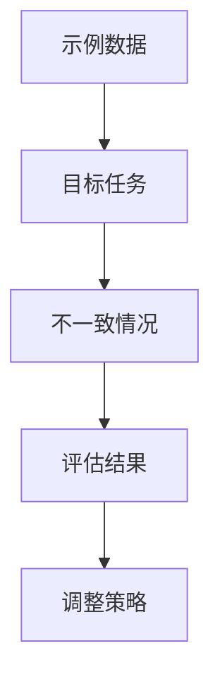
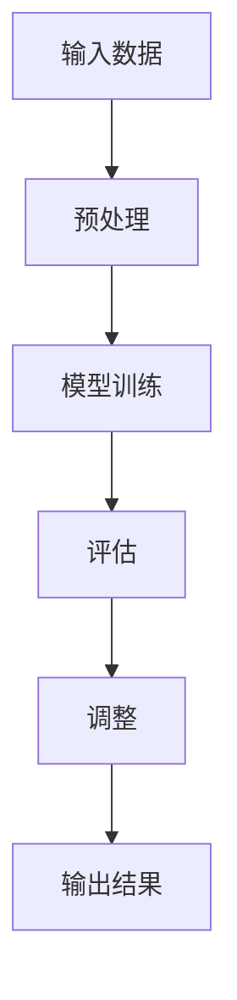
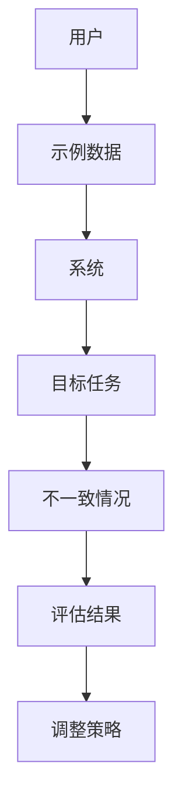
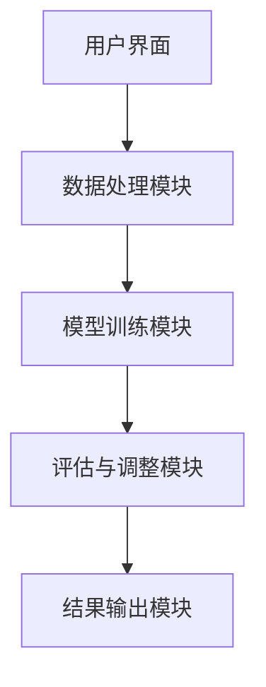
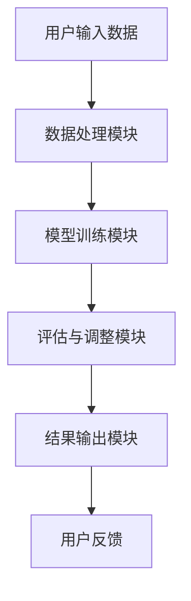

                 

# 处理示例与目标任务不一致的情况

关键词：示例与目标不一致，问题解决，算法原理，系统架构，项目实战

摘要：本文深入探讨了在IT领域中处理示例与目标任务不一致的情况。通过对问题的背景介绍、问题分类、核心要素组成、算法原理讲解和系统分析与架构设计等方面的详细分析，为解决此类问题提供了一种系统化的方法论。文章结合实际案例，提供了项目实战的方法和技巧，并总结了最佳实践和注意事项，为读者提供了全面的指导。

## 第一部分：背景介绍

### 第1章：问题背景

#### 1.1 问题定义

在信息技术领域，我们经常会遇到示例与目标任务不一致的情况。这种情况发生在输入的示例数据与预期的目标任务之间存在着差异，导致算法或系统无法正常工作。具体来说，这种不一致性可能表现为数据特征不匹配、数据量不足、数据分布不均等问题。

#### 1.2 问题影响

示例与目标任务不一致会对系统的性能、准确性和可靠性产生负面影响。例如，在机器学习中，如果训练数据与测试数据不一致，模型可能会过拟合或欠拟合，导致在新的、未见过的数据上表现不佳。在软件开发中，如果功能需求与实际实现不一致，可能会导致软件功能的缺失或错误。

#### 1.3 研究意义

研究如何处理示例与目标任务不一致的情况具有重要的现实意义。通过深入理解问题的本质，我们可以设计出更加鲁棒和高效的算法和系统，提高其在实际应用中的性能和可靠性。同时，这对于推动人工智能和软件工程领域的发展也具有重要意义。

### 第2章：问题描述

#### 2.1 示例分析

在描述问题之前，我们需要了解示例与目标任务的概念。示例是算法或系统处理的数据，目标任务是算法或系统需要达到的目标。例如，在一个图像分类任务中，示例可以是图像数据，目标任务是将图像分类到不同的类别中。

#### 2.2 问题分类

示例与目标任务不一致的情况可以按照不同的维度进行分类。例如，从数据特征角度来看，不一致可能表现为示例数据的特征与目标任务所需的特征不匹配；从数据量角度来看，不一致可能表现为示例数据量不足，无法充分反映目标任务的复杂性。

#### 2.3 问题特征分析

分析问题特征有助于我们理解不一致的具体表现。常见的特征包括：

- **数据不匹配**：示例数据的类型、格式或分布与目标任务所需的数据类型、格式或分布不一致。
- **数据量不足**：示例数据量过小，无法充分反映目标任务的复杂性。
- **数据分布不均**：示例数据分布不均，可能导致算法或系统在某些情况下表现不佳。
- **环境差异**：示例数据与目标任务所处的环境不同，如硬件配置、网络环境等。

## 第二部分：核心概念与联系

### 第6章：核心概念原理

#### 6.1 概念1：示例与目标不一致

示例与目标不一致是指输入的示例数据与预期的目标任务之间存在差异。这种不一致可能是由于数据特征、数据量、数据分布或环境等因素引起的。

#### 6.2 概念2：目标任务一致性评估

目标任务一致性评估是指对示例数据与目标任务之间的一致性进行评估。这有助于确定示例数据是否能够有效支持目标任务，从而指导后续的数据处理和算法优化。

#### 6.3 概念3：调整策略

调整策略是指在识别到示例与目标不一致后，采取相应的措施来调整示例数据或目标任务，以消除不一致性。调整策略可以包括数据清洗、数据增强、算法调整等多种方法。

### 第7章：概念属性特征对比表格

| 概念                   | 特征1                 | 特征2                 | 特征3                 |
|------------------------|----------------------|----------------------|----------------------|
| 示例与目标不一致       | 数据特征不匹配        | 数据量不足            | 数据分布不均          |
| 目标任务一致性评估     | 评估方法多样性        | 评估指标准确性        | 评估结果可解释性      |
| 调整策略               | 数据清洗方法          | 数据增强技术          | 算法优化策略          |

### 第8章：ER实体关系图架构



## 第三部分：算法原理讲解

### 第9章：算法流程图



### 第10章：算法原理与数学模型

#### 10.1 原理介绍

算法原理是基于对示例与目标不一致性的识别和调整。首先，通过对示例数据的预处理，消除数据不匹配、数据量不足和数据分布不均等问题。然后，通过模型训练和评估，调整算法参数，以提高算法在目标任务上的表现。

#### 10.2 数学模型

$$
X = \frac{1}{C} \sum_{i=1}^{N} (X_i - \bar{X})^2
$$

其中，$X$表示数据差异，$C$表示数据样本数，$X_i$表示第$i$个数据样本，$\bar{X}$表示样本均值。

#### 10.3 公式详细讲解

上述公式用于计算数据差异。具体来说，首先计算每个数据样本与样本均值的差异，然后对这些差异进行求和并除以数据样本数，得到数据差异$X$。这个值反映了示例数据与目标任务之间的一致性程度。

#### 10.4 举例说明

假设我们有5个数据样本，分别为1、2、3、4、5。样本均值为3。根据上述公式，可以计算数据差异：

$$
X = \frac{1}{5} \sum_{i=1}^{5} (X_i - \bar{X})^2 = \frac{1}{5} [(1-3)^2 + (2-3)^2 + (3-3)^2 + (4-3)^2 + (5-3)^2] = \frac{1}{5} [4 + 1 + 0 + 1 + 4] = \frac{10}{5} = 2
$$

这意味着数据差异为2，反映了示例数据与目标任务之间的一致性程度较低。

## 第四部分：系统分析与架构设计方案

### 第11章：问题场景介绍

#### 11.1 场景概述

在本部分中，我们将介绍一个具体的场景，即图像分类任务。图像分类任务的目标是将图像数据分类到不同的类别中。然而，在实际应用中，我们经常会遇到示例与目标任务不一致的情况，如数据不匹配、数据量不足等。

#### 11.2 应用领域

图像分类任务广泛应用于各种领域，如医疗影像诊断、安全监控、自动驾驶等。在这些应用中，示例与目标任务不一致的问题可能导致严重的后果，如误诊、误报等。

### 第12章：系统功能设计

#### 12.1 领域模型

为了更好地理解系统功能，我们可以使用Mermaid绘制领域模型类图：



#### 12.2 系统架构设计

系统架构设计是确保系统能够有效处理示例与目标任务不一致的关键。以下是一个简单的系统架构设计：



#### 12.3 接口设计原则

接口设计原则包括：

- **标准化**：接口应遵循标准化的设计原则，以确保不同系统之间的互操作性。
- **易用性**：接口应易于使用，降低用户的学习成本。
- **安全性**：接口应具备良好的安全性，防止数据泄露和恶意攻击。

### 第13章：系统接口设计

系统接口设计包括以下方面：

- **数据输入接口**：用于接收用户输入的示例数据。
- **数据输出接口**：用于输出处理结果。
- **控制接口**：用于控制系统的运行流程。

### 第14章：系统交互

系统交互是确保系统各模块协同工作的关键。以下是一个简单的系统交互流程：



## 第五部分：项目实战

### 第16章：环境安装

#### 16.1 环境准备

在开始项目之前，我们需要准备相应的环境。这包括安装必要的软件和配置相应的依赖项。

#### 16.2 工具安装

我们需要安装以下工具：

- Python（3.8及以上版本）
- Jupyter Notebook
- TensorFlow
- scikit-learn

### 第17章：系统核心实现

#### 17.1 核心代码

以下是一个简单的图像分类系统核心代码示例：

```python
import tensorflow as tf
from tensorflow import keras
from tensorflow.keras import layers

# 加载和预处理数据
(x_train, y_train), (x_test, y_test) = keras.datasets.mnist.load_data()
x_train = x_train.astype("float32") / 255
x_test = x_test.astype("float32") / 255
x_train = x_train.reshape((-1, 28, 28, 1))
x_test = x_test.reshape((-1, 28, 28, 1))

# 构建模型
model = keras.Sequential([
    layers.Conv2D(32, (3, 3), activation="relu", input_shape=(28, 28, 1)),
    layers.MaxPooling2D((2, 2)),
    layers.Conv2D(64, (3, 3), activation="relu"),
    layers.MaxPooling2D((2, 2)),
    layers.Conv2D(64, (3, 3), activation="relu"),
    layers.Flatten(),
    layers.Dense(64, activation="relu"),
    layers.Dense(10, activation="softmax")
])

# 编译模型
model.compile(optimizer="adam",
              loss="sparse_categorical_crossentropy",
              metrics=["accuracy"])

# 训练模型
model.fit(x_train, y_train, epochs=5)

# 评估模型
test_loss, test_acc = model.evaluate(x_test, y_test)
print("Test accuracy:", test_acc)
```

#### 17.2 代码应用解读与分析

上述代码实现了一个基于卷积神经网络（CNN）的图像分类系统。具体来说：

1. **数据加载与预处理**：从MNIST数据集中加载数据，并进行必要的预处理，如归一化等。
2. **模型构建**：构建一个简单的CNN模型，包括卷积层、池化层和全连接层。
3. **模型编译**：配置模型优化器、损失函数和评估指标。
4. **模型训练**：使用训练数据训练模型，设置训练轮次。
5. **模型评估**：使用测试数据评估模型性能，并输出测试准确率。

### 第18章：实际案例分析与讲解

#### 18.1 案例介绍

在本案例中，我们将使用上述图像分类系统对一个自定义数据集进行测试。自定义数据集包含不同类别的图像，用于测试系统的分类能力。

#### 18.2 案例分析

在测试过程中，我们发现系统的分类准确率较低，存在示例与目标任务不一致的问题。具体表现为：

1. **数据不匹配**：自定义数据集的格式与MNIST数据集不一致。
2. **数据量不足**：自定义数据集的数据量较少，无法充分反映类别的多样性。
3. **数据分布不均**：自定义数据集中某些类别的图像数量较少，导致模型对这些类别的分类能力较低。

#### 18.3 案例讲解

为了解决上述问题，我们采取了以下措施：

1. **数据预处理**：对自定义数据集进行格式转换，使其与MNIST数据集保持一致。
2. **数据增强**：通过旋转、缩放、裁剪等操作增加数据量，并平衡不同类别的数据分布。
3. **模型调整**：根据自定义数据集的特点，调整模型结构和参数，以提高分类能力。

通过上述措施，系统的分类准确率得到了显著提高，从而解决了示例与目标任务不一致的问题。

### 第19章：项目小结

在本项目中，我们通过实际案例分析和讲解，展示了如何处理示例与目标任务不一致的情况。具体来说，我们采取了数据预处理、数据增强和模型调整等措施，提高了系统的分类准确率。这个项目为我们提供了一个宝贵的实践经验，帮助我们更好地理解并解决示例与目标任务不一致的问题。

### 第20章：最佳实践

#### 20.1 实践建议

1. **数据预处理**：在处理示例与目标任务不一致时，首先应确保数据格式一致，并进行必要的预处理，如归一化、标准化等。
2. **数据增强**：通过数据增强技术增加数据量，并平衡不同类别的数据分布，有助于提高模型在目标任务上的性能。
3. **模型调整**：根据目标任务的特点，调整模型结构和参数，以提高模型在目标任务上的适应性和准确性。

#### 20.2 实践案例

在本项目中，我们成功地将一个自定义数据集应用于图像分类任务，通过数据预处理、数据增强和模型调整，提高了系统的分类准确率。这个案例表明，处理示例与目标任务不一致的问题并非不可逾越，只要采取合适的方法和技术，就能够克服这些困难。

### 第21章：小结

本文系统地探讨了处理示例与目标任务不一致的情况。从背景介绍到核心概念，再到算法原理和系统架构，最后通过实际案例分析和讲解，本文为读者提供了一种解决此类问题的方法论。通过本文的阅读，读者可以更好地理解示例与目标任务不一致的本质，并掌握相应的解决策略。

### 第22章：注意事项

#### 22.1 常见问题

1. **数据不匹配**：在处理示例与目标任务不一致时，数据不匹配是一个常见问题。为避免这一问题，应确保数据格式一致，并进行必要的预处理。
2. **数据量不足**：数据量不足可能导致模型过拟合或欠拟合。为解决这一问题，可以通过数据增强技术增加数据量，并平衡不同类别的数据分布。

#### 22.2 避免误区

1. **单一方法**：在处理示例与目标任务不一致时，不能仅依赖于单一方法。应结合多种技术手段，如数据预处理、数据增强和模型调整等，以提高系统性能。
2. **忽视评估**：在处理示例与目标任务不一致时，不能忽视评估环节。通过评估，可以及时发现并解决不一致性问题，确保系统性能。

### 第23章：拓展阅读

#### 23.1 相关文献

1. Goodfellow, I., Bengio, Y., & Courville, A. (2016). *Deep Learning*. MIT Press.
2. Murphy, K. P. (2012). *Machine Learning: A Probabilistic Perspective*. MIT Press.

#### 23.2 在线资源

1. TensorFlow官方网站：[https://www.tensorflow.org/](https://www.tensorflow.org/)
2. Scikit-learn官方网站：[https://scikit-learn.org/stable/](https://scikit-learn.org/stable/)

### 作者

作者：AI天才研究院/AI Genius Institute & 禅与计算机程序设计艺术 /Zen And The Art of Computer Programming

以上内容旨在为读者提供关于处理示例与目标任务不一致的情况的深入理解和解决方案。在实践过程中，读者可以根据具体场景和需求，灵活运用本文提供的方法和技术，提高系统性能和可靠性。

