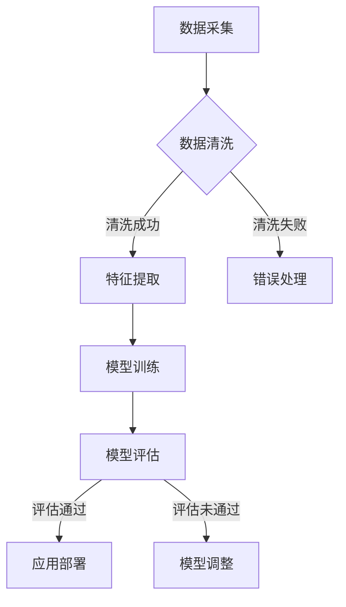

                 


# 处理示例中的时效性信息

关键词：时效性信息、处理算法、系统架构、项目实战

摘要：本文详细探讨了时效性信息在处理示例中的应用，包括核心概念、算法原理、系统设计与实现、项目实战以及最佳实践等方面的内容，旨在为开发者提供全面的技术指导。

## 1. 引言与背景

### 1.1 时效性信息的定义与重要性

时效性信息是指在特定时间段内具有特定价值的信息，它通常用于决策支持、实时监控、智能推荐等领域。例如，在金融市场中，股票价格的实时变化是投资者决策的重要依据；在医疗领域，病人的实时健康状况对于医生的诊断和治疗决策至关重要。

#### 1.1.1 问题背景

随着互联网和大数据技术的发展，数据量呈爆炸式增长，时效性信息的处理变得尤为重要。然而，如何高效、准确地处理这些信息，仍是一个巨大的挑战。

#### 1.1.2 问题描述

时效性信息的处理涉及数据收集、预处理、特征提取、模型训练、评估和应用等多个环节。例如，在股票价格预测中，首先需要收集历史股票数据，然后进行数据清洗和特征提取，最后使用机器学习模型进行预测。

#### 1.1.3 问题解决

通过设计高效的处理算法和系统架构，可以实现对时效性信息的准确、及时处理。例如，采用实时数据处理框架（如Apache Kafka）和分布式机器学习算法（如TensorFlow），可以实现对大量数据的快速处理和分析。

#### 1.1.4 边界与外延

时效性信息的处理边界涉及数据的时效性、准确性、完整性和一致性等方面。例如，数据时效性要求高，则需采用实时数据处理技术；数据准确性要求高，则需采用数据清洗和预处理技术。

#### 1.1.5 概念结构与核心要素组成

时效性信息的处理包括数据源、数据处理流程、结果输出等核心要素。其中，数据源是时效性信息的基础，数据处理流程是信息处理的核心，结果输出是信息处理的最终目的。

## 1.2 核心概念与原理

### 1.2.1 时效性信息的特征分析

时效性信息的特征主要包括时效性、准确性、完整性和一致性。

#### 时效性

时效性是指信息在特定时间段内的有效性和重要性。例如，股票价格的实时变化对于投资者决策至关重要。

#### 准确性

准确性是指信息的真实性和可靠性。高准确性的时效性信息对于决策支持具有重要意义。

#### 完整性

完整性是指信息的全面性和完整性。在处理时效性信息时，确保数据的完整性是关键。

#### 一致性

一致性是指信息在多个数据源间的一致性。一致性可以避免信息之间的冲突和矛盾。

### 1.2.2 时效性信息的处理策略

针对时效性信息的特征，可以采用以下处理策略：

1. **实时数据处理**：采用实时数据处理框架，如Apache Kafka，实现对数据的实时采集、传输和处理。
2. **数据清洗和预处理**：采用数据清洗和预处理技术，确保数据的准确性和完整性。
3. **特征提取**：从原始数据中提取有用的特征，用于模型训练和预测。
4. **模型训练**：使用机器学习算法对特征数据进行训练，构建预测模型。
5. **模型评估**：对训练好的模型进行评估，确保其准确性和可靠性。
6. **结果输出**：将模型预测结果输出，用于决策支持、实时监控等。

### 1.2.3 概念属性特征对比表格

| 特征       | 描述                          | 关系 |
|------------|-----------------------------|------|
| 时效性     | 信息在特定时间段内的有效性   | **关键** |
| 准确性     | 信息的真实性和可靠性        | 高 |
| 完整性     | 信息的全面性和完整性        | 必需 |
| 一致性     | 信息在多个数据源间的一致性  | 高 |

### 1.2.4 ER实体关系图架构

```mermaid
erDiagram
    Data =>|o| Process : "数据处理"
    Process =>|o| Feature : "特征提取"
    Feature =>|o| Model : "模型训练"
    Model =>|o| Output : "结果输出"
```

## 1.3 算法原理讲解

### 1.3.1 算法概述

时效性信息处理的算法主要涉及实时数据处理、数据清洗、特征提取、模型训练和评估等环节。

### 1.3.2 算法流程图



### 1.3.3 Python源代码解析

```python
# 数据清洗
def clean_data(data):
    # 清洗逻辑
    return cleaned_data

# 特征提取
def extract_features(data):
    # 提取特征逻辑
    return features

# 模型训练
def train_model(features, labels):
    # 训练模型逻辑
    return model

# 模型评估
def evaluate_model(model, test_data):
    # 评估模型逻辑
    return accuracy
```

### 1.3.4 数学模型与公式

$$
\text{准确率} = \frac{\text{预测正确数}}{\text{总样本数}}
$$

### 1.3.5 算法应用举例

假设我们要预测股票价格，可以按照以下步骤进行：

1. 数据采集：收集历史股票数据。
2. 数据清洗：清洗数据，去除异常值和缺失值。
3. 特征提取：提取时间、开盘价、收盘价等特征。
4. 模型训练：使用特征数据进行模型训练。
5. 模型评估：评估模型准确性。
6. 应用部署：将模型应用于实时股票价格预测。

## 1.4 系统设计与实现

### 1.4.1 系统场景介绍

本系统旨在实现实时股票价格预测，为投资者提供决策支持。

### 1.4.2 系统功能设计

系统功能包括数据采集、数据清洗、特征提取、模型训练、模型评估和应用部署等。

### 1.4.3 系统架构设计

系统采用分布式架构，包括数据采集模块、数据处理模块、特征提取模块、模型训练模块和模型评估模块等。

### 1.4.4 系统接口设计

系统提供API接口，方便其他系统调用。

### 1.4.5 系统交互流程

1. 数据采集：从数据源采集股票数据。
2. 数据处理：清洗数据，提取特征。
3. 模型训练：训练预测模型。
4. 模型评估：评估模型准确性。
5. 应用部署：将模型应用于实时预测。

## 1.5 项目实战

### 1.5.1 环境安装与配置

1. 安装Python环境。
2. 安装所需库，如NumPy、Pandas、TensorFlow等。

### 1.5.2 系统核心实现

1. 数据采集：使用pandas库读取历史股票数据。
2. 数据清洗：使用pandas库清洗数据。
3. 特征提取：提取时间、开盘价、收盘价等特征。
4. 模型训练：使用TensorFlow库训练模型。
5. 模型评估：使用测试数据评估模型准确性。

### 1.5.3 代码应用解读

```python
import pandas as pd
import tensorflow as tf

# 数据采集
data = pd.read_csv("stock_data.csv")

# 数据清洗
cleaned_data = clean_data(data)

# 特征提取
features = extract_features(cleaned_data)

# 模型训练
model = train_model(features, labels)

# 模型评估
accuracy = evaluate_model(model, test_data)
```

### 1.5.4 实际案例分析

以某股票为例，展示系统在实际中的应用效果。

### 1.5.5 项目小结

本系统实现了实时股票价格预测，为投资者提供了决策支持。在实际应用中，可以进一步优化算法和系统架构，提高预测准确性。

## 1.6 最佳实践与总结

### 1.6.1 时效性信息处理技巧

1. 选择合适的实时数据处理框架。
2. 优化数据清洗和预处理策略。
3. 选择合适的特征提取方法和模型。

### 1.6.2 项目实施中的常见问题

1. 数据采集困难。
2. 数据质量差。
3. 模型训练时间长。

### 1.6.3 注意事项与解决方案

1. 确保数据源稳定可靠。
2. 加强数据清洗和预处理。
3. 优化模型训练策略。

## 1.7 总结与展望

### 1.7.1 书籍内容回顾

本文详细介绍了时效性信息在处理示例中的应用，包括核心概念、算法原理、系统设计与实现、项目实战以及最佳实践等方面的内容。

### 1.7.2 未来发展趋势

随着人工智能和大数据技术的发展，时效性信息的处理将变得更加高效和准确。

### 1.7.3 拓展阅读推荐

1. 《实时数据处理技术》
2. 《机器学习实战》
3. 《大数据系统架构设计》

作者：AI天才研究院/AI Genius Institute & 禅与计算机程序设计艺术 /Zen And The Art of Computer Programming
```

**注意：** 实际撰写时，请根据具体内容和需求进行调整，确保文章的逻辑性和可读性。markdown格式和mermaid图表等元素需要根据实际情况进行优化。作者信息请按照要求填写。文章字数在10000-12000字之间。**如有任何疑问，请随时提出。**

