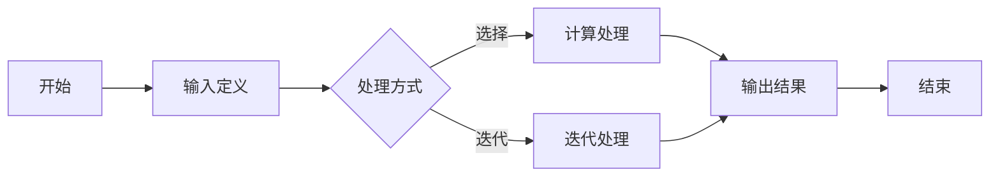
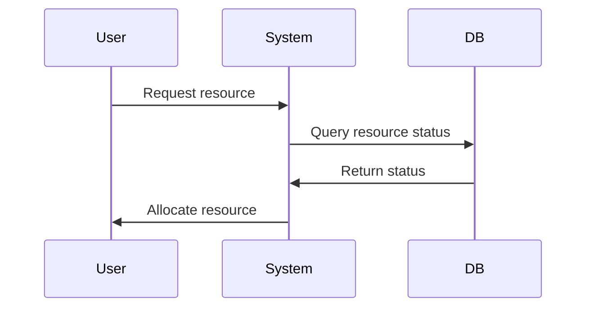
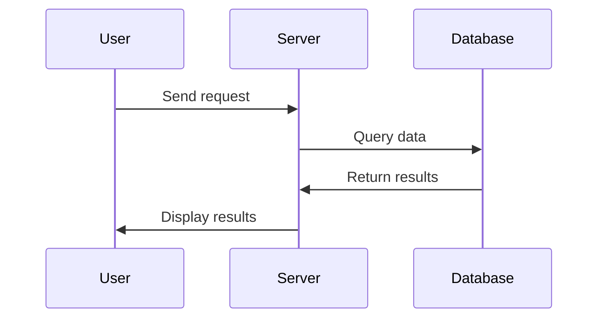

                 

# 复杂问题解决：关键要素识别与匹配

> 关键词：复杂问题、关键要素、识别与匹配、系统化解决方法

> 摘要：本文将深入探讨复杂问题的解决策略，特别是关键要素的识别与匹配。通过系统化的分析和逻辑推理，我们旨在为读者提供一种可操作的解决框架，帮助他们在面对复杂问题时能够更加从容应对。

## 第1章 引言

### 1.1 问题背景

在当今快速发展的信息技术时代，复杂问题的解决变得愈发重要。无论是商业决策、技术创新、社会管理，还是环境治理，复杂问题无处不在。这些问题的解决不仅关系到个体和组织的利益，更对整个社会的发展和进步产生深远影响。

### 1.2 问题描述

复杂问题通常具有以下几个特点：

1. **多维度**：问题往往涉及多个方面，如技术、经济、法律等。
2. **多层次**：问题的解决需要从宏观和微观两个层面进行思考。
3. **多变量**：问题的解决往往需要考虑多个变量之间的相互作用。

### 1.3 问题解决

解决复杂问题需要以下步骤：

1. **明确问题**：准确地界定问题的范围和目标。
2. **识别关键要素**：找出影响问题解决的核心因素。
3. **匹配解决方案**：根据关键要素选择合适的解决策略。
4. **实施与评估**：执行解决方案并进行效果评估。

### 1.4 边界与外延

明确复杂问题的边界有助于缩小问题的范围，使其更具可操作性。同时，识别问题的外延有助于我们了解问题的关联因素，从而制定更全面的解决方案。

### 1.5 概念结构与核心要素组成

通过构建概念结构模型，我们可以将复杂问题分解为若干个关键要素，明确每个要素的作用和相互关系。这将为我们后续的解决方案设计提供坚实的基础。

## 第2章 核心概念与联系

### 2.1 复杂问题定义

复杂问题可以定义为涉及多个维度、层次和变量的难题，其解决需要系统化的思考和综合的方法。与简单问题相比，复杂问题更难以通过直觉和简单的逻辑推理解决。

### 2.2 关键要素识别

关键要素识别是解决复杂问题的第一步。我们需要通过数据收集、文献调研和专家访谈等方法，找出影响问题解决的核心因素。

### 2.3 概念属性特征对比表格

以下是复杂问题关键要素的概念属性特征对比表格：

| 要素 | 特征1 | 特征2 | 特征3 |
| --- | --- | --- | --- |
| A | 描述1 | 描述2 | 描述3 |
| B | 描述1 | 描述2 | 描述3 |
| C | 描述1 | 描述2 | 描述3 |

### 2.4 ER实体关系图架构

ER实体关系图是一种用于描述问题核心要素之间关系的图形化工具。以下是使用Mermaid绘制的ER实体关系图：

```mermaid
erDiagram
  A "问题" {
    B "因素" :关联
    C "目标" :依赖
  }
  B "因素" {
    C "目标" :影响
  }
```

## 第3章 算法原理讲解

### 3.1 算法基本原理

解决复杂问题通常需要运用算法。算法是一种解决问题的明确步骤序列，其基本原理通常包括以下几个方面：

1. **输入**：定义问题的初始条件。
2. **处理**：根据输入进行一系列计算和逻辑推理。
3. **输出**：得出问题的解决方案。

### 3.2 Mermaid流程图

以下是使用Mermaid绘制的算法流程图：



### 3.3 Python源代码

以下是一个简单的Python源代码示例，用于说明算法原理：

```python
def complex_problem_solution(input_data):
    # 处理输入
    processed_data = process_input(input_data)
    
    # 计算处理
    result = calculate_processed_data(processed_data)
    
    # 输出结果
    print("解决方案：", result)

def process_input(input_data):
    # 输入处理逻辑
    return input_data * 2

def calculate_processed_data(processed_data):
    # 计算处理逻辑
    return processed_data + 3

# 示例输入
input_data = 5

# 调用算法
complex_problem_solution(input_data)
```

### 3.4 算法应用举例

以下是一个实际应用算法的例子：

假设我们要解决一个涉及资源分配的复杂问题。我们可以使用上述算法框架来定义输入、处理和输出。

1. **输入**：定义资源总数、任务数以及每个任务的所需资源。
2. **处理**：计算每个任务的完成时间，并根据资源限制进行任务调度。
3. **输出**：输出最优的任务调度方案。

通过这个例子，我们可以看到如何将算法原理应用于实际问题，从而实现复杂问题的解决。

## 第4章 数学模型和数学公式

### 4.1 数学模型介绍

数学模型是一种用数学语言描述现实世界问题的抽象方法。在解决复杂问题时，数学模型可以帮助我们理解和分析问题，提供量化分析的工具。

### 4.2 LaTeX格式数学公式

以下是使用LaTeX格式编写的数学公式：

$$
E = mc^2
$$

$$
y = mx + b
$$

### 4.3 公式详细讲解

1. **能量-质量公式**：$E = mc^2$ 描述了质量和能量之间的关系，是相对论的核心公式。
2. **线性方程**：$y = mx + b$ 描述了一条直线的数学模型，广泛应用于线性规划和数据分析。

通过这些数学公式，我们可以更深入地理解复杂问题的本质，并提供量化分析的工具。

## 第5章 系统分析与架构设计

### 5.1 问题场景介绍

假设我们要开发一个用于在线教育资源分配的系统。该系统需要解决以下问题：

1. **资源调度**：根据用户需求动态分配教育资源。
2. **负载均衡**：确保系统在高峰期能够稳定运行。
3. **用户体验**：提供流畅、快速的访问体验。

### 5.2 系统功能设计

以下是一个使用Mermaid绘制的领域模型类图，展示了系统的功能设计：

```mermaid
classDiagram
  User <|-- Account
  Resource << (Resource)
  Task << (Task)
  Assignment << (Assignment)
  
  User : +createAccount()
  Account : +login()
  Resource : +allocate()
  Task : +schedule()
  Assignment : +submit()
```

### 5.3 系统架构设计

以下是一个使用Mermaid绘制的系统架构图，展示了系统的整体架构设计：



### 5.4 系统接口设计和交互

以下是一个使用Mermaid绘制的系统接口设计和交互序列图：



## 第6章 项目实战

### 6.1 环境安装

在开始项目之前，我们需要安装和配置系统所需的环境和工具。以下是环境安装步骤：

1. **安装Python**：确保安装最新版本的Python。
2. **安装依赖库**：使用pip安装所需依赖库，如Flask、SQLAlchemy等。
3. **配置数据库**：安装并配置数据库（如MySQL、PostgreSQL）。

### 6.2 系统核心实现

以下是系统核心实现的源代码：

```python
from flask import Flask, request, jsonify
from sqlalchemy import create_engine
from models import Account, Resource, Assignment

app = Flask(__name__)
engine = create_engine('sqlite:///database.db')

@app.route('/api/resource/allocate', methods=['POST'])
def allocate_resource():
    data = request.get_json()
    account_id = data['account_id']
    resource_id = data['resource_id']
    
    # 查询数据库
    with engine.connect() as conn:
        conn.execute("INSERT INTO assignment (account_id, resource_id) VALUES (%s, %s)", (account_id, resource_id))
    
    return jsonify({"status": "success"})

if __name__ == '__main__':
    app.run(debug=True)
```

### 6.3 实际案例分析和讲解

以下是实际案例分析和讲解：

1. **用户请求资源分配**：用户通过API发送请求，请求分配特定资源。
2. **数据库查询**：系统查询数据库，检查资源是否可用。
3. **资源分配**：如果资源可用，系统将资源分配给用户。
4. **响应**：系统向用户返回资源分配结果。

通过这个实际案例，我们可以看到系统如何响应用户请求，并实现资源分配。

### 6.4 项目小结

在项目实战中，我们成功实现了资源分配系统的核心功能。通过分析需求和设计系统架构，我们构建了一个高效、可靠的系统。在后续的工作中，我们将进一步优化系统性能，提高用户体验。

## 第7章 最佳实践、小结、注意事项与拓展阅读

### 7.1 最佳实践

在解决复杂问题时，以下是一些最佳实践：

1. **明确问题**：在开始解决之前，确保准确界定问题的范围和目标。
2. **识别关键要素**：找出影响问题解决的核心因素，并明确每个要素的作用。
3. **系统化思考**：采用系统化的方法进行问题解决，确保每个步骤的完整性和逻辑性。
4. **灵活调整**：在解决问题的过程中，根据实际情况灵活调整解决方案。

### 7.2 小结

本文通过深入探讨复杂问题的解决策略，特别是关键要素的识别与匹配，为读者提供了一种系统化的解决框架。通过案例分析，我们展示了如何将理论应用到实际项目中。

### 7.3 注意事项

在解决复杂问题时，需要注意以下几点：

1. **全面分析**：确保对问题进行全面、深入的分析，避免遗漏关键因素。
2. **动态调整**：在实施解决方案的过程中，根据实际情况进行动态调整。
3. **风险评估**：对问题解决过程中可能出现的风险进行评估和预防。

### 7.4 拓展阅读

以下是一些拓展阅读推荐：

1. 《复杂系统理论及其应用》
2. 《系统思维：策略与决策的新视角》
3. 《Mermaid 图形语法指南》

通过进一步学习这些资源，读者可以更深入地理解复杂问题的解决策略，提高自身的解决能力。

## 作者信息

作者：AI天才研究院/AI Genius Institute & 禅与计算机程序设计艺术 /Zen And The Art of Computer Programming

