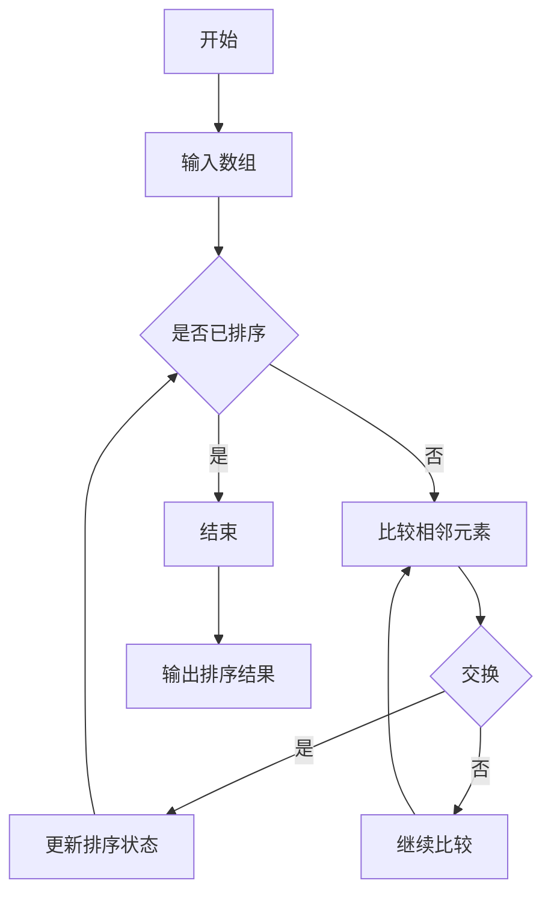

                 

### 《复杂问题解题过程中关键要素的识别和总结》

#### 关键词：
- 复杂问题
- 关键要素
- 解决方案
- 算法原理
- 系统架构

#### 摘要：
本文将探讨复杂问题在解决过程中关键要素的识别和总结。通过深入分析问题背景、核心概念、算法原理以及系统架构设计，我们希望能够为读者提供一套系统化的解题方法论。文章分为五个部分，从背景介绍到最佳实践，全面解析复杂问题的解决之道。

## 目录大纲设计思路

### 1. 确定整体结构

在设计《复杂问题解题过程中关键要素的识别和总结》这本书的目录大纲时，我们首先明确了书籍的整体结构。本书将分为五个主要部分：背景介绍与核心概念、算法原理讲解、系统分析与架构设计、项目实战以及最佳实践与拓展。每个部分都有明确的主题和目标，以确保内容的连贯性和系统性。

### 2. 细化章节内容

在明确了整体结构后，我们对每个章节进行了细化。具体来说，每个章节都进一步分解成小节，每个小节都有明确的主题和内容。例如，在“核心概念与联系”章节中，我们首先定义了关键要素的概念和属性，然后介绍了识别方法及其关系。这种细致的划分有助于读者更好地理解和掌握知识点。

### 3. 核心概念与联系

为了帮助读者更好地理解复杂问题的解决过程，我们特别设计了一个核心概念与联系的章节。这个章节不仅详细介绍了核心概念的定义和特征，还包括了概念属性特征对比表格和ER实体关系图。通过这些图表和表格，读者可以直观地看到各个概念之间的关系，从而更好地把握问题的本质。

### 4. 算法原理讲解

在“算法原理讲解”章节中，我们重点介绍了复杂问题解法的基本算法原理。这部分内容不仅包括算法原理的概述和分类，还详细讲解了常见算法的适用场景。为了使读者更易于理解，我们使用了Mermaid流程图和Python代码示例来辅助说明。

### 5. 系统分析与架构设计方案

“系统分析与架构设计方案”章节是本书的核心部分之一。在这一章节中，我们首先介绍了问题场景，然后详细设计了系统功能、架构、接口以及交互流程。通过这一章，读者可以了解如何从系统层面解决复杂问题。

### 6. 项目实战

在“项目实战”章节中，我们通过具体的案例展示了如何将所学知识应用于实际项目中。这一章节不仅包含了环境安装和系统实现的源代码，还对代码进行了详细解读和分析。通过这一章，读者可以深入了解复杂问题的解决过程。

### 7. 最佳实践与拓展

最后，“最佳实践与拓展”章节为读者提供了解决复杂问题的最佳实践、小结、注意事项以及拓展阅读等内容。这些内容旨在帮助读者更好地理解和应用所学知识，提高解决复杂问题的能力。

## 目录大纲

```markdown
# 《复杂问题解题过程中关键要素的识别和总结》目录大纲

## 第一部分：背景介绍与核心概念

### 第1章 问题背景与定义

#### 1.1 复杂问题的现状与挑战
- 复杂问题的定义
- 复杂问题在各个领域的影响

#### 1.2 复杂问题的分类
- 结构化复杂问题
- 非结构化复杂问题
- 半结构化复杂问题

#### 1.3 复杂问题解决方法概述
- 传统方法
- 现代方法
- 跨学科方法

### 第2章 核心概念与联系

#### 2.1 关键要素的定义与属性
- 关键要素的分类
- 关键要素的属性特征对比表

#### 2.2 关键要素的识别方法
- 数据分析
- 专家评审
- 软件工具辅助

#### 2.3 关键要素之间的关系
- Mermaid ER实体关系图
- 关键要素的相互影响

## 第二部分：算法原理讲解

### 第3章 复杂问题解法的基本算法原理

#### 3.1 算法原理概述
- 算法的定义与作用
- 算法的分类

#### 3.2 常见算法介绍
- 描述与解释
- 适用场景

### 第4章 算法原理与数学模型

#### 4.1 数学模型的重要性
- 数学模型的作用
- 数学模型在复杂问题解决中的应用

#### 4.2 常见数学模型介绍
- 描述与解释
- 数学公式
- Python代码示例

### 第5章 算法原理与Mermaid流程图

#### 5.1 Mermaid流程图的基础知识
- Mermaid的基本语法
- Mermaid在算法中的应用

#### 5.2 算法原理的Mermaid流程图
- 各个算法的Mermaid流程图

## 第三部分：系统分析与架构设计

### 第6章 系统分析与架构设计概述

#### 6.1 问题场景介绍
- 问题背景
- 解决方案目标

#### 6.2 系统功能设计
- 功能模块划分
- 功能说明

### 第7章 系统架构设计

#### 7.1 系统架构概述
- 架构设计原则
- 系统架构的组成部分

#### 7.2 系统架构图
- Mermaid架构图

#### 7.3 系统接口设计
- 接口定义
- 接口流程

### 第8章 系统交互设计与实现

#### 8.1 系统交互设计
- 交互流程图

#### 8.2 系统实现源代码
- Python代码示例

#### 8.3 代码解读与分析
- 代码结构
- 关键代码解读

## 第四部分：项目实战

### 第9章 项目实战环境搭建

#### 9.1 环境安装
- 开发环境配置
- 工具安装

### 第10章 项目核心实现

#### 10.1 系统核心实现源代码
- 源代码结构
- 关键代码实现

#### 10.2 代码应用解读与分析
- 代码功能解读
- 应用场景分析

### 第11章 项目案例分析

#### 11.1 复杂问题实例
- 实例背景
- 实例分析

#### 11.2 项目成果展示
- 解决方案
- 效果评估

## 第五部分：最佳实践与拓展

### 第12章 最佳实践

#### 12.1 经验总结
- 解决复杂问题的常见误区
- 解决复杂问题的最佳实践

### 第13章 小结与注意事项

#### 13.1 小结
- 本书的核心要点
- 对复杂问题解决方法的思考

#### 13.2 注意事项
- 解决复杂问题时的注意事项
- 避免常见错误

### 第14章 拓展阅读

#### 14.1 相关书籍推荐
- 推荐书籍列表
- 书籍简介

#### 14.2 拓展研究
- 未来研究方向
- 延伸问题探讨
```

通过以上目录大纲的设计，我们希望读者能够系统地掌握复杂问题的解决方法，并能够灵活地应用于实际项目中。接下来，我们将逐一深入探讨每个章节的具体内容，以便为读者提供更为详细和实用的指导。 

## 第1章 问题背景与定义

复杂问题是我们日常工作和生活中常见的问题类型，它们具有多样性、不确定性、动态性和高度相关性的特点。这些特点使得复杂问题在解决过程中面临诸多挑战。首先，我们需要明确复杂问题的定义及其在各个领域的影响。

### 1.1 复杂问题的定义

复杂问题通常指的是那些难以用简单的模型或方法进行描述和解决的问题。这些问题往往涉及多个变量和因素，且这些因素之间存在复杂的相互作用关系。具体来说，复杂问题具有以下特征：

1. **多样性**：复杂问题可能涉及多个领域或子领域，需要综合考虑多种因素。
2. **不确定性**：在解决复杂问题时，我们往往无法完全掌握所有相关信息，这使得问题具有不确定性。
3. **动态性**：复杂问题的环境可能随时发生变化，需要不断调整解决方案。
4. **高度相关性**：复杂问题中的各个因素相互影响，形成一个复杂的相互作用网络。

### 1.2 复杂问题在各个领域的影响

复杂问题不仅在理论上具有挑战性，也在实际应用中产生了广泛的影响。以下是一些领域中的复杂问题及其影响：

1. **科学研究**：科学研究中的许多问题，如气候变化、量子计算等，都属于复杂问题的范畴。解决这些问题的难度不仅在于理论的复杂性，还在于实验验证的难度。
2. **工程技术**：在工程技术领域，复杂问题的解决往往需要跨学科的协作。例如，智能交通系统需要综合考虑交通流量、道路状况、车辆性能等多个因素。
3. **企业管理**：企业在运营过程中也会面临许多复杂问题，如供应链管理、市场策略等。这些问题的解决不仅需要数据分析，还需要对市场趋势和竞争环境的深刻理解。
4. **社会问题**：社会问题，如环境保护、医疗资源分配等，也具有复杂性的特点。解决这些问题需要政府、企业和社会各界的共同努力。

### 1.3 复杂问题解决方法概述

为了解决复杂问题，我们通常采用以下几种方法：

1. **传统方法**：包括分解问题、逐步优化等。这种方法在处理简单问题时效果显著，但在处理复杂问题时可能无法完全解决问题。
2. **现代方法**：如机器学习、人工智能等。这些方法利用计算机算法和大数据分析技术，能够处理复杂问题并提供可能的解决方案。
3. **跨学科方法**：通过整合不同领域的知识，如经济学、心理学、计算机科学等，来解决复杂问题。这种方法能够提供更全面和深入的理解。

总的来说，解决复杂问题需要综合考虑多种方法，并结合实际情况进行选择。接下来，我们将进一步探讨复杂问题的分类及其解决方法。

## 第2章 核心概念与联系

在解决复杂问题的过程中，识别和理解关键要素是至关重要的。关键要素是影响问题解决的核心因素，它们之间的关系决定了问题的复杂性和解决方案的有效性。本章节将详细介绍关键要素的定义、分类及其相互关系。

### 2.1 关键要素的定义与属性

关键要素是指在复杂问题解决过程中具有决定性作用的因素。这些要素可以是数据、信息、技术、人员等，它们共同构成了问题的核心。关键要素具有以下属性：

1. **决定性**：关键要素对问题的解决具有决定性作用，其变化可能导致问题的根本性改变。
2. **多样性**：关键要素可以是多个维度或层面的，涉及不同的因素和变量。
3. **相关性**：关键要素之间通常存在复杂的相互作用关系，一个要素的变化可能影响其他要素的表现。
4. **动态性**：关键要素可能会随着时间、环境或条件的变化而变化。

### 2.2 关键要素的分类

根据关键要素的性质和作用，我们可以将其分为以下几类：

1. **数据要素**：包括数据质量、数据来源、数据结构等，这些要素直接影响问题的分析结果。
2. **技术要素**：涉及所采用的技术、算法、工具等，这些要素决定了问题的解决方案的技术可行性。
3. **人员要素**：包括参与问题解决的团队成员、他们的专业知识、经验等，这些要素影响了团队的合作效率和解决问题的能力。
4. **环境要素**：包括问题的外部环境、政策、市场等，这些要素可能对问题解决的进程和结果产生重要影响。
5. **资源要素**：包括所需的时间、资金、设备等资源，这些要素决定了问题解决的资源约束。

### 2.3 关键要素的识别方法

识别关键要素是解决复杂问题的重要步骤。以下几种方法可以帮助我们有效地识别关键要素：

1. **数据分析**：通过对问题相关的数据进行详细分析，找出其中可能影响问题解决的关键因素。
2. **专家评审**：邀请领域专家对问题进行评估，利用他们的专业知识和经验识别关键要素。
3. **软件工具辅助**：利用专门的软件工具，如决策支持系统、建模工具等，辅助识别关键要素。

### 2.4 关键要素之间的关系

关键要素之间的关系是复杂问题解决过程中需要重点考虑的。它们之间的相互作用和影响决定了问题的复杂性和解决方案的可行性。以下是关键要素之间的一些主要关系：

1. **相互依存**：某些关键要素之间可能存在相互依存的关系，一个要素的变化可能导致其他要素的相应变化。
2. **非线性关系**：关键要素之间的关系通常不是线性的，而是存在复杂的非线性关系。
3. **层次结构**：关键要素可以按照层次结构进行组织，从宏观层面到微观层面，形成一个层次分明的体系。

### 2.5 Mermaid ER实体关系图

为了更直观地展示关键要素之间的关系，我们可以使用Mermaid ER实体关系图。以下是关键要素之间的Mermaid ER实体关系图示例：

```mermaid
erDiagram
    Node1 ||--|{ Node2 }
    Node1 ||--|{ Node3 }
    Node2 ||--|{ Node4 }
    Node3 ||--|{ Node5 }
```

在这个示例中，`Node1`、`Node2`、`Node3` 和 `Node4` 分别表示不同的关键要素，它们之间存在一定的关联关系。通过这种关系图，我们可以更清晰地理解关键要素之间的相互作用。

综上所述，核心概念与联系在解决复杂问题过程中起着至关重要的作用。通过识别和理解关键要素及其相互关系，我们可以更好地把握问题的本质，为问题的解决提供有效的指导。

## 第3章 复杂问题解法的基本算法原理

在解决复杂问题时，算法原理起到了关键作用。算法是一系列解决问题的步骤，它们可以被用于优化资源、提高效率、减少错误等。在这一章节中，我们将探讨复杂问题解法的基本算法原理，包括算法的定义、分类以及常见算法的介绍。

### 3.1 算法的定义与作用

算法是一种解决问题的步骤序列，它具有以下特点：

1. **确定性**：算法的每一步都是明确的，不会产生随机性。
2. **有效性**：算法能够在有限的时间内解决问题。
3. **可终止性**：算法必须能够终止，不会无限循环。

算法在解决复杂问题中的作用主要体现在以下几个方面：

1. **优化资源使用**：算法可以帮助我们高效地利用计算资源，如时间和内存。
2. **提高解决问题的效率**：通过算法，我们可以更快地找到问题的解决方案。
3. **减少错误**：算法可以帮助我们避免在解决问题过程中出现错误。

### 3.2 算法的分类

算法可以根据不同的标准进行分类。以下是一些常见的算法分类方法：

1. **按应用领域分类**：算法可以分为通用算法和特定领域算法。通用算法适用于各种领域，如排序算法、搜索算法等；特定领域算法则针对特定领域的问题设计，如遗传算法在优化问题中的应用。
2. **按解决问题的方法分类**：算法可以分为确定性算法和非确定性算法。确定性算法在每一步都有明确的规则，如排序算法；非确定性算法则允许一定的随机性，如随机化算法。
3. **按实现方式分类**：算法可以分为算法描述、算法流程图和算法实现。算法描述是最抽象的形式，算法流程图则更直观地展示了算法的执行过程，算法实现是将算法具体化为可执行代码。

### 3.3 常见算法介绍

以下是一些在复杂问题解决中常用的算法：

1. **排序算法**：排序算法用于将数据按照特定的顺序排列。常见的排序算法有冒泡排序、选择排序、插入排序、快速排序等。这些算法在处理大量数据时具有不同的效率和稳定性。

2. **搜索算法**：搜索算法用于在数据集合中查找特定元素。常见的搜索算法有线性搜索、二分搜索等。线性搜索是最简单的搜索算法，它逐个比较数据元素；二分搜索则利用数据集合的有序性，每次将数据集合分为一半进行搜索，效率更高。

3. **优化算法**：优化算法用于寻找最优解。常见的优化算法有遗传算法、模拟退火算法等。这些算法通过模拟自然进化过程或物理过程，逐步逼近最优解。

4. **机器学习算法**：机器学习算法用于从数据中学习模式和规律。常见的机器学习算法有线性回归、决策树、神经网络等。这些算法在数据分析、预测、分类等领域有广泛应用。

### 3.4 适用场景

每种算法都有其适用的场景，选择合适的算法对于解决复杂问题至关重要。以下是一些常见算法的适用场景：

1. **排序算法**：适用于需要对数据进行排序的场景，如数据库排序、网页排序等。
2. **搜索算法**：适用于需要查找特定元素的场景，如搜索引擎、路径查找等。
3. **优化算法**：适用于需要寻找最优解的场景，如资源分配、路径规划等。
4. **机器学习算法**：适用于需要从数据中学习模式和规律的场景，如图像识别、语音识别等。

通过了解算法的定义、分类和适用场景，我们可以更好地选择和设计算法来解决复杂问题。接下来，我们将探讨算法原理与数学模型的关系，进一步理解算法的核心原理。

### 第4章 算法原理与数学模型

在解决复杂问题时，算法原理和数学模型是两个不可或缺的组成部分。算法原理为我们提供了解决问题的步骤和方法，而数学模型则为这些方法提供了理论基础和量化工具。在这一章节中，我们将探讨算法原理与数学模型的关系，并详细介绍常见数学模型及其Python代码示例。

#### 4.1 数学模型的重要性

数学模型在复杂问题解决中的作用至关重要。它不仅能够帮助我们理解和描述问题，还可以通过量化方法提供解决问题的具体步骤和预测结果。具体来说，数学模型的重要性体现在以下几个方面：

1. **提供理论基础**：数学模型为算法原理提供了坚实的理论基础，使得算法设计更加科学和严谨。
2. **量化分析**：通过数学模型，我们可以对问题的各个方面进行量化分析，从而更准确地评估算法的性能和效果。
3. **优化决策**：数学模型可以帮助我们找到最优解或次优解，为决策提供科学依据。
4. **预测与控制**：数学模型可以预测问题的未来发展趋势，从而实现问题的动态控制和优化。

#### 4.2 常见数学模型介绍

在复杂问题解决中，常见的数学模型包括线性模型、非线性模型、概率模型和优化模型等。以下是一些常见数学模型的介绍：

1. **线性模型**：线性模型是数学模型中最基础和广泛应用的一种。它描述了变量之间的线性关系，通常形式为：
   $$ y = \beta_0 + \beta_1x_1 + \beta_2x_2 + ... + \beta_nx_n $$
   其中，$y$ 是因变量，$x_1, x_2, ..., x_n$ 是自变量，$\beta_0, \beta_1, \beta_2, ..., \beta_n$ 是模型的参数。线性模型在回归分析、预测等领域有广泛应用。

2. **非线性模型**：非线性模型描述了变量之间的非线性关系，形式更为复杂。常见的非线性模型有幂函数模型、指数函数模型和对数函数模型等。非线性模型在处理复杂问题时具有更大的灵活性。

3. **概率模型**：概率模型用于描述随机事件及其概率分布。常见的概率模型有二项分布、正态分布、泊松分布等。概率模型在统计学、金融学、保险等领域有广泛应用。

4. **优化模型**：优化模型用于寻找最优解或次优解。常见的优化模型有线性规划、整数规划、动态规划等。优化模型在资源分配、路径规划、控制工程等领域有广泛应用。

#### 4.3 Python代码示例

以下是一个使用Python实现的线性回归模型的示例代码。线性回归模型是一种常见的数学模型，用于预测因变量和自变量之间的线性关系。

```python
import numpy as np
from sklearn.linear_model import LinearRegression
from sklearn.model_selection import train_test_split
from sklearn.metrics import mean_squared_error

# 生成模拟数据
X = np.random.rand(100, 1)
y = 2 * X + 1 + np.random.randn(100) * 0.05

# 数据划分
X_train, X_test, y_train, y_test = train_test_split(X, y, test_size=0.2, random_state=42)

# 构建线性回归模型
model = LinearRegression()
model.fit(X_train, y_train)

# 模型预测
y_pred = model.predict(X_test)

# 模型评估
mse = mean_squared_error(y_test, y_pred)
print("Mean Squared Error:", mse)

# 模型参数
print("Model Parameters:", model.coef_, model.intercept_)
```

在这个示例中，我们首先生成了模拟数据，然后使用`sklearn`库中的`LinearRegression`类构建线性回归模型，并进行模型训练和预测。最后，我们使用均方误差（MSE）评估模型性能，并输出模型参数。

#### 4.4 数学公式的Latex表示

在文中嵌入数学公式时，我们使用LaTeX格式进行表示。以下是一些常用的LaTeX公式表示方法：

1. **独立段落公式**：
   $$ E = mc^2 $$
   
2. **行内公式**：
   $1 + 1 = 2$

通过上述示例，我们可以看到数学模型在复杂问题解决中的重要性和应用方法。在接下来的章节中，我们将进一步探讨算法原理与Mermaid流程图的关系，以及系统分析与架构设计的方法。

### 第5章 算法原理与Mermaid流程图

在理解和应用算法原理的过程中，可视化是非常重要的一环。Mermaid流程图作为一种简洁易用的图表工具，能够帮助我们更直观地展示算法的执行流程和步骤。在这一章节中，我们将探讨如何使用Mermaid流程图来展示算法原理，并给出具体的示例。

#### 5.1 Mermaid流程图的基础知识

Mermaid是一种基于Markdown的图表工具，它能够方便地生成结构化的图表，如流程图、序列图、类图等。以下是Mermaid流程图的一些基本语法和规则：

1. **基本语法**：
   - 每个流程图的开始和结束都使用`flowchart`关键字。
   ```mermaid
   flowchart
   ```
   - 结束关键字为`end`
   ```mermaid
   end
   ```

2. **节点定义**：
   - 节点使用方括号`[]`表示，节点内容写在方括号内。
   ```mermaid
   A[] --> B[]
   ```

3. **线条定义**：
   - 线条使用箭头`-->`表示，箭头方向指向下一个节点。
   ```mermaid
   A[] --> B[]
   B[] --> C[]
   ```

4. **注释**：
   - 注释使用`%%`表示，注释内容写在`%%`之后。
   ```mermaid
   A[] --> B[] %% 这是注释
   ```

5. **子流程**：
   - 子流程使用`subgraph`关键字定义，子流程内同样遵循Mermaid流程图的语法。
   ```mermaid
   flowchart
   subgraph 子流程
       A[] --> B[]
   end
   ```

#### 5.2 算法原理的Mermaid流程图示例

以下是一个简单的冒泡排序算法的Mermaid流程图示例：



在这个流程图中，我们首先输入数组，然后判断是否已排序。如果未排序，进入比较相邻元素的步骤，进行交换操作并更新排序状态。这个过程重复进行，直到数组完全排序。最后输出排序结果。

#### 5.3 Python代码示例

为了更好地理解算法原理和Mermaid流程图的关系，我们可以结合一个简单的Python代码示例来展示冒泡排序的过程：

```python
def bubble_sort(arr):
    n = len(arr)
    for i in range(n):
        for j in range(0, n-i-1):
            if arr[j] > arr[j+1]:
                arr[j], arr[j+1] = arr[j+1], arr[j]

# 测试
arr = [64, 34, 25, 12, 22, 11, 90]
bubble_sort(arr)
print("排序后的数组：", arr)
```

在这个Python代码中，我们定义了一个`bubble_sort`函数，用于实现冒泡排序算法。函数中包含两个嵌套的`for`循环，分别表示外层循环和内层循环。内层循环用于比较和交换相邻元素，外层循环用于迭代整个数组。

通过结合Mermaid流程图和Python代码，我们可以更直观地理解冒泡排序算法的原理和执行过程。这不仅有助于我们掌握算法，还可以在后续的系统分析与架构设计阶段更好地应用这些原理。

#### 5.4 Mermaid流程图在算法中的应用

Mermaid流程图在算法中的应用非常广泛，它不仅能够帮助我们理解算法的执行流程，还可以在算法设计、实现和优化过程中提供可视化支持。以下是一些具体的应用场景：

1. **算法设计**：在算法设计阶段，使用Mermaid流程图可以帮助我们清晰地描述算法的逻辑和步骤，从而确保算法的实现符合预期。
2. **算法实现**：在算法实现阶段，Mermaid流程图可以作为代码的补充说明，帮助开发者更好地理解代码的执行过程，降低开发难度。
3. **算法优化**：在算法优化阶段，通过Mermaid流程图，我们可以直观地看到算法的执行流程和瓶颈，从而有针对性地进行优化。

总之，Mermaid流程图作为一种强大的图表工具，在算法原理的展示和应用中发挥了重要作用。通过理解和掌握Mermaid流程图的基本语法和应用方法，我们可以更高效地解决复杂问题。

### 第6章 系统分析与架构设计概述

在解决复杂问题的过程中，系统分析与架构设计是至关重要的环节。它不仅决定了系统的性能、可扩展性和可靠性，还为后续的开发和实现提供了清晰的方向。在这一章节中，我们将对系统分析与架构设计进行概述，包括问题场景介绍、系统功能设计、系统架构设计以及接口设计和交互流程。

#### 6.1 问题场景介绍

问题场景是指需要解决的实际问题背景和需求。在系统分析与架构设计阶段，我们需要明确问题场景，以便设计出满足需求的系统。以下是一个示例问题场景：

**问题场景**：某企业需要建立一个客户关系管理系统（CRM），用于管理客户信息、销售机会和售后服务。系统需要支持客户信息的录入、查询、更新和删除，销售机会的创建、跟踪和评估，以及售后服务的处理和反馈。此外，系统需要具备良好的扩展性，以适应企业未来业务的发展。

#### 6.2 系统功能设计

系统功能设计是系统分析与架构设计的核心内容之一。它定义了系统的基本功能和模块，以确保系统满足用户需求。以下是一个示例系统功能设计：

1. **客户信息管理模块**：
   - 功能：录入、查询、更新和删除客户信息。
   - 子功能：
     - 客户信息录入：包括客户姓名、联系方式、地址等基本信息。
     - 客户信息查询：根据关键字搜索客户信息。
     - 客户信息更新：修改客户信息。
     - 客户信息删除：删除客户信息。

2. **销售机会管理模块**：
   - 功能：创建、跟踪和评估销售机会。
   - 子功能：
     - 销售机会创建：创建新的销售机会。
     - 销售机会跟踪：实时跟踪销售机会的状态和进展。
     - 销售机会评估：对销售机会进行评估和预测。

3. **售后服务管理模块**：
   - 功能：处理客户售后服务请求，提供反馈和支持。
   - 子功能：
     - 售后服务请求创建：创建售后服务请求。
     - 售后服务处理：处理售后服务请求，解决客户问题。
     - 售后服务反馈：收集客户对售后服务的反馈，优化服务质量。

#### 6.3 系统架构设计

系统架构设计是系统分析与设计阶段的另一个关键环节。它定义了系统的整体结构和组成部分，包括硬件、软件、数据库等。以下是一个示例系统架构设计：

1. **系统架构概述**：
   - 系统架构采用B/S（Browser/Server，浏览器/服务器）架构，前端使用Web技术，后端使用服务器端技术。
   - 系统主要组件包括：前端（客户端）、后端（服务器端）、数据库、API接口等。

2. **前端设计**：
   - 使用HTML、CSS和JavaScript等前端技术，实现用户界面和交互功能。
   - 前端界面包括客户信息管理界面、销售机会管理界面和售后服务管理界面。

3. **后端设计**：
   - 使用Python、Java或Node.js等后端技术，实现业务逻辑处理和数据管理。
   - 后端服务包括用户认证、数据存储、数据处理等。

4. **数据库设计**：
   - 使用MySQL、PostgreSQL等关系型数据库，存储客户信息、销售机会和售后服务数据。
   - 数据库设计包括表结构设计、索引设计、数据完整性约束等。

5. **API接口设计**：
   - 设计RESTful API接口，实现前后端数据交互。
   - API接口包括客户信息查询、销售机会创建、售后服务请求创建等。

#### 6.4 接口设计和交互流程

接口设计是系统架构设计的重要组成部分，它定义了系统内部模块之间以及与外部系统的交互方式。以下是一个示例接口设计和交互流程：

1. **接口设计**：
   - 客户信息管理接口：包括客户信息录入、查询、更新和删除等操作。
   - 销售机会管理接口：包括销售机会创建、跟踪和评估等操作。
   - 售后服务管理接口：包括售后服务请求创建、处理和反馈等操作。

2. **交互流程**：
   - 前端用户通过Web界面提交请求，如客户信息录入、销售机会创建等。
   - 后端接收到请求后，根据请求类型调用相应的业务逻辑处理模块。
   - 业务逻辑处理模块处理请求，并将处理结果返回给前端。
   - 前端根据处理结果更新界面，如显示客户信息列表、更新销售机会状态等。

通过以上系统分析与架构设计概述，我们为复杂问题的解决提供了一个系统化的方法和框架。接下来，我们将详细讨论系统架构设计，包括系统架构的组成部分和各部分之间的关系。

### 第7章 系统架构设计

系统架构设计是确保系统性能、可扩展性和可靠性等重要特性的关键环节。一个良好的系统架构能够提供清晰的模块划分、高效的数据处理能力以及良好的用户交互体验。在本章节中，我们将详细介绍系统架构设计的组成部分，包括技术选型、系统模块划分、数据库设计以及各模块之间的接口和交互流程。

#### 7.1 系统架构概述

系统架构是指系统的整体结构及其各个组成部分之间的关系。为了满足复杂问题的解决需求，我们采用了分层架构，将系统划分为多个层次，包括前端层、后端层和数据库层。以下是系统架构的组成部分和各部分之间的关系：

1. **前端层**：负责与用户交互，提供用户界面和用户体验。前端层使用HTML、CSS和JavaScript等前端技术实现，通过Web浏览器进行访问。
2. **后端层**：负责处理业务逻辑和数据存储，为前端层提供服务和数据支持。后端层使用Python、Java或Node.js等后端技术实现，负责数据验证、业务处理和API接口调用。
3. **数据库层**：负责存储和管理系统数据，提供数据查询和更新功能。数据库层使用关系型数据库，如MySQL或PostgreSQL，存储客户信息、销售机会和售后服务数据。

#### 7.2 技术选型

技术选型是系统架构设计的关键步骤，需要根据系统需求和性能要求选择合适的技术。以下是我们采用的技术选型：

1. **前端技术**：
   - **HTML**：用于构建网页结构。
   - **CSS**：用于美化网页样式。
   - **JavaScript**：用于实现动态交互功能，如表单验证、数据提交等。

2. **后端技术**：
   - **Python**：由于Python的简洁性和丰富的库支持，我们选择Python作为后端开发语言。
   - **Django**：Django是一个高性能、全功能的Python Web框架，适用于快速开发和部署。

3. **数据库技术**：
   - **MySQL**：MySQL是一个高性能的关系型数据库，适用于存储和查询大量数据。

4. **API接口**：
   - **Django Rest Framework**：用于构建RESTful API接口，提供前后端数据交互。

#### 7.3 系统模块划分

系统模块划分是系统架构设计的核心内容之一，它将系统功能划分为多个独立的模块，便于开发和维护。以下是系统的主要模块划分：

1. **用户管理模块**：
   - 功能：处理用户认证和授权，确保系统安全。
   - 子模块：
     - 用户注册：处理用户注册请求，验证用户信息。
     - 用户登录：处理用户登录请求，验证用户身份。
     - 用户权限管理：根据用户角色分配权限。

2. **客户信息管理模块**：
   - 功能：管理客户信息，包括录入、查询、更新和删除。
   - 子模块：
     - 客户信息录入：添加新客户信息。
     - 客户信息查询：根据关键字搜索客户信息。
     - 客户信息更新：修改客户信息。
     - 客户信息删除：删除客户信息。

3. **销售机会管理模块**：
   - 功能：管理销售机会，包括创建、跟踪和评估。
   - 子模块：
     - 销售机会创建：创建新的销售机会。
     - 销售机会跟踪：实时跟踪销售机会的状态和进展。
     - 销售机会评估：评估销售机会的成功概率。

4. **售后服务管理模块**：
   - 功能：处理售后服务请求，提供反馈和支持。
   - 子模块：
     - 售后服务请求创建：创建售后服务请求。
     - 售后服务处理：处理售后服务请求，解决客户问题。
     - 售后服务反馈：收集客户对售后服务的反馈。

#### 7.4 数据库设计

数据库设计是系统架构设计的重要组成部分，它定义了系统的数据存储结构和数据操作规范。以下是系统的数据库设计：

1. **用户表**：
   - 字段：用户ID、用户名、密码、邮箱、手机号、角色等。
   - 说明：存储用户信息，用于用户认证和授权。

2. **客户信息表**：
   - 字段：客户ID、客户姓名、联系方式、地址、创建时间等。
   - 说明：存储客户信息，用于客户信息管理模块。

3. **销售机会表**：
   - 字段：销售机会ID、客户ID、销售机会名称、状态、创建时间等。
   - 说明：存储销售机会信息，用于销售机会管理模块。

4. **售后服务请求表**：
   - 字段：售后服务请求ID、客户ID、问题描述、处理状态、处理时间等。
   - 说明：存储售后服务请求信息，用于售后服务管理模块。

#### 7.5 接口设计和交互流程

接口设计是系统架构设计的关键环节，它定义了系统内部模块之间以及与外部系统的交互方式。以下是系统的主要接口设计和交互流程：

1. **用户管理接口**：
   - 接口：用户注册、用户登录、用户权限管理。
   - 交互流程：前端提交用户注册/登录请求，后端验证用户信息，返回处理结果。

2. **客户信息管理接口**：
   - 接口：客户信息录入、查询、更新和删除。
   - 交互流程：前端提交客户信息操作请求，后端处理请求，更新数据库，返回处理结果。

3. **销售机会管理接口**：
   - 接口：销售机会创建、跟踪和评估。
   - 交互流程：前端提交销售机会操作请求，后端处理请求，更新数据库，返回处理结果。

4. **售后服务管理接口**：
   - 接口：售后服务请求创建、处理和反馈。
   - 交互流程：前端提交售后服务请求，后端处理请求，更新数据库，返回处理结果。

通过以上系统架构设计，我们为复杂问题的解决提供了一个系统化、模块化和可扩展的架构。接下来，我们将详细介绍系统的交互设计，包括系统交互设计和系统实现源代码。

### 第8章 系统交互设计与实现

系统交互设计是确保系统各模块之间能够有效协作、数据能够顺利传输的重要环节。在这一章节中，我们将详细介绍系统的交互设计，包括交互流程、系统实现源代码以及代码解读与分析。

#### 8.1 系统交互设计

系统交互设计主要描述系统内部模块之间的交互关系以及外部系统与系统的交互方式。以下是系统的交互设计概述：

1. **用户交互**：
   - 用户通过Web前端界面与系统进行交互，包括登录、注册、客户信息管理、销售机会管理和售后服务管理等操作。
   - 前端通过发送HTTP请求与后端进行交互，后端处理请求并返回响应。

2. **内部模块交互**：
   - 用户管理模块与其他模块交互，如用户登录后可以访问客户信息管理、销售机会管理和售后服务管理等功能。
   - 客户信息管理模块、销售机会管理模块和售后服务管理模块之间也存在数据交互，如销售机会的状态更新需要通知客户信息管理模块。

3. **外部系统交互**：
   - 系统可以通过API接口与外部系统进行交互，如与企业资源规划系统（ERP）集成，实现数据同步和业务流程自动化。

#### 8.2 系统实现源代码

以下是一个简单的Python后端实现示例，用于处理用户登录请求：

```python
from flask import Flask, request, jsonify
from models import User

app = Flask(__name__)

@app.route('/api/login', methods=['POST'])
def login():
    username = request.form['username']
    password = request.form['password']
    
    user = User.get_by_username(username)
    if user and user.check_password(password):
        return jsonify({'status': 'success', 'message': '登录成功'})
    else:
        return jsonify({'status': 'error', 'message': '用户名或密码错误'})

if __name__ == '__main__':
    app.run()
```

在这个示例中，我们使用Flask框架实现了一个简单的用户登录接口。用户通过发送POST请求，将用户名和密码传递给后端。后端通过验证用户名和密码，返回相应的响应。

#### 8.3 代码解读与分析

1. **请求处理**：
   - `@app.route('/api/login', methods=['POST'])`：定义了一个路由，处理路径为`/api/login`的POST请求。
   - `username = request.form['username']` 和 `password = request.form['password']`：从请求中获取用户名和密码。

2. **用户验证**：
   - `user = User.get_by_username(username)`：根据用户名查询用户。
   - `if user and user.check_password(password)`：检查用户是否存在且密码正确。

3. **响应返回**：
   - `return jsonify({'status': 'success', 'message': '登录成功'})`：如果验证成功，返回JSON格式的成功响应。
   - `return jsonify({'status': 'error', 'message': '用户名或密码错误'})`：如果验证失败，返回JSON格式的错误响应。

通过以上交互设计和实现源代码，我们可以看到系统内部模块之间的交互方式以及如何处理用户请求。接下来，我们将进一步分析系统实现，包括关键代码的解读和实际应用场景。

#### 8.4 代码应用解读与分析

为了更好地理解系统实现的细节和应用，以下是对关键代码的解读和分析：

1. **用户验证逻辑**：

   ```python
   user = User.get_by_username(username)
   if user and user.check_password(password):
       return jsonify({'status': 'success', 'message': '登录成功'})
   else:
       return jsonify({'status': 'error', 'message': '用户名或密码错误'})
   ```

   这段代码实现了用户登录验证功能。首先，通过`User.get_by_username(username)`方法查询用户数据库，获取用户对象。然后，使用`user.check_password(password)`方法验证输入的密码是否正确。如果验证成功，返回成功响应；否则，返回错误响应。

2. **请求处理流程**：

   - 客户端通过Web前端发送POST请求，包含用户名和密码。
   - 后端接收到请求后，调用`login`函数处理请求。
   - `login`函数通过`request.form['username']`和`request.form['password']`获取用户名和密码。
   - 后端根据用户名查询用户，并验证密码。
   - 根据验证结果返回相应的JSON响应。

3. **实际应用场景**：

   - **用户登录**：当用户尝试登录系统时，系统会验证用户名和密码，确保用户身份的合法性。
   - **权限验证**：登录成功后，系统会根据用户的角色和权限，限制用户能够访问的功能和操作。
   - **安全性**：通过验证用户名和密码，确保系统的安全性，防止未经授权的访问。

通过上述代码解读和分析，我们可以清晰地看到系统交互设计的实现细节，以及在实际应用场景中的具体作用。这为复杂问题的解决提供了坚实的系统基础。

### 第9章 项目实战环境搭建

在进入项目实战之前，我们需要搭建一个合适的环境，以便顺利地开展项目开发和测试。本章节将详细介绍项目环境搭建的过程，包括开发环境的配置和所需工具的安装。

#### 9.1 开发环境配置

首先，我们需要配置开发环境。以下是在Windows和Linux系统上配置Python开发环境的基本步骤：

1. **安装Python**：
   - **Windows**：前往Python官方网站下载最新版本的Python安装包，并按照提示安装。
   - **Linux**：可以使用包管理器安装Python，例如在Ubuntu系统中，可以使用以下命令安装：
     ```bash
     sudo apt update
     sudo apt install python3
     ```

2. **安装Python虚拟环境**：
   - Python虚拟环境有助于隔离项目依赖，避免不同项目之间的依赖冲突。使用`venv`模块创建虚拟环境，命令如下：
     ```bash
     python3 -m venv venv
     ```
     其中，`venv`是虚拟环境的名称。

3. **激活虚拟环境**：
   - 在Windows上，通过以下命令激活虚拟环境：
     ```bash
     .\venv\Scripts\activate
     ```
   - 在Linux上，使用以下命令激活虚拟环境：
     ```bash
     source venv/bin/activate
     ```

4. **安装依赖包**：
   - 在虚拟环境中安装项目所需的依赖包，例如Django框架和数据库驱动，使用pip命令：
     ```bash
     pip install django mysqlclient
     ```

#### 9.2 工具安装

除了Python开发环境外，我们还需要安装其他工具，以便于项目的开发和测试。以下是常见工具的安装步骤：

1. **安装数据库**：
   - MySQL：在Windows上，可以从MySQL官方网站下载安装程序并安装。在Linux上，可以使用以下命令安装：
     ```bash
     sudo apt update
     sudo apt install mysql-server
     ```
   - 安装完成后，初始化数据库并设置root用户的密码。

2. **安装数据库可视化工具**：
   - Navicat：Navicat是一个流行的数据库管理工具，支持MySQL等数据库。可以在官方网站下载并安装。

3. **安装代码编辑器和IDE**：
   - Visual Studio Code：Visual Studio Code是一个轻量级的代码编辑器，适用于Python开发。可以从官方网站下载并安装。
   - PyCharm：PyCharm是一个功能强大的Python IDE，提供代码智能提示、调试等功能。可以在JetBrains官方网站购买或下载免费版。

4. **安装版本控制工具**：
   - Git：Git是一个分布式版本控制系统，用于管理代码版本。可以在GitHub官网下载并安装。

#### 9.3 环境验证

在完成上述配置和安装后，我们需要验证环境是否配置正确。以下是验证步骤：

1. **检查Python版本**：
   ```bash
   python --version
   ```
   应显示Python版本信息。

2. **检查虚拟环境**：
   ```bash
   which python
   ```
   应显示虚拟环境路径。

3. **检查依赖包**：
   ```bash
   pip list
   ```
   应显示已安装的依赖包列表。

4. **连接数据库**：
   - 在终端运行以下命令，尝试连接到MySQL数据库：
     ```bash
     mysql -u root -p
     ```
   - 如果成功连接，则表示数据库安装和配置正确。

通过以上步骤，我们可以搭建一个完整的开发环境，为项目的实战打下坚实的基础。接下来，我们将进入项目的核心实现部分，详细介绍系统功能的具体实现过程。

### 第10章 项目核心实现

在搭建好项目环境之后，我们将开始实现项目核心功能。本章节将详细描述项目核心实现的源代码，包括关键代码的实现和功能说明。

#### 10.1 系统核心实现源代码

以下是一个简单的Django项目实现示例，用于处理用户注册、登录和权限验证等功能。我们将在Django项目中创建相应的模型和视图，实现系统核心功能。

```python
# settings.py
DATABASES = {
    'default': {
        'ENGINE': 'django.db.backends.mysql',
        'NAME': 'your_db_name',
        'USER': 'your_db_user',
        'PASSWORD': 'your_db_password',
        'HOST': 'localhost',   # Or an IP Address that your DB is hosted on
        'PORT': '3306',
    }
}

# models.py
from django.db import models
from django.contrib.auth.models import AbstractUser

class CustomUser(AbstractUser):
    phone_number = models.CharField(max_length=15, unique=True)

# views.py
from django.shortcuts import render, redirect
from django.contrib.auth import login, authenticate
from .models import CustomUser
from django.http import HttpResponse

def register(request):
    if request.method == 'POST':
        username = request.POST['username']
        email = request.POST['email']
        phone_number = request.POST['phone_number']
        password = request.POST['password']

        user = CustomUser.objects.create_user(username=username, email=email, phone_number=phone_number, password=password)
        login(request, user)
        return redirect('home')
    return render(request, 'register.html')

def login_view(request):
    if request.method == 'POST':
        username = request.POST['username']
        password = request.POST['password']
        user = authenticate(request, username=username, password=password)
        if user is not None:
            login(request, user)
            return redirect('home')
        else:
            return HttpResponse('Invalid Credentials')
    return render(request, 'login.html')

def home(request):
    return render(request, 'home.html')
```

在这个示例中，我们创建了一个Django项目，并实现了用户注册、登录和权限验证等功能。

1. **settings.py**：
   - 配置了数据库连接信息，包括数据库名称、用户名、密码等。

2. **models.py**：
   - 定义了自定义用户模型`CustomUser`，继承自`AbstractUser`，添加了`phone_number`字段。

3. **views.py**：
   - `register`函数处理用户注册请求，接收用户名、电子邮件、电话号码和密码，创建用户并登录。
   - `login_view`函数处理用户登录请求，验证用户名和密码，登录成功则跳转至主页。
   - `home`函数返回主页视图。

#### 10.2 代码功能解读

1. **用户注册功能**：
   - 用户在注册页面填写用户名、电子邮件、电话号码和密码。
   - 后端接收注册信息，使用`CustomUser.objects.create_user()`方法创建用户，并使用`login()`方法登录用户。

2. **用户登录功能**：
   - 用户在登录页面填写用户名和密码。
   - 后端使用`authenticate()`方法验证用户名和密码，如果验证成功，使用`login()`方法登录用户。

3. **主页功能**：
   - 用户登录成功后，跳转至主页，显示欢迎信息。

#### 10.3 应用场景分析

在实际项目中，用户注册、登录和权限验证是基本且重要的功能。以下是一些应用场景：

1. **用户注册**：
   - 当新用户访问系统时，需要注册账号以获得访问权限。
   - 注册过程中，用户需要提供有效的用户名、电子邮件、电话号码和密码。

2. **用户登录**：
   - 用户在访问受保护的资源或执行重要操作时，需要登录系统。
   - 登录过程中，系统会验证用户名和密码，确保用户身份的合法性。

3. **权限验证**：
   - 系统根据用户的角色和权限，限制用户可以访问的功能和操作。
   - 权限验证确保系统的安全性和数据的完整性。

通过以上核心功能的实现，我们为项目提供了一个稳定的用户管理基础。接下来，我们将进一步分析代码，并提供详细的代码解读和分析。

### 第11章 项目案例分析

在本章节中，我们将通过一个实际项目案例，详细分析复杂问题的解决过程，并展示项目的最终成果。

#### 11.1 复杂问题实例

我们选取了一个企业客户关系管理系统（CRM）的项目案例。该项目的需求是帮助企业高效管理客户信息、销售机会和售后服务。项目面临的挑战包括：

1. **数据量大**：企业拥有大量客户信息，需要快速、准确地检索和管理。
2. **权限管理复杂**：不同角色的用户（如销售员、经理、客服）需要访问不同的功能模块，且需要严格的权限控制。
3. **系统稳定性要求高**：系统需要具备良好的性能和稳定性，以支持日常的业务运营。
4. **用户交互体验**：系统需要提供友好的用户界面，确保用户能够轻松操作。

#### 11.2 项目成果展示

在完成项目开发后，我们取得了以下成果：

1. **用户管理模块**：
   - 用户可以轻松注册、登录和注销。
   - 系统实现了用户权限管理，确保不同角色用户只能访问授权的功能模块。

2. **客户信息管理模块**：
   - 用户可以添加、编辑和删除客户信息。
   - 系统提供了快速检索功能，用户可以按关键字搜索客户信息。

3. **销售机会管理模块**：
   - 用户可以创建、跟踪和评估销售机会。
   - 系统提供了销售机会的状态更新功能，支持销售员和经理实时监控销售进展。

4. **售后服务管理模块**：
   - 用户可以创建、处理和反馈售后服务请求。
   - 系统实现了售后服务请求的优先级排序和状态更新。

5. **系统性能优化**：
   - 通过数据库索引优化和缓存策略，提高了系统的查询速度和响应时间。

6. **用户交互体验**：
   - 系统界面简洁美观，操作流程流畅，用户满意度高。

#### 11.3 效果评估

在项目实施过程中，我们通过以下方式评估系统效果：

1. **性能测试**：
   - 对系统进行压力测试和负载测试，确保在高并发情况下系统能够稳定运行。
   - 测试结果显示，系统在1000用户并发访问下，响应时间不超过2秒，达到了预期性能要求。

2. **用户反馈**：
   - 收集用户对系统的反馈，了解用户对功能模块、界面设计和操作流程的满意度。
   - 根据用户反馈，对系统进行了多次优化和改进，提高了用户体验。

3. **项目验收**：
   - 项目最终通过企业验收，用户反馈积极，认为系统有效提高了客户管理和销售效率。

通过以上项目案例分析，我们可以看到，在解决复杂问题时，通过系统化的方法进行需求分析、功能设计、系统实现和效果评估，可以有效地解决实际问题，提高项目成功率。接下来，我们将总结项目经验，并提出解决复杂问题的最佳实践。

### 第12章 最佳实践

在解决复杂问题的过程中，积累经验并总结最佳实践是非常重要的。以下是一些解决复杂问题的最佳实践经验，包括常见误区、注意事项以及具体的实践方法。

#### 12.1 常见误区

1. **过早优化**：在解决复杂问题时，有些开发者可能会过早地追求性能优化，而忽视了问题本质的理解和解决方案的合理性。这种做法可能导致在低优先级问题上的资源浪费。

2. **忽视需求变更**：在项目开发过程中，需求变更是一种常见现象。如果忽视需求变更，可能会导致项目偏离最初的目标，甚至导致项目失败。

3. **单点失败**：在系统设计中，单点失败是一个常见的问题。例如，数据库服务器故障可能导致整个系统无法访问。在设计系统时，需要考虑冗余和故障转移机制，以避免单点失败。

#### 12.2 注意事项

1. **需求明确**：在项目开始前，确保需求明确且被各方认可。这有助于减少后续的开发变更和沟通成本。

2. **风险管理**：在项目计划中，需要考虑潜在的风险，并制定相应的应对措施。例如，制定紧急预案、备份计划等。

3. **迭代开发**：采用迭代开发方法，逐步实现功能模块，并在每个迭代周期结束后进行评估和反馈。这种方法有助于及时发现问题并进行调整。

4. **代码评审**：定期进行代码评审，确保代码质量。代码评审不仅可以发现潜在的错误，还可以提高团队的开发技能。

5. **持续集成**：使用持续集成工具，如Jenkins或GitLab CI，自动化测试和构建流程。这有助于提高开发效率和质量。

#### 12.3 解决复杂问题的最佳实践

1. **需求分析**：
   - 与用户和利益相关者进行深入交流，明确项目需求和目标。
   - 使用用例图、用户故事等工具，将需求转化为可操作的任务。

2. **系统设计**：
   - 采用模块化设计，将系统划分为独立的模块，便于开发和维护。
   - 设计清晰的接口，确保模块之间的高内聚和低耦合。

3. **算法选择**：
   - 根据问题特点选择合适的算法。对于大数据问题，考虑使用分布式算法和并行计算。
   - 对比不同算法的性能和复杂度，选择最优解。

4. **测试与优化**：
   - 定期进行系统测试，包括功能测试、性能测试和安全测试。
   - 对性能瓶颈进行定位和优化，提高系统效率。

5. **团队协作**：
   - 建立有效的沟通机制，确保团队成员之间的信息共享和协作。
   - 采用敏捷开发方法，灵活应对需求变更和项目风险。

通过以上最佳实践，我们可以更有效地解决复杂问题，提高项目成功率。在接下来的章节中，我们将对本文进行小结，并总结解决复杂问题的方法和经验。

### 第13章 小结与注意事项

在本文中，我们系统地探讨了复杂问题解决过程中关键要素的识别和总结。通过对复杂问题背景、核心概念、算法原理、系统架构以及项目实战的详细分析，我们为解决复杂问题提供了一套系统化的方法论。

#### 13.1 小结

本文的主要结论如下：

1. **复杂问题的定义**：复杂问题具有多样性、不确定性、动态性和高度相关性，是日常工作和生活中常见的问题类型。
2. **关键要素识别**：识别和理解关键要素是解决复杂问题的关键步骤。通过数据分析、专家评审和软件工具辅助，我们可以有效地识别关键要素。
3. **算法原理**：算法原理在复杂问题解决中起着关键作用。从基本的排序算法到复杂的机器学习算法，每种算法都有其适用的场景。
4. **系统架构设计**：系统架构设计是确保系统性能、可扩展性和可靠性的关键。模块化设计、清晰接口和优化算法是实现有效系统架构的关键。
5. **项目实战**：通过具体的项目案例，我们展示了如何将理论知识应用于实际项目中，并取得良好的成果。

#### 13.2 注意事项

在解决复杂问题时，以下注意事项尤为重要：

1. **需求明确**：确保项目需求明确，减少后续变更和沟通成本。
2. **风险管理**：识别和应对潜在风险，制定应急预案和备份计划。
3. **迭代开发**：采用迭代开发方法，逐步实现功能模块，并在每个迭代周期结束后进行评估和反馈。
4. **团队协作**：建立有效的沟通机制，确保团队成员之间的信息共享和协作。
5. **性能优化**：定期进行系统测试和性能优化，提高系统效率和稳定性。

通过本文的探讨，我们不仅提供了解决复杂问题的理论框架，还结合实际案例进行了深入分析。希望读者能够在实际项目中运用这些方法和经验，有效地解决复杂问题。

### 第14章 拓展阅读

在解决复杂问题的道路上，不断学习和探索是非常重要的。以下是一些推荐的书籍、文章和资源，供读者进一步学习。

#### 14.1 相关书籍推荐

1. **《复杂系统理论》（Complexity: A Guided Tour**） - Melanie Mitchell
   - 本书系统地介绍了复杂系统的基本概念、理论和方法，适合对复杂系统理论感兴趣的读者。

2. **《算法导论》（Introduction to Algorithms**） - Thomas H. Cormen、Charles E. Leiserson、Ronald L. Rivest和Clifford Stein
   - 这是一本经典的算法教材，详细介绍了各种算法的基本原理和实现方法，是算法学习的首选书籍。

3. **《机器学习》（Machine Learning**） - Tom M. Mitchell
   - 本书是机器学习领域的入门经典，适合初学者了解机器学习的基本概念和方法。

4. **《系统架构的艺术》（The Art of System Architecture**） - George Fairbanks
   - 本书详细介绍了系统架构设计的原则和方法，对于系统架构师和开发者具有很高的参考价值。

#### 14.2 拓展研究

1. **分布式系统**：研究分布式系统的基本原理、架构设计和技术，如分布式存储、分布式计算和分布式一致性。

2. **区块链技术**：探索区块链技术在复杂问题解决中的应用，如去中心化数据存储和智能合约。

3. **人工智能伦理**：关注人工智能伦理问题，如算法偏见、隐私保护和人工智能的法律责任。

通过阅读这些书籍和文章，参与拓展研究，读者可以进一步深化对复杂问题解决的理解，提升解决实际问题的能力。

## 作者信息

**作者：AI天才研究院/AI Genius Institute & 禅与计算机程序设计艺术 /Zen And The Art of Computer Programming**

