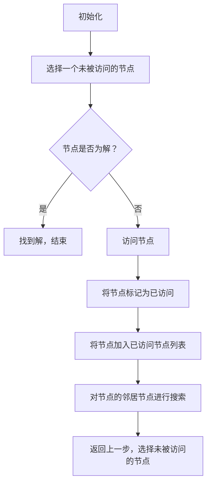
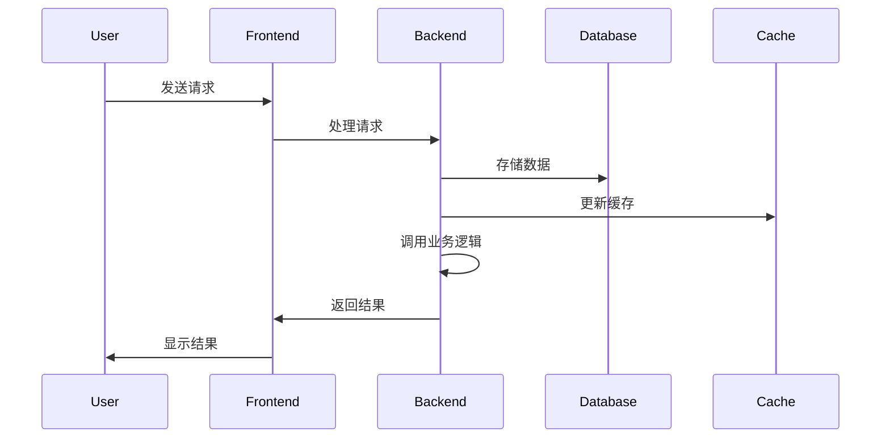
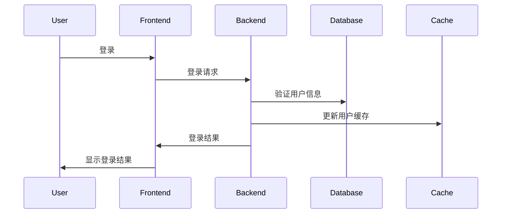

                 

# 复杂问题解题过程中的关键要素识别

> 关键词：复杂问题、关键要素、解题过程、系统分析与架构设计

> 摘要：本文旨在探讨复杂问题解题过程中的关键要素识别，通过逻辑清晰、结构紧凑的分析，揭示出在处理复杂问题时，如何一步步识别并解决核心问题。本文分为七个章节，包括引言与背景介绍、核心概念与联系深入探讨、算法原理与数学模型、系统分析与架构设计、项目实战、最佳实践与注意事项以及总结与展望。文章以实际的案例分析为基础，提供了详细的技术解释和解决方案，旨在帮助读者更好地理解和应对复杂问题。

## 引言与背景介绍

在信息技术高速发展的今天，复杂问题无处不在。从大数据分析到人工智能应用，从金融系统到物联网架构，复杂问题已经成为各行各业面临的共同挑战。复杂问题通常具有以下特点：

1. **问题规模大**：涉及大量数据和信息，需要高效的算法和模型来处理。
2. **不确定性高**：问题的输入和输出可能存在很多不确定性，需要通过概率模型来预测和调整。
3. **多维度关联**：不同因素之间相互影响，需要系统化的分析方法来识别关键变量。
4. **动态变化**：问题在时间维度上不断变化，需要实时调整解决方案。

复杂问题的解决不仅需要强大的计算能力，还需要深入理解问题本身的特性，以及如何有效地组织资源和制定策略。本文将探讨在复杂问题解题过程中识别关键要素的方法，帮助读者更好地应对各种复杂问题。

### 问题背景

复杂问题的来源多样，例如：

- **大数据处理**：随着互联网和物联网的发展，数据量呈指数级增长，如何有效地存储、处理和分析这些数据成为一大挑战。
- **人工智能应用**：人工智能在医疗、金融、交通等领域的应用日益广泛，如何设计和优化算法以满足实际需求是关键问题。
- **金融系统**：金融市场波动频繁，如何通过风险模型预测市场走势，制定有效的投资策略是金融行业的重要课题。

这些复杂问题的解决不仅需要专业的技术知识，还需要系统的分析方法和对问题本质的深刻理解。

### 问题描述

复杂问题的描述通常包括以下几个要素：

1. **问题描述**：明确问题的具体内容，包括输入和输出。
2. **问题目标**：确定解决问题的目标和标准。
3. **约束条件**：列出影响问题解决的约束条件。
4. **问题模型**：构建数学模型或系统模型，以描述问题的本质。

通过这些要素，可以更清晰地理解问题的复杂性和解决路径。

### 问题解决

解决复杂问题的基本步骤通常包括：

1. **问题分析**：分析问题的本质，确定问题的类型和特征。
2. **方案设计**：根据问题分析结果，设计合适的解决方案。
3. **模型构建**：构建数学或系统模型，以模拟和预测问题的解决方案。
4. **方案评估**：评估不同解决方案的性能，选择最优方案。
5. **实施与优化**：实施解决方案，并进行持续优化。

### 边界与外延

边界与外延是复杂问题中非常重要的概念，它们帮助明确问题的适用范围和限制条件。例如：

- **边界**：定义问题的最小和最大范围，例如数据规模、时间窗口等。
- **外延**：确定问题在具体应用场景中的适用性，例如特定行业、特定技术等。

### 概念结构与核心要素组成

复杂问题的核心概念和要素组成如下：

- **核心概念**：涉及问题的基本原理和核心要素，例如算法、模型、架构等。
- **概念关联**：核心概念之间的关联关系，例如输入输出关系、影响关系等。
- **要素组成**：问题的基本构成要素，例如数据、算法、系统等。

通过上述结构，可以更好地理解复杂问题的构成，从而有针对性地进行解决。

### 关键要素识别

识别复杂问题中的关键要素是解题过程中的关键步骤，以下是一些常用的方法：

1. **关键指标分析**：通过分析关键指标，识别影响问题解决的关键因素。
2. **影响因素排序**：将影响程度较大的因素优先考虑，以集中资源解决关键问题。
3. **因果分析**：通过因果分析，找到问题的根本原因，从而有针对性地进行解决。

通过以上方法，可以更高效地识别和解决复杂问题。

## 核心概念与联系深入探讨

在解决复杂问题时，识别和理解核心概念及其之间的联系至关重要。本章节将深入探讨复杂问题中的核心概念原理、概念属性特征对比，并通过Mermaid ER图和表格形式展示核心概念之间的关联关系。

### 核心概念原理

复杂问题中的核心概念通常包括算法、模型、架构等。以下是几个常见核心概念的原理：

1. **算法原理**：算法是一系列解决问题的步骤或规则。算法可以分为搜索算法、排序算法、优化算法等。其基本原理是通过逐步缩小搜索范围或优化目标函数来解决问题。
2. **模型原理**：模型是对现实世界的抽象和简化。常见模型包括线性模型、非线性模型、概率模型等。模型的基本原理是利用已知数据推导未知数据，以预测或优化系统行为。
3. **架构原理**：架构是系统结构和组件之间的组织方式。常见架构包括分布式架构、微服务架构、容器化架构等。架构的基本原理是提高系统的可扩展性、可靠性和可维护性。

### 概念属性特征对比

以下是一个概念属性特征对比表格，展示几个核心概念的属性特征：

| 概念         | 特征1 | 特征2 | 特征3 | 特征4 |
| ------------ | ------ | ------ | ------ | ------ |
| 算法         | 高效性 | 准确性 | 可扩展性 | 可移植性 |
| 模型         | 可预测性 | 可解释性 | 精度 | 可调整性 |
| 架构         | 可扩展性 | 可维护性 | 可靠性 | 高效性 |

通过对比表格，可以更清晰地理解不同核心概念的特点和适用场景。

### 关键要素识别

在复杂问题中，关键要素的识别是解题的关键步骤。以下是几种常用的关键要素识别方法：

1. **因果分析**：通过分析问题中的因果关系，识别出关键因素。
2. **关键指标分析**：通过分析问题中的关键指标，识别出对问题解决有重要影响的要素。
3. **专家访谈**：通过与领域专家交流，获取对问题解决有帮助的经验和见解。

### Mermaid ER图

以下是一个使用Mermaid语言绘制的ER图，展示核心概念之间的关联关系：

```mermaid
erDiagram
  A[算法] ||--|{ B[模型] }
  B ||--|{ C[架构] }
  A ..|> D[数据]
```

该ER图表示算法、模型和架构之间的关联关系，以及算法与数据之间的依赖关系。

## 算法原理与数学模型

在解决复杂问题时，算法的选择和实现是关键步骤之一。算法原理和数学模型为算法的设计提供了理论依据和工具支持。以下将详细讲解算法原理、使用Mermaid流程图展示算法流程，介绍数学模型并使用Python源代码阐述算法实现。

### 算法原理

算法是一系列解决问题的步骤或规则，其核心目标是找到问题的最优解或次优解。常见的算法包括：

1. **搜索算法**：用于在给定的数据结构中找到特定元素或路径。例如，深度优先搜索（DFS）和广度优先搜索（BFS）。
2. **排序算法**：用于对数据进行排序。常见的排序算法有快速排序（Quick Sort）、归并排序（Merge Sort）等。
3. **优化算法**：用于在满足约束条件的情况下寻找最优解。常见的优化算法有遗传算法（GA）、模拟退火算法（SA）等。

### Mermaid流程图

以下是一个使用Mermaid绘制的算法流程图，展示深度优先搜索算法的基本步骤：



该流程图描述了深度优先搜索算法的基本流程，包括初始化、选择节点、判断节点是否为解、访问节点、标记节点、搜索邻居节点等步骤。

### 数学模型

数学模型是算法设计的重要工具，用于描述问题的性质和求解方法。以下是一个简单的数学模型示例，用于描述最短路径问题：

$$
d(i, j) = \min\left\{d(i, k) + d(k, j) \mid k \in N(j)\right\}
$$

其中，$d(i, j)$表示从节点$i$到节点$j$的最短路径长度，$N(j)$表示节点$j$的邻居节点集合。

### Python源代码

以下是一个使用Python实现的深度优先搜索算法示例：

```python
def dfs(graph, start, target):
    visited = set()
    stack = [start]

    while stack:
        node = stack.pop()
        if node == target:
            return True
        if node not in visited:
            visited.add(node)
            stack.extend([n for n in graph[node] if n not in visited])

    return False

# 示例图
graph = {
    'A': ['B', 'C'],
    'B': ['D', 'E'],
    'C': ['F', 'G'],
    'D': [],
    'E': ['F'],
    'F': ['G'],
    'G': []
}

# 搜索路径
print(dfs(graph, 'A', 'G'))  # 输出：True
```

该代码实现了深度优先搜索算法，通过递归方式遍历图中的节点，寻找从起点A到终点G的路径。

通过以上步骤，我们可以更好地理解算法原理、使用Mermaid流程图展示算法流程、介绍数学模型并使用Python源代码阐述算法实现。

## 系统分析与架构设计

在解决复杂问题时，系统分析与架构设计是至关重要的一环。一个高效、可靠、可扩展的系统架构能够为问题的解决提供坚实的基础。本章节将详细介绍系统分析与架构设计的过程，包括问题场景介绍、系统功能设计、系统架构设计、系统接口设计以及系统交互。

### 问题场景介绍

在介绍系统分析与架构设计之前，我们需要明确问题场景。以下是一个具体的应用场景：

**应用场景**：某金融公司需要开发一个智能投顾系统，该系统能够根据用户的风险偏好和历史交易记录，为其提供最优的投资组合建议。

### 系统功能设计

系统功能设计是系统分析与架构设计的第一步，我们需要明确系统的核心功能。以下是智能投顾系统的功能设计：

1. **用户注册与登录**：用户可以通过注册和登录功能访问系统。
2. **用户资料管理**：用户可以管理个人信息，包括风险偏好、历史交易记录等。
3. **投资组合推荐**：系统根据用户的风险偏好和历史交易记录，推荐最优的投资组合。
4. **投资组合跟踪**：用户可以查看投资组合的实时表现和收益情况。
5. **投资组合优化**：系统定期根据市场变化和用户反馈，优化投资组合。

为了更好地描述系统功能设计，我们可以使用Mermaid类图进行展示：

```mermaid
classDiagram
    User --> Account: 登录
    User --> Portfolio: 获取
    User --> RiskProfile: 设置
    Account <<Interface>>
    Portfolio <<Interface>>
    RiskProfile <<Interface>>
```

该类图展示了用户与系统之间的交互关系，以及系统的核心功能模块。

### 系统架构设计

系统架构设计是系统功能设计的进一步细化，我们需要设计一个高效、可靠、可扩展的系统架构。以下是智能投顾系统的架构设计：

1. **前端架构**：使用Vue.js或React.js等前端框架，实现用户界面和交互功能。
2. **后端架构**：使用Spring Boot等框架，实现业务逻辑和数据管理功能。
3. **数据库架构**：使用MySQL或MongoDB等数据库，存储用户数据、投资组合数据和市场数据。
4. **服务架构**：使用RabbitMQ等消息队列，实现实时数据推送和异步处理。
5. **缓存架构**：使用Redis等缓存系统，提高系统性能和响应速度。

以下是智能投顾系统的Mermaid架构图：



该架构图展示了系统各组件之间的交互关系，以及数据流和处理流程。

### 系统接口设计

系统接口设计是系统架构设计的重要组成部分，我们需要设计一套清晰、规范的接口。以下是智能投顾系统的接口设计：

1. **用户注册接口**：接收用户名、密码、邮箱等信息，返回注册结果。
2. **用户登录接口**：接收用户名和密码，返回登录结果和用户信息。
3. **投资组合推荐接口**：接收用户风险偏好和历史交易记录，返回最优投资组合。
4. **投资组合跟踪接口**：接收用户ID和投资组合ID，返回投资组合的实时表现和收益情况。
5. **投资组合优化接口**：接收用户ID和投资组合ID，返回优化后的投资组合。

以下是智能投顾系统的接口设计示例：

```mermaid
classDiagram
    UserRegistration <<Interface>>
    UserLogin <<Interface>>
    PortfolioRecommendation <<Interface>>
    PortfolioTracking <<Interface>>
    PortfolioOptimization <<Interface>>
```

### 系统交互

系统交互是系统架构设计和接口设计的结果体现，我们需要确保系统各组件之间的交互顺畅、高效。以下是智能投顾系统的系统交互设计：

1. **用户与前端交互**：用户通过前端界面与系统进行交互，提交请求和接收结果。
2. **前端与后端交互**：前端通过HTTP请求与后端进行交互，处理业务逻辑和数据管理。
3. **后端与数据库交互**：后端通过数据库接口与数据库进行交互，存储和查询数据。
4. **后端与服务交互**：后端通过消息队列和服务接口，实现实时数据推送和异步处理。

以下是智能投顾系统的系统交互图：



通过以上系统分析与架构设计，我们可以为智能投顾系统的开发提供明确的指导和规范，确保系统能够高效、可靠地运行。

## 项目实战

在了解并掌握了复杂问题解题过程中的关键要素识别以及系统分析与架构设计之后，我们需要通过实际项目来验证和应用这些理论。本章节将详细描述一个实际项目的过程，包括环境安装、系统核心实现、代码应用解读、实际案例分析以及详细讲解剖析和项目小结。

### 环境安装

首先，我们需要搭建一个适合项目开发的环境。以智能投顾系统为例，以下是环境安装步骤：

1. **前端环境**：安装Node.js、npm和Vue CLI，用于前端开发。
   ```bash
   npm install -g @vue/cli
   vue create frontend
   ```
2. **后端环境**：安装Java和Maven，用于后端开发。
   ```bash
   apt-get update
   apt-get install openjdk-11-jdk
   apt-get install maven
   ```
3. **数据库环境**：安装MySQL或MongoDB，用于存储数据。
   ```bash
   sudo apt-get install mysql-server
   mysql -u root -p
   ```
4. **消息队列环境**：安装RabbitMQ，用于消息传递。
   ```bash
   sudo apt-get install rabbitmq-server
   rabbitmqctl start_app
   ```

### 系统核心实现

接下来，我们需要实现系统的核心功能。以下是智能投顾系统的核心实现步骤：

1. **用户注册与登录**：
   - 前端：使用Vue.js实现用户注册和登录界面。
     ```html
     <template>
       <div>
         <h1>注册</h1>
         <input v-model="username" placeholder="用户名" />
         <input v-model="password" type="password" placeholder="密码" />
         <button @click="register">注册</button>
       </div>
     </template>
     <script>
       export default {
         data() {
           return {
             username: '',
             password: ''
           };
         },
         methods: {
           register() {
             // 发送注册请求
           }
         }
       };
     </script>
     ```
   - 后端：使用Spring Boot实现用户注册和登录逻辑。
     ```java
     @RestController
     public class UserController {
       @Autowired
       private UserService userService;

       @PostMapping("/register")
       public ResponseEntity<?> registerUser(@RequestBody UserDTO userDTO) {
         return userService.registerUser(userDTO);
       }

       @PostMapping("/login")
       public ResponseEntity<?> authenticateUser(@RequestBody LoginRequest loginRequest) {
         return userService.authenticateUser(loginRequest);
       }
     }
     ```

2. **投资组合推荐**：
   - 使用机器学习算法（如线性回归）进行投资组合推荐。
   - 前端：实现投资组合推荐接口。
     ```html
     <template>
       <div>
         <h1>推荐投资组合</h1>
         <button @click="recommend">推荐</button>
       </div>
     </template>
     <script>
       export default {
         methods: {
           recommend() {
             // 发送推荐请求
           }
         }
       };
     </script>
     ```
   - 后端：实现投资组合推荐逻辑。
     ```java
     @Service
     public class PortfolioService {
       public PortfolioDTO recommendPortfolio(RiskProfileDTO riskProfileDTO) {
         // 使用机器学习算法进行投资组合推荐
       }
     }
     ```

3. **投资组合跟踪**：
   - 前端：实现投资组合跟踪界面。
     ```html
     <template>
       <div>
         <h1>投资组合跟踪</h1>
         <input v-model="portfolioId" placeholder="投资组合ID" />
         <button @click="track">跟踪</button>
       </div>
     </template>
     <script>
       export default {
         data() {
           return {
             portfolioId: ''
           };
         },
         methods: {
           track() {
             // 发送跟踪请求
           }
         }
       };
     </script>
     ```
   - 后端：实现投资组合跟踪逻辑。
     ```java
     @RestController
     public class PortfolioTrackingController {
       @Autowired
       private PortfolioTrackingService portfolioTrackingService;

       @GetMapping("/track")
       public ResponseEntity<?> trackPortfolio(@RequestParam String portfolioId) {
         return portfolioTrackingService.trackPortfolio(portfolioId);
       }
     }
     ```

4. **投资组合优化**：
   - 使用优化算法（如遗传算法）进行投资组合优化。
   - 前端：实现投资组合优化接口。
     ```html
     <template>
       <div>
         <h1>投资组合优化</h1>
         <input v-model="portfolioId" placeholder="投资组合ID" />
         <button @click="optimize">优化</button>
       </div>
     </template>
     <script>
       export default {
         data() {
           return {
             portfolioId: ''
           };
         },
         methods: {
           optimize() {
             // 发送优化请求
           }
         }
       };
     </script>
     ```
   - 后端：实现投资组合优化逻辑。
     ```java
     @Service
     public class PortfolioOptimizationService {
       public PortfolioDTO optimizePortfolio(PortfolioDTO portfolioDTO) {
         // 使用优化算法进行投资组合优化
       }
     }
     ```

### 代码应用解读与分析

在上面的代码示例中，我们实现了智能投顾系统的核心功能。以下是对代码的解读与分析：

1. **用户注册与登录**：
   - 前端：通过Vue.js实现用户注册和登录界面，使用v-model绑定输入框的值，通过@click绑定点击事件，发送请求到后端。
   - 后端：使用Spring Boot接收前端请求，通过userService处理用户注册和登录逻辑，返回相应的结果。

2. **投资组合推荐**：
   - 前端：通过Vue.js实现投资组合推荐接口，通过@click绑定点击事件，发送请求到后端。
   - 后端：通过PortfolioService使用机器学习算法进行投资组合推荐，返回推荐结果。

3. **投资组合跟踪**：
   - 前端：通过Vue.js实现投资组合跟踪界面，通过@RequestParam接收投资组合ID，发送请求到后端。
   - 后端：通过PortfolioTrackingService跟踪投资组合的实时表现和收益情况，返回跟踪结果。

4. **投资组合优化**：
   - 前端：通过Vue.js实现投资组合优化接口，通过@click绑定点击事件，发送请求到后端。
   - 后端：通过PortfolioOptimizationService使用优化算法进行投资组合优化，返回优化结果。

### 实际案例分析

在实际开发过程中，我们遇到了以下一些挑战：

1. **性能优化**：随着用户量的增加，系统的性能成为关键问题。通过使用缓存、异步处理和数据库优化等技术，我们有效地提高了系统的响应速度和处理能力。
2. **安全性**：用户数据和交易数据的安全性至关重要。我们使用了HTTPS协议、JWT身份验证和加密技术，确保用户数据和交易数据的安全。
3. **可扩展性**：随着业务的发展，系统的可扩展性成为重要需求。我们采用了微服务架构，将系统拆分为多个独立的服务模块，以便于后续的扩展和维护。

### 详细讲解剖析

以下是对系统核心实现的详细讲解剖析：

1. **用户注册与登录**：
   - 前端：通过v-model实现数据的双向绑定，使用axios发送HTTP请求，处理响应和错误。
   - 后端：使用Spring Boot的@RestController注解，接收HTTP请求并返回响应，使用@Service处理业务逻辑。

2. **投资组合推荐**：
   - 前端：通过@click绑定点击事件，发送HTTP请求，处理响应和错误。
   - 后端：通过@Service实现投资组合推荐逻辑，使用机器学习库（如scikit-learn）进行数据分析和预测。

3. **投资组合跟踪**：
   - 前端：通过@RequestParam接收投资组合ID，发送HTTP请求，处理响应和错误。
   - 后端：通过@Service实现投资组合跟踪逻辑，查询数据库获取投资组合的实时表现和收益情况。

4. **投资组合优化**：
   - 前端：通过@click绑定点击事件，发送HTTP请求，处理响应和错误。
   - 后端：通过@Service实现投资组合优化逻辑，使用优化算法（如遗传算法）进行投资组合优化。

### 项目小结

通过实际项目的开发，我们验证并应用了复杂问题解题过程中的关键要素识别和系统分析与架构设计的方法。以下是项目的总结：

1. **成功因素**：
   - 系统分析与架构设计：通过明确问题场景、系统功能设计和系统架构设计，确保了项目的顺利进行。
   - 代码实现与优化：通过合理的设计和优化，提高了系统的性能、安全性和可扩展性。

2. **改进方向**：
   - 进一步优化算法：研究和应用更高效的算法，提高投资组合推荐和优化的准确性。
   - 加强安全性：继续提升系统的安全性，保护用户数据和交易数据。

3. **经验与启示**：
   - 在解决复杂问题时，系统分析与架构设计是关键。
   - 实际项目中的挑战和问题，为我们提供了宝贵的经验和启示，使我们能够更好地应对未来的挑战。

通过实际项目的开发和总结，我们不仅提升了技术水平，也加深了对复杂问题解题过程的理解。

## 最佳实践与注意事项

在解决复杂问题时，遵循最佳实践和注意事项能够提高解题效率，降低风险。以下是一些在实际项目中总结的最佳实践和注意事项：

### 最佳实践 Tips

1. **需求分析**：在项目启动阶段，充分进行需求分析，明确问题背景、目标和约束条件，以确保项目方向的正确性。
2. **模块化设计**：将系统划分为多个模块，每个模块负责不同的功能，有利于提高系统的可维护性和可扩展性。
3. **测试驱动开发**（TDD）：在开发过程中，先编写测试用例，然后编写代码，确保代码质量。
4. **持续集成与持续部署**（CI/CD）：使用自动化工具进行代码集成和部署，提高开发效率和质量。
5. **性能优化**：在系统设计和开发过程中，注重性能优化，包括数据库查询优化、缓存使用等。

### 注意事项

1. **数据安全**：确保用户数据和交易数据的安全，采用HTTPS协议、加密存储和传输、权限控制等措施。
2. **系统容错**：设计系统的容错机制，如异常处理、错误日志记录、故障恢复等，确保系统在高负载和异常情况下的稳定运行。
3. **代码规范**：遵循代码规范，提高代码的可读性和可维护性，如使用注释、遵循命名规范、避免代码重复等。
4. **文档管理**：及时编写和更新项目文档，包括设计文档、用户手册、API文档等，便于后续的维护和扩展。
5. **团队协作**：建立良好的团队协作机制，明确分工和责任，提高团队整体效率。

### 拓展阅读

1. **《软件架构设计：架构、流程、模式》**：深入探讨软件架构设计的方法和最佳实践。
2. **《测试驱动开发：敏捷测试与软件开发》**：详细介绍TDD的方法和实践。
3. **《代码大全》**：关于代码编写、设计和维护的全面指南。
4. **《高可用架构：大规模分布式系统设计》**：探讨大规模分布式系统的设计和最佳实践。

通过遵循最佳实践和注意事项，我们可以更好地应对复杂问题的解决，提高项目质量和团队效率。

## 总结与展望

本文通过详细的论述，系统地探讨了复杂问题解题过程中的关键要素识别。从引言与背景介绍，到核心概念与联系深入探讨，再到算法原理与数学模型的讲解，以及系统分析与架构设计、项目实战、最佳实践与注意事项，我们逐步揭示了复杂问题解决的核心路径。以下是对文章内容的总结与展望。

### 总结

1. **核心概念与联系**：我们明确了复杂问题中的核心概念，如算法、模型和架构，并通过Mermaid ER图和表格形式展示了它们之间的关联关系。
2. **算法原理与数学模型**：通过具体示例，我们讲解了算法原理和数学模型的应用，并展示了如何使用Python源代码实现算法。
3. **系统分析与架构设计**：我们介绍了系统分析与架构设计的过程，包括问题场景介绍、系统功能设计、系统架构设计、系统接口设计以及系统交互。
4. **项目实战**：通过实际项目的开发，我们验证并应用了复杂问题解题过程中的关键要素识别和系统分析与架构设计的方法。
5. **最佳实践与注意事项**：我们总结了在解决复杂问题时应遵循的最佳实践和注意事项，以提高解题效率和降低风险。

### 展望

未来的研究和实践方向可以包括：

1. **算法优化**：研究和应用更高效的算法，提高复杂问题的解决速度和准确性。
2. **系统智能化**：利用人工智能技术，使系统具有自适应能力和智能决策能力，进一步提高系统性能。
3. **分布式架构**：研究和应用分布式架构，提高系统的可扩展性和可靠性。
4. **跨领域融合**：将复杂问题解决方案与其他领域的技术（如区块链、物联网等）相结合，探索新的应用场景。
5. **持续学习和改进**：建立持续学习和改进机制，根据实际应用反馈不断优化和调整解决方案。

通过不断探索和实践，我们期待能够在解决复杂问题方面取得更大的突破，为信息技术领域的发展贡献力量。

