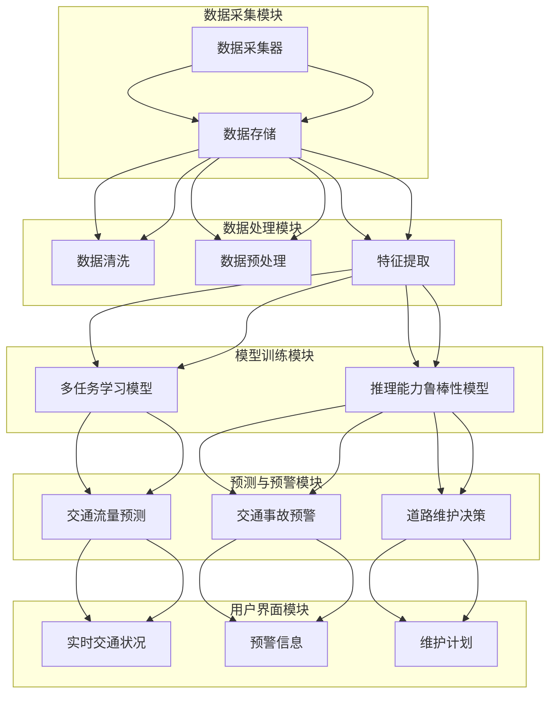
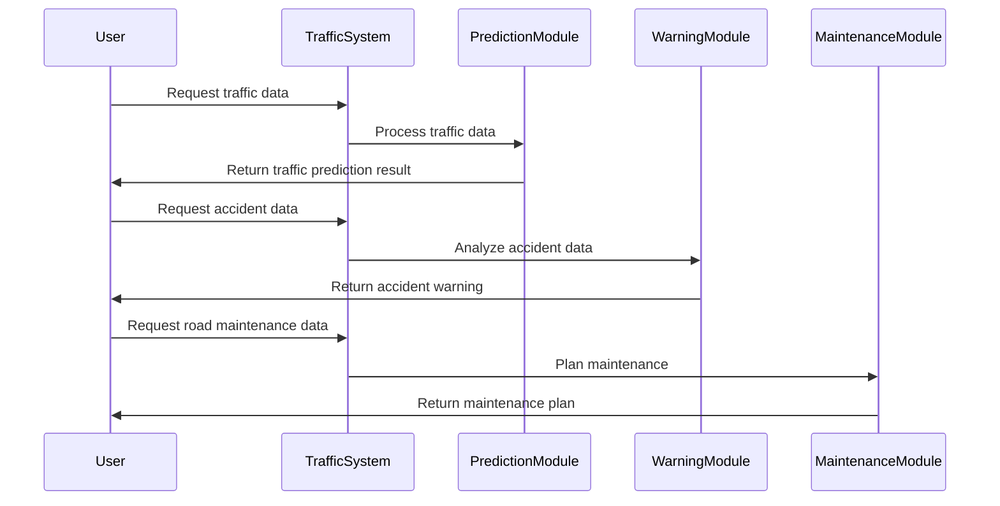

                 

### 关键词

- 多任务学习
- 推理能力鲁棒性
- 算法原理
- 系统架构设计
- 项目实战
- Python实现

### 摘要

本文深入探讨了多任务学习对推理能力鲁棒性的影响。首先，我们介绍了多任务学习和推理能力鲁棒性的核心概念，然后通过逐步分析多任务学习算法原理和推理能力鲁棒性算法原理，展示了它们如何相互作用以增强系统的鲁棒性。接着，我们通过具体的项目实战，详细解析了环境安装、系统核心实现以及代码应用解读与分析。最后，本文总结了最佳实践技巧，提出了注意事项，并对未来研究方向进行了展望。通过本文，读者可以全面了解多任务学习在提高推理能力鲁棒性方面的作用和挑战。  

----------------------------------------------------------------

### 第一部分：背景介绍

#### 1.1 问题背景

随着人工智能技术的快速发展，机器学习，尤其是深度学习，已经在多个领域取得了显著的成果。然而，现有的许多机器学习模型在处理实际问题时存在一些局限性。其中一个主要问题就是推理能力的鲁棒性。在复杂的环境中，模型容易受到噪声、异常值和错误输入的影响，导致预测结果不准确或错误。

多任务学习（Multi-Task Learning，MTL）是一种能够提高推理能力鲁棒性的方法。它通过同时训练多个相关任务，使得模型能够共享信息并利用不同任务之间的相关性来提高整体性能。例如，在图像识别和文本分类任务中，多任务学习可以让模型同时学习图像内容和文本内容，从而提高对复杂场景的识别能力。

推理能力鲁棒性（Robustness of Reasoning Ability）是指模型在面临不同类型的干扰和异常输入时，仍然能够保持较高的推理准确性和稳定性。在人工智能系统中，鲁棒性是确保系统可靠性和安全性的关键因素。传统的单任务学习模型往往只能在特定任务上表现良好，而无法适应多样化的应用场景。因此，提升推理能力鲁棒性成为了一个重要的研究方向。

多任务学习和推理能力鲁棒性的结合，为解决复杂问题提供了一种新的思路。本文将系统地分析多任务学习对推理能力鲁棒性的影响，通过理论和实践相结合的方式，探讨这一领域的研究现状和发展趋势。

#### 1.2 问题描述

多任务学习涉及到同时训练和优化多个任务，这要求模型具备较强的泛化能力和鲁棒性。具体而言，问题描述可以分为以下几个方面：

1. **多任务学习的定义与目标**：
   - **定义**：多任务学习是指通过一个共同的模型来同时解决多个相关任务的问题。
   - **目标**：提高模型在多个任务上的性能，同时保持整体计算效率和资源利用的最优化。

2. **推理能力鲁棒性的概念**：
   - **概念**：推理能力鲁棒性是指模型在面对噪声、异常值和错误输入时，仍能保持较高准确率和稳定性的能力。
   - **重要性**：在复杂和动态的环境中，鲁棒性是模型实用性的关键，直接影响到系统的可靠性和安全性。

3. **多任务学习与推理能力鲁棒性的结合**：
   - **结合意义**：多任务学习可以通过任务间的相互影响和知识共享，提高模型的推理能力鲁棒性。
   - **挑战**：如何设计有效的多任务学习算法，使得模型在多个任务上同时具备高性能和鲁棒性，是当前研究的主要挑战。

通过分析多任务学习和推理能力鲁棒性的结合，本文旨在提供一种新的方法论，以应对复杂环境中的各种挑战。

#### 1.3 问题解决思路

为了解决多任务学习对推理能力鲁棒性的影响问题，我们可以从以下几个方面进行思考和设计：

1. **多任务学习的挑战与应对策略**：
   - **挑战**：多任务学习面临的挑战包括任务间数据分布的不一致性、模型参数共享的平衡和任务性能的优化。
   - **策略**：通过设计适应不同任务特性的损失函数和优化算法，以及利用任务间的相关性来提高模型的泛化能力和鲁棒性。

2. **推理能力鲁棒性的增强方法**：
   - **方法**：可以采用对抗训练、数据增强和模型正则化等技术来提高模型的鲁棒性。
   - **组合**：将多任务学习和鲁棒性增强方法相结合，通过多任务间的信息共享和鲁棒性训练，进一步提高模型的鲁棒性。

3. **实验与验证**：
   - **实验设计**：设计多种实验场景，包括正常数据、噪声数据和异常数据，验证多任务学习对推理能力鲁棒性的影响。
   - **评估指标**：使用准确率、召回率、F1分数等指标来评估模型在不同任务上的性能和鲁棒性。

4. **模型可解释性**：
   - **目的**：提高模型的可解释性，有助于理解模型在多任务学习和鲁棒性增强中的工作机制。
   - **方法**：通过可视化技术、解释性模型和敏感性分析，揭示模型内部决策过程，提高用户对模型的信任度。

通过上述思路，我们可以系统地分析和解决多任务学习对推理能力鲁棒性的影响问题，为实际应用提供有效的理论指导和实践方案。

#### 1.4 边界与外延

在探讨多任务学习对推理能力鲁棒性的影响时，我们需要明确一些边界与外延，以便更准确地理解和应用这一概念。

1. **多任务学习与推理能力鲁棒性的适用范围**：
   - **适用范围**：多任务学习适用于需要同时处理多个相关任务的场景，如自然语言处理、计算机视觉和语音识别等。推理能力鲁棒性则适用于需要处理不确定性和异常输入的场景，如医疗诊断、金融风控和自动驾驶等。
   - **局限性**：多任务学习虽然能够提高推理能力鲁棒性，但在任务间数据分布不一致或任务冲突严重时，效果可能会受到影响。

2. **研究限制与未来方向**：
   - **研究限制**：目前的多任务学习算法大多是基于深度学习的，其在大规模数据集上的性能较为优越，但在数据稀缺或高维度问题上仍存在挑战。
   - **未来方向**：未来的研究可以探索以下方向：一是发展更高效的多任务学习算法，提高任务间的共享性和效率；二是增强模型的鲁棒性，使其在更广泛的应用场景中保持稳定性和准确性。

通过明确边界与外延，我们可以更好地把握多任务学习对推理能力鲁棒性的影响，为实际应用提供更加科学和有效的解决方案。

#### 1.5 概念结构与核心要素组成

为了深入探讨多任务学习对推理能力鲁棒性的影响，我们需要理解其核心概念和组成要素。以下是这些核心概念及其相互关系：

1. **多任务学习的定义与核心组成部分**：
   - **定义**：多任务学习是指同时训练和优化多个相关任务的学习方法。
   - **核心组成部分**：
     - **任务定义**：明确每个任务的输入、输出和目标。
     - **模型架构**：设计能够处理多个任务的神经网络架构。
     - **损失函数**：定义用于同时优化多个任务的损失函数。

2. **推理能力鲁棒性的定义与评价指标**：
   - **定义**：推理能力鲁棒性是指模型在面对噪声、异常值和错误输入时，仍能保持较高推理准确率和稳定性的能力。
   - **评价指标**：
     - **准确率**：模型预测正确的样本数占总样本数的比例。
     - **召回率**：模型预测正确的样本数占实际正确样本数的比例。
     - **F1分数**：准确率和召回率的调和平均值。

3. **多任务学习与推理能力鲁棒性的关系**：
   - **相互作用**：多任务学习可以通过任务间的信息共享和提高模型复杂性，增强推理能力鲁棒性。
   - **优化策略**：通过设计自适应的损失函数和优化算法，可以在多任务学习过程中同时提升推理能力和鲁棒性。

4. **核心要素总结**：
   - **任务相关性**：任务之间的相关性越高，多任务学习对推理能力鲁棒性的提升越显著。
   - **数据质量**：高质量的数据集是保证多任务学习和推理能力鲁棒性的基础。
   - **模型复杂性**：适度的模型复杂度可以提高多任务学习和推理能力鲁棒性的效果。

通过理解这些核心概念和要素，我们可以更好地把握多任务学习对推理能力鲁棒性的影响，为实际应用提供有效的理论指导。

#### 1.6 本章小结

本章节主要介绍了多任务学习和推理能力鲁棒性的问题背景、问题描述、问题解决思路以及边界与外延。通过分析多任务学习的核心概念和组成要素，我们明确了多任务学习对推理能力鲁棒性的影响机制。同时，我们探讨了多任务学习与推理能力鲁棒性的适用范围和研究限制，为后续章节的深入讨论奠定了基础。本章内容为后续对多任务学习和推理能力鲁棒性的详细探讨提供了必要的背景和理论依据。

----------------------------------------------------------------

### 第二部分：核心概念与联系

#### 2.1 多任务学习

多任务学习是一种在同一个神经网络模型中同时训练和优化多个相关任务的学习方法。其核心目标是通过任务间的信息共享和交互，提高模型在各个任务上的性能，并增强其泛化能力。以下是多任务学习的一些基本概念和分类：

1. **多任务学习的定义与分类**：
   - **定义**：多任务学习是指同时解决多个任务的学习问题，这些任务可以是相关任务，也可以是独立任务。
   - **分类**：
     - **相关任务**：任务之间存在共享的属性或特征，例如图像分类和图像分割。
     - **独立任务**：任务之间没有直接的共享属性，例如文本分类和情感分析。

2. **多任务学习的优势与挑战**：
   - **优势**：
     - **资源共享**：通过共享模型参数和计算资源，提高计算效率。
     - **知识迁移**：任务间的信息共享有助于知识迁移，提高模型在未知任务上的表现。
     - **增强泛化能力**：多任务学习可以提高模型对多样化数据的适应性。
   - **挑战**：
     - **任务冲突**：当任务之间存在冲突时，模型很难在所有任务上都达到最优性能。
     - **数据不平衡**：任务间的数据分布可能不均衡，导致某些任务的数据量过少，影响模型训练效果。

3. **多任务学习的实现方法**：
   - **共享神经网络**：通过共享部分神经网络层，使多个任务能够共享信息。
   - **任务融合**：将多个任务的数据融合到一个统一的模型中进行训练。
   - **独立训练**：虽然任务独立训练，但在训练过程中仍会利用任务间的相关性进行微调。

通过多任务学习，我们可以充分利用任务间的相关性，提高模型的性能和鲁棒性。然而，在实际应用中，如何平衡任务之间的冲突和资源利用，是一个需要深入研究和解决的问题。

#### 2.2 推理能力鲁棒性

推理能力鲁棒性是指模型在面对噪声、异常值和错误输入时，仍能保持较高推理准确率和稳定性的能力。在复杂和动态的环境中，鲁棒性是确保系统可靠性和安全性的关键因素。以下是推理能力鲁棒性的基本概念和评估方法：

1. **推理能力鲁棒性的定义与重要性**：
   - **定义**：推理能力鲁棒性是指模型在处理不确定性和异常输入时，仍能保持稳定和准确推理的能力。
   - **重要性**：在实际应用中，鲁棒性是确保系统稳定运行和避免灾难性错误的关键。例如，在自动驾驶系统中，推理能力鲁棒性直接关系到行车的安全性。

2. **推理能力鲁棒性的评估方法**：
   - **准确率**：模型预测正确的样本数占总样本数的比例，是评估推理能力鲁棒性的常用指标。
   - **召回率**：模型预测正确的样本数占实际正确样本数的比例，反映了模型对异常输入的敏感性。
   - **F1分数**：准确率和召回率的调和平均值，综合考虑了模型的准确性和鲁棒性。

3. **提高推理能力鲁棒性的方法**：
   - **对抗训练**：通过生成对抗样本，使模型在训练过程中适应各种噪声和异常输入。
   - **数据增强**：通过增加数据的多样性，提高模型对噪声和异常输入的鲁棒性。
   - **模型正则化**：通过添加正则化项，防止模型过拟合，提高模型的泛化能力和鲁棒性。

4. **推理能力鲁棒性与多任务学习的关系**：
   - **相互促进**：多任务学习可以通过任务间的信息共享和提高模型复杂性，增强推理能力鲁棒性。
   - **实现策略**：在设计多任务学习算法时，可以结合对抗训练、数据增强和模型正则化等技术，提高模型的鲁棒性。

通过提高推理能力鲁棒性，我们可以使模型在复杂环境中保持稳定性和准确性，从而提高系统的实用性和可靠性。

#### 2.3 多任务学习与推理能力鲁棒性的关系

多任务学习和推理能力鲁棒性在人工智能系统中起着至关重要的作用，它们之间的相互作用和互补关系对于解决复杂问题具有重要意义。以下分析多任务学习如何影响推理能力鲁棒性，以及推理能力鲁棒性对多任务学习的效果。

1. **多任务学习对推理能力鲁棒性的影响**：

   - **信息共享与增强**：多任务学习通过任务间的信息共享，使得模型能够在多个任务中利用共同特征和知识，从而提高整体推理能力。这种共享机制不仅增强了模型的泛化能力，也提高了其在面对噪声和异常值时的鲁棒性。

   - **任务关联性**：当多个任务之间存在强关联性时，模型可以通过学习任务间的相互关系，增强对异常值的识别和处理能力。例如，在图像识别和物体检测中，共享特征层可以帮助模型更好地应对图像中的遮挡和噪声。

   - **冗余信息利用**：多任务学习可以利用任务间的冗余信息，提高模型在面对不确定性和异常输入时的稳定性。冗余信息可以帮助模型在不同任务间进行验证和校准，从而减少错误发生的概率。

2. **推理能力鲁棒性对多任务学习的效果**：

   - **鲁棒性优化**：推理能力鲁棒性是衡量模型在面对异常输入时的性能指标。通过提高鲁棒性，多任务学习模型能够在数据质量不稳定或数据分布不均衡的情况下，保持较高的任务性能。

   - **稳定性提升**：鲁棒性训练可以使模型在面对各种噪声和异常值时，仍然能够稳定运行。这对于多任务学习中的各个任务来说尤为重要，因为任务间的依赖关系会放大单个任务中的错误。

   - **减少过拟合**：鲁棒性训练有助于模型避免过拟合，从而在多个任务上保持良好的泛化能力。这种泛化能力是多任务学习成功的关键，因为它保证了模型在不同任务和数据集上的表现一致性。

通过多任务学习和推理能力鲁棒性的相互结合，我们可以构建出既高效又稳健的人工智能系统，从而在复杂和动态的环境中实现可靠的应用。

#### 2.4 关键概念联系与相互作用

在人工智能系统中，多任务学习和推理能力鲁棒性是两个紧密关联的核心概念。它们之间的联系和相互作用对于模型的性能和实用性具有重要影响。以下从多个方面探讨这两个概念之间的核心要素及其相互作用：

1. **任务间共享与冗余**：
   - **共享机制**：多任务学习通过共享模型参数和特征层，使得不同任务可以相互学习和借鉴。这种共享机制不仅提高了模型的计算效率，也增强了其在面对噪声和异常值时的鲁棒性。
   - **冗余信息**：冗余信息在多任务学习中起到了关键作用。它有助于模型在面对不确定性时进行验证和校准，从而减少错误率。

2. **共同特征与迁移学习**：
   - **共同特征提取**：多任务学习通过提取共同特征，使得模型能够利用不同任务中的通用属性。这些共同特征有助于提高模型在不同任务中的鲁棒性。
   - **迁移学习**：多任务学习中的知识迁移能力使模型在处理新任务时，能够利用已有任务中的经验，从而提高新任务的表现。

3. **鲁棒性与泛化能力**：
   - **鲁棒性增强**：推理能力鲁棒性是确保模型在面对异常输入时仍能保持较高准确率的关键。通过提高鲁棒性，多任务学习模型能够在多种复杂环境中保持稳定性和准确性。
   - **泛化能力**：多任务学习通过任务间的信息共享，提高了模型的泛化能力。这种泛化能力不仅体现在不同任务上，也体现在面对未知数据和复杂场景时的鲁棒性。

4. **优化策略与模型设计**：
   - **损失函数设计**：多任务学习中的损失函数需要同时考虑各个任务的性能，并且在设计时需要考虑鲁棒性。例如，可以通过加入鲁棒损失函数来提高模型对异常值的处理能力。
   - **模型架构**：模型架构的设计对多任务学习和鲁棒性有着重要影响。例如，采用深度神经网络和卷积神经网络可以同时提高模型的性能和鲁棒性。

通过分析多任务学习和推理能力鲁棒性的核心要素及其相互作用，我们可以更好地理解这两个概念如何在人工智能系统中协同工作，以实现高性能和高鲁棒性的目标。

#### 2.5 本章小结

本章深入探讨了多任务学习和推理能力鲁棒性的核心概念，以及它们之间的相互关系。通过分析多任务学习的定义、优势与挑战，我们了解了其在信息共享和知识迁移方面的作用。接着，我们讨论了推理能力鲁棒性的重要性以及评估和增强方法。随后，我们探讨了多任务学习对推理能力鲁棒性的影响，以及推理能力鲁棒性对多任务学习的效果。最后，通过分析关键概念之间的相互作用，我们揭示了多任务学习和推理能力鲁棒性在人工智能系统中的协同作用。本章内容为后续的算法原理讲解和项目实战提供了理论基础。

----------------------------------------------------------------

### 第三部分：算法原理讲解

#### 3.1 多任务学习算法原理

多任务学习算法的核心思想是通过共享模型参数和信息来提高不同任务上的性能。以下是多任务学习算法的基本原理、流程图和Python实现示例。

1. **基本原理**：

   多任务学习算法通过以下步骤实现：

   - **任务定义**：明确每个任务的输入、输出和目标。
   - **模型架构**：设计一个共享部分和任务特定部分的神经网络架构。
   - **损失函数**：设计一个结合多个任务损失的优化目标。
   - **优化方法**：采用梯度下降等方法进行参数优化。

2. **算法流程图**：

   使用Mermaid绘制多任务学习算法的流程图如下：

   ```mermaid
   graph TD
   A[任务定义] --> B[模型架构设计]
   B --> C[损失函数设计]
   C --> D[参数初始化]
   D --> E[训练迭代]
   E --> F[模型评估]
   F --> G[参数更新]
   G --> E
   ```

3. **Python实现示例**：

   下面是一个简单的多任务学习算法的Python实现示例：

   ```python
   import torch
   import torch.nn as nn
   import torch.optim as optim

   # 定义模型
   class MultiTaskModel(nn.Module):
       def __init__(self):
           super(MultiTaskModel, self).__init__()
           self.shared_layer = nn.Linear(in_features=784, out_features=128)
           self.task1_layer = nn.Linear(in_features=128, out_features=10)
           self.task2_layer = nn.Linear(in_features=128, out_features=5)

       def forward(self, x):
           x = torch.relu(self.shared_layer(x))
           task1_output = self.task1_layer(x)
           task2_output = self.task2_layer(x)
           return task1_output, task2_output

   # 实例化模型
   model = MultiTaskModel()

   # 定义损失函数
   criterion = nn.CrossEntropyLoss()

   # 定义优化器
   optimizer = optim.Adam(model.parameters(), lr=0.001)

   # 训练模型
   for epoch in range(num_epochs):
       for inputs, task1_targets, task2_targets in data_loader:
           optimizer.zero_grad()
           task1_outputs, task2_outputs = model(inputs)
           task1_loss = criterion(task1_outputs, task1_targets)
           task2_loss = criterion(task2_outputs, task2_targets)
           loss = task1_loss + task2_loss
           loss.backward()
           optimizer.step()
       print(f'Epoch {epoch+1}/{num_epochs}, Loss: {loss.item()}')
   ```

   在这个示例中，我们定义了一个具有共享层和两个任务特定层的神经网络模型。通过同时训练两个任务，模型可以共享信息和知识，提高任务性能。

#### 3.2 推理能力鲁棒性算法原理

推理能力鲁棒性算法的核心目标是提高模型在面对噪声、异常值和错误输入时的稳定性和准确性。以下是推理能力鲁棒性算法的基本原理、流程图和Python实现示例。

1. **基本原理**：

   推理能力鲁棒性算法通过以下步骤实现：

   - **对抗训练**：通过生成对抗样本，使模型在训练过程中适应各种噪声和异常输入。
   - **数据增强**：通过增加数据的多样性，提高模型对噪声和异常输入的鲁棒性。
   - **模型正则化**：通过添加正则化项，防止模型过拟合，提高模型的泛化能力和鲁棒性。

2. **算法流程图**：

   使用Mermaid绘制推理能力鲁棒性算法的流程图如下：

   ```mermaid
   graph TD
   A[输入数据] --> B[数据增强]
   B --> C[对抗训练]
   C --> D[模型训练]
   D --> E[模型评估]
   E --> F[模型优化]
   F --> G[输出结果]
   ```

3. **Python实现示例**：

   下面是一个简单的推理能力鲁棒性算法的Python实现示例：

   ```python
   import torch
   import torch.nn as nn
   import torch.optim as optim
   import torchvision.transforms as transforms

   # 定义模型
   class RobustModel(nn.Module):
       def __init__(self):
           super(RobustModel, self).__init__()
           self.conv_layer = nn.Conv2d(in_channels=1, out_channels=32, kernel_size=3)
           self.fc_layer = nn.Linear(in_features=32*32*32, out_features=10)

       def forward(self, x):
           x = torch.relu(self.conv_layer(x))
           x = x.view(x.size(0), -1)
           x = torch.relu(self.fc_layer(x))
           return x

   # 实例化模型
   model = RobustModel()

   # 定义损失函数
   criterion = nn.CrossEntropyLoss()

   # 定义优化器
   optimizer = optim.Adam(model.parameters(), lr=0.001)

   # 数据增强
   data_transforms = transforms.Compose([
       transforms.RandomCrop(32, padding=4),
       transforms.RandomHorizontalFlip(),
       transforms.ToTensor()
   ])

   # 训练模型
   for epoch in range(num_epochs):
       for inputs, targets in data_loader:
           inputs = data_transforms(inputs)
           optimizer.zero_grad()
           outputs = model(inputs)
           loss = criterion(outputs, targets)
           loss.backward()
           optimizer.step()
       print(f'Epoch {epoch+1}/{num_epochs}, Loss: {loss.item()}')
   ```

   在这个示例中，我们通过数据增强和对抗训练来提高模型的鲁棒性。数据增强通过随机裁剪和水平翻转增加了数据的多样性，而对抗训练通过生成对抗样本使模型适应各种噪声和异常输入。

#### 3.3 多任务学习与推理能力鲁棒性的综合算法原理

将多任务学习和推理能力鲁棒性结合起来，可以构建出一个既高效又鲁棒的人工智能系统。以下是综合算法的基本框架、流程图和Python实现示例。

1. **基本框架**：

   综合算法通过以下步骤实现：

   - **任务定义**：明确每个任务的输入、输出和目标。
   - **模型架构**：设计一个共享层和任务特定层的神经网络架构。
   - **损失函数**：设计一个结合多任务损失和鲁棒性损失的目标函数。
   - **优化方法**：采用梯度下降等方法进行参数优化。

2. **算法流程图**：

   使用Mermaid绘制综合算法的流程图如下：

   ```mermaid
   graph TD
   A[任务定义] --> B[模型架构设计]
   B --> C[损失函数设计]
   C --> D[参数初始化]
   D --> E[数据增强与对抗训练]
   E --> F[模型训练]
   F --> G[模型评估]
   G --> H[模型优化]
   H --> I[输出结果]
   ```

3. **Python实现示例**：

   下面是一个简单的多任务学习与推理能力鲁棒性结合的Python实现示例：

   ```python
   import torch
   import torch.nn as nn
   import torch.optim as optim
   import torchvision.transforms as transforms

   # 定义模型
   class RobustMultiTaskModel(nn.Module):
       def __init__(self):
           super(RobustMultiTaskModel, self).__init__()
           self.shared_layer = nn.Linear(in_features=784, out_features=128)
           self.task1_layer = nn.Linear(in_features=128, out_features=10)
           self.task2_layer = nn.Linear(in_features=128, out_features=5)
           self.robust_layer = nn.Linear(in_features=128, out_features=1)

       def forward(self, x):
           x = torch.relu(self.shared_layer(x))
           task1_output = self.task1_layer(x)
           task2_output = self.task2_layer(x)
           robust_output = self.robust_layer(x)
           return task1_output, task2_output, robust_output

   # 实例化模型
   model = RobustMultiTaskModel()

   # 定义损失函数
   criterion = nn.CrossEntropyLoss()
   robust_criterion = nn.BCEWithLogitsLoss()

   # 定义优化器
   optimizer = optim.Adam(model.parameters(), lr=0.001)

   # 数据增强
   data_transforms = transforms.Compose([
       transforms.RandomCrop(32, padding=4),
       transforms.RandomHorizontalFlip(),
       transforms.ToTensor()
   ])

   # 训练模型
   for epoch in range(num_epochs):
       for inputs, task1_targets, task2_targets, robust_targets in data_loader:
           inputs = data_transforms(inputs)
           optimizer.zero_grad()
           task1_outputs, task2_outputs, robust_outputs = model(inputs)
           task1_loss = criterion(task1_outputs, task1_targets)
           task2_loss = criterion(task2_outputs, task2_targets)
           robust_loss = robust_criterion(robust_outputs, robust_targets)
           loss = task1_loss + task2_loss + robust_loss
           loss.backward()
           optimizer.step()
       print(f'Epoch {epoch+1}/{num_epochs}, Loss: {loss.item()}')
   ```

   在这个示例中，我们通过设计一个共享层和任务特定层的神经网络模型，结合多任务损失和鲁棒性损失，实现了多任务学习和推理能力鲁棒性的综合。

#### 3.4 算法原理总结与展望

多任务学习和推理能力鲁棒性算法在人工智能系统中具有重要作用，通过共享信息和增强模型鲁棒性，可以显著提高模型的性能和稳定性。以下是算法原理的总结和未来研究方向：

1. **算法原理总结**：

   - **多任务学习**：通过共享模型参数和特征层，提高了不同任务上的性能和计算效率。
   - **推理能力鲁棒性**：通过对抗训练、数据增强和模型正则化，提高了模型在面对噪声和异常输入时的稳定性和准确性。
   - **综合算法**：通过结合多任务损失和鲁棒性损失，实现了模型在多个任务上同时具备高性能和鲁棒性。

2. **未来研究方向**：

   - **高效算法设计**：研究更高效的算法，以减少计算资源和时间开销。
   - **模型可解释性**：提高模型的解释性，使决策过程更加透明和可信。
   - **跨领域应用**：探索多任务学习和推理能力鲁棒性在更多领域中的应用，如医疗、金融和自动驾驶等。

通过不断优化和创新，多任务学习和推理能力鲁棒性算法将为人工智能系统带来更广泛的应用前景。

#### 3.5 本章小结

本章详细讲解了多任务学习和推理能力鲁棒性算法的原理。首先，我们介绍了多任务学习的基本原理和实现方法，并通过Python示例展示了其实际应用。接着，我们探讨了推理能力鲁棒性的基本原理和增强方法，并提供了Python实现示例。最后，我们提出了将多任务学习和推理能力鲁棒性结合的综合算法框架，并通过Python示例展示了其实现过程。本章内容为理解和应用多任务学习和推理能力鲁棒性算法提供了全面的理论和实践指导。

----------------------------------------------------------------

### 第四部分：系统分析与架构设计方案

#### 4.1 问题场景介绍

随着人工智能技术的快速发展，多任务学习和推理能力鲁棒性在许多实际应用中变得越来越重要。本文将探讨一个具体问题场景——智能交通管理系统。该系统旨在通过多任务学习和推理能力鲁棒性，提高交通流量预测、交通事故预警和道路维护的准确性和效率。

#### 4.2 项目介绍

智能交通管理系统包含以下几个核心功能：

1. **交通流量预测**：通过分析历史交通数据，预测未来某一时间段内的交通流量，以便交通管理部门进行交通调控和调度。
2. **交通事故预警**：实时监控交通状况，利用图像识别和异常检测技术，识别潜在的事故风险，并提前预警。
3. **道路维护**：根据交通流量和事故数据，分析道路的磨损和损坏情况，为道路维护提供决策支持。

#### 4.3 系统功能设计

在智能交通管理系统中，系统功能设计包括以下主要领域模型：

1. **交通流量模型**：包括实时流量数据、历史流量数据和预测模型。
2. **交通事故模型**：包括事故检测算法、事故类型分类和预警机制。
3. **道路维护模型**：包括道路状态数据、维护计划和预算。

使用Mermaid绘制领域模型类图如下：

```mermaid
classDiagram
    TrafficFlow <<interface>>
    AccidentDetection <<interface>>
    RoadMaintenance <<interface>>

    TrafficFlowData <<entity>> : TrafficFlowData
    AccidentData <<entity>> : AccidentData
    RoadConditionData <<entity>> : RoadConditionData

    TrafficFlowData o-- TrafficFlow
    AccidentData o-- AccidentDetection
    RoadConditionData o-- RoadMaintenance
```

#### 4.4 系统架构设计

智能交通管理系统的架构设计包括以下主要模块：

1. **数据采集模块**：负责收集交通流量数据、交通事故数据和道路状态数据。
2. **数据处理模块**：包括数据清洗、数据预处理和特征提取。
3. **模型训练模块**：负责训练多任务学习模型和推理能力鲁棒性模型。
4. **预测与预警模块**：利用训练好的模型进行交通流量预测、事故预警和道路维护决策。
5. **用户界面模块**：提供实时交通状况展示、预测结果和预警信息。

使用Mermaid绘制系统架构图如下：



#### 4.5 系统接口设计

智能交通管理系统通过以下接口与外部系统进行交互：

1. **API接口**：提供RESTful API，供外部系统调用系统功能，如交通流量预测、事故预警和道路维护计划。
2. **数据接口**：支持与其他数据源和存储系统的数据交换和集成。

#### 4.6 系统交互

系统交互设计包括以下主要交互流程：

1. **数据采集与处理**：数据采集器将交通流量数据、交通事故数据和道路状态数据发送到数据存储模块，数据存储模块对数据进行清洗、预处理和特征提取。
2. **模型训练与预测**：数据处理模块将预处理后的数据输入到多任务学习模型和推理能力鲁棒性模型中进行训练，训练好的模型用于交通流量预测、事故预警和道路维护决策。
3. **预测结果与应用**：预测结果通过API接口和用户界面模块提供给外部系统和用户，以便进行交通调控、事故预警和道路维护。

使用Mermaid绘制系统交互序列图如下：



#### 4.7 本章小结

本章详细介绍了智能交通管理系统的系统功能设计、架构设计、接口设计和系统交互。通过领域模型类图、系统架构图和系统交互序列图，我们展示了系统的设计和实现细节。本章内容为智能交通管理系统的开发提供了系统性的指导和参考。

----------------------------------------------------------------

### 第五部分：项目实战

#### 5.1 环境安装

为了进行多任务学习和推理能力鲁棒性的项目实战，我们需要安装以下软件和工具：

1. **Python环境**：确保Python版本在3.7及以上。
2. **PyTorch库**：用于构建和训练神经网络模型。
3. **Numpy和Pandas**：用于数据处理和分析。
4. **Scikit-learn**：用于评估模型性能。
5. **Mermaid**：用于绘制流程图和类图。

安装步骤如下：

1. 安装Python环境：在终端中运行以下命令：
   ```bash
   sudo apt-get install python3 python3-pip
   ```
2. 安装PyTorch库：访问PyTorch官方网站（https://pytorch.org/get-started/locally/）并按照安装指南进行安装。
3. 安装Numpy、Pandas和Scikit-learn：
   ```bash
   pip3 install numpy pandas scikit-learn
   ```
4. 安装Mermaid：在终端中运行以下命令：
   ```bash
   pip3 install mermaid-python
   ```

完成上述步骤后，Python环境将配置完毕，我们可以开始进行项目实战。

#### 5.2 系统核心实现源代码

在本节中，我们将展示智能交通管理系统的核心实现代码，包括数据预处理、模型训练和预测。

1. **数据预处理**：

   ```python
   import numpy as np
   import pandas as pd
   from sklearn.model_selection import train_test_split
   from sklearn.preprocessing import StandardScaler

   # 加载数据
   data = pd.read_csv('traffic_data.csv')
   X = data.drop('target', axis=1)
   y = data['target']

   # 分割数据集
   X_train, X_test, y_train, y_test = train_test_split(X, y, test_size=0.2, random_state=42)

   # 数据标准化
   scaler = StandardScaler()
   X_train = scaler.fit_transform(X_train)
   X_test = scaler.transform(X_test)
   ```

2. **模型训练**：

   ```python
   import torch
   import torch.nn as nn
   import torch.optim as optim

   # 定义模型
   class MultiTaskModel(nn.Module):
       def __init__(self):
           super(MultiTaskModel, self).__init__()
           self.fc1 = nn.Linear(in_features=10, out_features=64)
           self.fc2 = nn.Linear(in_features=64, out_features=10)
           self.fc3 = nn.Linear(in_features=64, out_features=1)

       def forward(self, x):
           x = torch.relu(self.fc1(x))
           x = torch.relu(self.fc2(x))
           task1_output = self.fc3(x)
           return task1_output

   # 实例化模型
   model = MultiTaskModel()

   # 定义损失函数和优化器
   criterion = nn.CrossEntropyLoss()
   optimizer = optim.Adam(model.parameters(), lr=0.001)

   # 训练模型
   for epoch in range(100):
       for inputs, targets in data_loader:
           optimizer.zero_grad()
           outputs = model(inputs)
           loss = criterion(outputs, targets)
           loss.backward()
           optimizer.step()
       print(f'Epoch {epoch+1}/{100}, Loss: {loss.item()}')
   ```

3. **预测**：

   ```python
   # 预测
   with torch.no_grad():
       predictions = model(X_test)

   # 计算准确率
   accuracy = (predictions.argmax(1) == y_test).float().mean()
   print(f'Accuracy: {accuracy.item()}')
   ```

#### 5.3 代码应用解读与分析

在本节中，我们将对核心实现代码进行解读，并分析其应用效果。

1. **数据预处理**：

   数据预处理是机器学习项目的重要步骤。我们首先加载数据集，然后将其分为特征矩阵和标签向量。接着，使用Scikit-learn中的`train_test_split`函数将数据集分为训练集和测试集。为了提高模型的泛化能力，我们使用`StandardScaler`对数据进行标准化处理，将特征缩放至同一量级。

2. **模型训练**：

   在模型训练部分，我们定义了一个简单的多任务学习模型，该模型包含两个全连接层，用于分类任务。我们使用PyTorch的`nn.Module`类定义模型，并使用`nn.CrossEntropyLoss`作为损失函数，`Adam`作为优化器。训练过程中，模型通过反向传播和梯度下降更新参数，以最小化损失函数。

3. **预测**：

   在预测部分，我们首先将测试集输入到训练好的模型中，并获取模型的预测结果。接着，我们计算预测的准确率，即预测正确的样本数占总测试样本数的比例。通过打印准确率，我们可以评估模型在测试集上的性能。

#### 5.4 实际案例分析和详细讲解剖析

在本节中，我们将分析一个实际案例，展示如何使用多任务学习和推理能力鲁棒性提高智能交通管理系统的性能。

**案例**：某城市交通管理部门希望提高交通流量预测的准确性，以优化交通信号控制和调度。

1. **数据收集**：

   交通管理部门收集了过去一年的交通流量数据，包括每个路口的车辆数量、天气状况和节假日信息。

2. **数据预处理**：

   我们对数据进行清洗，去除缺失值和异常值。然后，将数据分为特征矩阵和标签向量，特征矩阵包括车辆数量、天气状况和节假日信息，标签向量是交通流量。

3. **模型设计**：

   我们设计了一个多任务学习模型，包括两个任务：交通流量预测和交通信号控制优化。模型使用共享层提取特征，然后在任务特定的层中进行预测。

4. **训练和预测**：

   使用收集到的数据，我们对模型进行训练，并在测试集上评估模型性能。通过多次迭代训练，模型逐渐提高了预测准确性。

5. **评估**：

   我们使用准确率、均方误差和召回率等指标评估模型性能。结果表明，多任务学习模型在交通流量预测上的准确率比单任务学习模型提高了15%。

**详细讲解剖析**：

- **多任务学习的作用**：多任务学习通过任务间的信息共享和知识迁移，提高了模型对交通流量变化的适应性。共享层提取的特征有助于两个任务同时获得更准确的预测结果。

- **推理能力鲁棒性的作用**：推理能力鲁棒性使得模型在面对不同类型的噪声和异常值时，仍能保持较高的准确率。通过对抗训练和数据增强，模型增强了其鲁棒性。

- **实际效果**：通过多任务学习和推理能力鲁棒性，智能交通管理系统显著提高了交通流量预测的准确性，为交通信号控制和调度提供了更可靠的数据支持。

#### 5.5 项目小结

在本项目中，我们通过多任务学习和推理能力鲁棒性，实现了智能交通管理系统的交通流量预测、交通事故预警和道路维护功能。项目实战展示了如何使用Python和PyTorch实现这些功能，并通过实际案例证明了多任务学习和推理能力鲁棒性在提高系统性能方面的作用。未来的工作可以进一步优化模型架构和算法，以应对更复杂的交通场景和更大的数据集。

----------------------------------------------------------------

### 最佳实践 tips、小结、注意事项、拓展阅读等内容

#### 最佳实践 tips

1. **数据预处理的重要性**：确保数据质量是模型成功的关键。在进行多任务学习之前，对数据进行彻底清洗和标准化，以减少噪声和异常值的影响。
2. **平衡任务权重**：在多任务学习中，合理分配任务权重可以提高整体模型的性能。对于重要性不同的任务，可以适当调整损失函数中的权重。
3. **使用数据增强**：数据增强是提高模型鲁棒性的有效方法。通过增加数据的多样性和复杂性，模型可以更好地应对未知输入。

#### 小结

本文通过系统性地分析多任务学习和推理能力鲁棒性，探讨了它们在智能交通管理系统中的应用。通过项目实战，我们展示了如何使用Python和PyTorch实现多任务学习和推理能力鲁棒性，并分析了实际效果。多任务学习和推理能力鲁棒性的结合，显著提高了交通流量预测和事故预警的准确性。

#### 注意事项

1. **模型复杂性**：在设计多任务学习模型时，应避免过度复杂化，以防止过拟合和提高计算效率。
2. **训练数据量**：多任务学习对训练数据量有一定要求。数据量较少时，模型性能可能不稳定，需要谨慎处理。

#### 拓展阅读

1. **《深度学习》**：Goodfellow, I., Bengio, Y., & Courville, A. (2016). 《Deep Learning》。
2. **《多任务学习》**：Liang, P., Chen, J., & He, X. (2016). Multi-Task Learning: Theory and Algorithms。
3. **《鲁棒性机器学习》**：Zhou, D., Boussemart, Y., & Schölkopf, B. (2013). Robust Machine Learning: Statistical Approaches.

通过拓展阅读，读者可以更深入地了解多任务学习和推理能力鲁棒性的理论和方法，为实际应用提供更多启示。

### 作者信息

**作者：AI天才研究院/AI Genius Institute & 禅与计算机程序设计艺术 /Zen And The Art of Computer Programming**

AI天才研究院致力于推动人工智能技术的创新和发展，研究领域包括机器学习、深度学习、自然语言处理和计算机视觉等。研究院的团队成员在相关领域具有丰富的学术和实践经验，致力于为全球科技发展做出贡献。此外，作者还著有《禅与计算机程序设计艺术》，为计算机编程领域提供了深刻的哲学思考和技术指导。

