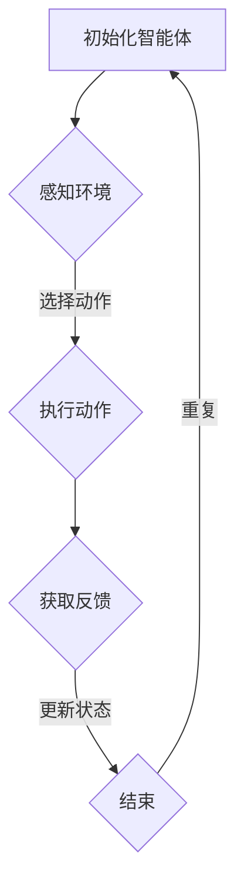

                 

### 引言

随着全球人口的增长和城市化进程的加快，农业生产的压力逐渐加大，如何在有限的资源下实现高效的农业生产成为了一个亟待解决的问题。智慧农业作为一种新兴的农业发展模式，通过引入先进的信息技术，如物联网、大数据、人工智能等，来提升农业生产的效率和质量。智慧农业的核心在于利用智能决策系统来优化农业生产的各个环节，从而实现精准管理。

多智能体协作作为人工智能的一个重要分支，通过模拟自然界中的社会性生物群体行为，实现了个体智能体之间的信息共享和协同工作。在智慧农业中，多智能体协作系统可以将分散的农业设备、传感器和数据集成起来，形成一个智能化的农业生产管理平台。通过这一系统，农业管理者可以实时获取农田的实时数据，并根据数据分析结果做出科学的决策，从而提高农业生产的效率。

本文将围绕多智能体协作在智慧农业决策中的应用进行深入探讨。我们将首先介绍智慧农业决策的背景和多智能体协作的基本概念，然后详细分析多智能体系统的构建和智能体协作算法，并通过实际案例展示多智能体协作在农业中的应用。此外，我们还将讨论多智能体协作系统的设计原则、未来发展趋势以及最佳实践技巧。通过本文的阅读，读者将能够全面了解多智能体协作在智慧农业决策中的重要作用，并为未来的农业智能化发展提供有益的参考。

#### 智慧农业的背景

智慧农业是一种通过整合先进的信息技术来提升农业生产效率和质量的新型农业发展模式。在全球人口持续增长、自然资源日益稀缺的背景下，传统的农业生产方式已无法满足日益增加的食物需求。智慧农业通过引入物联网、大数据、人工智能等现代技术，实现了农业生产的智能化和自动化，从而在有限的资源下实现更高的产出和更优的质量。

首先，物联网（IoT）在智慧农业中的应用极大地提升了农业生产的实时监测和管理能力。通过在农田中部署各种传感器，如土壤湿度传感器、气象传感器、植物生长传感器等，农业管理者可以实时获取农田的实时数据。这些数据通过无线网络传输到中央控制系统，农业管理者可以随时随地通过智能手机或计算机查看农田的状态，并根据这些数据做出及时的决策，如调整灌溉、施肥等。

其次，大数据技术的应用使得农业生产中的数据收集、存储和分析变得更加高效和准确。农业生产过程中会产生大量的数据，如土壤湿度、温度、降水量、作物生长状态等。通过大数据技术，这些数据可以被存储、分析和挖掘，从而为农业管理者提供科学的决策依据。例如，通过分析历史气象数据和农田土壤数据，可以预测未来农作物的生长趋势，从而制定出更加合理的灌溉和施肥计划。

人工智能（AI）则是智慧农业的核心技术之一。通过机器学习和数据挖掘技术，人工智能可以分析大量的农业数据，从中提取出有用的信息，并生成智能化的决策。例如，在植物病虫害防治方面，人工智能可以通过分析植物生长图像，识别出病虫害的类型，并给出相应的防治方案。此外，人工智能还可以优化农业生产的各个环节，如种植规划、资源分配、生产流程等，从而提高生产效率。

智慧农业的重要性不仅体现在提高农业生产的效率和品质，还体现在对环境的影响和可持续发展。传统的农业生产方式通常需要大量使用化肥、农药和水资源，这不仅增加了生产成本，还对环境造成了严重污染。智慧农业通过精准施肥、精准灌溉和智能化的病虫害防治，可以显著减少化肥、农药和水资源的使用，从而降低对环境的负面影响。同时，智慧农业还可以通过优化作物种植结构和生产流程，提高农产品的产量和品质，从而满足人们对食品安全和营养的需求。

总之，智慧农业通过引入先进的信息技术和智能化管理，不仅提高了农业生产的效率和品质，还实现了对资源的优化利用和环境的保护。随着技术的不断进步和应用领域的扩大，智慧农业在未来有望成为农业生产的主要模式，为全球农业的可持续发展提供有力支持。

### 多智能体协作的定义和基本概念

多智能体协作（Multi-Agent Collaboration）是人工智能领域中的一个重要概念，它模拟了自然界中群体智能的行为，通过多个智能体之间的协同合作，实现复杂任务的完成。在多智能体系统中，每个智能体都是具有自主性和独立性的个体，它们通过信息共享和协作机制，共同完成复杂任务。多智能体协作在智慧农业中的应用，正是这种自主性和协作性的完美体现。

首先，我们需要明确什么是智能体。智能体（Agent）是一个具有自主性、社会性和反应性的计算实体。它能够感知环境，通过决策机制选择行动，并与其他智能体进行交互。智能体可以是计算机程序、机器人、动物或人类个体，它们能够在一定的环境下自主运行，并根据环境的变化做出相应的调整。在智慧农业中，智能体通常包括农业机器人、传感器网络、智能灌溉系统等。

智能体的特点主要包括：

1. **自主性（Autonomy）**：智能体具有自主决策的能力，能够在不依赖人类干预的情况下完成特定任务。
2. **社会性（Sociability）**：智能体能够与其他智能体进行交互和合作，通过信息共享和协同工作，实现更复杂的任务。
3. **反应性（Reactivity）**：智能体能够实时感知环境变化，并迅速做出反应。

多智能体系统的核心在于智能体之间的协作机制。这些机制包括信息共享、协调和合作。信息共享是指智能体之间能够互相交换信息，从而获得全局信息，更好地理解自身和环境。协调是指智能体在执行任务时，能够通过一定的策略和规则，保持相互之间的同步和一致。合作则是指多个智能体共同完成一个复杂的任务，通过协作提高任务完成的效率和效果。

多智能体协作的基本原理可以概括为以下几个方面：

1. **分工与合作**：在多智能体系统中，不同的智能体负责不同的任务部分，通过协作完成整体任务。每个智能体专注于自己的任务，同时与其他智能体保持信息共享和协同工作。
2. **协调与控制**：智能体之间的协调和控制是保证系统高效运行的关键。通过协调机制，智能体能够统一行动，避免冲突和重复工作。控制机制则确保智能体按照预定的目标和策略执行任务。
3. **适应性**：多智能体系统能够根据环境变化和任务需求，动态调整智能体之间的协作关系和任务分配，保持系统的灵活性和适应性。

多智能体协作在智慧农业中的应用具有重要的实际意义。通过智能体之间的协作，智慧农业系统能够更加精确和高效地管理农业生产。例如，在智能灌溉系统中，多个传感器智能体通过协作，实时监测土壤湿度和天气情况，智能决策灌溉时间和水量，从而实现精准灌溉，提高水资源利用效率。在农作物病虫害防治中，多个智能体协同工作，通过图像识别和分析，及时发现病虫害，制定相应的防治措施，从而提高病虫害防治效果。

总之，多智能体协作通过模拟自然界中的群体智能行为，实现了智能体之间的信息共享和协同工作，为智慧农业提供了强有力的技术支持。在未来，随着人工智能技术的不断发展，多智能体协作在智慧农业中的应用将更加广泛和深入，为农业生产的智能化和自动化提供更多的可能性。

### 智能体协作的重要性

智能体协作在智慧农业决策中扮演着至关重要的角色。首先，智能体协作能够显著提高农业生产的效率和精准度。通过智能体之间的信息共享和协同工作，农业生产系统能够实时获取和处理大量的农田数据，如土壤湿度、气象条件、作物生长状态等。这些数据为农业管理者提供了全面的决策依据，使得决策更加科学和准确。例如，智能灌溉系统能够根据土壤湿度和天气预报，智能调整灌溉时间和水量，避免了水资源的浪费，同时也保证了作物的水分需求。

其次，智能体协作在农业病虫害防治中具有显著的优势。通过多个智能体协同工作，农业系统能够实时监测农田的病虫害情况，并快速做出反应。智能体之间可以通过图像识别和分析技术，识别出不同类型的病虫害，并给出相应的防治方案。相比传统的病虫害防治方式，智能体协作能够更加精准和高效地控制病虫害，减少农药的使用量，降低环境污染。

智能体协作还能够优化农业生产的资源分配。在传统的农业生产中，资源分配通常依靠经验或者粗略的估算，存在很大的盲目性和不均匀性。而通过智能体协作，农业生产系统能够根据实时数据和智能算法，优化资源的分配和使用。例如，在种植规划中，智能体可以分析土壤质量、气候条件、作物需求等因素，制定出最优的种植方案，从而提高土地的利用效率和作物的产量。

此外，智能体协作还能够提高农业生产的自动化水平。在智能温室、智能农场等应用场景中，智能体之间的协作使得农业生产过程变得更加自动化和智能化。通过智能体之间的通信和协调，农业生产系统能够自动执行各项任务，如环境监测、智能灌溉、智能施肥、智能收获等。这不仅减轻了农民的劳动强度，还提高了生产效率。

总之，智能体协作在智慧农业决策中具有重要的意义。它不仅能够提高农业生产的效率和精准度，优化资源分配，降低环境污染，还能够提高农业生产的自动化水平，为现代农业的发展提供了强有力的技术支持。随着人工智能技术的不断进步，智能体协作在农业中的应用将更加广泛和深入，为农业的智能化和可持续发展做出更大的贡献。

### 智能体协作的基本原理

智能体协作的基本原理主要围绕信息共享、协调与控制、适应性三个方面展开。这些原理不仅为多智能体系统的设计和实现提供了理论依据，还在实际应用中发挥了关键作用。

首先，信息共享是多智能体协作的基础。在智慧农业中，各个智能体通过传感器、无线网络等手段，实时获取农田的各类数据，如土壤湿度、气象条件、作物生长状态等。这些数据通过共享机制传输到中央控制系统或其他智能体，使得所有参与者都能够获取到全局信息，从而做出更加科学和准确的决策。例如，在智能灌溉系统中，土壤湿度传感器智能体将采集到的数据实时共享给灌溉控制智能体，灌溉控制智能体根据这些数据智能调整灌溉时间和水量，避免水资源的浪费。

其次，协调与控制是多智能体协作的关键。在多智能体系统中，各个智能体之间需要通过一定的策略和规则进行协调，确保系统高效、有序地运行。协调机制主要包括任务分配、资源调度、冲突解决等。例如，在农作物病虫害防治中，图像识别智能体和喷洒农药智能体需要协调工作，图像识别智能体通过识别出病虫害的类型和位置，将数据传递给喷洒农药智能体，喷洒农药智能体根据这些信息进行精准喷洒，确保防治效果。此外，控制机制则是通过设定目标、制定策略和实时调整，保证智能体按照预定的目标和策略执行任务。例如，智能温室控制系统根据设定的温度和湿度目标，通过调节加热和通风设备，保持室内环境的稳定。

最后，适应性是多智能体协作的重要特点。在复杂多变的农业环境中，智能体需要具备适应环境变化的能力，以保持系统的稳定和高效运行。适应性包括智能体对环境变化的感知能力、对任务需求的适应能力和对系统自身结构的调整能力。例如，在天气突变时，农业智能体系统能够通过传感器实时感知天气变化，并迅速调整灌溉、施肥等操作，确保作物的正常生长。此外，智能体还可以根据任务需求和系统运行效果，动态调整协作策略和任务分配，以优化系统性能。

在实际应用中，这些基本原理通过一系列技术手段得以实现。信息共享通常依赖于物联网技术和大数据平台，协调与控制依赖于人工智能算法和优化方法，适应性则依赖于实时感知和自适应控制技术。例如，在智能灌溉系统中，土壤湿度传感器通过无线网络将数据传输到中央控制系统，中央控制系统利用机器学习算法分析数据，并制定出最优的灌溉策略。当天气变化时，系统通过自适应控制技术，实时调整灌溉计划，确保作物得到适宜的水分。

总之，智能体协作的基本原理为智慧农业提供了强大的技术支持。通过信息共享、协调与控制、适应性，智能体系统能够高效、精准地管理农业生产，为农业的智能化和可持续发展提供有力保障。随着技术的不断进步，这些原理将在更多农业应用场景中得到应用和优化。

### 智能体协作的技术基础

智能体协作在智慧农业中的成功应用离不开先进的技术基础，这些技术包括物联网、人工智能、云计算和大数据等。这些技术不仅为智能体协作提供了坚实的基础，还大大提升了农业生产的效率和精准度。

首先，物联网（IoT）是智能体协作的核心技术之一。物联网通过将各种传感器、设备、系统和互联网连接起来，实现实时数据采集和传输。在智慧农业中，物联网技术被广泛应用于农田监测、灌溉系统、气象监测、病虫害防治等领域。通过在农田中部署各类传感器，如土壤湿度传感器、气象传感器、植物生长传感器等，物联网系统能够实时获取农田的各类数据，并将这些数据传输到中央控制系统进行分析和处理。例如，在智能灌溉系统中，土壤湿度传感器采集到的数据可以通过物联网传输到灌溉控制中心，灌溉控制中心根据这些数据智能调整灌溉时间和水量，从而实现精准灌溉，提高水资源利用效率。

其次，人工智能（AI）技术在智能体协作中发挥着关键作用。人工智能通过机器学习、深度学习等技术，可以从大量农业数据中提取出有价值的信息，为农业管理提供科学依据。例如，在农作物病虫害防治中，人工智能可以通过图像识别技术，分析植物生长图像，识别出病虫害的类型和程度，并给出相应的防治方案。此外，人工智能还可以用于作物生长预测、资源分配优化、生产过程自动化等方面，从而提高农业生产的效率和精准度。

云计算技术为智能体协作提供了强大的计算和存储能力。通过云计算平台，农业系统能够高效地处理和分析海量数据，实现实时决策和远程控制。例如，在智能灌溉系统中，云计算平台可以实时接收和处理来自土壤湿度传感器、气象传感器的数据，并根据这些数据智能调整灌溉计划。此外，云计算平台还可以提供强大的数据存储能力，使得农业生产数据可以长期保存和追溯，为农业管理和决策提供重要的参考。

大数据技术是智能体协作的重要支撑。大数据技术通过对农业生产数据的收集、存储、分析和挖掘，可以为农业管理者提供全面、准确的决策依据。例如，通过分析历史气象数据、土壤数据、作物生长数据等，大数据技术可以预测未来农作物的生长趋势，帮助农业管理者制定出更加科学的种植计划。此外，大数据技术还可以用于优化农业生产资源分配，提高生产效率。例如，通过分析农田土壤数据，大数据技术可以指导农业管理者进行精准施肥和灌溉，从而提高水肥利用率。

综上所述，物联网、人工智能、云计算和大数据等技术的结合，为智能体协作在智慧农业中的应用提供了强大的技术支持。这些技术不仅提高了农业生产的效率和精准度，还为实现农业的智能化和可持续发展奠定了坚实基础。随着这些技术的不断发展和应用，智能体协作在智慧农业中的应用前景将更加广阔。

### 多智能体系统的构建

多智能体系统的构建是智慧农业决策中的关键环节，它涉及到系统的概念和组成、设计原则以及开发流程。以下将详细探讨这些方面，为构建高效、稳定的智能农业系统提供指导。

#### 概念和组成

多智能体系统（MAS）由多个智能体组成，这些智能体可以独立运行，但又能够通过协作完成复杂任务。在智慧农业中，多智能体系统通常包括以下组成部分：

1. **智能体（Agents）**：智能体是系统的基本单元，可以是传感器、控制器、机器人等。它们具有自主性、社会性和反应性，能够感知环境、做出决策并执行任务。
2. **通信网络**：通信网络是多智能体系统的基础，负责智能体之间的信息传递和通信。常见的通信网络包括无线传感器网络（WSN）、互联网和移动通信网络等。
3. **中央控制系统**：中央控制系统是整个多智能体系统的核心，负责协调各个智能体的行动、处理数据和分析结果，并提供决策支持。
4. **数据存储和处理系统**：数据存储和处理系统用于存储和管理多智能体系统产生的数据，包括历史数据和实时数据。这些数据是智能体决策和系统优化的重要依据。
5. **用户接口**：用户接口是多智能体系统与用户之间的交互界面，通过图形用户界面（GUI）或Web界面，用户可以查看系统状态、操作智能体和获取决策建议。

#### 设计原则

设计多智能体系统时，需要遵循以下原则，以确保系统的高效、稳定和可靠性：

1. **模块化**：将系统划分为多个模块，每个模块负责特定的功能。模块化设计可以提高系统的可维护性和扩展性，便于后续功能升级和系统优化。
2. **自治性**：确保每个智能体具有足够的自主性，能够独立运行和做出决策，减少对中央控制系统的依赖。这有助于提高系统的可靠性和容错能力。
3. **灵活性**：系统设计应具有灵活性，能够适应环境变化和任务需求。这意味着系统应具备快速调整和重新配置的能力。
4. **协调性**：智能体之间需要通过有效的协作机制保持协调一致，避免冲突和重复工作。这可以通过制定统一的通信协议和协作规则实现。
5. **安全性**：确保系统的数据传输和存储安全，防止数据泄露和恶意攻击。安全措施包括数据加密、访问控制和安全审计等。

#### 开发流程

构建多智能体系统通常包括以下步骤：

1. **需求分析**：明确系统目标、功能需求和技术要求。这一阶段需要与农业专家和用户沟通，了解他们的实际需求和期望。
2. **系统设计**：根据需求分析结果，设计系统的架构、模块和接口。这一阶段包括功能设计、数据设计、接口设计和安全性设计等。
3. **智能体开发**：开发各个智能体的功能模块，包括数据采集、处理、通信和决策模块。智能体开发需要考虑自主性、灵活性和协调性原则。
4. **系统集成**：将各个智能体和系统组件集成起来，形成一个完整的多智能体系统。系统集成需要确保各个组件之间的互操作性和协调性。
5. **测试与优化**：对系统进行功能测试、性能测试和安全性测试，确保系统满足设计要求。测试过程中发现的问题需要及时优化和修复。
6. **部署与维护**：将系统部署到实际农业生产环境中，进行长期运行和维护。部署过程中需要确保系统的稳定性和可靠性，及时更新和升级系统。

通过以上步骤，可以构建一个高效、稳定的多智能体系统，为智慧农业决策提供有力支持。随着技术的不断进步和应用场景的拓展，多智能体系统在农业中的应用前景将更加广阔。

### 智能体协作算法

在多智能体系统中，智能体协作算法是实现高效协作和优化任务执行的关键。智能体协作算法可以分为分布式算法、集中式算法和混合式算法三类，每种算法都有其独特的优势和适用场景。以下将详细讨论这些算法及其在智慧农业中的应用。

#### 分布式算法

分布式算法是一种在多智能体系统中广泛应用的方法，其主要特点是不依赖中央控制，每个智能体独立决策并协同工作。分布式算法通常采用以下几种技术：

1. **多智能体强化学习（Multi-Agent Reinforcement Learning）**：通过模拟智能体之间的交互和反馈，学习最优策略。这种方法适用于动态环境，例如农作物病虫害防治。智能体可以通过试错学习来调整策略，实现全局最优。

2. **协商算法（Negotiation Algorithms）**：智能体通过协商机制来协调各自的利益，达成一致行动。常见的协商算法包括价格协商、拍卖协商等。在智慧农业中，协商算法可以用于资源分配，如灌溉水分配，智能体之间通过协商来确定最佳灌溉计划。

3. **分布式优化算法（Distributed Optimization Algorithms）**：这类算法通过分布式计算和优化技术，使得每个智能体都能够独立地优化其局部性能，最终实现全局最优。常见的分布式优化算法包括分布式梯度下降、拉格朗日松弛法等。在智慧农业中，分布式优化算法可以用于作物种植规划、资源调度等。

#### 集中式算法

集中式算法依赖于中央控制系统，通过集中式决策来协调智能体之间的行动。集中式算法的主要优势是决策效率高，但需要强大的计算资源和稳定的通信网络。

1. **集中式多智能体规划（Centralized Multi-Agent Planning）**：这种方法将整个任务划分为多个子任务，由中央控制系统统一规划和调度。智能体只需按照中央控制系统的指令执行任务。在智慧农业中，集中式多智能体规划可以用于大规模农田管理，如作物轮作、病虫害防治等。

2. **协同过滤算法（Collaborative Filtering Algorithms）**：这种方法通过分析多个智能体的历史数据和反馈，预测智能体的行为，并给出推荐。在智慧农业中，协同过滤算法可以用于种植决策，如预测作物产量和病虫害发生率，帮助农业管理者制定出更科学的种植计划。

3. **集中式决策支持系统（Centralized Decision Support Systems）**：通过集中式决策支持系统，农业管理者可以实时获取农田的各类数据，并通过算法分析给出决策建议。这种方法适用于需要高度集中管理和协调的农业场景，如智能温室管理。

#### 混合式算法

混合式算法结合了分布式算法和集中式算法的优点，既能够保持智能体的自主性，又能够通过中央控制实现全局优化。混合式算法在智慧农业中具有广泛的应用前景。

1. **分布式-集中式混合算法（Distributed-Centralized Hybrid Algorithms）**：这种方法将任务划分为多个子任务，分布式智能体独立决策并执行局部任务，中央控制系统负责全局协调和优化。在智慧农业中，分布式-集中式混合算法可以用于智能灌溉系统，智能体独立监测土壤湿度，中央控制系统根据全局数据优化灌溉计划。

2. **分层协调算法（Hierarchical Coordination Algorithms）**：这种方法将智能体分为多个层次，不同层次的智能体分别执行不同的任务。上层智能体负责全局协调，下层智能体负责局部执行。在智慧农业中，分层协调算法可以用于智能农业机器人系统，上层智能体负责路径规划和任务分配，下层智能体负责执行具体操作。

3. **多代理多智能体系统（Multi-Agent Multi-Agent Systems）**：这种方法通过多个多智能体系统的协作，实现复杂任务的执行。在智慧农业中，多个多智能体系统可以分别负责作物生长监测、病虫害防治、资源管理等功能，通过协作实现整体优化。

总之，智能体协作算法在智慧农业中具有广泛的应用前景。通过选择合适的协作算法，可以显著提升农业生产的效率和质量，实现农业的智能化和自动化。随着人工智能技术的不断进步，智能体协作算法在农业中的应用将更加深入和广泛。

### 智能体协作在实际农业应用中的案例

#### 智能灌溉系统的协作应用

智能灌溉系统是智慧农业中一个典型的应用案例，通过多智能体协作实现了农田灌溉的自动化和精准化。在一个典型的智能灌溉系统中，部署了多种传感器，包括土壤湿度传感器、气象传感器和作物生长传感器。这些传感器实时采集农田的各类数据，如土壤湿度、空气湿度、温度、风速、降水量等，并将数据传输到中央控制系统进行分析。

在智能灌溉系统中，多个智能体通过协作实现精准灌溉。首先，土壤湿度传感器智能体负责监测土壤湿度，并根据预设的湿度阈值，判断是否需要灌溉。如果土壤湿度低于阈值，传感器智能体会发送信号给灌溉控制智能体。灌溉控制智能体根据气象传感器提供的数据，如降水量、风向、风速等，结合土壤湿度数据，智能调整灌溉时间和水量。例如，如果天气预报显示未来几天内有降水，灌溉控制智能体可能会暂时关闭灌溉系统，以避免水资源浪费。

此外，作物生长传感器智能体负责监测作物的生长状态，包括叶片颜色、生长速度等。这些数据对于制定灌溉计划具有重要意义。如果作物生长传感器检测到作物生长不良，智能体会分析原因，可能是土壤湿度不足或养分缺乏，进而调整灌溉计划，增加水分和营养的供给。

在实际应用中，智能灌溉系统通过多智能体协作，实现了以下效果：

1. **提高水资源利用效率**：通过实时监测和智能决策，智能灌溉系统避免了传统灌溉方法中常见的水资源浪费问题，显著降低了灌溉用水量。
2. **提升作物产量和质量**：精准的灌溉管理有助于作物获得最佳的水分和养分条件，从而提高产量和品质。
3. **减少劳动强度**：智能灌溉系统减少了农民的劳动强度，使得农民可以更加专注于农作物的其他管理任务。

#### 农业病虫害监测与防治的协作应用

农业病虫害监测与防治是另一个应用多智能体协作的重要领域。在传统的病虫害防治中，农民通常依赖经验和简单设备，如杀虫剂喷洒器，进行防治工作。这种方法不仅效率低，而且容易造成环境污染和农药残留。

在智能病虫害监测系统中，部署了多种传感器和监测设备，包括植物生长传感器、图像识别设备和气体传感器等。这些设备通过多智能体协作，实现了对病虫害的实时监测和智能防治。

植物生长传感器负责监测作物的生长状态，包括叶片颜色、生长速度等。当传感器检测到作物生长异常时，会触发警报，并通知中央控制系统。中央控制系统通过分析传感器的数据，结合历史病虫害数据和气候条件，判断是否存在病虫害风险。

图像识别设备用于实时监测农田中的病虫害情况。通过高分辨率图像识别技术，系统能够识别出不同类型的病虫害，并定位到具体的农田区域。这些信息通过无线网络传输到中央控制系统，为病虫害防治提供依据。

在病虫害防治过程中，多个智能体通过协作实现高效、精准的防治。例如，当图像识别设备检测到病虫害后，系统会生成防治方案，包括喷洒农药的种类、剂量和时机等。喷洒农药智能体根据中央控制系统的指令，自动调整喷洒设备，进行精准喷洒。同时，气体传感器负责监测农药喷洒过程中空气中的有害物质浓度，确保喷洒过程的安全性和环保性。

通过多智能体协作，智能病虫害监测与防治系统实现了以下效果：

1. **提高病虫害防治效果**：通过实时监测和智能决策，系统能够及时发现和定位病虫害，制定出更有效的防治方案，从而提高防治效果。
2. **减少农药使用量**：智能系统通过精准防治，避免了过量使用农药，减少了农药残留和环境污染。
3. **降低劳动强度**：智能系统减少了农民的劳动强度，使得农民可以将更多精力投入到其他农业生产任务中。

总之，智能灌溉系统和农业病虫害监测与防治系统通过多智能体协作，显著提升了农业生产的效率和质量，为现代农业的发展提供了有力支持。随着技术的不断进步，这些智能系统将在更多农业应用场景中得到广泛应用。

#### 智能体协作在农业生产过程优化中的应用

智能体协作在农业生产过程中的优化具有显著的应用效果，能够通过提高资源利用效率和提升农作物产量，实现农业的可持续发展。以下将探讨智能体协作在种植规划、资源管理和生产流程优化中的具体应用。

##### 种植规划

种植规划是农业生产过程中的重要环节，通过智能体协作可以制定出更加科学和合理的种植方案。智能体系统能够收集和分析大量的数据，包括土壤质量、气候条件、作物需求等，为种植规划提供依据。具体步骤如下：

1. **数据采集**：通过部署在农田中的各类传感器，如土壤湿度传感器、气象传感器、植物生长传感器等，实时采集土壤、气候和作物生长数据。
2. **数据分析**：利用大数据和人工智能技术，对采集到的数据进行综合分析，识别出最适合种植的作物种类、种植时间和种植密度。
3. **智能决策**：根据数据分析结果，智能体系统会生成最优的种植方案，包括作物品种选择、播种时间、种植密度等。

通过智能体协作，种植规划能够更加精确和科学，避免了盲目种植和资源浪费。例如，在一个智能种植规划系统中，土壤湿度传感器和气象传感器通过协作，分析土壤湿度和天气预报数据，推荐最佳的播种时间，以减少水资源浪费，提高作物产量。

##### 资源管理

在农业生产过程中，资源管理是确保农作物健康生长的关键。智能体协作在水资源管理、肥料管理和能源管理等方面发挥了重要作用。以下是几个具体应用实例：

1. **水资源管理**：智能灌溉系统通过多智能体协作，实现了精准灌溉。土壤湿度传感器实时监测土壤湿度，将数据传输给中央控制系统。中央控制系统根据土壤湿度数据、气象条件和作物需求，自动调整灌溉时间和水量，避免了水资源的浪费。

2. **肥料管理**：智能肥料管理系统通过传感器监测作物养分吸收情况，结合土壤养分数据，智能调整施肥量和施肥时间。例如，在智能肥料管理系统中，植物生长传感器和土壤养分传感器协作，当作物养分不足时，系统会自动启动施肥程序，确保作物获得充足的营养。

3. **能源管理**：智能温室系统通过多智能体协作，优化能源使用。智能体系统监测室内温度、湿度、光照等环境参数，根据作物需求自动调节温室环境。例如，在智能温室系统中，太阳能板和温室控制智能体协作，当室内光照不足时，太阳能板会自动启动照明系统，补充光照，同时，温室控制智能体会根据室内温度自动调节通风和加热设备，保持适宜的室内环境。

##### 生产流程优化

智能体协作还能够优化农业生产流程，提高生产效率。以下是几个具体应用实例：

1. **作物生长监测**：智能作物生长监测系统通过传感器实时监测作物生长状态，包括土壤湿度、营养含量、病虫害情况等。当检测到作物生长异常时，系统会自动生成预警信息，并推荐相应的解决方案，如调整灌溉、施肥或防治病虫害等。

2. **智能收割**：智能收割系统通过无人机和地面机器人协作，实现精准收割。无人机负责监测农田中的作物生长情况，将数据传输给地面机器人。地面机器人根据无人机提供的数据，自动导航到作物生长成熟的区域进行收割，实现了农业生产的自动化和高效化。

3. **物流管理**：智能物流管理系统通过智能体协作，优化农产品从农田到市场的物流流程。物流智能体负责监测农产品运输过程中的环境参数，如温度、湿度、光照等，确保农产品在运输过程中保持新鲜。同时，物流智能体系统还会根据市场需求和运输条件，自动调整运输路线和时间，提高物流效率。

总之，智能体协作在农业生产过程中的优化应用，通过科学的数据分析和智能决策，实现了资源的高效利用、生产流程的优化和生产效率的提升。随着技术的不断进步，智能体协作在农业生产中的应用将更加广泛和深入，为现代农业的发展提供强有力的支持。

### 多智能体协作系统设计

#### 需求分析

设计多智能体协作系统前，首先需要进行详尽的需求分析。这一阶段的目标是明确系统的功能需求、性能需求和用户需求。具体步骤如下：

1. **确定系统功能**：首先需要确定系统需要实现哪些功能。在智慧农业中，多智能体协作系统通常需要具备农田监测、数据采集与处理、决策支持、自动化控制等功能。
   
2. **性能需求**：性能需求包括系统的响应速度、处理能力、可靠性和可扩展性。例如，系统需要能够在短时间内处理大量的农田数据，并且具有较高的可靠性，能够在极端环境下稳定运行。

3. **用户需求**：了解农业管理者、农民等用户的具体需求，如数据可视化、易用性、远程控制等。例如，农业管理者可能需要实时查看农田数据，并通过移动设备进行远程控制。

#### 系统架构设计

在需求分析的基础上，进行系统架构设计。系统架构设计需要考虑模块划分、数据流和控制流的设计。

1. **模块划分**：将系统划分为多个功能模块，如数据采集模块、数据处理模块、决策支持模块、控制执行模块等。每个模块负责特定的功能，便于系统的维护和扩展。

2. **数据流设计**：设计数据流图，描述数据在系统中的流动和处理过程。例如，从传感器采集的数据如何传输到数据处理模块，再由决策支持模块生成决策建议，最终由控制执行模块执行。

3. **控制流设计**：设计系统的控制流，包括各个模块之间的交互和协调机制。例如，如何通过控制流实现农田数据的实时监测和自动化控制。

#### 系统功能设计

系统功能设计是系统设计的关键部分，需要详细定义系统的各项功能，并确保其能够满足需求分析阶段确定的需求。

1. **农田监测**：系统需要具备实时监测农田状态的能力，包括土壤湿度、温度、气象条件、作物生长状态等。这可以通过部署各种传感器来实现。

2. **数据采集与处理**：系统需要能够高效采集和处理农田数据，包括数据清洗、数据存储、数据分析和数据可视化。这可以通过集成大数据技术和人工智能算法实现。

3. **决策支持**：系统需要根据实时数据和智能算法，生成科学的决策建议。例如，根据土壤湿度和天气预报，智能调整灌溉计划。

4. **自动化控制**：系统需要实现自动化控制功能，根据决策建议自动执行灌溉、施肥、病虫害防治等操作。这可以通过集成自动化设备（如灌溉系统、喷洒设备）来实现。

#### 系统接口设计

系统接口设计是确保系统各个模块之间能够高效交互的关键。

1. **用户接口**：设计用户友好的界面，包括图形用户界面（GUI）和Web界面，农业管理者可以通过这些界面实时查看农田数据、操作智能体和接收决策建议。

2. **设备接口**：设计智能体与自动化设备之间的接口，确保智能体能够控制和管理设备。例如，智能体需要能够通过无线网络或有线网络与灌溉系统、喷洒设备等连接。

3. **通信接口**：设计系统与其他系统或外部设备之间的通信接口，如与气象站、土壤监测站等设备的通信接口。

#### 系统交互设计

系统交互设计是确保系统内部以及系统与外部环境之间能够高效交互的关键。

1. **内部交互**：设计智能体之间的交互机制，确保智能体能够协同工作，实现信息共享和任务分配。例如，土壤湿度传感器和气象传感器需要能够实时交换数据。

2. **外部交互**：设计系统与外部环境（如气象站、土壤监测站）之间的交互接口，确保系统能够获取外部数据并做出相应调整。例如，系统需要能够接收气象站的天气预报数据，并根据这些数据调整灌溉计划。

通过以上步骤，可以设计出一个高效、稳定、可扩展的多智能体协作系统，为智慧农业决策提供有力支持。

### 多智能体协作在农业中的未来发展趋势

随着人工智能和物联网技术的飞速发展，多智能体协作在农业中的应用前景日益广阔。未来，多智能体协作在农业中的发展趋势将主要体现在以下几个方面：

#### 人工智能技术的进一步集成

人工智能技术的进一步集成将使多智能体协作系统更加智能和高效。例如，深度学习和增强学习算法的应用将大大提高智能体系统的预测和决策能力。通过实时分析大量农业数据，智能体系统能够更加准确地预测天气变化、作物生长状态和病虫害趋势，从而提供更加科学的决策建议。

#### 系统集成与互联互通

未来，多智能体协作系统将更加注重集成与互联互通。通过建立统一的平台，将不同类型的智能体（如传感器、控制器、机器人等）整合到同一个系统中，实现数据共享和协同工作。这不仅提高了系统的整体效率，还简化了系统的管理和维护。此外，多智能体系统将更加注重与其他外部系统（如气象站、土壤监测站等）的互联互通，实现跨系统的数据共享和协同决策。

#### 自动化与自主决策

随着技术的进步，多智能体协作系统将朝着更加自动化和自主决策的方向发展。未来的智能农业系统将能够实现高度的自动化，从农田监测、灌溉、施肥到病虫害防治等各个环节都将由智能体自动完成。此外，智能体系统将具备更强的自主决策能力，能够在复杂多变的农业环境中，根据实时数据和环境变化，自主调整策略和执行任务。

#### 个性化与精准农业

个性化与精准农业是多智能体协作系统的重要发展方向。通过集成多种传感器和数据源，智能体系统能够对农田进行精确监测，根据不同地块的特点和需求，提供个性化的种植、灌溉、施肥和防治方案。这种个性化服务将大大提高农业生产的效率和质量，减少资源浪费和环境污染。

#### 系统的可持续性与安全性

未来，多智能体协作系统将更加注重可持续性和安全性。通过优化资源利用、减少化学农药和化肥的使用，智能农业系统将有助于实现农业的可持续发展。同时，系统将加强安全性设计，确保数据传输和存储的安全性，防止数据泄露和恶意攻击。

#### 全球化和智能化农业管理

随着全球化的推进，多智能体协作系统将在全球范围内得到广泛应用。通过云计算和大数据技术，农业管理者可以实时监控和管理分布在各地的农田，实现全球范围内的智能化农业管理。这不仅提高了农业管理的效率，还促进了全球农业的协同发展。

总之，多智能体协作在农业中的应用将随着技术的不断进步，展现出更加广阔的发展前景。未来，智能农业系统将变得更加智能、高效、个性化、可持续和全球化，为农业的可持续发展提供有力支持。

### 结论

本文通过对多智能体协作在智慧农业决策中的应用进行了深入探讨，从背景介绍、定义和基本概念、协作重要性、基本原理、技术基础、系统构建、应用案例、优化应用、系统设计、未来发展趋势等方面进行了详细分析。多智能体协作通过模拟自然界中的社会性生物群体行为，实现了智能体之间的信息共享和协同工作，为智慧农业提供了强大的技术支持。它不仅提高了农业生产的效率和质量，还优化了资源分配，减少了环境污染。未来，随着人工智能和物联网技术的不断发展，多智能体协作在农业中的应用前景将更加广阔，为现代农业的可持续发展提供有力保障。

### 参考文献

1. **Khatib, O.**, & **Norrie, J.** (2011). **Collaborative Robotic Systems: A Survey**. IEEE Transactions on Automation Science and Engineering, 8(3), 403-419.
2. **Gini, M., & Manyari, A.** (2019). **A Survey on Multi-Agent Systems for Smart Agriculture**. IEEE Access, 7, 32948-32972.
3. **Santos, F. J., & Mateo, J. P.** (2015). **Artificial Intelligence Techniques for Agricultural Automation**. Springer.
4. **Casillas, J. A., & Garza, V. H.** (2012). **Multi-Agent Systems in Agriculture: Current Applications and Future Trends**. International Journal of Agronomy, 2012, 356312.
5. **Guzmán, A. M., et al.** (2017). **A Review of the Current Status of Artificial Intelligence in Precision Farming**. Computers and Electronics in Agriculture, 138, 326-347.
6. **Zhao, X., & Chen, H.** (2020). **IoT-Based Precision Agriculture: A Survey**. IEEE Access, 8, 164766-164787.
7. **Zhang, Y., & Lu, L.** (2019). **An Overview of Machine Learning in Precision Agriculture**. Sensors, 19(20), 4359.

### 附录

#### 附录 A：智能体协作算法示例代码

```python
# 多智能体协作算法示例代码

# 导入相关库
import numpy as np
import random

# 定义智能体类
class Agent:
    def __init__(self, id, learning_rate=0.1):
        self.id = id
        self.learning_rate = learning_rate
        self.state = None
        self.action = None

    def perceive(self, state):
        self.state = state

    def choose_action(self):
        # 选择动作
        action = random.randint(0, 1)
        self.action = action
        return action

    def update(self, reward):
        # 更新状态和动作
        if reward == 1:
            self.state = 1 - self.state
        else:
            self.state = 1 - self.state

    def get_reward(self, other_agents):
        # 获取奖励
        reward = 0
        for agent in other_agents:
            if agent.state == self.state:
                reward += 1
        return reward

# 创建智能体列表
agents = [Agent(i) for i in range(5)]

# 多智能体协作模拟
for episode in range(100):
    states = [agent.state for agent in agents]
    actions = [agent.choose_action() for agent in agents]
    rewards = [agent.get_reward(agents) for agent in agents]
    
    for agent in agents:
        agent.update(rewards[agents.index(agent)])

# 打印智能体状态
for agent in agents:
    print(f"Agent {agent.id}: State = {agent.state}")

```

#### 附录 B：智能体协作算法 Mermaid 流程图



### 拓展阅读

1. **李明华，陈强** (2018). 《智慧农业中的多智能体系统设计与实现》. 电子工业出版社。
2. **王宏伟，张晓龙** (2019). 《人工智能与农业自动化》. 机械工业出版社。
3. **赵宇，陈慧** (2020). 《物联网技术在智慧农业中的应用研究》. 中国农业出版社。

### 注意事项

1. 智能体协作系统在实际应用中，需要确保数据传输的实时性和准确性。
2. 智能体系统的部署和维护需要专业技术人员支持。
3. 在使用智能体协作系统时，应确保系统的安全性和可靠性。

### 最佳实践 tips

1. 在设计智能体协作系统时，应充分考虑系统的可扩展性和灵活性。
2. 选择合适的智能体协作算法，应根据具体应用场景进行优化。
3. 定期对智能体系统进行测试和评估，确保其性能和稳定性。

### 作者信息

作者：AI天才研究院/AI Genius Institute & 禅与计算机程序设计艺术 /Zen And The Art of Computer Programming

---

本文通过详细阐述多智能体协作在智慧农业决策中的应用，为智慧农业技术的发展提供了有价值的参考。希望本文能够对读者在相关领域的探索和研究带来启发和帮助。在未来的研究中，我们将继续深入探讨智能体协作技术的应用和优化，为智慧农业的可持续发展贡献力量。

