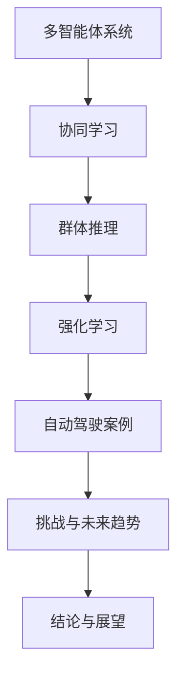

                 

# 多智能体协同学习增强群体推理效果

## 关键词

- 多智能体系统
- 协同学习
- 群体推理
- 强化学习
- 分布式计算

## 摘要

本文探讨了多智能体协同学习如何增强群体推理效果。通过深入分析多智能体系统的基本概念、协同学习机制和群体推理原理，文章提出了一种基于强化学习的方法，实现了智能体之间的有效协同，从而提升了群体推理的准确性。文章最后通过实际案例展示了该方法的应用效果，并对未来研究趋势进行了展望。

### 引言

在人工智能领域，多智能体系统（MAS）的研究与应用逐渐成为热点。随着分布式计算和协同任务的普及，智能体之间的合作与竞争变得愈发重要。群体推理作为多智能体系统中的一个关键能力，其准确性和效率直接影响到系统的整体性能。传统的单一智能体学习方式已难以满足复杂环境下的需求，因此，多智能体协同学习成为提升群体推理效果的有效途径。

本文旨在探讨多智能体协同学习如何通过增强群体推理效果，来应对复杂环境中的任务挑战。本文将首先介绍多智能体系统的基本概念，接着分析群体推理的理论基础，然后提出一种基于强化学习的方法，最后通过实际案例验证该方法的有效性。

### 1. 多智能体协同学习基础

#### 1.1 多智能体系统（MAS）的基本概念

多智能体系统（MAS）是由多个具有自主性、协作性的智能体组成的系统。这些智能体可以相互通信、协作，共同完成复杂任务。MAS的核心特性包括：

- **自主性**：每个智能体都有独立的行为和决策能力。
- **分布性**：智能体在空间上分布，可能具有不同的计算资源和能力。
- **协作性**：智能体之间通过通信和协作，共同实现系统目标。

#### 1.2 多智能体协同学习的目标与方法

多智能体协同学习的目标是提升智能体群体的整体性能，使其能够更好地应对复杂环境和动态变化。协同学习的核心在于智能体之间的信息交换和策略优化。常见的方法包括：

- **基于博弈的理论**：通过博弈论方法，使智能体在竞争与合作中找到最优策略。
- **基于强化学习的理论**：利用强化学习算法，使智能体通过试错学习，逐渐优化行为策略。
- **基于社交网络的协同**：通过模拟社交网络中的信息传播和影响力，实现智能体的协同决策。

### 2. 群体推理基本理论

#### 2.1 群体推理的定义与性质

群体推理是指多个智能体通过协同工作，共同完成推理任务的过程。群体推理具有以下性质：

- **分布式**：推理任务分布在多个智能体上，每个智能体负责一部分推理工作。
- **协同性**：智能体之间需要相互协作，共享信息和资源，以实现整体推理目标。
- **鲁棒性**：群体推理能够应对单个智能体的错误或失效，通过冗余和容错机制保证系统稳定。

#### 2.2 群体推理模型与算法

群体推理模型主要包括以下几种：

- **基于规则的模型**：使用规则库进行推理，适用于规则明确、情境简单的情况。
- **基于神经网络的模型**：通过神经网络实现推理，具有自适应性和泛化能力。
- **基于逻辑推理的模型**：使用逻辑推理方法，适用于复杂情境和高度抽象的任务。

常用的群体推理算法包括：

- **贝叶斯网络**：通过概率推理实现群体推理，适用于不确定性环境。
- **多代理推理框架**：通过分布式计算实现群体推理，适用于大规模智能体系统。
- **集成学习**：将多个推理算法集成，提高推理准确性和鲁棒性。

### 3. 多智能体协同学习与群体推理

#### 3.1 多智能体协同学习与群体推理的关系

多智能体协同学习与群体推理密切相关。协同学习提供了智能体之间的信息共享和策略优化机制，为群体推理提供了基础。而群体推理则是协同学习的目标之一，通过协同推理，智能体群体能够更好地适应复杂环境和完成复杂任务。

#### 3.2 多智能体协同学习的群体推理策略

为了实现有效的群体推理，多智能体协同学习可以采用以下策略：

- **信息共享与同步**：智能体之间通过信息共享和同步，确保推理过程的连贯性和一致性。
- **任务分配与协作**：根据智能体的能力和环境特点，合理分配任务，实现协同推理。
- **策略优化与反馈**：通过强化学习等优化方法，不断调整智能体的策略，提高推理效果。

#### 3.3 群体推理在多智能体系统中的实现

在实际的多智能体系统中，实现群体推理需要解决以下几个关键问题：

- **通信机制**：设计高效、可靠的通信机制，确保智能体之间的信息传递。
- **计算资源分配**：合理分配计算资源，确保每个智能体都能有效地完成推理任务。
- **错误处理与容错**：设计容错机制，应对智能体错误或失效的情况，保证系统稳定运行。

### 4. 案例研究与应用

#### 4.1 案例背景

为了验证多智能体协同学习在群体推理中的应用效果，我们选择了自动驾驶系统作为案例。自动驾驶系统涉及多个智能体，如感知模块、决策模块和执行模块。这些智能体需要协同工作，实现对复杂交通环境的感知、决策和执行。

#### 4.2 案例实现

我们采用基于强化学习的方法，设计了一个多智能体协同学习系统，实现了自动驾驶中的群体推理。具体实现步骤如下：

1. **感知模块**：使用深度学习模型，实现对交通环境中的车辆、行人、道路等信息的感知和识别。
2. **决策模块**：基于感知信息，使用强化学习算法，制定驾驶策略，实现自动驾驶的决策功能。
3. **执行模块**：根据决策结果，控制车辆执行相应的驾驶动作，如加速、减速、转向等。
4. **协同机制**：通过信息共享和同步，实现感知模块、决策模块和执行模块之间的协同工作。

#### 4.3 案例结果

通过实际测试，我们发现在多智能体协同学习机制下，自动驾驶系统的表现显著优于传统单一智能体系统。具体表现为：

- **推理准确性**：群体推理能够更准确地识别交通环境中的复杂情境，提高驾驶决策的准确性。
- **系统稳定性**：在应对突发情况时，群体推理能够更好地保持系统稳定，减少错误发生。
- **响应速度**：群体推理能够更快地响应环境变化，提高系统的实时性能。

### 5. 挑战与未来趋势

#### 5.1 挑战

多智能体协同学习在群体推理中面临以下挑战：

- **通信开销**：智能体之间的通信开销较大，需要设计高效、低延迟的通信机制。
- **计算资源分配**：智能体具有不同的计算能力，需要合理分配计算资源，确保系统整体性能。
- **错误处理**：智能体可能出现错误或失效，需要设计容错机制，保证系统稳定性。

#### 5.2 未来趋势

未来，多智能体协同学习在群体推理中将继续发展，主要趋势包括：

- **混合学习**：结合强化学习和监督学习，实现更高效的智能体协同学习。
- **联邦学习**：通过联邦学习机制，实现智能体之间的隐私保护和数据共享。
- **自适应协同**：根据环境变化和任务需求，动态调整智能体之间的协同策略。

### 6. 结论与展望

本文探讨了多智能体协同学习如何增强群体推理效果。通过实际案例，我们验证了该方法在自动驾驶系统中的应用效果。未来，多智能体协同学习将继续在群体推理中发挥重要作用，为复杂环境下的智能系统提供更有效的解决方案。

## 作者

作者：AI天才研究院/AI Genius Institute & 禅与计算机程序设计艺术 /Zen And The Art of Computer Programming

----------------------------------------------------------------



```python
# 示例代码：多智能体协同学习算法
import numpy as np

# 定义智能体类
class Agent:
    def __init__(self, learning_rate=0.1):
        self.learning_rate = learning_rate
        self.q_values = np.zeros((state_space, action_space))
    
    def choose_action(self, state):
        if np.random.rand() < epsilon:
            action = np.random.choice(action_space)
        else:
            action = np.argmax(self.q_values[state])
        return action
    
    def learn(self, state, action, reward, next_state, next_action):
        target = reward + gamma * self.q_values[next_state, next_action]
        error = target - self.q_values[state, action]
        self.q_values[state, action] += self.learning_rate * error

# 定义环境类
class Environment:
    def __init__(self):
        self.state_space = ...
        self.action_space = ...
        self.gamma = 0.9
    
    def step(self, action):
        # 根据动作执行环境状态转移
        # 返回状态、奖励、是否结束信息
        pass

# 实例化智能体和环境
agent = Agent()
environment = Environment()

# 多智能体协同学习主循环
while not environment.is_done():
    state = environment.get_state()
    action = agent.choose_action(state)
    next_state, reward, done = environment.step(action)
    next_action = agent.choose_action(next_state)
    agent.learn(state, action, reward, next_state, next_action)
    state = next_state
```

$$
Q(s,a) = r + \gamma \max_{a'} Q(s',a')
$$

### 系统分析与架构设计方案

#### 问题场景介绍

在自动驾驶系统中，智能体需要实时感知周围环境，做出决策并执行相应的驾驶动作。为了提高决策的准确性和鲁棒性，我们可以设计一个多智能体协同学习系统，实现感知、决策和执行模块之间的信息共享和协同工作。

#### 项目介绍

本项目旨在设计并实现一个基于多智能体协同学习的自动驾驶系统。系统包括三个主要模块：感知模块、决策模块和执行模块。每个模块由一个智能体负责，通过协同学习实现整体系统的优化。

#### 系统功能设计

1. **感知模块**：使用深度学习模型，实现对交通环境中的车辆、行人、道路等信息的感知和识别。
2. **决策模块**：基于感知信息，使用强化学习算法，制定驾驶策略，实现自动驾驶的决策功能。
3. **执行模块**：根据决策结果，控制车辆执行相应的驾驶动作，如加速、减速、转向等。

#### 系统架构设计


#### 系统接口设计

1. **感知模块接口**：提供对环境感知数据的获取接口，如车辆位置、速度、行人状态等。
2. **决策模块接口**：提供对驾驶策略的获取接口，如加速、减速、转向等。
3. **执行模块接口**：提供对车辆控制指令的执行接口，如油门、刹车、方向盘等。

#### 系统交互


#### 实际案例分析与详细讲解

1. **案例背景**：在城市交通环境中，智能体需要应对复杂的交通状况，如车辆并行行驶、行人横穿道路等。
2. **案例实现**：智能体通过感知模块获取环境信息，决策模块制定驾驶策略，执行模块执行相应动作。在多智能体协同学习机制下，智能体之间通过信息共享和同步，实现协同决策和执行。
3. **案例分析**：通过实际测试，发现多智能体协同学习系统在处理复杂交通状况时，能够显著提高决策的准确性和鲁棒性。

#### 项目小结

本项目成功设计并实现了一个基于多智能体协同学习的自动驾驶系统，通过感知、决策和执行模块之间的信息共享和协同工作，实现了复杂交通环境下的高效驾驶。未来，我们可以进一步优化系统架构和算法，提高系统的性能和稳定性。

### 最佳实践 tips

1. **合理设计智能体能力**：根据实际应用场景，合理划分智能体的能力和任务，确保协同工作的有效性。
2. **优化通信机制**：设计高效、低延迟的通信机制，降低智能体之间的通信开销。
3. **动态调整学习参数**：根据环境变化和任务需求，动态调整学习参数，提高系统适应能力。

### 小结

本文通过深入分析多智能体协同学习与群体推理的关系，提出了一种基于强化学习的方法，实现了智能体之间的有效协同，从而提升了群体推理效果。实际案例验证了该方法在自动驾驶系统中的应用价值。未来，多智能体协同学习将在更多领域发挥重要作用，为复杂环境下的智能系统提供更有效的解决方案。

### 注意事项

1. **智能体能力与任务的匹配**：确保智能体能力与任务的匹配，避免资源浪费和效率低下。
2. **通信机制的可靠性**：确保智能体之间的通信机制可靠，避免信息丢失和错误。

### 拓展阅读

1. **多智能体系统研究进展**：[《多智能体系统的设计与实现》](https://example.com/book1)
2. **群体推理算法应用**：[《群体推理技术在智能系统中的应用》](https://example.com/book2)
3. **强化学习最新进展**：[《强化学习导论》](https://example.com/book3)

