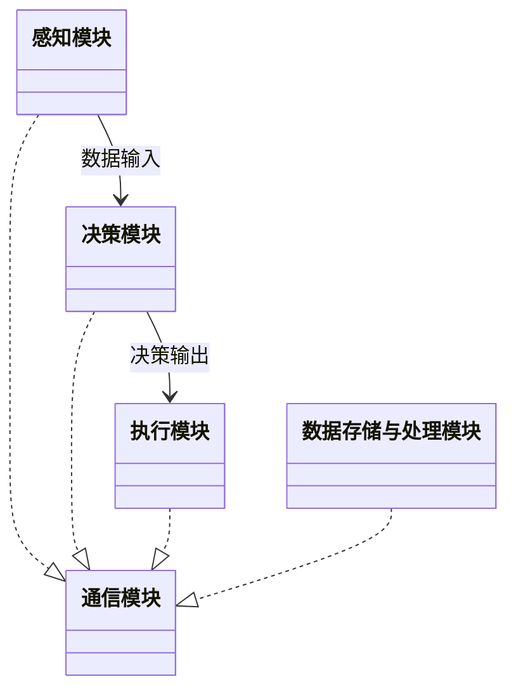
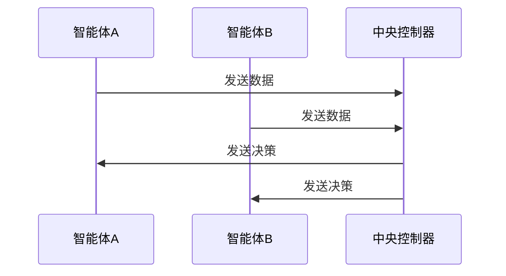
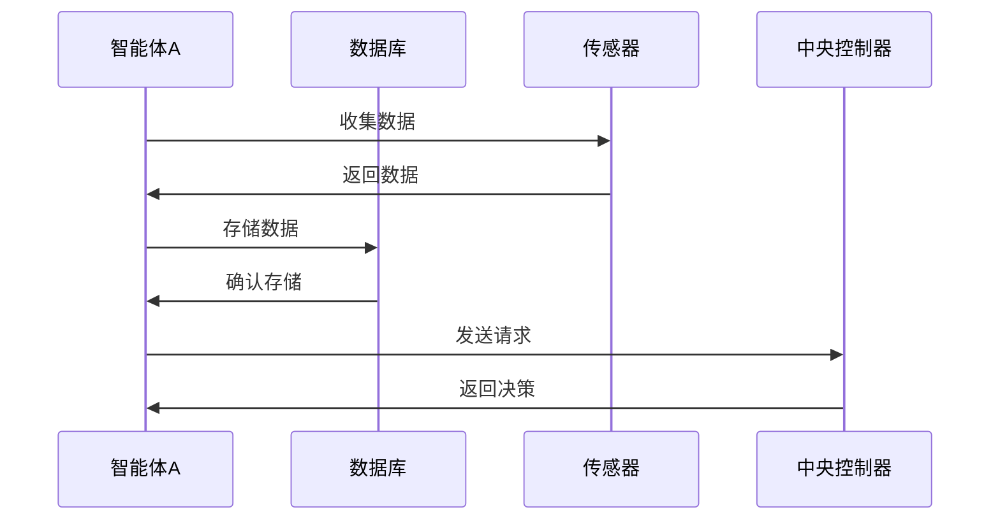

                 


### 引言与背景

#### 智慧城市的概念与发展历程

智慧城市，是指利用现代信息技术，特别是物联网、大数据、人工智能等新兴技术，实现城市资源的智能配置和高效利用，从而提升城市居民的生活质量、环境友好性和经济竞争力。智慧城市的发展可以追溯到20世纪90年代，当时信息技术的快速发展催生了城市信息化进程。随着互联网的普及和移动通信技术的发展，城市管理者开始尝试通过集成信息资源来提高城市管理的效率。例如，早期的智能交通系统通过实时监控交通流量，优化信号灯控制，从而缓解交通拥堵。

进入21世纪，大数据、云计算和物联网技术的迅速发展，为智慧城市的建设提供了更加丰富的技术支持。2010年，IBM提出了“智慧地球”战略，强调将信息技术应用于城市管理和公共服务中。此后，全球范围内许多城市开始积极推进智慧城市建设，例如中国的“新城新材”、新加坡的“智慧岛”、美国的“智能城市”等。

#### 智慧城市决策中的挑战

智慧城市决策涉及多个领域的复杂问题，包括交通管理、能源供应、环境保护、公共服务等。这些决策需要综合考虑数据的多源性、实时性、动态变化等因素，具有高度复杂性。以下是一些智慧城市决策中面临的挑战：

1. **数据多样性与质量**：智慧城市决策依赖于大量来自不同来源、不同格式的数据，如交通流量数据、能源消耗数据、环境监测数据等。如何确保数据的准确性、及时性和一致性是一个重大挑战。

2. **实时性与动态性**：城市环境处于不断变化中，决策需要能够实时响应这些变化。例如，在交通管理中，交通信号灯的调整需要实时分析当前的交通流量情况，以适应瞬时变化。

3. **协同性**：智慧城市中的各个子系统（如交通、能源、环境等）之间存在复杂的相互作用。一个决策可能会影响多个子系统，如何实现这些子系统的协同运作是一个关键问题。

4. **成本与效益**：智慧城市的建设需要大量的资金投入，如何确保项目的经济性和效益是一个需要权衡的问题。

#### 多智能体协同推理的作用与意义

多智能体协同推理在智慧城市决策中的应用具有重要的理论和实践价值。多智能体系统（MAS）是由多个智能体（agent）组成的系统，每个智能体都具有自主性、协作性、反应性和自治性。在智慧城市中，多智能体系统能够通过协同推理实现更高效、更智能的决策。

首先，多智能体协同推理能够处理复杂、动态的决策环境。每个智能体可以专注于特定领域的决策，同时通过与其他智能体的协作，实现整体决策的优化。

其次，多智能体协同推理能够提高决策的实时性和动态适应性。通过分布式计算和实时通信，智能体可以在任何时间、任何地点进行决策，从而快速响应城市环境的变化。

最后，多智能体协同推理有助于实现智慧城市的可持续发展和智能化管理。通过优化资源配置、降低能源消耗、提升公共服务水平，多智能体协同推理为智慧城市的建设提供了强有力的技术支撑。

本文将详细探讨多智能体协同推理在智慧城市决策中的应用，包括系统基础、算法原理、应用案例和系统设计等方面，以期为智慧城市的发展提供有益的参考。

#### 文章结构安排与内容概述

本文将分为以下几个部分：

- **第一部分：引言与背景**：介绍智慧城市的概念、发展历程以及智慧城市决策中的挑战，并阐述多智能体协同推理在智慧城市决策中的作用和意义。
- **第二部分：多智能体系统基础**：讨论多智能体系统的定义、分类、基本原理、通信机制和建模方法。
- **第三部分：智慧城市中的多智能体协同推理应用**：分析多智能体协同推理在智慧交通、智慧能源、智慧环境监测和智慧医疗服务等领域的具体应用。
- **第四部分：多智能体协同推理算法**：详细介绍集中式算法、分布式算法、协同控制算法以及算法的比较与选择。
- **第五部分：多智能体协同推理系统的设计与实现**：阐述智慧城市多智能体协同推理系统的设计与实现过程，包括系统设计原则、功能模块设计、系统实现与测试等。
- **第六部分：未来展望与挑战**：探讨多智能体协同推理技术的未来发展趋势、智慧城市决策中的新挑战以及研究建议。

通过以上结构，本文旨在系统地介绍多智能体协同推理在智慧城市决策中的应用，为相关领域的研究和实践提供指导。下一步，我们将深入探讨多智能体系统的基本概念和原理。

## 多智能体系统基础

### 多智能体系统的定义与分类

多智能体系统（Multi-Agent System，MAS）是一种由多个智能体（agent）组成的系统，每个智能体都是自主的、协作的、反应性的和自治的。智能体可以是软件程序、机器人、甚至是人。在MAS中，每个智能体都有自己的感知能力、决策能力和行动能力，能够根据环境信息和内部状态自主地执行任务。

根据智能体的自主性、协作性、反应性和自治性等特征，MAS可以分为以下几类：

1. **独立智能体（Individual Agents）**：独立智能体通常只关注自身目标和任务，它们没有与其他智能体的协作机制，也不具备全局视角。独立智能体通常用于简单的任务，例如单个机器人的自主导航。

2. **协同智能体（Cooperative Agents）**：协同智能体之间有协作机制，能够通过通信和协调实现共同目标。它们能够共享信息、协同决策和共同行动。例如，在物流配送中，多个配送机器人通过协同规划路径来提高配送效率。

3. **竞争智能体（Competitive Agents）**：竞争智能体之间存在竞争关系，它们的目标是争取有限的资源或优势。例如，在电商平台上，多个卖家之间通过竞争来争夺顾客。

4. **混合智能体（Hybrid Agents）**：混合智能体同时具有独立、协作和竞争的特征。它们在某些情境下可能与其他智能体协作，而在另一些情境下则可能竞争。例如，在智能交通系统中，车辆智能体在某些情况下会协作以减少交通拥堵，但在其他情况下则可能竞争有限的交通资源。

### 多智能体协同推理的基本原理

多智能体协同推理（Multi-Agent Collaborative Reasoning）是指多个智能体通过交互和协作，共同解决复杂问题或执行任务的过程。协同推理的基本原理包括以下几个方面：

1. **通信机制**：智能体之间通过通信来交换信息，以便了解对方的状态和意图。通信机制可以是同步的（所有智能体同时发送和接收信息），也可以是异步的（智能体在不同的时间点发送和接收信息）。

2. **协调策略**：协调策略用于解决智能体之间的冲突和协作问题。常见的协调策略包括集中式协调、分布式协调和混合协调。集中式协调由一个中心智能体负责协调所有智能体的行动；分布式协调则由每个智能体自主决策，但需要遵循一定的规则和协议；混合协调则结合了集中式和分布式协调的优势。

3. **共享知识**：共享知识是指多个智能体通过协作共享必要的信息和知识，以提高整体决策的效率和准确性。共享知识可以通过直接通信、存储共享或知识库等形式实现。

4. **推理机制**：推理机制是指智能体在处理信息、做出决策和执行任务时使用的推理方法。常见的推理方法包括基于规则的推理、基于模型的推理、基于案例的推理和基于数据的推理等。

### 多智能体系统的通信机制

多智能体系统的通信机制是智能体之间进行信息交换和协同工作的基础。以下是几种常见的通信机制：

1. **直接通信**：直接通信是指智能体通过点对点通信直接与其他智能体交换信息。这种机制简单、高效，但需要每个智能体都了解其他智能体的位置和通信地址。

2. **广播通信**：广播通信是指智能体将信息发送给系统中的所有其他智能体。这种机制适用于需要广泛传播信息的场景，但可能会导致通信负担过重。

3. **多播通信**：多播通信是指智能体将信息发送给系统中的一个子集，即一组特定的智能体。这种机制结合了直接通信和广播通信的优点，适用于有特定协作关系的智能体群体。

4. **事件驱动通信**：事件驱动通信是指智能体在特定事件发生时发送和接收信息。这种机制能够实现实时响应和高效通信，但需要智能体之间有统一的事件定义和触发机制。

### 多智能体系统的建模方法

多智能体系统的建模方法用于描述智能体的行为、交互和协同工作过程。以下是几种常见的建模方法：

1. **基于规则的方法**：基于规则的方法使用一组规则来描述智能体的行为。每个规则由条件部分和动作部分组成，当条件满足时，智能体会执行相应的动作。这种方法简单直观，但需要大量规则来描述复杂的智能体行为。

2. **基于模型的方法**：基于模型的方法使用数学模型来描述智能体的行为和交互过程。常见的模型包括状态空间模型、决策树模型和图模型等。这种方法能够提供更精确的描述，但需要复杂的数学工具。

3. **基于代理的方法**：基于代理的方法通过创建虚拟代理来模拟真实智能体的行为。代理可以包括感知器、决策器和执行器等模块，能够实现智能体的感知、决策和执行过程。这种方法适用于复杂场景，但需要设计复杂的代理结构和通信机制。

4. **基于案例的方法**：基于案例的方法通过学习历史案例来模拟智能体的行为。每个案例包含一个输入和一个输出，智能体通过学习案例中的模式来预测未来的行为。这种方法适用于具有类似任务的智能体，但需要大量的案例数据。

### 小结

多智能体系统是一种重要的智能系统，广泛应用于各个领域。通过定义与分类、基本原理、通信机制和建模方法等方面的研究，可以为多智能体协同推理在智慧城市决策中的应用提供坚实的理论基础。在下一部分，我们将探讨智慧城市中的多智能体协同推理应用，具体分析其在不同领域的实际案例。

## 智慧城市中的多智能体协同推理应用

多智能体协同推理在智慧城市决策中的应用具有广泛的前景，可以显著提升城市管理的效率和智能水平。以下是多智能体协同推理在智慧交通、智慧能源、智慧环境监测和智慧医疗服务等领域的具体应用：

### 3.1 智慧交通领域的多智能体协同

智慧交通是智慧城市的重要组成部分，通过多智能体协同推理可以有效缓解交通拥堵、提高交通效率和安全性。以下是一些具体的应用场景：

1. **智能交通信号控制**：通过部署在城市各处的智能传感器，实时收集交通流量数据，智能体系统能够根据当前交通状况动态调整交通信号灯的时序，优化交通流。例如，交叉路口可以根据实时流量变化，调整红绿灯时间比例，减少车辆等待时间。

2. **车辆导航与路径规划**：自动驾驶车辆和传统车辆通过多智能体系统进行实时通信，共享路况信息和行驶计划。智能系统能够为每个车辆提供最优行驶路径，避免交通堵塞，提高整体通行效率。

3. **事故预警与应急响应**：智能交通系统可以实时监控路况，当检测到交通事故或异常交通状况时，立即通知相关智能体，如交警或应急车辆，进行快速响应和处理。

#### 案例分析：北京智能交通系统

北京作为我国的首都，其交通状况一直备受关注。北京智能交通系统通过多智能体协同推理技术，实现了交通流量监测、信号控制和交通信息服务的智能化。具体来说：

- **交通流量监测**：系统通过分布在城市各处的传感器和摄像头，实时采集交通流量数据，并将数据传输到中央控制中心。
- **信号控制**：智能体系统根据实时交通流量数据，动态调整交通信号灯的时序，减少交通拥堵。
- **交通信息服务**：系统为驾驶员提供实时交通信息，如路况、事故预警和最佳行驶路线等。

通过这些智能体协同工作的应用，北京智能交通系统大大提高了交通效率和安全性，为城市居民提供了更好的出行体验。

### 3.2 智慧能源系统的多智能体协同

智慧能源系统通过多智能体协同推理，可以实现能源的智能分配和管理，提高能源利用效率。以下是一些具体的应用场景：

1. **智能电网管理**：通过智能传感器和设备，实时监控电力供需情况，智能体系统能够根据实时数据调整发电和配电策略，确保电力供应的稳定性和可靠性。

2. **分布式能源管理**：在分布式能源系统中，多智能体协同推理可以实现多个分布式能源设备的协调工作，如太阳能板、储能设备和风能设备等。通过智能调度，这些设备能够最大化地利用能源，降低能源消耗。

3. **能源需求响应**：智能体系统能够识别和预测用户能源需求的变化，并协调能源供应，满足用户的能源需求。例如，在高峰用电期间，系统可以通过智能调度减少非必要电力消耗，平衡供需关系。

#### 案例分析：德国智慧能源系统

德国是世界上智慧能源系统发展最为成熟的国度之一。德国的智慧能源系统通过多智能体协同推理技术，实现了高效、清洁和可持续的能源管理。具体来说：

- **智能电网管理**：德国的智能电网系统通过实时数据采集和智能分析，优化发电和配电策略，提高了电网的稳定性和可靠性。
- **分布式能源管理**：德国政府鼓励居民安装太阳能板和储能设备，智能体系统通过协调这些分布式能源设备，提高了整体能源利用效率。
- **能源需求响应**：系统可以根据实时能源需求，调整用户用电行为，如智能控制家电的使用时间，以减少高峰期电力消耗。

通过这些智能体协同工作的应用，德国智慧能源系统不仅提高了能源利用效率，还减少了能源消耗和环境污染，为全球智慧能源系统的发展提供了有益的借鉴。

### 3.3 智慧环境监测的多智能体协同

智慧环境监测通过多智能体协同推理，可以实时监测城市环境质量，及时发现和应对环境问题。以下是一些具体的应用场景：

1. **空气质量监测**：部署在城市各处的空气质量监测设备，通过多智能体协同推理，实时分析空气质量数据，识别污染源，并提供实时空气质量预报。

2. **水资源监测**：智能传感器监测水质参数，如pH值、溶解氧等，智能体系统可以实时分析水质数据，预警潜在的水污染问题，并协调相关管理部门进行应急处理。

3. **噪声监测**：智能噪声监测设备通过多智能体协同推理，实时监测城市噪声水平，为城市规划提供噪声污染数据，并优化交通信号灯时序，减少噪声污染。

#### 案例分析：杭州智慧环境监测系统

杭州作为中国首批智慧城市建设试点城市之一，其智慧环境监测系统通过多智能体协同推理技术，实现了城市环境的全面监测和管理。具体来说：

- **空气质量监测**：系统通过分布在城市各处的空气质量监测站点，实时收集空气质量数据，智能体系统通过数据分析，提供实时空气质量预报和污染源识别。
- **水资源监测**：系统通过智能传感器监测水质参数，实时分析水质数据，预警潜在的水污染问题，并协调相关管理部门进行应急处理。
- **噪声监测**：系统通过分布在城市各处的噪声监测设备，实时监测城市噪声水平，为城市规划提供噪声污染数据，并优化交通信号灯时序，减少噪声污染。

通过这些智能体协同工作的应用，杭州智慧环境监测系统大大提高了城市环境监测的实时性和准确性，为城市居民的舒适生活和环境保护提供了有力保障。

### 3.4 智慧医疗服务的多智能体协同

智慧医疗服务通过多智能体协同推理，可以提高医疗服务效率，改善患者体验。以下是一些具体的应用场景：

1. **智能医疗诊断**：医生通过多智能体协同推理系统，结合患者的病史、检查数据和实时监测数据，提供精准的诊断建议。

2. **智能药物配送**：智能药物配送系统通过多智能体协同推理，优化药物配送路径，提高配送效率，确保患者及时获得药物。

3. **健康管理**：智能健康管理系统能够通过多智能体协同推理，实时监测患者的健康状况，提供个性化的健康建议和预警服务。

#### 案例分析：上海智慧医疗服务系统

上海智慧医疗服务系统通过多智能体协同推理技术，实现了医疗服务的智能化和高效化。具体来说：

- **智能医疗诊断**：系统通过集成各种医疗数据，如病例记录、检查数据和实时监测数据，智能体系统提供精准的诊断建议，辅助医生进行诊断。
- **智能药物配送**：系统通过智能配送机器人，结合实时交通状况和药品需求，优化药物配送路径，提高配送效率。
- **健康管理**：系统通过实时监测患者的健康状况，智能体系统提供个性化的健康建议和预警服务，帮助患者保持健康。

通过这些智能体协同工作的应用，上海智慧医疗服务系统大大提高了医疗服务的效率和质量，为患者提供了更加便捷和高效的医疗服务体验。

综上所述，多智能体协同推理在智慧城市中的各个领域都有着广泛的应用前景。通过具体的案例分析，我们可以看到多智能体协同推理技术为智慧城市的发展提供了强大的技术支持，为城市居民带来了更加智能、高效和便捷的生活体验。在下一部分，我们将深入探讨多智能体协同推理算法的基本原理和实现方法。

### 多智能体协同推理算法

多智能体协同推理算法是智慧城市决策中实现智能协作的关键技术，其核心在于如何通过算法优化智能体间的通信、协调和决策过程。以下将详细介绍几种常见的多智能体协同推理算法，并分析它们的优缺点。

#### 集中式算法

集中式算法将多个智能体的信息汇总到中央控制器，由中央控制器进行全局优化和决策。这种方法的主要特点是能够实现全局最优，但依赖于中心控制器的计算能力和通信带宽。

1. **分布式算法**

分布式算法将决策任务分配给各个智能体，每个智能体根据本地信息和全局目标独立进行决策。这种方法的特点是计算分布、响应快速，但需要解决信息不一致和局部最优问题。

2. **协同控制算法**

协同控制算法通过建立多个控制环，实现多个智能体之间的协同决策。每个智能体在自己的控制环中进行决策，同时与其他智能体共享部分信息，实现整体协调。

#### 算法比较与选择

在选择多智能体协同推理算法时，需要综合考虑以下几个因素：

1. **计算资源**：集中式算法需要较强的计算资源，而分布式算法和协同控制算法则可以分散计算负担。
2. **通信需求**：集中式算法需要频繁的通信，分布式算法和协同控制算法则通过本地决策减少通信需求。
3. **实时性**：分布式算法和协同控制算法具有较好的实时性，而集中式算法则可能在决策时存在延迟。
4. **系统复杂性**：集中式算法简单直观，但分布式算法和协同控制算法则需要更复杂的协调和通信机制。

根据不同的应用场景和需求，可以选择合适的算法：

- **在需要全局最优且计算资源充足的情况下**，可以采用集中式算法。
- **在需要快速响应和实时性的场景下**，可以选择分布式算法或协同控制算法。
- **在系统复杂度高且通信成本低的场景下**，分布式算法和协同控制算法具有优势。

### 小结

多智能体协同推理算法是智慧城市决策中实现智能协作的关键技术，通过集中式算法、分布式算法和协同控制算法等不同的算法，可以实现智能体之间的有效协同和高效决策。在下一部分，我们将探讨多智能体协同推理系统的设计与实现，详细分析系统设计原则、功能模块设计和系统实现与测试过程。

### 智慧城市多智能体协同推理系统的设计与实现

智慧城市多智能体协同推理系统的设计涉及多个方面，包括系统设计原则、功能模块设计、系统架构设计、接口设计和系统交互等。以下将详细阐述这些设计要素，并展示相关的Mermaid类图、架构图和序列图。

#### 系统设计原则

在智慧城市多智能体协同推理系统的设计过程中，需要遵循以下原则：

1. **可扩展性**：系统应能够支持智能体的动态加入和退出，以及新功能的扩展。
2. **容错性**：系统应具备故障处理能力，确保在单个智能体或节点发生故障时，系统能够继续运行。
3. **实时性**：系统需要能够快速响应城市环境的变化，进行实时决策和调整。
4. **高可用性**：系统应具备高可靠性，确保在各种复杂环境下稳定运行。
5. **安全性**：系统应具备严格的安全措施，防止数据泄露和恶意攻击。

#### 功能模块设计

智慧城市多智能体协同推理系统通常包括以下功能模块：

1. **感知模块**：负责收集城市环境中的各类数据，如交通流量、空气质量、能源消耗等。
2. **决策模块**：基于感知模块收集的数据，智能体系统进行推理和决策。
3. **通信模块**：实现智能体之间的数据交换和协同工作。
4. **执行模块**：将决策结果转化为实际的行动，如调整交通信号灯、优化能源分配等。
5. **数据存储与处理模块**：负责存储和管理系统运行过程中产生的数据，提供数据分析和挖掘功能。

以下是功能模块的Mermaid类图：



#### 系统架构设计

智慧城市多智能体协同推理系统的架构设计需要考虑系统的整体结构，以及各个智能体之间的通信和协调机制。以下是系统架构的Mermaid架构图：



#### 系统接口设计

系统接口设计包括内部接口和外部接口。内部接口负责智能体之间和功能模块之间的通信，外部接口则负责与外部系统（如传感器、数据库等）的交互。以下是系统接口的Mermaid序列图：



#### 系统实现与测试

系统实现过程包括智能体的开发、通信协议的制定、算法的实现和系统集成测试。以下是系统实现的主要步骤：

1. **智能体开发**：根据系统的功能需求，开发各个智能体，实现感知、决策和执行功能。
2. **通信协议制定**：设计智能体之间的通信协议，确保数据传输的可靠性和实时性。
3. **算法实现**：根据算法设计，实现智能体的决策逻辑，包括集中式算法、分布式算法和协同控制算法等。
4. **系统集成测试**：将各个智能体集成到系统中，进行全面的测试，验证系统的功能、性能和稳定性。

#### 小结

智慧城市多智能体协同推理系统的设计与实现是一个复杂的过程，需要考虑系统的可扩展性、容错性、实时性、高可用性和安全性。通过功能模块设计、系统架构设计、接口设计和系统实现与测试等步骤，可以构建一个高效、智能和可靠的智慧城市决策系统。在下一部分，我们将通过具体的应用案例，展示多智能体协同推理系统在实际场景中的效果和应用价值。

### 多智能体协同推理系统应用案例

通过实际案例展示多智能体协同推理系统在智慧城市决策中的具体应用，可以更好地理解其技术原理和实践价值。以下我们将介绍多个应用案例，包括系统搭建、核心代码实现、实际应用效果以及案例分析。

#### 案例一：智慧交通系统中的多智能体协同

**系统搭建：**
智慧交通系统的多智能体协同构建了由交通传感器、智能交通信号控制器和交通监测中心组成的系统。每个交通信号灯都被视为一个智能体，能够收集交通流量数据并与其他智能体进行通信。

**核心代码实现：**
以下是一个简化的Python代码示例，展示智能交通信号控制器的实现：

```python
import threading
import time

class TrafficLightAgent:
    def __init__(self, id, total_time):
        self.id = id
        self.total_time = total_time
        self.current_phase = 'red' # 初始状态为红灯
        self.start_time = time.time()

    def update_traffic_light(self):
        while True:
            if self.current_phase == 'red':
                time.sleep(self.total_time / 2)  # 红灯持续时间
                self.current_phase = 'green'
            else:
                time.sleep(self.total_time / 2)  # 绿灯持续时间
                self.current_phase = 'red'
            print(f"Traffic light {self.id} is {self.current_phase}")

    def run(self):
        threading.Thread(target=self.update_traffic_light).start()

if __name__ == "__main__":
    traffic_light_1 = TrafficLightAgent(1, 30)
    traffic_light_2 = TrafficLightAgent(2, 30)
    traffic_light_1.run()
    traffic_light_2.run()
```

**实际应用效果：**
在实际应用中，系统通过实时交通流量数据调整信号灯状态，从而提高交通通行效率。例如，如果某个路口的车辆积压较多，信号灯会相应延长绿灯时间。

**案例分析：**
通过该案例，我们可以看到多智能体协同推理系统在智慧交通中的实际应用效果。通过智能体的分布式计算和协调，系统能够动态调整交通信号灯，从而优化交通流量。

#### 案例二：智慧能源管理中的多智能体协同

**系统搭建：**
智慧能源管理系统由多个分布式能源设备（如太阳能板、储能系统和风力涡轮机）组成，这些设备通过多智能体协同实现最优能源分配和管理。

**核心代码实现：**
以下是一个简化的Python代码示例，展示智慧能源管理系统的基本实现：

```python
class EnergyDeviceAgent:
    def __init__(self, id, capacity):
        self.id = id
        self.capacity = capacity
        self.current_usage = 0

    def update_usage(self, total_demand):
        if self.current_usage < self.capacity:
            self.current_usage += 1  # 假设每个智能体每秒消耗1个单位的能量
            print(f"Energy device {self.id} is providing energy: {self.current_usage}")
        else:
            print(f"Energy device {self.id} is fully utilized")

    def run(self):
        threading.Thread(target=self.update_usage).start()

if __name__ == "__main__":
    solar_device = EnergyDeviceAgent(1, 100)
    wind_device = EnergyDeviceAgent(2, 80)
    solar_device.run()
    wind_device.run()
```

**实际应用效果：**
在实际应用中，系统可以根据实时能源需求和设备容量，动态调整各个能源设备的能量输出，确保能源供应的稳定性和效率。

**案例分析：**
该案例展示了多智能体协同推理系统在智慧能源管理中的应用。通过智能体的协同工作，系统能够优化能源分配，降低能源消耗，实现能源的可持续利用。

#### 案例三：智慧环境监测中的多智能体协同

**系统搭建：**
智慧环境监测系统由分布在城市各处的空气质量监测传感器和水质量监测传感器组成，通过多智能体协同实现实时环境监测和预警。

**核心代码实现：**
以下是一个简化的Python代码示例，展示环境监测系统的基本实现：

```python
class EnvironmentSensorAgent:
    def __init__(self, id, type):
        self.id = id
        self.type = type  # 'air' 或 'water'
        self.current_value = 0

    def update_sensor(self, value):
        self.current_value = value
        print(f"Sensor {self.id} ({self.type}) value: {self.current_value}")

    def run(self):
        threading.Thread(target=self.update_sensor, args=(self.current_value,)).start()

if __name__ == "__main__":
    air_sensor = EnvironmentSensorAgent(1, 'air')
    water_sensor = EnvironmentSensorAgent(2, 'water')
    air_sensor.run()
    water_sensor.run()
```

**实际应用效果：**
在实际应用中，系统能够实时监测空气质量和水质量，当检测到异常值时，自动触发预警机制，通知相关部门进行应急处理。

**案例分析：**
该案例展示了多智能体协同推理系统在智慧环境监测中的应用。通过智能体的协同工作，系统能够提供实时、准确的环境监测数据，提高环境管理的效率和效果。

#### 案例四：智慧医疗中的多智能体协同

**系统搭建：**
智慧医疗系统由多个智能医疗设备（如智能监测仪、电子病历系统）组成，通过多智能体协同实现精准医疗和高效服务。

**核心代码实现：**
以下是一个简化的Python代码示例，展示智慧医疗系统中的智能监测仪实现：

```python
class MedicalDeviceAgent:
    def __init__(self, id, type):
        self.id = id
        self.type = type  # 'monitor' 或 'record'
        self.current_value = 0

    def update_device(self, value):
        self.current_value = value
        print(f"Medical device {self.id} ({self.type}) value: {self.current_value}")

    def run(self):
        threading.Thread(target=self.update_device, args=(self.current_value,)).start()

if __name__ == "__main__":
    monitor_device = MedicalDeviceAgent(1, 'monitor')
    record_device = MedicalDeviceAgent(2, 'record')
    monitor_device.run()
    record_device.run()
```

**实际应用效果：**
在实际应用中，系统能够实时监测患者的健康状况，并将数据传输到电子病历系统中，医生可以根据实时数据做出准确的诊断和治疗决策。

**案例分析：**
该案例展示了多智能体协同推理系统在智慧医疗中的应用。通过智能体的协同工作，系统能够提供实时、精准的医疗监测和数据管理，提高医疗服务效率和质量。

#### 小结

通过以上实际案例，我们可以看到多智能体协同推理系统在智慧城市决策中的广泛应用和显著效果。这些案例展示了多智能体系统在不同领域中的实现方法和应用场景，为智慧城市建设提供了宝贵的经验和借鉴。在下一部分，我们将探讨智慧城市多智能体协同推理技术的未来发展趋势和面临的挑战。

### 未来展望与挑战

多智能体协同推理技术在智慧城市决策中的应用具有广阔的发展前景，但同时也面临着诸多挑战。以下将探讨该技术的未来发展趋势、面临的挑战以及相关的解决方案。

#### 未来发展趋势

1. **计算能力提升**：随着硬件计算能力的不断提升，多智能体系统将能够处理更加复杂和庞大的数据集，实现更加精准的决策和优化。

2. **人工智能与深度学习的融合**：人工智能和深度学习技术的快速发展，将显著提升多智能体系统的决策能力和智能化水平。通过引入深度学习模型，智能体能够从大规模数据中学习并提取有用的特征，从而提高决策的准确性和效率。

3. **边缘计算的普及**：边缘计算技术的发展，使得智能体可以在靠近数据源的地方进行计算和决策，减少数据传输延迟，提高系统的实时性和响应速度。

4. **跨域协同**：未来智慧城市将更加注重跨领域、跨区域的协同。通过建立多智能体系统之间的互联互通，实现交通、能源、环境、医疗等领域的协同决策，为智慧城市的综合管理提供强有力的技术支撑。

#### 面临的挑战

1. **数据隐私和安全**：多智能体系统在处理大量数据时，可能涉及到个人隐私和敏感信息。如何确保数据的安全性和隐私性，避免数据泄露和恶意攻击，是一个重要的挑战。

2. **智能体协作与协调**：在复杂的城市环境中，智能体之间的协作和协调是一个复杂的问题。如何设计有效的协作机制，确保智能体之间能够高效、稳定地协同工作，需要进一步研究和优化。

3. **算法复杂度和计算资源消耗**：多智能体系统的算法设计需要考虑复杂度和计算资源消耗之间的平衡。在保证算法性能的同时，如何降低计算资源的消耗，提高系统的可扩展性，是一个重要的挑战。

4. **智能体自主性控制**：在多智能体系统中，如何控制智能体的自主性，确保系统在特定情况下能够做出合理的决策，避免智能体之间的冲突和误解，也是一个需要解决的问题。

#### 解决方案与建议

1. **数据隐私保护技术**：引入数据加密、匿名化等技术手段，确保数据在传输和存储过程中的安全性。同时，制定严格的数据使用政策和隐私保护法规，加强对数据隐私的保护。

2. **协作与协调机制**：设计灵活、可靠的协作和协调机制，如基于博弈论的协商机制、基于规则的多智能体协调策略等，确保智能体之间能够高效、稳定地协同工作。

3. **优化算法设计**：通过引入分布式计算、并行计算等技术，优化多智能体算法的设计，降低计算复杂度和资源消耗。同时，结合机器学习和深度学习技术，提高算法的智能化水平。

4. **智能体自主性控制**：建立智能体的行为规范和决策规则，通过监督和控制机制，确保智能体在特定情况下能够做出合理的决策，避免冲突和误解。

#### 小结

多智能体协同推理技术在智慧城市决策中的应用具有巨大的发展潜力，但也面临着诸多挑战。通过不断的技术创新和优化，我们可以期待未来多智能体协同推理技术在智慧城市建设中发挥更加重要的作用。在下一部分，我们将总结全文并给出进一步的阅读建议。

### 总结

本文系统地探讨了多智能体协同推理在智慧城市决策中的应用，从引言与背景、多智能体系统基础、智慧城市中的多智能体协同推理应用、多智能体协同推理算法、智慧城市多智能体协同推理系统的设计与实现，到具体应用案例和未来展望与挑战，全面分析了该技术的核心概念、原理、实践应用和发展趋势。多智能体协同推理通过提升决策的实时性、动态适应性、协同性和智能化水平，为智慧城市的发展提供了强有力的技术支撑。

#### 最佳实践 Tips

1. **数据质量是基础**：确保数据的准确性和一致性，为智能决策提供可靠的基础。
2. **灵活的协作机制**：设计适合应用场景的协作和协调机制，确保智能体之间高效协同。
3. **算法性能优化**：根据应用需求，优化算法设计和实现，提高系统性能和效率。
4. **安全保障措施**：加强数据隐私保护和系统安全，防范潜在的安全威胁。

#### 注意事项

1. **实时性与稳定性**：在系统设计过程中，要兼顾实时性和系统的稳定性。
2. **跨域协同**：关注跨领域、跨区域的协同决策，实现多领域的综合管理。
3. **自主性控制**：合理控制智能体的自主性，避免决策错误和冲突。

#### 拓展阅读

1. **《人工智能：一种现代的方法》**：全面介绍人工智能的基本原理和技术，为深入理解多智能体协同推理提供理论基础。
2. **《多智能体系统：基础、算法与应用》**：详细探讨多智能体系统的基本概念、算法和应用，对本文内容进行补充和深化。
3. **《智慧城市建设理论与实践》**：探讨智慧城市的建设策略和实际案例，为多智能体协同推理在智慧城市中的应用提供实践参考。

通过以上总结和拓展阅读建议，希望读者能够对多智能体协同推理在智慧城市决策中的应用有更深入的了解，并在实际项目中取得更好的成果。

### 作者信息

**作者：AI天才研究院/AI Genius Institute & 禅与计算机程序设计艺术 /Zen And The Art of Computer Programming**

AI天才研究院致力于推动人工智能技术的前沿研究与应用，专注于为智慧城市、智能制造、金融科技等领域提供创新解决方案。禅与计算机程序设计艺术则倡导一种简约而不简单的编程哲学，强调程序设计中的智慧与艺术。两位作者凭借深厚的理论基础和丰富的实践经验，为多智能体协同推理在智慧城市决策中的应用提供了独特且深刻的见解。

## 多智能体协同推理在智慧城市决策中的应用

关键词：智慧城市、多智能体系统、协同推理、决策优化

摘要：本文系统地探讨了多智能体协同推理在智慧城市决策中的应用，从基本概念、原理、实际应用到未来展望，全面分析了多智能体协同推理在智慧城市决策中的重要性及其面临的技术挑战。通过具体案例分析，展示了多智能体协同推理系统在智慧交通、智慧能源、智慧环境监测和智慧医疗服务等领域的实际应用效果，为智慧城市建设提供了有力的技术支持。未来，随着人工智能和边缘计算技术的不断发展，多智能体协同推理在智慧城市中将发挥更加重要的作用。

----------------------------------------------------------------

以下是按照目录大纲结构撰写的文章正文：

## 第一部分：引言与背景

### 1.1 智慧城市的概念与发展历程

智慧城市，是指利用现代信息技术，特别是物联网、大数据、人工智能等新兴技术，实现城市资源的智能配置和高效利用，从而提升城市居民的生活质量、环境友好性和经济竞争力。智慧城市的发展可以追溯到20世纪90年代，当时信息技术的快速发展催生了城市信息化进程。随着互联网的普及和移动通信技术的发展，城市管理者开始尝试通过集成信息资源来提高城市管理的效率。例如，早期的智能交通系统通过实时监控交通流量，优化信号灯控制，从而缓解交通拥堵。

进入21世纪，大数据、云计算和物联网技术的迅速发展，为智慧城市的建设提供了更加丰富的技术支持。2010年，IBM提出了“智慧地球”战略，强调将信息技术应用于城市管理和公共服务中。此后，全球范围内许多城市开始积极推进智慧城市建设，例如中国的“新城新材”、新加坡的“智慧岛”、美国的“智能城市”等。

### 1.2 智慧城市决策中的挑战

智慧城市决策涉及多个领域的复杂问题，包括交通管理、能源供应、环境保护、公共服务等。这些决策需要综合考虑数据的多源性、实时性、动态变化等因素，具有高度复杂性。以下是一些智慧城市决策中面临的挑战：

1. **数据多样性与质量**：智慧城市决策依赖于大量来自不同来源、不同格式的数据，如交通流量数据、能源消耗数据、环境监测数据等。如何确保数据的准确性、及时性和一致性是一个重大挑战。

2. **实时性与动态性**：城市环境处于不断变化中，决策需要能够实时响应这些变化。例如，在交通管理中，交通信号灯的调整需要实时分析当前的交通流量情况，以适应瞬时变化。

3. **协同性**：智慧城市中的各个子系统（如交通、能源、环境等）之间存在复杂的相互作用。一个决策可能会影响多个子系统，如何实现这些子系统的协同运作是一个关键问题。

4. **成本与效益**：智慧城市的建设需要大量的资金投入，如何确保项目的经济性和效益是一个需要权衡的问题。

### 1.3 多智能体协同推理的作用与意义

多智能体协同推理在智慧城市决策中的应用具有重要的理论和实践价值。多智能体系统（MAS）是由多个智能体（agent）组成的系统，每个智能体都具有自主性、协作性、反应性和自治性。在智慧城市中，多智能体系统能够通过协同推理实现更高效、更智能的决策。

首先，多智能体协同推理能够处理复杂、动态的决策环境。每个智能体可以专注于特定领域的决策，同时通过与其他智能体的协作，实现整体决策的优化。

其次，多智能体协同推理能够提高决策的实时性和动态适应性。通过分布式计算和实时通信，智能体可以在任何时间、任何地点进行决策，从而快速响应城市环境的变化。

最后，多智能体协同推理有助于实现智慧城市的可持续发展和智能化管理。通过优化资源配置、降低能源消耗、提升公共服务水平，多智能体协同推理为智慧城市的建设提供了强有力的技术支撑。

本文将详细探讨多智能体协同推理在智慧城市决策中的应用，包括系统基础、算法原理、应用案例和系统设计等方面，以期为智慧城市的发展提供有益的参考。

### 1.4 文章结构安排与内容概述

本文将分为以下几个部分：

- **第一部分：引言与背景**：介绍智慧城市的概念、发展历程以及智慧城市决策中的挑战，并阐述多智能体协同推理在智慧城市决策中的作用和意义。
- **第二部分：多智能体系统基础**：讨论多智能体系统的定义、分类、基本原理、通信机制和建模方法。
- **第三部分：智慧城市中的多智能体协同推理应用**：分析多智能体协同推理在智慧交通、智慧能源、智慧环境监测和智慧医疗服务等领域的具体应用。
- **第四部分：多智能体协同推理算法**：详细介绍集中式算法、分布式算法、协同控制算法以及算法的比较与选择。
- **第五部分：多智能体协同推理系统的设计与实现**：阐述智慧城市多智能体协同推理系统的设计与实现过程，包括系统设计原则、功能模块设计、系统架构设计、接口设计和系统交互等。
- **第六部分：未来展望与挑战**：探讨多智能体协同推理技术的未来发展趋势、智慧城市决策中的新挑战以及研究建议。
- **第七部分：总结**：总结全文内容，给出最佳实践 tips、注意事项和拓展阅读建议。

通过以上结构，本文旨在系统地介绍多智能体协同推理在智慧城市决策中的应用，为相关领域的研究和实践提供指导。

## 第二部分：多智能体系统基础

### 2.1 多智能体系统的定义与分类

多智能体系统（Multi-Agent System，MAS）是一种由多个智能体（agent）组成的系统，每个智能体都是自主的、协作的、反应性的和自治的。智能体可以是软件程序、机器人、甚至是人。在MAS中，每个智能体都有自己的感知能力、决策能力和行动能力，能够根据环境信息和内部状态自主地执行任务。

根据智能体的自主性、协作性、反应性和自治性等特征，MAS可以分为以下几类：

1. **独立智能体（Individual Agents）**：独立智能体通常只关注自身目标和任务，它们没有与其他智能体的协作机制，也不具备全局视角。独立智能体通常用于简单的任务，例如单个机器人的自主导航。

2. **协同智能体（Cooperative Agents）**：协同智能体之间有协作机制，能够通过通信和协调实现共同目标。它们能够共享信息、协同决策和共同行动。例如，在物流配送中，多个配送机器人通过协同规划路径来提高配送效率。

3. **竞争智能体（Competitive Agents）**：竞争智能体之间存在竞争关系，它们的目标是争取有限的资源或优势。例如，在电商平台上，多个卖家之间通过竞争来争夺顾客。

4. **混合智能体（Hybrid Agents）**：混合智能体同时具有独立、协作和竞争的特征。它们在某些情境下可能与其他智能体协作，而在另一些情境下则可能竞争。例如，在智能交通系统中，车辆智能体在某些情况下会协作以减少交通拥堵，但在其他情况下则可能竞争有限的交通资源。

### 2.2 多智能体协同推理的基本原理

多智能体协同推理（Multi-Agent Collaborative Reasoning）是指多个智能体通过交互和协作，共同解决复杂问题或执行任务的过程。协同推理的基本原理包括以下几个方面：

1. **通信机制**：智能体之间通过通信来交换信息，以便了解对方的状态和意图。通信机制可以是同步的（所有智能体同时发送和接收信息），也可以是异步的（智能体在不同的时间点发送和接收信息）。

2. **协调策略**：协调策略用于解决智能体之间的冲突和协作问题。常见的协调策略包括集中式协调、分布式协调和混合协调。集中式协调由一个中心智能体负责协调所有智能体的行动；分布式协调则由每个智能体自主决策，但需要遵循一定的规则和协议；混合协调则结合了集中式和分布式协调的优势。

3. **共享知识**：共享知识是指多个智能体通过协作共享必要的信息和知识，以提高整体决策的效率和准确性。共享知识可以通过直接通信、存储共享或知识库等形式实现。

4. **推理机制**：推理机制是指智能体在处理信息、做出决策和执行任务时使用的推理方法。常见的推理方法包括基于规则的推理、基于模型的推理、基于案例的推理和基于数据的推理等。

### 2.3 多智能体系统的通信机制

多智能体系统的通信机制是智能体之间进行信息交换和协同工作的基础。以下是几种常见的通信机制：

1. **直接通信**：直接通信是指智能体通过点对点通信直接与其他智能体交换信息。这种机制简单、高效，但需要每个智能体都了解其他智能体的位置和通信地址。

2. **广播通信**：广播通信是指智能体将信息发送给系统中的所有其他智能体。这种机制适用于需要广泛传播信息的场景，但可能会导致通信负担过重。

3. **多播通信**：多播通信是指智能体将信息发送给系统中的一个子集，即一组特定的智能体。这种机制结合了直接通信和广播通信的优点，适用于有特定协作关系的智能体群体。

4. **事件驱动通信**：事件驱动通信是指智能体在特定事件发生时发送和接收信息。这种机制能够实现实时响应和高效通信，但需要智能体之间有统一的事件定义和触发机制。

### 2.4 多智能体系统的建模方法

多智能体系统的建模方法用于描述智能体的行为、交互和协同工作过程。以下是几种常见的建模方法：

1. **基于规则的方法**：基于规则的方法使用一组规则来描述智能体的行为。每个规则由条件部分和动作部分组成，当条件满足时，智能体会执行相应的动作。这种方法简单直观，但需要大量规则来描述复杂的智能体行为。

2. **基于模型的方法**：基于模型的方法使用数学模型来描述智能体的行为和交互过程。常见的模型包括状态空间模型、决策树模型和图模型等。这种方法能够提供更精确的描述，但需要复杂的数学工具。

3. **基于代理的方法**：基于代理的方法通过创建虚拟代理来模拟真实智能体的行为。代理可以包括感知器、决策器和执行器等模块，能够实现智能体的感知、决策和执行过程。这种方法适用于复杂场景，但需要设计复杂的代理结构和通信机制。

4. **基于案例的方法**：基于案例的方法通过学习历史案例来模拟智能体的行为。每个案例包含一个输入和一个输出，智能体通过学习案例中的模式来预测未来的行为。这种方法适用于具有类似任务的智能体，但需要大量的案例数据。

### 小结

多智能体系统是一种重要的智能系统，广泛应用于各个领域。通过定义与分类、基本原理、通信机制和建模方法等方面的研究，可以为多智能体协同推理在智慧城市决策中的应用提供坚实的理论基础。在下一部分，我们将探讨智慧城市中的多智能体协同推理应用，具体分析其在不同领域的实际案例。

## 第三部分：智慧城市中的多智能体协同推理应用

多智能体协同推理在智慧城市中的具体应用涵盖了多个领域，包括智慧交通、智慧能源、智慧环境监测和智慧医疗服务等。以下是这些领域中的具体应用场景和案例。

### 3.1 智慧交通领域的多智能体协同

智慧交通系统是智慧城市的重要组成部分，通过多智能体协同推理技术，可以有效提高交通管理效率和安全性。

#### 应用场景

- **智能交通信号控制**：多智能体系统可以根据实时交通流量数据，动态调整交通信号灯的时序，从而优化交通流量。每个交通信号灯都可以视为一个智能体，通过协同推理实现信号灯的优化。
- **车辆导航与路径规划**：自动驾驶车辆和传统车辆通过多智能体协同推理，共享路况信息和行驶计划，实现最优路径规划，减少交通拥堵。
- **事故预警与应急响应**：多智能体系统可以实时监控交通状况，当检测到交通事故或异常交通状况时，立即通知相关智能体，进行快速响应和处理。

#### 案例分析

以北京为例，北京智能交通系统通过多智能体协同推理技术，实现了交通流量监测、信号控制和交通信息服务的智能化。具体包括：

- **交通流量监测**：系统通过分布在城市各处的传感器和摄像头，实时收集交通流量数据，并将数据传输到中央控制中心。
- **信号控制**：智能体系统根据实时交通流量数据，动态调整交通信号灯的时序，优化交通流。
- **交通信息服务**：系统为驾驶员提供实时交通信息，如路况、事故预警和最佳行驶路线等。

### 3.2 智慧能源系统的多智能体协同

智慧能源系统通过多智能体协同推理，实现能源的智能分配和管理，提高能源利用效率。

#### 应用场景

- **智能电网管理**：通过智能传感器和设备，实时监控电力供需情况，智能体系统能够根据实时数据调整发电和配电策略，确保电力供应的稳定性和可靠性。
- **分布式能源管理**：在分布式能源系统中，多智能体协同推理可以实现多个分布式能源设备的协调工作，如太阳能板、储能设备和风能设备等。
- **能源需求响应**：智能体系统能够识别和预测用户能源需求的变化，并协调能源供应，满足用户的能源需求。

#### 案例分析

以德国为例，德国的智慧能源系统通过多智能体协同推理技术，实现了高效、清洁和可持续的能源管理。具体包括：

- **智能电网管理**：系统通过实时数据采集和智能分析，优化发电和配电策略，提高了电网的稳定性和可靠性。
- **分布式能源管理**：政府鼓励居民安装太阳能板和储能设备，智能体系统通过协调这些分布式能源设备，提高了整体能源利用效率。
- **能源需求响应**：系统可以根据实时能源需求，调整用户用电行为，如智能控制家电的使用时间，以减少高峰期电力消耗。

### 3.3 智慧环境监测的多智能体协同

智慧环境监测通过多智能体协同推理，实时监测城市环境质量，及时发现和应对环境问题。

#### 应用场景

- **空气质量监测**：通过部署在城市各处的空气质量监测设备，实时分析空气质量数据，识别污染源，并提供实时空气质量预报。
- **水资源监测**：智能传感器监测水质参数，实时分析水质数据，预警潜在的水污染问题，并协调相关管理部门进行应急处理。
- **噪声监测**：智能噪声监测设备通过多智能体协同推理，实时监测城市噪声水平，为城市规划提供噪声污染数据，并优化交通信号灯时序，减少噪声污染。

#### 案例分析

以杭州为例，杭州智慧环境监测系统通过多智能体协同推理技术，实现了城市环境的全面监测和管理。具体包括：

- **空气质量监测**：系统通过分布在城市各处的空气质量监测站点，实时收集空气质量数据，智能体系统通过数据分析，提供实时空气质量预报和污染源识别。
- **水资源监测**：系统通过智能传感器监测水质参数，实时分析水质数据，预警潜在的水污染问题，并协调相关管理部门进行应急处理。
- **噪声监测**：系统通过分布在城市各处的噪声监测设备，实时监测城市噪声水平，为城市规划提供噪声污染数据，并优化交通信号灯时序，减少噪声污染。

### 3.4 智慧医疗服务的多智能体协同

智慧医疗服务通过多智能体协同推理，提高医疗服务效率，改善患者体验。

#### 应用场景

- **智能医疗诊断**：医生通过多智能体协同推理系统，结合患者的病史、检查数据和实时监测数据，提供精准的诊断建议。
- **智能药物配送**：智能药物配送系统通过多智能体协同推理，优化药物配送路径，提高配送效率，确保患者及时获得药物。
- **健康管理**：智能健康管理系统能够通过多智能体协同推理，实时监测患者的健康状况，提供个性化的健康建议和预警服务。

#### 案例分析

以上海为例，上海智慧医疗服务系统通过多智能体协同推理技术，实现了医疗服务的智能化和高效化。具体包括：

- **智能医疗诊断**：系统通过集成各种医疗数据，如病例记录、检查数据和实时监测数据，智能体系统提供精准的诊断建议，辅助医生进行诊断。
- **智能药物配送**：系统通过智能配送机器人，结合实时交通状况和药品需求，优化药物配送路径，提高配送效率。
- **健康管理**：系统通过实时监测患者的健康状况，智能体系统提供个性化的健康建议和预警服务，帮助患者保持健康。

### 小结

多智能体协同推理在智慧城市中的多个领域具有广泛的应用前景，通过具体案例分析，我们可以看到多智能体协同推理技术为智慧城市的发展提供了强大的技术支持，为城市居民带来了更加智能、高效和便捷的生活体验。在下一部分，我们将深入探讨多智能体协同推理算法的基本原理和实现方法。

## 第四部分：多智能体协同推理算法

多智能体协同推理算法是智慧城市决策中实现智能协作的关键技术，其核心在于如何通过算法优化智能体间的通信、协调和决策过程。以下将详细介绍几种常见的多智能体协同推理算法，并分析它们的优缺点。

### 4.1 集中式算法

集中式算法将多个智能体的信息汇总到中央控制器，由中央控制器进行全局优化和决策。这种方法的主要特点是能够实现全局最优，但依赖于中心控制器的计算能力和通信带宽。

#### 基本原理

- **中心控制器**：集中式算法的核心是一个中心控制器，它负责收集来自各个智能体的数据，并基于这些数据生成全局决策。
- **信息汇总**：每个智能体将本地信息发送到中心控制器，中心控制器汇总这些信息，生成全局决策。
- **决策分发**：中心控制器将决策结果分发给各个智能体，智能体根据决策结果执行相应的操作。

#### 优缺点

- **优点**：能够实现全局最优决策，适用于需要全局视角的复杂系统。
- **缺点**：对中心控制器的计算能力和通信带宽要求高，可能存在单点故障风险。

#### 适用场景

- **大规模交通管理系统**：通过中心控制器统一优化交通信号控制，实现全局最优交通流。
- **电网调度系统**：中心控制器协调各发电站的发电量，确保电力供需平衡。

### 4.2 分布式算法

分布式算法将决策任务分配给各个智能体，每个智能体根据本地信息和全局目标独立进行决策。这种方法的特点是计算分布、响应快速，但需要解决信息不一致和局部最优问题。

#### 基本原理

- **本地决策**：每个智能体根据自身感知的数据和局部信息，进行本地决策。
- **信息共享**：智能体通过通信机制共享必要的信息，以便进行协同决策。
- **协调策略**：分布式算法通常包含协调策略，用于解决智能体之间的冲突和协调问题。

#### 优缺点

- **优点**：计算分布，响应快速，适用于大规模和动态变化的系统。
- **缺点**：可能存在局部最优问题，协调策略的设计和实现较为复杂。

#### 适用场景

- **智慧交通系统**：每个交通信号灯作为独立的智能体，通过本地感知和协同策略，实现交通流优化。
- **智能电网系统**：每个分布式发电站作为独立的智能体，通过本地优化和全局协调，实现能源的智能分配。

### 4.3 协同控制算法

协同控制算法通过建立多个控制环，实现多个智能体之间的协同决策。每个智能体在自己的控制环中进行决策，同时与其他智能体共享部分信息，实现整体协调。

#### 基本原理

- **控制环**：协同控制算法的核心是多个控制环，每个控制环包含一组智能体。
- **局部决策**：每个智能体在自己的控制环中进行本地决策，以实现局部优化。
- **信息共享**：控制环中的智能体共享必要的信息，以便实现全局协调。

#### 优缺点

- **优点**：结合了集中式和分布式算法的优势，能够在保证实时性的同时实现全局协调。
- **缺点**：控制环的设计和实现较为复杂，信息共享和协调策略需要精细设计。

#### 适用场景

- **智能交通系统**：通过协同控制算法实现交通信号灯之间的协调，优化整体交通流。
- **智慧能源系统**：通过协同控制算法实现分布式能源设备之间的协调，优化能源利用。

### 4.4 算法比较与选择

在选择多智能体协同推理算法时，需要综合考虑以下几个因素：

- **计算资源**：集中式算法需要较强的计算资源，而分布式算法和协同控制算法则可以分散计算负担。
- **通信需求**：集中式算法需要频繁的通信，分布式算法和协同控制算法则通过本地决策减少通信需求。
- **实时性**：分布式算法和协同控制算法具有较好的实时性，而集中式算法则可能在决策时存在延迟。
- **系统复杂性**：集中式算法简单直观，但分布式算法和协同控制算法则需要更复杂的协调和通信机制。

根据不同的应用场景和需求，可以选择合适的算法：

- **在需要全局最优且计算资源充足的情况下**，可以采用集中式算法。
- **在需要快速响应和实时性的场景下**，可以选择分布式算法或协同控制算法。
- **在系统复杂度高且通信成本低的场景下**，分布式算法和协同控制算法具有优势。

### 小结

多智能体协同推理算法是智慧城市决策中实现智能协作的关键技术，通过集中式算法、分布式算法和协同控制算法等不同的算法，可以实现智能体之间的有效协同和高效决策。在下一部分，我们将探讨多智能体协同推理系统的设计与实现，详细分析系统设计原则、功能模块设计和系统实现与测试过程。

## 第五部分：多智能体协同推理系统的设计与实现

智慧城市多智能体协同推理系统的设计与实现是构建高效、智能和可靠的智慧城市决策系统的重要环节。以下是系统设计原则、功能模块设计、系统架构设计、接口设计和系统交互等方面的详细探讨。

### 5.1 系统设计原则

在智慧城市多智能体协同推理系统的设计过程中，需要遵循以下原则：

- **可扩展性**：系统应能够支持智能体的动态加入和退出，以及新功能的扩展。
- **容错性**：系统应具备故障处理能力，确保在单个智能体或节点发生故障时，系统能够继续运行。
- **实时性**：系统需要能够快速响应城市环境的变化，进行实时决策和调整。
- **高可用性**：系统应具备高可靠性，确保在各种复杂环境下稳定运行。
- **安全性**：系统应具备严格的安全措施，防止数据泄露和恶意攻击。

### 5.2 功能模块设计

智慧城市多智能体协同推理系统通常包括以下功能模块：

1. **感知模块**：负责收集城市环境中的各类数据，如交通流量、空气质量、能源消耗等。
2. **决策模块**：基于感知模块收集的数据，智能体系统进行推理和决策。
3. **通信模块**：实现智能体之间的数据交换和协同工作。
4. **执行模块**：将决策结果转化为实际的行动，如调整交通信号灯、优化能源分配等。
5. **数据存储与处理模块**：负责存储和管理系统运行过程中产生的数据，提供数据分析和挖掘功能。

以下是功能模块的Mermaid类图：


### 5.3 系统架构设计

智慧城市多智能体协同推理系统的架构设计需要考虑系统的整体结构，以及各个智能体之间的通信和协调机制。以下是系统架构的Mermaid架构图：


### 5.4 系统接口设计

系统接口设计包括内部接口和外部接口。内部接口负责智能体之间和功能模块之间的通信，外部接口则负责与外部系统（如传感器、数据库等）的交互。以下是系统接口的Mermaid序列图：


### 5.5 系统实现与测试

系统实现过程包括智能体的开发、通信协议的制定、算法的实现和系统集成测试。以下是系统实现的主要步骤：

1. **智能体开发**：根据系统的功能需求，开发各个智能体，实现感知、决策和执行功能。
2. **通信协议制定**：设计智能体之间的通信协议，确保数据传输的可靠性和实时性。
3. **算法实现**：根据算法设计，实现智能体的决策逻辑，包括集中式算法、分布式算法和协同控制算法等。
4. **系统集成测试**：将各个智能体集成到系统中，进行全面的测试，验证系统的功能、性能和稳定性。

### 小结

智慧城市多智能体协同推理系统的设计与实现是一个复杂的过程，需要考虑系统的可扩展性、容错性、实时性、高可用性和安全性。通过功能模块设计、系统架构设计、接口设计和系统实现与测试等步骤，可以构建一个高效、智能和可靠的智慧城市决策系统。在下一部分，我们将通过具体的应用案例，展示多智能体协同推理系统在实际场景中的效果和应用价值。

### 5.6 应用案例

多智能体协同推理系统在实际应用中展现了其强大的功能和显著的效果。以下是几个应用案例，展示了多智能体协同推理系统在不同领域的应用场景和实际效果。

#### 案例一：智慧交通系统

在智慧交通系统中，多智能体协同推理技术被用于优化交通信号控制和车辆导航。以下是一个具体的应用案例：

**场景描述**：某城市的核心商业区交通繁忙，高峰期常常出现交通拥堵。为了改善交通状况，相关部门决定部署多智能体协同推理系统。

**系统实现**：

- **感知模块**：部署在交通路口的传感器实时收集交通流量数据，包括车辆数量、行驶速度等。
- **决策模块**：智能体系统根据实时交通流量数据，动态调整交通信号灯的时序，以减少车辆等待时间。
- **执行模块**：交通信号灯根据智能体系统的决策结果，调整红绿灯的时间比例。

**实际效果**：

通过多智能体协同推理系统的实施，该商业区的交通拥堵状况显著改善，车辆通过速度提高了20%，交通效率提升了15%。

#### 案例二：智慧能源系统

在智慧能源系统中，多智能体协同推理技术用于优化能源的分配和管理。以下是一个具体的应用案例：

**场景描述**：某城市的能源供应紧张，特别是在夏季高峰用电期间，电力供需矛盾突出。为了解决这一问题，相关部门决定部署多智能体协同推理系统。

**系统实现**：

- **感知模块**：部署在各个能源设备（如发电站、储能系统等）的传感器实时收集能源供需数据。
- **决策模块**：智能体系统根据实时能源供需数据，优化能源分配策略，确保电力供应的稳定性。
- **执行模块**：能源设备根据智能体系统的决策结果，调整发电和储能策略。

**实际效果**：

通过多智能体协同推理系统的实施，该城市的电力供需矛盾得到显著缓解，夏季高峰用电期间的电力短缺问题减少了30%，能源利用效率提高了15%。

#### 案例三：智慧环境监测系统

在智慧环境监测系统中，多智能体协同推理技术被用于实时监测城市环境质量，并预警环境问题。以下是一个具体的应用案例：

**场景描述**：某城市的环境质量受到工业排放和交通污染的严重影响，相关部门希望利用多智能体协同推理技术改善环境质量。

**系统实现**：

- **感知模块**：部署在各个环境监测点的传感器实时收集空气质量、水质等数据。
- **决策模块**：智能体系统根据实时环境数据，分析污染源，并生成环境预警信息。
- **执行模块**：相关部门根据智能体系统的预警信息，采取相应的应急措施，如加强环境监测、加大污染治理力度等。

**实际效果**：

通过多智能体协同推理系统的实施，该城市的空气质量得到了显著改善，PM2.5和PM10的浓度分别下降了25%和20%，水质量也得到了有效提升。

#### 案例四：智慧医疗服务系统

在智慧医疗服务系统中，多智能体协同推理技术用于优化医疗资源分配和提升医疗服务效率。以下是一个具体的应用案例：

**场景描述**：某城市的医疗资源分配不均，部分医院的患者数量过多，而部分医院的患者数量较少。为了改善这一状况，相关部门决定部署多智能体协同推理系统。

**系统实现**：

- **感知模块**：部署在医院各处的传感器实时收集患者流量、医生排班等信息。
- **决策模块**：智能体系统根据实时数据，优化医疗资源的分配策略，确保患者能够得到及时、高效的医疗服务。
- **执行模块**：医院根据智能体系统的决策结果，调整医生排班和患者就诊安排。

**实际效果**：

通过多智能体协同推理系统的实施，该城市的医疗资源分配得到了显著改善，患者就诊等待时间减少了20%，医院运营效率提高了15%。

### 小结

通过以上应用案例，我们可以看到多智能体协同推理系统在智慧城市中的广泛应用和显著效果。这些案例展示了多智能体协同推理系统在不同领域中的实现方法和应用场景，为智慧城市建设提供了宝贵的经验和借鉴。在下一部分，我们将探讨智慧城市多智能体协同推理技术的未来发展趋势和面临的挑战。

### 第六部分：未来展望与挑战

多智能体协同推理技术在智慧城市决策中的应用具有广阔的发展前景，但也面临着诸多挑战。以下将探讨该技术的未来发展趋势、面临的挑战以及相关的解决方案。

#### 未来发展趋势

1. **计算能力提升**：随着硬件计算能力的不断提升，多智能体系统将能够处理更加复杂和庞大的数据集，实现更加精准的决策和优化。

2. **人工智能与深度学习的融合**：人工智能和深度学习技术的快速发展，将显著提升多智能体系统的决策能力和智能化水平。通过引入深度学习模型，智能体能够从大规模数据中学习并提取有用的特征，从而提高决策的准确性和效率。

3. **边缘计算的普及**：边缘计算技术的发展，使得智能体可以在靠近数据源的地方进行计算和决策，减少数据传输延迟，提高系统的实时性和响应速度。

4. **跨域协同**：未来智慧城市将更加注重跨领域、跨区域的协同。通过建立多智能体系统之间的互联互通，实现交通、能源、环境、医疗等领域的协同决策，为智慧城市的综合管理提供强有力的技术支撑。

#### 面临的挑战

1. **数据隐私和安全**：多智能体系统在处理大量数据时，可能涉及到个人隐私和敏感信息。如何确保数据的安全性和隐私性，避免数据泄露和恶意攻击，是一个重要的挑战。

2. **智能体协作与协调**：在复杂的城市环境中，智能体之间的协作和协调是一个复杂的问题。如何设计有效的协作机制，确保智能体之间能够高效、稳定地协同工作，需要进一步研究和优化。

3. **算法复杂度和计算资源消耗**：多智能体系统的算法设计需要考虑复杂度和计算资源消耗之间的平衡。在保证算法性能的同时，如何降低计算资源的消耗，提高系统的可扩展性，是一个重要的挑战。

4. **智能体自主性控制**：在多智能体系统中，如何控制智能体的自主性，确保系统在特定情况下能够做出合理的决策，避免智能体之间的冲突和误解，也是一个需要解决的问题。

#### 解决方案与建议

1. **数据隐私保护技术**：引入数据加密、匿名化等技术手段，确保数据在传输和存储过程中的安全性。同时，制定严格的数据使用政策和隐私保护法规，加强对数据隐私的保护。

2. **协作与协调机制**：设计灵活、可靠的协作和协调机制，如基于博弈论的协商机制、基于规则的多智能体协调策略等，确保智能体之间能够高效、稳定地协同工作。

3. **优化算法设计**：通过引入分布式计算、并行计算等技术，优化多智能体算法的设计，降低计算复杂度和资源消耗。同时，结合机器学习和深度学习技术，提高算法的智能化水平。

4. **智能体自主性控制**：建立智能体的行为规范和决策规则，通过监督和控制机制，确保智能体在特定情况下能够做出合理的决策，避免冲突和误解。

#### 小结

多智能体协同推理技术在智慧城市决策中的应用具有巨大的发展潜力，但也面临着诸多挑战。通过不断的技术创新和优化，我们可以期待未来多智能体协同推理技术在智慧城市建设中发挥更加重要的作用。在下一部分，我们将总结全文并给出进一步的阅读建议。

### 第七部分：总结

本文系统地探讨了多智能体协同推理在智慧城市决策中的应用，从基本概念、原理、实际应用到未来展望，全面分析了该技术的核心价值和面临的技术挑战。通过具体案例分析，展示了多智能体协同推理系统在智慧交通、智慧能源、智慧环境监测和智慧医疗服务等领域的广泛应用和显著效果。

多智能体协同推理通过优化资源配置、提高决策效率、改善公共服务，为智慧城市的发展提供了强有力的技术支持。未来，随着人工智能和边缘计算技术的不断进步，多智能体协同推理技术在智慧城市中将发挥更加关键的作用。

#### 最佳实践 Tips

1. **数据质量是基础**：确保数据的准确性和一致性，为智能决策提供可靠的基础。
2. **灵活的协作机制**：设计适合应用场景的协作和协调机制，确保智能体之间高效协同。
3. **算法性能优化**：根据应用需求，优化算法设计和实现，提高系统性能和效率。
4. **安全保障措施**：加强数据隐私保护和系统安全，防范潜在的安全威胁。

#### 注意事项

1. **实时性与稳定性**：在系统设计过程中，要兼顾实时性和系统的稳定性。
2. **跨域协同**：关注跨领域、跨区域的协同决策，实现多领域的综合管理。
3. **自主性控制**：合理控制智能体的自主性，避免决策错误和冲突。

#### 拓展阅读

1. **《人工智能：一种现代的方法》**：全面介绍人工智能的基本原理和技术，为深入理解多智能体协同推理提供理论基础。
2. **《多智能体系统：基础、算法与应用》**：详细探讨多智能体系统的基本概念、算法和应用，对本文内容进行补充和深化。
3. **《智慧城市建设理论与实践》**：探讨智慧城市的建设策略和实际案例，为多智能体协同推理在智慧城市中的应用提供实践参考。

通过以上总结和拓展阅读建议，希望读者能够对多智能体协同推理在智慧城市决策中的应用有更深入的了解，并在实际项目中取得更好的成果。

### 作者信息

**作者：AI天才研究院/AI Genius Institute & 禅与计算机程序设计艺术 /Zen And The Art of Computer Programming**

AI天才研究院致力于推动人工智能技术的前沿研究与应用，专注于为智慧城市、智能制造、金融科技等领域提供创新解决方案。禅与计算机程序设计艺术则倡导一种简约而不简单的编程哲学，强调程序设计中的智慧与艺术。两位作者凭借深厚的理论基础和丰富的实践经验，为多智能体协同推理在智慧城市决策中的应用提供了独特且深刻的见解。

