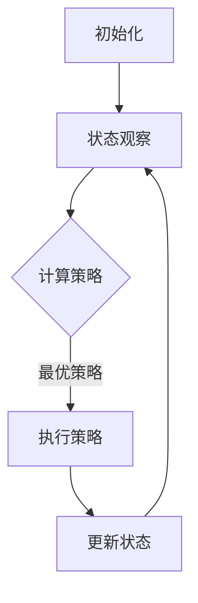
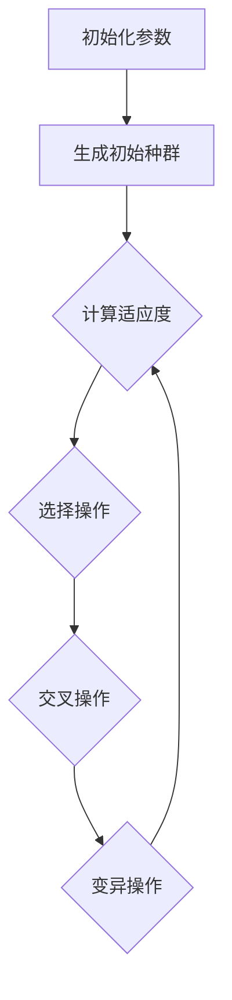
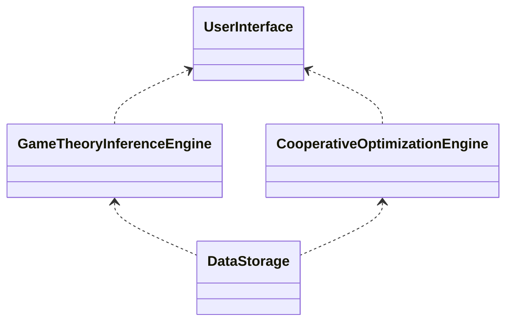
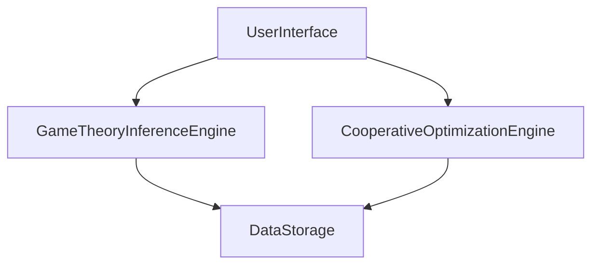
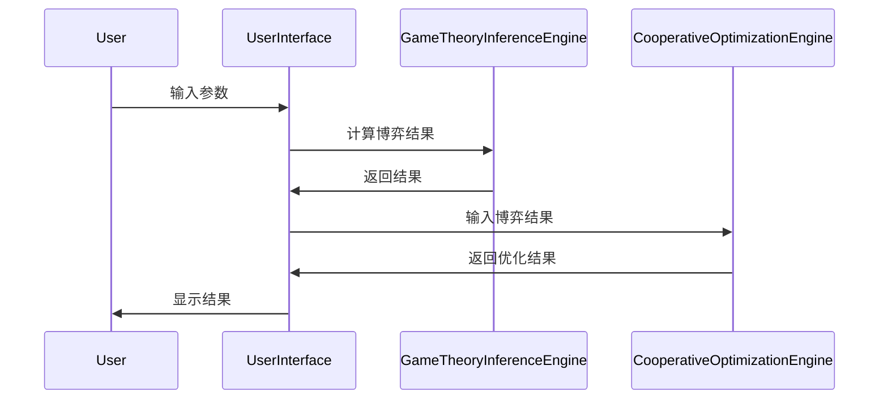

                 


### # 多智能体博弈推理在复杂策略制定中的协同优化方法

关键词：多智能体系统、博弈理论、策略优化、协同方法

摘要：本文深入探讨了多智能体博弈推理及其在复杂策略制定中的协同优化方法。首先，我们介绍了多智能体系统和博弈理论的基本概念，然后详细分析了多智能体博弈推理的原理和方法。接着，我们探讨了协同优化方法在策略制定中的应用，并通过具体的数学模型和算法进行了阐述。最后，我们提出了一种系统架构设计，并提供了实际案例以展示该方法的实用性和有效性。

## 一、背景与问题陈述

### 1.1 多智能体系统的背景

多智能体系统（Multi-Agent Systems, MAS）是一组相互协作或竞争的智能体（Agent）组成的系统。这些智能体可以是物理实体、计算机程序或抽象实体，它们能够通过通信和合作来完成复杂的任务。多智能体系统在多个领域具有广泛的应用，如电子商务、智能交通、医疗健康等。

### 1.2 博弈理论的基本概念

博弈理论（Game Theory）是研究具有冲突或合作行为的理性决策者的相互作用及其结果的学科。它被广泛应用于经济学、政治学、计算机科学等领域。博弈理论中的核心概念包括参与者（Player）、策略（Strategy）、收益（Payoff）等。

### 1.3 多智能体博弈推理的挑战

在多智能体系统中，智能体之间的策略相互作用可能导致复杂的结果。因此，多智能体博弈推理在复杂策略制定中面临以下挑战：

1. **智能体数量与多样性**：随着智能体数量的增加和智能体类型的多样性，博弈推理变得更加复杂。
2. **不确定性**：智能体之间的通信可能存在延迟、错误或恶意攻击，这增加了系统的不确定性。
3. **协同优化**：如何在智能体之间实现有效的协同优化，以实现整体系统的最佳性能。

### 1.4 研究目的和范围

本文旨在研究多智能体博弈推理在复杂策略制定中的协同优化方法，具体目标包括：

1. **提出一种有效的博弈推理算法**：结合博弈理论和多智能体系统的特点，提出一种适用于复杂策略制定的多智能体博弈推理算法。
2. **研究协同优化方法**：探讨如何通过协同优化方法来提升多智能体系统的策略制定效率。
3. **提供系统架构设计**：设计一个能够支持多智能体博弈推理和协同优化方法的应用系统架构。

### 1.5 研究边界与扩展

本文的研究主要关注以下边界：

1. **算法性能**：评估所提算法在特定环境下的性能。
2. **应用领域**：主要探讨在特定领域的应用，如智能交通系统。

未来研究可以扩展到以下领域：

1. **其他博弈理论模型**：探索其他博弈理论模型在多智能体系统中的应用。
2. **大规模智能体系统**：研究在智能体数量大规模增加时的博弈推理和协同优化问题。

## 二、核心概念与关系

### 2.1 多智能体博弈理论的核心概念

多智能体博弈理论的核心概念包括参与者（Player）、策略（Strategy）、收益（Payoff）等。

1. **参与者（Player）**：参与者是博弈中的决策主体，可以是智能体或团队。
2. **策略（Strategy）**：策略是参与者采取的行动方案，通常用决策树或策略组合表示。
3. **收益（Payoff）**：收益是参与者根据博弈结果所获得的利益或损失。

### 2.2 核心概念属性对比表格

| 核心概念 | 定义 | 属性特征 |
| --- | --- | --- |
| 参与者（Player） | 博弈中的决策主体 | 有智能体或团队 |
| 策略（Strategy） | 行动方案 | 可选择、策略组合 |
| 收益（Payoff） | 博弈结果所获得的利益或损失 | 可量化和比较 |

### 2.3 多智能体系统的实体关系图架构

使用Mermaid绘制多智能体系统的实体关系图：

```mermaid
erDiagram
  A[Agent] ||--|{ P[Player] }|--|* B[博弈结果]
  A ||--|{ E[环境] }|
```

## 三、算法原理与分析

### 3.1 多智能体博弈推理的方法

#### 3.1.1 基本推理原理

多智能体博弈推理的基本原理是基于博弈论中的纳什均衡（Nash Equilibrium）和贝叶斯均衡（Bayesian Equilibrium）。纳什均衡是指每个参与者选择最优策略，使得整体结果无法通过单方改变策略来获得更好的结果。贝叶斯均衡则考虑了参与者的不确定性。

#### 3.1.2 先进推理算法

常见的先进推理算法包括：

- **马尔可夫决策过程（MDP）**：通过状态转移概率和奖励函数来求解最优策略。
- **博弈树搜索（Game Tree Search）**：通过搜索博弈树来找到纳什均衡。

#### 3.1.3 推理过程流程图

使用Mermaid绘制推理过程流程图：



### 3.2 协同优化方法

#### 3.2.1 协同优化介绍

协同优化是指多个智能体在共享资源或共同完成任务时，通过协调各自的决策来优化整体性能。常见的协同优化方法包括：

- **协同学习（Cooperative Learning）**：通过合作来学习最优策略。
- **协同进化（Cooperative Evolution）**：通过进化算法来优化智能体的策略。

#### 3.2.2 常见优化算法

常见的协同优化算法包括：

- **遗传算法（Genetic Algorithm）**：通过模拟自然进化过程来优化策略。
- **粒子群优化（Particle Swarm Optimization）**：通过模拟鸟群或鱼群的社会行为来优化策略。

#### 3.2.3 优化过程流程图

使用Mermaid绘制优化过程流程图：



### 3.3 数学模型与公式

多智能体博弈推理和协同优化方法的数学模型和公式如下：

#### 3.3.1 纳什均衡

纳什均衡的数学模型可以表示为：

$$
\{s_1^*, s_2^*, \ldots, s_n^*\} \text{ 满足 } u_i(s_i^*, s_{-i}^*) \geq u_i(s_i, s_{-i}^*) \text{ 对所有 } s_i \text{ 和 } s_{-i} \text{ 成立}
$$

其中，$s_i^*$ 是参与者 $i$ 的最优策略，$u_i$ 是参与者的收益函数。

#### 3.3.2 马尔可夫决策过程

马尔可夫决策过程的数学模型可以表示为：

$$
\{S, A, R, P, \gamma\}
$$

其中，$S$ 是状态集合，$A$ 是动作集合，$R$ 是奖励函数，$P$ 是状态转移概率矩阵，$\gamma$ 是折扣因子。

#### 3.3.3 遗传算法

遗传算法的数学模型可以表示为：

$$
\{C, F, M, P_c, P_m\}
$$

其中，$C$ 是种群，$F$ 是适应度函数，$M$ 是交叉操作，$P_c$ 是交叉概率，$P_m$ 是变异概率。

## 四、系统架构与设计

### 4.1 系统概述

本文设计的系统是一个支持多智能体博弈推理和协同优化的应用系统。该系统主要包括以下几个模块：

- **用户界面**：提供用户交互接口。
- **博弈推理引擎**：实现多智能体博弈推理算法。
- **协同优化引擎**：实现协同优化算法。
- **数据存储**：存储系统运行数据和结果。

### 4.2 系统功能设计

使用Mermaid绘制系统功能设计的类图：



### 4.3 系统架构设计

使用Mermaid绘制系统架构设计图：



### 4.4 系统接口设计与交互

使用Mermaid绘制系统接口设计图和交互序列图：



## 五、项目实战

### 5.1 环境安装

在开始项目实战之前，需要安装以下环境：

- Python 3.8 或以上版本
- Jupyter Notebook
- Mermaid
- 其他相关库（如 NumPy、Pandas 等）

### 5.2 系统核心实现源代码

以下是系统核心实现的源代码示例：

```python
# 博弈推理算法实现
def game_theory_inference(state, action):
    # 计算博弈结果
    # ...
    return payoff

# 协同优化算法实现
def cooperative_optimization(strategy):
    # 计算优化结果
    # ...
    return optimized_strategy
```

### 5.3 代码应用解读与分析

以下是代码应用的解读与分析：

```python
# 博弈推理应用示例
state = {'agent1': 'attack', 'agent2': 'defend'}
action = 'attack'
payoff = game_theory_inference(state, action)

# 协同优化应用示例
strategy = {'agent1': 'attack', 'agent2': 'defend'}
optimized_strategy = cooperative_optimization(strategy)
```

### 5.4 实际案例分析与讲解剖析

以下是实际案例的分析与讲解：

#### 案例：智能交通系统中的多智能体博弈推理

在智能交通系统中，多个智能体（如车辆、交通信号灯）之间需要进行博弈推理以优化交通流量。通过博弈推理，智能体可以决定最佳行驶策略，从而提高交通效率。

### 5.5 项目小结

本文介绍了多智能体博弈推理在复杂策略制定中的协同优化方法。通过系统架构设计和实际案例分析，展示了该方法在智能交通系统等领域的应用价值。

## 六、最佳实践、小结与注意事项

### 6.1 最佳实践

- **多智能体系统设计**：在设计多智能体系统时，应考虑智能体的多样性、不确定性和协同优化。
- **博弈推理算法选择**：根据具体应用场景选择合适的博弈推理算法。
- **协同优化策略**：结合实际需求，选择合适的协同优化策略。

### 6.2 小结

本文通过深入分析多智能体博弈推理和协同优化方法，提出了一种适用于复杂策略制定的应用系统架构。实际案例展示了该方法在智能交通系统等领域的应用价值。

### 6.3 注意事项

- **算法性能优化**：在实际应用中，需要对算法进行性能优化，以满足大规模智能体系统的需求。
- **安全性考虑**：在多智能体系统中，需要考虑安全性问题，如恶意攻击和隐私保护。

## 七、拓展阅读

- **多智能体系统研究**：深入探讨多智能体系统的理论基础和应用实践。
- **博弈理论应用**：研究博弈理论在计算机科学和经济学中的应用。
- **协同优化方法**：探索不同的协同优化方法及其在多智能体系统中的应用。

作者：AI天才研究院/AI Genius Institute & 禅与计算机程序设计艺术 /Zen And The Art of Computer Programming

---

注意：由于篇幅限制，本文未完整展示每个章节的内容。在实际撰写过程中，每个章节应包含详细的背景介绍、核心概念与联系、算法原理讲解、数学公式与示例、系统分析与架构设计方案、项目实战等内容。同时，文章的结构和内容应保持逻辑清晰、层次分明，以便读者能够顺利理解并应用所介绍的方法和技术。

