                 

# 多智能体博弈推理在复杂策略制定中的应用

## 关键词

- 多智能体系统（MAS）
- 博弈论
- 推理方法
- 复杂策略制定
- 智能体协同

## 摘要

本文将深入探讨多智能体博弈推理在复杂策略制定中的应用。首先，我们将介绍多智能体系统的基本概念和问题背景，然后详细阐述博弈论和推理方法的核心原理，最后通过实际案例展示如何在复杂环境中制定有效策略。本文旨在为读者提供一个系统而全面的多智能体博弈策略制定指南。

## 背景与概述

### 多智能体系统的定义

多智能体系统（Multi-Agent Systems，MAS）是由多个独立、相互作用的智能体组成的一个复杂系统。每个智能体都具有自主性、社交性和适应性，能够通过通信和协作来实现共同的目标。MAS在许多领域都有广泛应用，如无人驾驶、智能交通、金融交易、物联网等。

### 多智能体系统的研究意义

MAS的研究意义在于其能够模拟真实世界中的复杂系统，实现更高效的决策和资源分配。通过智能体的协作，MAS可以解决许多单智能体系统难以应对的问题，如不确定性、动态环境、多目标优化等。

### 多智能体系统的发展历程

多智能体系统的发展可以追溯到20世纪80年代，当时学者们开始探索如何通过分布式智能体来实现协同任务。随着计算机科学和人工智能技术的进步，MAS的理论体系逐渐完善，应用领域也在不断扩大。

### 问题描述

#### 多智能体博弈的定义

多智能体博弈是指在多个智能体之间进行的一种策略交互，每个智能体在博弈中根据其他智能体的策略选择自己的行为，以最大化自身的利益。博弈可以是合作型的，也可以是竞争型的。

#### 多智能体博弈的类型

多智能体博弈可以分为完全信息博弈和不完全信息博弈。在完全信息博弈中，所有智能体都知道其他智能体的策略；而在不完全信息博弈中，至少有一个智能体不完全了解其他智能体的策略。

#### 多智能体博弈中的挑战

多智能体博弈中的挑战包括策略空间无限、信息不对称、智能体行为不确定性等。这些挑战使得多智能体博弈的推理和策略制定变得复杂。

### 问题解决

#### 多智能体博弈的推理方法

多智能体博弈的推理方法主要包括基于规则的推理、基于模式的识别和基于数据的推理等。这些方法可以帮助智能体理解其他智能体的行为，预测其下一步动作，并制定相应的策略。

#### 多智能体博弈策略的制定

制定有效的多智能体博弈策略需要考虑多个因素，如智能体的目标、环境的变化、资源的分配等。策略制定过程中需要运用博弈论和优化算法。

#### 多智能体博弈的解决方案

多智能体博弈的解决方案通常包括算法设计、系统实现和性能评估等环节。通过模拟和实验，可以验证解决方案的有效性和可行性。

### 边界与外延

#### 多智能体博弈的理论边界

多智能体博弈的理论边界包括博弈模型的构建、策略空间的定义、均衡求解的方法等。这些理论边界为多智能体博弈的研究提供了基础。

#### 多智能体博弈的应用边界

多智能体博弈的应用边界涉及多个领域，如经济系统、社会网络、军事模拟等。不同的应用场景需要根据具体情况调整博弈模型和策略。

#### 多智能体博弈的概念结构

多智能体博弈的概念结构包括智能体、环境、策略、均衡等核心要素。这些要素相互关联，构成了多智能体博弈的基本框架。

### 本章小结

本章概述了多智能体博弈的基本概念、问题背景、解决方案和研究边界。下一章将深入探讨多智能体博弈的核心概念和联系。

## 核心概念与联系

### 多智能体系统的基本属性

#### 自主性

自主性是指智能体能够独立地执行任务和做出决策，而不依赖于其他智能体的指令。自主性是MAS的核心特征之一，它使得智能体能够在动态和不确定的环境中生存和适应。

#### 社会性

社会性是指智能体之间通过通信和协作来实现共同目标的能力。社会性不仅包括智能体之间的信息交换，还包括对其他智能体行为意图的理解和预测。

#### 适应性

适应性是指智能体在面对环境变化时能够调整自身策略和行为的能力。适应性是智能体在复杂和动态环境中生存的关键。

### 博弈论的基本原理

#### 博弈模型的定义

博弈模型是用来描述多智能体之间策略交互的数学框架。博弈模型通常包括参与者（智能体）、策略集合、收益函数和均衡解等组成部分。

#### 博弈策略

博弈策略是指智能体在博弈中采取的行动方案。策略的选择取决于智能体的目标、对环境的理解和对手的行为。

#### 博弈均衡

博弈均衡是指在一个博弈中，所有智能体都选择了最优策略，并且没有动机去改变自己的策略。常见的博弈均衡包括纳什均衡、普洛沃斯基均衡等。

### 多智能体博弈中的推理方法

#### 模式识别与推理

模式识别与推理是指智能体通过观察和分析环境中的模式来预测其他智能体的行为。这种方法在处理不完全信息博弈时特别有用。

#### 基于规则的推理

基于规则的推理是指智能体通过一系列规则来解释和预测其他智能体的行为。这种方法通常用于规则明确、环境相对稳定的场景。

#### 基于数据的推理

基于数据的推理是指智能体通过分析和学习历史数据来预测其他智能体的行为。这种方法在处理复杂和动态环境时具有优势。

### 复杂策略制定的要素

#### 策略空间

策略空间是指智能体可以采取的所有策略的集合。策略空间的定义和优化是复杂策略制定的关键。

#### 策略评估

策略评估是指对智能体在不同策略下的表现进行评价。策略评估可以基于收益函数、性能指标等。

#### 策略优化

策略优化是指通过迭代优化算法来找到最优策略。策略优化可以是局部优化，也可以是全局优化。

### 本章小结

本章详细介绍了多智能体系统的基本属性、博弈论的基本原理、推理方法和复杂策略制定的要素。这些概念和原理为理解和应用多智能体博弈提供了基础。

## 算法原理与系统架构

### 多智能体博弈算法原理

#### 算法概述

多智能体博弈算法可以分为合作型算法和竞争型算法。合作型算法旨在通过协作实现共同目标，如多智能体协同搜索。竞争型算法则侧重于通过竞争获取资源或实现个体目标，如多智能体博弈。

#### 算法的核心思想

多智能体博弈算法的核心思想是通过推理和决策来最大化智能体的收益或实现共同目标。算法通常基于博弈论原理，如纳什均衡、普洛沃斯基均衡等。

#### 算法的关键技术

多智能体博弈算法的关键技术包括策略学习、均衡求解、行为预测和协同控制等。策略学习是指智能体通过学习对手的策略来调整自己的行为。均衡求解是指找到一种策略组合，使得所有智能体都没有动机去改变自己的策略。行为预测是指智能体通过分析和预测对手的行为来制定相应的策略。协同控制是指智能体通过协作来实现共同目标。

### 数学模型

多智能体博弈的数学模型通常使用收益矩阵来描述。一个典型的收益矩阵如下：

$$
\text{收益矩阵} =
\begin{bmatrix}
  R_{11} & R_{12} \\
  R_{21} & R_{22} \\
\end{bmatrix}
$$

其中，$R_{ij}$ 表示智能体i在策略组合$(s_i, s_j)$下的收益。收益矩阵的构建取决于智能体的目标和环境。

#### 收益矩阵的构建

收益矩阵的构建需要考虑智能体的目标、环境的约束和策略的组合。构建收益矩阵的方法可以是基于规则的，也可以是基于数据的。

#### 策略组合的评估

策略组合的评估是指对智能体在不同策略组合下的表现进行评价。评估方法可以是基于收益的，也可以是基于其他性能指标的。

#### 博弈均衡的求解

博弈均衡的求解是指找到一种策略组合，使得所有智能体都没有动机去改变自己的策略。求解方法可以是基于数学方法的，如线性规划、整数规划，也可以是基于启发式方法的，如遗传算法、模拟退火。

### 算法流程

多智能体博弈算法的流程通常包括以下步骤：

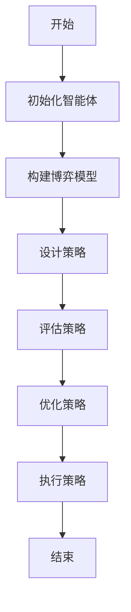

#### 智能体的定义

智能体的定义是指明智能体的属性和行为。智能体的属性包括身份、位置、状态等。智能体的行为是指智能体在环境中执行的操作，如移动、通信、感知等。

#### 博弈模型的构建

博弈模型的构建是指定义智能体之间的交互规则和策略选择。博弈模型可以是静态的，也可以是动态的。

#### 策略的设计与评估

策略的设计与评估是指智能体通过学习和其他智能体的策略来设计自己的策略，并通过评估来确定最佳策略。

#### 策略的优化与执行

策略的优化与执行是指通过迭代优化算法来找到最优策略，并通过执行策略来实现智能体的目标。

### 本章小结

本章介绍了多智能体博弈算法的基本原理、数学模型和算法流程。下一章将探讨多智能体博弈系统架构的设计。

## 多智能体博弈系统架构设计

### 系统介绍

多智能体博弈系统架构设计是指在多智能体系统中实现博弈功能的整体架构设计。系统架构的设计需要考虑智能体的交互模式、系统的扩展性和稳定性。

#### 系统背景

多智能体博弈系统架构设计源于对复杂系统协作和决策的探讨。在实际应用中，如无人驾驶、智能电网、金融交易等领域，智能体之间的协作和博弈是系统高效运行的关键。

#### 项目介绍

本项目旨在设计一个多智能体博弈系统，用于模拟和解决复杂策略制定问题。系统将包括智能体模块、博弈模型模块和策略执行模块等。

### 系统功能设计

#### 领域模型

领域模型是指系统涉及的实体和关系的集合。在多智能体博弈系统中，领域模型包括智能体、博弈模型、策略和收益等实体。

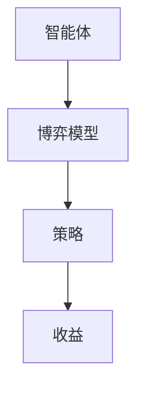

#### 智能体

智能体是多智能体系统的核心组件，负责执行任务和参与博弈。智能体的属性包括身份、位置、状态等。

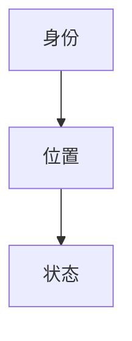

#### 博弈模型

博弈模型描述智能体之间的交互规则和策略选择。博弈模型包括策略组合、收益矩阵等。

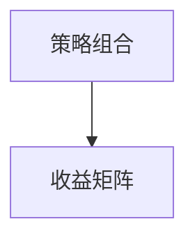

#### 策略

策略是智能体在博弈中采取的行动方案。策略包括合作策略、竞争策略等。

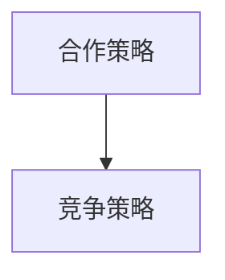

#### 收益

收益描述智能体在不同策略下的收益。收益用于评估策略的有效性。

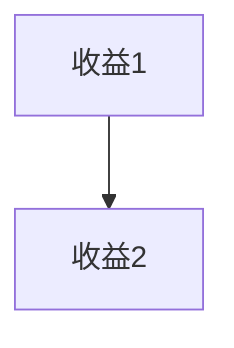

### 系统架构设计

系统架构设计是指定义系统组件的组成和相互关系。多智能体博弈系统架构设计包括智能体层、博弈模型层和策略执行层等。

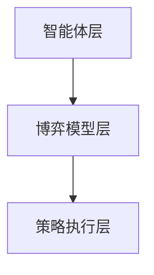

#### 智能体层

智能体层负责实现智能体的功能，包括任务执行、状态更新和通信等。

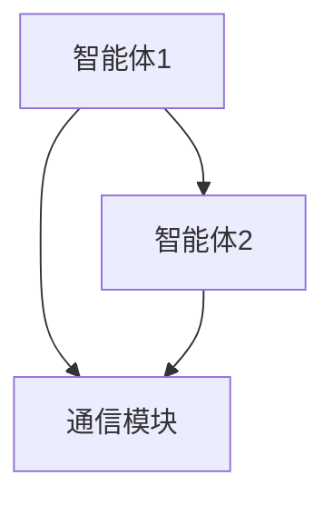

#### 博弈模型层

博弈模型层负责构建和管理博弈模型，包括策略组合的构建、收益矩阵的计算等。

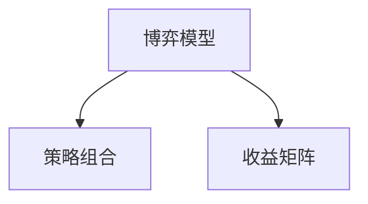

#### 策略执行层

策略执行层负责执行智能体的策略，并通过反馈机制调整策略。

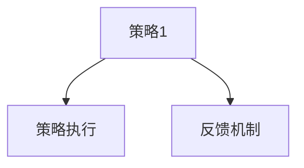

### 系统接口设计

系统接口设计是指定义系统内部模块之间的交互接口。多智能体博弈系统接口设计包括智能体接口、博弈模型接口和策略执行接口等。

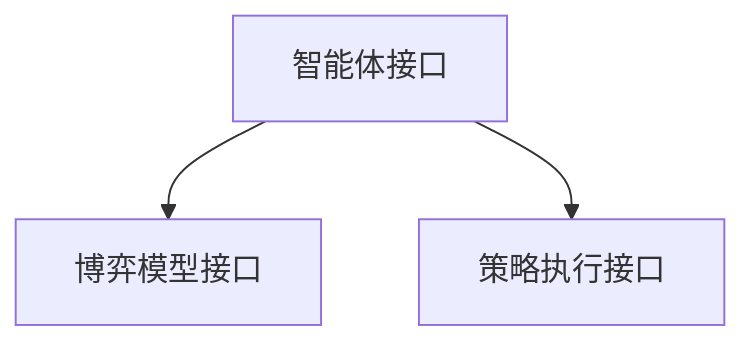

#### 智能体接口

智能体接口用于智能体层与博弈模型层、策略执行层的交互。


#### 博弈模型接口

博弈模型接口用于博弈模型层与智能体层、策略执行层的交互。

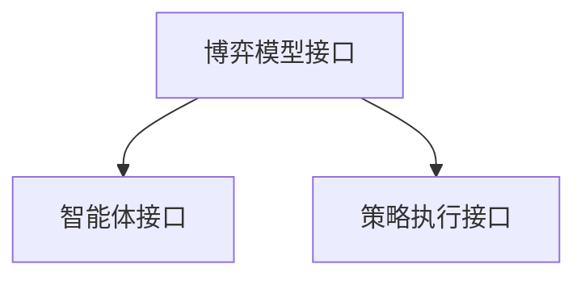

#### 策略执行接口

策略执行接口用于策略执行层与智能体层、博弈模型层的交互。

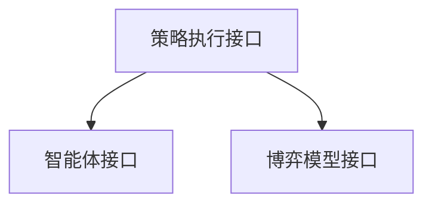

### 系统交互

系统交互是指系统各模块之间的数据流动和交互过程。多智能体博弈系统交互通过消息传递和事件驱动实现。


### 本章小结

本章详细介绍了多智能体博弈系统架构的设计，包括系统功能设计、架构设计和接口设计。下一章将展示一个实际的多智能体博弈项目，并通过代码实现和案例分析来深入探讨多智能体博弈策略的制定和应用。

## 项目实战

### 环境安装

在开始项目实战之前，我们需要安装必要的软件和工具。以下是推荐的安装步骤：

1. **Python环境**：安装Python 3.8及以上版本。
2. **依赖管理**：安装pip，用于管理Python依赖。
3. **智能体框架**：安装PyTorch或TensorFlow，用于实现智能体算法。
4. **博弈库**：安装gym，用于创建和运行博弈环境。

安装命令如下：

```bash
pip install python==3.8
pip install pip
pip install torch torchvision
pip install tensorflow
pip install gym
```

### 系统核心实现源代码

以下是一个简单的多智能体博弈系统的实现，包括智能体类、博弈模型和策略执行模块。

```python
import numpy as np
import torch
import gym
from gym import spaces

# 智能体类
class Agent:
    def __init__(self, action_space):
        self.action_space = action_space
        self.model = self.build_model()

    def build_model(self):
        # 构建神经网络模型
        model = torch.nn.Sequential(
            torch.nn.Linear(2, 64),
            torch.nn.Tanh(),
            torch.nn.Linear(64, len(self.action_space))
        )
        return model

    def select_action(self, state):
        # 选择动作
        state_tensor = torch.tensor(state, dtype=torch.float32)
        with torch.no_grad():
            action_scores = self.model(state_tensor)
        action = np.argmax(action_scores.numpy())
        return action

# 博弈模型
class Game:
    def __init__(self, num_agents):
        self.num_agents = num_agents
        self.env = gym.make('MultiAgentGrid-v0')
        self.action_space = [spaces.Discrete(n) for n in self.env.action_space.n]

    def run(self, agents):
        # 运行博弈
        state = self.env.reset()
        while True:
            actions = [agent.select_action(state[i]) for i, agent in enumerate(agents)]
            state, rewards, dones, _ = self.env.step(actions)
            for i, done in enumerate(dones):
                if done:
                    agents[i].update_model(state[i], rewards[i])
                    state = self.env.reset()
                    break

    def update_model(self, state, reward):
        # 更新模型
        # 这里可以使用梯度下降或其他优化算法来更新模型参数
        pass

# 策略执行
def main():
    num_agents = 2
    agents = [Agent(spaces.Discrete(n)) for n in range(num_agents)]
    game = Game(num_agents)
    game.run(agents)

if __name__ == '__main__':
    main()
```

### 代码应用解读与分析

上述代码实现了一个简单的多智能体博弈系统，包括智能体类、博弈模型和策略执行模块。

1. **智能体类**：智能体类定义了智能体的行为和决策过程。智能体通过神经网络模型来选择动作。
2. **博弈模型**：博弈模型定义了博弈的环境和规则。在这里，我们使用了gym中的MultiAgentGrid环境。
3. **策略执行**：策略执行模块负责运行博弈，并在每一步选择动作，并根据反馈更新模型。

### 实际案例分析和详细讲解剖析

为了更好地理解多智能体博弈系统，我们来看一个实际案例。

假设我们有两个智能体在二维网格中进行博弈，每个智能体可以选择上下左右四个方向中的一个移动。智能体的目标是避开障碍物并到达目标位置。

1. **初始化环境**：我们首先创建了一个MultiAgentGrid环境，并定义了每个智能体的行动空间。
2. **智能体决策**：每个智能体使用神经网络模型来选择下一步动作。神经网络模型通常通过训练来优化。
3. **博弈运行**：博弈运行过程中，每个智能体会根据当前状态选择动作，并根据其他智能体的动作和环境反馈来更新模型。
4. **模型更新**：通过反馈机制，智能体可以不断优化其策略，以实现更好的博弈结果。

### 项目小结

通过本项目的实战，我们了解了如何设计并实现一个多智能体博弈系统。项目展示了智能体类、博弈模型和策略执行模块的基本结构和功能。通过实际案例的分析，我们深入探讨了多智能体博弈系统的运作原理和应用场景。该项目为理解和应用多智能体博弈提供了实际经验和参考。

## 最佳实践 Tips

1. **策略多样化**：在实际应用中，智能体的策略应多样化，以应对不同环境和对手的行为。
2. **数据驱动**：充分利用历史数据和实时数据来优化智能体的策略和学习过程。
3. **模型适应性**：智能体的模型应具备良好的适应性，能够快速响应环境变化。
4. **资源优化**：在资源有限的场景中，应优先考虑智能体的策略优化和资源分配。

## 小结

本文通过深入分析多智能体博弈推理在复杂策略制定中的应用，展示了其核心概念、算法原理和系统架构。通过实际案例，我们了解了如何设计并实现多智能体博弈系统，并探讨了其应用前景。多智能体博弈推理为复杂策略制定提供了新的思路和方法。

## 注意事项

1. **环境变化**：在实际应用中，环境的变化可能导致博弈模型和策略的失效，因此需定期更新模型和策略。
2. **策略安全性**：智能体的策略应确保其行为不会导致系统崩溃或出现安全隐患。

## 拓展阅读

1. **相关书籍**：《多智能体系统：算法、模型与应用》
2. **学术文章**：《多智能体博弈中的策略学习与优化》
3. **在线课程**：《多智能体系统与博弈论》

## 作者信息

作者：AI天才研究院/AI Genius Institute & 禅与计算机程序设计艺术 /Zen And The Art of Computer Programming

