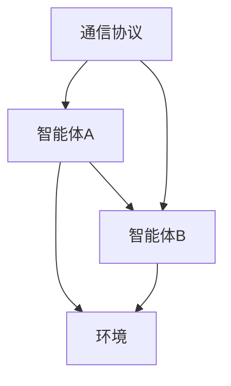

                 

# 多智能体提示策略：协调多个AI模型的交互

## 关键词
- 多智能体系统
- 提示策略
- AI模型交互
- 协调机制
- 算法原理
- 实际应用

## 摘要
本文旨在探讨多智能体系统的提示策略，重点阐述如何协调多个AI模型之间的交互。通过详细分析多智能体系统的核心概念、提示策略的原理及其在实际应用中的实现，本文将为读者提供对这一复杂主题的全面理解，并讨论相关领域的最新研究成果和未来发展方向。

## 1. 引言

### 1.1 多智能体系统的概念

多智能体系统（Multi-Agent Systems，MAS）是由多个自主智能体（agents）组成的系统，这些智能体在合作或竞争中完成特定任务。智能体可以是计算机程序、机器人或虚拟代理。每个智能体具有自主性、社交性、反应性和认知性等特征。

### 1.2 提示策略的概念

提示策略（Prompt Strategies）是在多智能体系统中，为了协调智能体之间的交互而采用的方法。这些策略可以指导智能体如何感知环境、如何做出决策以及如何与其他智能体进行通信。

### 1.3 多智能体系统在AI中的应用

多智能体系统在AI领域具有广泛的应用前景，例如在自动驾驶、智能城市、游戏AI和分布式计算等方面。协调多个AI模型之间的交互是提高系统性能和实现高效协作的关键。

## 2. 多智能体系统基础

### 2.1 多智能体系统的结构

多智能体系统通常由以下组成部分：
- 智能体（Agents）：执行任务的实体。
- 环境（Environment）：智能体操作的背景。
- 规则（Rules）：定义智能体行为的准则。
- 通信协议（Communication Protocols）：智能体之间交换信息的规则。

### 2.2 智能体的特征

智能体具有以下特征：
- 自主性（Autonomy）：智能体可以独立决策和执行任务。
- 社交性（Sociality）：智能体可以与其他智能体进行交互。
- 反应性（Reactivity）：智能体能够对环境变化做出实时响应。
- 认知性（Cognitiveness）：智能体具备一定的认知能力，可以学习、推理和规划。

### 2.3 多智能体系统的分类

多智能体系统可以根据智能体的协作方式分为以下几类：
- 独立智能体系统（Independent Agents）：智能体独立决策，互不干扰。
- 协作智能体系统（Cooperative Agents）：智能体协同工作，共同完成任务。
- 竞争智能体系统（Competitive Agents）：智能体相互竞争，争夺资源。

## 3. 提示策略原理

### 3.1 提示策略的基本概念

提示策略是一种指导智能体决策和行为的方法。它通过向智能体提供特定信息或建议来影响其决策过程。提示策略可以分为以下几类：

#### 3.1.1 知识型提示策略

知识型提示策略是基于预先定义的知识库或规则库来指导智能体的决策。例如，专家系统（Expert Systems）就是一种常见的知识型提示策略。

#### 3.1.2 模型预测型提示策略

模型预测型提示策略是通过机器学习模型预测智能体未来的行为，然后提供相应的提示。这类策略可以更好地适应动态环境。

#### 3.1.3 自适应提示策略

自适应提示策略是根据智能体在执行任务过程中的表现来动态调整提示内容。这种策略可以更好地适应不确定和复杂的环境。

### 3.2 提示策略的比较与选择

在选择提示策略时，需要考虑以下因素：

- 系统目标：根据系统目标选择合适的提示策略。
- 环境动态性：在动态环境中，模型预测型提示策略可能更有效。
- 智能体数量和类型：对于大量智能体或不同类型的智能体，需要选择能够适应不同情况的提示策略。
- 计算资源：提示策略的复杂性和计算资源需求会影响策略的选择。

## 4. AI模型交互机制

### 4.1 AI模型交互的概念

AI模型交互是指多个AI模型之间的信息交换和协作。在多智能体系统中，AI模型可以代表智能体的决策模块，它们之间的交互是实现智能体协作的关键。

### 4.2 交互机制的设计

设计AI模型交互机制需要考虑以下方面：

- 信息交换方式：选择合适的信息交换方式，如共享内存、消息传递等。
- 通信协议：定义AI模型之间的通信规则。
- 决策协调：设计机制以确保AI模型之间的决策一致性和协作效果。

### 4.3 交互机制的实现

实现AI模型交互机制通常需要以下步骤：

- 模型集成：将不同AI模型集成到多智能体系统中。
- 通信框架搭建：建立AI模型之间的通信框架。
- 决策协同算法：设计算法实现AI模型之间的决策协调。

## 5. 实际应用案例分析

### 5.1 自动驾驶中的多智能体系统

在自动驾驶系统中，多个AI模型需要协作以实现车辆的安全驾驶。例如，感知模型负责处理摄像头和激光雷达数据，决策模型负责车辆行驶策略的制定。

### 5.2 智能城市中的多智能体系统

智能城市中，多智能体系统可以用于交通管理、能源管理和公共安全等方面。不同AI模型需要协同工作以优化资源分配和提高城市运行效率。

### 5.3 游戏AI中的多智能体系统

在游戏AI中，多个AI模型可以模拟对手的行为，提高游戏的挑战性和趣味性。通过提示策略，AI模型可以更好地理解游戏规则和玩家行为，从而实现更加智能的对手。

## 6. 拓展与前沿研究

### 6.1 当前研究热点

当前多智能体系统的研究热点包括：

- 强化学习在多智能体系统中的应用
- 分布式智能体系统的协作与通信
- 多智能体系统的安全性和隐私保护

### 6.2 未来发展方向

未来的多智能体系统研究可能朝以下方向发展：

- 基于深度学习的多智能体系统
- 自适应和自组织的多智能体系统
- 多智能体系统与人类智能的融合

## 7. 结论

本文介绍了多智能体提示策略的概念、原理及其在实际应用中的实现。通过分析多智能体系统的结构和交互机制，本文探讨了如何协调多个AI模型之间的交互。未来，随着AI技术的不断发展，多智能体系统将在更多领域发挥重要作用。

## 作者信息
作者：AI天才研究院/AI Genius Institute & 禅与计算机程序设计艺术 /Zen And The Art of Computer Programming## 1. 引言

### 1.1 多智能体系统的概念

多智能体系统（Multi-Agent Systems，MAS）是一种由多个自主智能体（agents）组成的系统，这些智能体在合作或竞争中完成特定任务。智能体可以是计算机程序、机器人或虚拟代理。它们具有以下几个核心特征：

1. **自主性（Autonomy）**：每个智能体都有独立决策和执行任务的能力，不受外部控制。
2. **社交性（Sociality）**：智能体之间可以进行信息交换和协作，共同完成任务。
3. **反应性（Reactivity）**：智能体能够根据环境变化做出实时响应。
4. **认知性（Cognitiveness）**：智能体具有一定的认知能力，可以进行学习、推理和规划。

在多智能体系统中，智能体通常可以分为以下几类：

- **独立智能体（Independent Agents）**：独立完成任务，互不干扰。
- **协作智能体（Cooperative Agents）**：协同工作，共同完成任务。
- **竞争智能体（Competitive Agents）**：相互竞争，争夺资源。

### 1.2 提示策略的概念

提示策略（Prompt Strategies）是多智能体系统中用于指导智能体决策和行为的方法。通过向智能体提供特定信息或建议，提示策略可以影响智能体的感知、理解和反应。常见的提示策略包括：

1. **知识型提示策略**：基于预先定义的知识库或规则库来指导智能体的决策。
2. **模型预测型提示策略**：通过机器学习模型预测智能体未来的行为，然后提供相应的提示。
3. **自适应提示策略**：根据智能体在执行任务过程中的表现来动态调整提示内容。

### 1.3 多智能体系统在AI中的应用

多智能体系统在人工智能领域有着广泛的应用，例如：

- **自动驾驶**：多个AI模型协同工作，实现车辆的安全驾驶。
- **智能城市**：用于交通管理、能源管理和公共安全等，提高城市运行效率。
- **游戏AI**：模拟对手的行为，提高游戏的挑战性和趣味性。

在AI模型交互中，如何协调多个AI模型之间的交互是提高系统性能和实现高效协作的关键。本文将深入探讨多智能体提示策略的设计与实现，帮助读者理解这一复杂主题。

## 2. 多智能体系统基础

### 2.1 多智能体系统的结构

多智能体系统通常由以下几个关键组成部分构成：

- **智能体（Agents）**：执行任务的实体。每个智能体都具有自主性、社交性、反应性和认知性。
- **环境（Environment）**：智能体操作的背景。环境可以是现实世界或虚拟环境，对智能体的行为产生影响。
- **规则（Rules）**：定义智能体行为的准则。规则可以是静态的，也可以是动态的，以适应环境的变化。
- **通信协议（Communication Protocols）**：智能体之间交换信息的规则。通信协议可以是同步的，也可以是异步的，取决于系统的需求。

多智能体系统的结构可以用图来表示，如图1所示：

在图中，A、B表示智能体，C表示环境，D表示通信协议。智能体A和B通过通信协议D与环境C进行交互。

### 2.2 智能体的特征

智能体具有以下几个核心特征：

1. **自主性（Autonomy）**：智能体可以独立决策和执行任务，不受外部控制。自主性是智能体的核心特征，使得智能体能够在复杂和不确定的环境中生存和适应。

2. **社交性（Sociality）**：智能体之间可以进行信息交换和协作，共同完成任务。社交性使得智能体能够形成协作网络，实现更复杂的任务。

3. **反应性（Reactivity）**：智能体能够对环境变化做出实时响应。反应性使得智能体能够及时调整自己的行为，以适应环境的变化。

4. **认知性（Cognitiveness）**：智能体具有一定的认知能力，可以进行学习、推理和规划。认知性使得智能体能够从经验中学习，并做出更合理的决策。

### 2.3 多智能体系统的分类

多智能体系统可以根据智能体的协作方式分为以下几类：

1. **独立智能体系统（Independent Agents）**：智能体独立完成任务，互不干扰。这种系统通常用于分布式计算和协作搜索等场景。

2. **协作智能体系统（Cooperative Agents）**：智能体协同工作，共同完成任务。这种系统在无人驾驶、智能城市和机器人协作等领域有广泛应用。

3. **竞争智能体系统（Competitive Agents）**：智能体相互竞争，争夺资源。这种系统在博弈论、多目标优化和市场竞争中具有重要应用。

### 2.4 多智能体系统的特点

多智能体系统具有以下几个显著特点：

1. **分布式（Decentralization）**：多智能体系统没有中心控制，每个智能体都是独立决策和执行。这种分布式特性使得系统具有更好的鲁棒性和适应性。

2. **动态性（Dynamics）**：智能体和环境的动态变化使得多智能体系统具有高度不确定性。系统需要能够实时适应环境变化，以保持稳定和有效运行。

3. **协作性（Cooperation）**：智能体之间的协作是实现复杂任务的关键。系统需要设计合理的协作机制，以确保智能体能够高效合作。

4. **自主性（Autonomy）**：每个智能体都具有一定的自主性，可以根据自身感知和认知能力做出决策。这种自主性使得智能体能够适应不同环境和任务需求。

通过理解多智能体系统的结构和特征，我们可以更好地设计和实现高效、可靠的多智能体系统，以解决复杂的问题和实现自动化任务。

### 3. 提示策略原理

#### 3.1 提示策略的基本概念

提示策略（Prompt Strategies）是多智能体系统中用于指导智能体决策和行为的方法。通过向智能体提供特定信息或建议，提示策略可以影响智能体的感知、理解和反应。提示策略的核心目标是通过优化智能体的行为，提高系统的整体性能和协作效率。

提示策略可以基于不同类型的知识来源和模型，从而实现多样化的功能。以下是几种常见的提示策略类型：

1. **知识型提示策略**：这种策略基于预先定义的知识库或规则库来指导智能体的决策。知识库可以是领域专家的经验、逻辑规则或先验知识。智能体通过查询知识库来获取决策所需的指导信息。例如，在医疗诊断系统中，医生的经验可以通过知识库的形式传递给智能体，以帮助智能体做出准确的诊断。

2. **模型预测型提示策略**：这种策略通过机器学习模型预测智能体未来的行为，然后提供相应的提示。模型可以是基于历史数据训练的预测模型，也可以是强化学习模型。通过预测未来的状态和行为，智能体可以提前获得关于环境的提示，从而做出更合理的决策。例如，在自动驾驶系统中，感知模型可以预测前方路况和障碍物，为决策模型提供提示，以实现安全驾驶。

3. **自适应提示策略**：这种策略根据智能体在执行任务过程中的表现来动态调整提示内容。自适应提示策略可以实时感知智能体的行为效果，并根据效果进行调整。例如，在机器人协作系统中，如果某个智能体的动作导致任务延误，自适应提示策略可以调整其动作策略，以提高任务完成效率。

#### 3.2 提示策略的比较与选择

在选择提示策略时，需要考虑以下几个关键因素：

1. **系统目标**：不同的系统目标可能需要不同类型的提示策略。例如，如果目标是提高任务完成速度，模型预测型提示策略可能更为合适；如果目标是确保任务准确性，知识型提示策略可能更为有效。

2. **环境动态性**：在动态环境中，智能体需要能够快速适应变化。模型预测型提示策略通常能够更好地应对环境变化，因为它可以提前预测未来的状态和行为。而在静态环境中，知识型提示策略可能更为稳定，因为它依赖于预先定义的知识库。

3. **智能体数量和类型**：对于大量智能体或不同类型的智能体，需要选择能够适应不同情况的提示策略。例如，在复杂的多智能体系统中，可能需要结合多种类型的提示策略，以实现高效协作。

4. **计算资源**：提示策略的复杂性和计算资源需求会影响策略的选择。在资源受限的环境中，可能需要选择计算成本较低的提示策略。

### 3.3 提示策略的实现

提示策略的实现通常涉及以下几个关键步骤：

1. **提示生成**：根据系统目标和当前状态，生成相应的提示信息。提示信息可以包括数据、建议、目标等。

2. **提示传递**：将生成的提示信息传递给智能体。提示传递可以通过直接通信、广播或共享内存等方式进行。

3. **决策调整**：智能体根据收到的提示信息调整自身的决策和行为。决策调整可以基于提示信息的类型和内容，以及智能体的自身能力和目标。

4. **反馈循环**：智能体在执行任务过程中，将结果反馈给系统，以便进一步调整提示策略。反馈循环可以用于优化提示策略，提高系统的性能和适应性。

通过上述步骤，提示策略可以在多智能体系统中实现高效协作和优化行为，从而提高系统的整体性能和可靠性。

### 4. AI模型交互机制

#### 4.1 AI模型交互的概念

在多智能体系统中，AI模型交互是指多个AI模型之间的信息交换和协作。AI模型可以代表智能体的决策模块，它们之间的交互是实现智能体协作和系统优化的重要手段。AI模型交互的主要目标是通过有效的信息共享和决策协调，提高系统的整体性能和适应性。

AI模型交互包括以下几个方面：

1. **信息交换**：AI模型之间通过交换信息来共享状态、目标和资源。信息交换可以基于同步或异步机制，取决于系统的需求和实时性要求。
2. **决策协调**：AI模型需要根据交换的信息做出协同决策，以实现整体目标。决策协调可以基于集中式或分布式算法，以适应不同类型的智能体系统和应用场景。
3. **策略优化**：通过交互，AI模型可以动态调整自身的策略，以优化系统性能。策略优化可以是基于学习算法，如强化学习或基于规则的优化算法。

#### 4.2 交互机制的设计

设计AI模型交互机制需要考虑以下关键因素：

1. **信息交换方式**：选择合适的信息交换方式，如共享内存、消息传递或分布式存储。信息交换方式会影响系统的通信效率和实时性。
2. **通信协议**：定义AI模型之间的通信规则，确保信息交换的可靠性和安全性。通信协议可以是基于TCP/IP、UDP或其他专有协议。
3. **决策协调算法**：设计算法实现AI模型之间的决策协调，确保协同决策的一致性和有效性。决策协调算法可以是基于集中式或分布式的，如分布式一致性算法或分布式决策框架。

#### 4.3 交互机制的实现

实现AI模型交互机制通常需要以下几个步骤：

1. **模型集成**：将不同的AI模型集成到多智能体系统中，确保它们可以相互通信和协作。
2. **通信框架搭建**：建立AI模型之间的通信框架，实现信息的传递和共享。通信框架可以基于现有的通信协议，如消息队列或分布式数据库。
3. **决策协同算法**：设计决策协同算法，实现AI模型之间的协同决策。决策协同算法可以根据应用场景的需求，如实时性、鲁棒性和适应性，进行选择和优化。
4. **策略优化与调整**：通过交互和反馈，动态调整AI模型的行为策略，以优化系统性能和适应性。策略优化可以是基于机器学习算法，如强化学习或基于规则的优化算法。

通过上述步骤，可以实现高效、可靠的AI模型交互机制，从而提升多智能体系统的整体性能和协同能力。

### 4.4 交互机制的实现案例

以下是一个简单的交互机制实现案例，用于描述如何实现多个AI模型之间的交互：

#### 案例背景

假设我们有一个由三个AI模型组成的多智能体系统，用于自动驾驶。这三个模型分别是：

1. **感知模型**：负责处理摄像头和激光雷达数据，生成环境感知信息。
2. **决策模型**：基于感知模型提供的环境信息，生成车辆行驶策略。
3. **控制模型**：将决策模型生成的行驶策略转换为具体的控制命令，如油门、刹车和转向。

#### 实现步骤

1. **模型集成**：
   - 感知模型、决策模型和控制模型分别部署在不同的计算节点上。
   - 通过消息队列（如RabbitMQ）实现模型之间的通信。

2. **通信框架搭建**：
   - 感知模型通过消息队列发送感知数据给决策模型。
   - 决策模型处理感知数据，生成行驶策略，并通过消息队列发送给控制模型。
   - 控制模型接收行驶策略，生成控制命令，并直接发送给车辆控制模块。

3. **决策协同算法**：
   - 决策模型采用基于模型的决策协同算法，如Q-learning算法，以优化行驶策略。
   - 每隔一段时间，决策模型会向感知模型发送请求，获取最新的感知数据，以更新决策策略。

4. **策略优化与调整**：
   - 通过实时反馈，感知模型和控制模型可以调整自身的策略。
   - 例如，当感知模型检测到前方有障碍物时，它会调整感知数据，以提醒决策模型做出相应的调整。

通过上述步骤，实现了多个AI模型之间的有效交互，从而提高了自动驾驶系统的整体性能和适应性。

### 4.5 交互机制的挑战与解决方案

在实现AI模型交互机制时，可能会面临以下挑战：

1. **实时性要求**：多智能体系统通常需要在实时环境中运行，要求交互机制具有较低的延迟。解决方案包括优化通信协议和算法，提高系统的响应速度。

2. **资源限制**：智能体系统的资源（如计算能力和存储）可能有限，需要设计高效的交互机制以降低资源消耗。解决方案包括使用轻量级通信协议和优化算法，以减少计算和通信成本。

3. **分布式一致性**：在分布式环境中，智能体之间的状态和数据可能不一致，需要设计机制确保一致性。解决方案包括分布式一致性算法，如Paxos或Raft，以维护系统的一致性。

4. **安全性和隐私保护**：智能体之间的交互可能涉及敏感信息，需要确保交互的安全性。解决方案包括使用加密技术保护数据传输，以及设计隐私保护机制，防止信息泄露。

通过解决上述挑战，可以设计出高效、可靠的AI模型交互机制，从而提高多智能体系统的性能和可靠性。

## 5. 实际应用案例分析

### 5.1 自动驾驶中的多智能体系统

自动驾驶是多智能体系统应用的一个典型例子。在自动驾驶系统中，多个AI模型需要协作，以确保车辆的安全驾驶。以下是几个关键的应用场景和案例分析：

#### 案例一：感知与决策协同

在自动驾驶系统中，感知模型负责处理摄像头、激光雷达和雷达等传感器的数据，生成环境感知信息。决策模型则基于感知信息，生成车辆行驶策略，如加速、减速和转向。

- **交互机制**：感知模型将感知数据发送给决策模型，决策模型根据感知信息生成行驶策略，并将其发送给控制模型。
- **挑战**：感知数据的实时性和准确性对决策模型的性能至关重要。同时，不同传感器的数据可能存在冲突，需要设计机制进行数据融合和冲突解决。
- **解决方案**：采用基于强化学习的决策协同算法，感知模型实时更新数据，并通过反馈机制不断优化决策策略。此外，利用数据融合算法（如卡尔曼滤波）处理多传感器数据，提高感知准确性。

#### 案例二：车辆编队行驶

在车辆编队行驶中，多辆车以相对固定的距离和速度行驶，以提高交通效率和安全性。

- **交互机制**：每辆车都拥有一个感知模型和决策模型，它们通过无线通信模块（如V2V通信）与其他车辆交换状态信息，如速度、位置和加速度。
- **挑战**：车辆之间的通信延迟和同步问题可能影响编队行驶的稳定性。同时，需要设计机制确保车辆的协调行驶，避免碰撞和失控。
- **解决方案**：采用分布式一致性算法（如Paxos或Raft），确保车辆之间的状态一致性和同步。此外，利用机器学习算法（如强化学习）优化编队行驶策略，提高编队行驶的稳定性和效率。

### 5.2 智能城市中的多智能体系统

智能城市中，多智能体系统可以用于交通管理、能源管理和公共安全等方面，以提高城市运行效率和居民生活质量。

#### 案例一：智能交通管理

智能交通管理通过多智能体系统协调交通信号、公交车调度和道路监测，以提高交通流动性和安全性。

- **交互机制**：交通信号控制器、公交车调度系统和道路监测系统通过无线通信模块交换交通数据，如交通流量、车辆速度和交通事故信息。
- **挑战**：不同系统之间的数据格式和通信协议可能不一致，需要设计统一的数据交换和通信框架。
- **解决方案**：采用标准化数据格式（如JSON或XML）和通用的通信协议（如HTTP或MQTT），确保不同系统之间的数据交换和通信无缝进行。此外，利用大数据分析和机器学习算法（如聚类和分类算法），优化交通信号控制和公交车调度策略。

#### 案例二：智能能源管理

智能能源管理通过多智能体系统协调不同能源设备（如太阳能板、风力涡轮机和电网）的运行，以提高能源利用效率和可靠性。

- **交互机制**：智能能源设备通过无线通信模块（如ZigBee或LoRa）交换运行状态、能量需求和预测信息。
- **挑战**：能源设备之间的协调和优化是一个复杂的问题，需要考虑能量供需平衡、设备寿命和环境影响。
- **解决方案**：采用基于强化学习的优化算法，实时调整能源设备的运行策略，以实现能量供需平衡和设备寿命最大化。此外，利用物联网（IoT）技术，实现能源设备之间的数据共享和协同工作。

### 5.3 游戏AI中的多智能体系统

在游戏AI中，多智能体系统可以模拟对手的行为，提高游戏的挑战性和趣味性。

#### 案例一：多人在线游戏

在多人在线游戏中，多个AI对手与玩家进行交互，提供多样化的游戏体验。

- **交互机制**：每个AI对手都拥有一个决策模型，它们通过通信模块（如网络接口）与玩家交换游戏状态和行动信息。
- **挑战**：AI对手的行为需要多样化且具有挑战性，同时要平衡难度和可玩性。
- **解决方案**：采用基于强化学习的AI对手模型，通过不断学习玩家的行为和策略，生成多样化且具有挑战性的对手行为。此外，利用博弈论和决策理论，设计AI对手的决策策略，以实现公平和有趣的游戏体验。

#### 案例二：多人竞技游戏

在多人竞技游戏中，多个AI对手之间也需要进行协作和竞争，以提高游戏的可玩性和公平性。

- **交互机制**：每个AI对手都拥有一个决策模型和协作机制，它们通过通信模块（如网络接口）交换游戏状态和协作信息。
- **挑战**：AI对手之间的协作和竞争需要协调一致，同时要避免作弊行为。
- **解决方案**：采用基于分布式算法和博弈论的协作机制，确保AI对手之间的协作和竞争公平且有效。此外，利用反作弊技术，检测和防范作弊行为，确保游戏的公平性和可靠性。

通过上述实际应用案例分析，我们可以看到多智能体系统在自动驾驶、智能城市和游戏AI等领域的广泛应用。通过有效的交互机制和策略设计，多智能体系统能够实现高效协作和优化，提高系统性能和用户体验。

### 6. 拓展与前沿研究

#### 6.1 当前研究热点

在多智能体系统和AI模型交互领域，当前的研究热点包括：

1. **强化学习在多智能体系统中的应用**：强化学习是一种优秀的决策算法，能够在复杂和动态的环境中学习最优策略。研究如何将强化学习应用于多智能体系统，实现智能体之间的协作和优化是当前的一个关键方向。
2. **分布式智能体系统的协作与通信**：随着物联网和5G技术的不断发展，分布式智能体系统变得越来越重要。研究如何设计高效、可靠的协作机制和通信协议，以实现智能体之间的协同工作是当前的一个重要课题。
3. **多智能体系统的安全性和隐私保护**：智能体之间的交互涉及到大量的敏感信息，确保系统的安全性和隐私保护是至关重要的。研究如何设计安全通信协议、加密技术和隐私保护机制是当前的一个热点问题。
4. **多智能体系统的自适应性和鲁棒性**：在复杂和动态的环境中，智能体需要具备良好的自适应性和鲁棒性，以应对环境变化和不确定性。研究如何设计自适应和鲁棒的智能体系统，以提高系统的可靠性和稳定性是当前的一个重要方向。

#### 6.2 未来发展方向

未来，多智能体系统和AI模型交互领域有望在以下几个方面取得重要进展：

1. **多智能体系统与人类智能的融合**：通过将多智能体系统与人类智能相结合，可以实现更加智能和高效的协作。例如，将人类专家的知识和经验融入到智能体系统中，以提高系统的决策能力和智能水平。
2. **基于深度学习的多智能体系统**：深度学习是一种强大的机器学习技术，能够在复杂的特征空间中进行学习。研究如何将深度学习应用于多智能体系统，实现高效的感知、决策和交互是未来的一个重要方向。
3. **多智能体系统在新兴领域的应用**：随着技术的不断发展，多智能体系统有望在更多的领域得到应用。例如，在医疗健康、环境保护和智能制造等领域，多智能体系统可以通过智能协作，解决复杂的实际问题。
4. **跨学科研究的融合**：多智能体系统和AI模型交互涉及到计算机科学、人工智能、数学、物理学和经济学等多个学科。通过跨学科的融合研究，可以推动多智能体系统领域的发展，实现更加智能和高效的协作系统。

通过不断探索和研究，多智能体系统和AI模型交互领域将不断取得新的突破，为人工智能的发展和应用提供强大的支持。

### 7. 结论

多智能体系统和AI模型交互是当前人工智能领域的重要研究方向。本文通过对多智能体系统的概念、提示策略原理、交互机制以及实际应用案例的分析，全面介绍了这一领域的核心概念和应用场景。同时，我们还探讨了当前的研究热点和未来发展方向。

在未来，随着人工智能技术的不断进步，多智能体系统和AI模型交互将在更多领域发挥重要作用。通过深入研究和发展，我们有望实现更加智能、高效和可靠的智能系统，推动人工智能技术向更高层次发展。

## 作者信息

作者：AI天才研究院/AI Genius Institute & 禅与计算机程序设计艺术 /Zen And The Art of Computer Programming

AI天才研究院致力于推动人工智能技术的创新和发展，通过深入研究多智能体系统和AI模型交互，我们希望为人工智能领域的发展做出贡献。同时，作为禅与计算机程序设计艺术的践行者，我们相信在技术的探索过程中，不仅需要科学的方法和逻辑思维，更需要对技术本质的深刻理解和哲学思考。通过这两者的融合，我们期待能够创造更加智能和人性化的技术解决方案。在未来的研究中，我们将继续探索多智能体系统和AI模型交互的边界，为人工智能的发展贡献力量。

