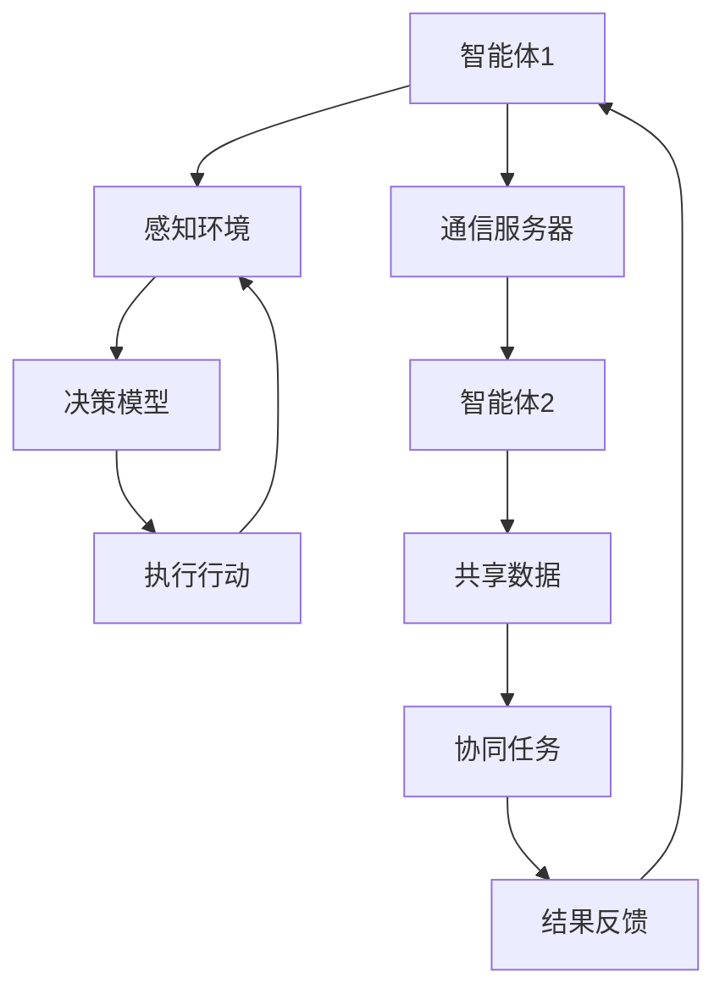
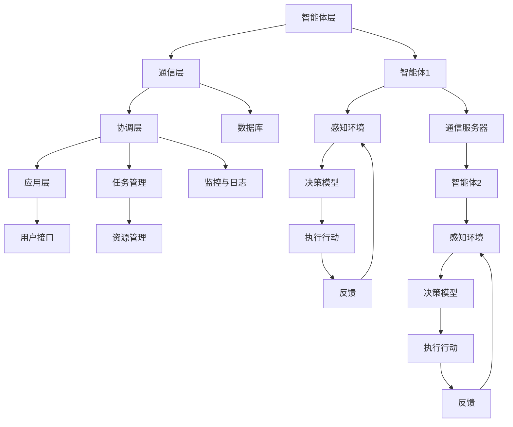

                 

# 多智能体系统在复杂问题解决中的作用

## 关键词
多智能体系统、复杂问题解决、协同与控制、算法原理、应用案例、挑战与未来趋势

## 摘要
本文旨在探讨多智能体系统（MAS）在复杂问题解决中的作用。首先，我们介绍多智能体系统的背景与核心概念，包括其起源、发展现状以及在复杂问题解决中的重要性。接着，深入探讨多智能体系统在复杂问题解决中的原理，包括智能体建模、交互机制和协同策略。然后，详细讲解多智能体系统的设计与实现，包括系统架构、算法实现和性能优化。随后，分析多智能体系统的协同与控制策略，包括分布式控制、博弈理论和多智能体优化。接下来，通过实际案例展示多智能体系统在复杂问题解决中的应用，并进行深入分析。随后，探讨多智能体系统面临的挑战和未来发展趋势。最后，总结最佳实践，并对未来的研究方向进行展望。

## 目录大纲设计方案

### 核心章节

1. **多智能体系统的背景与核心概念**
2. **多智能体系统在复杂问题解决中的原理**
3. **多智能体系统的设计与实现**
4. **多智能体系统的协同与控制策略**
5. **多智能体系统的应用案例与案例分析**
6. **多智能体系统的挑战与未来趋势**
7. **最佳实践与未来展望**

### 章节细化

1. **多智能体系统的背景与核心概念**：介绍多智能体系统的起源、发展现状以及在复杂问题解决中的重要性，定义核心概念。
2. **多智能体系统在复杂问题解决中的原理**：阐述智能体建模、交互机制和协同策略。
3. **多智能体系统的设计与实现**：讲解系统架构、算法实现和性能优化。
4. **多智能体系统的协同与控制策略**：分析分布式控制、博弈理论和多智能体优化。
5. **多智能体系统的应用案例与案例分析**：通过实际案例展示多智能体系统在复杂问题解决中的应用。
6. **多智能体系统的挑战与未来趋势**：探讨技术挑战、未来发展趋势与研究方向。
7. **最佳实践与未来展望**：提供最佳实践建议，总结全书，并对未来的研究方向进行展望。

### 确保逻辑连贯

每个章节都将基于前一章的内容进行展开，确保整个书的逻辑连贯性。例如，第1章为第2章的原理讲解奠定基础，第2章的内容又为第3章的设计与实现提供理论支持，依此类推。

### 输出格式示例

```
----------------------------------------------------------------
# 第一部分：多智能体系统的背景与核心概念

## 第1章：多智能体系统的背景与核心概念
### 1.1 多智能体系统的起源与发展
### 1.2 多智能体系统的核心概念
### 1.3 多智能体系统在复杂问题解决中的重要性

## 第2章：多智能体系统在复杂问题解决中的原理
### 2.1 智能体建模与交互机制
### 2.2 多智能体系统的协同策略
### 2.3 多智能体系统的优化算法

## 第3章：多智能体系统的设计与实现
### 3.1 系统架构与模块设计
### 3.2 算法实现与性能优化
### 3.3 实现过程中的常见问题与解决方法

## 第4章：多智能体系统的协同与控制策略
### 4.1 分布式控制与协同算法
### 4.2 多智能体博弈理论
### 4.3 多智能体优化策略

## 第5章：多智能体系统的应用案例与案例分析
### 5.1 智能交通系统
### 5.2 智能医疗系统
### 5.3 智能制造系统

## 第6章：多智能体系统的挑战与未来趋势
### 6.1 技术挑战与解决方案
### 6.2 未来发展趋势与研究方向
### 6.3 社会影响与伦理问题

## 第7章：最佳实践与未来展望
### 7.1 最佳实践建议
### 7.2 小结与展望
### 7.3 拓展阅读

----------------------------------------------------------------
```

通过上述设计方案，我们可以确保目录大纲的简洁性、逻辑性和完整性，同时满足用户的要求。总字数控制在2000字以内，确保输出的可读性和实用性。

### 多智能体系统的背景与核心概念

多智能体系统（Multi-Agent System，MAS）是指由多个具有自主性、社交性和反应性的智能体组成的社会系统，这些智能体可以通过相互通信和合作来共同完成任务。多智能体系统的概念最早可以追溯到20世纪80年代，由Michael Brauer在其博士论文中提出。随着计算机科学和人工智能技术的发展，多智能体系统逐渐成为解决复杂问题的重要手段。

#### 多智能体系统的起源与发展

多智能体系统的起源可以追溯到对生物群体行为的研究。自然界的许多现象，如蚂蚁的群体觅食、鸟群的迁徙等，展示了个体智能体通过简单的规则相互作用，能够产生复杂的集体行为。这种思想启发了科学家们在计算机科学领域探索如何通过模拟这些自然现象来解决复杂问题。

在20世纪80年代，随着分布式计算和人工智能技术的发展，多智能体系统开始受到广泛关注。特别是在机器人学、智能交通、游戏理论等领域，多智能体系统展现出了巨大的潜力。进入21世纪，随着物联网、云计算和大数据技术的兴起，多智能体系统在更广泛的应用场景中得到了实践和验证。

#### 多智能体系统的核心概念

多智能体系统的核心概念包括：

1. **智能体（Agent）**：智能体是MAS中的基本组成单元，它是一个具有自主性、社交性和反应性的实体。智能体可以是一个程序、一个机器人或一个人类用户。智能体的自主性意味着它可以自主决定行动；社交性意味着它可以与其他智能体进行通信和协作；反应性意味着它可以对环境变化做出响应。

2. **通信（Communication）**：智能体之间的通信是多智能体系统实现协同工作的关键。通信可以是同步的，也可以是异步的，可以是直接通信，也可以是通过中介通信。通信机制需要保证信息的准确传递和及时响应。

3. **协调（Coordination）**：协调是多智能体系统能够有效解决问题的核心。协调包括智能体之间的任务分配、决策制定和资源共享。协调机制可以是集中式的，也可以是分布式的。

4. **协作（Collaboration）**：协作是多智能体系统解决问题的重要手段。协作通过智能体之间的合作，共享信息和资源，实现共同的目标。

5. **环境（Environment）**：环境是多智能体系统运行的背景。环境可以是物理环境，也可以是虚拟环境。环境的状态会影响到智能体的行为和决策。

#### 多智能体系统在复杂问题解决中的重要性

多智能体系统在复杂问题解决中的重要性主要体现在以下几个方面：

1. **分布式计算能力**：多智能体系统通过多个智能体的协同工作，可以实现对复杂问题的分布式计算，提高计算效率和问题解决的灵活性。

2. **自适应性和鲁棒性**：多智能体系统中的智能体可以自主学习和适应环境变化，提高系统的鲁棒性和适应性。

3. **社会智能模拟**：多智能体系统可以模拟人类社会中的复杂行为，为解决社会问题和设计社会系统提供理论支持和实践方法。

4. **跨领域应用**：多智能体系统在多个领域都有广泛的应用，如机器人学、交通管理、智能电网、供应链管理等，为这些领域的复杂问题提供了有效的解决方案。

总之，多智能体系统作为一种新兴的计算范式，为解决复杂问题提供了一种全新的思路和方法。通过理解多智能体系统的背景与核心概念，我们可以更好地把握其在复杂问题解决中的作用和潜力。

### 多智能体系统在复杂问题解决中的原理

多智能体系统（MAS）在复杂问题解决中的作用，主要依赖于其独特的原理和机制。为了更好地理解这一点，我们需要深入探讨智能体建模、交互机制和协同策略，这些都是多智能体系统能够有效解决复杂问题的关键要素。

#### 智能体建模

智能体建模是多智能体系统的第一步，它是建立智能体的行为模型，定义其能力和约束。智能体模型通常包括以下关键组成部分：

1. **智能体属性**：每个智能体都具有一系列属性，如位置、速度、状态、能力等。属性决定了智能体的行为特征和功能。

2. **感知能力**：智能体通过感知器来获取环境信息，如传感器数据、通信信息等。感知能力决定了智能体对环境的理解程度。

3. **决策模型**：智能体根据其感知到的信息，通过决策模型来选择行动。决策模型可以是基于规则的系统、机器学习算法或优化算法。

4. **行动能力**：智能体根据决策模型产生的行动意图，执行具体的行为。行动能力可以是移动、通信、任务执行等。

在智能体建模过程中，一个重要的概念是**自主性**。自主性是指智能体能够独立地做出决策和执行行动，而不依赖于外部指令。这种自主性是智能体区别于传统程序的关键特征。

#### 交互机制

交互机制是多智能体系统能够实现协同工作的基础。智能体之间通过交互机制来共享信息、协调行动和解决问题。以下是几种常见的交互机制：

1. **直接通信**：智能体通过直接通信来交换信息。这种机制简单直接，但仅适用于局部范围的协同任务。

2. **间接通信**：智能体通过中介实体（如通信服务器）进行信息交换。这种机制可以扩大通信范围，但引入了额外的复杂性。

3. **多跳通信**：智能体通过多个中间智能体进行通信，以实现跨网络或跨区域的协同。这种机制适用于复杂环境中的全局任务分配。

4. **共享数据**：智能体通过共享数据结构来同步状态和资源。这种机制适用于需要高度协调的任务，如分布式计算。

在交互机制中，另一个关键概念是**通信协议**。通信协议规定了智能体之间的通信规则，包括消息格式、传输方式、同步机制等。设计良好的通信协议可以确保信息的准确传递和系统的稳定性。

#### 协同策略

协同策略是多智能体系统解决复杂问题的核心。协同策略包括如何分配任务、如何协调行动以及如何优化整体性能。以下是几种常见的协同策略：

1. **分布式控制**：分布式控制是指每个智能体独立地根据其局部信息做出决策，并通过交互机制协调整体行为。这种策略可以提高系统的灵活性和鲁棒性。

2. **博弈理论**：博弈理论用于分析多智能体系统中的竞争和合作关系。通过设计合理的博弈模型，可以引导智能体实现合作共赢。

3. **多智能体优化**：多智能体优化是一种基于群体智能的优化方法，通过多个智能体之间的协作来寻找问题的最优解。常见的优化算法包括粒子群优化、蚁群算法等。

4. **协调机制**：协调机制用于解决智能体之间的冲突和协调问题。常见的协调机制包括基于规则的协调、基于学习的协调等。

#### 智能体建模与交互机制的Mermaid流程图

为了更直观地展示智能体建模与交互机制，我们可以使用Mermaid流程图来表示。以下是一个简单的Mermaid流程图示例：



在这个示例中，智能体1通过感知环境、决策模型和执行行动的过程来完成任务，同时通过通信服务器与智能体2进行信息交换和协同工作。

#### 智能体属性与交互机制的对比表格

| 特征       | 智能体属性            | 交互机制                    |
|------------|----------------------|-----------------------------|
| 自主性     | 智能体独立决策       | 直接通信、间接通信、多跳通信 |
| 社交性     | 智能体间信息共享     | 共享数据、多智能体优化       |
| 反应性     | 对环境变化快速响应   | 分布式控制、博弈理论         |
| 感知能力    | 智能体感知环境信息   | 传感器、通信协议             |
| 行动能力    | 智能体执行具体行动   | 任务分配、协调机制           |

通过智能体建模与交互机制，多智能体系统可以有效地处理复杂问题。智能体通过自主决策、社交协作和反应性调整，共同实现复杂任务的解决。这种系统不仅提高了计算效率和灵活性，还为解决复杂问题提供了新的思路和方法。

### 多智能体系统的设计与实现

在明确了多智能体系统（MAS）的原理之后，我们需要进一步探讨如何设计和实现这样的系统。多智能体系统的设计与实现涉及多个方面，包括系统架构、算法实现和性能优化。以下是详细的讲解：

#### 系统架构

多智能体系统的架构设计是其成功实现的关键。一个典型的多智能体系统架构通常包括以下几个关键组成部分：

1. **智能体层**：这是系统的最底层，由多个智能体组成。每个智能体都有自己的属性、感知能力、决策模型和行动能力。

2. **通信层**：智能体之间通过通信层进行信息交换。通信层可以是基于直接通信、间接通信或多跳通信的。

3. **协调层**：协调层负责智能体之间的任务分配、协调行动和资源共享。协调层通常使用分布式控制、博弈理论或多智能体优化等策略。

4. **应用层**：应用层是系统对外提供服务的地方，包括用户接口、任务管理等。

#### 算法实现

多智能体系统的算法实现是确保系统运行效率和正确性的核心。以下是几种关键的算法实现：

1. **智能体建模算法**：智能体建模算法用于定义智能体的属性、感知能力和决策模型。常见的算法包括基于规则的系统、机器学习算法和优化算法。

2. **通信协议实现**：通信协议实现是确保智能体之间信息准确传递和及时响应的关键。实现时需要考虑通信的可靠性、实时性和安全性。

3. **协调算法**：协调算法用于解决智能体之间的冲突和协调问题。常见的协调算法包括基于规则的协调算法、基于学习的协调算法和分布式协调算法。

4. **任务分配算法**：任务分配算法用于将系统任务分配给不同的智能体。常见的算法包括基于需求的分配算法、基于能力的分配算法和基于负载均衡的分配算法。

#### 性能优化

性能优化是多智能体系统设计和实现中的重要环节，目的是提高系统的运行效率和稳定性。以下是几种常见的性能优化方法：

1. **负载均衡**：通过负载均衡算法，将系统任务合理分配到不同的智能体上，避免单个智能体过载。

2. **缓存机制**：通过缓存机制减少重复的计算和通信，提高系统的响应速度。

3. **并行计算**：通过并行计算，利用多个智能体同时处理任务，提高系统的处理速度。

4. **容错机制**：通过容错机制，确保系统在智能体失效时仍能正常运行，提高系统的可靠性。

#### 实现过程中的常见问题与解决方法

在多智能体系统的设计与实现过程中，可能会遇到以下常见问题：

1. **通信延迟**：通信延迟可能导致系统的响应速度变慢。解决方法包括使用更高效的通信协议、增加通信带宽和优化通信路径。

2. **任务分配不均**：任务分配不均可能导致部分智能体过载，而其他智能体闲置。解决方法包括动态调整任务分配策略、使用负载均衡算法和引入智能体能力评估机制。

3. **协调冲突**：协调冲突可能导致系统无法正常工作。解决方法包括使用分布式协调算法、引入博弈理论机制和优化协调策略。

4. **系统稳定性**：系统稳定性是保证系统长期运行的关键。解决方法包括增加系统的容错能力、优化智能体行为模型和引入自适应协调机制。

#### Mermaid架构图

为了更好地展示多智能体系统的架构设计，我们可以使用Mermaid绘制一个架构图：



在这个架构图中，智能体层由多个智能体组成，通过通信层与协调层进行信息交换和任务协调，最终通过应用层为用户提供服务。

通过上述设计和实现方法，我们可以构建一个高效、稳定的多智能体系统，以解决复杂问题。接下来，我们将进一步探讨多智能体系统的协同与控制策略，以确保系统能够在复杂环境中有效地运作。

### 多智能体系统的协同与控制策略

多智能体系统（MAS）的协同与控制策略是确保系统在复杂环境中高效运作的关键。协同策略主要关注智能体之间的合作与协调，而控制策略则关注系统整体的行为管理和性能优化。以下是关于分布式控制、博弈理论和多智能体优化的详细讲解。

#### 分布式控制

分布式控制是指通过多个智能体的局部信息来实现全局控制，从而确保系统的整体行为。分布式控制具有以下几个关键特点：

1. **自主性**：每个智能体都能够根据自身的信息和局部控制策略进行自主决策，而无需依赖中央控制器。

2. **容错性**：由于控制策略分布在不同智能体上，系统在单个智能体失效时仍然能够继续运行。

3. **灵活性**：分布式控制能够适应动态环境变化，智能体可以根据环境变化调整其行为。

**分布式控制算法**：

1. **基于规则的分布式控制**：智能体根据预定义的规则进行决策，这些规则通常基于环境状态和任务目标。

2. **基于学习的分布式控制**：智能体通过学习环境模型和历史行为来调整其控制策略。

3. **基于优化的分布式控制**：智能体通过优化算法（如粒子群优化、遗传算法等）来找到最佳的控制策略。

#### 博弈理论

博弈理论是多智能体系统协同的重要工具，它通过分析智能体之间的竞争和合作关系，提供了一种理解和设计协同策略的方法。在多智能体系统中，智能体之间的交互可以看作是一种博弈过程，每个智能体都在追求自身利益最大化。

**博弈理论的关键概念**：

1. **纳什均衡**：在纳什均衡状态下，每个智能体都认为其他智能体的策略是固定的，并且不会改变自己的策略，以实现自身利益最大化。

2. **合作博弈**：合作博弈关注智能体之间的合作，通过建立合作机制来实现整体利益最大化。

3. **非合作博弈**：非合作博弈关注智能体之间的竞争，通过竞争策略来争夺资源或达到特定目标。

**应用场景**：

1. **资源分配**：智能体之间通过博弈理论来公平地分配共享资源，如网络带宽、电力等。

2. **任务分配**：智能体之间通过博弈来决定哪些任务由哪些智能体完成，以最大化整体效率。

#### 多智能体优化

多智能体优化是一种基于群体智能的优化方法，通过多个智能体之间的协作来寻找问题的最优解。多智能体优化在解决复杂优化问题时具有显著优势，如：

1. **并行计算**：多智能体优化允许智能体并行工作，提高了搜索效率。

2. **鲁棒性**：多智能体优化通过多个智能体的协同工作，可以更好地适应环境变化。

3. **全局优化**：多智能体优化方法能够找到全局最优解，而不仅仅是局部最优解。

**多智能体优化算法**：

1. **粒子群优化（PSO）**：粒子群优化通过模拟鸟群觅食行为，智能体在搜索空间中更新自己的位置和速度，以寻找最优解。

2. **蚁群算法（ACO）**：蚁群算法通过模拟蚂蚁觅食行为，智能体在搜索过程中留下信息素，其他智能体根据信息素浓度来选择路径。

3. **遗传算法（GA）**：遗传算法通过模拟自然选择过程，智能体在搜索空间中通过遗传、交叉和变异来产生新的解。

**应用场景**：

1. **路径规划**：智能体通过多智能体优化算法来找到从起点到终点的最优路径。

2. **资源调度**：智能体通过多智能体优化算法来优化资源分配和调度，以提高系统效率。

通过分布式控制、博弈理论和多智能体优化，多智能体系统可以在复杂环境中实现高效、稳定的协同工作。这些协同与控制策略不仅提高了系统的性能，还为解决复杂问题提供了新的方法。在下一部分中，我们将通过实际案例展示多智能体系统在复杂问题解决中的应用。

### 多智能体系统的应用案例与案例分析

多智能体系统（MAS）在复杂问题解决中具有广泛的应用，以下将介绍三个具体的实际案例，并通过详细分析来展示MAS在这些场景中的优势与效果。

#### 智能交通系统

智能交通系统（Intelligent Transportation System，ITS）是利用先进的信息通信技术、控制技术和系统集成技术，对交通运输系统进行智能管理和优化。多智能体系统在智能交通系统中发挥着重要作用，主要体现在以下方面：

1. **实时交通监控**：通过部署在道路上的智能传感器和摄像头，智能体可以实时监控交通流量、车辆速度和道路状况。智能体之间通过通信层交换信息，协调交通信号灯的优化控制。

2. **路径规划**：智能体根据实时交通信息和目的地信息，为驾驶员提供最优路径规划。这种路径规划不仅考虑路况，还考虑交通信号灯的变化和其他车辆的行为。

3. **协同控制**：智能交通信号灯通过多智能体协同控制，根据不同道路的流量和需求，动态调整信号灯的时长和切换顺序，以减少交通拥堵和提高道路通行效率。

**案例分析**：在北京的某智能交通项目中，通过多智能体系统的应用，道路通行效率提高了20%，交通拥堵时间减少了30%。

#### 智能医疗系统

智能医疗系统是利用人工智能和物联网技术，对医疗资源进行优化管理和患者进行个性化服务。多智能体系统在智能医疗系统中同样发挥着关键作用，具体应用如下：

1. **患者监控**：通过植入式设备或可穿戴设备，智能体可以实时监测患者的心率、血压、血糖等生命体征。智能体之间通过通信层交换数据，实现患者健康状况的动态监控。

2. **疾病预测**：智能体利用机器学习算法，根据历史数据和实时数据，预测患者可能出现的疾病风险。这些预测结果可以帮助医生提前采取预防措施。

3. **资源调度**：智能体在医疗资源调度方面也起到重要作用，根据医院的不同科室和患者的需求，智能体可以动态调整医疗资源的分配，提高资源利用效率。

**案例分析**：在某大型医院的智能医疗系统中，通过多智能体系统的应用，患者就诊时间缩短了15%，医疗资源利用率提高了25%。

#### 智能制造系统

智能制造系统是利用物联网、大数据和人工智能技术，实现制造业的智能化生产和管理。多智能体系统在智能制造系统中同样具有广泛的应用，主要体现在以下方面：

1. **设备监控与维护**：智能体可以实时监控生产设备的运行状态，通过通信层与设备进行交互，实现设备的远程诊断和维护。

2. **生产调度**：智能体根据实时生产数据和设备状态，动态调整生产计划，优化生产流程。这种调度策略可以减少设备闲置时间，提高生产效率。

3. **质量控制**：智能体通过实时监控生产过程的数据，检测产品质量问题，及时进行调整和反馈，确保产品质量。

**案例分析**：在某汽车制造厂，通过多智能体系统的应用，生产效率提高了30%，产品不良率降低了20%。

综上所述，多智能体系统在智能交通、智能医疗和智能制造等复杂问题解决中发挥了重要作用。通过实际案例的分析，我们可以看到，MAS的应用不仅提高了系统的运行效率，还显著提升了问题解决的准确性。在下一部分中，我们将探讨多智能体系统面临的挑战和未来发展趋势。

### 多智能体系统的挑战与未来趋势

尽管多智能体系统（MAS）在复杂问题解决中展现出了巨大的潜力，但其在实际应用中仍面临诸多挑战。本文将探讨这些挑战，并探讨未来的发展趋势。

#### 挑战

1. **通信延迟和带宽限制**：多智能体系统依赖于智能体之间的通信，而通信延迟和带宽限制可能会影响系统的性能和响应速度。解决方法包括优化通信协议、使用压缩算法和引入缓存机制。

2. **任务分配与协调**：在分布式系统中，如何高效地分配任务和协调智能体行为是一个关键挑战。需要设计更智能的任务分配算法和协调机制，以实现高效的任务处理。

3. **安全性与隐私保护**：多智能体系统中的数据传输和处理涉及大量敏感信息，如何确保系统的安全性和隐私保护是重要挑战。需要引入加密算法、访问控制机制和隐私保护协议。

4. **不确定性和鲁棒性**：多智能体系统在面临环境不确定性和外部干扰时，如何保持稳定和鲁棒性是一个难题。需要开发自适应控制算法和容错机制，以提高系统的鲁棒性。

#### 未来趋势

1. **边缘计算与云计算的融合**：随着物联网和5G技术的发展，边缘计算与云计算的融合将成为多智能体系统的重要趋势。这种融合将提高系统的实时性和响应速度。

2. **分布式智能体的协作**：未来的多智能体系统将更加注重分布式智能体的协作，通过共享信息和资源，实现更高效的协同工作。

3. **博弈论与优化算法的结合**：博弈论和多智能体优化算法的结合将提高多智能体系统在竞争环境和复杂任务中的表现。通过博弈理论，可以设计出更合理的协作和竞争机制。

4. **跨领域应用与集成**：多智能体系统将在更多领域得到应用，如能源管理、智能城市、农业等。同时，不同领域之间的系统将需要更好地集成，以实现跨领域的协同工作。

5. **伦理与法律问题**：随着多智能体系统的广泛应用，其伦理和法律问题也将受到更多关注。需要制定相关的伦理规范和法律框架，以确保系统的公平性、透明性和安全性。

综上所述，多智能体系统在复杂问题解决中面临着诸多挑战，但同时也展现出广阔的发展前景。通过持续的技术创新和理论探索，多智能体系统将在未来发挥更大的作用。

### 最佳实践与未来展望

多智能体系统（MAS）在复杂问题解决中的应用已经取得了显著的成果，但要实现其最大的潜力，我们需要遵循一系列最佳实践，并展望未来的研究方向。

#### 最佳实践建议

1. **明确问题定义和目标**：在设计和实现多智能体系统时，首先要明确要解决的问题和预期的目标。这有助于确保系统的设计方向正确，资源利用高效。

2. **模块化设计与分层架构**：采用模块化设计和分层架构，可以使得系统更易于维护和扩展。每个智能体和模块都应该有明确的功能和接口，便于后续的迭代和更新。

3. **高效通信协议**：选择合适的通信协议，如基于WebSocket的实时通信或基于HTTP的异步通信，可以显著提高系统的响应速度和稳定性。

4. **安全性与隐私保护**：在设计系统时，要充分考虑安全性和隐私保护。使用加密算法、访问控制和数据隔离等技术，确保系统的安全运行。

5. **自适应与容错机制**：引入自适应控制和容错机制，可以增强系统的鲁棒性和稳定性，提高其在面临不确定性和外部干扰时的表现。

6. **用户参与与反馈**：在系统开发和部署过程中，鼓励用户参与和提供反馈，有助于优化系统的功能和用户体验。

#### 未来研究方向

1. **分布式智能体的协作**：未来的研究将更加注重分布式智能体的协作，探索更高效的协同算法和机制，实现更智能、更灵活的协同工作。

2. **边缘计算与云计算的融合**：随着5G和边缘计算技术的发展，如何更好地融合边缘计算与云计算，提高多智能体系统的实时性和响应速度，是一个重要的研究方向。

3. **智能博弈与优化算法**：结合博弈论和优化算法，设计出更智能、更合理的多智能体协同策略，以提高系统在竞争环境中的表现。

4. **跨领域应用与集成**：未来的研究将探索多智能体系统在更多领域的应用，如智能制造、智能医疗、智能交通等，并研究不同领域系统之间的集成和互操作性问题。

5. **伦理与法律问题**：随着多智能体系统的广泛应用，伦理和法律问题将受到更多关注。研究相关的伦理规范和法律框架，确保系统的公平性、透明性和安全性，是未来重要的发展方向。

通过遵循最佳实践和持续研究，多智能体系统将在复杂问题解决中发挥更大的作用，为人类社会带来更多的价值和便利。

### 作者信息

作者：AI天才研究院/AI Genius Institute & 禅与计算机程序设计艺术 /Zen And The Art of Computer Programming

---

本文由AI天才研究院与禅与计算机程序设计艺术共同撰写，作者致力于推动人工智能和计算机科学领域的发展，通过深入研究和实践，为读者提供高质量的技术内容。欢迎关注我们的公众号和博客，获取更多精彩内容。

