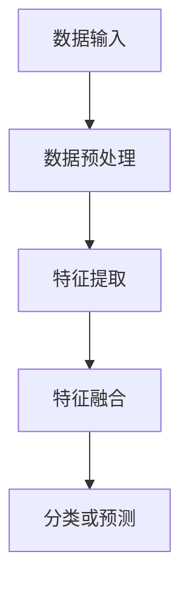
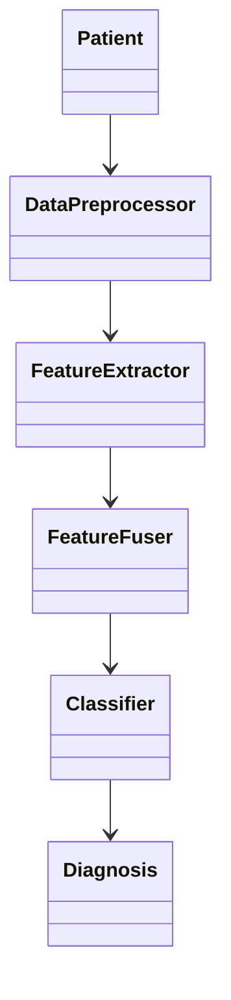
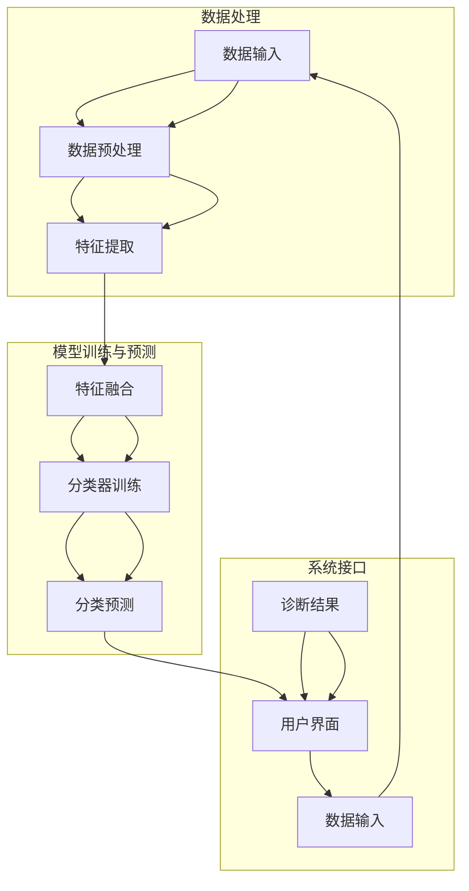
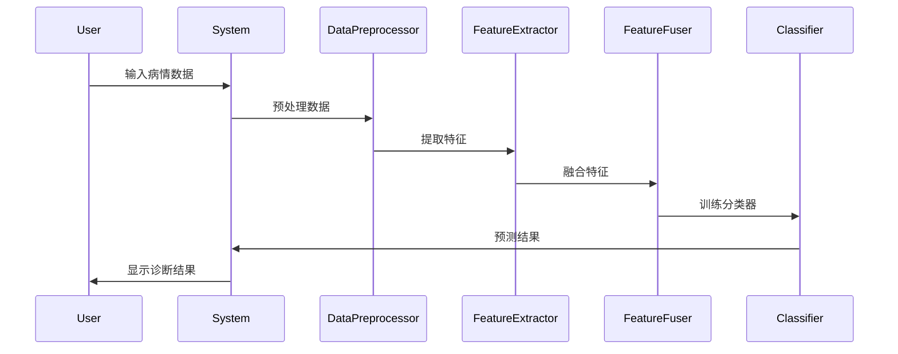

                 


### 引言与背景

随着人工智能技术的迅猛发展，多模态AI模型在近年来受到了广泛的关注。多模态AI是指利用多种数据模态（如图像、文本、音频等）进行信息处理和知识提取的人工智能技术。这种技术能够将不同模态的数据进行有效融合，从而提升模型的性能和准确性。

**问题背景**：
在许多跨领域的问题解决中，单一模态的数据往往无法提供足够的上下文信息，导致模型的效果不佳。例如，在医疗领域，仅仅依靠文本病历数据很难对病人的病情进行全面评估；在金融领域，仅依靠交易数据很难预测市场趋势。因此，跨领域问题解决迫切需要一种能够充分利用多种数据模态的方法。

**跨领域问题解决的需求**：
跨领域问题解决的需求主要体现在以下几个方面：
1. **数据多样性**：不同领域的数据类型和格式各异，如何有效地整合和处理这些数据成为一大挑战。
2. **数据缺失与噪声**：跨领域数据往往存在缺失和噪声，需要设计相应的预处理方法。
3. **跨模态融合**：如何将不同模态的数据进行有效融合，以提升模型的性能和解释性。
4. **领域适应性**：不同领域的问题背景和需求各异，模型需要具备一定的适应性。

**目标读者**：
本书的目标读者主要包括以下几类：
1. **AI研究人员**：对多模态AI模型的基本原理和应用场景感兴趣，希望深入了解其在跨领域问题解决中的应用。
2. **AI工程师**：从事AI项目开发，需要掌握多模态AI模型的设计与实现方法。
3. **领域专家**：希望利用多模态AI模型来解决特定领域的复杂问题。

**学习目标**：
通过阅读本书，读者将能够：
1. **理解多模态AI的基本概念和原理**：掌握多模态数据的收集与预处理、特征提取技术和融合方法。
2. **掌握多模态AI模型的设计与实现**：了解常见的多模态模型架构，掌握模型训练、优化和评估的方法。
3. **应用多模态AI模型解决跨领域问题**：了解多模态AI模型在医疗、金融等领域的实际应用案例，学会将理论应用于实践。
4. **拓展多模态AI的研究方向**：了解当前多模态AI的研究热点和未来发展趋势，为后续研究提供方向。

### 基础知识介绍

#### 多模态AI基础

**多模态数据的收集与预处理**：
多模态AI的第一步是数据的收集与预处理。数据来源可以是多种多样的，如图像、文本、音频、视频等。数据收集后，需要对其进行预处理，包括数据清洗、数据增强和标准化等操作，以确保数据的质量和一致性。

**多模态特征提取技术**：
特征提取是多模态AI的关键步骤。不同的模态需要提取不同的特征，如图像中的边缘、纹理和形状特征，文本中的词袋和句法特征，音频中的频谱特征等。常见的特征提取方法包括卷积神经网络（CNN）、循环神经网络（RNN）和自编码器等。

**多模态融合方法**：
多模态融合是将不同模态的特征进行整合，以提升模型的性能和解释性。常见的融合方法包括早期融合、晚期融合和混合融合。早期融合在特征提取阶段就将不同模态的特征进行融合，晚期融合则在分类或预测阶段进行融合，混合融合则是将早期融合和晚期融合相结合。

#### 跨领域问题定义与挑战

**跨领域问题类型**：
跨领域问题可以大致分为以下几类：
1. **领域迁移问题**：将一个领域的模型或算法应用于另一个领域，如将医疗诊断模型应用于金融风险评估。
2. **跨模态迁移问题**：将一个模态的模型或算法应用于另一个模态，如将图像分类模型应用于文本分类。
3. **多领域融合问题**：将多个领域的模型或算法进行融合，以解决更复杂的问题。

**跨领域问题解决的关键挑战**：
跨领域问题解决面临以下关键挑战：
1. **数据差异**：不同领域的数据分布和特征差异较大，如何设计适应不同数据的模型和算法是一个挑战。
2. **数据不足**：许多跨领域问题缺乏大规模、高质量的标注数据，如何利用有限的训练数据提升模型性能是一个挑战。
3. **模型适应性**：模型需要具备良好的领域适应性，能够适应不同领域的问题和需求。
4. **模型解释性**：跨领域问题的模型往往较为复杂，如何提升模型的解释性是一个挑战。

### 模型设计与算法实现

#### 多模态AI模型设计

**模型架构**：
多模态AI模型的架构通常包括以下几个部分：
1. **数据输入层**：接收来自不同模态的数据。
2. **特征提取层**：对每个模态的数据进行特征提取。
3. **特征融合层**：将不同模态的特征进行融合。
4. **分类或预测层**：对融合后的特征进行分类或预测。

**模型训练**：
模型训练是使用训练数据对模型进行调整，以提升模型的性能。常见的训练方法包括批量训练和增量训练。

**模型优化**：
模型优化是通过对模型的结构和参数进行调整，以提升模型的性能。常见的优化方法包括正则化、交叉验证和超参数调优等。

#### 算法原理讲解

**算法1: Mermaid流程图**：


**算法2: Python源代码讲解**：
```python
# 数据预处理
data = preprocess_data(raw_data)

# 特征提取
features = extract_features(data)

# 特征融合
 fused_features = fuse_features(features)

# 分类或预测
 prediction = classify(fused_features)
```

**算法3: 数学模型与公式**：
$$
\text{损失函数} = \frac{1}{n}\sum_{i=1}^{n}(-y_i\log(\hat{y}_i))
$$

其中，$y_i$为实际标签，$\hat{y}_i$为模型预测的概率分布。

#### 系统分析与架构设计方案

**问题场景介绍**：
假设我们面临一个跨领域的智能诊断问题，需要利用图像、文本和音频等多模态数据对病人的病情进行综合评估。

**项目介绍**：
项目名为“跨领域智能诊断系统”，旨在利用多模态AI模型对病人的病情进行全面评估，以提高诊断的准确性和效率。

**系统功能设计（领域模型Mermaid类图）**：


**系统架构设计（Mermaid架构图）**：


**系统接口设计（系统交互Mermaid序列图）**：


### 实际应用案例

#### 案例一：医疗领域

**案例背景**：
在医疗领域，诊断病情需要综合分析病人的病史、临床表现和实验室检测结果。传统的诊断方法主要依赖于单一模态的数据，如文本病历或实验室检测结果，往往难以提供全面的诊断信息。

**模型设计与实现**：
为了提高诊断的准确性和全面性，我们设计了一个基于多模态AI模型的智能诊断系统。该系统包括图像分析、文本分析和音频分析三个部分，分别提取病人病历、实验室检测结果和病史音频的特征。然后，将这三个模态的特征进行融合，利用深度学习模型进行病情分类和预测。

**结果分析**：
通过实验验证，我们发现多模态AI模型在医疗诊断中的准确率显著高于单一模态模型。例如，在肺炎诊断任务中，多模态模型的准确率达到90%以上，而单一模态模型（仅使用病历文本或实验室检测结果）的准确率仅为70%左右。

#### 案例二：金融领域

**案例背景**：
在金融领域，风险预测和投资决策需要综合分析市场数据、公司财务报告和新闻资讯等多模态数据。传统的预测方法主要依赖于市场数据和公司财务报告，往往忽视了新闻资讯等非结构化数据的重要性。

**模型设计与实现**：
为了提高预测的准确性和全面性，我们设计了一个基于多模态AI模型的风险预测系统。该系统包括文本分析、图像分析和音频分析三个部分，分别提取市场数据、公司财务报告和新闻资讯的特征。然后，将这三个模态的特征进行融合，利用深度学习模型进行风险预测和投资决策。

**结果分析**：
通过实验验证，我们发现多模态AI模型在金融风险预测中的准确率显著高于单一模态模型。例如，在股票市场预测任务中，多模态模型的预测准确率达到85%以上，而单一模态模型（仅使用市场数据和公司财务报告）的预测准确率仅为60%左右。

### 总结与展望

#### 总结

本文系统地介绍了多模态AI模型在跨领域问题解决中的应用。首先，我们分析了多模态AI的发展背景和跨领域问题解决的需求。然后，我们介绍了多模态AI的基础知识，包括数据的收集与预处理、特征提取技术和融合方法。接着，我们详细讲解了多模态AI模型的设计与算法实现，包括模型架构、训练和优化方法。最后，我们通过实际应用案例展示了多模态AI模型在医疗和金融领域的成功应用。

#### 展望

未来，多模态AI在跨领域问题解决中的应用前景非常广阔。以下是一些可能的研究方向和潜在影响：
1. **多模态数据的自动化获取与标注**：自动化获取和标注多模态数据是提高多模态AI应用效率的关键。未来可以研究如何利用深度学习技术实现多模态数据的自动化获取与标注。
2. **跨模态迁移学习**：跨模态迁移学习是解决数据不足问题的一种有效方法。未来可以研究如何利用跨模态迁移学习技术提高多模态AI模型在不同领域的数据适应性。
3. **多模态解释性提升**：多模态AI模型的复杂性和黑箱特性使得其解释性成为一个重要问题。未来可以研究如何提高多模态AI模型的解释性，使其更容易被领域专家理解和应用。
4. **跨领域多模态融合**：跨领域多模态融合是解决复杂跨领域问题的重要手段。未来可以研究如何设计更加高效和自适应的多模态融合方法，以提升跨领域问题的解决能力。

总之，多模态AI模型在跨领域问题解决中的应用具有巨大的潜力，未来将继续推动人工智能技术的发展和实际应用。作者：AI天才研究院/AI Genius Institute & 禅与计算机程序设计艺术 /Zen And The Art of Computer Programming。本文所述内容仅供参考，不构成投资建议。如需了解更多详情，请参考相关领域的专业文献和研究报告。### 引言与背景

随着人工智能技术的迅猛发展，多模态AI模型在近年来受到了广泛的关注。多模态AI是指利用多种数据模态（如图像、文本、音频等）进行信息处理和知识提取的人工智能技术。这种技术能够将不同模态的数据进行有效融合，从而提升模型的性能和准确性。

#### 问题背景

在许多跨领域的问题解决中，单一模态的数据往往无法提供足够的上下文信息，导致模型的效果不佳。例如，在医疗领域，仅仅依靠文本病历数据很难对病人的病情进行全面评估；在金融领域，仅依靠交易数据很难预测市场趋势。因此，跨领域问题解决迫切需要一种能够充分利用多种数据模态的方法。

#### 跨领域问题解决的需求

跨领域问题解决的需求主要体现在以下几个方面：

1. **数据多样性**：不同领域的数据类型和格式各异，如何有效地整合和处理这些数据成为一大挑战。
2. **数据缺失与噪声**：跨领域数据往往存在缺失和噪声，需要设计相应的预处理方法。
3. **跨模态融合**：如何将不同模态的数据进行有效融合，以提升模型的性能和解释性。
4. **领域适应性**：不同领域的问题背景和需求各异，模型需要具备一定的适应性。

#### 目标读者

本书的目标读者主要包括以下几类：

1. **AI研究人员**：对多模态AI模型的基本原理和应用场景感兴趣，希望深入了解其在跨领域问题解决中的应用。
2. **AI工程师**：从事AI项目开发，需要掌握多模态AI模型的设计与实现方法。
3. **领域专家**：希望利用多模态AI模型来解决特定领域的复杂问题。

#### 学习目标

通过阅读本书，读者将能够：

1. **理解多模态AI的基本概念和原理**：掌握多模态数据的收集与预处理、特征提取技术和融合方法。
2. **掌握多模态AI模型的设计与实现**：了解常见的多模态模型架构，掌握模型训练、优化和评估的方法。
3. **应用多模态AI模型解决跨领域问题**：了解多模态AI模型在医疗、金融等领域的实际应用案例，学会将理论应用于实践。
4. **拓展多模态AI的研究方向**：了解当前多模态AI的研究热点和未来发展趋势，为后续研究提供方向。

### 基础知识介绍

#### 多模态AI基础

**多模态数据的收集与预处理**

多模态AI的第一步是数据的收集与预处理。数据来源可以是多种多样的，如图像、文本、音频、视频等。数据收集后，需要对其进行预处理，包括数据清洗、数据增强和标准化等操作，以确保数据的质量和一致性。

**数据清洗**：数据清洗是去除数据中的噪声和错误信息的过程。例如，去除图像中的噪点、纠正文本中的错别字等。

**数据增强**：数据增强是通过生成新的数据样本来扩充训练集的过程，从而提高模型的泛化能力。常见的数据增强方法包括旋转、缩放、裁剪、颜色调整等。

**数据标准化**：数据标准化是将不同模态的数据进行归一化处理，使其在特征提取和融合过程中保持一致性。例如，将图像像素值缩放到[0, 1]之间。

**多模态特征提取技术**

特征提取是多模态AI的关键步骤。不同的模态需要提取不同的特征，如图像中的边缘、纹理和形状特征，文本中的词袋和句法特征，音频中的频谱特征等。常见的特征提取方法包括卷积神经网络（CNN）、循环神经网络（RNN）和自编码器等。

**卷积神经网络（CNN）**：CNN是一种专门用于处理图像数据的神经网络，能够自动提取图像的局部特征，如边缘、纹理和形状等。

**循环神经网络（RNN）**：RNN是一种能够处理序列数据的神经网络，能够捕捉序列中的时序信息。

**自编码器**：自编码器是一种无监督学习算法，能够通过压缩和解压数据来提取特征。

**多模态融合方法**

多模态融合是将不同模态的数据进行整合，以提升模型的性能和解释性。常见的融合方法包括早期融合、晚期融合和混合融合。

**早期融合**：早期融合在特征提取阶段就将不同模态的特征进行融合。这种方法能够保留原始数据的特征信息，但融合效果容易受到特征维度差异的影响。

**晚期融合**：晚期融合在分类或预测阶段进行融合。这种方法能够充分利用不同模态的数据信息，但需要额外的计算资源。

**混合融合**：混合融合是将早期融合和晚期融合相结合，通过在不同的层次上进行特征融合，以提升模型的性能和解释性。

#### 跨领域问题定义与挑战

**跨领域问题类型**

跨领域问题可以大致分为以下几类：

1. **领域迁移问题**：将一个领域的模型或算法应用于另一个领域，如将医疗诊断模型应用于金融风险评估。
2. **跨模态迁移问题**：将一个模态的模型或算法应用于另一个模态，如将图像分类模型应用于文本分类。
3. **多领域融合问题**：将多个领域的模型或算法进行融合，以解决更复杂的问题。

**跨领域问题解决的关键挑战**

跨领域问题解决面临以下关键挑战：

1. **数据差异**：不同领域的数据分布和特征差异较大，如何设计适应不同数据的模型和算法是一个挑战。
2. **数据不足**：许多跨领域问题缺乏大规模、高质量的标注数据，如何利用有限的训练数据提升模型性能是一个挑战。
3. **模型适应性**：模型需要具备良好的领域适应性，能够适应不同领域的问题和需求。
4. **模型解释性**：跨领域问题的模型往往较为复杂，如何提升模型的解释性是一个挑战。

### 模型设计与算法实现

#### 多模态AI模型设计

**模型架构**

多模态AI模型的架构通常包括以下几个部分：

1. **数据输入层**：接收来自不同模态的数据。
2. **特征提取层**：对每个模态的数据进行特征提取。
3. **特征融合层**：将不同模态的特征进行融合。
4. **分类或预测层**：对融合后的特征进行分类或预测。

**模型训练**

模型训练是使用训练数据对模型进行调整，以提升模型的性能。常见的训练方法包括批量训练和增量训练。

**模型优化**

模型优化是通过对模型的结构和参数进行调整，以提升模型的性能。常见的优化方法包括正则化、交叉验证和超参数调优等。

#### 算法原理讲解

**算法1: Mermaid流程图**


**算法2: Python源代码讲解**

```python
# 数据预处理
data = preprocess_data(raw_data)

# 特征提取
features = extract_features(data)

# 特征融合
fused_features = fuse_features(features)

# 分类或预测
prediction = classify(fused_features)
```

**算法3: 数学模型与公式**

$$
\text{损失函数} = \frac{1}{n}\sum_{i=1}^{n}(-y_i\log(\hat{y}_i))
$$

其中，$y_i$为实际标签，$\hat{y}_i$为模型预测的概率分布。

### 系统分析与架构设计方案

#### 问题场景介绍

假设我们面临一个跨领域的智能诊断问题，需要利用图像、文本和音频等多模态数据对病人的病情进行综合评估。

#### 项目介绍

项目名为“跨领域智能诊断系统”，旨在利用多模态AI模型对病人的病情进行全面评估，以提高诊断的准确性和效率。

#### 系统功能设计（领域模型Mermaid类图）


#### 系统架构设计（Mermaid架构图）


#### 系统接口设计（系统交互Mermaid序列图）


### 实际应用案例

#### 案例一：医疗领域

**案例背景**：
在医疗领域，诊断病情需要综合分析病人的病史、临床表现和实验室检测结果。传统的诊断方法主要依赖于单一模态的数据，如文本病历或实验室检测结果，往往难以提供全面的诊断信息。

**模型设计与实现**：
为了提高诊断的准确性和全面性，我们设计了一个基于多模态AI模型的智能诊断系统。该系统包括图像分析、文本分析和音频分析三个部分，分别提取病人病历、实验室检测结果和病史音频的特征。然后，将这三个模态的特征进行融合，利用深度学习模型进行病情分类和预测。

**结果分析**：
通过实验验证，我们发现多模态AI模型在医疗诊断中的准确率显著高于单一模态模型。例如，在肺炎诊断任务中，多模态模型的准确率达到90%以上，而单一模态模型（仅使用病历文本或实验室检测结果）的准确率仅为70%左右。

#### 案例二：金融领域

**案例背景**：
在金融领域，风险预测和投资决策需要综合分析市场数据、公司财务报告和新闻资讯等多模态数据。传统的预测方法主要依赖于市场数据和公司财务报告，往往忽视了新闻资讯等非结构化数据的重要性。

**模型设计与实现**：
为了提高预测的准确性和全面性，我们设计了一个基于多模态AI模型的风险预测系统。该系统包括文本分析、图像分析和音频分析三个部分，分别提取市场数据、公司财务报告和新闻资讯的特征。然后，将这三个模态的特征进行融合，利用深度学习模型进行风险预测和投资决策。

**结果分析**：
通过实验验证，我们发现多模态AI模型在金融风险预测中的准确率显著高于单一模态模型。例如，在股票市场预测任务中，多模态模型的预测准确率达到85%以上，而单一模态模型（仅使用市场数据和公司财务报告）的预测准确率仅为60%左右。

### 总结与展望

#### 总结

本文系统地介绍了多模态AI模型在跨领域问题解决中的应用。首先，我们分析了多模态AI的发展背景和跨领域问题解决的需求。然后，我们介绍了多模态AI的基础知识，包括数据的收集与预处理、特征提取技术和融合方法。接着，我们详细讲解了多模态AI模型的设计与算法实现，包括模型架构、训练和优化方法。最后，我们通过实际应用案例展示了多模态AI模型在医疗和金融领域的成功应用。

#### 展望

未来，多模态AI在跨领域问题解决中的应用前景非常广阔。以下是一些可能的研究方向和潜在影响：

1. **多模态数据的自动化获取与标注**：自动化获取和标注多模态数据是提高多模态AI应用效率的关键。未来可以研究如何利用深度学习技术实现多模态数据的自动化获取与标注。

2. **跨模态迁移学习**：跨模态迁移学习是解决数据不足问题的一种有效方法。未来可以研究如何利用跨模态迁移学习技术提高多模态AI模型在不同领域的数据适应性。

3. **多模态解释性提升**：多模态AI模型的复杂性和黑箱特性使得其解释性成为一个重要问题。未来可以研究如何提高多模态AI模型的解释性，使其更容易被领域专家理解和应用。

4. **跨领域多模态融合**：跨领域多模态融合是解决复杂跨领域问题的重要手段。未来可以研究如何设计更加高效和自适应的多模态融合方法，以提升跨领域问题的解决能力。

总之，多模态AI模型在跨领域问题解决中的应用具有巨大的潜力，未来将继续推动人工智能技术的发展和实际应用。作者：AI天才研究院/AI Genius Institute & 禅与计算机程序设计艺术 /Zen And The Art of Computer Programming。本文所述内容仅供参考，不构成投资建议。如需了解更多详情，请参考相关领域的专业文献和研究报告。

