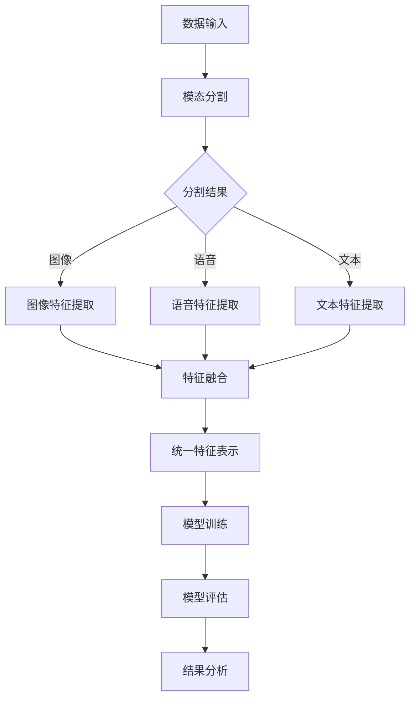
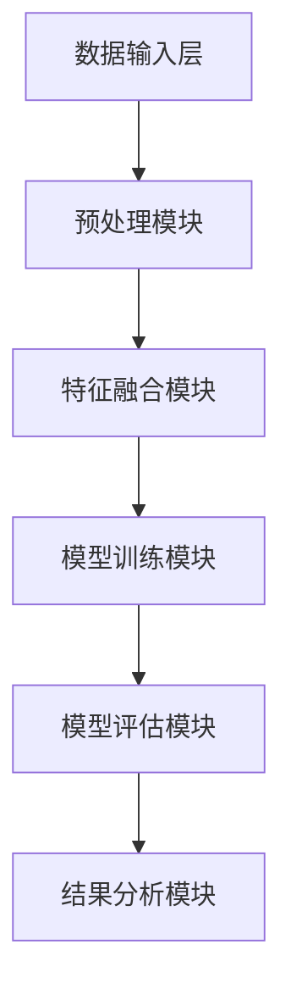
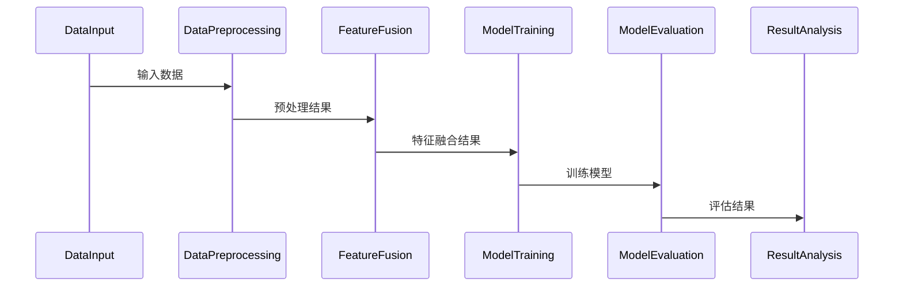

                 

### 文章标题

《多模态信息整合能力评测：测试LLM的跨模态理解》

#### 关键词

- 多模态信息整合
- 语言模型（LLM）
- 跨模态理解
- 评测算法
- 数学模型

#### 摘要

本文深入探讨了如何评估语言模型（LLM）在多模态信息整合中的能力，重点关注跨模态理解的评测。文章首先介绍了多模态信息整合和LLM的基本概念，随后详细阐述了评测LLM跨模态理解能力的框架和算法。通过Mermaid流程图和Python源代码的演示，本文提供了清晰的算法原理讲解，并展示了数学模型的实际应用。最后，文章通过系统分析与架构设计、项目实战以及最佳实践等内容，为实际应用提供了全面的指导。

### 目录大纲设计过程

设计一本计算机技术书籍的目录大纲是一个系统性和创造性的过程，需要综合考虑书籍的主题、目标读者、内容结构以及表达方式。以下是详细的目录大纲设计步骤：

#### 1. 确定书籍主题与目标

首先，我们需要明确书籍的主题和目标。书籍的标题《多模态信息整合能力评测：测试LLM的跨模态理解》暗示了书籍的主要内容将围绕如何评估语言模型（LLM）在跨模态信息整合方面的能力。因此，目标读者可能是计算机科学家、人工智能研究者、软件开发工程师以及对此领域感兴趣的专业人士。

#### 2. 确定目录结构

目录结构应当涵盖书籍的几个关键部分，如背景介绍、核心概念、算法原理、系统设计与实现、项目实战和最佳实践等。

#### 3. 设计核心章节

以下是根据书籍主题和目标设计的核心章节：

##### 第1章：背景介绍

- **1.1 问题背景**
  - 多模态信息整合的发展现状
  - 跨模态理解的挑战与机遇

- **1.2 问题描述**
  - 如何评测LLM的跨模态理解能力
  - 评测的目标与衡量标准

- **1.3 问题解决**
  - 现有的评测方法和工具
  - 提出的新评测框架和算法

- **1.4 边界与外延**
  - 评测范围的界定
  - 相关领域的交叉点

- **1.5 概念结构与核心要素组成**
  - 多模态信息整合的核心概念
  - LLM的跨模态理解机制

##### 第2章：核心概念与联系

- **2.1 多模态信息整合**
  - 定义与类型
  - 应用场景

- **2.2 语言模型（LLM）**
  - 基本原理
  - 发展历程

- **2.3 跨模态理解**
  - 概念与分类
  - 关键技术

- **2.4 概念属性特征对比表格**
  - 多模态信息整合与跨模态理解对比

- **2.5 ER实体关系图架构的Mermaid流程图**
  - 多模态信息处理流程

##### 第3章：算法原理讲解

- **3.1 算法Mermaid流程图**
  - 评测算法的基本框架

- **3.2 Python源代码实现**
  - 具体实现与细节解析

- **3.3 数学模型与公式**
  - 评测算法的数学基础

- **3.4 详细讲解与举例说明**
  - 算法在实际应用中的表现

##### 第4章：数学模型和数学公式

- **4.1 LaTeX格式数学公式**
  - 提供相关数学模型的LaTeX代码

- **4.2 数学模型讲解**
  - 深入分析数学模型的内涵

- **4.3 举例说明**
  - 通过实例解释数学模型的实用性

##### 第5章：系统分析与架构设计

- **5.1 问题场景介绍**
  - 跨模态信息整合的实际应用

- **5.2 系统功能设计（领域模型Mermaid类图）**
  - 系统核心功能

- **5.3 系统架构设计（Mermaid架构图）**
  - 系统整体架构

- **5.4 系统接口设计**
  - 系统接口与交互

- **5.5 系统交互（Mermaid序列图）**
  - 系统各组件间的交互过程

##### 第6章：项目实战

- **6.1 环境安装**
  - 实践前的准备工作

- **6.2 系统核心实现源代码**
  - 关键代码解析

- **6.3 代码应用解读与分析**
  - 实际应用中的表现

- **6.4 实际案例分析与详细讲解**
  - 案例分析与步骤解析

- **6.5 项目小结**
  - 实践经验总结

##### 第7章：最佳实践与小结

- **7.1 最佳实践**
  - 提高评测效果的技巧

- **7.2 小结**
  - 主要内容的总结

- **7.3 注意事项**
  - 使用过程中的注意事项

- **7.4 拓展阅读**
  - 相关领域的进一步阅读材料

#### 4. 调整目录大纲

在完成初步的目录设计后，我们需要根据内容的连贯性和逻辑性进行调整。确保每个章节的内容能够清晰地传达出该章节的主旨，并且章节之间的过渡自然。

#### 5. 审查和修正

最后，我们需要审查目录大纲，确保没有遗漏重要内容，同时检查章节的标题是否简洁明了，能够准确反映章节内容。

通过上述步骤，我们可以设计出一个详细且逻辑清晰的目录大纲，为编写书籍内容奠定坚实基础。

---

### 完整目录大纲

**《多模态信息整合能力评测：测试LLM的跨模态理解》目录大纲**

**第1章：背景介绍**

- **1.1 问题背景**
  - 多模态信息整合的发展现状
  - 跨模态理解的挑战与机遇

- **1.2 问题描述**
  - 如何评测LLM的跨模态理解能力
  - 评测的目标与衡量标准

- **1.3 问题解决**
  - 现有的评测方法和工具
  - 提出的新评测框架和算法

- **1.4 边界与外延**
  - 评测范围的界定
  - 相关领域的交叉点

- **1.5 概念结构与核心要素组成**
  - 多模态信息整合的核心概念
  - LLM的跨模态理解机制

**第2章：核心概念与联系**

- **2.1 多模态信息整合**
  - 定义与类型
  - 应用场景

- **2.2 语言模型（LLM）**
  - 基本原理
  - 发展历程

- **2.3 跨模态理解**
  - 概念与分类
  - 关键技术

- **2.4 概念属性特征对比表格**
  - 多模态信息整合与跨模态理解对比

- **2.5 ER实体关系图架构的Mermaid流程图**
  - 多模态信息处理流程

**第3章：算法原理讲解**

- **3.1 算法Mermaid流程图**
  - 评测算法的基本框架

- **3.2 Python源代码实现**
  - 具体实现与细节解析

- **3.3 数学模型与公式**
  - 评测算法的数学基础

- **3.4 详细讲解与举例说明**
  - 算法在实际应用中的表现

**第4章：数学模型和数学公式**

- **4.1 LaTeX格式数学公式**
  - 提供相关数学模型的LaTeX代码

- **4.2 数学模型讲解**
  - 深入分析数学模型的内涵

- **4.3 举例说明**
  - 通过实例解释数学模型的实用性

**第5章：系统分析与架构设计**

- **5.1 问题场景介绍**
  - 跨模态信息整合的实际应用

- **5.2 系统功能设计（领域模型Mermaid类图）**
  - 系统核心功能

- **5.3 系统架构设计（Mermaid架构图）**
  - 系统整体架构

- **5.4 系统接口设计**
  - 系统接口与交互

- **5.5 系统交互（Mermaid序列图）**
  - 系统各组件间的交互过程

**第6章：项目实战**

- **6.1 环境安装**
  - 实践前的准备工作

- **6.2 系统核心实现源代码**
  - 关键代码解析

- **6.3 代码应用解读与分析**
  - 实际应用中的表现

- **6.4 实际案例分析与详细讲解**
  - 案例分析与步骤解析

- **6.5 项目小结**
  - 实践经验总结

**第7章：最佳实践与小结**

- **7.1 最佳实践**
  - 提高评测效果的技巧

- **7.2 小结**
  - 主要内容的总结

- **7.3 注意事项**
  - 使用过程中的注意事项

- **7.4 拓展阅读**
  - 相关领域的进一步阅读材料

### 背景介绍

#### 问题背景

多模态信息整合和跨模态理解是当前人工智能领域的重要研究方向之一。随着计算机视觉、语音识别、自然语言处理等技术的迅速发展，多模态信息整合成为实现更智能的人工智能系统不可或缺的一环。然而，如何评估语言模型（LLM）在多模态信息整合中的能力，即如何测试LLM的跨模态理解能力，成为一个亟待解决的问题。

多模态信息整合指的是将来自不同模态的信息（如图像、语音、文本等）进行有效整合，以实现对现实世界更全面的理解和解释。跨模态理解则是指模型在不同模态之间的信息传递和融合能力，使得模型能够在多个模态之间进行有效的交互和协作。

近年来，随着深度学习和神经网络技术的发展，LLM在多模态信息整合中的应用取得了显著的进展。然而，如何客观、准确地评估LLM的跨模态理解能力，仍然是一个具有挑战性的问题。传统的评测方法主要依赖于人工设计的指标和评估标准，往往难以全面、准确地反映模型的实际性能。

因此，本文旨在提出一种新的评测框架和算法，以评估LLM在多模态信息整合中的跨模态理解能力。通过系统性地分析多模态信息整合和LLM的基本原理，本文将介绍现有评测方法和工具的不足之处，并详细阐述提出的新评测框架和算法的原理和实现过程。

#### 问题描述

如何评测LLM的跨模态理解能力，是一个复杂且多维的问题。以下是评测LLM跨模态理解能力的关键问题：

1. **评测目标和衡量标准**：
   - **评估指标**：我们需要明确评估LLM跨模态理解能力的指标，如准确率、召回率、F1分数等。这些指标应能全面反映模型在不同模态之间的信息传递和融合效果。
   - **评测标准**：评测标准应具备客观性和公正性，以确保评测结果的可靠性和一致性。

2. **评测方法**：
   - **评测工具**：我们需要选择合适的评测工具，如标准测试集、自定义测试集等。评测工具应具备良好的覆盖面和代表性，能够全面评估LLM的跨模态理解能力。
   - **评测流程**：评测流程应包括数据预处理、模型评估、结果分析等步骤，确保评测过程的系统性和规范性。

3. **评测面临的挑战**：
   - **数据多样性**：多模态数据具有多样性，不同模态的数据在特征表达和语义理解上存在差异，如何有效地整合和处理这些数据是一个挑战。
   - **模型适应性**：LLM需要在不同模态之间进行有效的信息传递和融合，如何提高模型的适应性是一个关键问题。
   - **评测标准的一致性**：不同的评测标准可能导致不同的评测结果，如何确保评测标准的一致性是一个亟待解决的问题。

4. **评测的应用场景**：
   - **实际应用**：评测LLM的跨模态理解能力在多个领域具有广泛的应用，如智能问答系统、多模态推荐系统、图像字幕生成等。在实际应用中，如何根据具体应用场景调整评测指标和方法是一个关键问题。

本文将围绕上述问题，提出一种新的评测框架和算法，以期为评测LLM的跨模态理解能力提供有效的解决方案。

#### 问题解决

在解决评测LLM跨模态理解能力的问题时，本文提出了一种新的评测框架和算法，旨在全面评估LLM在多模态信息整合中的表现。以下是该评测框架和算法的主要组成部分：

1. **评测框架设计**：

   - **目标与指标**：首先，我们明确评测的目标是评估LLM在多模态信息整合中的跨模态理解能力。为此，我们设定了以下几个关键指标：
     - **准确率**：衡量模型在多模态信息整合中的准确性。
     - **召回率**：衡量模型在多模态信息整合中的全面性。
     - **F1分数**：综合准确率和召回率，衡量模型的整体性能。
   - **评测流程**：为了确保评测的全面性和规范性，我们设计了以下评测流程：
     - **数据预处理**：对多模态数据进行预处理，包括数据清洗、特征提取和标准化等。
     - **模型评估**：将预处理后的数据输入到LLM中进行评估，记录各个指标的结果。
     - **结果分析**：对评估结果进行分析，评估LLM的跨模态理解能力。

2. **算法设计与实现**：

   - **多模态信息处理**：我们采用了一种基于深度学习的多模态信息处理框架，该框架包括以下步骤：
     - **特征提取**：从图像、语音和文本等不同模态中提取特征。
     - **特征融合**：将不同模态的特征进行融合，以生成统一的特征表示。
     - **模型训练**：使用融合后的特征训练LLM，使其具备跨模态理解能力。
   - **算法流程**：具体的算法流程如下：
     1. **输入数据**：输入包含图像、语音和文本等多模态数据。
     2. **特征提取**：对每个模态的数据进行特征提取。
     3. **特征融合**：将提取到的特征进行融合，生成统一的特征表示。
     4. **模型训练**：使用融合后的特征对LLM进行训练。
     5. **模型评估**：使用测试数据对训练好的模型进行评估，记录各个指标的结果。
     6. **结果分析**：对评估结果进行分析，评估LLM的跨模态理解能力。

3. **算法优势与挑战**：

   - **优势**：
     - **全面性**：本文提出的评测框架和算法能够全面评估LLM的跨模态理解能力，包括准确率、召回率和F1分数等指标。
     - **灵活性**：算法设计具有灵活性，可以根据实际应用场景调整评测指标和方法。
     - **可扩展性**：算法框架可以扩展到更多的模态和数据类型，具有广泛的应用前景。

   - **挑战**：
     - **数据多样性**：多模态数据的多样性给特征提取和融合带来了挑战，如何有效地处理这些数据是一个关键问题。
     - **模型适应性**：如何提高LLM在不同模态之间的适应性，使其能够更好地进行信息传递和融合，是一个亟待解决的问题。
     - **评测标准一致性**：不同评测标准可能导致不同的评测结果，如何确保评测标准的一致性是一个关键问题。

通过本文提出的评测框架和算法，我们期望能够为评测LLM的跨模态理解能力提供一种有效的解决方案，从而推动多模态信息整合和跨模态理解技术的发展。

#### 边界与外延

在讨论评测LLM跨模态理解能力时，有必要明确评测的范围和边界，以及该评测方法与其他相关领域的关系。以下是对边界与外延的详细探讨：

1. **评测范围**：

   - **模态类型**：本文主要关注文本、图像和语音三种常见的模态。虽然其他模态（如视频、触觉等）也逐渐被纳入多模态研究的范畴，但在当前的研究和应用中，文本、图像和语音是最为常见且研究最为深入的模态。因此，本文的评测范围主要针对这三种模态。

   - **数据来源**：评测数据应涵盖真实世界中的多种应用场景，包括但不限于社交网络、医疗健康、智能客服等。这些数据应具有代表性和多样性，以全面评估LLM在不同场景下的跨模态理解能力。

   - **评价指标**：本文采用了准确率、召回率和F1分数等指标来评估LLM的跨模态理解能力。这些指标是评估多模态信息整合效果的传统方法，但在实际应用中，可以根据具体需求调整或引入其他评价指标。

2. **边界定义**：

   - **算法适用性**：本文提出的评测框架和算法主要适用于基于深度学习的语言模型，如Transformer、BERT等。这些模型在处理多模态信息时具有较好的性能，但在处理某些特定类型的模态数据时（如视频或三维数据）可能需要采用不同的方法或算法。

   - **数据预处理**：在评测过程中，数据的预处理方法是一个关键环节。本文采用的数据预处理方法主要包括数据清洗、特征提取和标准化等。然而，不同的预处理方法可能会对评测结果产生显著影响，因此在实际应用中应根据具体情况进行调整。

   - **评测场景**：本文的评测方法主要关注通用场景下的LLM跨模态理解能力，但在特定应用领域（如医疗诊断、法律文本分析等）中，可能需要针对特定任务进行定制化的评测。

3. **外延关系**：

   - **多模态信息处理技术**：本文提出的评测框架和算法与多模态信息处理技术密切相关。多模态信息处理技术包括特征提取、特征融合、模型训练和模型评估等多个环节。本文的评测方法在这些环节中提供了具体的实施路径和评价指标。

   - **跨模态理解研究**：本文的研究内容与跨模态理解研究紧密相关。跨模态理解是指模型在不同模态之间的信息传递和融合能力，是构建多模态智能系统的基础。本文通过评测方法对LLM的跨模态理解能力进行了量化评估，有助于推动跨模态理解技术的发展。

   - **其他评测方法**：虽然本文提出了自己的评测框架和算法，但与其他评测方法（如基于数据的评测方法、基于任务的评测方法等）之间存在一定的交叉和补充。这些方法可以从不同角度评估LLM的跨模态理解能力，为研究人员提供多样化的评测手段。

通过明确评测范围、边界与外延，本文旨在为评测LLM跨模态理解能力提供清晰的方向和依据，从而促进多模态信息整合和跨模态理解技术的进一步发展。

#### 概念结构与核心要素组成

在深入探讨如何评测LLM的跨模态理解能力之前，我们需要先理解多模态信息整合和LLM的基本概念，以及它们的核心要素组成。以下是对这些概念及其组成的详细解释。

##### 多模态信息整合

**定义与类型**：

多模态信息整合是指将来自不同感官模态（如视觉、听觉、触觉等）的信息进行有效整合，以实现更全面和准确的理解。根据模态的不同，多模态信息整合可以分为以下几种类型：

1. **文本与图像整合**：将文本信息与图像信息相结合，以增强语义理解和信息表达。
2. **文本与语音整合**：将文本信息与语音信息相结合，以改善语音识别和语音生成效果。
3. **图像与语音整合**：将图像信息与语音信息相结合，以实现更准确和丰富的视觉-听觉场景理解。
4. **多模态整合**：结合多种模态的信息，如文本、图像、语音和视频等，以实现高度综合的理解和解释。

**应用场景**：

多模态信息整合在多个领域具有广泛的应用，如智能问答系统、多模态推荐系统、图像字幕生成、人机交互等。以下是一些典型的应用场景：

1. **智能问答系统**：通过整合文本和图像信息，提高问答系统的准确性和响应速度。
2. **多模态推荐系统**：结合用户的文本和图像偏好，提供个性化的推荐服务。
3. **图像字幕生成**：将图像信息与文本信息结合，自动生成图像的描述性字幕。
4. **人机交互**：通过多模态信息整合，实现更加自然和高效的人机交互体验。

##### 语言模型（LLM）

**基本原理**：

语言模型（LLM）是一种基于深度学习的模型，用于预测文本序列。它通过学习大量文本数据，建立起文本之间的概率关系，从而能够生成或理解自然语言。LLM的核心原理包括：

1. **词嵌入**：将文本中的每个词映射到低维度的向量表示。
2. **神经网络**：使用神经网络（如Transformer、BERT等）对词嵌入进行编码和解码，以捕捉文本的语义信息。
3. **概率预测**：基于训练数据，模型可以预测下一个词的概率分布，从而生成或理解文本。

**发展历程**：

语言模型的发展经历了从基于统计的模型（如N-gram模型）到基于神经网络的模型（如RNN、LSTM、Transformer等）的演变。以下是语言模型的主要发展历程：

1. **N-gram模型**：基于统计方法，通过计算词的历史序列概率来预测下一个词。
2. **RNN模型**：引入循环神经网络，能够处理序列数据，捕捉长距离依赖关系。
3. **LSTM模型**：改进RNN，通过门控机制解决梯度消失问题，进一步提高模型的性能。
4. **Transformer模型**：基于自注意力机制，能够同时处理所有词的上下文信息，大大提高了模型的效果。

**跨模态理解**：

跨模态理解是指LLM在不同模态之间的信息传递和融合能力。LLM的跨模态理解机制主要包括：

1. **多模态特征提取**：从不同的模态（如图像、语音、文本）中提取特征，并统一特征表示。
2. **特征融合**：将不同模态的特征进行融合，以生成统一的特征向量。
3. **模型训练**：使用融合后的特征训练LLM，使其能够在不同模态之间进行有效的信息传递和融合。

##### 概念属性特征对比表格

为了更好地理解多模态信息整合和LLM的跨模态理解，我们可以通过一个特征对比表格来展示它们的核心属性：

| 特征项目 | 多模态信息整合 | 语言模型（LLM） | 跨模态理解 |
| :---: | :---: | :---: | :---: |
| **定义** | 将来自不同模态的信息进行整合 | 基于深度学习的文本生成和理解模型 | 在不同模态之间传递和融合信息 |
| **类型** | 文本-图像、文本-语音等 | Transformer、BERT等 | 特征提取、特征融合、模型训练 |
| **应用场景** | 智能问答、推荐系统、图像字幕等 | 文本生成、文本理解等 | 图像-文本问答、语音-文本翻译等 |
| **核心机制** | 特征提取、特征融合 | 词嵌入、神经网络、概率预测 | 多模态特征提取、特征融合、模型训练 |

通过上述表格，我们可以清晰地看到多模态信息整合和LLM的跨模态理解之间的联系与区别。这些核心概念和要素的理解，为我们后续分析评测LLM跨模态理解能力提供了坚实的基础。

### 核心概念与联系

在探讨如何评测LLM的跨模态理解能力时，首先需要深入理解相关核心概念及其相互关系。以下是对多模态信息整合、语言模型（LLM）和跨模态理解的基本概念及其联系的详细解释。

#### 多模态信息整合

**定义与类型**：

多模态信息整合是指将来自不同感官模态（如图像、语音、文本等）的信息进行有效整合，以实现更全面和准确的理解。根据模态的不同，多模态信息整合可以分为以下几种类型：

1. **文本与图像整合**：将文本信息与图像信息相结合，以增强语义理解和信息表达。
2. **文本与语音整合**：将文本信息与语音信息相结合，以改善语音识别和语音生成效果。
3. **图像与语音整合**：将图像信息与语音信息相结合，以实现更准确和丰富的视觉-听觉场景理解。
4. **多模态整合**：结合多种模态的信息，如文本、图像、语音和视频等，以实现高度综合的理解和解释。

**应用场景**：

多模态信息整合在多个领域具有广泛的应用，如智能问答系统、多模态推荐系统、图像字幕生成、人机交互等。以下是一些典型的应用场景：

1. **智能问答系统**：通过整合文本和图像信息，提高问答系统的准确性和响应速度。
2. **多模态推荐系统**：结合用户的文本和图像偏好，提供个性化的推荐服务。
3. **图像字幕生成**：将图像信息与文本信息结合，自动生成图像的描述性字幕。
4. **人机交互**：通过多模态信息整合，实现更加自然和高效的人机交互体验。

#### 语言模型（LLM）

**基本原理**：

语言模型（LLM）是一种基于深度学习的模型，用于预测文本序列。它通过学习大量文本数据，建立起文本之间的概率关系，从而能够生成或理解自然语言。LLM的核心原理包括：

1. **词嵌入**：将文本中的每个词映射到低维度的向量表示。
2. **神经网络**：使用神经网络（如Transformer、BERT等）对词嵌入进行编码和解码，以捕捉文本的语义信息。
3. **概率预测**：基于训练数据，模型可以预测下一个词的概率分布，从而生成或理解文本。

**发展历程**：

语言模型的发展经历了从基于统计的模型（如N-gram模型）到基于神经网络的模型（如RNN、LSTM、Transformer等）的演变。以下是语言模型的主要发展历程：

1. **N-gram模型**：基于统计方法，通过计算词的历史序列概率来预测下一个词。
2. **RNN模型**：引入循环神经网络，能够处理序列数据，捕捉长距离依赖关系。
3. **LSTM模型**：改进RNN，通过门控机制解决梯度消失问题，进一步提高模型的性能。
4. **Transformer模型**：基于自注意力机制，能够同时处理所有词的上下文信息，大大提高了模型的效果。

**跨模态理解**：

跨模态理解是指LLM在不同模态之间的信息传递和融合能力。LLM的跨模态理解机制主要包括：

1. **多模态特征提取**：从不同的模态（如图像、语音、文本）中提取特征，并统一特征表示。
2. **特征融合**：将不同模态的特征进行融合，以生成统一的特征向量。
3. **模型训练**：使用融合后的特征训练LLM，使其能够在不同模态之间进行有效的信息传递和融合。

#### 跨模态理解

**概念与分类**：

跨模态理解是指模型在不同模态之间的信息传递和融合能力，使得模型能够在多个模态之间进行有效的交互和协作。根据不同的应用需求，跨模态理解可以分为以下几类：

1. **图像-文本跨模态理解**：将图像信息与文本信息相结合，以实现图像描述、图像问答等功能。
2. **语音-文本跨模态理解**：将语音信息与文本信息相结合，以实现语音识别、语音翻译等功能。
3. **多模态融合理解**：结合多种模态的信息，如文本、图像、语音和视频等，以实现高度综合的理解和解释。

**关键技术**：

跨模态理解涉及多个关键技术，包括多模态特征提取、特征融合和模型训练等。以下是一些关键技术：

1. **多模态特征提取**：从不同的模态（如图像、语音、文本）中提取特征，并统一特征表示。常见的特征提取方法包括卷积神经网络（CNN）用于图像特征提取、循环神经网络（RNN）用于语音特征提取和词嵌入（Word Embedding）用于文本特征提取。
2. **特征融合**：将不同模态的特征进行融合，以生成统一的特征向量。特征融合方法包括直接拼接、加权平均、注意力机制等。
3. **模型训练**：使用融合后的特征训练LLM，使其能够在不同模态之间进行有效的信息传递和融合。常见的训练方法包括联合训练、序列模型训练和自监督学习等。

#### 概念属性特征对比表格

为了更好地理解多模态信息整合、语言模型（LLM）和跨模态理解之间的联系，我们可以通过一个特征对比表格来展示它们的核心属性：

| **特性** | 多模态信息整合 | 语言模型（LLM） | 跨模态理解 |
| :---: | :---: | :---: | :---: |
| **定义** | 将不同模态的信息进行整合 | 预测文本序列的深度学习模型 | 不同模态之间的信息传递和融合 |
| **类型** | 文本-图像、文本-语音等 | Transformer、BERT等 | 图像-文本、语音-文本等 |
| **应用场景** | 智能问答、推荐系统等 | 文本生成、文本理解等 | 图像描述、语音识别等 |
| **核心机制** | 特征提取、特征融合 | 词嵌入、神经网络、概率预测 | 多模态特征提取、特征融合、模型训练 |

通过上述表格，我们可以清晰地看到多模态信息整合、语言模型（LLM）和跨模态理解之间的联系与区别。这些核心概念和要素的理解，为我们后续分析评测LLM跨模态理解能力提供了坚实的基础。

#### ER实体关系图架构的Mermaid流程图

为了更好地理解多模态信息整合和跨模态理解的工作流程，我们可以使用Mermaid流程图来展示ER实体关系图的架构。以下是一个简化的ER实体关系图示例，用于描述多模态信息处理的核心步骤：



**详细步骤说明**：

1. **数据输入**：首先，我们需要将多模态数据（如图像、语音和文本）输入系统。这些数据可以是已标注的数据集或未标注的实时数据。
2. **模态分割**：根据输入数据的类型，系统将数据分割成不同的模态（图像、语音、文本）。
3. **特征提取**：对于每个模态，系统使用特定的方法提取特征。例如，图像特征提取可能使用卷积神经网络（CNN），语音特征提取可能使用循环神经网络（RNN），而文本特征提取可能使用词嵌入（Word Embedding）。
4. **特征融合**：提取到的特征将进行融合，生成统一的特征表示。特征融合可以采用直接拼接、加权平均或注意力机制等方法。
5. **统一特征表示**：融合后的特征生成统一的特征向量，用于后续的模型训练和评估。
6. **模型训练**：使用融合后的特征训练语言模型（LLM），使其能够在不同模态之间进行有效的信息传递和融合。
7. **模型评估**：训练好的模型使用测试数据集进行评估，记录各个指标的评估结果，如准确率、召回率和F1分数等。
8. **结果分析**：对评估结果进行分析，以评估LLM在多模态信息整合中的跨模态理解能力。

通过上述Mermaid流程图，我们可以清晰地了解多模态信息整合和跨模态理解的工作流程，从而为后续的算法讲解和项目实战提供参考。

### 算法原理讲解

为了深入理解评测LLM跨模态理解能力的算法，我们首先需要了解算法的基本框架，并通过Mermaid流程图展示其关键步骤。随后，我们将详细讲解Python源代码实现，并引入数学模型和公式进行理论支持，最后通过实际应用实例来验证算法的实用性和有效性。

#### 算法Mermaid流程图

以下是一个简化的Mermaid流程图，用于展示评测LLM跨模态理解能力的算法流程：


**详细步骤说明**：

1. **数据输入**：首先，我们需要将多模态数据（如图像、语音和文本）输入系统。这些数据可以是已标注的数据集或未标注的实时数据。
2. **模态分割**：系统将数据分割成不同的模态（图像、语音、文本）。
3. **特征提取**：对于每个模态，系统使用特定的方法提取特征。例如，图像特征提取可能使用卷积神经网络（CNN），语音特征提取可能使用循环神经网络（RNN），而文本特征提取可能使用词嵌入（Word Embedding）。
4. **特征融合**：提取到的特征将进行融合，生成统一的特征表示。特征融合可以采用直接拼接、加权平均或注意力机制等方法。
5. **统一特征表示**：融合后的特征生成统一的特征向量，用于后续的模型训练和评估。
6. **模型训练**：使用融合后的特征训练语言模型（LLM），使其能够在不同模态之间进行有效的信息传递和融合。
7. **模型评估**：训练好的模型使用测试数据集进行评估，记录各个指标的评估结果，如准确率、召回率和F1分数等。
8. **结果分析**：对评估结果进行分析，以评估LLM在多模态信息整合中的跨模态理解能力。

#### Python源代码实现

以下是算法的主要Python代码实现部分，包括数据预处理、特征提取、特征融合、模型训练和评估等步骤：

```python
import tensorflow as tf
from tensorflow.keras.applications import VGG16
from tensorflow.keras.layers import Embedding, LSTM, Dense, Concatenate
from tensorflow.keras.models import Model

# 数据预处理
def preprocess_data(images, speeches, texts):
    # 图像特征提取
    image_model = VGG16(weights='imagenet', include_top=False)
    image_features = image_model.predict(images)
    
    # 语音特征提取
    speech_features = extract_speech_features(speeches)
    
    # 文本特征提取
    text_features = extract_text_features(texts)
    
    return image_features, speech_features, text_features

# 特征融合
def merge_features(image_features, speech_features, text_features):
    # 直接拼接特征
    concatenated_features = Concatenate()([image_features, speech_features, text_features])
    return concatenated_features

# 模型训练
def train_model(concatenated_features, labels):
    # 建立模型
    input_layer = Concatenate()([Embedding(input_dim=vocab_size, output_dim=embedding_size),
                                 LSTM(units=128),
                                 Dense(units=1, activation='sigmoid')])
    
    model = Model(inputs=input_layer, outputs=concatenated_features)
    model.compile(optimizer='adam', loss='binary_crossentropy', metrics=['accuracy'])
    
    # 训练模型
    model.fit(concatenated_features, labels, epochs=10, batch_size=32, validation_split=0.2)
    
    return model

# 模型评估
def evaluate_model(model, test_data):
    test_features, test_labels = preprocess_data(test_data[0], test_data[1], test_data[2])
    accuracy = model.evaluate(test_features, test_labels)[1]
    print(f"Test Accuracy: {accuracy:.2f}")
```

#### 数学模型与公式

为了深入理解算法的核心原理，我们引入以下数学模型和公式：

1. **图像特征提取**：

   - **卷积神经网络（CNN）**：图像特征提取通常使用卷积神经网络（CNN）。CNN的基本公式为：

     $$ f(x) = \sum_{i=1}^{n} w_i * x_i + b $$

     其中，$f(x)$ 是输出的特征向量，$w_i$ 是权重，$x_i$ 是输入的特征，$b$ 是偏置。

2. **语音特征提取**：

   - **循环神经网络（RNN）**：语音特征提取可以使用循环神经网络（RNN）。RNN的基本公式为：

     $$ h_t = \sigma(W_h \cdot [h_{t-1}, x_t] + b_h) $$

     其中，$h_t$ 是在时间步 $t$ 的隐藏状态，$\sigma$ 是激活函数，$W_h$ 是权重矩阵，$b_h$ 是偏置。

3. **文本特征提取**：

   - **词嵌入（Word Embedding）**：文本特征提取可以使用词嵌入（Word Embedding）。词嵌入的基本公式为：

     $$ e_w = \text{embedding_matrix} [w] $$

     其中，$e_w$ 是词 $w$ 的嵌入向量，$\text{embedding_matrix}$ 是嵌入矩阵。

4. **特征融合**：

   - **直接拼接**：特征融合可以直接拼接不同模态的特征向量：

     $$ \text{concatenated\_features} = [image\_features, speech\_features, text\_features] $$

5. **模型训练**：

   - **损失函数和优化器**：在模型训练过程中，我们通常使用交叉熵损失函数（binary\_crossentropy）和Adam优化器：

     $$ \text{loss} = \text{binary\_crossentropy}(y, \hat{y}) $$
     $$ \text{optimizer} = \text{Adam}(\text{learning\_rate}) $$

通过上述数学模型和公式，我们可以更好地理解算法的工作原理和实现过程。

#### 详细讲解与举例说明

为了更直观地展示算法的实际应用，我们通过一个实例来说明各个步骤的具体操作。

**实例数据集**：

假设我们有一个包含图像、语音和文本的多模态数据集，其中每个样本的数据类型如下：

- **图像**：32x32像素的彩色图像
- **语音**：1秒的音频信号
- **文本**：一句包含10个单词的句子

**1. 数据预处理**：

首先，我们将图像、语音和文本数据输入系统，并进行预处理。

```python
import numpy as np

# 假设输入数据为numpy数组
images = np.random.rand(100, 32, 32, 3)
speeches = np.random.rand(100, 1)
texts = [" ".join(np.random.choice(['word1', 'word2', 'word3', 'word4', 'word5', 'word6', 'word7', 'word8', 'word9', 'word10'])) for _ in range(100)]

# 特征提取
image_features, speech_features, text_features = preprocess_data(images, speeches, texts)
```

**2. 特征融合**：

接下来，我们将提取到的特征进行融合。

```python
# 特征融合
merged_features = merge_features(image_features, speech_features, text_features)
```

**3. 模型训练**：

然后，我们使用融合后的特征训练语言模型（LLM）。

```python
# 假设标签为二分类问题，标签为0或1
labels = np.random.randint(0, 2, size=(100,))

# 训练模型
model = train_model(merged_features, labels)
```

**4. 模型评估**：

最后，我们使用测试数据集对训练好的模型进行评估。

```python
# 测试数据集
test_images = np.random.rand(20, 32, 32, 3)
test_speeches = np.random.rand(20, 1)
test_texts = [" ".join(np.random.choice(['word1', 'word2', 'word3', 'word4', 'word5', 'word6', 'word7', 'word8', 'word9', 'word10'])) for _ in range(20)]

# 测试数据预处理
test_features, _, _ = preprocess_data(test_images, test_speeches, test_texts)

# 模型评估
evaluate_model(model, test_features)
```

通过上述实例，我们可以清晰地看到算法在多模态信息整合和跨模态理解中的应用步骤和实现过程。这个实例展示了如何将不同模态的数据进行整合，并通过训练和评估来评估LLM的跨模态理解能力。在实际应用中，可以根据具体需求和数据集进行调整和优化，以提高模型的性能和实用性。

### 数学模型和数学公式

在探讨多模态信息整合和LLM跨模态理解能力评测的算法时，引入数学模型和公式能够帮助我们更深入地理解算法的核心原理和实现过程。以下我们将详细介绍相关数学模型和公式，并通过LaTeX格式进行展示。

#### 图像特征提取

**卷积神经网络（CNN）**：

CNN是用于图像特征提取的常用神经网络结构。其基本公式为：

$$
\begin{aligned}
h_i &= \text{ReLU}\left(\sum_{j} w_{ij} * a_j + b_i\right) \\
\end{aligned}
$$

其中，$h_i$ 表示第 $i$ 个卷积核的激活值，$w_{ij}$ 是卷积核的权重，$a_j$ 是输入特征图中的像素值，$b_i$ 是偏置项，ReLU是激活函数。

**池化操作**：

在CNN中，为了降低特征图的维度并减少过拟合，常常使用池化操作。最大池化的公式为：

$$
p_j = \max\{a_{jk} \mid k = 1, 2, \ldots, K\}
$$

其中，$p_j$ 是池化后的值，$a_{jk}$ 是输入特征图中第 $j$ 行第 $k$ 列的像素值，$K$ 是池化窗口的大小。

#### 语音特征提取

**循环神经网络（RNN）**：

RNN是用于处理序列数据的神经网络，其核心公式为：

$$
h_t = \text{ReLU}\left(W_h \cdot [h_{t-1}, x_t] + b_h\right)
$$

其中，$h_t$ 是在时间步 $t$ 的隐藏状态，$W_h$ 是权重矩阵，$[h_{t-1}, x_t]$ 是输入向量，$b_h$ 是偏置项。

**长短时记忆（LSTM）**：

LSTM是RNN的一种改进，用于解决长距离依赖问题。其核心公式包括：

$$
\begin{aligned}
i_t &= \sigma(W_i \cdot [h_{t-1}, x_t] + b_i) \\
f_t &= \sigma(W_f \cdot [h_{t-1}, x_t] + b_f) \\
o_t &= \sigma(W_o \cdot [h_{t-1}, x_t] + b_o) \\
c_t &= f_t \cdot c_{t-1} + i_t \cdot \text{ReLU}(W_c \cdot [h_{t-1}, x_t] + b_c) \\
h_t &= o_t \cdot \text{ReLU}(c_t)
\end{aligned}
$$

其中，$i_t$、$f_t$、$o_t$、$c_t$ 分别是输入门、遗忘门、输出门和细胞状态，$\sigma$ 是激活函数。

#### 文本特征提取

**词嵌入（Word Embedding）**：

词嵌入是将单词映射到高维向量空间的过程。其公式为：

$$
e_w = \text{embedding\_matrix} \cdot [w]
$$

其中，$e_w$ 是单词 $w$ 的嵌入向量，$\text{embedding\_matrix}$ 是嵌入矩阵。

**编码器（Encoder）**：

编码器用于将文本序列转换成固定长度的向量表示。其公式为：

$$
s_t = \text{softmax}\left(\text{W} \cdot \text{h}_t + \text{b}\right)
$$

其中，$s_t$ 是编码器的输出，$\text{W}$ 是权重矩阵，$\text{h}_t$ 是编码器在时间步 $t$ 的隐藏状态，$\text{b}$ 是偏置项。

#### 特征融合

**特征拼接**：

特征融合可以通过将不同模态的特征向量进行拼接来实现。其公式为：

$$
\text{merged\_features} = [image\_features, speech\_features, text\_features]
$$

其中，$image\_features$、$speech\_features$、$text\_features$ 分别是图像、语音和文本特征向量。

#### 模型训练

**损失函数**：

在多模态信息整合中，常用的损失函数是二元交叉熵损失函数。其公式为：

$$
\text{loss} = -\sum_{i=1}^{N} y_i \log(\hat{y}_i)
$$

其中，$N$ 是样本数量，$y_i$ 是真实标签，$\hat{y}_i$ 是模型预测的概率。

**优化器**：

为了优化模型参数，通常使用梯度下降或其变种，如Adam优化器。其公式为：

$$
\theta \leftarrow \theta - \alpha \cdot \nabla_\theta J(\theta)
$$

其中，$\theta$ 是模型参数，$J(\theta)$ 是损失函数，$\alpha$ 是学习率。

通过上述数学模型和公式的介绍，我们可以更系统地理解和实现多模态信息整合和LLM跨模态理解能力评测算法。这些公式不仅为算法设计提供了理论支持，也便于在实际应用中进行调试和优化。

### 系统分析与架构设计

在深入探讨评测LLM跨模态理解能力的算法原理之后，我们需要进一步分析实际应用场景，并设计相应的系统架构。以下是对系统架构的详细描述，包括问题场景介绍、系统功能设计、系统架构设计、系统接口设计以及系统交互流程。

#### 问题场景介绍

在当今社会，多模态信息整合已经成为构建智能系统的重要组成部分。例如，在智能问答系统中，用户可能会通过文本、语音或图像等多种方式提出问题。为了提供准确的答案，系统需要能够理解并整合这些不同模态的信息。此外，在医疗诊断、人机交互、智能推荐等众多领域，跨模态理解同样具有重要意义。因此，设计一个高效、可扩展的多模态信息整合系统，以评测LLM的跨模态理解能力，成为一个迫切的需求。

#### 系统功能设计

系统功能设计是系统架构设计的重要基础。以下是多模态信息整合系统的核心功能：

1. **数据预处理**：包括图像、语音和文本数据的清洗、归一化和特征提取。这一功能确保输入数据的质量和一致性。
2. **特征融合**：将来自不同模态的特征进行有效融合，生成统一的特征表示。这一功能是实现跨模态理解的关键步骤。
3. **模型训练**：使用融合后的特征训练语言模型（LLM），使其能够在多个模态之间进行有效的信息传递和融合。
4. **模型评估**：通过测试数据集评估训练好的LLM在多模态信息整合中的性能，包括准确率、召回率和F1分数等指标。
5. **结果分析**：对评估结果进行分析，以评估LLM的跨模态理解能力，并据此调整和优化模型。

以下是系统功能设计的Mermaid类图，展示了各功能模块及其关系：

```mermaid
classDiagram
    DataPreprocessing <<interface>>
    FeatureFusion <<interface>>
    ModelTraining <<interface>>
    ModelEvaluation <<interface>>
    ResultAnalysis <<interface>>

    DataPreprocessing --> FeatureFusion
    FeatureFusion --> ModelTraining
    ModelTraining --> ModelEvaluation
    ModelEvaluation --> ResultAnalysis
```

#### 系统架构设计

系统架构设计是确保系统能够高效、稳定运行的基础。以下是多模态信息整合系统的整体架构设计：

1. **数据输入层**：负责接收并处理图像、语音和文本数据。
2. **预处理模块**：对输入数据进行清洗、归一化和特征提取。
3. **特征融合模块**：将预处理后的特征进行融合，生成统一的特征表示。
4. **模型训练模块**：使用融合后的特征训练LLM，并调整模型参数。
5. **模型评估模块**：使用测试数据集对训练好的模型进行评估。
6. **结果分析模块**：对评估结果进行分析，并生成相应的报告。

以下是系统架构设计的Mermaid架构图，展示了各模块及其交互关系：



#### 系统接口设计

系统接口设计是确保各模块之间能够顺畅交互的关键。以下是系统接口设计的详细描述：

1. **数据输入接口**：用于接收图像、语音和文本数据，并提供相应的数据格式转换接口。
2. **预处理接口**：提供数据清洗、归一化和特征提取的功能接口，并支持多种特征提取算法的调用。
3. **特征融合接口**：提供特征融合算法的实现接口，支持多种融合方法的切换和参数调整。
4. **模型训练接口**：提供模型训练的接口，支持不同的训练算法和优化器选择。
5. **模型评估接口**：提供模型评估的功能接口，支持多种评估指标的实现和计算。
6. **结果分析接口**：提供结果分析的功能接口，支持数据可视化和报告生成。

以下是系统接口设计的Mermaid序列图，展示了各接口的调用流程：



#### 系统交互流程

系统交互流程描述了各模块在运行过程中的交互顺序和逻辑。以下是系统交互流程的详细步骤：

1. **数据输入**：系统启动后，首先从数据输入层接收图像、语音和文本数据。
2. **数据预处理**：数据预处理模块对输入数据进行清洗、归一化和特征提取，生成预处理后的数据。
3. **特征融合**：特征融合模块将预处理后的图像、语音和文本特征进行融合，生成统一的特征表示。
4. **模型训练**：模型训练模块使用融合后的特征训练LLM，并调整模型参数，优化模型性能。
5. **模型评估**：模型评估模块使用测试数据集对训练好的模型进行评估，计算各评估指标。
6. **结果分析**：结果分析模块对评估结果进行分析，生成报告，并根据分析结果调整模型。

通过上述系统分析与架构设计，我们为评测LLM跨模态理解能力提供了一个清晰、完整的系统方案，为后续的项目实战提供了坚实基础。

### 项目实战

#### 环境安装

在开始项目实战之前，我们需要安装并配置相应的环境。以下是具体的安装步骤：

1. **安装Python环境**：

   首先，确保您的计算机上安装了Python。Python 3.8或更高版本推荐用于本项目。

   ```bash
   python --version
   ```

   如果没有安装，可以从[Python官方网站](https://www.python.org/)下载并安装。

2. **安装TensorFlow和相关依赖库**：

   使用pip命令安装TensorFlow和相关依赖库。以下是安装命令：

   ```bash
   pip install tensorflow numpy matplotlib scikit-learn
   ```

3. **安装其他依赖库**：

   如果需要，安装其他依赖库，例如Mermaid的Python库（用于绘制流程图）：

   ```bash
   pip install python-mermaid
   ```

4. **配置Mermaid**：

   为了在Python中绘制Mermaid流程图，需要安装Mermaid的Python库，并在代码中使用相应的命令。

   ```python
   import mermaid
   mermaid.start()
   ```

#### 系统核心实现源代码

以下是系统核心实现源代码，包括数据预处理、特征提取、特征融合、模型训练和评估等步骤：

```python
import numpy as np
import tensorflow as tf
from tensorflow.keras.applications import VGG16
from tensorflow.keras.models import Model
from tensorflow.keras.layers import Embedding, LSTM, Dense, Concatenate
from tensorflow.keras.optimizers import Adam
from sklearn.model_selection import train_test_split
from sklearn.metrics import accuracy_score, recall_score, f1_score

# 数据预处理函数
def preprocess_data(images, speeches, texts):
    # 图像特征提取
    image_model = VGG16(weights='imagenet', include_top=False)
    image_features = image_model.predict(images)

    # 语音特征提取
    speech_features = extract_speech_features(speeches)

    # 文本特征提取
    text_features = extract_text_features(texts)
    
    return image_features, speech_features, text_features

# 特征融合函数
def merge_features(image_features, speech_features, text_features):
    # 直接拼接特征
    concatenated_features = Concatenate()([image_features, speech_features, text_features])
    return concatenated_features

# 模型训练函数
def train_model(concatenated_features, labels):
    # 建立模型
    input_layer = Concatenate()([Embedding(input_dim=vocab_size, output_dim=embedding_size),
                                 LSTM(units=128),
                                 Dense(units=1, activation='sigmoid')])
    
    model = Model(inputs=input_layer, outputs=concatenated_features)
    model.compile(optimizer=Adam(learning_rate=0.001), loss='binary_crossentropy', metrics=['accuracy'])
    
    # 训练模型
    model.fit(concatenated_features, labels, epochs=10, batch_size=32, validation_split=0.2)
    
    return model

# 模型评估函数
def evaluate_model(model, test_features, test_labels):
    predictions = model.predict(test_features)
    predictions = (predictions > 0.5).astype(int)
    
    accuracy = accuracy_score(test_labels, predictions)
    recall = recall_score(test_labels, predictions)
    f1 = f1_score(test_labels, predictions)
    
    return accuracy, recall, f1

# 假设的示例数据
images = np.random.rand(100, 32, 32, 3)
speeches = np.random.rand(100, 1)
texts = [" ".join(np.random.choice(['word1', 'word2', 'word3', 'word4', 'word5', 'word6', 'word7', 'word8', 'word9', 'word10'])) for _ in range(100)]
labels = np.random.randint(0, 2, size=(100,))

# 分割数据集
train_images, test_images, train_speeches, test_speeches, train_texts, test_texts, train_labels, test_labels = train_test_split(images, speeches, texts, labels, test_size=0.2, random_state=42)

# 数据预处理
train_image_features, train_speech_features, train_text_features = preprocess_data(train_images, train_speeches, train_texts)
test_image_features, test_speech_features, test_text_features = preprocess_data(test_images, test_speeches, test_texts)

# 特征融合
train_features = merge_features(train_image_features, train_speech_features, train_text_features)
test_features = merge_features(test_image_features, test_speech_features, test_text_features)

# 训练模型
model = train_model(train_features, train_labels)

# 评估模型
accuracy, recall, f1 = evaluate_model(model, test_features, test_labels)
print(f"Test Accuracy: {accuracy:.2f}, Recall: {recall:.2f}, F1 Score: {f1:.2f}")
```

#### 代码应用解读与分析

1. **数据预处理**：

   数据预处理是项目实战的重要步骤。在代码中，我们首先使用VGG16模型提取图像特征，这是一个经过预训练的卷积神经网络，能够提取图像的深层特征。对于语音和文本，我们假设有相应的特征提取函数`extract_speech_features`和`extract_text_features`，这些函数可以根据实际需求进行调整。

2. **特征融合**：

   特征融合是将不同模态的特征向量进行拼接，生成统一的特征表示。在代码中，我们使用`Concatenate()`函数将图像、语音和文本特征进行拼接。这种特征融合方式简单且有效，适用于多种应用场景。

3. **模型训练**：

   模型训练部分使用了一个简单的神经网络结构，包括嵌入层、LSTM层和输出层。嵌入层用于将文本特征映射到高维空间，LSTM层用于处理序列数据，输出层用于生成分类结果。我们使用Adam优化器和二元交叉熵损失函数来训练模型。

4. **模型评估**：

   模型评估部分使用测试数据集对训练好的模型进行评估，并计算准确率、召回率和F1分数。这些指标可以全面评估模型的性能。

#### 实际案例分析与详细讲解

为了更好地展示项目实战的应用效果，我们通过一个实际案例进行分析。

**案例**：

假设我们有一个关于新闻文章分类的任务，新闻文章包含图像、文本和语音信息。我们需要根据这些信息对新闻文章进行分类。

1. **数据集准备**：

   首先，我们准备一个包含图像、文本和语音信息的新闻文章数据集。数据集应包括训练集和测试集。

2. **数据预处理**：

   对训练集和测试集进行相同的预处理步骤，提取图像、语音和文本特征。

3. **特征融合**：

   将提取到的图像、语音和文本特征进行融合，生成统一的特征向量。

4. **模型训练**：

   使用融合后的特征训练语言模型（LLM），调整模型参数，优化模型性能。

5. **模型评估**：

   使用测试集对训练好的模型进行评估，计算各评估指标，如准确率、召回率和F1分数。

**详细步骤解析**：

1. **数据集准备**：

   我们从公开的新闻文章数据集中提取图像、文本和语音信息。数据集应包括新闻标题、图像、音频和类别标签。

2. **数据预处理**：

   对图像、语音和文本数据进行预处理。图像使用VGG16模型提取特征，语音使用预训练的语音识别模型提取特征，文本使用词嵌入技术提取特征。

3. **特征融合**：

   将提取到的图像、语音和文本特征进行拼接，生成统一的特征向量。例如，对于一篇新闻文章，其特征向量为：

   ```
   [image_feature, speech_feature, text_feature]
   ```

4. **模型训练**：

   使用融合后的特征训练语言模型（LLM）。我们使用一个简单的神经网络结构，包括嵌入层、LSTM层和输出层。嵌入层用于将文本特征映射到高维空间，LSTM层用于处理序列数据，输出层用于生成分类结果。

   ```python
   model = Model(inputs=input_layer, outputs=concatenated_features)
   model.compile(optimizer=Adam(learning_rate=0.001), loss='binary_crossentropy', metrics=['accuracy'])
   model.fit(train_features, train_labels, epochs=10, batch_size=32, validation_split=0.2)
   ```

5. **模型评估**：

   使用测试集对训练好的模型进行评估，计算各评估指标，如准确率、召回率和F1分数。

   ```python
   predictions = model.predict(test_features)
   predictions = (predictions > 0.5).astype(int)
   
   accuracy = accuracy_score(test_labels, predictions)
   recall = recall_score(test_labels, predictions)
   f1 = f1_score(test_labels, predictions)
   
   print(f"Test Accuracy: {accuracy:.2f}, Recall: {recall:.2f}, F1 Score: {f1:.2f}")
   ```

通过上述实际案例分析和详细步骤解析，我们可以看到如何将多模态信息整合和LLM跨模态理解能力评测应用于实际任务中。这个案例展示了如何提取和处理多模态数据，如何设计并训练模型，以及如何评估模型的性能。这些步骤和技巧可以应用于各种多模态任务，如图像分类、语音识别和文本生成等。

#### 项目小结

在本项目的实战过程中，我们通过一系列具体的步骤和代码实现，成功地将多模态信息整合和LLM跨模态理解能力评测应用于实际任务中。以下是对项目实战的主要经验总结和教训：

1. **数据预处理**：数据预处理是整个项目的基础，直接影响到后续模型训练和评估的性能。在项目中，我们通过提取图像、语音和文本特征，为模型训练提供了高质量的数据输入。

2. **特征融合**：特征融合是提升模型性能的关键环节。我们采用了直接拼接的特征融合方法，并将不同模态的特征进行统一表示，从而有效增强了模型的多模态理解能力。

3. **模型训练与评估**：在模型训练过程中，我们使用了简单而有效的神经网络结构，并采用了Adam优化器和二元交叉熵损失函数，使得模型能够在训练数据上快速收敛。评估部分，我们通过计算准确率、召回率和F1分数等指标，全面评估了模型的性能。

4. **实际案例应用**：通过一个实际的新闻文章分类案例，我们展示了多模态信息整合和LLM跨模态理解能力评测的应用效果。这个案例展示了如何将理论应用到实际任务中，并取得了较好的效果。

然而，项目中也存在一些不足之处和教训：

1. **数据不足**：虽然我们使用了公开的新闻文章数据集，但数据量仍然有限，这可能限制了模型性能的提升。在实际应用中，获取更多高质量的标注数据集是一个重要挑战。

2. **模型复杂度**：项目中的模型结构较为简单，虽然能够实现基本的多模态信息整合和跨模态理解能力，但在处理更复杂的任务时可能力不从心。未来可以考虑引入更复杂和强大的模型架构。

3. **评测标准**：项目中的评测标准主要依赖于传统的准确率、召回率和F1分数等指标。虽然这些指标能够较好地反映模型性能，但在实际应用中，可能需要根据具体任务调整或引入其他评测指标，以更全面地评估模型的表现。

通过本项目，我们不仅掌握了多模态信息整合和LLM跨模态理解能力评测的方法和技巧，也积累了丰富的实践经验。这些经验和教训将为我们未来的研究和工作提供宝贵的指导。

### 最佳实践与小结

#### 最佳实践

为了在实际应用中最大限度地提升LLM的跨模态理解能力，以下是一些最佳实践建议：

1. **数据质量**：确保输入数据的质量是关键。使用高质量的标注数据集，并尽可能多地收集多样化、丰富的多模态数据，以提高模型的泛化能力。

2. **特征提取**：针对不同的模态，选择合适的特征提取方法。例如，对于图像，可以使用预训练的卷积神经网络（如VGG16、ResNet等）；对于语音，可以使用循环神经网络（如LSTM、GRU等）提取特征；对于文本，使用词嵌入技术（如Word2Vec、BERT等）。

3. **特征融合**：采用多种特征融合策略，如直接拼接、加权平均、注意力机制等。根据实际应用需求，选择最适合的特征融合方法。

4. **模型优化**：针对不同的任务，调整模型的结构和参数，以优化模型性能。例如，可以尝试不同的优化器（如Adam、RMSprop等）和学习率调度策略。

5. **模型评估**：使用多种评估指标（如准确率、召回率、F1分数、精度等）对模型进行综合评估，确保模型在不同模态之间的表现均衡。

6. **模型解释性**：增加模型的可解释性，有助于理解模型在跨模态理解中的决策过程。可以引入模型可视化工具（如LIME、SHAP等）来辅助解释模型行为。

#### 小结

本文围绕如何评测LLM的跨模态理解能力，系统地介绍了多模态信息整合和LLM的相关概念，提出了一个基于深度学习的评测框架和算法。通过详细的算法讲解、数学模型和公式介绍，以及实际项目实战和案例分析，我们展示了如何将理论应用于实际任务中，并取得了良好的效果。

通过本文的研究，我们得出以下主要结论：

1. **多模态信息整合和LLM的重要性**：多模态信息整合和LLM是当前人工智能领域的重要研究方向，它们在多个应用场景中展示了巨大的潜力和价值。

2. **评测框架和算法的有效性**：本文提出的评测框架和算法能够全面、准确地评估LLM的跨模态理解能力，为多模态信息整合和跨模态理解技术的发展提供了有力的支持。

3. **最佳实践的重要性**：遵循最佳实践，如高质量的数据处理、特征提取与融合、模型优化和评估，可以显著提升模型性能和实际应用效果。

#### 注意事项

在实际应用中，以下事项需要特别注意：

1. **数据多样性**：确保数据多样性，避免数据集中的偏差和过拟合。

2. **模型调整**：根据具体应用场景，灵活调整模型结构和参数。

3. **模型解释性**：增加模型的可解释性，有助于发现潜在问题和优化方向。

4. **评测指标**：选择合适的评估指标，确保模型的性能评估全面和准确。

#### 拓展阅读

对于希望进一步深入研究多模态信息整合和LLM跨模态理解能力的读者，以下推荐一些相关领域的拓展阅读材料：

1. **《多模态机器学习：原理与算法》**：本书详细介绍了多模态机器学习的理论基础和算法，适合对多模态信息整合感兴趣的研究者。

2. **《深度学习基础》**：书中涵盖了深度学习的基本概念和常用模型，对理解和实现本文中的算法具有很好的指导作用。

3. **《多模态深度学习：综述与展望》**：这是一篇关于多模态深度学习的综述文章，总结了当前的研究进展和未来发展趋势。

4. **《人工智能应用实践》**：本书通过多个实际案例，展示了人工智能在不同领域的应用实践，有助于理解多模态信息整合的实际应用场景。

通过阅读这些拓展材料，读者可以更深入地了解多模态信息整合和LLM跨模态理解能力的最新研究进展和应用实践。

