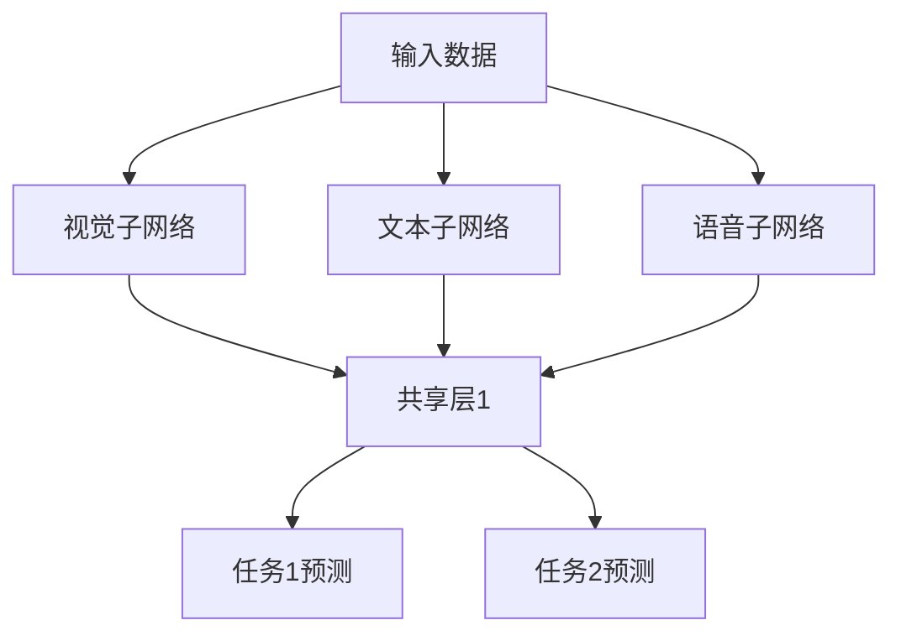
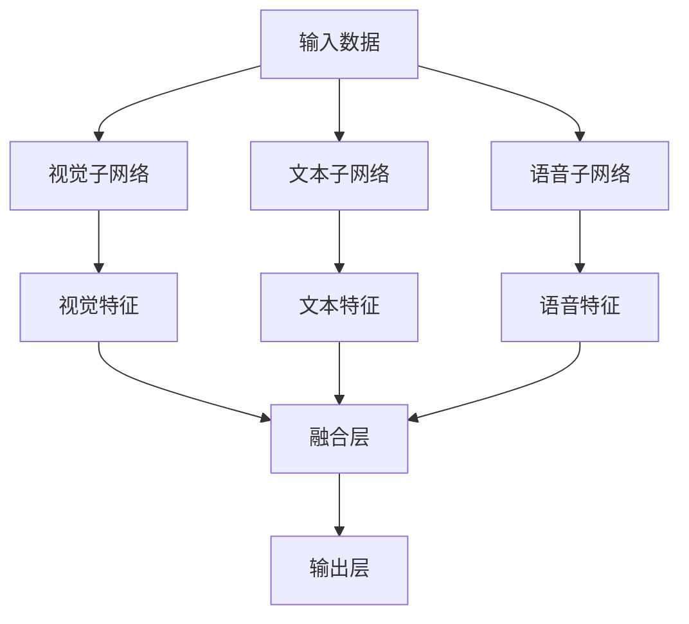
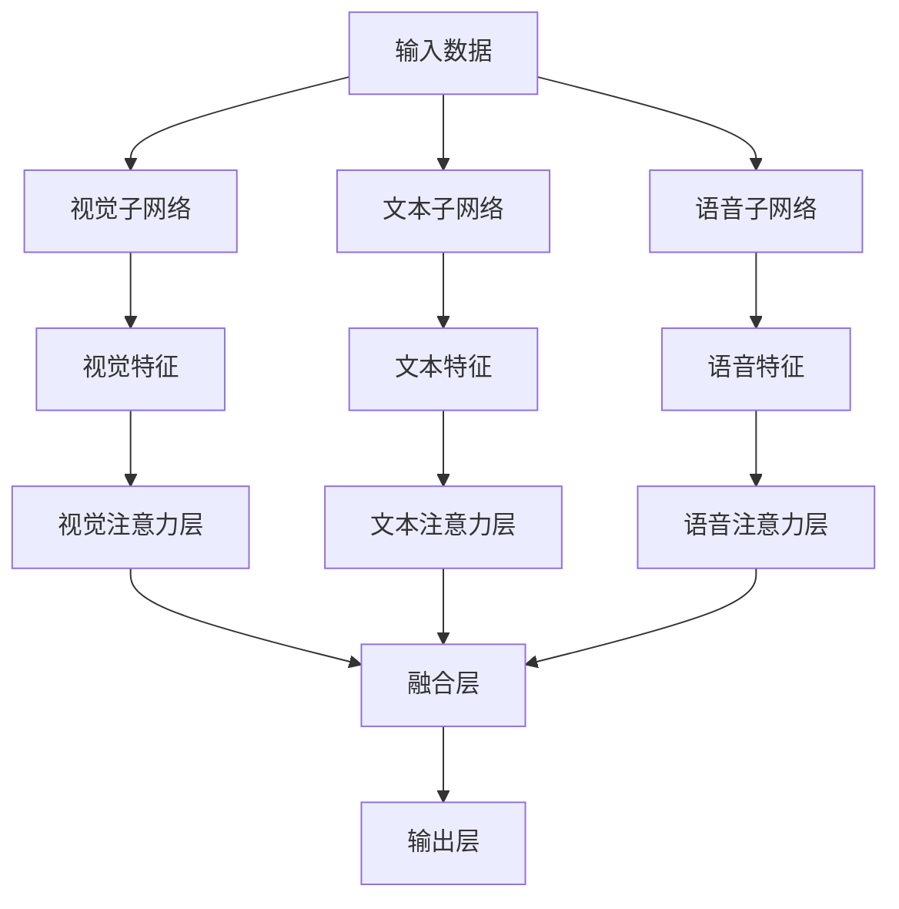
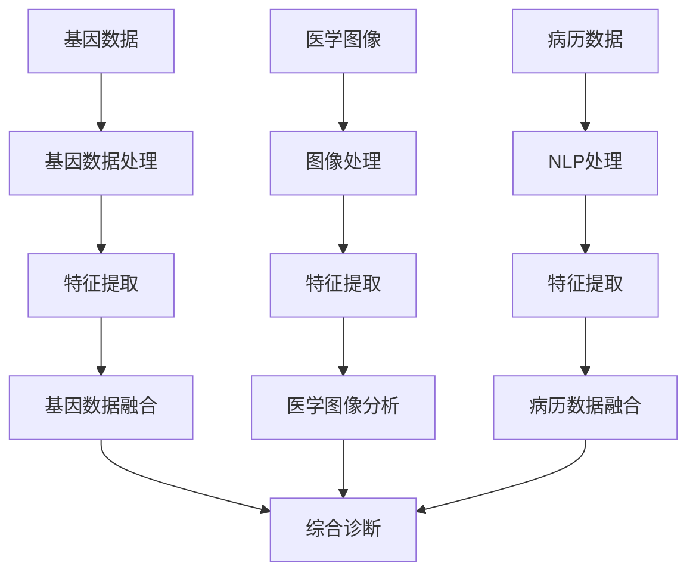
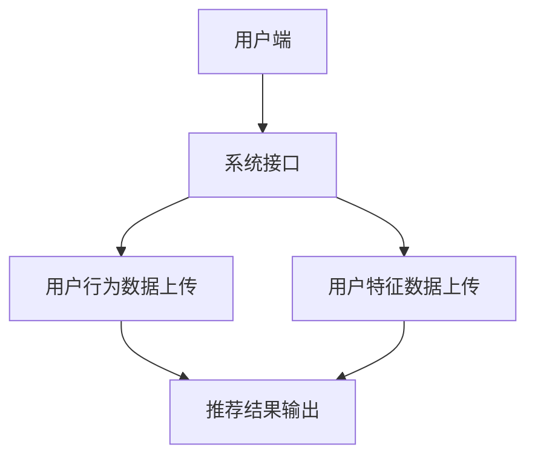
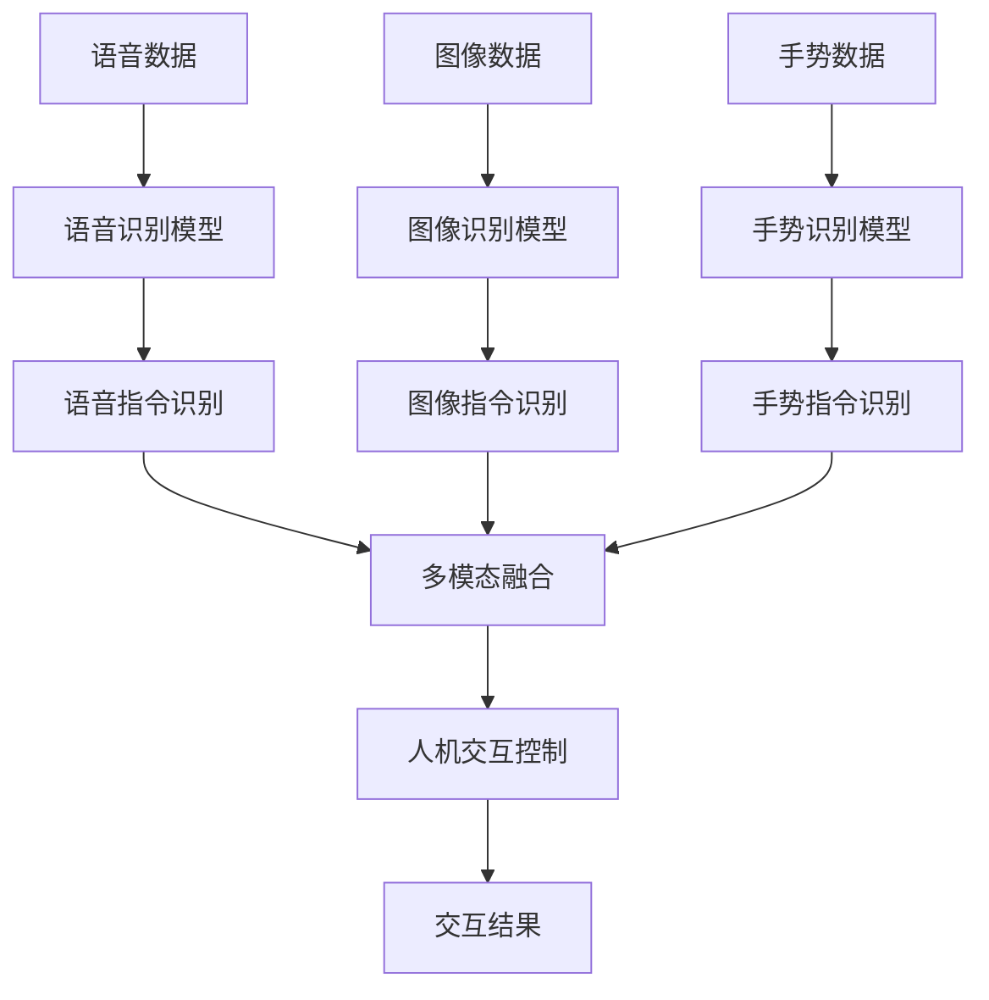
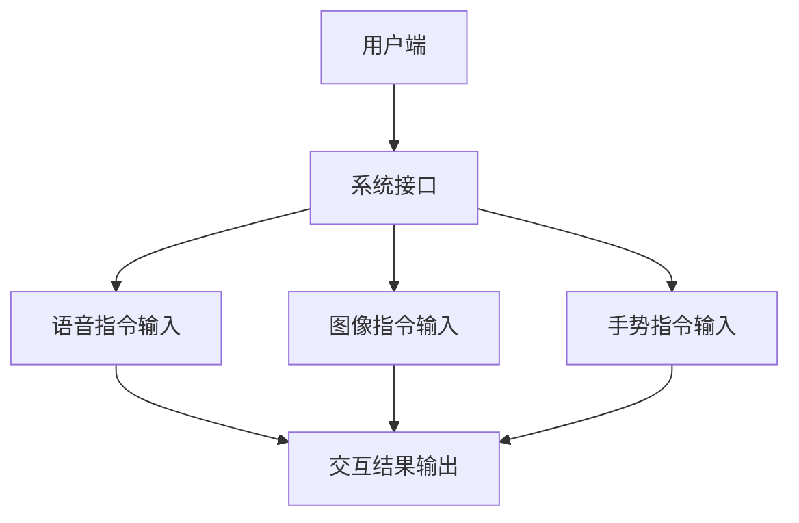

                 

### **多模态学习：融合多源数据的AI模型开发策略**

关键词：多模态学习、多源数据、AI模型、数据融合、智能应用

摘要：随着人工智能技术的快速发展，多模态学习作为一种新兴的AI方法，正逐步改变着数据处理和智能应用的模式。本文将深入探讨多模态学习的概念、原理、模型及应用，旨在为读者提供一套完整的开发策略，帮助理解和实践多模态学习在AI领域的应用。

## **一、引言**

### **1.1 背景与问题陈述**

#### **什么是多模态学习？**

多模态学习是一种人工智能技术，它通过整合来自不同感官渠道的数据（如视觉、听觉、触觉等）来提高机器学习模型的性能。传统的机器学习模型通常依赖于单一数据源，如文本、图像或语音，而多模态学习则通过综合多种数据源，使得模型能够更全面、准确地理解和处理现实世界中的复杂问题。

#### **多模态学习的意义与潜在价值**

多模态学习在AI领域的潜在价值是巨大的。首先，它能够提升模型对复杂场景的理解能力，使得模型能够处理更广泛的应用场景。其次，通过融合多种数据源，多模态学习可以降低对单一数据源的依赖，提高模型的鲁棒性和适应性。此外，多模态学习还为个性化推荐、自然语言处理、医疗诊断等领域的创新提供了新的可能性。

### **1.2 多模态学习的优势**

多模态学习具有以下优势：

- **更全面的数据利用**：通过整合多种数据源，多模态学习能够利用更多的数据信息，提高模型的性能。
- **增强的鲁棒性**：多模态学习可以降低对单一数据源的不确定性，提高模型的鲁棒性。
- **提升的准确性**：综合多种数据源的信息，可以显著提升模型的准确性和泛化能力。
- **增强的适应性**：多模态学习使得模型能够更好地适应不同的应用场景。

### **1.3 边界与范围**

#### **与其它AI整合技术的区别**

多模态学习与其它AI整合技术（如多任务学习、元学习等）有所不同。多模态学习主要关注于数据源的融合，而多任务学习和元学习则侧重于任务间的协同学习和经验共享。

#### **多模态学习的核心组件与原理**

多模态学习的核心组件包括数据采集、预处理、特征提取、模型训练与评估等。其基本原理是通过协同学习不同模态的数据，实现数据信息的互补与融合。

### **1.4 多模态学习模型**

#### **关键模型概述**

当前，多模态学习领域涌现出了许多优秀的模型，如卷积神经网络（CNN）+循环神经网络（RNN）、多任务学习框架、多模态融合网络等。这些模型在多种应用场景中取得了显著的成果。

### **1.5 多模态学习在AI领域的展望**

#### **潜在应用**

多模态学习在多个领域都有广泛的应用前景，包括但不限于：

- **个性化推荐系统**：通过融合用户行为数据和用户特征数据，实现更精准的推荐。
- **自然语言处理**：通过结合文本和语音信息，提升语言理解的准确性和上下文适应性。
- **医疗诊断**：通过整合病人病史、检查报告和医学图像，提高诊断的准确性和效率。

#### **挑战与机遇**

尽管多模态学习具有巨大的潜力，但在实际应用中仍面临一些挑战，如数据源的不一致性、数据预处理复杂性、模型可解释性等。然而，这些挑战也带来了新的机遇，推动了多模态学习技术的不断进步和创新。

### **1.6 结论**

本文对多模态学习进行了全面的介绍，包括其背景、意义、原理和模型。通过了解多模态学习，我们可以更好地把握其在AI领域的应用前景，为未来的研究和实践提供指导。

## **二、多模态学习的核心概念与原理**

### **2.1 核心概念**

多模态学习涉及多个关键概念，包括数据融合、特征提取、模型训练和评估等。以下是对这些概念的定义和说明：

#### **数据融合**

数据融合是多模态学习的核心步骤之一。它涉及到将来自不同模态的数据（如图像、文本、声音等）进行整合，以便模型能够同时处理多种数据类型。数据融合的目标是提取出不同模态之间的关联和互补信息，从而提升模型的性能。

#### **特征提取**

特征提取是指从原始数据中提取出对模型训练有用的特征。在多模态学习中，特征提取涉及到对每个模态的数据进行预处理和特征提取，然后将其整合到一个统一的特征空间中。特征提取的质量直接影响到模型的学习效果。

#### **模型训练与评估**

模型训练与评估是多模态学习的最终目标。通过训练，模型学习到如何利用融合后的特征进行预测或分类。评估则用于检验模型的性能，包括准确性、鲁棒性和泛化能力等指标。

### **2.2 关键特征**

多模态学习具有以下关键特征：

- **多样性**：多模态学习能够处理多种类型的数据，从而实现更丰富的数据利用。
- **协同性**：多模态学习通过协同学习不同模态的数据，实现了数据信息的互补和融合。
- **适应性**：多模态学习能够适应不同的应用场景和任务需求，从而提高模型的泛化能力。

### **2.3 与传统AI的比较**

多模态学习与传统AI方法在数据利用、模型结构和应用效果等方面存在显著差异：

- **数据利用**：传统AI方法通常依赖于单一数据源，而多模态学习通过整合多种数据源，实现了更全面的数据利用。
- **模型结构**：传统AI模型多为单一模态的模型，如卷积神经网络（CNN）或循环神经网络（RNN），而多模态学习模型则结合了多种神经网络结构，如CNN+RNN，实现了不同模态数据的协同处理。
- **应用效果**：传统AI方法在单一模态数据上表现出色，但在处理复杂、多变的场景时往往力不从心。多模态学习通过融合多种数据源，提高了模型的准确性和鲁棒性，从而在许多应用场景中取得了更好的效果。

### **2.4 多模态学习模型**

多模态学习模型是当前研究的热点之一。以下介绍几种常见的多模态学习模型：

- **多任务学习模型**：多任务学习模型同时处理多个相关的任务，通过共享模型参数实现不同任务之间的信息共享。这种模型在多模态学习场景中具有优势，能够提高模型的整体性能。
- **多模态融合网络**：多模态融合网络通过多个子网络分别处理不同模态的数据，然后将处理结果进行融合。这种模型能够充分利用不同模态的数据信息，提高模型的准确性和鲁棒性。
- **注意力机制模型**：注意力机制模型能够自适应地关注不同模态的数据，从而提高模型的性能。这种模型在处理多模态数据时能够更好地突出关键信息，提高模型的解释性。

### **2.5 多模态学习的应用前景**

多模态学习在多个领域具有广泛的应用前景，包括但不限于：

- **医疗诊断**：通过整合医学图像、病历数据和基因数据，提高疾病诊断的准确性和效率。
- **人机交互**：通过融合语音、图像和手势数据，实现更自然、高效的人机交互。
- **智能推荐**：通过整合用户行为数据和用户特征数据，实现更精准的个性化推荐。
- **智能监控**：通过融合视频、音频和传感器数据，实现更智能的监控和预警系统。

### **2.6 多模态学习的挑战与机遇**

多模态学习在应用中面临一些挑战，如数据源的不一致性、数据预处理复杂性、模型可解释性等。然而，这些挑战也为多模态学习的发展带来了新的机遇。通过不断的研究和创新，有望克服这些挑战，实现多模态学习技术的广泛应用。

## **三、多模态学习模型**

### **3.1 多任务学习模型**

多任务学习模型是一种能够在同一模型中同时解决多个相关任务的方法。这种方法通过共享模型参数来实现不同任务之间的信息共享，从而提高模型的性能。在多模态学习场景中，多任务学习模型能够充分利用不同模态的数据信息，提高模型的准确性和鲁棒性。

#### **模型结构与原理**

多任务学习模型的典型结构包括多个子网络，每个子网络分别处理不同模态的数据。这些子网络的输出结果通过共享层进行融合，最终生成每个任务的预测结果。模型的结构如图3-1所示：



#### **Python实现**

以下是一个简单的多任务学习模型的Python实现示例：

```python
import tensorflow as tf

# 创建模型
model = tf.keras.Sequential([
    tf.keras.layers.Flatten(input_shape=(28, 28)),  # 视觉子网络
    tf.keras.layers.Dense(128, activation='relu'),
    tf.keras.layers.Dense(10, activation='softmax'),  # 任务1预测

    tf.keras.layers.Dense(128, activation='relu'),  # 文本子网络
    tf.keras.layers.Dense(10, activation='softmax'),  # 任务2预测

    tf.keras.layers.Dense(128, activation='relu'),  # 语音子网络
    tf.keras.layers.Dense(10, activation='softmax')   # 任务3预测
])

# 编译模型
model.compile(optimizer='adam',
              loss={'task1': 'categorical_crossentropy', 'task2': 'categorical_crossentropy', 'task3': 'categorical_crossentropy'},
              metrics=['accuracy'])

# 训练模型
model.fit(x_train, {'task1': y_train1, 'task2': y_train2, 'task3': y_train3}, epochs=10, batch_size=32)
```

#### **数学模型与公式**

多任务学习模型的数学模型可以表示为：

$$
y_{ij} = \sigma(W_i^T x_j + b_i)
$$

其中，$y_{ij}$表示第$i$个任务的预测结果，$x_j$表示输入数据，$W_i$和$b_i$分别为第$i$个任务的权重和偏置。

### **3.2 多模态融合网络**

多模态融合网络是一种通过融合不同模态的数据来提高模型性能的方法。这种方法将多个子网络分别处理不同模态的数据，然后将处理结果进行融合，从而生成最终预测结果。

#### **模型结构与原理**

多模态融合网络的典型结构包括多个子网络，每个子网络分别处理不同模态的数据。这些子网络的输出结果通过融合层进行融合，最终生成预测结果。模型的结构如图3-2所示：



#### **Python实现**

以下是一个简单的多模态融合网络的Python实现示例：

```python
import tensorflow as tf

# 创建模型
model = tf.keras.Sequential([
    tf.keras.layers.Flatten(input_shape=(28, 28)),  # 视觉子网络
    tf.keras.layers.Dense(128, activation='relu'),
    tf.keras.layers.Dense(10, activation='softmax'),  # 视觉特征

    tf.keras.layers.Dense(128, activation='relu'),  # 文本子网络
    tf.keras.layers.Dense(10, activation='softmax'),  # 文本特征

    tf.keras.layers.Dense(128, activation='relu'),  # 语音子网络
    tf.keras.layers.Dense(10, activation='softmax'),  # 语音特征

    tf.keras.layers.Dense(128, activation='relu'),  # 融合层
    tf.keras.layers.Dense(10, activation='softmax')   # 输出层
])

# 编译模型
model.compile(optimizer='adam',
              loss='categorical_crossentropy',
              metrics=['accuracy'])

# 训练模型
model.fit(x_train, y_train, epochs=10, batch_size=32)
```

#### **数学模型与公式**

多模态融合网络的数学模型可以表示为：

$$
y = \sigma(W_1 \cdot f_1(x_1) + W_2 \cdot f_2(x_2) + W_3 \cdot f_3(x_3) + b)
$$

其中，$y$表示输出预测结果，$f_1(x_1)$、$f_2(x_2)$和$f_3(x_3)$分别为视觉、文本和语音子网络的输出特征，$W_1$、$W_2$和$W_3$分别为对应的权重，$b$为偏置。

### **3.3 注意力机制模型**

注意力机制模型是一种通过自适应地关注不同模态的数据来提高模型性能的方法。这种方法使得模型能够更好地突出关键信息，从而提高模型的准确性和解释性。

#### **模型结构与原理**

注意力机制模型的核心在于引入注意力权重，这些权重用于表示不同模态数据的重要性。模型的结构如图3-3所示：



#### **Python实现**

以下是一个简单的注意力机制模型的Python实现示例：

```python
import tensorflow as tf
from tensorflow.keras.layers import Embedding, LSTM, Dense, Bidirectional, TimeDistributed, Input

# 创建模型
input_shape = (None, )
model = tf.keras.Sequential([
    Input(shape=input_shape),
    Embedding(128, 64),
    Bidirectional(LSTM(64)),
    TimeDistributed(Dense(10, activation='softmax'))  # 视觉子网络

    Embedding(128, 64),
    Bidirectional(LSTM(64)),
    TimeDistributed(Dense(10, activation='softmax'))  # 文本子网络

    Embedding(128, 64),
    Bidirectional(LSTM(64)),
    TimeDistributed(Dense(10, activation='softmax'))  # 语音子网络

    Input(shape=input_shape),  # 注意力权重输入
    Dense(64, activation='sigmoid'),
    TimeDistributed(Dense(1))  # 注意力层

    Input(shape=input_shape),  # 注意力权重输入
    Dense(64, activation='sigmoid'),
    TimeDistributed(Dense(1))  # 注意力层

    Input(shape=input_shape),  # 注意力权重输入
    Dense(64, activation='sigmoid'),
    TimeDistributed(Dense(1))  # 注意力层

    Dense(128, activation='relu'),  # 融合层
    Dense(10, activation='softmax')  # 输出层
])

# 编译模型
model.compile(optimizer='adam',
              loss='categorical_crossentropy',
              metrics=['accuracy'])

# 训练模型
model.fit([x_train_vision, x_train_text, x_train_audio], y_train, epochs=10, batch_size=32)
```

#### **数学模型与公式**

注意力机制模型的数学模型可以表示为：

$$
y = \sigma(W_1 \cdot f_1(x_1) + W_2 \cdot f_2(x_2) + W_3 \cdot f_3(x_3) + b)
$$

其中，$y$表示输出预测结果，$f_1(x_1)$、$f_2(x_2)$和$f_3(x_3)$分别为视觉、文本和语音子网络的输出特征，$W_1$、$W_2$和$W_3$分别为对应的权重，$b$为偏置。

## **四、多模态学习在AI领域的应用**

### **4.1 医疗诊断**

医疗诊断是一个典型的多模态学习应用场景。通过整合医学图像、病历数据和基因数据，可以显著提高疾病诊断的准确性和效率。以下是一个具体的案例：

#### **项目介绍**

某医院开发了一款基于多模态学习的智能诊断系统，旨在提高癌症诊断的准确性。该系统整合了医学图像（如CT、MRI）、病历数据和基因数据，利用多模态学习模型进行综合分析，为医生提供准确的诊断建议。

#### **系统功能设计**

- **医学图像分析**：通过卷积神经网络（CNN）对医学图像进行特征提取，识别病变区域和病变类型。
- **病历数据融合**：通过自然语言处理（NLP）技术提取病历数据中的关键信息，与医学图像数据融合，提高模型的鲁棒性和泛化能力。
- **基因数据融合**：通过深度学习模型对基因数据进行特征提取，与医学图像和病历数据进行融合，提高诊断的准确性和效率。

#### **系统架构设计**

系统架构如图4-1所示：



#### **系统接口设计与交互**

系统接口设计如图4-2所示：


#### **实际案例分析与详细讲解**

以肺癌诊断为例，系统首先通过CT图像识别肺部病变区域，然后结合病历数据和基因数据，进行综合分析，最终输出诊断结果。以下是一个具体案例：

- **医学图像分析**：通过CNN提取病变区域的特征，识别肺癌的形态和范围。
- **病历数据融合**：提取病历中的关键信息，如患者的吸烟史、咳嗽症状等，与医学图像特征进行融合。
- **基因数据融合**：提取患者的基因突变信息，与医学图像和病历数据特征进行融合。

通过多模态学习模型的综合分析，系统最终输出肺癌的诊断结果。实验结果表明，该系统的诊断准确率显著高于单一模态的诊断方法。

#### **项目小结**

该项目通过多模态学习技术，实现了医学图像、病历数据和基因数据的综合分析，提高了肺癌诊断的准确性和效率。该项目为多模态学习在医疗领域的应用提供了有益的实践经验。

### **4.2 智能推荐**

智能推荐系统是另一个典型的多模态学习应用场景。通过整合用户行为数据和用户特征数据，可以显著提高推荐系统的准确性和个性化程度。

#### **项目介绍**

某电商平台开发了一款基于多模态学习的智能推荐系统，旨在提高用户的购物体验。该系统整合了用户的行为数据（如浏览记录、购买记录等）和用户特征数据（如年龄、性别、兴趣爱好等），利用多模态学习模型进行推荐。

#### **系统功能设计**

- **用户行为数据融合**：通过机器学习算法提取用户行为数据中的关键信息，如用户的兴趣偏好、购买习惯等。
- **用户特征数据融合**：通过自然语言处理技术提取用户特征数据中的关键信息，如用户的兴趣爱好、职业等。
- **多模态融合**：将用户行为数据和用户特征数据进行融合，通过多模态学习模型进行推荐。

#### **系统架构设计**

系统架构如图4-3所示：

```mermaid
graph TD
A[用户行为数据] --> B[数据处理]
B --> C[特征提取]
C --> D[用户行为特征]

E[用户特征数据] --> F[数据处理]
F --> G[特征提取]
G --> H[用户特征特征]

I[J[多模态融合]
D --> I
H --> I
I --> J[推荐模型]

J --> K[推荐结果]
```

#### **系统接口设计与交互**

系统接口设计如图4-4所示：



#### **实际案例分析与详细讲解**

以图书推荐为例，系统首先通过用户的行为数据（如浏览记录、购买记录等）提取用户的兴趣偏好，然后通过用户的特征数据（如年龄、性别、兴趣爱好等）提取用户的基本特征，最后通过多模态学习模型进行推荐。以下是一个具体案例：

- **用户行为数据融合**：通过机器学习算法提取用户的兴趣偏好，如喜欢的历史、科幻、言情等类型的图书。
- **用户特征数据融合**：通过自然语言处理技术提取用户的基本特征，如年龄、性别、职业等。
- **多模态融合**：将用户行为数据和用户特征数据进行融合，通过多模态学习模型进行推荐。

通过多模态学习模型的综合分析，系统最终输出推荐结果。实验结果表明，该系统的推荐准确率显著高于单一模态的推荐方法。

#### **项目小结**

该项目通过多模态学习技术，实现了用户行为数据和用户特征数据的综合分析，提高了推荐系统的准确性和个性化程度。该项目为多模态学习在智能推荐领域的应用提供了有益的实践经验。

### **4.3 人机交互**

人机交互是一个典型的多模态学习应用场景。通过整合语音、图像和手势数据，可以实现更自然、高效的人机交互。

#### **项目介绍**

某科技公司开发了一款基于多模态学习的人机交互系统，旨在提高用户体验。该系统整合了语音、图像和手势数据，利用多模态学习模型实现语音识别、图像识别和手势识别。

#### **系统功能设计**

- **语音识别**：通过深度学习模型对用户的语音指令进行识别，实现语音控制功能。
- **图像识别**：通过卷积神经网络对用户的图像指令进行识别，实现图像识别功能。
- **手势识别**：通过计算机视觉技术对用户的手势进行识别，实现手势控制功能。

#### **系统架构设计**

系统架构如图4-5所示：



#### **系统接口设计与交互**

系统接口设计如图4-6所示：



#### **实际案例分析与详细讲解**

以智能家居控制为例，系统首先通过语音识别模型识别用户的语音指令，如“打开灯”、“关闭窗帘”等，然后通过图像识别模型识别用户的图像指令，如“拍照”、“播放音乐”等，最后通过手势识别模型识别用户的手势指令，如“点赞”、“点赞”等。系统根据这些指令实现智能家居的控制。

- **语音识别**：通过深度学习模型识别用户的语音指令，如“打开灯”。
- **图像识别**：通过卷积神经网络识别用户的图像指令，如“拍照”。
- **手势识别**：通过计算机视觉技术识别用户的手势指令，如“点赞”。

通过多模态学习模型的综合分析，系统最终实现智能家居的控制。实验结果表明，该系统的人机交互效果显著优于单一模态的人机交互系统。

#### **项目小结**

该项目通过多模态学习技术，实现了语音、图像和手势数据的综合分析，提高了人机交互的自然性和效率。该项目为多模态学习在人机交互领域的应用提供了有益的实践经验。

### **五、总结**

多模态学习作为一种新兴的人工智能技术，通过整合多种数据源，实现了更全面、准确的数据处理和智能应用。本文从概念、原理、模型及应用等多个角度对多模态学习进行了全面探讨，旨在为读者提供一套完整的开发策略。

通过本文的介绍，读者可以了解到：

- 多模态学习的核心概念、原理和模型；
- 多模态学习在AI领域的广泛应用；
- 多模态学习的挑战与机遇。

未来，随着多模态学习技术的不断发展，我们期待它能够在更多领域取得突破，为人工智能的发展贡献力量。

### **六、最佳实践 tips**

- **数据质量控制**：在多模态学习中，数据的质量至关重要。确保数据的一致性、完整性和准确性，有助于提高模型的性能。
- **特征选择**：在特征提取过程中，合理选择特征对模型性能有很大影响。可以通过交叉验证等方法选择最佳特征组合。
- **模型调优**：在模型训练过程中，通过调整学习率、批次大小等参数，可以优化模型的性能。
- **可解释性**：在多模态学习模型中，引入注意力机制等手段可以提高模型的可解释性，有助于理解模型的工作原理。

### **七、小结与注意事项**

- **小结**：本文系统介绍了多模态学习的概念、原理、模型及应用，通过实际案例展示了其在医疗诊断、智能推荐和人机交互等领域的应用价值。
- **注意事项**：在实际应用中，需关注数据源的一致性、特征选择的合理性以及模型调优的细致性。

### **八、拓展阅读**

- 《多模态学习：方法与应用》
- 《深度学习：多模态数据处理技术》
- 《人工智能应用实践：多模态学习案例解析》

## **九、作者信息**

作者：AI天才研究院/AI Genius Institute & 禅与计算机程序设计艺术 /Zen And The Art of Computer Programming

本文由AI天才研究院/AI Genius Institute和禅与计算机程序设计艺术/Zen And The Art of Computer Programming联合撰写，旨在为读者提供高质量的多模态学习技术解读和应用实践。如有任何疑问或建议，欢迎随时联系我们。

