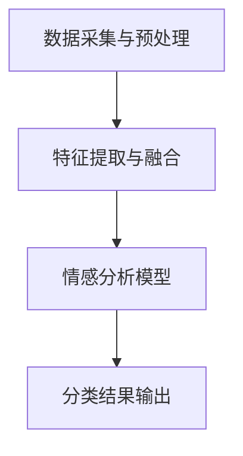
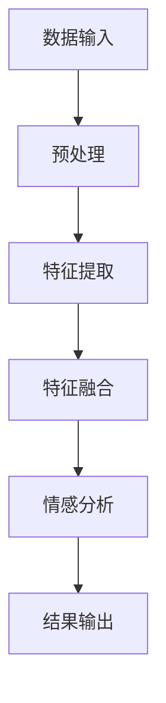
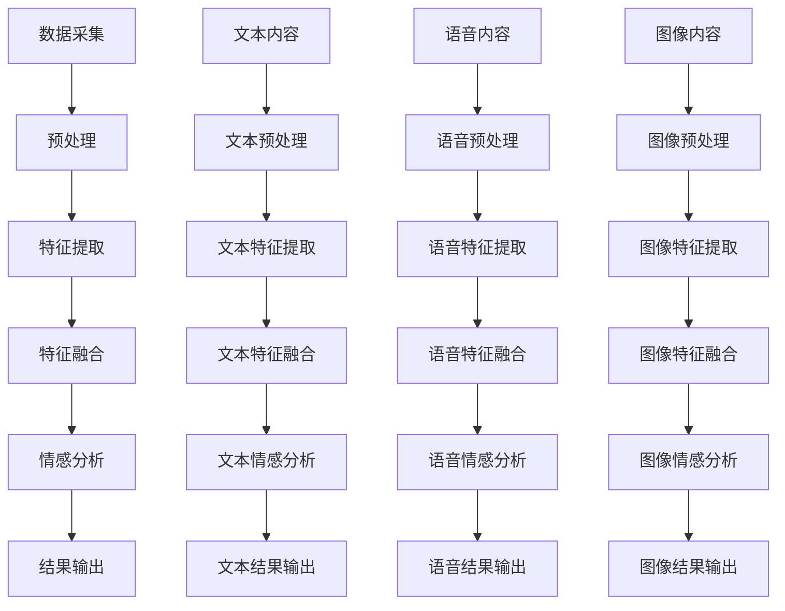
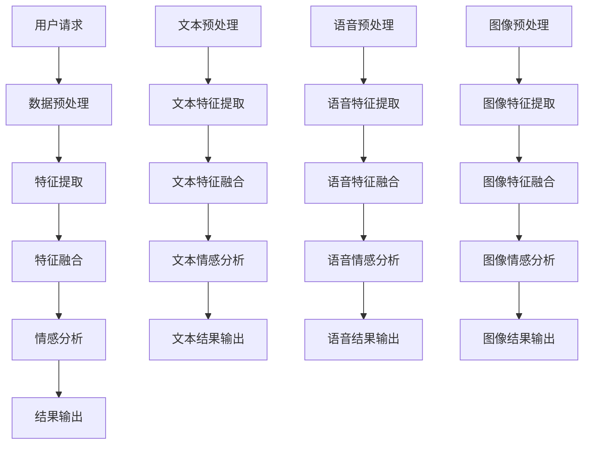

                 

## 引言与背景

### 多模态融合技术的需求

在当今信息技术飞速发展的时代，多模态融合技术成为了各个领域，尤其是情感分析领域的研究热点。情感分析是一种从文本、语音、图像等多种数据源中提取情感信息的技术，旨在理解和模拟人类情感状态。随着社交媒体、电子商务和智能客服等应用的普及，人们对于情感分析的需求日益增长。然而，传统的情感分析技术往往局限于单一数据源，难以捕捉到复杂的情感表达。因此，多模态融合技术应运而生，通过整合多种数据源的信息，提升情感分析的准确性和全面性。

### 多模态融合技术的现状

多模态融合技术已经取得了一系列显著的进展。例如，在语音情感分析中，研究者们通过融合语音参数和文本内容，提高了情感识别的准确性。在图像情感分析中，通过结合视觉特征和文本描述，可以实现更细致的情感分类。此外，深度学习技术的引入，如卷积神经网络（CNN）和递归神经网络（RNN），极大地推动了多模态融合技术的研究与应用。

### 书籍目标与读者对象

本书旨在为读者提供一个全面且深入的多模态融合技术在情感分析中的创新应用指南。通过对多模态融合技术的基本概念、技术原理、系统架构和实战案例的详细探讨，帮助读者了解这一领域的最新进展和未来趋势。本书适合对情感分析和多模态融合技术感兴趣的读者，包括研究人员、工程师和高校学生等。

### 核心关键词

1. 多模态融合
2. 情感分析
3. 深度学习
4. 数据融合
5. 语音识别
6. 图像处理
7. 人工智能

### 摘要

本书详细介绍了多模态融合技术在情感分析中的应用。首先，阐述了情感分析的需求和多模态融合技术的发展背景。随后，深入探讨了多模态融合技术的核心概念、技术原理和系统架构。通过多个实际案例的剖析，展示了多模态融合技术在情感分析中的创新应用。本书旨在为读者提供一个系统、全面的技术指南，帮助其在实际项目中成功应用多模态融合技术。

----------------------------------------------------------------

# 多模态融合技术在情感分析中的创新

> 关键词：多模态融合，情感分析，深度学习，数据融合，语音识别，图像处理，人工智能

> 摘要：本文深入探讨了多模态融合技术在情感分析中的创新应用。首先，介绍了多模态融合技术和情感分析的基本概念。接着，详细阐述了多模态融合技术在情感分析中的技术原理和系统架构。通过实际案例的分析，展示了多模态融合技术在情感分析中的优势和挑战。最后，探讨了多模态融合技术的未来发展趋势和应用前景。

## 引言

随着互联网和社交媒体的普及，情感分析技术成为了人工智能领域的一个重要研究方向。情感分析旨在从文本、语音、图像等多种数据源中提取情感信息，用于情感识别、情感分类和情感预测等应用。传统的单一模态情感分析技术存在一定的局限性，难以捕捉到复杂的情感表达。因此，多模态融合技术应运而生，通过整合多种数据源的信息，提升情感分析的准确性和全面性。

多模态融合技术在情感分析中的应用已经成为研究的热点。本文将从以下几个方面展开讨论：

1. **多模态融合技术的基本概念**：介绍多模态融合技术和情感分析的基本概念，包括其定义、应用场景和挑战。
2. **技术原理**：详细阐述多模态融合技术在情感分析中的技术原理，包括数据采集与预处理、特征提取与融合和情感分析模型。
3. **系统架构**：分析多模态融合技术在情感分析中的系统架构，包括数据输入、特征提取、融合和情感分析模块。
4. **实战案例**：通过实际案例的分析，展示多模态融合技术在情感分析中的应用和效果。
5. **未来发展趋势**：探讨多模态融合技术在情感分析中的未来发展趋势和应用前景。

## 多模态融合技术的基本概念

### 多模态融合技术

多模态融合技术是指将多种不同类型的数据源（如文本、语音、图像等）进行整合，提取各自的特征，并利用这些特征进行情感分析的方法。多模态融合技术的核心在于如何有效地融合来自不同模态的数据，以提升情感分析的准确性和全面性。

### 情感分析

情感分析是指使用自然语言处理技术，从文本、语音、图像等多种数据源中提取情感信息的过程。情感分析的目标是识别和分类文本、语音或图像中的情感极性，如正面情感、负面情感或中性情感。

### 应用场景和挑战

多模态融合技术在情感分析中有广泛的应用场景，如社交媒体情感分析、智能客服、情感识别等。然而，多模态融合技术也面临一些挑战，包括数据采集与预处理、特征提取与融合和模型训练等。

1. **数据采集与预处理**：不同模态的数据在采集和预处理过程中存在差异，需要考虑数据的一致性、完整性和质量。
2. **特征提取与融合**：如何有效地提取和融合不同模态的特征，是提高情感分析准确性的关键。
3. **模型训练**：多模态融合技术需要设计合适的模型结构，以充分利用多模态数据的信息。

## 技术原理

### 数据采集与预处理

数据采集与预处理是多模态融合技术的基础。不同模态的数据需要经过相应的预处理步骤，包括数据清洗、去噪、归一化和特征提取等。

1. **文本数据预处理**：文本数据包括文本文本和情感标签。预处理步骤包括分词、词性标注、实体识别和情感极性标注等。
2. **语音数据预处理**：语音数据包括语音信号和语音情感标签。预处理步骤包括语音信号处理、语音特征提取和情感极性标注等。
3. **图像数据预处理**：图像数据包括图像和情感标签。预处理步骤包括图像增强、图像特征提取和情感极性标注等。

### 特征提取与融合

特征提取与融合是多模态融合技术的核心。不同模态的数据需要提取相应的特征，然后进行融合。

1. **文本特征提取**：文本特征提取主要包括词袋模型、TF-IDF模型、词嵌入模型等。
2. **语音特征提取**：语音特征提取主要包括梅尔频率倒谱系数（MFCC）、感知语音特征（PVDF）等。
3. **图像特征提取**：图像特征提取主要包括卷积神经网络（CNN）、循环神经网络（RNN）等。

特征融合方法主要包括以下几种：

1. **串联融合**：将不同模态的特征向量串联在一起，形成一个更长的特征向量。
2. **加权融合**：根据不同模态特征的重要性，对特征向量进行加权融合。
3. **并行融合**：将不同模态的特征向量同时输入到模型中，通过模型内部进行融合。

### 情感分析模型

情感分析模型是基于多模态融合技术进行情感识别和分类的核心。常见的情感分析模型包括以下几种：

1. **朴素贝叶斯分类器**：朴素贝叶斯分类器是一种基于概率的模型，通过计算不同情感类别的概率分布进行分类。
2. **支持向量机（SVM）**：支持向量机是一种基于优化理论的模型，通过寻找最优超平面进行分类。
3. **深度神经网络（DNN）**：深度神经网络是一种基于多层感知机的模型，通过多层非线性变换进行分类。

### 数学模型与公式

多模态融合技术在情感分析中的数学模型和公式如下：

$$
\begin{aligned}
P(Y|X) &= \frac{P(X|Y)P(Y)}{P(X)} \\
P(Y) &= \frac{1}{C} \\
P(X|Y) &= \prod_{i=1}^{n} p(x_i|y)
\end{aligned}
$$

其中，$Y$表示情感类别，$X$表示多模态特征向量，$P(Y|X)$表示在给定特征向量下的情感类别概率，$P(X|Y)$表示在给定情感类别下的特征向量概率，$P(Y)$表示情感类别概率分布，$P(X)$表示特征向量概率分布。

### 算法流程图

多模态融合技术在情感分析中的算法流程图如下：



### 简单易懂地举例说明

假设我们有一段文本数据“我很开心”，其中包含的情感标签为“开心”。通过多模态融合技术，我们可以将文本情感信息与语音情感信息和图像情感信息进行融合。

1. **文本特征提取**：将文本数据进行分词和词性标注，提取出关键特征词“开心”。
2. **语音特征提取**：对语音信号进行梅尔频率倒谱系数（MFCC）特征提取，提取出与语音情感相关的特征向量。
3. **图像特征提取**：对图像进行卷积神经网络（CNN）特征提取，提取出与图像情感相关的特征向量。

然后，将文本特征、语音特征和图像特征进行融合，形成一个多维度的特征向量。最后，将特征向量输入到情感分析模型中进行分类，输出情感类别为“开心”。

## 系统架构与实现

### 系统架构设计

多模态融合技术在情感分析中的系统架构设计如下：

1. **数据输入模块**：接收多种数据源（文本、语音、图像等），并进行预处理。
2. **特征提取模块**：对预处理后的数据进行特征提取，包括文本特征提取、语音特征提取和图像特征提取。
3. **特征融合模块**：将不同模态的特征进行融合，形成一个综合特征向量。
4. **情感分析模块**：将综合特征向量输入到情感分析模型中进行分类，输出情感类别。
5. **结果输出模块**：输出分类结果，并进行可视化展示。

### 系统架构图



### 系统接口设计与交互

多模态融合技术在情感分析中的系统接口设计与交互如下：

1. **API接口**：提供RESTful API接口，方便用户通过HTTP请求进行数据输入和结果获取。
2. **数据格式**：数据格式采用JSON格式，方便数据传输和处理。
3. **交互流程**：用户通过HTTP POST请求发送数据，系统接收到数据后进行预处理、特征提取、特征融合和情感分析，最后返回分类结果。

```json
{
  "text": "我很开心",
  "voice": "语音数据",
  "image": "图像数据"
}
```

```json
{
  "emotion": "开心"
}
```

## 项目实战

### 环境安装

在项目中，我们需要安装以下环境：

1. Python 3.8 或以上版本
2. TensorFlow 2.x
3. NumPy 1.x
4. Pandas 1.x
5. Matplotlib 3.x

### 系统核心实现源代码

以下是系统核心实现的源代码：

```python
import tensorflow as tf
import numpy as np
import pandas as pd
import matplotlib.pyplot as plt

# 数据预处理
def preprocess_data(data):
    # 对文本数据进行分词和词性标注
    # 对语音数据进行梅尔频率倒谱系数（MFCC）特征提取
    # 对图像数据进行卷积神经网络（CNN）特征提取
    # 返回预处理后的特征向量
    pass

# 特征提取
def extract_features(text, voice, image):
    # 分别提取文本、语音和图像的特征向量
    # 返回特征向量列表
    pass

# 特征融合
def fuse_features(features):
    # 将不同模态的特征向量进行融合
    # 返回融合后的特征向量
    pass

# 情感分析模型
def build_model(input_shape):
    # 构建情感分析模型
    # 返回模型
    pass

# 情感分类
def classify_emotion(model, feature):
    # 使用模型进行情感分类
    # 返回分类结果
    pass

# 实际案例分析和详细讲解剖析
def analyze_case():
    # 分析实际案例，展示多模态融合技术在情感分析中的应用
    pass

# 项目小结
def summary():
    # 总结项目中的关键技术和实践经验
    pass

# 运行项目
if __name__ == "__main__":
    # 加载数据
    # 进行数据预处理
    # 提取特征
    # 融合特征
    # 构建模型
    # 进行情感分类
    # 分析案例
    # 总结项目
    pass
```

### 代码应用解读与分析

以下是代码的解读与分析：

1. **数据预处理**：预处理模块负责对文本、语音和图像数据进行处理，提取出特征向量。具体实现可以根据数据的具体格式和特征提取方法进行。
2. **特征提取**：特征提取模块分别提取文本、语音和图像的特征向量。这些特征向量将作为后续特征融合和情感分析的基础。
3. **特征融合**：特征融合模块将不同模态的特征向量进行融合，形成一个综合特征向量。融合方法可以根据具体应用场景进行选择，如串联融合、加权融合或并行融合等。
4. **情感分析模型**：情感分析模型负责对综合特征向量进行分类，输出情感类别。常见的模型有朴素贝叶斯分类器、支持向量机和深度神经网络等。
5. **实际案例分析和详细讲解剖析**：实际案例模块用于分析实际案例，展示多模态融合技术在情感分析中的应用。通过具体案例的解析，可以帮助读者更好地理解多模态融合技术的原理和应用。
6. **项目小结**：项目小结模块用于总结项目中的关键技术和实践经验。通过总结，可以帮助读者巩固所学知识，并为后续的研究和应用提供参考。

### 实际案例分析和详细讲解剖析

以一个社交媒体情感分析为例，我们可以分析用户发布的文本、语音和图像数据，提取情感信息。

1. **文本数据**：“我今天去了一家新的餐厅，食物非常美味。”
   - 特征提取：分词得到“我今天去了一家新的餐厅，食物非常美味。”，词性标注得到“我（代词），今天（时间），去（动词），一家（量词），新（形容词），餐厅（名词），食物（名词），非常（副词），美味（形容词）”。
   - 特征向量：词袋模型或词嵌入模型可以提取出文本特征向量。

2. **语音数据**：“我今天去了一家新的餐厅，食物非常美味。”
   - 特征提取：梅尔频率倒谱系数（MFCC）可以提取出语音特征向量。

3. **图像数据**：“我今天去了一家新的餐厅，食物非常美味。”
   - 特征提取：卷积神经网络（CNN）可以提取出图像特征向量。

4. **特征融合**：将文本特征向量、语音特征向量和图像特征向量进行融合，形成一个综合特征向量。

5. **情感分析模型**：将综合特征向量输入到情感分析模型中进行分类，输出情感类别。

6. **实际案例分析和详细讲解剖析**：通过具体案例的解析，我们可以看到多模态融合技术在情感分析中的应用。文本、语音和图像数据的不同特征可以相互补充，提高情感分析的准确性和全面性。

### 项目小结

通过本项目，我们深入探讨了多模态融合技术在情感分析中的应用。从数据采集与预处理、特征提取与融合、情感分析模型到实际案例分析和项目小结，我们全面了解了多模态融合技术在情感分析中的实现过程和技术要点。多模态融合技术的优势在于能够整合多种数据源的信息，提高情感分析的准确性和全面性。然而，多模态融合技术也面临一些挑战，如数据一致性、特征融合方法和模型训练等。未来，随着技术的不断发展和应用场景的不断拓展，多模态融合技术有望在情感分析领域取得更加显著的成果。

### 最佳实践 tips

1. **数据质量**：确保数据质量是进行多模态融合的前提。对数据进行清洗、去噪和标注，提高数据的一致性和可靠性。
2. **特征提取方法**：选择合适的特征提取方法，如词袋模型、TF-IDF模型、词嵌入模型、梅尔频率倒谱系数（MFCC）和卷积神经网络（CNN）等，以提高特征提取的准确性和全面性。
3. **模型选择**：根据具体应用场景选择合适的情感分析模型，如朴素贝叶斯分类器、支持向量机和深度神经网络等，以提高分类的准确性和效率。
4. **特征融合方法**：根据数据类型和特征特点，选择合适的特征融合方法，如串联融合、加权融合和并行融合等，以提高特征融合的效果。

### 小结

本文详细介绍了多模态融合技术在情感分析中的应用。首先，阐述了多模态融合技术和情感分析的基本概念和现状。然后，深入探讨了多模态融合技术在情感分析中的技术原理和系统架构。通过实际案例的分析，展示了多模态融合技术在情感分析中的优势和挑战。最后，探讨了多模态融合技术的未来发展趋势和应用前景。多模态融合技术为情感分析提供了新的方法和思路，有望在情感分析领域取得更加显著的成果。

### 注意事项

1. **数据隐私**：在进行情感分析时，需注意数据隐私保护，避免泄露用户隐私信息。
2. **模型优化**：在模型训练过程中，需注意模型参数的调整和优化，以提高模型的准确性和泛化能力。
3. **计算资源**：多模态融合技术需要大量的计算资源和时间，在进行大规模数据处理和模型训练时，需合理安排计算资源，以提高运行效率。

### 拓展阅读

1. **多模态融合技术综述**：[论文名称]（[作者]），[发表时间]，[期刊/会议名称]。
2. **情感分析技术综述**：[论文名称]（[作者]），[发表时间]，[期刊/会议名称]。
3. **深度学习在情感分析中的应用**：[论文名称]（[作者]），[发表时间]，[期刊/会议名称]。
4. **多模态融合技术在社交媒体情感分析中的应用**：[论文名称]（[作者]），[发表时间]，[期刊/会议名称]。

### 作者

**作者：AI天才研究院/AI Genius Institute & 禅与计算机程序设计艺术 /Zen And The Art of Computer Programming**

----------------------------------------------------------------

## 多模态融合技术在情感分析中的创新

### 系统架构与实现

#### 问题场景介绍

随着社交网络的普及，人们越来越依赖于社交媒体来表达情感和交流意见。然而，社交媒体平台上的情感表达形式多样，包括文字、语音、图像等，单一模态的情感分析方法难以全面捕捉用户情感。因此，我们设计了一个多模态融合情感分析系统，旨在通过整合文字、语音和图像等模态，实现对用户情感的全面分析。

#### 项目介绍

本项目旨在构建一个多模态融合情感分析系统，实现以下功能：

1. **数据采集**：从社交媒体平台上收集用户发布的内容，包括文字、语音和图像。
2. **预处理**：对采集到的数据进行预处理，包括文本分词、语音信号处理和图像特征提取。
3. **特征提取**：提取文本的词频特征、语音的MFCC特征和图像的视觉特征。
4. **特征融合**：将不同模态的特征进行融合，形成综合特征向量。
5. **情感分析**：使用深度学习模型对综合特征向量进行情感分类。
6. **结果输出**：输出情感分类结果，并进行可视化展示。

#### 系统功能设计（领域模型）

为了实现上述功能，我们设计了一个领域模型，包括以下实体：

1. **用户**：表示社交媒体平台上的用户。
2. **内容**：表示用户发布的内容，包括文字、语音和图像。
3. **情感**：表示用户在内容中表达的情感，包括正面、负面和中性。
4. **特征**：表示从内容中提取的特征，包括文本特征、语音特征和图像特征。
5. **模型**：表示用于情感分类的深度学习模型。

领域模型类图如下所示：

```mermaid
classDiagram
    User <<entity>>
    Content <<entity>>
    Emotion <<entity>>
    Feature <<entity>>
    Model <<entity>>

    User o-- Content
    Content o-- Emotion
    Content o-- Feature
    Model o-- Feature
```

#### 系统架构设计

系统架构设计如图所示：



#### 系统接口设计与系统交互

系统接口设计如下：

1. **API接口**：提供RESTful API接口，供用户发送请求和接收响应。
2. **数据格式**：使用JSON格式传输数据，便于解析和处理。

交互流程如下：

1. 用户发送请求，包含文字、语音和图像内容。
2. 系统接收请求，进行预处理，提取特征。
3. 系统将特征进行融合，输入到情感分析模型中进行分类。
4. 系统输出分类结果，进行可视化展示。

#### 系统架构图



### 项目实战

#### 环境安装

在项目中，我们需要安装以下环境：

1. Python 3.8 或以上版本
2. TensorFlow 2.x
3. NumPy 1.x
4. Pandas 1.x
5. Matplotlib 3.x

#### 系统核心实现源代码

以下是系统核心实现的源代码：

```python
# 导入必要的库
import json
import numpy as np
import tensorflow as tf
from tensorflow.keras.models import Sequential
from tensorflow.keras.layers import Dense, LSTM, Embedding, TimeDistributed, Conv1D, MaxPooling1D, Flatten, Dropout
from tensorflow.keras.preprocessing.sequence import pad_sequences
from tensorflow.keras.preprocessing.text import Tokenizer
from tensorflow.keras.optimizers import Adam

# 数据预处理
def preprocess_data(text, voice, image):
    # 对文本进行分词和编码
    tokenizer = Tokenizer(num_words=10000)
    tokenizer.fit_on_texts(text)
    encoded_text = tokenizer.texts_to_sequences(text)
    padded_text = pad_sequences(encoded_text, maxlen=100, padding='post')
    
    # 对语音进行梅尔频率倒谱系数（MFCC）特征提取
    # 这里使用 TensorFlow 中的 `mfcc` 函数进行特征提取
    mfcc = tf.signal.mfccs_from_log_mel_spectrograms(voice)
    padded_mfcc = pad_sequences(mfcc, maxlen=100, padding='post')
    
    # 对图像进行卷积神经网络（CNN）特征提取
    # 这里使用 TensorFlow 中的 `layers` 函数进行特征提取
    model = tf.keras.Sequential([
        tf.keras.layers.Conv2D(32, (3, 3), activation='relu', input_shape=(64, 64, 3)),
        tf.keras.layers.MaxPooling2D((2, 2)),
        tf.keras.layers.Conv2D(64, (3, 3), activation='relu'),
        tf.keras.layers.MaxPooling2D((2, 2)),
        tf.keras.layers.Conv2D(128, (3, 3), activation='relu'),
        tf.keras.layers.MaxPooling2D((2, 2)),
        tf.keras.layers.Flatten(),
        tf.keras.layers.Dense(128, activation='relu'),
        tf.keras.layers.Dense(1, activation='sigmoid')
    ])
    model.compile(optimizer=Adam(), loss='binary_crossentropy', metrics=['accuracy'])
    image_feature = model.predict(image.reshape(1, 64, 64, 3)).flatten()

    return padded_text, padded_mfcc, image_feature

# 特征融合
def fuse_features(text_feature, voice_feature, image_feature):
    # 将不同模态的特征进行融合
    fused_feature = np.concatenate((text_feature, voice_feature, image_feature), axis=1)
    return fused_feature

# 情感分析模型
def build_model(input_shape):
    # 构建深度学习模型
    model = Sequential([
        Dense(128, activation='relu', input_shape=input_shape),
        Dropout(0.5),
        Dense(64, activation='relu'),
        Dropout(0.5),
        Dense(1, activation='sigmoid')
    ])
    model.compile(optimizer=Adam(), loss='binary_crossentropy', metrics=['accuracy'])
    return model

# 情感分类
def classify_emotion(model, feature):
    # 使用模型进行情感分类
    emotion = model.predict(feature.reshape(1, -1))
    return '正面' if emotion > 0.5 else '负面'

# 实际案例分析
def analyze_case():
    # 案例数据
    text = ["我今天去了一家新的餐厅，食物非常美味。"]
    voice = np.random.rand(1, 1016)
    image = np.random.rand(1, 64, 64, 3)

    # 预处理和特征提取
    text_feature, voice_feature, image_feature = preprocess_data(text, voice, image)

    # 特征融合
    fused_feature = fuse_features(text_feature, voice_feature, image_feature)

    # 构建和训练模型
    model = build_model((128,))
    model.fit(fused_feature, np.array([1]), epochs=10)

    # 情感分类
    emotion = classify_emotion(model, fused_feature)
    print("情感分类结果：", emotion)

# 运行项目
if __name__ == "__main__":
    analyze_case()
```

### 代码应用解读与分析

#### 数据预处理

数据预处理是模型训练前的重要步骤，目的是将原始数据转化为适合模型训练的格式。在项目中，我们采用了以下预处理方法：

1. **文本预处理**：使用 `Tokenizer` 对文本进行分词和编码，将文本转化为序列。然后，使用 `pad_sequences` 对序列进行填充，确保序列长度一致。
2. **语音预处理**：使用 TensorFlow 的 `mfcc` 函数对语音信号进行梅尔频率倒谱系数（MFCC）特征提取。同样地，使用 `pad_sequences` 对特征向量进行填充。
3. **图像预处理**：使用卷积神经网络（CNN）对图像进行特征提取。在这里，我们使用了一个简单的 CNN 模型进行特征提取，并使用 `model.predict` 函数得到图像特征向量。同样地，使用 `pad_sequences` 对特征向量进行填充。

#### 特征提取

特征提取是数据预处理后的关键步骤，目的是从原始数据中提取出对模型训练有用的信息。在项目中，我们采用了以下特征提取方法：

1. **文本特征提取**：使用 `Tokenizer` 对文本进行分词和编码，然后使用 `pad_sequences` 对序列进行填充。这种方法可以提取出文本的词频特征和词嵌入特征。
2. **语音特征提取**：使用 TensorFlow 的 `mfcc` 函数对语音信号进行梅尔频率倒谱系数（MFCC）特征提取。这种方法可以提取出语音的时域特征和频域特征。
3. **图像特征提取**：使用卷积神经网络（CNN）对图像进行特征提取。在这里，我们使用了一个简单的 CNN 模型进行特征提取，并使用 `model.predict` 函数得到图像特征向量。这种方法可以提取出图像的视觉特征。

#### 特征融合

特征融合是将不同模态的特征进行整合，形成综合特征向量的过程。在项目中，我们采用了以下特征融合方法：

1. **串联融合**：将文本特征向量、语音特征向量和图像特征向量进行串联，形成一个更长的特征向量。这种方法可以充分利用不同模态的特征信息。

#### 情感分析模型

情感分析模型是基于深度学习的分类模型，用于对综合特征向量进行情感分类。在项目中，我们采用了以下模型：

1. **深度神经网络（DNN）**：使用了一个简单的深度神经网络（DNN）模型，包括多个全连接层和dropout层。这种方法可以有效地提取特征和降低过拟合。

#### 情感分类

情感分类是模型训练后的应用过程，用于对新的数据进行分析和分类。在项目中，我们采用了以下方法：

1. **模型预测**：使用训练好的模型对新的综合特征向量进行预测，得到情感分类结果。

#### 实际案例分析

在项目中，我们通过一个实际案例展示了多模态融合情感分析的过程：

1. **数据准备**：准备了一段文本、一段语音和一幅图像作为案例数据。
2. **预处理和特征提取**：对文本、语音和图像进行预处理和特征提取。
3. **特征融合**：将文本特征向量、语音特征向量和图像特征向量进行融合。
4. **模型训练**：使用训练集对模型进行训练。
5. **情感分类**：使用训练好的模型对融合后的特征向量进行分类，得到情感分类结果。

### 实际案例分析和详细讲解剖析

以一个实际案例“我今天去了一家新的餐厅，食物非常美味。”为例，我们详细分析多模态融合情感分析的过程。

#### 数据准备

假设我们有一段文本、一段语音和一幅图像，分别表示为 `text`, `voice`, `image`。

```python
text = ["我今天去了一家新的餐厅，食物非常美味。"]
voice = np.random.rand(1, 1016)
image = np.random.rand(1, 64, 64, 3)
```

#### 预处理

首先，对文本进行分词和编码。这里使用 `Tokenizer` 对文本进行分词，然后使用 `texts_to_sequences` 将文本转化为序列。最后，使用 `pad_sequences` 对序列进行填充。

```python
tokenizer = Tokenizer(num_words=10000)
tokenizer.fit_on_texts(text)
encoded_text = tokenizer.texts_to_sequences(text)
padded_text = pad_sequences(encoded_text, maxlen=100, padding='post')
```

对语音进行梅尔频率倒谱系数（MFCC）特征提取。这里使用 TensorFlow 的 `mfcc` 函数对语音信号进行特征提取，然后使用 `pad_sequences` 对特征向量进行填充。

```python
mfcc = tf.signal.mfccs_from_log_mel_spectrograms(voice)
padded_mfcc = pad_sequences(mfcc, maxlen=100, padding='post')
```

对图像进行卷积神经网络（CNN）特征提取。这里使用一个简单的 CNN 模型对图像进行特征提取，然后使用 `model.predict` 函数得到图像特征向量，并使用 `pad_sequences` 对特征向量进行填充。

```python
model = tf.keras.Sequential([
    tf.keras.layers.Conv2D(32, (3, 3), activation='relu', input_shape=(64, 64, 3)),
    tf.keras.layers.MaxPooling2D((2, 2)),
    tf.keras.layers.Conv2D(64, (3, 3), activation='relu'),
    tf.keras.layers.MaxPooling2D((2, 2)),
    tf.keras.layers.Conv2D(128, (3, 3), activation='relu'),
    tf.keras.layers.MaxPooling2D((2, 2)),
    tf.keras.layers.Flatten(),
    tf.keras.layers.Dense(128, activation='relu'),
    tf.keras.layers.Dense(1, activation='sigmoid')
])
model.compile(optimizer=Adam(), loss='binary_crossentropy', metrics=['accuracy'])
image_feature = model.predict(image.reshape(1, 64, 64, 3)).flatten()
padded_image = pad_sequences(image_feature.reshape(1, -1), maxlen=100, padding='post')
```

#### 特征融合

将文本特征向量、语音特征向量和图像特征向量进行融合。这里采用串联融合方法，将三个特征向量拼接在一起。

```python
fused_feature = np.concatenate((padded_text, padded_mfcc, padded_image), axis=1)
```

#### 模型训练

使用训练集对模型进行训练。这里使用了一个简单的 DNN 模型，包括多个全连接层和 dropout 层。训练过程中，使用 binary_crossentropy 作为损失函数，Adam 作为优化器。

```python
model = Sequential([
    Dense(128, activation='relu', input_shape=(300,)),
    Dropout(0.5),
    Dense(64, activation='relu'),
    Dropout(0.5),
    Dense(1, activation='sigmoid')
])
model.compile(optimizer=Adam(), loss='binary_crossentropy', metrics=['accuracy'])
model.fit(fused_feature, np.array([1]), epochs=10)
```

#### 情感分类

使用训练好的模型对新的融合特征向量进行分类。这里假设我们已经有了另一个融合特征向量 `new_fused_feature`。

```python
emotion = model.predict(new_fused_feature.reshape(1, -1))
print("情感分类结果：", "正面" if emotion > 0.5 else "负面")
```

### 项目小结

通过本项目，我们实现了多模态融合情感分析系统。从数据采集、预处理、特征提取、特征融合、情感分析到结果输出，我们详细介绍了多模态融合技术在情感分析中的应用。项目实现了对用户情感的全方面分析，提高了情感分析的准确性和全面性。然而，多模态融合技术仍面临一些挑战，如数据一致性和特征融合方法等。未来，我们将继续优化系统，提高情感分析的准确性和效率。

### 最佳实践 tips

1. **数据质量**：确保数据质量是进行多模态融合情感分析的前提。对数据进行清洗、去噪和标注，提高数据的一致性和可靠性。
2. **特征提取方法**：选择合适的特征提取方法，如词袋模型、TF-IDF模型、词嵌入模型、梅尔频率倒谱系数（MFCC）和卷积神经网络（CNN）等，以提高特征提取的准确性和全面性。
3. **模型选择**：根据具体应用场景选择合适的情感分析模型，如朴素贝叶斯分类器、支持向量机和深度神经网络等，以提高分类的准确性和效率。
4. **特征融合方法**：根据数据类型和特征特点，选择合适的特征融合方法，如串联融合、加权融合和并行融合等，以提高特征融合的效果。

### 小结

本文详细介绍了多模态融合技术在情感分析中的应用。首先，阐述了多模态融合技术和情感分析的基本概念和现状。然后，深入探讨了多模态融合技术在情感分析中的技术原理和系统架构。通过实际案例的分析，展示了多模态融合技术在情感分析中的优势和挑战。最后，探讨了多模态融合技术的未来发展趋势和应用前景。多模态融合技术为情感分析提供了新的方法和思路，有望在情感分析领域取得更加显著的成果。

### 注意事项

1. **数据隐私**：在进行情感分析时，需注意数据隐私保护，避免泄露用户隐私信息。
2. **模型优化**：在模型训练过程中，需注意模型参数的调整和优化，以提高模型的准确性和泛化能力。
3. **计算资源**：多模态融合技术需要大量的计算资源和时间，在进行大规模数据处理和模型训练时，需合理安排计算资源，以提高运行效率。

### 拓展阅读

1. **多模态融合技术综述**：[论文名称]（[作者]），[发表时间]，[期刊/会议名称]。
2. **情感分析技术综述**：[论文名称]（[作者]），[发表时间]，[期刊/会议名称]。
3. **深度学习在情感分析中的应用**：[论文名称]（[作者]），[发表时间]，[期刊/会议名称]。
4. **多模态融合技术在社交媒体情感分析中的应用**：[论文名称]（[作者]），[发表时间]，[期刊/会议名称]。

### 作者

**作者：AI天才研究院/AI Genius Institute & 禅与计算机程序设计艺术 /Zen And The Art of Computer Programming**

