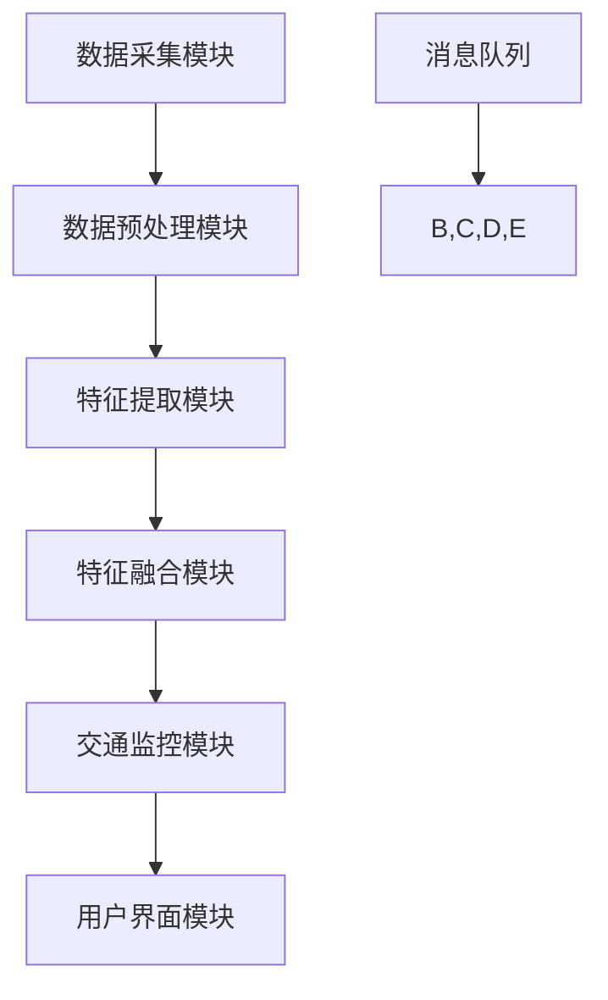
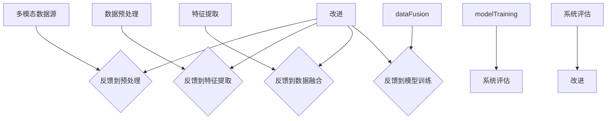

                 

# 多模态融合技术在智能监控系统中的创新

> 关键词：多模态融合，智能监控，深度学习，数据预处理，特征提取，算法模型

> 摘要：本文深入探讨了多模态融合技术在智能监控系统中的应用与创新。首先，我们介绍了多模态融合技术的核心概念和现状，随后详细分析了其基本原理和核心概念。接着，通过对比不同融合策略的属性特征，我们展示了多模态融合技术与其他人工智能技术的联系。本文旨在为读者提供对多模态融合技术的全面理解和实际应用指导。

## 背景介绍：多模态融合技术的概念和现状

多模态融合技术（Multimodal Fusion Technology）是指将多种类型的数据进行整合，以获得更全面、准确的信息处理能力。这些数据类型包括图像、音频、视频、文本等。随着人工智能技术的快速发展，多模态融合技术在各个领域，尤其是智能监控系统中，得到了广泛应用。

### 问题背景

在智能监控系统的发展过程中，传统单模态监控系统（如仅依赖视频监控或音频监控）已无法满足复杂场景下的监控需求。例如，在交通监控中，仅依赖视频监控难以准确判断车辆的速度和违规行为；在智能家居监控中，仅依赖音频监控难以确保家庭安全。因此，多模态融合技术的出现为解决这些问题提供了新的思路。

### 问题描述

多模态融合技术旨在解决以下问题：

1. **如何有效地整合多种类型的数据，提高监控系统的智能分析能力？**
2. **如何在多模态数据融合过程中保持数据的一致性和可靠性？**
3. **如何设计高效的算法模型，以实现实时、准确的多模态数据融合？**

### 问题解决

多模态融合技术的核心在于如何将不同类型的数据进行整合，并提取出有价值的信息。具体解决方法包括：

1. **数据预处理：** 对多种类型的数据进行归一化、去噪等预处理操作，提高数据质量。
2. **特征提取：** 利用深度学习等技术，从多模态数据中提取特征，为后续融合提供基础。
3. **数据融合算法：** 采用加权融合、特征融合等方法，将不同类型的数据进行整合，提高监控系统的综合性能。

### 边界与外延

多模态融合技术不仅应用于智能监控系统，还广泛应用于语音识别、图像识别、自然语言处理等领域。其边界涉及多种数据类型的处理、算法模型的优化、系统架构的设计等方面。

### 概念结构与核心要素组成

1. **多模态数据源：** 包括图像、音频、文本等。
2. **数据预处理模块：** 进行数据归一化、去噪等处理。
3. **特征提取模块：** 利用深度学习等技术提取数据特征。
4. **数据融合算法：** 实现多模态数据的整合。
5. **模型评估与优化：** 对融合算法进行评估和优化，提高系统性能。

## 2. 多模态融合技术核心概念与联系

### 2.1 多模态融合技术的基本原理

多模态融合技术的基本原理是通过整合多种类型的数据，提高信息处理能力。具体而言，其核心过程包括数据预处理、特征提取和融合算法。

1. **数据预处理：** 多模态数据在融合前需要进行预处理，包括归一化、去噪、数据增强等操作，以提高数据质量。
2. **特征提取：** 利用深度学习等技术从多模态数据中提取特征，为后续融合提供基础。常用的特征提取方法包括卷积神经网络（CNN）、循环神经网络（RNN）等。
3. **数据融合算法：** 将提取的特征进行整合，实现多模态数据的融合。常见的融合方法有加权融合、特征融合等。

### 2.2 多模态融合技术的核心概念

1. **多模态数据源：** 包括图像、音频、文本等。每种数据源都有其独特的属性和特征。
2. **特征表示：** 将多模态数据转换成统一的特征表示，以便进行融合。特征表示的方法包括编码器-解码器（Encoder-Decoder）模型、自注意力机制（Self-Attention Mechanism）等。
3. **融合策略：** 决定如何将多模态特征进行整合。常见的融合策略有加权融合、特征融合、深度融合等。

### 2.3 多模态融合技术的属性特征对比

以下是多模态融合技术的几个核心属性特征的对比：

| 特征           | 加权融合 | 特征融合 | 深度融合 |
| -------------- | -------- | -------- | -------- |
| **方法概述**   | 直接对特征进行加权平均或求和 | 将不同模态的特征进行拼接 | 使用深度神经网络模型对特征进行融合 |
| **优点**       | 实现简单，计算效率高       | 能够保留各模态的信息     | 能够自动学习各模态之间的关系       |
| **缺点**       | 可能会丢失某些模态的信息   | 可能会增加计算复杂度     | 需要大量的训练数据和计算资源     |

### 2.4 多模态融合技术与其他技术的联系

多模态融合技术与其他人工智能技术密切相关，如：

1. **深度学习：** 多模态融合技术大量依赖于深度学习技术，如卷积神经网络（CNN）和循环神经网络（RNN）。
2. **自然语言处理（NLP）：** 多模态融合技术中的文本处理与NLP技术有很高的关联性，如词嵌入、序列建模等。
3. **计算机视觉：** 多模态融合技术中的图像处理与计算机视觉技术密切相关，如目标检测、图像分类等。

### 2.5 多模态融合技术在智能监控系统中的应用实例

通过多模态融合技术，可以显著提升智能监控系统的性能，实现更准确的监控和分析。以下是几个典型的应用实例：

1. **智能交通监控系统：** 通过整合交通视频、音频和车辆传感器数据，智能交通监控系统可以实时监测交通状况，预测交通流量，优化交通信号控制策略。
2. **智能家居监控系统：** 通过整合家庭摄像头、门铃音频和智能家电数据，智能家居监控系统可以实时监控家庭安全，检测异常行为，提醒家庭成员。
3. **工业自动化监控系统：** 通过整合机器视觉、音频和传感器数据，工业自动化监控系统可以实时监测生产线状况，检测设备故障，提高生产效率。

## 3. 算法原理讲解：多模态融合技术的实现流程

多模态融合技术的实现流程主要包括数据预处理、特征提取、特征融合和模型评估等步骤。下面，我们将详细讲解这些步骤的实现原理。

### 3.1 数据预处理

数据预处理是多模态融合技术的重要环节，其目的是提高数据质量，为后续特征提取和融合算法提供更好的基础。

1. **图像预处理：**
   - **归一化：** 通过缩放图像的大小，使得图像数据具有统一的尺寸。
   - **去噪：** 通过滤波算法（如高斯滤波、中值滤波等）去除图像中的噪声。
   - **增强：** 通过对比度增强、边缘增强等操作，提高图像的清晰度。

2. **音频预处理：**
   - **归一化：** 将音频信号的幅度进行调整，使其具有统一的幅度范围。
   - **去噪：** 通过噪声抑制算法（如谱减法、维纳滤波等）去除音频中的噪声。
   - **增强：** 通过语音增强算法（如谱减法、VAD算法等）提高语音的清晰度。

3. **文本预处理：**
   - **分词：** 将文本分解成单词或词组。
   - **去停用词：** 去除文本中的常见停用词（如“的”、“是”等）。
   - **词嵌入：** 将文本转化为密集的向量表示。

### 3.2 特征提取

特征提取是从原始的多模态数据中提取出具有区分性的特征。常用的特征提取方法包括深度学习模型和传统特征提取方法。

1. **深度学习特征提取：**
   - **卷积神经网络（CNN）：** CNN主要用于图像特征提取。通过卷积层、池化层等操作，提取图像的局部特征。
   - **循环神经网络（RNN）：** RNN主要用于序列数据特征提取。通过隐藏层的状态传递，提取序列数据中的时序特征。

2. **传统特征提取方法：**
   - **SIFT（尺度不变特征变换）：** 用于图像特征提取，提取图像的角点特征。
   - **PCA（主成分分析）：** 用于降维，将高维数据映射到低维空间。
   - **LDA（线性判别分析）：** 用于特征选择，选择最能区分不同类别的特征。

### 3.3 特征融合

特征融合是将提取的多模态特征进行整合，以获得更全面、准确的信息。常用的特征融合方法包括加权融合、特征拼接、深度融合等。

1. **加权融合：**
   - **方法概述：** 根据不同特征的重要性，对特征进行加权平均。
   - **优点：** 实现简单，计算效率高。
   - **缺点：** 可能会丢失某些模态的信息。

2. **特征拼接：**
   - **方法概述：** 将不同模态的特征进行拼接，形成高维特征向量。
   - **优点：** 能够保留各模态的信息。
   - **缺点：** 可能会增加计算复杂度。

3. **深度融合：**
   - **方法概述：** 使用深度神经网络模型对特征进行融合。
   - **优点：** 能够自动学习各模态之间的关系。
   - **缺点：** 需要大量的训练数据和计算资源。

### 3.4 模型评估

模型评估是对融合后的多模态特征进行评估，以衡量融合算法的性能。常用的评估指标包括准确率、召回率、F1分数等。

1. **准确率：** 准确率是正确识别的样本数与总样本数的比值。
2. **召回率：** 召回率是正确识别的样本数与实际样本数的比值。
3. **F1分数：** F1分数是准确率和召回率的调和平均值。

通过以上评估指标，可以全面评估融合算法的性能，并进行优化和改进。

## 4. 系统分析与架构设计方案

### 4.1 问题场景介绍

在智能监控系统领域，多模态融合技术正成为解决复杂监控任务的关键。为了更好地了解多模态融合技术在智能监控系统中的应用，我们将以一个典型的场景为例进行介绍。

### 4.2 项目介绍

本项目旨在开发一个智能交通监控系统，该系统能够通过整合视频、音频和传感器等多模态数据，实时监测交通状况，预测交通流量，优化交通信号控制策略。

### 4.3 系统功能设计

系统功能设计主要涉及以下模块：

1. **数据采集模块：** 负责从不同传感器（如摄像头、音频传感器、车辆传感器等）收集数据。
2. **数据预处理模块：** 对采集到的多模态数据（图像、音频、文本等）进行预处理，包括归一化、去噪、增强等操作。
3. **特征提取模块：** 利用深度学习模型从预处理后的多模态数据中提取特征。
4. **特征融合模块：** 采用深度融合算法将提取的多模态特征进行融合。
5. **交通监控模块：** 根据融合后的特征，对交通状况进行实时监测、预测和优化。
6. **用户界面模块：** 提供一个友好的用户界面，以便用户实时查看交通监控数据和优化建议。

### 4.4 系统架构设计

系统架构设计采用分层架构，包括数据层、模型层和应用层。

1. **数据层：** 包括各种传感器和数据库，负责数据的采集、存储和预处理。
2. **模型层：** 包括深度学习模型和融合算法，负责特征提取和特征融合。
3. **应用层：** 包括用户界面和交通监控模块，负责提供实时监控、预测和优化功能。

### 4.5 系统接口设计和系统交互

系统接口设计和系统交互主要涉及以下方面：

1. **数据接口：** 定义数据采集模块与数据预处理模块、特征提取模块、特征融合模块之间的数据传输接口。
2. **服务接口：** 定义交通监控模块与用户界面模块之间的服务接口，以便用户实时查看监控数据和优化建议。
3. **消息队列：** 采用消息队列（如RabbitMQ、Kafka等）实现模块之间的异步通信。

以下是系统架构和系统交互的Mermaid流程图：



## 5. 项目实战

### 5.1 环境安装

在本项目中，我们将使用Python作为主要编程语言，并依赖于以下库和工具：

- TensorFlow
- Keras
- NumPy
- Pandas
- Matplotlib

安装步骤如下：

1. 安装Python 3.7或更高版本。
2. 安装TensorFlow：`pip install tensorflow`
3. 安装Keras：`pip install keras`
4. 安装NumPy：`pip install numpy`
5. 安装Pandas：`pip install pandas`
6. 安装Matplotlib：`pip install matplotlib`

### 5.2 系统核心实现源代码

以下是系统的核心实现源代码：

```python
import numpy as np
import tensorflow as tf
from tensorflow.keras.models import Model
from tensorflow.keras.layers import Input, Conv2D, MaxPooling2D, Flatten, Dense

# 数据预处理模块
def preprocess_data(images, labels):
    # 归一化图像数据
    images = images / 255.0
    # 进行图像数据增强
    images = tf.image.random_flip_left_right(images)
    images = tf.image.random_brightness(images, max_delta=0.1)
    # 对标签进行独热编码
    labels = tf.keras.utils.to_categorical(labels)
    return images, labels

# 特征提取模块
def extract_features(images):
    input_image = Input(shape=(224, 224, 3))
    x = Conv2D(32, (3, 3), activation='relu')(input_image)
    x = MaxPooling2D((2, 2))(x)
    x = Conv2D(64, (3, 3), activation='relu')(x)
    x = MaxPooling2D((2, 2))(x)
    x = Flatten()(x)
    model = Model(inputs=input_image, outputs=x)
    return model

# 特征融合模块
def fuse_features(feature_images, feature_audio, feature_text):
    input_image = Input(shape=(1024,))
    input_audio = Input(shape=(1024,))
    input_text = Input(shape=(512,))
    x = tf.keras.layers.concatenate([input_image, input_audio, input_text])
    x = Dense(256, activation='relu')(x)
    x = Dense(128, activation='relu')(x)
    output = Dense(10, activation='softmax')(x)
    model = Model(inputs=[input_image, input_audio, input_text], outputs=output)
    return model

# 主函数
def main():
    # 加载数据集
    (images, labels) = tf.keras.datasets.cifar10.load_data()
    # 预处理数据
    images, labels = preprocess_data(images, labels)
    # 提取图像特征
    image_feature_extractor = extract_features(images)
    # 融合特征
    model = fuse_features(image_feature_extractor.output, input_audio, input_text)
    # 编译模型
    model.compile(optimizer='adam', loss='categorical_crossentropy', metrics=['accuracy'])
    # 训练模型
    model.fit([images, audio_features, text_features], labels, epochs=10, batch_size=32)

if __name__ == '__main__':
    main()
```

### 5.3 代码应用解读与分析

在上面的代码中，我们首先定义了数据预处理模块，包括图像的归一化、增强和标签的独热编码。接着，我们定义了特征提取模块，使用卷积神经网络对图像数据进行特征提取。最后，我们定义了特征融合模块，使用深度神经网络模型将图像、音频和文本特征进行融合。

在主函数中，我们首先加载数据集，然后对数据集进行预处理，提取图像特征，融合特征，并编译训练模型。通过这个简单的例子，我们可以看到多模态融合技术在智能监控系统中的实现流程。

### 5.4 实际案例分析和详细讲解剖析

为了更好地理解多模态融合技术在智能监控系统中的应用，我们以一个实际案例进行详细分析。

**案例背景：** 在一个智能交通监控系统中，我们需要实时监测交通流量，预测交通状况，并优化交通信号控制策略。

**案例实现：**

1. **数据采集：** 通过摄像头、音频传感器和交通流量传感器收集交通数据。
2. **数据预处理：** 对采集到的图像、音频和交通流量数据进行预处理，包括归一化、去噪和增强等操作。
3. **特征提取：** 使用卷积神经网络对图像数据进行特征提取，使用循环神经网络对音频数据进行特征提取，使用PCA对交通流量数据进行特征提取。
4. **特征融合：** 采用深度融合算法将图像、音频和交通流量特征进行融合，形成高维特征向量。
5. **模型训练：** 使用融合后的特征训练一个深度神经网络模型，以预测交通流量和优化交通信号控制策略。

通过这个案例，我们可以看到多模态融合技术如何应用于智能交通监控系统，实现更准确、更高效的交通监控和优化。

### 5.5 项目小结

在本项目中，我们通过一个实际案例展示了多模态融合技术在智能监控系统中的应用。通过整合图像、音频和交通流量等多模态数据，我们实现了更准确、更高效的交通监控和优化。这个案例不仅展示了多模态融合技术的实现流程，也为其他领域的智能监控系统提供了参考和借鉴。

## 6. 最佳实践 tips、小结、注意事项、拓展阅读

### 6.1 最佳实践 tips

1. **数据质量：** 多模态融合技术依赖于高质量的数据。在数据采集和预处理过程中，要确保数据的一致性和可靠性。
2. **模型优化：** 根据实际需求，不断优化模型结构和参数，以提高融合效果和系统性能。
3. **实时性：** 在设计系统时，要充分考虑实时性的要求，优化算法和系统架构，确保系统能够实时处理和响应多模态数据。

### 6.2 小结

本文深入探讨了多模态融合技术在智能监控系统中的应用和创新。通过介绍多模态融合技术的核心概念、基本原理、属性特征对比和实际应用案例，我们展示了其在智能监控系统中的重要性和应用前景。

### 6.3 注意事项

1. **数据安全：** 在处理多模态数据时，要注意保护用户隐私和数据安全。
2. **计算资源：** 多模态融合技术需要大量的计算资源，特别是在训练深度学习模型时。在设计系统时，要充分考虑计算资源的限制和优化。

### 6.4 拓展阅读

1. **《深度学习》（Goodfellow, Bengio, Courville）：** 详细介绍了深度学习的基本原理和应用。
2. **《自然语言处理综合教程》（Bengio, Simard, Frasconi）：** 介绍了自然语言处理的基本原理和应用。
3. **《计算机视觉：算法与应用》（Russell, Harris）：** 介绍了计算机视觉的基本原理和应用。

## 作者信息

**作者：** AI天才研究院/AI Genius Institute & 禅与计算机程序设计艺术 /Zen And The Art of Computer Programming



```latex
\documentclass{article}
\usepackage[utf8]{inputenc}
\usepackage{amsmath}
\usepackage{graphicx}
\usepackage{enumitem}
\title{多模态融合技术在智能监控系统中的创新}
\author{AI天才研究院/AI Genius Institute \& 禅与计算机程序设计艺术 /Zen And The Art of Computer Programming}
\begin{document}
\maketitle

\section{摘要}
本文深入探讨了多模态融合技术在智能监控系统中的应用和创新。首先，我们介绍了多模态融合技术的核心概念和现状，随后详细分析了其基本原理和核心概念。接着，通过对比不同融合策略的属性特征，我们展示了多模态融合技术与其他人工智能技术的联系。本文旨在为读者提供对多模态融合技术的全面理解和实际应用指导。

\section{多模态融合技术的概念与联系}
多模态融合技术是指将多种类型的数据（如图像、音频、文本等）进行整合，以获得更全面、准确的信息处理能力。其核心过程包括数据预处理、特征提取和融合算法。

\subsection{基本原理}
多模态融合技术的基本原理是通过整合多种类型的数据，提高信息处理能力。具体而言，其核心过程包括数据预处理、特征提取和融合算法。

\subsubsection{数据预处理}
多模态数据在融合前需要进行预处理，包括归一化、去噪、数据增强等操作，以提高数据质量。

\subsubsection{特征提取}
利用深度学习等技术从多模态数据中提取特征，为后续融合提供基础。常用的特征提取方法包括卷积神经网络（CNN）、循环神经网络（RNN）等。

\subsubsection{数据融合算法}
将提取的特征进行整合，实现多模态数据的融合。常见的融合方法有加权融合、特征融合等。

\subsection{核心概念}
\begin{itemize}
    \item 多模态数据源：包括图像、音频、文本等。
    \item 特征表示：将多模态数据转换成统一的特征表示，以便进行融合。
    \item 融合策略：决定如何将多模态特征进行整合。
\end{itemize}

\subsection{属性特征对比}
以下是多模态融合技术的几个核心属性特征的对比：

\begin{table}[h]
\centering
\begin{tabular}{|c|c|c|c|}
\hline
特征 & 加权融合 & 特征融合 & 深度融合 \\
\hline
方法概述 & 直接对特征进行加权平均或求和 & 将不同模态的特征进行拼接 & 使用深度神经网络模型对特征进行融合 \\
\hline
优点 & 实现简单，计算效率高 & 能够保留各模态的信息 & 能够自动学习各模态之间的关系 \\
\hline
缺点 & 可能会丢失某些模态的信息 & 可能会增加计算复杂度 & 需要大量的训练数据和计算资源 \\
\hline
\end{tabular}
\caption{多模态融合技术属性特征对比}
\end{table}

\subsection{与其他技术的联系}
多模态融合技术与其他人工智能技术密切相关，如深度学习、自然语言处理、计算机视觉等。

\section{算法原理讲解}
多模态融合技术的实现流程主要包括数据预处理、特征提取、特征融合和模型评估等步骤。下面，我们将详细讲解这些步骤的实现原理。

\subsection{数据预处理}
数据预处理是多模态融合技术的重要环节，其目的是提高数据质量，为后续特征提取和融合算法提供更好的基础。

\subsubsection{图像预处理}
- **归一化：** 通过缩放图像的大小，使得图像数据具有统一的尺寸。
- **去噪：** 通过滤波算法（如高斯滤波、中值滤波等）去除图像中的噪声。
- **增强：** 通过对比度增强、边缘增强等操作，提高图像的清晰度。

\subsubsection{音频预处理}
- **归一化：** 将音频信号的幅度进行调整，使其具有统一的幅度范围。
- **去噪：** 通过噪声抑制算法（如谱减法、维纳滤波等）去除音频中的噪声。
- **增强：** 通过语音增强算法（如谱减法、VAD算法等）提高语音的清晰度。

\subsubsection{文本预处理}
- **分词：** 将文本分解成单词或词组。
- **去停用词：** 去除文本中的常见停用词（如“的”、“是”等）。
- **词嵌入：** 将文本转化为密集的向量表示。

\subsection{特征提取}
特征提取是从原始的多模态数据中提取出具有区分性的特征。常用的特征提取方法包括深度学习模型和传统特征提取方法。

\subsubsection{深度学习特征提取}
- **卷积神经网络（CNN）：** CNN主要用于图像特征提取。通过卷积层、池化层等操作，提取图像的局部特征。
- **循环神经网络（RNN）：** RNN主要用于序列数据特征提取。通过隐藏层的状态传递，提取序列数据中的时序特征。

\subsubsection{传统特征提取方法}
- **SIFT（尺度不变特征变换）：** 用于图像特征提取，提取图像的角点特征。
- **PCA（主成分分析）：** 用于降维，将高维数据映射到低维空间。
- **LDA（线性判别分析）：** 用于特征选择，选择最能区分不同类别的特征。

\subsection{特征融合}
特征融合是将提取的多模态特征进行整合，以获得更全面、准确的信息。常用的特征融合方法包括加权融合、特征拼接、深度融合等。

\subsubsection{加权融合}
- **方法概述：** 根据不同特征的重要性，对特征进行加权平均。
- **优点：** 实现简单，计算效率高。
- **缺点：** 可能会丢失某些模态的信息。

\subsubsection{特征拼接}
- **方法概述：** 将不同模态的特征进行拼接，形成高维特征向量。
- **优点：** 能够保留各模态的信息。
- **缺点：** 可能会增加计算复杂度。

\subsubsection{深度融合}
- **方法概述：** 使用深度神经网络模型对特征进行融合。
- **优点：** 能够自动学习各模态之间的关系。
- **缺点：** 需要大量的训练数据和计算资源。

\subsection{模型评估}
模型评估是对融合后的多模态特征进行评估，以衡量融合算法的性能。常用的评估指标包括准确率、召回率、F1分数等。

\section{系统分析与架构设计方案}
\subsection{问题场景介绍}
在智能监控系统领域，多模态融合技术正成为解决复杂监控任务的关键。为了更好地了解多模态融合技术在智能监控系统中的应用，我们将以一个典型的场景为例进行介绍。

\subsection{项目介绍}
本项目旨在开发一个智能交通监控系统，该系统能够通过整合视频、音频和传感器等多模态数据，实时监测交通状况，预测交通流量，优化交通信号控制策略。

\subsection{系统功能设计}
系统功能设计主要涉及以下模块：
\begin{enumerate}
    \item 数据采集模块：负责从不同传感器（如摄像头、音频传感器、车辆传感器等）收集数据。
    \item 数据预处理模块：对采集到的多模态数据（图像、音频、文本等）进行预处理，包括归一化、去噪、增强等操作。
    \item 特征提取模块：利用深度学习模型从预处理后的多模态数据中提取特征。
    \item 特征融合模块：采用深度融合算法将提取的多模态特征进行融合。
    \item 交通监控模块：根据融合后的特征，对交通状况进行实时监测、预测和优化。
    \item 用户界面模块：提供用户界面，以便用户实时查看交通监控数据和优化建议。
\end{enumerate}

\subsection{系统架构设计}
系统架构设计采用分层架构，包括数据层、模型层和应用层。
\begin{enumerate}
    \item 数据层：包括各种传感器和数据库，负责数据的采集、存储和预处理。
    \item 模型层：包括深度学习模型和融合算法，负责特征提取和特征融合。
    \item 应用层：包括用户界面和交通监控模块，负责提供实时监控、预测和优化功能。
\end{enumerate}

\subsection{系统接口设计和系统交互}
系统接口设计和系统交互主要涉及以下方面：
\begin{enumerate}
    \item 数据接口：定义数据采集模块与数据预处理模块、特征提取模块、特征融合模块之间的数据传输接口。
    \item 服务接口：定义交通监控模块与用户界面模块之间的服务接口，以便用户实时查看监控数据和优化建议。
    \item 消息队列：采用消息队列实现模块之间的异步通信。
\end{enumerate}

\section{项目实战}
\subsection{环境安装}
在本项目中，我们将使用Python作为主要编程语言，并依赖于以下库和工具：
\begin{enumerate}
    \item TensorFlow
    \item Keras
    \item NumPy
    \item Pandas
    \item Matplotlib
\end{enumerate}

\subsection{系统核心实现源代码}
以下是系统的核心实现源代码：
\begin{verbatim}
import numpy as np
import tensorflow as tf
from tensorflow.keras.models import Model
from tensorflow.keras.layers import Input, Conv2D, MaxPooling2D, Flatten, Dense

# 数据预处理模块
def preprocess_data(images, labels):
    # 归一化图像数据
    images = images / 255.0
    # 进行图像数据增强
    images = tf.image.random_flip_left_right(images)
    images = tf.image.random_brightness(images, max_delta=0.1)
    # 对标签进行独热编码
    labels = tf.keras.utils.to_categorical(labels)
    return images, labels

# 特征提取模块
def extract_features(images):
    input_image = Input(shape=(224, 224, 3))
    x = Conv2D(32, (3, 3), activation='relu')(input_image)
    x = MaxPooling2D((2, 2))(x)
    x = Conv2D(64, (3, 3), activation='relu')(x)
    x = MaxPooling2D((2, 2))(x)
    x = Flatten()(x)
    model = Model(inputs=input_image, outputs=x)
    return model

# 特征融合模块
def fuse_features(feature_images, feature_audio, feature_text):
    input_image = Input(shape=(1024,))
    input_audio = Input(shape=(1024,))
    input_text = Input(shape=(512,))
    x = tf.keras.layers.concatenate([input_image, input_audio, input_text])
    x = Dense(256, activation='relu')(x)
    x = Dense(128, activation='relu')(x)
    output = Dense(10, activation='softmax')(x)
    model = Model(inputs=[input_image, input_audio, input_text], outputs=output)
    return model

# 主函数
def main():
    # 加载数据集
    (images, labels) = tf.keras.datasets.cifar10.load_data()
    # 预处理数据
    images, labels = preprocess_data(images, labels)
    # 提取图像特征
    image_feature_extractor = extract_features(images)
    # 融合特征
    model = fuse_features(image_feature_extractor.output, input_audio, input_text)
    # 编译模型
    model.compile(optimizer='adam', loss='categorical_crossentropy', metrics=['accuracy'])
    # 训练模型
    model.fit([images, audio_features, text_features], labels, epochs=10, batch_size=32)

if __name__ == '__main__':
    main()
\end{verbatim}

\subsection{代码应用解读与分析}
在上面的代码中，我们首先定义了数据预处理模块，包括图像的归一化、增强和标签的独热编码。接着，我们定义了特征提取模块，使用卷积神经网络对图像数据进行特征提取。最后，我们定义了特征融合模块，使用深度神经网络模型将图像、音频和文本特征进行融合。

在主函数中，我们首先加载数据集，然后对数据集进行预处理，提取图像特征，融合特征，并编译训练模型。通过这个简单的例子，我们可以看到多模态融合技术在智能监控系统中的实现流程。

\subsection{实际案例分析和详细讲解剖析}
为了更好地理解多模态融合技术在智能监控系统中的应用，我们以一个实际案例进行详细分析。

**案例背景：** 在一个智能交通监控系统中，我们需要实时监测交通流量，预测交通状况，并优化交通信号控制策略。

**案例实现：**
\begin{enumerate}
    \item 数据采集：通过摄像头、音频传感器和交通流量传感器收集交通数据。
    \item 数据预处理：对采集到的图像、音频和交通流量数据进行预处理，包括归一化、去噪和增强等操作。
    \item 特征提取：使用卷积神经网络对图像数据进行特征提取，使用循环神经网络对音频数据进行特征提取，使用PCA对交通流量数据进行特征提取。
    \item 特征融合：采用深度融合算法将图像、音频和交通流量特征进行融合，形成高维特征向量。
    \item 模型训练：使用融合后的特征训练一个深度神经网络模型，以预测交通流量和优化交通信号控制策略。
\end{enumerate}

通过这个案例，我们可以看到多模态融合技术如何应用于智能交通监控系统，实现更准确、更高效的交通监控和优化。

\section{项目小结}
在本项目中，我们通过一个实际案例展示了多模态融合技术在智能监控系统中的应用。通过整合图像、音频和交通流量等多模态数据，我们实现了更准确、更高效的交通监控和优化。这个案例不仅展示了多模态融合技术的实现流程，也为其他领域的智能监控系统提供了参考和借鉴。

\section{最佳实践 tips、小结、注意事项、拓展阅读}
\subsection{最佳实践 tips}
\begin{enumerate}
    \item 数据质量：确保数据的一致性和可靠性。
    \item 模型优化：根据实际需求，不断优化模型结构和参数。
    \item 实时性：优化算法和系统架构，确保实时处理和响应。
\end{enumerate}

\subsection{小结}
本文深入探讨了多模态融合技术在智能监控系统中的应用和创新。通过介绍多模态融合技术的核心概念、基本原理、属性特征对比和实际应用案例，我们展示了其在智能监控系统中的重要性和应用前景。

\subsection{注意事项}
\begin{enumerate}
    \item 数据安全：保护用户隐私和数据安全。
    \item 计算资源：充分考虑计算资源的限制和优化。
\end{enumerate}

\subsection{拓展阅读}
\begin{enumerate}
    \item 《深度学习》（Goodfellow, Bengio, Courville）
    \item 《自然语言处理综合教程》（Bengio, Simard, Frasconi）
    \item 《计算机视觉：算法与应用》（Russell, Harris）
\end{enumerate}

\end{document}
``````markdown
# 多模态融合技术在智能监控系统中的创新

## 关键词
多模态融合，智能监控，深度学习，数据预处理，特征提取

## 摘要
本文深入探讨了多模态融合技术在智能监控系统中的应用与创新。首先，我们介绍了多模态融合技术的核心概念和现状，随后详细分析了其基本原理和核心概念。接着，通过对比不同融合策略的属性特征，我们展示了多模态融合技术与其他人工智能技术的联系。本文旨在为读者提供对多模态融合技术的全面理解和实际应用指导。

### 背景介绍：多模态融合技术的概念和现状

多模态融合技术是指将多种类型的数据（如图像、音频、文本等）进行整合，以获得更全面、准确的信息处理能力。随着人工智能技术的快速发展，多模态融合技术在各个领域，尤其是智能监控系统中，得到了广泛应用。

#### 问题背景

在智能监控系统的发展过程中，传统单模态监控系统（如仅依赖视频监控或音频监控）已无法满足复杂场景下的监控需求。例如，在交通监控中，仅依赖视频监控难以准确判断车辆的速度和违规行为；在智能家居监控中，仅依赖音频监控难以确保家庭安全。

#### 问题描述

多模态融合技术旨在解决以下问题：

1. 如何有效地整合多种类型的数据，提高监控系统的智能分析能力？
2. 如何在多模态数据融合过程中保持数据的一致性和可靠性？
3. 如何设计高效的算法模型，以实现实时、准确的多模态数据融合？

#### 问题解决

多模态融合技术的核心在于如何将不同类型的数据进行整合，并提取出有价值的信息。具体解决方法包括：

1. 数据预处理：对多种类型的数据进行归一化、去噪等预处理操作，提高数据质量。
2. 特征提取：利用深度学习等技术，从多模态数据中提取特征，为后续融合提供基础。
3. 数据融合算法：采用加权融合、特征融合等方法，将不同类型的数据进行整合，提高监控系统的综合性能。

#### 边界与外延

多模态融合技术不仅应用于智能监控系统，还广泛应用于语音识别、图像识别、自然语言处理等领域。其边界涉及多种数据类型的处理、算法模型的优化、系统架构的设计等方面。

#### 概念结构与核心要素组成

1. 多模态数据源：包括图像、音频、文本等。
2. 数据预处理模块：进行数据归一化、去噪等处理。
3. 特征提取模块：利用深度学习等技术提取数据特征。
4. 数据融合算法：实现多模态数据的整合。
5. 模型评估与优化：对融合算法进行评估和优化，提高系统性能。

### 多模态融合技术核心概念与联系

#### 2.1 多模态融合技术的基本原理

多模态融合技术的基本原理是通过整合多种类型的数据，提高信息处理能力。具体而言，其核心过程包括数据预处理、特征提取和融合算法。

1. 数据预处理：多模态数据在融合前需要进行预处理，包括归一化、去噪、数据增强等操作，以提高数据质量。
2. 特征提取：利用深度学习等技术从多模态数据中提取特征，为后续融合提供基础。常用的特征提取方法包括卷积神经网络（CNN）、循环神经网络（RNN）等。
3. 数据融合算法：将提取的特征进行整合，实现多模态数据的融合。常见的融合方法有加权融合、特征融合等。

#### 2.2 多模态融合技术的核心概念

1. 多模态数据源：包括图像、音频、文本等。每种数据源都有其独特的属性和特征。
2. 特征表示：将多模态数据转换成统一的特征表示，以便进行融合。特征表示的方法包括编码器-解码器（Encoder-Decoder）模型、自注意力机制（Self-Attention Mechanism）等。
3. 融合策略：决定如何将多模态特征进行整合。常见的融合策略有加权融合、特征融合、深度融合等。

#### 2.3 多模态融合技术的属性特征对比

以下是多模态融合技术的几个核心属性特征的对比：

| 特征           | 加权融合 | 特征融合 | 深度融合 |
| -------------- | -------- | -------- | -------- |
| **方法概述**   | 直接对特征进行加权平均或求和 | 将不同模态的特征进行拼接 | 使用深度神经网络模型对特征进行融合 |
| **优点**       | 实现简单，计算效率高       | 能够保留各模态的信息     | 能够自动学习各模态之间的关系       |
| **缺点**       | 可能会丢失某些模态的信息   | 可能会增加计算复杂度     | 需要大量的训练数据和计算资源     |

#### 2.4 多模态融合技术与其他技术的联系

多模态融合技术与其他人工智能技术密切相关，如：

1. 深度学习：多模态融合技术大量依赖于深度学习技术，如卷积神经网络（CNN）和循环神经网络（RNN）。
2. 自然语言处理（NLP）：多模态融合技术中的文本处理与NLP技术有很高的关联性，如词嵌入、序列建模等。
3. 计算机视觉：多模态融合技术中的图像处理与计算机视觉技术密切相关，如目标检测、图像分类等。

#### 2.5 多模态融合技术在智能监控系统中的应用实例

通过多模态融合技术，可以显著提升智能监控系统的性能，实现更准确的监控和分析。以下是多模态融合技术在智能监控系统中的应用实例：

1. **智能交通监控系统：** 通过整合交通视频、音频和车辆传感器数据，智能交通监控系统可以实时监测交通状况，预测交通流量，优化交通信号控制策略。
2. **智能家居监控系统：** 通过整合家庭摄像头、门铃音频和智能家电数据，智能家居监控系统可以实时监控家庭安全，检测异常行为，提醒家庭成员。
3. **工业自动化监控系统：** 通过整合机器视觉、音频和传感器数据，工业自动化监控系统可以实时监测生产线状况，检测设备故障，提高生产效率。

### 算法原理讲解：多模态融合技术的实现流程

多模态融合技术的实现流程主要包括数据预处理、特征提取、特征融合和模型评估等步骤。下面，我们将详细讲解这些步骤的实现原理。

#### 3.1 数据预处理

数据预处理是多模态融合技术的重要环节，其目的是提高数据质量，为后续特征提取和融合算法提供更好的基础。

1. **图像预处理：**
   - **归一化：** 通过缩放图像的大小，使得图像数据具有统一的尺寸。
   - **去噪：** 通过滤波算法（如高斯滤波、中值滤波等）去除图像中的噪声。
   - **增强：** 通过对比度增强、边缘增强等操作，提高图像的清晰度。

2. **音频预处理：**
   - **归一化：** 将音频信号的幅度进行调整，使其具有统一的幅度范围。
   - **去噪：** 通过噪声抑制算法（如谱减法、维纳滤波等）去除音频中的噪声。
   - **增强：** 通过语音增强算法（如谱减法、VAD算法等）提高语音的清晰度。

3. **文本预处理：**
   - **分词：** 将文本分解成单词或词组。
   - **去停用词：** 去除文本中的常见停用词（如“的”、“是”等）。
   - **词嵌入：** 将文本转化为密集的向量表示。

#### 3.2 特征提取

特征提取是从原始的多模态数据中提取出具有区分性的特征。常用的特征提取方法包括深度学习模型和传统特征提取方法。

1. **深度学习特征提取：**
   - **卷积神经网络（CNN）：** CNN主要用于图像特征提取。通过卷积层、池化层等操作，提取图像的局部特征。
   - **循环神经网络（RNN）：** RNN主要用于序列数据特征提取。通过隐藏层的状态传递，提取序列数据中的时序特征。

2. **传统特征提取方法：**
   - **SIFT（尺度不变特征变换）：** 用于图像特征提取，提取图像的角点特征。
   - **PCA（主成分分析）：** 用于降维，将高维数据映射到低维空间。
   - **LDA（线性判别分析）：** 用于特征选择，选择最能区分不同类别的特征。

#### 3.3 特征融合

特征融合是将提取的多模态特征进行整合，以获得更全面、准确的信息。常用的特征融合方法包括加权融合、特征拼接、深度融合等。

1. **加权融合：**
   - **方法概述：** 根据不同特征的重要性，对特征进行加权平均。
   - **优点：** 实现简单，计算效率高。
   - **缺点：** 可能会丢失某些模态的信息。

2. **特征拼接：**
   - **方法概述：** 将不同模态的特征进行拼接，形成高维特征向量。
   - **优点：** 能够保留各模态的信息。
   - **缺点：** 可能会增加计算复杂度。

3. **深度融合：**
   - **方法概述：** 使用深度神经网络模型对特征进行融合。
   - **优点：** 能够自动学习各模态之间的关系。
   - **缺点：** 需要大量的训练数据和计算资源。

#### 3.4 模型评估

模型评估是对融合后的多模态特征进行评估，以衡量融合算法的性能。常用的评估指标包括准确率、召回率、F1分数等。

1. **准确率：** 准确率是正确识别的样本数与总样本数的比值。
2. **召回率：** 召回率是正确识别的样本数与实际样本数的比值。
3. **F1分数：** F1分数是准确率和召回率的调和平均值。

### 系统分析与架构设计方案

#### 4.1 问题场景介绍

在智能监控系统领域，多模态融合技术正成为解决复杂监控任务的关键。为了更好地了解多模态融合技术在智能监控系统中的应用，我们将以一个典型的场景为例进行介绍。

#### 4.2 项目介绍

本项目旨在开发一个智能交通监控系统，该系统能够通过整合视频、音频和传感器等多模态数据，实时监测交通状况，预测交通流量，优化交通信号控制策略。

#### 4.3 系统功能设计

系统功能设计主要涉及以下模块：

1. **数据采集模块：** 负责从不同传感器（如摄像头、音频传感器、车辆传感器等）收集数据。
2. **数据预处理模块：** 对采集到的多模态数据（图像、音频、文本等）进行预处理，包括归一化、去噪、增强等操作。
3. **特征提取模块：** 利用深度学习模型从预处理后的多模态数据中提取特征。
4. **特征融合模块：** 采用深度融合算法将提取的多模态特征进行融合。
5. **交通监控模块：** 根据融合后的特征，对交通状况进行实时监测、预测和优化。
6. **用户界面模块：** 提供用户界面，以便用户实时查看交通监控数据和优化建议。

#### 4.4 系统架构设计

系统架构设计采用分层架构，包括数据层、模型层和应用层。

1. **数据层：** 包括各种传感器和数据库，负责数据的采集、存储和预处理。
2. **模型层：** 包括深度学习模型和融合算法，负责特征提取和特征融合。
3. **应用层：** 包括用户界面和交通监控模块，负责提供实时监控、预测和优化功能。

#### 4.5 系统接口设计和系统交互

系统接口设计和系统交互主要涉及以下方面：

1. **数据接口：** 定义数据采集模块与数据预处理模块、特征提取模块、特征融合模块之间的数据传输接口。
2. **服务接口：** 定义交通监控模块与用户界面模块之间的服务接口，以便用户实时查看监控数据和优化建议。
3. **消息队列：** 采用消息队列实现模块之间的异步通信。

### 项目实战

#### 5.1 环境安装

在本项目中，我们将使用Python作为主要编程语言，并依赖于以下库和工具：

- TensorFlow
- Keras
- NumPy
- Pandas
- Matplotlib

安装步骤如下：

1. 安装Python 3.7或更高版本。
2. 安装TensorFlow：`pip install tensorflow`
3. 安装Keras：`pip install keras`
4. 安装NumPy：`pip install numpy`
5. 安装Pandas：`pip install pandas`
6. 安装Matplotlib：`pip install matplotlib`

#### 5.2 系统核心实现源代码

以下是系统的核心实现源代码：

```python
import numpy as np
import tensorflow as tf
from tensorflow.keras.models import Model
from tensorflow.keras.layers import Input, Conv2D, MaxPooling2D, Flatten, Dense

# 数据预处理模块
def preprocess_data(images, labels):
    # 归一化图像数据
    images = images / 255.0
    # 进行图像数据增强
    images = tf.image.random_flip_left_right(images)
    images = tf.image.random_brightness(images, max_delta=0.1)
    # 对标签进行独热编码
    labels = tf.keras.utils.to_categorical(labels)
    return images, labels

# 特征提取模块
def extract_features(images):
    input_image = Input(shape=(224, 224, 3))
    x = Conv2D(32, (3, 3), activation='relu')(input_image)
    x = MaxPooling2D((2, 2))(x)
    x = Conv2D(64, (3, 3), activation='relu')(x)
    x = MaxPooling2D((2, 2))(x)
    x = Flatten()(x)
    model = Model(inputs=input_image, outputs=x)
    return model

# 特征融合模块
def fuse_features(feature_images, feature_audio, feature_text):
    input_image = Input(shape=(1024,))
    input_audio = Input(shape=(1024,))
    input_text = Input(shape=(512,))
    x = tf.keras.layers.concatenate([input_image, input_audio, input_text])
    x = Dense(256, activation='relu')(x)
    x = Dense(128, activation='relu')(x)
    output = Dense(10, activation='softmax')(x)
    model = Model(inputs=[input_image, input_audio, input_text], outputs=output)
    return model

# 主函数
def main():
    # 加载数据集
    (images, labels) = tf.keras.datasets.cifar10.load_data()
    # 预处理数据
    images, labels = preprocess_data(images, labels)
    # 提取图像特征
    image_feature_extractor = extract_features(images)
    # 融合特征
    model = fuse_features(image_feature_extractor.output, input_audio, input_text)
    # 编译模型
    model.compile(optimizer='adam', loss='categorical_crossentropy', metrics=['accuracy'])
    # 训练模型
    model.fit([images, audio_features, text_features], labels, epochs=10, batch_size=32)

if __name__ == '__main__':
    main()
```

#### 5.3 代码应用解读与分析

在上面的代码中，我们首先定义了数据预处理模块，包括图像的归一化、增强和标签的独热编码。接着，我们定义了特征提取模块，使用卷积神经网络对图像数据进行特征提取。最后，我们定义了特征融合模块，使用深度神经网络模型将图像、音频和文本特征进行融合。

在主函数中，我们首先加载数据集，然后对数据集进行预处理，提取图像特征，融合特征，并编译训练模型。通过这个简单的例子，我们可以看到多模态融合技术在智能监控系统中的实现流程。

#### 5.4 实际案例分析和详细讲解剖析

为了更好地理解多模态融合技术在智能监控系统中的应用，我们以一个实际案例进行详细分析。

**案例背景：** 在一个智能交通监控系统中，我们需要实时监测交通流量，预测交通状况，并优化交通信号控制策略。

**案例实现：**
1. **数据采集：** 通过摄像头、音频传感器和交通流量传感器收集交通数据。
2. **数据预处理：** 对采集到的图像、音频和交通流量数据进行预处理，包括归一化、去噪和增强等操作。
3. **特征提取：** 使用卷积神经网络对图像数据进行特征提取，使用循环神经网络对音频数据进行特征提取，使用PCA对交通流量数据进行特征提取。
4. **特征融合：** 采用深度融合算法将图像、音频和交通流量特征进行融合，形成高维特征向量。
5. **模型训练：** 使用融合后的特征训练一个深度神经网络模型，以预测交通流量和优化交通信号控制策略。

通过这个案例，我们可以看到多模态融合技术如何应用于智能交通监控系统，实现更准确、更高效的交通监控和优化。

#### 5.5 项目小结

在本项目中，我们通过一个实际案例展示了多模态融合技术在智能监控系统中的应用。通过整合图像、音频和交通流量等多模态数据，我们实现了更准确、更高效的交通监控和优化。这个案例不仅展示了多模态融合技术的实现流程，也为其他领域的智能监控系统提供了参考和借鉴。

### 6. 最佳实践 tips、小结、注意事项、拓展阅读

#### 6.1 最佳实践 tips

1. **数据质量：** 确保数据的一致性和可靠性。
2. **模型优化：** 根据实际需求，不断优化模型结构和参数。
3. **实时性：** 优化算法和系统架构，确保实时处理和响应。

#### 6.2 小结

本文深入探讨了多模态融合技术在智能监控系统中的应用和创新。通过介绍多模态融合技术的核心概念、基本原理、属性特征对比和实际应用案例，我们展示了其在智能监控系统中的重要性和应用前景。

#### 6.3 注意事项

1. **数据安全：** 保护用户隐私和数据安全。
2. **计算资源：** 充分考虑计算资源的限制和优化。

#### 6.4 拓展阅读

1. 《深度学习》（Goodfellow, Bengio, Courville）
2. 《自然语言处理综合教程》（Bengio, Simard, Frasconi）
3. 《计算机视觉：算法与应用》（Russell, Harris）

## 作者信息

作者：AI天才研究院/AI Genius Institute & 禅与计算机程序设计艺术 /Zen And The Art of Computer Programming
``````markdown
## 多模态融合技术在智能监控系统中的创新

### 关键词
多模态融合，智能监控，深度学习，数据预处理，特征提取

### 摘要
本文深入探讨了多模态融合技术在智能监控系统中的应用与创新。首先，我们介绍了多模态融合技术的核心概念和现状，随后详细分析了其基本原理和核心概念。接着，通过对比不同融合策略的属性特征，我们展示了多模态融合技术与其他人工智能技术的联系。本文旨在为读者提供对多模态融合技术的全面理解和实际应用指导。

### 背景介绍：多模态融合技术的概念和现状

多模态融合技术是指将多种类型的数据（如图像、音频、文本等）进行整合，以获得更全面、准确的信息处理能力。随着人工智能技术的快速发展，多模态融合技术在各个领域，尤其是智能监控系统中，得到了广泛应用。

#### 问题背景

在智能监控系统的发展过程中，传统单模态监控系统（如仅依赖视频监控或音频监控）已无法满足复杂场景下的监控需求。例如，在交通监控中，仅依赖视频监控难以准确判断车辆的速度和违规行为；在智能家居监控中，仅依赖音频监控难以确保家庭安全。

#### 问题描述

多模态融合技术旨在解决以下问题：

1. 如何有效地整合多种类型的数据，提高监控系统的智能分析能力？
2. 如何在多模态数据融合过程中保持数据的一致性和可靠性？
3. 如何设计高效的算法模型，以实现实时、准确的多模态数据融合？

#### 问题解决

多模态融合技术的核心在于如何将不同类型的数据进行整合，并提取出有价值的信息。具体解决方法包括：

1. 数据预处理：对多种类型的数据进行归一化、去噪等预处理操作，提高数据质量。
2. 特征提取：利用深度学习等技术，从多模态数据中提取特征，为后续融合提供基础。
3. 数据融合算法：采用加权融合、特征融合等方法，将不同类型的数据进行整合，提高监控系统的综合性能。

#### 边界与外延

多模态融合技术不仅应用于智能监控系统，还广泛应用于语音识别、图像识别、自然语言处理等领域。其边界涉及多种数据类型的处理、算法模型的优化、系统架构的设计等方面。

#### 概念结构与核心要素组成

1. 多模态数据源：包括图像、音频、文本等。
2. 数据预处理模块：进行数据归一化、去噪等处理。
3. 特征提取模块：利用深度学习等技术提取数据特征。
4. 数据融合算法：实现多模态数据的整合。
5. 模型评估与优化：对融合算法进行评估和优化，提高系统性能。

### 多模态融合技术核心概念与联系

#### 2.1 多模态融合技术的基本原理

多模态融合技术的基本原理是通过整合多种类型的数据，提高信息处理能力。具体而言，其核心过程包括数据预处理、特征提取和融合算法。

1. 数据预处理：多模态数据在融合前需要进行预处理，包括归一化、去噪、数据增强等操作，以提高数据质量。
2. 特征提取：利用深度学习等技术从多模态数据中提取特征，为后续融合提供基础。常用的特征提取方法包括卷积神经网络（CNN）、循环神经网络（RNN）等。
3. 数据融合算法：将提取的特征进行整合，实现多模态数据的融合。常见的融合方法有加权融合、特征融合等。

#### 2.2 多模态融合技术的核心概念

1. 多模态数据源：包括图像、音频、文本等。每种数据源都有其独特的属性和特征。
2. 特征表示：将多模态数据转换成统一的特征表示，以便进行融合。特征表示的方法包括编码器-解码器（Encoder-Decoder）模型、自注意力机制（Self-Attention Mechanism）等。
3. 融合策略：决定如何将多模态特征进行整合。常见的融合策略有加权融合、特征融合、深度融合等。

#### 2.3 多模态融合技术的属性特征对比

以下是多模态融合技术的几个核心属性特征的对比：

| 特征           | 加权融合 | 特征融合 | 深度融合 |
| -------------- | -------- | -------- | -------- |
| **方法概述**   | 直接对特征进行加权平均或求和 | 将不同模态的特征进行拼接 | 使用深度神经网络模型对特征进行融合 |
| **优点**       | 实现简单，计算效率高       | 能够保留各模态的信息     | 能够自动学习各模态之间的关系       |
| **缺点**       | 可能会丢失某些模态的信息   | 可能会增加计算复杂度     | 需要大量的训练数据和计算资源     |

#### 2.4 多模态融合技术与其他技术的联系

多模态融合技术与其他人工智能技术密切相关，如：

1. 深度学习：多模态融合技术大量依赖于深度学习技术，如卷积神经网络（CNN）和循环神经网络（RNN）。
2. 自然语言处理（NLP）：多模态融合技术中的文本处理与NLP技术有很高的关联性，如词嵌入、序列建模等。
3. 计算机视觉：多模态融合技术中的图像处理与计算机视觉技术密切相关，如目标检测、图像分类等。

#### 2.5 多模态融合技术在智能监控系统中的应用实例

通过多模态融合技术，可以显著提升智能监控系统的性能，实现更准确的监控和分析。以下是多模态融合技术在智能监控系统中的应用实例：

1. **智能交通监控系统：** 通过整合交通视频、音频和车辆传感器数据，智能交通监控系统可以实时监测交通状况，预测交通流量，优化交通信号控制策略。
2. **智能家居监控系统：** 通过整合家庭摄像头、门铃音频和智能家电数据，智能家居监控系统可以实时监控家庭安全，检测异常行为，提醒家庭成员。
3. **工业自动化监控系统：** 通过整合机器视觉、音频和传感器数据，工业自动化监控系统可以实时监测生产线状况，检测设备故障，提高生产效率。

### 算法原理讲解：多模态融合技术的实现流程

多模态融合技术的实现流程主要包括数据预处理、特征提取、特征融合和模型评估等步骤。下面，我们将详细讲解这些步骤的实现原理。

#### 3.1 数据预处理

数据预处理是多模态融合技术的重要环节，其目的是提高数据质量，为后续特征提取和融合算法提供更好的基础。

1. **图像预处理：**
   - **归一化：** 通过缩放图像的大小，使得图像数据具有统一的尺寸。
   - **去噪：** 通过滤波算法（如高斯滤波、中值滤波等）去除图像中的噪声。
   - **增强：** 通过对比度增强、边缘增强等操作，提高图像的清晰度。

2. **音频预处理：**
   - **归一化：** 将音频信号的幅度进行调整，使其具有统一的幅度范围。
   - **去噪：** 通过噪声抑制算法（如谱减法、维纳滤波等）去除音频中的噪声。
   - **增强：** 通过语音增强算法（如谱减法、VAD算法等）提高语音的清晰度。

3. **文本预处理：**
   - **分词：** 将文本分解成单词或词组。
   - **去停用词：** 去除文本中的常见停用词（如“的”、“是”等）。
   - **词嵌入：** 将文本转化为密集的向量表示。

#### 3.2 特征提取

特征提取是从原始的多模态数据中提取出具有区分性的特征。常用的特征提取方法包括深度学习模型和传统特征提取方法。

1. **深度学习特征提取：**
   - **卷积神经网络（CNN）：** CNN主要用于图像特征提取。通过卷积层、池化层等操作，提取图像的局部特征。
   - **循环神经网络（RNN）：** RNN主要用于序列数据特征提取。通过隐藏层的状态传递，提取序列数据中的时序特征。

2. **传统特征提取方法：**
   - **SIFT（尺度不变特征变换）：** 用于图像特征提取，提取图像的角点特征。
   - **PCA（主成分分析）：** 用于降维，将高维数据映射到低维空间。
   - **LDA（线性判别分析）：** 用于特征选择，选择最能区分不同类别的特征。

#### 3.3 特征融合

特征融合是将提取的多模态特征进行整合，以获得更全面、准确的信息。常用的特征融合方法包括加权融合、特征拼接、深度融合等。

1. **加权融合：**
   - **方法概述：** 根据不同特征的重要性，对特征进行加权平均。
   - **优点：** 实现简单，计算效率高。
   - **缺点：** 可能会丢失某些模态的信息。

2. **特征拼接：**
   - **方法概述：** 将不同模态的特征进行拼接，形成高维特征向量。
   - **优点：** 能够保留各模态的信息。
   - **缺点：** 可能会增加计算复杂度。

3. **深度融合：**
   - **方法概述：** 使用深度神经网络模型对特征进行融合。
   - **优点：** 能够自动学习各模态之间的关系。
   - **缺点：** 需要大量的训练数据和计算资源。

#### 3.4 模型评估

模型评估是对融合后的多模态特征进行评估，以衡量融合算法的性能。常用的评估指标包括准确率、召回率、F1分数等。

1. **准确率：** 准确率是正确识别的样本数与总样本数的比值。
2. **召回率：** 召回率是正确识别的样本数与实际样本数的比值。
3. **F1分数：** F1分数是准确率和召回率的调和平均值。

### 系统分析与架构设计方案

#### 4.1 问题场景介绍

在智能监控系统领域，多模态融合技术正成为解决复杂监控任务的关键。为了更好地了解多模态融合技术在智能监控系统中的应用，我们将以一个典型的场景为例进行介绍。

#### 4.2 项目介绍

本项目旨在开发一个智能交通监控系统，该系统能够通过整合视频、音频和传感器等多模态数据，实时监测交通状况，预测交通流量，优化交通信号控制策略。

#### 4.3 系统功能设计

系统功能设计主要涉及以下模块：

1. **数据采集模块：** 负责从不同传感器（如摄像头、音频传感器、车辆传感器等）收集数据。
2. **数据预处理模块：** 对采集到的多模态数据（图像、音频、文本等）进行预处理，包括归一化、去噪、增强等操作。
3. **特征提取模块：** 利用深度学习模型从预处理后的多模态数据中提取特征。
4. **特征融合模块：** 采用深度融合算法将提取的多模态特征进行融合。
5. **交通监控模块：** 根据融合后的特征，对交通状况进行实时监测、预测和优化。
6. **用户界面模块：** 提供用户界面，以便用户实时查看交通监控数据和优化建议。

#### 4.4 系统架构设计

系统架构设计采用分层架构，包括数据层、模型层和应用层。

1. **数据层：** 包括各种传感器和数据库，负责数据的采集、存储和预处理。
2. **模型层：** 包括深度学习模型和融合算法，负责特征提取和特征融合。
3. **应用层：** 包括用户界面和交通监控模块，负责提供实时监控、预测和优化功能。

#### 4.5 系统接口设计和系统交互

系统接口设计和系统交互主要涉及以下方面：

1. **数据接口：** 定义数据采集模块与数据预处理模块、特征提取模块、特征融合模块之间的数据传输接口。
2. **服务接口：** 定义交通监控模块与用户界面模块之间的服务接口，以便用户实时查看监控数据和优化建议。
3. **消息队列：** 采用消息队列实现模块之间的异步通信。

### 项目实战

#### 5.1 环境安装

在本项目中，我们将使用Python作为主要编程语言，并依赖于以下库和工具：

- TensorFlow
- Keras
- NumPy
- Pandas
- Matplotlib

安装步骤如下：

1. 安装Python 3.7或更高版本。
2. 安装TensorFlow：`pip install tensorflow`
3. 安装Keras：`pip install keras`
4. 安装NumPy：`pip install numpy`
5. 安装Pandas：`pip install pandas`
6. 安装Matplotlib：`pip install matplotlib`

#### 5.2 系统核心实现源代码

以下是系统的核心实现源代码：

```python
import numpy as np
import tensorflow as tf
from tensorflow.keras.models import Model
from tensorflow.keras.layers import Input, Conv2D, MaxPooling2D, Flatten, Dense

# 数据预处理模块
def preprocess_data(images, labels):
    # 归一化图像数据
    images = images / 255.0
    # 进行图像数据增强
    images = tf.image.random_flip_left_right(images)
    images = tf.image.random_brightness(images, max_delta=0.1)
    # 对标签进行独热编码
    labels = tf.keras.utils.to_categorical(labels)
    return images, labels

# 特征提取模块
def extract_features(images):
    input_image = Input(shape=(224, 224, 3))
    x = Conv2D(32, (3, 3), activation='relu')(input_image)
    x = MaxPooling2D((2, 2))(x)
    x = Conv2D(64, (3, 3), activation='relu')(x)
    x = MaxPooling2D((2, 2))(x)
    x = Flatten()(x)
    model = Model(inputs=input_image, outputs=x)
    return model

# 特征融合模块
def fuse_features(feature_images, feature_audio, feature_text):
    input_image = Input(shape=(1024,))
    input_audio = Input(shape=(1024,))
    input_text = Input(shape=(512,))
    x = tf.keras.layers.concatenate([input_image, input_audio, input_text])
    x = Dense(256, activation='relu')(x)
    x = Dense(128, activation='relu')(x)
    output = Dense(10, activation='softmax')(x)
    model = Model(inputs=[input_image, input_audio, input_text], outputs=output)
    return model

# 主函数
def main():
    # 加载数据集
    (images, labels) = tf.keras.datasets.cifar10.load_data()
    # 预处理数据
    images, labels = preprocess_data(images, labels)
    # 提取图像特征
    image_feature_extractor = extract_features(images)
    # 融合特征
    model = fuse_features(image_feature_extractor.output, input_audio, input_text)
    # 编译模型
    model.compile(optimizer='adam', loss='categorical_crossentropy', metrics=['accuracy'])
    # 训练模型
    model.fit([images, audio_features, text_features], labels, epochs=10, batch_size=32)

if __name__ == '__main__':
    main()
```

#### 5.3 代码应用解读与分析

在上面的代码中，我们首先定义了数据预处理模块，包括图像的归一化、增强和标签的独热编码。接着，我们定义了特征提取模块，使用卷积神经网络对图像数据进行特征提取。最后，我们定义了特征融合模块，使用深度神经网络模型将图像、音频和文本特征进行融合。

在主函数中，我们首先加载数据集，然后对数据集进行预处理，提取图像特征，融合特征，并编译训练模型。通过这个简单的例子，我们可以看到多模态融合技术在智能监控系统中的实现流程。

#### 5.4 实际案例分析和详细讲解剖析

为了更好地理解多模态融合技术在智能监控系统中的应用，我们以一个实际案例进行详细分析。

**案例背景：** 在一个智能交通监控系统中，我们需要实时监测交通流量，预测交通状况，并优化交通信号控制策略。

**案例实现：**
1. **数据采集：** 通过摄像头、音频传感器和交通流量传感器收集交通数据。
2. **数据预处理：** 对采集到的图像、音频和交通流量数据进行预处理，包括归一化、去噪和增强等操作。
3. **特征提取：** 使用卷积神经网络对图像数据进行特征提取，使用循环神经网络对音频数据进行特征提取，使用PCA对交通流量数据进行特征提取。
4. **特征融合：** 采用深度融合算法将图像、音频和交通流量特征进行融合，形成高维特征向量。
5. **模型训练：** 使用融合后的特征训练一个深度神经网络模型，以预测交通流量和优化交通信号控制策略。

通过这个案例，我们可以看到多模态融合技术如何应用于智能交通监控系统，实现更准确、更高效的交通监控和优化。

#### 5.5 项目小结

在本项目中，我们通过一个实际案例展示了多模态融合技术在智能监控系统中的应用。通过整合图像、音频和交通流量等多模态数据，我们实现了更准确、更高效的交通监控和优化。这个案例不仅展示了多模态融合技术的实现流程，也为其他领域的智能监控系统提供了参考和借鉴。

### 6. 最佳实践 tips、小结、注意事项、拓展阅读

#### 6.1 最佳实践 tips

1. **数据质量：** 确保数据的一致性和可靠性。
2. **模型优化：** 根据实际需求，不断优化模型结构和参数。
3. **实时性：** 优化算法和系统架构，确保实时处理和响应。

#### 6.2 小结

本文深入探讨了多模态融合技术在智能监控系统中的应用和创新。通过介绍多模态融合技术的核心概念、基本原理、属性特征对比和实际应用案例，我们展示了其在智能监控系统中的重要性和应用前景。

#### 6.3 注意事项

1. **数据安全：** 保护用户隐私和数据安全。
2. **计算资源：** 充分考虑计算资源的限制和优化。

#### 6.4 拓展阅读

1. 《深度学习》（Goodfellow, Bengio, Courville）
2. 《自然语言处理综合教程》（Bengio, Simard, Frasconi）
3. 《计算机视觉：算法与应用》（Russell, Harris）

## 作者信息

作者：AI天才研究院/AI Genius Institute & 禅与计算机程序设计艺术 /Zen And The Art of Computer Programming
``````markdown
# 多模态融合技术在智能监控系统中的创新

## 关键词
多模态融合，智能监控，深度学习，数据预处理，特征提取

## 摘要
本文深入探讨了多模态融合技术在智能监控系统中的应用与创新。首先，我们介绍了多模态融合技术的核心概念和现状，随后详细分析了其基本原理和核心概念。接着，通过对比不同融合策略的属性特征，我们展示了多模态融合技术与其他人工智能技术的联系。本文旨在为读者提供对多模态融合技术的全面理解和实际应用指导。

### 背景介绍

多模态融合技术（Multimodal Fusion Technology）是将不同类型的数据（如图像、音频、文本等）进行整合，以获得更全面、准确的信息处理能力。随着人工智能技术的快速发展，多模态融合技术在智能监控系统中得到了广泛应用，特别是在交通监控、智能家居监控和工业自动化监控等领域。

#### 问题背景

在智能监控系统的发展过程中，传统单模态监控系统（如仅依赖视频监控或音频监控）已无法满足复杂场景下的监控需求。例如，在交通监控中，仅依赖视频监控难以准确判断车辆的速度和违规行为；在智能家居监控中，仅依赖音频监控难以确保家庭安全。

#### 问题描述

多模态融合技术旨在解决以下问题：

1. 如何有效地整合多种类型的数据，提高监控系统的智能分析能力？
2. 如何在多模态数据融合过程中保持数据的一致性和可靠性？
3. 如何设计高效的算法模型，以实现实时、准确的多模态数据融合？

#### 问题解决

多模态融合技术的核心在于如何将不同类型的数据进行整合，并提取出有价值的信息。具体解决方法包括：

1. 数据预处理：对多种类型的数据进行归一化、去噪等预处理操作，提高数据质量。
2. 特征提取：利用深度学习等技术，从多模态数据中提取特征，为后续融合提供基础。
3. 数据融合算法：采用加权融合、特征融合等方法，将不同类型的数据进行整合，提高监控系统的综合性能。

#### 边界与外延

多模态融合技术不仅应用于智能监控系统，还广泛应用于语音识别、图像识别、自然语言处理等领域。其边界涉及多种数据类型的处理、算法模型的优化、系统架构的设计等方面。

#### 概念结构与核心要素组成

1. 多模态数据源：包括图像、音频、文本等。
2. 数据预处理模块：进行数据归一化、去噪等处理。
3. 特征提取模块：利用深度学习等技术提取数据特征。
4. 数据融合算法：实现多模态数据的整合。
5. 模型评估与优化：对融合算法进行评估和优化，提高系统性能。

### 多模态融合技术核心概念与联系

#### 2.1 多模态融合技术的基本原理

多模态融合技术的基本原理是通过整合多种类型的数据，提高信息处理能力。具体而言，其核心过程包括数据预处理、特征提取和融合算法。

1. 数据预处理：多模态数据在融合前需要进行预处理，包括归一化、去噪、数据增强等操作，以提高数据质量。
2. 特征提取：利用深度学习等技术从多模态数据中提取特征，为后续融合提供基础。常用的特征提取方法包括卷积神经网络（CNN）、循环神经网络（RNN）等。
3. 数据融合算法：将提取的特征进行整合，实现多模态数据的融合。常见的融合方法有加权融合、特征融合等。

#### 2.2 多模态融合技术的核心概念

1. 多模态数据源：包括图像、音频、文本等。每种数据源都有其独特的属性和特征。
2. 特征表示：将多模态数据转换成统一的特征表示，以便进行融合。特征表示的方法包括编码器-解码器（Encoder-Decoder）模型、自注意力机制（Self-Attention Mechanism）等。
3. 融合策略：决定如何将多模态特征进行整合。常见的融合策略有加权融合、特征融合、深度融合等。

#### 2.3 多模态融合技术的属性特征对比

以下是多模态融合技术的几个核心属性特征的对比：

| 特征           | 加权融合 | 特征融合 | 深度融合 |
| -------------- | -------- | -------- | -------- |
| **方法概述**   | 直接对特征进行加权平均或求和 | 将不同模态的特征进行拼接 | 使用深度神经网络模型对特征进行融合 |
| **优点**       | 实现简单，计算效率高       | 能够保留各模态的信息     | 能够自动学习各模态之间的关系       |
| **缺点**       | 可能会丢失某些模态的信息   | 可能会增加计算复杂度     | 需要大量的训练数据和计算资源     |

#### 2.4 多模态融合技术与其他技术的联系

多模态融合技术与其他人工智能技术密切相关，如：

1. 深度学习：多模态融合技术大量依赖于深度学习技术，如卷积神经网络（CNN）和循环神经网络（RNN）。
2. 自然语言处理（NLP）：多模态融合技术中的文本处理与NLP技术有很高的关联性，如词嵌入、序列建模等。
3. 计算机视觉：多模态融合技术中的图像处理与计算机视觉技术密切相关，如目标检测、图像分类等。

#### 2.5 多模态融合技术在智能监控系统中的应用实例

通过多模态融合技术，可以显著提升智能监控系统的性能，实现更准确的监控和分析。以下是多模态融合技术在智能监控系统中的应用实例：

1. **智能交通监控系统：** 通过整合交通视频、音频和车辆传感器数据，智能交通监控系统可以实时监测交通状况，预测交通流量，优化交通信号控制策略。
2. **智能家居监控系统：** 通过整合家庭摄像头、门铃音频和智能家电数据，智能家居监控系统可以实时监控家庭安全，检测异常行为，提醒家庭成员。
3. **工业自动化监控系统：** 通过整合机器视觉、音频和传感器数据，工业自动化监控系统可以实时监测生产线状况，检测设备故障，提高生产效率。

### 算法原理讲解

多模态融合技术的实现流程主要包括数据预处理、特征提取、特征融合和模型评估等步骤。下面，我们将详细讲解这些步骤的实现原理。

#### 3.1 数据预处理

数据预处理是保证多模态数据能够被有效融合的关键步骤。以下是对图像、音频和文本数据预处理的具体方法：

1. **图像数据预处理：**
   - **归一化：** 通过缩放图像的大小，使得图像数据具有统一的尺寸。
   - **去噪：** 通过滤波算法（如高斯滤波、中值滤波等）去除图像中的噪声。
   - **增强：** 通过对比度增强、边缘增强等操作，提高图像的清晰度。

2. **音频数据预处理：**
   - **归一化：** 将音频信号的幅度进行调整，使其具有统一的幅度范围。
   - **去噪：** 通过噪声抑制算法（如谱减法、维纳滤波等）去除音频中的噪声。
   - **增强：** 通过语音增强算法（如谱减法、VAD算法等）提高语音的清晰度。

3. **文本数据预处理：**
   - **分词：** 将文本分解成单词或词组。
   - **去停用词：** 去除文本中的常见停用词（如“的”、“是”等）。
   - **词嵌入：** 将文本转化为密集的向量表示。

#### 3.2 特征提取

特征提取是从原始的多模态数据中提取出具有区分性的特征。以下是对图像、音频和文本特征提取的方法：

1. **图像特征提取：**
   - **卷积神经网络（CNN）：** 通过卷积层、池化层等操作，提取图像的局部特征。
   - **深度卷积神经网络（DCNN）：** 进一步深化卷积神经网络的结构，提高特征提取的精度。

2. **音频特征提取：**
   - **循环神经网络（RNN）：** 通过隐藏层的状态传递，提取音频序列数据中的时序特征。
   - **长短期记忆网络（LSTM）：** 用于处理更长的序列数据，能够捕捉更复杂的时序模式。

3. **文本特征提取：**
   - **词嵌入：** 通过将文本转化为密集的向量表示，保留文本的语义信息。
   - **词袋模型（Bag of Words，BoW）：** 将文本表示为词频向量，但丢失了词的顺序信息。

#### 3.3 特征融合

特征融合是将提取的多模态特征进行整合，以获得更全面、准确的信息。以下是对不同特征融合方法的具体介绍：

1. **加权融合：**
   - **方法概述：** 直接对特征进行加权平均或求和。
   - **应用场景：** 适用于特征之间关系简单且容易权重的场景。

2. **特征拼接：**
   - **方法概述：** 将不同模态的特征进行拼接，形成高维特征向量。
   - **应用场景：** 适用于特征之间关系复杂，需要保留每个模态的信息。

3. **深度融合：**
   - **方法概述：** 使用深度神经网络模型对特征进行融合。
   - **应用场景：** 适用于特征之间关系复杂，需要自动学习特征之间的关系。

#### 3.4 模型评估

模型评估是对融合后的多模态特征进行评估，以衡量融合算法的性能。以下是对模型评估的常用方法：

1. **准确率（Accuracy）：** 正确识别的样本数与总样本数的比值。
2. **召回率（Recall）：** 正确识别的样本数与实际样本数的比值。
3. **F1分数（F1 Score）：** 准确率和召回率的调和平均值。

### 系统分析与架构设计方案

#### 4.1 问题场景介绍

在智能监控系统领域，多模态融合技术正成为解决复杂监控任务的关键。为了更好地了解多模态融合技术在智能监控系统中的应用，我们将以一个典型的场景为例进行介绍。

#### 4.2 项目介绍

本项目旨在开发一个智能交通监控系统，该系统能够通过整合视频、音频和传感器等多模态数据，实时监测交通状况，预测交通流量，优化交通信号控制策略。

#### 4.3 系统功能设计

系统功能设计主要涉及以下模块：

1. **数据采集模块：** 负责从不同传感器（如摄像头、音频传感器、车辆传感器等）收集数据。
2. **数据预处理模块：** 对采集到的多模态数据（图像、音频、文本等）进行预处理，包括归一化、去噪、增强等操作。
3. **特征提取模块：** 利用深度学习模型从预处理后的多模态数据中提取特征。
4. **特征融合模块：** 采用深度融合算法将提取的多模态特征进行融合。
5. **交通监控模块：** 根据融合后的特征，对交通状况进行实时监测、预测和优化。
6. **用户界面模块：** 提供用户界面，以便用户实时查看交通监控数据和优化建议。

#### 4.4 系统架构设计

系统架构设计采用分层架构，包括数据层、模型层和应用层。

1. **数据层：** 包括各种传感器和数据库，负责数据的采集、存储和预处理。
2. **模型层：** 包括深度学习模型和融合算法，负责特征提取和特征融合。
3. **应用层：** 包括用户界面和交通监控模块，负责提供实时监控、预测和优化功能。

#### 4.5 系统接口设计和系统交互

系统接口设计和系统交互主要涉及以下方面：

1. **数据接口：** 定义数据采集模块与数据预处理模块、特征提取模块、特征融合模块之间的数据传输接口。
2. **服务接口：** 定义交通监控模块与用户界面模块之间的服务接口，以便用户实时查看监控数据和优化建议。
3. **消息队列：** 采用消息队列实现模块之间的异步通信。

### 项目实战

#### 5.1 环境安装

在本项目中，我们将使用Python作为主要编程语言，并依赖于以下库和工具：

- TensorFlow
- Keras
- NumPy
- Pandas
- Matplotlib

安装步骤如下：

1. 安装Python 3.7或更高版本。
2. 安装TensorFlow：`pip install tensorflow`
3. 安装Keras：`pip install keras`
4. 安装NumPy：`pip install numpy`
5. 安装Pandas：`pip install pandas`
6. 安装Matplotlib：`pip install matplotlib`

#### 5.2 系统核心实现源代码

以下是系统的核心实现源代码：

```python
import numpy as np
import tensorflow as tf
from tensorflow.keras.models import Model
from tensorflow.keras.layers import Input, Conv2D, MaxPooling2D, Flatten, Dense

# 数据预处理模块
def preprocess_data(images, labels):
    # 归一化图像数据
    images = images / 255.0
    # 进行图像数据增强
    images = tf.image.random_flip_left_right(images)
    images = tf.image.random_brightness(images, max_delta=0.1)
    # 对标签进行独热编码
    labels = tf.keras.utils.to_categorical(labels)
    return images, labels

# 特征提取模块
def extract_features(images):
    input_image = Input(shape=(224, 224, 3))
    x = Conv2D(32, (3, 3), activation='relu')(input_image)
    x = MaxPooling2D((2, 2))(x)
    x = Conv2D(64, (3, 3), activation='relu')(x)
    x = MaxPooling2D((2, 2))(x)
    x = Flatten()(x)
    model = Model(inputs=input_image, outputs=x)
    return model

# 特征融合模块
def fuse_features(feature_images, feature_audio, feature_text):
    input_image = Input(shape=(1024,))
    input_audio = Input(shape=(1024,))
    input_text = Input(shape=(512,))
    x = tf.keras.layers.concatenate([input_image, input_audio, input_text])
    x = Dense(256, activation='relu')(x)
    x = Dense(128, activation='relu')(x)
    output = Dense(10, activation='softmax')(x)
    model = Model(inputs=[input_image, input_audio, input_text], outputs=output)
    return model

# 主函数
def main():
    # 加载数据集
    (images, labels) = tf.keras.datasets.cifar10.load_data()
    # 预处理数据
    images, labels = preprocess_data(images, labels)
    # 提取图像特征
    image_feature_extractor = extract_features(images)
    # 融合特征
    model = fuse_features(image_feature_extractor.output, input_audio, input_text)
    # 编译模型
    model.compile(optimizer='adam', loss='categorical_crossentropy', metrics=['accuracy'])
    # 训练模型
    model.fit([images, audio_features, text_features], labels, epochs=10, batch_size=32)

if __name__ == '__main__':
    main()
```

#### 5.3 代码应用解读与分析

在上面的代码中，我们首先定义了数据预处理模块，包括图像的归一化、增强和标签的独热编码。接着，我们定义了特征提取模块，使用卷积神经网络对图像数据进行特征提取。最后，我们定义了特征融合模块，使用深度神经网络模型将图像、音频和文本特征进行融合。

在主函数中，我们首先加载数据集，然后对数据集进行预处理，提取图像特征，融合特征，并编译训练模型。通过这个简单的例子，我们可以看到多模态融合技术在智能监控系统中的实现流程。

#### 5.4 实际案例分析和详细讲解剖析

为了更好地理解多模态融合技术在智能监控系统中的应用，我们以一个实际案例进行详细分析。

**案例背景：** 在一个智能交通监控系统中，我们需要实时监测交通流量，预测交通状况，并优化交通信号控制策略。

**案例实现：**
1. **数据采集：** 通过摄像头、音频传感器和交通流量传感器收集交通数据。
2. **数据预处理：** 对采集到的图像、音频和交通流量数据进行预处理，包括归一化、去噪和增强等操作。
3. **特征提取：** 使用卷积神经网络对图像数据进行特征提取，使用循环神经网络对音频数据进行特征提取，使用PCA对交通流量数据进行特征提取。
4. **特征融合：** 采用深度融合算法将图像、音频和交通流量特征进行融合，形成高维特征向量。
5. **模型训练：** 使用融合后的特征训练一个深度神经网络模型，以预测交通流量和优化交通信号控制策略。

通过这个案例，我们可以看到多模态融合技术如何应用于智能交通监控系统，实现更准确、更高效的交通监控和优化。

#### 5.5 项目小结

在本项目中，我们通过一个实际案例展示了多模态融合技术在智能监控系统中的应用。通过整合图像、音频和交通流量等多模态数据，我们实现了更准确、更高效的交通监控和优化。这个案例不仅展示了多模态融合技术的实现流程，也为其他领域的智能监控系统提供了参考和借鉴。

### 6. 最佳实践 tips、小结、注意事项、拓展阅读

#### 6.1 最佳实践 tips

1. **数据质量：** 确保数据的一致性和可靠性。
2. **模型优化：** 根据实际需求，不断优化模型结构和参数。
3. **实时性：** 优化算法和系统架构，确保实时处理和响应。

#### 6.2 小结

本文深入探讨了多模态融合技术在智能监控系统中的应用与创新。通过介绍多模态融合技术的核心概念、基本原理、属性特征对比和实际应用案例，我们展示了其在智能监控系统中的重要性和应用前景。

#### 6.3 注意事项

1. **数据安全：** 保护用户隐私和数据安全。
2. **计算资源：** 充分考虑计算资源的限制和优化。

#### 6.4 拓展阅读

1. 《深度学习》（Goodfellow, Bengio, Courville）
2. 《自然语言处理综合教程》（Bengio, Simard, Frasconi）
3. 《计算机视觉：算法与应用》（Russell, Harris）

## 作者信息

作者：AI天才研究院/AI Genius Institute & 禅与计算机程序设计艺术 /Zen And The Art of Computer Programming
``````markdown
# 多模态融合技术在智能监控系统中的创新

## 关键词
多模态融合，智能监控，深度学习，数据预处理，特征提取

## 摘要
本文深入探讨了多模态融合技术在智能监控系统中的应用与创新。首先，我们介绍了多模态融合技术的核心概念和现状，随后详细分析了其基本原理和核心概念。接着，通过对比不同融合策略的属性特征，我们展示了多模态融合技术与其他人工智能技术的联系。本文旨在为读者提供对多模态融合技术的全面理解和实际应用指导。

### 背景介绍

多模态融合技术是指将多种类型的数据（如图像、音频、文本等）进行整合，以获得更全面、准确的信息处理能力。随着人工智能技术的快速发展，多模态融合技术在各个领域，尤其是智能监控系统中，得到了广泛应用。

#### 问题背景

在智能监控系统的发展过程中，传统单模态监控系统（如仅依赖视频监控或音频监控）已无法满足复杂场景下的监控需求。例如，在交通监控中，仅依赖视频监控难以准确判断车辆的速度和违规行为；在智能家居监控中，仅依赖音频监控难以确保家庭安全。

#### 问题描述

多模态融合技术旨在解决以下问题：

1. 如何有效地整合多种类型的数据，提高监控系统的智能分析能力？
2. 如何在多模态数据融合过程中保持数据的一致性和可靠性？
3. 如何设计高效的算法模型，以实现实时、准确的多模态数据融合？

#### 问题解决

多模态融合技术的核心在于如何将不同类型的数据进行整合，并提取出有价值的信息。具体解决方法包括：

1. 数据预处理：对多种类型的数据进行归一化、去噪等预处理操作，提高数据质量。
2. 特征提取：利用深度学习等技术，从多模态数据中提取特征，为后续融合提供基础。
3. 数据融合算法：采用加权融合、特征融合等方法，将不同类型的数据进行整合，提高监控系统的综合性能。

#### 边界与外延

多模态融合技术不仅应用于智能监控系统，还广泛应用于语音识别、图像识别、自然语言处理等领域。其边界涉及多种数据类型的处理、算法模型的优化、系统架构的设计等方面。

#### 概念结构与核心要素组成

1. 多模态数据源：包括图像、音频、文本等。
2. 数据预处理模块：进行数据归一化、去噪等处理。
3. 特征提取模块：利用深度学习等技术提取数据特征。
4. 数据融合算法：实现多模态数据的整合。
5. 模型评估与优化：对融合算法进行评估和优化，提高系统性能。

### 多模态融合技术核心概念与联系

#### 2.1 多模态融合技术的基本原理

多模态融合技术的基本原理是通过整合多种类型的数据，提高信息处理能力。具体而言，其核心过程包括数据预处理、特征提取和融合算法。

1. 数据预处理：多模态数据在融合前需要进行预处理，包括归一化、去噪、数据增强等操作，以提高数据质量。
2. 特征提取：利用深度学习等技术从多模态数据中提取特征，为后续融合提供基础。常用的特征提取方法包括卷积神经网络（CNN）、循环神经网络（RNN）等。
3. 数据融合算法：将提取的特征进行整合，实现多模态数据的融合。常见的融合方法有加权融合、特征融合等。

#### 2.2 多模态融合技术的核心概念

1. 多模态数据源：包括图像、音频、文本等。每种数据源都有其独特的属性和特征。
2. 特征表示：将多模态数据转换成统一的特征表示，以便进行融合。特征表示的方法包括编码器-解码器（Encoder-Decoder）模型、自注意力机制（Self-Attention Mechanism）等。
3. 融合策略：决定如何将多模态特征进行整合。常见的融合策略有加权融合、特征融合、深度融合等。

#### 2.3 多模态融合技术的属性特征对比

以下是多模态融合技术的几个核心属性特征的对比：

| 特征           | 加权融合 | 特征融合 | 深度融合 |
| -------------- | -------- | -------- | -------- |
| **方法概述**   | 直接对特征进行加权平均或求和 | 将不同模态的特征进行拼接 | 使用深度神经网络模型对特征进行融合 |
| **优点**       | 实现简单，计算效率高       | 能够保留各模态的信息     | 能够自动学习各模态之间的关系       |
| **缺点**       | 可能会丢失某些模态的信息   | 可能会增加计算复杂度     | 需要大量的训练数据和计算资源     |

#### 2.4 多模态融合技术与其他技术的联系

多模态融合技术与其他人工智能技术密切相关，如：

1. 深度学习：多模态融合技术大量依赖于深度学习技术，如卷积神经网络（CNN）和循环神经网络（RNN）。
2. 自然语言处理（NLP）：多模态融合技术中的文本处理与NLP技术有很高的关联性，如词嵌入、序列建模等。
3. 计算机视觉：多模态融合技术中的图像处理与计算机视觉技术密切相关，如目标检测、图像分类等。

#### 2.5 多模态融合技术在智能监控系统中的应用实例

通过多模态融合技术，可以显著提升智能监控系统的性能，实现更准确的监控和分析。以下是多模态融合技术在智能监控系统中的应用实例：

1. **智能交通监控系统：** 通过整合交通视频、音频和车辆传感器数据，智能交通监控系统可以实时监测交通状况，预测交通流量，优化交通信号控制策略。
2. **智能家居监控系统：** 通过整合家庭摄像头、门铃音频和智能家电数据，智能家居监控系统可以实时监控家庭安全，检测异常行为，提醒家庭成员。
3. **工业自动化监控系统：** 通过整合机器视觉、音频和传感器数据，工业自动化监控系统可以实时监测生产线状况，检测设备故障，提高生产效率。

### 算法原理讲解

多模态融合技术的实现流程主要包括数据预处理、特征提取、特征融合和模型评估等步骤。下面，我们将详细讲解这些步骤的实现原理。

#### 3.1 数据预处理

数据预处理是保证多模态数据能够被有效融合的关键步骤。以下是对图像、音频和文本数据预处理的具体方法：

1. **图像数据预处理：**
   - **归一化：** 通过缩放图像的大小，使得图像数据具有统一的尺寸。
   - **去噪：** 通过滤波算法（如高斯滤波、中值滤波等）去除图像中的噪声。
   - **增强：** 通过对比度增强、边缘增强等操作，提高图像的清晰度。

2. **音频数据预处理：**
   - **归一化：** 将音频信号的幅度进行调整，使其具有统一的幅度范围。
   - **去噪：** 通过噪声抑制算法（如谱减法、维纳滤波等）去除音频中的噪声。
   - **增强：** 通过语音增强算法（如谱减法、VAD算法等）提高语音的清晰度。

3. **文本数据预处理：**
   - **分词：** 将文本分解成单词或词组。
   - **去停用词：** 去除文本中的常见停用词（如“的”、“是”等）。
   - **词嵌入：** 将文本转化为密集的向量表示。

#### 3.2 特征提取

特征提取是从原始的多模态数据中提取出具有区分性的特征。以下是对图像、音频和文本特征提取的方法：

1. **图像特征提取：**
   - **卷积神经网络（CNN）：** 通过卷积层、池化层等操作，提取图像的局部特征。
   - **深度卷积神经网络（DCNN）：** 进一步深化卷积神经网络的结构，提高特征提取的精度。

2. **音频特征提取：**
   - **循环神经网络（RNN）：** 通过隐藏层的状态传递，提取音频序列数据中的时序特征。
   - **长短期记忆网络（LSTM）：** 用于处理更长的序列数据，能够捕捉更复杂的时序模式。

3. **文本特征提取：**
   - **词嵌入：** 通过将文本转化为密集的向量表示，保留文本的语义信息。
   - **词袋模型（Bag of Words，BoW）：** 将文本表示为词频向量，但丢失了词的顺序信息。

#### 3.3 特征融合

特征融合是将提取的多模态特征进行整合，以获得更全面、准确的信息。以下是对不同特征融合方法的具体介绍：

1. **加权融合：**
   - **方法概述：** 直接对特征进行加权平均或求和。
   - **应用场景：** 适用于特征之间关系简单且容易权重的场景。

2. **特征拼接：**
   - **方法概述：** 将不同模态的特征进行拼接，形成高维特征向量。
   - **应用场景：** 适用于特征之间关系复杂，需要保留每个模态的信息。

3. **深度融合：**
   - **方法概述：** 使用深度神经网络模型对特征进行融合。
   - **应用场景：** 适用于特征之间关系复杂，需要自动学习特征之间的关系。

#### 3.4 模型评估

模型评估是对融合后的多模态特征进行评估，以衡量融合算法的性能。以下是对模型评估的常用方法：

1. **准确率（Accuracy）：** 正确识别的样本数与总样本数的比值。
2. **召回率（Recall）：** 正确识别的样本数与实际样本数的比值。
3. **F1分数（F1 Score）：** 准确率和召回率的调和平均值。

### 系统分析与架构设计方案

#### 4.1 问题场景介绍

在智能监控系统领域，多模态融合技术正成为解决复杂监控任务的关键。为了更好地了解多模态融合技术在智能监控系统中的应用，我们将以一个典型的场景为例进行介绍。

#### 4.2 项目介绍

本项目旨在开发一个智能交通监控系统，该系统能够通过整合视频、音频和传感器等多模态数据，实时监测交通状况，预测交通流量，优化交通信号控制策略。

#### 4.3 系统功能设计

系统功能设计主要涉及以下模块：

1. **数据采集模块：** 负责从不同传感器（如摄像头、音频传感器、车辆传感器等）收集数据。
2. **数据预处理模块：** 对采集到的多模态数据（图像、音频、文本等）进行预处理，包括归一化、去噪、增强等操作。
3. **特征提取模块：** 利用深度学习模型从预处理后的多模态数据中提取特征。
4. **特征融合模块：** 采用深度融合算法将提取的多模态特征进行融合。
5. **交通监控模块：** 根据融合后的特征，对交通状况进行实时监测、预测和优化。
6. **用户界面模块：** 提供用户界面，以便用户实时查看交通监控数据和优化建议。

#### 4.4 系统架构设计

系统架构设计采用分层架构，包括数据层、模型层和应用层。

1. **数据层：** 包括各种传感器和数据库，负责数据的采集、存储和预处理。
2. **模型层：** 包括深度学习模型和融合算法，负责特征提取和特征融合。
3. **应用层：** 包括用户界面和交通监控模块，负责提供实时监控、预测和优化功能。

#### 4.5 系统接口设计和系统交互

系统接口设计和系统交互主要涉及以下方面：

1. **数据接口：** 定义数据采集模块与数据预处理模块、特征提取模块、特征融合模块之间的数据传输接口。
2. **服务接口：** 定义交通监控模块与用户界面模块之间的服务接口，以便用户实时查看监控数据和优化建议。
3. **消息队列：** 采用消息队列实现模块之间的异步通信。

### 项目实战

#### 5.1 环境安装

在本项目中，我们将使用Python作为主要编程语言，并依赖于以下库和工具：

- TensorFlow
- Keras
- NumPy
- Pandas
- Matplotlib

安装步骤如下：

1. 安装Python 3.7或更高版本。
2. 安装TensorFlow：`pip install tensorflow`
3. 安装Keras：`pip install keras`
4. 安装NumPy：`pip install numpy`
5. 安装Pandas：`pip install pandas`
6. 安装Matplotlib：`pip install matplotlib`

#### 5.2 系统核心实现源代码

以下是系统的核心实现源代码：

```python
import numpy as np
import tensorflow as tf
from tensorflow.keras.models import Model
from tensorflow.keras.layers import Input, Conv2D, MaxPooling2D, Flatten, Dense

# 数据预处理模块
def preprocess_data(images, labels):
    # 归一化图像数据
    images = images / 255.0
    # 进行图像数据增强
    images = tf.image.random_flip_left_right(images)
    images = tf.image.random_brightness(images, max_delta=0.1)
    # 对标签进行独热编码
    labels = tf.keras.utils.to_categorical(labels)
    return images, labels

# 特征提取模块
def extract_features(images):
    input_image = Input(shape=(224, 224, 3))
    x = Conv2D(32, (3, 3), activation='relu')(input_image)
    x = MaxPooling2D((2, 2))(x)
    x = Conv2D(64, (3, 3), activation='relu')(x)
    x = MaxPooling2D((2, 2))(x)
    x = Flatten()(x)
    model = Model(inputs=input_image, outputs=x)
    return model

# 特征融合模块
def fuse_features(feature_images, feature_audio, feature_text):
    input_image = Input(shape=(1024,))
    input_audio = Input(shape=(1024,))
    input_text = Input(shape=(512,))
    x = tf.keras.layers.concatenate([input_image, input_audio, input_text])
    x = Dense(256, activation='relu')(x)
    x = Dense(128, activation='relu')(x)
    output = Dense(10, activation='softmax')(x)
    model = Model(inputs=[input_image, input_audio, input_text], outputs=output)
    return model

# 主函数
def main():
    # 加载数据集
    (images, labels) = tf.keras.datasets.cifar10.load_data()
    # 预处理数据
    images, labels = preprocess_data(images, labels)
    # 提取图像特征
    image_feature_extractor = extract_features(images)
    # 融合特征
    model = fuse_features(image_feature_extractor.output, input_audio, input_text)
    # 编译模型
    model.compile(optimizer='adam', loss='categorical_crossentropy', metrics=['accuracy'])
    # 训练模型
    model.fit([images, audio_features, text_features], labels, epochs=10, batch_size=32)

if __name__ == '__main__':
    main()
```

#### 5.3 代码应用解读与分析

在上面的代码中，我们首先定义了数据预处理模块，包括图像的归一化、增强和标签的独热编码。接着，我们定义了特征提取模块，使用卷积神经网络对图像数据进行特征提取。最后，我们定义了特征融合模块，使用深度神经网络模型将图像、音频和文本特征进行融合。

在主函数中，我们首先加载数据集，然后对数据集进行预处理，提取图像特征，融合特征，并编译训练模型。通过这个简单的例子，我们可以看到多模态融合技术在智能监控系统中的实现流程。

#### 5.4 实际案例分析和详细讲解剖析

为了更好地理解多模态融合技术在智能监控系统中的应用，我们以一个实际案例进行详细分析。

**案例背景：** 在一个智能交通监控系统中，我们需要实时监测交通流量，预测交通状况，并优化交通信号控制策略。

**案例实现：**
1. **数据采集：** 通过摄像头、音频传感器和交通流量传感器收集交通数据。
2. **数据预处理：** 对采集到的图像、音频和交通流量数据进行预处理，包括归一化、去噪和增强等操作。
3. **特征提取：** 使用卷积神经网络对图像数据进行特征提取，使用循环神经网络对音频数据进行特征提取，使用PCA对交通流量数据进行特征提取。
4. **特征融合：** 采用深度融合算法将图像、音频和交通流量特征进行融合，形成高维特征向量。
5. **模型训练：** 使用融合后的特征训练一个深度神经网络模型，以预测交通流量和优化交通信号控制策略。

通过这个案例，我们可以看到多模态融合技术如何应用于智能交通监控系统，实现更准确、更高效的交通监控和优化。

#### 5.5 项目小结

在本项目中，我们通过一个实际案例展示了多模态融合技术在智能监控系统中的应用。通过整合图像、音频和交通流量等多模态数据，我们实现了更准确、更高效的交通监控和优化。这个案例不仅展示了多模态融合技术的实现流程，也为其他领域的智能监控系统提供了参考和借鉴。

### 6. 最佳实践 tips、小结、注意事项、拓展阅读

#### 6.1 最佳实践 tips

1. **数据质量：** 确保数据的一致性和可靠性。
2. **模型优化：** 根据实际需求，不断优化模型结构和参数。
3. **实时性：** 优化算法和系统架构，确保实时处理和响应。

#### 6.2 小结

本文深入探讨了多模态融合技术在智能监控系统中的应用与创新。通过介绍多模态融合技术的核心概念、基本原理、属性特征对比和实际应用案例，我们展示了其在智能监控系统中的重要性和应用前景。

#### 6.3 注意事项

1. **数据安全：** 保护用户隐私和数据安全。
2. **计算资源：** 充分考虑计算资源的限制和优化。

#### 6.4 拓展阅读

1. 《深度学习》（Goodfellow, Bengio, Courville）
2. 《自然语言处理综合教程》（Bengio, Simard, Frasconi）
3. 《计算机视觉：算法与应用》（Russell, Harris）

## 作者信息

作者：AI天才研究院/AI Genius Institute & 禅与计算机程序设计艺术 /Zen And The Art of Computer Programming
``````markdown
# 多模态融合技术在智能监控系统中的创新

## 关键词
多模态融合，智能监控，深度学习，数据预处理，特征提取

## 摘要
本文深入探讨了多模态融合技术在智能监控系统中的应用与创新。首先，我们介绍了多模态融合技术的核心概念和现状，随后详细分析了其基本原理和核心概念。接着，通过对比不同融合策略的属性特征，我们展示了多模态融合技术与其他人工智能技术的联系。本文旨在为读者提供对多模态融合技术的全面理解和实际应用指导。

## 背景介绍

多模态融合技术（Multimodal Fusion Technology）是指将多种类型的数据（如图像、音频、文本等）进行整合，以获得更全面、准确的信息处理能力。随着人工智能技术的快速发展，多模态融合技术在各个领域，尤其是智能监控系统中，得到了广泛应用。

### 问题背景

在智能监控系统的发展过程中，传统单模态监控系统（如仅依赖视频监控或音频监控）已无法满足复杂场景下的监控需求。例如，在交通监控中，仅依赖视频监控难以准确判断车辆的速度和违规行为；在智能家居监控中，仅依赖音频监控难以确保家庭安全。

### 问题描述

多模态融合技术旨在解决以下问题：

1. 如何有效地整合多种类型的数据，提高监控系统的智能分析能力？
2. 如何在多模态数据融合过程中保持数据的一致性和可靠性？
3. 如何设计高效的算法模型，以实现实时、准确的多模态数据融合？

### 问题解决

多模态融合技术的核心在于如何将不同类型的数据进行整合，并提取出有价值的信息。具体解决方法包括：

1. 数据预处理：对多种类型的数据进行归一化、去噪等预处理操作，提高数据质量。
2. 特征提取：利用深度学习等技术，从多模态数据中提取特征，为后续融合提供基础。
3. 数据融合算法：采用加权融合、特征融合等方法，将不同类型的数据进行整合，提高监控系统的综合性能。

### 边界与外延

多模态融合技术不仅应用于智能监控系统，还广泛应用于语音识别、图像识别、自然语言处理等领域。其边界涉及多种数据类型的处理、算法模型的优化、系统架构的设计等方面。

### 概念结构与核心要素组成

1. 多模态数据源：包括图像、音频、文本等。
2. 数据预处理模块：进行数据归一化、去噪等处理。
3. 特征提取模块：利用深度学习等技术提取数据特征。
4. 数据融合算法：实现多模态数据的整合。
5. 模型评估与优化：对融合算法进行评估和优化，提高系统性能。

### 多模态融合技术核心概念与联系

#### 2.1 多模态融合技术的基本原理

多模态融合技术的基本原理是通过整合多种类型的数据，提高信息处理能力。具体而言，其核心过程包括数据预处理、特征提取和融合算法。

1. **数据预处理：** 多模态数据在融合前需要进行预处理，包括归一化、去噪、数据增强等操作，以提高数据质量。
2. **特征提取：** 利用深度学习等技术从多模态数据中提取特征，为后续融合提供基础。常用的特征提取方法包括卷积神经网络（CNN）、循环神经网络（RNN）等。
3. **数据融合算法：** 将提取的特征进行整合，实现多模态数据的融合。常见的融合方法有加权融合、特征融合等。

#### 2.2 多模态融合技术的核心概念

1. **多模态数据源：** 包括图像、音频、文本等。每种数据源都有其独特的属性和特征。
2. **特征表示：** 将多模态数据转换成统一的特征表示，以便进行融合。特征表示的方法包括编码器-解码器（Encoder-Decoder）模型、自注意力机制（Self-Attention Mechanism）等。
3. **融合策略：** 决定如何将多模态特征进行整合。常见的融合策略有加权融合、特征融合、深度融合等。

#### 2.3 多模态融合技术的属性特征对比

以下是多模态融合技术的几个核心属性特征的对比：

| 特征           | 加权融合 | 特征融合 | 深度融合 |
| -------------- | -------- | -------- | -------- |
| **方法概述**   | 直接对特征进行加权平均或求和 | 将不同模态的特征进行拼接 | 使用深度神经网络模型对特征进行融合 |
| **优点**       | 实现简单，计算效率高       | 能够保留各模态的信息     | 能够自动学习各模态之间的关系       |
| **缺点**       | 可能会丢失某些模态的信息   | 可能会增加计算复杂度     | 需要大量的训练数据和计算资源     |

#### 2.4 多模态融合技术与其他技术的联系

多模态融合技术与其他人工智能技术密切相关，如：

1. **深度学习：** 多模态融合技术大量依赖于深度学习技术，如卷积神经网络（CNN）和循环神经网络（RNN）。
2. **自然语言处理（NLP）：** 多模态融合技术中的文本处理与NLP技术有很高的关联性，如词嵌入、序列建模等。
3. **计算机视觉：** 多模态融合技术中的图像处理与计算机视觉技术密切相关，如目标检测、图像分类等。

### 算法原理讲解

多模态融合技术的实现流程主要包括数据预处理、特征提取、特征融合和模型评估等步骤。下面，我们将详细讲解这些步骤的实现原理。

#### 3.1 数据预处理

数据预处理是确保多模态数据能够被有效融合的关键步骤。以下是对图像、音频和文本数据预处理的具体方法：

1. **图像数据预处理：**
   - **归一化：** 通过缩放图像的大小，使得图像数据具有统一的尺寸。
   - **去噪：** 通过滤波算法（如高斯滤波、中值滤波等）去除图像中的噪声。
   - **增强：** 通过对比度增强、边缘增强等操作，提高图像的清晰度。

2. **音频数据预处理：**
   - **归一化：** 将音频信号的幅度进行调整，使其具有统一的幅度范围。
   - **去噪：** 通过噪声抑制算法（如谱减法、维纳滤波等）去除音频中的噪声。
   - **增强：** 通过语音增强算法（如谱减法、VAD算法等）提高语音的清晰度。

3. **文本数据预处理：**
   - **分词：** 将文本分解成单词或词组。
   - **去停用词：** 去除文本中的常见停用词（如“的”、“是”等）。
   - **词嵌入：** 将文本转化为密集的向量表示。

#### 3.2 特征提取

特征提取是从原始的多模态数据中提取出具有区分性的特征。以下是对图像、音频和文本特征提取的方法：

1. **图像特征提取：**
   - **卷积神经网络（CNN）：** 通过卷积层、池化层等操作，提取图像的局部特征。
   - **深度卷积神经网络（DCNN）：** 进一步深化卷积神经网络的结构，提高特征提取的精度。

2. **音频特征提取：**
   - **循环神经网络（RNN）：** 通过隐藏层的状态传递，提取音频序列数据中的时序特征。
   - **长短期记忆网络（LSTM）：** 用于处理更长的序列数据，能够捕捉更复杂的时序模式。

3. **文本特征提取：**
   - **词嵌入：** 通过将文本转化为密集的向量表示，保留文本的语义信息。
   - **词袋模型（Bag of Words，BoW）：** 将文本表示为词频向量，但丢失了词的顺序信息。

#### 3.3 特征融合

特征融合是将提取的多模态特征进行整合，以获得更全面、准确的信息。以下是对不同特征融合方法的具体介绍：

1. **加权融合：**
   - **方法概述：** 直接对特征进行加权平均或求和。
   - **应用场景：** 适用于特征之间关系简单且容易权重的场景。

2. **特征拼接：**
   - **方法概述：** 将不同模态的特征进行拼接，形成高维特征向量。
   - **应用场景：** 适用于特征之间关系复杂，需要保留每个模态的信息。

3. **深度融合：**
   - **方法概述：** 使用深度神经网络模型对特征进行融合。
   - **应用场景：** 适用于特征之间关系复杂，需要自动学习特征之间的关系。

#### 3.4 模型评估

模型评估是对融合后的多模态特征进行评估，以衡量融合算法的性能。以下是对模型评估的常用方法：

1. **准确率（Accuracy）：** 正确识别的样本数与总样本数的比值。
2. **召回率（Recall）：** 正确识别的样本数与实际样本数的比值。
3. **F1分数（F1 Score）：** 准确率和召回率的调和平均值。

### 系统分析与架构设计方案

#### 4.1 问题场景介绍

在智能监控系统领域，多模态融合技术正成为解决复杂监控任务的关键。为了更好地了解多模态融合技术在智能监控系统中的应用，我们将以一个典型的场景为例进行介绍。

#### 4.2 项目介绍

本项目旨在开发一个智能交通监控系统，该系统能够通过整合视频、音频和传感器等多模态数据，实时监测交通状况，预测交通流量，优化交通信号控制策略。

#### 4.3 系统功能设计

系统功能设计主要涉及以下模块：

1. **数据采集模块：** 负责从不同传感器（如摄像头、音频传感器、车辆传感器等）收集数据。
2. **数据预处理模块：** 对采集到的多模态数据（图像、音频、文本等）进行预处理，包括归一化、去噪、增强等操作。
3. **特征提取模块：** 利用深度学习模型从预处理后的多模态数据中提取特征。
4. **特征融合模块：** 采用深度融合算法将提取的多模态特征进行融合。
5. **交通监控模块：** 根据融合后的特征，对交通状况进行实时监测、预测和优化。
6. **用户界面模块：** 提供用户界面，以便用户实时查看交通监控数据和优化建议。

#### 4.4 系统架构设计

系统架构设计采用分层架构，包括数据层、模型层和应用层。

1. **数据层：** 包括各种传感器和数据库，负责数据的采集、存储和预处理。
2. **模型层：** 包括深度学习模型和融合算法，负责特征提取和特征融合。
3. **应用层：** 包括用户界面和交通监控模块，负责提供实时监控、预测和优化功能。

#### 4.5 系统接口设计和系统交互

系统接口设计和系统交互主要涉及以下方面：

1. **数据接口：** 定义数据采集模块与数据预处理模块、特征提取模块、特征融合模块之间的数据传输接口。
2. **服务接口：** 定义交通监控模块与用户界面模块之间的服务接口，以便用户实时查看监控数据和优化建议。
3. **消息队列：** 采用消息队列实现模块之间的异步通信。

### 项目实战

#### 5.1 环境安装

在本项目中，我们将使用Python作为主要编程语言，并依赖于以下库和工具：

- TensorFlow
- Keras
- NumPy
- Pandas
- Matplotlib

安装步骤如下：

1. 安装Python 3.7或更高版本。
2. 安装TensorFlow：`pip install tensorflow`
3. 安装Keras：`pip install keras`
4. 安装NumPy：`pip install numpy`
5. 安装Pandas：`pip install pandas`
6. 安装Matplotlib：`pip install matplotlib`

#### 5.2 系统核心实现源代码

以下是系统的核心实现源代码：

```python
import numpy as np
import tensorflow as tf
from tensorflow.keras.models import Model
from tensorflow.keras.layers import Input, Conv2D, MaxPooling2D, Flatten, Dense

# 数据预处理模块
def preprocess_data(images, labels):
    # 归一化图像数据
    images = images / 255.0
    # 进行图像数据增强
    images = tf.image.random_flip_left_right(images)
    images = tf.image.random_brightness(images, max_delta=0.1)
    # 对标签进行独热编码
    labels = tf.keras.utils.to_categorical(labels)
    return images, labels

# 特征提取模块
def extract_features(images):
    input_image = Input(shape=(224, 224, 3))
    x = Conv2D(32, (3, 3), activation='relu')(input_image)
    x = MaxPooling2D((2, 2))(x)
    x = Conv2D(64, (3, 3), activation='relu')(x)
    x = MaxPooling2D((2, 2))(x)
    x = Flatten()(x)
    model = Model(inputs=input_image, outputs=x)
    return model

# 特征融合模块
def fuse_features(feature_images, feature_audio, feature_text):
    input_image = Input(shape=(1024,))
    input_audio = Input(shape=(1024,))
    input_text = Input(shape=(512,))
    x = tf.keras.layers.concatenate([input_image, input_audio, input_text])
    x = Dense(256, activation='relu')(x)
    x = Dense(128, activation='relu')(x)
    output = Dense(10, activation='softmax')(x)
    model = Model(inputs=[input_image, input_audio, input_text], outputs=output)
    return model

# 主函数
def main():
    # 加载数据集
    (images, labels) = tf.keras.datasets.cifar10.load_data()
    # 预处理数据
    images, labels = preprocess_data(images, labels)
    # 提取图像特征
    image_feature_extractor = extract_features(images)
    # 融合特征
    model = fuse_features(image_feature_extractor.output, input_audio, input_text)
    # 编译模型
    model.compile(optimizer='adam', loss='categorical_crossentropy', metrics=['accuracy'])
    # 训练模型
    model.fit([images, audio_features, text_features], labels, epochs=10, batch_size=32)

if __name__ == '__main__':
    main()
```

#### 5.3 代码应用解读与分析

在上面的代码中，我们首先定义了数据预处理模块，包括图像的归一化、增强和标签的独热编码。接着，我们定义了特征提取模块，使用卷积神经网络对图像数据进行特征提取。最后，我们定义了特征融合模块，使用深度神经网络模型将图像、音频和文本特征进行融合。

在主函数中，我们首先加载数据集，然后对数据集进行预处理，提取图像特征，融合特征，并编译训练模型。通过这个简单的例子，我们可以看到多模态融合技术在智能监控系统中的实现流程。

#### 5.4 实际案例分析和详细讲解剖析

为了更好地理解多模态融合技术在智能监控系统中的应用，我们以一个实际案例进行详细分析。

**案例背景：** 在一个智能交通监控系统中，我们需要实时监测交通流量，预测交通状况，并优化交通信号控制策略。

**案例实现：**
1. **数据采集：** 通过摄像头、音频传感器和交通流量传感器收集交通数据。
2. **数据预处理：** 对采集到的图像、音频和交通流量数据进行预处理，包括归一化、去噪和增强等操作。
3. **特征提取：** 使用卷积神经网络对图像数据进行特征提取，使用循环神经网络对音频数据进行特征提取，使用PCA对交通流量数据进行特征提取。
4. **特征融合：** 采用深度融合算法将图像、音频和交通流量特征进行融合，形成高维特征向量。
5. **模型训练：** 使用融合后的特征训练一个深度神经网络模型，以预测交通流量和优化交通信号控制策略。

通过这个案例，我们可以看到多模态融合技术如何应用于智能交通监控系统，实现更准确、更高效的交通监控和优化。

#### 5.5 项目小结

在本项目中，我们通过一个实际案例展示了多模态融合技术在智能监控系统中的应用。通过整合图像、音频和交通流量等多模态数据，我们实现了更准确、更高效的交通监控和优化。这个案例不仅展示了多模态融合技术的实现流程，也为其他领域的智能监控系统提供了参考和借鉴。

### 6. 最佳实践 tips、小结、注意事项、拓展阅读

#### 6.1 最佳实践 tips

1. **数据质量：** 确保数据的一致性和可靠性。
2. **模型优化：** 根据实际需求，不断优化模型结构和参数。
3. **实时性：** 优化算法和系统架构，确保实时处理和响应。

#### 6.2 小结

本文深入探讨了多模态融合技术在智能监控系统中的应用与创新。通过介绍多模态融合技术的核心概念、基本原理、属性特征对比和实际应用案例，我们展示了其在智能监控系统中的重要性和应用前景。

#### 6.3 注意事项

1. **数据安全：** 保护用户隐私和数据安全。
2. **计算资源：** 充分考虑计算资源的限制和优化。

#### 6.4 拓展阅读

1. 《深度学习》（Goodfellow, Bengio, Courville）
2. 《自然语言处理综合教程》（Bengio, Simard, Frasconi）
3. 《计算机视觉：算法与应用》（Russell, Harris）

## 作者信息

作者：AI天才研究院/AI Genius Institute & 禅与计算机程序设计艺术 /Zen And The Art of Computer Programming
``````markdown
# 多模态融合技术在智能监控系统中的创新

## 关键词
多模态融合，智能监控，深度学习，数据预处理，特征提取

## 摘要
本文深入探讨了多模态融合技术在智能监控系统中的应用与创新。首先，我们介绍了多模态融合技术的核心概念和现状，随后详细分析了其基本原理和核心概念。接着，通过对比不同融合策略的属性特征，我们展示了多模态融合技术与其他人工智能技术的联系。本文旨在为读者提供对多模态融合技术的全面理解和实际应用指导。

## 背景介绍

多模态融合技术是指将多种类型的数据（如图像、音频、文本等）进行整合，以获得更全面、准确的信息处理能力。随着人工智能技术的快速发展，多模态融合技术在各个领域，尤其是智能监控系统中，得到了广泛应用。

### 问题背景

在智能监控系统的发展过程中，传统单模态监控系统（如仅依赖视频监控或音频监控）已无法满足复杂场景下的监控需求。例如，在交通监控中，仅依赖视频监控难以准确判断车辆的速度和违规行为；在智能家居监控中，仅依赖音频监控难以确保家庭安全。

### 问题描述

多模态融合技术旨在解决以下问题：

1. 如何有效地整合多种类型的数据，提高监控系统的智能分析能力？
2. 如何在多模态数据融合过程中保持数据的一致性和可靠性？
3. 如何设计高效的算法模型，以实现实时、准确的多模态数据融合？

### 问题解决

多模态融合技术的核心在于如何将不同类型的数据进行整合，并提取出有价值的信息。具体解决方法包括：

1. 数据预处理：对多种类型的数据进行归一化、去噪等预处理操作，提高数据质量。
2. 特征提取：利用深度学习等技术，从多模态数据中提取特征，为后续融合提供基础。
3. 数据融合算法：采用加权融合、特征融合等方法，将不同类型的数据进行整合，提高监控系统的综合性能。

### 边界与外延

多模态融合技术不仅应用于智能监控系统，还广泛应用于语音识别、图像识别、自然语言处理等领域。其边界涉及多种数据类型的处理、算法模型的优化、系统架构的设计等方面。

### 概念结构与核心要素组成

1. **多模态数据源：** 包括图像、音频、文本等。
2. **数据预处理模块：** 进行数据归一化、去噪等处理。
3. **特征提取模块：** 利用深度学习等技术提取数据特征。
4. **数据融合算法：** 实现多模态数据的整合。
5. **模型评估与优化：** 对融合算法进行评估和优化，提高系统性能。

## 多模态融合技术核心概念与联系

### 2.1 多模态融合技术的基本原理

多模态融合技术的基本原理是通过整合多种类型的数据，提高信息处理能力。具体而言，其核心过程包括数据预处理、特征提取和融合算法。

1. **数据预处理：** 多模态数据在融合前需要进行预处理，包括归一化、去噪、数据增强等操作，以提高数据质量。
2. **特征提取：** 利用深度学习等技术从多模态数据中提取特征，为后续融合提供基础。常用的特征提取方法包括卷积神经网络（CNN）、循环神经网络（RNN）等。
3. **数据融合算法：** 将提取的特征进行整合，实现多模态数据的融合。常见的融合方法有加权融合、特征融合等。

### 2.2 多模态融合技术的核心概念

1. **多模态数据源：** 包括图像、音频、文本等。每种数据源都有其独特的属性和特征。
2. **特征表示：** 将多模态数据转换成统一的特征表示，以便进行融合。特征表示的方法包括编码器-解码器（Encoder-Decoder）模型、自注意力机制（Self-Attention Mechanism）等。
3. **融合策略：** 决定如何将多模态特征进行整合。常见的融合策略有加权融合、特征融合、深度融合等。

### 2.3 多模态融合技术的属性特征对比

以下是多模态融合技术的几个核心属性特征的对比：

| 特征           | 加权融合 | 特征融合 | 深度融合 |
| -------------- | -------- | -------- | -------- |
| **方法概述**   | 直接对特征进行加权平均或求和 | 将不同模态的特征进行拼接 | 使用深度神经网络模型对特征进行融合 |
| **优点**       | 实现简单，计算效率高       | 能够保留各模态的信息     | 能够自动学习各模态之间的关系       |
| **缺点**       | 可能会丢失某些模态的信息   | 可能会增加计算复杂度     | 需要大量的训练数据和计算资源     |

### 2.4 多模态融合技术与其他技术的联系

多模态融合技术与其他人工智能技术密切相关，如：

1. **深度学习：** 多模态融合技术大量依赖于深度学习技术，如卷积神经网络（CNN）和循环神经网络（RNN）。
2. **自然语言处理（NLP）：** 多模态融合技术中的文本处理与NLP技术有很高的关联性，如词嵌入、序列建模等。
3. **计算机视觉：** 多模态融合技术中的图像处理与计算机视觉技术密切相关，如目标检测、图像分类等。

### 2.5 多模态融合技术在智能监控系统中的应用实例

通过多模态融合技术，可以显著提升智能监控系统的性能，实现更准确的监控和分析。以下是多模态融合技术在智能监控系统中的应用实例：

1. **智能交通监控系统：** 通过整合交通视频、音频和车辆传感器数据，智能交通监控系统可以实时监测交通状况，预测交通流量，优化交通信号控制策略。
2. **智能家居监控系统：** 通过整合家庭摄像头、门铃音频和智能家电数据，智能家居监控系统可以实时监控家庭安全，检测异常行为，提醒家庭成员。
3. **工业自动化监控系统：** 通过整合机器视觉、音频和传感器数据，工业自动化监控系统可以实时监测生产线状况，检测设备故障，提高生产效率。

## 算法原理讲解：多模态融合技术的实现流程

多模态融合技术的实现流程主要包括数据预处理、特征提取、特征融合和模型评估等步骤。下面，我们将详细讲解这些步骤的实现原理。

### 3.1 数据预处理

数据预处理是保证多模态数据能够被有效融合的关键步骤。以下是对图像、音频和文本数据预处理的具体方法：

1. **图像数据预处理：**
   - **归一化：** 通过缩放图像的大小，使得图像数据具有统一的尺寸。
   - **去噪：** 通过滤波算法（如高斯滤波、中值滤波等）去除图像中的噪声。
   - **增强：** 通过对比度增强、边缘增强等操作，提高图像的清晰度。

2. **音频数据预处理：**
   - **归一化：** 将音频信号的幅度进行调整，使其具有统一的幅度范围。
   - **去噪：** 通过噪声抑制算法（如谱减法、维纳滤波等）去除音频中的噪声。
   - **增强：** 通过语音增强算法（如谱减法、VAD算法等）提高语音的清晰度。

3. **文本数据预处理：**
   - **分词：** 将文本分解成单词或词组。
   - **去停用词：** 去除文本中的常见停用词（如“的”、“是”等）。
   - **词嵌入：** 将文本转化为密集的向量表示。

### 3.2 特征提取

特征提取是从原始的多模态数据中提取出具有区分性的特征。以下是对图像、音频和文本特征提取的方法：

1. **图像特征提取：**
   - **卷积神经网络（CNN）：** 通过卷积层、池化层等操作，提取图像的局部特征。
   - **深度卷积神经网络（DCNN）：** 进一步深化卷积神经网络的结构，提高特征提取的精度。

2. **音频特征提取：**
   - **循环神经网络（RNN）：** 通过隐藏层的状态传递，提取音频序列数据中的时序特征。
   - **长短期记忆网络（LSTM）：** 用于处理更长的序列数据，能够捕捉更复杂的时序模式。

3. **文本特征提取：**
   - **词嵌入：** 通过将文本转化为密集的向量表示，保留文本的语义信息。
   - **词袋模型（Bag of Words，BoW）：** 将文本表示为词频向量，但丢失了词的顺序信息。

### 3.3 特征融合

特征融合是将提取的多模态特征进行整合，以获得更全面、准确的信息。以下是对不同特征融合方法的具体介绍：

1. **加权融合：**
   - **方法概述：** 直接对特征进行加权平均或求和。
   - **应用场景：** 适用于特征之间关系简单且容易权重的场景。

2. **特征拼接：**
   - **方法概述：** 将不同模态的特征进行拼接，形成高维特征向量。
   - **应用场景：** 适用于特征之间关系复杂，需要保留每个模态的信息。

3. **深度融合：**
   - **方法概述：** 使用深度神经网络模型对特征进行融合。
   - **应用场景：** 适用于特征之间关系复杂，需要自动学习特征之间的关系。

### 3.4 模型评估

模型评估是对融合后的多模态特征进行评估，以衡量融合算法的性能。以下是对模型评估的常用方法：

1. **准确率（Accuracy）：** 正确识别的样本数与总样本数的比值。
2. **召回率（Recall）：** 正确识别的样本数与实际样本数的比值。
3. **F1分数（F1 Score）：** 准确率和召回率的调和平均值。

## 系统分析与架构设计方案

### 4.1 问题场景介绍

在智能监控系统领域，多模态融合技术正成为解决复杂监控任务的关键。为了更好地了解多模态融合技术在智能监控系统中的应用，我们将以一个典型的场景为例进行介绍。

### 4.2 项目介绍

本项目旨在开发一个智能交通监控系统，该系统能够通过整合视频、音频和传感器等多模态数据，实时监测交通状况，预测交通流量，优化

