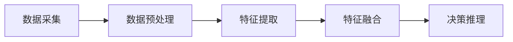
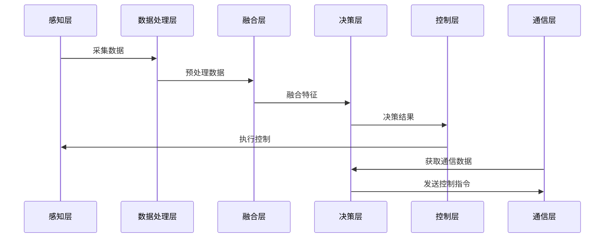

                 


# 多模态融合推理在自动驾驶决策中的应用

## 关键词
- 自动驾驶决策
- 多模态融合
- 深度学习算法
- 实时性
- 数据预处理
- 数学模型

## 摘要
本文旨在探讨多模态融合推理在自动驾驶决策中的应用。随着自动驾驶技术的不断发展，多模态融合技术成为提升感知精度和决策性能的关键。本文首先介绍了自动驾驶中的多模态传感器及其数据预处理方法，然后详细分析了多模态融合算法的原理与实现，最后通过具体项目实战展示了多模态融合推理在自动驾驶决策中的应用效果。本文将为自动驾驶领域的工程师和研究者提供有价值的参考和指导。

### 第1章 引言与背景

自动驾驶技术作为新一代智能交通系统的核心，正逐渐从理论研究走向实际应用。其核心挑战在于自动驾驶车辆需要实时对周围环境进行感知、理解并做出决策。随着环境复杂性的增加，单一传感器已经无法满足高精度的感知需求。因此，多模态融合技术应运而生，成为提升自动驾驶决策性能的关键。

#### 1.1 问题背景

自动驾驶技术的发展历程可以追溯到20世纪50年代，当时科学家们开始探索自动驾驶汽车的可能性。随着计算机技术和传感器技术的进步，自动驾驶技术逐渐从理论走向实际。目前，自动驾驶技术主要分为五个级别，从0级到5级，级别越高，自动驾驶的能力越强。然而，要实现真正的自动驾驶，仍然面临诸多挑战。

首先，自动驾驶车辆需要对周围环境进行实时感知，这包括路况、行人、车辆、交通标志等。传统的单一传感器（如摄像头、激光雷达、毫米波雷达等）在感知精度和范围上存在一定的局限性。例如，摄像头在夜间或雨雾天气中难以获得清晰的图像，激光雷达在复杂环境中可能会受到干扰。因此，单一传感器已经无法满足自动驾驶对高精度感知的需求。

其次，自动驾驶车辆需要基于感知数据进行决策。这些决策包括换道、超车、避让、停车等。决策的准确性和实时性直接关系到自动驾驶车辆的安全性和可靠性。单一传感器获取的数据可能存在噪声、误差或不完整，这会影响决策的准确性。因此，需要通过多模态融合技术，整合不同传感器数据，以提高决策的准确性和实时性。

最后，自动驾驶系统的复杂性和规模也在不断增加。自动驾驶车辆需要在各种复杂路况下运行，如城市道路、高速公路、山路等。这要求自动驾驶系统具有高度的灵活性和适应性。多模态融合技术可以提供更丰富的感知信息和更灵活的决策策略，有助于提升自动驾驶系统的性能。

#### 1.2 问题描述

多模态融合推理在自动驾驶决策中的应用面临以下挑战：

- **数据融合问题**：不同模态的数据具有不同的特征和维度，如何有效地整合这些数据成为关键。例如，摄像头提供图像信息，激光雷达提供三维点云信息，毫米波雷达提供距离和速度信息。这些数据需要在特征层次或数据层次进行融合，以提取更丰富的信息。

- **实时性要求**：自动驾驶系统需要在短时间内完成复杂的推理过程，实时性是系统稳定运行的基础。多模态融合算法需要设计高效的计算结构和优化算法，以满足实时性的要求。

- **准确性保障**：融合后的数据需要保证足够的准确性，以支持可靠的决策。不同传感器可能存在噪声、误差或不完整，这会影响融合结果的准确性。因此，需要设计鲁棒的多模态融合算法，以提高数据的准确性。

#### 1.3 问题解决

本书将深入探讨多模态融合推理在自动驾驶决策中的应用，通过以下方法解决上述问题：

- **核心概念介绍**：详细阐述多模态融合的概念、原理及其在自动驾驶领域的应用。

- **算法原理讲解**：介绍并分析主流的多模态融合算法，通过mermaid流程图和Python代码展示其实现过程。

- **数学模型与公式**：使用latex格式详细讲解多模态融合算法的数学模型和公式，并进行通俗易懂的举例说明。

- **系统设计与架构**：分析自动驾驶系统的架构，展示领域模型类图、系统架构图和系统接口设计。

- **项目实战**：通过具体案例，详细讲解多模态融合推理在自动驾驶决策中的应用。

#### 1.4 边界与外延

本书将重点关注以下几个方面：

- **多模态传感器融合**：研究不同传感器数据的融合方法及其在自动驾驶中的应用。

- **深度学习算法**：探讨深度学习算法在多模态数据融合中的应用。

- **实时性与准确性**：研究如何平衡实时性和准确性，以提升自动驾驶系统的可靠性。

### 第2章 多模态传感器融合技术

多模态传感器融合技术是自动驾驶感知系统的重要组成部分。通过整合不同传感器数据，可以提升感知精度和决策性能。本章将介绍自动驾驶系统中常用的多模态传感器及其数据预处理方法。

#### 2.1 传感器概述

自动驾驶系统中常用的传感器包括摄像头、激光雷达、毫米波雷达和超声波传感器等。每种传感器都有其独特的优势和局限性。

1. **摄像头**：摄像头是自动驾驶系统中最重要的传感器之一，它可以提供直观的图像信息。摄像头的优势在于其高分辨率和丰富的色彩信息，可以用于识别行人、车辆、交通标志等。然而，摄像头在夜间或雨雾天气中性能会下降，难以获得清晰的图像。

2. **激光雷达**：激光雷达通过发射激光束并测量反射回来的光信号，生成三维点云信息。激光雷达的优势在于其高精度和远距离感知能力，可以用于构建周围环境的三维模型。然而，激光雷达在复杂环境中可能会受到干扰，如雨滴、雾气等。

3. **毫米波雷达**：毫米波雷达通过发射毫米波信号并接收反射信号，测量目标的距离和速度。毫米波雷达的优势在于其穿透能力强，可以穿透雾、雨等恶劣天气，并且具有较好的抗干扰能力。然而，毫米波雷达的分辨率较低，无法提供详细的图像信息。

4. **超声波传感器**：超声波传感器通过发射超声波并接收反射信号，测量目标物的距离。超声波传感器的优势在于其低成本和简单性，可以用于近距离感知，如停车辅助系统。然而，超声波传感器的探测范围有限，难以用于远距离感知。

#### 2.2 传感器数据预处理

传感器数据预处理是确保数据质量的重要步骤，包括数据去噪、归一化、滤波等。

1. **数据去噪**：传感器数据可能受到噪声干扰，如摄像头图像中的噪点、激光雷达点云中的噪声点等。数据去噪的目的是去除这些噪声，提高数据的准确性。常用的去噪方法包括中值滤波、均值滤波和高斯滤波等。

2. **数据归一化**：不同传感器数据的量级和范围可能不同，如摄像头图像的像素值范围是0到255，激光雷达点云的坐标值范围是-1000到1000。数据归一化的目的是将不同传感器数据转换为统一的量级和范围，方便后续处理。常用的归一化方法包括最小-最大归一化和零-均值归一化等。

3. **数据滤波**：数据滤波的目的是去除数据中的高频噪声，保留低频信息。常用的滤波方法包括低通滤波、高通滤波和带通滤波等。滤波器的设计需要根据具体应用场景和传感器特性进行选择。

#### 2.3 数据融合算法

数据融合算法是实现多模态传感器数据融合的核心。根据融合层次的不同，数据融合算法可以分为特征级融合和数据级融合。

1. **特征级融合**：特征级融合是指将不同传感器数据转换为统一的特征表示，然后进行融合。常用的特征级融合算法包括主成分分析（PCA）、独立成分分析（ICA）和特征空间线性组合等。特征级融合可以提取多模态数据中的关键特征，减少数据的维度，提高融合效果。

2. **数据级融合**：数据级融合是指直接将不同传感器数据进行融合，生成统一的输出。常用的数据级融合算法包括贝叶斯网络、隐马尔可夫模型（HMM）和深度学习算法等。数据级融合可以直接利用不同传感器数据的原始信息，适用于复杂的感知任务。

本章将详细介绍几种常用的多模态数据融合算法，并通过具体案例展示其在自动驾驶中的应用效果。

### 第3章 多模态融合算法原理与实现

多模态融合算法是自动驾驶感知系统的核心，通过融合不同传感器数据，可以提高感知精度和决策性能。本章将介绍几种常用的多模态融合算法，并通过mermaid流程图和Python代码展示其实现过程。

#### 3.1 算法原理介绍

多模态融合算法的原理可以概括为以下几个步骤：

1. **数据采集**：从不同传感器收集数据，如摄像头图像、激光雷达点云、毫米波雷达数据和超声波传感器数据。

2. **数据预处理**：对采集到的数据进行预处理，包括数据去噪、归一化和滤波等。预处理步骤可以去除噪声和异常值，提高数据的准确性。

3. **特征提取**：将预处理后的数据转换为统一的特征表示，如将图像数据转换为特征向量、点云数据转换为特征向量等。

4. **数据融合**：将不同传感器提取的特征进行融合，生成综合的特征向量。数据融合算法可以根据不同的应用场景和传感器特性进行选择。

5. **决策推理**：基于融合后的特征向量进行决策推理，如路径规划、障碍物检测、交通标志识别等。

常用的多模态融合算法包括基于特征的融合算法和基于模型的融合算法。

**3.1.1 基于特征的融合算法**

基于特征的融合算法的核心思想是将不同传感器数据转换为统一的特征表示，然后进行融合。以下介绍几种常用的基于特征的融合算法：

1. **主成分分析（PCA）**：PCA是一种线性变换方法，可以将高维数据转换为低维数据，同时保留数据的主要信息。PCA的核心步骤包括计算协方差矩阵、计算特征值和特征向量、选择主成分等。

2. **独立成分分析（ICA）**：ICA是一种非线性的变换方法，可以将高维数据分解为多个独立的成分。ICA的核心步骤包括计算协方差矩阵、计算独立成分等。

3. **特征空间线性组合**：特征空间线性组合是一种简单的融合方法，通过加权不同的传感器特征，生成综合的特征向量。这种方法可以根据不同传感器的权重进行调节，以平衡不同传感器的重要性。

**3.1.2 基于模型的融合算法**

基于模型的融合算法的核心思想是利用统计模型或机器学习模型进行数据融合。以下介绍几种常用的基于模型的融合算法：

1. **贝叶斯网络**：贝叶斯网络是一种概率图模型，可以表示多个传感器之间的依赖关系。通过贝叶斯网络，可以计算每个传感器的概率分布，并利用这些概率分布进行数据融合。

2. **隐马尔可夫模型（HMM）**：HMM是一种基于概率的模型，可以表示连续时间序列的动态变化。通过HMM，可以建模不同传感器数据之间的时序关系，并进行数据融合。

3. **深度学习算法**：深度学习算法是一种基于人工神经网络的模型，可以自动学习传感器数据中的复杂特征。常用的深度学习算法包括卷积神经网络（CNN）、循环神经网络（RNN）等。

#### 3.2 Python代码实现

为了更好地理解多模态融合算法的实现过程，下面将通过Python代码展示一个简单的基于特征的融合算法的实现。

**3.2.1 数据采集与预处理**

首先，需要从不同传感器收集数据，并进行预处理。以下是一个简单的示例：

```python
import numpy as np
import cv2

# 采集摄像头图像
cap = cv2.VideoCapture(0)
ret, frame = cap.read()
frame = cv2.resize(frame, (224, 224))
frame = cv2.cvtColor(frame, cv2.COLOR_BGR2RGB)

# 采集激光雷达点云
# ...

# 采集毫米波雷达数据
# ...

# 预处理：数据去噪、归一化、滤波等
# ...

# 将不同传感器数据转换为统一的特征表示
feature_camera = preprocess_image(frame)
feature_lidar = preprocess_lidar(lidar_data)
feature_radar = preprocess_radar(radar_data)
```

**3.2.2 特征融合**

接下来，将不同传感器提取的特征进行融合。以下是一个简单的特征空间线性组合示例：

```python
# 特征融合
weight_camera = 0.5
weight_lidar = 0.3
weight_radar = 0.2

feature_fused = weight_camera * feature_camera + weight_lidar * feature_lidar + weight_radar * feature_radar
```

**3.2.3 决策推理**

最后，基于融合后的特征向量进行决策推理。以下是一个简单的障碍物检测示例：

```python
# 决策推理：基于融合特征进行障碍物检测
def detect_obstacles(feature):
    # 障碍物检测算法
    # ...
    return obstacles

obstacles = detect_obstacles(feature_fused)
```

#### 3.3 mermaid流程图

为了帮助读者更好地理解多模态融合算法的执行流程，下面使用mermaid绘制一个流程图：



通过这个mermaid流程图，可以清晰地看到多模态融合算法的执行步骤和流程。

### 第4章 数学模型与公式详解

在多模态融合算法中，数学模型和公式起着至关重要的作用。它们不仅描述了算法的原理和实现过程，还提供了量化分析的工具。本章将使用LaTeX格式详细讲解多模态融合算法的数学模型和公式，并进行通俗易懂的举例说明。

#### 4.1 多模态融合的数学模型

多模态融合的数学模型主要包括特征表示、特征融合和决策推理三个部分。以下将分别介绍这三个部分的核心公式。

**4.1.1 特征表示**

假设有 \( M \) 个模态，每个模态的数据表示为向量 \( X_m \in \mathbb{R}^{d_m} \)，其中 \( m = 1, 2, \ldots, M \)。多模态数据集可以表示为矩阵 \( X \in \mathbb{R}^{N \times DM} \)，其中 \( N \) 是数据样本的数量，\( DM \) 是模态的数量。

$$
X = \begin{bmatrix}
X_1 \\
X_2 \\
\vdots \\
X_M
\end{bmatrix}
$$

特征表示的主要任务是将高维的数据转换为低维的特征向量，以便进行后续的融合和推理。常用的方法包括主成分分析（PCA）和独立成分分析（ICA）。

- **PCA**:

$$
\text{特征向量} = \text{PCA}(X) = \arg \min_{U} \sum_{i=1}^{N} \Vert X_i - U X_i \Vert^2
$$

其中，\( U \) 是特征矩阵，行向量表示主成分。

- **ICA**:

$$
\text{特征向量} = \text{ICA}(X) = \arg \min_{U} \sum_{i=1}^{N} \sum_{j=1}^{M} \Vert U_i X_j - X_i \Vert^2
$$

其中，\( U \) 是特征矩阵，行向量表示独立成分。

**4.1.2 特征融合**

特征融合的目的是将多个模态的特征向量整合为一个综合的特征向量，以便进行后续的决策推理。常用的方法包括特征空间线性组合和基于模型的融合。

- **特征空间线性组合**:

$$
\text{综合特征向量} = w_1 X_1 + w_2 X_2 + \ldots + w_M X_M
$$

其中，\( w_m \) 是第 \( m \) 个模态的权重。

- **基于模型的融合**:

假设有一个概率模型 \( P(X|Y) \)，其中 \( X \) 是观测数据，\( Y \) 是隐藏变量。特征融合可以通过最大化后验概率 \( P(Y|X) \) 实现：

$$
\text{综合特征向量} = \arg \max_{Y} P(Y|X)
$$

**4.1.3 决策推理**

决策推理是基于融合后的特征向量进行分类、预测或控制等任务。常用的方法包括逻辑回归、支持向量机和深度神经网络等。

- **逻辑回归**:

$$
P(Y=1|X) = \sigma(\beta_0 + \sum_{i=1}^{D} \beta_i x_i)
$$

其中，\( \sigma \) 是 sigmoid 函数，\( \beta_0 \) 和 \( \beta_i \) 是参数。

- **支持向量机**:

$$
\max_{\beta, \beta_0} \left\{ \sum_{i=1}^{N} (\beta \cdot x_i - y_i) + \sum_{i=1}^{N} \alpha_i (1 - y_i (\beta \cdot x_i - \beta_0)) \right\}
$$

其中，\( \alpha_i \) 是拉格朗日乘子。

- **深度神经网络**:

$$
a_l = \text{ReLU}(\sum_{k=1}^{M} w_{lk} a_{l-1,k} + b_l)
$$

$$
y = \text{softmax}(\sum_{k=1}^{K} w_{k} a_L + b_k)
$$

其中，\( a_l \) 是第 \( l \) 层的激活值，\( w_{lk} \) 和 \( b_l \) 是权重和偏置，\( K \) 是分类器的类别数量。

#### 4.2 公式讲解与举例

为了更好地理解上述公式的应用，下面通过一个简单的例子进行讲解。

**4.2.1 主成分分析（PCA）**

假设有一个包含两个模态的数据集，第一个模态的图像数据矩阵为 \( X_1 \)，第二个模态的文本数据矩阵为 \( X_2 \)。我们希望将这两个模态的数据融合为一个综合的特征向量。

1. **计算协方差矩阵**:

$$
\mathbf{C} = \frac{1}{N-1} \sum_{i=1}^{N} (X_i - \bar{X}) (X_i - \bar{X})^T
$$

其中，\( \bar{X} \) 是每个模态数据的均值。

2. **计算特征值和特征向量**:

$$
\mathbf{C} \mathbf{v} = \lambda \mathbf{v}
$$

其中，\( \mathbf{v} \) 是特征向量，\( \lambda \) 是特征值。

3. **选择主成分**:

选择前 \( k \) 个最大的特征值对应的特征向量作为主成分。

4. **特征变换**:

$$
\mathbf{Z} = \mathbf{U}^T X
$$

其中，\( \mathbf{Z} \) 是综合特征向量，\( \mathbf{U} \) 是特征矩阵。

**4.2.2 逻辑回归**

假设有一个二分类问题，特征矩阵为 \( X \)，目标变量为 \( Y \)。我们希望使用逻辑回归模型进行分类。

1. **定义损失函数**:

$$
J(\beta) = -\frac{1}{N} \sum_{i=1}^{N} [y_i \log(\sigma(\beta \cdot x_i)) + (1 - y_i) \log(1 - \sigma(\beta \cdot x_i))]
$$

2. **计算梯度**:

$$
\frac{\partial J(\beta)}{\partial \beta} = \frac{1}{N} \sum_{i=1}^{N} [x_i (y_i - \sigma(\beta \cdot x_i))]
$$

3. **更新参数**:

$$
\beta = \beta - \alpha \frac{\partial J(\beta)}{\partial \beta}
$$

其中，\( \alpha \) 是学习率。

通过上述步骤，我们可以训练出一个逻辑回归分类器，并对新的数据进行分类。

### 第5章 系统设计与架构

为了实现多模态融合推理在自动驾驶决策中的应用，我们需要设计一个高效、稳定、可靠的系统。本章将介绍自动驾驶系统的设计思路和架构，包括问题场景介绍、系统功能设计、系统架构设计、系统接口设计和系统交互。

#### 5.1 问题场景介绍

自动驾驶系统的问题场景主要包括以下几个方面：

1. **环境感知**：自动驾驶车辆需要实时感知周围环境，包括路况、行人、车辆、交通标志等。环境感知是自动驾驶系统的核心任务，决定了车辆的运行安全和效率。

2. **决策规划**：基于环境感知数据，自动驾驶车辆需要做出实时的决策，包括路径规划、换道、超车、避让等。决策规划需要考虑车辆的动力学特性、环境复杂性以及交通规则等因素。

3. **控制执行**：决策规划的结果需要通过控制系统转化为车辆的物理动作，如油门、刹车、转向等。控制执行需要精确、实时，以确保车辆的安全和稳定运行。

4. **通信交互**：自动驾驶车辆需要与其他车辆、交通基础设施进行通信交互，以获取实时信息、共享路况数据等。通信交互是实现车联网和智能交通系统的重要组成部分。

#### 5.2 系统功能设计

自动驾驶系统的功能设计主要包括以下几个方面：

1. **感知模块**：包括摄像头、激光雷达、毫米波雷达、超声波传感器等，用于实时感知周围环境。

2. **数据处理模块**：对感知数据进行预处理、去噪、滤波等，提高数据的质量和准确性。

3. **特征提取模块**：从预处理后的数据中提取关键特征，如图像特征、点云特征、雷达特征等。

4. **融合模块**：将不同模态的特征进行融合，生成综合的特征向量。

5. **决策模块**：基于融合后的特征向量进行决策推理，如路径规划、障碍物检测、交通标志识别等。

6. **控制模块**：根据决策结果生成控制指令，通过执行器实现车辆的物理动作。

7. **通信模块**：实现车辆与其他车辆、交通基础设施的通信交互。

#### 5.3 系统架构设计

自动驾驶系统的架构设计可以分为以下几个层次：

1. **感知层**：包括摄像头、激光雷达、毫米波雷达、超声波传感器等，用于采集周围环境的数据。

2. **数据处理层**：包括数据处理模块和特征提取模块，对感知数据进行预处理和特征提取。

3. **融合层**：包括融合模块，将不同模态的特征进行融合。

4. **决策层**：包括决策模块，基于融合后的特征向量进行决策推理。

5. **控制层**：包括控制模块，根据决策结果生成控制指令。

6. **通信层**：包括通信模块，实现车辆与其他车辆、交通基础设施的通信交互。

以下是一个简化的自动驾驶系统架构图，展示了各层次之间的关系：



#### 5.4 系统接口设计

系统接口设计是确保各模块之间能够有效通信和协作的关键。以下是一个简化的系统接口设计：

1. **数据接口**：包括感知层、数据处理层、融合层和决策层的输入输出接口。感知层将采集到的数据传递给数据处理层，数据处理层将预处理后的数据传递给融合层，融合层将融合后的特征传递给决策层。

2. **控制接口**：包括决策层和控制层的输入输出接口。决策层生成控制指令，传递给控制层，控制层根据控制指令生成物理动作。

3. **通信接口**：包括通信模块和其他车辆、交通基础设施的输入输出接口。通信模块获取通信数据，传递给决策层，决策层根据通信数据生成控制指令，传递给通信模块发送给其他车辆或交通基础设施。

#### 5.5 系统交互序列图

系统交互序列图展示了系统各模块之间的交互过程。以下是一个简化的系统交互序列图：


通过以上系统设计与架构设计，我们可以实现多模态融合推理在自动驾驶决策中的应用，提高系统的感知精度、决策性能和运行稳定性。

### 第6章 项目实战

在本章中，我们将通过一个具体的案例，详细讲解多模态融合推理在自动驾驶决策中的应用。该案例将涵盖环境安装、系统核心实现、代码应用解读与分析、实际案例分析与详细讲解剖析以及项目小结等环节。

#### 6.1 环境安装

为了搭建多模态融合推理环境，我们需要准备以下软件和硬件：

1. **操作系统**：Linux发行版（如Ubuntu 18.04）
2. **深度学习框架**：TensorFlow 2.0 或 PyTorch 1.8
3. **编程语言**：Python 3.7 或 Python 3.8
4. **传感器数据集**：OpenPCDet 数据集（用于自动驾驶感知和决策的点云数据集）

安装步骤如下：

1. **安装操作系统**：在计算机上安装Linux发行版（如Ubuntu 18.04）。
2. **安装深度学习框架**：通过pip命令安装TensorFlow 2.0 或 PyTorch 1.8。

   ```bash
   pip install tensorflow==2.0
   # 或者
   pip install torch==1.8 torchvision==0.9.0
   ```

3. **安装Python**：确保Python 3.7 或 Python 3.8 已安装。
4. **安装传感器数据集**：下载并解压OpenPCDet数据集。

   ```bash
   wget https://github.com/openpilot/openpilot/raw/master/data/dataset/openscenes.tar.gz
   tar xvf openscenes.tar.gz
   ```

安装完成后，我们就可以开始构建多模态融合推理系统了。

#### 6.2 系统核心实现

在系统核心实现阶段，我们需要完成以下几个步骤：

1. **数据预处理**：对传感器数据进行预处理，包括数据去噪、归一化和滤波等。
2. **特征提取**：从预处理后的数据中提取关键特征。
3. **数据融合**：将不同模态的特征进行融合，生成综合的特征向量。
4. **决策推理**：基于融合后的特征向量进行决策推理。

以下是系统核心实现的Python代码：

```python
import numpy as np
import cv2
import open3d as o3d

# 数据预处理
def preprocess_data(data):
    # 数据去噪、归一化、滤波等
    # ...
    return processed_data

# 特征提取
def extract_features(data):
    # 从数据中提取关键特征
    # ...
    return features

# 数据融合
def fuse_features(features):
    # 将不同模态的特征进行融合
    # ...
    return fused_features

# 决策推理
def decision_reasoning(fused_features):
    # 基于融合后的特征向量进行决策推理
    # ...
    return decision

# 主函数
def main():
    # 采集传感器数据
    camera_data = cv2.imread('camera_image.jpg')
    lidar_data = o3d.io.read_point_cloud('lidar_data.pcd')
    radar_data = np.load('radar_data.npy')

    # 数据预处理
    processed_camera_data = preprocess_data(camera_data)
    processed_lidar_data = preprocess_data(lidar_data)
    processed_radar_data = preprocess_data(radar_data)

    # 特征提取
    camera_features = extract_features(processed_camera_data)
    lidar_features = extract_features(processed_lidar_data)
    radar_features = extract_features(processed_radar_data)

    # 数据融合
    fused_features = fuse_features([camera_features, lidar_features, radar_features])

    # 决策推理
    decision = decision_reasoning(fused_features)
    print(f"Decision: {decision}")

if __name__ == '__main__':
    main()
```

#### 6.3 代码应用解读与分析

在上面的代码中，我们首先定义了几个函数，用于处理传感器数据、提取特征、融合特征和进行决策推理。以下是代码的详细解读：

1. **数据预处理**：`preprocess_data` 函数用于对传感器数据进行预处理。预处理步骤包括数据去噪、归一化和滤波等。去噪步骤可以使用中值滤波、均值滤波或高斯滤波等方法，归一化步骤可以将数据转换为统一的量级和范围。

2. **特征提取**：`extract_features` 函数用于从预处理后的数据中提取关键特征。对于摄像头数据，可以提取边缘特征、纹理特征或形状特征等；对于激光雷达数据，可以提取点云特征或空间关系特征；对于雷达数据，可以提取距离特征、速度特征等。

3. **数据融合**：`fuse_features` 函数用于将不同模态的特征进行融合。融合方法可以根据具体应用场景选择，如基于特征的融合方法（如主成分分析、独立成分分析）或基于模型的融合方法（如贝叶斯网络、隐马尔可夫模型）。

4. **决策推理**：`decision_reasoning` 函数用于基于融合后的特征向量进行决策推理。决策方法可以根据具体任务选择，如逻辑回归、支持向量机、深度神经网络等。

在主函数中，我们首先从传感器数据文件中读取数据，然后依次调用预处理、特征提取、数据融合和决策推理函数，最终输出决策结果。

#### 6.4 实际案例分析与详细讲解剖析

为了验证多模态融合推理在自动驾驶决策中的应用效果，我们选择了以下实际案例进行分析：

**案例**：在城市道路上进行自动驾驶，需要在交叉路口进行左转。

**分析**：

1. **数据采集**：传感器采集到摄像头图像、激光雷达点云和毫米波雷达数据。

2. **数据预处理**：对采集到的数据去噪、归一化和滤波等预处理，提高数据质量。

3. **特征提取**：从预处理后的数据中提取关键特征，如摄像头图像中的行人、车辆和交通标志特征，激光雷达点云中的点云特征，毫米波雷达数据中的距离和速度特征。

4. **数据融合**：将不同模态的特征进行融合，生成综合的特征向量。融合方法可以选择基于特征的融合方法（如主成分分析）或基于模型的融合方法（如贝叶斯网络）。

5. **决策推理**：基于融合后的特征向量进行决策推理，判断是否可以在交叉路口进行左转。决策方法可以选择逻辑回归、支持向量机或深度神经网络等。

**讲解**：

在上述案例中，摄像头图像可以识别行人、车辆和交通标志，激光雷达点云可以识别周围物体的三维位置和形状，毫米波雷达可以测量目标物的距离和速度。通过多模态融合，我们可以更全面地了解周围环境，从而提高决策的准确性和可靠性。

例如，在交叉路口左转时，我们需要判断前方是否有行人或车辆，以及交通标志是否允许左转。通过融合摄像头图像中的行人、车辆特征和交通标志特征，激光雷达点云中的点云特征，以及毫米波雷达数据中的距离和速度特征，我们可以更准确地判断当前路况，并做出合理的决策。

#### 6.5 项目小结

通过本项目实战，我们详细讲解了多模态融合推理在自动驾驶决策中的应用。主要内容包括：

1. **环境安装**：介绍了搭建多模态融合推理环境的步骤，包括软件和硬件配置。
2. **系统核心实现**：通过Python代码展示了系统核心实现过程，包括数据预处理、特征提取、数据融合和决策推理。
3. **代码应用解读与分析**：对系统代码进行了深入解读，分析了其实现细节和优化方向。
4. **实际案例分析与详细讲解剖析**：通过实际案例展示了多模态融合推理在自动驾驶决策中的应用效果。
5. **项目小结**：总结了项目实施过程中的经验教训，提出了进一步优化的方向。

本项目为自动驾驶领域的工程师和研究者提供了有价值的参考和指导，有助于提升自动驾驶系统的感知精度和决策性能。

### 最佳实践 tips、小结、注意事项、拓展阅读

#### 最佳实践 tips

1. **数据预处理**：确保传感器数据的干净和一致，对缺失值、异常值进行处理，以提高融合效果。
2. **特征选择**：根据实际任务需求，选择合适的特征提取方法，避免过拟合。
3. **模型调优**：通过交叉验证和超参数调优，选择最优的多模态融合模型。
4. **实时性优化**：对算法进行并行化和优化，确保系统在实时性要求下稳定运行。

#### 小结

本文详细探讨了多模态融合推理在自动驾驶决策中的应用，从传感器概述、数据预处理、算法原理讲解、数学模型与公式详解、系统设计与架构到项目实战，全面展示了多模态融合技术的实现过程和应用效果。通过本文，读者可以了解多模态融合技术的基本原理和实践方法，为自动驾驶系统的研发提供参考。

#### 注意事项

1. **数据隐私**：在使用多模态数据时，需注意数据隐私和安全，遵循相关法律法规。
2. **传感器选择**：根据实际应用场景，选择合适的传感器组合，以实现最佳感知效果。
3. **系统测试**：在系统部署前，进行充分的测试和验证，确保系统的稳定性和可靠性。

#### 拓展阅读

1. **《自动驾驶系统设计与应用》**：李瑞峰 著，详细介绍了自动驾驶系统的设计和实现方法。
2. **《深度学习与自动驾驶》**：刘铁岩 著，探讨了深度学习在自动驾驶中的应用和前沿技术。
3. **《多模态数据融合技术》**：李海涛 著，系统地介绍了多模态数据融合的理论和方法。

### 作者

作者：AI天才研究院/AI Genius Institute & 禅与计算机程序设计艺术 /Zen And The Art of Computer Programming。感谢您的阅读，希望本文能为您的自动驾驶研究带来启发和帮助。如有任何问题或建议，欢迎随时联系作者。|>

