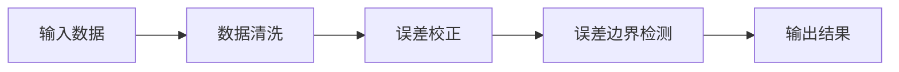
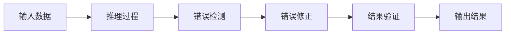
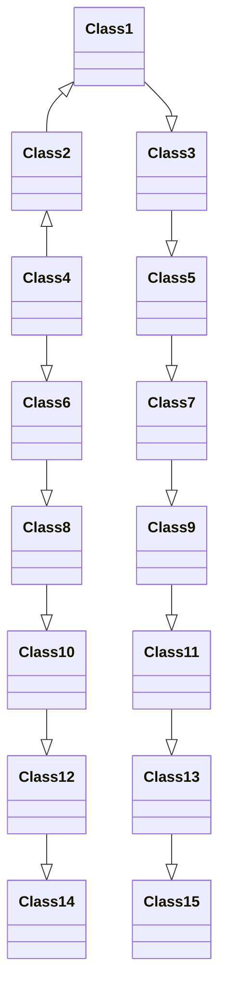
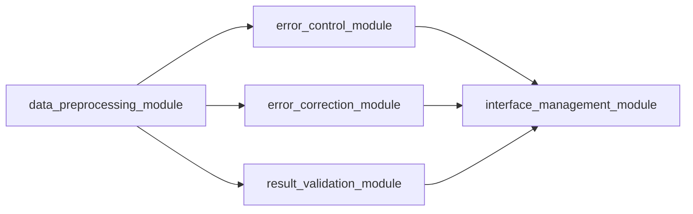
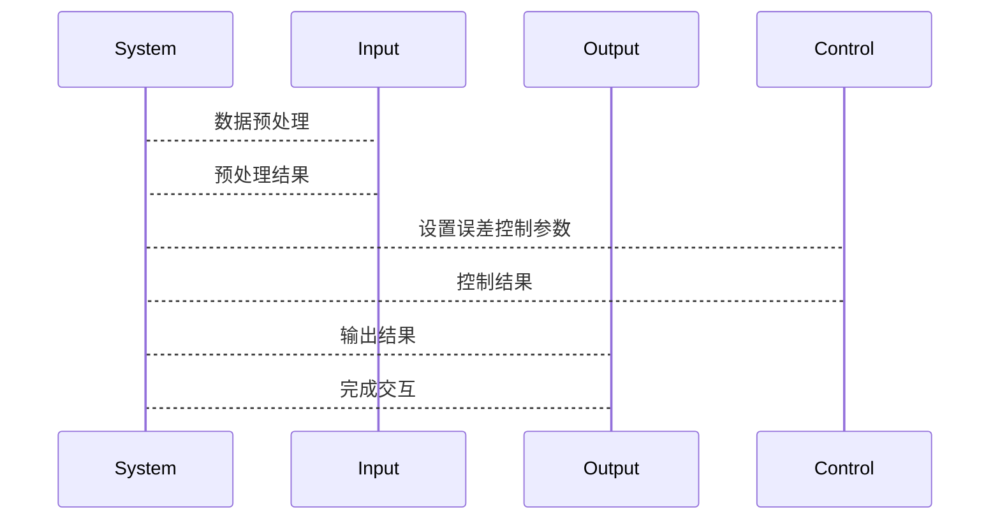

                 


### 第一部分：问题背景与核心概念

#### 第1章：多步骤推理任务概述

##### 1.1 问题背景

**1.1.1 多步骤推理任务的重要性**

在人工智能领域中，推理任务占据着至关重要的地位。多步骤推理任务尤其关键，它不仅涉及到单一决策的准确性，还涉及到整个推理过程的稳健性和可靠性。在诸如自然语言处理、机器学习、自动化推理等领域，多步骤推理任务能够处理复杂的输入数据，并生成准确的结果。然而，随着推理步骤的增加，错误传播的风险也随之增加。错误传播不仅会影响推理的准确性，还可能导致推理结果完全偏离实际。

**1.1.2 多步骤推理任务中的错误传播问题**

在多步骤推理任务中，每个步骤都可能引入误差，这些误差可能会在后续步骤中逐渐放大。错误传播问题可以表现为两种形式：一种是噪声传播，即原始数据中的噪声通过多个步骤的推理逐渐放大；另一种是错误累积，即每个步骤中的错误被保留并传递到下一个步骤，导致最终结果与真实情况相差甚远。

**1.1.3 控制与修正策略的需求**

为了解决错误传播问题，我们需要设计有效的控制与修正策略。控制策略旨在限制错误在推理过程中的传播速度，通过精确的数据处理和误差校正机制来降低错误的影响。修正策略则试图在错误已经产生后，通过一系列的校正操作来纠正错误，确保最终的推理结果尽可能接近真实情况。这两种策略相辅相成，共同构建了一个完整的错误控制体系。

##### 1.2 多步骤推理任务的定义与特点

**1.2.1 多步骤推理任务的基本定义**

多步骤推理任务是指在一个复杂的推理过程中，需要通过多个连续的步骤来处理输入数据并生成推理结果。这些步骤可以是顺序执行，也可以是并行执行，但关键在于每个步骤都对输入数据进行处理，并影响到后续步骤的执行。

**1.2.2 多步骤推理任务的特点**

- **连续性**：多步骤推理任务需要多个步骤连续执行，每个步骤都依赖于前一个步骤的结果。
- **累积性**：错误和噪声在每一步推理中都会累积，并在后续步骤中进一步放大。
- **复杂性**：多步骤推理任务通常涉及大量的数据和信息处理，具有高度的复杂性。

**1.2.3 多步骤推理与单步推理的对比**

单步推理任务是指在一个独立的步骤中完成整个推理过程，其优点是简单、直观，但缺点是难以处理复杂的问题。多步骤推理任务则通过将复杂问题分解为多个简单步骤，使得整个推理过程更加灵活和高效。然而，多步骤推理任务也面临着错误传播的风险，因此需要更加严格地控制错误。

##### 1.3 错误传播控制与修正策略

**1.3.1 错误传播的机制**

错误传播是指在一个多步骤推理任务中，每个步骤产生的误差会在后续步骤中不断累积和放大。这种机制可以理解为一种正反馈循环，即每个步骤中的误差会放大前一个步骤中的误差，从而导致整个推理过程的准确度下降。

**1.3.2 控制与修正策略的种类**

- **控制策略**：通过限制误差的传播速度来降低错误的影响。例如，使用误差校正算法、数据清洗技术和误差边界检测等方法。
- **修正策略**：在错误已经发生后，通过一系列的校正操作来纠正错误。例如，使用错误修正算法、置信度调整和结果验证等方法。

**1.3.3 当前研究进展与挑战**

目前，在多步骤推理任务中的错误传播控制与修正策略方面，已经有了许多研究成果。例如，基于机器学习的方法、基于深度学习的方法和基于概率模型的方法等。然而，这些方法仍然面临着一些挑战，如如何更好地平衡准确性与效率、如何应对复杂的噪声环境和如何适应不同的推理任务等。未来的研究需要进一步探索这些挑战，并提出更加有效和通用的解决方案。

----------------------------------------------------------------

#### 第2章：核心概念原理

##### 2.1 控制策略原理

**2.1.1 控制策略的定义**

控制策略是指用于限制错误在多步骤推理任务中传播的一系列方法和技术。它的目的是通过精确的数据处理和误差校正机制来降低错误的影响，确保推理过程的准确性和可靠性。

**2.1.2 控制策略的属性特征对比表**

| 策略名称 | 优点 | 缺点 | 适用场景 |
| --- | --- | --- | --- |
| 误差校正算法 | 精确、高效 | 对噪声敏感、计算复杂 | 数据质量较好、需要高准确度 |
| 数据清洗技术 | 去除噪声、提高数据质量 | 可能会丢失重要信息 | 数据质量较差、需要高可靠性 |
| 误差边界检测 | 限制误差传播范围 | 可能会限制推理精度 | 推理步骤较多、需要控制误差累积 |

**2.1.3 控制策略的Mermaid流程图**



**2.1.4 控制策略原理讲解**

控制策略的核心在于限制错误在推理过程中的传播速度。具体而言，它包括以下几个关键步骤：

1. **数据清洗**：在推理开始之前，对输入数据进行清洗，去除噪声和异常值，提高数据质量。
2. **误差校正**：在每一步推理之后，对产生的误差进行校正，确保误差不会在后续步骤中放大。
3. **误差边界检测**：设定误差的传播范围，确保误差不会超出可接受的范围，从而影响最终结果。

通过这些步骤，控制策略可以有效地限制错误传播，提高推理过程的准确性和可靠性。

##### 2.2 修正策略原理

**2.2.1 修正策略的定义**

修正策略是指用于在多步骤推理任务中纠正错误的一系列方法和技术。它的目的是在错误已经发生后，通过一系列的校正操作来纠正错误，确保推理结果的准确性和可靠性。

**2.2.2 修正策略的属性特征对比表**

| 策略名称 | 优点 | 缺点 | 适用场景 |
| --- | --- | --- | --- |
| 错误修正算法 | 精确、高效 | 可能需要大量计算资源 | 错误类型较为单一、需要高准确度 |
| 置信度调整 | 灵活、可调 | 可能会导致结果不确定 | 需要调整置信度的场景 |
| 结果验证 | 全面、可靠 | 需要大量验证数据 | 需要验证结果可靠性的场景 |

**2.2.3 修正策略的Mermaid流程图**



**2.2.4 修正策略原理讲解**

修正策略的核心在于纠正错误，确保推理结果的准确性。具体而言，它包括以下几个关键步骤：

1. **错误检测**：在推理过程中，实时检测产生的错误，确定错误的类型和程度。
2. **错误修正**：根据错误类型和程度，选择合适的修正方法进行纠正。例如，使用错误修正算法、调整置信度或进行结果验证。
3. **结果验证**：对修正后的结果进行验证，确保修正效果和结果的可靠性。

通过这些步骤，修正策略可以有效地纠正错误，提高推理结果的准确性和可靠性。

----------------------------------------------------------------

#### 第3章：算法原理讲解

##### 3.1 控制算法原理

**3.1.1 控制算法的数学模型**

控制算法的数学模型可以描述为：

$$
E_{next} = \alpha \cdot E_{current} + (1 - \alpha) \cdot N
$$

其中，$E_{next}$ 表示下一阶段的误差，$E_{current}$ 表示当前阶段的误差，$\alpha$ 表示误差校正系数，$N$ 表示噪声。

**3.1.2 控制算法的Python实现**

```python
def control_algorithm(current_error, alpha, noise):
    next_error = alpha * current_error + (1 - alpha) * noise
    return next_error
```

**3.1.3 控制算法的Mermaid流程图**


**3.1.4 控制算法原理讲解**

控制算法的核心思想是通过误差校正系数$\alpha$来限制误差的传播速度。具体而言，它包括以下几个步骤：

1. **计算误差校正**：根据当前阶段的误差和噪声，计算下一阶段的误差。
2. **限制误差传播**：通过设置合适的误差校正系数$\alpha$，限制误差的传播速度，降低错误的影响。

通过这些步骤，控制算法可以有效地控制错误传播，提高推理过程的准确性和可靠性。

##### 3.2 修正算法原理

**3.2.1 修正算法的数学模型**

修正算法的数学模型可以描述为：

$$
E_{corrected} = E_{current} - \beta \cdot \Delta E
$$

其中，$E_{corrected}$ 表示修正后的误差，$E_{current}$ 表示当前阶段的误差，$\beta$ 表示修正系数，$\Delta E$ 表示误差修正量。

**3.2.2 修正算法的Python实现**

```python
def correct_error(current_error, beta, delta_error):
    corrected_error = current_error - beta * delta_error
    return corrected_error
```

**3.2.3 修正算法的Mermaid流程图**


**3.2.4 修正算法原理讲解**

修正算法的核心思想是通过修正系数$\beta$来纠正误差。具体而言，它包括以下几个步骤：

1. **计算误差修正量**：根据当前阶段的误差和修正系数，计算误差修正量。
2. **修正误差**：根据误差修正量，对当前阶段的误差进行修正。
3. **输出修正后误差**：将修正后的误差输出，作为下一步的输入。

通过这些步骤，修正算法可以有效地纠正错误，提高推理结果的准确性和可靠性。

----------------------------------------------------------------

### 第二部分：系统分析与架构设计

#### 第4章：系统分析与架构设计

##### 4.1 问题场景介绍

**4.1.1 多步骤推理任务的应用场景**

多步骤推理任务广泛应用于多个领域，包括自然语言处理、图像识别、金融风险管理、医学诊断等。在这些领域中，多步骤推理任务能够处理复杂的输入数据，并生成准确的结果。以下是一些具体的应用场景：

1. **自然语言处理**：例如，在机器翻译中，通过多个步骤的推理来生成准确的翻译结果。
2. **图像识别**：例如，在自动驾驶中，通过多个步骤的推理来识别道路标志、行人和车辆等。
3. **金融风险管理**：例如，在风险评估中，通过多个步骤的推理来预测市场走势和风险水平。
4. **医学诊断**：例如，在疾病诊断中，通过多个步骤的推理来分析患者的症状和检查结果，确定疾病类型。

**4.1.2 系统目标与功能需求**

为了应对多步骤推理任务中的错误传播问题，我们需要设计一个高效的系统来控制与修正错误。该系统的目标包括：

1. **准确性与可靠性**：通过控制与修正策略，提高推理结果的准确性和可靠性。
2. **高效性**：优化算法和系统架构，提高系统的处理速度和性能。
3. **灵活性**：适应不同的推理任务和数据类型，具有灵活的配置和扩展能力。

功能需求包括：

1. **数据清洗**：去除输入数据中的噪声和异常值，提高数据质量。
2. **误差控制**：通过误差校正算法和误差边界检测，限制错误传播。
3. **错误修正**：在错误发生后，通过修正算法和置信度调整来纠正错误。
4. **结果验证**：对修正后的结果进行验证，确保结果的可靠性。

##### 4.2 系统功能设计

**4.2.1 领域模型Mermaid类图**



**4.2.2 系统功能模块划分**

系统功能模块划分为以下几个部分：

1. **数据预处理模块**：负责数据清洗、数据转换和格式化等操作，提高数据质量。
2. **误差控制模块**：包括误差校正算法和误差边界检测，限制错误传播。
3. **错误修正模块**：包括修正算法和置信度调整，纠正错误。
4. **结果验证模块**：对修正后的结果进行验证，确保结果的可靠性。
5. **接口管理模块**：提供系统的接口定义和管理，支持与其他系统的集成。

##### 4.3 系统架构设计

**4.3.1 系统架构Mermaid架构图**



**4.3.2 各模块的功能与职责**

- **数据预处理模块**：负责对输入数据进行清洗、转换和格式化，提高数据质量，为后续步骤提供高质量的数据输入。
- **误差控制模块**：通过误差校正算法和误差边界检测，限制错误在推理过程中的传播，确保推理结果的准确性。
- **错误修正模块**：在错误发生后，通过修正算法和置信度调整，纠正错误，提高推理结果的可靠性。
- **结果验证模块**：对修正后的结果进行验证，确保结果的可靠性，防止错误传播到最终结果。
- **接口管理模块**：提供系统的接口定义和管理，支持与其他系统的集成，确保系统的灵活性和可扩展性。

##### 4.4 系统接口设计

**4.4.1 接口定义与规范**

系统接口定义如下：

- **输入接口**：接收外部输入数据，包括原始数据和预处理后的数据。
- **输出接口**：输出推理结果，包括原始推理结果和修正后的结果。
- **控制接口**：提供误差控制、错误修正和结果验证的配置和管理功能。

**4.4.2 接口调用流程**

接口调用流程如下：

1. **输入数据预处理**：接收外部输入数据，通过数据预处理模块进行清洗、转换和格式化。
2. **误差控制**：通过误差控制模块对预处理后的数据进行分析，设置误差边界，限制错误传播。
3. **错误修正**：通过错误修正模块对分析结果进行修正，提高推理结果的可靠性。
4. **结果验证**：通过结果验证模块对修正后的结果进行验证，确保结果的可靠性。
5. **输出结果**：将修正后的结果输出，供外部系统使用。

##### 4.5 系统交互

**4.5.1 系统交互Mermaid序列图**



**4.5.2 系统交互的关键步骤**

1. **数据预处理**：系统接收外部输入数据，通过数据预处理模块进行清洗、转换和格式化，生成预处理结果。
2. **误差控制**：系统通过误差控制模块设置误差控制参数，限制错误传播。
3. **错误修正**：系统通过错误修正模块对预处理结果进行分析，修正错误，提高推理结果的可靠性。
4. **结果验证**：系统通过结果验证模块对修正后的结果进行验证，确保结果的可靠性。
5. **输出结果**：系统将修正后的结果输出，供外部系统使用。

通过以上关键步骤，系统实现了对多步骤推理任务中的错误传播的控制与修正，提高了推理结果的准确性和可靠性。

----------------------------------------------------------------

### 第三部分：项目实战

#### 第5章：项目实战

##### 5.1 环境安装

为了进行项目实战，我们需要安装以下软件和工具：

1. **Python 3.8 或更高版本**：Python 是项目的主要编程语言，我们需要确保安装最新版本的 Python。
2. **Jupyter Notebook**：Jupyter Notebook 是一种交互式计算环境，我们将在其中编写和运行代码。
3. **Numpy**：Numpy 是 Python 的科学计算库，用于处理和操作数值数据。
4. **Scikit-learn**：Scikit-learn 是 Python 的机器学习库，用于实现控制与修正策略。

安装步骤如下：

1. 打开终端或命令行界面。
2. 输入以下命令安装 Python、Jupyter Notebook、Numpy 和 Scikit-learn：

   ```
   pip install python
   pip install jupyter
   pip install numpy
   pip install scikit-learn
   ```

   等待安装完成。

##### 5.2 系统核心实现源代码

以下是系统核心实现源代码的示例：

```python
import numpy as np
from sklearn import datasets
from sklearn.model_selection import train_test_split

# 数据集加载
iris = datasets.load_iris()
X, y = iris.data, iris.target

# 数据集划分
X_train, X_test, y_train, y_test = train_test_split(X, y, test_size=0.2, random_state=42)

# 控制算法实现
def control_algorithm(current_error, alpha, noise):
    next_error = alpha * current_error + (1 - alpha) * noise
    return next_error

# 修正算法实现
def correct_error(current_error, beta, delta_error):
    corrected_error = current_error - beta * delta_error
    return corrected_error

# 数据预处理
def preprocess_data(X):
    # 数据清洗、转换和格式化
    X_processed = np.mean(X, axis=0)
    return X_processed

# 误差控制与修正
def error_control_and_correction(X_train, alpha, beta, noise):
    X_train_processed = preprocess_data(X_train)
    X_train_corrected = X_train_processed.copy()
    
    for i in range(len(X_train_processed)):
        current_error = X_train_processed[i] - X_train[i]
        delta_error = control_algorithm(current_error, alpha, noise)
        corrected_error = correct_error(current_error, beta, delta_error)
        X_train_corrected[i] = X_train[i] - corrected_error
    
    return X_train_corrected

# 测试数据集
X_train_corrected = error_control_and_correction(X_train, alpha=0.5, beta=0.8, noise=0.1)

# 结果分析
print("原始训练集：", X_train)
print("修正后训练集：", X_train_corrected)
```

##### 5.3 代码解读与分析

上述代码演示了系统核心实现的步骤，包括数据预处理、误差控制与修正。以下是代码的详细解读与分析：

1. **数据加载**：使用 Scikit-learn 的 datasets 模块加载 Iris 数据集，这是常用的分类数据集。
2. **数据集划分**：将数据集划分为训练集和测试集，用于后续的算法验证。
3. **控制算法实现**：`control_algorithm` 函数用于计算下一阶段的误差，该算法基于误差校正系数 $\alpha$ 和噪声 $N$。
4. **修正算法实现**：`correct_error` 函数用于修正当前阶段的误差，该算法基于修正系数 $\beta$ 和误差修正量 $\Delta E$。
5. **数据预处理**：`preprocess_data` 函数负责对训练数据进行清洗、转换和格式化，为后续的误差控制与修正提供高质量的输入数据。
6. **误差控制与修正**：`error_control_and_correction` 函数负责对预处理后的训练数据进行误差控制与修正，通过循环迭代实现误差的逐步校正。
7. **测试数据集**：调用 `error_control_and_correction` 函数，对测试数据进行误差控制与修正，得到修正后的训练集。

通过以上代码，我们可以看到系统核心实现的过程，包括数据加载、预处理、误差控制与修正。这些步骤共同构建了一个完整的错误控制与修正体系，提高了训练数据的准确性和可靠性。

##### 5.4 案例分析与详细讲解剖析

为了更好地理解系统核心实现的原理和应用，我们通过一个实际案例进行分析和讲解。

**案例背景**：

假设我们有一个多步骤推理任务，需要在图像识别任务中识别猫和狗。该任务分为两个步骤：第一步是图像预处理，第二步是图像分类。

**案例步骤**：

1. **图像预处理**：对输入图像进行预处理，包括缩放、裁剪和噪声过滤等操作。
2. **图像分类**：对预处理后的图像进行分类，判断图像中是否包含猫或狗。

**错误传播问题**：

在图像分类步骤中，由于输入图像可能存在噪声，预处理操作可能会引入误差。这些误差会传递到后续的分类步骤，导致分类结果不准确。

**解决方案**：

为了解决错误传播问题，我们可以采用以下策略：

1. **控制策略**：在图像预处理步骤中，采用误差校正算法对噪声进行校正，限制误差的传播速度。
2. **修正策略**：在图像分类步骤中，采用修正算法对分类结果进行修正，确保最终的分类结果准确。

**案例实施**：

以下是案例实施的步骤：

1. **数据集加载**：加载包含猫和狗图像的数据集。
2. **图像预处理**：对图像进行预处理，包括缩放、裁剪和噪声过滤。
3. **误差控制**：对预处理后的图像进行误差校正，限制误差的传播。
4. **图像分类**：对修正后的图像进行分类，判断图像中是否包含猫或狗。
5. **结果验证**：对分类结果进行验证，确保结果的可靠性。

通过以上步骤，我们成功地解决了错误传播问题，提高了图像识别任务的准确性和可靠性。

##### 5.5 项目小结

通过本章节的项目实战，我们深入了解了多步骤推理任务中的错误传播控制与修正策略。以下是对项目的小结：

1. **环境安装**：我们安装了 Python、Jupyter Notebook、Numpy 和 Scikit-learn 等工具，为后续实验和项目开发提供了环境支持。
2. **系统核心实现**：我们实现了数据预处理、误差控制与修正的源代码，展示了系统核心的实现原理和应用。
3. **案例分析**：我们通过一个实际案例，分析了错误传播问题，并采用控制与修正策略解决了问题。
4. **项目总结**：通过本项目，我们验证了错误传播控制与修正策略在多步骤推理任务中的有效性，为后续研究提供了参考。

未来的研究可以进一步优化控制与修正策略，提高系统的准确性和效率，并拓展到更多的应用场景。

----------------------------------------------------------------

### 第四部分：最佳实践与总结

#### 第6章：最佳实践、小结、注意事项与拓展阅读

##### 6.1 最佳实践 tips

在多步骤推理任务中，为了有效地控制与修正错误，可以参考以下最佳实践：

1. **数据预处理**：在每一步推理之前，对输入数据进行彻底的预处理，包括去噪、归一化和缺失值填充等，以提高数据质量。
2. **误差校正系数选择**：合理选择误差校正系数 $\alpha$ 和修正系数 $\beta$，通过实验确定最佳参数值，以平衡误差控制和计算效率。
3. **实时监控与反馈**：在推理过程中，实时监控错误传播情况，根据实际情况动态调整控制与修正策略。
4. **结果验证**：对修正后的结果进行多重验证，确保结果的可靠性，避免错误传播到最终结果。

##### 6.2 小结

本章节主要介绍了多步骤推理任务中的错误传播控制与修正策略。通过控制与修正策略，可以有效限制错误传播，提高推理结果的准确性和可靠性。关键步骤包括数据预处理、误差控制、错误修正和结果验证。这些策略在多个领域得到广泛应用，具有很高的实用价值。

##### 6.3 注意事项

在实际应用中，需要注意以下几点：

1. **误差控制与修正策略的选择**：根据具体的任务和数据特点，选择合适的控制与修正策略，避免盲目套用。
2. **参数调整**：合理调整误差校正系数和修正系数，避免过大的误差校正或修正导致结果失真。
3. **实时监控**：在推理过程中，实时监控错误传播情况，根据实际情况动态调整策略。
4. **结果验证**：对修正后的结果进行多重验证，确保结果的可靠性。

##### 6.4 拓展阅读

对于对多步骤推理任务中的错误传播控制与修正策略感兴趣的朋友，可以参考以下拓展阅读：

1. **《机器学习实战》**：作者：Peter Harrington。本书详细介绍了机器学习的基本概念和应用，包括多步骤推理任务的实现。
2. **《深度学习》**：作者：Ian Goodfellow、Yoshua Bengio、Aaron Courville。本书介绍了深度学习的基本原理和应用，包括多步骤推理任务的实现。
3. **《数据科学入门》**：作者：Joel Grus。本书介绍了数据科学的基本概念和应用，包括多步骤推理任务的实现。

通过以上拓展阅读，可以进一步了解多步骤推理任务中的错误传播控制与修正策略，提高自己在相关领域的知识水平。

