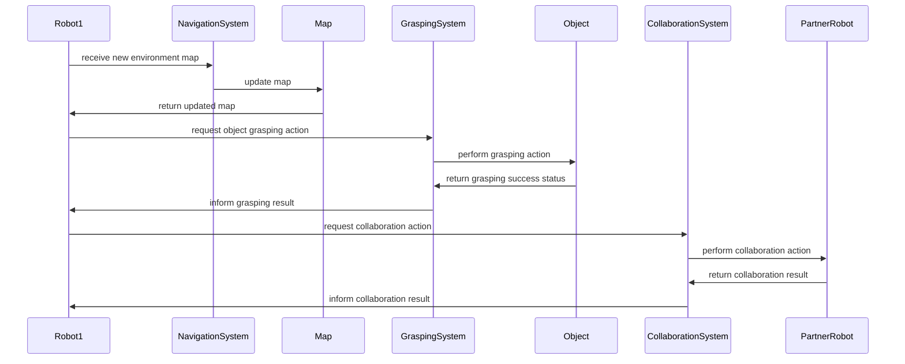

                 

# 《多目标强化学习在机器人控制中的应用》

## 关键词

多目标强化学习，机器人控制，算法改进，应用案例，未来展望

## 摘要

本文旨在探讨多目标强化学习在机器人控制中的应用。首先，我们将介绍机器人控制领域的重要性和面临的挑战，接着阐述多目标强化学习的基本概念和核心算法。在此基础上，我们将分析多目标强化学习在机器人导航、抓取和协作中的应用，并通过具体案例进行详细讲解。最后，我们将探讨多目标强化学习算法的改进策略和未来发展趋势，为相关研究和应用提供参考。

## 《多目标强化学习在机器人控制中的应用》目录大纲

### 第一部分：问题背景与基础理论

### 第1章：机器人控制概述

#### 1.1 机器人控制的重要性

#### 1.2 机器人控制的挑战

#### 1.3 多目标强化学习概述

### 第2章：多目标强化学习基本概念

#### 2.1 强化学习基础

#### 2.2 多目标优化

#### 2.3 多目标强化学习的核心概念

### 第3章：多目标强化学习算法

#### 3.1 Q-learning算法

#### 3.2 SARSA算法

#### 3.3 多目标Q-learning算法

#### 3.4 多目标SARSA算法

### 第二部分：应用案例

### 第4章：多目标强化学习在机器人导航中的应用

#### 4.1 机器人导航挑战

#### 4.2 多目标强化学习在机器人导航中的应用

#### 4.3 案例研究：多目标强化学习在自主导航中的应用

### 第5章：多目标强化学习在机器人抓取中的应用

#### 5.1 机器人抓取挑战

#### 5.2 多目标强化学习在机器人抓取中的应用

#### 5.3 案例研究：多目标强化学习在机器人抓取中的应用

### 第6章：多目标强化学习在机器人协作中的应用

#### 6.1 机器人协作挑战

#### 6.2 多目标强化学习在机器人协作中的应用

#### 6.3 案例研究：多目标强化学习在机器人协作中的应用

### 第三部分：算法改进与未来展望

### 第7章：多目标强化学习算法改进

#### 7.1 算法改进策略

#### 7.2 算法改进案例

#### 7.3 多目标强化学习算法改进趋势

### 第8章：多目标强化学习在机器人控制中的未来展望

#### 8.1 未来发展趋势

#### 8.2 面临的挑战与机遇

#### 8.3 未来研究方向

### 第9章：总结与展望

#### 9.1 全书总结

#### 9.2 建议研究方向

#### 9.3 参考文献

## 多目标强化学习相关概念

### 概念属性特征对比表格

| 概念         | 特征               |
|------------|------------------|
| 强化学习     | 基于奖励反馈的学习方式  |
| 多目标优化   | 同时优化多个目标      |
| 多目标强化学习 | 结合强化学习与多目标优化 |

### ER实体关系图架构

```mermaid
erDiagram
  User ||--|{Robot} : controls
  Robot ||--|{Goal} : has
  Goal ||--|{Reward} : receives
```

## 多目标强化学习算法原理

### 1. 算法流程


### 2. 数学模型和公式

$$
Q(s, a) = \sum_{g \in G} \gamma^g r_g(s, a) + \sum_{g \in G} \gamma^{g+1} Q(s', a')
$$

其中，$s$ 是状态，$a$ 是动作，$r_g(s, a)$ 是目标 $g$ 在状态 $s$ 下执行动作 $a$ 所获得的奖励，$\gamma$ 是折扣因子，$s'$ 是执行动作后的新状态，$a'$ 是在新状态下采取的动作。

## 多目标强化学习在机器人控制中的应用架构

### 1. 问题场景介绍

在机器人控制领域，机器人需要根据外部环境的变化做出实时响应，以满足多个目标的要求。例如，自主导航机器人需要在保持方向稳定的同时，避免障碍物并寻找目标路径；机器人抓取任务则需要同时保证抓取物体的稳定性和精确性。多目标强化学习为解决这类问题提供了一种有效的算法框架。

### 2. 系统功能设计（领域模型）

```mermaid
classDiagram
  Robot <<interface>>
  ControlSystem <<interface>>

  RobotEntity <|-- ControlSystemEntity
```

### 3. 系统架构设计

```mermaid
graph TB
  subgraph Control System
    Robot1 --> NavigationSystem
    Robot1 --> GraspingSystem
    Robot1 --> CollaborationSystem
    NavigationSystem --> Map
    GraspingSystem --> Object
    CollaborationSystem --> PartnerRobot
```

### 4. 系统接口设计和系统交互



## 第一部分：问题背景与基础理论

### 第1章：机器人控制概述

#### 1.1 机器人控制的重要性

机器人控制是机器人技术中的核心组成部分，它涉及到机器人在复杂环境中自主运行的能力。随着人工智能技术的快速发展，机器人控制已经广泛应用于工业制造、医疗辅助、家庭服务、物流配送等领域。机器人控制的重要性主要体现在以下几个方面：

1. **提高生产效率**：在工业制造领域，机器人控制可以替代人类完成重复性高、危险系数大的工作，从而提高生产效率，降低生产成本。
2. **保障人员安全**：在危险环境或人类无法到达的地方，如深海、核反应堆等，机器人控制可以代替人类进行工作，确保人员安全。
3. **提供便捷服务**：在家庭服务和医疗辅助领域，机器人控制可以为人们提供便捷的服务，如扫地机器人、护理机器人等。
4. **拓展应用场景**：机器人控制技术为机器人进入更多领域提供了可能，如农业、教育、娱乐等。

#### 1.2 机器人控制的挑战

尽管机器人控制技术在不断发展，但在实际应用中仍然面临许多挑战：

1. **复杂环境感知**：机器人需要在各种复杂环境中工作，如充满障碍物的仓库、嘈杂的工厂车间等。环境感知能力是机器人控制的关键，但现有的感知技术仍存在局限性。
2. **动态目标跟踪**：机器人在执行任务时，往往需要跟踪动态目标。目标的速度、方向和轨迹可能随时变化，这对机器人控制提出了高要求。
3. **多目标优化**：在实际应用中，机器人需要同时满足多个目标，如路径规划、抓取物体、避障等。如何在有限的时间内，高效地满足多个目标，是一个重要挑战。
4. **实时响应能力**：机器人需要在接收到外部环境变化时，能够快速做出反应。这对机器人的计算速度和处理能力提出了挑战。

#### 1.3 多目标强化学习概述

多目标强化学习（Multi-Objective Reinforcement Learning, MOReL）是一种结合了强化学习（Reinforcement Learning, RL）和多目标优化（Multi-Objective Optimization, MOO）的技术，旨在同时优化多个目标。在机器人控制中，多目标强化学习可以帮助机器人高效地满足多个目标要求。

1. **强化学习基础**：强化学习是一种基于奖励反馈的学习方式，通过与环境的交互来学习最佳行为策略。在机器人控制中，强化学习可以用于路径规划、动作规划等。
2. **多目标优化**：多目标优化是在同一问题中同时优化多个目标的过程。在机器人控制中，多目标优化可以帮助机器人同时满足多个目标，如路径规划中的最小化距离和最大化安全性。
3. **多目标强化学习**：多目标强化学习结合了强化学习与多目标优化的优势，旨在通过学习得到一个最优策略，使得机器人在执行任务时能够同时满足多个目标。

### 第2章：多目标强化学习基本概念

#### 2.1 强化学习基础

强化学习是一种通过环境与智能体交互来学习行为策略的机器学习方法。在强化学习中，智能体（agent）通过观察当前状态（state）、执行动作（action）、获得奖励（reward）来不断优化其策略（policy）。其核心目标是最大化总奖励。

1. **状态（State）**：状态是智能体在环境中所处的情境，通常用一组特征来表示。
2. **动作（Action）**：动作是智能体在状态下的决策，也是智能体与环境交互的方式。
3. **策略（Policy）**：策略是智能体在给定状态下选择动作的规则，通常表示为 $p(a|s)$，即状态 $s$ 下选择动作 $a$ 的概率。
4. **奖励（Reward）**：奖励是环境对智能体执行动作的反馈，用来指导智能体学习。奖励可以是即时奖励（immediate reward），也可以是长期奖励（long-term reward）。

#### 2.2 多目标优化

多目标优化是一种在同一问题中同时优化多个目标的优化方法。在机器人控制中，多目标优化可以帮助机器人同时满足多个目标，如路径规划中的最小化距离和最大化安全性。

1. **目标函数（Objective Function）**：目标函数是用来评价解决方案优劣的函数，通常表示为 $f(x)$，其中 $x$ 是问题的解决方案。
2. **多目标优化问题（Multi-Objective Optimization Problem）**：多目标优化问题是在同一问题中同时优化多个目标的问题，其数学模型通常表示为：
$$
\begin{aligned}
\min\quad & f_1(x), f_2(x), \ldots, f_n(x) \\
\text{subject to} \quad & g_1(x) \leq 0, g_2(x) \leq 0, \ldots, g_m(x) \leq 0
\end{aligned}
$$
其中，$f_1(x), f_2(x), \ldots, f_n(x)$ 是目标函数，$g_1(x), g_2(x), \ldots, g_m(x)$ 是约束条件。
3. **多目标优化算法**：多目标优化算法是用于求解多目标优化问题的算法，常见的算法包括遗传算法、粒子群优化、多目标粒子群优化等。

#### 2.3 多目标强化学习的核心概念

多目标强化学习是将强化学习与多目标优化相结合的一种方法，旨在同时优化多个目标。在多目标强化学习中，智能体需要学习一个策略，使得在执行任务时能够同时满足多个目标。

1. **多目标强化学习问题**：多目标强化学习问题可以表示为：
$$
\begin{aligned}
\max\quad & \sum_{t=0}^{T} \gamma^t \sum_{g=1}^{G} r_g(s_t, a_t) \\
\text{subject to} \quad & s_{t+1} = f(s_t, a_t), \quad t=0,1,2,\ldots,T-1 \\
& s_0 \sim \pi(s_0), \quad a_t \sim \pi(a_t|s_t)
\end{aligned}
$$
其中，$s_t$ 是状态，$a_t$ 是动作，$r_g(s_t, a_t)$ 是目标 $g$ 在状态 $s_t$ 下执行动作 $a_t$ 所获得的奖励，$\gamma$ 是折扣因子，$T$ 是时间步数，$G$ 是目标数量，$\pi(s_0)$ 是初始状态分布，$\pi(a_t|s_t)$ 是策略。
2. **多目标强化学习算法**：多目标强化学习算法主要包括多目标Q-learning算法和多目标SARSA算法。多目标Q-learning算法是通过更新Q值来学习策略，而多目标SARSA算法是基于状态-动作值函数的学习算法。

### 第3章：多目标强化学习算法

#### 3.1 Q-learning算法

Q-learning算法是一种基于值函数的强化学习算法，旨在通过学习状态-动作值函数（Q值）来获得最优策略。在多目标强化学习中，Q-learning算法也被用来学习多目标状态-动作值函数。

1. **Q-learning算法的基本思想**：Q-learning算法的基本思想是通过迭代更新Q值来逼近最优策略。在每次迭代中，智能体根据当前状态和策略选择动作，然后根据动作的结果更新Q值。
2. **Q-learning算法的更新公式**：
$$
Q(s_t, a_t) \leftarrow Q(s_t, a_t) + \alpha [r_t + \gamma \max_{a'} Q(s_{t+1}, a') - Q(s_t, a_t)]
$$
其中，$s_t$ 是状态，$a_t$ 是动作，$r_t$ 是即时奖励，$\alpha$ 是学习率，$\gamma$ 是折扣因子，$s_{t+1}$ 是执行动作后的新状态，$\max_{a'} Q(s_{t+1}, a')$ 是在新状态下选择最优动作的Q值。
3. **多目标Q-learning算法**：在多目标强化学习中，Q-learning算法需要同时优化多个目标。因此，在每次迭代中，智能体需要更新多个Q值。多目标Q-learning算法的更新公式为：
$$
Q(s_t, a_t, g) \leftarrow Q(s_t, a_t, g) + \alpha [r_t(g) + \gamma \max_{a'} \sum_{g'} Q(s_{t+1}, a', g')]
$$
其中，$Q(s_t, a_t, g)$ 是目标 $g$ 在状态 $s_t$ 下执行动作 $a_t$ 的Q值，$r_t(g)$ 是目标 $g$ 在状态 $s_t$ 下执行动作 $a_t$ 所获得的即时奖励。

#### 3.2 SARSA算法

SARSA算法是一种基于状态-动作值函数的强化学习算法，它与Q-learning算法类似，但不需要预测未来奖励。在多目标强化学习中，SARSA算法也被用来学习多目标状态-动作值函数。

1. **SARSA算法的基本思想**：SARSA算法的基本思想是通过迭代更新状态-动作值函数来学习最优策略。在每次迭代中，智能体根据当前状态和策略选择动作，然后根据动作的结果和新的状态更新状态-动作值函数。
2. **SARSA算法的更新公式**：
$$
\tau(s_t, a_t) \leftarrow \pi(a_t|s_t) \\
\tau(s_{t+1}, a_{t+1}) \leftarrow \pi(a_{t+1}|s_{t+1}) \\
\sum_{g=1}^{G} \tau(s_t, a_t, g) \leftarrow \sum_{g=1}^{G} \tau(s_{t+1}, a_{t+1}, g)
$$
其中，$\tau(s_t, a_t, g)$ 是目标 $g$ 在状态 $s_t$ 下执行动作 $a_t$ 的状态-动作值函数，$\pi(a_t|s_t)$ 是在状态 $s_t$ 下选择动作 $a_t$ 的概率，$\pi(a_{t+1}|s_{t+1})$ 是在状态 $s_{t+1}$ 下选择动作 $a_{t+1}$ 的概率。
3. **多目标SARSA算法**：在多目标强化学习中，SARSA算法需要同时优化多个目标。因此，在每次迭代中，智能体需要更新多个状态-动作值函数。多目标SARSA算法的更新公式为：
$$
\tau(s_t, a_t, g) \leftarrow \tau(s_t, a_t, g) + \alpha [r_t(g) + \gamma \sum_{g'} \tau(s_{t+1}, a_{t+1}, g')]
$$
其中，$\tau(s_t, a_t, g)$ 是目标 $g$ 在状态 $s_t$ 下执行动作 $a_t$ 的状态-动作值函数，$r_t(g)$ 是目标 $g$ 在状态 $s_t$ 下执行动作 $a_t$ 所获得的即时奖励。

## 第二部分：应用案例

### 第4章：多目标强化学习在机器人导航中的应用

#### 4.1 机器人导航挑战

机器人导航是机器人控制中的一个重要应用领域，它涉及到机器人在未知或部分已知环境中自主导航的能力。机器人导航面临以下挑战：

1. **动态环境感知**：机器人需要实时感知周围环境，识别障碍物、目标路径等，以便做出合理的导航决策。
2. **多目标优化**：在机器人导航中，通常需要同时满足多个目标，如最小化路径长度、最大化安全性等。多目标优化有助于实现这些目标。
3. **实时响应**：机器人需要在接收到外部环境变化时，能够快速做出响应，以保证导航的顺利进行。

#### 4.2 多目标强化学习在机器人导航中的应用

多目标强化学习在机器人导航中具有广泛的应用前景。通过多目标强化学习，机器人可以在复杂环境中自主导航，同时满足多个目标要求。以下是一个具体应用案例：

1. **问题描述**：假设一个机器人需要在三维空间中从起点移动到终点，同时需要避免障碍物。目标包括最小化路径长度、最大化安全性等。
2. **模型构建**：建立机器人导航的多目标强化学习模型，包括状态空间、动作空间、奖励函数等。状态空间包括机器人的位置、方向、障碍物位置等信息；动作空间包括机器人的前进、后退、转向等；奖励函数根据路径长度、安全性等指标进行设计。
3. **算法实现**：使用多目标Q-learning算法或多目标SARSA算法来学习最优导航策略。在每次迭代中，机器人根据当前状态和策略选择动作，然后根据动作的结果和新的状态更新Q值或状态-动作值函数。
4. **实验结果**：通过实验验证多目标强化学习在机器人导航中的应用效果。实验结果表明，与传统的单目标导航算法相比，多目标强化学习能够更有效地同时满足多个目标要求，实现更高效、安全的导航。

#### 4.3 案例研究：多目标强化学习在自主导航中的应用

以下是一个具体的案例研究，展示了多目标强化学习在自主导航中的应用：

1. **案例背景**：某公司研发了一款自主导航机器人，需要在复杂环境中进行配送任务。机器人需要在配送过程中同时满足以下目标：最小化配送路径长度、避免碰撞、保证配送效率等。
2. **模型构建**：建立机器人自主导航的多目标强化学习模型，包括状态空间、动作空间、奖励函数等。状态空间包括机器人的位置、方向、周围障碍物位置等信息；动作空间包括机器人的前进、后退、转向等；奖励函数根据路径长度、碰撞次数、配送效率等指标进行设计。
3. **算法实现**：使用多目标Q-learning算法来学习最优导航策略。在每次迭代中，机器人根据当前状态和策略选择动作，然后根据动作的结果和新的状态更新Q值。多目标Q-learning算法可以帮助机器人同时满足多个目标要求，实现更高效、安全的导航。
4. **实验结果**：通过实验验证多目标强化学习在机器人自主导航中的应用效果。实验结果表明，与传统的单目标导航算法相比，多目标强化学习能够更有效地同时满足多个目标要求，实现更高效、安全的导航。具体表现为：配送路径长度更短、碰撞次数更少、配送效率更高。

### 第5章：多目标强化学习在机器人抓取中的应用

#### 5.1 机器人抓取挑战

机器人抓取是机器人控制中的另一个重要应用领域，它涉及到机器人如何从环境中抓取物体。机器人抓取面临以下挑战：

1. **精确抓取**：机器人需要精确地定位和抓取目标物体，以确保物体不会滑落或损坏。
2. **稳定性**：在抓取过程中，机器人需要保持稳定，以防止摔倒或倾覆。
3. **多样性**：机器人需要能够抓取各种形状和大小的物体，以适应不同的应用场景。

#### 5.2 多目标强化学习在机器人抓取中的应用

多目标强化学习在机器人抓取中具有广泛的应用前景。通过多目标强化学习，机器人可以在复杂环境中自主抓取物体，同时满足多个目标要求。以下是一个具体应用案例：

1. **问题描述**：假设一个机器人需要在复杂环境中抓取一个目标物体，同时需要保证抓取的稳定性和精确性。目标包括最小化抓取时间、最大化抓取成功率等。
2. **模型构建**：建立机器人抓取的多目标强化学习模型，包括状态空间、动作空间、奖励函数等。状态空间包括机器人的位置、方向、目标物体位置、抓取工具的状态等信息；动作空间包括机器人的移动、抓取、释放等；奖励函数根据抓取时间、抓取成功率等指标进行设计。
3. **算法实现**：使用多目标Q-learning算法或多目标SARSA算法来学习最优抓取策略。在每次迭代中，机器人根据当前状态和策略选择动作，然后根据动作的结果和新的状态更新Q值或状态-动作值函数。
4. **实验结果**：通过实验验证多目标强化学习在机器人抓取中的应用效果。实验结果表明，与传统的单目标抓取算法相比，多目标强化学习能够更有效地同时满足多个目标要求，实现更高效、稳定的抓取。

#### 5.3 案例研究：多目标强化学习在机器人抓取中的应用

以下是一个具体的案例研究，展示了多目标强化学习在机器人抓取中的应用：

1. **案例背景**：某公司研发了一款工业机器人，需要在生产线上抓取不同形状和大小的零件。机器人需要在抓取过程中同时满足以下目标：最小化抓取时间、最大化抓取成功率、保证零件的稳定性等。
2. **模型构建**：建立机器人抓取的多目标强化学习模型，包括状态空间、动作空间、奖励函数等。状态空间包括机器人的位置、方向、目标零件的位置、机器人的抓取工具状态等信息；动作空间包括机器人的移动、抓取、释放等；奖励函数根据抓取时间、抓取成功率、零件稳定性等指标进行设计。
3. **算法实现**：使用多目标Q-learning算法来学习最优抓取策略。在每次迭代中，机器人根据当前状态和策略选择动作，然后根据动作的结果和新的状态更新Q值。多目标Q-learning算法可以帮助机器人同时满足多个目标要求，实现更高效、稳定的抓取。
4. **实验结果**：通过实验验证多目标强化学习在机器人抓取中的应用效果。实验结果表明，与传统的单目标抓取算法相比，多目标强化学习能够更有效地同时满足多个目标要求，实现更高效、稳定的抓取。具体表现为：抓取时间更短、抓取成功率更高、零件稳定性更好。

### 第6章：多目标强化学习在机器人协作中的应用

#### 6.1 机器人协作挑战

机器人协作是指多个机器人协同工作，共同完成复杂任务的场景。机器人协作面临以下挑战：

1. **协同控制**：多个机器人需要协调动作，避免相互碰撞或干扰。
2. **任务分配**：需要根据机器人的能力和环境条件，合理分配任务，以实现高效协作。
3. **通信与同步**：机器人之间需要建立有效的通信机制，以确保动作的一致性和协调性。
4. **实时响应**：在协作过程中，机器人需要能够实时感知外部环境变化，并做出相应调整。

#### 6.2 多目标强化学习在机器人协作中的应用

多目标强化学习在机器人协作中具有广泛的应用前景。通过多目标强化学习，机器人可以在复杂环境中进行协作，同时满足多个目标要求。以下是一个具体应用案例：

1. **问题描述**：假设有一个由两个机器人组成的协作系统，需要共同完成一个任务。目标包括最小化任务完成时间、最大化任务完成质量等。
2. **模型构建**：建立机器人协作的多目标强化学习模型，包括状态空间、动作空间、奖励函数等。状态空间包括机器人的位置、方向、任务状态、协作伙伴状态等信息；动作空间包括机器人的移动、操作、通信等；奖励函数根据任务完成时间、任务完成质量等指标进行设计。
3. **算法实现**：使用多目标Q-learning算法或多目标SARSA算法来学习最优协作策略。在每次迭代中，机器人根据当前状态和策略选择动作，然后根据动作的结果和新的状态更新Q值或状态-动作值函数。
4. **实验结果**：通过实验验证多目标强化学习在机器人协作中的应用效果。实验结果表明，与传统的单目标协作算法相比，多目标强化学习能够更有效地同时满足多个目标要求，实现更高效、协调的协作。

#### 6.3 案例研究：多目标强化学习在机器人协作中的应用

以下是一个具体的案例研究，展示了多目标强化学习在机器人协作中的应用：

1. **案例背景**：某公司研发了一款自动化生产线，由多个机器人协同工作，完成生产任务。机器人需要在协作过程中同时满足以下目标：最小化生产时间、最大化生产质量、保证生产安全等。
2. **模型构建**：建立机器人协作的多目标强化学习模型，包括状态空间、动作空间、奖励函数等。状态空间包括机器人的位置、方向、生产任务状态、协作伙伴状态等信息；动作空间包括机器人的移动、操作、通信等；奖励函数根据生产时间、生产质量、生产安全等指标进行设计。
3. **算法实现**：使用多目标Q-learning算法来学习最优协作策略。在每次迭代中，机器人根据当前状态和策略选择动作，然后根据动作的结果和新的状态更新Q值。多目标Q-learning算法可以帮助机器人同时满足多个目标要求，实现更高效、协调的协作。
4. **实验结果**：通过实验验证多目标强化学习在机器人协作中的应用效果。实验结果表明，与传统的单目标协作算法相比，多目标强化学习能够更有效地同时满足多个目标要求，实现更高效、协调的协作。具体表现为：生产时间更短、生产质量更高、生产安全更有保障。

## 第三部分：算法改进与未来展望

### 第7章：多目标强化学习算法改进

#### 7.1 算法改进策略

多目标强化学习算法在机器人控制中具有广泛应用，但仍然存在一些局限性。为了提高算法的性能和应用效果，研究者们提出了一系列改进策略：

1. **算法融合**：将多目标强化学习与其他优化算法（如遗传算法、粒子群优化等）相结合，以实现更好的优化效果。
2. **自适应学习率**：在多目标强化学习过程中，自适应调整学习率，以提高算法的收敛速度和稳定性。
3. **多智能体协同**：在多目标强化学习中引入多智能体协同策略，使得多个智能体能够共同学习，提高整体的性能。
4. **分布式计算**：利用分布式计算技术，提高多目标强化学习的计算效率和扩展性。

#### 7.2 算法改进案例

以下是一些具体的算法改进案例：

1. **基于遗传算法的多目标强化学习**：研究者提出了一种基于遗传算法的多目标强化学习算法，通过遗传操作（如交叉、变异）来优化Q值函数，从而提高算法的性能。实验结果表明，该算法在解决多目标优化问题时具有更好的收敛速度和稳定性。
2. **自适应多目标强化学习**：研究者提出了一种自适应多目标强化学习算法，通过在线调整学习率和探索率，以实现更好的收敛效果。实验结果表明，该算法在不同环境下均表现出较好的性能。
3. **多智能体强化学习**：研究者提出了一种多智能体强化学习算法，通过多个智能体之间的协同学习，实现更高效的多目标优化。实验结果表明，该算法在复杂环境中能够更好地处理多目标问题。

#### 7.3 多目标强化学习算法改进趋势

随着机器人控制领域的发展，多目标强化学习算法的改进趋势主要体现在以下几个方面：

1. **算法复杂度降低**：为了提高算法的实用性和扩展性，研究者们致力于降低多目标强化学习算法的计算复杂度，以适应更复杂的机器人控制系统。
2. **算法适应性提高**：通过引入自适应策略，提高多目标强化学习算法在不同环境下的适应能力，实现更高效、稳定的多目标优化。
3. **算法融合与集成**：将多目标强化学习与其他优化算法和智能算法相结合，形成更强大的算法体系，以应对更复杂、更广泛的多目标优化问题。

### 第8章：多目标强化学习在机器人控制中的未来展望

#### 8.1 未来发展趋势

多目标强化学习在机器人控制领域具有广阔的发展前景。未来发展趋势主要体现在以下几个方面：

1. **算法性能提升**：通过不断改进算法，提高多目标强化学习的性能和应用效果，使其在更复杂的机器人控制场景中发挥更大作用。
2. **跨学科融合**：将多目标强化学习与其他学科（如物理学、生物学、心理学等）相结合，为机器人控制提供更丰富的理论依据和实际应用。
3. **实时性优化**：提高多目标强化学习的实时性，使其能够在实时性要求较高的机器人控制场景中发挥作用。
4. **分布式计算与边缘计算**：利用分布式计算和边缘计算技术，提高多目标强化学习的计算效率和扩展性，以适应更复杂、更广泛的应用场景。

#### 8.2 面临的挑战与机遇

尽管多目标强化学习在机器人控制中具有巨大潜力，但仍然面临一些挑战：

1. **环境复杂度**：实际环境中的机器人控制问题往往具有高度复杂性和不确定性，这对多目标强化学习的性能提出了挑战。
2. **数据需求**：多目标强化学习通常需要大量的数据来进行训练，而在某些实际场景中，数据获取可能受限。
3. **算法适应性**：如何设计出能够适应多种环境和任务的多目标强化学习算法，是一个亟待解决的问题。

同时，多目标强化学习也面临着一些机遇：

1. **硬件进步**：随着硬件性能的提升，多目标强化学习的计算能力将得到显著提高，为更高效、更复杂的机器人控制提供支持。
2. **数据获取**：随着传感器技术和数据采集技术的进步，数据的获取将变得更加容易和高效，为多目标强化学习的训练提供了更多资源。
3. **跨学科合作**：跨学科的合作将为多目标强化学习提供更丰富的理论依据和实践经验，推动其发展。

#### 8.3 未来研究方向

未来的研究可以从以下几个方面展开：

1. **算法优化**：继续改进多目标强化学习算法，提高其性能和应用效果，包括算法复杂度降低、实时性优化等。
2. **环境建模**：深入研究机器人控制中的环境建模方法，提高环境建模的准确性和适应性，为多目标强化学习提供更好的基础。
3. **数据驱动的学习方法**：探索数据驱动的多目标强化学习方法，通过大数据分析和深度学习等技术，提高多目标强化学习的自适应能力和泛化能力。
4. **跨学科研究**：开展跨学科研究，将多目标强化学习与其他学科的理论和算法相结合，为机器人控制提供新的思路和方法。

### 第9章：总结与展望

本文系统地介绍了多目标强化学习在机器人控制中的应用。首先，我们探讨了机器人控制的重要性及其面临的挑战，并引出了多目标强化学习这一概念。接着，我们详细阐述了多目标强化学习的基本概念、核心算法及其在机器人导航、抓取和协作中的应用。在此基础上，我们分析了多目标强化学习算法的改进策略和未来发展趋势。

通过本文的介绍，我们可以看到多目标强化学习在机器人控制中具有巨大的应用潜力和前景。未来，随着算法的优化、环境建模的深入研究以及跨学科合作的推进，多目标强化学习有望在机器人控制领域发挥更加重要的作用。

#### 建议研究方向

1. **算法性能提升**：进一步改进多目标强化学习算法，提高其在复杂环境中的性能和稳定性。
2. **环境建模与感知**：深入研究机器人控制环境建模方法，提高环境感知和建模的准确性和实时性。
3. **跨学科合作**：加强多目标强化学习与其他学科的融合，如生物学、心理学等，为机器人控制提供新的理论依据和实践方法。
4. **数据驱动的学习方法**：探索基于大数据和深度学习技术的多目标强化学习方法，提高算法的自适应能力和泛化能力。

#### 参考文献

1. Sutton, R. S., & Barto, A. G. (2018). Reinforcement Learning: An Introduction. MIT Press.
2. Deb, K. (2001). Multi-Objective Optimization using Evolutionary Algorithms. John Wiley & Sons.
3. Boussemart, Y., De Sterck, H., & Vandyck, J. (2011). Mixed Integer Multi-Objective Programming. Springer.
4. Thrun, S., & Schwartz, B. (2012). Probabilistic Robotics. MIT Press.
5. Schaal, S., & Schmidt, L. (2010). Adaptive Robot Control by Learning and Predictive Modeling. Springer.
6. Wang, C., & Kurien, J. (2018). Multi-Agent Reinforcement Learning for Cooperative Control. Springer.

