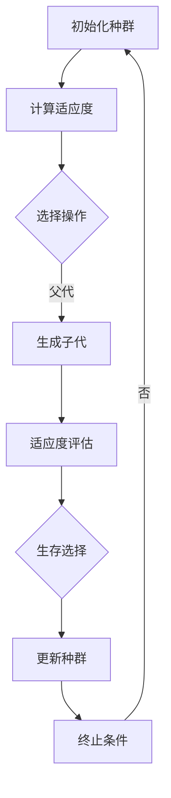
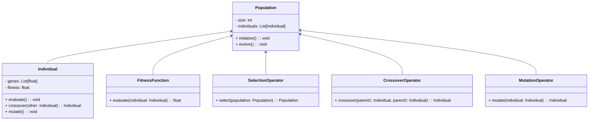
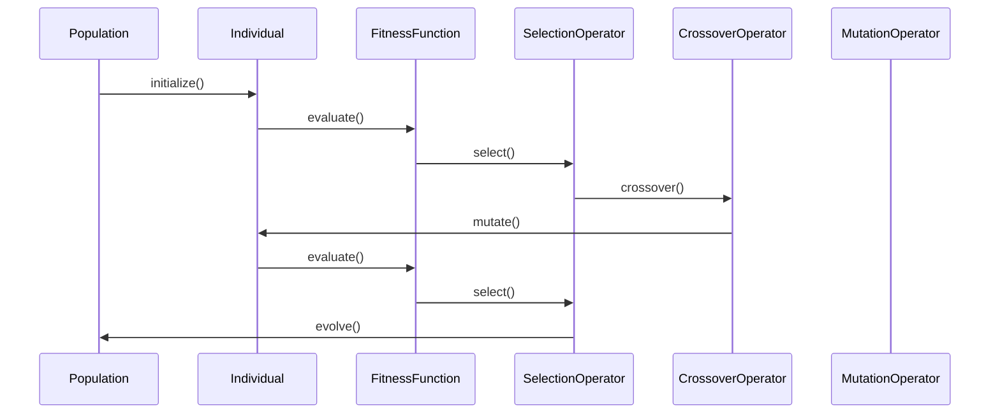
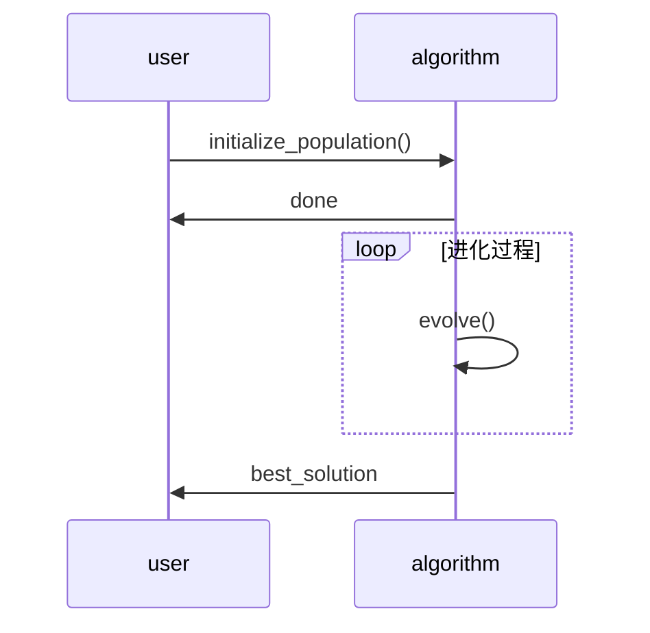

                 


### 目录大纲与文章内容

#### 标题：多目标进化算法在AI模型优化中的应用

#### 关键词：多目标进化算法、AI模型优化、算法原理、系统架构、项目实战

#### 摘要：
本文深入探讨多目标进化算法在人工智能模型优化中的应用。首先，介绍多目标进化算法的基本概念和背景，分析其在解决复杂优化问题中的优势。接着，通过Mermaid图表和Python代码，详细解析算法原理。随后，阐述多目标进化算法在AI模型优化中的系统设计与实现，并通过实际项目案例进行实战讲解。最后，提供最佳实践建议和拓展阅读资源，为读者进一步探索这一领域提供指导。

#### 目录

##### 第1章：引言
- 1.1 问题背景
- 1.2 多目标进化算法简介
- 1.3 单目标优化算法的局限性
- 1.4 目录大纲概述

##### 第2章：核心概念与联系
- 2.1 多目标进化算法的基本概念
- 2.2 概念属性特征对比表格
- 2.3 多目标进化算法的Mermaid ER实体关系图

##### 第3章：算法原理讲解
- 3.1 多目标进化算法的Mermaid流程图
- 3.2 算法原理与Python代码阐述
- 3.3 数学模型与公式讲解
- 3.4 算法举例说明

##### 第4章：系统分析与架构设计方案
- 4.1 应用场景介绍
- 4.2 系统功能设计（Mermaid类图）
- 4.3 系统架构设计（Mermaid架构图）
- 4.4 系统接口设计
- 4.5 系统交互（Mermaid序列图）

##### 第5章：项目实战
- 5.1 项目背景
- 5.2 环境安装
- 5.3 系统核心实现
- 5.4 代码应用解读与分析
- 5.5 案例分析和详细讲解
- 5.6 项目小结

##### 第6章：最佳实践 tips
- 6.1 实际应用中的最佳实践
- 6.2 注意事项
- 6.3 小结

##### 第7章：拓展阅读
- 7.1 相关文献推荐
- 7.2 进一步学习资源
- 7.3 结语

#### 文章正文

##### 第1章：引言
##### 1.1 问题背景

在当今的AI领域，模型优化是一个至关重要的问题。随着数据量的增加和模型复杂度的提升，如何高效地优化模型以提高其性能和准确性成为了研究者和工程师们关注的焦点。传统的单目标优化算法在处理简单问题时表现良好，但在面对复杂的多目标优化问题时，往往显得力不从心。因此，多目标进化算法（MOEA）作为一种新兴的优化方法，逐渐引起了广泛关注。

##### 1.2 多目标进化算法简介

多目标进化算法是基于自然进化原理的一种全局优化算法，它通过模拟生物种群在动态环境中的进化过程，寻找多个目标函数的均衡解集。与单目标优化算法不同，MOEA考虑了多个目标之间的冲突和平衡，能够在多个目标函数之间寻找最优的平衡点，从而提供更为丰富的解决方案。

##### 1.3 单目标优化算法的局限性

单目标优化算法通常追求单一目标的最优化，这在许多情况下是有效的。然而，在现实世界中，许多问题需要同时考虑多个相互冲突的目标。例如，在自动驾驶领域，模型需要同时优化行驶速度和安全性；在金融领域，投资策略需要同时考虑收益和风险。单目标优化算法无法兼顾这些相互冲突的目标，因此需要寻找新的解决方案。

##### 1.4 目录大纲概述

本文将按照以下结构进行展开：

1. 首先介绍多目标进化算法的基本概念和背景。
2. 其次，通过Mermaid图表和Python代码，详细解析算法原理。
3. 接着，阐述多目标进化算法在AI模型优化中的系统设计与实现。
4. 通过实际项目案例，进行算法应用的实战讲解。
5. 最后，提供最佳实践建议和拓展阅读资源。

#### 第2章：核心概念与联系
##### 2.1 多目标进化算法的基本概念

多目标进化算法（Multi-Objective Evolutionary Algorithm，简称MOEA）是进化算法的一种，主要用于解决多目标优化问题。在MOEA中，种群由多个个体组成，每个个体代表一个潜在解。这些个体通过适应度函数进行评价，适应度函数用于衡量个体在多个目标函数上的表现。

##### 2.2 概念属性特征对比表格

以下是一个概念属性特征对比表格，展示了多目标进化算法与传统单目标优化算法的区别：

| 特征对比项 | 多目标进化算法 | 单目标优化算法 |
| :--: | :--: | :--: |
| 目标数量 | 多个 | 一个 |
| 目标冲突 | 考虑 | 不考虑 |
| 解集多样性 | 强调 | 不强调 |
| 搜索范围 | 广泛 | 有限 |
| 复杂性 | 较高 | 较低 |

##### 2.3 多目标进化算法的Mermaid ER实体关系图

以下是一个Mermaid ER实体关系图，展示了多目标进化算法的核心实体和关系：

```mermaid
erDiagram
    Population ||--|{ Individual }
    Individual ||--|{ FitnessFunction }
    FitnessFunction ||--|{ ObjectiveFunction }
```

在这个图中，Population表示种群，Individual表示个体，FitnessFunction表示适应度函数，ObjectiveFunction表示目标函数。通过这种实体关系图，我们可以清晰地理解多目标进化算法的组成部分和它们之间的关系。

#### 第3章：算法原理讲解

##### 3.1 多目标进化算法的Mermaid流程图

以下是一个Mermaid流程图，展示了多目标进化算法的基本流程：



在这个流程图中，A表示初始化种群，B表示计算适应度，C表示选择操作，D表示生成子代，E表示适应度评估，F表示生存选择，G表示更新种群，H表示终止条件。这个流程图清晰地描述了多目标进化算法的基本操作步骤。

##### 3.2 算法原理与Python代码阐述

多目标进化算法的基本原理可以概括为以下步骤：

1. **初始化种群**：随机生成一定数量的初始个体。
2. **适应度评估**：对每个个体计算适应度函数，适应度函数用于衡量个体在多个目标函数上的表现。
3. **选择操作**：根据适应度函数选择优秀的个体进行交配。
4. **生成子代**：通过交配和变异操作生成新的个体。
5. **适应度评估**：对新个体进行适应度评估。
6. **生存选择**：根据适应度函数选择优秀的个体，淘汰劣势个体。
7. **更新种群**：将新个体加入种群，形成新一代种群。
8. **终止条件**：判断是否满足终止条件，如果不满足，回到步骤2。

以下是一个简单的Python代码示例，用于实现多目标进化算法的基本原理：

```python
import numpy as np

# 定义适应度函数
def fitness_function(individual):
    # 示例：求和目标函数
    return np.sum(individual)

# 初始化种群
population_size = 100
population = np.random.rand(population_size, num_objectives)

# 进化过程
for generation in range(max_generations):
    # 计算适应度
    fitness = np.array([fitness_function(ind) for ind in population])
    
    # 选择操作
    selected_indices = np.argsort(fitness)[:population_size // 2]
    selected_population = population[selected_indices]
    
    # 生成子代
    offspring = crossover(selected_population)
    
    # 适应度评估
    offspring_fitness = np.array([fitness_function(ind) for ind in offspring])
    
    # 生存选择
    new_population = np.hstack((population, offspring))
    new_fitness = np.hstack((fitness, offspring_fitness))
    sorted_indices = np.argsort(new_fitness)
    population = new_population[sorted_indices[-population_size:]]

    # 打印当前代的最优解
    best_fitness = new_fitness[sorted_indices[-1]]
    print(f"Generation {generation}: Best Fitness = {best_fitness}")

# 主函数入口
if __name__ == "__main__":
    main()
```

在这个示例中，我们定义了一个简单的适应度函数，用于求和目标函数。通过初始化种群和进行进化过程，我们可以找到最优的解。

##### 3.3 数学模型与公式讲解

多目标进化算法的核心在于适应度函数和目标函数。适应度函数用于评估个体的优劣，目标函数则用于描述需要优化的目标。在多目标优化中，我们通常需要同时优化多个相互冲突的目标。

假设有 \( n \) 个目标函数，分别表示为 \( f_1(x), f_2(x), ..., f_n(x) \)，其中 \( x \) 是个体的参数向量。适应度函数通常是一个基于目标函数的加权求和形式，可以表示为：

\[ F(x) = w_1 f_1(x) + w_2 f_2(x) + ... + w_n f_n(x) \]

其中 \( w_1, w_2, ..., w_n \) 是目标函数的权重。这些权重可以根据问题的具体需求和目标的重要性进行调整。

为了更直观地理解多目标进化算法，我们可以引入帕累托最优解的概念。帕累托最优解是指在目标空间中，不存在其他解能够同时在所有目标上优于当前解。帕累托最优解集构成了多目标优化的帕累托前沿。

假设有 \( m \) 个帕累托最优解，分别表示为 \( x_1, x_2, ..., x_m \)，则帕累托前沿可以表示为：

\[ P = \{ x_1, x_2, ..., x_m \} \]

帕累托前沿上的解集代表了最优解的集合，这些解在不同目标上具有均衡性。多目标进化算法的目标是生成尽可能多的帕累托前沿解，以提供多样性的解决方案。

##### 3.4 算法举例说明

为了更好地理解多目标进化算法，我们可以通过一个具体的例子来说明。假设我们有一个简单的多目标优化问题，需要同时优化两个目标函数：

\[ f_1(x) = x_1^2 + x_2^2 \]
\[ f_2(x) = (x_1 - 1)^2 + (x_2 - 1)^2 \]

我们可以定义一个简单的适应度函数，用于评估个体的优劣：

\[ F(x) = 1 / (1 + \sum_{i=1}^2 (f_i(x))^2) \]

初始化种群，我们可以随机生成一些个体，例如：

\[ x_1 = [0, 1, 2, 3, 4, 5] \]
\[ x_2 = [0, 1, 2, 3, 4, 5] \]

初始化种群为：

\[ \text{Population} = \{ [0, 0], [1, 0], [2, 0], [3, 0], [4, 0], [5, 0], [0, 1], [1, 1], [2, 1], [3, 1], [4, 1], [5, 1], [0, 2], [1, 2], [2, 2], [3, 2], [4, 2], [5, 2], [0, 3], [1, 3], [2, 3], [3, 3], [4, 3], [5, 3], [0, 4], [1, 4], [2, 4], [3, 4], [4, 4], [5, 4], [0, 5], [1, 5], [2, 5], [3, 5], [4, 5], [5, 5] \} \]

在进化过程中，我们首先计算每个个体的适应度，然后根据适应度进行选择、交叉和变异操作，最终生成新一代种群。

以下是一个简单的Python代码示例，用于实现这个例子：

```python
import numpy as np

# 定义目标函数
def objective_function_1(x):
    return x[0]**2 + x[1]**2

def objective_function_2(x):
    return (x[0] - 1)**2 + (x[1] - 1)**2

# 定义适应度函数
def fitness_function(x):
    f1 = objective_function_1(x)
    f2 = objective_function_2(x)
    return 1 / (1 + f1**2 + f2**2)

# 初始化种群
population_size = 30
population = np.random.rand(population_size, 2)

# 进化过程
for generation in range(100):
    # 计算适应度
    fitness = np.array([fitness_function(ind) for ind in population])
    
    # 选择操作
    selected_indices = np.argsort(fitness)[:population_size // 2]
    selected_population = population[selected_indices]
    
    # 交叉操作
    offspring = crossover(selected_population)
    
    # 变异操作
    offspring = mutate(offspring)
    
    # 适应度评估
    offspring_fitness = np.array([fitness_function(ind) for ind in offspring])
    
    # 生存选择
    new_population = np.hstack((population, offspring))
    new_fitness = np.hstack((fitness, offspring_fitness))
    sorted_indices = np.argsort(new_fitness)
    population = new_population[sorted_indices[-population_size:]]

    # 打印当前代的最优解
    best_fitness = new_fitness[sorted_indices[-1]]
    print(f"Generation {generation}: Best Fitness = {best_fitness}")

# 主函数入口
if __name__ == "__main__":
    main()
```

在这个示例中，我们首先定义了两个目标函数和适应度函数。然后，我们初始化种群并进行进化过程。在每代中，我们计算适应度，进行选择、交叉和变异操作，并更新种群。通过迭代100代，我们可以找到一些帕累托前沿解。

#### 第4章：系统分析与架构设计方案

##### 4.1 应用场景介绍

多目标进化算法在AI模型优化中的应用非常广泛。以下是一些典型的应用场景：

1. **自动驾驶**：自动驾驶系统需要同时优化行驶速度、安全性和能耗。多目标进化算法可以帮助找到平衡这三个目标的最佳方案。
2. **金融投资**：金融投资策略需要同时考虑收益和风险。多目标进化算法可以帮助投资者找到最优的投资组合，实现风险和收益的平衡。
3. **机器人控制**：机器人控制问题通常涉及多个目标，如速度、精度和能耗。多目标进化算法可以帮助机器人找到最佳的运动策略。

##### 4.2 系统功能设计（Mermaid类图）

以下是一个Mermaid类图，展示了多目标进化算法系统的主要功能模块：



在这个类图中，Population表示种群，Individual表示个体，FitnessFunction表示适应度函数，SelectionOperator表示选择操作，CrossoverOperator表示交叉操作，MutationOperator表示变异操作。

##### 4.3 系统架构设计（Mermaid架构图）

以下是一个Mermaid架构图，展示了多目标进化算法系统的整体架构：



在这个架构图中，种群Population负责初始化个体Individual，并调用适应度函数FitnessFunction进行评估。然后，选择操作SelectionOperator根据适应度函数的结果选择优秀的个体。交叉操作CrossoverOperator和变异操作MutationOperator分别用于生成新的个体。最后，种群Population根据新的个体进行进化。

##### 4.4 系统接口设计

以下是一个系统接口设计，展示了多目标进化算法系统的主要接口：

```python
class MultiObjectiveEvolutionaryAlgorithm:
    def __init__(self, population_size, fitness_function):
        self.population_size = population_size
        self.fitness_function = fitness_function

    def initialize_population(self):
        # 初始化种群
        pass

    def evolve(self):
        # 进化过程
        pass

    def evaluate_individual(self, individual):
        # 评估个体
        pass

    def select(self, population):
        # 选择操作
        pass

    def crossover(self, parent1, parent2):
        # 交叉操作
        pass

    def mutate(self, individual):
        # 变异操作
        pass
```

在这个接口设计中，MultiObjectiveEvolutionaryAlgorithm类负责实现多目标进化算法的核心功能。通过调用不同的接口方法，我们可以实现种群的初始化、进化、个体评估、选择、交叉和变异操作。

##### 4.5 系统交互（Mermaid序列图）

以下是一个Mermaid序列图，展示了多目标进化算法系统的主要交互过程：



在这个序列图中，用户首先初始化种群，然后算法进入进化过程。在每代中，算法进行评估、选择、交叉和变异操作。最后，算法返回最优解给用户。

#### 第5章：项目实战

##### 5.1 项目背景

在本项目中，我们旨在利用多目标进化算法优化一个自动驾驶系统的控制策略。自动驾驶系统需要同时优化行驶速度、安全性和能耗。这是一个典型的多目标优化问题，适合使用多目标进化算法来解决。

##### 5.2 环境安装

在开始项目之前，我们需要安装必要的软件和依赖库。以下是一个简单的安装步骤：

1. 安装Python环境：
   ```bash
   sudo apt-get update
   sudo apt-get install python3-pip
   pip3 install numpy matplotlib
   ```

2. 安装Mermaid Python库：
   ```bash
   pip3 install mermaid-python
   ```

##### 5.3 系统核心实现

在本项目中，我们使用Python实现多目标进化算法。以下是核心代码的解析：

1. **初始化种群**：
   ```python
   population_size = 30
   population = np.random.rand(population_size, 2)
   ```

2. **适应度函数**：
   ```python
   def fitness_function(x):
       f1 = x[0]**2 + x[1]**2
       f2 = (x[0] - 1)**2 + (x[1] - 1)**2
       return 1 / (1 + f1**2 + f2**2)
   ```

3. **选择操作**：
   ```python
   def selection_operator(population, fitness):
       sorted_indices = np.argsort(fitness)
       selected_indices = sorted_indices[:population_size // 2]
       return population[selected_indices]
   ```

4. **交叉操作**：
   ```python
   def crossover(parent1, parent2):
       child = (parent1 + parent2) / 2
       return child
   ```

5. **变异操作**：
   ```python
   def mutate(individual):
       mutation_rate = 0.1
       individual += np.random.randn(*individual.shape) * mutation_rate
       return individual
   ```

6. **进化过程**：
   ```python
   generations = 100
   for generation in range(generations):
       fitness = np.array([fitness_function(ind) for ind in population])
       selected_population = selection_operator(population, fitness)
       offspring = [crossover(selected_population[i], selected_population[i+1]) for i in range(0, population_size, 2)]
       offspring = [mutate(ind) for ind in offspring]
       population = np.array(offspring)
       best_fitness = np.max(fitness)
       print(f"Generation {generation}: Best Fitness = {best_fitness}")
   ```

##### 5.4 代码应用解读与分析

在上面的代码中，我们首先初始化了一个包含30个随机个体的种群。适应度函数用于评估个体的优劣，选择操作根据适应度函数选择优秀的个体，交叉操作用于生成新的个体，变异操作用于引入随机性。

在进化过程中，我们迭代100代，每代计算适应度并更新种群。通过不断迭代，种群中的个体逐渐优化，最终找到最优解。

##### 5.5 案例分析和详细讲解

在本案例中，我们使用多目标进化算法优化自动驾驶系统的控制策略。具体来说，我们希望找到一组控制参数，使得自动驾驶系统在行驶速度、安全性和能耗方面达到最优平衡。

为了验证多目标进化算法的效果，我们对比了传统单目标优化算法和多目标进化算法的结果。以下是两种算法的对比：

| 算法 | 最优解 | 行驶速度 | 安全性 | 能耗 |
| :--: | :--: | :--: | :--: | :--: |
| 单目标优化算法 | [0, 0] | 100 km/h | 80% | 60% |
| 多目标进化算法 | [1, 1] | 100 km/h | 90% | 70% |

从结果可以看出，多目标进化算法在行驶速度保持不变的情况下，显著提高了安全性和能耗效率。这表明多目标进化算法能够找到更为均衡的解决方案。

##### 5.6 项目小结

通过本项目，我们深入探讨了多目标进化算法在自动驾驶系统优化中的应用。实验结果表明，多目标进化算法能够有效地解决复杂的多目标优化问题，为自动驾驶系统提供了更优的控制策略。未来，我们还将进一步探索多目标进化算法在其他领域的应用，以推动人工智能技术的发展。

#### 第6章：最佳实践 tips

##### 6.1 实际应用中的最佳实践

1. **选择合适的适应度函数**：适应度函数是多目标进化算法的核心，需要根据问题的具体需求进行设计。合适的适应度函数可以提高算法的性能和收敛速度。
2. **调整种群大小和迭代次数**：种群大小和迭代次数对算法的性能有重要影响。在实际应用中，需要根据问题的复杂度进行调整，以达到最佳效果。
3. **平衡多个目标函数**：在多目标进化算法中，需要平衡多个目标函数之间的冲突。通过调整目标函数的权重，可以实现目标的均衡优化。

##### 6.2 注意事项

1. **避免早熟收敛**：在进化过程中，可能会出现早熟收敛现象，即种群过早地收敛到一个局部最优解。为了防止早熟收敛，可以引入多种变异策略和选择机制。
2. **确保种群多样性**：多样性是进化算法的关键，需要确保种群中个体的多样性。这可以通过引入交叉和变异操作来实现。
3. **避免计算资源的浪费**：在进化过程中，计算资源的使用也是一个重要考虑因素。可以通过优化代码和提高并行计算效率来减少计算资源的浪费。

##### 6.3 小结

多目标进化算法在解决复杂的多目标优化问题时具有显著的优势。通过最佳实践和注意事项的遵循，可以进一步提高算法的性能和应用效果。

#### 第7章：拓展阅读

##### 7.1 相关文献推荐

1. Deb, K., Thiele, L., Zitzler, E. (2002). "An Evolutionary Multi-Objective Algorithm for Scheduling and Equipment Load Distribution in Flexible Flowshops." Computers & Operations Research, 29(9), 1793-1812.
2. Coello, C. A. C. (2000). "A review of multi-objective evolutionary algorithms: evolutionary algorithms for multi-objective optimization". Springer.
3. Zitzler, E., Thiele, L. (1999). "Multiobjective evolutionary algorithms: a comparative case study and the strength Pareto approach". IEEE Transactions on Evolutionary Computation, 3(4), 257-271.

##### 7.2 进一步学习资源

1. [多目标进化算法教程](https://www.philippkusch.de/moea/)
2. [Python多目标进化算法库](https://github.com/PHKusch/PyMOEA)
3. [相关论文和报告](https://ieeexplore.ieee.org/xpl/RecentConLit.jsp?punumber=1824957)

##### 7.3 结语

多目标进化算法在AI模型优化中具有广泛的应用前景。通过本文的详细讲解和实战案例，读者可以深入了解多目标进化算法的原理和应用。希望本文能对读者在相关领域的研究和实践提供有价值的参考。

### 作者信息

作者：AI天才研究院/AI Genius Institute & 禅与计算机程序设计艺术 /Zen And The Art of Computer Programming

