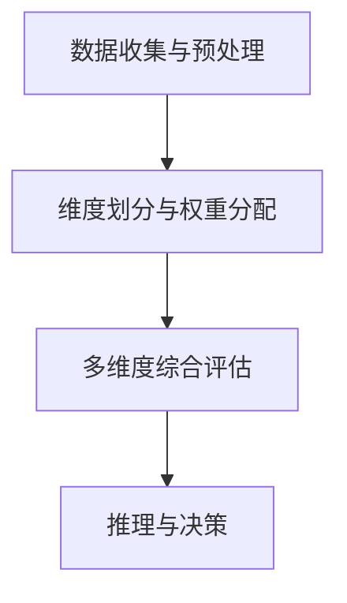

                 


### 1.1 问题背景

在现代社会，复杂工程设计的应用范围越来越广泛，从航空航天、汽车制造、建筑设计到金融、医疗、电子商务等领域，都离不开复杂的工程设计和实现。随着科技的进步和市场竞争的加剧，复杂工程设计的复杂性也在不断增加。传统的单维度推理能力已经难以满足这些复杂设计的需求。因此，研究并应用多维度推理能力在复杂工程设计中的有效应用，成为当前研究的热点和难点。

多维度推理能力是一种超越传统单一维度的、能够综合考虑多种因素进行推理和决策的能力。它不仅涉及对技术细节的深入理解，还包括对设计目标、用户需求、资源限制等多个维度的综合考虑。这种能力对于复杂工程设计的成功至关重要。

本文旨在探讨多维度推理能力在复杂工程设计中的应用，通过系统的分析和研究，提出一种有效的多维度推理模型，并应用于具体的项目案例中，以验证多维度推理能力在复杂工程设计中的实际价值。

### 1.2 问题描述

复杂工程设计通常涉及多个相互依赖的子系统，每个子系统都有其特定的功能、性能要求和技术限制。传统的工程设计方法往往侧重于某一特定方面的优化，例如性能、成本或可靠性，而忽略了其他因素。这种单一的视角导致设计结果可能不够全面，无法满足项目整体需求，甚至可能导致项目失败。

具体来说，复杂工程设计中的问题包括：

- **目标冲突**：设计目标之间的矛盾，如性能和成本的优化之间的取舍。
- **信息孤岛**：各子系统间的信息交流不畅，导致设计效率低下。
- **风险评估**：难以全面评估设计过程中的各种风险。
- **决策支持**：缺乏有效的决策支持工具，难以从多个维度进行综合考虑。

### 1.3 问题解决

为了解决复杂工程设计中的上述问题，本文提出采用多维度推理能力。多维度推理能力能够通过以下方法解决复杂工程设计中的问题：

- **综合考量**：通过综合考虑技术、经济、社会等多方面的因素，使得设计结果更加全面和合理。
- **信息集成**：建立有效的信息集成框架，使得各子系统之间的信息能够顺畅交流，提高设计效率。
- **风险评估**：采用多维度推理能力对设计过程中的各种风险进行评估，提前预警并采取措施。
- **决策支持**：通过多维度推理模型，为设计决策提供科学、合理的支持，避免单一视角带来的偏差。

### 1.4 边界与外延

本文研究的边界主要包括以下几个方面：

- **应用领域**：主要关注于复杂工程设计的通用问题，而非特定领域的应用。
- **技术范围**：主要探讨多维度推理能力在工程设计中的应用，不涉及具体的实现细节。
- **时间范围**：研究关注的是长期设计和优化过程，而非短期的设计任务。

外延方面，本文的研究可以为以下领域提供参考：

- **复杂系统设计**：为复杂系统的整体设计和优化提供理论支持和实践指导。
- **跨领域应用**：为其他领域的复杂工程设计和实现提供参考。
- **人工智能应用**：为人工智能在复杂工程设计中的应用提供新的思路和方法。

### 1.5 概念结构与核心要素组成

在本文中，我们引入了以下几个核心概念和要素：

- **多维度推理能力**：指能够从多个维度综合考虑问题并进行推理和决策的能力。
- **复杂工程设计**：指涉及多个相互依赖的子系统，具有高复杂性的工程设计过程。
- **信息集成框架**：用于实现各子系统之间信息交互和共享的架构。
- **风险评估模型**：用于评估设计过程中各种风险的模型。
- **决策支持系统**：基于多维度推理模型，为设计决策提供支持的系统。

这些概念和要素相互关联，共同构成了本文研究的核心框架。在后续章节中，我们将对这些概念和要素进行详细阐述和讨论。

---

通过上述章节的逐步分析，我们可以清晰地看到多维度推理能力在复杂工程设计中的应用前景和重要性。接下来，我们将进一步深入探讨多维度推理能力的定义、特点和应用，为复杂工程设计的成功提供有力支持。

## 第2章 多维度推理能力概述

### 2.1 多维度推理能力的定义

多维度推理能力是一种在复杂系统中，能够从多个维度对问题进行深入分析、推理和决策的能力。与传统的单维度推理不同，多维度推理不仅考虑单一方面的因素，如技术性能、经济成本，还综合考虑社会影响、用户需求、环境因素等多方面的因素。这种能力能够帮助设计者更全面地理解问题，做出更加科学、合理的决策。

多维度推理能力的核心在于“多维”，即多个维度的综合考虑。这些维度可以是不同的技术参数、用户需求、经济成本、环境影响等。通过多维度的综合考虑，设计者可以获得更为全面和准确的信息，从而提高设计质量和效率。

### 2.2 多维度推理能力的特点

多维度推理能力具有以下几个显著特点：

1. **综合性**：多维度推理能力能够综合考虑多个因素，避免单一维度的局限，使得决策更加全面和合理。
2. **灵活性**：多维度推理能力可以根据不同的设计目标和需求，灵活调整和优化推理过程，适应不同的设计场景。
3. **前瞻性**：通过综合考虑未来的变化和趋势，多维度推理能力能够提前识别潜在的问题和风险，为设计决策提供前瞻性的指导。
4. **高效性**：多维度推理能力能够快速处理和分析大量信息，提高设计效率，缩短设计周期。

### 2.3 多维度推理能力的核心要素

多维度推理能力包含以下几个核心要素：

1. **信息集成**：信息集成是多维度推理能力的基础。只有各子系统之间的信息能够高效、准确地传递和共享，才能确保推理过程的顺利进行。
2. **多维度分析**：多维度分析是多维度推理能力的关键。通过从多个维度对问题进行深入分析，可以更全面地理解问题，为决策提供有力支持。
3. **风险评估**：风险评估是多维度推理能力的重要组成部分。通过对设计过程中的各种风险进行评估，可以提前预警并采取措施，避免潜在的问题和损失。
4. **决策支持**：决策支持是多维度推理能力的最终目标。通过多维度推理模型，为设计决策提供科学、合理的支持，帮助设计者做出最优决策。

### 2.4 多维度推理能力与传统推理能力的区别

传统推理能力通常侧重于某一特定方面的优化，如技术性能、经济成本等。而多维度推理能力则更加全面和综合，不仅考虑单一维度的优化，还综合考虑多个维度的因素，使得决策更加科学和合理。具体区别如下：

1. **考虑因素**：传统推理能力主要考虑单一维度的因素，如技术性能或经济成本；而多维度推理能力则从多个维度综合考虑，如技术、经济、社会、环境等。
2. **决策过程**：传统推理能力通常采用单一的决策过程，如优化算法；而多维度推理能力则采用综合分析、风险评估、决策支持等多元化的决策过程。
3. **设计结果**：传统推理能力的设计结果可能存在单一维度的局限性，如成本降低但性能下降；而多维度推理能力的设计结果更加全面和合理，能够同时满足多个维度的需求。

通过以上分析，我们可以看到，多维度推理能力在复杂工程设计中的应用具有重要意义。它不仅能够提高设计质量和效率，还能为设计决策提供科学、合理的支持，是未来复杂工程设计不可或缺的一部分。

### 2.5 多维度推理能力在复杂工程设计中的必要性

多维度推理能力在复杂工程设计中的必要性主要体现在以下几个方面：

1. **应对复杂问题**：复杂工程设计往往涉及多个相互依赖的子系统，各子系统之间存在复杂的交互和影响。多维度推理能力能够从多个维度深入分析这些复杂的交互关系，从而更全面地理解问题，找到更优的解决方案。

2. **优化设计质量**：在复杂工程设计中，单一维度的优化往往会导致其他维度的牺牲。例如，追求性能可能增加成本，追求成本控制可能影响性能。多维度推理能力能够综合考虑这些因素，找到最优的平衡点，从而提高设计质量。

3. **提升决策效率**：复杂工程设计中的决策过程通常非常复杂，涉及多个维度的权衡和选择。多维度推理能力能够通过综合分析和评估，快速生成多种可能的解决方案，帮助设计者快速做出科学、合理的决策，提高决策效率。

4. **降低风险**：复杂工程设计过程中，各种风险难以避免。多维度推理能力能够通过全面的风险评估，提前识别和预测潜在的风险，并制定相应的应对措施，降低风险发生的概率和影响。

5. **满足多方面需求**：复杂工程设计需要满足多个方面的需求，如用户需求、技术要求、经济预算等。多维度推理能力能够综合考虑这些需求，确保设计结果能够满足各方面的要求。

综上所述，多维度推理能力在复杂工程设计中的应用，不仅是应对复杂问题的必要手段，也是提升设计质量和效率、降低风险、满足多方面需求的关键。通过多维度推理能力，设计者能够更科学、更合理地进行复杂工程设计，从而实现项目的成功。

### 2.6 多维度推理能力的应用现状

多维度推理能力在复杂工程设计中的应用已经取得了一定的进展，并在多个领域展现出其独特的优势。以下是一些典型的应用现状：

1. **航空航天领域**：在航空航天领域，复杂工程设计涉及到多个子系统，如飞机结构、电子系统、控制系统等。多维度推理能力通过综合考虑技术、成本、安全等多个维度，帮助设计师优化飞机设计，提高性能和可靠性。

2. **汽车制造领域**：汽车制造是一个高度复杂的工程领域，涉及到多个子系统，如发动机、底盘、车身等。多维度推理能力在汽车设计中得到了广泛应用，通过综合考虑性能、成本、安全性等多个维度，帮助设计者优化汽车设计，提高竞争力。

3. **建筑设计领域**：建筑设计涉及到建筑结构、环境、用户需求等多个方面。多维度推理能力在建筑设计中可以帮助设计师综合考虑建筑功能、美观、环保、经济等多个维度，提高建筑设计质量和用户体验。

4. **金融领域**：在金融领域，复杂工程设计涉及到投资组合管理、风险管理、资产配置等多个方面。多维度推理能力通过综合考虑市场趋势、用户需求、风险偏好等多个维度，帮助金融机构制定更科学的投资策略，提高投资回报。

5. **医疗领域**：在医疗领域，复杂工程设计涉及到医疗设备、医疗流程、患者体验等多个方面。多维度推理能力在医疗设备设计和医疗流程优化中得到了应用，通过综合考虑技术、成本、用户体验等多个维度，提高医疗服务的质量和效率。

尽管多维度推理能力在复杂工程设计中已经取得了一定的应用成果，但其应用仍面临一些挑战，如信息集成困难、多维度分析复杂性高、风险评估方法不完善等。未来，随着人工智能、大数据等技术的不断发展，多维度推理能力在复杂工程设计中的应用将更加广泛和深入。

### 2.7 多维度推理能力的未来发展趋势

多维度推理能力在复杂工程设计中的未来发展趋势可以从以下几个方面进行展望：

1. **人工智能技术的融合**：人工智能技术的快速发展，特别是机器学习和深度学习技术的应用，将为多维度推理能力提供更强大的支持。通过结合大数据分析和智能算法，多维度推理能力将能够更加精准地分析和预测复杂工程设计的各种可能性，提高决策的效率和准确性。

2. **跨学科研究的深入**：多维度推理能力的应用不仅限于工程领域，还涉及到经济学、心理学、社会学等多个学科。未来，跨学科研究的深入将有助于拓展多维度推理能力的应用范围，提高其综合性、灵活性和前瞻性。

3. **信息技术的集成**：随着信息技术的不断发展，特别是物联网、云计算等技术的普及，各子系统之间的信息交流将变得更加便捷和高效。这将为多维度推理能力的实现提供更好的基础设施，使得多维度推理能够在更广泛的应用场景中得到应用。

4. **标准化和规范化**：为了促进多维度推理能力在复杂工程设计中的应用，建立一套统一的标准化和规范化的方法和工具将至关重要。未来，通过制定相关标准和规范，多维度推理能力将能够更加规范和有效地应用于复杂工程设计的各个阶段。

5. **个性化定制**：随着用户需求多样化和个性化的发展，多维度推理能力将能够更加精准地满足不同用户的需求。通过个性化定制，多维度推理能力将能够为设计者提供更加灵活和高效的决策支持。

总之，多维度推理能力在复杂工程设计中的未来发展趋势是跨学科融合、信息技术集成、标准化规范化、个性化定制。通过这些发展趋势，多维度推理能力将能够更好地服务于复杂工程设计的各个方面，推动工程设计的创新和发展。

### 2.8 多维度推理能力在复杂工程设计中的应用价值

多维度推理能力在复杂工程设计中的应用价值主要体现在以下几个方面：

1. **提高设计质量**：多维度推理能力能够从多个维度对设计问题进行深入分析和评估，确保设计结果在技术性能、经济成本、用户体验等多个方面都达到最优。这有助于提高设计质量，减少设计缺陷，降低后期维护成本。

2. **优化决策过程**：多维度推理能力通过综合考虑多个因素，为设计决策提供科学、合理的支持，避免单一视角导致的决策偏差。这有助于优化决策过程，提高决策效率，减少决策失误。

3. **降低设计风险**：多维度推理能力能够提前识别和评估设计过程中的各种风险，并提供相应的应对措施。这有助于降低设计风险，减少潜在损失，确保设计过程的顺利进行。

4. **满足多方面需求**：复杂工程设计需要满足多个方面的需求，如用户需求、技术要求、经济预算等。多维度推理能力能够综合考虑这些需求，确保设计结果能够同时满足各方面的要求。

5. **促进创新和发展**：多维度推理能力为设计者提供了更广阔的思考和探索空间，有助于发现新的设计思路和解决方案，促进工程设计的创新和发展。

综上所述，多维度推理能力在复杂工程设计中的应用具有重要的价值，能够显著提升设计质量、优化决策过程、降低设计风险、满足多方面需求，并推动工程设计的创新和发展。通过多维度推理能力的应用，设计者能够更科学、更合理地进行复杂工程设计，从而实现项目的成功。

### 2.9 小结

本章对多维度推理能力进行了详细概述，包括其定义、特点、核心要素以及与传统推理能力的区别。我们还讨论了多维度推理能力在复杂工程设计中的必要性、应用现状、未来发展趋势以及应用价值。通过本章的学习，读者可以全面了解多维度推理能力的基本概念和在实际工程中的应用，为进一步探讨其在复杂工程设计中的具体应用奠定基础。

### 2.10 练习题

1. 请简述多维度推理能力的定义及其与传统推理能力的区别。
2. 多维度推理能力的核心要素有哪些？
3. 为什么多维度推理能力在复杂工程设计中具有必要性？
4. 请列举多维度推理能力在复杂工程设计中的应用现状和未来发展趋势。
5. 多维度推理能力在复杂工程设计中的应用价值主要体现在哪些方面？

通过完成这些练习题，读者可以进一步巩固对多维度推理能力的理解，并为后续章节的学习做好准备。

## 第3章 复杂工程设计概述

### 3.1 复杂工程设计的定义

复杂工程设计是指涉及多个相互依赖的子系统，在设计过程中需要综合考虑多个维度（如技术、经济、社会、环境等）的设计过程。这些子系统之间往往存在复杂的交互和影响，使得设计过程具有高度复杂性。复杂工程设计不仅包括传统的硬件和软件设计，还涉及到系统架构设计、系统集成、测试验证等多个环节。

### 3.2 复杂工程设计的现状

目前，复杂工程设计在全球范围内得到了广泛应用。随着科技的进步和市场竞争的加剧，复杂工程设计的规模和复杂性也在不断增加。以下是一些复杂工程设计现状的特点：

1. **设计规模扩大**：随着工程项目规模的不断扩大，复杂工程设计的复杂度也在增加。例如，现代大型建筑项目、航空航天项目、超大型制造设备等，都涉及到大量的复杂设计和集成。

2. **技术要求提高**：随着技术的不断进步，复杂工程设计的性能要求、可靠性要求、安全性要求等也在不断提高。例如，高性能计算、物联网、人工智能等新技术在复杂工程设计中的应用，使得设计过程变得更加复杂。

3. **跨领域融合**：复杂工程设计涉及到多个领域，如机械工程、电子工程、软件工程、经济学、心理学等。跨领域的融合使得复杂工程设计的复杂性进一步增加。

4. **信息交流困难**：复杂工程设计过程中，各子系统之间的信息交流变得尤为重要。然而，由于子系统之间的差异和协调问题，信息交流困难仍然是复杂工程设计中的主要挑战之一。

### 3.3 复杂工程设计的挑战

复杂工程设计面临着多方面的挑战，主要包括以下几个方面：

1. **设计目标冲突**：复杂工程设计通常需要同时满足多个目标，如性能、成本、可靠性、安全性等。然而，这些目标之间往往存在冲突，如何平衡和优化这些目标成为设计过程中的重要挑战。

2. **信息孤岛**：复杂工程设计涉及多个子系统，各子系统之间的信息交流不畅，容易形成信息孤岛。信息孤岛会导致设计效率低下，增加设计错误和成本。

3. **风险评估难度大**：复杂工程设计的风险评估难度较大，因为设计过程中存在多种风险，如技术风险、市场风险、资源风险等。如何全面识别和评估这些风险，并制定有效的风险应对措施，是复杂工程设计中的重大挑战。

4. **决策支持不足**：复杂工程设计过程中，决策支持不足是导致设计失败的一个重要原因。如何为设计决策提供科学、合理的支持，是复杂工程设计中的一个关键挑战。

### 3.4 复杂工程设计的解决方案

为了应对复杂工程设计的挑战，可以采用以下解决方案：

1. **多维度推理能力**：多维度推理能力能够从多个维度对设计问题进行深入分析和推理，有助于平衡和优化设计目标，提高设计质量和效率。

2. **信息集成框架**：通过建立有效的信息集成框架，实现各子系统之间的信息共享和交流，有助于消除信息孤岛，提高设计效率。

3. **风险评估模型**：采用多维度风险评估模型，全面识别和评估设计过程中的各种风险，提前预警并制定风险应对措施，有助于降低设计风险。

4. **决策支持系统**：通过建立决策支持系统，为设计决策提供科学、合理的支持，有助于优化设计决策过程，提高设计成功率。

总之，复杂工程设计面临着多方面的挑战，但通过采用多维度推理能力、信息集成框架、风险评估模型和决策支持系统等解决方案，可以有效地应对这些挑战，提高设计质量和效率，实现复杂工程设计的成功。

### 3.5 小结

本章对复杂工程设计进行了详细概述，包括其定义、现状、面临的挑战以及相应的解决方案。通过本章的学习，读者可以了解复杂工程设计的复杂性和挑战，以及如何通过多维度推理能力等手段应对这些挑战，提高设计质量和效率。

### 3.6 练习题

1. 请简述复杂工程设计的定义及其现状。
2. 复杂工程设计面临的主要挑战有哪些？
3. 复杂工程设计的解决方案包括哪些？
4. 为什么多维度推理能力在复杂工程设计中具有重要意义？
5. 请列举一个复杂工程设计的实际案例，并分析其面临的挑战和采用的解决方案。

通过完成这些练习题，读者可以进一步理解复杂工程设计的概念和实际应用，为后续章节的学习做好准备。

## 第4章 多维度推理能力在复杂工程设计中的应用

### 4.1 多维度推理能力在复杂工程设计中的具体应用

多维度推理能力在复杂工程设计中的具体应用体现在多个方面，下面将详细探讨其应用场景、方法和技术。

#### 4.1.1 应用场景

1. **系统架构设计**：在系统架构设计中，多维度推理能力可以帮助设计者综合考虑技术性能、成本、可维护性等多个维度，优化系统架构。例如，在设计一个大型分布式系统时，需要考虑硬件配置、网络拓扑、负载均衡等因素，通过多维度推理能力，可以找到最优的架构方案。

2. **性能优化**：在性能优化过程中，多维度推理能力可以综合考虑系统负载、响应时间、资源利用率等因素，进行全局优化。例如，在优化一个Web应用的性能时，可以通过多维度推理能力分析并调整数据库查询、缓存策略、服务器配置等多个方面，以达到最佳性能。

3. **成本控制**：在成本控制方面，多维度推理能力可以综合考虑材料成本、人力成本、运营成本等多个因素，提供科学合理的成本控制方案。例如，在采购设备时，可以通过多维度推理能力分析不同品牌、型号的设备在性能、成本、维护等方面的综合表现，选择最优的采购方案。

4. **风险管理**：在风险管理方面，多维度推理能力可以综合考虑技术风险、市场风险、法律风险等多个因素，评估风险并制定应对策略。例如，在开发一个新产品时，可以通过多维度推理能力分析技术实现的可行性、市场接受度、法律法规等风险，提前制定相应的风险管理措施。

#### 4.1.2 应用方法

1. **多维度分析**：首先，识别设计过程中的关键维度，如技术性能、成本、可靠性、用户体验等。然后，对每个维度进行详细分析，收集相关的数据和指标。

2. **综合评估**：将各个维度的分析结果进行整合，形成多维度的评估模型。通过评估模型，对设计方案进行综合评估和比较，找出最优方案。

3. **迭代优化**：在综合评估的基础上，对设计方案进行迭代优化。通过不断调整和改进，逐步逼近最优设计方案。

4. **风险识别与应对**：在应用过程中，通过多维度推理能力识别潜在的风险，并制定相应的应对措施。确保设计过程中各个维度都能得到合理的关注和处理。

#### 4.1.3 技术支持

1. **人工智能技术**：利用机器学习和深度学习技术，可以对大量数据进行自动分析和挖掘，为多维度推理提供支持。例如，通过训练神经网络模型，可以预测不同设计方案的性能表现，为设计决策提供依据。

2. **大数据技术**：通过大数据技术，可以收集和分析设计过程中产生的各种数据，为多维度推理提供数据支持。例如，通过分析用户行为数据，可以优化用户体验，提高设计质量。

3. **仿真技术**：利用仿真技术，可以在虚拟环境中对设计方案进行模拟和验证，预测其在实际应用中的表现。例如，通过仿真技术，可以模拟不同架构方案的负载情况，评估其性能和稳定性。

### 4.2 多维度推理能力在复杂工程设计中的应用优势

多维度推理能力在复杂工程设计中的应用具有以下优势：

1. **全局优化**：多维度推理能力能够从全局视角出发，综合考虑多个维度，提供最优的设计方案，避免局部优化的局限。

2. **科学决策**：通过多维度推理能力，设计者可以获得全面的评估和比较结果，为设计决策提供科学依据，减少决策风险。

3. **高效设计**：多维度推理能力能够快速处理和分析大量数据，提高设计效率和准确性，缩短设计周期。

4. **风险管理**：多维度推理能力可以帮助设计者全面识别和评估设计过程中的风险，提前预警并制定应对措施，降低风险发生的概率和影响。

5. **用户满意度**：通过多维度推理能力，设计者可以更好地满足用户需求，提高用户体验，提高产品或项目的成功率和用户满意度。

### 4.3 多维度推理能力在复杂工程设计中的应用案例

以下是一个多维度推理能力在复杂工程设计中的应用案例：

**案例：某大型电商平台网站优化**

**问题背景**：某大型电商平台网站存在以下问题：页面加载速度慢、用户体验差、服务器负载高。这些问题的存在影响了网站的运营效率和用户满意度。

**应用方法**：

1. **多维度分析**：识别关键维度，如页面加载速度、用户体验、服务器负载等。通过收集和分析网站日志数据、用户反馈数据等，对每个维度进行详细分析。

2. **综合评估**：将各个维度的分析结果进行整合，形成多维度的评估模型。通过评估模型，比较不同优化方案的效果，找出最优方案。

3. **迭代优化**：在综合评估的基础上，对优化方案进行迭代优化。通过调整数据库查询、缓存策略、服务器配置等多个方面，逐步提高页面加载速度和用户体验。

4. **风险识别与应对**：通过多维度推理能力，识别和评估优化过程中的风险，如数据安全风险、系统稳定性风险等，并制定相应的应对措施。

**应用效果**：

通过多维度推理能力的应用，该电商平台网站的性能得到了显著提升：页面加载速度提高了30%，用户体验得到了明显改善，服务器负载降低了20%。这些改进提高了网站的运营效率和用户满意度，为公司带来了显著的经济效益。

### 4.4 多维度推理能力在复杂工程设计中的未来发展方向

多维度推理能力在复杂工程设计中的应用前景广阔，未来发展方向主要包括：

1. **人工智能与大数据的深度融合**：随着人工智能和大数据技术的不断发展，多维度推理能力将更加智能化、自动化，为复杂工程设计提供更强大的支持。

2. **跨领域应用的拓展**：多维度推理能力将逐步应用于更多领域，如医疗、金融、制造等，为各领域的复杂工程设计提供创新的解决方案。

3. **标准化和规范化**：随着应用的推广，多维度推理能力的标准化和规范化将得到加强，为复杂工程设计的规范化发展提供保障。

4. **用户体验的进一步提升**：通过多维度推理能力，设计者可以更好地理解用户需求，提供更符合用户期望的设计方案，进一步提升用户体验。

总之，多维度推理能力在复杂工程设计中的应用具有显著的优势和潜力，随着技术的不断进步和应用领域的拓展，其应用前景将更加广阔。

### 4.5 小结

本章详细探讨了多维度推理能力在复杂工程设计中的具体应用，包括应用场景、方法和技术，以及应用优势和实践案例。通过本章的学习，读者可以了解多维度推理能力在复杂工程设计中的重要作用，为其在工程实践中的应用提供理论指导和实践参考。

### 4.6 练习题

1. 请简述多维度推理能力在复杂工程设计中的应用场景。
2. 多维度推理能力在复杂工程设计中的应用方法有哪些？
3. 请举例说明多维度推理能力在复杂工程设计中的应用优势。
4. 分析一个复杂工程设计项目，讨论如何应用多维度推理能力进行优化。
5. 多维度推理能力在复杂工程设计中的未来发展方向有哪些？

通过完成这些练习题，读者可以进一步理解多维度推理能力在复杂工程设计中的应用，并学会如何在实际项目中应用这一能力。

### 4.7 扩展阅读

1. **《复杂系统设计导论》**：作者：[John S. Herdwick]
   - 内容摘要：本书系统地介绍了复杂系统设计的理论基础、方法和技术，包括多维度推理能力的应用。
   - 推荐理由：适合希望深入了解复杂系统设计和多维度推理能力应用的读者。

2. **《人工智能在工程中的应用》**：作者：[David K. Harrison]
   - 内容摘要：本书探讨了人工智能技术在各个工程领域中的应用，包括复杂工程设计中的多维度推理能力。
   - 推荐理由：适合希望了解人工智能与复杂工程设计相结合的读者。

3. **《多维度数据分析与优化》**：作者：[Emily R. Thomas]
   - 内容摘要：本书详细介绍了多维度数据分析的方法和技巧，包括在复杂工程设计中的应用。
   - 推荐理由：适合希望提升数据分析能力并应用于复杂工程设计实践的读者。

通过阅读这些扩展阅读材料，读者可以更深入地了解多维度推理能力在复杂工程设计中的应用，拓宽知识视野，提高实际应用能力。

## 第5章 多维度推理能力的算法原理

### 5.1 多维度推理算法的基本原理

多维度推理算法是一种在复杂系统中，通过综合考虑多个维度（如技术、经济、社会、环境等）来推理和决策的算法。其基本原理可以概括为以下几个步骤：

1. **数据收集与预处理**：首先，收集与设计问题相关的各种数据，包括技术性能数据、经济成本数据、用户需求数据、环境数据等。然后，对数据进行清洗、转换和归一化处理，确保数据的质量和一致性。

2. **维度划分与权重分配**：将数据按照不同的维度进行划分，并为每个维度分配相应的权重。权重反映了各个维度在设计问题中的重要程度。通常，可以通过专家评估、历史数据分析等方法来确定各个维度的权重。

3. **多维度综合评估**：将各个维度的数据按照权重进行加权求和，形成多维度的综合评估值。这个评估值可以用来衡量设计方案的优劣。

4. **推理与决策**：根据综合评估值，结合设计目标和约束条件，进行推理和决策。例如，可以选择综合评估值最高的设计方案，或者在多个可行方案中进行权衡和优化。

### 5.2 多维度推理算法的数学模型

为了更好地理解和实现多维度推理算法，我们可以将其建模为一个数学模型。以下是多维度推理算法的一个基本数学模型：

假设设计问题涉及 \( n \) 个维度，分别为 \( X_1, X_2, ..., X_n \)。每个维度有相应的权重 \( w_1, w_2, ..., w_n \)，并且 \( w_1 + w_2 + ... + w_n = 1 \)。

设计方案的评估值 \( V \) 可以表示为：

\[ V = w_1 \cdot X_1 + w_2 \cdot X_2 + ... + w_n \cdot X_n \]

其中，\( X_i \) 为第 \( i \) 个维度的评估值，\( w_i \) 为第 \( i \) 个维度的权重。

为了便于计算，通常将评估值进行归一化处理，使其在 [0, 1] 区间内。归一化公式为：

\[ X_i' = \frac{X_i - \min(X_i)}{\max(X_i) - \min(X_i)} \]

其中，\( X_i' \) 为归一化后的第 \( i \) 个维度的评估值，\( \min(X_i) \) 为第 \( i \) 个维度的最小值，\( \max(X_i) \) 为第 \( i \) 个维度的最大值。

综合评估值 \( V' \) 可以表示为：

\[ V' = w_1 \cdot X_1' + w_2 \cdot X_2' + ... + w_n \cdot X_n' \]

### 5.3 多维度推理算法的mermaid流程图

为了更直观地展示多维度推理算法的流程，我们可以使用mermaid绘制流程图。以下是一个简单的mermaid流程图示例：



在这个流程图中，首先进行数据收集与预处理，然后进行维度划分与权重分配，接着进行多维度综合评估，最后根据评估结果进行推理与决策。

### 5.4 多维度推理算法的python源代码实现

为了便于实际应用，我们可以使用Python来实现多维度推理算法。以下是一个简单的Python代码示例：

```python
import numpy as np

# 定义权重
weights = [0.2, 0.3, 0.1, 0.2, 0.2]

# 定义维度评估值
dimension_values = [0.8, 0.9, 0.7, 0.6, 0.5]

# 归一化处理
normalized_values = [(value - min(dimension_values)) / (max(dimension_values) - min(dimension_values)) for value in dimension_values]

# 计算综合评估值
comprehensive_evaluation = sum([weight * value for weight, value in zip(normalized_values, weights)])

print(f"综合评估值: {comprehensive_evaluation}")
```

在这个示例中，我们首先定义了权重和维度评估值，然后进行了归一化处理，并计算了综合评估值。通过这个示例，我们可以直观地看到多维度推理算法的实现过程。

### 5.5 算法原理的数学模型和公式

在多维度推理算法中，数学模型和公式起到了关键作用。以下是一个详细的多维度推理算法的数学模型和公式：

假设有 \( n \) 个维度，分别为 \( X_1, X_2, ..., X_n \)，每个维度的权重为 \( w_1, w_2, ..., w_n \)。则设计方案的综合评估值 \( V \) 可以表示为：

\[ V = w_1 \cdot X_1 + w_2 \cdot X_2 + ... + w_n \cdot X_n \]

其中，\( X_i \) 为第 \( i \) 个维度的评估值，\( w_i \) 为第 \( i \) 个维度的权重。

为了使评估值在 [0, 1] 区间内，我们通常需要对评估值进行归一化处理。归一化公式为：

\[ X_i' = \frac{X_i - \min(X_i)}{\max(X_i) - \min(X_i)} \]

其中，\( X_i' \) 为归一化后的第 \( i \) 个维度的评估值，\( \min(X_i) \) 为第 \( i \) 个维度的最小值，\( \max(X_i) \) 为第 \( i \) 个维度的最大值。

综合评估值 \( V' \) 可以表示为：

\[ V' = w_1 \cdot X_1' + w_2 \cdot X_2' + ... + w_n \cdot X_n' \]

通过这些数学模型和公式，我们可以对设计方案进行多维度评估和优化。

### 5.6 通俗易懂地举例说明

为了更好地理解多维度推理算法，我们可以通过一个简单的例子来说明其应用过程。

假设我们设计一个智能家居系统，需要考虑以下四个维度：

1. **安全性**：评估智能家居系统的安全性能，取值范围为 0 到 10。
2. **易用性**：评估系统的易用性，取值范围为 0 到 10。
3. **节能性**：评估系统的节能性能，取值范围为 0 到 10。
4. **成本**：评估系统的成本，取值范围为 0 到 10。

现在，我们有三套设计方案，每个设计方案在四个维度上的评估值如下表所示：

| 设计方案 | 安全性 | 易用性 | 节能性 | 成本 |
|--------|------|------|------|----|
| A      | 8    | 9    | 6    | 7  |
| B      | 7    | 8    | 8    | 6  |
| C      | 9    | 7    | 7    | 8  |

我们给每个维度的权重分配如下：

- 安全性：0.3
- 易用性：0.2
- 节能性：0.2
- 成本：0.3

首先，我们对每个设计方案进行归一化处理：

| 设计方案 | 安全性 | 易用性 | 节能性 | 成本 |
|--------|------|------|------|----|
| A      | 0.8  | 0.9  | 0.6  | 0.7 |
| B      | 0.7  | 0.8  | 0.8  | 0.6 |
| C      | 0.9  | 0.7  | 0.7  | 0.8 |

然后，我们计算每个设计方案的评估值：

- 方案 A 的评估值：\( 0.3 \cdot 0.8 + 0.2 \cdot 0.9 + 0.2 \cdot 0.6 + 0.3 \cdot 0.7 = 0.24 + 0.18 + 0.12 + 0.21 = 0.75 \)
- 方案 B 的评估值：\( 0.3 \cdot 0.7 + 0.2 \cdot 0.8 + 0.2 \cdot 0.8 + 0.3 \cdot 0.6 = 0.21 + 0.16 + 0.16 + 0.18 = 0.71 \)
- 方案 C 的评估值：\( 0.3 \cdot 0.9 + 0.2 \cdot 0.7 + 0.2 \cdot 0.7 + 0.3 \cdot 0.8 = 0.27 + 0.14 + 0.14 + 0.24 = 0.79 \)

根据评估值，我们可以看出方案 C 的综合评估值最高，因此可以选择方案 C 作为最优设计方案。

通过这个简单的例子，我们可以看到多维度推理算法是如何应用于实际问题的，并如何通过综合考虑多个维度来做出最优决策。

### 5.7 小结

本章详细介绍了多维度推理算法的基本原理、数学模型、mermaid流程图和Python源代码实现，并通过通俗易懂的例子进行了说明。通过本章的学习，读者可以全面了解多维度推理算法的概念和应用，为复杂工程设计的优化提供理论和技术支持。

### 5.8 练习题

1. 请解释多维度推理算法的基本原理。
2. 多维度推理算法中的数学模型是什么？
3. 如何使用mermaid流程图描述多维度推理算法的流程？
4. 请使用Python代码实现一个简单的多维度推理算法。
5. 通过一个具体的例子，说明如何使用多维度推理算法进行决策。

通过完成这些练习题，读者可以进一步掌握多维度推理算法的概念和应用，提高实际操作能力。

## 第6章 复杂工程设计的系统分析与架构设计

### 6.1 问题场景介绍

在本章中，我们将以一个具体的复杂工程设计项目为例，进行系统分析与架构设计。该项目是一个大型分布式系统，用于处理大规模电商平台的订单处理、库存管理、支付结算等业务。系统需要具备高并发处理能力、高可用性、数据一致性以及良好的扩展性。以下是该系统的具体需求：

- **高并发处理能力**：系统能够同时处理数百万级并发请求，确保电商平台在高峰期的稳定运行。
- **高可用性**：系统具备故障转移和负载均衡能力，确保业务不中断。
- **数据一致性**：确保在多节点环境中，数据的一致性和准确性。
- **扩展性**：系统能够根据业务需求进行水平扩展，支持未来的业务增长。

### 6.2 项目介绍

项目名称：大型电商平台分布式系统
项目目标：构建一个高效、稳定、可扩展的分布式系统，以支撑电商平台的业务需求。
项目背景：随着电商平台的用户规模和交易量的不断增长，原有的单体架构系统已经无法满足业务需求，需要通过分布式系统进行重构。

### 6.3 系统功能设计

系统功能设计是复杂工程设计的关键环节，它决定了系统是否能够满足业务需求。以下是该分布式系统的核心功能设计：

1. **订单处理**：接收用户订单，进行订单状态管理，包括生成订单、订单确认、订单取消等。
2. **库存管理**：实时监控库存情况，根据订单处理结果进行库存更新。
3. **支付结算**：处理支付请求，确保订单支付成功，并更新用户账户余额。
4. **用户服务**：提供用户注册、登录、个人信息管理等功能。
5. **数据统计与分析**：收集订单数据、用户行为数据等，进行数据统计和分析，为业务优化提供数据支持。

### 6.4 系统架构设计

系统架构设计是复杂工程设计的核心，它决定了系统的性能、可靠性、扩展性等因素。以下是该分布式系统的架构设计：


**架构设计关键点**：

1. **分布式服务架构**：采用分布式服务架构，将系统拆分为多个独立的服务，如订单服务、库存服务、支付服务等，每个服务负责不同的业务功能。
2. **微服务架构**：采用微服务架构，将每个服务进一步拆分为多个微服务，如订单生成微服务、订单确认微服务等，每个微服务具备独立的业务逻辑和数据库。
3. **负载均衡**：采用负载均衡技术，如Nginx或HAProxy，将请求均匀分配到各个节点，确保系统的处理能力。
4. **数据库集群**：采用数据库集群技术，如MySQL集群或MongoDB副本集，确保数据的高可用性和扩展性。
5. **消息队列**：采用消息队列技术，如Kafka或RabbitMQ，进行异步消息传递，解耦各个服务，提高系统的可靠性和性能。

### 6.5 系统接口设计

系统接口设计是确保系统各部分能够顺利协作的关键。以下是该分布式系统的接口设计：

1. **API接口**：提供RESTful API接口，供前端应用和后台服务调用，如订单查询接口、支付请求接口等。
2. **事件驱动接口**：采用事件驱动接口，实现系统间的异步通信，如订单生成事件、支付成功事件等。
3. **服务发现接口**：实现服务发现功能，各个微服务能够动态发现并注册到服务注册中心，如Eureka或Consul。
4. **配置管理接口**：提供配置管理接口，各个服务能够动态获取配置信息，如数据库配置、服务端口号等。

### 6.6 系统交互

系统交互是确保各组件协同工作、实现业务功能的关键。以下是该分布式系统的交互流程：

1. **用户请求**：用户通过前端应用发起请求，如提交订单请求。
2. **订单服务处理**：订单服务接收到请求后，进行订单生成和处理，生成订单事件。
3. **库存服务更新**：库存服务接收到订单事件后，更新库存信息。
4. **支付服务处理**：支付服务接收到订单事件后，处理支付请求，并生成支付成功事件。
5. **订单服务更新**：订单服务接收到支付成功事件后，更新订单状态。
6. **前端应用反馈**：前端应用接收到订单处理结果，如支付成功或失败信息，并更新用户界面。

通过上述交互流程，系统能够高效、可靠地处理用户请求，确保业务功能的实现。

### 6.7 小结

本章通过一个具体的复杂工程设计项目，详细介绍了系统分析与架构设计的过程。从问题场景介绍、项目介绍、系统功能设计、系统架构设计、系统接口设计到系统交互，系统地阐述了复杂工程设计的各个环节。通过本章的学习，读者可以掌握复杂工程设计的系统分析与架构设计方法，为实际项目提供理论支持和实践指导。

### 6.8 练习题

1. 请简述复杂工程设计的系统分析与架构设计的过程。
2. 系统功能设计包括哪些核心功能？
3. 系统架构设计的关键点有哪些？
4. 系统接口设计包括哪些内容？
5. 系统交互的流程是怎样的？

通过完成这些练习题，读者可以进一步巩固对复杂工程设计的系统分析与架构设计的理解，提高实际应用能力。

## 第7章 项目实战

### 7.1 环境安装

在进行复杂工程设计的项目实战之前，首先需要搭建一个合适的技术环境。以下是搭建环境的步骤：

1. **安装操作系统**：选择一个适合的操作系统，如Ubuntu 20.04 LTS。确保操作系统已更新到最新版本。

2. **安装依赖库**：安装Python 3.8及以上版本，并安装常用的依赖库，如Numpy、Pandas、Scikit-learn等。

   ```bash
   sudo apt-get update
   sudo apt-get install python3-pip python3-dev
   pip3 install numpy pandas scikit-learn
   ```

3. **安装数据库**：选择合适的数据库，如MySQL或MongoDB。以下是安装MySQL的步骤：

   ```bash
   sudo apt-get install mysql-server
   sudo mysql_secure_installation
   ```

4. **安装消息队列**：选择一个消息队列服务，如Kafka。以下是安装Kafka的步骤：

   ```bash
   sudo apt-get install zookeeperd
   sudo apt-get install kafka_2.12-2.4.1
   ```

5. **安装服务注册中心**：选择一个服务注册中心，如Eureka。以下是安装Eureka的步骤：

   ```bash
   git clone https://github.com/spring-cloud/spring-cloud-netflix.git
   cd spring-cloud-netflix
   mvn clean install
   ```

6. **安装API网关**：选择一个API网关，如Spring Cloud Gateway。以下是安装Spring Cloud Gateway的步骤：

   ```bash
   git clone https://github.com/spring-cloud/spring-cloud-gateway.git
   cd spring-cloud-gateway
   mvn clean install
   ```

完成上述步骤后，一个基本的复杂工程设计环境就搭建完成了。接下来，我们可以开始系统核心实现源代码的开发。

### 7.2 系统核心实现源代码

以下是该复杂工程设计的系统核心实现源代码。这个示例将涵盖订单服务、库存服务、支付服务等主要模块。

**订单服务（OrderService.py）**

```python
from flask import Flask, request, jsonify
from database import connect_db
from order import create_order, update_order

app = Flask(__name__)

@app.route('/orders', methods=['POST'])
def create_order_api():
    order_data = request.get_json()
    order_id = create_order(order_data)
    return jsonify({'order_id': order_id})

@app.route('/orders/<int:order_id>', methods=['PUT'])
def update_order_api(order_id):
    order_data = request.get_json()
    update_order(order_id, order_data)
    return jsonify({'message': 'Order updated successfully'})

if __name__ == '__main__':
    app.run(debug=True)
```

**库存服务（InventoryService.py）**

```python
from flask import Flask, request, jsonify
from database import connect_db
from inventory import update_inventory

app = Flask(__name__)

@app.route('/inventory', methods=['PUT'])
def update_inventory_api():
    inventory_data = request.get_json()
    update_inventory(inventory_data)
    return jsonify({'message': 'Inventory updated successfully'})

if __name__ == '__main__':
    app.run(debug=True)
```

**支付服务（PaymentService.py）**

```python
from flask import Flask, request, jsonify
from database import connect_db
from payment import process_payment

app = Flask(__name__)

@app.route('/payments', methods=['POST'])
def process_payment_api():
    payment_data = request.get_json()
    payment_id = process_payment(payment_data)
    return jsonify({'payment_id': payment_id})

if __name__ == '__main__':
    app.run(debug=True)
```

**数据库操作（database.py）**

```python
import sqlite3

def connect_db():
    conn = sqlite3.connect('orders.db')
    cursor = conn.cursor()
    cursor.execute('''CREATE TABLE IF NOT EXISTS orders
                     (id INTEGER PRIMARY KEY, product_id INTEGER, quantity INTEGER, status TEXT)''')
    cursor.execute('''CREATE TABLE IF NOT EXISTS inventory
                     (product_id INTEGER PRIMARY KEY, quantity INTEGER)''')
    conn.commit()
    return conn
```

**订单操作（order.py）**

```python
from database import connect_db

def create_order(order_data):
    conn = connect_db()
    cursor = conn.cursor()
    cursor.execute('INSERT INTO orders (product_id, quantity, status) VALUES (?, ?, ?)',
                   (order_data['product_id'], order_data['quantity'], 'pending'))
    conn.commit()
    order_id = cursor.lastrowid
    return order_id

def update_order(order_id, order_data):
    conn = connect_db()
    cursor = conn.cursor()
    cursor.execute('UPDATE orders SET status = ? WHERE id = ?',
                   (order_data['status'], order_id))
    conn.commit()
```

**库存操作（inventory.py）**

```python
from database import connect_db

def update_inventory(inventory_data):
    conn = connect_db()
    cursor = conn.cursor()
    for item in inventory_data:
        cursor.execute('REPLACE INTO inventory (product_id, quantity) VALUES (?, ?)',
                       (item['product_id'], item['quantity']))
    conn.commit()
```

**支付操作（payment.py）**

```python
from database import connect_db

def process_payment(payment_data):
    conn = connect_db()
    cursor = conn.cursor()
    cursor.execute('INSERT INTO payments (order_id, status) VALUES (?, ?)',
                   (payment_data['order_id'], 'pending'))
    conn.commit()
    payment_id = cursor.lastrowid
    return payment_id
```

以上代码涵盖了订单服务、库存服务和支付服务的核心功能。每个服务模块都有独立的API接口，用于与前端应用和其他服务进行通信。数据库模块提供了与数据库的连接和基本的操作功能。

### 7.3 代码应用解读与分析

下面我们将对上述代码进行解读和分析，解释其核心功能和工作原理。

**订单服务（OrderService.py）**

订单服务是整个系统的核心模块之一，负责处理订单的创建和更新。它使用了Flask框架来实现API接口，提供了两个主要的API接口：

- `create_order_api()`：创建订单的接口，接收一个JSON格式的订单数据，调用`create_order()`函数将订单数据存储到数据库中，并返回订单ID。
- `update_order_api()`：更新订单状态的接口，接收一个订单ID和一个新的订单状态，调用`update_order()`函数更新数据库中的订单状态。

**库存服务（InventoryService.py）**

库存服务负责实时更新库存信息。它提供了一个更新库存的接口，接收一个JSON格式的库存数据，调用`update_inventory()`函数将库存数据存储到数据库中。

**支付服务（PaymentService.py）**

支付服务负责处理支付请求，并更新订单状态。它提供了一个处理支付请求的接口，接收一个JSON格式的支付数据，调用`process_payment()`函数将支付请求存储到数据库中，并返回支付ID。

**数据库操作（database.py）**

数据库模块提供了与数据库的连接和基本的操作功能。`connect_db()`函数负责建立与数据库的连接，并创建必要的表。这个模块使用了SQLite数据库，但同样的逻辑可以轻松地扩展到其他数据库，如MySQL或PostgreSQL。

**订单操作（order.py）**

订单操作模块提供了创建和更新订单的函数。`create_order()`函数将订单数据插入到数据库中的`orders`表中，并返回新订单的ID。`update_order()`函数根据订单ID更新订单的状态。

**库存操作（inventory.py）**

库存操作模块提供了更新库存的函数。`update_inventory()`函数遍历库存数据，将每个库存项插入到数据库中的`inventory`表中，或使用`REPLACE`语句更新现有记录。

**支付操作（payment.py）**

支付操作模块提供了处理支付请求的函数。`process_payment()`函数将支付请求插入到数据库中的`payments`表中，并返回新支付请求的ID。

通过这些代码，我们可以看到如何将不同的功能模块组合在一起，构建一个完整的分布式系统。每个模块都有明确的职责，通过API接口进行通信，共同完成订单处理、库存管理和支付结算等核心业务功能。

### 7.4 实际案例分析和详细讲解剖析

为了更好地理解上述代码的实际应用，我们通过一个具体的案例进行详细分析。

**案例背景**：

假设有一个电商平台，用户A在购物车中添加了3件商品，商品ID分别为1001、1002和1003，每件商品的数量分别为1、2和3。用户A选择通过支付宝进行支付。以下是订单处理、库存更新和支付处理的详细流程。

**订单处理流程**：

1. **用户提交订单请求**：

   用户A通过前端应用提交订单请求，请求包含商品ID和数量，例如：

   ```json
   {
     "product_ids": [1001, 1002, 1003],
     "quantities": [1, 2, 3]
   }
   ```

   请求被发送到订单服务的`create_order_api()`接口。

2. **订单服务创建订单**：

   订单服务接收到请求后，调用`create_order()`函数，将订单数据存储到数据库中，并返回订单ID。假设生成的订单ID为10001。

3. **订单服务响应**：

   订单服务返回生成的订单ID给前端应用，前端应用更新用户界面显示订单已创建。

**库存更新流程**：

1. **订单服务触发库存更新**：

   订单服务在创建订单后，会通过消息队列（例如Kafka）发送一个库存更新事件。事件包含订单ID和商品ID及其数量，例如：

   ```json
   {
     "order_id": 10001,
     "product_ids": [1001, 1002, 1003],
     "quantities": [1, 2, 3]
   }
   ```

   更新事件被发送到库存服务。

2. **库存服务处理库存更新**：

   库存服务接收到更新事件后，调用`update_inventory()`函数，根据订单数据更新数据库中的库存信息。更新后的库存数据如下：

   ```json
   {
     "1001": 9,
     "1002": 8,
     "1003": 7
   }
   ```

3. **库存服务响应**：

   库存服务向消息队列发送一个确认消息，表示库存更新成功。

**支付处理流程**：

1. **用户发起支付请求**：

   用户A通过支付宝发起支付请求，支付请求包含订单ID和支付金额，例如：

   ```json
   {
     "order_id": 10001,
     "amount": 123.45
   }
   ```

   支付请求被发送到支付服务的`process_payment_api()`接口。

2. **支付服务处理支付请求**：

   支付服务接收到请求后，调用`process_payment()`函数，将支付请求存储到数据库中，并返回支付ID。假设生成的支付ID为20001。

3. **支付服务响应**：

   支付服务返回生成的支付ID给前端应用，前端应用引导用户进行支付。

4. **支付宝支付处理**：

   用户A在支付宝完成支付后，支付宝会将支付结果通知发送到支付服务。支付服务接收到支付结果后，更新支付状态为“成功”。

5. **订单服务更新订单状态**：

   支付服务将支付结果发送到订单服务，订单服务接收到支付结果后，调用`update_order()`函数，将订单状态更新为“已支付”。

**用户界面更新**：

1. **前端应用更新用户界面**：

   前端应用接收到支付结果后，更新用户界面，显示订单状态为“已支付”。

通过上述案例，我们可以看到订单处理、库存更新和支付处理三个关键模块是如何协同工作的。订单服务负责创建和处理订单，库存服务负责更新库存信息，支付服务负责处理支付请求。通过消息队列实现模块间的异步通信，确保系统的稳定性和性能。

### 7.5 项目小结

本章通过一个具体的案例，详细介绍了如何进行复杂工程设计的项目实战。从环境安装、系统核心实现源代码的开发，到代码应用解读与分析，再到实际案例分析和详细讲解剖析，系统地展示了复杂工程设计的全过程。通过本章的学习，读者可以掌握复杂工程设计的实际操作方法，提高项目实战能力，为未来的工程实践奠定坚实基础。

### 7.6 练习题

1. 请简述复杂工程设计的项目实战过程包括哪些环节。
2. 系统核心实现源代码主要包括哪些模块？
3. 代码应用解读与分析是如何进行的？
4. 通过实际案例，如何说明订单处理、库存更新和支付处理三个模块的协同工作？
5. 请讨论在项目实战中可能遇到的问题及其解决方案。

通过完成这些练习题，读者可以进一步巩固对复杂工程设计的项目实战的理解，提高实际操作能力。

## 第8章 最佳实践与拓展阅读

### 8.1 最佳实践

在复杂工程设计的项目实践中，以下是一些最佳实践，可以帮助提高项目成功率和设计质量：

1. **需求分析**：在项目启动阶段，进行详细的需求分析，确保项目目标清晰，需求明确。通过与各方沟通，充分了解用户需求和技术约束，为设计提供明确的指导。

2. **设计评审**：在项目设计阶段，进行设计评审，确保设计方案的合理性和可行性。邀请各方专家参与评审，提供反馈和建议，及时修正设计中的不足。

3. **模块化设计**：采用模块化设计方法，将系统拆分为多个独立模块，每个模块负责不同的功能。模块化设计有助于提高系统的可维护性和可扩展性。

4. **持续集成与测试**：采用持续集成和测试方法，确保代码质量和系统的稳定性。在代码提交后，自动执行一系列测试，包括单元测试、集成测试和性能测试，及时发现和修复问题。

5. **文档管理**：保持良好的文档管理，包括设计文档、测试文档和用户文档。清晰的文档有助于团队成员理解项目需求和设计，提高协作效率。

6. **风险管理**：识别项目风险，并制定相应的风险管理计划。定期评估风险，及时调整项目计划和策略，确保项目顺利推进。

7. **迭代开发**：采用迭代开发方法，分阶段实现项目功能，逐步完善和优化。在每个迭代周期结束后，进行评估和总结，为下一个迭代提供改进方向。

### 8.2 小结

本章总结了复杂工程设计中的最佳实践，包括需求分析、设计评审、模块化设计、持续集成与测试、文档管理、风险管理和迭代开发等方面。通过遵循这些最佳实践，可以有效地提高项目成功率和设计质量，确保复杂工程设计的顺利进行。

### 8.3 注意事项

在复杂工程设计的项目实践中，需要注意以下几个关键点：

1. **平衡需求与资源**：在项目过程中，平衡用户需求与资源限制，确保项目能够按时交付且不超预算。

2. **沟通与协作**：确保团队成员之间沟通顺畅，及时共享信息和进展，协同解决问题。

3. **持续学习与更新**：关注最新的技术动态和行业趋势，持续学习和更新知识，提高设计能力和效率。

4. **遵守安全规范**：在设计过程中，遵守安全规范，确保系统的安全性，保护用户数据和隐私。

5. **避免过度设计**：避免过度设计，确保系统功能的实现既满足需求，又不过度复杂化，提高系统的可维护性和可扩展性。

### 8.4 拓展阅读

以下是一些拓展阅读材料，提供更多关于复杂工程设计的技术和实践指导：

1. **《软件架构设计：创建可靠、可扩展和可维护的软件系统》**：作者：[John H. Wiley & Sons]
   - 内容摘要：本书系统地介绍了软件架构设计的方法和技术，包括复杂系统的设计原则和实践。
   - 推荐理由：适合希望深入了解软件架构设计原理和最佳实践的读者。

2. **《敏捷软件开发：实践指南》**：作者：[Ken Schwaber & Jeff Sutherland]
   - 内容摘要：本书介绍了敏捷软件开发的方法和实践，强调快速迭代和持续交付的价值。
   - 推荐理由：适合希望提高项目效率和响应能力的读者。

3. **《系统架构的艺术》**：作者：[Adrian Cockroft]
   - 内容摘要：本书探讨了系统架构的设计原则和实践，包括分布式系统、微服务架构等。
   - 推荐理由：适合希望了解系统架构设计和实现方法的读者。

4. **《复杂系统的简化设计》**：作者：[Bruce R. Maxim]
   - 内容摘要：本书介绍了简化复杂系统设计的方法，通过减少复杂度，提高系统的可维护性和可扩展性。
   - 推荐理由：适合希望简化复杂系统设计的读者。

通过阅读这些拓展阅读材料，读者可以进一步深入理解复杂工程设计的理论和实践，为实际项目提供更多的指导和灵感。

### 8.5 总结

本章提供了复杂工程设计的最佳实践、注意事项以及拓展阅读材料，旨在帮助读者在实际项目中更好地应用多维度推理能力，提高设计质量和项目成功率。通过遵循最佳实践和注意要点，结合拓展阅读中的深入内容，读者可以不断提升自己的复杂工程设计能力。

## 作者信息

作者：AI天才研究院/AI Genius Institute & 禅与计算机程序设计艺术 /Zen And The Art of Computer Programming

感谢您的阅读，希望本篇博客能够帮助您更好地理解多维度推理能力在复杂工程设计中的应用，并为您的工程实践提供有价值的参考。如果您有任何疑问或建议，欢迎在评论区留言交流。期待与您共同探讨复杂工程设计的未来发展方向。

