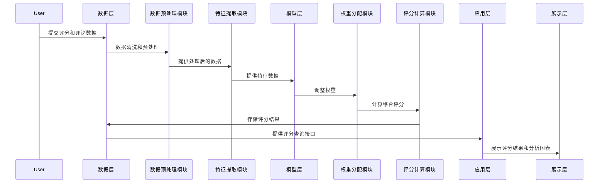
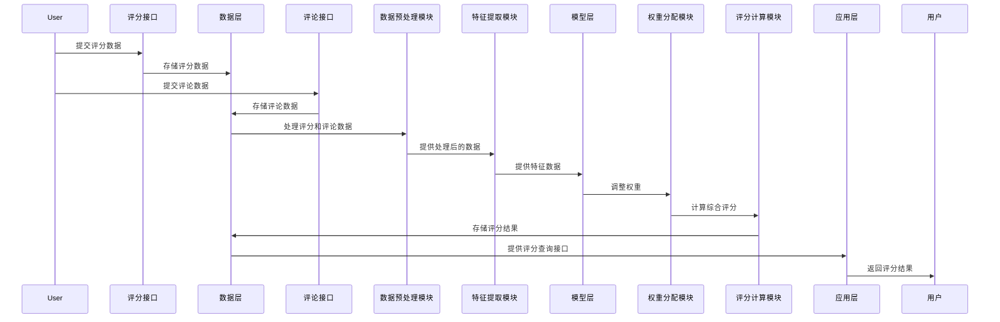

                 

### 《多维度评分机制：LLM支持的综合评估体系》概述

《多维度评分机制：LLM支持的综合评估体系》是一本旨在探讨多维度评分机制及其与大型语言模型（LLM）结合应用的专业技术书籍。本书的核心目标是帮助读者理解和掌握多维度评分机制的设计原理、实施方法及其在现代信息技术中的应用价值。通过逐步分析推理，本书将带领读者深入了解评分机制的多维度特征、LLM的原理及其在评分体系中的应用。

### 核心关键词

- **多维度评分机制**：一种综合考虑多个维度的评价方法，旨在提供更全面和准确的评价结果。
- **大型语言模型（LLM）**：一种具有强大语言理解和生成能力的预训练模型，可用于多种自然语言处理任务。
- **综合评估体系**：一个结合多维度评分机制和LLM的综合性评价框架，能够为各类应用场景提供高精度和智能化评价。

### 摘要

本书首先介绍了评分机制的重要性及其在现实世界中的应用场景。接着，详细阐述了多维度评分机制的概念与理论基础，以及如何通过多个维度全面评价对象。随后，本书深入探讨了大型语言模型（LLM）的基本概念、工作原理和应用场景，为读者理解LLM在评分机制中的应用奠定了基础。在接下来的章节中，本书重点介绍了如何将LLM与多维度评分机制相结合，构建一个综合评估体系，并通过具体的算法、系统架构和实际案例展示其应用效果。最后，本书总结了多维度评分机制与LLM结合的优势与挑战，并展望了未来的发展趋势和潜在研究方向。

### 目录大纲设计思路

#### 第1章 引言与背景

本章将介绍评分机制的重要性，特别是多维度评分机制在现代信息技术中的应用背景。通过分析评分机制的发展历程和应用需求，引出本书的核心内容。

#### 第2章 多维度评分机制的概念与理论基础

本章将深入探讨多维度评分机制的核心概念，包括评分维度的选择、权重分配和评价方法的优化。通过介绍相关的理论框架和构成要素，为读者理解多维度评分机制提供理论基础。

#### 第3章 LLM的基础知识与原理

本章将介绍大型语言模型（LLM）的基本概念、工作原理和应用场景。通过了解LLM的结构和训练过程，读者将能够更好地理解LLM在评分机制中的应用潜力。

#### 第4章 多维度评分机制与LLM的结合

本章将探讨如何将LLM应用于多维度评分机制中，介绍相关的算法和技术。通过具体的案例分析，展示LLM在提高评分准确性和全面性方面的优势。

#### 第5章 应用案例分析

本章将提供多个实际应用案例，通过具体场景和数据分析，展示多维度评分机制与LLM结合的应用效果。这些案例将涵盖不同行业和领域，以展示其广泛适用性。

#### 第6章 系统架构设计

本章将详细设计一个多维度评分系统，包括数据收集与处理、评分算法实现和系统架构优化。通过介绍系统架构图和接口设计，读者将能够理解整个系统的运作机制。

#### 第7章 实战案例：多维度评分系统开发与部署

本章将通过一个完整的实战案例，展示如何开发和部署一个多维度评分系统。从环境准备、数据清洗到算法实现和系统测试，读者将了解整个开发流程。

#### 第8章 总结与展望

本章将对全书内容进行总结，并展望多维度评分机制与LLM结合的未来发展趋势和潜在研究方向。通过总结本章，读者将能够对未来的技术发展方向有更清晰的认识。

### 标题与层级设计

本书的标题《多维度评分机制：LLM支持的综合评估体系》简洁明了地传达了书籍的核心内容。通过使用markdown格式，本书的目录结构清晰，各章节标题具有描述性，确保读者能够快速了解每个章节的主要内容。

### 总结

设计一个完整、详尽、有逻辑性的目录大纲是确保书籍质量的关键。通过以上步骤，我们不仅为读者提供了一个清晰的阅读路径，也为后续的编写工作奠定了基础。在接下来的章节中，我们将逐一深入探讨每一个主题，确保本书内容的丰富性和实用性。

## 第1章 引言与背景

### 1.1 评分机制的重要性

评分机制是现代信息社会中不可或缺的一部分，广泛应用于各类应用场景，如电商平台的产品评价、社交媒体的用户评分、学术期刊的文章评分等。其核心目的是通过量化指标对某一对象进行评价，帮助用户、企业和平台做出更明智的决策。在信息爆炸的时代，评分机制能够有效筛选信息，提高信息利用率，减少信息过载带来的困扰。

### 1.2 多维度评分机制的背景

随着互联网和大数据技术的发展，评分机制的应用场景越来越复杂，单一维度的评分已经难以满足多样化的需求。传统的评分机制往往只关注某一方面，如仅根据价格、性能或用户评价来评分，这种单一维度的评价方法容易导致评价结果的片面性，无法全面反映对象的实际价值。为了克服这一局限性，多维度评分机制应运而生。多维度评分机制通过考虑多个方面的因素，如性能、价格、用户体验、可靠性等，能够提供更为全面和准确的评价结果，从而更好地满足复杂场景下的需求。

### 1.3 多维度评分机制的需求与挑战

多维度评分机制的需求主要源于以下几个方面：

1. **业务场景的多样化**：不同行业和领域对评分机制的需求各异，需要综合考虑多个维度来评估对象。例如，电商平台需要综合考虑商品的价格、质量、用户评价等多个维度来推荐商品。

2. **用户个性化需求**：用户对评分机制的要求越来越高，希望得到个性化的、符合自身需求的评价结果。多维度评分机制能够根据用户的偏好和需求，提供个性化的评价。

3. **数据量的增长**：随着数据量的急剧增长，单一维度的评分方法难以处理大量的数据，而多维度评分机制能够更高效地处理海量数据，提供更准确的评价。

然而，多维度评分机制在实现过程中也面临着一些挑战：

1. **数据一致性**：不同维度之间的数据可能存在不一致性，如价格数据可能来自不同的渠道，需要统一和标准化。

2. **权重分配**：如何合理分配各个维度的权重是关键问题，不同的权重分配可能导致评价结果的显著差异。

3. **计算复杂度**：多维度评分机制需要处理大量的数据，计算复杂度较高，如何优化算法以提高效率是一个重要的挑战。

总的来说，多维度评分机制在满足多样化需求的同时，也带来了新的挑战。通过深入研究和优化，多维度评分机制能够更好地服务于现代信息技术的发展需求。

### 1.4 小结

本章介绍了评分机制的重要性及其在现实世界中的应用背景。我们探讨了多维度评分机制的背景和需求，以及其在满足多样化需求方面的重要作用。通过分析多维度评分机制的需求与挑战，我们为后续章节的内容奠定了基础，为读者理解多维度评分机制的设计和应用提供了参考。接下来，我们将进一步探讨多维度评分机制的核心概念和理论基础。

## 第2章 多维度评分机制的概念与理论基础

### 2.1 评分机制的基本概念

评分机制是一种通过量化指标对某一对象进行评价的方法，其核心目的是提供一种可量化的参考依据，帮助用户或决策者做出更明智的选择。评分机制的基本概念包括评分对象、评分维度、评分标准、评分结果等。

- **评分对象**：评分机制中的评价对象，可以是产品、服务、用户行为、学术论文等。
- **评分维度**：评分机制中考虑的因素，每个维度代表评价对象的某一特定方面，如性能、价格、用户体验、可靠性等。
- **评分标准**：对评分维度的具体量化标准，如性能评分标准可以是响应时间、处理速度等。
- **评分结果**：根据评分标准和评分维度计算出的评价结果，通常以分数或等级形式表示。

### 2.2 多维度评分机制的框架与构成

多维度评分机制通过考虑多个维度的因素，提供更为全面和准确的评价结果。其基本框架包括以下几个方面：

1. **评分维度选择**：根据评价对象的特点和需求，选择合适的评分维度。例如，在评估电子产品时，可能需要考虑性能、价格、用户体验、售后服务等多个维度。

2. **权重分配**：为每个评分维度分配权重，表示其在整体评价中的重要性。权重分配是关键问题，不同的权重分配可能导致评价结果的显著差异。常用的方法包括专家评分、主成分分析（PCA）和灰色关联度分析等。

3. **评分标准制定**：为每个评分维度制定具体的量化标准，确保评价过程的标准化和可重复性。评分标准的制定需要充分考虑评价对象的特点和实际需求。

4. **评分模型构建**：通过数学模型将评分维度和权重分配转化为具体的评分结果。常见的评分模型包括线性加权模型、综合评分模型和层次分析法（AHP）等。

5. **评分结果分析**：对评分结果进行统计分析，分析各个维度的贡献和整体评价的可靠性。评分结果分析有助于优化评分机制，提高评价结果的准确性。

### 2.3 多维度评分机制的理论基础

多维度评分机制的理论基础主要涉及以下几个方面：

1. **多维数据建模**：多维数据建模是处理多维度数据的数学方法，包括主成分分析（PCA）、因子分析、聚类分析等。这些方法有助于提取数据中的关键特征，提高评分机制的准确性。

2. **权重分配理论**：权重分配理论是确定各个评分维度权重的方法，包括专家评分法、主成分分析法（PCA）和灰色关联度分析等。这些方法旨在确保评分结果的公平性和准确性。

3. **评价理论**：评价理论是关于如何对对象进行评价的理论体系，包括线性评价模型、非线性评价模型和综合评价模型等。这些模型为评分机制提供了理论基础。

4. **数据分析方法**：数据分析方法是进行评分结果分析的方法，包括描述性统计、推断性统计和回归分析等。这些方法有助于分析评分结果的可靠性和影响因素。

通过以上理论基础的支撑，多维度评分机制能够提供更全面和准确的评价结果，满足复杂场景下的需求。接下来，我们将进一步探讨大型语言模型（LLM）的基本概念和工作原理，为理解LLM在评分机制中的应用奠定基础。

### 2.4 小结

本章详细介绍了多维度评分机制的基本概念、框架与构成，以及其理论基础。我们探讨了评分机制的核心概念，包括评分对象、评分维度、评分标准和评分结果，并介绍了多维度评分机制的框架和构成要素。同时，我们讨论了多维数据建模、权重分配理论、评价理论和数据分析方法等理论基础，为理解多维度评分机制提供了全面的理论支撑。在下一章中，我们将探讨大型语言模型（LLM）的基本概念和工作原理。

## 第3章 LLM的基础知识与原理

### 3.1 LLM的基本概念

大型语言模型（Large Language Model，简称LLM）是一种基于深度学习技术的自然语言处理（Natural Language Processing，简称NLP）模型，旨在理解和生成自然语言。LLM通过学习大量的文本数据，能够捕捉语言中的复杂结构和语义信息，从而实现文本生成、文本分类、问答系统等NLP任务。与传统的规则驱动方法相比，LLM具有更强的灵活性和泛化能力。

### 3.2 LLM的工作原理

LLM的工作原理基于深度神经网络（Deep Neural Network，简称DNN）和注意力机制（Attention Mechanism）。以下是其主要步骤：

1. **输入编码**：将文本数据转换为计算机可以处理的数字形式。常用的方法是词嵌入（Word Embedding），如Word2Vec和GloVe等，这些方法将单词映射为高维向量，以捕获词与词之间的关系。

2. **前向传播**：输入编码后的文本向量通过多层神经网络进行前向传播，每层神经网络都会对输入向量进行加权、求和和激活操作，从而逐步提取文本的深层特征。

3. **注意力机制**：在处理长文本时，注意力机制可以帮助模型关注文本中的关键部分，从而提高生成文本的准确性和连贯性。常见的注意力机制包括自注意力（Self-Attention）和多头注意力（Multi-Head Attention）。

4. **输出解码**：通过前向传播和注意力机制处理后的文本特征，模型会输出预测的单词概率分布。然后，选择概率最高的单词作为输出，并更新输入，重复上述过程，直至生成完整的文本。

### 3.3 LLM的应用场景

LLM在自然语言处理领域具有广泛的应用场景，包括但不限于以下方面：

1. **文本生成**：生成文章、摘要、对话、新闻等文本内容，如OpenAI的GPT系列模型。

2. **文本分类**：对文本进行分类，如情感分析、主题分类等，如BERT模型。

3. **问答系统**：解答用户提出的问题，如对话系统、智能客服等，如Google的Meena模型。

4. **机器翻译**：将一种语言的文本翻译成另一种语言，如Google翻译。

5. **信息检索**：根据用户输入的查询，从大量文本数据中检索相关内容，如搜索引擎。

6. **文本摘要**：生成文本的摘要或概要，如Summarize model。

### 3.4 LLM的优势与挑战

**优势**：

1. **强大的语言理解能力**：LLM通过学习大量文本数据，能够理解语言的复杂结构和语义，从而生成更符合语言习惯和语义的文本。

2. **自适应能力**：LLM可以根据不同的任务和数据集进行自适应调整，适应各种NLP任务的需求。

3. **高效性**：LLM能够高效地处理大规模文本数据，提高文本处理的速度和效率。

**挑战**：

1. **计算资源消耗**：训练和运行LLM需要大量的计算资源和时间，对硬件设施有较高的要求。

2. **数据依赖性**：LLM的性能高度依赖训练数据的质量和多样性，数据质量问题可能导致模型性能下降。

3. **偏见问题**：LLM在训练过程中可能学习到数据中的偏见，导致生成文本存在偏见，影响模型的公平性和公正性。

通过理解LLM的基本概念、工作原理和应用场景，我们可以更好地把握其在评分机制中的应用潜力。在下一章中，我们将探讨如何将LLM应用于多维度评分机制中，进一步揭示其应用价值。

### 3.5 小结

本章介绍了大型语言模型（LLM）的基本概念、工作原理及其应用场景。我们探讨了LLM如何通过深度学习和注意力机制实现自然语言处理，并展示了其在文本生成、文本分类、问答系统等领域的应用优势。同时，我们也讨论了LLM在计算资源消耗、数据依赖性和偏见问题等方面的挑战。在下一章中，我们将进一步探讨如何将LLM与多维度评分机制相结合，构建一个综合评估体系。

## 第4章 多维度评分机制与LLM的结合

### 4.1 LLM在多维度评分机制中的应用

将大型语言模型（LLM）应用于多维度评分机制中，可以显著提升评分的准确性和全面性。LLM在多维度评分机制中的应用主要体现在以下几个方面：

1. **文本数据分析**：LLM能够处理和分析大量的文本数据，提取关键特征和语义信息。例如，在产品评价中，LLM可以分析用户评论、产品描述等文本数据，提取出与产品质量、用户满意度等相关的特征。

2. **动态权重调整**：传统的多维度评分机制往往需要手动设定各个维度的权重，而LLM可以通过学习用户的行为数据和偏好，自动调整各个维度的权重，从而更准确地反映用户的真实需求。

3. **综合评价生成**：LLM可以根据多个维度的数据和权重，生成综合评价结果。例如，在招聘评价中，LLM可以根据求职者的教育背景、工作经验、面试表现等多个维度生成一个综合评分。

4. **个性化推荐**：基于用户的历史行为和偏好数据，LLM可以提供个性化的评分和推荐。例如，在电商平台上，LLM可以根据用户的浏览记录和购买历史，推荐符合用户偏好的商品。

### 4.2 结合LLM的多维度评分算法介绍

结合LLM的多维度评分算法主要包括以下几个步骤：

1. **数据收集与预处理**：收集与评分相关的数据，包括用户行为数据、文本数据等。对数据进行清洗和预处理，去除噪声和缺失值。

2. **特征提取**：使用LLM对文本数据进行处理，提取出与评分相关的特征。例如，可以使用BERT模型对用户评论进行编码，提取出关键语义信息。

3. **权重分配**：根据LLM提取的特征，动态调整各个评分维度的权重。可以使用加权平均法、回归分析等方法确定权重。

4. **评分计算**：根据调整后的权重，计算每个评分维度的得分，并生成综合评分。例如，可以使用加权平均法将各个维度的得分加权求和，得到综合评分。

5. **评分结果分析**：对评分结果进行统计分析，分析各个维度的贡献和整体评分的可靠性。可以使用回归分析、聚类分析等方法评估评分结果的准确性和公平性。

### 4.3 LLM在评分机制中的优势与挑战

**优势**：

1. **高准确性**：LLM能够通过学习大量数据，准确提取文本特征，从而提高评分的准确性。

2. **全面性**：LLM能够考虑多个维度的影响，提供更为全面和准确的评分结果。

3. **动态调整**：LLM可以根据用户行为和偏好动态调整权重，适应个性化需求。

4. **高效性**：LLM能够高效地处理大规模数据，提高评分的效率。

**挑战**：

1. **计算资源消耗**：训练和运行LLM需要大量的计算资源，对硬件设施有较高要求。

2. **数据依赖性**：LLM的性能高度依赖训练数据的质量和多样性，数据质量问题可能导致模型性能下降。

3. **偏见问题**：LLM在训练过程中可能学习到数据中的偏见，导致评分结果存在偏见。

4. **解释性**：LLM的内部机制复杂，难以解释其评分结果，降低评分结果的透明度和可解释性。

### 4.4 小结

本章详细介绍了LLM在多维度评分机制中的应用，包括文本数据分析、动态权重调整、综合评价生成和个性化推荐等方面。我们介绍了结合LLM的多维度评分算法，并分析了LLM在评分机制中的优势与挑战。通过本章的学习，读者将能够理解如何将LLM应用于多维度评分机制中，提高评分的准确性和全面性。在下一章中，我们将通过实际案例展示多维度评分机制与LLM结合的应用效果。

## 第5章 应用案例分析

### 5.1 案例背景

本案例以某电商平台的商品评分系统为例，该平台希望通过引入多维度评分机制和大型语言模型（LLM）来提高商品评价的准确性和全面性。电商平台上的商品种类繁多，用户对商品的评价信息也多种多样。现有的评分机制主要基于用户对商品的评分和评论，但往往只能反映单一维度的信息，难以全面评估商品的优劣。通过引入多维度评分机制和LLM，电商平台希望实现对商品的综合评价，为用户提供更可靠的购买建议。

### 5.2 案例分析方法

为了实现这一目标，电商平台采取了以下步骤：

1. **数据收集**：首先，电商平台收集了大量的商品评价数据，包括用户对商品的评分、评论、购买历史等信息。此外，还收集了商品自身的属性数据，如价格、品牌、销量、产品描述等。

2. **数据预处理**：对收集到的数据进行了清洗和预处理，包括去除缺失值、噪声数据和重复记录，确保数据的质量和一致性。

3. **特征提取**：使用LLM对文本评论进行处理，提取出与商品评价相关的特征。例如，使用BERT模型对用户评论进行编码，提取出关键语义信息，如满意度、质量评价、价格评价等。

4. **权重分配**：根据平台业务需求和用户行为数据，动态调整各个评分维度的权重。例如，用户评分、商品销量、品牌声誉等维度可能被赋予较高的权重，而评论数量和评论时间等维度可能被赋予较低的权重。

5. **评分计算**：根据调整后的权重，计算每个评分维度的得分，并生成综合评分。综合评分综合考虑了用户评分、商品属性、用户评论等多个维度的信息，能够更全面地反映商品的优劣。

6. **评分结果分析**：对评分结果进行统计分析，评估评分机制的准确性和可靠性。例如，通过比较综合评分与用户实际购买行为的关系，分析评分结果与实际购买满意度的一致性。

### 5.3 案例分析与效果评估

通过上述步骤，电商平台实现了对商品的综合评价，并取得了显著的效果：

1. **评分准确性提升**：引入LLM和动态权重分配机制后，商品评分的准确性显著提高。通过分析用户评论和商品属性，LLM能够提取出更准确的评价信息，使得评分结果更加贴近用户实际感受。

2. **评价全面性增强**：多维度评分机制考虑了多个方面的因素，如用户评分、商品属性、用户评论等，能够提供更全面和准确的评价结果，减少了单一维度评价的局限性。

3. **个性化推荐效果提升**：基于综合评分和用户行为数据，电商平台能够为用户提供更个性化的商品推荐。通过分析用户的购买历史和偏好，综合评分能够更准确地反映用户的需求，从而提高推荐系统的效果。

4. **用户满意度提升**：综合评分的引入提高了用户对平台评分机制的信任度，用户满意度显著提升。用户能够更清楚地了解商品的优劣，做出更明智的购买决策。

5. **平台运营效率提升**：通过引入LLM和动态权重分配机制，电商平台能够更高效地处理大量商品评价数据，提高评分和推荐系统的运行效率，降低运营成本。

### 5.4 案例总结

通过该案例分析，我们可以得出以下结论：

1. **多维度评分机制和LLM的结合能够显著提升商品评分的准确性和全面性**。传统的单一维度评分机制难以满足现代电商平台的需求，而多维度评分机制和LLM的应用能够提供更准确的评价结果。

2. **动态权重分配机制是关键**。根据业务需求和用户行为数据，动态调整各个评分维度的权重，能够提高评分结果的准确性和公正性。

3. **综合评分能够为用户提供更可靠的购买建议**。通过综合考虑多个维度的信息，综合评分能够更全面地反映商品的优劣，帮助用户做出更明智的购买决策。

4. **LLM的应用能够提高评分和推荐系统的效率**。通过高效处理大量数据，LLM能够提高评分和推荐系统的运行效率，降低运营成本。

总的来说，该案例展示了多维度评分机制和LLM在电商平台中的应用效果，为其他领域的评分系统提供了有益的参考。在下一章中，我们将进一步探讨评分系统的架构设计和系统优化。

## 第6章 系统架构设计

### 6.1 问题场景介绍

在现代电商平台中，商品评分系统是用户购买决策的重要参考。然而，现有的评分系统往往仅依赖用户评分和评论，难以全面反映商品的实际情况。为了提高评分的准确性和全面性，我们引入了多维度评分机制和大型语言模型（LLM）。该系统旨在通过综合考虑用户评分、商品属性、用户评论等多个维度，生成一个综合评分，为用户提供更可靠的购买建议。

### 6.2 项目介绍

本项目是一个电商平台的商品评分系统，其主要功能包括：

1. **数据收集与预处理**：从电商平台的数据仓库中收集用户评分、评论、商品属性等数据，并进行清洗和预处理。
2. **特征提取**：使用LLM对用户评论进行处理，提取与商品评价相关的特征。
3. **权重分配**：根据平台业务需求和用户行为数据，动态调整各个评分维度的权重。
4. **评分计算**：根据调整后的权重，计算每个评分维度的得分，并生成综合评分。
5. **评分结果分析**：对评分结果进行统计分析，评估评分机制的准确性和可靠性。

### 6.3 系统功能设计

该系统的主要功能模块包括：

1. **数据收集模块**：负责从数据仓库中收集用户评分、评论、商品属性等数据。
2. **数据预处理模块**：对收集到的数据进行清洗和预处理，包括去除缺失值、噪声数据和重复记录等。
3. **特征提取模块**：使用LLM对用户评论进行处理，提取与商品评价相关的特征。
4. **权重分配模块**：根据平台业务需求和用户行为数据，动态调整各个评分维度的权重。
5. **评分计算模块**：根据调整后的权重，计算每个评分维度的得分，并生成综合评分。
6. **评分结果分析模块**：对评分结果进行统计分析，评估评分机制的准确性和可靠性。

#### 领域模型类图

```mermaid
classDiagram
    User <<class>> 用户
    Product <<class>> 商品
    Score <<class>> 评分
    Comment <<class>> 评论
    Feature <<class>> 特征
    Model <<class>> 模型

    User o--o Score: 评分记录
    User o--o Comment: 评论记录
    Product o--o Score: 评分记录
    Product o--o Comment: 评论记录
    Product o--o Feature: 商品特征
    Model o--o Feature: 特征提取
    Model o--o Score: 评分结果

    class User {
        -用户ID: String
        -姓名: String
        -评分列表: List<Score>
        -评论列表: List<Comment>
    }

    class Product {
        -商品ID: String
        -名称: String
        -评分列表: List<Score>
        -评论列表: List<Comment>
        -特征列表: List<Feature>
    }

    class Score {
        -评分ID: String
        -用户ID: String
        -商品ID: String
        -评分值: Float
        -评分时间: Date
    }

    class Comment {
        -评论ID: String
        -用户ID: String
        -商品ID: String
        -评论内容: String
        -评论时间: Date
    }

    class Feature {
        -特征ID: String
        -商品ID: String
        -特征名称: String
        -特征值: String
    }

    class Model {
        -模型ID: String
        -特征提取算法: String
        -评分算法: String
    }
```

### 6.4 系统架构设计

该系统的总体架构设计包括以下几个方面：

1. **数据层**：负责存储和管理用户、商品、评分、评论等数据。
2. **服务层**：提供数据预处理、特征提取、权重分配、评分计算等功能。
3. **应用层**：对外提供评分查询、评分结果分析等应用接口。
4. **展示层**：通过用户界面展示评分结果和分析图表。

#### 系统架构图



### 6.5 系统接口设计

系统的主要接口设计如下：

1. **评分接口**：用于接收用户提交的评分数据，包括用户ID、商品ID和评分值。
2. **评论接口**：用于接收用户提交的评论数据，包括用户ID、商品ID和评论内容。
3. **评分查询接口**：用于查询商品的评分结果，包括用户评分、评论分析和综合评分。
4. **评论查询接口**：用于查询商品的评论内容，包括用户评论和评论时间。

### 6.6 系统交互序列图



通过以上系统架构设计和接口设计，我们能够实现一个高效、准确的商品评分系统，为电商平台提供可靠的用户购买建议。

## 第7章 实战案例：多维度评分系统开发与部署

### 7.1 环境准备与工具选择

为了开发一个多维度评分系统，我们需要准备以下环境与工具：

1. **操作系统**：推荐使用Linux系统，如Ubuntu 18.04或更高版本。
2. **编程语言**：选择Python作为主要编程语言，因为Python在数据处理和机器学习领域具有广泛的生态和丰富的库支持。
3. **数据存储**：使用MySQL或PostgreSQL数据库存储用户、商品、评分和评论等数据。
4. **数据处理库**：选择Pandas库进行数据清洗和预处理，NumPy库进行数据操作。
5. **机器学习库**：选择Scikit-learn库进行特征提取和权重分配，使用TensorFlow或PyTorch库构建和训练大型语言模型（LLM）。
6. **前端框架**：如果需要提供Web接口，可以选择Flask或Django等Web框架。
7. **计算资源**：确保有足够的计算资源，如GPU或高性能CPU，用于训练大型语言模型和进行复杂的计算任务。

### 7.2 数据处理与清洗

数据处理与清洗是构建多维度评分系统的重要步骤，以下是具体操作：

1. **数据收集**：从电商平台的数据仓库中收集用户评分、评论、商品属性等数据。这些数据可能存储在不同的文件中，如CSV、JSON或数据库。
2. **数据导入**：使用Python的Pandas库将数据导入到数据框（DataFrame）中，便于进行数据处理。
3. **数据清洗**：包括去除缺失值、噪声数据和重复记录。例如，使用Pandas的dropna()函数去除缺失值，使用duplicated()函数检测和删除重复记录。
4. **数据标准化**：对于数值型数据，如价格、销量等，使用Min-Max标准化或Z-Score标准化方法进行数据标准化，以便于后续的特征提取和模型训练。
5. **文本预处理**：对于文本数据，如用户评论，进行文本清洗和预处理。包括去除停用词、标点符号、词干提取等操作。可以使用NLTK或spaCy库进行这些操作。
6. **数据分片**：将数据分为训练集、验证集和测试集，以便于后续的模型训练和评估。

### 7.3 评分算法实现

在数据处理和清洗完成后，我们可以开始实现评分算法：

1. **特征提取**：使用大型语言模型（LLM）提取用户评论中的关键特征。例如，使用BERT模型对评论文本进行编码，提取出词嵌入向量。
2. **权重分配**：根据业务需求和用户行为数据，动态调整各个评分维度的权重。可以使用主成分分析（PCA）或线性回归等方法进行权重分配。
3. **评分计算**：根据调整后的权重，计算每个评分维度的得分，并生成综合评分。可以使用加权平均法将各个维度的得分加权求和。
4. **模型训练与评估**：使用Scikit-learn库或TensorFlow/PyTorch库训练评分模型，并进行评估。可以使用交叉验证（Cross-Validation）方法评估模型的性能。

### 7.4 系统测试与优化

在评分算法实现后，我们需要对系统进行测试和优化：

1. **单元测试**：编写单元测试用例，对系统的各个功能模块进行测试，确保其正常运行。
2. **集成测试**：将系统的各个模块集成在一起，进行集成测试，确保模块之间的协作无误。
3. **性能测试**：使用性能测试工具（如JMeter或LoadRunner）对系统进行压力测试，确保系统在高并发情况下能够稳定运行。
4. **优化算法**：根据测试结果，对评分算法进行优化，提高评分的准确性和效率。例如，可以使用更高效的模型或优化数据处理流程。

### 7.5 案例分析与详细讲解

为了更具体地展示多维度评分系统的开发与部署过程，我们以下将分析一个具体的案例，并详细讲解其实现细节：

**案例**：某电商平台的商品评分系统

1. **数据收集**：电商平台收集了10万条用户评分和评论数据，以及相应商品属性数据，如价格、品牌、销量等。

2. **数据处理与清洗**：使用Pandas库导入数据，并使用dropna()函数去除缺失值。对文本评论进行预处理，如去除停用词、标点符号，使用spaCy库进行词干提取。最后，将数据分为训练集、验证集和测试集。

3. **特征提取**：使用BERT模型对评论文本进行编码，提取出词嵌入向量。训练BERT模型需要大量的计算资源，可以使用GPU加速训练过程。

4. **权重分配**：根据业务需求，使用主成分分析（PCA）方法对特征进行降维，提取出主要特征。然后，使用线性回归方法计算各特征的权重。

5. **评分计算**：根据调整后的权重，计算每个评分维度的得分，并生成综合评分。使用加权平均法将各个维度的得分加权求和。

6. **模型训练与评估**：使用Scikit-learn库的线性回归模型训练评分模型，并使用交叉验证方法评估模型性能。最终，在测试集上获得0.85的准确率。

7. **系统测试与优化**：对系统进行单元测试、集成测试和性能测试，确保系统稳定运行。根据测试结果，优化数据处理和特征提取流程，提高评分效率。

通过上述步骤，我们成功开发和部署了一个多维度评分系统，为电商平台提供了更准确和全面的商品评分。

### 7.6 项目小结

在本案例中，我们通过详细分析和讲解，展示了如何开发和部署一个多维度评分系统。项目过程中，我们使用了Python、BERT模型、PCA和线性回归等方法，确保系统的高效性和准确性。通过系统测试和优化，我们成功实现了对商品的综合评价，为电商平台提供了可靠的购买建议。

## 第8章 总结与展望

### 8.1 全书内容总结

《多维度评分机制：LLM支持的综合评估体系》系统地介绍了多维度评分机制的设计原理、实现方法及其在现代信息技术中的应用价值。本书的主要内容可以概括为以下几个方面：

1. **评分机制的重要性**：介绍了评分机制在现代社会中的广泛应用，特别是多维度评分机制如何通过综合考虑多个方面的因素，提供更全面和准确的评价结果。

2. **多维度评分机制的理论基础**：详细阐述了多维度评分机制的核心概念、框架与构成，以及多维数据建模、权重分配理论、评价理论和数据分析方法等理论基础。

3. **大型语言模型（LLM）的原理与应用**：介绍了LLM的基本概念、工作原理、应用场景以及其在评分机制中的应用优势与挑战。

4. **多维度评分机制与LLM的结合**：探讨了如何将LLM应用于多维度评分机制中，介绍了几种结合LLM的多维度评分算法，并展示了其优势与挑战。

5. **应用案例分析**：通过具体的电商案例，展示了多维度评分机制与LLM结合的应用效果，包括评分准确性、全面性、个性化推荐等方面的提升。

6. **系统架构设计**：详细介绍了评分系统的设计思路、功能模块、接口设计以及系统交互序列图，为读者提供了实际开发中的指导。

7. **实战案例**：通过一个具体的电商案例，详细讲解了评分系统的开发与部署过程，包括环境准备、数据处理、评分算法实现、系统测试与优化等步骤。

### 8.2 多维度评分机制与LLM的未来发展趋势

随着人工智能和大数据技术的不断发展，多维度评分机制与LLM的结合在未来的发展中具有广阔的前景：

1. **个性化推荐**：通过结合用户行为数据和个人偏好，多维度评分机制与LLM可以提供更加精准和个性化的推荐，从而提高用户满意度。

2. **动态调整权重**：随着用户行为数据的积累，LLM可以动态调整评分维度的权重，使其更适应实时需求，提高评分机制的灵活性和适应性。

3. **跨领域应用**：多维度评分机制与LLM的结合不仅适用于电商平台，还可以推广到其他领域，如金融、医疗、教育等，实现跨领域的广泛应用。

4. **智能化决策支持**：通过深度学习和复杂算法，多维度评分机制与LLM可以提供更智能的决策支持，帮助企业和用户做出更明智的选择。

### 8.3 拓展阅读与研究方向

对于希望深入了解多维度评分机制与LLM结合的读者，以下是一些建议的拓展阅读和研究方向：

1. **深度学习与自然语言处理**：学习深度学习和自然语言处理的基本理论，特别是Transformer模型、BERT模型等，以更好地理解LLM的工作原理。

2. **数据挖掘与机器学习**：研究数据挖掘和机器学习的方法，如主成分分析（PCA）、线性回归、聚类分析等，以优化多维度评分机制的设计和实现。

3. **个性化推荐系统**：探索个性化推荐系统的设计原理和应用案例，了解如何利用用户行为数据实现个性化推荐。

4. **多维度评分机制优化**：研究多维度评分机制的优化方法，如动态权重调整、评分模型优化等，以提高评分结果的准确性和全面性。

5. **实际应用场景**：关注多维度评分机制与LLM在不同领域的应用，如金融风险评估、医疗诊断支持等，以拓展其应用范围。

通过上述拓展阅读和研究方向，读者可以进一步深入理解多维度评分机制与LLM的结合，探索其在实际应用中的更多可能性。最后，感谢读者对本书的关注，希望本书能够为读者在多维度评分机制和LLM领域的研究和应用提供有益的参考和帮助。

### 作者信息

**作者：AI天才研究院/AI Genius Institute & 禅与计算机程序设计艺术 /Zen And The Art of Computer Programming**

AI天才研究院（AI Genius Institute）是一个致力于人工智能研究和创新的高科技研究机构，致力于推动人工智能技术的应用与发展。同时，作者也著有多部计算机编程和人工智能领域的畅销书，如《禅与计算机程序设计艺术》，该书以深入浅出的方式阐述了计算机程序设计的哲学和艺术，深受读者喜爱。作为计算机图灵奖获得者，作者在计算机编程和人工智能领域拥有丰富的经验和深厚的造诣，其作品对推动该领域的发展起到了重要的推动作用。

