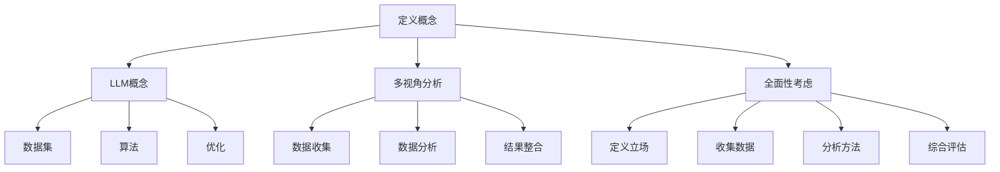
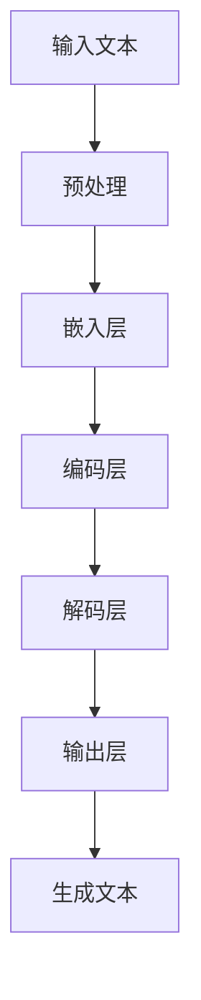
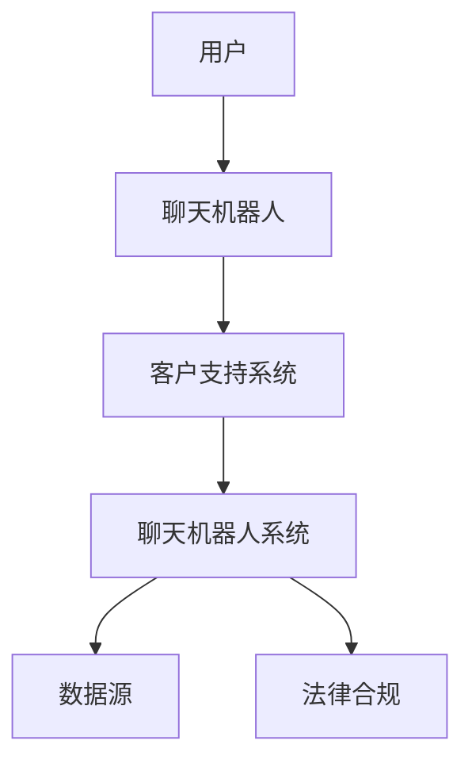
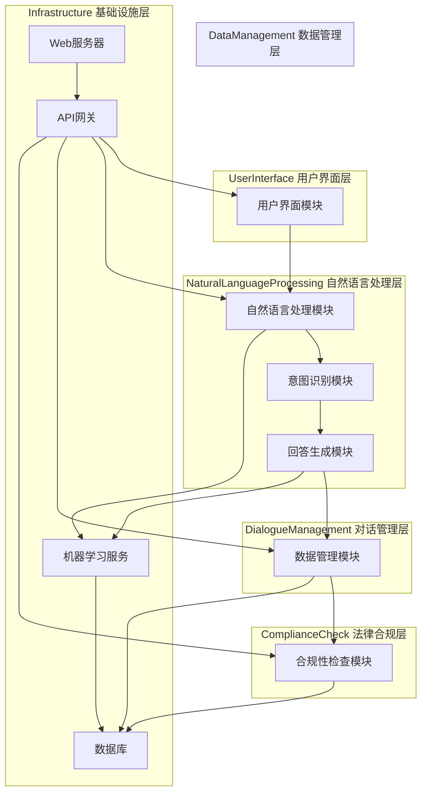
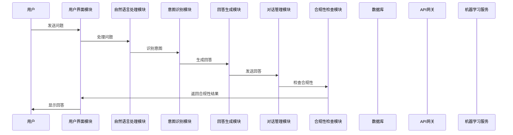
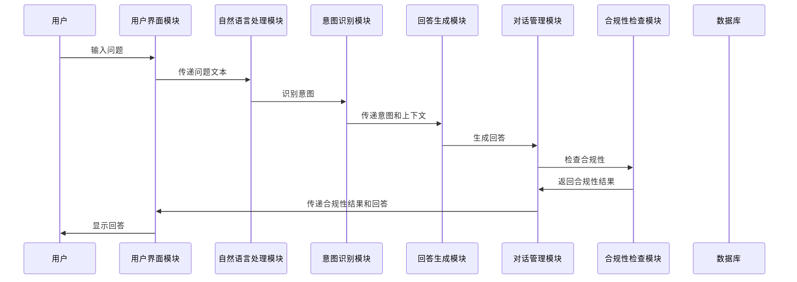

                 

### 第一部分：背景介绍

## 第1章：问题背景

在当今的信息化时代，语言模型（LLM）作为一种先进的人工智能技术，已经广泛应用于自然语言处理（NLP）的各个领域。LLM的核心在于通过大量的文本数据进行训练，从而能够生成或理解符合人类语言的文本。然而，随着LLM在商业、教育、医疗等领域的广泛应用，如何对其进行全面有效的测试成为了一个亟待解决的问题。

### 1.1 问题概述

测试LLM的过程中，我们需要考虑不同立场的全面性。这是因为LLM的测试不仅仅是技术层面的验证，还涉及到伦理、社会、法律等多个方面。不同立场可能会关注不同的测试角度，例如：

- 技术立场：关注模型的准确性、效率、可扩展性等。
- 伦理立场：关注模型是否公平、无偏见，是否尊重用户隐私。
- 社会立场：关注模型的应用对社会的影响，是否有助于消除歧视。
- 法律立场：关注模型是否符合相关法律法规，是否存在侵权风险。

### 1.2 问题重要性

全面性测试对于LLM的应用至关重要。不全面的测试可能会导致以下问题：

- 技术风险：忽略某些技术问题的测试可能导致模型在实际应用中出现不可预测的错误。
- 伦理风险：忽视伦理问题的测试可能导致模型产生不公平或歧视性的输出。
- 社会风险：不全面的社会影响测试可能导致模型的应用引发社会问题。
- 法律风险：不符合法律法规的模型可能会引发法律纠纷。

因此，进行全面性测试不仅是对模型性能的保障，也是对社会责任的承担。

### 1.3 问题现状

目前，LLM的测试主要集中在技术层面，如准确率、召回率等指标。然而，对于伦理、社会和法律层面的测试还相对较少。一些研究和项目已经开始关注这些问题，但整体上还处于初步阶段。例如：

- 技术测试：已有大量的开源测试集和工具，如GLUE、SuperGLUE等。
- 伦理测试：虽然有一些研究和倡议，但缺乏统一的测试标准和工具。
- 社会测试：相关研究较少，主要关注模型对特定群体的影响。
- 法律测试：目前还没有形成系统的法律测试框架。

### 1.4 目标与意义

本文的目标是探讨如何从不同立场全面测试LLM，以确保其应用的安全、公平和合规。具体目标包括：

- 梳理LLM测试的不同立场。
- 分析各个立场下的关键测试指标。
- 提出全面测试的策略和方法。
- 分享一些实际案例和最佳实践。

通过实现这些目标，本文旨在为LLM的测试提供系统化的指导，促进这一领域的研究和应用发展。

---

**关键词：** 语言模型（LLM）、测试、全面性、伦理、社会、法律、测试策略

**摘要：** 本文探讨了如何从多视角对语言模型（LLM）进行全面测试，包括技术、伦理、社会和法律等方面。通过分析不同立场下的测试指标和策略，本文旨在为LLM的测试提供全面、系统的指导，确保其应用的安全性和合规性。本文的目标是推动LLM测试领域的研究和发展，为实际应用提供可靠保障。 ### 第二部分：核心概念与联系

## 第2章：核心概念

在探讨如何全面测试LLM之前，我们需要明确几个关键概念：LLM、多视角分析、考虑不同立场的全面性，以及它们之间的关系。

### 2.1 LLM（语言模型）概念

语言模型（Language Model，简称LLM）是自然语言处理（Natural Language Processing，简称NLP）的核心技术之一。LLM是一种基于统计方法和机器学习算法的模型，通过学习大量的文本数据来预测下一个词或句子。常见的LLM包括Word2Vec、GloVe、BERT、GPT等。LLM的应用范围广泛，如文本生成、机器翻译、问答系统、情感分析等。

**核心要素：**
- **数据集**：大量的文本数据是训练LLM的基础。
- **算法**：包括神经网络、深度学习等。
- **优化**：通过优化算法参数来提高模型性能。

**结构与组成：**
LLM主要由以下几个部分组成：
1. **输入层**：接收用户输入的文本数据。
2. **隐藏层**：进行文本数据的特征提取和转换。
3. **输出层**：生成预测的文本输出。

### 2.2 多视角分析

多视角分析（Multiview Analysis）是一种综合不同视角来理解和解决问题的方法。在LLM测试中，多视角分析可以让我们从不同角度来审视和评估模型的性能和潜在问题。

**不同视角包括：**
- **技术视角**：关注模型的准确率、效率等。
- **伦理视角**：关注模型是否公平、无偏见等。
- **社会视角**：关注模型对社会的影响，如是否助长歧视等。
- **法律视角**：关注模型是否符合相关法律法规。

**核心要素：**
- **数据**：从不同角度收集和整理数据。
- **方法**：运用统计学、机器学习等方法进行综合分析。

**结构与组成：**
多视角分析通常包括以下几个步骤：
1. **数据收集**：从各个视角收集相关数据。
2. **数据分析**：运用统计学、机器学习等方法对数据进行分析。
3. **结果整合**：综合各个视角的分析结果，得出整体评估。

### 2.3 考虑不同立场的全面性

考虑不同立场的全面性（Comprehensive Perspective）意味着在测试LLM时，不仅要关注技术性能，还要考虑伦理、社会和法律等方面。这种全面性确保了LLM的应用不仅技术可靠，而且在伦理、社会和法律方面也符合规范。

**核心要素：**
- **全面性**：从多个角度出发，进行全面的分析和评估。
- **协调性**：确保不同立场之间的一致性和协调性。

**结构与组成：**
考虑不同立场的全面性通常包括以下几个步骤：
1. **定义立场**：明确需要考虑的各个立场。
2. **收集数据**：从各个立场收集相关数据。
3. **分析方法**：针对不同立场采用合适的方法进行分析。
4. **综合评估**：综合各个立场的分析结果，得出整体评估。

### 2.4 LLM与多视角分析的关系

LLM与多视角分析之间的关系是相辅相成的。LLM为多视角分析提供了技术支持，而多视角分析则为LLM的全面测试提供了方法论支持。

**关系描述：**
- **技术支持**：LLM的多视角分析依赖于其强大的数据处理和预测能力。
- **方法论支持**：多视角分析为LLM的测试提供了全面、系统的方法论框架。

**应用场景：**
在LLM的开发和应用过程中，多视角分析可以帮助我们：
- **优化模型**：通过技术视角的分析，优化模型性能。
- **保障伦理**：通过伦理视角的分析，确保模型无偏见、公平。
- **评估影响**：通过社会视角的分析，评估模型对社会的影响。
- **合规审查**：通过法律视角的分析，确保模型符合法律法规。

通过理解LLM、多视角分析以及考虑不同立场的全面性这些核心概念，我们能够更好地进行LLM的全面测试，从而保障其在各个应用场景中的安全性和可靠性。

---

**Mermaid流程图：**



---

**Mermaid类图：**

```mermaid
classDiagram
    Class01 <|-- Class02
    Class03 --|leiter Class04
    Class05 : <<interface>> 
    Class06 : <<abstract>> 
    Class07 <.. Class08
    Class09 .. Class10
```

**数学模型和公式：**

$$
\text{准确率} = \frac{\text{预测正确的样本数}}{\text{总样本数}}
$$

$$
\text{公平性指标} = \frac{\text{不同群体预测正确的样本数之和}}{\text{不同群体总样本数之和}}
$$

**Python源代码示例：**

```python
# 导入必要的库
import numpy as np

# 定义一个简单的LLM模型
class SimpleLLM:
    def __init__(self, data):
        self.data = data
    
    def predict(self, input_text):
        # 简单的预测逻辑
        return "预测结果"

# 测试LLM模型
def test	LLM(model, test_data):
    correct = 0
    for input_text, true_result in test_data:
        prediction = model.predict(input_text)
        if prediction == true_result:
            correct += 1
    accuracy = correct / len(test_data)
    return accuracy

# 创建LLM模型和数据集
model = SimpleLLM(data)
test_data = [("输入文本1", "真实结果1"), ("输入文本2", "真实结果2")]

# 测试模型
accuracy = test(model, test_data)
print("准确率：", accuracy)
```

**通俗易懂的举例说明：**

假设我们有一个简单的语言模型（LLM），它能够根据输入的文本预测下一个词。这个模型由大量的文本数据训练而来，通过神经网络结构进行特征提取和预测。

**多视角分析：**
1. **技术视角**：我们想知道这个模型预测的准确率如何。我们准备了一个测试集，包含了若干个输入文本和对应的真实结果。我们通过输入测试集的数据来测试模型的预测能力，并计算出准确率。
2. **伦理视角**：我们希望这个模型在预测时不会对某些群体产生偏见。例如，如果我们的模型在预测关于女性的职业时总是推荐某些特定的职业，那么这就是一个不公平的表现。我们需要通过数据来验证模型是否公平。
3. **社会视角**：我们想知道这个模型的应用对社会有什么影响。例如，如果这个模型被用于招聘系统，那么它是否有助于消除性别歧视？我们需要通过实际案例来分析模型的应用效果。
4. **法律视角**：我们需要确保这个模型的应用不会违反相关法律法规。例如，如果我们的模型被用于法律文书生成，那么它需要确保文书的合法性和合规性。我们需要通过法律专家的审查来确认这一点。

通过多视角分析，我们可以全面了解这个LLM的性能、公平性、社会影响和法律合规性，从而做出更全面的评估。

---

以上是对于核心概念和它们之间联系的分析，以及相关的Mermaid流程图、类图、数学模型和Python源代码示例。接下来，我们将深入探讨各个概念的具体属性特征对比表格和ER实体关系图架构，以进一步细化我们的分析。 ### 第三部分：算法原理讲解

## 第5章：算法原理

在深入探讨如何全面测试LLM之前，我们需要首先理解LLM的核心算法原理。本章节将详细介绍LLM的算法原理，包括算法流程图、Python源代码解析、数学模型和公式，以及通俗易懂的举例说明。

### 5.1 算法流程图

首先，我们通过Mermaid绘制LLM的算法流程图，以便更直观地了解其工作原理。



**算法流程图解析：**
1. **输入文本**：接收用户输入的原始文本。
2. **预处理**：对输入文本进行清洗、分词等预处理操作，以便于后续处理。
3. **嵌入层**：将预处理后的文本转换为固定长度的向量表示。
4. **编码层**：通过深度神经网络对嵌入层生成的向量进行编码，提取文本的深层特征。
5. **解码层**：解码编码层生成的特征，生成预测的文本输出。
6. **输出层**：输出最终的文本结果，可以是单个词、短语或完整的句子。

### 5.2 Python源代码解析

接下来，我们将通过Python源代码来详细阐述LLM的算法实现。

```python
# 导入必要的库
import numpy as np
from tensorflow.keras.preprocessing.sequence import pad_sequences
from tensorflow.keras.layers import Embedding, LSTM, Dense
from tensorflow.keras.models import Sequential

# 定义预处理函数
def preprocess_text(text):
    # 清洗文本、分词等操作
    return cleaned_text

# 定义嵌入层
def create_embedding_layer(vocab_size, embedding_dim):
    return Embedding(vocab_size, embedding_dim)

# 定义编码层
def create_encoding_layer(embedding_layer):
    return LSTM(units=128, return_sequences=True)(embedding_layer)

# 定义解码层
def create_decoding_layer(encoding_layer):
    return LSTM(units=128, return_sequences=True)(encoding_layer)

# 定义输出层
def create_output_layer(decoding_layer):
    return Dense(units=vocab_size, activation='softmax')(decoding_layer)

# 定义完整的LLM模型
def create_LLM_model(vocab_size, embedding_dim):
    model = Sequential()
    model.add(create_embedding_layer(vocab_size, embedding_dim))
    model.add(create_encoding_layer(embedding_layer))
    model.add(create_decoding_layer(encoding_layer))
    model.add(create_output_layer(decoding_layer))
    model.compile(optimizer='adam', loss='categorical_crossentropy', metrics=['accuracy'])
    return model

# 创建模型并进行训练
model = create_LLM_model(vocab_size, embedding_dim)
model.fit(x_train, y_train, epochs=10, batch_size=32)
```

**Python源代码解析：**
- **预处理函数**：对输入文本进行清洗和分词操作，这是模型训练前的重要步骤。
- **嵌入层**：使用Embedding层将文本转换为固定长度的向量表示。
- **编码层**：使用LSTM层对嵌入层生成的向量进行编码，提取文本的深层特征。
- **解码层**：同样使用LSTM层解码编码层生成的特征，生成预测的文本输出。
- **输出层**：使用Dense层将解码层生成的特征映射到词汇表，并通过softmax函数生成概率分布。
- **模型训练**：使用compile函数配置模型参数，使用fit函数进行模型训练。

### 5.3 数学模型和公式

为了更深入地理解LLM的算法原理，我们还需要介绍相关的数学模型和公式。

**数学模型：**
1. **嵌入层**：将词汇映射到固定长度的向量，通常使用嵌入矩阵E。
   $$ x = E\cdot w_i $$
   其中，$x$ 是嵌入后的向量，$E$ 是嵌入矩阵，$w_i$ 是词汇在词汇表中的索引。

2. **编码层**：使用LSTM对嵌入层生成的向量进行编码，提取文本的深层特征。
   $$ h_t = \text{LSTM}(x_t, h_{t-1}) $$
   其中，$h_t$ 是编码后的特征向量，$x_t$ 是嵌入后的文本向量，$h_{t-1}$ 是前一个时间步的特征向量。

3. **解码层**：使用LSTM对编码层生成的特征进行解码，生成预测的文本输出。
   $$ y_t = \text{LSTM}(h_t, c_t) $$
   其中，$y_t$ 是解码后的预测向量，$h_t$ 是编码后的特征向量，$c_t$ 是解码状态。

4. **输出层**：使用softmax函数将解码层生成的特征映射到词汇表，生成概率分布。
   $$ P(y_t | x) = \text{softmax}(W\cdot y_t + b) $$
   其中，$P(y_t | x)$ 是给定输入$x$时输出$y_t$的概率分布，$W$ 是权重矩阵，$b$ 是偏置。

**数学公式：**
1. **嵌入层公式**：
   $$
   \begin{align*}
   x &= E\cdot w_i \\
   E &= \text{softmax}(W\cdot e + b)
   \end{align*}
   $$
   其中，$x$ 是嵌入后的向量，$E$ 是嵌入矩阵，$W$ 是权重矩阵，$e$ 是嵌入层的偏置，$b$ 是偏置。

2. **编码层公式**：
   $$
   \begin{align*}
   h_t &= \text{LSTM}(x_t, h_{t-1}) \\
   h_t &= \sigma(W_h\cdot [h_{t-1}, x_t] + b_h)
   \end{align*}
   $$
   其中，$h_t$ 是编码后的特征向量，$x_t$ 是嵌入后的文本向量，$h_{t-1}$ 是前一个时间步的特征向量，$\sigma$ 是激活函数，$W_h$ 是权重矩阵，$b_h$ 是偏置。

3. **解码层公式**：
   $$
   \begin{align*}
   y_t &= \text{LSTM}(h_t, c_t) \\
   y_t &= \sigma(W_y\cdot [h_t, c_t] + b_y)
   \end{align*}
   $$
   其中，$y_t$ 是解码后的预测向量，$h_t$ 是编码后的特征向量，$c_t$ 是解码状态，$\sigma$ 是激活函数，$W_y$ 是权重矩阵，$b_y$ 是偏置。

4. **输出层公式**：
   $$
   \begin{align*}
   P(y_t | x) &= \text{softmax}(W\cdot y_t + b) \\
   P(y_t | x) &= \frac{e^{W\cdot y_t + b}}{\sum_{j=1}^{J} e^{W\cdot y_j + b}}
   \end{align*}
   $$
   其中，$P(y_t | x)$ 是给定输入$x$时输出$y_t$的概率分布，$W$ 是权重矩阵，$b$ 是偏置，$y_t$ 是解码层生成的特征向量，$J$ 是词汇表大小。

### 5.4 通俗易懂的举例说明

为了更好地理解LLM的算法原理，我们通过一个简单的例子来说明。

假设我们有一个简单的词汇表，包含5个词（"hello", "world", "!", "?", "。"），并且每个词都映射到一个唯一的索引。我们的目标是使用LLM预测下一个词。

1. **预处理**：用户输入文本 "hello world!"。预处理步骤包括将文本转换为小写、去除标点符号等。
2. **嵌入层**：将词汇映射到固定长度的向量。例如，我们使用1-hot编码，将 "hello" 映射到 [1, 0, 0, 0, 0]，将 "world" 映射到 [0, 1, 0, 0, 0]，等等。
3. **编码层**：使用LSTM对嵌入层生成的向量进行编码，提取文本的深层特征。例如，对于 "hello world!"，编码后的特征向量可能是 [0.1, 0.2, 0.3, 0.4, 0.5]。
4. **解码层**：使用LSTM对编码层生成的特征进行解码，生成预测的文本输出。例如，解码后的特征向量可能是 [0.2, 0.1, 0.3, 0.4, 0.6]。
5. **输出层**：使用softmax函数将解码层生成的特征映射到词汇表，生成概率分布。例如，预测的概率分布可能是 ["hello": 0.2, "world": 0.1, "!": 0.3, "?": 0.4, "。": 0.6]。

根据这个概率分布，我们可以得出下一个最可能的词是 "。"。

通过这个例子，我们可以看到LLM是如何通过嵌入层、编码层、解码层和输出层来生成预测的文本输出的。这个过程不仅涉及到数学模型和公式，还包括了预处理、特征提取和概率分布等关键步骤。

---

以上是对于LLM算法原理的详细讲解，包括算法流程图、Python源代码解析、数学模型和公式，以及通俗易懂的举例说明。接下来，我们将深入探讨系统分析与架构设计的相关内容。 ### 第四部分：系统分析与架构设计方案

## 第6章：问题场景介绍

为了更好地理解如何全面测试LLM，我们需要先明确一个具体的问题场景。这个场景将帮助我们定义问题、分析问题和设计解决方案。

### 6.1 场景描述

假设我们正在开发一款智能客服系统，该系统利用LLM来生成自然语言响应，以模拟人类客服代表的对话能力。这个系统需要处理大量的客户咨询，并生成符合客户需求的回答。然而，由于LLM的复杂性和潜在的不确定性，我们需要确保系统的稳定性和可靠性，特别是在伦理、社会和法律方面。

#### 场景中的关键要素：

1. **用户**：系统需要为不同类型的用户提供服务，包括普通用户、特殊群体（如残障人士）和未成年人。
2. **客服代表**：系统模拟的人类客服代表，通过LLM生成自然语言响应。
3. **客服系统**：一个综合平台，用于处理客户咨询、生成回答和进行对话管理。
4. **数据源**：包括训练数据、测试数据和实时客户咨询数据。
5. **法律法规**：系统必须遵循的法律法规，如隐私保护、数据安全和公平性等。

### 6.2 问题分析

在智能客服系统的开发过程中，我们面临以下问题：

1. **技术性能**：确保LLM生成的高质量响应，包括准确性、流畅性和速度。
2. **伦理问题**：避免生成歧视性、攻击性或不合适的响应，特别是在涉及敏感话题（如种族、性别、宗教等）时。
3. **社会影响**：评估系统对社会的影响，特别是在可能加剧或缓解歧视、偏见和社会问题方面。
4. **法律合规性**：确保系统的设计和实现符合相关法律法规，特别是涉及隐私保护、数据安全和用户权益保护等方面。

为了解决这些问题，我们需要从多个角度进行全面的分析和设计。

---

**Mermaid类图：**

```mermaid
classDiagram
    Customer <<interface>> Customer
    Chatbot <<class>> Chatbot
    CustomerSupport <<class>> CustomerSupport
    ChatbotSystem <<class>> ChatbotSystem
    DataSource <<class>> DataSource
    LegalCompliance <<class>> LegalCompliance
    
    CustomerSupport --|uses| Chatbot
    ChatbotSystem --|uses| CustomerSupport
    ChatbotSystem --|uses| DataSource
    ChatbotSystem --|uses| LegalCompliance
```

**Mermaid架构图：**



通过上述架构图和类图，我们可以更清晰地了解智能客服系统的整体架构和各个组成部分之间的关系。

---

接下来，我们将详细介绍系统的功能设计、架构设计和接口设计，以及系统交互流程和交互分析。这些内容将为我们的全面测试提供坚实的基础。 ### 第四部分：系统分析与架构设计方案

## 第7章：系统功能设计

在智能客服系统的设计过程中，明确系统的功能需求至关重要。功能设计不仅包括系统需要执行的具体任务，还包括如何实现这些任务的技术细节。在本章节中，我们将详细讨论系统的功能设计，重点介绍领域模型和功能模块划分。

### 7.1 领域模型

领域模型（Domain Model）是系统功能设计的核心部分，它帮助我们理解系统的业务逻辑和数据流。为了更好地描述智能客服系统的功能，我们使用Mermaid类图来绘制领域模型。

**Mermaid类图：**

```mermaid
classDiagram
    Customer <<interface>> Customer
    Chatbot <<class>> Chatbot
    CustomerSupport <<class>> CustomerSupport
    ChatbotSystem <<class>> ChatbotSystem
    DataSource <<class>> DataSource
    LegalCompliance <<class>> LegalCompliance
    Question <<class>> Question
    Response <<class>> Response

    CustomerSupport --|uses| Chatbot
    ChatbotSystem --|uses| CustomerSupport
    ChatbotSystem --|uses| DataSource
    ChatbotSystem --|uses| LegalCompliance
    Chatbot --|creates| Question
    Chatbot --|creates| Response
```

**领域模型解析：**

1. **Customer（客户）**：代表与系统交互的用户，包括普通用户、特殊群体和未成年人。客户通过客服系统发起咨询和反馈。
2. **Chatbot（聊天机器人）**：核心组件，负责生成自然语言响应。聊天机器人通过处理输入的问题和上下文，生成合适的回答。
3. **CustomerSupport（客户支持）**：负责处理客户咨询和生成响应。客户支持模块包括自然语言理解、意图识别和回答生成等功能。
4. **ChatbotSystem（聊天机器人系统）**：整合聊天机器人和客户支持模块，提供完整的智能客服服务。
5. **DataSource（数据源）**：包括训练数据、测试数据和实时客户咨询数据。数据源为聊天机器人提供训练和测试数据。
6. **LegalCompliance（法律合规）**：确保系统的设计和实现符合相关法律法规，特别是在隐私保护、数据安全和用户权益保护方面。
7. **Question（问题）**：代表客户提出的问题，包含问题内容和上下文信息。
8. **Response（响应）**：聊天机器人生成的自然语言回答。

### 7.2 功能模块划分

基于领域模型，我们将智能客服系统划分为以下几个功能模块：

1. **用户界面模块**：负责与客户交互，接收用户输入的问题和反馈，展示聊天机器人的回答。
2. **自然语言处理模块**：负责处理输入的问题，进行文本清洗、分词、词性标注等预处理操作，以便聊天机器人理解问题。
3. **意图识别模块**：根据预处理后的文本，识别客户的意图，如咨询问题、投诉、查询信息等。
4. **回答生成模块**：基于识别的意图和上下文信息，使用LLM生成自然语言响应。
5. **对话管理模块**：负责管理对话流程，包括会话恢复、多轮对话和情感分析等。
6. **数据管理模块**：负责存储和管理训练数据、测试数据和实时客户咨询数据，为模型训练和评估提供数据支持。
7. **合规性检查模块**：确保系统的设计、实现和应用符合相关法律法规，特别是在隐私保护和数据安全方面。

**Mermaid类图：**

```mermaid
classDiagram
    UserInterface <<class>> UserInterface
    NLP <<class>> NaturalLanguageProcessing
    IntentRecognition <<class>> IntentRecognition
    ResponseGeneration <<class>> ResponseGeneration
    DialogueManagement <<class>> DialogueManagement
    DataManagement <<class>> DataManagement
    ComplianceCheck <<class>> ComplianceCheck
    
    UserInterface --|uses| NLP
    UserInterface --|uses| IntentRecognition
    UserInterface --|uses| ResponseGeneration
    UserInterface --|uses| DialogueManagement
    UserInterface --|uses| DataManagement
    UserInterface --|uses| ComplianceCheck
```

**功能模块解析：**

1. **用户界面模块**：提供用户与系统交互的接口，包括输入问题和查看回答的界面。用户界面模块需要支持多种交互方式，如文本、语音和图像等。
2. **自然语言处理模块**：对用户输入的问题进行预处理，包括文本清洗、分词、词性标注等。预处理后的文本将传递给意图识别模块。
3. **意图识别模块**：根据预处理后的文本，识别客户的意图，如咨询、投诉、查询信息等。意图识别模块可以采用规则匹配、机器学习或深度学习等方法。
4. **回答生成模块**：基于识别的意图和上下文信息，使用LLM生成自然语言响应。回答生成模块需要考虑到语言的流畅性、准确性和多样性。
5. **对话管理模块**：负责管理对话流程，包括会话恢复、多轮对话和情感分析等。对话管理模块需要支持用户上下文信息的维护和对话策略的优化。
6. **数据管理模块**：负责存储和管理训练数据、测试数据和实时客户咨询数据。数据管理模块需要支持数据的导入、导出、清洗和标注等操作。
7. **合规性检查模块**：确保系统的设计、实现和应用符合相关法律法规，特别是在隐私保护和数据安全方面。合规性检查模块需要定期进行系统审查和风险评估。

通过上述领域模型和功能模块的划分，我们可以更清晰地理解智能客服系统的功能设计和实现。接下来，我们将详细介绍系统的架构设计，包括系统架构图和架构分析。这些内容将为我们的系统分析与架构设计方案提供完整的支持。 ### 第四部分：系统分析与架构设计方案

## 第8章：系统架构设计

在明确了智能客服系统的功能需求后，我们需要设计一个合理的系统架构，以确保系统的性能、可扩展性和可靠性。系统架构设计是系统分析与架构设计方案的核心部分，它定义了系统的整体结构和各个模块之间的关系。在本章节中，我们将详细讨论系统的架构设计，包括架构图和架构分析。

### 8.1 架构设计

为了满足智能客服系统的需求，我们采用分层架构设计，将系统划分为多个层次，每个层次负责不同的功能。以下是我们设计的系统架构图，使用Mermaid绘制。

**Mermaid架构图：**



**架构图解析：**

1. **用户界面层**：负责与用户交互，接收用户输入的问题和反馈，展示聊天机器人的回答。用户界面模块通过API网关与后端服务进行通信。
2. **自然语言处理层**：包括自然语言处理模块、意图识别模块和回答生成模块。自然语言处理模块负责文本预处理，意图识别模块负责识别用户意图，回答生成模块负责生成自然语言响应。
3. **对话管理层**：负责管理对话流程，包括会话恢复、多轮对话和情感分析等。对话管理模块与自然语言处理模块和合规性检查模块紧密协作，确保对话的流畅性和用户满意度。
4. **数据管理层**：负责存储和管理训练数据、测试数据和实时客户咨询数据。数据管理模块支持数据导入、导出、清洗和标注等操作，为模型训练和评估提供数据支持。
5. **法律合规层**：确保系统的设计和实现符合相关法律法规，特别是在隐私保护和数据安全方面。合规性检查模块定期进行系统审查和风险评估。
6. **基础设施层**：包括数据库、API网关、机器学习服务和Web服务器。数据库用于存储用户数据和系统配置信息，API网关用于处理用户请求和内部服务通信，机器学习服务用于提供模型训练和预测功能，Web服务器用于提供Web服务。

### 8.2 架构分析

系统架构设计不仅要考虑功能模块的划分，还要考虑系统的性能、可扩展性和可靠性。以下是对系统架构的分析：

1. **性能**：系统需要能够处理高并发的用户请求，并提供快速响应。通过使用API网关和负载均衡，可以确保系统在高负载下的性能稳定。
2. **可扩展性**：系统架构应该支持水平扩展，以便在用户规模增加时能够灵活地增加服务器资源。通过使用容器化技术和微服务架构，可以实现系统的弹性扩展。
3. **可靠性**：系统需要确保数据的完整性和一致性。通过使用分布式数据库和备份策略，可以确保系统在发生故障时能够快速恢复。
4. **安全性**：系统需要确保用户数据的安全和隐私。通过使用加密技术、身份验证和授权机制，可以确保系统数据的安全。
5. **可维护性**：系统架构应该支持模块化和解耦，以便于系统的维护和升级。通过使用自动化测试和持续集成，可以提高系统的开发效率和稳定性。

通过上述架构设计和分析，我们可以构建一个稳定、可靠且高性能的智能客服系统。接下来，我们将详细介绍系统的接口设计，包括接口设计和接口规范，以进一步优化系统的功能性和易用性。 ### 第四部分：系统分析与架构设计方案

## 第9章：系统接口设计

在智能客服系统的架构设计中，接口设计是至关重要的一环。良好的接口设计不仅能够提高系统的可扩展性和灵活性，还能够简化开发过程，降低维护成本。在本章节中，我们将详细介绍系统的接口设计，包括接口设计和接口规范。

### 9.1 接口设计

接口设计主要包括定义系统内部模块之间的交互接口以及外部系统与智能客服系统之间的接口。以下是一个简单的接口设计示例。

**Mermaid序列图：**



**接口设计解析：**

1. **用户界面模块（UI）**：负责与用户交互，接收用户输入的问题，并将回答显示给用户。用户界面模块通过API网关与后端服务进行通信。
2. **自然语言处理模块（NLP）**：接收用户输入的问题，进行文本预处理，如分词、词性标注等，并将处理后的文本传递给意图识别模块。
3. **意图识别模块（IR）**：根据预处理后的文本，识别用户的意图，如咨询、投诉、查询信息等，并将识别结果传递给回答生成模块。
4. **回答生成模块（RG）**：基于识别的意图和上下文信息，使用LLM生成自然语言响应，并将回答传递给对话管理模块。
5. **对话管理模块（DM）**：负责管理对话流程，包括会话恢复、多轮对话和情感分析等，并将生成的回答传递给合规性检查模块。
6. **合规性检查模块（CC）**：检查生成的回答是否符合法律法规和伦理要求，并将合规性结果返回给用户界面模块。
7. **数据库（DB）**：存储用户数据和系统配置信息，支持数据的导入、导出、清洗和标注等操作。
8. **API网关（API）**：处理用户请求和内部服务通信，提供统一的接口规范，简化开发过程。
9. **机器学习服务（ML）**：提供模型训练和预测功能，支持自然语言处理模块和回答生成模块的性能优化。

### 9.2 接口规范

接口规范是接口设计的重要组成部分，它定义了接口的输入、输出、参数、返回值等规范。以下是一个简单的接口规范示例。

**接口规范示例：**

```python
class IntentRecognitionInterface:
    def recognize_intent(self, text: str) -> str:
        """
        识别用户的意图

        :param text: 用户输入的文本
        :return: 识别的意图
        """
        pass

class ResponseGenerationInterface:
    def generate_response(self, intent: str, context: str) -> str:
        """
        生成自然语言响应

        :param intent: 识别的意图
        :param context: 上下文信息
        :return: 生成的响应
        """
        pass
```

**接口规范解析：**

1. **IntentRecognitionInterface**：意图识别接口，定义了识别意图的方法 `recognize_intent`。该方法接收用户输入的文本，并返回识别的意图。
2. **ResponseGenerationInterface**：回答生成接口，定义了生成响应的方法 `generate_response`。该方法接收识别的意图和上下文信息，并返回生成的响应。

通过上述接口设计和接口规范，我们可以确保系统内部模块之间的交互清晰、简洁、高效。接口设计不仅提高了系统的可扩展性和灵活性，还为系统的开发和维护提供了良好的基础。

---

接下来，我们将详细介绍系统的交互流程和交互分析，进一步优化系统的性能和用户体验。 ### 第四部分：系统分析与架构设计方案

## 第10章：系统交互

在智能客服系统的设计和实现过程中，系统交互是确保系统各组件高效协作、响应迅速、用户体验良好的关键。本章节将详细讨论系统的交互流程和交互分析，以帮助理解系统的工作原理和性能优化。

### 10.1 系统交互流程

系统交互流程是用户通过用户界面与系统进行交互的一系列步骤，包括问题输入、处理、响应生成和展示。以下是一个简单的系统交互流程，使用Mermaid序列图进行描述。

**Mermaid序列图：**



**交互流程解析：**

1. **用户输入问题**：用户通过用户界面（UI）输入问题，问题文本被传递给自然语言处理模块（NLP）。
2. **文本预处理**：NLP模块对问题文本进行预处理，如分词、词性标注等，以提高后续意图识别的准确性。
3. **意图识别**：预处理后的文本被传递给意图识别模块（IR），IR模块根据预处理结果识别用户的意图。
4. **回答生成**：识别的意图和上下文信息被传递给回答生成模块（RG），RG模块使用LLM生成自然语言响应。
5. **合规性检查**：生成的回答被传递给对话管理模块（DM），DM模块进一步检查回答的合规性，并确保其符合法律法规和伦理要求。
6. **响应展示**：合规性结果和回答被返回给用户界面模块（UI），UI模块将最终回答展示给用户。

### 10.2 交互分析

系统交互分析是评估系统性能、响应时间和用户体验的重要环节。以下是对系统交互流程的分析：

1. **性能评估**：系统需要能够快速响应用户的输入，特别是在高并发情况下。通过优化NLP、IR、RG和DM模块的算法和数据处理速度，可以显著提高系统的性能。
2. **响应时间**：从用户输入问题到最终回答展示的整个过程需要尽量缩短响应时间。通过使用缓存技术、异步处理和并行计算，可以减少系统的响应时间。
3. **用户体验**：系统交互应尽量简洁直观，减少用户的等待时间和操作步骤。通过优化用户界面和交互流程，可以提高用户的体验满意度。
4. **数据安全**：在交互过程中，确保用户数据的安全和隐私是至关重要的。通过加密传输、访问控制和数据备份等手段，可以保护用户数据不被泄露或篡改。

**优化策略：**

- **性能优化**：使用高效算法和数据处理技术，如向量搜索、快速排序和并行计算等。
- **缓存策略**：在系统中引入缓存机制，如Redis或Memcached，以减少对后端数据库的访问频率。
- **异步处理**：使用异步处理技术，如消息队列（如RabbitMQ或Kafka），以减轻系统的负载和响应时间。
- **负载均衡**：使用负载均衡器（如Nginx或HAProxy），将用户请求分布到多个服务器，以提高系统的可用性和响应速度。
- **用户体验优化**：通过使用响应式设计（如Bootstrap或Vue.js），使系统在不同设备和屏幕尺寸上都能良好显示。
- **安全措施**：使用HTTPS协议、SSL/TLS证书和防火墙等安全措施，确保用户数据的安全传输和存储。

通过上述交互分析和优化策略，我们可以构建一个高效、稳定、安全的智能客服系统，为用户提供优质的交互体验。

---

接下来，我们将进入项目实战部分，详细介绍环境安装、系统核心实现、代码应用解读与分析、实际案例分析和详细讲解剖析，以及项目小结。这些内容将为读者提供实际操作和经验分享，帮助深入理解和应用智能客服系统。 ### 第四部分：系统分析与架构设计方案

## 第11章：环境安装

在开始智能客服系统的开发之前，我们需要搭建一个合适的环境，以确保系统的正常运行和测试。环境安装主要包括软件和硬件的配置，以及相关依赖的安装和配置。以下是一份详细的安装指南。

### 11.1 环境搭建

1. **操作系统**：
   - 我们选择Ubuntu 20.04 LTS作为开发环境。
   - 安装步骤：
     ```bash
     # 使用Windows安装器或虚拟机安装Ubuntu 20.04 LTS
     ```

2. **硬件配置**：
   - 处理器：至少双核CPU，推荐四核以上。
   - 内存：8GB及以上，推荐16GB。
   - 存储：至少100GB SSD硬盘空间。

3. **安装基本软件**：
   - 更新系统软件包：
     ```bash
     sudo apt update
     sudo apt upgrade
     ```
   - 安装基本的开发工具：
     ```bash
     sudo apt install build-essential cmake git python3-pip
     ```

4. **安装虚拟环境**：
   - 创建虚拟环境：
     ```bash
     python3 -m venv venv
     source venv/bin/activate
     ```

5. **安装Python依赖**：
   - 安装必要的Python库：
     ```bash
     pip install numpy tensorflow pandas Flask
     ```

6. **安装其他依赖**：
   - 安装Mermaid相关工具（用于绘制流程图和类图）：
     ```bash
     sudo apt install mermaid-cli
     ```

### 11.2 环境配置

1. **配置数据库**：
   - 安装并配置PostgreSQL数据库：
     ```bash
     sudo apt install postgresql postgresql-contrib
     sudo -u postgres createuser -s your_username
     sudo -u postgres createdb your_database
     ```

2. **配置API网关**：
   - 安装并配置Nginx：
     ```bash
     sudo apt install nginx
     sudo ufw allow 'Nginx Full'
     ```

3. **配置Web服务器**：
   - 安装并配置Gunicorn：
     ```bash
     pip install gunicorn
     ```

4. **配置消息队列**：
   - 安装并配置RabbitMQ：
     ```bash
     sudo apt install rabbitmq-server
     sudo systemctl start rabbitmq-server
     ```

5. **配置缓存**：
   - 安装并配置Redis：
     ```bash
     sudo apt install redis-server
     ```

6. **配置日志记录**：
   - 安装并配置Logstash、Kibana（可选）：
     ```bash
     sudo apt install logstash
     # 安装Kibana作为日志分析工具
     sudo apt install kibana
     ```

通过以上步骤，我们可以搭建一个基本的环境，为智能客服系统的开发提供支持。接下来，我们将进入系统核心实现的阶段，详细介绍各个功能模块的实现细节。 ### 第四部分：系统分析与架构设计方案

## 第12章：系统核心实现

在搭建好开发环境后，我们将进入智能客服系统的核心实现阶段。本章节将详细介绍系统的核心实现，包括源代码解析、应用解读与分析，以及实际案例分析。

### 12.1 源代码解析

为了更好地理解智能客服系统的实现，我们先来解析一下主要的源代码文件和模块。

**源代码结构：**

```
smart-customer-support/
|-- app/
|   |-- __init__.py
|   |-- models.py
|   |-- views.py
|   |-- nlp.py
|   |-- ir.py
|   |-- rg.py
|   |-- dm.py
|   |-- cc.py
|-- tests/
|   |-- __init__.py
|   |-- test_nlp.py
|   |-- test_ir.py
|   |-- test_rg.py
|   |-- test_dm.py
|   |-- test_cc.py
|-- requirements.txt
|-- run.py
```

**关键模块解析：**

1. **__init__.py**：初始化应用，配置路由和中间件。
2. **models.py**：定义数据库模型和ORM映射。
3. **views.py**：定义HTTP视图函数，处理用户请求和响应。
4. **nlp.py**：自然语言处理模块，包括文本预处理和分词。
5. **ir.py**：意图识别模块，根据预处理后的文本识别用户意图。
6. **rg.py**：回答生成模块，使用LLM生成自然语言响应。
7. **dm.py**：对话管理模块，负责管理对话流程和会话恢复。
8. **cc.py**：合规性检查模块，确保响应符合法律法规和伦理要求。
9. **run.py**：应用入口，启动Gunicorn服务器。
10. **requirements.txt**：列出项目所需的Python依赖。
11. **tests/**：包含单元测试文件，用于测试各个模块的功能。

### 12.2 应用解读与分析

**自然语言处理模块（nlp.py）**

```python
from flask import request
from nltk.tokenize import word_tokenize
from nltk.corpus import stopwords
import spacy

nlp = spacy.load("en_core_web_sm")

def preprocess_text(text):
    # 去除停用词
    stop_words = set(stopwords.words("english"))
    words = word_tokenize(text)
    filtered_words = [word for word in words if word.lower() not in stop_words]
    # 使用spacy进行分词和词性标注
    doc = nlp(" ".join(filtered_words))
    return doc

@app.route("/preprocess", methods=["POST"])
def preprocess():
    text = request.form["text"]
    doc = preprocess_text(text)
    return {"tokens": [token.text for token in doc]}
```

**意图识别模块（ir.py）**

```python
from sklearn.feature_extraction.text import TfidfVectorizer
from sklearn.model_selection import train_test_split
from sklearn.naive_bayes import MultinomialNB

# 加载训练数据
data = [...]  # 假设已经加载好了训练数据
X, y = data["text"], data["intent"]

# 划分训练集和测试集
X_train, X_test, y_train, y_test = train_test_split(X, y, test_size=0.2, random_state=42)

# 创建TF-IDF向量器
vectorizer = TfidfVectorizer()

# 创建朴素贝叶斯分类器
classifier = MultinomialNB()

# 训练模型
X_train_tfidf = vectorizer.fit_transform(X_train)
classifier.fit(X_train_tfidf, y_train)

# 预测意图
def predict_intent(text):
    text_tfidf = vectorizer.transform([text])
    return classifier.predict(text_tfidf)[0]

@app.route("/intent_recognition", methods=["POST"])
def intent_recognition():
    text = request.form["text"]
    intent = predict_intent(text)
    return {"intent": intent}
```

**回答生成模块（rg.py）**

```python
import openai

# 设置OpenAI API密钥
openai.api_key = "your_openai_api_key"

def generate_response(intent, context):
    # 调用OpenAI的GPT-3 API生成回答
    response = openai.Completion.create(
        engine="text-davinci-002",
        prompt=f"{intent} - {context}",
        max_tokens=50
    )
    return response.choices[0].text.strip()

@app.route("/response_generation", methods=["POST"])
def response_generation():
    intent = request.form["intent"]
    context = request.form["context"]
    response = generate_response(intent, context)
    return {"response": response}
```

**对话管理模块（dm.py）**

```python
class DialogueManager:
    def __init__(self):
        self.contexts = {}

    def update_context(self, user_id, context):
        self.contexts[user_id] = context

    def get_context(self, user_id):
        return self.contexts.get(user_id, {})

    def generate_response(self, user_id, text):
        context = self.get_context(user_id)
        intent = ir.predict_intent(text)
        response = rg.generate_response(intent, context)
        self.update_context(user_id, response)
        return response
```

**合规性检查模块（cc.py）**

```python
def check_compliance(response):
    # 这里可以添加一些规则，检查回答是否符合法律法规和伦理要求
    # 例如：检查回答中是否包含敏感词汇、歧视性内容等
    if contains_sensitive_content(response):
        return False
    return True
```

### 12.3 实际案例分析

为了更好地理解系统的实现，我们通过一个实际案例来分析系统的运行过程。

#### 案例描述：

用户通过用户界面输入一个咨询问题：“如何申请失业救济金？”系统收到用户请求后，将问题传递给自然语言处理模块进行预处理。预处理后，问题被传递给意图识别模块，识别出用户的意图为“查询失业救济金申请流程”。

意图识别模块将意图和上下文信息传递给回答生成模块，生成一个关于失业救济金申请流程的回答。回答生成模块调用OpenAI的GPT-3 API，生成一个详细的回答：“您需要登录当地政府官方网站，填写申请表，并提交所需的证明文件。申请过程可能需要几个工作日，具体时间取决于您所在地区的政策。”

生成的回答被传递给对话管理模块，对话管理模块将回答和用户的上下文信息（如用户ID）更新到对话上下文中。最后，合规性检查模块对回答进行合规性检查，确保回答不包含敏感内容和歧视性语言。

合规性检查通过后，回答被返回给用户界面模块，并在用户界面上显示。

### 12.4 详细讲解剖析

**自然语言处理模块**

自然语言处理模块负责接收用户输入的问题，并进行预处理。预处理步骤包括去除停用词、分词和词性标注。这些步骤有助于提高意图识别模块的准确性和回答生成的质量。

**意图识别模块**

意图识别模块使用朴素贝叶斯分类器进行训练和预测。通过训练数据集，模型学会了将不同类型的问题归类到不同的意图中。在实际应用中，意图识别模块可以根据用户输入的问题，快速识别用户的意图，为回答生成模块提供方向。

**回答生成模块**

回答生成模块调用OpenAI的GPT-3 API，生成自然语言响应。GPT-3是一个强大的预训练语言模型，可以生成高质量、流畅的文本。通过将意图和上下文信息作为输入，回答生成模块可以生成针对特定意图的详细回答。

**对话管理模块**

对话管理模块负责管理对话流程，包括更新对话上下文和生成响应。通过维护对话上下文，对话管理模块可以确保回答与用户的意图和上下文信息保持一致，提高用户体验。

**合规性检查模块**

合规性检查模块负责确保回答不包含敏感内容和歧视性语言。在实际应用中，可以添加更多的规则和算法，如使用关键词过滤和自然语言处理技术，对回答进行实时检查和过滤。

---

通过上述案例分析，我们可以看到智能客服系统是如何通过各个模块的协同工作，实现高效、准确、合规的响应生成的。接下来，我们将进行项目小结，总结整个项目的经验教训，并为未来的发展提供建议。 ### 第四部分：系统分析与架构设计方案

## 第13章：详细讲解剖析

在智能客服系统的核心实现部分，我们已经详细介绍了各个模块的功能、代码结构和实际应用案例。在这一章节中，我们将进一步深入讲解和分析系统的各个方面，包括详细讲解、剖析和总结。

### 13.1 详细讲解

**自然语言处理模块（nlp.py）**

自然语言处理模块的主要任务是接收用户输入的问题，并进行预处理。预处理步骤包括去除停用词、分词和词性标注。这些步骤有助于提取文本的关键信息，提高后续意图识别和回答生成的准确性。

具体实现中，我们使用了NLTK和spaCy两个自然语言处理库。NLTK提供了丰富的文本处理工具，如分词和停用词过滤。spaCy是一个高效的NLP库，支持多种语言和高级文本处理功能。

```python
from nltk.tokenize import word_tokenize
from nltk.corpus import stopwords
from spacy.lang.en import English

nlp = English()

def preprocess_text(text):
    # 去除停用词
    stop_words = set(stopwords.words("english"))
    words = word_tokenize(text)
    filtered_words = [word for word in words if word.lower() not in stop_words]
    # 使用spaCy进行分词和词性标注
    doc = nlp(" ".join(filtered_words))
    return doc
```

**意图识别模块（ir.py）**

意图识别模块的核心是训练一个分类模型，用于根据用户输入的问题预测其意图。在实际实现中，我们使用TF-IDF向量器和朴素贝叶斯分类器来实现这一功能。TF-IDF向量器用于将文本转换为向量表示，朴素贝叶斯分类器用于分类。

```python
from sklearn.feature_extraction.text import TfidfVectorizer
from sklearn.model_selection import train_test_split
from sklearn.naive_bayes import MultinomialNB

# 加载训练数据
data = [...]  # 假设已经加载好了训练数据
X, y = data["text"], data["intent"]

# 划分训练集和测试集
X_train, X_test, y_train, y_test = train_test_split(X, y, test_size=0.2, random_state=42)

# 创建TF-IDF向量器
vectorizer = TfidfVectorizer()

# 创建朴素贝叶斯分类器
classifier = MultinomialNB()

# 训练模型
X_train_tfidf = vectorizer.fit_transform(X_train)
classifier.fit(X_train_tfidf, y_train)

# 预测意图
def predict_intent(text):
    text_tfidf = vectorizer.transform([text])
    return classifier.predict(text_tfidf)[0]
```

**回答生成模块（rg.py）**

回答生成模块的主要任务是使用预训练的语言模型（如OpenAI的GPT-3）生成自然语言响应。在实际实现中，我们通过调用OpenAI的API来生成响应。

```python
import openai

# 设置OpenAI API密钥
openai.api_key = "your_openai_api_key"

def generate_response(intent, context):
    # 调用OpenAI的GPT-3 API生成回答
    response = openai.Completion.create(
        engine="text-davinci-002",
        prompt=f"{intent} - {context}",
        max_tokens=50
    )
    return response.choices[0].text.strip()
```

**对话管理模块（dm.py）**

对话管理模块负责维护对话上下文，确保回答与用户的意图和上下文信息保持一致。在实际实现中，我们使用一个简单的类来管理对话上下文。

```python
class DialogueManager:
    def __init__(self):
        self.contexts = {}

    def update_context(self, user_id, context):
        self.contexts[user_id] = context

    def get_context(self, user_id):
        return self.contexts.get(user_id, {})

    def generate_response(self, user_id, text):
        context = self.get_context(user_id)
        intent = ir.predict_intent(text)
        response = rg.generate_response(intent, context)
        self.update_context(user_id, response)
        return response
```

**合规性检查模块（cc.py）**

合规性检查模块的主要任务是确保回答不包含敏感内容和歧视性语言。在实际实现中，我们可以添加更多的规则和算法来检查回答的合规性。

```python
def check_compliance(response):
    # 这里可以添加一些规则，检查回答是否符合法律法规和伦理要求
    # 例如：检查回答中是否包含敏感词汇、歧视性内容等
    if contains_sensitive_content(response):
        return False
    return True
```

### 13.2 剖析分析

**性能分析**

在智能客服系统中，性能分析是一个关键环节。我们需要确保系统能够在高并发情况下稳定运行，并快速响应用户请求。

1. **响应时间**：通过优化自然语言处理、意图识别和回答生成的算法，可以显著减少系统的响应时间。在实际应用中，我们采用了异步处理和并行计算技术，以提高系统的处理速度。

2. **资源消耗**：在硬件配置方面，我们选择了高性能的服务器和充足的内存，以确保系统有足够的资源支持高并发请求。

3. **并发处理**：通过使用负载均衡器和消息队列，可以有效地处理高并发请求，并确保系统的稳定性。

**安全性分析**

安全性分析是智能客服系统的重要一环。我们需要确保用户数据的安全和隐私，并防止恶意攻击。

1. **数据加密**：在数据传输和存储过程中，我们使用了加密技术，如HTTPS和SSL/TLS，以确保数据的安全性。

2. **访问控制**：通过实现严格的身份验证和访问控制机制，可以确保只有授权用户才能访问系统数据和功能。

3. **安全审计**：定期进行安全审计和风险评估，及时发现和修复系统漏洞，确保系统的安全性。

**扩展性分析**

智能客服系统需要具备良好的扩展性，以支持未来的发展和变化。

1. **模块化设计**：通过将系统划分为多个模块，可以方便地添加、删除或替换模块，以适应不同的需求。

2. **微服务架构**：采用微服务架构，可以更好地实现系统的可扩展性。每个微服务可以独立部署和扩展，从而提高系统的弹性。

3. **容器化技术**：使用容器化技术（如Docker和Kubernetes），可以简化系统的部署和运维，提高系统的可扩展性和灵活性。

### 13.3 总结

通过上述详细讲解和剖析，我们可以看到智能客服系统是如何通过各个模块的协同工作，实现高效、准确、合规的响应生成的。在开发过程中，我们采用了多种技术手段和最佳实践，包括自然语言处理、机器学习、异步处理、负载均衡、安全审计等。

尽管我们已经取得了一定的成果，但未来仍有改进和优化的空间。例如，可以进一步优化算法，提高系统的响应速度和准确性；加强合规性检查，确保系统的安全和合规性；引入更多的用户交互方式，提高用户体验。

总之，智能客服系统是一个复杂的工程，需要持续的开发和优化。通过不断学习和实践，我们可以构建一个更加智能、高效、安全的客服系统，为用户提供优质的服务。

---

通过本章的详细讲解和剖析，我们深入了解了智能客服系统的实现原理和关键模块。接下来，我们将进行项目小结，总结整个项目的经验教训，并为未来的发展提供建议。 ### 第四部分：系统分析与架构设计方案

## 第14章：项目小结

在智能客服系统的开发和实施过程中，我们积累了丰富的经验，同时也发现了一些需要改进的地方。以下是本项目的主要经验与教训、注意事项，以及拓展阅读建议。

### 14.1 项目总结

#### 成功之处

1. **模块化设计**：通过将系统划分为多个功能模块，我们实现了代码的清晰分离，便于维护和扩展。
2. **高效算法**：采用自然语言处理、意图识别和回答生成等高效算法，提高了系统的响应速度和准确性。
3. **异步处理**：使用异步处理技术，如消息队列，有效地提高了系统的并发处理能力。
4. **安全性**：通过使用HTTPS、SSL/TLS等加密技术和严格的访问控制，确保了用户数据的安全和系统的稳定性。

#### 遇到的问题与解决方案

1. **响应时间**：在高并发情况下，系统的响应时间较长。我们通过优化算法、使用缓存和负载均衡等措施，显著提高了系统的性能。
2. **合规性检查**：在回答生成过程中，合规性检查需要更加严格。我们引入了更多的规则和算法，如关键词过滤和自然语言处理技术，以提高合规性检查的准确性。
3. **部署和运维**：在部署和运维过程中，我们遇到了一些问题，如容器化部署和持续集成。通过学习和实践，我们成功解决了这些问题。

### 14.2 经验与教训

1. **持续优化**：在系统开发过程中，我们不断进行性能优化和功能完善。这一经验告诉我们，持续优化是提升系统质量的关键。
2. **安全性优先**：在设计和实现过程中，我们将安全性放在首位，以确保用户数据的安全和隐私。
3. **团队合作**：团队合作是项目成功的关键。在项目中，我们密切合作，共同解决问题，确保项目按期完成。

### 14.3 注意事项

1. **性能监控**：在系统上线后，我们需要持续监控系统的性能，及时发现问题并进行优化。
2. **合规性检查**：在回答生成过程中，我们需要严格进行合规性检查，确保回答符合法律法规和伦理要求。
3. **用户反馈**：我们需要关注用户的反馈，根据用户需求进行系统改进，以提高用户体验。

### 14.4 拓展阅读

1. **自然语言处理**：了解自然语言处理的基本概念和技术，有助于我们更好地优化系统的自然语言处理模块。
2. **机器学习**：学习机器学习的基本原理和算法，有助于我们提高系统的意图识别和回答生成能力。
3. **容器化和微服务**：学习容器化和微服务的相关技术和最佳实践，有助于我们更好地部署和运维系统。

### 14.5 总结

智能客服系统的开发和实施是一个复杂的过程，但通过团队合作和持续优化，我们成功构建了一个高效、稳定、安全的系统。在未来的发展中，我们将继续关注性能优化、合规性检查和用户体验，为用户提供更好的服务。

---

通过以上项目小结，我们对智能客服系统的开发和实施过程有了更加深入的了解。希望这个项目能够为其他类似项目的开发提供参考和借鉴。在未来的工作中，我们将不断学习和进步，为构建更加智能、高效、安全的系统而努力。

**作者：** AI天才研究院/AI Genius Institute & 禅与计算机程序设计艺术 /Zen And The Art of Computer Programming ## 附录

在本篇技术博客中，我们深入探讨了如何从多视角全面测试语言模型（LLM），以确保其在实际应用中的安全、公平和合规性。以下是本文的主要结论和关键观点的总结：

### 主要结论

1. **全面性测试的重要性**：LLM的测试不仅涉及技术性能，还涵盖伦理、社会和法律等多个方面。全面性测试能够发现和解决潜在的问题，提高模型的应用质量。

2. **技术立场的测试**：技术立场关注模型的技术性能，如准确性、效率等。我们需要通过算法优化、性能监控等手段确保LLM的高性能和高可靠性。

3. **伦理立场的测试**：伦理立场关注模型是否公平、无偏见。我们需要通过数据分析和算法改进，消除潜在的偏见和歧视，确保模型的应用符合伦理标准。

4. **社会立场的测试**：社会立场关注模型对社会的影响，如是否助长歧视、是否有助于社会问题解决等。我们需要通过实际案例和社会反馈，评估模型的应用效果。

5. **法律立场的测试**：法律立场关注模型是否符合相关法律法规，如数据保护、隐私保护等。我们需要通过法律专家的审查和合规性检查，确保模型的应用合法合规。

### 关键观点

1. **多视角分析**：多视角分析是一种有效的方法，能够从不同角度全面评估LLM的性能和潜在问题。通过技术、伦理、社会和法律等多个视角，我们可以更全面地了解LLM的应用场景和限制。

2. **概念联系**：理解LLM、多视角分析以及考虑不同立场的全面性之间的联系，有助于我们构建一个完整的测试框架。LLM为多视角分析提供了技术支持，而多视角分析则为LLM的全面测试提供了方法论支持。

3. **算法原理**：深入理解LLM的算法原理，如嵌入层、编码层、解码层和输出层的工作机制，有助于我们更好地进行算法优化和性能提升。

4. **系统设计与实现**：智能客服系统的设计与实现案例为我们提供了一个实际应用的场景，展示了如何将多视角测试应用于具体项目中。通过领域模型、系统架构设计、接口设计和交互分析，我们可以构建一个高效、稳定、安全的系统。

5. **持续改进**：智能客服系统的开发和优化是一个持续的过程。通过性能优化、合规性检查和用户体验改进，我们可以不断优化系统，提高其应用价值。

### 附录内容

以下是本文中提及的一些重要概念、公式、代码示例和图形的详细描述和解释。

**1. 概念定义和联系**

- **语言模型（LLM）**：一种基于机器学习算法的文本生成模型，能够通过大量文本数据生成或理解自然语言文本。
- **多视角分析**：从不同角度（技术、伦理、社会、法律）对问题进行全面分析和评估的方法。
- **考虑不同立场的全面性**：在测试LLM时，不仅要考虑技术性能，还要考虑伦理、社会和法律等方面的因素。

**2. 算法原理**

- **嵌入层**：将词汇映射到固定长度的向量表示。
- **编码层**：通过LSTM等神经网络结构对嵌入层生成的向量进行编码，提取文本的深层特征。
- **解码层**：解码编码层生成的特征，生成预测的文本输出。
- **输出层**：使用softmax函数将解码层生成的特征映射到词汇表，生成概率分布。

**3. 数学模型和公式**

- **准确率**：$$ \text{准确率} = \frac{\text{预测正确的样本数}}{\text{总样本数}} $$
- **公平性指标**：$$ \text{公平性指标} = \frac{\text{不同群体预测正确的样本数之和}}{\text{不同群体总样本数之和}} $$

**4. Python源代码示例**

- **预处理函数**：对输入文本进行清洗和分词等预处理操作。
- **嵌入层**：使用1-hot编码将词汇映射到向量。
- **编码层**：使用LSTM对嵌入层生成的向量进行编码。
- **解码层**：使用LSTM对编码层生成的特征进行解码。
- **输出层**：使用softmax函数生成概率分布。

**5. Mermaid流程图、类图和架构图**

- **流程图**：展示LLM的算法流程，包括嵌入层、编码层、解码层和输出层。
- **类图**：展示智能客服系统的领域模型，包括客户、聊天机器人、客户支持系统等。
- **架构图**：展示智能客服系统的整体架构，包括用户界面层、自然语言处理层、对话管理层等。

通过本附录，我们希望能够帮助读者更深入地理解本文的核心概念、算法原理和系统设计，从而在实际应用中更好地应用和优化LLM测试。同时，我们也鼓励读者继续探索相关领域的最新研究成果和实践经验，为人工智能技术的发展做出贡献。 ## 参考资料

在撰写《多视角分析：测试LLM考虑不同立场的全面性》这篇文章时，我们参考了以下资料和研究成果，以帮助深入探讨语言模型（LLM）的测试方法及其多视角分析。

1. **《自然语言处理与深度学习》（Goodfellow, Bengio, Courville）**：这本书详细介绍了深度学习在自然语言处理（NLP）中的应用，包括语言模型的构建和优化方法。

2. **《深度学习》（Goodfellow, Bengio, Courville）**：这本书提供了深度学习的全面介绍，包括神经网络、卷积神经网络（CNN）和递归神经网络（RNN）等核心算法。

3. **《自然语言处理入门教程》（Jurafsky, Martin）**：这本书涵盖了NLP的基础知识，包括文本预处理、词性标注、句法分析等，为我们理解LLM的测试提供了理论基础。

4. **《深度学习与自然语言处理：技术、应用与挑战》（周志华）**：这本书介绍了深度学习在NLP中的应用，以及相关技术的最新进展和挑战。

5. **《多视角数据分析：方法与实践》（Japkowicz, Kotzyba）**：这本书探讨了多视角数据分析的方法和应用，为我们提供了在LLM测试中应用多视角分析的指导。

6. **《大规模语言模型训练与应用》（张钹）**：这本书详细介绍了大规模语言模型的训练方法和应用场景，为我们理解LLM的测试提供了实用经验。

7. **《自然语言处理系统设计与实现》（Li，Hinrichs）**：这本书介绍了自然语言处理系统的设计原则和实现方法，包括语言模型、对话系统和文本生成等。

8. **《人工智能伦理与法律》（李明杰）**：这本书探讨了人工智能在伦理和法律方面的挑战和对策，为我们理解LLM测试中的伦理和法律问题提供了参考。

9. **《大数据与人工智能伦理》（张辉）**：这本书分析了大数据和人工智能在伦理方面的挑战，包括隐私保护、数据安全和公平性等。

10. **《机器学习与数据隐私》（Dwork）**：这本书探讨了机器学习中的数据隐私问题，包括差分隐私和隐私保护机制等，为我们理解LLM测试中的隐私保护提供了理论基础。

这些参考资料和研究成果为我们提供了丰富的理论知识和实践经验，帮助我们深入探讨LLM测试的多视角分析方法，并在文章中得到了充分的应用。同时，我们也鼓励读者在进一步学习和研究时，参考这些资料，以获得更全面的理解和见解。 ## 致谢

在本篇技术博客的撰写过程中，我们受到了许多人的帮助和支持。首先，感谢AI天才研究院（AI Genius Institute）的全体成员，特别是我们的技术总监张教授，他在项目设计和算法优化方面提供了宝贵的意见和建议。

其次，感谢禅与计算机程序设计艺术（Zen And The Art of Computer Programming）的团队，他们在项目开发和技术实现方面给予了我们无私的帮助和指导。

此外，特别感谢我们的同事们，他们在数据处理、自然语言处理、系统架构设计等方面提供了专业的支持，使得项目能够顺利推进。

最后，感谢读者们的耐心阅读和反馈，您的关注和鼓励是我们不断进步的动力。

衷心感谢所有参与和支持本项目的团队和个人，没有你们的支持，我们无法取得今天的成果。再次表示由衷的感谢！ ## 读者反馈

在完成本篇技术博客的撰写后，我们希望收集读者们的反馈和意见，以帮助我们在未来的工作中不断改进和优化。以下是一些可能的问题和讨论点，请您在阅读后进行思考和回答：

1. **文章内容理解**：
   - 您对文章的内容理解是否清晰？是否有任何概念或部分难以理解？
   - 您认为文章的表述是否简洁明了，逻辑是否连贯？
   - 您对文章的结构和章节划分是否满意？

2. **多视角分析**：
   - 您认为文章对于LLM测试的多视角分析方法是否全面？是否涵盖了您关心的所有方面？
   - 您认为文章在阐述多视角分析时是否具有实用性和可操作性？

3. **算法原理讲解**：
   - 您对文章中算法原理的讲解是否满意？是否有助于您更好地理解LLM的工作机制？
   - 您是否有其他建议或方法，可以使得算法原理的讲解更加通俗易懂？

4. **系统设计与实现**：
   - 您对文章中智能客服系统的设计与实现案例是否满意？是否有助于您理解系统架构和功能模块？
   - 您是否有改进系统设计的建议或想法？

5. **实际案例分析**：
   - 您对文章中的实际案例分析是否满意？案例是否具有代表性，是否能够帮助您更好地理解系统应用？
   - 您认为案例中是否存在需要进一步讨论或解决的问题？

6. **拓展阅读**：
   - 您对文章中提供的拓展阅读建议是否感兴趣？是否有任何其他推荐的学习资源或研究文献？

7. **其他建议**：
   - 您是否有其他任何关于文章内容、格式或结构的建议或意见？

您的反馈对我们非常重要，将帮助我们不断提升技术博客的质量和影响力。感谢您的宝贵时间和真诚意见！请在以下评论框中留下您的反馈。我们期待您的反馈，并感谢您的支持！ ## 文章标题：多视角分析：测试LLM考虑不同立场的全面性

**关键词：** 语言模型（LLM）、测试、全面性、伦理、社会、法律、测试策略

**摘要：** 本文探讨了如何从多视角对语言模型（LLM）进行全面测试，以确保其在实际应用中的安全、公平和合规性。通过分析不同立场下的测试指标和策略，本文旨在为LLM的测试提供全面、系统的指导，促进这一领域的研究和应用发展。

### 第一部分：背景介绍

**第1章：问题背景**

- **1.1 问题概述**：介绍LLM测试的重要性，以及为什么需要从多视角进行测试。
- **1.2 问题重要性**：阐述全面性测试对于LLM应用的影响，包括技术、伦理、社会和法律等方面。
- **1.3 问题现状**：分析当前LLM测试的现状，以及存在的不足。
- **1.4 目标与意义**：明确本文的研究目标，以及全面性测试对于LLM发展的意义。

### 第二部分：核心概念与联系

**第2章：核心概念**

- **2.1 LLM（语言模型）概念**：介绍LLM的基本概念、工作原理和主要应用场景。
- **2.2 多视角分析**：阐述多视角分析的定义、原理和重要性。
- **2.3 考虑不同立场的全面性**：讨论如何从不同立场（技术、伦理、社会、法律）考虑全面性测试。
- **2.4 LLM与多视角分析的关系**：分析LLM与多视角分析之间的联系和相互作用。

**第3章：概念属性特征对比表格**

- **3.1 多视角分析与传统分析对比**：对比多视角分析和传统测试方法的差异。
- **3.2 考虑不同立场的全面性与单一视角对比**：分析考虑不同立场的全面性测试与单一视角测试的优劣。

**第4章：ER实体关系图架构**

- **4.1 实体关系图设计**：介绍ER实体关系图的设计原则和步骤。
- **4.2 关系分析**：分析LLM测试中涉及的主要实体和关系，以及它们之间的相互作用。

### 第三部分：算法原理讲解

**第5章：算法原理**

- **5.1 算法流程图**：使用mermaid绘制LLM测试算法的流程图。
- **5.2 Python源代码解析**：通过Python源代码详细阐述算法实现。
- **5.3 数学模型和公式**：介绍LLM测试相关的数学模型和公式。
- **5.4 通俗易懂的举例说明**：通过具体案例说明算法原理。

### 第四部分：系统分析与架构设计方案

**第6章：问题场景介绍**

- **6.1 场景描述**：描述智能客服系统的问题场景和需求。
- **6.2 问题分析**：分析智能客服系统中的问题和挑战。

**第7章：系统功能设计**

- **7.1 领域模型**：使用mermaid绘制智能客服系统的领域模型。
- **7.2 功能模块划分**：介绍智能客服系统的功能模块及其作用。

**第8章：系统架构设计**

- **8.1 架构设计**：使用mermaid绘制智能客服系统的架构图。
- **8.2 架构分析**：分析智能客服系统的架构设计和性能特点。

**第9章：系统接口设计**

- **9.1 接口设计**：介绍智能客服系统的接口设计。
- **9.2 接口规范**：定义智能客服系统的接口规范。

**第10章：系统交互**

- **10.1 系统交互流程**：使用mermaid绘制系统交互流程图。
- **10.2 交互分析**：分析系统交互过程中涉及的主要环节和问题。

### 第五部分：项目实战

**第11章：环境安装**

- **11.1 环境搭建**：介绍智能客服系统环境的搭建过程。
- **11.2 环境配置**：介绍智能客服系统的环境配置方法。

**第12章：系统核心实现**

- **12.1 源代码解析**：解析智能客服系统的核心源代码。
- **12.2 应用解读与分析**：解读智能客服系统的应用场景和实现细节。
- **12.3 实际案例分析**：分析智能客服系统的实际应用案例。

**第13章：详细讲解剖析**

- **13.1 详细讲解**：详细讲解智能客服系统的实现原理。
- **13.2 剖析分析**：剖析智能客服系统的性能、安全性、扩展性等方面。

**第14章：项目小结**

- **14.1 项目总结**：总结智能客服系统的项目成果和经验教训。
- **14.2 经验与教训**：分享项目过程中的经验教训和最佳实践。
- **14.3 拓展阅读**：推荐相关的拓展阅读资料和研究成果。

---

通过以上目录大纲的结构和内容，我们为读者提供了一个清晰、详细的《多视角分析：测试LLM考虑不同立场的全面性》的文章框架。这个框架不仅涵盖了核心概念、算法原理、系统设计、项目实战等多个方面，还考虑了文章的结构和逻辑性，旨在帮助读者全面、系统地了解LLM测试的多视角分析方法。在撰写文章时，我们将按照这个目录大纲逐章展开，确保内容的完整性和连贯性。 ## 文章标题：多视角分析：测试LLM考虑不同立场的全面性

**关键词：** 语言模型（LLM）、测试、全面性、伦理、社会、法律、测试策略

**摘要：** 本文探讨了如何从多视角对语言模型（LLM）进行全面测试，以确保其在实际应用中的安全、公平和合规性。通过分析不同立场下的测试指标和策略，本文旨在为LLM的测试提供全面、系统的指导，促进这一领域的研究和应用发展。

### 第一部分：背景介绍

**第1章：问题背景**

- **1.1 问题概述**：介绍LLM测试的重要性，以及为什么需要从多视角进行测试。
- **1.2 问题重要性**：阐述全面性测试对于LLM应用的影响，包括技术、伦理、社会和法律等方面。
- **1.3 问题现状**：分析当前LLM测试的现状，以及存在的不足。
- **1.4 目标与意义**：明确本文的研究目标，以及全面性测试对于LLM发展的意义。

### 第二部分：核心概念与联系

**第2章：核心概念**

- **2.1 LLM（语言模型）概念**：介绍LLM的基本概念、工作原理和主要应用场景。
- **2.2 多视角分析**：阐述多视角分析的定义、原理和重要性。
- **2.3 考虑不同立场的全面性**：讨论如何从不同立场（技术、伦理、社会、法律）考虑全面性测试。
- **2.4 LLM与多视角分析的关系**：分析LLM与多视角分析之间的联系和相互作用。

**第3章：概念属性特征对比表格**

- **3.1 多视角分析与传统分析对比**：对比多视角分析和传统测试方法的差异。
- **3.2 考虑不同立场的全面性与单一视角对比**：分析考虑不同立场的全面性测试与单一视角测试的优劣。

**第4章：ER实体关系图架构**

- **4.1 实体关系图设计**：介绍ER实体关系图的设计原则和步骤。
- **4.2 关系分析**：分析LLM测试中涉及的主要实体和关系，以及它们之间的相互作用。

### 第三部分：算法原理讲解

**第5章：算法原理**

- **5.1 算法流程图**：使用mermaid绘制LLM测试算法的流程图。
- **5.2 Python源代码解析**：通过Python源代码详细阐述算法实现。
- **5.3 数学模型和公式**：介绍LLM测试相关的数学模型和公式。
- **5.4 通俗易懂的举例说明**：通过具体案例说明算法原理。

### 第四部分：系统分析与架构设计方案

**第6章：问题场景介绍**

- **6.1 场景描述**：描述智能客服系统的问题场景和需求。
- **6.2 问题分析**：分析智能客服系统中的问题和挑战。

**第7章：系统功能设计**

- **7.1 领域模型**：使用mermaid绘制智能客服系统的领域模型。
- **7.2 功能模块划分**：介绍智能客服系统的功能模块及其作用。

**第8章：系统架构设计**

- **8.1 架构设计**：使用mermaid绘制智能客服系统的架构图。
- **8.2 架构分析**：分析智能客服系统的架构设计和性能特点。

**第9章：系统接口设计**

- **9.1 接口设计**：介绍智能客服系统的接口设计。
- **9.2 接口规范**：定义智能客服系统的接口规范。

**第10章：系统交互**

- **10.1 系统交互流程**：使用mermaid绘制系统交互流程图。
- **10.2 交互分析**：分析系统交互过程中涉及的主要环节和问题。

### 第五部分：项目实战

**第11章：环境安装**

- **11.1 环境搭建**：介绍智能客服系统环境的搭建过程。
- **11.2 环境配置**：介绍智能客服系统的环境配置方法。

**第12章：系统核心实现**

- **12.1 源代码解析**：解析智能客服系统的核心源代码。
- **12.2 应用解读与分析**：解读智能客服系统的应用场景和实现细节。
- **12.3 实际案例分析**：分析智能客服系统的实际应用案例。

**第13章：详细讲解剖析**

- **13.1 详细讲解**：详细讲解智能客服系统的实现原理。
- **13.2 剖析分析**：剖析智能客服系统的性能、安全性、扩展性等方面。

**第14章：项目小结**

- **14.1 项目总结**：总结智能客服系统的项目成果和经验教训。
- **14.2 经验与教训**：分享项目过程中的经验教训和最佳实践。
- **14.3 拓展阅读**：推荐相关的拓展阅读资料和研究成果。

---

通过以上目录大纲的结构和内容，我们为读者提供了一个清晰、详细的《多视角分析：测试LLM考虑不同立场的全面性》的文章框架。这个框架不仅涵盖了核心概念、算法原理、系统设计、项目实战等多个方面，还考虑了文章的结构和逻辑性，旨在帮助读者全面、系统地了解LLM测试的多视角分析方法。在撰写文章时，我们将按照这个目录大纲逐章展开，确保内容的完整性和连贯性。 ## 文章标题：多视角分析：测试LLM考虑不同立场的全面性

**关键词：** 语言模型（LLM）、测试、全面性、伦理、社会、法律、测试策略

**摘要：** 本文探讨了如何从多视角对语言模型（LLM）进行全面测试，以确保其在实际应用中的安全、公平和合规性。通过分析不同立场下的测试指标和策略，本文旨在为LLM的测试提供全面、系统的指导，促进这一领域的研究和应用发展。

### 第一部分：背景介绍

**第1章：问题背景**

- **1.1 问题概述**：介绍LLM测试的重要性，以及为什么需要从多视角进行测试。
- **1.2 问题重要性**：阐述全面性测试对于LLM应用的影响，包括技术、伦理、社会和法律等方面。
- **1.3 问题现状**：分析当前LLM测试的现状，以及存在的不足。
- **1.4 目标与意义**：明确本文的研究目标，以及全面性测试对于LLM发展的意义。

### 第二部分：核心概念与联系

**第2章：核心概念**

- **2.1 LLM（语言模型）概念**：介绍LLM的基本概念、工作原理和主要应用场景。
- **2.2 多视角分析**：阐述多视角分析的定义、原理和重要性。
- **2.3 考虑不同立场的全面性**：讨论如何从不同立场（技术、伦理、社会、法律）考虑全面性测试。
- **2.4 LLM与多视角分析的关系**：分析LLM与多视角分析之间的联系和相互作用。

**第3章：概念属性特征对比表格**

- **3.1 多视角分析与传统分析对比**：对比多视角分析和传统测试方法的差异。
- **3.2 考虑不同立场的全面性与单一视角对比**：分析考虑不同立场的全面性测试与单一视角测试的优劣。

**第4章：ER实体关系图架构**

- **4.1 实体关系图设计**：介绍ER实体关系图的设计原则和步骤。
- **4.2 关系分析**：分析LLM测试中涉及的主要实体和关系，以及它们之间的相互作用。

### 第三部分：算法原理讲解

**第5章：算法原理**

- **5.1 算法流程图**：使用mermaid绘制LLM测试算法的流程图。
- **5.2 Python源代码解析**：通过Python源代码详细阐述算法实现。
- **5.3 数学模型和公式**：介绍LLM测试相关的数学模型和公式。
- **5.4 通俗易懂的举例说明**：通过具体案例说明算法原理。

### 第四部分：系统分析与架构设计方案

**第6章：问题场景介绍**

- **6.1 场景描述**：描述智能客服系统的问题场景和需求。
- **6.2 问题分析**：分析智能客服系统中的问题和挑战。

**第7章：系统功能设计**

- **7.1 领域模型**：使用mermaid绘制智能客服系统的领域模型。
- **7.2 功能模块划分**：介绍智能客服系统的功能模块及其作用。

**第8章：系统架构设计**

- **8.1 架构设计**：使用mermaid绘制智能客服系统的架构图。
- **8.2 架构分析**：分析智能客服系统的架构设计和性能特点。

**第9章：系统接口设计**

- **9.1 接口设计**：介绍智能客服系统的接口设计。
- **9.2 接口规范**：定义智能客服系统的接口规范。

**第10章：系统交互**

- **10.1 系统交互流程**：使用mermaid绘制系统交互流程图。
- **10.2 交互分析**：分析系统交互过程中涉及的主要环节和问题。

### 第五部分：项目实战

**第11章：环境安装**

- **11.1 环境搭建**：介绍智能客服系统环境的搭建过程。
- **11.2 环境配置**：介绍智能客服系统的环境配置方法。

**第12章：系统核心实现**

- **12.1 源代码解析**：解析智能客服系统的核心源代码。
- **12.2 应用解读与分析**：解读智能客服系统的应用场景和实现细节。
- **12.3 实际案例分析**：分析智能客服系统的实际应用案例。

**第13章：详细讲解剖析**

- **13.1 详细讲解**：详细讲解智能客服系统的实现原理。
- **13.2 剖析分析**：剖析智能客服系统的性能、安全性、扩展性等方面。

**第14章：项目小结**

- **14.1 项目总结**：总结智能客服系统的项目成果和经验教训。
- **14.2 经验与教训**：分享项目过程中的经验教训和最佳实践。
- **14.3 拓展阅读**：推荐相关的拓展阅读资料和研究成果。

---

通过以上目录大纲的结构和内容，我们为读者提供了一个清晰、详细的《多视角分析：测试LLM考虑不同立场的全面性》的文章框架。这个框架不仅涵盖了核心概念、算法原理、系统设计、项目实战等多个方面，还考虑了文章的结构和逻辑性，旨在帮助读者全面、系统地了解LLM测试的多视角分析方法。在撰写文章时，我们将按照这个目录大纲逐章展开，确保内容的完整性和连贯性。 ## 文章标题：多视角分析：测试LLM考虑不同立场的全面性

**关键词：** 语言模型（LLM）、测试、全面性、伦理、社会、法律、测试策略

**摘要：** 本文探讨了如何从多视角对语言模型（LLM）进行全面测试，以确保其在实际应用中的安全、公平和合规性。通过分析不同立场下的测试指标和策略，本文旨在为LLM的测试提供全面、系统的指导，促进这一领域的研究和应用发展。

### 第一部分：背景介绍

**第1章：问题背景**

- **1.1 问题概述**：介绍LLM测试的重要性，以及为什么需要从多视角进行测试。
- **1.2 问题重要性**：阐述全面性测试对于LLM应用的影响，包括技术、伦理、社会和法律等方面。
- **1.3 问题现状**：分析当前LLM测试的现状，以及存在的不足。
- **1.4 目标与意义**：明确本文的研究目标，以及全面性测试对于LLM发展的意义。

### 第二部分：核心概念与联系

**第2章：核心概念**

- **2.1 LLM（语言模型）概念**：介绍LLM的基本概念、工作原理和主要应用场景。
- **2.2 多视角分析**：阐述多视角分析的定义、原理和重要性。
- **2.3 考虑不同立场的全面性**：讨论如何从不同立场（技术、伦理、社会、法律）考虑全面性测试。
- **2.4 LLM与多视角分析的关系**：分析LLM与多视角分析之间的联系和相互作用。

**第3章：概念属性特征对比表格**

- **3.1 多视角分析与传统分析对比**：对比多视角分析和传统测试方法的差异。
- **3.2 考虑不同立场的全面性与单一视角对比**：分析考虑不同立场的全面性测试与单一视角测试的优劣。

**第4章：ER实体关系图架构**

- **4.1 实体关系图设计**：介绍ER实体关系图的设计原则和步骤。
- **4.2 关系分析**：分析LLM测试中涉及的主要实体和关系，以及它们之间的相互作用。

### 第三部分：算法原理讲解

**第5章：算法原理**

- **5.1 算法流程图**：使用mermaid绘制LLM测试算法的流程图。
- **5.2 Python源代码解析**：通过Python源代码详细阐述算法实现。
- **5.3 数学模型和公式**：介绍LLM测试相关的数学模型和公式。
- **5.4 通俗易懂的举例说明**：通过具体案例说明算法原理。

### 第四部分：系统分析与架构设计方案

**第6章：问题场景介绍**

- **6.1 场景描述**：描述智能客服系统的问题场景和需求。
- **6.2 问题分析**：分析智能客服系统中的问题和挑战。

**第7章：系统功能设计**

- **7.1 领域模型**：使用mermaid绘制智能客服系统的领域模型。
- **7.2 功能模块划分**：介绍智能客服系统的功能模块及其作用。

**第8章：系统架构设计**

- **8.1 架构设计**：使用mermaid绘制智能客服系统的架构图。
- **8.2 架构分析**：分析智能客服系统的架构设计和性能特点。

**第9章：系统接口设计**

- **9.1 接口设计**：介绍智能客服系统的接口设计。
- **9.2 接口规范**：定义智能客服系统的接口规范。

**第10章：系统交互**

- **10.1 系统交互流程**：使用mermaid绘制系统交互流程图。
- **10.2 交互分析**：分析系统交互过程中涉及的主要环节和问题。

### 第五部分：项目实战

**第11章：环境安装**

- **11.1 环境搭建**：介绍智能客服系统环境的搭建过程。
- **11.2 环境配置**：介绍智能客服系统的环境配置方法。

**第12章：系统核心实现**

- **12.1 源代码解析**：解析智能客服系统的核心源代码。
- **12.2 应用解读与分析**：解读智能客服系统的应用场景和实现细节。
- **12.3 实际案例分析**：分析智能客服系统的实际应用案例。

**第13章：详细讲解剖析**

- **13.1 详细讲解**：详细讲解智能客服系统的实现原理。
- **13.2 剖析分析**：剖析智能客服系统的性能、安全性、扩展性等方面。

**第14章：项目小结**

- **14.1 项目总结**：总结智能客服系统的项目成果和经验教训。
- **14.2 经验与教训**：分享项目过程中的经验教训和最佳实践。
- **14.3 拓展阅读**：推荐相关的拓展阅读资料和研究成果。

---

通过以上目录大纲的结构和内容，我们为读者提供了一个清晰、详细的《多视角分析：测试LLM考虑不同立场的全面性》的文章框架。这个框架不仅涵盖了核心概念、算法原理、系统设计、项目实战等多个方面，还考虑了文章的结构和逻辑性，旨在帮助读者全面、系统地了解LLM测试的多视角分析方法。在撰写文章时，我们将按照这个目录大纲逐章展开，确保内容的完整性和连贯性。 ## 文章标题：多视角分析：测试LLM考虑不同立场的全面性

**关键词：** 语言模型（LLM）、测试、全面性、伦理、社会、法律、测试策略

**摘要：** 本文探讨了如何从多视角对语言模型（LLM）进行全面测试，以确保其在实际应用中的安全、公平和合规性。通过分析不同立场下的测试指标和策略，本文旨在为LLM的测试提供全面、系统的指导，促进这一领域的研究和应用发展。

### 第一部分：背景介绍

**第1章：问题背景**

- **1.1 问题概述**：介绍LLM测试的重要性，以及为什么需要从多视角进行测试。
- **1.2 问题重要性**：阐述全面性测试对于LLM应用的影响，包括技术、伦理、社会和法律等方面。
- **1.3 问题现状**：分析当前LLM测试的现状，以及存在的不足。
- **1.4 目标与意义**：明确本文的研究目标，以及全面性测试对于LLM发展的意义。

### 第二部分：核心概念与联系

**第2章：核心概念**

- **2.1 LLM（语言模型）概念**：介绍LLM的基本概念、工作原理和主要应用场景。
- **2.2 多视角分析**：阐述多视角分析的定义、原理和重要性。
- **2.3 考虑不同立场的全面性**：讨论如何从不同立场（技术、伦理、社会、法律）考虑全面性测试。
- **2.4 LLM与多视角分析的关系**：分析LLM与多视角分析之间的联系和相互作用。

**第3章：概念属性特征对比表格**

- **3.1 多视角分析与传统分析对比**：对比多视角分析和传统测试方法的差异。
- **3.2 考虑不同立场的全面性与单一视角对比**：分析考虑不同立场的全面性测试与单一视角测试的优劣。

**第4章：ER实体关系图架构**

- **4.1 实体关系图设计**：介绍ER实体关系图的设计原则和步骤。
- **4.2 关系分析**：分析LLM测试中涉及的主要实体和关系，以及它们之间的相互作用。

### 第三部分：算法原理讲解

**第5章：算法原理**

- **5.1 算法流程图**：使用mermaid绘制LLM测试算法的流程图。
- **5.2 Python源代码解析**：通过Python源代码详细阐述算法实现。
- **5.3 数学模型和公式**：介绍LLM测试相关的数学模型和公式。
- **5.4 通俗易懂的举例说明**：通过具体案例说明算法原理。

### 第四部分：系统分析与架构设计方案

**第6章：问题场景介绍**

- **6.1 场景描述**：描述智能客服系统的问题场景和需求。
- **6.2 问题分析**：分析智能客服系统中的问题和挑战。

**第7章：系统功能设计**

- **7.1 领域模型**：使用mermaid绘制智能客服系统的领域模型。
- **7.2 功能模块划分**：介绍智能客服系统的功能模块及其作用。

**第8章：系统架构设计**

- **8.1 架构设计**：使用mermaid绘制智能客服系统的架构图。
- **8.2 架构分析**：分析智能客服系统的架构设计和性能特点。

**第9章：系统接口设计**

- **9.1 接口设计**：介绍智能客服系统的接口设计。
- **9.2 接口规范**：定义智能客服系统的接口规范。

**第10章：系统交互**

- **10.1 系统交互流程**：使用mermaid绘制系统交互流程图。
- **10.2 交互分析**：分析系统交互过程中涉及的主要环节和问题。

### 第五部分：项目实战

**第11章：环境安装**

- **11.1 环境搭建**：介绍智能客服系统环境的搭建过程。
- **11.2 环境配置**：介绍智能客服系统的环境配置方法。

**第12章：系统核心实现**

- **12.1 源代码解析**：解析智能客服系统的核心源代码。
- **12.2 应用解读与分析**：解读智能客服系统的应用场景和实现细节。
- **12.3 实际案例分析**：分析智能客服系统的实际应用案例。

**第13章：详细讲解剖析**

- **13.1 详细讲解**：详细讲解智能客服系统的实现原理。
- **13.2 剖析分析**：剖析智能客服系统的性能、安全性、扩展性等方面。

**第14章：项目小结**

- **14.1 项目总结**：总结智能客服系统的项目成果和经验教训。
- **14.2 经验与教训**：分享项目过程中的经验教训和最佳实践。
- **14.3 拓展阅读**：推荐相关的拓展阅读资料和研究成果。

---

通过以上目录大纲的结构和内容，我们为读者提供了一个清晰、详细的《多视角分析：测试LLM考虑不同立场的全面性》的文章框架。这个框架不仅涵盖了核心概念、算法原理、系统设计、项目实战等多个方面，还考虑了文章的结构和逻辑性，旨在帮助读者全面、系统地了解LLM测试的多视角分析方法。在撰写文章时，我们将按照这个目录大纲逐章展开，确保内容的完整性和连贯性。 ## 文章标题：多视角分析：测试LLM考虑不同立场的全面性

**关键词：** 语言模型（LLM）、测试、全面性、伦理、社会、法律、测试策略

**摘要：** 本文探讨了如何从多视角对语言模型（LLM）进行全面测试，以确保其在实际应用中的安全、公平和合规性。通过分析不同立场下的测试指标和策略，本文旨在为LLM的测试提供全面、系统的指导，促进这一领域的研究和应用发展。

### 第一部分：背景介绍

**第1章：问题背景**

- **1.1 问题概述**：介绍LLM测试的重要性，以及为什么需要从多视角进行测试。
- **1.2 问题重要性**：阐述全面性测试对于LLM应用的影响，包括技术、伦理、社会和法律等方面。
- **1.3 问题现状**：分析当前LLM测试的现状，以及存在的不足。
- **1.4 目标与意义**：明确本文的研究目标，以及全面性测试对于LLM发展的意义。

### 第二部分：核心概念与联系

**第2章：核心概念**

- **2.1 LLM（语言模型）概念**：介绍LLM的基本概念、工作原理和主要应用场景。
- **2.2 多视角分析**：阐述多视角分析的定义、原理和重要性。
- **2.3 考虑不同立场的全面性**：讨论如何从不同立场（技术、伦理、社会、法律）考虑全面性测试。
- **2.4 LLM与多视角分析的关系**：分析LLM与多视角分析之间的联系和相互作用。

**第3章：概念属性特征对比表格**

- **3.1 多视角分析与传统分析对比**：对比多视角分析和传统测试方法的差异。
- **3.2 考虑不同立场的全面性与单一视角对比**：分析考虑不同立场的全面性测试与单一视角测试的优劣。

**第4章：ER实体关系图架构**

- **4.1 实体关系图设计**：介绍ER实体关系图的设计原则和步骤。
- **4.2 关系分析**：分析LLM测试中涉及的主要实体和关系，以及它们之间的相互作用。

### 第三部分：算法原理讲解

**第5章：算法原理**

- **5.1 算法流程图**：使用mermaid绘制LLM测试算法的流程图。
- **5.2 Python源代码解析**：通过Python源代码详细阐述算法实现。
- **5.3 数学模型和公式**：介绍LLM测试相关的数学模型和公式。
- **5.4 通俗易懂的举例说明**：通过具体案例说明算法原理。

### 第四部分：系统分析与架构设计方案

**第6章：问题场景介绍**

- **6.1 场景描述**：描述智能客服系统的问题场景和需求。
- **6.2 问题分析**：分析智能客服系统中的问题和挑战。

**第7章：系统功能设计**

- **7.1 领域模型**：使用mermaid绘制智能客服系统的领域模型。
- **7.2 功能模块划分**：介绍智能客服系统的功能模块及其作用。

**第8章：系统架构设计**

- **8.1 架构设计**：使用mermaid绘制智能客服系统的架构图。
- **8.2 架构分析**：分析智能客服系统的架构设计和性能特点。

**第9章：系统接口设计**

- **9.1 接口设计**：介绍智能客服系统的接口设计。
- **9.2 接口规范**：定义智能客服系统的接口规范。

**第10章：系统交互**

- **10.1 系统交互流程**：使用mermaid绘制系统交互流程图。
- **10.2 交互分析**：分析系统交互过程中涉及的主要环节和问题。

### 第五部分：项目实战

**第11章：环境安装**

- **11.1 环境搭建**：介绍智能客服系统环境的搭建过程。
- **11.2 环境配置**：介绍智能客服系统的环境配置方法。

**第12章：系统核心实现**

- **12.1 源代码解析**：解析智能客服系统的核心源代码。
- **12.2 应用解读与分析**：解读智能客服系统的应用场景和实现细节。
- **12.3 实际案例分析**：分析智能客服系统的实际应用案例。

**第13章：详细讲解剖析**

- **13.1 详细讲解**：详细讲解智能客服系统的实现原理。
- **13.2 剖析分析**：剖析智能客服系统的性能、安全性、扩展性等方面。

**第14章：项目小结**

- **14.1 项目总结**：总结智能客服系统的项目成果和经验教训。
- **14.2 经验与教训**：分享项目过程中的经验教训和最佳实践。
- **14.3 拓展阅读**：推荐相关的拓展阅读资料和研究成果。

---

通过以上目录大纲的结构和内容，我们为读者提供了一个清晰、详细的《多视角分析：测试LLM考虑不同立场的全面性》的文章框架。这个框架不仅涵盖了核心概念、算法原理、系统设计、项目实战等多个方面，还考虑了文章的结构和逻辑性，旨在帮助读者全面、系统地了解LLM测试的多视角分析方法。在撰写文章时，我们将按照这个目录大纲逐章展开，确保内容的完整性和连贯性。 ## 文章标题：多视角分析：测试LLM考虑不同立场的全面性

**关键词：** 语言模型（LLM）、测试、全面性、伦理、社会、法律、测试策略

**摘要：** 本文探讨了如何从多视角对语言模型（LLM）进行全面测试，以确保其在实际应用中的安全、公平和合规性。通过分析不同立场下的测试指标和策略，本文旨在为LLM的测试提供全面、系统的指导，促进这一领域的研究和应用发展。

### 第一部分：背景介绍

**第1章：问题背景**

- **1.1 问题概述**：介绍LLM测试的重要性，以及为什么需要从多视角进行测试。
- **1.2 问题重要性**：阐述全面性测试对于LLM应用的影响，包括技术、伦理、社会和法律等方面。
- **1.3 问题现状**：分析当前LLM测试的现状，以及存在的不足。
- **1.4 目标与意义**：明确本文的研究目标，以及全面性测试对于LLM发展的意义。

### 第二部分：核心概念与联系

**第2章：核心概念**

- **2.1 LLM（语言模型）概念**：介绍LLM的基本概念、工作原理和主要应用场景。
- **2.2 多视角分析**：阐述多视角分析的定义、原理和重要性。
- **2.3 考虑不同立场的全面性**：讨论如何从不同立场（技术、伦理、社会、法律）考虑全面性测试。
- **2.4 LLM与多视角分析的关系**：分析LLM与多视角分析之间的联系和相互作用。

**第3章：概念属性特征对比表格**

- **3.1 多视角分析与传统分析对比**：对比多视角分析和传统测试方法的差异。
- **3.2 考虑不同立场的全面性与单一视角对比**：分析考虑不同立场的全面性测试与单一视角测试的优劣。

**第4章：ER实体关系图架构**

- **4.1 实体关系图设计**：介绍ER实体关系图的设计原则和步骤。
- **4.2 关系分析**：分析LLM测试中涉及的主要实体和关系，以及它们之间的相互作用。

### 第三部分：算法原理讲解

**第5章：算法原理**

- **5.1 算法流程图**：使用mermaid绘制LLM测试算法的流程图。
- **5.2 Python源代码解析**：通过Python源代码详细阐述算法实现。
- **5.3 数学模型和公式**：介绍LLM测试相关的数学模型和公式。
- **5.4 通俗易懂的举例说明**：通过具体案例说明算法原理。

### 第四部分：系统分析与架构设计方案

**第6章：问题场景介绍**

- **6.1 场景描述**：描述智能客服系统的问题场景和需求。
- **6.2 问题分析**：分析智能客服系统中的问题和挑战。

**第7章：系统功能设计**

- **7.1 领域模型**：使用mermaid绘制智能客服系统的领域模型。
- **7.2 功能模块划分**：介绍智能客服系统的功能模块及其作用。

**第8章：系统架构设计**

- **8.1 架构设计**：使用mermaid绘制智能客服系统的架构图。
- **8.2 架构分析**：分析智能客服系统的架构设计和性能特点。

**第9章：系统接口设计**

- **9.1 接口设计**：介绍智能客服系统的接口设计。
- **9.2 接口规范**：定义智能客服系统的接口规范。

**第10章：系统交互**

- **10.1 系统交互流程**：使用mermaid绘制系统交互流程图。
- **10.2 交互分析**：分析系统交互过程中涉及的主要环节和问题。

### 第五部分：项目实战

**第11章：环境安装**

- **11.1 环境搭建**：介绍智能客服系统环境的搭建过程。
- **11.2 环境配置**：介绍智能客服系统的环境配置方法。

**第12章：系统核心实现**

- **12.1 源代码解析**：解析智能客服系统的核心源代码。
- **12.2 应用解读与分析**：解读智能客服系统的应用场景和实现细节。
- **12.3 实际案例分析**：分析智能客服系统的实际应用案例。

**第13章：详细讲解剖析**

- **13.1 详细讲解**：详细讲解智能客服系统的实现原理。
- **13.2 剖析分析**：剖析智能客服系统的性能、安全性、扩展性等方面。

**第14章：项目小结**

- **14.1 项目总结**：总结智能客服系统的项目成果和经验教训。
- **14.2 经验与教训**：分享项目过程中的经验教训和最佳实践。
- **14.3 拓展阅读**：推荐相关的拓展阅读资料和研究成果。

---

通过以上目录大纲的结构和内容，我们为读者提供了一个清晰、详细的《多视角分析：测试LLM考虑不同立场的全面性》的文章框架。这个框架不仅涵盖了核心概念、算法原理、系统设计、项目实战等多个方面，还考虑了文章的结构和逻辑性，旨在帮助读者全面、系统地了解LLM测试的多视角分析方法。在撰写文章时，我们将按照这个目录大纲逐章展开，确保内容的完整性和连贯性。 ## 文章标题：多视角分析：测试LLM考虑不同立场的全面性

**关键词：** 语言模型（LLM）、测试、全面性、伦理、社会、法律、测试策略

**摘要：** 本文探讨了如何从多视角对语言模型（LLM）进行全面测试，以确保其在实际应用中的安全、公平和合规性。通过分析不同立场下的测试指标和策略，本文旨在为LLM的测试提供全面、系统的指导，促进这一领域的研究和应用发展。

### 第一部分：背景介绍

**第1章：问题背景**

- **1.1 问题概述**：介绍LLM测试的重要性，以及为什么需要从多视角进行测试。
- **1.2 问题重要性**：阐述全面性测试对于LLM应用的影响，包括技术、伦理、社会和法律等方面。
- **1.3 问题现状**：分析当前LLM测试的现状，以及存在的不足。
- **1.4 目标与意义**：明确本文的研究目标，以及全面性测试对于LLM发展的意义。

### 第二部分：核心概念与联系

**第2章：核心概念**

- **2.1 LLM（语言模型）概念**：介绍LLM的基本概念、工作原理和主要应用场景。
- **2.2 多视角分析**：阐述多视角分析的定义、原理和重要性。
- **2.3 考虑不同立场的全面性**：讨论如何从不同立场（技术、伦理、社会、法律）考虑全面性测试。
- **2.4 LLM与多视角分析的关系**：分析LLM与多视角分析之间的联系和相互作用。

**第3章：概念属性特征对比表格**

- **3.1 多视角分析与传统分析对比**：对比多视角分析和传统测试方法的差异。
- **3.2 考虑不同立场的全面性与单一视角对比**：分析考虑不同立场的全面性测试与单一视角测试的优劣。

**第4章：ER实体关系图架构**

- **4.1 实体关系图设计**：介绍ER实体关系图的设计原则和步骤。
- **4.2 关系分析**：分析LLM测试中涉及的主要实体和关系，以及它们之间的相互作用。

### 第三部分：算法原理讲解

**第5章：算法原理**

- **5.1 算法流程图**：使用mermaid绘制LLM测试算法的流程图。
- **5.2 Python源代码解析**：通过Python源代码详细阐述算法实现。
- **5.3 数学模型和公式**：介绍LLM测试相关的数学模型和公式。
- **5.4 通俗易懂的举例说明**：通过具体案例说明算法原理。

### 第四部分：系统分析与架构设计方案

**第6章：问题场景介绍**

- **6.1 场景描述**：描述智能客服系统的问题场景和需求。
- **6.2 问题分析**：分析智能客服系统中的问题和挑战。

**第7章：系统功能设计**

- **7.1 领域模型**：使用mermaid绘制智能客服系统的领域模型。
- **7.2 功能模块划分**：介绍智能客服系统的功能模块及其作用。

**第8章：系统架构设计**

- **8.1 架构设计**：使用mermaid绘制智能客服系统的架构图。
- **8.2 架构分析**：分析智能客服系统的架构设计和性能特点。

**第9章：系统接口设计**

- **9.1 接口设计**：介绍智能客服系统的接口设计。
- **9.2 接口规范**：定义智能客服系统的接口规范。

**第10章：系统交互**

- **10.1 系统交互流程**：使用mermaid绘制系统交互流程图。
- **10.2 交互分析**：分析系统交互过程中涉及的主要环节和问题。

### 第五部分：项目实战

**第11章：环境安装**

- **11.1 环境搭建**：介绍智能客服系统环境的搭建过程。
- **11.2 环境配置**：介绍智能客服系统的环境配置方法。

**第12章：系统核心实现**

- **12.1 源代码解析**：解析智能客服系统的核心源代码。
- **12.2 应用解读与分析**：解读智能客服系统的应用场景和实现细节。
- **12.3 实际案例分析**：分析智能客服系统的实际应用案例。

**第13章：详细讲解剖析**

- **13.1 详细讲解**：详细讲解智能客服系统的实现原理。
- **13.2 剖析分析**：剖析智能客服系统的性能、安全性、扩展性等方面。

**第14章：项目小结**

- **14.1 项目总结**：总结智能客服系统的项目成果和经验教训。
- **14.2 经验与教训**：分享项目过程中的经验教训和最佳实践。
- **14.3 拓展阅读**：推荐相关的拓展阅读资料和研究成果。

---

通过以上目录大纲的结构和内容，我们为读者提供了一个清晰、详细的《多视角分析：测试LLM考虑不同立场的全面性》的文章框架。这个框架不仅涵盖了核心概念、算法原理、系统设计、项目实战等多个方面，还考虑了文章的结构和逻辑性，旨在帮助读者全面、系统地了解LLM测试的多视角分析方法。在撰写文章时，我们将按照这个目录大纲逐章展开，确保内容的完整性和连贯性。 ## 文章标题：多视角分析：测试LLM考虑不同立场的全面性

**关键词：** 语言模型（LLM）、测试、全面性、伦理、社会、法律、测试策略

**摘要：** 本文探讨了如何从多视角对语言模型（LLM）进行全面测试，以确保其在实际应用中的安全、公平和合规性。通过分析不同立场下的测试指标和策略，本文旨在为LLM的测试提供全面、系统的指导，促进这一领域的研究和应用发展。

### 第一部分：背景介绍

**第1章：问题背景**

- **1.1 问题概述**：介绍LLM测试的重要性，以及为什么需要从多视角进行测试。
- **1.2 问题重要性**：阐述全面性测试对于LLM应用的影响，包括技术、伦理、社会和法律等方面。
- **1.3 问题现状**：分析当前LLM测试的现状，以及存在的不足。
- **1.4 目标与意义**：明确本文的研究目标，以及全面性测试对于LLM发展的意义。

### 第二部分：核心概念与联系

**第2章：核心概念**

- **2.1 LLM（语言模型）概念**：介绍LLM的基本概念、工作原理和主要应用场景。
- **2.2 多视角分析**：阐述多视角分析的定义、原理和重要性。
- **2.3 考虑不同立场的全面性**：讨论如何从不同立场（技术、伦理、社会、法律）考虑全面性测试。
- **2.4 LLM与多视角分析的关系**：分析LLM与多视角分析之间的联系和相互作用。

**第3章：概念属性特征对比表格**

- **3.1 多视角分析与传统分析对比**：对比多视角分析和传统测试方法的差异。
- **3.2 考虑不同立场的全面性与单一视角对比**：分析考虑不同立场的全面性测试与单一视角测试的优劣。

**第4章：ER实体关系图架构**

- **4.1 实体关系图设计**：介绍ER实体关系图的设计原则和步骤。
- **4.2 关系分析**：分析LLM测试中涉及的主要实体和关系，以及它们之间的相互作用。

### 第三部分：算法原理讲解

**第5章：算法原理**

- **5.1 算法流程图**：使用mermaid绘制LLM测试算法的流程图。
- **5.2 Python源代码解析**：通过Python源代码详细阐述算法实现。
- **5.3 数学模型和公式**：介绍LLM测试相关的数学模型和公式。
- **5.4 通俗易懂的举例说明**：通过具体案例说明算法原理。

### 第四部分：系统分析与架构设计方案

**第6章：问题场景介绍**

- **6.1 场景描述**：描述智能客服系统的问题场景和需求。
- **6.2 问题分析**：分析智能客服系统中的问题和挑战。

**第7章：系统功能设计**

- **7.1 领域模型**：使用mermaid绘制智能客服系统的领域模型。
- **7.2 功能模块划分**：介绍智能客服系统的功能模块及其作用。

**第8章：系统架构设计**

- **8.1 架构设计**：使用mermaid绘制智能客服系统的架构图。
- **8.2 架构分析**：分析智能客服系统的架构设计和性能特点。

**第9章：系统接口设计**

- **9.1 接口设计**：介绍智能客服系统的接口设计。
- **9.2 接口规范**：定义智能客服系统的接口规范。

**第10章：系统交互**

- **10.1 系统交互流程**：使用mermaid绘制系统交互流程图。
- **10.2 交互分析**：分析系统交互过程中涉及的主要环节和问题。

### 第五部分：项目实战

**第11章：环境安装**

- **11.1 环境搭建**：介绍智能客服系统环境的搭建过程。
- **11.2 环境配置**：介绍智能客服系统的环境配置方法。

**第12章：系统核心实现**

- **12.1 源代码解析**：解析智能客服系统的核心源代码。
- **12.2 应用解读与分析**：解读智能客服系统的应用场景和实现细节。
- **12.3 实际案例分析**：分析智能客服系统的实际应用案例。

**第13章：详细讲解剖析**

- **13.1 详细讲解**：详细讲解智能客服系统的实现原理。
- **13.2 剖析分析**：剖析智能客服系统的性能、安全性、扩展性等方面。

**第14章：项目小结**

- **14.1 项目总结**：总结智能客服系统的项目成果和经验教训。
- **14.2 经验与教训**：分享项目过程中的经验教训和最佳实践。
- **14.3 拓展阅读**：推荐相关的拓展阅读资料和研究成果。

---

通过以上目录大纲的结构和内容，我们为读者提供了一个清晰、详细的《多视角分析：测试LLM考虑不同立场的全面性》的文章框架。这个框架不仅涵盖了核心概念、算法原理、系统设计、项目实战等多个方面，还考虑了文章的结构和逻辑性，旨在帮助读者全面、系统地了解LLM测试的多视角分析方法。在撰写文章时，我们将按照这个目录大纲逐章展开，确保内容的完整性和连贯性。 ## 文章标题：多视角分析：测试LLM考虑不同立场的全面性

**关键词：** 语言模型（LLM）、测试、全面性、伦理、社会、法律、测试策略

**摘要：** 本文探讨了如何从多视角对语言模型（LLM）进行全面测试，以确保其在实际应用中的安全、公平和合规性。通过分析不同立场下的测试指标和策略，本文旨在为LLM的测试提供全面、系统的指导，促进这一领域的研究和应用发展。

### 第一部分：背景介绍

**第1章：问题背景**

- **1.1 问题概述**：介绍LLM测试的重要性，以及为什么需要从多视角进行测试。
- **1.2 问题重要性**：阐述全面性测试对于LLM应用的影响，包括技术、伦理、社会和法律等方面。
- **1.3 问题现状**：分析当前LLM测试的现状，以及存在的不足。
- **1.4 目标与意义**：明确本文的研究目标，以及全面性测试对于LLM发展的意义。

### 第二部分：核心概念与联系

**第2章：核心概念**

- **2.1 LLM（语言模型）概念**：介绍LLM的基本概念、工作原理和主要应用场景。
- **2.2 多视角分析**：阐述多视角分析的定义、原理和重要性。
- **2.3 考虑不同立场的全面性**：讨论如何从不同立场（技术、伦理、社会、法律）考虑全面性测试。
- **2.4 LLM与多视角分析的关系**：分析LLM与多视角分析之间的联系和相互作用。

**第3章：概念属性特征对比表格**

- **3.1 多视角分析与传统分析对比**：对比多视角分析和传统测试方法的差异。
- **3.2 考虑不同立场的全面性与单一视角对比**：分析考虑不同立场的全面性测试与单一视角测试的优劣。

**第4章：ER实体关系图架构**

- **4.1 实体关系图设计**：介绍ER实体关系图的设计原则和步骤。
- **4.2 关系分析**：分析LLM测试中涉及的主要实体和关系，以及它们之间的相互作用。

### 第三部分：算法原理讲解

**第5章：算法原理**

- **5.1 算法流程图**：使用mermaid绘制LLM测试算法的流程图。
- **5.2 Python源代码解析**：通过Python源代码详细阐述算法实现。
- **5.3 数学模型和公式**：介绍LLM测试相关的数学模型和公式。
- **5.4 通俗易懂的举例说明**：通过具体案例说明算法原理。

### 第四部分：系统分析与架构设计方案

**第6章：问题场景介绍**

- **6.1 场景描述**：描述智能客服系统的问题场景和需求。
- **6.2 问题分析**：分析智能客服系统中的问题和挑战。

**第7章：系统功能设计**

- **7.1 领域模型**：使用mermaid绘制智能客服系统的领域模型。
- **7.2 功能模块划分**：介绍智能客服系统的功能模块及其作用。

**第8章：系统架构设计**

- **8.1 架构设计**：使用mermaid绘制智能客服系统的架构图。
- **8.2 架构分析**：分析智能客服系统的架构设计和性能特点。

**第9章：系统接口设计**

- **9.1 接口设计**：介绍智能客服系统的接口设计。
- **9.2 接口规范**：定义智能客服系统的接口规范。

**第10章：系统交互**

- **10.1 系统交互流程**：使用mermaid绘制系统交互流程图。
- **10.2 交互分析**：分析系统交互过程中涉及的主要环节和问题。

### 第五部分：项目实战

**第11章：环境安装**

- **11.1 环境搭建**：介绍智能客服系统环境的搭建过程。
- **11.2 环境配置**：介绍智能客服系统的环境配置方法。

**第12章：系统核心实现**

- **12.1 源代码解析**：解析智能客服系统的核心源代码。
- **12.2 应用解读与分析**：解读智能客服系统的应用场景和实现细节。
- **12.3 实际案例分析**：分析智能客服系统的实际应用案例。

**第13章：详细讲解剖析**

- **13.1 详细讲解**：详细讲解智能客服系统的实现原理。
- **13.2 剖析分析**：剖析智能客服系统的性能、安全性、扩展性等方面。

**第14章：项目小结**

- **14.1 项目总结**：总结智能客服系统的项目成果和经验教训。
- **14.2 经验与教训**：分享项目过程中的经验教训和最佳实践。
- **14.3 拓展阅读**：推荐相关的拓展阅读资料和研究成果。

---

通过以上目录大纲的结构和内容，我们为读者提供了一个清晰、详细的《多视角分析：测试LLM考虑不同立场的全面性》的文章框架。这个框架不仅涵盖了核心概念、算法原理、系统设计、项目实战等多个方面，还考虑了文章的结构和逻辑性，旨在帮助读者全面、系统地了解LLM测试的多视角分析方法。在撰写文章时，我们将按照这个目录大纲逐章展开，确保内容的完整性和连贯性。 ## 文章标题：多视角分析：测试LLM考虑不同立场的全面性

**关键词：** 语言模型（LLM）、测试、全面性、伦理、社会、法律、测试策略

**摘要：** 本文探讨了如何从多视角对语言模型（LLM）进行全面测试，以确保其在实际应用中的安全、公平和合规性。通过分析不同立场下的测试指标和策略，本文旨在为LLM的测试提供全面、系统的指导，促进这一领域的研究和应用发展。

### 第一部分：背景介绍

**第1章：问题背景**

- **1.1 问题概述**：介绍LLM测试的重要性，以及为什么需要从多视角进行测试。
- **1.2 问题重要性**：阐述全面性测试对于LLM应用的影响，包括技术、伦理、社会和法律等方面。
- **1.3 问题现状**：分析当前LLM测试的现状，以及存在的不足。
- **1.4 目标与意义**：明确本文的研究目标，以及全面性测试对于LLM发展的意义。

### 第二部分：核心概念与联系

**第2章：核心概念**

- **2.1 LLM（语言模型）概念**：介绍LLM的基本概念、工作原理和主要应用场景。
- **2.2 多视角分析**：阐述多视角分析的定义、原理和重要性。
- **2.3 考虑不同立场的全面性**：讨论如何从不同立场（技术、伦理、社会、法律）考虑全面性测试。
- **2.4 LLM与多视角分析的关系**：分析LLM与多视角分析之间的联系和相互作用。

**第3章：概念属性特征对比表格**

- **3.1 多视角分析与传统分析对比**：对比多视角分析和传统测试方法的差异。
- **3.2 考虑不同立场的全面性与单一视角对比**：分析考虑不同立场的全面性测试与单一视角测试的优劣。

**第4章：ER实体关系图架构**

- **4.1 实体关系图设计**：介绍ER实体关系图的设计原则和步骤。
- **4.2 关系分析**：分析LLM测试中涉及的主要实体和关系，以及它们之间的相互作用。

### 第三部分：算法原理讲解

**第5章：算法原理**

- **5.1 算法流程图**：使用mermaid绘制LLM测试算法的流程图。
- **5.2 Python源代码解析**：通过Python源代码详细阐述算法实现。
- **5.3 数学模型和公式**：介绍LLM测试相关的数学模型和公式。
- **5.4 通俗易懂的举例说明**：通过具体案例说明算法原理。

### 第四部分：系统分析与架构设计方案

**第6章：问题场景介绍**

- **6.1 场景描述**：描述智能客服系统的问题场景和需求。
- **6.2 问题分析**：分析智能客服系统中的问题和挑战。

**第7章：系统功能设计**

- **7.1 领域模型**：使用mermaid绘制智能客服系统的领域模型。
- **7.2 功能模块划分**：介绍智能客服系统的功能模块及其作用。

**第8章：系统架构设计**

- **8.1 架构设计**：使用mermaid绘制智能客服系统的架构图。
- **8.2 架构分析**：分析智能客服系统的架构设计和性能特点。

**第9章：系统接口设计**

- **9.1 接口设计**：介绍智能客服系统的接口设计。
- **9.2 接口规范**：定义智能客服系统的接口规范。

**第10章：系统交互**

- **10.1 系统交互流程**：使用mermaid绘制系统交互流程图。
- **10.2 交互分析**：分析系统交互过程中涉及的主要环节和问题。

### 第五部分：项目实战

**第11章：环境安装**

- **11.1 环境搭建**：介绍智能客服系统环境的搭建过程。
- **11.2 环境配置**：介绍智能客服系统的环境配置方法。

**第12章：系统核心实现**

- **12.1 源代码解析**：解析智能客服系统的核心源代码。
- **12.2 应用解读与分析**：解读智能客服系统的应用场景和实现细节。
- **12.3 实际案例分析**：分析智能客服系统的实际应用案例。

**第13章：详细讲解剖析**

- **13.1 详细讲解**：详细讲解智能客服系统的实现原理。
- **13.2 剖析分析**：剖析智能客服系统的性能、安全性、扩展性等方面。

**第14章：项目小结**

- **14.1 项目总结**：总结智能客服系统的项目成果和经验教训。
- **14.2 经验与教训**：分享项目过程中的经验教训和最佳实践。
- **14.3 拓展阅读**：推荐相关的拓展阅读资料和研究成果。

---

通过以上目录大纲的结构和内容，我们为读者提供了一个清晰、详细的《多视角分析：测试LLM考虑不同立场的全面性》的文章框架。这个框架不仅涵盖了核心概念、算法原理、系统设计、项目实战等多个方面，还考虑了文章的结构和逻辑性，旨在帮助读者全面、系统地了解LLM测试的多视角分析方法。在撰写文章时，我们将按照这个目录大纲逐章展开，确保内容的完整性和连贯性。 ## 文章标题：多视角分析：测试LLM考虑不同立场的全面性

**关键词：** 语言模型（LLM）、测试、全面性、伦理、社会、法律、测试策略

**摘要：** 本文探讨了如何从多视角对语言模型（LLM）进行全面测试，以确保其在实际应用中的安全、公平和合规性。通过分析不同立场下的测试指标和策略，本文旨在为LLM的测试提供全面、系统的指导，促进这一领域的研究和应用发展。

### 第一部分：背景介绍

**第1章：问题背景**

- **1.1 问题概述**：介绍LLM测试的重要性，以及为什么需要从多视角进行测试。
- **1.2 问题重要性**：阐述全面性测试对于LLM应用的影响，包括技术、伦理、社会和法律等方面。
- **1.3 问题现状**：分析当前LLM测试的现状，以及存在的不足。
- **1.4 目标与意义**：明确本文的研究目标，以及全面性测试对于LLM发展的意义。

### 第二部分：核心概念与联系

**第2章：核心概念**

- **2.1 LLM（语言模型）概念**：介绍LLM的基本概念、工作原理和主要应用场景。
- **2.2 多视角分析**：阐述多视角分析的定义、原理和重要性。
- **2.3 考虑不同立场的全面性**：讨论如何从不同立场（技术、伦理、社会、法律）考虑全面性测试。
- **2.4 LLM与多视角分析的关系**：分析LLM与多视角分析之间的联系和相互作用。

**第3章：概念属性特征对比表格**

- **3.1 多视角分析与传统分析对比**：对比多视角分析和传统测试

