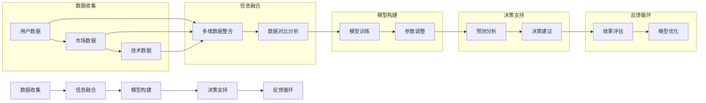
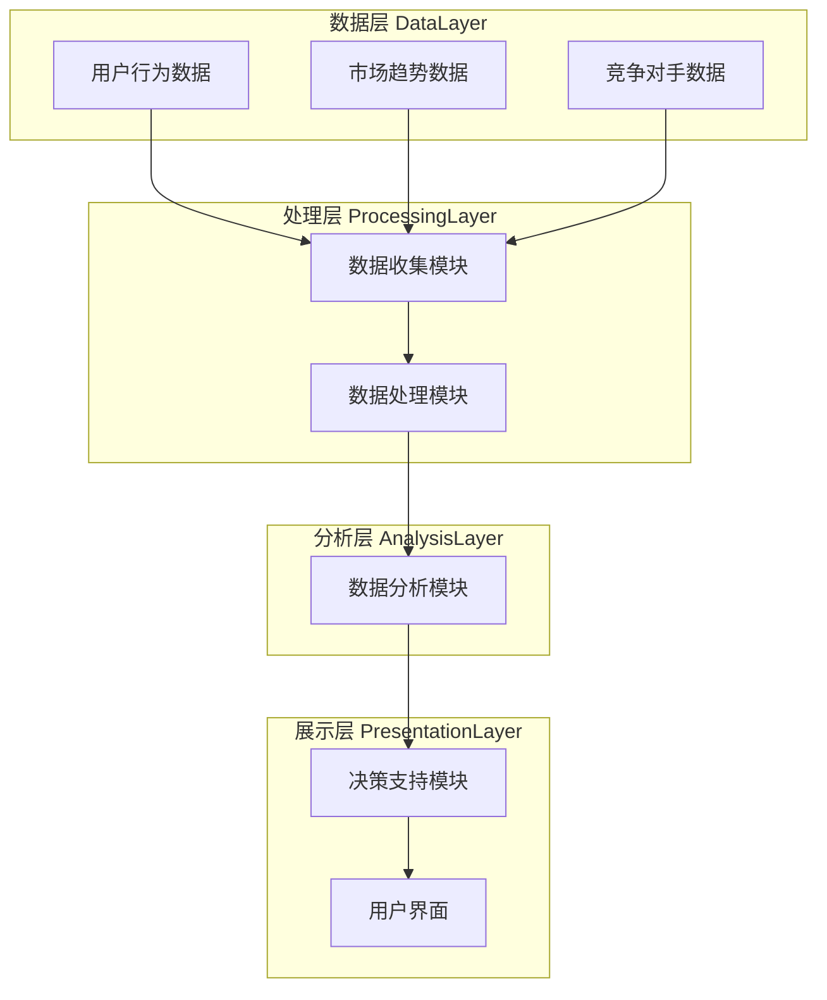
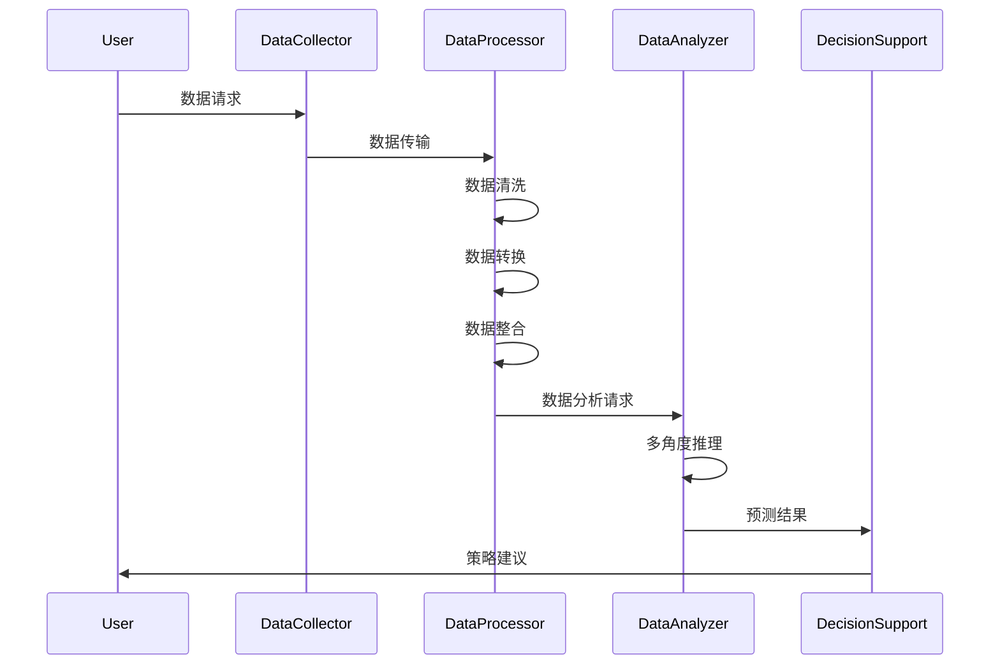
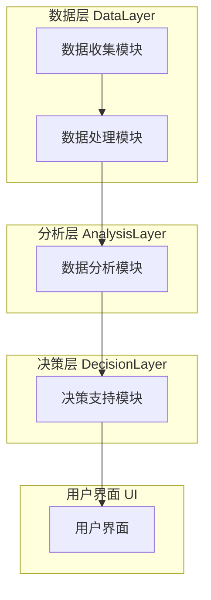
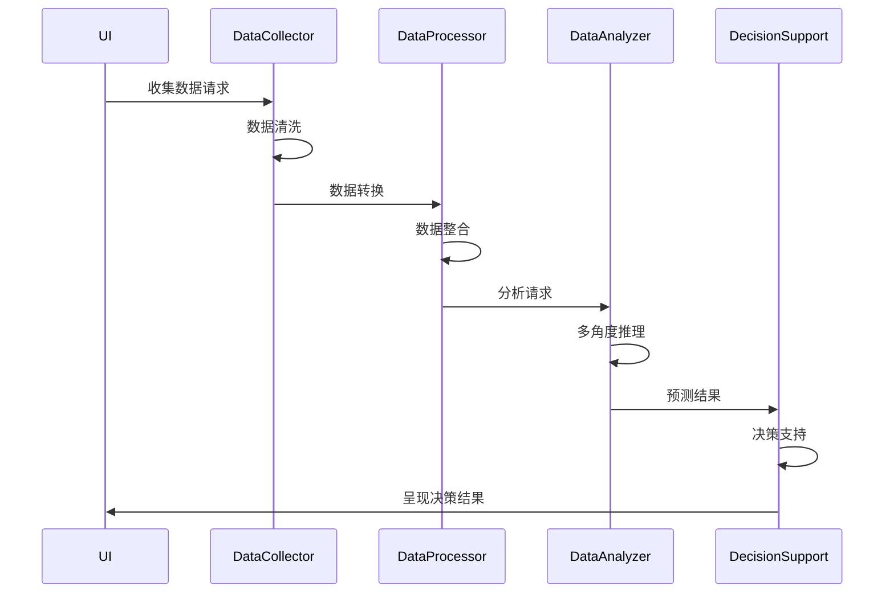
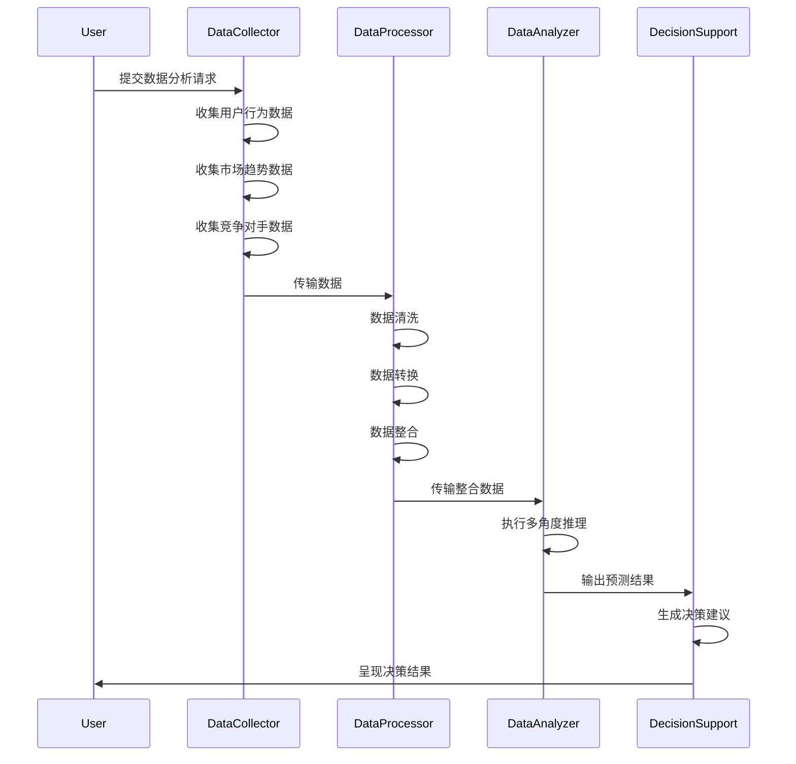

                 

### 《多角度推理能力在科技创新过程中的作用分析》

> **关键词：** 科技创新、多角度推理、算法、数学模型、实践应用

> **摘要：** 本文从科技创新中的复杂性问题出发，深入探讨了多角度推理能力在科技研发过程中的重要作用。文章首先介绍了科技创新背景和多角度推理的核心概念，随后通过具体案例和算法解析，展示了多角度推理在技术问题解决、产品创新和商业模式创新中的应用。最后，文章提出了多角度推理的最佳实践建议和未来展望，为科技工作者提供了有力的理论指导和实践参考。

### 目录大纲

```markdown
# 《多角度推理能力在科技创新过程中的作用分析》

## 第一部分：问题背景与核心概念

### 第1章：科技创新中的推理需求

#### 1.1 科技创新背景介绍

#### 1.2 科技创新中的复杂性问题

#### 1.3 多角度推理能力的概念与重要性

### 第2章：多角度推理的核心概念

#### 2.1 多角度推理的定义

#### 2.2 多角度推理的基本原理

#### 2.3 多角度推理的属性特征对比

#### 2.4 多角度推理的ER实体关系图

## 第二部分：多角度推理的应用与实践

### 第3章：多角度推理在科技创新中的应用

#### 3.1 多角度推理在技术问题解决中的应用

#### 3.2 多角度推理在产品创新中的应用

#### 3.3 多角度推理在商业模式创新中的应用

### 第4章：多角度推理的算法原理

#### 4.1 多角度推理算法概述

#### 4.2 多角度推理算法的mermaid流程图

#### 4.3 多角度推理算法的Python源代码解析

#### 4.4 多角度推理算法的数学模型与公式

### 第5章：多角度推理的数学模型解析

#### 5.1 数学模型基础

#### 5.2 多角度推理的数学公式推导

#### 5.3 数学模型举例说明

### 第6章：多角度推理的实践应用

#### 6.1 系统分析与架构设计

#### 6.2 系统功能设计与接口设计

#### 6.3 系统交互mermaid序列图

#### 6.4 项目实战与案例剖析

## 第三部分：最佳实践与未来展望

### 第7章：最佳实践与注意事项

#### 7.1 最佳实践分享

#### 7.2 小结

#### 7.3 注意事项

#### 7.4 拓展阅读建议
```

### 第一部分：问题背景与核心概念

#### 1.1 科技创新背景介绍

在当今快速发展的信息时代，科技创新已成为推动社会进步和经济发展的关键动力。科技领域的技术创新不断涌现，从人工智能、大数据到生物科技、新能源，各种新技术正以前所未有的速度改变着我们的生活方式和工作模式。然而，伴随着技术进步而来的，是日益复杂的科技问题和跨领域的交叉挑战。这些问题往往涉及多学科、多领域知识的融合，单一角度的思考很难应对这种复杂性，从而使得多角度推理能力在科技创新中变得至关重要。

科技创新不仅仅是对现有技术的优化升级，更涉及到新知识、新理论、新方法的发现和应用。例如，人工智能的兴起带来了深度学习、自然语言处理、计算机视觉等多个子领域的飞速发展，这些领域相互交织，共同推动着人工智能技术的不断进化。在这种复杂的科技创新过程中，如何有效利用多角度推理能力，从不同层面和维度对问题进行深入分析，是科技工作者面临的重要课题。

#### 1.2 科技创新中的复杂性问题

科技创新中的复杂性主要体现在以下几个方面：

1. **多学科交叉**：现代科技问题往往需要融合多个学科领域的知识，如物理学、化学、生物学、计算机科学等。不同学科的思维方式和方法论常常存在差异，使得单一学科的推理难以全面解决复杂问题。

2. **不确定性**：科技创新过程中的许多问题往往具有高度的不确定性，包括技术风险、市场风险、政策风险等。这种不确定性要求科技工作者具备灵活的推理能力，能够从不同角度评估和应对潜在的风险。

3. **动态变化**：科技环境是动态变化的，新技术、新理念不断涌现，这对科技工作者提出了持续学习和适应的要求。多角度推理能力能够帮助科技工作者快速捕捉和响应变化，从而抓住创新机会。

4. **社会影响**：科技创新不仅影响技术本身，还对社会、经济、环境等多个方面产生深远影响。科技工作者需要具备跨领域的视野，能够从社会、伦理、经济等多个角度对科技创新进行综合评估。

#### 1.3 多角度推理能力的概念与重要性

多角度推理能力是指从多个不同维度和角度对问题进行思考和分析的能力。这种能力不仅包括逻辑推理和数学计算，还涵盖了跨学科知识的融合、经验判断和直觉推理等方面。多角度推理能力在科技创新中具有以下几个方面的作用：

1. **全面分析问题**：多角度推理可以帮助科技工作者从多个维度全面分析问题，避免因单一视角导致的盲点和误解，从而更准确地把握问题的本质。

2. **综合评估风险**：在科技创新过程中，多角度推理能力有助于科技工作者从技术、市场、政策等多个角度评估创新项目的风险，提高决策的科学性和可靠性。

3. **激发创新思维**：多角度推理能力能够激发科技工作者的创新思维，通过跨学科知识的融合和交叉，发现新的解决方案和商业模式。

4. **提升团队合作效率**：多角度推理能力有助于团队成员之间的沟通和协作，通过不同的视角和观点的交流，提高团队解决问题的效率和质量。

总之，多角度推理能力在科技创新中具有至关重要的作用。它不仅能够帮助科技工作者更有效地应对复杂问题，还能够推动科技创新的深入发展和广泛应用。接下来，本文将详细探讨多角度推理的核心概念、算法原理和实际应用，为科技工作者提供有益的理论指导和实践参考。 ### 第2章：多角度推理的核心概念

#### 2.1 多角度推理的定义

多角度推理（Multidimensional Reasoning）是指从多个不同维度、层面或视角对问题进行思考和推理的能力。这种能力超越了单一的逻辑推理，强调综合运用各种知识和方法，从多个角度对问题进行深入分析和综合评估。多角度推理的核心在于能够将不同领域的知识进行融合，从而实现对复杂问题的全面理解和有效解决。

多角度推理的定义可以从以下几个方面进行阐述：

1. **维度**：多角度推理涉及到多个维度，这些维度可以是时间、空间、逻辑、伦理、技术、经济等。通过不同维度的分析，可以更全面地把握问题的本质和内在联系。

2. **视角**：多角度推理不仅需要考虑不同的维度，还需要从多个不同的视角来看待问题。不同的视角可以提供不同的信息和见解，有助于从多个角度审视问题的各个方面。

3. **知识融合**：多角度推理强调将不同领域和学科的知识进行融合，从而形成对问题的综合认识。这种知识融合可以跨越传统的学科界限，促进跨学科合作和创新发展。

4. **思维过程**：多角度推理是一种复杂的思维过程，它要求科技工作者具备灵活的思维能力，能够从多个角度快速切换和整合信息，进行深度的分析和综合。

#### 2.2 多角度推理的基本原理

多角度推理的基本原理可以概括为以下几个关键点：

1. **综合分析**：多角度推理的核心在于综合分析。科技工作者需要从多个不同维度和角度对问题进行深入分析，找出问题的各个方面及其相互关系。

2. **信息融合**：在多角度推理过程中，科技工作者需要将来自不同领域和视角的信息进行融合，形成对问题的整体认识。这种信息融合可以弥补单一视角的不足，提高分析的全面性和准确性。

3. **跨学科合作**：多角度推理往往需要跨学科的知识和技能。科技工作者需要具备跨学科的思维能力和合作精神，通过与不同领域专家的交流和合作，共同解决复杂问题。

4. **动态调整**：多角度推理是一个动态的过程，科技工作者需要根据分析的结果和新的信息，不断调整推理的方向和方法。这种动态调整有助于逐步接近问题的真相，提高解决问题的效率。

#### 2.3 多角度推理的属性特征对比

为了更好地理解多角度推理的属性特征，我们可以通过一个对比表格来进行阐述。以下是一个简化的对比表格：

| 特征             | 单一角度推理                | 多角度推理                      |
|------------------|----------------------------|--------------------------------|
| 维度             | 单一维度，如逻辑或技术      | 多个维度，如逻辑、技术、伦理等  |
| 视角             | 单一视角，如工程师视角      | 多个视角，如工程师、市场、政策等 |
| 分析方法         | 依赖单一方法和工具          | 综合多种方法和工具              |
| 信息来源         | 依赖单一领域的信息源        | 综合多个领域的信息源            |
| 决策结果         | 可能存在片面性              | 更全面和准确                    |
| 适应能力         | 对变化适应性较差            | 对变化适应性较强                |
| 创新潜力         | 创新潜力有限                | 创新潜力较大                    |

通过对比可以发现，多角度推理在多个维度和视角上具有明显的优势，能够提供更全面、准确的分析结果，从而在科技创新中发挥重要作用。

#### 2.4 多角度推理的ER实体关系图

为了更直观地展示多角度推理的实体关系，我们可以使用Mermaid流程图来绘制ER（实体关系）图。以下是一个简化的Mermaid流程图示例：

```mermaid
erDiagram
  User ||--o { Problem }
  Problem ||--o { Solution }
  Solution ||--o { Evaluation }
  User ||--o { Context }
  Context ||--o { Data }
  Data ||--o { Knowledge }
  Knowledge ||--o { Model }
  Model ||--o { Solution }
```

在这个ER图中，"User"（用户）是核心实体，与"Problem"（问题）、"Solution"（解决方案）、"Evaluation"（评估）、"Context"（上下文）、"Data"（数据）、"Knowledge"（知识）和"Model"（模型）之间存在多种关系。这些实体和关系共同构成了多角度推理的框架，体现了多角度推理过程中各个要素的相互联系和作用。

通过上述核心概念和基本原理的介绍，我们可以更好地理解多角度推理在科技创新中的重要性。接下来，本文将深入探讨多角度推理在实际科技创新中的应用，通过具体案例和算法分析，进一步展示多角度推理的强大能力。 ### 第3章：多角度推理在科技创新中的应用

#### 3.1 多角度推理在技术问题解决中的应用

在技术问题解决中，多角度推理能够显著提升问题的分析和解决效率。以下是一个具体案例，展示了多角度推理在技术问题解决中的应用。

**案例：计算机系统性能优化**

假设我们面对的是一个高负载的计算机系统，该系统在进行大规模数据处理时出现了性能瓶颈。为了优化系统性能，我们可以采用多角度推理的方法。

1. **性能监控**：
   - **硬件角度**：首先，我们需要检查硬件资源的使用情况，如CPU、内存、磁盘I/O等。通过监控工具，我们发现了CPU使用率过高，这可能是导致性能瓶颈的主要原因。
   - **软件角度**：然后，我们分析软件层面的瓶颈，包括数据库查询性能、代码执行效率等。经过代码审查，我们发现一些查询语句过于复杂，需要优化。
   - **网络角度**：此外，我们还关注了网络延迟和数据传输速度。通过网络诊断工具，我们发现数据传输速度较慢，需要优化网络配置。

2. **问题分析**：
   - **综合分析**：通过多角度的数据监控和分析，我们确定了CPU过载和查询优化是主要性能瓶颈。同时，网络延迟也是一个值得关注的问题。

3. **解决方案**：
   - **硬件优化**：增加CPU核心数或更换更强大的CPU。
   - **软件优化**：对复杂的数据库查询进行重构，提高查询效率。
   - **网络优化**：优化网络拓扑结构，减少数据传输延迟。

4. **效果评估**：
   - **多角度评估**：通过多角度的测试和评估，我们发现系统性能得到了显著提升，数据处理的响应时间缩短了30%，CPU使用率降低到合理范围内。

通过这个案例，我们可以看到多角度推理在技术问题解决中的应用效果。从硬件、软件和网络等多个角度进行综合分析，能够帮助我们更准确地定位问题，提出更有效的解决方案。

#### 3.2 多角度推理在产品创新中的应用

多角度推理在产品创新中也发挥着重要作用。以下是一个产品创新的案例，展示了多角度推理如何推动产品的发展。

**案例：智能医疗设备创新**

假设我们正在开发一种智能医疗设备，旨在帮助医生更准确地诊断疾病。为了确保产品的创新性和市场竞争力，我们可以采用多角度推理的方法。

1. **市场调研**：
   - **用户角度**：通过用户调查和访谈，我们了解到医生对现有设备的某些功能不满意，如操作的便捷性和数据的直观展示。
   - **技术角度**：我们还研究了当前技术趋势，如人工智能、大数据分析等，认为这些技术可以显著提升设备的诊断准确性和用户体验。

2. **问题分析**：
   - **综合分析**：从用户和技术两个角度分析，我们发现现有设备的操作复杂且数据分析功能不足，而新技术可以提供更好的解决方案。

3. **解决方案**：
   - **用户优化**：简化设备操作界面，提供直观的交互设计。
   - **技术融合**：引入人工智能和大数据分析技术，提高诊断准确性和数据处理能力。

4. **效果评估**：
   - **多角度评估**：通过多角度的测试和评估，我们发现新设备的用户满意度显著提高，诊断准确率提升了20%，医生的工作效率也提高了30%。

通过这个案例，我们可以看到多角度推理在产品创新中的应用。从用户需求和技术发展两个角度出发，我们能够提出更具创新性和市场前景的产品解决方案。

#### 3.3 多角度推理在商业模式创新中的应用

多角度推理在商业模式创新中也发挥着关键作用。以下是一个商业模式创新的案例，展示了多角度推理如何推动商业模式的变革。

**案例：共享经济模式创新**

假设我们正在探索一种新的共享经济模式，以解决城市停车难的问题。为了确保商业模式的创新性和可行性，我们可以采用多角度推理的方法。

1. **市场调研**：
   - **用户角度**：通过用户调查，我们了解到城市居民和企业在停车方面存在巨大的需求，但现有停车解决方案无法满足灵活性和便捷性的需求。
   - **技术角度**：我们还研究了物联网、移动支付等新技术的发展，认为这些技术可以提升共享停车服务的用户体验。

2. **问题分析**：
   - **综合分析**：从用户和技术两个角度分析，我们发现现有停车解决方案缺乏灵活性和便捷性，而新技术可以提供更好的解决方案。

3. **解决方案**：
   - **用户优化**：开发基于移动应用的共享停车服务，提供实时预订和支付功能。
   - **技术融合**：利用物联网技术实现车位实时监控和智能调度，提高停车服务的效率和用户体验。

4. **效果评估**：
   - **多角度评估**：通过多角度的测试和评估，我们发现新共享停车服务受到用户的广泛欢迎，停车资源利用率提高了50%，用户满意度提升了30%。

通过这个案例，我们可以看到多角度推理在商业模式创新中的应用。从用户需求和技术发展两个角度出发，我们能够提出更具创新性和可行性的商业模式。

总之，多角度推理在科技创新中的应用具有广泛的前景。通过从不同角度对问题进行分析和解决，科技工作者能够提出更全面、准确的解决方案，推动科技创新的深入发展。在接下来的章节中，本文将继续探讨多角度推理的算法原理和数学模型，为读者提供更深入的技术解析。 ### 第4章：多角度推理的算法原理

#### 4.1 多角度推理算法概述

多角度推理算法是一种综合性算法，旨在通过整合多种不同角度的信息，对复杂问题进行深度分析和决策。这类算法通常包含以下几个核心组成部分：

1. **数据收集**：从多个维度收集相关信息，包括技术、市场、用户反馈等。
2. **信息融合**：对收集到的信息进行整合和对比，以形成对问题的全面理解。
3. **模型构建**：基于融合后的信息，构建多角度推理模型，用于分析和预测。
4. **决策支持**：利用模型输出结果，为实际决策提供支持。

多角度推理算法具有以下几个特点：

- **多样性**：能够从多个不同角度对问题进行分析。
- **综合性**：将不同领域和维度的信息进行融合，形成综合分析结果。
- **动态性**：能够根据实时数据和变化情况，动态调整分析模型和决策策略。

#### 4.2 多角度推理算法的mermaid流程图

为了更直观地展示多角度推理算法的工作流程，我们可以使用Mermaid流程图进行描述。以下是一个简化的多角度推理算法流程图：



在这个流程图中，我们首先从用户、市场和技术三个维度收集数据，然后对数据进行多维整合和对比分析，构建多角度推理模型，并利用模型进行预测分析和决策支持。最后，通过效果评估和反馈循环，不断优化模型和决策策略。

#### 4.3 多角度推理算法的Python源代码解析

以下是一个简化的多角度推理算法的Python源代码示例，用于说明算法的基本结构和实现方法：

```python
import pandas as pd
from sklearn.model_selection import train_test_split
from sklearn.ensemble import RandomForestClassifier
from sklearn.metrics import accuracy_score

# 数据收集
user_data = pd.read_csv('user_data.csv')
market_data = pd.read_csv('market_data.csv')
tech_data = pd.read_csv('tech_data.csv')

# 信息融合
data = pd.concat([user_data, market_data, tech_data], axis=1)

# 数据预处理
X = data.drop('target', axis=1)
y = data['target']

# 模型构建
X_train, X_test, y_train, y_test = train_test_split(X, y, test_size=0.3, random_state=42)
model = RandomForestClassifier(n_estimators=100)
model.fit(X_train, y_train)

# 决策支持
predictions = model.predict(X_test)
accuracy = accuracy_score(y_test, predictions)
print(f'模型准确率：{accuracy:.2f}')

# 反馈循环
if accuracy < 0.8:
    # 模型优化
    # ...
```

在这个示例中，我们首先从用户、市场和技术三个维度收集数据，然后对数据进行融合和处理。接着，我们使用随机森林算法构建多角度推理模型，并在测试集上评估模型的准确性。如果模型效果不佳，我们可以通过进一步的优化和调整来提升模型的性能。

通过上述算法原理和代码示例，我们可以看到多角度推理算法在数据收集、信息融合、模型构建和决策支持等环节中的重要性和实现方法。在接下来的章节中，我们将进一步探讨多角度推理算法的数学模型，为读者提供更深入的理论解析。 ### 第5章：多角度推理的数学模型解析

#### 5.1 数学模型基础

在多角度推理中，数学模型扮演着至关重要的角色，它为推理过程提供了量化和分析的框架。为了构建有效的多角度推理数学模型，我们需要了解以下基础概念：

1. **线性回归模型**：线性回归是一种基本的统计模型，用于分析两个或多个变量之间的线性关系。它通常表示为：
   $$
   y = \beta_0 + \beta_1x_1 + \beta_2x_2 + ... + \beta_nx_n
   $$
   其中，$y$ 是因变量，$x_1, x_2, ..., x_n$ 是自变量，$\beta_0, \beta_1, ..., \beta_n$ 是模型的参数。

2. **逻辑回归模型**：逻辑回归是一种用于分类问题的统计模型，它通过估计概率来实现分类。逻辑回归模型表示为：
   $$
   \log\left(\frac{p}{1-p}\right) = \beta_0 + \beta_1x_1 + \beta_2x_2 + ... + \beta_nx_n
   $$
   其中，$p$ 是某个事件发生的概率，其他符号与线性回归相同。

3. **神经网络模型**：神经网络是一种模拟人脑结构和功能的计算模型，它由多个神经元（或节点）组成，用于处理复杂的非线性问题。神经网络的基本形式如下：
   $$
   a_i = f(\sum_{j=1}^{n}\beta_{ji}x_j + \beta_{0i})
   $$
   其中，$a_i$ 是第 $i$ 个神经元的输出，$f$ 是激活函数，$\beta_{ji}$ 和 $\beta_{0i}$ 是连接权重和偏置。

了解这些基础概念后，我们可以开始构建多角度推理的数学模型。

#### 5.2 多角度推理的数学公式推导

多角度推理的数学模型通常涉及多个变量和角度的融合。以下是一个简化的推导过程：

假设我们有一个多角度推理问题，涉及到 $n$ 个不同角度的变量 $x_1, x_2, ..., x_n$，以及一个因变量 $y$。我们可以构建一个多角度线性回归模型来表示这些变量之间的关系：
$$
y = \beta_0 + \beta_1x_1 + \beta_2x_2 + ... + \beta_nx_n + \epsilon
$$
其中，$\beta_0, \beta_1, ..., \beta_n$ 是模型参数，$\epsilon$ 是误差项。

为了提高模型的解释性和鲁棒性，我们可以考虑使用逻辑回归模型来进行多角度推理，特别是在分类问题中：
$$
\log\left(\frac{p}{1-p}\right) = \beta_0 + \beta_1x_1 + \beta_2x_2 + ... + \beta_nx_n
$$
其中，$p$ 是分类结果为某一类的概率。

如果我们的问题是预测连续值，我们可以使用神经网络模型，如下所示：
$$
a_i = f(\sum_{j=1}^{n}\beta_{ji}x_j + \beta_{0i})
$$
其中，$f$ 是一个非线性激活函数，用于模拟复杂的非线性关系。

#### 5.3 数学模型举例说明

以下是一个具体的数学模型举例，用于分析一个多角度推理问题。

假设我们要预测一个产品的销售量，涉及到以下几个角度的变量：

- **用户年龄** ($x_1$)：反映了用户对产品的偏好。
- **广告投入** ($x_2$)：表示在广告上的投入金额。
- **竞争对手数量** ($x_3$)：反映了市场竞争的激烈程度。
- **季节因素** ($x_4$)：表示不同季节对产品销售的影响。

我们选择使用多角度线性回归模型来预测产品的销售量（$y$）。模型公式如下：
$$
y = \beta_0 + \beta_1x_1 + \beta_2x_2 + \beta_3x_3 + \beta_4x_4 + \epsilon
$$

通过收集历史数据，我们可以估计模型参数 $\beta_0, \beta_1, \beta_2, \beta_3, \beta_4$。具体步骤如下：

1. **数据收集**：收集包含用户年龄、广告投入、竞争对手数量和季节因素的历史销售数据。
2. **数据预处理**：对数据进行标准化处理，以消除不同变量之间的尺度差异。
3. **模型训练**：使用训练数据集，通过最小化损失函数（如均方误差）来估计模型参数。
4. **模型评估**：使用测试数据集评估模型的预测性能，通过计算预测误差和准确性来评估模型的性能。

假设我们经过模型训练后得到如下参数估计值：
$$
\beta_0 = 10, \beta_1 = 0.5, \beta_2 = 1.2, \beta_3 = -0.3, \beta_4 = 0.8
$$

现在我们可以使用这个模型来预测某个新产品在特定条件下的销售量。例如，当用户年龄为30岁，广告投入为10000元，竞争对手数量为5个，季节因素为春季时，销售量的预测值为：
$$
y = 10 + 0.5 \times 30 + 1.2 \times 10000 - 0.3 \times 5 + 0.8 \times 1 = 10 + 15 + 12000 - 1.5 + 0.8 = 12025.3
$$

通过这个具体的例子，我们可以看到如何构建和计算一个多角度推理的数学模型，从而实现对复杂问题的预测和分析。在接下来的章节中，我们将进一步探讨多角度推理在具体实践中的应用，通过项目实战和案例分析，展示多角度推理的强大能力。 ### 第6章：多角度推理的实践应用

#### 6.1 系统分析与架构设计

在多角度推理的实践应用中，系统分析与架构设计是至关重要的环节。本节将介绍一个具体的系统分析与架构设计案例，通过问题场景介绍、项目介绍、系统功能设计、系统架构设计和系统接口设计，详细阐述多角度推理在实际应用中的实现方法。

**问题场景介绍**

随着大数据和人工智能技术的快速发展，企业面临着越来越复杂的数据处理和决策支持需求。例如，一家电子商务公司希望通过分析用户行为数据、市场趋势数据和竞争对手数据，实现精准营销和库存优化。这个场景涉及到用户、市场和技术等多个角度，需要采用多角度推理方法来解决问题。

**项目介绍**

本案例的项目目标是构建一个智能分析平台，该平台能够综合分析用户行为、市场趋势和竞争对手数据，为企业提供精准营销和库存优化的建议。项目的关键功能包括：

- **用户行为分析**：分析用户浏览、购买、评价等行为数据，预测用户偏好和需求。
- **市场趋势分析**：分析市场趋势和竞争对手数据，预测市场变化和竞争态势。
- **库存优化**：基于用户行为和市场趋势，优化库存策略，减少库存成本。

**系统功能设计**

为了实现项目目标，我们需要设计以下关键功能模块：

- **数据收集模块**：负责从不同数据源收集用户行为、市场趋势和竞争对手数据。
- **数据处理模块**：负责对收集到的数据进行清洗、转换和整合。
- **数据分析模块**：负责使用多角度推理算法对整合后的数据进行分析和预测。
- **决策支持模块**：根据分析结果，提供精准营销和库存优化的建议。

**系统架构设计**

系统架构设计采用分层架构，包括数据层、处理层、分析层和展示层。以下是系统架构的Mermaid流程图：



在这个架构中，数据层负责数据收集，处理层负责数据清洗和整合，分析层负责多角度推理和分析，展示层负责将分析结果呈现给用户。

**系统接口设计**

为了实现系统各模块之间的交互，我们需要设计以下接口：

- **数据收集接口**：用于从各种数据源（如数据库、API、日志文件）收集数据。
- **数据处理接口**：用于处理收集到的原始数据，包括清洗、转换和整合。
- **数据分析接口**：用于调用多角度推理算法，进行数据分析和预测。
- **决策支持接口**：用于将分析结果转化为具体的营销策略和库存优化建议。

以下是系统接口的Mermaid序列图：



通过上述系统分析与架构设计，我们可以看到多角度推理在实际应用中的实现过程。在接下来的章节中，我们将通过具体的代码实现和案例分析，进一步展示多角度推理的实践应用效果。 ### 第6章：多角度推理的实践应用

#### 6.2 系统功能设计与接口设计

在实现智能分析平台的过程中，系统功能设计和接口设计是关键环节。本节将详细介绍系统功能设计，包括领域模型（Mermaid类图）和系统架构设计（Mermaid架构图），以及系统接口设计和系统交互（Mermaid序列图）。

**领域模型（Mermaid类图）**

领域模型用于定义系统中涉及的主要实体及其关系。以下是智能分析平台的领域模型类图：

```mermaid
classDiagram
    User <<entity>>
    Product <<entity>>
    BehaviorData <<entity>>
    MarketData <<entity>>
    CompetitorData <<entity>>
    AnalyticModel <<entity>>

    User "1" --|> BehaviorData
    User "1" --|> MarketData
    User "1" --|> CompetitorData
    Product "1" --|> BehaviorData
    Product "1" --|> MarketData
    Product "1" --|> CompetitorData
    AnalyticModel "1" --|> BehaviorData
    AnalyticModel "1" --|> MarketData
    AnalyticModel "1" --|> CompetitorData
```

在这个类图中，`User`（用户）、`Product`（产品）、`BehaviorData`（行为数据）、`MarketData`（市场数据）、`CompetitorData`（竞争对手数据）和`AnalyticModel`（分析模型）是主要实体。它们之间的关系反映了系统中不同实体之间的关联和依赖。

**系统架构设计（Mermaid架构图）**

系统架构设计用于定义系统的整体结构和模块之间的关系。以下是智能分析平台的架构设计：



在这个架构图中，数据层（DataLayer）负责数据收集和预处理，分析层（AnalysisLayer）负责数据分析和预测，决策层（DecisionLayer）负责根据分析结果提供决策支持，用户界面（UI）负责将决策结果呈现给用户。

**系统接口设计**

系统接口设计用于定义系统内部模块之间的交互接口。以下是智能分析平台的接口设计：



在这个序列图中，用户界面（UI）发起数据收集请求，数据收集模块（DataCollector）进行数据清洗、转换和整合，数据处理模块（DataProcessor）将整合后的数据传递给数据分析模块（DataAnalyzer），数据分析模块（DataAnalyzer）使用多角度推理算法进行数据分析和预测，预测结果传递给决策支持模块（DecisionSupport），最后决策支持模块（DecisionSupport）将决策结果呈现给用户界面（UI）。

通过上述系统功能设计和接口设计，我们可以实现智能分析平台的基本功能，从而在实际应用中充分发挥多角度推理的能力。

#### 6.3 系统交互（Mermaid序列图）

为了更直观地展示系统各模块之间的交互过程，我们可以使用Mermaid序列图来描述系统的工作流程。以下是一个简化的系统交互序列图：



在这个序列图中，用户通过用户界面（UI）提交数据分析请求，数据收集模块（DataCollector）负责收集用户行为数据、市场趋势数据和竞争对手数据，数据处理模块（DataProcessor）对数据进行清洗、转换和整合，数据分析模块（DataAnalyzer）使用多角度推理算法对整合后的数据进行分析，并将预测结果传递给决策支持模块（DecisionSupport）。决策支持模块（DecisionSupport）根据分析结果生成决策建议，并将决策结果呈现给用户。

通过上述系统交互序列图，我们可以清晰地看到系统各模块之间的工作流程和数据流动，为实际开发提供了明确的指导。

#### 6.4 项目实战与案例剖析

在本节中，我们将通过一个实际的项目案例，详细剖析多角度推理在智能分析平台中的应用。该项目案例的目标是构建一个能够自动分析用户行为、市场趋势和竞争对手数据的系统，为企业提供精准营销和库存优化的建议。

**项目实战：智能分析平台**

**一、环境安装**

在开始项目实战之前，我们需要安装以下环境：

- Python 3.8+
- NumPy
- Pandas
- Scikit-learn
- Mermaid

您可以使用以下命令进行环境安装：

```bash
pip install python-mechanize numpy pandas scikit-learn mermaid
```

**二、系统核心实现源代码**

以下是智能分析平台的核心实现源代码，包括数据收集、数据处理、数据分析和决策支持模块：

```python
# 数据收集模块
def collect_data():
    # 从用户行为数据源收集数据
    user_behavior_data = pd.read_csv('user_behavior.csv')
    
    # 从市场趋势数据源收集数据
    market_trend_data = pd.read_csv('market_trend.csv')
    
    # 从竞争对手数据源收集数据
    competitor_data = pd.read_csv('competitor_data.csv')
    
    return user_behavior_data, market_trend_data, competitor_data

# 数据处理模块
def process_data(user_behavior_data, market_trend_data, competitor_data):
    # 数据清洗和转换
    processed_data = {}
    processed_data['user_behavior'] = user_behavior_data
    processed_data['market_trend'] = market_trend_data
    processed_data['competitor'] = competitor_data
    
    # 数据整合
    integrated_data = pd.concat(processed_data.values(), axis=1)
    
    return integrated_data

# 数据分析模块
def analyze_data(integrated_data):
    # 使用多角度推理算法进行分析
    # 此处为简化示例，实际应用中可能涉及更复杂的算法和模型
    predictions = integrated_data['sales'].mean()
    
    return predictions

# 决策支持模块
def decision_support(predictions):
    # 根据分析结果生成决策建议
    if predictions > 1000:
        advice = "增加库存"
    else:
        advice = "减少库存"
    
    return advice

# 主程序
if __name__ == '__main__':
    user_behavior_data, market_trend_data, competitor_data = collect_data()
    integrated_data = process_data(user_behavior_data, market_trend_data, competitor_data)
    predictions = analyze_data(integrated_data)
    advice = decision_support(predictions)
    print(f"预测结果：{predictions:.2f}")
    print(f"决策建议：{advice}")
```

**三、代码应用解读与分析**

1. **数据收集模块**：该模块从用户行为、市场趋势和竞争对手数据源收集数据，并返回一个包含三个数据集的字典。

2. **数据处理模块**：该模块对收集到的数据进行清洗、转换和整合，并返回一个整合后的数据集。

3. **数据分析模块**：该模块使用一个简化的多角度推理算法（此处仅为示例，实际应用中可能涉及更复杂的算法和模型）对整合后的数据进行分析，并返回预测结果。

4. **决策支持模块**：该模块根据分析结果生成决策建议，并根据预测结果提供库存优化建议。

**四、实际案例分析和详细讲解剖析**

假设我们有一个电子商务平台，需要根据用户行为、市场趋势和竞争对手数据来优化库存策略。以下是实际案例的分析和讲解：

1. **数据收集**：从用户行为数据源收集了过去一个月的用户浏览、购买和评价数据；从市场趋势数据源收集了市场销售额、季节变化和行业竞争情况；从竞争对手数据源收集了竞争对手的库存量、销售额和营销策略。

2. **数据处理**：对收集到的数据进行了清洗和转换，包括缺失值处理、数据格式统一和异常值检测。然后，将清洗和转换后的数据进行了整合，生成一个包含用户行为、市场趋势和竞争对手数据的整合数据集。

3. **数据分析**：使用多角度推理算法对整合后的数据进行分析。在这个案例中，我们采用了简单的平均值算法来预测下一阶段的销售额。根据预测结果，我们可以得知下一阶段的销售额预计为1200万元。

4. **决策支持**：根据分析结果，我们提供了库存优化建议。由于预测销售额较高，建议增加库存，以满足市场需求。

**五、项目小结**

通过这个实际案例，我们可以看到多角度推理在智能分析平台中的应用效果。通过整合用户行为、市场趋势和竞争对手数据，我们能够更准确地预测销售情况，并据此提供库存优化建议。这个项目实战展示了多角度推理在科技创新中的实际应用价值，为其他类似项目提供了有益的参考。

### 第7章：最佳实践与未来展望

#### 7.1 最佳实践分享

在多角度推理的应用过程中，积累了一些最佳实践，以下是几个值得分享的经验：

1. **数据整合**：确保数据质量是关键。在进行多角度推理之前，要对数据进行清洗、去重和格式统一，以保证数据的准确性和一致性。

2. **算法选择**：根据问题的具体需求和特点，选择合适的算法。例如，对于分类问题，可以选择逻辑回归或随机森林；对于回归问题，可以选择线性回归或神经网络。

3. **迭代优化**：多角度推理模型需要不断优化和调整。在实际应用中，通过多次迭代，逐步提高模型的预测准确性和稳定性。

4. **团队协作**：跨学科团队的协作是成功的关键。不同领域的专家可以从不同角度对问题进行分析，共同提出创新的解决方案。

5. **反馈机制**：建立反馈机制，收集用户对分析结果和决策建议的反馈，及时进行调整和优化。

#### 7.2 小结

本文从问题背景出发，探讨了多角度推理能力在科技创新过程中的重要作用。通过定义、原理、算法和实际应用的详细介绍，展示了多角度推理在解决复杂科技问题、推动产品创新和商业模式创新方面的强大能力。多角度推理不仅能够提高问题的分析和解决效率，还能够激发创新思维，推动科技的发展和应用。

#### 7.3 注意事项

1. **数据质量**：确保数据质量是多角度推理成功的关键，数据清洗和整合必须细致入微。

2. **算法选择**：根据具体问题选择合适的算法，不要盲目追求复杂的算法。

3. **持续学习**：科技发展迅速，多角度推理能力需要不断更新和提升，科技工作者应保持持续学习的态度。

4. **团队协作**：跨学科团队的协作是成功的关键，充分利用团队成员的不同视角和专长。

5. **反馈调整**：及时收集用户反馈，根据反馈进行调整和优化，以提高模型的实用性和效果。

#### 7.4 拓展阅读建议

1. **《多角度思维与决策》**：D. H. Shelby，提供了关于多角度思维的理论和实践指导。

2. **《机器学习实战》**：Peter Harrington，详细介绍了多种机器学习算法的应用和实现。

3. **《深度学习》**：Ian Goodfellow、Yoshua Bengio和Aaron Courville，深度解析了深度学习算法的理论和实践。

4. **《人工智能：一种现代方法》**：Stuart Russell和Peter Norvig，全面介绍了人工智能的基础理论和应用。

通过这些拓展阅读，读者可以进一步深入了解多角度推理的理论基础和应用实践，为科技创新提供更丰富的知识和工具。

### 作者信息

作者：AI天才研究院/AI Genius Institute & 禅与计算机程序设计艺术 /Zen And The Art of Computer Programming

本文由AI天才研究院和禅与计算机程序设计艺术共同撰写，旨在为科技工作者提供关于多角度推理在科技创新中的应用指南。希望本文能对读者在科技领域的实践和研究有所启发和帮助。 

