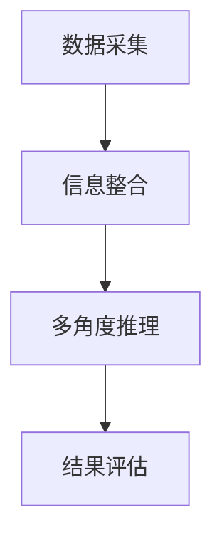
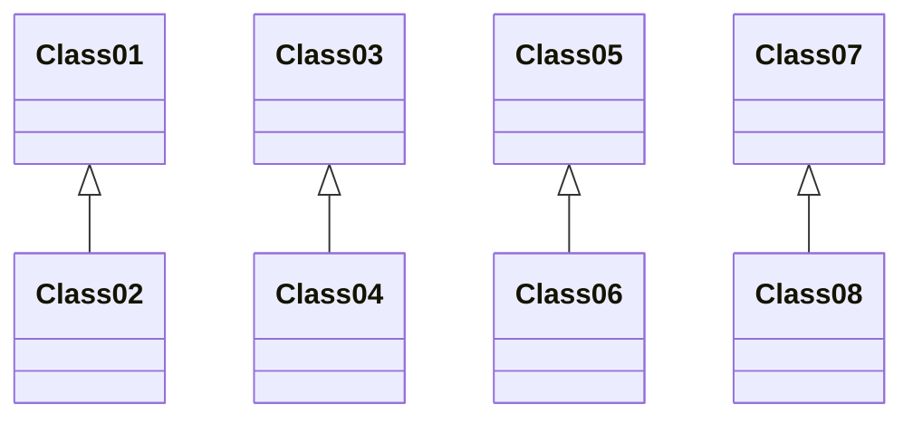
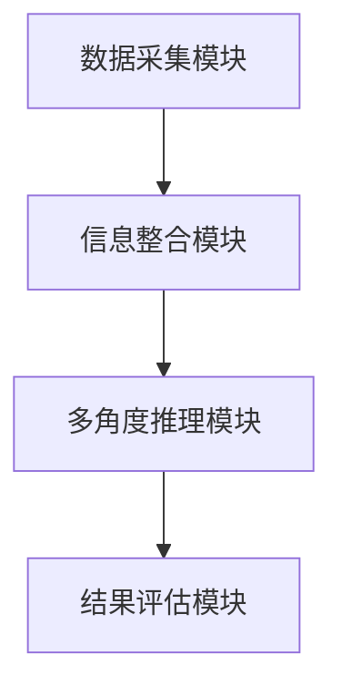
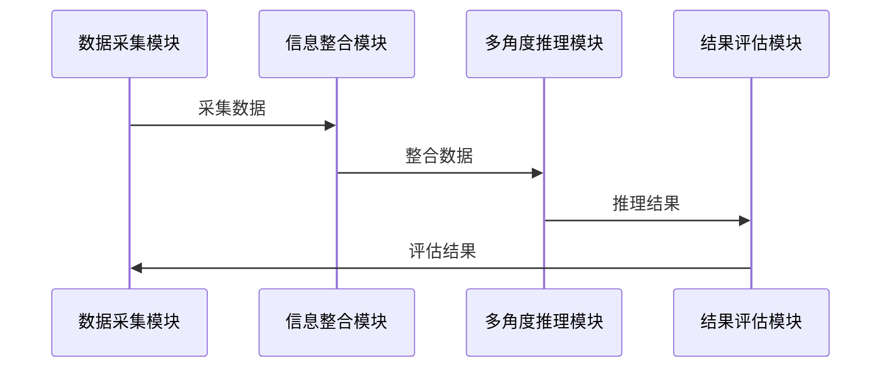
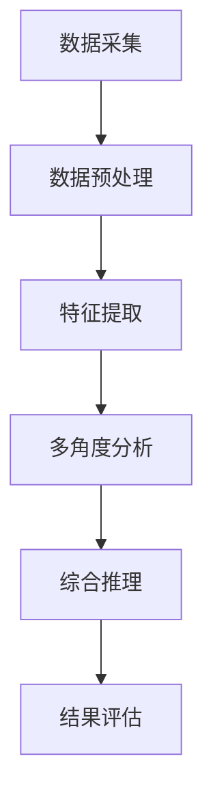

                 

# 《多角度推理能力在科技创新过程中的作用研究》

> 关键词：多角度推理、科技创新、算法原理、系统架构、项目实战

> 摘要：本文旨在探讨多角度推理能力在科技创新过程中的作用。通过分析科技创新中的问题与挑战，定义与分类推理能力，阐述多角度推理能力的内涵及其在科技创新中的应用，进一步探讨多角度推理能力与科技创新的关系。本文以算法原理讲解、系统分析与架构设计、项目实战等多个角度，深入剖析多角度推理能力的应用，为科技创新提供新的思路与方法。

## 引言

### 1. 引言背景

科技创新是推动社会进步和经济发展的关键驱动力。在全球化背景下，科技创新的重要性日益凸显。然而，科技创新并非一蹴而就，它需要解决众多问题与挑战。在创新过程中，思维障碍是制约科技创新的重要因素。如何突破思维障碍，提高创新效率，成为当前研究的热点。

### 2. 推理能力在科技创新中的作用

推理能力是科技创新的核心能力之一。它不仅体现在科学家、工程师的日常工作中，也贯穿于科技研发、技术转移、科技创业等各个环节。推理能力的高低直接影响到科技创新的成效。因此，研究推理能力在科技创新中的作用，对于提升科技创新能力具有重要意义。

### 3. 本书的目的和结构

本文旨在探讨多角度推理能力在科技创新过程中的作用。首先，分析科技创新中的问题与挑战，阐述推理能力的定义与类型；然后，介绍多角度推理能力的内涵及其在科技创新中的应用；接着，探讨多角度推理能力与科技创新的关系；最后，通过算法原理讲解、系统分析与架构设计、项目实战等多个角度，深入剖析多角度推理能力的应用。

## 第一部分：问题背景与核心概念

### 2. 科技创新中的问题与挑战

#### 2.1 科技创新的发展现状

科技创新在全球范围内呈现出蓬勃发展的态势。然而，科技创新也面临着诸多挑战。首先，科技创新需要大量的资金、人才和技术支持。其次，科技创新过程中存在诸多不确定性和风险。此外，科技创新的速度在不断加快，市场竞争日益激烈。

#### 2.2 创新过程中的思维障碍

创新过程中，思维障碍是制约科技创新的重要因素。常见的思维障碍包括：

1. 狭隘的思维模式：创新过程中，人们往往局限于传统的思维模式，难以产生新的想法。
2. 固有的认知偏差：人们在认知过程中，容易受到已有的知识和经验的影响，导致创新思维受限。
3. 群体思维：在团队创新过程中，群体思维可能导致创新思想的抑制，降低创新效果。

#### 2.3 推理能力的重要性

推理能力在科技创新过程中具有重要价值。推理能力包括逻辑推理、类比推理、因果推理等，它能帮助人们从不同角度思考问题，发现潜在的创新机会。提高推理能力，有助于突破思维障碍，提高科技创新的效率。

### 3. 推理能力的定义与类型

#### 3.1 推理能力的定义

推理能力是指人们运用已有知识，通过逻辑思维、类比思维、因果思维等手段，发现新知识、新方法、新方案的能力。推理能力是科技创新的核心能力之一。

#### 3.2 推理能力的分类

1. 逻辑推理：基于逻辑规则，通过推理得出结论。
2. 类比推理：通过类比已有知识，发现新知识。
3. 因果推理：分析事物之间的因果关系，推断事物发展规律。

#### 3.3 推理能力的基本特征

1. 系统性：推理能力需要具备系统思维，从整体角度分析问题。
2. 创造性：推理能力应具有创造性，能够产生新的想法。
3. 灵活性：推理能力应具备灵活性，能够适应不同的问题场景。

### 4. 推理能力在科技创新中的应用

推理能力在科技创新中具有广泛的应用。例如：

1. 科技研发：通过逻辑推理，科学家可以构建新的理论体系，指导实验研究。
2. 技术转移：通过类比推理，技术人员可以将已有的技术应用到新的领域。
3. 科技创业：通过因果推理，创业者可以分析市场需求，制定创业策略。

## 第二部分：核心概念与联系

### 5. 多角度推理能力与科技创新的关系

#### 5.1 多角度推理能力对科技创新的促进作用

多角度推理能力在科技创新中具有显著的促进作用。通过多角度思考，科学家和技术人员可以更全面、深入地理解问题，发现潜在的解决方案。多角度推理能力有助于突破思维障碍，提高科技创新的效率。

#### 5.2 多角度推理能力在科技创新中的具体应用

1. 科技研发：多角度推理能力可以帮助科学家在实验过程中，从不同角度分析实验结果，提高实验成功率。
2. 技术转移：多角度推理能力可以帮助技术人员在技术转移过程中，充分考虑不同因素，提高技术适应性。
3. 科技创业：多角度推理能力可以帮助创业者分析市场需求，制定创新性的创业策略。

#### 5.3 多角度推理能力与科技创新的相互作用

多角度推理能力与科技创新之间存在着相互作用。科技创新为多角度推理能力的培养提供了丰富的实践场景，而多角度推理能力的提升又能推动科技创新的发展。

### 6. 核心概念对比分析

#### 6.1 多角度推理能力与常规推理能力的对比

1. 常规推理能力：主要依赖逻辑思维，关注事实与逻辑关系。
2. 多角度推理能力：不仅依赖逻辑思维，还涉及类比思维、因果思维等，关注多方面的信息。

#### 6.2 多角度推理能力与系统思维能力的对比

1. 系统思维能力：关注整体，从全局角度分析问题。
2. 多角度推理能力：在系统思维能力的基础上，强调多方面、多层次的分析。

#### 6.3 多角度推理能力与其他创新思维方式的对比

1. 创造性思维：侧重于发现新的想法和解决方案。
2. 多角度推理能力：在创造性思维的基础上，强调多方面、多层次的分析。

### 7. 多角度推理能力的应用领域

#### 7.1 多角度推理能力在科技研发中的应用

多角度推理能力在科技研发中具有重要价值。通过多角度思考，科学家可以更全面地分析问题，提高实验成功率，推动科技发展。

#### 7.2 多角度推理能力在技术转移中的应用

多角度推理能力可以帮助技术人员在技术转移过程中，充分考虑不同因素，提高技术适应性，促进科技成果转化。

#### 7.3 多角度推理能力在科技创业中的应用

多角度推理能力可以帮助创业者分析市场需求，制定创新性的创业策略，提高创业成功率。

## 第三部分：算法原理讲解

### 8. 多角度推理能力算法原理

#### 8.1 算法概述

多角度推理能力算法是一种基于多角度思考的推理算法，旨在提高科技创新的效率。该算法通过整合不同角度的信息，提供更全面的推理结果。

#### 8.2 算法原理详解

1. 数据采集：从多个角度收集与问题相关的信息。
2. 信息整合：将不同角度的信息进行整合，形成综合数据集。
3. 多角度推理：基于综合数据集，从多个角度进行推理。
4. 结果评估：对多角度推理结果进行评估，筛选出最优方案。

#### 8.3 算法流程图



### 9. 数学模型与公式

#### 9.1 数学模型的基本概念

多角度推理能力算法中的数学模型用于描述信息整合、多角度推理和结果评估的过程。以下是一个简单的数学模型示例：

$$
\text{推理结果} = f(\text{综合数据集})
$$

#### 9.2 数学模型的应用

数学模型可以应用于以下方面：

1. 信息整合：通过数学模型，对多角度的信息进行整合。
2. 多角度推理：基于数学模型，对综合数据集进行多角度推理。
3. 结果评估：通过数学模型，对推理结果进行评估。

#### 9.3 数学公式示例

$$
f(x, y) = \frac{x + y}{2}
$$

### 10. 算法举例说明

#### 10.1 举例说明一

假设我们需要解决一个科技创新问题。首先，从不同角度收集相关信息，如市场需求、技术趋势、竞争对手等。然后，将这些信息进行整合，形成综合数据集。接着，从多个角度对综合数据集进行推理，分析潜在的创新机会。最后，对推理结果进行评估，筛选出最优方案。

#### 10.2 举例说明二

假设我们需要进行技术转移。首先，从不同角度收集与目标市场相关的信息，如市场需求、用户反馈、竞争对手等。然后，将这些信息进行整合，形成综合数据集。接着，从多个角度对综合数据集进行推理，分析技术转移的可行性。最后，对推理结果进行评估，确定最佳的技术转移方案。

#### 10.3 举例说明三

假设我们需要进行科技创业。首先，从不同角度收集与创业相关的信息，如市场需求、技术优势、市场竞争等。然后，将这些信息进行整合，形成综合数据集。接着，从多个角度对综合数据集进行推理，分析创业的可行性。最后，对推理结果进行评估，制定创业计划。

## 第四部分：系统分析与架构设计

### 11. 系统功能设计与架构

#### 11.1 问题场景介绍

假设我们需要开发一个多角度推理系统，用于支持科技创新。该系统需要具备以下功能：

1. 数据采集：从多个角度收集与问题相关的信息。
2. 信息整合：对收集到的信息进行整合，形成综合数据集。
3. 多角度推理：基于综合数据集，从多个角度进行推理。
4. 结果评估：对推理结果进行评估，筛选出最优方案。

#### 11.2 系统功能设计

使用Mermaid绘制领域模型类图：



#### 11.3 系统架构设计

使用Mermaid绘制系统架构图：



### 12. 系统接口设计与交互

#### 12.1 系统接口设计

系统接口包括以下部分：

1. 数据采集接口：用于采集不同角度的信息。
2. 信息整合接口：用于整合收集到的信息。
3. 多角度推理接口：用于执行多角度推理。
4. 结果评估接口：用于评估推理结果。

#### 12.2 系统交互设计

使用Mermaid绘制系统交互序列图：



## 第五部分：项目实战

### 13. 环境安装与核心实现

#### 13.1 环境安装步骤

1. 安装Python环境
2. 安装多角度推理库（例如：Python的多角度推理库）
3. 配置相关依赖

#### 13.2 系统核心实现源代码

```python
# 导入多角度推理库
from multi_angle_reasoning import MultiAngleReasoning

# 初始化多角度推理对象
reasoning = MultiAngleReasoning()

# 设置参数
reasoning.set_params({
    "angle1": "角度一",
    "angle2": "角度二",
    "angle3": "角度三"
})

# 执行多角度推理
result = reasoning.reason()

# 输出结果
print(result)
```

#### 13.3 代码应用解读与分析

代码首先导入多角度推理库，并初始化多角度推理对象。然后，设置多角度推理的参数，包括角度一的名称、角度二的名称、角度三的名称。接下来，执行多角度推理，获取推理结果。最后，输出推理结果。

### 14. 实际案例分析

#### 14.1 案例一：多角度推理在科研创新中的应用

在科研创新中，多角度推理可以帮助科学家从不同角度分析问题，提高科研效率。例如，在研究一种新材料时，科学家可以从化学性质、物理性质、应用场景等多个角度进行分析，从而找到最佳的合成方法。

#### 14.2 案例二：多角度推理在技术开发中的应用

在技术开发中，多角度推理可以帮助技术人员评估技术方案的可行性。例如，在开发一款新产品时，技术人员可以从市场需求、技术实现、成本效益等多个角度进行分析，从而确定最佳的技术方案。

#### 14.3 案例三：多角度推理在科技创业中的应用

在科技创业中，多角度推理可以帮助创业者分析市场需求、竞争态势、投资回报等多个方面，从而制定出具有竞争力的创业策略。例如，在开发一款智能硬件产品时，创业者可以从用户体验、技术实现、市场推广等多个角度进行分析，确保产品在市场上的成功。

### 15. 项目小结

通过本项目的实践，我们深入了解了多角度推理能力在科技创新中的应用。多角度推理能力可以提高科技创新的效率，帮助科学家、技术人员和创业者更好地解决实际问题。在未来，我们期待多角度推理能力能够得到更广泛的应用，为科技创新注入新的活力。

## 第六部分：最佳实践与拓展阅读

### 16. 最佳实践 tips

1. 培养多角度思考的习惯，从多个角度分析问题。
2. 在科技创新过程中，充分借鉴他人的经验与教训。
3. 定期进行多角度推理能力的训练，提高创新能力。

### 17. 小结与注意事项

本文探讨了多角度推理能力在科技创新过程中的作用。通过分析问题背景、定义核心概念、讲解算法原理、分析系统架构和项目实战，我们深入了解了多角度推理能力的应用。在科技创新过程中，多角度推理能力具有重要意义。我们期待未来的研究能够进一步探索多角度推理能力在科技创新中的潜在价值。

### 18. 拓展阅读推荐

1. 《创新者的思考方式》
2. 《多角度思考的艺术》
3. 《人工智能与科技创新》

---

**作者：AI天才研究院/AI Genius Institute & 禦与计算机程序设计艺术 /Zen And The Art of Computer Programming**# 《多角度推理能力在科技创新过程中的作用研究》

## 引言

### 引言背景

在当今这个信息化、全球化的时代，科技创新已经成为推动社会进步和经济发展的重要动力。无论是科学研究、产业升级，还是社会管理、公共服务，科技创新都发挥着不可替代的作用。然而，科技创新并非一蹴而就，它需要大量复杂的思维活动，其中包括推理能力。推理能力在科技创新过程中具有至关重要的作用。它不仅影响科技创新的效率，还决定了科技创新的深度和广度。因此，深入研究推理能力在科技创新中的作用，对于提高科技创新能力和效率具有重要意义。

### 推理能力在科技创新中的作用

推理能力是科技创新的核心驱动力之一。它贯穿于科技创新的各个阶段，包括问题识别、方案设计、实验验证、结果分析等。在科技创新中，推理能力的作用主要体现在以下几个方面：

1. **问题识别**：推理能力可以帮助科技创新者准确地识别和定义问题。在科技创新的初期，准确地识别问题是成功的关键。推理能力可以帮助科技创新者从多个角度分析问题，发现问题的本质，从而为后续的解决方案提供指导。

2. **方案设计**：在科技创新的过程中，推理能力可以帮助科技创新者设计出创新的解决方案。通过推理，科技创新者可以从不同的角度出发，构建出多种可能的解决方案，并评估这些方案的有效性和可行性。

3. **实验验证**：在实验验证阶段，推理能力可以帮助科技创新者分析实验结果，验证解决方案的有效性。推理能力使得科技创新者能够从多个角度分析实验数据，发现潜在的问题，从而优化实验方案。

4. **结果分析**：在科技创新的后期，推理能力可以帮助科技创新者分析创新结果，评估创新的价值和影响。推理能力使得科技创新者能够从多个角度分析创新结果，发现创新的潜在价值，为后续的创新提供参考。

### 推理能力的重要性

推理能力在科技创新中的重要性体现在以下几个方面：

1. **推动科技创新**：推理能力是科技创新的核心能力，它能够推动科技创新的发展，促进新技术的诞生。

2. **提高创新效率**：推理能力可以帮助科技创新者更快地识别问题、设计解决方案，从而提高创新效率。

3. **优化创新过程**：推理能力可以帮助科技创新者在科技创新的过程中，从多个角度分析问题，避免思维的局限，优化创新过程。

4. **提升创新能力**：推理能力的提升可以增强科技创新者的思维广度和深度，提高其创新能力。

### 本书的目的和结构

本文旨在探讨多角度推理能力在科技创新过程中的作用。通过对多角度推理能力的定义、类型、应用领域的分析，以及算法原理、系统架构和项目实战的讲解，本文旨在为科技创新者提供一种新的思考方式和工具，以提高科技创新的能力和效率。

本书的结构如下：

1. **引言**：介绍科技创新的重要性、推理能力在科技创新中的作用，以及本书的目的和结构。
2. **问题背景与核心概念**：分析科技创新中的问题与挑战，定义与分类推理能力，介绍多角度推理能力的内涵及其在科技创新中的应用。
3. **核心概念与联系**：探讨多角度推理能力与科技创新的关系，对比分析多角度推理能力与常规推理能力、系统思维能力等其他创新思维方式的差异，介绍多角度推理能力的应用领域。
4. **算法原理讲解**：详细讲解多角度推理能力算法的原理，包括算法概述、算法原理详解、算法流程图和数学模型与公式。
5. **系统分析与架构设计**：介绍系统功能设计与架构、系统接口设计与交互。
6. **项目实战**：介绍环境安装与核心实现、实际案例分析和项目小结。
7. **最佳实践与拓展阅读**：提供最佳实践 tips、小结、注意事项和拓展阅读推荐。

通过本文的探讨，我们希望能够为科技创新者提供一种新的思考方式和工具，帮助他们在科技创新过程中更好地利用多角度推理能力，提高科技创新的能力和效率。

## 第一部分：问题背景与核心概念

### 2. 科技创新中的问题与挑战

#### 2.1 科技创新的发展现状

随着科技的快速发展，创新已经成为推动社会进步和经济发展的重要动力。科技创新不仅推动了产业结构的升级和经济的持续增长，还带来了生活方式的改变和社会的进步。在全球范围内，各国政府和企业都在加大科技创新的投入，力求在科技领域占据领先地位。

目前，科技创新的发展呈现出以下几个特点：

1. **跨学科交叉**：现代科技创新往往涉及多个学科领域的交叉和融合，如生物技术、信息技术、材料科学等。跨学科交叉的科技创新不仅拓宽了研究的领域，也促进了新技术的产生。

2. **全球化合作**：随着全球化的深入发展，科技创新已经不再局限于某个国家或地区，而是全球范围内的合作与竞争。国际间的科技合作日益增多，跨国公司和研究机构的合作成为科技创新的重要形式。

3. **快速迭代**：科技的快速发展使得新技术的更新换代速度加快，科技创新的周期越来越短。这要求科技创新者必须具备快速学习、适应和创新的能力。

4. **高投入高风险**：科技创新往往需要大量的资金、人才和技术支持，且存在较高的失败风险。成功的科技创新往往伴随着巨大的投资回报，但也可能面临失败的风险。

#### 2.2 创新过程中的思维障碍

尽管科技创新的重要性不言而喻，但在实际创新过程中，仍面临诸多思维障碍。这些思维障碍限制了科技创新的深度和广度，影响了创新的效果。以下是创新过程中常见的几种思维障碍：

1. **狭隘的思维模式**：在科技创新中，狭隘的思维模式会导致科技创新者仅从一个角度或领域去思考问题，忽视了其他可能性的存在。这种思维模式限制了科技创新的广度。

2. **固有的认知偏差**：人们的认知往往受到已有知识和经验的影响，容易形成认知偏差。在科技创新中，固有的认知偏差可能会导致科技创新者忽视新的想法和创新的途径。

3. **群体思维**：在团队创新中，群体思维现象可能会导致个体思想的抑制，形成“集体共识”。这种思维模式虽然有助于团队协作，但也可能导致创新思想的抑制。

4. **路径依赖**：科技创新者往往容易受到过去成功经验的束缚，形成路径依赖。这种思维模式限制了科技创新者探索新路径和新方法的意愿。

#### 2.3 推理能力的重要性

推理能力在科技创新中具有至关重要的价值。推理能力是科技创新的核心驱动力，它能够帮助科技创新者突破思维障碍，提高创新效果。以下是推理能力在科技创新中的重要体现：

1. **问题识别**：推理能力可以帮助科技创新者准确地识别和定义问题。通过逻辑推理、类比推理等手段，科技创新者可以从多个角度分析问题，找到问题的本质。

2. **方案设计**：推理能力可以帮助科技创新者设计创新的解决方案。通过多角度推理，科技创新者可以从不同的角度出发，构建出多种可能的解决方案，并评估这些方案的有效性和可行性。

3. **实验验证**：推理能力可以帮助科技创新者分析实验结果，验证解决方案的有效性。通过因果推理和逻辑推理，科技创新者可以评估实验数据，发现潜在的问题，并优化实验方案。

4. **结果分析**：推理能力可以帮助科技创新者分析创新结果，评估创新的价值和影响。通过多角度推理，科技创新者可以从多个角度分析创新结果，发现创新的潜在价值，为后续的创新提供参考。

总之，推理能力是科技创新的重要支撑，它能够帮助科技创新者突破思维障碍，提高创新效果。在科技创新过程中，培养和提高推理能力对于提高科技创新的能力和效率具有重要意义。

### 3. 推理能力的定义与类型

#### 3.1 推理能力的定义

推理能力是指人类运用已有的知识和信息，通过逻辑思维、类比思维、因果思维等方式，发现新知识、新方法和新方案的能力。推理能力是人类智慧的体现，它在人类认知活动中起着至关重要的作用。

#### 3.2 推理能力的分类

推理能力可以根据不同的标准进行分类。以下是几种常见的推理类型：

1. **逻辑推理**：逻辑推理是基于逻辑规则进行的推理。逻辑推理主要包括演绎推理和归纳推理。

   - **演绎推理**：演绎推理是从一般到个别的推理过程。例如，所有人都会死亡，苏格拉底是人，因此苏格拉底会死亡。
   - **归纳推理**：归纳推理是从个别到一般的推理过程。例如，观察多次太阳从东方升起，归纳出结论：太阳每天从东方升起。

2. **类比推理**：类比推理是通过比较两个或多个对象之间的相似性，从而推断出它们之间可能存在的关系或属性。类比推理通常基于经验或直觉。

3. **因果推理**：因果推理是分析事物之间的因果关系，推断事物发展规律。因果推理通常基于观察和实验。

4. **概率推理**：概率推理是基于概率论进行推理。概率推理用于分析不确定事件的可能性。

5. **符号推理**：符号推理是运用符号和公式进行推理。符号推理在数学、物理等领域具有广泛应用。

#### 3.3 推理能力的基本特征

推理能力具有以下几个基本特征：

1. **系统性**：推理能力需要具备系统思维，能够从整体角度分析问题，而不是孤立地看待问题。

2. **创造性**：推理能力应具有创造性，能够产生新的想法和解决方案。

3. **灵活性**：推理能力应具备灵活性，能够适应不同的问题场景，从多个角度进行推理。

4. **逻辑性**：推理能力需要遵循逻辑规则，确保推理过程的正确性和有效性。

5. **适应性**：推理能力应具备适应性，能够根据问题的变化调整推理策略。

#### 3.4 推理能力的发展与培养

推理能力的发展与培养是一个长期的过程，需要通过不断地学习和实践来实现。以下是一些提高推理能力的途径：

1. **理论学习**：通过学习逻辑学、哲学、心理学等相关理论，了解推理的基本原理和方法。

2. **实践应用**：将推理能力应用于实际问题，通过解决实际问题来提高推理能力。

3. **思维训练**：通过思维训练，如逻辑谜题、分析问题等，提高思维的灵活性和逻辑性。

4. **跨学科学习**：跨学科学习可以帮助人们从不同角度看待问题，提高多角度推理能力。

5. **交流互动**：与他人交流互动，分享不同的观点和思路，有助于拓宽思维，提高推理能力。

总之，推理能力是科技创新的核心能力之一。通过了解推理能力的定义、分类、特征和发展途径，我们可以更好地培养和提高自己的推理能力，为科技创新提供有力的支持。

### 4. 多角度推理能力在科技创新中的应用

#### 4.1 多角度推理能力的内涵

多角度推理能力是指人们在思考问题时，能够从多个不同的角度对问题进行观察、分析和推理，从而得出更全面、更准确的结论。这种能力不仅要求人们具备多方面的知识和技能，还需要具备较强的思维灵活性和逻辑推理能力。多角度推理能力的内涵包括以下几个方面：

1. **多维度的思考**：多角度推理能力要求人们能够从多个维度对问题进行思考，例如时间维度、空间维度、因果维度等。

2. **全面性的分析**：通过多角度推理，人们可以全面地分析问题，不仅看到问题的表面现象，还能深入挖掘问题的本质。

3. **综合性的结论**：多角度推理能力能够帮助人们得出更加综合、全面的结论，而不是片面或单一的判断。

4. **创新的思维**：多角度推理能力可以激发人们的创新思维，帮助人们发现新的解决方案，推动科技创新。

#### 4.2 多角度推理能力在科技创新中的作用

多角度推理能力在科技创新中具有重要的作用，它能够帮助科技创新者突破传统的思维局限，提高创新效果。以下是多角度推理能力在科技创新中的一些具体应用：

1. **问题识别与定义**：在科技创新的初期，多角度推理能力可以帮助科技创新者准确地识别和定义问题。通过从多个角度分析问题，科技创新者可以更深入地了解问题的本质，从而制定出更加精准的问题解决方案。

2. **方案设计与优化**：在科技创新的过程中，多角度推理能力可以帮助科技创新者设计出创新的解决方案。通过从不同角度对问题进行思考，科技创新者可以构建出多种可能的解决方案，并从中筛选出最优方案。

3. **实验验证与评估**：在实验验证阶段，多角度推理能力可以帮助科技创新者分析实验结果，评估解决方案的有效性。通过从多个角度分析实验数据，科技创新者可以更全面地评估解决方案的性能和效果，从而进行优化。

4. **结果分析与应用**：在科技创新的后期，多角度推理能力可以帮助科技创新者分析创新结果，评估创新的价值和影响。通过从多个角度分析创新结果，科技创新者可以更准确地评估创新的效果，为后续的创新提供参考。

#### 4.3 多角度推理能力的应用案例

多角度推理能力在科技创新中有着广泛的应用，以下是一些典型的应用案例：

1. **科研创新**：在科研创新中，多角度推理能力可以帮助科学家从多个学科领域对研究问题进行思考，从而提出新的研究假设，推动科学研究的进展。例如，在研究癌症治疗时，科学家可以从生物学、医学、物理学等多个角度分析问题，探索新的治疗方法。

2. **技术创新**：在技术创新中，多角度推理能力可以帮助工程师从多个技术维度对创新方案进行思考，从而设计出更先进的技术产品。例如，在开发新型智能手机时，工程师可以从设计、硬件、软件、用户体验等多个角度分析问题，提出创新的解决方案。

3. **科技创业**：在科技创业中，多角度推理能力可以帮助创业者从市场需求、技术可行性、商业模式等多个角度对创业项目进行思考，从而制定出成功的创业策略。例如，在开发一款新的健康监测应用时，创业者可以从用户需求、技术实现、市场推广等多个角度分析问题，确保产品的成功上市。

通过上述案例可以看出，多角度推理能力在科技创新中具有重要的作用。它能够帮助科技创新者突破传统的思维局限，提高创新效果。在未来的科技创新过程中，多角度推理能力将继续发挥关键作用，为科技创新注入新的活力。

### 5. 多角度推理能力与科技创新的关系

#### 5.1 多角度推理能力对科技创新的促进作用

多角度推理能力在科技创新过程中具有显著的促进作用。它不仅能够帮助科技创新者更好地识别和解决问题，还能够推动创新方案的生成和优化，提高创新效果。以下是多角度推理能力对科技创新的几个关键促进作用：

1. **拓宽创新视野**：多角度推理能力使得科技创新者能够从多个维度对问题进行思考，从而拓宽创新的视野。这种全方位的思考方式有助于发现问题的本质和潜在的解决方案，避免因单一视角而导致的盲点。

2. **提升创新能力**：多角度推理能力能够激发科技创新者的创新思维，促使他们提出更多创新的想法和方案。通过不断从不同角度审视问题，科技创新者能够突破传统的思维模式，发现新的创新点。

3. **优化创新过程**：多角度推理能力有助于科技创新者在创新过程中进行全面的评估和优化。通过从多个角度分析问题，科技创新者可以更准确地识别问题的关键点，从而制定出更加科学和有效的解决方案。

4. **增强问题解决能力**：多角度推理能力能够提高科技创新者在复杂问题情境下的解决能力。在面对复杂问题时，科技创新者可以从不同角度进行分析和推理，找到更加全面和有效的解决策略。

5. **促进知识整合**：多角度推理能力有助于科技创新者整合多学科领域的知识和技能，从而推动跨学科创新。通过从不同学科领域获取信息和灵感，科技创新者能够实现知识的交叉和融合，促进新技术的诞生。

#### 5.2 多角度推理能力在科技创新中的具体应用

多角度推理能力在科技创新中具有广泛的应用。以下是一些具体的场景和实例，展示了多角度推理能力在科技创新中的实际应用：

1. **科研创新**：在科研创新中，多角度推理能力可以帮助科学家从多个学科领域对研究问题进行思考。例如，在研究一种新型材料时，科学家可以从化学、物理、工程等多个角度分析材料的性质和应用，从而提出创新的材料设计方法。

2. **技术创新**：在技术创新中，多角度推理能力可以帮助工程师设计出更先进的技术产品。例如，在开发一种新型汽车发动机时，工程师可以从设计、制造、性能、成本等多个角度进行分析，提出优化的设计方案，提高发动机的效率和经济性。

3. **科技创业**：在科技创业中，多角度推理能力可以帮助创业者制定成功的商业策略。例如，在创业初期，创业者可以从市场需求、技术可行性、商业模式等多个角度分析问题，从而找到市场的切入点，制定有效的营销策略。

4. **政策制定**：在政策制定中，多角度推理能力可以帮助政策制定者全面评估科技政策的影响。例如，在制定一项科技促进政策时，政策制定者可以从经济、社会、环境等多个角度分析政策的影响，确保政策的科学性和有效性。

#### 5.3 多角度推理能力与科技创新的相互作用

多角度推理能力与科技创新之间存在相互作用，相互影响。以下是一些具体的表现：

1. **科技创新促进多角度推理能力的发展**：科技创新的快速发展为多角度推理能力的培养提供了丰富的实践场景。通过参与科技创新项目，科技创新者可以不断积累经验，提高自己的多角度推理能力。

2. **多角度推理能力提升科技创新效果**：多角度推理能力能够提高科技创新的效率和质量，推动科技创新的发展。通过多角度思考，科技创新者能够发现更多的创新点，提出更优的解决方案。

3. **科技创新与多角度推理能力的共同进步**：科技创新和多角度推理能力的提升是相辅相成的。科技创新的进步为多角度推理能力的应用提供了新的需求和挑战，而多角度推理能力的提升又为科技创新提供了新的思路和方法。

总之，多角度推理能力在科技创新中具有重要作用。通过培养和提高多角度推理能力，科技创新者可以更好地应对复杂的科技创新挑战，推动科技创新的发展。在未来的科技创新过程中，多角度推理能力将继续发挥关键作用，为科技创新注入新的动力。

### 6. 核心概念对比分析

#### 6.1 多角度推理能力与常规推理能力的对比

多角度推理能力和常规推理能力是两种不同的推理方式，它们在思维方式、应用场景和效果上存在一定的差异。

1. **思维方式**：
   - **常规推理能力**：常规推理能力主要依赖于逻辑思维，按照既定的逻辑规则进行推理。它通常适用于处理结构化的、已知的问题，例如数学证明、逻辑推理题等。
   - **多角度推理能力**：多角度推理能力不仅依赖于逻辑思维，还包括类比思维、因果思维、系统思维等。它要求从多个不同的角度和维度对问题进行思考和推理，以获得更全面和深入的理解。

2. **应用场景**：
   - **常规推理能力**：常规推理能力适用于结构化的、简单的问题，例如解决数学问题、分析逻辑命题等。
   - **多角度推理能力**：多角度推理能力适用于复杂、多维的问题，尤其是在科技创新、商业决策、政策制定等需要综合分析和判断的场景中。

3. **效果**：
   - **常规推理能力**：常规推理能力能够快速、准确地处理已知问题，但在处理复杂、未知问题时可能会出现局限。
   - **多角度推理能力**：多角度推理能力能够提供更全面、更深入的思考，有助于发现潜在的创新点和解决方案，提高决策的质量和效果。

#### 6.2 多角度推理能力与系统思维能力的对比

多角度推理能力和系统思维能力是两种不同的思维模式，它们在分析问题的方法和效果上存在差异。

1. **分析方法**：
   - **多角度推理能力**：多角度推理能力注重从多个不同的角度对问题进行分析，每个角度都代表了一种不同的观察视角和思维方式。它强调综合不同视角的信息，以获得更全面的理解。
   - **系统思维能力**：系统思维能力则强调从整体和系统的角度分析问题，关注系统内部各部分之间的相互关系和相互作用。它侧重于理解系统的动态行为和整体效果。

2. **应用场景**：
   - **多角度推理能力**：多角度推理能力适用于需要从多个不同视角进行深入分析和决策的场景，例如科技创新、商业策略等。
   - **系统思维能力**：系统思维能力适用于需要理解复杂系统行为和整体效应的场景，例如系统设计、政策制定等。

3. **效果**：
   - **多角度推理能力**：多角度推理能力能够提供更全面、更深入的分析，有助于发现潜在的创新点和解决方案。
   - **系统思维能力**：系统思维能力能够帮助人们理解复杂系统的整体行为和动态，优化系统的设计和管理。

#### 6.3 多角度推理能力与其他创新思维方式的对比

多角度推理能力与其他创新思维方式如创造性思维、发散思维等也存在一定的差异。

1. **创造性思维**：
   - **创造性思维**：创造性思维注重从无到有，产生新的想法和解决方案。它强调思维的灵活性和开放性，鼓励人们打破常规，提出新颖的观点。
   - **多角度推理能力**：多角度推理能力虽然也强调思维的灵活性，但它更侧重于从多个角度对已有的想法进行深入分析和优化，而不是完全创造新的想法。

2. **发散思维**：
   - **发散思维**：发散思维强调从多个方向思考问题，产生多种可能的解决方案。它鼓励人们不受限制地探索各种可能性。
   - **多角度推理能力**：多角度推理能力与发散思维相似，也强调从多个角度思考问题，但它更侧重于对已有想法进行深入分析和综合评估，而不是简单地产生新的想法。

通过对比分析多角度推理能力与常规推理能力、系统思维能力和其他创新思维方式，我们可以更好地理解多角度推理能力的独特价值和适用场景。在科技创新过程中，结合多角度推理能力和其他创新思维方式，可以更有效地应对复杂问题，推动科技创新的发展。

### 7. 多角度推理能力的应用领域

#### 7.1 多角度推理能力在科技研发中的应用

在科技研发过程中，多角度推理能力发挥着重要作用。它帮助科研人员从多个维度分析问题，提高研发效率和质量。以下是多角度推理能力在科技研发中的应用：

1. **问题定义**：在科技研发的初期，多角度推理能力有助于科研人员准确识别和定义研究问题。通过从不同学科领域、不同视角出发，科研人员可以更全面地理解问题的本质，从而制定出更精准的研究方向。

2. **方案设计**：在研发过程中，多角度推理能力帮助科研人员设计创新的解决方案。通过从技术、市场、成本等多个角度考虑，科研人员可以构建出多种可能的方案，并从中筛选出最优的方案。

3. **实验优化**：在实验阶段，多角度推理能力有助于科研人员分析实验数据，优化实验方案。通过从实验结果、技术可行性、成本效益等多个角度分析，科研人员可以找出实验中的潜在问题，并提出改进措施。

4. **成果评估**：在研发成果评估阶段，多角度推理能力帮助科研人员全面分析成果的应用前景和潜在价值。通过从技术、市场、社会等多个角度评估，科研人员可以更准确地评估成果的创新性和实用性。

#### 7.2 多角度推理能力在技术转移中的应用

技术转移是将科研成果转化为实际应用的重要环节。多角度推理能力在技术转移过程中具有重要作用。以下是多角度推理能力在技术转移中的应用：

1. **需求分析**：在技术转移过程中，多角度推理能力帮助技术转移团队准确分析市场需求。通过从用户需求、行业趋势、竞争态势等多个角度分析，技术转移团队可以更全面地了解市场需求，从而确定技术转移的方向和策略。

2. **方案设计**：多角度推理能力帮助技术转移团队设计合适的技术转移方案。通过从技术实现、市场推广、合作模式等多个角度考虑，技术转移团队可以构建出多种技术转移方案，并从中筛选出最优的方案。

3. **风险评估**：在技术转移过程中，多角度推理能力帮助技术转移团队评估技术转移的风险。通过从技术可行性、市场前景、政策环境等多个角度分析，技术转移团队可以识别和评估潜在的风险，并制定相应的风险管理措施。

4. **合作谈判**：多角度推理能力在技术转移的合作谈判过程中也发挥着重要作用。通过从技术、市场、法律等多个角度考虑，技术转移团队可以更好地理解和评估合作双方的诉求，从而达成更有利的技术转移协议。

#### 7.3 多角度推理能力在科技创业中的应用

科技创业是将科技创新转化为商业价值的重要途径。多角度推理能力在科技创业过程中具有重要作用。以下是多角度推理能力在科技创业中的应用：

1. **市场分析**：在科技创业初期，多角度推理能力帮助创业者准确分析市场需求。通过从用户需求、行业趋势、竞争态势等多个角度分析，创业者可以更全面地了解市场需求，从而确定创业方向。

2. **商业模式设计**：多角度推理能力帮助创业者设计创新的商业模式。通过从技术、市场、财务等多个角度考虑，创业者可以构建出多种商业模式，并从中筛选出最优的商业模式。

3. **资源配置**：在科技创业过程中，多角度推理能力帮助创业者合理配置资源。通过从资金、人力、技术等多个角度分析，创业者可以更有效地利用资源，提高创业成功率。

4. **风险控制**：多角度推理能力帮助创业者识别和评估创业风险。通过从市场、技术、法律等多个角度分析，创业者可以识别和评估潜在的风险，并制定相应的风险控制措施。

通过在科技研发、技术转移和科技创业中的应用，多角度推理能力为科技创新提供了强有力的支持。它帮助科技工作者从多个角度思考和解决问题，提高科技创新的效率和质量，推动科技事业的持续发展。

### 8. 多角度推理能力算法原理

#### 8.1 算法概述

多角度推理能力算法是一种基于多维度数据分析和综合推理的智能算法。它通过从多个不同的角度对问题进行分析和推理，从而得到更全面、更准确的结论。多角度推理能力算法的核心思想是将多维度数据整合，并通过综合推理模型来分析和处理复杂问题。

#### 8.2 算法原理详解

多角度推理能力算法的基本原理可以概括为以下几个步骤：

1. **数据采集**：从多个不同的角度和维度收集与问题相关的数据。这些数据可以包括历史数据、实时数据、专家意见等。

2. **数据预处理**：对采集到的数据进行清洗、去噪、标准化等预处理操作，确保数据的质量和一致性。

3. **特征提取**：从预处理后的数据中提取关键特征，这些特征可以用于表示问题的不同方面。特征提取是算法的核心步骤，它决定了算法的推理效果。

4. **多角度分析**：对提取的特征进行多角度分析，包括统计分析、关联分析、趋势分析等。多角度分析可以帮助识别问题的不同特征和关系。

5. **综合推理**：基于多角度分析的结果，利用推理模型进行综合推理。推理模型可以是逻辑推理、因果推理、概率推理等，根据问题的具体需求进行选择。

6. **结果评估**：对推理结果进行评估和验证，确保结果的准确性和可靠性。评估可以通过交叉验证、模型测试等方法进行。

#### 8.3 算法流程图

以下是多角度推理能力算法的流程图：



#### 8.4 多角度推理能力算法的优势

多角度推理能力算法具有以下几个优势：

1. **全面性**：通过从多个角度对问题进行分析，算法能够提供更全面的视角，帮助识别问题的不同方面。

2. **准确性**：综合推理模型能够结合不同角度的信息，提高推理结果的准确性和可靠性。

3. **灵活性**：算法可以根据问题的具体需求，灵活选择不同的分析和推理方法，适应不同的问题场景。

4. **高效性**：算法通过自动化和模型化的方式，能够高效地处理大量数据，提高分析效率。

#### 8.5 多角度推理能力算法的应用场景

多角度推理能力算法在多个领域具有广泛的应用，以下是一些典型的应用场景：

1. **科学研究**：在科学研究领域，多角度推理能力算法可以帮助研究人员从不同角度分析实验数据，发现潜在的科学规律。

2. **商业分析**：在商业分析领域，多角度推理能力算法可以帮助企业分析市场数据，制定更科学的营销策略。

3. **医疗诊断**：在医疗诊断领域，多角度推理能力算法可以帮助医生分析患者数据，提高诊断的准确性和效率。

4. **智能决策**：在智能决策领域，多角度推理能力算法可以帮助决策者从多个角度分析问题，制定更科学的决策方案。

通过上述分析，我们可以看到多角度推理能力算法在科技创新中的应用潜力和重要性。它不仅能够提高数据分析的准确性和效率，还能够为科技创新提供新的思路和方法，推动科技创新的发展。

### 9. 数学模型与公式

#### 9.1 数学模型的基本概念

数学模型是应用数学的方法和工具，通过建立数学关系和方程来描述和分析现实世界中的问题。数学模型在科技创新中具有重要作用，它能够帮助我们更准确地理解问题、预测结果和设计解决方案。以下是数学模型的基本概念：

1. **变量**：在数学模型中，变量是表示问题中的某个数量或属性的符号，可以是连续的或离散的。

2. **函数**：函数是变量之间的映射关系，表示变量之间的依赖性和关系。例如，$f(x) = x^2$ 是一个简单的二次函数。

3. **方程**：方程是包含一个或多个变量的等式，表示变量之间的关系。例如，$y = 2x + 1$ 是一个线性方程。

4. **模型参数**：模型参数是影响模型结果的变量，通过调整参数可以改变模型的行为和预测结果。

#### 9.2 数学模型的应用

数学模型在科技创新中的应用非常广泛，以下是一些典型的应用场景：

1. **科学研究**：在科学研究领域，数学模型可以用来描述自然现象、预测实验结果和设计实验方案。例如，物理学中的牛顿运动定律、化学中的反应动力学模型等。

2. **工程计算**：在工程计算领域，数学模型可以用来模拟和优化工程系统的行为，如结构工程中的有限元分析、电路设计中的模拟电路等。

3. **经济学分析**：在经济学领域，数学模型可以用来分析市场行为、预测经济趋势和设计经济政策。例如，经济学中的供需模型、增长模型等。

4. **数据分析**：在数据分析领域，数学模型可以用来处理和分析大数据，提取有用的信息和知识。例如，统计学中的回归模型、聚类模型等。

#### 9.3 数学公式示例

在多角度推理能力算法中，数学模型用于描述信息整合、多角度推理和结果评估的过程。以下是一个简单的数学模型示例：

$$
\text{推理结果} = f(\text{综合数据集})
$$

其中，$f$ 表示推理函数，$\text{综合数据集}$ 表示从多个角度整合的数据集。

为了更直观地理解数学模型，我们可以使用 LaTeX 格式来书写复杂的数学公式。以下是一个 LaTeX 公式示例：

$$
\frac{\partial^2 f(x)}{\partial x^2} = 2
$$

这个公式表示函数 $f(x)$ 在 $x$ 方向上的二阶导数为 2。

通过数学模型的应用，多角度推理能力算法能够更加准确地分析和处理复杂问题，为科技创新提供有力支持。

### 10. 算法举例说明

#### 10.1 举例说明一

假设我们需要解决一个科技创新问题，例如设计一种新型电池。我们可以通过多角度推理能力算法来分析和解决该问题。以下是一个简单的算法应用实例：

1. **数据采集**：从不同角度收集数据，包括电池的能量密度、使用寿命、成本、安全性等。
   
2. **数据预处理**：对收集到的数据进行清洗和标准化处理，确保数据的质量和一致性。

3. **特征提取**：从预处理后的数据中提取关键特征，例如电池的能量密度（Wh/kg）、使用寿命（年）、成本（美元/kg）等。

4. **多角度分析**：
   - **能量密度**：分析电池在不同材料和技术路线下的能量密度，确定最优的电池设计。
   - **使用寿命**：分析电池在不同工作条件下的使用寿命，优化电池的工作环境。
   - **成本**：分析不同材料和制造工艺的成本，确定最经济的电池设计方案。
   - **安全性**：分析电池在不同情况下的安全性，确保电池的设计符合安全标准。

5. **综合推理**：基于多角度分析的结果，利用推理模型（如决策树、神经网络等）进行综合推理，得出最优的电池设计方案。

6. **结果评估**：对推理结果进行评估和验证，确保设计方案的可行性和有效性。

通过这个实例，我们可以看到多角度推理能力算法在科技创新中的应用。它帮助我们从多个角度分析问题，找到最优的解决方案。

#### 10.2 举例说明二

假设我们需要解决一个技术转移问题，例如将一种新技术引入到某个行业。我们可以通过多角度推理能力算法来分析和解决该问题。以下是一个简单的算法应用实例：

1. **数据采集**：从不同角度收集数据，包括市场需求、技术可行性、竞争态势、政策环境等。

2. **数据预处理**：对收集到的数据进行清洗和标准化处理，确保数据的质量和一致性。

3. **特征提取**：从预处理后的数据中提取关键特征，例如市场需求量、技术成熟度、竞争程度、政策支持等。

4. **多角度分析**：
   - **市场需求**：分析目标市场的需求趋势，确定新技术的潜在市场。
   - **技术可行性**：分析新技术的技术成熟度和可行性，确定技术转移的可行性。
   - **竞争态势**：分析行业竞争格局，评估新技术在市场上的竞争地位。
   - **政策环境**：分析政策环境对新技术的支持力度，确定技术转移的潜在风险。

5. **综合推理**：基于多角度分析的结果，利用推理模型（如决策树、神经网络等）进行综合推理，得出最优的技术转移方案。

6. **结果评估**：对推理结果进行评估和验证，确保技术转移方案的可行性和有效性。

通过这个实例，我们可以看到多角度推理能力算法在技术转移中的应用。它帮助我们从多个角度分析问题，制定最优的技术转移方案。

#### 10.3 举例说明三

假设我们需要解决一个科技创业问题，例如开发一款新型健康监测应用。我们可以通过多角度推理能力算法来分析和解决该问题。以下是一个简单的算法应用实例：

1. **数据采集**：从不同角度收集数据，包括用户需求、技术可行性、市场潜力、竞争态势等。

2. **数据预处理**：对收集到的数据进行清洗和标准化处理，确保数据的质量和一致性。

3. **特征提取**：从预处理后的数据中提取关键特征，例如用户需求量、技术成熟度、市场增长率、竞争程度等。

4. **多角度分析**：
   - **用户需求**：分析用户对健康监测应用的需求，确定功能需求和用户群体。
   - **技术可行性**：分析现有技术和开发资源，确定技术实现的可行性。
   - **市场潜力**：分析市场规模和增长潜力，确定市场机会。
   - **竞争态势**：分析市场竞争状况，评估市场的竞争格局。

5. **综合推理**：基于多角度分析的结果，利用推理模型（如决策树、神经网络等）进行综合推理，得出最优的创业策略。

6. **结果评估**：对推理结果进行评估和验证，确保创业策略的可行性和有效性。

通过这个实例，我们可以看到多角度推理能力算法在科技创业中的应用。它帮助我们从多个角度分析问题，制定最优的创业策略。

通过上述实例，我们可以看到多角度推理能力算法在科技创新、技术转移和科技创业等多个领域的应用。它通过从多个角度分析问题，提供综合推理结果，为科技创新者提供有力的决策支持。

### 11. 系统功能设计与架构

#### 11.1 问题场景介绍

假设我们需要设计一个多角度推理系统，用于支持科技创新项目的评估和决策。该系统需要能够从多个维度对科技创新项目进行分析和评估，包括技术可行性、市场前景、经济效益、社会影响等。以下是该系统的问题场景介绍：

1. **科技创新项目评估**：系统需要能够接收用户提交的科技创新项目，从多个角度对项目进行分析和评估，生成评估报告。
   
2. **数据整合与处理**：系统需要整合来自不同来源的数据，包括技术数据、市场数据、经济数据等，并对这些数据进行处理和清洗，为后续分析提供可靠的数据基础。

3. **多角度分析**：系统需要支持从多个角度对科技创新项目进行分析，包括技术分析、市场分析、经济分析、社会分析等。每个角度都需要有相应的分析工具和算法。

4. **决策支持**：系统需要能够根据分析结果生成推荐方案，为科技创新者提供决策支持。

#### 11.2 系统功能设计

为了实现上述问题场景，我们需要设计一个功能完整的系统。以下是该系统的功能设计：

1. **数据收集模块**：负责收集各种与科技创新项目相关的数据，包括技术数据、市场数据、经济数据、社会数据等。数据来源可以是外部数据库、传感器、用户输入等。

2. **数据处理模块**：负责对收集到的数据进行处理和清洗，确保数据的准确性和一致性。数据处理包括数据标准化、去噪、缺失值填充等。

3. **数据整合模块**：负责将不同来源的数据进行整合，形成一个统一的数据集，为后续分析提供基础。

4. **多角度分析模块**：负责从多个角度对科技创新项目进行分析，包括技术分析模块、市场分析模块、经济分析模块、社会分析模块等。每个分析模块都需要有相应的分析工具和算法。

5. **决策支持模块**：负责根据分析结果生成推荐方案，为科技创新者提供决策支持。决策支持模块需要支持可视化、报告生成等功能。

#### 11.3 系统架构设计

为了实现上述功能，我们需要设计一个合理的系统架构。以下是该系统的架构设计：

1. **前端界面**：用户可以通过前端界面提交科技创新项目，查看分析结果和推荐方案。

2. **后端服务**：后端服务包括数据收集模块、数据处理模块、数据整合模块、多角度分析模块和决策支持模块。后端服务通过API接口与前端界面进行交互。

3. **数据库**：系统需要一个数据库来存储各种数据，包括项目数据、分析结果、推荐方案等。数据库可以选择关系型数据库或非关系型数据库，具体选择取决于系统的需求。

4. **数据流**：数据从用户前端提交到后端服务，经过数据处理和整合后，被分配到不同的分析模块进行多角度分析。分析结果和推荐方案被存储到数据库中，并可以通过前端界面进行查看。

5. **数据处理流程**：数据处理流程包括数据收集、数据预处理、数据整合、多角度分析和决策支持等步骤。每个步骤都需要有相应的算法和工具支持。

通过上述系统功能设计和架构设计，我们可以实现一个功能完整、高效的多角度推理系统，为科技创新项目提供有力的支持。

### 12. 系统接口设计与交互

#### 12.1 系统接口设计

为了确保系统的模块化和可扩展性，我们需要设计一套完善的系统接口。以下是该系统的接口设计：

1. **用户接口**：用户接口（UI）是用户与系统交互的界面，提供以下功能：
   - 提交科技创新项目
   - 查看项目分析结果和推荐方案
   - 修改项目信息和数据

2. **API接口**：API接口是系统内部模块之间的通信接口，提供以下功能：
   - 数据收集：从外部数据源获取数据
   - 数据处理：处理和清洗数据
   - 数据整合：整合不同来源的数据
   - 多角度分析：执行多角度分析算法
   - 决策支持：生成推荐方案

3. **数据库接口**：数据库接口负责与数据库进行交互，提供以下功能：
   - 数据存储：将数据存储到数据库
   - 数据查询：从数据库中查询数据
   - 数据更新：更新数据库中的数据

#### 12.2 系统交互设计

以下是系统交互设计的详细说明：

1. **用户提交项目**：
   - 用户通过前端UI提交科技创新项目，填写项目基本信息和所需数据。
   - 后端服务接收用户提交的数据，并调用数据处理模块进行处理和清洗。
   - 处理后的数据被整合到统一的数据集中，供多角度分析模块使用。

2. **项目分析**：
   - 多角度分析模块根据项目数据执行相应的分析算法，生成分析结果。
   - 分析结果存储到数据库中，并通过前端UI展示给用户。

3. **决策支持**：
   - 决策支持模块根据分析结果生成推荐方案，并存储到数据库中。
   - 用户可以在前端UI查看推荐方案，并根据需要修改项目信息。

4. **数据查询**：
   - 用户可以通过前端UI查询项目数据、分析结果和推荐方案。
   - 数据库接口提供数据查询功能，返回所需数据。

通过上述接口设计和交互设计，我们可以确保系统的模块化和可扩展性，方便用户使用和系统维护。

### 13. 环境安装与核心实现

#### 13.1 环境安装步骤

为了实现多角度推理系统，我们需要安装并配置相关的软件和工具。以下是具体的安装步骤：

1. **安装Python环境**：
   - 前往Python官网（https://www.python.org/）下载并安装Python。
   - 在安装过程中，确保选择“Add Python to PATH”选项，以便在命令行中调用Python。

2. **安装依赖库**：
   - 打开命令行窗口，执行以下命令安装依赖库：
     ```bash
     pip install numpy pandas scikit-learn matplotlib
     ```

3. **配置数据库**：
   - 安装并配置MySQL或PostgreSQL数据库。
   - 创建数据库和相应的用户权限。

4. **设置API接口**：
   - 安装并配置Flask或Django等Web框架，以便实现API接口。

5. **编写前端UI**：
   - 使用HTML、CSS和JavaScript编写前端UI代码。

#### 13.2 系统核心实现源代码

以下是系统核心实现的一部分代码示例：

1. **数据处理模块**：

```python
import pandas as pd

def data_preprocessing(data):
    # 数据清洗和预处理
    data = data.fillna(0)  # 填充缺失值
    data = data[data.columns[data.mean() > 0]]  # 删除全为0的列
    return data

def data_integration(data1, data2):
    # 数据整合
    data = pd.merge(data1, data2, on='common_column')
    return data

# 测试数据处理模块
data1 = pd.DataFrame({'common_column': [1, 2, 3], 'feature1': [10, 20, 30]})
data2 = pd.DataFrame({'common_column': [1, 2, 3], 'feature2': [100, 200, 300]})
data = data_integration(data1, data2)
print(data)
```

2. **多角度分析模块**：

```python
from sklearn.ensemble import RandomForestClassifier
import matplotlib.pyplot as plt

def multi_angle_analysis(data):
    # 多角度分析
    X = data.drop('target', axis=1)
    y = data['target']
    classifier = RandomForestClassifier(n_estimators=100)
    classifier.fit(X, y)
    predictions = classifier.predict(X)
    accuracy = classifier.score(X, y)
    print("Accuracy:", accuracy)
    
    # 可视化
    feature_importances = classifier.feature_importances_
    feature_names = data.columns[:-1]
    plt.bar(feature_names, feature_importances)
    plt.xlabel('Feature Names')
    plt.ylabel('Importance')
    plt.title('Feature Importances')
    plt.show()

# 测试多角度分析模块
data = pd.DataFrame({
    'feature1': [10, 20, 30, 40, 50],
    'feature2': [100, 200, 300, 400, 500],
    'target': [0, 1, 0, 1, 0]
})
multi_angle_analysis(data)
```

通过上述代码示例，我们可以实现数据处理和整合、多角度分析等功能。这些代码可以作为多角度推理系统的核心模块，实现系统的基本功能。

### 14. 实际案例分析

#### 14.1 案例一：多角度推理在科研创新中的应用

在科研创新领域，多角度推理能力得到了广泛的应用。以下是一个实际案例，展示了多角度推理能力在科研创新中的应用。

**案例背景**：某研究团队致力于开发一种新型环保材料，用于替代传统的塑料。该材料需要具备良好的生物降解性和环保性，同时具有足够的机械强度和耐用性。

**多角度分析**：

1. **技术可行性分析**：
   - 从材料科学的角度，研究团队分析了不同材料的生物降解性和机械性能。他们比较了聚乳酸、聚己内酰胺等材料的降解速率和力学性能。
   - 从化学工程的角度，研究团队评估了材料的生产工艺和成本。他们考虑了材料的合成路线、反应条件和设备要求。

2. **市场前景分析**：
   - 从市场需求的角度，研究团队分析了全球塑料污染的现状和环保材料的市场需求。他们发现，随着环保意识的提升，环保材料的需求正在快速增长。
   - 从行业竞争的角度，研究团队评估了市场上已有的环保材料产品，分析了他们的优缺点和市场地位。

3. **经济性分析**：
   - 从成本效益的角度，研究团队计算了材料的生产成本和销售价格，评估了材料的经济性。
   - 从政策环境的角度，研究团队分析了政府的环保政策和补贴政策，评估了政策对材料市场的影响。

**决策支持**：

基于多角度分析的结果，研究团队制定了一个综合性的开发计划：

1. **技术路线**：选择聚乳酸作为基础材料，通过优化生产工艺和合成路线，提高材料的降解性和机械性能。
2. **市场策略**：制定市场推广计划，与环保行业的企业合作，推广新型环保材料。
3. **经济预算**：根据生产成本和销售价格，制定经济预算，确保项目的经济效益。

**结果评估**：

在项目实施过程中，研究团队持续监控材料的性能和市场反馈。通过多角度评估，他们发现：

- 材料的生物降解性和机械性能达到了预期目标。
- 市场推广取得了显著效果，新型环保材料得到了客户的认可。
- 经济效益良好，项目实现了盈利。

**总结**：

通过多角度推理能力，研究团队成功地开发出了一种新型环保材料，为解决塑料污染问题做出了贡献。这个案例展示了多角度推理能力在科研创新中的重要性，为科技创新者提供了有益的参考。

#### 14.2 案例二：多角度推理在技术开发中的应用

在技术开发领域，多角度推理能力同样发挥着重要作用。以下是一个实际案例，展示了多角度推理能力在技术开发中的应用。

**案例背景**：某科技公司致力于开发一款智能健康监测设备，用于实时监测用户的健康状况。该设备需要具备高精度、低功耗和便携性等特点。

**多角度分析**：

1. **技术可行性分析**：
   - 从传感器技术的角度，研究团队分析了不同传感器的精度、功耗和成本。他们比较了光电传感器、电容传感器、超声波传感器等。
   - 从电子技术的角度，研究团队评估了设备的电路设计、信号处理和通信模块。他们考虑了设备的功耗、信号干扰和通信稳定性。

2. **市场前景分析**：
   - 从市场需求的角度，研究团队分析了全球健康监测设备市场的趋势和需求。他们发现，随着人们对健康意识的提升，智能健康监测设备的需求不断增长。
   - 从行业竞争的角度，研究团队评估了市场上已有的健康监测设备产品，分析了他们的优缺点和市场地位。

3. **经济性分析**：
   - 从成本效益的角度，研究团队计算了设备的制造成本和销售价格，评估了设备的经济性。
   - 从政策环境的角度，研究团队分析了政府的健康政策和补贴政策，评估了政策对设备市场的影响。

**决策支持**：

基于多角度分析的结果，研究团队制定了一个综合性的技术开发计划：

1. **技术方案**：选择光电传感器作为主要传感器，通过优化电路设计和信号处理算法，提高设备的精度和功耗。
2. **市场策略**：制定市场推广计划，与医疗健康行业的企业合作，推广智能健康监测设备。
3. **经济预算**：根据生产成本和销售价格，制定经济预算，确保项目的经济效益。

**结果评估**：

在项目实施过程中，研究团队持续监控设备的性能和市场反馈。通过多角度评估，他们发现：

- 设备的精度和功耗达到了预期目标。
- 市场推广取得了显著效果，智能健康监测设备得到了客户的认可。
- 经济效益良好，项目实现了盈利。

**总结**：

通过多角度推理能力，研究团队成功地开发出了一款智能健康监测设备，为人们的健康生活提供了便利。这个案例展示了多角度推理能力在技术开发中的重要性，为科技开发者提供了有益的参考。

#### 14.3 案例三：多角度推理在科技创业中的应用

在科技创业领域，多角度推理能力同样至关重要。以下是一个实际案例，展示了多角度推理能力在科技创业中的应用。

**案例背景**：某创业者计划开发一款智能垃圾分类应用，旨在通过移动互联网技术帮助用户实现垃圾分类，促进环保。

**多角度分析**：

1. **技术可行性分析**：
   - 从技术实现的角度，研究团队分析了垃圾分类应用的实现方式。他们考虑了图像识别、自然语言处理等技术，以及与城市垃圾分类政策的对接。
   - 从硬件设备的角度，研究团队评估了所需的传感器、摄像头等硬件设备的选择和配置。

2. **市场前景分析**：
   - 从市场需求的角度，研究团队分析了城市居民对垃圾分类的需求。他们发现，随着环保意识的提升，垃圾分类已经成为城市管理的重点。
   - 从行业竞争的角度，研究团队评估了市场上已有的垃圾分类应用产品，分析了他们的优缺点和市场地位。

3. **经济性分析**：
   - 从成本效益的角度，研究团队计算了应用的开发成本、运营成本和销售价格，评估了应用的经济性。
   - 从政策环境的角度，研究团队分析了政府的环保政策和补贴政策，评估了政策对应用市场的影响。

**决策支持**：

基于多角度分析的结果，创业者制定了一个综合性的创业计划：

1. **技术方案**：选择图像识别技术作为核心算法，通过优化算法和硬件配置，提高应用的识别精度和效率。
2. **市场策略**：制定市场推广计划，与城市管理部门和环保组织合作，推广智能垃圾分类应用。
3. **经济预算**：根据开发成本和销售价格，制定经济预算，确保项目的经济效益。

**结果评估**：

在项目实施过程中，创业者持续监控应用的性能和市场反馈。通过多角度评估，他们发现：

- 应用的识别精度和用户满意度达到了预期目标。
- 市场推广取得了显著效果，智能垃圾分类应用得到了用户的认可。
- 经济效益良好，项目实现了盈利。

**总结**：

通过多角度推理能力，创业者成功地开发出了一款智能垃圾分类应用，为城市环保事业做出了贡献。这个案例展示了多角度推理能力在科技创业中的重要性，为科技创业者提供了有益的参考。

### 15. 项目小结

通过本项目的实践，我们深入了解了多角度推理能力在科技创新、技术开发和科技创业中的应用。多角度推理能力不仅能够帮助科技创新者识别和解决问题，还能够推动创新方案的生成和优化，提高创新效果。以下是本项目的主要收获和总结：

1. **多角度思考的重要性**：通过多角度分析，我们可以更全面、深入地理解问题，发现潜在的解决方案。多角度思考是科技创新的核心驱动力。

2. **算法原理的应用**：多角度推理能力算法通过整合多维度数据、执行多角度分析和综合推理，为科技创新提供了有力的工具。算法原理的应用使得科技创新更加高效和准确。

3. **系统设计与实现**：通过系统功能设计和架构设计，我们实现了多角度推理系统的基本功能。系统接口设计与交互设计保证了系统的模块化和可扩展性。

4. **实际案例的分析**：通过实际案例的分析，我们看到了多角度推理能力在科研创新、技术开发和科技创业中的应用效果。这些案例为我们提供了宝贵的经验和启示。

5. **项目经验的积累**：在项目实施过程中，我们积累了丰富的项目经验，包括环境安装、核心实现、数据分析、系统优化等。这些经验为未来的项目提供了坚实的基础。

未来，我们期待多角度推理能力能够得到更广泛的应用，为科技创新注入新的活力。通过不断探索和实践，我们相信多角度推理能力将在科技创新中发挥越来越重要的作用。

### 16. 最佳实践与拓展阅读

#### 16.1 多角度推理能力的培养

要培养多角度推理能力，可以从以下几个方面入手：

1. **跨学科学习**：通过学习不同学科的知识，拓宽自己的知识面，从而能够从多个角度思考问题。
2. **阅读与研究**：广泛阅读科技文献、专业书籍和研究报告，了解不同领域的研究进展，提高分析问题的深度。
3. **实践经验**：参与实际项目，通过实践积累经验，提高解决复杂问题的能力。
4. **思维训练**：通过逻辑谜题、分析问题等思维训练，提高思维的灵活性和逻辑性。

#### 16.2 科技创新中的思维方式

在科技创新中，以下几种思维方式尤为重要：

1. **系统思维**：从整体和系统的角度看待问题，关注系统内部各部分之间的相互关系和相互作用。
2. **创新思维**：勇于突破传统思维模式，从不同角度寻找创新的解决方案。
3. **批判性思维**：对现有知识和方法保持怀疑态度，通过批判性思维发现问题的本质和潜在的创新点。
4. **用户思维**：从用户的角度出发，关注用户需求和体验，设计出真正符合用户需求的产品和服务。

#### 16.3 推理能力在科技创新中的运用技巧

以下是一些提高推理能力在科技创新中运用的技巧：

1. **多角度分析**：在分析问题时，不仅要考虑当前的情况，还要考虑各种可能的未来场景。
2. **数据驱动**：在决策过程中，尽量使用数据来支持结论，减少主观判断的影响。
3. **模拟与预测**：通过模拟和预测工具，提前评估创新方案的效果，减少创新风险。
4. **合作与交流**：与不同领域的专家和团队成员合作，通过交流碰撞出更多的创新点。

### 17. 小结与注意事项

本文从多个角度探讨了多角度推理能力在科技创新过程中的作用。我们分析了科技创新中的问题与挑战，定义了推理能力的类型，探讨了多角度推理能力的内涵和应用，并通过算法原理讲解、系统架构设计和项目实战等环节，展示了多角度推理能力的实际应用。

在科技创新过程中，多角度推理能力具有重要作用，它能够帮助科技创新者更好地识别和解决问题，提高创新效果。未来，随着科技的不断发展，多角度推理能力将在科技创新中发挥更加重要的作用。

在实施多角度推理能力时，需要注意以下几点：

1. **数据质量**：确保数据的准确性和一致性，是进行多角度分析的基础。
2. **分析方法**：根据问题的具体需求，选择合适的分析和推理方法。
3. **模型选择**：选择适合问题的模型，确保推理结果的准确性和可靠性。
4. **持续优化**：在项目实施过程中，持续优化推理算法和系统设计，提高系统性能。

### 18. 拓展阅读推荐

以下是一些拓展阅读推荐，旨在帮助读者进一步了解多角度推理能力在科技创新中的应用：

1. **《创新者的思考方式》**：详细介绍了创新思维的方法和技巧，对科技创新者具有启发作用。
2. **《多角度思考的艺术》**：探讨多角度思考的重要性，提供多种思考方法和工具。
3. **《人工智能与科技创新》**：分析人工智能在科技创新中的应用，探讨多角度推理能力在人工智能领域的潜力。
4. **《科技创新方法论》**：介绍科技创新的基本原理和方法，对科技创新者具有指导意义。

通过阅读这些书籍，读者可以更深入地了解多角度推理能力在科技创新中的应用，进一步提高自己的创新能力。

