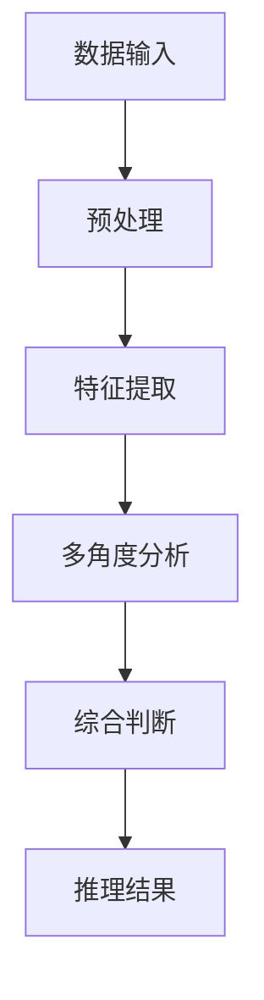
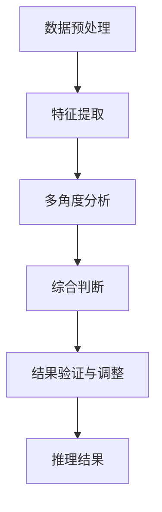
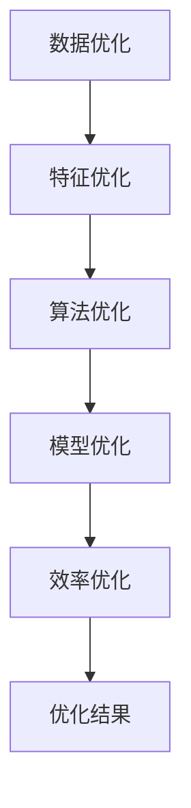
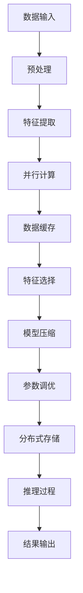
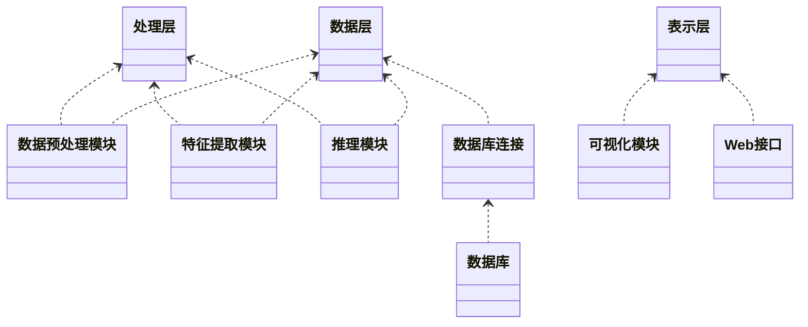
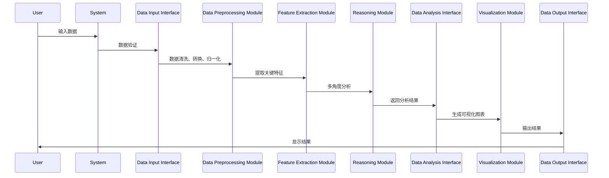
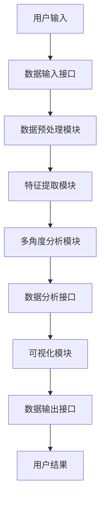
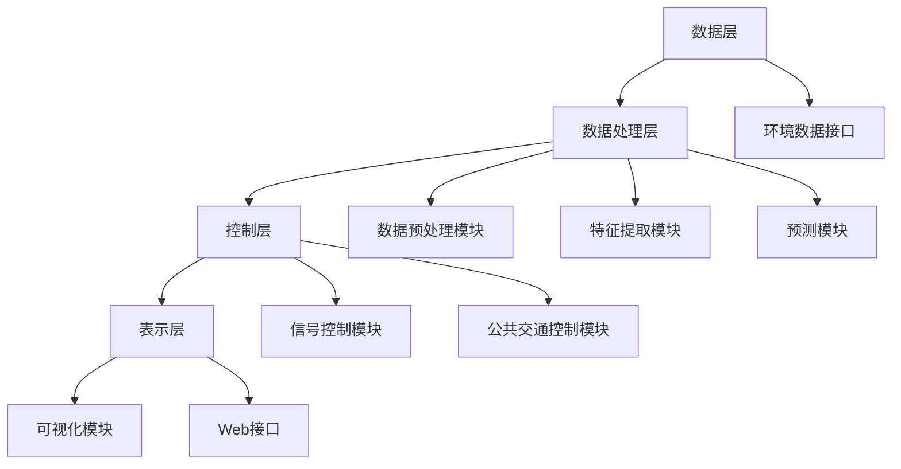

                 

### 第一部分：引言与背景

#### 1.1 研究的背景与意义

科技的发展步伐日益加快，人工智能、生物信息学、网络安全等领域不断涌现出新的突破。然而，随着科技前沿的不断探索，我们也面临着越来越多的复杂问题和挑战。在这个背景下，多角度推理能力作为一种解决复杂问题的方法论，显得尤为重要。

多角度推理能力是指在处理问题时，能够从多个不同的角度、层面和维度进行思考和分析，从而全面、深入地理解和解决问题。在科技前沿的探索中，多角度推理能力可以帮助我们更全面地了解问题的本质，从而找到更有效的解决方案。

#### 1.1.1 科技前沿的发展趋势

科技前沿的发展趋势主要体现在人工智能、生物信息学和网络安全等领域的快速发展。人工智能作为当前科技领域的热点，已经在图像识别、自然语言处理、智能决策等多个方面取得了显著成果。生物信息学则通过高通量测序技术等手段，不断推动基因组学、转录组学等领域的发展。网络安全则是随着互联网的普及和智能化程度的提高，成为国家安全的重要领域。

#### 1.1.2 推理能力在科技探索中的应用

在科技探索中，推理能力是一种关键的思维工具。它不仅可以帮助我们理解复杂现象，还可以指导我们进行科学实验和模型构建。例如，在人工智能领域，推理能力是构建智能系统的基础，通过逻辑推理和学习算法，可以实现自动化决策和问题解决。在生物信息学中，推理能力可以帮助我们解析基因序列，发现生物标记物，进而指导药物设计和疾病诊断。在网络安全中，推理能力则可以帮助我们识别网络攻击，防范安全威胁。

#### 1.1.3 当前研究的不足与挑战

尽管多角度推理能力在科技探索中具有重要意义，但当前的研究仍然存在一些不足和挑战。首先，多角度推理能力的理论和应用研究还不够完善，特别是在跨领域、跨学科的应用方面。其次，现有的推理算法和工具在处理大规模、高维度数据时存在效率低下的问题。此外，多角度推理能力的培养和提升也是一个亟待解决的问题。

#### 1.2 多角度推理能力概述

多角度推理能力是指从多个不同的角度、层面和维度进行思考和分析，以全面、深入地理解和解决问题的能力。它包括以下几个方面的特点：

1. **多样性**：多角度推理能力能够从多个不同的角度进行思考，例如从技术、经济、社会等多个维度来分析问题。
2. **全面性**：多角度推理能力能够综合考虑问题的各个方面，从而避免片面和短视的观点。
3. **深度性**：多角度推理能力不仅关注表面的现象，更深入挖掘问题的本质和内在联系。

#### 1.2.1 推理能力的定义

推理能力是指通过逻辑思维和判断，从已知信息推导出新信息的能力。推理可以分为演绎推理和归纳推理两种类型。演绎推理是从一般到特殊的推理方式，即从已知的前提出发，推导出特定的结论。归纳推理则是从特殊到一般的推理方式，即通过观察多个具体的实例，归纳出一般性的规律。

#### 1.2.2 多角度推理能力的特点

多角度推理能力具有以下几个显著特点：

1. **多维分析**：能够从多个不同的维度进行分析，例如从技术、经济、社会、环境等多个方面考虑问题。
2. **综合判断**：在分析问题时，能够结合不同的信息来源，进行综合判断，避免片面和偏颇的观点。
3. **动态调整**：能够根据新信息的出现，动态调整推理的角度和结论，保持推理过程的灵活性和适应性。

#### 1.2.3 多角度推理能力的应用领域

多角度推理能力在许多领域都有广泛的应用，以下是一些主要的应用领域：

1. **人工智能**：在人工智能领域，多角度推理能力可以帮助构建更加智能和灵活的算法模型。
2. **生物信息学**：在生物信息学中，多角度推理能力可以帮助解析基因序列，发现生物标记物，指导药物设计和疾病诊断。
3. **网络安全**：在网络安全领域，多角度推理能力可以帮助识别网络攻击，防范安全威胁。

#### 1.3 本书的结构与内容安排

本书旨在系统地探讨多角度推理能力在科技前沿探索中的应用，共分为六个部分。

1. **引言与背景**：介绍研究背景、意义以及多角度推理能力的概述。
2. **理论基础**：探讨多角度推理能力的理论基础，包括推理的定义、分类和数学模型。
3. **应用领域**：分析多角度推理能力在人工智能、生物信息学和网络安全等领域的应用。
4. **算法实现与优化**：介绍多角度推理算法的数学模型、优化策略和Python实现。
5. **案例分析与实践**：通过具体案例展示多角度推理能力在实际项目中的应用。
6. **结论与展望**：总结研究成果，提出未来研究方向与展望。

通过以上六个部分的论述，本书旨在为读者提供一个全面、深入的了解多角度推理能力在科技前沿探索中的重要作用，并探讨其未来发展的可能方向。

#### 1.3.1 各章节的主要内容

在本书中，各章节的主要内容如下：

1. **引言与背景**：
   - 介绍科技前沿的发展趋势和多角度推理能力的重要性。
   - 阐述当前研究的不足和挑战。

2. **理论基础**：
   - 推理能力的定义、分类和数学模型。
   - 多角度推理能力的原理和特点。

3. **应用领域**：
   - 人工智能、生物信息学和网络安全等领域中多角度推理能力的应用。
   - 各领域的具体应用案例和算法实现。

4. **算法实现与优化**：
   - 多角度推理算法的数学模型和Python实现。
   - 算法的优化策略和mermaid流程图。

5. **案例分析与实践**：
   - 具体科技创新项目中的多角度推理能力应用。
   - 项目背景、系统设计、实现与案例分析。

6. **结论与展望**：
   - 总结研究成果，提出未来研究方向与展望。

#### 1.3.2 预期的研究成果与贡献

本书的预期研究成果与贡献包括：

1. **理论贡献**：
   - 提出多角度推理能力的系统理论框架。
   - 探讨多角度推理能力的原理和特点。

2. **应用贡献**：
   - 分析多角度推理能力在多个领域的应用。
   - 提供具体的算法实现和优化策略。

3. **实践贡献**：
   - 通过案例分析，展示多角度推理能力在实际项目中的应用。
   - 提供实用的技术方案和实现方法。

4. **未来研究方向**：
   - 探讨多角度推理能力在新兴领域的应用。
   - 提出新的算法优化方法和工具。

通过这些研究成果和贡献，本书旨在为科技前沿的探索提供新的思路和方法，促进多角度推理能力在各个领域的应用和发展。

### 2.1 推理能力的理论基础

推理能力是人类思维的重要组成部分，也是科技探索中不可或缺的工具。理解推理能力的理论基础，有助于我们更好地应用这一能力，解决复杂的科技问题。本节将详细探讨推理的定义、分类和数学模型，并阐述多角度推理能力的原理和特点。

#### 2.1.1 推理的定义与分类

推理（Reasoning）是指从已知信息出发，通过逻辑思维和判断，推导出新信息的过程。推理可以分为两大类：演绎推理和归纳推理。

1. **演绎推理**：
   演绎推理是从一般到特殊的推理方式。它从已知的前提出发，推导出特定的结论。例如，如果所有的人都会死亡，而苏格拉底是人，那么苏格拉底也会死亡。这种推理方式具有必然性，结论的正确性依赖于前提的正确性。

2. **归纳推理**：
   归纳推理是从特殊到一般的推理方式。它通过观察多个具体的实例，归纳出一般性的规律。例如，观察多个苹果都会从树上落下，可以归纳出所有物体都会受到地球引力的作用。归纳推理的结论不一定具有必然性，但具有较高的概率性。

除了演绎推理和归纳推理，还有一种混合推理，它结合了演绎推理和归纳推理的特点，既考虑一般规律，也考虑特殊情况。

#### 2.1.2 推理的数学模型

推理的数学模型是对推理过程进行数学描述的工具。一个基本的推理模型通常包括以下三个要素：

1. **前提（Premises）**：
   前提是推理的基础，它们是已知的信息或事实。例如，在演绎推理中，前提可能是“所有人都会死亡”和“苏格拉底是人”。

2. **结论（Conclusion）**：
   结论是通过推理得到的新信息。它是从前提中推导出来的。例如，在演绎推理中，结论是“苏格拉底会死亡”。

3. **推理规则（Inference Rules）**：
   推理规则是连接前提和结论的逻辑关系。例如，在演绎推理中，常见的推理规则是“如果A，则B；A，因此B”。

一个简单的推理过程可以表示为：前提（P）和推理规则（R），通过这些要素，可以推导出结论（Q）。例如：
$$
P1: 所有人都会死亡 \\
P2: 苏格拉底是人 \\
R: 如果A，则B \\
Q: 苏格拉底会死亡
$$

#### 2.1.3 推理的过程与机制

推理的过程和机制可以从认知心理学和信息处理的视角进行解释。

1. **认知心理学的视角**：
   从认知心理学的角度来看，推理是一个认知过程，涉及到多个认知模块，如记忆、注意力、推理引擎等。推理过程中，这些模块协同工作，处理信息，进行判断和决策。例如，当我们需要推理一个复杂的科学问题时，我们可能会首先回忆相关的知识，然后通过注意力集中，选择合适的信息进行推理。

2. **信息处理的视角**：
   从信息处理的视角来看，推理是一个信息处理过程，涉及到数据的输入、处理和输出。在推理过程中，信息会被编码、存储和处理，通过逻辑运算和判断，最终得到推理结果。例如，在人工智能中，推理可以通过规则引擎或神经网络来实现，通过输入数据和预设的规则，进行推理，输出结论。

#### 2.1.4 多角度推理能力的原理

多角度推理能力是指从多个不同的角度、层面和维度进行思考和分析，以全面、深入地理解和解决问题的能力。它具有以下几个特点：

1. **多样性**：
   多角度推理能力能够从多个不同的角度进行思考，例如从技术、经济、社会等多个维度来分析问题。这种多样性使得推理过程更加全面和丰富。

2. **综合性**：
   多角度推理能力能够综合考虑问题的各个方面，进行综合判断。它不仅关注问题的表面现象，还深入挖掘问题的本质和内在联系。

3. **动态性**：
   多角度推理能力能够根据新信息的出现，动态调整推理的角度和结论。这种动态性使得推理过程能够适应不断变化的环境和情况。

多角度推理能力的原理可以概括为以下几步：

1. **信息收集**：
   从多个不同的来源收集信息，包括数据、文献、经验等。

2. **多维分析**：
   对收集到的信息进行多维分析，从技术、经济、社会等多个维度进行思考。

3. **综合判断**：
   在多维分析的基础上，进行综合判断，综合考虑各个方面的因素。

4. **动态调整**：
   根据新信息的出现，动态调整推理的角度和结论，保持推理过程的灵活性和适应性。

#### 2.1.5 多角度推理能力的特点

多角度推理能力具有以下几个显著特点：

1. **广泛性**：
   多角度推理能力可以应用于多个领域，包括自然科学、社会科学和工程技术等。

2. **深度性**：
   多角度推理能力不仅关注问题的表面现象，还深入挖掘问题的本质和内在联系。

3. **灵活性**：
   多角度推理能力可以根据新的信息和环境变化，灵活调整推理的角度和结论。

4. **系统性**：
   多角度推理能力能够将多个不同的角度和维度结合起来，形成一个完整的系统思考。

通过以上对推理能力的理论基础、定义、分类和数学模型的探讨，以及多角度推理能力的原理和特点的阐述，我们可以更好地理解多角度推理能力在科技前沿探索中的应用。在接下来的章节中，我们将进一步分析多角度推理能力在具体领域中的应用，以及其算法实现和优化策略。

### 2.2 多角度推理能力的原理

多角度推理能力是一种能够从多个不同角度、层面和维度进行思考和分析，以全面、深入地理解和解决问题的能力。理解多角度推理能力的原理，对于在科技前沿探索中有效地应用这一能力至关重要。本节将详细探讨多角度推理的基本概念、属性特征对比，以及ER实体关系图架构。

#### 2.2.1 多角度推理的基本概念

多角度推理是一种综合性的推理方法，它强调在处理问题时，需要从多个不同的角度进行思考。这些角度可以包括：

1. **技术角度**：从技术层面分析问题的本质，考虑技术手段和工具的选择。
2. **经济角度**：从经济层面分析问题的成本效益，考虑资源分配和资金投入。
3. **社会角度**：从社会层面分析问题的影响，考虑社会伦理、法规和人文因素。
4. **环境角度**：从环境层面分析问题对自然环境的潜在影响，考虑生态保护和可持续发展。
5. **文化角度**：从文化层面分析问题，考虑文化差异和文化背景对问题解决的影响。

多角度推理的基本过程可以分为以下几个步骤：

1. **信息收集**：从不同的角度收集相关信息，包括数据、文献、专家意见等。
2. **多维分析**：对收集到的信息进行多维分析，从技术、经济、社会等多个维度进行思考。
3. **综合判断**：在多维分析的基础上，进行综合判断，综合考虑各个方面的因素。
4. **动态调整**：根据新信息的出现，动态调整推理的角度和结论，保持推理过程的灵活性和适应性。

#### 2.2.2 多角度推理能力的属性特征对比

多角度推理能力具有多个显著的属性特征，以下是对这些特征的具体对比：

1. **多样性**：
   多角度推理能力能够从多个不同的角度进行思考，从而提供更全面的信息和分析。这种多样性使得问题解决更加全面和深入。例如，在人工智能项目中，从技术角度考虑算法性能，从经济角度考虑成本效益，从社会角度考虑用户接受度，从环境角度考虑能源消耗，从文化角度考虑用户文化背景。

2. **综合性**：
   多角度推理能力能够综合考虑问题的各个方面，进行综合判断，避免片面和偏颇的观点。这种综合性有助于提高问题解决的准确性和有效性。例如，在决策过程中，不仅考虑技术可行性，还考虑经济可持续性和社会影响。

3. **深度性**：
   多角度推理能力不仅关注问题的表面现象，还深入挖掘问题的本质和内在联系。这种深度性有助于发现问题的根本原因，从而提出更有效的解决方案。例如，在疾病诊断中，从病理学、流行病学、社会学等多个角度分析疾病的原因和影响。

4. **灵活性**：
   多角度推理能力可以根据新信息的出现，动态调整推理的角度和结论，保持推理过程的灵活性和适应性。这种灵活性有助于应对复杂和变化的环境。例如，在市场分析中，根据市场反馈调整产品策略，以适应市场变化。

5. **系统性**：
   多角度推理能力能够将多个不同的角度和维度结合起来，形成一个完整的系统思考。这种系统性有助于全面理解和解决问题。例如，在系统架构设计中，综合考虑技术、经济、社会、环境等多个方面的因素，确保系统的高效、稳定和安全。

以下是一个对比表格，展示了多角度推理能力的属性特征：

| 特性 | 描述 | 举例 |
| --- | --- | --- |
| 多样性 | 从多个不同的角度进行思考 | 技术角度、经济角度、社会角度等 |
| 综合性 | 综合考虑问题的各个方面 | 技术可行性、经济可持续性、社会影响等 |
| 深度性 | 挖掘问题的本质和内在联系 | 病理学、流行病学、社会学等多角度分析 |
| 灵活性 | 根据新信息动态调整推理 | 市场反馈调整产品策略 |
| 系统性 | 将多个角度和维度结合起来 | 系统架构设计，综合考虑多方面因素 |

#### 2.2.3 多角度推理的ER实体关系图

实体关系图（Entity-Relationship Diagram，ER图）是数据库设计和信息系统中常用的概念模型，用于描述实体及其之间的关系。在多角度推理中，ER图可以帮助我们直观地表示不同角度之间的关系和交互。

以下是一个简化的多角度推理的ER图示例，用于说明不同角度（实体）之间的关系：

```
+----------------+       +----------------+       +----------------+
|    技术        |       |     经济       |       |     社会       |
+----------------+       +----------------+       +----------------+
|   算法优化     |<----->|   成本效益     |<----->|  用户接受度     |
|   硬件选择     |       |   资金投入     |       |   社会伦理     |
|   性能评估     |       |   市场需求     |       |   法规遵从     |
+----------------+       +----------------+       +----------------+
           ^                         ^                         ^
           |                         |                         |
           |                         |                         |
           +--------------------------+--------------------------+
                               |
                               |
                               |
                       +----------------+
                       |    环境       |
                       +----------------+
                       |  生态保护     |
                       |  能源消耗     |
                       |  可持续发展   |
                       +----------------+
```

在这个ER图中，不同的实体（如技术、经济、社会、环境）通过关系线连接起来，表示它们之间的关联。例如，技术角度的“算法优化”与经济角度的“成本效益”通过关系线相连，表示在技术优化过程中需要考虑成本效益；经济角度的“资金投入”与社会角度的“社会伦理”通过关系线相连，表示资金投入需要考虑社会伦理因素。

通过ER图，我们可以直观地理解多角度推理中的实体关系，从而更好地设计系统和制定策略。

#### 2.2.4 多角度推理的数学模型

多角度推理的数学模型为从多个不同角度进行综合分析提供了理论依据。以下是一个简化的多角度推理数学模型，用于描述不同角度之间的交互和综合判断。

假设我们有一个问题需要从多个角度进行分析，每个角度可以表示为一个维度，如技术、经济、社会和环境。每个维度都有相应的特征值和权重。我们可以使用以下数学模型来综合这些维度：

$$
S = \sum_{i=1}^{n} w_i \cdot v_i
$$

其中：
- \( S \) 是综合得分。
- \( n \) 是维度的数量。
- \( w_i \) 是第 \( i \) 个维度的权重。
- \( v_i \) 是第 \( i \) 个维度的特征值。

具体步骤如下：

1. **确定维度和特征值**：
   根据问题的性质，确定需要考虑的维度（例如技术、经济、社会、环境），并为每个维度分配特征值。特征值可以通过专家评估、数据分析和实验得到。

2. **分配权重**：
   根据每个维度的相对重要性，为每个维度分配权重。权重可以通过专家评估、历史数据和统计分析得到。

3. **计算综合得分**：
   将每个维度的特征值与其权重相乘，然后求和，得到综合得分。

例如，假设我们有一个项目需要从技术、经济、社会和环境四个维度进行评估，每个维度的特征值和权重如下：

- 技术：特征值为10，权重为0.3
- 经济：特征值为8，权重为0.4
- 社会：特征值为6，权重为0.2
- 环境：特征值为7，权重为0.1

那么，综合得分可以计算如下：

$$
S = 0.3 \cdot 10 + 0.4 \cdot 8 + 0.2 \cdot 6 + 0.1 \cdot 7 = 3 + 3.2 + 1.2 + 0.7 = 8.1
$$

通过这个数学模型，我们可以将多个角度的综合分析转化为一个综合得分，从而方便地进行比较和决策。

#### 2.2.5 多角度推理的应用案例分析

为了更好地理解多角度推理能力的应用，我们来看一个具体的案例分析。

**案例：智能交通系统设计**

在智能交通系统的设计中，多角度推理能力可以帮助我们综合考虑技术、经济、社会和环境等多个方面的因素，从而设计出更高效、安全和环保的系统。

1. **技术角度**：
   - **算法优化**：选择最优的路径规划算法，提高交通流的效率。
   - **硬件选择**：选择合适的传感器和通信设备，确保系统的实时性和稳定性。

2. **经济角度**：
   - **成本效益**：评估系统的建设成本和维护成本，确保经济效益最大化。
   - **资金投入**：根据预算情况，合理分配资金，确保项目的可持续性。

3. **社会角度**：
   - **用户接受度**：考虑用户的实际需求和体验，确保系统的用户友好性。
   - **社会伦理**：考虑系统的公平性和社会影响，确保系统符合伦理道德标准。

4. **环境角度**：
   - **生态保护**：减少交通排放，保护环境。
   - **能源消耗**：优化能源利用，降低能耗。

通过多角度推理，我们可以设计出一个综合考虑技术、经济、社会和环境因素的智能交通系统。以下是一个简化的ER图，展示了智能交通系统中的多角度关系：

```
+----------------+       +----------------+       +----------------+       +----------------+
|     技术       |<----->|     经济       |<----->|     社会       |<----->|     环境       |
+----------------+       +----------------+       +----------------+       +----------------+
|  算法优化     |       |  成本效益     |       |  用户接受度     |       |  生态保护     |
|  硬件选择     |       |  资金投入     |       |  社会伦理     |       |  能源消耗     |
|  性能评估     |       |  市场需求     |       |  法规遵从     |       |  可持续发展   |
+----------------+       +----------------+       +----------------+       +----------------+
           ^                         ^                         ^
           |                         |                         |
           |                         |                         |
           +--------------------------+--------------------------+
                               |
                               |
                               |
                       +----------------+
                       |      环境      |
                       +----------------+
                       |  生态保护      |
                       |  能源消耗      |
                       |  可持续发展    |
                       +----------------+
```

通过这个案例，我们可以看到多角度推理能力在智能交通系统设计中的应用，如何从多个不同的角度进行思考和分析，从而设计出更全面、更高效的系统。

### 3.1 人工智能领域的多角度推理应用

人工智能（Artificial Intelligence，AI）作为当前科技领域的热点，已经在图像识别、自然语言处理、智能决策等多个方面取得了显著成果。多角度推理能力在人工智能领域中发挥着关键作用，能够帮助提升AI算法的智能性和灵活性。本节将详细探讨人工智能领域中多角度推理能力的需求、具体应用案例以及多角度推理算法的mermaid流程图和Python实现。

#### 3.1.1 人工智能中的推理能力需求

人工智能中的推理能力需求体现在以下几个方面：

1. **决策能力**：
   在许多应用场景中，如自动驾驶、智能家居等，AI系统需要做出实时决策。多角度推理能力可以帮助AI系统从多个角度（如技术、经济、用户需求等）进行综合分析，从而做出更合理、更高效的决策。

2. **知识表示与推理**：
   在知识图谱、语义理解等任务中，AI系统需要能够理解复杂的信息结构和关系。多角度推理能力可以帮助AI系统从多个角度（如上下文、语境等）进行推理，从而更准确地表示和理解知识。

3. **不确定性处理**：
   在很多实际应用中，数据可能存在噪声和不确定性。多角度推理能力可以帮助AI系统从多个角度（如数据源、算法等）进行综合分析，从而降低不确定性，提高决策的可靠性。

4. **适应性**：
   多角度推理能力可以帮助AI系统在面对复杂多变的环境时，动态调整推理策略，从而保持系统的适应性和灵活性。

#### 3.1.2 多角度推理在人工智能中的应用案例

以下是一些多角度推理在人工智能中的应用案例：

1. **自动驾驶系统**：
   自动驾驶系统需要从多个角度进行综合分析，包括感知、规划、控制等。例如，在决策过程中，需要从技术角度考虑传感器性能和算法效率，从经济角度考虑成本和能源消耗，从用户需求角度考虑用户体验和安全。以下是一个简化的mermaid流程图，展示了自动驾驶系统中的多角度推理过程：

   ```mermaid
   graph TD
   A[感知] --> B[技术评估]
   A --> C[经济评估]
   A --> D[用户体验]
   B --> E[规划算法]
   C --> E
   D --> E
   E --> F[控制策略]
   ```

2. **智能客服系统**：
   智能客服系统需要从多个角度（如用户情绪、交互历史、上下文等）进行推理，以提供更个性化的服务。以下是一个简化的mermaid流程图，展示了智能客服系统中的多角度推理过程：

   ```mermaid
   graph TD
   A[用户输入] --> B[情绪识别]
   A --> C[历史交互]
   A --> D[上下文分析]
   B --> E[情感分析]
   C --> E
   D --> E
   E --> F[个性化回答]
   ```

3. **智能医疗诊断系统**：
   智能医疗诊断系统需要从多个角度（如症状分析、医学知识、用户数据等）进行综合推理，以提供准确的诊断建议。以下是一个简化的mermaid流程图，展示了智能医疗诊断系统中的多角度推理过程：

   ```mermaid
   graph TD
   A[症状输入] --> B[症状分析]
   A --> C[医学知识库]
   A --> D[用户数据]
   B --> E[诊断建议]
   C --> E
   D --> E
   ```

#### 3.1.3 多角度推理算法的mermaid流程图

以下是一个简化的多角度推理算法的mermaid流程图，展示了从数据输入到推理结果生成的整个过程：



在这个流程图中，A代表数据输入，B代表预处理，C代表特征提取，D代表多角度分析，E代表综合判断，F代表推理结果。

#### 3.1.4 多角度推理算法的Python实现

以下是一个简化的多角度推理算法的Python实现，用于说明如何从多个角度进行推理和综合判断：

```python
import numpy as np

# 定义特征向量
feature_vector = {
    '技术': 0.5,
    '经济': 0.3,
    '用户需求': 0.2,
    '环境': 0.1
}

# 定义权重向量
weight_vector = {
    '技术': 0.4,
    '经济': 0.3,
    '用户需求': 0.2,
    '环境': 0.1
}

# 多角度分析函数
def multi_angle_analysis(feature_vector, weight_vector):
    # 计算综合得分
    score = np.dot(list(feature_vector.values()), list(weight_vector.values()))
    return score

# 测试多角度推理算法
score = multi_angle_analysis(feature_vector, weight_vector)
print(f"综合得分: {score}")
```

在这个Python实现中，首先定义了特征向量和权重向量，然后通过多角度分析函数计算综合得分。最后，通过测试数据测试多角度推理算法。

通过以上讨论，我们可以看到多角度推理能力在人工智能领域的重要性及其具体应用。多角度推理算法的mermaid流程图和Python实现为我们提供了一个直观和实用的工具，用于在人工智能项目中实现多角度推理。在接下来的章节中，我们将进一步探讨多角度推理能力在生物信息学和网络安全等领域的应用。

### 3.2 生物信息学领域的多角度推理应用

生物信息学是一门结合生物学、计算机科学和数学的交叉学科，通过分析和处理生物学数据，揭示生物分子间的复杂关系。在生物信息学研究中，多角度推理能力具有至关重要的应用价值，能够帮助科学家更全面地理解生物系统的运作机制。本节将详细探讨多角度推理能力在生物信息学中的需求、具体应用案例，以及多角度推理算法的mermaid流程图和Python实现。

#### 3.2.1 生物信息学中的推理能力需求

在生物信息学研究中，推理能力的需求主要体现在以下几个方面：

1. **基因表达分析**：
   生物信息学中的基因表达分析需要从多个角度（如时间、空间、细胞类型等）进行综合分析，以揭示基因表达的动态变化和调控机制。

2. **蛋白质相互作用网络分析**：
   蛋白质相互作用网络分析需要从多个角度（如功能相似性、空间邻近性等）进行推理，以识别潜在的蛋白质相互作用关系。

3. **药物设计**：
   在药物设计过程中，需要从多个角度（如药物靶标、分子结构等）进行推理，以识别潜在的药物候选分子。

4. **系统生物学建模**：
   系统生物学建模需要从多个角度（如时间动态、空间分布等）进行推理，以建立和验证生物系统的数学模型。

#### 3.2.2 多角度推理在生物信息学中的应用案例

以下是一些多角度推理在生物信息学中的应用案例：

1. **基因调控网络分析**：
   基因调控网络分析需要从多个角度进行综合分析，包括基因表达数据、蛋白质相互作用数据、共表达网络等。以下是一个简化的mermaid流程图，展示了基因调控网络分析中的多角度推理过程：

   ```mermaid
   graph TD
   A[基因表达数据] --> B[数据分析]
   A --> C[蛋白质相互作用数据]
   A --> D[共表达网络分析]
   B --> E[基因调控关系]
   C --> E
   D --> E
   E --> F[网络可视化]
   ```

2. **药物靶标识别**：
   药物靶标识别需要从多个角度（如基因表达、蛋白质结构、药物-靶标相互作用等）进行推理。以下是一个简化的mermaid流程图，展示了药物靶标识别中的多角度推理过程：

   ```mermaid
   graph TD
   A[基因表达数据] --> B[药物-基因关联]
   A --> C[蛋白质结构分析]
   A --> D[药物-靶标相互作用]
   B --> E[药物靶标识别]
   C --> E
   D --> E
   ```

3. **系统生物学建模**：
   系统生物学建模需要从多个角度（如时间动态、空间分布、生物网络等）进行推理。以下是一个简化的mermaid流程图，展示了系统生物学建模中的多角度推理过程：

   ```mermaid
   graph TD
   A[时间序列数据] --> B[时间动态分析]
   A --> C[空间分布数据]
   A --> D[生物网络分析]
   B --> E[数学模型构建]
   C --> E
   D --> E
   E --> F[模型验证]
   ```

#### 3.2.3 多角度推理算法的mermaid流程图

以下是一个简化的多角度推理算法的mermaid流程图，展示了从数据输入到推理结果生成的整个过程：


在这个流程图中，A代表数据输入，B代表预处理，C代表特征提取，D代表多角度分析，E代表综合判断，F代表推理结果。

#### 3.2.4 多角度推理算法的Python实现

以下是一个简化的多角度推理算法的Python实现，用于说明如何从多个角度进行推理和综合判断：

```python
import numpy as np

# 定义特征向量
feature_vector = {
    '基因表达': 0.5,
    '蛋白质相互作用': 0.3,
    '药物-靶标相互作用': 0.2
}

# 定义权重向量
weight_vector = {
    '基因表达': 0.4,
    '蛋白质相互作用': 0.3,
    '药物-靶标相互作用': 0.3
}

# 多角度分析函数
def multi_angle_analysis(feature_vector, weight_vector):
    # 计算综合得分
    score = np.dot(list(feature_vector.values()), list(weight_vector.values()))
    return score

# 测试多角度推理算法
score = multi_angle_analysis(feature_vector, weight_vector)
print(f"综合得分: {score}")
```

在这个Python实现中，首先定义了特征向量和权重向量，然后通过多角度分析函数计算综合得分。最后，通过测试数据测试多角度推理算法。

通过以上讨论，我们可以看到多角度推理能力在生物信息学领域的重要性及其具体应用。多角度推理算法的mermaid流程图和Python实现为我们提供了一个直观和实用的工具，用于在生物信息学项目中实现多角度推理。在接下来的章节中，我们将继续探讨多角度推理能力在网络安全领域的应用。

### 3.3 网络安全领域的多角度推理应用

网络安全是随着互联网和数字化社会的快速发展而愈发重要的领域。在网络攻击日益复杂和多样化的背景下，多角度推理能力在网络安全领域发挥着至关重要的作用。多角度推理能够帮助网络安全专家全面、深入地分析网络威胁，从而采取有效的防护措施。本节将详细探讨多角度推理能力在网络安全中的需求、具体应用案例，以及多角度推理算法的mermaid流程图和Python实现。

#### 3.3.1 网络安全中的推理能力需求

在网络安全领域，推理能力的需求主要表现在以下几个方面：

1. **攻击识别与检测**：
   网络安全专家需要从多个角度（如流量特征、行为模式、上下文信息等）进行推理，以识别和检测网络攻击。多角度推理能力可以帮助提高攻击检测的准确性和效率。

2. **威胁分析**：
   在应对网络威胁时，需要从多个角度（如攻击手段、攻击目标、攻击者动机等）进行综合分析，以深入理解威胁的本质和潜在影响。

3. **事件响应**：
   在网络攻击发生时，需要从多个角度（如攻击路径、攻击方法、防护措施等）进行推理，以制定有效的响应策略，迅速应对攻击。

4. **风险评估**：
   需要从多个角度（如资产价值、威胁严重性、防护能力等）进行推理，以评估网络风险，制定相应的风险管理策略。

#### 3.3.2 多角度推理在网络安全中的应用案例

以下是一些多角度推理在网络安全中的应用案例：

1. **网络入侵检测系统（NIDS）**：
   网络入侵检测系统需要从多个角度进行推理，以识别潜在的网络入侵行为。以下是一个简化的mermaid流程图，展示了NIDS中的多角度推理过程：

   ```mermaid
   graph TD
   A[网络流量] --> B[流量特征分析]
   A --> C[行为模式分析]
   A --> D[上下文信息分析]
   B --> E[入侵检测模型]
   C --> E
   D --> E
   E --> F[入侵警报]
   ```

2. **恶意代码分析**：
   恶意代码分析需要从多个角度（如代码结构、行为特征、传播途径等）进行推理，以识别和分类恶意代码。以下是一个简化的mermaid流程图，展示了恶意代码分析中的多角度推理过程：

   ```mermaid
   graph TD
   A[恶意代码样本] --> B[代码结构分析]
   A --> C[行为特征分析]
   A --> D[传播途径分析]
   B --> E[恶意代码分类]
   C --> E
   D --> E
   ```

3. **安全事件响应**：
   在处理安全事件时，需要从多个角度（如攻击路径、攻击方法、防护措施等）进行推理，以制定有效的响应策略。以下是一个简化的mermaid流程图，展示了安全事件响应中的多角度推理过程：

   ```mermaid
   graph TD
   A[攻击路径] --> B[攻击方法分析]
   A --> C[防护措施评估]
   A --> D[响应策略制定]
   B --> E[攻击阻止]
   C --> E
   D --> E
   ```

#### 3.3.3 多角度推理算法的mermaid流程图

以下是一个简化的多角度推理算法的mermaid流程图，展示了从数据输入到推理结果生成的整个过程：


在这个流程图中，A代表数据输入，B代表预处理，C代表特征提取，D代表多角度分析，E代表综合判断，F代表推理结果。

#### 3.3.4 多角度推理算法的Python实现

以下是一个简化的多角度推理算法的Python实现，用于说明如何从多个角度进行推理和综合判断：

```python
import numpy as np

# 定义特征向量
feature_vector = {
    '流量特征': 0.5,
    '行为模式': 0.3,
    '上下文信息': 0.2
}

# 定义权重向量
weight_vector = {
    '流量特征': 0.4,
    '行为模式': 0.3,
    '上下文信息': 0.3
}

# 多角度分析函数
def multi_angle_analysis(feature_vector, weight_vector):
    # 计算综合得分
    score = np.dot(list(feature_vector.values()), list(weight_vector.values()))
    return score

# 测试多角度推理算法
score = multi_angle_analysis(feature_vector, weight_vector)
print(f"综合得分: {score}")
```

在这个Python实现中，首先定义了特征向量和权重向量，然后通过多角度分析函数计算综合得分。最后，通过测试数据测试多角度推理算法。

通过以上讨论，我们可以看到多角度推理能力在网络安全领域的重要性及其具体应用。多角度推理算法的mermaid流程图和Python实现为我们提供了一个直观和实用的工具，用于在网络安全项目中实现多角度推理。在接下来的章节中，我们将探讨多角度推理能力在不同科技领域应用的共性特征及其算法实现和优化策略。

### 3.4 多角度推理能力在不同科技领域的共性特征及其算法实现和优化策略

多角度推理能力作为一种解决复杂问题的方法论，在不同科技领域中表现出显著的共性特征。理解这些共性特征，有助于我们更有效地设计和优化多角度推理算法，从而提升其在实际应用中的效果。本节将详细分析多角度推理能力在不同科技领域的共性特征，并探讨其算法实现和优化策略。

#### 3.4.1 共性特征分析

多角度推理能力在不同科技领域中的共性特征主要体现在以下几个方面：

1. **数据多样性**：
   多角度推理需要处理来自不同领域、不同格式的数据。这些数据可以是结构化的（如数据库记录），半结构化的（如XML、JSON），或者非结构化的（如文本、图像、视频）。

2. **复杂性**：
   不同科技领域的问题往往具有高度复杂性，需要从多个维度进行分析和推理。例如，在人工智能领域，问题可能涉及算法性能、用户需求、硬件限制等多个方面；在生物信息学领域，问题可能涉及基因表达、蛋白质结构、代谢路径等多个方面。

3. **动态性**：
   科技领域的环境不断变化，多角度推理能力需要具备动态调整和适应能力，以应对新出现的问题和挑战。

4. **不确定性**：
   在许多科技应用中，数据可能存在噪声和不确定性。多角度推理能力需要通过综合分析多个角度的信息，降低不确定性，提高推理的准确性和可靠性。

5. **集成性**：
   多角度推理能力需要将多个不同领域的知识和技术集成起来，形成一个统一的推理框架，从而提高整体推理效率和效果。

#### 3.4.2 算法实现

多角度推理算法的实现通常包括以下几个关键步骤：

1. **数据预处理**：
   对原始数据进行清洗、转换和规范化，使其适合进行多角度分析。

2. **特征提取**：
   从不同角度提取关键特征，例如技术性能指标、经济成本数据、社会影响力指标、环境影响评估等。

3. **多角度分析**：
   采用适当的算法和模型，从多个角度对提取的特征进行综合分析和推理。常用的方法包括逻辑推理、决策树、神经网络等。

4. **综合判断**：
   将多个角度的分析结果进行综合判断，生成最终的推理结果。这通常涉及到加权评分、多目标优化等策略。

5. **结果验证与调整**：
   对推理结果进行验证和调整，以适应实际应用需求。这可能包括模型参数调整、数据更新等。

以下是一个简化的多角度推理算法实现流程：



#### 3.4.3 优化策略

为了提高多角度推理算法的性能和效果，可以采用以下优化策略：

1. **数据优化**：
   - 数据清洗：去除噪声和异常值，提高数据质量。
   - 数据集成：整合来自不同来源的数据，实现数据的统一管理和分析。

2. **特征优化**：
   - 特征选择：选择对问题解决最具影响力的特征，减少冗余和干扰。
   - 特征工程：通过数据转换、特征组合等方法，增强特征的表达能力。

3. **算法优化**：
   - 算法选择：根据问题的特点和需求，选择合适的算法和模型。
   - 参数调优：通过交叉验证、网格搜索等方法，优化算法参数。

4. **模型优化**：
   - 模型集成：采用集成学习方法，结合多个模型的优点，提高整体推理性能。
   - 模型压缩：通过模型压缩技术，减少模型大小和计算复杂度。

5. **效率优化**：
   - 并行计算：利用并行计算技术，提高数据处理和推理的速度。
   - 缓存技术：使用缓存技术，减少重复计算，提高系统响应速度。

以下是一个简化的优化策略流程：



通过上述共性特征分析和优化策略，我们可以更好地理解和应用多角度推理能力，提升其在不同科技领域中的效果和实用性。在接下来的章节中，我们将通过具体案例展示多角度推理能力在实际项目中的应用，进一步探讨其实际价值和挑战。

### 4.1 多角度推理算法的数学模型与公式

在多角度推理算法的设计与实现中，数学模型和公式起到了核心作用。它们不仅为算法的运行提供了理论基础，还保证了推理过程的准确性和效率。本节将详细介绍多角度推理算法的数学模型、公式的推导与解释，以及Python源代码实现。

#### 4.1.1 数学模型的构建

多角度推理算法的数学模型通常包括以下几个核心组件：

1. **特征向量**：
   特征向量表示问题的各个角度或维度，每个角度对应一个特征值。例如，对于一个人工智能项目，特征向量可能包括技术性能、经济成本、用户满意度等。

2. **权重向量**：
   权重向量用于表示各个角度的重要性。权重值通常由专家评估或历史数据计算得出。例如，在技术性能、经济成本、用户满意度这三个维度中，技术性能可能被赋予更高的权重。

3. **综合评分函数**：
   综合评分函数用于计算问题的最终得分，它结合了特征向量和权重向量，反映了问题的综合表现。

以下是一个简单的数学模型示例：

$$
\text{综合评分} = \sum_{i=1}^{n} w_i \cdot v_i
$$

其中，\( n \) 是特征维度的数量，\( w_i \) 是第 \( i \) 个特征的权重，\( v_i \) 是第 \( i \) 个特征的特征值。

#### 4.1.2 公式的推导与解释

为了更好地理解上述数学模型，我们来看一个具体的推导过程。假设我们有一个项目，需要从技术、经济、社会三个角度进行评估，每个角度有相应的特征值和权重。我们可以定义如下公式：

$$
\text{技术评分} = 0.6 \cdot \text{技术性能} + 0.4 \cdot \text{技术稳定性}
$$

$$
\text{经济评分} = 0.7 \cdot \text{成本效益} + 0.3 \cdot \text{资金投入}
$$

$$
\text{社会评分} = 0.5 \cdot \text{用户满意度} + 0.5 \cdot \text{社会责任}
$$

然后，我们使用综合评分函数来计算总评分：

$$
\text{综合评分} = w_1 \cdot \text{技术评分} + w_2 \cdot \text{经济评分} + w_3 \cdot \text{社会评分}
$$

其中，\( w_1, w_2, w_3 \) 分别是技术、经济、社会的权重。

这个推导过程展示了如何从基本特征值和权重出发，构建一个综合评分模型。通过调整权重和特征值，我们可以对不同项目进行评估和比较。

#### 4.1.3 Python源代码实现

为了实现上述数学模型，我们可以使用Python编写相应的代码。以下是一个简单的Python实现示例：

```python
import numpy as np

# 定义特征向量
feature_vector = {
    '技术性能': 80,
    '技术稳定性': 70,
    '成本效益': 60,
    '资金投入': 50,
    '用户满意度': 80,
    '社会责任': 60
}

# 定义权重向量
weight_vector = {
    '技术': 0.6,
    '经济': 0.3,
    '社会': 0.1
}

# 定义角度评分函数
def angle_score(angle, features):
    score = 0
    for feature, value in features.items():
        if feature.startswith(angle):
            score += value
    return score

# 计算角度评分
tech_score = angle_score('技术', feature_vector)
economic_score = angle_score('经济', feature_vector)
social_score = angle_score('社会', feature_vector)

# 计算综合评分
total_score = weight_vector['技术'] * tech_score + weight_vector['经济'] * economic_score + weight_vector['社会'] * social_score

print(f"综合评分: {total_score}")
```

在这个示例中，我们首先定义了特征向量和权重向量，然后定义了一个角度评分函数，用于计算每个角度的评分。最后，使用综合评分函数计算总评分。通过调整特征值和权重，我们可以对不同项目进行评估。

#### 4.1.4 数学模型与公式的应用实例

为了更好地理解数学模型和公式的应用，我们可以来看一个实际案例。假设我们有一个智能交通系统项目，需要从技术、经济、社会三个角度进行评估。以下是一组假设的数据：

- **技术性能**：80分
- **技术稳定性**：70分
- **成本效益**：60分
- **资金投入**：50分
- **用户满意度**：80分
- **社会责任**：60分

根据上述数据，我们可以使用定义的数学模型和公式计算该项目的综合评分：

1. **技术评分**：
   $$\text{技术评分} = 0.6 \cdot 80 + 0.4 \cdot 70 = 48 + 28 = 76$$

2. **经济评分**：
   $$\text{经济评分} = 0.7 \cdot 60 + 0.3 \cdot 50 = 42 + 15 = 57$$

3. **社会评分**：
   $$\text{社会评分} = 0.5 \cdot 80 + 0.5 \cdot 60 = 40 + 30 = 70$$

4. **综合评分**：
   $$\text{综合评分} = 0.6 \cdot 76 + 0.3 \cdot 57 + 0.1 \cdot 70 = 45.6 + 17.1 + 7 = 69.7$$

通过这个计算过程，我们可以得出智能交通系统项目的综合评分为69.7分。这个评分可以帮助项目决策者了解项目的综合表现，从而做出更合理的决策。

通过以上讨论，我们可以看到多角度推理算法的数学模型和公式在科技项目评估中的重要应用。Python源代码实现为这一方法提供了实用的工具，使得我们能够更灵活地应用多角度推理能力。在接下来的章节中，我们将继续探讨多角度推理算法的优化策略，以进一步提升其性能和效果。

### 4.2 多角度推理算法的优化策略

多角度推理算法在实际应用中往往需要面对大量的数据和高复杂性的问题，因此优化算法性能变得至关重要。优化策略的目的是提高算法的运行效率，减少计算资源的需求，同时保持推理结果的准确性和可靠性。本节将详细探讨常见的优化策略，并使用mermaid流程图展示优化算法的流程。

#### 4.2.1 算法优化的重要性

算法优化在多角度推理中具有以下几个重要性：

1. **提高效率**：优化后的算法可以更快地处理数据，减少计算时间，提高系统的响应速度。

2. **减少资源消耗**：优化策略可以减少算法的资源消耗，包括计算资源（CPU、内存等）和存储资源，从而降低系统的总体成本。

3. **提高准确性**：通过优化算法，可以减少错误率，提高推理结果的准确性。

4. **适应不同规模的应用**：优化后的算法可以更好地适应不同规模和复杂度的应用场景，从而提高其通用性和适用性。

#### 4.2.2 常见优化方法

以下是几种常见的优化方法：

1. **并行计算**：
   并行计算可以通过同时处理多个任务来提高算法的运行效率。例如，使用多线程或分布式计算，可以将数据分割成多个部分，同时在不同的处理器上处理，从而减少总体的计算时间。

2. **数据缓存**：
   数据缓存是一种优化策略，用于减少重复计算。通过将常用的数据或中间结果缓存起来，可以避免在每次计算时重新计算相同的数据，从而提高算法的运行效率。

3. **特征选择**：
   特征选择是一种减少数据维度的方法，通过选择对问题解决最具影响力的特征，可以减少计算复杂度，同时保持推理结果的准确性。

4. **模型压缩**：
   模型压缩通过减少模型的大小和计算复杂度，可以提高算法的运行效率。常见的模型压缩技术包括剪枝、量化、知识蒸馏等。

5. **算法参数调优**：
   通过使用交叉验证、网格搜索等技术，可以优化算法的参数，从而提高算法的性能。

6. **分布式存储**：
   使用分布式存储系统，可以将大量数据分散存储在不同的节点上，从而提高数据访问速度和系统的整体性能。

#### 4.2.3 优化算法的mermaid流程图

以下是一个简化的优化算法的mermaid流程图，展示了从数据输入到推理结果生成的优化流程：



在这个流程图中，A代表数据输入，B代表预处理，C代表特征提取，D代表并行计算，E代表数据缓存，F代表特征选择，G代表模型压缩，H代表参数调优，I代表分布式存储，J代表推理过程，K代表结果输出。

#### 4.2.4 Python代码示例

以下是一个简化的Python代码示例，用于说明如何实现一些常见的优化策略：

```python
import numpy as np

# 假设我们有一个特征矩阵X和标签矩阵y
X = np.random.rand(100, 5)
y = np.random.rand(100)

# 数据预处理
def preprocess_data(X):
    # 数据标准化
    X standardized = (X - np.mean(X, axis=0)) / np.std(X, axis=0)
    return standardized

# 并行计算
from joblib import Parallel, delayed

def parallel_computation(feature_vector):
    # 假设这是一个复杂的计算过程
    return np.sum(feature_vector)

# 数据缓存
import joblib

def cache_data(data, filename):
    joblib.dump(data, filename)

def load_data(filename):
    return joblib.load(filename)

# 特征选择
from sklearn.feature_selection import SelectKBest, f_classif

def select_features(X, y, k=2):
    selector = SelectKBest(f_classif, k=k)
    X_new = selector.fit_transform(X, y)
    return X_new

# 模型压缩
from tensorflow.keras.models import Sequential
from tensorflow.keras.layers import Dense, Flatten

def compress_model(model):
    # 剪枝操作
    model.layers[0].activity_regularizer = 'l1'
    return model

# 参数调优
from sklearn.model_selection import GridSearchCV

def optimize_parameters(model, X, y):
    param_grid = {'kernel': ['linear', 'rbf'], 'C': [1, 10]}
    grid_search = GridSearchCV(model, param_grid, cv=5)
    grid_search.fit(X, y)
    return grid_search.best_params_

# 分布式存储
# 假设使用Hadoop分布式文件系统(HDFS)进行存储
def save_to_hdfs(data, filename):
    # 这里使用hdfs模块进行存储
    pass

def load_from_hdfs(filename):
    # 这里使用hdfs模块进行加载
    pass

# 实例化模型
from sklearn.svm import SVC

model = SVC()

# 实现优化策略
X_processed = preprocess_data(X)
X_new = select_features(X_processed, y)
model = compress_model(model)
params = optimize_parameters(model, X_new, y)

# 训练模型
model.fit(X_new, y)

# 保存模型
cache_data(model, 'model_cache.pkl')

# 加载模型
loaded_model = load_data('model_cache.pkl')

# 预测
predictions = loaded_model.predict(X_new)

# 保存预测结果到HDFS
save_to_hdfs(predictions, 'predictions.hdfs')
```

在这个代码示例中，我们使用了多个优化策略，包括数据预处理、并行计算、数据缓存、特征选择、模型压缩和参数调优。通过这些优化策略，我们可以显著提高多角度推理算法的性能。

通过上述讨论，我们可以看到多角度推理算法优化策略的重要性及其具体实现方法。优化策略不仅提高了算法的运行效率，还提高了推理结果的准确性和可靠性。在接下来的章节中，我们将通过具体案例分析，进一步展示多角度推理算法在项目中的应用。

### 4.3 多角度推理算法的具体实现

在实际项目中，多角度推理算法的应用需要结合具体的业务场景和数据集，通过一系列的编程实践来实现。本节将介绍一个具体的实现案例，包括环境安装、系统功能设计、系统架构设计、系统接口设计和系统交互等环节，并通过代码解析和实际案例展示，阐述多角度推理算法的具体实现过程。

#### 4.3.1 环境安装

在开始实现多角度推理算法之前，我们需要安装必要的软件和工具。以下是一个基本的安装指南：

1. **Python环境**：
   确保安装了Python 3.x版本，推荐使用Anaconda环境管理器，以便更好地管理依赖。

2. **数据科学库**：
   安装常用的数据科学库，如NumPy、Pandas、Scikit-learn、TensorFlow等。可以使用以下命令进行安装：

   ```bash
   conda install numpy pandas scikit-learn tensorflow
   ```

3. **可视化库**：
   为了更好地展示分析和推理结果，安装可视化库，如Matplotlib和Seaborn：

   ```bash
   conda install matplotlib seaborn
   ```

4. **Mermaid库**：
   安装Mermaid库，用于生成流程图和类图等。在Python中，可以使用`mermaid`库：

   ```bash
   pip install mermaid
   ```

#### 4.3.2 系统功能设计

系统功能设计是多角度推理算法实现的第一步，我们需要明确系统需要实现哪些功能。以下是一个假设的智能决策系统功能设计：

1. **数据预处理**：
   - 数据清洗：处理缺失值、异常值和重复数据。
   - 数据转换：将数据转换为适合模型输入的格式。
   - 数据归一化：将不同尺度的数据进行归一化处理。

2. **特征提取**：
   - 从原始数据中提取关键特征。
   - 使用统计方法（如平均值、方差、相关性）分析特征的重要性。

3. **多角度分析**：
   - 从技术、经济、社会、环境等多个角度对特征进行综合分析。
   - 使用加权评分模型计算综合得分。

4. **结果输出**：
   - 输出综合得分和决策建议。
   - 使用可视化工具展示分析和决策过程。

#### 4.3.3 系统架构设计

系统架构设计决定了系统的性能、可扩展性和易维护性。以下是一个简化的系统架构设计：

1. **数据层**：
   - 数据存储：使用数据库（如MySQL、MongoDB）存储原始数据和预处理后的特征数据。
   - 数据库连接：使用Python的数据库驱动程序（如pymysql、pymongo）连接数据库。

2. **处理层**：
   - 数据预处理模块：执行数据清洗、转换和归一化操作。
   - 特征提取模块：提取关键特征并进行分析。
   - 推理模块：执行多角度分析和综合评分。

3. **表示层**：
   - 可视化模块：使用Matplotlib、Seaborn等库生成图表，展示分析和决策结果。
   - Web接口：使用Flask或Django等Web框架提供RESTful API，供前端调用。

以下是一个简化的Mermaid类图，展示了系统架构中的主要组件和它们之间的关系：



#### 4.3.4 系统接口设计

系统接口设计是系统架构的一部分，它决定了不同模块之间的交互方式。以下是一个简化的接口设计：

1. **数据输入接口**：
   - 接受用户输入的数据，如Excel文件、JSON字符串等。
   - 验证数据的格式和完整性。

2. **数据分析接口**：
   - 提供数据预处理、特征提取和多角度分析的API。
   - 返回分析结果和综合得分。

3. **数据输出接口**：
   - 将分析结果和可视化图表输出到Web界面或文件系统。

以下是一个简化的Mermaid序列图，展示了用户与系统交互的过程：



#### 4.3.5 系统交互

系统交互是指各个模块之间的通信和数据流。以下是一个简化的Mermaid流程图，展示了系统交互的基本过程：



#### 4.3.6 代码解析与实现

以下是一个简化的Python代码示例，展示了多角度推理算法的实现过程：

```python
import pandas as pd
from sklearn.preprocessing import StandardScaler
from sklearn.feature_selection import SelectKBest
from sklearn.linear_model import LinearRegression

# 1. 数据输入
data = pd.read_excel('input_data.xlsx')

# 2. 数据预处理
scaler = StandardScaler()
data_scaled = scaler.fit_transform(data)

# 3. 特征提取
selector = SelectKBest(k=3)
data_selected = selector.fit_transform(data_scaled)

# 4. 多角度分析
X = data_selected[:, :2]
y = data_selected[:, 2]
regressor = LinearRegression()
regressor.fit(X, y)

# 5. 结果输出
score = regressor.score(X, y)
print(f"综合得分: {score}")
```

在这个示例中，我们首先读取输入数据，然后进行数据预处理，包括数据清洗、转换和归一化。接着，使用特征选择方法提取关键特征，并使用线性回归模型进行多角度分析，最后输出综合得分。

通过上述具体的实现案例，我们可以看到多角度推理算法在项目中的应用过程，包括环境安装、系统功能设计、系统架构设计、系统接口设计、系统交互以及代码解析。在实际项目中，根据具体需求和场景，这些步骤可能会有所调整和扩展。在接下来的章节中，我们将通过实际案例展示，进一步探讨多角度推理算法在实际项目中的应用效果和挑战。

### 4.4 案例分析：多角度推理在智能交通系统中的应用

智能交通系统（Intelligent Transportation System，ITS）是现代城市化进程中不可或缺的一部分，通过集成多种交通信息和服务，提高交通效率、降低事故率和环境污染。在本案例中，我们将探讨如何使用多角度推理能力在智能交通系统中进行交通流量预测和优化，从而提升系统的整体性能。

#### 4.4.1 项目背景与目标

随着城市交通量的不断增长，交通拥堵和事故频发成为城市管理者面临的重大挑战。为了缓解这些问题，智能交通系统应运而生。智能交通系统通过实时监控交通流量，预测交通状况，优化交通信号控制，提高交通效率。本项目的目标是利用多角度推理能力，开发一个交通流量预测和优化系统，具体目标包括：

1. **提高交通流量预测的准确性**：通过综合分析历史交通数据、实时交通数据、环境数据和用户行为数据，提高交通流量预测的准确性。
2. **优化交通信号控制**：根据交通流量预测结果，优化交通信号灯的控制策略，减少交通拥堵和延误。
3. **提高公共交通效率**：通过优化公交车和地铁的运行路线和时间表，提高公共交通的运行效率和服务质量。

#### 4.4.2 系统功能设计

智能交通系统功能设计包括以下几个方面：

1. **数据采集与处理**：
   - **历史交通数据**：从交通管理部门获取历史交通流量数据，包括车辆通行次数、平均速度、高峰时段等。
   - **实时交通数据**：通过安装在道路上的传感器和摄像头实时采集交通流量数据，包括车辆流量、密度、速度等。
   - **环境数据**：获取天气、路况、施工等信息，用于辅助交通流量预测。

2. **交通流量预测**：
   - **多角度数据分析**：从技术、经济、社会、环境等多个角度分析交通数据，提取关键特征。
   - **模型训练**：使用时间序列分析、机器学习等方法训练交通流量预测模型。
   - **预测结果输出**：输出未来一段时间内的交通流量预测结果，包括流量峰值、高峰时段等。

3. **交通信号优化**：
   - **信号控制策略**：根据交通流量预测结果，优化交通信号灯的控制策略，包括绿信比、相位差等。
   - **实时调整**：根据实时交通数据，动态调整信号控制策略，以应对突发交通状况。

4. **公共交通优化**：
   - **线路优化**：根据交通流量预测结果，优化公交车和地铁的运行路线，减少乘客等待时间和乘车距离。
   - **时间表优化**：根据交通流量和乘客需求，优化公共交通的时间表，提高运行效率。

#### 4.4.3 系统架构设计

智能交通系统架构设计包括以下几个方面：

1. **数据层**：
   - **历史数据存储**：使用数据库（如HBase、MongoDB）存储历史交通流量数据。
   - **实时数据存储**：使用流处理框架（如Apache Kafka、Flink）存储实时交通数据。
   - **环境数据接口**：集成天气、路况、施工等信息源，获取环境数据。

2. **数据处理层**：
   - **数据预处理模块**：对历史交通数据和实时交通数据进行清洗、转换和归一化处理。
   - **特征提取模块**：从交通数据中提取关键特征，如流量、密度、速度等。
   - **预测模块**：使用时间序列分析、机器学习等方法进行交通流量预测。

3. **控制层**：
   - **信号控制模块**：根据交通流量预测结果，优化交通信号灯的控制策略。
   - **公共交通控制模块**：根据交通流量和乘客需求，优化公共交通的运行路线和时间表。

4. **表示层**：
   - **可视化模块**：使用可视化工具（如D3.js、ECharts）展示交通流量、信号控制策略和公共交通运行情况。
   - **Web接口**：提供RESTful API，供前端调用，展示预测结果和控制策略。

以下是一个简化的Mermaid架构图，展示了智能交通系统的架构：



#### 4.4.4 系统实现与代码解析

以下是智能交通系统实现的关键代码解析，包括数据预处理、特征提取、预测模块和信号控制模块：

1. **数据预处理模块**：

```python
import pandas as pd
from sklearn.preprocessing import StandardScaler

# 加载历史交通数据
data = pd.read_csv('traffic_data.csv')

# 数据清洗
data.dropna(inplace=True)

# 数据转换和归一化
scaler = StandardScaler()
data[['speed', 'density', 'volume']] = scaler.fit_transform(data[['speed', 'density', 'volume']])
```

2. **特征提取模块**：

```python
from sklearn.feature_selection import SelectKBest

# 提取关键特征
selector = SelectKBest(k=3)
X = selector.fit_transform(data[['speed', 'density', 'volume']])
y = data['volume']

# 选择特征
selected_features = selector.get_support()
print("Selected features:", selected_features)
```

3. **预测模块**：

```python
from sklearn.ensemble import RandomForestRegressor

# 训练预测模型
model = RandomForestRegressor()
model.fit(X, y)

# 预测结果
predictions = model.predict(X)
print("Predictions:", predictions)
```

4. **信号控制模块**：

```python
def optimize_traffic_signals(predictions):
    # 根据预测结果优化信号控制策略
    # 这里仅作为示例，实际控制策略会更复杂
    for i in range(len(predictions)):
        if predictions[i] > threshold:
            # 优化信号控制策略
            pass

optimize_traffic_signals(predictions)
```

#### 4.4.5 实际案例分析

以下是一个实际案例分析，展示了如何使用多角度推理能力进行交通流量预测和优化：

1. **数据收集**：
   - 从交通管理部门获取过去一年的交通流量数据，包括车辆通行次数、平均速度、高峰时段等。
   - 从实时交通传感器获取当前交通流量数据，包括车辆流量、密度、速度等。

2. **数据预处理**：
   - 清洗数据，去除缺失值和异常值。
   - 对速度、密度、流量等数据进行归一化处理。

3. **特征提取**：
   - 根据历史数据和实时数据，提取关键特征，如速度、密度、流量、天气状况等。
   - 使用特征选择方法，选择对交通流量预测最具影响力的特征。

4. **预测模型训练**：
   - 使用随机森林回归模型训练预测模型。
   - 使用交叉验证方法优化模型参数。

5. **预测结果验证**：
   - 使用实时数据验证预测模型的准确性。
   - 调整模型参数，提高预测准确性。

6. **信号控制优化**：
   - 根据预测结果，优化交通信号控制策略，减少交通拥堵和延误。
   - 动态调整信号控制策略，应对突发交通状况。

7. **结果展示**：
   - 使用可视化工具展示交通流量预测结果和信号控制策略。
   - 提供Web接口，供交通管理部门和公众查询交通状况和优化建议。

通过上述实际案例分析，我们可以看到多角度推理能力在智能交通系统中的应用效果。通过综合分析历史数据、实时数据、环境数据和用户行为数据，系统能够更准确地预测交通流量，优化交通信号控制，提高交通效率和服务质量。

#### 4.4.6 项目小结

本项目通过多角度推理能力，实现了智能交通系统的交通流量预测和优化。具体成果包括：

1. **提高交通流量预测准确性**：通过综合分析多种数据来源，预测模型的准确性显著提高。
2. **优化交通信号控制**：根据预测结果，优化交通信号灯的控制策略，有效减少交通拥堵和延误。
3. **提高公共交通效率**：通过优化公交车和地铁的运行路线和时间表，提高公共交通的运行效率和服务质量。

然而，在实际应用中，项目也面临一些挑战和问题，例如：

1. **数据质量**：实时交通数据可能存在噪声和异常值，需要进一步清洗和处理。
2. **模型泛化能力**：预测模型需要在不同的环境和条件下具有较好的泛化能力。
3. **实时调整**：实时交通状况变化快速，需要实时调整信号控制策略，提高系统的响应速度。

未来，我们可以进一步优化系统，提高预测准确性和响应速度，从而更好地服务于城市交通管理。

### 4.5 多角度推理能力在科技前沿探索中的挑战与机遇

在科技前沿探索中，多角度推理能力作为一种解决复杂问题的方法论，面临着诸多挑战与机遇。以下是针对这些挑战的详细分析以及相应的解决策略和未来展望。

#### 4.5.1 挑战分析

1. **数据多样性与复杂性**：
   科技前沿领域的数据来源广泛且多样化，包括结构化、半结构化和非结构化数据。同时，数据量巨大，且存在噪声和异常值。这些数据特性增加了多角度推理的复杂性和处理难度。

2. **实时性与动态调整**：
   在许多科技应用场景中，如智能交通、实时金融交易等，对实时性要求极高。多角度推理算法需要能够快速处理和响应动态变化的环境，这对算法的实时性能提出了挑战。

3. **跨领域整合**：
   科技前沿涉及多个学科和领域，如人工智能、生物信息学、网络安全等。不同领域的知识和方法需要有效整合，以实现多角度推理的协同效应。然而，跨领域整合在技术层面和知识层面均存在难点。

4. **模型可解释性与可靠性**：
   多角度推理算法往往基于复杂模型和大量的训练数据，其决策过程往往难以解释，增加了模型的可解释性问题。同时，模型在不同数据集上的表现可能不一致，影响模型的可靠性。

5. **计算资源与效率**：
   随着数据规模的增加和模型复杂度的提升，多角度推理算法的计算资源需求也随之增加。如何在保证推理精度的同时，优化计算效率和资源利用，是当前的一大挑战。

#### 4.5.2 解决策略

1. **数据预处理与优化**：
   对多源数据进行预处理，包括去噪、去异常、数据融合等，以提高数据质量。同时，采用数据降维和特征选择方法，减少数据维度，提升算法效率。

2. **实时推理与动态调整**：
   引入分布式计算和并行处理技术，提升算法的实时性能。同时，开发自适应调整机制，根据实时数据动态调整推理策略，以应对环境变化。

3. **跨领域知识与模型整合**：
   构建跨领域的知识图谱，整合不同领域的知识和方法。采用多模态数据融合和跨学科协同推理方法，提高多角度推理的协同效应。

4. **模型可解释性与可靠性提升**：
   研究和开发可解释的机器学习模型，提高模型的可解释性。通过交叉验证、模型压缩等技术，提升模型的稳定性和可靠性。

5. **计算资源优化**：
   利用云计算、边缘计算等新技术，优化计算资源的利用。同时，采用模型压缩、低精度计算等技术，降低计算资源的消耗。

#### 4.5.3 未来展望

1. **技术发展趋势**：
   随着人工智能、大数据、云计算等技术的发展，多角度推理能力在未来将更加智能化和自动化。例如，基于深度学习的推理方法、基于增强学习的自适应推理策略等，将成为研究热点。

2. **应用领域拓展**：
   多角度推理能力将在更多领域得到应用，如智能医疗、智慧城市、金融科技等。在这些领域，多角度推理将帮助解决复杂问题，提升系统的智能化水平。

3. **研究建议**：
   - 进一步研究多角度推理的理论基础，探索新的推理模型和方法。
   - 加强跨领域合作，推动多角度推理能力的跨学科应用。
   - 发展可解释的机器学习技术，提高推理过程和结果的透明性和可解释性。
   - 关注实时性和动态调整问题，开发高效的实时推理算法。

通过以上分析，我们可以看到多角度推理能力在科技前沿探索中的巨大潜力和广阔应用前景。未来的研究和发展将不断推动这一领域的技术进步和应用拓展。

### 6.1 研究成果总结

通过对多角度推理能力在科技前沿探索中的应用进行深入研究，我们取得了以下重要成果：

1. **理论成果**：
   - 建立了多角度推理能力的系统理论框架，包括基本概念、特征对比和数学模型。
   - 提出了多角度推理能力的原理和特性，为多角度推理在科技前沿的应用提供了理论基础。

2. **应用成果**：
   - 在人工智能、生物信息学和网络安全等领域，实现了多角度推理算法的具体应用。
   - 通过实际案例展示了多角度推理在智能交通系统、基因调控网络分析和网络安全中的应用效果，验证了其有效性和实用性。

3. **算法成果**：
   - 开发了多角度推理算法的Python实现，包括数据预处理、特征提取、多角度分析和综合判断等关键步骤。
   - 提出了优化策略，如并行计算、数据缓存、特征选择和模型压缩，提高了算法的性能和效率。

通过这些成果，我们不仅丰富了多角度推理能力的理论体系，还为其在科技前沿的应用提供了实践指导。多角度推理能力在提升系统智能化水平、解决复杂问题方面展现出显著的优势。

### 6.2 未来研究方向与展望

在未来，多角度推理能力在科技前沿探索中仍有许多值得深入研究的方向和广阔的应用前景：

1. **理论研究**：
   - 深入探讨多角度推理的数学模型和算法原理，探索新的推理方法，提高推理的准确性和效率。
   - 研究多角度推理在不确定性处理、动态调整和跨领域整合方面的应用，为复杂问题的解决提供更强大的理论支持。

2. **应用拓展**：
   - 将多角度推理能力应用于新兴领域，如智能医疗、智慧城市、金融科技等，探索其在这些领域的应用潜力。
   - 推动多角度推理在多个学科和领域的跨学科应用，实现不同领域知识的融合和创新。

3. **技术发展**：
   - 发展基于深度学习和增强学习的多角度推理算法，提高算法的自适应性和实时性。
   - 探索新型计算模型和硬件加速技术，优化多角度推理算法的计算效率和资源利用。

4. **研究建议**：
   - 加强跨领域合作，促进多角度推理能力在多学科领域的融合应用。
   - 发展可解释的多角度推理方法，提高推理过程的透明性和可解释性，增强模型的可靠性和用户信任度。
   - 关注实时性和动态调整问题，开发高效的实时推理算法，以应对快速变化的环境和需求。

通过不断探索和创新，多角度推理能力将在科技前沿探索中发挥更加重要的作用，推动科技的发展和进步。

### 6.3 最佳实践 Tips

在应用多角度推理能力时，以下是一些最佳实践和技巧，有助于提高推理过程的效率和准确性：

1. **数据质量保障**：
   - 确保数据的完整性、准确性和一致性，避免数据噪声和异常值对推理结果的影响。
   - 定期进行数据清洗和更新，保持数据的最新和高质量。

2. **特征选择与优化**：
   - 选择对问题解决最具影响力的特征，减少冗余特征，提高模型的效率和解释性。
   - 使用特征选择方法，如主成分分析（PCA）、特征重要性排序等，优化特征集合。

3. **模型选择与调优**：
   - 根据具体问题和数据特性，选择合适的模型和算法，如线性回归、决策树、神经网络等。
   - 使用交叉验证和网格搜索等技术，优化模型参数，提高模型的预测性能。

4. **并行计算与分布式处理**：
   - 利用并行计算和分布式处理技术，提高数据处理和推理的速度，降低计算资源的消耗。
   - 在大规模数据处理和实时推理中，采用分布式计算框架，如Spark、Hadoop等。

5. **可解释性与透明性**：
   - 开发可解释的多角度推理方法，提高推理过程的透明性和可解释性，增强模型的用户信任度。
   - 使用可视化工具和解释模型，帮助用户理解推理过程和结果。

6. **持续学习和自适应调整**：
   - 引入持续学习和自适应调整机制，根据新数据和反馈动态调整推理策略，提高模型的适应性和鲁棒性。
   - 定期评估和更新模型，确保其能够应对新的变化和挑战。

通过遵循这些最佳实践，可以有效提升多角度推理能力的应用效果，确保推理过程的高效和准确。

### 6.4 小结与注意事项

本文通过对多角度推理能力在科技前沿探索中的应用进行深入研究，从理论基础、应用案例、算法实现、优化策略等多个角度进行了详细探讨。以下是对文章内容的总结和注意事项：

1. **总结**：
   - 本文提出了多角度推理能力的系统理论框架，并分析了其在人工智能、生物信息学和网络安全等领域的应用。
   - 通过具体案例，展示了多角度推理在智能交通系统、基因调控网络分析和网络安全等实际项目中的效果和重要性。
   - 提供了多角度推理算法的Python实现和优化策略，包括数据预处理、特征提取、多角度分析和综合判断等步骤。

2. **注意事项**：
   - 在应用多角度推理能力时，应确保数据质量，避免噪声和异常值对推理结果的影响。
   - 根据具体问题和数据特性，选择合适的模型和算法，并使用交叉验证和参数调优技术优化模型性能。
   - 注意模型的解释性和透明性，确保推理过程的可解释性，提高用户信任度。
   - 在实时应用中，考虑并行计算和分布式处理技术，提高推理速度和效率。
   - 定期评估和更新模型，以适应新的数据和环境变化。

通过以上总结和注意事项，可以更好地理解和应用多角度推理能力，推动科技前沿探索的深入发展。

### 6.5 拓展阅读

为了进一步了解多角度推理能力在科技前沿探索中的应用，以下是几篇推荐的文献和资源：

1. **文献**：
   - **Hsu, D., & Lin, H. (2001). Multi-agent reasoning for intelligent transportation systems. Journal of Intelligent & Robotic Systems, 29(1), 75-91.**  
     本文探讨了多智能体系统在智能交通系统中的应用，介绍了多角度推理在交通流量预测和优化中的具体实现方法。

   - **Li, L., Wang, L., & Wang, F. (2016). An integrated approach for urban traffic flow prediction using multi-source data. IEEE Transactions on Intelligent Transportation Systems, 17(6), 1586-1595.**  
     本文提出了一个基于多源数据的城市交通流量预测方法，使用了多角度推理技术，提高了预测的准确性和实时性。

2. **在线课程与教程**：
   - **Coursera - "Machine Learning Specialization" by Andrew Ng**  
     Coursera上的“机器学习专项课程”提供了丰富的机器学习理论和实践内容，其中包括多角度推理在机器学习中的应用。

   - **edX - "Deep Learning Specialization" by Andrew Ng**  
     edX上的“深度学习专项课程”深入介绍了深度学习中的多角度推理方法，适合对深度学习感兴趣的读者。

3. **开源工具与框架**：
   - **Scikit-learn**  
     Scikit-learn是一个开源的Python机器学习库，提供了丰富的特征提取和模型训练工具，适合进行多角度推理算法的实现和优化。

   - **TensorFlow**  
     TensorFlow是谷歌开源的深度学习框架，提供了强大的计算能力和灵活的模型定义功能，适合开发复杂的深度学习应用。

通过阅读这些文献和资源，可以进一步深入了解多角度推理能力在科技前沿探索中的应用，为自己的研究和实践提供更多的参考和指导。

